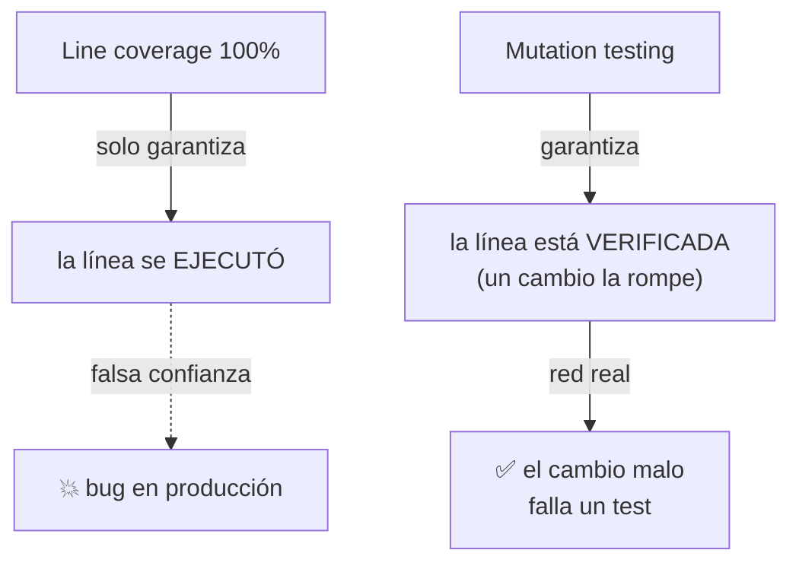

import Reto from "@components/Reto.astro";
import Solucion from "@components/Solucion.astro";
import Quiz from "@components/Quiz.astro";
import CheckDominio from "@components/CheckDominio.astro";
import Nivel from "@components/Nivel.astro";

<Nivel nivel="intermedio" />

En [`2.6`](/fase-2-ingenieria/2-6-testing-fundamentos/) aprendiste a escribir tests; en [`2.7`](/fase-2-ingenieria/2-7-tdd-obligatorio/) los pusiste a manejar tu diseño con red-green-refactor; en [`2.8`](/fase-2-ingenieria/2-8-diseno-de-tests/) aprendiste a diseñarlos bien. Esta lección responde la pregunta incómoda que viene después: **¿cómo sé si mis tests realmente prueban algo, o solo se ven bien en un reporte?** La respuesta destruye la métrica más citada y peor entendida de la industria —el **% de coverage**— y la reemplaza por dos que sí dicen la verdad: **mutation score** y **behavior coverage**.

Esto no es un detalle académico. "Apuntamos a 80% de coverage" es probablemente la regla de calidad más común en los equipos de software, y es un **antipatrón**: optimiza un número que se puede subir sin mejorar una sola prueba. Saber por qué —y qué medir en su lugar— es exactamente el tipo de juicio que separa a un semi-senior de un junior que repite consignas.

:::tip[Si ya mediste coverage en tu trabajo]
¿Ya tienes un pipeline que falla si el coverage baja de cierto número? Úsalo como diagnóstico, no como excusa para saltar. La trampa del que "ya mide coverage" es **confundir línea ejecutada con comportamiento verificado**: un test sin una sola aserción útil puede dar 100% de coverage. Salta directo a los **ejercicios Primero-Sin-IA** (sección 7): el primero te da una suite con 100% de coverage y te pide cazar a mano los mutantes que sobreviven; el segundo te pide decidir **qué NO testear** y escribir una política de umbral honesta. Si los cierras limpio, valida con el check de dominio (sección 8). Si te trabas en "pero si la línea está cubierta…", el problema es la sección 4.
:::

## 1. Qué vas a saber hacer

Al terminar, sin IA y sin notas, podrás:

- **O1 — Explicar el trade-off** de usar coverage % como meta: por qué es un buen *diagnóstico* (encuentra lo no probado) y un pésimo *objetivo* (Ley de Goodhart), con un ejemplo concreto de un test con 100% de coverage y cero poder de detección.
- **O2 — Ejecutar y leer** mutation testing con `mutmut` (Python) o `Stryker` (JS/TS): predecir qué mutantes sobreviven una suite, interpretar el **mutation score**, y fortalecer los tests para matar a los sobrevivientes.
- **O3 — Decidir qué NO testear** (getters triviales, wrappers de librerías, código generado) y justificar un **umbral de calidad honesto** que no se pueda inflar haciendo trampa.

## 2. Por qué importa (el dinero está aquí)

> 💰 **Por qué importa:** testing es expectativa semi-senior, pero el mercado está lleno de gente que confunde "tengo tests" con "tengo tests que sirven". El candidato que en una entrevista dice *"el coverage me dice qué no toqué; el mutation score me dice si lo que toqué de verdad lo verifico"* señala una madurez que el 90% no tiene. Es la misma intuición que en la Fase 6 te hará exigir **evals** antes de confiar en una salida de LLM: medir la calidad real, no el teatro de la calidad.

Tres razones hacen de esta sub-unidad una bisagra:

1. **Coverage como meta produce el peor de los mundos: tests inútiles que dan falsa confianza.** Cuando el número es el objetivo, el equipo escribe tests que *ejecutan* el código sin *afirmar* nada sobre él. El reporte dice 90%; el día que un cambio rompe la lógica, ningún test se entera. Pagas el costo de mantener una suite **y** el costo de los bugs que no atrapa.
2. **El mismo error reaparece en IA, con otro nombre.** En la Fase 6, "tengo un RAG que responde" sin **eval harness** es exactamente "tengo 90% de coverage" sin aserciones: la apariencia de calidad sin la sustancia. Quien entiende mutation testing entiende por qué los evals son innegociables. Mutation testing es, literalmente, *el test de tus tests*; un eval es *el test de tu IA*.
3. **Es un filtro de entrevista real.** "¿Por qué no usas coverage como objetivo?" y "¿qué es mutation testing?" son preguntas que aparecen en screens de empresas serias. No saber responderlas te marca como junior aunque tu stack sea impresionante.

## 3. Lo que ya traes (actívalo)

Esta lección se para sobre lo anterior. Reúsalo antes de seguir:

- De [`2.6` Testing fundamentos](/fase-2-ingenieria/2-6-testing-fundamentos/) y [`1.6` Primer test con pytest](/fase-1-lenguajes/1-6-primer-test-pytest/): qué es una **aserción** y por qué un test sin aserción que importe no prueba nada.
- De [`2.7` TDD](/fase-2-ingenieria/2-7-tdd-obligatorio/): el ciclo red-green-refactor. Un test escrito **antes** del código nace con poder de detección (lo viste fallar). Un test escrito *después* para "subir el coverage" a menudo nace muerto.
- De [`2.8` Diseño de tests](/fase-2-ingenieria/2-8-diseno-de-tests/): los **valores de borde**. Spoiler de toda esta lección: los mutantes que sobreviven viven casi siempre en los bordes que tu suite no pinchó.

Antes de seguir, responde de memoria:

<Quiz
  question="¿Qué mide exactamente el 'line coverage' (cobertura de líneas)?"
  options={[
    "El porcentaje de líneas de código cuyo comportamiento fue verificado por una aserción",
    "El porcentaje de líneas de código que se EJECUTARON al menos una vez durante la corrida de tests",
    "El porcentaje de casos de uso del producto que están cubiertos por pruebas",
  ]}
  answer={1}
  explanation="Coverage solo mide EJECUCIÓN, no verificación. Una línea cuenta como 'cubierta' apenas el intérprete pasa por ella, exista o no una aserción que compruebe su resultado. Esa brecha —ejecutado ≠ verificado— es la raíz de todo el antipatrón y lo que el mutation testing expone."
/>

## 4. Ejemplo resuelto, pensado en voz alta

Voy a mostrarte, paso a paso, cómo una suite con **100% de coverage** puede tener un agujero del tamaño de un camión. **No lo leas como un resultado: léelo como me oirías razonar al lado tuyo.**

El código bajo prueba decide si una nota chilena (escala 1.0–7.0) aprueba:

```python
# aprobacion.py
def es_aprobado(nota: float) -> bool:
    return nota >= 4.0
```

Y aquí la suite que un equipo con "meta de coverage" suele escribir:

```python
# test_aprobacion.py
from aprobacion import es_aprobado

def test_nota_alta_aprueba():
    assert es_aprobado(7.0) is True

def test_nota_baja_reprueba():
    assert es_aprobado(1.0) is False
```

### 4.1 Primero, el número que engaña

Razono en voz alta: *"Corro `pytest --cov`. La función tiene **una sola línea ejecutable** (el `return`). Mis dos tests pasan por ella. Entonces el reporte dirá:"*

```text
Name             Stmts   Miss  Cover
------------------------------------
aprobacion.py        1      0   100%
```

*"**100% de coverage. Verde. Mergeo.** Y aquí está la mentira: el dato más importante de esta función —que el umbral es `>= 4.0`, no `> 4.0`— no está probado por ningún lado. ¿Cómo lo sé? Hagamos el experimento que el coverage no hace por mí."*

### 4.2 La pregunta que el coverage no responde: *¿y si cambio el código?*

Razono: *"El mutation testing automatiza una idea brutalmente simple: **si introduzco un bug a propósito en el código y mis tests siguen verdes, mis tests no sirven para ese bug.** Cada bug introducido se llama un **mutante**. Vamos a 'mutar' el `>=` por `>`:"*

```python
# MUTANTE: cambié >= por >
def es_aprobado(nota: float) -> bool:
    return nota > 4.0
```

*"Ahora `es_aprobado(4.0)` devuelve `False` en vez de `True`: un bug real (el alumno que sacó justo 4.0 ahora reprueba). Corro mi suite contra este mutante… y **ambos tests siguen verdes**: `es_aprobado(7.0)` sigue siendo `True`, `es_aprobado(1.0)` sigue siendo `False`. El mutante **sobrevivió**. Mi suite, con su flamante 100% de coverage, **no detecta que rompí la regla de negocio más importante de la función.**"*

> **Vocabulario clave (en inglés, como en la herramienta):**
> - **mutant**: una copia del código con un cambio pequeño y artificial (flip de `>=` a `>`, de `+` a `-`, de `and` a `or`, de un número, etc.).
> - **killed** (muerto): al menos un test falla con ese mutante. Bien: tu suite lo detectó.
> - **survived** (sobreviviente): todos los tests pasan con el mutante. Mal: hay un bug que tu suite no vería.
> - **mutation score**: `mutantes muertos / mutantes totales`. Es tu nota real, la que el coverage no te da.

### 4.3 Matar al mutante

Razono: *"El mutante sobrevivió porque ningún test pincha el **borde exacto**, 4.0. La cura no es 'escribir más tests' al azar: es escribir el test que **solo pasa si el código es correcto y falla si está mutado**. Ese test vive en el borde:"*

```python
def test_borde_exacto_aprueba():
    # 4.0 EXACTO aprueba: este es el caso que distingue >= de >.
    assert es_aprobado(4.0) is True
```

*"Ahora, contra el código correcto (`>= 4.0`): `es_aprobado(4.0)` es `True` → el test pasa. Contra el mutante (`> 4.0`): `es_aprobado(4.0)` es `False` → el test **falla** → el mutante está **muerto**. Lo cacé. Y fíjate en algo: este test no subió el coverage ni un punto (ya estaba en 100%), pero subió el **mutation score**. Esa es exactamente la métrica que importa."*

### 4.4 El cierre conceptual



Razono el principio: *"**Coverage te dice qué partes del código nunca tocaste. Mutation testing te dice si las partes que tocaste de verdad las estás probando.** Son complementarias, no rivales: 0% de coverage en un módulo es una alarma legítima (no hay ni un test). Pero 100% de coverage no significa nada sobre la **fuerza** de la suite. El coverage es un buen piso y un pésimo techo."*

## 5. Errores que vas a tener (y por qué)

:::caution[Podrías pensar que 80% de coverage es una meta de calidad razonable]
Coverage es una **métrica de diagnóstico**, no un **objetivo**. En el momento en que lo conviertes en meta (un gate de CI que dice "≥80% o no mergeas"), activas la **Ley de Goodhart**: *"cuando una medida se vuelve objetivo, deja de ser una buena medida"*. El equipo no escribe mejores tests: escribe los tests más baratos que suban el número —ejecutar código sin afirmar nada, testear getters triviales, agregar un `assert True`—. Terminas con 85% de coverage y una suite que no atrapa bugs. El número subió; la calidad bajó. Usa coverage para *encontrar* lo no probado (mirar el 0%), nunca para *certificar* lo probado.
:::

:::caution[Podrías pensar que un test que pasa por la línea ya la "prueba"]
Ejecutar ≠ verificar. Este test da 100% de coverage y prueba **cero**:

```python
def test_inutil():
    es_aprobado(5.0)   # llama la función... y no afirma NADA sobre el resultado
```

La línea se ejecutó (coverage feliz), pero ninguna aserción comprueba qué devolvió. Si la función empezara a devolver siempre `None`, este test seguiría verde. Un test sin una aserción que **dependa del comportamiento correcto** es decoración. El mutation testing lo desenmascara al instante: con ese test, **todos** los mutantes sobreviven.
:::

:::caution[Podrías pensar que el objetivo es 100% de mutation score]
No. Perseguir 100% de mutation score es el mismo error de Goodhart un nivel más arriba. Hay mutantes **equivalentes**: cambios que producen un programa que se comporta *exactamente igual* (p. ej. mutar un valor que igual se sobrescribe, o un `<=` en un punto inalcanzable). Ningún test puede matarlos porque no hay diferencia observable que probar, y detectarlos es indecidible en general. Apuntar a "matar todo" te hace perder horas en mutantes equivalentes o escribir aserciones absurdas. El mutation score es una **brújula** para encontrar tests débiles, no una nota que deba ser perfecta.
:::

:::caution[Podrías pensar que mutation testing es gratis y deberías correrlo siempre]
Es **caro**: por cada mutante, la herramienta corre tu suite completa. 200 mutantes × una suite de 3 s = 10 minutos, y crece rápido. Correrlo en cada `git push` es inviable. La práctica real: córrelo **sobre el código que cambiaste** (la mayoría de las herramientas soporta `--since`/diff), o de forma **programada** (nightly en CI), no en el camino crítico de cada PR. Es un hilo de **costo/latencia** que reaparecerá idéntico en la Fase 6 con los LLMs: la métrica de calidad cuesta dinero y tiempo, y hay que presupuestarla.
:::

:::caution[Podrías pensar que "qué no testear" es pereza disfrazada]
Al revés: decidir qué **no** testear es una habilidad de ingeniería. Testear un getter de una línea (`return self._nombre`), un wrapper que solo reenvía a `requests.get`, o un DTO autogenerado, agrega tests que **se rompen cuando refactorizas** sin atrapar ningún bug real: puro costo de mantenimiento, cero valor. La energía va a la **lógica de negocio**: las reglas, los cálculos, los condicionales, los bordes. Un semi-senior testea comportamiento que puede fallar de formas interesantes; un junior testea todo por igual para que el número suba.
:::

## 6. Práctica con andamiaje (que se desvanece)

Tres niveles, de más apoyo a menos. Hazlos **a mano primero** (predecir antes de ejecutar): mutation testing *es* un ejercicio de predicción, encaja perfecto con el Primero-Sin-IA.

### 6.1 PREDICT — ¿sobrevive o muere?

Este es el código y su suite. **Sin ejecutar nada**, di para cada mutante si **sobrevive** o **muere**, y por qué.

```python
# envio.py
def costo_envio(total: float) -> int:
    if total >= 50000:
        return 0
    return 3990

# test_envio.py
def test_caro_gratis():
    assert costo_envio(80000) == 0
def test_barato_paga():
    assert costo_envio(10000) == 3990
```

Mutantes:
- **A:** `total >= 50000` → `total > 50000`
- **B:** `return 3990` → `return 3991`
- **C:** `return 0` → `return 1`

<Solucion title="Ver la respuesta (solo después de predecir)">
- **A — SOBREVIVE.** El único caso que distingue `>=` de `>` es `total == 50000` exacto, y la suite no lo prueba. Con el mutante, `costo_envio(80000)` sigue siendo `0` y `costo_envio(10000)` sigue siendo `3990`: ambos tests verdes. Para matarlo: `assert costo_envio(50000) == 0`.
- **B — MUERE.** `test_barato_paga` afirma `== 3990`; con el mutante devuelve `3991` → la aserción falla → muerto.
- **C — MUERE.** `test_caro_gratis` afirma `== 0`; con el mutante devuelve `1` → falla → muerto.

Conclusión: la suite tiene **100% de coverage** (ejecuta ambas ramas) pero **mutation score 2/3 = 67%**. El sobreviviente A es justo el borde — el patrón que verás una y otra vez.
</Solucion>

### 6.2 Parsons — ordena el flujo de mutation testing

Estos cinco pasos están **desordenados**. Reescríbelos en el orden correcto del ciclo de mutation testing:

```text
A. Para cada mutante sobreviviente, escribe el test mínimo que lo distinga del código correcto.
B. La herramienta genera mutantes (variaciones pequeñas del código fuente).
C. Asegúrate de que tu suite esté VERDE contra el código original (si está roja, no tiene sentido mutar).
D. Vuelve a correr: el mutation score sube; repite mientras queden sobrevivientes que no sean equivalentes.
E. La herramienta corre tu suite contra cada mutante y los marca killed / survived.
```

<Solucion title="Ver el orden correcto">
Orden: **C → B → E → A → D**.

1. **C** — Suite verde de partida. Mutar una suite roja no informa nada.
2. **B** — La herramienta genera los mutantes a partir del fuente.
3. **E** — Corre la suite contra cada uno; killed vs survived.
4. **A** — Por cada sobreviviente (no equivalente), el test que lo mata.
5. **D** — Re-corres; el score sube; iteras. El juicio entra en "no equivalente": no persigas a los inmatables.
</Solucion>

### 6.3 MODIFY — fortalece una suite real

Toma `costo_envio` de 6.1. Su suite tiene un sobreviviente (A). Escribe la **versión fortalecida** de `test_envio.py` que mate a los tres mutantes, agregando solo lo necesario. Luego pregúntate, y responde en una frase: si agregaras `assert costo_envio(49999) == 3990`, ¿matarías algún mutante *nuevo*, o es redundante con el test del borde 50000? (Pista: piensa qué mutante distingue exactamente cada uno.)

## 7. Ejercicios Primero-Sin-IA

Ahora sin andamiaje. Resuélvelos **a mano, sin IA** dentro del timebox. El primero es código: cazas mutantes en una suite con 100% de coverage y la fortaleces. El segundo es razonamiento de ingeniería: decides **qué NO testear** y escribes una política de umbral honesta —el juicio que un entrevistador busca—.

<Reto title="Caza los mutantes que tu coverage no ve" timebox="40–45 min">

Te entregamos `descuento.py` (una función de descuentos por puntos y membresía) y `test_descuento.py`: una suite que pasa **verde** y tiene **100% de line coverage**… y aun así es débil. **No toques `descuento.py`** (es el código bajo prueba). Tu trabajo es exponer y cerrar el agujero.

En orden estricto:
1. **Predice a mano, sin ejecutar nada:** el README lista 7 mutantes candidatos. Para cada uno, escribe en `mutantes.md` si **sobrevive** o **muere** con la suite actual, y *por qué* (qué caso lo distinguiría). Esto es el Primero-Sin-IA: piénsalo antes de que la máquina te lo diga.
2. **Verifica con la herramienta:** corre `mutmut run` y compara el resultado real con tu predicción. Anota dónde acertaste y dónde te equivocaste (eso es lo que de verdad aprendes).
3. **Fortalece la suite:** agrega a `test_descuento.py` los tests mínimos que **maten a los sobrevivientes**, sin tocar el código fuente. Vuelve a correr `mutmut run` hasta que no queden sobrevivientes no-equivalentes.

Entregable: tu `test_descuento.py` fortalecido + `mutantes.md` (tabla: mutante → predicción survive/killed → resultado real → qué test lo mata).

**Hecho significa:**
- [ ] Predijiste los 7 mutantes **antes** de correr `mutmut` (la tabla de predicción existe y es tuya).
- [ ] Identificaste correctamente que los sobrevivientes viven en los **bordes** (`>=` vs `>`) que la suite no pincha.
- [ ] Tu suite fortalecida mata a todos los mutantes no-equivalentes; el line coverage seguía en 100% antes y después (la prueba de que coverage no era el problema).
- [ ] No modificaste `descuento.py` ni debilitaste ninguna aserción para "que pase".
- [ ] Puedes explicar **sin notas** por qué un test de borde sube el mutation score sin mover el coverage.

Enunciado completo y starter: `ejercicios/fase-2/cazar-mutantes-sobrevivientes/` (carpeta del repo).

<Solucion title="Pista (ábrela solo si superaste el timebox)">
El patrón es siempre el mismo: un mutante que cambia un **valor de retorno** o un **número** (p. ej. `return 30` → `return 31`) lo mata cualquier test que afirme ese retorno exacto; ya los tienes. Un mutante que cambia un **operador de comparación** (`>=` → `>`) solo lo mata un test en el **borde exacto** del umbral (puntos == 100, puntos == 50). Mira qué umbrales hay en `descuento.py` y pregúntate: ¿hay un test que use *exactamente* ese número? Si no, ahí sobrevive un mutante. El mutante de `and` → `or` se mata con un caso donde las dos condiciones difieran (socio vs no-socio en el mismo tramo de puntos). Pista, no solución.
</Solucion>

</Reto>

<Reto title="Qué NO testear + tu política de umbral honesta" timebox="30–40 min">

Sin código: puro juicio de ingeniería, el que se evalúa en entrevista. Te entregamos `casos.md` con 8 artefactos de un codebase real (un getter trivial, un wrapper de `requests`, una función de cálculo de impuestos con 4 ramas, una línea de logging, un DTO autogenerado, un parser de fechas propio, un `if __name__ == "__main__"`, y un endpoint que orquesta tres servicios).

Tu tarea:
1. **Clasifica** cada artefacto en `decisiones.md`: `testear-unitario` / `no-testear` / `testear-en-integración`, con **una frase** de justificación basada en "¿puede fallar de una forma interesante?" y "¿el test se rompería al refactorizar sin atrapar bugs?".
2. **Escribe `politica-cobertura.md`** (máx. 1 página): la política de calidad que le propondrías a tu equipo. Debe responder, con argumentos: ¿usamos coverage como gate? ¿con qué número y por qué ese número no es una mentira? ¿dónde entra el mutation testing y con qué cadencia (por el costo)? ¿qué excluimos de la medición y por qué?

Entregable: `decisiones.md` + `politica-cobertura.md`.

**Hecho significa:**
- [ ] Cada uno de los 8 artefactos tiene una clasificación **y** una justificación ligada al valor/costo del test (no "porque sí").
- [ ] Identificaste correctamente que la función de impuestos (lógica con ramas y bordes) es el centro del esfuerzo, y que el getter/DTO/logging no merecen test unitario.
- [ ] Tu política **no** propone "coverage ≥ X" como objetivo ciego; explica por qué eso es Goodhart y qué medir en su lugar (o cómo usar coverage solo como diagnóstico de mínimos).
- [ ] Tu política reconoce el **costo** del mutation testing y propone una cadencia realista (diff/nightly), no "córrelo siempre".
- [ ] Puedes defender **sin notas** por qué excluir código generado de la métrica no es hacer trampa.

Enunciado completo y starter: `ejercicios/fase-2/que-no-testear-y-umbral/` (carpeta del repo).

<Solucion title="Pista (ábrela solo si superaste el timebox)">
Para clasificar, una heurística: testea lo que tiene **lógica que puede equivocarse** (condicionales, aritmética, parsing, bordes) y lo que es **tu** responsabilidad. No testees unitariamente lo que es (a) trivial sin lógica (getter, DTO), (b) responsabilidad de otra librería ya probada (el wrapper de `requests` no prueba tu código, prueba `requests`), o (c) infraestructura (logging, `__main__`). El endpoint orquestador se prueba en **integración**, no unitariamente con todo mockeado (eso solo prueba tus mocks). Para la política, ancla en la lección: coverage como piso/diagnóstico (mira el 0%, no celebres el 90%), mutation score como medida de fuerza sobre la lógica crítica, costo → nightly/diff. Pista, no solución.
</Solucion>

</Reto>

## 8. Check de dominio

Sin mirar la lección, en voz alta o por escrito:

<CheckDominio
  items={[
    "Explicar la diferencia entre 'línea ejecutada' (coverage) y 'comportamiento verificado' (lo que falta).",
    "Definir mutante, killed, survived y mutation score con tus palabras.",
    "Dar un ejemplo de un test con 100% de coverage y cero poder de detección.",
    "Explicar la Ley de Goodhart aplicada a 'coverage ≥ 80% como meta'.",
    "Predecir, dado un if con un umbral, qué mutante sobrevive y qué test de borde lo mata.",
    "Explicar por qué perseguir 100% de mutation score es un error (mutantes equivalentes).",
    "Justificar por qué mutation testing se corre nightly o sobre el diff, no en cada push (costo).",
    "Nombrar tres tipos de código que NO conviene testear unitariamente y por qué.",
  ]}
/>

Si marcaste menos de seis, vuelve a la sección correspondiente **antes** de avanzar. No es un examen: es honestidad contigo.

<Quiz
  question="Tu equipo tiene 92% de line coverage y un gerente feliz. Corres mutation testing por primera vez y el mutation score es 40%. ¿Qué significa?"
  options={[
    "Que el mutation testing está mal configurado: con 92% de coverage el score debería ser alto",
    "Que tus tests EJECUTAN casi todo el código pero VERIFICAN poco: muchos pasan por las líneas sin aserciones que detecten cambios de comportamiento",
    "Que necesitas subir el coverage a 100% y el mutation score subirá solo",
  ]}
  answer={1}
  explanation="Es el síntoma clásico del antipatrón: alto coverage, bajo mutation score = suite que toca el código pero no lo prueba. Subir coverage no arregla nada (ya ejecutas casi todo); lo que falta son ASERCIONES fuertes, sobre todo en bordes y valores de retorno. El mutation score de 40% es la primera medida honesta que ese equipo ha visto."
/>

## 9. Recursos (documentación oficial primero)

- **mutmut — mutation testing para Python (docs oficiales):** [mutmut.readthedocs.io](https://mutmut.readthedocs.io/) — instalación, `mutmut run`, `mutmut browse` para inspeccionar sobrevivientes, y configuración en `pyproject.toml` (`[tool.mutmut]`).
- **Stryker Mutator — para JavaScript/TypeScript (docs oficiales):** [stryker-mutator.io/docs/stryker-js](https://stryker-mutator.io/docs/stryker-js/) — `npx stryker run`, `stryker.conf.json`, y `thresholds` (`high`/`low`/`break`) para usarlo como gate de CI.
- **coverage.py — la herramienta de coverage de Python:** [coverage.readthedocs.io](https://coverage.readthedocs.io/) — úsala para el *diagnóstico* (qué no tocaste), no como objetivo.
- **"How to Misuse Code Coverage" (Brian Marick):** [exampler.com/testing-com/writings/coverage.pdf](https://www.exampler.com/testing-com/writings/coverage.pdf) — el ensayo clásico sobre por qué coverage como objetivo falla; sigue vigente.
- **Goodhart's Law (referencia conceptual):** [en.wikipedia.org/wiki/Goodhart%27s_law](https://en.wikipedia.org/wiki/Goodhart%27s_law) — "cuando una medida se vuelve objetivo, deja de ser una buena medida". El marco mental de toda la lección.

## 10. Conexión con el capstone de la fase

El **Capstone F2 — Refactor + suite de tests** declara explícitamente que la calidad se mide por **mutation/behavior coverage o aserciones reales, no por % de cobertura**. Esta lección es la que te da el criterio para cumplirlo de verdad:

- En el capstone correrás `mutmut` (o `Stryker` si tu módulo es TS) sobre la lógica de negocio que refactorizaste, reportarás el **mutation score** y matarás a los sobrevivientes que importen.
- Documentarás en tu `ARQUITECTURA.md`/ADR **qué decidiste no testear y por qué** —y por qué tu gate no es "coverage ≥ X"—. Esa justificación es parte de la nota.
- Es el ensayo directo del **Definition of Done** de todos los capstones futuros: cuando llegues a la Fase 6, "mutation score sobre el código" será "eval harness sobre la IA". La misma disciplina, otro objeto.

## 11. Reflexión y repaso espaciado

Cierra escribiendo dos o tres frases respondiendo: **en el ejercicio 1, ¿cuántos de los 7 mutantes predijiste bien antes de correr `mutmut`, y qué patrón tenían los que se te escaparon?** Si los que fallaste eran todos mutantes de borde (`>=`/`>`), acabas de descubrir tu punto ciego como tester —el mismo que tendrá tu suite si no lo vigilas—.

Gancho de **spaced repetition**:

- **Mañana:** toma un test que hayas escrito en [`2.6`](/fase-2-ingenieria/2-6-testing-fundamentos/) o [`2.7`](/fase-2-ingenieria/2-7-tdd-obligatorio/) y, de memoria, muta a mano una comparación del código que probaba. ¿Tu test lo mata? Si no, agrégale el caso de borde.
- **En 3 días:** explica en voz alta (o a una grabación) la diferencia entre coverage y mutation score, y por qué 80% de coverage como meta es Goodhart. Si no te sale fluido, vuelve a la sección 5.
- **En 1 semana:** define un umbral de calidad honesto para un proyecto imaginario y defiéndelo como si un entrevistador te dijera *"¿por qué no me pides simplemente 90% de coverage?"*. Esa respuesta, bien dada, vale un nivel de seniority.
