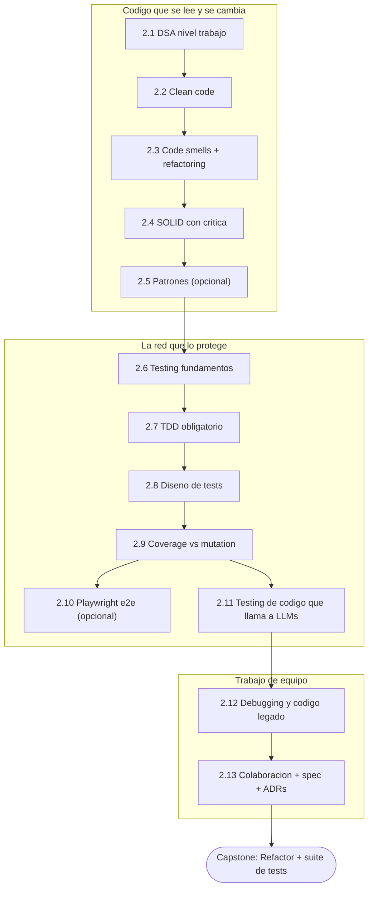

import Reto from "@components/Reto.astro";
import Solucion from "@components/Solucion.astro";
import CheckDominio from "@components/CheckDominio.astro";
import Quiz from "@components/Quiz.astro";
import Nivel from "@components/Nivel.astro";

<Nivel nivel="intermedio" />

Saliste de la [Fase 1](/fase-1-lenguajes/) sabiendo escribir código en dos
lenguajes. Pero "que funcione" y "que sea contratable" son cosas distintas. Esta
fase es donde aprendes a escribir código que **otra persona** —o tú dentro de
seis meses— pueda leer, cambiar y confiar. Tests, nombres claros, un diseño que
no se desmorona al primer cambio: eso es lo que separa a un junior de un
semi-senior. Y la tesis incómoda de esta fase es que **no es una fase**: es un
puñado de **hábitos diarios** que ya empezaste a practicar (tu primer test en la
[1.6](/fase-1-lenguajes/1-6-primer-test-pytest/), tus Conventional Commits desde
la [0.6](/fase-0-fundamentos/0-6-git-y-github/), tu mini-spec desde la
[0.8](/fase-0-fundamentos/0-8-spec-first-y-stack-traces/)). Aquí los nombras, los
afilas y los vuelves **no-negociables**.

## Objetivos de la fase

Al cerrar la Fase 2 sabrás **hacer** esto (no solo "haber leído sobre ello"):

- **Escribir** código limpio —nombres que dicen la verdad, funciones pequeñas,
  sin duplicación gratuita— y **explicar el trade-off** de cuándo una abstracción
  ayuda y cuándo es complejidad disfrazada de elegancia.
- **Practicar TDD de verdad** (red-green-refactor) como método por defecto, y
  **diseñar tests** que comprueban *comportamiento* —con la taxonomía correcta de
  test doubles— en vez de perseguir un porcentaje de coverage.
- **Refactorizar código legado** sobre una red de tests, guiándote por los *code
  smells* y depurando con herramientas (no con `print`).
- **Colaborar como profesional**: arrancar de una mini-spec, registrar las
  decisiones en **ADRs**, y abrir PRs revisables.

:::tip[Por qué importa (relevancia de mercado)]
**Testing, código limpio y diseño son la expectativa semi-senior; los juniors los
saltan, y por eso cobran menos.** No es un adorno: es la diferencia de banda
salarial. Un equipo que te paga como semi-senior asume que tu código viene con
tests, que tu refactor no rompe nada, y que tus decisiones quedan documentadas.
En 2026, con buena parte del código *generado* por IA, el valor del ingeniero se
desplazó de "teclear la solución" a **garantizar que la solución es correcta,
mantenible y segura** —que es, exactamente, lo que esta fase entrena. Esta es,
además, la fase que convierte el *Primero-Sin-IA* en su forma más poderosa: el
TDD es el mejor entrenador de pensar-primero que existe.
:::

## ¿Para quién es esta fase?

Está escrita para **cero real** en ingeniería de software. No asume que ya sabes
qué es un *code smell*, ni que escribiste una suite de tests, ni que aplicaste
SOLID. Cada concepto arranca con un ejemplo resuelto —el experto razonando en voz
alta— y un *smell* concreto **antes** de presentarte la solución. No enseñamos el
patrón primero; enseñamos el dolor que el patrón cura.

:::tip[Si ya lo tocaste]
¿Vienes escribiendo tests o aplicando SOLID por tu cuenta? No saltes en seco:
**valida**. Haz el [diagnóstico de entrada](#diagnóstico-de-entrada-de-la-fase-2)
del final de esta página y resuelve un ejercicio Primero-Sin-IA de cada
sub-unidad que creas dominar. Si lo cierras sin notas y sin IA dentro del
timebox, marca la casilla y avanza. Si te trabas al diseñar un *fake* en vez de
un *mock*, al matar un mutante con `mutmut`, o al justificar por qué un
`if-else` no necesita una Factory, era un falso "ya lo sé": quédate. La
experiencia previa es un **atajo de validación**, nunca un permiso para saltar a
ciegas.
:::

## La idea central: la calidad es un hábito, no una fase

Mira el mismo trozo de código escrito por un junior y por un semi-senior. No
cambia *lo que hace*: cambia todo lo demás.

```python
# Versión junior: "funciona en mi máquina"
def calc(x, y):
    if y > 100:
        return x - x * 0.1
    elif y > 50:
        return x - x * 0.05
    else:
        return x
```

```python
# Versión semi-senior: el mismo cálculo, con los hábitos de la fase
UMBRAL_DESCUENTO_ALTO = 100      # nombres que dicen la verdad (clean code, 2.2)
UMBRAL_DESCUENTO_MEDIO = 50      # no más "magic numbers" sueltos
DESCUENTO_ALTO = 0.10
DESCUENTO_MEDIO = 0.05


def total_con_descuento(subtotal: float, unidades: int) -> float:
    """Aplica descuento por volumen. Ver ADR-003 (por qué estos umbrales)."""
    if unidades > UMBRAL_DESCUENTO_ALTO:
        return subtotal * (1 - DESCUENTO_ALTO)
    if unidades > UMBRAL_DESCUENTO_MEDIO:
        return subtotal * (1 - DESCUENTO_MEDIO)
    return subtotal
```

Razonemos en voz alta qué hizo el semi-senior, y **por qué**:

1. **Nombres honestos.** `calc(x, y)` no dice nada; `total_con_descuento(subtotal,
   unidades)` se entiende sin leer el cuerpo. El primer lector de tu código eres
   tú, dentro de seis meses, sin memoria de hoy. *(Eso es la [2.2](/fase-2-ingenieria/2-2-clean-code/).)*
2. **Mató los *magic numbers*.** `100`, `50`, `0.1` eran un *code smell*: números
   sin nombre cuyo significado vive solo en la cabeza del autor. *(Eso es la [2.3](/fase-2-ingenieria/2-3-code-smells-refactoring/).)*
3. **Dejó rastro de la decisión.** El comentario apunta a un **ADR**: *por qué*
   esos umbrales y no otros. La decisión sobrevive a quien la tomó. *(Eso es la [2.13](/fase-2-ingenieria/2-13-colaboracion-spec-driven-adrs/).)*
4. **Y lo que no se ve aquí: hay tests.** El semi-senior escribió primero un test
   que comprueba la frontera exacta (¿qué pasa con *exactamente* 100 unidades?
   ¿el `>` debía ser `>=`?). Sin ese test, el refactor de arriba es una apuesta.
   *(Eso es la [2.6](/fase-2-ingenieria/2-6-testing-fundamentos/)→[2.9](/fase-2-ingenieria/2-9-coverage-vs-mutation/).)*

Ninguno de esos cuatro hábitos es "avanzado". Son baratos, se aplican en cada
commit, y son justo lo que un revisor mira primero.

:::caution[La trampa #1: "la calidad es una fase posterior"]
Podrías pensar: *"primero lo hago funcionar, después —si queda tiempo— le pongo
tests y lo limpio"*. Está mal, y es el antipatrón que esta fase existe para
romper. "Después" no llega nunca: llega la siguiente feature. El código sin tests
no se refactoriza (no tienes red); el código sin nombres claros no se entiende (y
nadie lo toca); la decisión sin ADR se pierde. La calidad **no es un paso final**,
es la forma de dar **cada** paso. Por eso en este curso los hilos de testing,
seguridad y observabilidad se tejen desde la Fase 0, no se "agregan" en una fase
de limpieza.
:::

:::caution[La trampa #2: refactorizar sin red de tests]
Otro error clásico: ver código feo y "mejorarlo" de inmediato. **Refactorizar
sin tests no es refactorizar: es reescribir y rezar.** La definición de Fowler es
precisa: refactorizar es cambiar la *estructura* sin cambiar el *comportamiento*
—y solo puedes afirmar que el comportamiento no cambió si tienes tests que lo
prueben. Por eso en esta fase el orden es: primero la red de tests
([2.6](/fase-2-ingenieria/2-6-testing-fundamentos/)), después el refactor
([2.3](/fase-2-ingenieria/2-3-code-smells-refactoring/)).
:::

## Mapa de la fase

Catorce sub-unidades: doce de ruta-crítica y dos de profundización (🔵), más el
capstone. El orden tiene una lógica pedagógica: primero el código (limpio, sin
smells, con diseño defendible), luego la red que lo protege (testing en serio), y
al final la colaboración que lo hace de equipo.



| # | Sub-unidad | Nivel | Qué construyes ahí |
|---|---|---|---|
| 2.1 | [DSA nivel trabajo](/fase-2-ingenieria/2-1-dsa-nivel-trabajo/) | 🟡 intermedio | Intuición de Big-O y las estructuras que aparecen en entrevistas (arrays, hashmaps, stacks, queues, listas, árboles, grafos). Piso de ~15–20 problemas, **interleaved** entre fases. |
| 2.2 | [Clean code](/fase-2-ingenieria/2-2-clean-code/) | 🟡 intermedio | Nombres que dicen la verdad, funciones pequeñas, DRY/KISS/YAGNI sin volverlos dogma. |
| 2.3 | [Code smells + refactoring](/fase-2-ingenieria/2-3-code-smells-refactoring/) | 🟡 intermedio | Reconocer el *smell* como gatillo y aplicar los refactorings de Fowler sobre una red de tests. Los patrones se **descubren** refactorizando. |
| 2.4 | [SOLID con crítica](/fase-2-ingenieria/2-4-solid-con-critica/) | 🟡 intermedio | Los 5 principios con ejemplos propios **y** la crítica al dogmatismo y la sobre-abstracción. |
| 2.5 | [Patrones de diseño esenciales](/fase-2-ingenieria/2-5-patrones-diseno/) | 🔵 profundización | Factory, Strategy, Repository, Adapter, Observer —descubiertos desde el smell, no impuestos. |
| 2.6 | [Testing: fundamentos](/fase-2-ingenieria/2-6-testing-fundamentos/) | 🟡 intermedio | La pirámide de testing, `pytest` (fixtures/mocking/parametrize) y Vitest/Jest. La red que todo lo demás necesita. |
| 2.7 | [TDD obligatorio](/fase-2-ingenieria/2-7-tdd-obligatorio/) | 🔴 avanzado | Red-green-refactor como práctica diaria y método por defecto del Primero-Sin-IA. |
| 2.8 | [Diseño de tests](/fase-2-ingenieria/2-8-diseno-de-tests/) | 🔴 avanzado | AAA / Given-When-Then, taxonomía de test doubles (mock/stub/spy/fake/dummy), property-based (Hypothesis/fast-check) y contract testing (Pact). |
| 2.9 | [Coverage vs mutation/behavior](/fase-2-ingenieria/2-9-coverage-vs-mutation/) | 🔴 avanzado | Por qué el coverage % miente, mutation testing (mutmut/Stryker) y qué **no** testear. |
| 2.10 | [Playwright e2e](/fase-2-ingenieria/2-10-playwright-e2e/) | 🔵 profundización | Pruebas de extremo a extremo de la app completa, desde el navegador. |
| 2.11 | [Testing de código que llama a LLMs](/fase-2-ingenieria/2-11-testing-codigo-llm/) | 🟡 intermedio | Mockear la respuesta del modelo para testear *tu* lógica. El puente conceptual hacia los **evals** de la Fase 6. |
| 2.12 | [Debugging y código legado](/fase-2-ingenieria/2-12-debugging-codigo-legado/) | 🟡 intermedio | Debuggers/`pdb`, lectura de stack traces, logging estructurado vs `print`, y leer código que no escribiste. |
| 2.13 | [Colaboración + spec-driven + ADRs](/fase-2-ingenieria/2-13-colaboracion-spec-driven-adrs/) | 🟡 intermedio | Issues/PRs/code review, nociones de ágil, Spec Kit y ADRs forzados como disciplina. |
| 2.P | [🛠️ Capstone — Refactor + suite de tests](/fase-2-ingenieria/proyecto/) | 🔴 avanzado | Toma el proyecto de la Fase 1, aplícale SOLID, dale una suite de tests con **mutation score**, un `ARQUITECTURA.md` + ADRs y un pipeline que los corre. |

> Las **2.5** (patrones) y **2.10** (Playwright e2e) son **profundización**: no
> bloquean el avance. Hazlas si quieres profundidad extra; si vas con el tiempo
> justo, ciérralas más adelante. Ninguna sub-unidad opcional se elimina del curso
> —se pospone.

## Los hilos transversales que se afianzan aquí

La Fase 2 es el corazón de varios **hábitos transversales** del curso. No son
temas que se ven una vez: son la forma de trabajar de aquí en adelante.

- **Testing / TDD (se vuelve obligatorio).** Lo que en la
  [1.6](/fase-1-lenguajes/1-6-primer-test-pytest/) fue tu primer test, aquí pasa
  a ser el **método por defecto**: escribes el test que describe lo que quieres,
  lo ves fallar (red), lo haces pasar (green), limpias (refactor). Y la calidad
  del test se mide por **mutation/behavior coverage**, nunca por porcentaje.
- **Seguridad como reflejo.** Aún sin endpoints (eso llega en la
  [Fase 3](/fase-3-backend/)), aquí empieza el hábito de preguntar *"¿qué entrada
  rompe esto?"* en cada función. El *property-based testing* de la
  [2.8](/fase-2-ingenieria/2-8-diseno-de-tests/) es ese reflejo hecho test.
- **Spec-driven + ADRs + Conventional Commits (heredado de F0).** Cada cambio
  arranca de una mini-spec y deja su decisión en un ADR. El capstone lo exige.
- **Observabilidad embrionaria.** El logging estructurado de la
  [2.12](/fase-2-ingenieria/2-12-debugging-codigo-legado/) es la semilla de las
  trazas que instrumentarás en la Fase 5: depurar con datos, no con `print`.
- **Inglés técnico ([Track 0](/track-0-empleabilidad/)).** El `ARQUITECTURA.md` y
  los ADRs del capstone van en inglés. El inglés corre en paralelo desde la
  semana 1.

## Checklist de avance

Marca una sub-unidad como completa **solo** cuando cumplas las tres condiciones
(criterio del roadmap): (a) entiendes el concepto **sin notas**, (b) hiciste el
ejercicio **sin IA**, y (c) lo **aplicaste** en el capstone.

- [ ] 2.1 — DSA nivel trabajo
- [ ] 2.2 — Clean code
- [ ] 2.3 — Code smells + refactoring
- [ ] 2.4 — SOLID con crítica
- [ ] 2.5 — Patrones de diseño esenciales *(opcional/profundización)*
- [ ] 2.6 — Testing: fundamentos
- [ ] 2.7 — TDD obligatorio
- [ ] 2.8 — Diseño de tests
- [ ] 2.9 — Coverage vs mutation/behavior
- [ ] 2.10 — Playwright e2e *(opcional/profundización)*
- [ ] 2.11 — Testing de código que llama a LLMs
- [ ] 2.12 — Debugging y código legado
- [ ] 2.13 — Colaboración + spec-driven dev + ADRs
- [ ] 2.P — Capstone: Refactor + suite de tests (cumple el Definition of Done de abajo)
- [ ] `RETROSPECTIVA.md` de la fase escrita (qué aprendí, qué me costó, qué proyecto lo demuestra)

<CheckDominio
  title="Antes de avanzar a la Fase 3, ¿puedes…?"
  items={[
    "Explicar por qué no se puede refactorizar con seguridad sin una red de tests",
    "Escribir un test en TDD que falle primero y luego hacerlo pasar (red-green-refactor)",
    "Distinguir un mock de un stub y de un fake, y decir cuándo usar cada uno",
    "Explicar por qué 90% de coverage puede convivir con tests que no prueban nada",
    "Tomar una función con malos nombres y nombrar (sin arreglar) los code smells que tiene",
    "Justificar cuándo SOLID ayuda y cuándo es sobre-abstracción que sobra",
  ]}
/>

## Repaso rápido (active recall)

<Quiz
  question="¿Qué condición es indispensable ANTES de refactorizar código legado?"
  options={[
    "Tener al menos 80% de coverage en el repo",
    "Tener una red de tests que verifique el comportamiento actual",
    "Conocer el patrón de diseño al que vas a migrar",
    "Que el equipo apruebe un ADR previo",
  ]}
  answer={1}
  explanation="Refactorizar es cambiar la estructura SIN cambiar el comportamiento. Solo puedes afirmar que el comportamiento no cambió si tienes tests que lo prueban. El coverage % no es garantía (puede estar alto con tests que no asertan nada), el patrón es opcional, y el ADR documenta pero no protege."
/>

<Quiz
  question="Un módulo tiene 95% de coverage pero un bug pasó a producción. ¿Qué es lo más probable?"
  options={[
    "El coverage estaba mal medido",
    "Los tests ejecutan el código pero no verifican el resultado (pocas aserciones reales)",
    "Faltaba un test end-to-end con Playwright",
    "El bug es imposible de testear",
  ]}
  answer={1}
  explanation="Coverage mide qué líneas se EJECUTAN, no si se VERIFICAN. Un test puede recorrer el 95% del código y no asertar casi nada. Por eso la fase mide calidad con mutation/behavior coverage, no con el porcentaje. Esa es la lección central de la 2.9."
/>

## Definition of Done (la vara del capstone)

Todos los capstones del curso comparten **un único** Definition of Done. La vara
crece fase a fase; en la Fase 2 se suma el punto que define a la fase: la
**calidad de los tests medida por mutation/behavior coverage o aserciones reales,
nunca por porcentaje**.

:::caution[Lo que aplica al Capstone F2 (Refactor + suite de tests)]
1. **Mini-spec inicial + ADRs** de las decisiones de diseño (por qué SOLID aquí,
   por qué este límite de módulo, qué *trade-off* aceptaste).
2. **Tests verdes + lint en CI**, con la calidad medida por **mutation/behavior
   coverage o aserciones reales** —no por "% de cobertura".
3. **Refactor real**: el comportamiento observable no cambia (los tests lo
   prueban), pero la estructura mejora (SOLID aplicado, smells eliminados).
4. **`ARQUITECTURA.md` en inglés** que explica el diseño y enlaza los ADRs.
5. **Conventional Commits** en todo el historial, con un pipeline que corre los
   tests en cada push.
:::

:::note[Lo que llega después (mismo DoD, otras fases)]
Seguridad OWASP web/LLM ([F3](/fase-3-backend/), [F6](/fase-6-ai-engineering/)) ·
observabilidad con logs/trazas ([F5](/fase-5-devops/)) · eval harness para IA
([F6](/fase-6-ai-engineering/)) · accesibilidad WCAG si hay UI
([F4](/fase-4-frontend/)). Lo verás aparecer fase a fase; aquí instalamos el
estándar de *tests que importan* y *decisiones documentadas*.
:::

## Conexión con el capstone

Cada sub-unidad es una pieza del **Refactor + suite de tests**: 2.2–2.4 son los
ojos con los que ves qué mejorar en el código de la Fase 1; 2.3 es cómo lo
cambias sin romperlo; 2.6–2.9 son la red de tests que te da permiso de tocar y la
forma de saber que la red sirve; 2.11 cubre la parte que llama a un LLM (si tu
app la tiene); 2.12 es cómo entiendes el código viejo antes de tocarlo; 2.13 es
cómo documentas y compartes las decisiones. No estudias temas sueltos: ensamblas,
pieza a pieza, tu primer proyecto que **otro ingeniero respetaría**.

## Diagnóstico de entrada de la Fase 2

Antes de tocar la primera lección, orientarte. Este ejercicio no se corrige "bien
o mal": se corrige por **honestidad y concreción**, y por tu capacidad de **ver
los hábitos que faltan** en un trozo de código (el reflejo central de la fase).

<Reto title="Diagnóstico de hábitos y plan de Fase 2" timebox="35 min">

Sin IA, en tres archivos markdown dentro de `ejercicios/fase-2/index/`:

1. **`diagnostico.md`** — una tabla con las 13 sub-unidades (2.1 a 2.13) y, para
   cada una, tu nivel **honesto**: `nuevo` · `lo reconozco` · `lo sé hacer sin
   notas`. La prueba de "lo sé hacer": ¿podrías resolver un ejercicio del tema,
   ahora, sin notas y sin IA? Si dudas, no lo es.
2. **`plan-fase-2.md`** — tu plan: **bloques semanales concretos** (día y hora),
   cómo vas a **interleave** los problemas de DSA (2.1) con el resto en vez de
   hacerlos en bloque, y tu **ritual de repaso** (cuándo reescribes de memoria).
3. **`habitos-faltantes.md`** — el corazón del ejercicio. Toma la **versión
   junior** del código de arriba (`def calc(x, y): …`) y, **sin arreglarlo**,
   escribe un *gap report*: lista los hábitos semi-senior que faltan (nombres,
   magic numbers, ausencia de tests, casos borde sin cubrir como `unidades == 100`,
   falta de spec/ADR) y, por cada uno, **qué sub-unidad de esta fase** lo cubre.
   No reescribas la función: el objetivo es *ver*, no *resolver*.

**Hecho significa:** la tabla cubre las 13 sub-unidades con un nivel defendible
(no todo en "lo sé hacer"); el plan tiene bloques reales y dice cómo interleave
DSA; el *gap report* nombra **al menos 4 hábitos faltantes** distintos y mapea
cada uno a su sub-unidad, sin caer en "está mal, lo arreglaría así" (eso es
refactorizar, y todavía no toca).

</Reto>

<Solucion title="Pista (ábrela solo si te trabas, no es la solución)">

Para el *gap report*, no busques el bug: busca lo que un **revisor** marcaría
antes de aprobar el PR. Pregúntate, hábito por hábito: ¿entiendo qué hace sin leer
el cuerpo? (nombres → 2.2). ¿De dónde salen 100, 50, 0.1? (magic numbers → 2.3).
¿Cómo sé que el límite es `>` y no `>=`? (no hay test que lo fije → 2.6–2.9). ¿Por
qué esos umbrales y no otros? (no hay ADR → 2.13). Resiste la tentación de
reescribir: nombrar el hueco **es** la habilidad que se entrena aquí —arreglarlo
viene después, y solo con una red de tests delante.

</Solucion>

### Cómo pedir la corrección

Cuando termines, pídele a tu IA:

> "Corrige `ejercicios/fase-2/index/` usando el framework de `.ai/`. Sigue
> `INSTRUCCIONES-CORRECTOR.md`."

El corrector revisará la **honestidad** de tu autoevaluación, el **realismo** de
tu plan y la **agudeza** de tu *gap report* (¿viste los hábitos faltantes?, ¿los
mapeaste bien?), no si "acertaste". No existe una respuesta única correcta.

## Recursos

Prefiere siempre **documentación oficial** sobre tutoriales sueltos. Mantén una
lista viva en `articulos.md` dentro de cada sub-unidad.

- [Refactoring, de Martin Fowler (sitio oficial)](https://refactoring.com/) — el catálogo de *smells* y refactorings que estructura la 2.3.
- [Documentación de pytest](https://docs.pytest.org/) — el framework de tests de Python (2.6–2.9).
- [Documentación de Vitest](https://vitest.dev/) — el equivalente moderno en JS/TS.
- [mutmut (mutation testing en Python)](https://mutmut.readthedocs.io/) — para medir si tus tests *de verdad* prueban algo (2.9).
- [Hypothesis (property-based testing)](https://hypothesis.readthedocs.io/) — generar casos borde automáticamente (2.8).
- [Architecture Decision Records (adr.github.io)](https://adr.github.io/) — el formato de ADR que usarás desde la 2.13.

## Reflexión + repaso

:::note[Para tu RETROSPECTIVA.md]
¿Cuántas veces, antes de esta fase, escribiste un test *después* del código (o
nunca)? ¿Y cuántas escribiste primero el test, lo viste fallar, y recién entonces
codeaste? Escribe dos frases honestas. El salto de junior a semi-senior se mide
justo ahí: en si los tests son un trámite final o tu forma de pensar.
:::

**Gancho de repaso:** vuelve a esta portada al cerrar **cada** sub-unidad y marca
su casilla. Al terminar la 2.13, antes del capstone, reescribe **de memoria** (sin
abrir esta página) los tres bloques de la fase (código → red de tests → equipo) y
las dos trampas (la calidad no es una fase posterior; no refactorices sin tests).
Si te falta alguno, ahí tienes tu próximo repaso —al día siguiente, no hoy.
