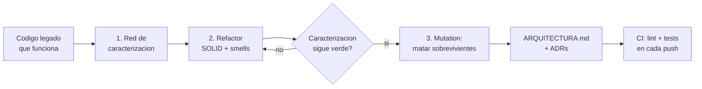

import Reto from "@components/Reto.astro";
import Solucion from "@components/Solucion.astro";
import CheckDominio from "@components/CheckDominio.astro";
import Quiz from "@components/Quiz.astro";
import Nivel from "@components/Nivel.astro";

<Nivel nivel="avanzado" />

Hasta aquí practicaste cada hábito por separado: nombres en la
[2.2](/fase-2-ingenieria/2-2-clean-code/), smells en la
[2.3](/fase-2-ingenieria/2-3-code-smells-refactoring/), SOLID en la
[2.4](/fase-2-ingenieria/2-4-solid-con-critica/), tests en la
[2.6](/fase-2-ingenieria/2-6-testing-fundamentos/)→[2.9](/fase-2-ingenieria/2-9-coverage-vs-mutation/),
ADRs en la [2.13](/fase-2-ingenieria/2-13-colaboracion-spec-driven-adrs/). El
capstone es donde se **ensamblan en una sola entrega coherente**. No aprendes
nada nuevo aquí: demuestras que los hábitos ya son tuyos tomando código que
funciona pero da vergüenza, y dejándolo en un estado que **otro ingeniero
respetaría**. Es la primera pieza de tu portafolio que no es un ejercicio de
juguete.

## Objetivos

Al cerrar este capstone sabrás **hacer** esto —no "haber leído sobre ello"—:

- **Refactorizar** un módulo legado aplicando SOLID guiado por *code smells*,
  garantizando con una **red de tests de caracterización** que el comportamiento
  observable no cambia (la definición de Fowler, no "reescribir y rezar").
- **Diseñar una suite de tests** cuya calidad se mide por **mutation score y
  aserciones reales**, no por porcentaje de coverage, y **explicar el trade-off**
  de qué testeaste, qué no, y por qué.
- **Documentar el diseño** en un `ARQUITECTURA.md` (en inglés) y registrar las
  decisiones clave en **ADRs**, y montar un **pipeline de CI** que corre lint +
  tests en cada push.

## Por qué importa

:::tip[Relevancia de mercado]
Esto **es** la entrevista técnica de un semi-senior. "Toma este módulo legado,
mejóralo sin romperlo y convénceme de que no lo rompiste" es, literalmente, el
ejercicio take-home más común de la banda que buscas. Un junior entrega "ahora
está más bonito"; un semi-senior entrega **una red de tests que prueba que el
comportamiento se conservó, un mutation score que demuestra que la red sirve, y
un ADR que defiende cada decisión**. En 2026, con buena parte del código
*generado* por IA, el trabajo del ingeniero se desplazó de teclear la solución a
**garantizar que es correcta, mantenible y revisable** —que es exactamente lo que
este proyecto produce como evidencia. Es, además, el primer artefacto que puedes
**fijar en tu GitHub** (`acme`) y enlazar en tu CV.
:::

## Antes de empezar: recupera la fase de memoria

Esto es un capstone de **consolidación**, así que arranca en modo
*Primero-Sin-IA* de entrada: sin abrir las lecciones, responde en voz alta. Si te
trabas, ahí tienes qué repasar **antes** de tocar el proyecto.

<CheckDominio
  title="¿Puedes, sin notas…?"
  items={[
    "Definir qué es refactorizar (Fowler) y por qué exige una red de tests previa",
    "Escribir un test de caracterización que fije el comportamiento ACTUAL de código que no entiendes del todo",
    "Nombrar 3 code smells del catálogo de Fowler y el refactoring que cura cada uno",
    "Explicar cuándo SOLID ayuda y cuándo es sobre-abstracción que sobra",
    "Decir por qué 95% de coverage puede convivir con tests que no prueban nada, y qué mide mutation testing en cambio",
    "Escribir un ADR de una decisión de diseño con su contexto, opciones y consecuencia",
  ]}
/>

## Ejemplo resuelto: el bucle de refactor en miniatura

Antes de soltarte el proyecto completo, modelemos el **ciclo** sobre una rebanada
de seis líneas. Este es el subconjunto del módulo `despensa.py` que vas a
encontrar en `ejercicios/fase-2/capstone-refactor-tests/` (una herramienta que lee
una despensa y avisa qué está por acabarse o por vencer). Razonemos en voz alta,
paso a paso, como lo haría un revisor.

**El punto de partida (funciona, pero da vergüenza):**

```python
def run(archivo, hoy=None):
    if hoy is None:
        hoy = date.today()
    f = open(archivo)
    data = json.load(f)            # I/O y parseo...
    f.close()
    res = []
    for x in data:
        alerta = ""
        if x["cantidad"] <= 2:     # ...lógica de negocio con magic numbers...
            alerta = "STOCK BAJO"
        # (omito el bloque de vencimiento por brevedad)
        if alerta != "":
            res.append(x["nombre"] + ": " + alerta)
    for r in res:
        print(r)                   # ...y presentación, todo en una función.
    return res
```

> [!info] Pienso en voz alta
> Lo primero que veo no es un bug: es que esta función **hace tres cosas** —leer
> un archivo, decidir las alertas, e imprimir—. Eso viola SRP (la
> [2.4](/fase-2-ingenieria/2-4-solid-con-critica/)) y, peor, hace la **lógica
> imposible de testear sin un archivo de disco**. El `<= 2` es un *magic number*
> (la [2.3](/fase-2-ingenieria/2-3-code-smells-refactoring/)). Y no hay un solo
> test. La tentación es entrar a "arreglar" ya. Me freno: **sin red de tests, un
> refactor es una apuesta**.

**Paso 1 — red de caracterización (fijo el comportamiento ANTES de tocar nada).**
No escribo el test que *me gustaría*; escribo el que captura lo que el código
**hace hoy**, aunque sea feo:

```python
def test_caracterizacion(capsys):
    # Golden: pin del comportamiento actual con una fecha fija (determinismo).
    resultado = run("tests/datos/despensa-ejemplo.json", hoy=date(2026, 6, 26))
    assert resultado == [
        "Leche: STOCK BAJO + POR VENCER",
        "Arroz: VENCIDO",
        "Huevos: STOCK BAJO",
    ]
```

> [!info] Pienso en voz alta
> Ahora tengo una **red**. Cualquier cambio de estructura que rompa esta aserción
> me grita al instante. Fíjate que ya inyecté `hoy` para que el test sea
> determinista: un test que depende de `date.today()` real falla mañana solo.

**Paso 2 — extraigo el núcleo puro (SRP + DIP light).** Separo *decidir* de
*leer* e *imprimir*. La decisión pasa a ser una función pura, sin I/O:

```python
STOCK_MINIMO = 2          # antes era un 2 suelto: ahora dice qué significa
DIAS_PARA_VENCER = 3

def evaluar(item: dict, hoy: date) -> str | None:
    """Decide la alerta de un item. Pura: sin archivos, sin print, testeable."""
    partes = []
    if item["cantidad"] <= STOCK_MINIMO:
        partes.append("STOCK BAJO")
    # ... (la lógica de vencimiento, igual de pura)
    return " + ".join(partes) if partes else None
```

El `run` original queda como un *adapter* delgado que orquesta: lee el archivo,
llama a `evaluar` por cada item, imprime. La caracterización del Paso 1 **sigue
verde** → probé que no cambié el comportamiento.

**Paso 3 — mutation testing revela el agujero.** Tengo tests y pasan. ¿Sirven?
Corro `mutmut` (la [2.9](/fase-2-ingenieria/2-9-coverage-vs-mutation/)) y un
mutante **sobrevive**: cambiar `<= STOCK_MINIMO` por `< STOCK_MINIMO` no rompe
ningún test. Traducción: **ningún test pincha el borde exacto** `cantidad == 2`.
Mi coverage podía estar en 100% y este agujero seguir ahí.

```python
def test_borde_stock_exacto():
    # Mata al mutante <= → < : en el umbral EXACTO el comportamiento difiere.
    assert evaluar({"cantidad": 2, "nombre": "x"}, date(2026, 6, 26)) == "STOCK BAJO"
```

> [!info] Pienso en voz alta
> Este es el ciclo completo en pequeño: **caracterizar → refactorizar con la red
> puesta → endurecer con mutation**. El capstone es esto mismo, repetido sobre
> todo el módulo, con la decisión de cada paso anotada en un ADR. No es magia: es
> disciplina barata aplicada en orden.



## Errores que descalifican (non-examples)

:::caution[Refactor que en realidad es rewrite]
El error #1 del capstone: borrar el módulo y reescribirlo "bien" de cero.
**Refactorizar es cambiar la estructura sin cambiar el comportamiento** —y eso
solo se puede *afirmar* si existen tests que lo prueben. Si reescribes desde cero
no tienes con qué demostrar que conservaste el comportamiento; tienes una app
nueva con bugs nuevos. El revisor lo nota: no hay tests de caracterización
verdes *antes* del primer cambio. Camino correcto: red primero, cambios pequeños
después, la red verde en cada paso.
:::

:::caution[Perseguir el porcentaje de coverage]
Podrías pensar: *"llego a 90% de coverage y listo, está testeado"*. Está mal.
Coverage mide qué líneas se **ejecutan**, no si se **verifican**. Un test que
llama a tu función y no asierta nada sube el coverage y no prueba nada. La vara de
esta fase es **mutation score / aserciones reales**: si un mutante sobrevive, te
falta un test, tenga el coverage el número que tenga. Entregar "92% coverage"
como evidencia de calidad es, en este capstone, una señal de que no entendiste la
[2.9](/fase-2-ingenieria/2-9-coverage-vs-mutation/).
:::

:::caution[SOLID en todas partes ("pattern-itis")]
El otro extremo: meter una `Factory`, una interfaz por clase y cinco capas a un
script de 80 líneas "porque es lo profesional". Eso es **sobre-abstracción**, el
smell que la [2.4](/fase-2-ingenieria/2-4-solid-con-critica/) te enseñó a
resistir. SOLID se aplica donde hay un dolor real (un cambio que obliga a tocar
diez sitios, una dependencia que no puedes testear). Un buen capstone aplica
SOLID **donde el smell lo justifica** y lo defiende en un ADR; uno malo lo aplica
en todas partes y no sabe por qué. El juicio —cuándo sí y cuándo no— es lo que se
evalúa.
:::

:::caution[Big-bang refactor sin commits]
Tres días de cambios y un único commit gigante "refactor". Imposible de revisar,
imposible de revertir si algo se rompió. El capstone exige **Conventional
Commits** en pasos pequeños (`test: add characterization net`,
`refactor: extract pure evaluar()`, `test: kill boundary mutant`). Cada commit
deja los tests verdes. Así se trabaja en un equipo, y así se revisa un PR.
:::

## Práctica con andamiaje: el plan por etapas

No ataques el proyecto entero de golpe. Estas cinco etapas son el andamiaje; nota
cómo se **desvanece** —la etapa 1 te dice casi cada paso, la 5 solo te dice el
objetivo y confía en ti.

1. **Spec + red de caracterización (muy guiado).** Escribe una mini-spec de una
   página: qué hace la herramienta, entradas, salidas, casos borde. Luego escribe
   los tests de caracterización que fijan el comportamiento **actual** del módulo
   (usa el `despensa.py` provisto, o tu propia app de la
   [Fase 1](/fase-1-lenguajes/)). Confirma que pasan en **verde** antes de cambiar
   una sola línea de producción. Primer commit: `test: red de caracterizacion`.
2. **Refactor guiado por smells (guiado).** Recorre el catálogo de la
   [2.3](/fase-2-ingenieria/2-3-code-smells-refactoring/): nombra cada smell que
   veas (god function, magic numbers, nombres mudos, condicional anidado). Por
   cada uno, aplica su refactoring **en un commit pequeño** y verifica que la red
   sigue verde. Extrae al menos un **núcleo puro** sin I/O (SRP) e inyecta sus
   dependencias (DIP light).
3. **Tests unitarios + mutation (semi-guiado).** Ahora que hay un núcleo puro,
   testéalo de verdad: casos normales, **bordes exactos**, errores. Corre
   `mutmut`, lee el score, **mata a los sobrevivientes** con tests de borde. Anota
   el score de partida y el final.
4. **Documentación: ARQUITECTURA.md + ADRs (poco guiado).** Escribe el
   `ARQUITECTURA.md` (en inglés) explicando el diseño post-refactor, y **2–3 ADRs**
   de tus decisiones de mayor peso (por qué separaste el núcleo, por qué ese
   umbral de mutation score, qué SOLID aplicaste y cuál te resististe a aplicar).
5. **Pipeline de CI (solo el objetivo).** Monta un workflow de GitHub Actions que
   corra lint + tests en cada push. Que el badge esté verde es parte del entregable.

> [!tip] Si ya lo tocaste
> ¿Vienes con un proyecto real con tests y CI? No saltes en seco: usa este
> capstone para **subir la vara**. Mide tu suite actual con `mutmut` —casi seguro
> descubres mutantes vivos— y escribe el ADR que nunca escribiste. La experiencia
> previa es un atajo de validación, no un permiso para entregar lo que ya tenías.

## El proyecto

<Reto title="Capstone F2 — Refactor + suite de tests" timebox="8–14 h en 1–2 semanas">

Toma un módulo que **funciona pero da vergüenza** —tu app de la
[Fase 1](/fase-1-lenguajes/), o el `despensa.py` provisto en
`ejercicios/fase-2/capstone-refactor-tests/`— y déjalo en estado *semi-senior*.
Trabaja **Primero-Sin-IA**: la IA entra al final, solo para revisar y explicar, no
para generar tu refactor ni tus tests.

**Entregables (todos en el repo de tu proyecto):**

1. **`SPEC.md`** — mini-spec de una página: propósito, entradas, salidas, casos
   borde.
2. **Refactor real** — SOLID aplicado donde un smell lo justifica; al menos un
   núcleo puro extraído y sus dependencias inyectadas. El comportamiento
   observable **no cambia** (tus tests de caracterización lo prueban).
3. **Suite de tests** — caracterización + unitarios; calidad medida por
   **mutation score**, no por coverage%. Reporta el score de partida y el final, y
   anota qué decidiste **no** testear y por qué.
4. **`ARQUITECTURA.md`** (en inglés) + **2–3 ADRs** en `docs/adr/`.
5. **CI verde** — workflow de GitHub Actions que corre lint + tests en cada push.
6. **Historial con Conventional Commits** — pasos pequeños, cada uno con la red en
   verde.

**Hecho significa (mapeado al Definition of Done del curso):**

- **DoD 1 — Spec + ADRs:** existe `SPEC.md` y hay 2–3 ADRs que defienden las
  decisiones de diseño (no "lo hice así porque sí").
- **DoD 2 — Tests + lint en CI, calidad por mutation/aserciones reales:** el
  pipeline corre verde; reportas un **mutation score** (no un % de coverage como
  métrica de calidad) y los sobrevivientes restantes están justificados (p. ej.
  mutantes equivalentes).
- **DoD 8 — Demo que corre + README en inglés + write-up de trade-offs:** la
  herramienta **ejecuta**; el `README`/`ARQUITECTURA.md` está en inglés; el
  write-up dice qué elegiste, qué mediste y qué te costó.
- **DoD 9 — Conventional Commits** en todo el historial.

**Fuera de alcance en esta fase** (llega después, mismo DoD): seguridad OWASP
(no hay endpoint todavía → [Fase 3](/fase-3-backend/)), observabilidad con trazas
([Fase 5](/fase-5-devops/)), eval harness ([Fase 6](/fase-6-ai-engineering/)),
a11y WCAG ([Fase 4](/fase-4-frontend/)). El *bonus* honesto de esta fase es
sustituir los `print` por **logging estructurado** (la
[2.12](/fase-2-ingenieria/2-12-debugging-codigo-legado/)): es la semilla de la
observabilidad.

El enunciado detallado, el módulo `despensa.py` de partida, los templates de
`ARQUITECTURA.md`/ADR y el starter de CI están en
`ejercicios/fase-2/capstone-refactor-tests/`.

</Reto>

<Solucion title="Pista de arranque (no es la solución; ábrela si no sabes por dónde partir)">

El orden lo es todo, y casi siempre se hace al revés. **No empieces por el código
bonito.** Empieza por la red: escribe el test de caracterización que captura lo
que el módulo hace **hoy** (corre la herramienta, copia su salida real, fíjala en
una aserción). Recién con ese test verde tienes permiso de tocar producción. De
ahí, el ciclo es siempre el mismo y siempre pequeño: nombra **un** smell →
aplícale su refactoring en **un** commit → confirma que la red sigue verde →
repite. Cuando el núcleo puro exista, mídete con `mutmut`: los mutantes vivos te
dicen **exactamente** qué borde no probaste. Y para los ADRs, escribe el que
**dudaste**: la decisión que casi tomas al revés es la que vale la pena documentar.

</Solucion>

## Check de dominio

<Quiz
  question="Vas a refactorizar un módulo legado de 200 líneas sin tests. ¿Cuál es el PRIMER paso correcto?"
  options={[
    "Aplicar SOLID y extraer las clases mientras lees el código",
    "Escribir tests de caracterización que fijen el comportamiento actual",
    "Medir el coverage para saber qué falta testear",
    "Reescribir el módulo desde cero con un diseño limpio",
  ]}
  answer={1}
  explanation="Sin una red que pruebe el comportamiento ACTUAL, cualquier cambio de estructura es una apuesta: no podrás afirmar que no rompiste nada. La caracterización va primero, antes de tocar una sola línea de producción. Reescribir desde cero pierde la garantía de que conservas el comportamiento; el coverage no protege; SOLID viene DESPUÉS de la red."
/>

<Quiz
  question="Tu suite tiene 100% de coverage, pero mutmut reporta 5 mutantes sobrevivientes. ¿Qué significa?"
  options={[
    "El coverage estaba mal medido; en realidad es menor",
    "Tus tests ejecutan el código pero no verifican los casos que distinguen esos mutantes (faltan aserciones de borde)",
    "Necesitas tests end-to-end con Playwright",
    "Los 5 mutantes son equivalentes y no se pueden matar",
  ]}
  answer={1}
  explanation="Coverage = líneas ejecutadas; mutation score = si tus tests DETECTAN un cambio en el comportamiento. 100% de coverage con mutantes vivos es la prueba en vivo de que recorrer el código no es lo mismo que verificarlo. Casi siempre faltan aserciones en los bordes exactos. (Que TODOS sean equivalentes es rarísimo y habría que demostrarlo uno por uno.)"
/>

<CheckDominio
  title="Antes de declarar el capstone 'hecho', ¿puedes defender…?"
  items={[
    "Mostrar el commit de caracterización que precede al primer cambio de producción",
    "Decir tu mutation score de partida y final, y por qué los sobrevivientes que quedan están justificados",
    "Señalar una abstracción que decidiste NO crear, y el ADR que lo explica",
    "Explicar qué hace tu pipeline de CI y qué falla si rompes un test",
    "Recorrer tu historial de commits y que cada uno deje los tests verdes",
  ]}
/>

## Recursos

Prefiere siempre **documentación oficial**. Mantén tu lista viva en `articulos.md`.

- [Refactoring, de Martin Fowler (sitio oficial)](https://refactoring.com/) — el catálogo de smells y refactorings, y la definición exacta de "refactorizar".
- [Documentación de pytest](https://docs.pytest.org/) — fixtures, parametrize, `capsys` para tests de salida.
- [mutmut (mutation testing en Python)](https://mutmut.readthedocs.io/) — la herramienta con la que mides si tus tests prueban algo.
- [Ruff (linter + formatter)](https://docs.astral.sh/ruff/) — el lint que corre tu CI.
- [uv en GitHub Actions](https://docs.astral.sh/uv/guides/integration/github/) — la forma canónica de montar el pipeline.
- [Architecture Decision Records (adr.github.io)](https://adr.github.io/) — el formato de ADR.
- [Conventional Commits](https://www.conventionalcommits.org/) — la convención de mensajes que exige el DoD.

## Conexión con el resto del curso

Este capstone no es un final: es un **cimiento**. El módulo que dejas limpio,
testeado y documentado es la base sobre la que la [Fase 3](/fase-3-backend/)
construye una API real —y ahí el mismo núcleo puro que extrajiste se vuelve la
capa de dominio detrás de un endpoint, con ports & adapters de verdad. La red de
tests que montaste es la que te dará permiso de refactorizar bajo presión en cada
fase siguiente. Y el reflejo de medir la *fuerza real* de tus tests (no el teatro
del coverage) es el mismo que en la [Fase 6](/fase-6-ai-engineering/) te hará
exigir un **eval harness** antes de confiar en la salida de un LLM. Lo que
instalas aquí —*tests que importan, decisiones documentadas, un pipeline que las
vigila*— se da por sentado en todo lo que viene.

## Reflexión + repaso

:::note[Para tu RETROSPECTIVA.md de la Fase 2]
Escribe tres frases honestas: (1) ¿en qué momento del refactor sentiste la
tentación de "arreglar primero, testear después", y qué hiciste? (2) ¿Qué te
sorprendió más de tu mutation score —cuántos mutantes vivían con tu coverage
alto? (3) ¿Cuál ADR te costó más escribir, y por qué? El salto de junior a
semi-senior se mide justo ahí: en si los tests y las decisiones son un trámite
final o tu forma de pensar.
:::

**Gancho de spaced repetition:** dentro de **una semana**, sin abrir esta página,
reconstruye de memoria el ciclo de tres pasos (caracterizar → refactorizar con la
red puesta → endurecer con mutation) y las cuatro trampas (rewrite disfrazado de
refactor, perseguir coverage, SOLID en todas partes, big-bang sin commits). Si te
falta alguna, ese es tu repaso del día siguiente. Dentro de **un mes**, vuelve a
correr `mutmut` sobre tu capstone: si encuentras un mutante nuevo que se te
escapó, acabas de subir tu propia vara otra vez.
