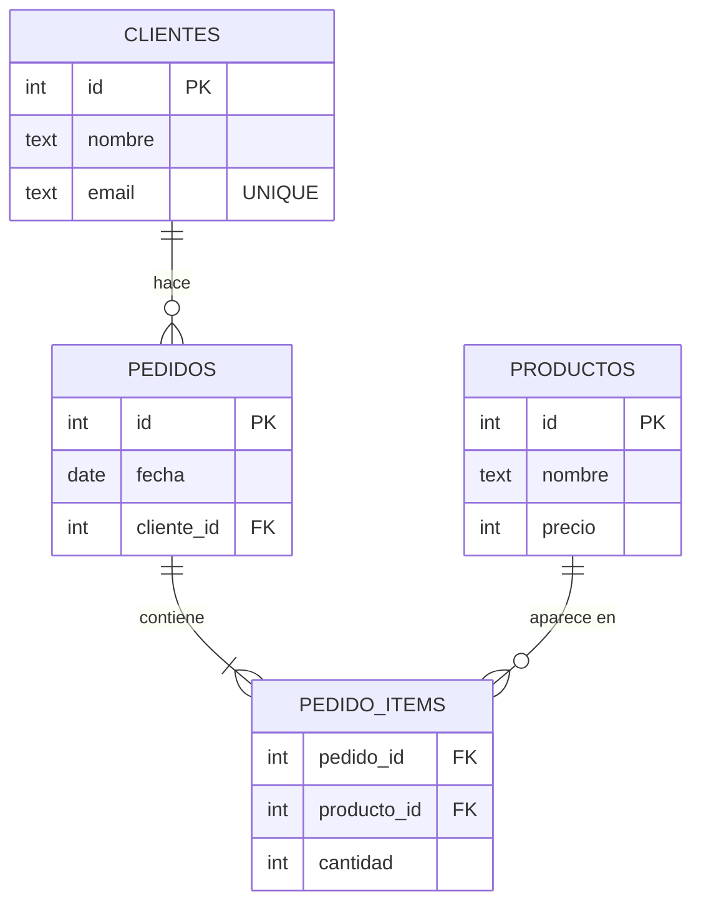
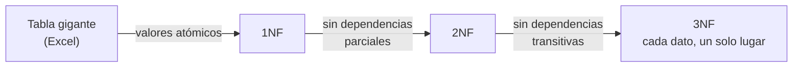

import Reto from "@components/Reto.astro";
import Solucion from "@components/Solucion.astro";
import Quiz from "@components/Quiz.astro";
import CheckDominio from "@components/CheckDominio.astro";
import Nivel from "@components/Nivel.astro";

<Nivel nivel="básico" />

Casi toda la lógica de negocio que vas a escribir en tu carrera termina en el mismo lugar: una base de datos que guarda los datos cuando tu programa se apaga. Una API sin base de datos es una calculadora con buena presentación. Y entre todas las formas de guardar datos, una ganó el mundo hace cincuenta años y no lo ha soltado: la **base de datos relacional**, manejada con un lenguaje llamado **SQL**. Bancos, hospitales, tu banco, el sistema de tu trabajo, el backend de la app de IA que vas a construir en esta fase: casi todos hablan SQL. Esta lección es donde aprendes a hablarlo —y, más importante, a *diseñar* lo que va a guardar.

:::tip[Si ya tocaste bases de datos antes]
¿Ya escribiste algún `SELECT`, ya creaste tablas, ya viste un diagrama entidad-relación? Perfecto: úsala como **diagnóstico**, no la saltes. Anda directo a los **dos ejercicios Primero-Sin-IA** (sección 7): el primero te pide *diseñar un esquema desde un requisito en prosa* —que es lo que mide una entrevista de backend, no si te sabes la sintaxis—; el segundo, escribir consultas reales contra una base sembrada. Si los cierras limpio en el timebox y puedes defender por qué normalizaste así y qué índice pusiste, valida con el check de dominio (sección 8) y avanza a [`3.2` Queries avanzadas](/fase-3-backend/3-2-queries-avanzadas/). Si te trabas justificando la normalización o el costo de un índice, vuelve a las secciones 4 y 6.
:::

## 1. Qué vas a saber hacer

Al terminar, sin IA y sin notas, podrás:

- **O1 — Diseñar** un esquema relacional a partir de requisitos en prosa: identificar entidades, atributos y relaciones (1:1, 1:N, N:M), y traducirlo a tablas con **claves primarias y foráneas** correctas.
- **O2 — Explicar y aplicar** la normalización hasta **3NF** (y reconocer las anomalías de inserción, actualización y borrado que evita), justificando **cuándo desnormalizar** a propósito.
- **O3 — Escribir** consultas SQL básicas correctas (`SELECT`/`INSERT`/`UPDATE`/`DELETE` con `WHERE`, `ORDER BY`, `GROUP BY`) y **decidir qué columnas indexar**, defendiendo el trade-off entre lectura más rápida y escritura más lenta.

## 2. Por qué importa (el dinero está aquí)

> 💰 **Por qué importa:** el diseño de APIs REST es el skill #1 del mercado backend, y debajo de toda API REST hay un esquema de base de datos. Un esquema **mal diseñado** es la deuda técnica más cara que existe: una vez que tienes datos en producción, cambiarlo es como reparar los cimientos de una casa habitada. Un semi-senior se distingue de un junior precisamente aquí —el junior hace `CREATE TABLE` y sigue; el semi-senior se detiene, modela las entidades, normaliza, elige las claves y *defiende por qué*.

Tres razones concretas por las que esto te paga:

1. **Es examinable y filtra.** En una entrevista de backend te darán un requisito ("diseña la base de datos para un sistema de reservas") y dibujarás tablas en una pizarra. No hay IA en esa pizarra. Saber modelar a mano es ventaja de mercado por la misma razón que el live coding: es lo que la IA no piensa por ti.
2. **Es la raíz del rendimiento.** El antipatrón más caro de los backends —el **problema N+1**, que verás en [`3.5`](/fase-3-backend/3-5-orms-problema-n1/)— nace de un mal modelo y de no entender índices. Y un `WHERE` sin índice sobre una tabla de millones de filas es el endpoint que tarda ocho segundos. Diseñar bien la base de datos es diseñar bien la latencia.
3. **Es seguridad.** La vulnerabilidad web #1 histórica es **SQL Injection** (la verás hands-on en [`3.13`](/fase-3-backend/3-13-owasp-top10-web/)). Para defenderte de ella primero tienes que entender qué es una consulta SQL y cómo se construye. No puedes proteger lo que no entiendes.

Honestidad: en el día a día rara vez escribirás SQL crudo a mano —usarás un ORM (lo verás en [`3.5`](/fase-3-backend/3-5-orms-problema-n1/))—. Pero el ORM genera SQL por debajo, y cuando algo va lento o da resultados raros, **tienes que poder leer y razonar el SQL que genera**. Quien no entiende SQL queda a merced del ORM. Por eso empezamos por aquí, sin atajos.

## 3. Lo que ya traes (actívalo)

Esta sub-unidad construye sobre cosas que ya practicaste:

- De [`0.7` Fundamentos de programación](/fase-0-fundamentos/0-7-fundamentos-programacion/): la idea de un **diccionario** (clave → valor) y de una **lista de diccionarios**. Una tabla es exactamente eso: una lista de filas, donde cada fila es un diccionario columna → valor. Lo que aprendes hoy es cómo darle estructura y reglas a esa lista.
- De [`0.8` Spec-first](/fase-0-fundamentos/0-8-spec-first-stack-traces/): arrancar definiendo entradas, salidas y casos borde **antes** de codear. Diseñar un esquema es spec-first puro: defines el modelo de datos antes de escribir una sola línea de la API.
- De [`2.1` Big-O](/fase-2-ingenieria/2-1-dsa-nivel-trabajo/): la diferencia entre buscar en una lista (O(n), recorre todo) y buscar por clave en un `dict`/`set` (O(1), va directo). Un **índice** de base de datos es esa misma idea aplicada a una tabla: convierte un escaneo lineal en una búsqueda casi directa. Misma intuición, otro contexto.

Antes de seguir, responde de memoria:

<Quiz
  question="Tienes una lista de diccionarios en Python, cada uno con los datos de un usuario, y necesitas comprobar muchísimas veces si existe un usuario con cierto email. ¿Qué idea de la Fase 2 hace esa búsqueda drásticamente más rápida que recorrer la lista entera cada vez?"
  options={[
    "Ordenar la lista alfabéticamente y recorrerla igual",
    "Construir un índice por email (como las claves de un dict) para ir directo, en vez de escanear",
    "Guardar más copias de la lista en memoria",
  ]}
  answer={1}
  explanation="Recorrer la lista es O(n). Un índice por email —la misma idea que las claves de un dict, que dan lookup O(1)— te lleva directo a la fila sin recorrer. Eso es, literalmente, lo que hace un índice de base de datos sobre una columna. Lo retomamos en la sección 6."
/>

## 4. Ejemplo resuelto, pensado en voz alta

Voy a diseñar una base de datos desde cero a partir de un requisito, razonando en voz alta como lo haría frente a una pizarra. **No leas esto como un resultado: léelo como me oirías pensar.** El diseño es el producto; las tablas son la prueba.

> **Requisito:** "Quiero registrar los pedidos de mi tienda. Cada pedido lo hace un cliente y puede incluir varios productos, con la cantidad de cada uno."

### 4.1 El instinto que hay que matar: una sola tabla gigante

Lo primero que se le ocurre a casi todo el mundo: una tabla con todo junto, como una planilla de Excel.

| pedido_id | fecha | cliente_nombre | cliente_email | productos |
|---|---|---|---|---|
| 1 | 2026-06-01 | Ana Pérez | ana@mail.cl | "Teclado x1, Mouse x2" |
| 2 | 2026-06-02 | Ana Pérez | ana@mail.cl | "Monitor x1" |

Razono en voz alta: *"Funciona para mirar... y es un desastre para todo lo demás. Veo tres problemas, y tienen nombre técnico —se llaman **anomalías**:"*

- *"**Anomalía de actualización:** si Ana cambia su email, tengo que actualizarlo en **cada fila** donde aparece. Si me salto una, ahora tengo dos emails distintos para la misma persona. El dato vive duplicado, y los datos duplicados se desincronizan."*
- *"**Anomalía de inserción:** ¿cómo registro un cliente nuevo que todavía no hizo ningún pedido? No puedo: no tengo fila donde meterlo sin inventar un pedido falso."*
- *"**Anomalía de borrado:** si borro el único pedido de un cliente, borro al cliente entero sin querer. Perdí información que no quería perder."*

*"Y el campo `productos` con texto `'Teclado x1, Mouse x2'` es lo peor: no puedo preguntarle a la base de datos '¿cuántos teclados vendí en total?' sin parsear strings a mano. Un valor de una celda debe ser **atómico** —un solo dato—, no una lista escondida en texto."*

### 4.2 La cura: separar en entidades (modelado entidad-relación)

Razono: *"Cada 'cosa' del mundo real que tiene identidad propia y vida propia es una **entidad**, y merece su **propia tabla**. ¿Qué entidades hay aquí?"*

- **Cliente** — tiene identidad propia (existe aunque no haya pedido).
- **Producto** — tiene identidad propia (existe en el catálogo aunque nadie lo compre).
- **Pedido** — un evento con identidad propia (fecha, quién lo hizo).

*"Ahora las **relaciones** entre entidades. Hay tres formas, y reconocerlas es el corazón del modelado:"*

- **1:N (uno a muchos):** un cliente hace muchos pedidos, pero cada pedido es de **un solo** cliente. Esta es la relación más común. Se implementa poniendo una **clave foránea** en el lado "muchos": la tabla `pedidos` lleva una columna `cliente_id` que apunta a la fila del cliente.
- **N:M (muchos a muchos):** un pedido tiene muchos productos, y un producto aparece en muchos pedidos. *"Aquí está la trampa: no puedo poner la clave foránea en ninguno de los dos lados, porque ambos son 'muchos'. Una columna guarda un solo valor, no una lista."* La solución universal: una **tabla intermedia** (también llamada tabla de unión o associative table) que parte el N:M en dos relaciones 1:N. La llamo `pedido_items`: cada fila dice "en el pedido X va el producto Y, cantidad Z".
- **1:1 (uno a uno):** menos común (p. ej. un usuario y su perfil extendido). Se resuelve compartiendo clave o con una foránea única.



*"Lee el diagrama: `cliente ||--o{ pedidos` significa 'un cliente tiene cero o muchos pedidos'. La tabla intermedia `pedido_items` resuelve el N:M: el `Teclado x1, Mouse x2` del Excel ahora son dos filas limpias, cada una con su cantidad. Y `'¿cuántos teclados vendí?'` pasa a ser una pregunta trivial."*

### 4.3 Claves: primaria y foránea (las que sostienen todo)

*"Cada tabla necesita una forma de identificar una fila sin ambigüedad: su **clave primaria** (PK). Dos reglas: es **única** (no se repite) y **no nula** (siempre tiene valor)."*

Hay dos escuelas para elegirla:

- **Clave natural:** un dato del mundo real que ya es único (el email de un cliente, el RUT). Problema: cambian (un email se actualiza) y a veces no son tan únicos como crees. Una PK no debería cambiar nunca.
- **Clave sustituta (surrogate):** un `id` numérico autogenerado por la base de datos, sin significado de negocio. **Es la opción por defecto** en backend moderno, precisamente porque nunca cambia y no depende de reglas del mundo real. El email sigue existiendo como columna `UNIQUE`, pero la *identidad* de la fila es el `id`.

*"La **clave foránea** (FK) es una columna que apunta a la PK de otra tabla. `pedidos.cliente_id` es una FK que apunta a `clientes.id`. Su superpoder es la **integridad referencial**: la base de datos **rechaza** un pedido cuyo `cliente_id` no exista. No puedes tener un pedido huérfano. Esa garantía la da el motor, no tu código —y por eso es confiable."*

### 4.4 El esquema en SQL (DDL)

*"Ahora lo escribo. El lenguaje para definir la estructura se llama **DDL** (Data Definition Language): `CREATE TABLE`."* Cada columna lleva un **tipo de dato**, que le dice a la base de datos qué guardar y le permite validar:

```sql
CREATE TABLE clientes (
    id      INTEGER GENERATED ALWAYS AS IDENTITY PRIMARY KEY,
    nombre  TEXT    NOT NULL,
    email   TEXT    NOT NULL UNIQUE
);

CREATE TABLE productos (
    id      INTEGER GENERATED ALWAYS AS IDENTITY PRIMARY KEY,
    nombre  TEXT    NOT NULL,
    precio  INTEGER NOT NULL CHECK (precio >= 0)   -- en pesos, entero
);

CREATE TABLE pedidos (
    id          INTEGER GENERATED ALWAYS AS IDENTITY PRIMARY KEY,
    fecha       DATE    NOT NULL DEFAULT CURRENT_DATE,
    cliente_id  INTEGER NOT NULL REFERENCES clientes(id)
);

CREATE TABLE pedido_items (
    pedido_id    INTEGER NOT NULL REFERENCES pedidos(id),
    producto_id  INTEGER NOT NULL REFERENCES productos(id),
    cantidad     INTEGER NOT NULL CHECK (cantidad > 0),
    PRIMARY KEY (pedido_id, producto_id)   -- clave primaria compuesta
);
```

Razono cada decisión: *"`NOT NULL` donde el dato es obligatorio. `UNIQUE` en `email` porque no quiero dos clientes con el mismo correo. `REFERENCES` declara la clave foránea —ahí está la integridad referencial—. `CHECK` valida reglas (precio no negativo, cantidad positiva). Y en `pedido_items` la PK es **compuesta** `(pedido_id, producto_id)`: tiene sentido, no quiero el mismo producto dos veces en el mismo pedido —si pides más, subes la `cantidad`."*

Sobre tipos: usa el **más específico que sirva**. `DATE` para fechas (no texto: así puedes ordenar y filtrar por rango). `INTEGER` para enteros. Para texto, `TEXT` (o `VARCHAR(n)` si quieres un límite). Para dinero, ojo: **nunca uses `FLOAT` para plata** —los decimales binarios redondean mal y pierdes centavos—; usa `NUMERIC`/`DECIMAL`, o guarda enteros (pesos, o centavos). El tipo correcto es tu primera línea de validación.

> `GENERATED ALWAYS AS IDENTITY` es la forma estándar y moderna (PostgreSQL 10+) de pedir un id autoincremental. Verás también `SERIAL` en código antiguo de Postgres: hace casi lo mismo, pero `IDENTITY` es el estándar SQL y el recomendado hoy.

### 4.5 Normalización: el nombre formal de lo que acabo de hacer

*"Lo que hice intuitivamente —separar en tablas para matar la duplicación— tiene un nombre y tres niveles. La **normalización** es el proceso de organizar tablas para que cada dato viva en **un solo lugar**."*

- **1NF (Primera Forma Normal):** cada celda tiene un valor **atómico**; nada de listas en una celda. *(Matar el `'Teclado x1, Mouse x2'` fue llegar a 1NF.)*
- **2NF:** estás en 1NF **y** ningún atributo depende solo de *parte* de una clave compuesta. *(Si en `pedido_items` hubiera puesto el `nombre_producto`, dependería solo de `producto_id` —parte de la PK compuesta—, no del pedido. Sacarlo a la tabla `productos` es llegar a 2NF.)*
- **3NF:** estás en 2NF **y** ningún atributo depende de otro atributo no-clave (sin dependencias **transitivas**). *(Si en `pedidos` hubiera puesto `cliente_email`, dependería de `cliente_id`, no del pedido. Sacarlo a `clientes` es llegar a 3NF.)*

La regla práctica que cubre el 95% de los casos: **cada dato no-clave depende de la clave, de toda la clave, y de nada más que la clave.** Si un dato describe a *otra* cosa, esa otra cosa quiere su propia tabla.



## 5. Errores que vas a tener (y por qué)

:::caution[Podrías pensar que una tabla gigante es "más simple"]
Lo parece para *leer* y es un campo minado para *mantener*. La duplicación lleva inevitablemente a las tres anomalías (inserción, actualización, borrado) de la sección 4.1: el mismo dato en dos lugares termina con dos valores distintos. "Simple" al escribir, carísimo al evolucionar. La normalización no es burocracia académica: es lo que evita que tu base de datos se contradiga a sí misma.
:::

:::caution[Podrías pensar que más normalización siempre es mejor]
No. La 3NF es el objetivo por defecto, pero hay un momento legítimo para **desnormalizar a propósito**: cuando una consulta de lectura crítica obliga a reconstruir el mismo dato una y otra vez (uniendo muchas tablas) y la latencia importa más que la duplicación. Ejemplo clásico: guardar un `total` precalculado en `pedidos` en vez de sumarlo cada vez. La diferencia entre desnormalizar y simplemente diseñar mal es una sola: **lo haces conscientemente, mides que valió la pena, y lo documentas** (un ADR, como aprendiste en [`2.13`](/fase-2-ingenieria/2-13-colaboracion-spec-driven-adrs/)). Normaliza primero; desnormaliza con evidencia, no por flojera.
:::

:::caution[Podrías pensar que un índice siempre es bueno, así que indexa todo]
Un índice acelera las **lecturas** (`WHERE`, `JOIN`, `ORDER BY` sobre esa columna) convirtiendo un escaneo O(n) en una búsqueda casi O(log n). Pero **no es gratis**: cada índice ocupa disco y, sobre todo, **ralentiza cada `INSERT`, `UPDATE` y `DELETE`**, porque el motor tiene que mantener también el índice actualizado. Indexar todas las columnas hace tus escrituras lentas y tu base de datos pesada, para acelerar consultas que quizás nunca haces. La regla: **indexa las columnas por las que filtras o haces join con frecuencia** (las FK son candidatas naturales), y mide. Un índice es una apuesta de "leo mucho más de lo que escribo por esta columna".
:::

:::caution[Podrías pensar que una FK es "solo un número que copio"]
Una clave foránea **declarada** (`REFERENCES`) es una garantía que hace cumplir el motor: no te deja insertar un pedido con un `cliente_id` inexistente, ni borrar un cliente que todavía tiene pedidos (a menos que definas qué hacer en cascada). Si solo guardas un número sin declarar la FK, no tienes integridad referencial: tarde o temprano tendrás filas huérfanas apuntando a la nada, y nadie te avisará. La declaración es lo que convierte un número en una relación confiable.
:::

:::caution[Podrías pensar que las filas tienen un orden y que GROUP BY "ordena"]
Dos confusiones clásicas. Una: una tabla es un **conjunto sin orden**; si no pones `ORDER BY`, el motor puede devolver las filas en cualquier orden, y ese orden puede cambiar entre ejecuciones. Nunca asumas orden sin pedirlo. Dos: `GROUP BY` **no** ordena —agrupa filas para calcular un agregado por grupo (un `COUNT`, un `SUM`)—. La regla de oro de `GROUP BY`: en el `SELECT` solo puedes poner las columnas por las que agrupaste o funciones de agregado; poner una columna suelta que no agrupaste es un error de lógica (algunos motores lo permiten y te devuelven basura, otros lo rechazan).
:::

## 6. SQL para mover datos (DML), y los índices en una pasada

Ya viste el DDL (definir estructura). Ahora el **DML** (Data Manipulation Language): las cuatro operaciones que usarás todos los días, conocidas como **CRUD** (Create, Read, Update, Delete).

### 6.1 INSERT — crear filas

```sql
INSERT INTO clientes (nombre, email)
VALUES ('Ana Pérez', 'ana@mail.cl');
```

Listas las columnas y luego sus valores. No incluyes `id`: la base de datos lo genera. Listar las columnas explícitamente (en vez de `INSERT INTO clientes VALUES (...)`) es un hábito de calidad: tu `INSERT` no se rompe si mañana agregan una columna.

### 6.2 SELECT — leer filas (la operación reina)

```sql
-- Todas las columnas de todos los productos
SELECT * FROM productos;

-- Solo nombre y precio, de los productos que cuestan menos de 20.000
SELECT nombre, precio
FROM productos
WHERE precio < 20000;
```

`WHERE` **filtra** filas con una condición. Combina condiciones con `AND`/`OR`, compara con `=`, operadores de rango, `IN (...)`, `BETWEEN a AND b`, `LIKE 'patrón%'` para texto, e `IS NULL` para "sin valor" (ojo: `NULL` no se compara con `=`, se pregunta con `IS NULL`).

```sql
-- Los 3 más caros, del más caro al más barato
SELECT nombre, precio
FROM productos
ORDER BY precio DESC
LIMIT 3;
```

`ORDER BY columna ASC|DESC` ordena el resultado (ascendente por defecto). `LIMIT n` recorta a las primeras `n` filas —útil para "top N" y para paginar.

```sql
-- Cuántos productos hay por categoría
SELECT categoria, COUNT(*) AS total
FROM productos
GROUP BY categoria;
```

`GROUP BY` colapsa las filas de cada grupo en una sola, sobre la que calculas un **agregado**: `COUNT(*)` (cuántas), `SUM(precio)`, `AVG(precio)`, `MIN`/`MAX`. `AS total` le pone un alias legible a la columna calculada. Si quieres filtrar *después* de agrupar (p. ej. "categorías con más de 5 productos"), se usa `HAVING` —el `WHERE` de los grupos— pero eso lo profundizas en [`3.2`](/fase-3-backend/3-2-queries-avanzadas/).

### 6.3 UPDATE y DELETE — modificar y borrar (con cuidado)

```sql
UPDATE productos
SET precio = precio + 1000
WHERE categoria = 'cables';

DELETE FROM productos
WHERE stock = 0;
```

:::danger[El WHERE no es opcional en la práctica]
`UPDATE productos SET precio = 0;` **sin `WHERE`** actualiza **todas** las filas. `DELETE FROM productos;` sin `WHERE` **vacía la tabla**. Es uno de los errores más caros y reales que existen en producción. Hábito de semi-senior: antes de un `UPDATE`/`DELETE`, escribe primero el `SELECT` con el mismo `WHERE` y mira **qué filas** vas a tocar. Si el `SELECT` devuelve lo correcto, recién entonces cambias el verbo.
:::

### 6.4 Índices, concretamente

Un índice es una estructura ordenada y aparte (típicamente un *B-tree*) que el motor mantiene sobre una o más columnas, para encontrar filas sin escanear toda la tabla —la misma idea del lookup O(1) del `dict` que viste en [`2.1`](/fase-2-ingenieria/2-1-dsa-nivel-trabajo/), aplicada a millones de filas en disco.

```sql
-- Si filtro pedidos por cliente todo el tiempo, indexo esa FK:
CREATE INDEX idx_pedidos_cliente ON pedidos (cliente_id);
```

Lo que necesitas internalizar hoy:

- La **PK** y las columnas `UNIQUE` ya vienen indexadas automáticamente.
- Las **claves foráneas** son las candidatas #1 a indexar manualmente: filtras y unes por ellas constantemente.
- Cada índice **acelera lecturas pero penaliza escrituras** y ocupa espacio. Es un trade-off, no un regalo. Indexa con intención y mide (en [`3.3`](/fase-3-backend/3-3-postgresql-a-fondo/) usarás `EXPLAIN` para *ver* si una consulta usa tu índice o escanea la tabla entera).

## 7. Ejercicios Primero-Sin-IA

Dos ejercicios, en orden. **Resuélvelos a mano, sin IA, dentro del timebox.** El primero es de diseño (lo más examinable); el segundo, de escribir SQL real contra una base que corre de verdad.

<Reto title="Diseña un esquema desde requisitos: reservas de coworking" timebox="40–45 min">

Te dan este requisito en prosa, tal como te lo daría un cliente o un entrevistador:

> "Administro un coworking. Tengo **socios** (con nombre y email). Tengo **salas** (con nombre, capacidad de personas y un precio por hora). Un socio puede **reservar** una sala para un día y un bloque horario (hora de inicio y fin). Quiero saber qué reservas tiene cada socio y qué reservas tiene cada sala. Un socio puede tener muchas reservas; una sala se reserva muchas veces."

Tu tarea (Primero-Sin-IA, en este orden):

1. **Identifica las entidades** y sus atributos. Decide el tipo de dato de cada uno.
2. **Identifica las relaciones** (1:1, 1:N o N:M) y cómo se implementan (¿dónde va la clave foránea? ¿hace falta tabla intermedia?).
3. **Escribe el DDL** (`CREATE TABLE`) en `esquema.sql`: claves primarias, claves foráneas (`REFERENCES`), `NOT NULL`, `UNIQUE` y `CHECK` donde corresponda.
4. **Decide los índices** y escríbelos, justificando cada uno.
5. En `NOTAS.md`, escribe: el tipo de cada relación, **por qué tu esquema está en 3NF** (o dónde elegiste no estarlo y por qué), y qué consulta de lectura motivó cada índice.

**Hecho significa:**
- [ ] `esquema.sql` crea las tablas necesarias con PK en todas, FK declaradas con `REFERENCES`, y tipos de dato sensatos.
- [ ] No hay datos duplicados que debieran vivir en otra tabla (el email del socio aparece **una sola vez** en todo el esquema).
- [ ] En `NOTAS.md` justificas la normalización con el lenguaje de la lección (atómico, dependencia de la clave, anomalías) —no "porque sí".
- [ ] Cada índice que creaste responde a una consulta concreta que nombras; no indexaste "por si acaso".
- [ ] Puedes explicar **sin notas**, en voz alta, qué anomalía evitas al separar `socios` de `reservas`.

Entregable: `ejercicios/fase-3/disenar-esquema-reservas/` (carpeta del repo) — tu `esquema.sql` y tu `NOTAS.md`.

<Solucion title="Pista (ábrela solo si superaste el timebox)">
Son tres entidades: `socios`, `salas` y `reservas`. La relación socio–sala es N:M (un socio usa muchas salas, una sala la usan muchos socios), **pero** la reserva no es un simple cruce: tiene atributos propios (fecha, hora inicio, hora fin). Eso es exactamente cuándo la tabla intermedia se convierte en una **entidad por derecho propio**: `reservas` lleva dos FK (`socio_id`, `sala_id`) más sus atributos de tiempo. El email del socio va **solo** en `socios` (si lo repites en `reservas`, rompes 3NF y abres la anomalía de actualización). Índice candidato: `socio_id` y `sala_id` en `reservas`, porque las dos consultas del requisito ("reservas de cada socio", "reservas de cada sala") filtran por ahí. Es una pista, no la solución.
</Solucion>

</Reto>

<Reto title="Escribe SQL contra una base que corre" timebox="30–40 min">

En la carpeta del ejercicio tienes una base de datos sembrada (`seed.sql`) con una sola tabla `productos`. Tienes que escribir **una consulta por archivo** (`consultas/q1.sql` … `consultas/q7.sql`); un test las ejecuta sobre la base real (SQLite, sin instalar nada) y compara el resultado.

Las tareas (resuélvelas **sin IA**, una por una, prediciendo el resultado antes de correr el test):

- **q1** — `SELECT`: nombre y stock de los productos de la categoría `'periféricos'` con stock mayor que 0.
- **q2** — `ORDER BY` + `LIMIT`: nombre y precio de los **3 productos más caros**, del más caro al más barato.
- **q3** — `GROUP BY` + `COUNT`: cuántos productos hay por categoría (devuelve `categoria` y el conteo).
- **q4** — `GROUP BY` + `SUM`: la suma de `stock` por categoría (devuelve `categoria` y la suma).
- **q5** — `INSERT`: agrega el producto `'Alfombrilla'`, categoría `'accesorios'`, precio `9990`, stock `50` (deja que la base asigne el `id`).
- **q6** — `UPDATE`: sube el precio de todos los productos de la categoría `'cables'` en `1000`.
- **q7** — `DELETE`: elimina los productos sin stock (`stock = 0`).

**Hecho significa:**
- [ ] `pytest` pasa en verde (las 7 consultas dan el resultado esperado).
- [ ] En q5/q6/q7 escribiste primero el `SELECT` con el mismo `WHERE` para ver qué filas tocabas, antes de ejecutar el verbo destructivo (cuéntalo en una línea de comentario).
- [ ] No usaste `JOIN` (no hace falta: todo es una sola tabla; los `JOIN` son de [`3.2`](/fase-3-backend/3-2-queries-avanzadas/)).
- [ ] Puedes explicar **sin notas** por qué `GROUP BY categoria` te deja poner `categoria` y `COUNT(*)` en el `SELECT`, pero no `nombre`.

Entregable: `ejercicios/fase-3/consultas-sql-tienda/` (carpeta del repo) — los 7 archivos `consultas/qN.sql` completados.

<Solucion title="Pista (ábrela solo si superaste el timebox)">
q1: dos condiciones con `AND` (`categoria = 'periféricos' AND stock > 0`). q2: `ORDER BY precio DESC LIMIT 3`. q3: `SELECT categoria, COUNT(*) ... GROUP BY categoria`. q4: igual pero `SUM(stock)`. q5: `INSERT INTO productos (nombre, categoria, precio, stock) VALUES (...)` —lista las columnas, omite el `id`. q6: `UPDATE productos SET precio = precio + 1000 WHERE categoria = 'cables'` —fíjate que `precio = precio + 1000` usa el valor actual. q7: `DELETE FROM productos WHERE stock = 0`. Recuerda: el `WHERE` en q6 y q7 es lo que evita el desastre de tocar toda la tabla. Es una pista, no la solución.
</Solucion>

</Reto>

## 8. Check de dominio

Sin mirar la lección, en voz alta o por escrito:

<CheckDominio
  items={[
    "Explicar qué son las tres anomalías (inserción, actualización, borrado) y dar un ejemplo de cada una.",
    "Distinguir una relación 1:N de una N:M y decir cómo se implementa cada una (dónde va la FK, cuándo hace falta tabla intermedia).",
    "Explicar la diferencia entre clave primaria y clave foránea, y qué garantía da una FK declarada.",
    "Decir qué significa 1NF, 2NF y 3NF con la regla práctica 'cada dato depende de la clave, de toda la clave y de nada más que la clave'.",
    "Dar un caso concreto donde desnormalizar a propósito es la decisión correcta, y qué hay que hacer al hacerlo.",
    "Explicar por qué un índice acelera lecturas pero penaliza escrituras, y qué columnas son las primeras candidatas a indexar.",
    "Escribir de memoria un SELECT con WHERE, uno con ORDER BY + LIMIT y uno con GROUP BY + COUNT.",
    "Explicar por qué un UPDATE o DELETE sin WHERE es peligroso y qué hábito lo previene.",
  ]}
/>

Si marcaste menos de seis, vuelve a la sección correspondiente **antes** de avanzar. No es un examen: es honestidad contigo.

<Quiz
  question="Estás diseñando una tienda. Un producto pertenece a una categoría, y una categoría tiene muchos productos. ¿Cómo modelas esta relación 1:N?"
  options={[
    "Una columna de texto 'categoria' repetida en cada fila de productos, con el nombre de la categoría escrito",
    "Una tabla 'categorias' (id, nombre) y una FK 'categoria_id' en la tabla 'productos' que apunta a categorias.id",
    "Una tabla intermedia 'producto_categorias' con dos claves foráneas",
  ]}
  answer={1}
  explanation="Es 1:N (un producto, una categoría; una categoría, muchos productos), así que la FK va en el lado 'muchos': productos.categoria_id → categorias.id. Repetir el nombre de la categoría como texto (opción 1) duplica el dato y abre la anomalía de actualización (renombrar la categoría obliga a tocar mil filas). La tabla intermedia (opción 3) solo hace falta para N:M, y aquí no lo es."
/>

## 9. Recursos (documentación oficial primero)

- **PostgreSQL — Data Definition (oficial):** [postgresql.org/docs/current/ddl.html](https://www.postgresql.org/docs/current/ddl.html) — tablas, tipos, constraints, claves primarias y foráneas, explicado por la fuente que vas a usar en esta fase.
- **PostgreSQL — Tutorial de consultas (oficial):** [postgresql.org/docs/current/tutorial-sql.html](https://www.postgresql.org/docs/current/tutorial-sql.html) — `SELECT`, `WHERE`, agregados y `GROUP BY` con ejemplos ejecutables.
- **PostgreSQL — Índices (oficial):** [postgresql.org/docs/current/indexes.html](https://www.postgresql.org/docs/current/indexes.html) — qué son, cuándo crearlos y su costo.
- **PostgreSQL — Tipos de datos (oficial):** [postgresql.org/docs/current/datatype.html](https://www.postgresql.org/docs/current/datatype.html) — por qué `NUMERIC` y no `FLOAT` para dinero, qué tipos existen.
- **SQLite — sintaxis SQL (oficial):** [sqlite.org/lang.html](https://www.sqlite.org/lang.html) — el motor que usan los tests del segundo ejercicio; sintaxis casi idéntica al SQL estándar.
- **Use The Index, Luke (comunidad):** [use-the-index-luke.com](https://use-the-index-luke.com/) — la mejor explicación gratuita de cómo funcionan los índices por dentro. Para cuando quieras profundizar.

## 10. Conexión con el capstone de la fase

El **Capstone F3 — API de producción** ([proyecto](/fase-3-backend/proyecto/)) es una API FastAPI con PostgreSQL, auth y tests. Esta lección es su cimiento literal:

- El **esquema relacional** que diseñes aquí es el modelo de datos sobre el que se montan todos los endpoints. Si las entidades y relaciones están mal modeladas, ninguna cantidad de buen código de API lo arregla —arrastras el error hasta producción.
- Las **claves foráneas y la integridad referencial** son las que evitan que tu API cree datos huérfanos. La validación de pydantic protege la entrada; las constraints de la base de datos son la última línea de defensa, la que el motor garantiza pase lo que pase en el código.
- La decisión de **qué indexar** es la diferencia entre un endpoint de listado que responde en 20 ms y uno que se cae con 100.000 filas. Tu capstone se evalúa con datos reales; el índice correcto es parte del "hecho significa".

Y hacia adelante: en [`3.2`](/fase-3-backend/3-2-queries-avanzadas/) unirás estas tablas con `JOIN`; en [`3.3`](/fase-3-backend/3-3-postgresql-a-fondo/) verás transacciones e `EXPLAIN`; en [`3.5`](/fase-3-backend/3-5-orms-problema-n1/) un ORM generará este SQL por ti —y reconocerás el N+1 como el bucle anidado de [`2.1`](/fase-2-ingenieria/2-1-dsa-nivel-trabajo/) disfrazado de consultas. Nada de esto se recicla: se acumula.

## 11. Reflexión y repaso espaciado

Cierra escribiendo dos o tres frases: **¿qué dato de algún proyecto tuyo (una planilla, un JSON, una app que usas) está hoy duplicado en varios lugares, y qué anomalía podría causar?** Entrenar el ojo para ver duplicación es el reflejo central de esta lección.

Gancho de **spaced repetition**:

- **Mañana:** dibuja de memoria, sin mirar, el diagrama entidad-relación de la tienda (clientes, productos, pedidos, pedido_items) y explica en una frase por qué `pedido_items` existe. Si no puedes, no lo aprendiste todavía.
- **En 3 días:** toma un dominio nuevo de tu vida (tu biblioteca de libros, tus suscripciones, un torneo) y modela su esquema en 20 minutos, Primero-Sin-IA. Identifica al menos una relación N:M.
- **En 1 semana:** explícale a alguien (o a una grabación) la diferencia entre 1:N y N:M usando las palabras "clave foránea" y "tabla intermedia". Enseñarlo en voz alta es el ensayo exacto de la pregunta de pizarra "diséñame la base de datos para X".
