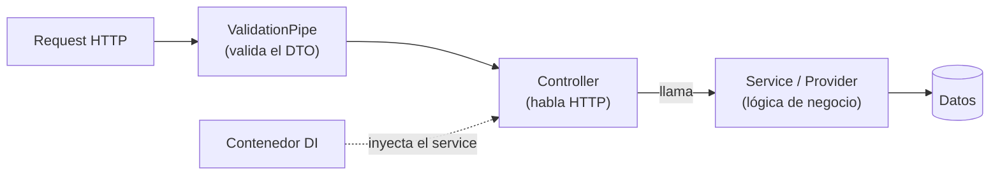

import Reto from "@components/Reto.astro";
import Solucion from "@components/Solucion.astro";
import Quiz from "@components/Quiz.astro";
import CheckDominio from "@components/CheckDominio.astro";
import Nivel from "@components/Nivel.astro";

<Nivel nivel="profundización" />

:::note[Esta lección es opcional — profundización, no ruta crítica]
El **troncal** de la Fase 3 es Python + FastAPI (lo viste en [`3.8`](/fase-3-backend/3-8-backend-fastapi/)), y el **capstone de la fase se construye con ese stack**. NestJS vive aquí por dos razones concretas: (1) una porción enorme del backend del mercado corre en **Node/TypeScript**, y cuando una empresa quiere "estructura empresarial" en ese mundo, NestJS es el framework por defecto; (2) ver un **segundo backend** te obliga a separar lo que es "una idea de backend" (rutas, validación, inyección de dependencias) de lo que es "una peculiaridad de FastAPI". Saltar esta lección no te deja huecos en el camino crítico. Hacerla te da criterio para elegir, y una segunda puerta a más ofertas.
:::

## 1. Qué vas a saber hacer

Al terminar, sin IA y sin notas, podrás:

- **O1 — Explicar el trade-off** entre Express (minimalista) y NestJS (opinionado), y entre **NestJS y FastAPI**, para **decidir** cuál conviene a un proyecto dado, justificándolo con criterios concretos (lenguaje del equipo, tamaño del proyecto, cuánta estructura necesitas).
- **O2 — Implementar** un recurso REST en NestJS —módulo + controller + service con **inyección de dependencias**— que valida la entrada con un **DTO** + `ValidationPipe` global y mantiene el dominio separado del transporte (la excepción de negocio no sabe qué es un "404").
- **O3 — Explicar** qué problema resuelve la inyección de dependencias (DI) y por qué validar en el borde con un DTO es tu **primera defensa de seguridad**, conectándolo con lo que `pydantic` hace en FastAPI y con el hilo OWASP.

## 2. Por qué importa

> 💰 **Por qué importa:** la REST API es el skill #1 del mercado (alrededor del 70% de las ofertas la piden), y una parte gigante de ese backend vive en **Node/TypeScript**, no en Python. Cuando una oferta dice "Node + TypeScript + arquitectura escalable", en 2026 lo más probable es que el framework sea **NestJS**: es el estándar de facto para backends "enterprise" en Node, y aparece por nombre en muchas descripciones de puesto. Un AI/Automation Engineer que puede entregar un backend tanto en **Python (FastAPI)** como en **Node (NestJS)** no queda fuera de una vacante por el lenguaje del stack. Esa flexibilidad es, literalmente, más ofertas a las que puedes postular.

Y hay un beneficio que no se ve en el CV pero se nota en entrevista: **conocer dos backends te obliga a entender el patrón, no la herramienta**. Quien solo sabe FastAPI confunde "así se hace una API" con "así se hace en FastAPI". Cuando conoces los dos, puedes decir *por qué* NestJS resuelve la inyección de dependencias con un contenedor y FastAPI con `Depends`, y eso es justo lo que separa a un semi-senior de alguien que copió un tutorial.

## 3. Lo que ya traes (actívalo)

Esta lección reutiliza casi todo lo de la fase, traducido al mundo Node. Recupéralo antes de seguir:

- De [`3.7` Diseño de APIs REST](/fase-3-backend/3-7-diseno-apis-rest/): recursos, verbos, status codes, errores. NestJS es **otra implementación** de ese mismo diseño.
- De [`3.8` Backend con FastAPI](/fase-3-backend/3-8-backend-fastapi/): el modelo mental completo —validar la entrada en el borde, inyectar dependencias, separar el dominio del transporte— se traslada casi sin cambios. Vas a reconocerlo todo con otra cara.
- De [`3.9` Ports & adapters](/fase-3-backend/3-9-ports-adapters-hexagonal/): por qué la lógica de negocio no debe saber de HTTP. NestJS empuja esa separación con su estructura.
- De la Fase 1: TypeScript, las clases y los **decoradores** (`@Algo` encima de una clase o un método). NestJS está construido casi por completo sobre decoradores: si te incomodan, vuelve a esa parte antes de seguir.

Antes de avanzar, responde de memoria:

<Quiz
  question="En FastAPI, un cliente hace POST /tareas con un body al que le falta el campo obligatorio `titulo`. Tienes un modelo pydantic que lo declara requerido. ¿Quién detiene el request y con qué status?"
  options={[
    "Tu función de endpoint recibe titulo=None y tú decides qué hacer",
    "FastAPI lo rechaza ANTES de tu función con un 422, validando contra el modelo pydantic en el borde",
    "Responde 500 porque el JSON está incompleto",
  ]}
  answer={1}
  explanation="FastAPI valida el body contra el modelo pydantic antes de ejecutar tu código. NestJS hace exactamente lo mismo con un DTO + ValidationPipe: la validación vive en el borde, no esparcida en ifs dentro del handler. Reconocer que es el MISMO patrón con otra sintaxis es la mitad de esta lección."
/>

## 4. De Express a NestJS, en voz alta

Voy a razonar **paso a paso**. Primero te muestro el backend más simple posible en Node —Express— para que veas qué problema resuelve NestJS; después montamos el mismo recurso en NestJS y comparamos pieza por pieza con FastAPI.

### 4.1 Express: minimalista, y por qué eso es a la vez su virtud y su límite

**Express** es la base de casi todo Node. Es deliberadamente mínimo: te da rutas y poco más; tú decides la estructura. Un recurso de libros completo cabe en un archivo:

```typescript
// app.ts — Express puro
import express from "express";

const app = express();
app.use(express.json());

const libros = [{ id: 1, titulo: "Dune" }];

app.get("/libros/:id", (req, res) => {
  const libro = libros.find((l) => l.id === Number(req.params.id));
  if (!libro) return res.status(404).json({ error: "no existe" });
  res.json(libro);
});

app.post("/libros", (req, res) => {
  // ¿el body trae titulo? ¿es un string? ¿no viene vacío?
  // Lo validas a mano, con ifs, en CADA endpoint.
  if (typeof req.body.titulo !== "string" || req.body.titulo.trim() === "") {
    return res.status(400).json({ error: "titulo inválido" });
  }
  const nuevo = { id: libros.length + 1, titulo: req.body.titulo };
  libros.push(nuevo);
  res.status(201).json(nuevo);
});

app.listen(3000);
```

Esto **funciona**. Para un servicio chico, Express es perfecto: cero ceremonia. Pero mira el `POST`: la validación es un muro de `if` que tienes que **repetir en cada endpoint**, y nada te obliga a ordenar el código. En un proyecto de 5 endpoints da igual. En uno de 50, con varios desarrolladores, esa libertad se vuelve caos: cada quien estructura distinto, la validación se cuela a medias, y la lógica de negocio termina pegada a `req` y `res` (al transporte HTTP). Express no tiene opinión, y a cierto tamaño **la falta de opinión cuesta**.

### 4.2 NestJS: el mismo Express, pero con opiniones (y un contenedor de DI)

**NestJS** se construye *sobre* Express (puede usar Fastify por debajo también), pero le impone una estructura: organiza el código en **módulos**, separa los **controllers** (que hablan HTTP) de los **providers/services** (que tienen la lógica), valida con **DTOs**, y trae un **contenedor de inyección de dependencias** que arma todo por ti. Si vienes de FastAPI, el mapa mental es directo:

| Concepto | FastAPI (Python) | NestJS (Node/TS) |
|---|---|---|
| Validar la entrada en el borde | modelo `pydantic` | **DTO** (clase) + `class-validator` + `ValidationPipe` |
| Inyectar dependencias | `Depends(...)` | **contenedor DI** (constructor injection) |
| Error de "no existe" | `HTTPException(404)` o excepción de dominio + handler | `NotFoundException` (o excepción de dominio + filter) |
| Agrupar rutas | `APIRouter` | **módulo** + **controller** |
| Documentación OpenAPI | automática, integrada | `@nestjs/swagger` (se añade) |

La idea central de NestJS: **tú declaras las piezas y sus dependencias; el framework las instancia y las conecta**. No haces `new MiService()` a mano: lo pides en el constructor y NestJS te lo entrega. Eso es la inyección de dependencias, y es el corazón de todo lo demás.



:::tip[¿Qué es un decorador y por qué NestJS los usa tanto?]
Un **decorador** es ese `@Algo` que escribes encima de una clase, un método o un parámetro: `@Controller()`, `@Get()`, `@Injectable()`, `@Body()`. No es magia: es **metadata** que se adjunta al código. Cuando la app arranca, NestJS **lee** esa metadata para saber "esta clase es un controller", "este método responde a GET /tareas", "este parámetro viene del body". Es la misma idea que el decorador `@app.get(...)` de FastAPI, solo que NestJS la lleva a casi todo. Para que funcionen necesitas `experimentalDecorators` y `emitDecoratorMetadata` activados en `tsconfig.json` (el starter del ejercicio ya los trae).
:::

### 4.3 El service: la lógica de negocio, sin saber de HTTP

Empezamos por dentro hacia afuera. El **service** (un *provider*) tiene la lógica y **no sabe nada de HTTP**. Lo marcamos `@Injectable()` para que el contenedor pueda gestionarlo:

```typescript
// tareas.service.ts
import { Injectable, NotFoundException } from "@nestjs/common";

export interface Tarea {
  id: number;
  titulo: string;
  completada: boolean;
}

@Injectable()
export class TareasService {
  private tareas: Tarea[] = [];
  private siguienteId = 1;

  crear(titulo: string): Tarea {
    const tarea: Tarea = { id: this.siguienteId++, titulo, completada: false };
    this.tareas.push(tarea);
    return tarea;
  }

  listar(): Tarea[] {
    return this.tareas;
  }

  obtener(id: number): Tarea {
    const tarea = this.tareas.find((t) => t.id === id);
    if (!tarea) {
      throw new NotFoundException(`Tarea ${id} no encontrada`);
    }
    return tarea;
  }
}
```

Detente en `obtener`: lanza `NotFoundException`. Aquí hay un matiz importante que vas a defender más abajo. `NotFoundException` *sí* sabe que existe un 404 (es una excepción HTTP de NestJS). Para un service chico está bien y es idiomático. Pero si quieres el desacople total que viste en [`3.9`](/fase-3-backend/3-9-ports-adapters-hexagonal/), lanzarías una excepción de dominio propia (`TareaNoEncontrada`) y la traducirías a 404 con un **exception filter** —el equivalente al exception handler de FastAPI—. Empezamos con `NotFoundException` por claridad; el ejercicio te pide razonar el trade-off.

### 4.4 El DTO: el contrato de entrada (y tu primera defensa)

Un **DTO** (Data Transfer Object) es una **clase** que describe la forma de los datos que entran, con decoradores de `class-validator` que declaran las reglas:

```typescript
// dto/crear-tarea.dto.ts
import { IsNotEmpty, IsString } from "class-validator";

export class CrearTareaDto {
  @IsString()
  @IsNotEmpty()
  titulo: string;
}
```

`@IsString()` + `@IsNotEmpty()` es exactamente el `Field(min_length=1)` de pydantic, con otra sintaxis. La diferencia clave con FastAPI: en NestJS el DTO **tiene que ser una clase**, no una `interface`. ¿Por qué? Porque las `interface` de TypeScript **desaparecen al compilar** (son solo tipos de diseño), y `class-validator` necesita algo que exista **en tiempo de ejecución** para leer sus decoradores. Una clase existe en runtime; una interface no. Recuérdalo: es el error #1 de quien llega de TypeScript puro.

Los paquetes que habilitan esto:

```bash
npm i --save class-validator class-transformer
```

### 4.5 El ValidationPipe: encender la validación en el borde

Declarar el DTO no basta. Hay que decirle a NestJS que **valide cada request contra él** antes de que llegue a tu código. Eso es un **pipe**, y se activa globalmente en el arranque:

```typescript
// main.ts
import { NestFactory } from "@nestjs/core";
import { ValidationPipe } from "@nestjs/common";
import { AppModule } from "./app.module";

async function bootstrap() {
  const app = await NestFactory.create(AppModule);
  app.useGlobalPipes(
    new ValidationPipe({
      whitelist: true, // elimina campos que el DTO no declara
      forbidNonWhitelisted: true, // o rechaza el request si trae campos de más
      transform: true, // convierte el payload a la instancia de la clase DTO
    }),
  );
  await app.listen(process.env.PORT ?? 3000);
}
bootstrap();
```

Lee las tres opciones, porque son seguridad, no estética:

- **`whitelist: true`** — borra del body cualquier campo que el DTO no declare. Si el cliente manda `{ titulo: "x", esAdmin: true }` y tu DTO solo tiene `titulo`, el `esAdmin` se descarta. Esto corta de raíz el **mass assignment** (que un cliente setee campos que no debería).
- **`forbidNonWhitelisted: true`** — en vez de borrar el campo extra, **rechaza** el request con 400. Más estricto: el cliente se entera de que mandó basura.
- **`transform: true`** — convierte el JSON plano en una instancia real de tu clase DTO (y castea tipos básicos, p. ej. el `:id` de la URL a número si lo declaras `number`).

Sin el `ValidationPipe` global, tus DTOs son decoración: los decoradores están ahí pero **nadie los ejecuta**. Encenderlo es lo que hace que la validación sea real, igual que en FastAPI `pydantic` valida porque el framework lo invoca por ti.

### 4.6 El controller y el módulo: hablar HTTP y conectar el cableado

El **controller** es la única pieza que toca HTTP. Recibe el request, llama al service, devuelve el resultado. Fíjate en el constructor: ahí pedimos `TareasService` y **NestJS nos lo inyecta** —no hacemos `new`—:

```typescript
// tareas.controller.ts
import { Body, Controller, Get, Param, Post } from "@nestjs/common";
import { TareasService, Tarea } from "./tareas.service";
import { CrearTareaDto } from "./dto/crear-tarea.dto";

@Controller("tareas")
export class TareasController {
  constructor(private readonly tareasService: TareasService) {}

  @Post()
  crear(@Body() dto: CrearTareaDto): Tarea {
    return this.tareasService.crear(dto.titulo);
  }

  @Get()
  listar(): Tarea[] {
    return this.tareasService.listar();
  }

  @Get(":id")
  obtener(@Param("id") id: string): Tarea {
    return this.tareasService.obtener(Number(id));
  }
}
```

`@Controller("tareas")` fija el prefijo de ruta. `@Post()`/`@Get()` mapean verbos; `@Body()` extrae el body (ya validado contra `CrearTareaDto`), `@Param("id")` saca el fragmento de la URL. Nota que `@Param` siempre llega como **string** —por eso `Number(id)`—; esto es idéntico a tener que parsear params en cualquier framework.

Por último, el **módulo** declara qué controllers y providers viven juntos. Es lo que el contenedor DI lee para saber qué inyectar dónde:

```typescript
// tareas.module.ts
import { Module } from "@nestjs/common";
import { TareasController } from "./tareas.controller";
import { TareasService } from "./tareas.service";

@Module({
  controllers: [TareasController],
  providers: [TareasService],
})
export class TareasModule {}
```

Y el módulo raíz lo importa:

```typescript
// app.module.ts
import { Module } from "@nestjs/common";
import { TareasModule } from "./tareas/tareas.module";

@Module({
  imports: [TareasModule],
})
export class AppModule {}
```

Eso es todo el recurso. Compáralo con FastAPI: lo que allá era una función con `Depends`, aquí es una clase con el service inyectado por constructor; lo que allá era un modelo pydantic, aquí es un DTO con `class-validator`. **El mismo backend, dos dialectos.**

## 5. Lo que podrías creer y está mal

:::caution[Misconception 1: "NestJS es solo Express con más boilerplate inútil"]
Falso. El "boilerplate" compra dos cosas concretas que Express no te da: un **contenedor de DI** (que arma tus dependencias, las comparte y te deja sustituirlas en tests sin esfuerzo) y una **estructura impuesta** (todos los controllers se ven igual, la validación vive en un solo lugar). En un servicio de 3 endpoints, ese boilerplate es peso muerto y Express gana. En uno de 50 con varios devs, esa misma estructura es lo que evita que cada quien invente la suya. No es "mejor" ni "peor": es una **apuesta de escala**.
:::

:::caution[Misconception 2: "Puedo usar una interface de TypeScript como DTO"]
No, y es el error más común al llegar de TS puro. Las `interface` **se borran al compilar** (no existen en runtime), así que `class-validator` no tiene de dónde leer los decoradores y la validación **no corre** —en silencio, sin error—. El DTO **debe ser una `class`**. Si tu validación "no hace nada" aunque el body sea inválido, revisa esto primero (después revisa que el `ValidationPipe` esté global).
:::

:::caution[Misconception 3: "Con declarar el DTO ya se valida solo"]
No. El DTO sin un `ValidationPipe` activo es decoración: los decoradores existen pero nadie los ejecuta. Necesitas `app.useGlobalPipes(new ValidationPipe(...))` (o el pipe a nivel de ruta). Es exactamente el mismo malentendido que creer que un modelo pydantic valida sin que FastAPI lo invoque: el framework tiene que *encender* la validación.
:::

:::caution[Misconception 4: "El service debería recibir req y res, como en Express"]
No. Si tu service toca `req`/`res` (o lanza `HttpException` por todo), acoplaste la lógica de negocio al transporte HTTP, y pierdes lo que ganaste en [`3.9`](/fase-3-backend/3-9-ports-adapters-hexagonal/). El service trabaja con datos y tipos del dominio; el **controller** es el único que conoce HTTP. La excepción pragmática es `NotFoundException` en un service chico (idiomática en Nest); el desacople total usa una excepción de dominio + un exception filter.
:::

:::caution[Misconception 5: "Si sé NestJS, FastAPI sobra (o al revés)"]
Ninguno reemplaza al otro: resuelven el mismo problema en ecosistemas distintos. Eliges por **el lenguaje del equipo y del resto del sistema**, no por superioridad técnica. Si tu app sirve modelos de IA, hace RAG o vive entre librerías de Python, **FastAPI gana por ecosistema** (es el troncal del curso por eso). Si el equipo y el frontend ya están en TypeScript (Next.js, por ejemplo), NestJS evita un cambio de lenguaje. Saber los dos es lo que te deja *elegir* en vez de *defender lo único que conoces*.
:::

## 6. Práctica con andamiaje (hazla antes de los retos)

Tres pasos que se desvanecen. Hazlos **sin ejecutar** (predice primero); calibran tu modelo mental antes de los retos.

### 6.1 PREDICT — ¿qué hace el ValidationPipe con un campo de más?

Tienes `CrearTareaDto` con un solo campo `titulo` (string no vacío) y el `ValidationPipe` global con `whitelist: true` **y** `forbidNonWhitelisted: true`. Un cliente hace `POST /tareas` con el body `{ "titulo": "comprar pan", "esAdmin": true }`. **Predice** qué pasa: ¿llega `esAdmin` a tu service? ¿el request se acepta o se rechaza? ¿y si solo tuvieras `whitelist: true` sin `forbidNonWhitelisted`?

<Solucion title="Ver la respuesta (solo después de predecir)">
Con `whitelist: true` **y** `forbidNonWhitelisted: true`, el request se **rechaza con 400**, porque trae un campo (`esAdmin`) que el DTO no declara. Tu service nunca se ejecuta.

Con **solo** `whitelist: true` (sin `forbidNonWhitelisted`), el request se **acepta**, pero `esAdmin` se **elimina** antes de llegar a tu código: el service solo ve `{ titulo: "comprar pan" }`. En ningún caso `esAdmin` toca tu lógica.

Por qué importa: ese `esAdmin: true` colado es un intento de **mass assignment** (un cliente intentando setear un campo que no debería). El `whitelist` lo neutraliza descartándolo; el `forbidNonWhitelisted` además lo denuncia. Validar en el borde no es comodidad: es la primera línea del hilo OWASP que formalizas en [`3.13`](/fase-3-backend/3-13-owasp-top10-web/).
</Solucion>

### 6.2 SPOT THE BUG — la validación "no hace nada"

Un compañero jura que su DTO valida, pero el endpoint acepta `{ "titulo": "" }` (título vacío) sin queja. Aquí está su código. Hay **dos** bugs posibles. Encuéntralos:

```typescript
// dto/crear-tarea.dto.ts
export interface CrearTareaDto {
  titulo: string;
}
```

```typescript
// main.ts
async function bootstrap() {
  const app = await NestFactory.create(AppModule);
  // (no hay useGlobalPipes)
  await app.listen(3000);
}
```

<Solucion title="Ver la respuesta (solo después de pensarla)">
**Bug 1:** el DTO es una `interface`, no una `class`. Las interfaces se borran al compilar, así que aunque tuviera decoradores `class-validator` no podría leerlos en runtime. Debe ser `export class CrearTareaDto` con `@IsString()` + `@IsNotEmpty()` sobre `titulo`.

**Bug 2:** falta `app.useGlobalPipes(new ValidationPipe(...))`. Sin el pipe encendido, ningún DTO se valida —aunque fuera una clase con decoradores correctos—. Los dos arreglos son necesarios: una clase con decoradores **y** el pipe activo. Si solo arreglas uno, la validación sigue muerta.
</Solucion>

### 6.3 MODIFY — del service idiomático al desacople total

El `TareasService.obtener` lanza `NotFoundException` (que ya sabe de HTTP). El requisito cambia: arquitectura quiere que el **dominio no conozca HTTP en absoluto** (como en [`3.9`](/fase-3-backend/3-9-ports-adapters-hexagonal/)). **Describe** (en palabras, sin escribir todo): ¿qué excepción lanzaría ahora el service? ¿qué pieza de NestJS traduciría esa excepción a un 404? ¿con qué pieza de FastAPI se corresponde esa traducción? Piensa antes de seguir.

## 7. Ejercicios Primero-Sin-IA

Ahora sin red. Resuélvelos **a mano, sin IA**, dentro del timebox. Como NestJS es nuevo, ya releíste el worked example (sección 4); ahora aplícalo.

<Reto title="Implementa un recurso de tareas en NestJS (módulo + controller + service + DTO)" timebox="40–45 min">

Te damos un proyecto NestJS starter con el cableado listo (`main.ts` con el `ValidationPipe` global, `app.module.ts`, `tareas.module.ts`) y **tres archivos incompletos**: el service, el controller y el DTO. Debes completarlos para que la suite de tests pase en verde.

Concretamente: (1) implementa `TareasService` con estado en memoria —`crear`, `listar`, `obtener` (que lanza `NotFoundException` si el id no existe)—; (2) implementa `TareasController` inyectando el service por **constructor** y mapeando `POST /tareas`, `GET /tareas`, `GET /tareas/:id`; (3) convierte `CrearTareaDto` en una **clase** con `@IsString()` + `@IsNotEmpty()` sobre `titulo`; (4) en `BITACORA.md`, justifica por qué el DTO es una clase y no una interface, por qué inyectas el service en vez de hacer `new TareasService()`, y qué cambiarías para que el dominio no conociera HTTP.

**Hecho significa:**
- [ ] `npm test` en **verde**: el contenedor DI arma el controller con su service, `crear`/`listar`/`obtener` se comportan, `obtener` de un id inexistente lanza `NotFoundException`, y el DTO rechaza título vacío/ausente y acepta uno válido.
- [ ] `CrearTareaDto` es una **`class`** con los decoradores correctos (no una interface).
- [ ] El service **no** toca `req`/`res` ni `@nestjs/common` salvo `Injectable`/`NotFoundException`; toda la conversación HTTP vive en el controller.
- [ ] `BITACORA.md` responde las tres preguntas, con tus palabras.
- [ ] Puedes explicar, sin notas, qué pieza apaga la validación si la quitas (el `ValidationPipe`) y por qué una interface como DTO falla en silencio.

Enunciado completo y starter: `ejercicios/fase-3/nestjs-recurso-tareas/` (carpeta del repo).

<Solucion title="Pista (ábrela solo si superaste el timebox)">
El service: un array privado `Tarea[]` + un contador `siguienteId`; `crear` empuja y devuelve la tarea con `completada: false`; `obtener` usa `find` y, si no encuentra, `throw new NotFoundException(...)`. El controller: `constructor(private readonly tareasService: TareasService) {}` —eso es la inyección, no escribes `new`—; cada método delega en el service; recuerda que `@Param("id")` llega como string, así que `Number(id)` antes de pasarlo. El DTO: `export class CrearTareaDto { @IsString() @IsNotEmpty() titulo: string; }`. Si los tests de validación fallan, casi siempre es porque dejaste el DTO como `interface`. Pista, no solución.
</Solucion>

</Reto>

<Reto title="Decide: FastAPI, NestJS o Express para tres proyectos" timebox="30–35 min">

Ejercicio de **razonamiento puro** (no se ejecuta nada). Te damos tres escenarios de proyecto reales (en el README). Para **cada uno** debes: (1) elegir **FastAPI**, **NestJS** o **Express**, (2) justificar con criterios concretos (lenguaje del equipo, tamaño/complejidad del proyecto, integración con IA, cuánta estructura hace falta), (3) nombrar **un costo o riesgo** de tu elección (ninguna es gratis), y (4) decir qué dato adicional te haría cambiar de opinión. El entregable es un `DECISION.md`.

**Hecho significa:**
- [ ] Las tres decisiones están justificadas con criterios concretos, no con "NestJS es más profesional" ni "Python es mejor".
- [ ] Reconoces al menos un escenario donde la elección **no** es obvia y explicas la tensión.
- [ ] Nombras un costo real de cada elección (no vendes ninguna como perfecta).
- [ ] Puedes defender, sin notas, por qué para una app de **IA en Python** (RAG, agentes) FastAPI suele ganar por ecosistema, aunque el equipo "sepa Node".

Enunciado completo: `ejercicios/fase-3/nestjs-vs-fastapi-decidir/` (carpeta del repo).

<Solucion title="Pista (ábrela solo si superaste el timebox)">
No hay una respuesta "correcta" universal; hay decisiones **defendibles**. Ejes para decidir: ¿en qué lenguaje ya está el equipo y el resto del sistema? (el framework no debería forzar cambiar de lenguaje). ¿El proyecto es un microservicio chiquito (Express o FastAPI ligero) o un backend grande con muchos dominios (NestJS aporta estructura)? ¿Sirve IA/RAG y vive entre librerías Python (FastAPI gana)? El truco del ejercicio es que el "mejor framework" depende casi siempre del **lenguaje y el contexto**, no de una superioridad técnica abstracta. Pista, no solución.
</Solucion>

</Reto>

## 8. Check de dominio

Sin mirar la lección, en voz alta o por escrito:

<CheckDominio
  items={[
    "Explicar en una frase qué le añade NestJS a Express y cuándo ese añadido NO vale la pena.",
    "Decir qué es la inyección de dependencias y por qué pedir el service en el constructor es mejor que hacer new dentro del controller.",
    "Explicar por qué un DTO debe ser una class y no una interface (qué pasa en runtime).",
    "Nombrar las tres opciones del ValidationPipe (whitelist, forbidNonWhitelisted, transform) y qué hace cada una.",
    "Explicar por qué el service no debe tocar req/res, y la diferencia entre lanzar NotFoundException vs una excepción de dominio.",
    "Mapear cada pieza de NestJS a su equivalente en FastAPI (DTO, DI, NotFoundException, módulo).",
    "Dar dos criterios concretos para elegir FastAPI vs NestJS en un proyecto nuevo.",
  ]}
/>

Si fallaste tres o más, vuelve a la sección correspondiente **antes** de avanzar.

<Quiz
  question="Tu endpoint POST acepta un título vacío sin rechazarlo, aunque tu DTO tiene @IsNotEmpty() y el ValidationPipe global está activo. ¿Cuál es la causa más probable?"
  options={[
    "class-validator está roto; hay que reinstalarlo",
    "El DTO está declarado como interface (no como class), así que sus decoradores no existen en runtime y no se leen",
    "Falta await en el endpoint",
  ]}
  answer={1}
  explanation="Si el pipe está activo pero la validación 'no hace nada', el sospechoso #1 es que el DTO sea una interface en vez de una class. Las interfaces se borran al compilar, así que class-validator no tiene metadata que leer y la validación se salta en silencio. La regla: DTO = class con decoradores + ValidationPipe activo. Las dos cosas, siempre."
/>

## 9. Recursos (documentación oficial primero)

- **NestJS — First steps / Overview:** [docs.nestjs.com/first-steps](https://docs.nestjs.com/first-steps) — controllers, providers y módulos desde cero, con el CLI oficial.
- **NestJS — Providers (inyección de dependencias):** [docs.nestjs.com/providers](https://docs.nestjs.com/providers) — `@Injectable`, constructor injection, cómo el contenedor arma el grafo.
- **NestJS — Validation (ValidationPipe):** [docs.nestjs.com/techniques/validation](https://docs.nestjs.com/techniques/validation) — `whitelist`, `forbidNonWhitelisted`, `transform`, DTOs con `class-validator`.
- **NestJS — Pipes:** [docs.nestjs.com/pipes](https://docs.nestjs.com/pipes) — qué es un pipe y cómo se registra global o por ruta.
- **NestJS — Exception filters:** [docs.nestjs.com/exception-filters](https://docs.nestjs.com/exception-filters) — `NotFoundException` y cómo traducir una excepción de dominio a HTTP (el equivalente del exception handler de FastAPI).
- **Express — Guía oficial:** [expressjs.com](https://expressjs.com/) — la base minimalista sobre la que NestJS construye.
- **FastAPI — para comparar:** [fastapi.tiangolo.com](https://fastapi.tiangolo.com/) — el troncal Python; tenlo al lado para el ejercicio de decisión.

## 10. Conexión con el capstone de la fase

El **[Capstone F3 — API de producción](/fase-3-backend/proyecto/)** se construye con el **troncal** (FastAPI + SQLAlchemy), así que NestJS **no es obligatorio** para terminarlo. Pero esta lección le aporta dos cosas concretas:

- **Criterio para un ADR.** Una de las decisiones de arquitectura del capstone es el framework de backend. Que puedas escribir, en un ADR, "elegí FastAPI sobre NestJS porque el stack es Python y sirvo modelos de IA, aceptando que dejo fuera el ecosistema Node" es justo el tipo de trade-off defendible que pide el Definition of Done de la fase. No se elige bien lo que no se conoce.
- **La ruta Node, si la tomas.** Si decides un capstone alternativo en TypeScript, NestJS es tu backend, y todo lo de esta lección (módulos, DI, DTO + ValidationPipe, dominio desacoplado del transporte) entra directo —y se combina de forma natural con [`3.6` Prisma](/fase-3-backend/3-6-prisma-ts/) como capa de datos y con [`3.12` Auth/OAuth2](/fase-3-backend/3-12-auth-oauth2/) vía guards—.

En ambos casos, el hábito transversal es el mismo: **la entrada se valida en el borde y el dominio no sabe de HTTP**, sin importar el framework.

## 11. Reflexión y repaso espaciado

Cierra escribiendo dos o tres frases: **¿qué cosa de NestJS te pareció claramente mejor que FastAPI, y qué cosa te resultó más pesada o ceremoniosa? ¿Esa diferencia es técnica de verdad, o es solo "más estructura de la que este proyecto necesita"?** Distinguir una ventaja real de una incomodidad por exceso de ceremonia es justo el músculo que te hace elegir frameworks con criterio en vez de por moda.

Gancho de **spaced repetition**:

- **Mañana:** sin mirar, escribe de memoria un `TareasService` (`@Injectable`, estado en memoria, `obtener` que lanza `NotFoundException`) y el `TareasController` que lo **inyecta por constructor**. Verifica contra la sección 4. Si escribiste `new TareasService()` dentro del controller, no caló todavía.
- **En 3 días:** toma cualquier endpoint de tu capstone (en FastAPI) y **tradúcelo** mentalmente a NestJS: el modelo pydantic → DTO + `class-validator`, el `Depends` → inyección por constructor, el `HTTPException(404)` → `NotFoundException`. Traducir entre los dos backends es lo que fija el patrón por encima de la herramienta.
