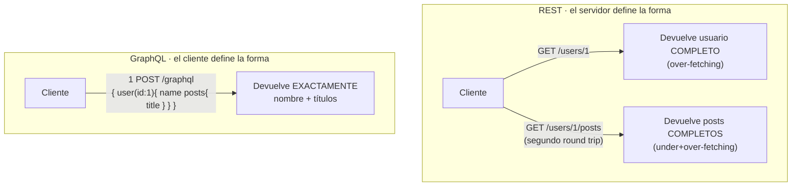

import Reto from "@components/Reto.astro";
import Solucion from "@components/Solucion.astro";
import Quiz from "@components/Quiz.astro";
import CheckDominio from "@components/CheckDominio.astro";
import Nivel from "@components/Nivel.astro";

<Nivel nivel="profundización" />

:::note[Esta lección es opcional — profundización, no ruta crítica]
El **troncal** de la Fase 3 es REST + Python + FastAPI: lo viste en [`3.7` Diseño de APIs REST](/fase-3-backend/3-7-diseno-apis-rest/) y [`3.8` Backend con FastAPI](/fase-3-backend/3-8-backend-fastapi/), y el **capstone se construye con ese stack**. GraphQL vive aquí por una razón concreta: aparece en ofertas y en entrevistas, y un AI/Automation Engineer debe poder **decidir** entre REST y GraphQL con criterio en vez de repetir que "uno es mejor". Esta lección te da ese criterio —qué problema resuelve GraphQL, qué cuesta— **sin** pretender que salgas dominándolo. Saltarla no te deja huecos en el camino crítico; hacerla te da una respuesta defendible cuando un reclutador pregunte "¿y por qué no GraphQL?".
:::

## 1. Qué vas a saber hacer

Al terminar, sin IA y sin notas, podrás:

- **O1 — Explicar el trade-off** entre REST y GraphQL en términos de **over-fetching / under-fetching** y **decidir** cuál conviene a un escenario dado, nombrando un costo de tu elección (GraphQL no es "el REST mejorado").
- **O2 — Leer un schema de GraphQL** (types, `Query`, `Mutation`) y escribir una query/mutation que pida **exactamente** los campos que una pantalla necesita, explicando qué es un **resolver** y cuándo se ejecuta.
- **O3 — Diagnosticar el problema N+1 en los resolvers** de GraphQL (por qué a menudo es *peor* que en REST) y explicar cómo lo resuelve el patrón **DataLoader** (batching), conectándolo con el N+1 que ya viste en ORMs.

## 2. Por qué importa

> 💰 **Por qué importa:** REST es el skill #1 del backend, pero GraphQL es el filtro que aparece en una porción real de ofertas senior (sobre todo donde hay un frontend complejo, móvil, o muchos clientes distintos consumiendo la misma API). No saber GraphQL casi nunca te descarta; **no poder decidir entre REST y GraphQL con criterio sí te delata como junior** en una entrevista de diseño. La pregunta "¿REST o GraphQL para esto?" es un ADR clásico y un clásico de entrevista. Quien responde "GraphQL porque es más moderno" pierde; quien responde "REST aquí porque la API es simple y quiero caching HTTP gratis; GraphQL si tuviera 5 clientes pidiendo formas distintas de los mismos datos" gana.

Y hay un beneficio que se nota en producción: **GraphQL te obliga a entender el N+1 a un nivel más profundo**. El mismo bug que cazaste en los ORMs ([`3.5`](/fase-3-backend/3-5-orms-problema-n1/)) reaparece en los resolvers, amplificado, y la cura tiene nombre propio (DataLoader). Entender por qué es el puente entre "uso un ORM" y "sé por qué mi endpoint se cae con 200 usuarios".

## 3. Lo que ya traes (actívalo)

Esta lección se apoya en cosas que ya viste. Recupéralas antes de seguir:

- De [`3.7` Diseño de APIs REST](/fase-3-backend/3-7-diseno-apis-rest/): recursos, verbos (`GET`/`POST`/...), status codes y el hecho de que cada recurso vive en su **URL**. GraphQL rompe justo eso: un solo endpoint.
- De [`3.5` ORMs y el problema N+1](/fase-3-backend/3-5-orms-problema-n1/): el N+1 es "1 query para la lista + 1 query por cada fila dentro de un loop". Aquí lo verás reaparecer en los resolvers, y será **más fácil de provocar sin querer**.
- De [`3.8` FastAPI](/fase-3-backend/3-8-backend-fastapi/): el servidor sobre el que montaríamos GraphQL en Python (con la librería Strawberry, que se enchufa a FastAPI).

Antes de seguir, responde de memoria:

<Quiz
  question="Una pantalla de perfil móvil solo necesita el NOMBRE del usuario y los TÍTULOS de sus últimos 3 posts. Llamas a un endpoint REST GET /users/1 que devuelve el usuario completo (nombre, email, dirección, settings...) pero ningún post, así que haces una segunda llamada GET /users/1/posts que devuelve los posts completos (título + cuerpo entero). ¿Qué dos problemas acabas de tener?"
  options={[
    "Ninguno: dos llamadas REST es lo normal y lo correcto",
    "Over-fetching (te trajeron campos que no necesitas: email, dirección, cuerpo del post) y under-fetching (el primer endpoint no traía los posts, te obligó a una segunda llamada / round trip)",
    "Solo un problema de seguridad: expusiste la dirección del usuario",
  ]}
  answer={1}
  explanation="Over-fetching = el servidor decide la forma de la respuesta y te manda de más (gastas red y batería en datos que descartas). Under-fetching = lo que un recurso devuelve no alcanza para tu pantalla, así que haces N round trips. Justo este par de dolores —tener que ir y volver, recibir de más— es lo que GraphQL ataca dejando que el CLIENTE pida exactamente los campos que quiere, en una sola consulta. No es magia ni 'mejor': es un trade-off, como verás."
/>

## 4. GraphQL en voz alta (worked example)

Voy a razonar **paso a paso**, montando el mismo caso del quiz: una pantalla que necesita el nombre del usuario y los títulos de sus posts. Primero el contraste, luego el schema, la query y los resolvers, y al final el N+1.

### 4.1 El contraste, dibujado



La idea central de GraphQL en una frase: **el cliente describe la forma exacta de los datos que quiere, y el servidor la rellena**. En REST el servidor decide qué trae cada URL; en GraphQL hay **un solo endpoint** (`/graphql`) y el cliente manda una *query* que es, literalmente, la forma del JSON que espera de vuelta.

### 4.2 El schema: el contrato tipado

Todo en GraphQL empieza por el **schema**: una descripción tipada de qué datos existen y qué se puede pedir. Se escribe en un lenguaje propio, el SDL (Schema Definition Language):

```graphql
type User {
  id: ID!
  name: String!
  email: String!
  posts: [Post!]!
}

type Post {
  id: ID!
  title: String!
  body: String!
  author: User!
}

type Query {
  user(id: ID!): User
  users: [User!]!
}

type Mutation {
  publishPost(authorId: ID!, title: String!, body: String!): Post!
}
```

Léelo en voz alta conmigo, porque cada símbolo importa:

- **`type User { ... }`** define un objeto con sus campos. El `!` significa **non-null** (ese campo siempre viene). `name: String!` = "el nombre nunca es null"; `email: String!` igual.
- **`posts: [Post!]!`** es una relación: un usuario tiene una **lista** de posts. El `[Post!]!` se lee de afuera hacia adentro: la lista nunca es null (`]!`) y ningún elemento es null (`Post!`). Esto es la relación 1:N que modelaste en [`3.1`](/fase-3-backend/3-1-sql-modelado-relacional/), ahora en el lenguaje del schema.
- **`type Query`** es especial: es la **puerta de entrada de lectura**. Lo que esté aquí es lo que un cliente puede pedir. `user(id: ID!): User` = "puedes pedir un usuario pasando un id, te devuelvo un `User` (o `null` si no existe — fíjate que no tiene `!`)".
- **`type Mutation`** es la puerta de entrada de **escritura** (crear/actualizar/borrar). En REST eso lo distinguían los verbos `POST`/`PUT`/`DELETE`; en GraphQL todo va por `POST /graphql`, y lo que separa leer de escribir es estar bajo `Query` o bajo `Mutation`.

### 4.3 La query: pedir exactamente lo que se necesita

Con ese schema, la pantalla del perfil pide **solo** lo que usa:

```graphql
query {
  user(id: "1") {
    name
    posts {
      title
    }
  }
}
```

Y la respuesta tiene **exactamente esa forma**, ni un campo más:

```json
{
  "data": {
    "user": {
      "name": "Ada",
      "posts": [{ "title": "Hola mundo" }, { "title": "Sobre máquinas" }]
    }
  }
}
```

Nada de `email`, nada de `body`, una sola llamada. Eso es matar el over-fetching y el under-fetching a la vez. Si otra pantalla (digamos, la de administración) necesitara también el email y la fecha, **manda otra query distinta** pidiendo esos campos — sin tocar el servidor. Esa es la promesa de GraphQL: una API, muchas formas de consumirla.

### 4.4 Los resolvers: dónde vive el trabajo

El schema dice *qué* se puede pedir. Los **resolvers** dicen *cómo* se obtiene cada campo. Un resolver es una función que devuelve el valor de un campo. En Python, con Strawberry (la librería de GraphQL que se enchufa a tu FastAPI), el schema de arriba se ve así:

```python
import strawberry


@strawberry.type
class Post:
    id: strawberry.ID
    title: str
    body: str


@strawberry.type
class User:
    id: strawberry.ID
    name: str
    email: str

    @strawberry.field
    def posts(self) -> list[Post]:
        # OJO: este resolver se ejecuta UNA VEZ POR CADA User.
        # Aquí nace el N+1 (lo vemos en 4.5).
        return db_posts_by_author(self.id)


@strawberry.type
class Query:
    @strawberry.field
    def user(self, id: strawberry.ID) -> User | None:
        return db_user_by_id(id)

    @strawberry.field
    def users(self) -> list[User]:
        return db_all_users()


@strawberry.type
class Mutation:
    @strawberry.mutation
    def publish_post(self, author_id: strawberry.ID, title: str, body: str) -> Post:
        return db_insert_post(author_id, title, body)


schema = strawberry.Schema(query=Query, mutation=Mutation)
```

Y se monta sobre FastAPI en cuatro líneas, en el **mismo** servidor del troncal:

```python
from fastapi import FastAPI
from strawberry.fastapi import GraphQLRouter

graphql_app = GraphQLRouter(schema)
app = FastAPI()
app.include_router(graphql_app, prefix="/graphql")
```

Lo clave para el resto de la lección: **cada campo tiene su resolver, y GraphQL los ejecuta de forma anidada** siguiendo la forma de la query. Si pides `users { name posts { title } }`, GraphQL primero resuelve `users` (una vez), y luego resuelve `posts` **una vez por cada usuario de la lista**. Guarda esa frase.

### 4.5 El N+1, reencarnado en los resolvers

Mira esta query inocente:

```graphql
query {
  users {
    name
    posts {
      title
    }
  }
}
```

Razonemos qué hace el servidor, paso a paso:

1. Resuelve `users` → **1 query** a la base: `SELECT * FROM users`. Digamos que devuelve 100 usuarios.
2. Para *cada* usuario, GraphQL ejecuta el resolver de `posts` → `db_posts_by_author(self.id)` → **1 query por usuario** = **100 queries**.

Total: **101 queries** (1 + 100). Es el **N+1** que cazaste en [`3.5`](/fase-3-backend/3-5-orms-problema-n1/), idéntico. Pero en GraphQL hay un agravante que lo hace más peligroso: **el cliente elige la query**, así que puede pedir relaciones anidadas profundas (`users { posts { comments { author { posts {...} } } } }`) y multiplicar el N+1 sin que tú, el del backend, lo veas venir. En REST tú controlas qué trae cada endpoint; en GraphQL le diste el control de la forma al cliente.

### 4.6 La cura: DataLoader (batching)

El patrón estándar para matar este N+1 es **DataLoader**: en vez de que cada resolver de `posts` dispare su propia query, DataLoader **junta** todos los `author_id` que se pidieron en este "tick" y hace **una sola** query con `WHERE author_id IN (...)`. De 101 queries a **2**.

```python
from strawberry.dataloader import DataLoader


async def load_posts_by_author(author_ids: list[strawberry.ID]) -> list[list[Post]]:
    # UNA sola query para todos los autores pedidos:
    #   SELECT * FROM posts WHERE author_id IN (author_ids)
    rows = db_posts_for_authors(author_ids)

    # Agrupar por autor:
    por_autor: dict[strawberry.ID, list[Post]] = {aid: [] for aid in author_ids}
    for post in rows:
        por_autor[post.author_id].append(post)

    # CONTRATO del DataLoader: devolver una lista en EL MISMO ORDEN
    # y con la MISMA longitud que author_ids.
    return [por_autor[aid] for aid in author_ids]


posts_loader = DataLoader(load_fn=load_posts_by_author)
```

Y el resolver de `posts` ya no consulta la base directo: **pide al loader** y deja que él agrupe:

```python
@strawberry.field
async def posts(self) -> list[Post]:
    return await posts_loader.load(self.id)
```

La magia es que `await ...load(id)` no dispara una query de inmediato: DataLoader **espera** a que todos los resolvers de `posts` hayan pedido su `id`, los acumula, y ejecuta `load_fn` una vez con todos. El contrato que no puedes romper: `load_fn` debe devolver los resultados **en el mismo orden** que las keys que recibió (por eso el `return [por_autor[aid] for aid in author_ids]`). Si los devuelves en otro orden, le entregas a cada usuario los posts de otro.

> Detalle de producción (no lo necesitas hoy, pero anótalo): el `posts_loader` debe crearse **una vez por request**, no global, porque DataLoader cachea por key dentro de su vida. Un loader global filtraría datos de un usuario a la request de otro —eso es una fuga de datos, un bug de seguridad—. En Strawberry se hace con el `context_getter` del `GraphQLRouter`. Por ahora basta con que sepas que la cura del N+1 existe y se llama DataLoader.

## 5. Lo que podrías creer y está mal

:::caution[Misconception 1: "GraphQL es mejor que REST / GraphQL reemplaza a REST"]
Falso. No es una versión mejorada; es un **trade-off distinto**. GraphQL te da flexibilidad de consulta (el cliente pide la forma) a cambio de **perder cosas que en REST eran gratis**: el caching por URL del navegador y los CDN (en GraphQL casi todo es un `POST` al mismo endpoint, que los caches HTTP no cachean), las métricas por ruta, y la simplicidad. Empresas enormes corren REST feliz; otras corren GraphQL feliz. Quien dice "GraphQL es mejor" repite un eslogan que no midió.
:::

:::caution[Misconception 2: "GraphQL no tiene N+1 porque es más moderno"]
Al revés: el N+1 **vive en los resolvers** y en GraphQL es **más fácil de provocar**, porque el cliente elige qué relaciones anidar y cuán profundo. La cura no viene gratis con el framework: tienes que aplicar **DataLoader** (batching) a mano en los resolvers de relaciones. "Más moderno" no significa "sin el bug clásico"; significa que el bug clásico tiene una forma nueva de aparecer.
:::

:::caution[Misconception 3: "Un solo endpoint = sistema más simple"]
Un solo endpoint simplifica el *cliente*, pero **complica el servidor** en tres frentes que ya conoces: (1) **caching** —no puedes cachear por URL porque todo es `POST /graphql`—; (2) **autorización** —en REST proteges rutas; en GraphQL tienes que autorizar **campo por campo**, porque el cliente arma combinaciones que no anticipaste—; (3) **observabilidad** —tus métricas y logs por ruta dejan de servir, porque todo cae en `/graphql`; necesitas trazas a nivel de campo—. No es más simple: es simple en otro lado.
:::

:::caution[Misconception 4: "El cliente puede pedir lo que quiera, gratis"]
Esa libertad es también una **superficie de ataque**. Un cliente malicioso (o un bug en un cliente legítimo) puede mandar una query profundamente anidada o gigantesca y tumbar tu servidor —es un DoS, el "Unbounded Consumption" del que hablarás en [`3.13` OWASP](/fase-3-backend/3-13-owasp-top10-web/)—. Por eso una API GraphQL de producción **debe** limitar la profundidad y la complejidad de las queries, apagar la introspección del schema en producción, y a menudo usar *persisted queries* (solo se aceptan queries pre-aprobadas). "El cliente decide la forma" tiene letra chica de seguridad.
:::

## 6. Práctica con andamiaje (hazla antes de los retos)

Tres pasos que se desvanecen. Hazlos **a mano, sin ejecutar y sin IA** (predice primero); calibran tu modelo mental de schema, query y N+1.

### 6.1 PREDICT — ¿qué devuelve esta query?

Con el schema de la sección 4.2, un cliente manda:

```graphql
query {
  user(id: "7") {
    name
    email
  }
}
```

**Predice** la *forma* exacta del JSON de respuesta cuando el usuario 7 existe (con nombre "Linus" y email "l@x.dev"). ¿Aparece el campo `posts`? ¿Aparece `id`?

<Solucion title="Ver la respuesta (solo después de predecir)">
La respuesta trae **solo** los campos pedidos, anidados bajo `data.user`:

```json
{ "data": { "user": { "name": "Linus", "email": "l@x.dev" } } }
```

**No** aparece `posts` ni `id`: la query no los pidió, y en GraphQL lo que no pides no viene. Esa es la diferencia con REST, donde `GET /users/7` te habría devuelto el objeto completo lo quisieras o no. Si el usuario 7 **no** existiera, `user` devolvería `null` (`user(id): User`, sin `!`), y tendrías `{ "data": { "user": null } }`.
</Solucion>

### 6.2 SPOT THE BUG — cuenta las queries

Un cliente manda esta query contra el resolver "ingenuo" de la sección 4.4 (sin DataLoader), y la base tiene **20 usuarios**:

```graphql
query {
  users {
    name
    posts {
      title
    }
  }
}
```

Di **cuántas queries** golpean la base y cómo lo arreglarías en una frase.

<Solucion title="Ver la respuesta (solo después de pensarla)">
Golpean **21 queries**: 1 para `users` (`SELECT * FROM users`) + 1 por cada uno de los 20 usuarios para resolver su campo `posts` (20). Es el N+1 (1 + 20). El arreglo: meter un **DataLoader** en el resolver de `posts`, que agrupa los 20 `author_id` y hace **una sola** query `WHERE author_id IN (...)`. Quedan ~2 queries fijas sin importar cuántos usuarios haya. Regla que te debe sonar de [`3.5`](/fase-3-backend/3-5-orms-problema-n1/): cada vez que una relación se resuelve **una vez por fila**, sospecha N+1.
</Solucion>

### 6.3 MODIFY — del schema a una mutation

El schema tiene `publishPost(authorId, title, body): Post!`. El requisito cambia: ahora al publicar también quieres marcar el post como borrador o publicado (`published: Boolean`). **Describe** (en palabras, sin escribir todo) qué cambiarías: ¿en el `type Post`? ¿en la firma de la `Mutation`? ¿la mutation es una `Query` o sigue siendo `Mutation`, y por qué? Piensa antes de releer la sección 4.2.

## 7. Ejercicios Primero-Sin-IA

Ahora sin red. Como GraphQL es nuevo para ti, primero releíste el worked example (sección 4); ahora aplica el criterio. Ambos son **a mano, sin IA**.

<Reto title="Diseña el schema y caza el N+1" timebox="40–45 min">

Te damos, en el README del ejercicio, un escenario REST que sufre over/under-fetching (una app de blog con una pantalla de "feed" y una de "perfil"). Debes, **a mano y sin ejecutar**:

1. Escribir en `schema.graphql` los `type` necesarios (User, Post, Comment) con sus relaciones y nullability (`!`), más el `type Query` con las entradas que las dos pantallas necesitan.
2. Escribir en `consulta.graphql` **una** query que resuelva la pantalla de perfil pidiendo **exactamente** los campos que esa pantalla usa (ni uno de más).
3. En `NOTAS.md`: (a) trazar el N+1 de una query de feed que lista posts con el nombre de su autor sobre resolvers ingenuos —decir cuántas queries con 30 posts—; (b) explicar en tus palabras cómo DataLoader lo baja a ~2 y cuál es el **contrato de orden** del `load_fn`; (c) nombrar **un** costo de haber elegido GraphQL aquí (caching, autorización por campo, u observabilidad).

**Hecho significa:**
- [ ] El `schema.graphql` es válido a ojo: tipos con campos tipados, relaciones como listas `[T!]!` donde corresponde, y un `Query` que cubre ambas pantallas.
- [ ] La query de perfil pide **solo** los campos de esa pantalla (demuestras que entiendes el anti-over-fetching).
- [ ] La traza del N+1 da el número correcto (1 + 30 = 31) y tu explicación de DataLoader incluye el batching `IN (...)` **y** el contrato "mismo orden / misma longitud que las keys".
- [ ] Nombras un costo real de GraphQL (no lo vendes como gratis).
- [ ] Puedes explicar, sin notas, por qué este N+1 es "el mismo" que el de los ORMs y por qué en GraphQL es más fácil de provocar.

Enunciado completo y starter: `ejercicios/fase-3/graphql-schema-y-n1/` (carpeta del repo).

<Solucion title="Pista (ábrela solo si superaste el timebox)">
Para el schema: `Post` tiene `author: User!` (un post tiene un autor) y `comments: [Comment!]!`; `User` tiene `posts: [Post!]!`. La FK conceptual (`authorId`) no se expone como campo si ya tienes `author: User!` — el resolver la usa por dentro. La query de perfil no debe incluir `body` ni `email` si la pantalla solo muestra nombre + títulos. El N+1 del feed: 1 query para los 30 posts + 1 por post para traer `author` = 31. DataLoader agrupa los 30 `authorId` en `WHERE id IN (...)` = 1 query, total ~2; recuerda devolver los autores en el mismo orden que los ids pedidos. Costo de GraphQL: el más fácil de defender es el caching (todo es `POST /graphql`, los CDN no lo cachean por URL). Pista, no solución.
</Solucion>

</Reto>

<Reto title="Decide: REST o GraphQL para tres escenarios" timebox="30–35 min">

Ejercicio de **razonamiento puro** (no se ejecuta nada). En el README tienes tres escenarios. Para **cada uno** debes: (1) elegir **REST** o **GraphQL**, (2) justificar con criterios concretos (cuántos clientes distintos consumen la API y cuán distintas son sus necesidades de datos; cuánto importa el caching HTTP; complejidad del equipo/servidor; si hay over/under-fetching real que duela), (3) nombrar **un costo** de tu elección, y (4) decir qué dato te haría cambiar de opinión. El entregable es `DECISION.md`.

**Hecho significa:**
- [ ] Las tres decisiones se justifican con criterios concretos, no con "GraphQL es más moderno" ni "REST es más simple" a secas.
- [ ] Reconoces al menos un escenario donde la elección **no** es obvia y explicas la tensión.
- [ ] Cada elección nombra un costo real (GraphQL: caching/autorización por campo/observabilidad; REST: over/under-fetching, muchos round trips, muchos endpoints a medida).
- [ ] Puedes defender, sin notas, por qué para una API **simple con un solo cliente** REST suele ganar, y por qué con **muchos clientes pidiendo formas distintas** GraphQL empieza a pagar su costo.

Enunciado completo: `ejercicios/fase-3/graphql-rest-decidir/` (carpeta del repo).

<Solucion title="Pista (ábrela solo si superaste el timebox)">
El eje que más pesa casi siempre: **cuántos clientes distintos consumen la API y cuán distintas son sus necesidades de datos**. Un cliente único y estable (una SPA contra su propio backend) rara vez justifica el costo de GraphQL: REST con buenos endpoints alcanza, y te quedas con el caching HTTP gratis. Muchos clientes heterogéneos (web + móvil + partners externos), cada uno pidiendo una forma distinta de los mismos datos, es donde GraphQL paga: cada cliente arma su query sin que tú multipliques endpoints. El segundo eje: cuánto te duele el over/under-fetching real (móvil con red mala lo sufre más). No hay respuesta universal; hay decisiones **defendibles con su costo nombrado**. Pista, no solución.
</Solucion>

</Reto>

## 8. Check de dominio

Sin mirar la lección, en voz alta o por escrito:

<CheckDominio
  items={[
    "Definir over-fetching y under-fetching con un ejemplo concreto, y decir cuál de los dos ataca GraphQL.",
    "Leer un type de GraphQL y explicar qué significan el ! (non-null) y el [Post!]! (lista).",
    "Explicar qué es type Query vs type Mutation y a qué equivalen en REST (leer vs escribir).",
    "Explicar qué es un resolver y cuándo se ejecuta el resolver de un campo de relación (una vez por fila).",
    "Trazar el N+1 de una query que lista N entidades con una relación, y dar el número de queries.",
    "Explicar qué hace DataLoader (batching con IN) y el contrato de orden de su load_fn.",
    "Nombrar dos cosas que GraphQL pierde frente a REST (caching por URL, autorización por campo, observabilidad por ruta).",
    "Dar dos criterios concretos para decidir REST vs GraphQL en un proyecto.",
  ]}
/>

Si fallaste tres o más, vuelve a la sección correspondiente **antes** de avanzar.

<Quiz
  question="Tu API GraphQL es pública y el cliente puede pedir cualquier query. Un atacante manda una query profundamente anidada (posts → comments → author → posts → comments...) que obliga a miles de queries y consume toda la RAM del servidor. ¿Qué falló y cómo se previene?"
  options={[
    "Nada falló: GraphQL aguanta cualquier query por diseño",
    "Es un DoS por consumo no acotado (Unbounded Consumption); se previene limitando profundidad y complejidad de las queries, apagando la introspección en producción y/o usando persisted queries",
    "Es un problema de la base de datos, no de GraphQL; se arregla agregando un índice",
  ]}
  answer={1}
  explanation="Darle al cliente el control de la forma de la query es flexibilidad Y superficie de ataque. Sin límites de profundidad/complejidad, una query maliciosa o un bug de cliente puede tumbar el servidor: es el Unbounded Consumption de OWASP API/LLM. Las defensas estándar: depth limiting, complexity/cost analysis, deshabilitar introspección en prod, persisted/allow-listed queries y rate limiting. Lo verás como hilo de seguridad en 3.13. Un índice no salva: el problema es el número y la profundidad de operaciones, no una query lenta."
/>

## 9. Recursos (documentación oficial primero)

- **GraphQL — Learn (sitio oficial de la especificación):** [graphql.org/learn](https://graphql.org/learn/) — qué es GraphQL, schema, queries, mutations y resolvers, contado por quienes definen el estándar.
- **GraphQL — Thinking in Graphs / Best Practices:** [graphql.org/learn/thinking-in-graphs](https://graphql.org/learn/thinking-in-graphs/) — cómo modelar el schema y por qué.
- **Strawberry (GraphQL en Python, se enchufa a FastAPI):** [strawberry.rocks/docs](https://strawberry.rocks/docs) — types, resolvers, mutations.
- **Strawberry — DataLoaders (la cura del N+1):** [strawberry.rocks/docs/guides/dataloaders](https://strawberry.rocks/docs/guides/dataloaders) — batching, el contrato de orden, y por qué el loader es por-request.
- **Strawberry — FastAPI integration:** [strawberry.rocks/docs/integrations/fastapi](https://strawberry.rocks/docs/integrations/fastapi) — montar `GraphQLRouter` sobre el FastAPI del troncal.
- **OWASP API Security — Unbounded Consumption:** [owasp.org/API-Security](https://owasp.org/www-project-api-security/) — por qué "el cliente decide la query" es también un riesgo de DoS (lo verás a fondo en [`3.13`](/fase-3-backend/3-13-owasp-top10-web/)).

## 10. Conexión con el capstone de la fase

El **[Capstone F3 — API de producción](/fase-3-backend/proyecto/)** se construye con el **troncal** (FastAPI REST + SQLAlchemy), así que GraphQL **no es obligatorio** para terminarlo. Lo que esta lección le aporta es **criterio para un ADR**:

- Una de las decisiones de arquitectura del capstone es el estilo de la API. Poder escribir, en un ADR, "elegí REST sobre GraphQL porque la API tiene un solo cliente (mi frontend), quiero el caching HTTP y las métricas por ruta gratis, y no tengo el problema de muchos clientes con formas distintas — acepto que si en el futuro sumo una app móvil, reevaluaré" es **exactamente** el trade-off defendible que pide el Definition of Done de la fase. No se elige bien lo que no se conoce.
- El **N+1** que aquí viste en resolvers es el mismo enemigo del capstone REST: en ambos casos, una relación cargada "una vez por fila" mata el rendimiento. La cura (cargar la relación de una sola vez — `selectinload`/`join` en SQLAlchemy, DataLoader en GraphQL) es el mismo principio con dos nombres. Llevar ese instinto al capstone es lo que importa.

## 11. Reflexión y repaso espaciado

Cierra escribiendo dos o tres frases: **¿qué problema real de REST te dejó GraphQL más claro (over-fetching, under-fetching, o los muchos round trips)? ¿Y qué cosa de REST extrañarías si tu API fuera GraphQL?** Distinguir la ventaja real de GraphQL de su costo es justo el criterio que te hace decidir por contexto y no por moda.

Gancho de **spaced repetition**:

- **Mañana:** sin mirar, escribe de memoria un `type User` con una relación `posts: [Post!]!`, una query que pida solo `name` y los `title` de sus posts, y la cuenta del N+1 de listar 10 usuarios con sus posts (sin DataLoader). Verifica contra las secciones 4.2–4.5. Si el N+1 no te sale como 1 + 10, no caló todavía.
- **En 3 días:** toma cualquier endpoint REST de tu capstone que sufra over-fetching o que necesite dos llamadas para una pantalla, y **escribe en una frase** cómo se vería esa pantalla resuelta con una sola query GraphQL — y qué costo aceptarías a cambio. Traducir entre los dos estilos es lo que fija el criterio por encima de la herramienta.
