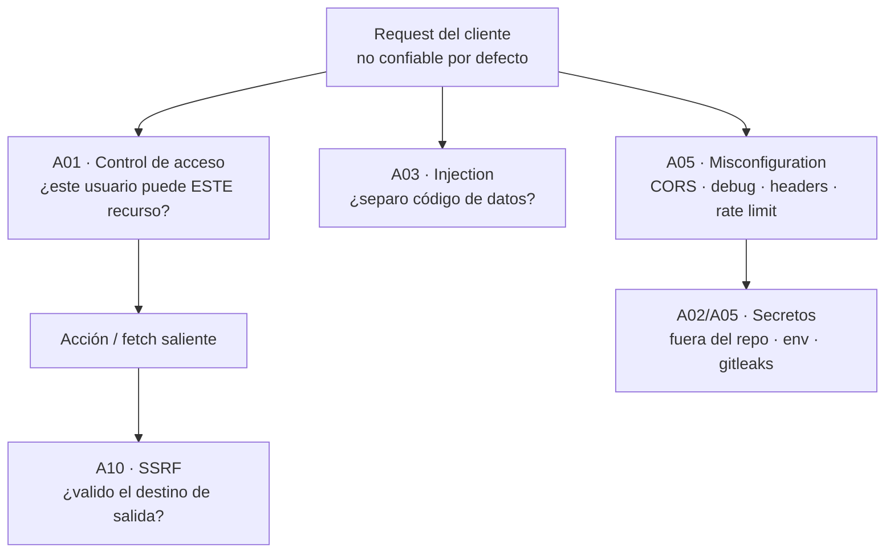

import Reto from "@components/Reto.astro";
import Solucion from "@components/Solucion.astro";
import Quiz from "@components/Quiz.astro";
import CheckDominio from "@components/CheckDominio.astro";
import Nivel from "@components/Nivel.astro";

<Nivel nivel="intermedio" />

En [`3.8`](/fase-3-backend/3-8-backend-fastapi/) montaste una API que valida la entrada y filtra la salida. En [`3.12`](/fase-3-backend/3-12-auth-oauth2/) aprendiste a saber **quién** es el que llama. Falta la pregunta que separa un endpoint de juguete de uno de producción: **¿este usuario, ya autenticado, puede hacer esto con este recurso? ¿qué pasa si el cliente miente, abusa o ataca?** Esta lección no es una charla sobre seguridad: es una sesión de taller donde vas a ver código vulnerable de verdad, entender por qué se rompe, y cerrarlo. El **OWASP Top 10** es la lista, consensuada por la industria, de las diez familias de fallas de seguridad más comunes y dañinas en aplicaciones web. La vas a aplicar sobre el mismo FastAPI que ya conoces. La seguridad no es una fase posterior: es un hábito que arranca en tu primer endpoint y reaparece en cada feature, incluida la IA de la Fase 6.

:::tip[Si ya tocaste seguridad web]
¿Ya escuchaste "valida la entrada", "no concatenes SQL" o "configura CORS"? Úsalo de diagnóstico, no de excusa para saltar. La trampa del que "ya sabe" es confundir **autenticación** (quién eres) con **autorización** (qué puedes hacer): valida un JWT impecable y deja un IDOR abierto de par en par. Si puedes, sin notas: (1) explicar por qué que el `cliente_id` sea un entero válido no significa que este usuario pueda verlo; (2) decir por qué `allow_origins=["*"]` junto con `allow_credentials=True` es un bug y no una comodidad; (3) explicar por qué un agente de IA que hace `fetch` a una URL que le pasaron es el vector de SSRF más peligroso de 2026. Si dudas en cualquiera, lee desde la sección 4. Si no, salta a los ejercicios (sección 7) y mídete contra los tests.
:::

## 1. Qué vas a saber hacer

Al terminar, sin IA y sin notas, podrás:

- **O1 — Identificar y cerrar un Broken Access Control (IDOR)** en un endpoint FastAPI: agregar el chequeo de propiedad que falta, devolver el status correcto para no filtrar la existencia del recurso, y explicar por qué validar el *tipo* del id no es validar la *autorización*.
- **O2 — Explicar por qué las queries parametrizadas y los ORM neutralizan la inyección SQL**, y **blindar un fetch saliente contra SSRF** (validar esquema, resolver el DNS y rechazar rangos de IP privados) — la defensa crítica para los agentes de IA que navegan, que formalizarás en la Fase 6 y 7.
- **O3 — Auditar una configuración insegura** (CORS comodín con credenciales, modo debug en producción, secretos en el repo, sin rate limit) mapeando cada hallazgo a su categoría OWASP y su corrección, y mantener los secretos fuera del repositorio usando un escáner como gitleaks.

## 2. Por qué importa (el dinero está aquí)

> 💰 **Por qué importa:** el backend es donde vive la lógica —y los datos— de las apps que construyes. Una sola falla de control de acceso filtra la base de datos de tus usuarios; un SSRF en un agente de IA que "solo lee una URL" puede leer las credenciales del servidor en la nube. El mercado lo sabe: "secure by design", "OWASP", "threat modeling" aparecen cada vez más en las ofertas, y un incidente de seguridad es la forma más rápida de quemar la confianza de un cliente. Un junior asume que el cliente se porta bien. Un semi-senior asume que el cliente miente y diseña en consecuencia. Ese cambio de mentalidad —"nunca confíes en la entrada, ni en el id, ni en la URL"— es lo que esta lección te instala.

Tres razones hacen de esta sub-unidad un punto de no-retorno:

1. **El control de acceso es la falla #1.** En el OWASP Top 10 de 2021, **Broken Access Control** subió al primer puesto: es la falla más frecuente y de las más explotadas. Y es invisible en una demo feliz —el endpoint "funciona"— hasta que alguien cambia un id en la URL y lee datos ajenos. Aprender a verlo es lo que te distingue.
2. **SSRF es la falla que la IA hizo crítica.** En la Fase 6 y 7 vas a construir agentes que hacen `fetch` de URLs, leen documentos y llaman APIs externas. Si esa URL viene del usuario (o de un LLM al que el usuario manipuló por *prompt injection*), tienes un agente que ataca tu propia red interna desde adentro. SSRF dejó de ser un caso de borde: es **el** vector de la era agéntica. Lo cierras aquí, con código de servidor, antes de añadirle el LLM encima.
3. **La seguridad es el hilo, no la fase.** Este es el primer eslabón explícito del hilo de **seguridad** del curso: OWASP web aplicado desde tu primer endpoint, que reaparece como **OWASP LLM Top 10** y **Agentic** en la Fase 6. Y entra al **Definition of Done** de todo capstone: sin seguridad aplicada + secret-scanning en el pipeline, el proyecto no está terminado.

## 3. Lo que ya traes (actívalo)

Esta lección ensambla casi toda la Fase 3. Reúsalo antes de seguir:

- De [`3.8` FastAPI](/fase-3-backend/3-8-backend-fastapi/): `response_model` (tu barrera anti-fuga de datos), `Depends` (donde vivirá el chequeo de autorización) y `HTTPException`. La validación pydantic es tu primera defensa; aquí construyes las siguientes capas.
- De [`3.12` Auth/OAuth2](/fase-3-backend/3-12-auth-oauth2/): autenticación es "quién eres". Esta lección es **autorización**: "qué puedes hacer". Son cosas distintas y la confusión entre ambas es la raíz del IDOR.
- De [`3.3` PostgreSQL](/fase-3-backend/3-3-postgresql-a-fondo/) y [`3.5` ORMs](/fase-3-backend/3-5-orms-problema-n1/): cuando usas el ORM o pasas parámetros, la base de datos recibe tu SQL y tus datos por **canales separados**. Esa separación es, literalmente, lo que evita la inyección.
- De [`3.9` Ports & adapters](/fase-3-backend/3-9-ports-adapters-hexagonal/): un `fetch` saliente es un **adaptador de salida**. Validar su destino (anti-SSRF) es responsabilidad del adaptador, no del dominio.
- De [`0.4` Cómo funciona la web](/fase-0-fundamentos/0-4-como-funciona-la-web-y-un-computador/): IPs privadas vs públicas, NAT, puertos, DNS. Eso es exactamente lo que mira un guardia anti-SSRF.

Antes de seguir, responde de memoria:

<Quiz
  question="Un usuario inicia sesión correctamente (su JWT es válido) y hace GET /facturas/501. La factura 501 pertenece a OTRO usuario. El endpoint la devuelve sin más. ¿Qué tipo de falla es?"
  options={[
    "Falla de autenticación: el token debería haber sido rechazado",
    "Falla de autorización (Broken Access Control / IDOR): está autenticado, pero el endpoint no verifica que el recurso le pertenezca",
    "No es una falla: si el JWT es válido, el usuario puede ver cualquier recurso",
  ]}
  answer={1}
  explanation="La autenticación funcionó: sabemos quién es. Lo que falta es la AUTORIZACIÓN: comprobar que ESE usuario es dueño de ESE recurso. Servir el recurso solo porque el id existe y el token es válido es un IDOR (Insecure Direct Object Reference), la cara más común del Broken Access Control. Autenticar no es autorizar."
/>

## 4. Las fallas, sobre FastAPI, en voz alta

Voy a recorrer las familias del Top 10 que más vas a tocar, **mostrando el código vulnerable primero** y luego el arreglo, razonando por qué. No memorices la lista: entiende el patrón de cada falla y su defensa.



### 4.1 Qué es el OWASP Top 10 (y qué no)

El **OWASP Top 10** (Open Worldwide Application Security Project) es una lista de concienciación, revisada periódicamente, de las diez categorías de riesgo más críticas en aplicaciones web. No es un estándar de certificación ni una checklist exhaustiva: es el **mínimo común** que todo backend debe cubrir. La edición vigente que usaremos es la de 2021; sus categorías relevantes para hoy:

| Código | Categoría | Lo que vas a practicar |
|---|---|---|
| **A01** | Broken Access Control | Cerrar un IDOR con chequeo de propiedad |
| **A02** | Cryptographic Failures | Secretos fuera del repo, en transporte cifrado |
| **A03** | Injection | Por qué los parámetros/ORM matan el SQLi |
| **A05** | Security Misconfiguration | CORS, debug, headers, rate limiting |
| **A10** | Server-Side Request Forgery (SSRF) | Blindar un fetch saliente |

> Los términos viven en inglés porque así los verás en ofertas, reportes y CVEs: *Broken Access Control*, *Injection*, *SSRF*. Es parte del hilo de **inglés técnico** — apróptelos como vocabulario.

### 4.2 A01 — Broken Access Control (el IDOR)

Aquí está el endpoint que "funciona" en la demo y filtra la base de datos en producción. Supón un usuario autenticado (la dependencia `usuario_actual` viene de [`3.12`](/fase-3-backend/3-12-auth-oauth2/) y devuelve el id del que llama):

```python
# VULNERABLE: cualquier usuario autenticado lee la nota de cualquier otro
@app.get("/notas/{nota_id}", response_model=NotaPublica)
async def obtener_nota(nota_id: int, usuario: UsuarioActual, session: SessionDep):
    nota = session.get(Nota, nota_id)
    if nota is None:
        raise HTTPException(404, "Nota no encontrada")
    return nota          # ← nunca comprueba si la nota es de `usuario`
```

Razonemos qué pasa. El atacante inicia sesión con **su** cuenta (token válido: la autenticación pasa). Luego pide `GET /notas/1`, `/notas/2`, `/notas/3`… incrementando el id. El endpoint solo verifica que la nota **exista**, no que sea **suya**. Resultado: enumera y lee las notas de todos. Esto es un **IDOR** (Insecure Direct Object Reference): el id del recurso es una referencia directa y predecible, y no hay control de acceso encima.

El arreglo es una sola condición, pero hay un matiz fino en el status code:

```python
# SEGURO: el dueño manda
@app.get("/notas/{nota_id}", response_model=NotaPublica)
async def obtener_nota(nota_id: int, usuario: UsuarioActual, session: SessionDep):
    nota = session.get(Nota, nota_id)
    if nota is None or nota.owner_id != usuario.id:
        raise HTTPException(404, "Nota no encontrada")   # 404, NO 403
    return nota
```

¿Por qué **404** y no **403 Forbidden**? Si devuelves 403 ("existe pero no es tuya"), le confirmas al atacante que la nota 1 **existe** —le filtras información para enumerar—. Devolver 404 ("no encontrada") tanto cuando no existe como cuando no es suya hace que el recurso ajeno sea **indistinguible** de uno inexistente. Es una decisión de diseño defendible que conviene anotar en un ADR.

:::caution[El chequeo va en cada operación, no solo al leer]
El control de acceso debe repetirse en `GET`, `PUT`, `PATCH` y `DELETE` del recurso. Un clásico: protegen el `GET` pero dejan el `DELETE /notas/{id}` sin chequear dueño, y cualquiera borra notas ajenas. Mejor aún: centraliza el "trae el recurso del usuario actual o 404" en una **dependencia** reutilizable (`Depends`) y úsala en todos los endpoints del recurso. Una sola fuente de verdad para la autorización.
:::

### 4.3 A03 — Injection (por qué los parámetros te salvan)

La inyección SQL ocurre cuando construyes una query **pegando** datos del usuario como texto, y esos datos cambian la *estructura* de la query. Mira:

```python
from sqlalchemy import text

# VULNERABLE: f-string mete la entrada del usuario DENTRO del SQL
def buscar_por_titulo(session, termino: str):
    q = text(f"SELECT id, titulo FROM notas WHERE titulo = '{termino}'")
    return session.execute(q).all()
```

Si `termino` es `x' OR '1'='1`, la query se vuelve `... WHERE titulo = 'x' OR '1'='1'` y devuelve **todas** las filas. Con un `termino` peor (`'; DROP TABLE notas; --`) puedes destruir datos. El problema de fondo: la base de datos no puede distinguir **tu código SQL** de **los datos del usuario**, porque los mezclaste en un solo string.

La defensa es estructural, no un filtro de "palabras malas": **separa el código de los datos** con parámetros enlazados (*bound parameters*). Tú mandas el SQL con marcadores y los valores aparte; el driver los trata siempre como datos, nunca como código:

```python
# SEGURO: parámetro enlazado — el valor NUNCA se interpreta como SQL
def buscar_por_titulo(session, termino: str):
    q = text("SELECT id, titulo FROM notas WHERE titulo = :termino")
    return session.execute(q, {"termino": termino}).all()
```

Ahora `x' OR '1'='1` se busca **literalmente** como un título (y no encuentra nada): es un dato, no código. Y cuando usas el **ORM** —`session.execute(select(Nota).where(Nota.titulo == termino))`— SQLAlchemy parametriza por ti automáticamente. Por eso decimos que el ORM "te protege gratis" de la inyección: no porque sea mágico, sino porque **nunca** concatena tus datos en el texto del SQL.

:::caution[El ORM no es inmune si lo fuerzas]
Si usas `text(f"...")`, `.filter(text(...))` con f-strings, o construyes SQL crudo a mano, vuelves a abrir la puerta. La regla simple: **los datos del usuario jamás van dentro del string del SQL** — siempre como parámetro. Esto aplica igual a comandos del sistema operativo (no construyas `os.system(f"...")` con entrada del usuario), a NoSQL y a cualquier intérprete.
:::

### 4.4 A10 — SSRF: blindar el fetch saliente (crítico para IA)

**Server-Side Request Forgery**: el atacante logra que **tu servidor** haga una petición HTTP a un destino que él elige. ¿Por qué es grave? Tu servidor vive **dentro** de tu red: puede alcanzar bases de datos internas, paneles de administración sin auth, y —en la nube— el **endpoint de metadatos** (`http://169.254.169.254/...`) que devuelve credenciales temporales de la máquina. Un atacante externo no llega ahí; tu servidor sí. Si engañas a tu servidor para que pida esa URL, le robas las llaves del reino.

El caso de 2026 que tienes que tener grabado: un **agente de IA** con una herramienta `leer_url(url)`. El usuario (o un documento envenenado vía *prompt injection*) le pasa `http://169.254.169.254/latest/meta-data/iam/security-credentials/`. El agente, obediente, hace el fetch desde tu servidor y devuelve las credenciales. SSRF y prompt injection se combinan en la falla estrella de los agentes.

Razonemos la defensa, paso a paso. **No** basta con una lista negra de strings ("bloquea localhost"): el atacante usa `127.0.0.1`, `0.0.0.0`, `[::1]`, un nombre de dominio que **resuelve** a una IP privada, o redirecciones. La defensa robusta valida el **destino real**:

```python
import ipaddress
import socket
from urllib.parse import urlparse

ESQUEMAS_PERMITIDOS = {"http", "https"}


class DestinoBloqueado(Exception):
    """El destino de un fetch saliente no pasó la validación anti-SSRF."""


def _es_ip_peligrosa(ip: str) -> bool:
    dir_ip = ipaddress.ip_address(ip)
    return (
        dir_ip.is_private        # 10/8, 172.16/12, 192.168/16
        or dir_ip.is_loopback    # 127.0.0.0/8, ::1
        or dir_ip.is_link_local  # 169.254/16  ← metadatos de la nube
        or dir_ip.is_reserved
        or dir_ip.is_multicast
        or dir_ip.is_unspecified # 0.0.0.0
    )


def validar_destino(url: str, *, resolver=socket.getaddrinfo) -> str:
    """Valida una URL de destino para un fetch SALIENTE. Devuelve la URL si es
    segura; lanza DestinoBloqueado si no. Inyectamos `resolver` para poder testear
    sin red real (y para defendernos de DNS rebinding revisando TODAS las IPs)."""
    partes = urlparse(url)
    if partes.scheme not in ESQUEMAS_PERMITIDOS:
        raise DestinoBloqueado(f"esquema no permitido: {partes.scheme!r}")
    host = partes.hostname
    if not host:
        raise DestinoBloqueado("URL sin host")
    try:
        infos = resolver(host, partes.port or 80)
    except socket.gaierror as exc:
        raise DestinoBloqueado(f"no resuelve: {host}") from exc
    for info in infos:
        ip = info[4][0]                     # sockaddr -> (ip, port, ...)
        if _es_ip_peligrosa(ip):
            raise DestinoBloqueado(f"IP no permitida: {ip}")
    return url
```

Tres decisiones que importan:

- **Lista blanca de esquemas.** Solo `http`/`https`. Esto solo ya bloquea `file://` (leer archivos locales), `gopher://` y `ftp://`.
- **Resolver el DNS y mirar las IPs reales.** No miramos el string del host: lo **resolvemos** y revisamos a qué IP apunta. Así `interno.miempresa.cl` que resuelve a `10.0.0.5` queda bloqueado aunque el nombre se vea inocente.
- **Revisar TODAS las IPs resueltas.** Un atacante puede hacer que un nombre devuelva una IP pública *y* una privada (*DNS rebinding*). Si **cualquiera** es peligrosa, bloqueamos.

:::caution[Esto cubre lo esencial, no es a prueba de balas]
Un guardia industrial añade: rechazar redirects (o re-validar el destino de cada redirect), fijar timeouts y límites de tamaño de respuesta (para no quedar colgado ni descargar gigas), y idealmente resolver-y-conectar a la misma IP validada (para cerrar la ventana de *rebinding* entre la validación y la conexión). Para el curso, la lista blanca de esquema + el chequeo de rangos privados sobre todas las IPs resueltas es la base correcta. La defensa en profundidad se suma encima.
:::

### 4.5 A05 — CORS mal configurado

**CORS** (Cross-Origin Resource Sharing) le dice al **navegador** qué orígenes web (dominios) pueden llamar a tu API desde JavaScript. No es un muro de seguridad del servidor —cualquier `curl` lo ignora—, pero una mala config abre tu API a sitios maliciosos que actúan en nombre del usuario logueado. La configuración tóxica más común:

```python
# VULNERABLE: comodín + credenciales = lo peor de ambos mundos
app.add_middleware(
    CORSMiddleware,
    allow_origins=["*"],        # cualquier sitio web
    allow_credentials=True,     # ...y que mande cookies/credenciales
)
```

`allow_origins=["*"]` con `allow_credentials=True` significa "cualquier página de internet puede llamar a mi API enviando las cookies de sesión del usuario". Un sitio malicioso que la víctima visite puede disparar acciones autenticadas contra tu API. (De hecho, la spec de CORS prohíbe combinar `*` con credenciales, pero es fácil tropezar con configuraciones que lo aproximan.) Lo correcto: **lista explícita** de los orígenes que de verdad necesitas:

```python
from fastapi.middleware.cors import CORSMiddleware

app.add_middleware(
    CORSMiddleware,
    allow_origins=["https://app.midominio.cl"],   # exactos, no comodín
    allow_credentials=True,
    allow_methods=["GET", "POST"],                 # solo los que usas
    allow_headers=["Authorization", "Content-Type"],
)
```

La regla: **enumera** los orígenes, los métodos y los headers que necesitas. El comodín es comodidad de desarrollo que se filtra a producción y se vuelve un agujero.

### 4.6 A05 — Rate limiting (protege disponibilidad y costo)

Sin límite de tasa, un cliente puede martillar tu endpoint de login (fuerza bruta), saturar tu servicio (denegación de servicio), o —si el endpoint llama a un LLM— **quemar tu presupuesto** en minutos. El rate limiting es seguridad **y** control de costo a la vez. Con `slowapi`, la librería estándar para FastAPI:

```python
from fastapi import FastAPI, Request
from slowapi import Limiter, _rate_limit_exceeded_handler
from slowapi.util import get_remote_address
from slowapi.errors import RateLimitExceeded

limiter = Limiter(key_func=get_remote_address)   # límite por IP de origen
app = FastAPI()
app.state.limiter = limiter
app.add_exception_handler(RateLimitExceeded, _rate_limit_exceeded_handler)


@app.post("/login")
@limiter.limit("5/minute")          # el decorador de ruta va ARRIBA del de límite
async def login(request: Request):  # `request` es OBLIGATORIO para slowapi
    ...
```

Dos detalles que hacen fallar a todo el mundo la primera vez: el decorador `@app.post(...)` debe ir **arriba** de `@limiter.limit(...)`, y la función **tiene que** declarar `request: Request` en su firma, o slowapi no puede engancharse. Pasado el límite, el cliente recibe un **429 Too Many Requests**. En producción, el contador vive en Redis ([`3.15`](/fase-3-backend/3-15-redis-caching/)) para que el límite sea compartido entre varias instancias.

### 4.7 A05 — Security misconfiguration: no le regales pistas al atacante

Tres ajustes que un servidor de producción siempre tiene y un junior suele olvidar:

- **Apaga el modo debug.** Un stack trace detallado en la respuesta le revela al atacante tus rutas internas, versiones de librerías y, a veces, fragmentos de datos. Devuelve errores **genéricos** al cliente (`{"error": "internal_error"}`) y guarda el detalle en tus **logs** (observabilidad), nunca en la respuesta.
- **No filtres datos en los errores ni en los logs.** No registres contraseñas, tokens ni números de tarjeta. "Loguea el evento, no el secreto".
- **Headers de seguridad.** Cabeceras como `Strict-Transport-Security` (fuerza HTTPS), `X-Content-Type-Options: nosniff` y `Content-Security-Policy` endurecen el navegador. Se suelen poner en un middleware o en el reverse proxy (Nginx/Caddy).

```python
@app.middleware("http")
async def cabeceras_de_seguridad(request, call_next):
    respuesta = await call_next(request)
    respuesta.headers["X-Content-Type-Options"] = "nosniff"
    respuesta.headers["Strict-Transport-Security"] = "max-age=63072000"
    return respuesta
```

### 4.8 A02/A05 — Secrets management: nunca en el repo

La forma más común de filtrar credenciales no es un hacker sofisticado: es un `API_KEY = "sk-abc123..."` commiteado por error a GitHub, donde los bots lo encuentran en minutos. Reglas:

1. **Los secretos viven en variables de entorno**, cargadas con `pydantic-settings`, no hardcodeados:

   ```python
   from pydantic_settings import BaseSettings, SettingsConfigDict

   class Settings(BaseSettings):
       model_config = SettingsConfigDict(env_file=".env")
       database_url: str
       jwt_secret: str

   settings = Settings()   # lee de variables de entorno / .env
   ```

2. **`.env` va en `.gitignore`.** El repo trae un `.env.example` con las **claves** (sin valores) para documentar qué variables hacen falta.
3. **Escanea el repo** con un *secret scanner* en tu pipeline. Con `gitleaks` (v8):

   ```bash
   gitleaks git .       # escanea TODO el historial de commits del repo
   gitleaks dir .       # escanea los archivos del directorio (sin historial)
   ```

   `gitleaks` busca patrones de claves (AWS, tokens, llaves privadas) y falla el build si encuentra alguno. `trufflehog` es la alternativa equivalente. Esto es exactamente el **secret-scanning** que el Definition of Done exige en el pipeline (lo automatizas en CI en la [Fase 5](/fase-5-devops/)).

:::caution[Si ya commiteaste un secreto, rotarlo NO es opcional]
Borrar el secreto en un commit nuevo **no** lo elimina: sigue en el historial de Git, visible para siempre. Si filtraste una credencial, la acción correcta es **rotarla** (generar una nueva e invalidar la vieja) de inmediato. Reescribir el historial ayuda, pero asume que la vieja ya está comprometida.
:::

## 5. Non-examples y misconceptions (aquí se cae la gente)

:::caution[Podrías pensar X… y está mal]

**"Si el usuario está autenticado, puede ver el recurso."**
Falso, y es el IDOR. Autenticación responde *quién eres*; autorización responde *qué puedes hacer con este recurso*. Un token válido no te da derecho a la factura de otro. El chequeo de propiedad (`recurso.owner_id == usuario.id`) es obligatorio en cada operación.

**"Valido la entrada con pydantic, así que estoy a salvo de inyección."**
Pydantic valida **forma y tipo** (que `termino` sea un string), no **intención**. Un string perfectamente válido (`x' OR '1'='1`) es un ataque SQLi si lo concatenas. La defensa contra inyección es parametrizar / usar el ORM, no validar el tipo.

**"SSRF no me aplica, mi servidor no expone los endpoints internos."**
Justo al revés: SSRF es peligroso **porque** tu servidor sí alcanza lo interno (DB, metadatos de la nube) que el atacante externo no. El riesgo nace en cuanto tu servidor hace **una** petición a una URL influida por el usuario — y un agente de IA hace muchas.

**"Bloqueo `localhost` en la URL y listo con el SSRF."**
Insuficiente. El atacante usa `127.0.0.1`, `0.0.0.0`, `[::1]`, `2130706433` (127.0.0.1 en decimal), o un dominio que **resuelve** a una IP privada. Por eso se **resuelve el DNS** y se valida la **IP real** contra los rangos privados, no el texto del host.

**"`allow_origins=['*']` es más cómodo, lo dejo así."**
Es un agujero, sobre todo con `allow_credentials=True`. CORS controla quién llama a tu API desde un navegador con las credenciales del usuario. Enumera los orígenes reales.

**"Saqué el secreto del código en el último commit, ya está limpio."**
No. El secreto sigue en el historial de Git para siempre. La única respuesta correcta a un secreto filtrado es **rotarlo**.

**"La seguridad la reviso al final, antes de entregar."**
La "calidad como fase posterior" es el antipatrón que este curso ataca. Cada endpoint nace con su control de acceso, cada fetch con su validación de destino, cada secreto fuera del repo. Es un hábito, no una auditoría final.
:::

## 6. Práctica con andamiaje (antes de soltarte)

### 6.1 Predice antes de correr

Lee este endpoint **sin ejecutarlo**. `usuario` es el id del usuario autenticado; `_PEDIDOS` mapea `id -> {"owner_id": ..., "total": ...}`.

```python
@app.get("/pedidos/{pedido_id}")
async def ver_pedido(pedido_id: int, usuario: UsuarioActual):
    pedido = _PEDIDOS.get(pedido_id)
    if pedido is None:
        raise HTTPException(404, "No encontrado")
    return pedido     # ← ¿ves el problema?
```

<Quiz
  question="La usuaria 'ana' (id=1) hace GET /pedidos/7, y el pedido 7 tiene owner_id=2 (es de 'beto'). ¿Qué pasa con este código?"
  options={[
    "Devuelve 404, porque el pedido no es de ana",
    "Devuelve 200 con el pedido de beto: es un IDOR, falta el chequeo de propiedad",
    "Devuelve 403 automáticamente porque FastAPI detecta que no es su pedido",
  ]}
  answer={1}
  explanation="El código solo verifica que el pedido EXISTA, no que sea de ana. Devuelve 200 con datos ajenos: un IDOR de manual. FastAPI no sabe nada de 'propiedad'; ese chequeo lo pones tú. El arreglo: `if pedido is None or pedido['owner_id'] != usuario.id: raise HTTPException(404, ...)`."
/>

### 6.2 Completa el hueco (faded)

Este `delete` debe impedir que un usuario borre la nota de otro. Falta exactamente la condición de autorización. ¿Cuál?

```python
@app.delete("/notas/{nota_id}", status_code=204)
async def borrar_nota(nota_id: int, usuario: UsuarioActual, session: SessionDep):
    nota = session.get(Nota, nota_id)
    # ___ (1) si la nota no existe O no es del usuario actual: cortar con 404 ___
    session.delete(nota)
    session.commit()
    return Response(status_code=204)
```

<Solucion title="Ver la línea que falta (pista, no la solución del ejercicio)">

```python
    if nota is None or nota.owner_id != usuario.id:
        raise HTTPException(status_code=404, detail="Nota no encontrada")
```

Usamos **404** (no 403) tanto si no existe como si no es del usuario: así no le confirmas a un atacante que la nota existe pero es de otro. Y el chequeo va en el `DELETE` igual que en el `GET` — proteger solo la lectura y olvidar el borrado es un error clásico. Si lo repites en varios endpoints, conviene una dependencia `obtener_nota_propia` que lo centralice.

</Solucion>

## 7. Ejercicios Primero-Sin-IA

Trabaja cada uno **a mano y sin IA** dentro de su timebox. Las carpetas viven en tu repo; ábrelas en tu editor. Para los de código, implementa, **corre los tests** y mira fallar primero (ver el 200 que filtra datos ajenos, o el fetch que alcanza `169.254.169.254`, es parte del aprendizaje). Pide la corrección con la rúbrica de `.ai/` cuando termines.

<Reto title="Cierra el IDOR y la fuga de datos" timebox="40 min">

Carpeta: `ejercicios/fase-3/cerrar-idor-y-fugas/`

Te dan una mini-API de **notas** con autenticación simplificada (un header `x-user-id` identifica al usuario) y endpoints **vulnerables**: cualquiera lee, edita y borra notas ajenas, y la respuesta filtra un campo interno. Tu trabajo: cerrar el Broken Access Control y la fuga.

- Agrega el chequeo de propiedad en `GET`, `DELETE` y en el listado (`GET /notas` debe devolver **solo** las notas del usuario actual).
- Devuelve **404** (no 403) para el recurso ajeno, para no filtrar su existencia.
- Asegura que la respuesta use un `response_model` que **no** exponga el campo interno (`nota_privada_interna`).

**Hecho significa:**
- `pytest` en verde: el test verifica que beto recibe 404 al pedir/borrar la nota de ana, que ana solo ve sus notas en el listado, y que la respuesta no contiene el campo interno.
- En `bitacora.md` explicas: por qué 404 y no 403, y por qué el chequeo de propiedad debe repetirse en cada operación (no solo en `GET`).
- Puedes explicar, sin notas, la diferencia entre autenticación y autorización con este ejemplo.

</Reto>

<Reto title="Blinda un fetch saliente contra SSRF" timebox="40–45 min">

Carpeta: `ejercicios/fase-3/blindar-fetch-ssrf/`

Implementa `validar_destino(url, *, resolver=...)`, el guardia anti-SSRF que un agente de IA debe llamar **antes** de cada `fetch` saliente. Debe rechazar esquemas que no sean http/https, hosts que resuelven a IPs privadas/loopback/link-local, y el endpoint de metadatos de la nube; y aceptar destinos públicos legítimos.

- El `resolver` se inyecta (default `socket.getaddrinfo`) para testear sin red real y para cubrir el caso de **DNS rebinding** (un host que resuelve a varias IPs: si **alguna** es peligrosa, bloquea).
- Lanza `DestinoBloqueado` con un mensaje claro cuando rechaces; devuelve la URL cuando sea segura.

**Hecho significa:**
- `pytest` en verde: bloquea `file://`, `http://127.0.0.1`, `http://169.254.169.254/...`, `http://10.0.0.1`, y el caso de rebinding (pública + privada); acepta `https://example.com` (con resolver simulado a IP pública).
- En `bitacora.md` explicas por qué una lista negra de strings ("bloquea localhost") no basta y por qué hay que resolver el DNS y revisar **todas** las IPs.
- Puedes explicar, sin notas, por qué SSRF es especialmente peligroso en un agente de IA que navega.

</Reto>

<Reto title="Audita una configuración insegura (mapéala a OWASP)" timebox="35 min">

Carpeta: `ejercicios/fase-3/auditoria-owasp-config/`

Modalidad **razonamiento y diseño** (sin código que correr). Te dan `config_vulnerable.py`: un arranque de FastAPI plagado de errores reales (CORS comodín con credenciales, modo debug, secreto hardcodeado, sin rate limit, una query con f-string, devuelve el modelo de DB crudo). Tu trabajo: auditarlo como lo haría un semi-senior.

- Produce `auditoria.md` con una **tabla de hallazgos**: por cada problema, su **categoría OWASP** (A01/A03/A05/A10/…), la **severidad**, **por qué** es un riesgo, y el **fix** concreto (1–2 líneas).
- Identifica **al menos 6** hallazgos distintos.
- Cierra con una sección de **secrets management**: qué comando de `gitleaks` correrías y qué harías si el escáner encuentra que el secreto ya está en el historial.

**Hecho significa:**
- La tabla mapea correctamente cada hallazgo a su categoría OWASP y propone un fix accionable.
- Distingues autenticación de autorización al menos en un hallazgo.
- Puedes defender, sin notas, por qué `allow_origins=["*"]` + `allow_credentials=True` es peor que cualquiera de los dos por separado.

</Reto>

> La **solución de referencia** de cada ejercicio existe para el corrector IA, no para ti: no la busques antes de cerrar tu intento. La pista inline de arriba (sección 6.2) es un empujón, no la respuesta.

## 8. Check de dominio

Sin mirar la lección, responde en voz alta o por escrito. Si una te traba, ya sabes qué sección releer.

<CheckDominio items={[
  "Explicar la diferencia entre autenticación y autorización, y por qué un JWT válido no evita un IDOR.",
  "Decir por qué se devuelve 404 (y no 403) cuando un usuario pide un recurso ajeno, y qué información filtraría el 403.",
  "Explicar por qué parametrizar la query (o usar el ORM) neutraliza la inyección SQL, mientras que validar el tipo con pydantic no.",
  "Describir qué es SSRF, por qué es crítico en un agente de IA que hace fetch, y por qué bloquear solo 'localhost' no alcanza.",
  "Explicar por qué `allow_origins=['*']` con `allow_credentials=True` es una mala configuración de CORS.",
  "Decir dónde deben vivir los secretos, por qué borrarlos en un commit nuevo no basta, y qué hace un secret scanner como gitleaks.",
]} />

<Quiz
  question="Tu agente de IA tiene una herramienta `leer_url(url)` y el usuario le pide resumir 'http://169.254.169.254/latest/meta-data/'. ¿Cuál es la defensa correcta?"
  options={[
    "Confiar en el LLM: si la URL fuera peligrosa, el modelo se negaría",
    "Validar el destino ANTES del fetch: resolver el DNS y rechazar IPs link-local/privadas (169.254/16 es el endpoint de metadatos de la nube)",
    "Permitir el fetch pero filtrar las credenciales de la respuesta antes de devolverla al usuario",
  ]}
  answer={1}
  explanation="Nunca confíes en que el LLM se autocensure (eso es prompt injection esperando a ocurrir, opción 1) ni intentes limpiar la respuesta después (opción 3: ya hiciste la petición interna). La defensa es un guardia anti-SSRF que valida el destino ANTES de salir: 169.254.169.254 es link-local (metadatos de la nube) y se bloquea por rango de IP, no por string."
/>

## 9. Recursos (oficial primero)

- **OWASP Top 10 (2021)** (`owasp.org/Top10/`): la lista oficial con la descripción de cada categoría (A01–A10). Lee al menos A01, A03, A05 y A10.
- **OWASP Cheat Sheet Series** (`cheatsheetseries.owasp.org`): hojas prácticas; las de *Authorization*, *SQL Injection Prevention* y *Server-Side Request Forgery Prevention* son oro.
- **FastAPI — Security** (`fastapi.tiangolo.com/tutorial/security/`): autenticación y dependencias de seguridad (base de la autorización).
- **FastAPI — CORS** (`fastapi.tiangolo.com/tutorial/cors/`): la configuración correcta de `CORSMiddleware`.
- **slowapi** (`slowapi.readthedocs.io` y su repo `github.com/laurentS/slowapi`): rate limiting para FastAPI/Starlette.
- **gitleaks** (`github.com/gitleaks/gitleaks`): secret scanning; los subcomandos `git` y `dir` (las versiones recientes deprecan `detect`).
- **Python `ipaddress`** (`docs.python.org/3/library/ipaddress.html`): los flags `is_private`, `is_loopback`, `is_link_local` que usa el guardia anti-SSRF.

## 10. Conexión con el capstone

El [capstone de la Fase 3](/fase-3-backend/proyecto/) es una **API de producción**, y su Definition of Done exige **seguridad aplicada + secret-scanning en el pipeline**. Esta sub-unidad es donde lo cumples:

- Cada recurso del capstone lleva su **chequeo de autorización** (sección 4.2), idealmente centralizado en una dependencia.
- Todo acceso a datos usa el ORM o parámetros enlazados (sección 4.3): cero f-strings en SQL.
- Si el capstone hace alguna petición saliente, pasa por el **guardia anti-SSRF** (sección 4.4) — y esto se vuelve obligatorio cuando le añadas IA en la Fase 6/7.
- CORS con lista explícita, rate limiting en los endpoints sensibles, debug apagado, headers de seguridad (secciones 4.5–4.7).
- Secretos en variables de entorno, `.env` ignorado, y `gitleaks` corriendo en CI (sección 4.8).

Anota la decisión del status 404-en-vez-de-403 y la política anti-SSRF en un **ADR**: son trade-offs de seguridad defendibles, justo lo que un revisor senior espera ver documentado. Este hilo de seguridad reaparece, con el LLM encima, como **OWASP LLM Top 10** y **Agentic** en la Fase 6.

## 11. Reflexión + repaso espaciado

Escribe 3–4 frases respondiendo: **¿cuál de estas fallas habrías dejado abierta en tu propio código sin darte cuenta?** Sé honesto — esa es la que más vas a tener que cazar conscientemente hasta que se te vuelva hábito.

**Gancho de spaced repetition:**
- **Mañana:** reescribe de memoria, sin mirar, el chequeo de propiedad de un endpoint `GET /recurso/{id}` (incluido por qué 404 y no 403). Si te trabas, ya sabes qué sección releer.
- **En 3 días:** explícale a alguien (o a una grabación tuya, en inglés técnico) por qué parametrizar mata la inyección SQL y por qué bloquear solo `localhost` no detiene un SSRF.
- **En 1 semana:** al endurecer tu capstone, agrega de una sola pasada: dependencia de autorización, guardia anti-SSRF en cualquier fetch, CORS explícito, rate limit en login, y `gitleaks` en el pipeline. Esa pasada completa es la prueba de que la seguridad ya es tu hábito, no tu auditoría final.
