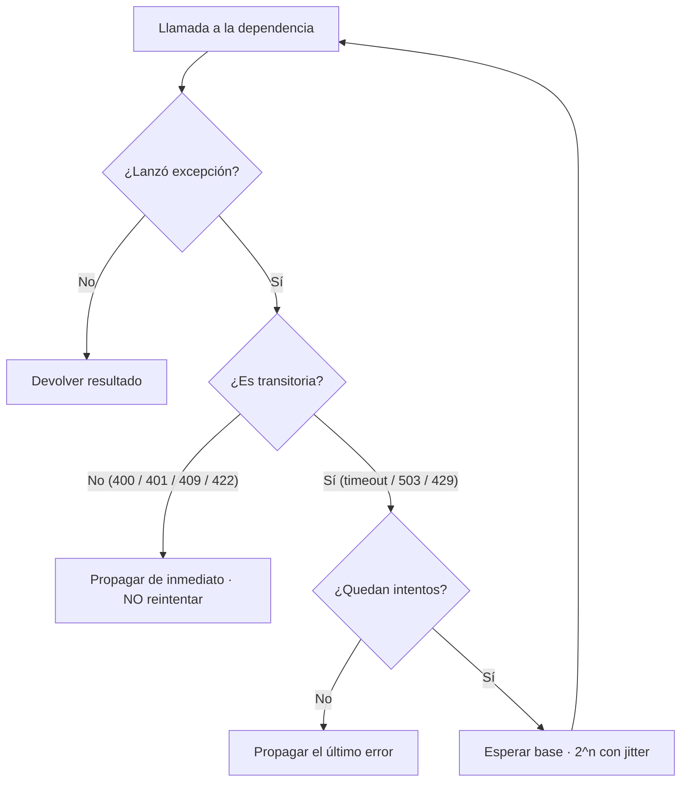
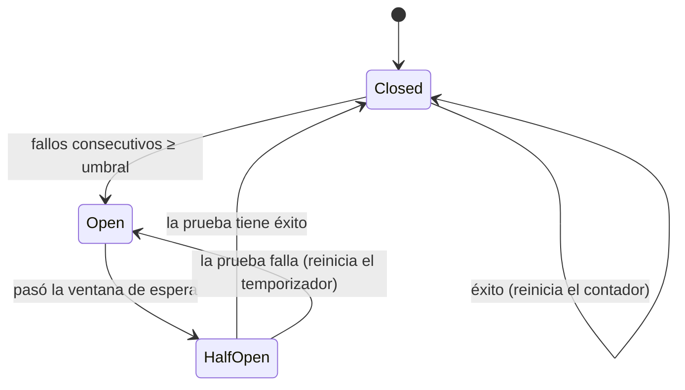

import Reto from "@components/Reto.astro";
import Solucion from "@components/Solucion.astro";
import Quiz from "@components/Quiz.astro";
import CheckDominio from "@components/CheckDominio.astro";
import Nivel from "@components/Nivel.astro";

<Nivel nivel="intermedio" />

En [`3.8`](/fase-3-backend/3-8-backend-fastapi/) montaste una API que valida y responde. En [`3.3`](/fase-3-backend/3-3-postgresql-a-fondo/) aprendiste a que dos clientes no se pisen sobre la misma fila. Esta lección responde la pregunta que aparece **el día que tu API habla con el mundo real**: ¿qué pasa cuando la red falla en mitad de una operación? El cliente no sabe si tu servidor recibió el pedido o no, así que **reintenta**. Y un reintento sobre un `POST` que no estaba preparado para repetirse cobra el pago dos veces, crea el usuario duplicado, envía el correo otra vez. Aquí aprendes a construir endpoints que **toleran reintentos** (idempotencia) y código que **sobrevive a dependencias que fallan** (resiliencia). No es teoría de SRE: es el cambio de mentalidad de "funciona en mi máquina" a "funciona cuando el cable se desconecta".

## 1. Qué vas a saber hacer

Al terminar, sin IA y sin notas, podrás:

- **O1 — Diseñar e implementar un endpoint `POST` idempotente** con _idempotency keys_ (un almacén clave → resultado, claim atómico contra la carrera de dos requests concurrentes), y explicar por qué idempotente **no** significa "se ejecuta una sola vez" sino "el efecto de N llamadas idénticas es el de una".
- **O2 — Implementar reintentos con backoff exponencial + jitter** que reintenten **solo** errores transitorios, con timeout y tope de intentos, y explicar por qué el jitter evita la _retry storm_ (la tormenta de reintentos sincronizados).
- **O3 — Modelar un circuit breaker** (estados closed/open/half-open) y decidir entre **degradar/fallback** o **propagar el error**, justificando el trade-off (fail-open vs fail-closed) según la criticidad de la operación.

## 2. Por qué importa (el dinero está aquí)

> 💰 **Por qué importa:** el backend es donde vive la lógica —y la plata— de las apps que construyes. Un `POST /pagos` que se ejecuta dos veces por un reintento no es un bug cosmético: es un cargo duplicado, un cliente furioso y un reembolso. "Resiliencia", "idempotency", "fault tolerance", "retries/backoff" y "circuit breaker" aparecen en las ofertas de backend, platform y SRE porque son justo lo que separa a quien arma un CRUD de quien arma un **sistema**. Un junior asume que la red nunca falla y que cada request llega exactamente una vez. Un semi-senior asume lo contrario —**la red SIEMPRE falla y los mensajes llegan al menos una vez (o ninguna)**— y diseña para eso. Ese cambio de supuesto es lo que esta lección te instala.

Tres razones la vuelven un punto de no-retorno:

1. **Las fallas parciales son la regla, no la excepción.** En un sistema distribuido (y tu API + su base de datos + el proveedor de pagos ya lo es), una petición puede ejecutarse y aun así **la respuesta perderse**. El cliente no puede distinguir "no se hizo" de "se hizo pero no me enteré". Su única opción razonable es reintentar — y tú tienes que estar listo.
2. **Es el cimiento de la Fase 7.** Cuando construyas automatizaciones y orquestaciones, la entrega _at-least-once_ (al menos una vez) será la norma: cada webhook, cada mensaje de una cola, llega potencialmente repetido. La idempotencia que aprendes aquí es lo que hace que ese mundo no te explote. Conceptos que allá se vuelven centrales —**DLQ** (cola de mensajes muertos), **outbox**, **reconciliación**— nacen de las ideas de esta lección.
3. **Entra al Definition of Done de tu capstone.** Una "API de producción" sin timeouts, sin política de reintentos y sin un endpoint crítico idempotente no es de producción: es una demo. Un revisor senior lo mira en treinta segundos.

## 3. Lo que ya traes (actívalo)

Esta lección ensambla varias piezas de la Fase 3. Reúsalas antes de seguir:

- De [`3.7` Diseño de APIs REST](/fase-3-backend/3-7-diseno-apis-rest/): la **idempotencia de los métodos HTTP**. `GET`, `PUT` y `DELETE` son idempotentes _por definición_ de la spec; `POST` **no**. Justo por eso el `POST` es el que necesita ayuda extra.
- De [`3.3` PostgreSQL a fondo](/fase-3-backend/3-3-postgresql-a-fondo/): **transacciones**, **constraints únicos** y **locking**. La idempotencia bien hecha se apoya en un `UNIQUE` y en una transacción que "reclama" la clave antes de actuar — es la misma defensa contra la carrera que viste con el stock.
- De [`3.9` Ports & adapters](/fase-3-backend/3-9-ports-adapters-hexagonal/): un llamado a un servicio externo es un **adaptador de salida**. El retry, el timeout y el circuit breaker viven ahí, en el adaptador, **no** en el dominio. El dominio no debería saber que el proveedor de pagos a veces se cae.
- De [`3.13` OWASP](/fase-3-backend/3-13-owasp-top10-web/): "no confíes en el cliente". Un reintento descontrolado de tu propio cliente es, en la práctica, un **ataque de denegación de servicio contra ti mismo**.

Antes de seguir, responde de memoria:

<Quiz
  question="Según la spec de HTTP, ¿cuál de estos métodos NO es idempotente y por eso necesita protección extra contra reintentos?"
  options={[
    "GET, porque lee datos",
    "PUT, porque reemplaza un recurso completo",
    "POST, porque crear/cobrar dos veces produce dos efectos distintos",
  ]}
  answer={2}
  explanation="GET no cambia estado; PUT y DELETE son idempotentes por definición (poner el mismo valor o borrar dos veces deja el mismo estado final). POST NO lo es: dos POST idénticos a /pagos producen dos cargos. Por eso el POST es el que necesita idempotency keys para volverse seguro de reintentar."
/>

## 4. El problema, en voz alta

Voy a razonar dos historias paso a paso —primero la del cargo duplicado, luego la de la dependencia que se cae— mostrando el código ingenuo y su arreglo. No memorices recetas: entiende **qué falla y por qué la defensa funciona**.

### 4.1 La historia del cargo duplicado

```mermaid
sequenceDiagram
    participant C as Cliente
    participant S as Servidor
    participant B as Banco
    C->>S: POST /pagos (cobrar 100)
    S->>B: cargar 100
    B-->>S: OK
    S--xC: 200 (la respuesta se pierde en la red)
    Note over C: timeout, no llegó respuesta
    C->>S: POST /pagos (reintento, cobrar 100)
    S->>B: cargar 100 OTRA VEZ
    B-->>S: OK
    S-->>C: 200
    Note over B: cobró 200; el cliente quería 100
```

El servidor **hizo bien su trabajo las dos veces**. El bug no está en el código del cobro: está en que el cliente no tiene forma de saber que el primer intento sí funcionó, y el servidor no tiene forma de saber que el segundo request es el **mismo** que el primero. Falta una pieza: una **identidad del intento** que viaje del cliente al servidor y se mantenga igual a través de los reintentos.

### 4.2 Idempotency keys: darle nombre al intento

La solución, la misma que usan Stripe y PayPal y que la IETF está estandarizando, es una cabecera HTTP: **`Idempotency-Key`**. El **cliente** genera un identificador único (un UUID) para la operación, lo manda en la cabecera, y lo **reusa idéntico en cada reintento de esa misma operación**. El servidor guarda, por clave, el resultado; si ve una clave que ya procesó, devuelve el resultado guardado **sin volver a ejecutar el efecto**.

Versión mínima, en memoria, para ver la idea (en producción el almacén es la base de datos o Redis, no un `dict`):

```python
from fastapi import FastAPI, Header
from pydantic import BaseModel

app = FastAPI()
_resultados: dict[str, dict] = {}   # clave -> respuesta guardada (en prod: DB/Redis)


class Pago(BaseModel):
    monto: int
    destinatario: str


@app.post("/pagos")
def crear_pago(pago: Pago, idempotency_key: str = Header(...)):
    if idempotency_key in _resultados:
        return _resultados[idempotency_key]   # reintento: MISMO resultado, no cobra de nuevo
    recibo = cobrar(pago)                      # el efecto real, una sola vez por clave
    respuesta = {"id": recibo.id, "estado": "cobrado"}
    _resultados[idempotency_key] = respuesta
    return respuesta
```

Ahora el reintento de la historia anterior **encuentra la clave** y devuelve el `{"id": ..., "estado": "cobrado"}` del primer intento. El cliente recibe su 200, queda tranquilo, y el banco cobró **una sola vez**. La operación se volvió **idempotente**: repetirla no cambia el resultado.

### 4.3 La carrera que casi todos olvidan

El código de arriba tiene un agujero que solo se ve bajo concurrencia. ¿Qué pasa si los **dos** requests con la misma clave llegan _casi a la vez_ —porque el cliente reintentó muy rápido, o un balanceador duplicó— y **ambos** evalúan el `if idempotency_key in _resultados` **antes** de que cualquiera escriba? Los dos ven "no está", los dos cobran. Volvimos al cargo duplicado, ahora más difícil de reproducir.

Es exactamente la **carrera** de [`3.3`](/fase-3-backend/3-3-postgresql-a-fondo/), y la defensa es la misma: que la base de datos arbitre con un **constraint único**. En vez de "leer y luego escribir", **reclamas la clave primero** con un `INSERT`, dentro de una transacción:

```sql
CREATE TABLE idempotency_keys (
    clave       text PRIMARY KEY,        -- el UNIQUE hace de árbitro
    usuario_id  bigint NOT NULL,
    respuesta   jsonb,                   -- NULL mientras la operación está "en vuelo"
    creado_en   timestamptz NOT NULL DEFAULT now()
);
```

El flujo correcto:

1. `INSERT INTO idempotency_keys (clave, usuario_id) VALUES (...)`. Esto **reclama** la clave.
2. Si el `INSERT` **falla por violación de unicidad**, otro request ya la tiene. Lees su fila: si `respuesta` ya está llena, la devuelves (es un reintento de algo terminado); si está en `NULL`, la operación aún corre → respondes **409 Conflict** ("procesando, reintenta en un momento").
3. Si el `INSERT` tuvo éxito, **tú** eres el dueño: ejecutas el cobro, y en la **misma transacción** haces `UPDATE ... SET respuesta = ...`.

El `INSERT`-primero convierte "comprobar y actuar" (dos pasos con una ventana entre medio) en una **única operación atómica** que la base de datos serializa por ti. Es el mismo principio del locking que ya conoces, aplicado a la identidad del intento.

:::tip[En la práctica]
La idempotency key la genera **el cliente**, no el servidor. Tiene que ser la misma a través de los reintentos —si el cliente genera una nueva por intento, no sirve de nada— y debe tener un **alcance**: misma clave + mismo usuario + mismo endpoint. Una clave también debería **expirar** (un TTL de 24 h es razonable): no quieres una tabla que crece para siempre.
:::

### 4.4 Resiliencia: cuando la dependencia que llamas se cae

La otra cara. Tu API no solo recibe requests: también **hace** llamadas salientes (al proveedor de pagos, a otra API, a un servicio interno). Y esas dependencias fallan. La llamada ingenua:

```python
def cobrar_en_proveedor(pago: dict) -> dict:
    r = httpx.post("https://api.proveedor.com/charges", json=pago)   # ☠️
    return r.json()
```

Tres bombas escondidas: **(1) no hay timeout** —si el proveedor cuelga, tu request cuelga, y con él el hilo, la conexión a la DB, el worker—; **(2) no reintenta** —un parpadeo de red de 50 ms tumba la operación entera—; **(3) reintentar a ciegas sería peor** —si reintentaras este `POST` sin idempotencia, cobrarías doble—. Vamos capa por capa.

**Capa 1 — Timeout (la corrección #1 que falta en producción).** Una llamada sin timeout es una bomba de tiempo: bajo carga, las conexiones colgadas se acumulan hasta que tu servicio cae por agotamiento de recursos. Un timeout **corto** convierte una falla lenta (que te arrastra) en una falla rápida (que puedes manejar y reintentar):

```python
import httpx

# connect + read acotados; mejor fallar en 2 s que colgar 60
client = httpx.Client(timeout=httpx.Timeout(2.0, connect=1.0))
```

**Capa 2 — Reintentar, pero solo lo transitorio.** Un error **transitorio** (timeout, conexión rechazada, 503 Service Unavailable, 429 Too Many Requests) probablemente se resuelva solo si esperas un poco. Un error **permanente** (400 Bad Request, 401, 404, 422) **no** se arregla reintentando: el request está mal, repetirlo es quemar recursos. La regla de oro:



**Capa 3 — Backoff exponencial + jitter.** Si reintentas de inmediato y en bucle, machacas a una dependencia que ya está sufriendo. El **backoff exponencial** espera cada vez más entre intentos: `base`, `base·2`, `base·4`, `base·8`… (con un tope, para no esperar minutos). Pero el backoff puro tiene un defecto sutil: si mil clientes fallaron _en el mismo instante_ (porque la dependencia se cayó para todos), todos esperarán _exactamente_ lo mismo y **reintentarán a la vez**, una y otra vez — la **retry storm** o _thundering herd_, que impide que la dependencia se levante. El **jitter** (un componente aleatorio en la espera) **desincroniza** a los clientes y disuelve la tormenta.

En producción usas una librería probada como **tenacity**, no reinventas la rueda:

```python
import httpx
from tenacity import (
    retry, stop_after_attempt, wait_random_exponential,
    retry_if_exception_type, before_sleep_log,
)
import logging

logger = logging.getLogger(__name__)
TRANSITORIOS = (httpx.TimeoutException, httpx.ConnectError)


@retry(
    stop=stop_after_attempt(4),                       # tope: 4 intentos y basta
    wait=wait_random_exponential(multiplier=0.5, max=10),  # exponencial CON jitter
    retry=retry_if_exception_type(TRANSITORIOS),      # solo lo transitorio
    before_sleep=before_sleep_log(logger, logging.WARNING),  # observabilidad
    reraise=True,                                     # relanza el error real, no RetryError
)
def cobrar_en_proveedor(client: httpx.Client, pago: dict) -> dict:
    r = client.post("https://api.proveedor.com/charges", json=pago)
    r.raise_for_status()
    return r.json()
```

Detalles que importan: `wait_random_exponential` ya combina exponencial **y** jitter; `retry_if_exception_type(TRANSITORIOS)` evita reintentar los 4xx; `before_sleep_log` deja **rastro** de cada reintento (tu hilo de observabilidad); y `reraise=True` hace que, agotados los intentos, salga el error real y no un `RetryError` opaco. Para los 5xx y 429, que también son transitorios, lo idiomático es traducirlos a una excepción que esté en `TRANSITORIOS` (o usar un predicado de reintento sobre el status).

:::caution[Reintentar un POST solo es seguro si es idempotente]
Aquí se cierra el círculo de la lección: **reintentar una operación con efectos (un cobro) es seguro únicamente si esa operación es idempotente.** Por eso idempotencia y reintentos son **el mismo capítulo**. El retry de la Capa 2 + la idempotency key de §4.2 son las dos mitades de la misma defensa. Si solo tienes reintentos, cobras doble; si solo tienes idempotencia pero no reintentas, te caes ante el primer parpadeo de red.
:::

### 4.5 Circuit breaker: deja de golpear lo que está caído

Los reintentos asumen que la falla es **breve**. ¿Y si la dependencia lleva caída cinco minutos? Seguir reintentando —aunque sea con backoff— desperdicia recursos, alarga la latencia de cada request (esperas los 4 intentos antes de rendirte) y patea a un servicio en el suelo. El **circuit breaker** (cortacircuitos, como el de tu casa) resuelve esto con una máquina de estados:



- **Closed (cerrado):** todo fluye normal. Cuenta fallos consecutivos. Un éxito reinicia el contador.
- **Open (abierto):** se superó el umbral de fallos. El breaker **rechaza las llamadas de inmediato** (lanza una excepción sin siquiera intentar), durante una ventana de espera. Esto le da **aire a la dependencia para recuperarse** y le da a tu servicio una falla **rápida** en vez de lenta.
- **Half-open (medio abierto):** pasada la ventana, deja pasar **una** llamada de prueba. Si tiene éxito → vuelve a _closed_ (la dependencia se recuperó). Si falla → vuelve a _open_ y reinicia el temporizador (sigue caída, espera otra ventana).

El breaker no _arregla_ la falla: **acota su costo**. Convierte "10.000 requests esperando 2 s cada uno a un servicio muerto" en "10.000 requests que fallan en microsegundos y, quizás, sirven una respuesta degradada".

### 4.6 Fallback y degradación: el plan B

Cuando el breaker está abierto o los reintentos se agotaron, tienes una decisión de diseño: **¿propagar el error o degradar?** Aquí entra el trade-off **fail-open vs fail-closed**:

- **Fail-closed (fallar cerrado):** ante la duda, **no** sigas. Para un pago, un borrado, una autorización: si no puedes confirmar que la operación es segura, **recházala**. Mejor un "intenta más tarde" que un cargo fantasma.
- **Fail-open / degradación elegante:** para algo **no crítico** —recomendaciones, un avatar, un contador de "me gusta"— devuelve un **fallback**: el último valor cacheado, una lista vacía, un valor por defecto. La página carga, peor pero usable, en vez de romperse entera por un widget secundario.

> [!tip] En la práctica
> La pregunta correcta nunca es "¿cómo evito que esto falle?" —no puedes—, sino "**cuando esto falle, ¿qué experiencia recibe el usuario?**". Diseñar la respuesta a la falla es ingeniería; ignorarla es esperar que el universo sea amable. No lo es.

## 5. Non-examples y misconceptions (aquí se cae la gente)

:::caution[Podrías pensar X… y está mal]

**"Idempotente significa que se ejecuta una sola vez."**
No. Significa que el **efecto** de N llamadas idénticas es igual al de una. Puede ejecutarse muchas veces (el `if clave in store` corre en cada reintento); lo que no cambia es el **estado final** ni la respuesta. "Exactamente una vez" (_exactly-once_) casi no existe en sistemas distribuidos; lo que se logra es "al menos una vez + idempotencia", que es funcionalmente equivalente.

**"Como uso GET, no me preocupa la idempotencia."**
La idempotencia importa donde hay **efectos**: `POST`, a veces `PATCH`. Un `GET` ya es idempotente. El peligro vive en crear, cobrar, enviar — las operaciones que cambian el mundo.

**"Reintento todo lo que falle."**
Reintentar un 400/401/422 es inútil (el request está mal, repetirlo da el mismo error) y reintentar un `POST` no idempotente **duplica el efecto**. Reintenta **solo** lo transitorio (timeout, conexión, 503, 429) y **solo** operaciones seguras de repetir.

**"Backoff sin jitter está bien, total ya espero entre intentos."**
Bajo una caída masiva, el backoff puro **sincroniza** a todos los clientes: reintentan exactamente al mismo tiempo, en oleadas, e impiden la recuperación. El jitter (aleatoriedad en la espera) los desincroniza. Sin jitter, tus reintentos _son_ el ataque.

**"Un timeout largo es más seguro que uno corto."**
Al revés. Un timeout largo deja recursos colgados y propaga la lentitud aguas arriba (tu servicio se cuelga porque la dependencia se cuelga). Un timeout **corto** convierte una falla lenta en una rápida, que puedes reintentar o degradar. La latencia de cola (p99) la fijan tus timeouts, no tu caso feliz.

**"Circuit breaker y retry son lo mismo."**
Opuestos complementarios. El retry **insiste** (asume falla breve); el breaker **deja de insistir** (asume falla prolongada) para no patear lo que está caído. Van juntos: reintentas unas pocas veces; si el patrón de fallo persiste, el breaker abre y corta.

**"Pongo reintentos en el cliente, en el gateway y en el servicio."**
Reintentos anidados se **multiplican**: 3 capas × 3 intentos = 27 llamadas por un request. Es _retry amplification_, y convierte una falla menor en una avalancha. Define los reintentos en **una** capa (idealmente la más cercana a la dependencia) y que las demás solo propaguen.

**"La idempotency key la genera el servidor."**
No: la genera el **cliente** y la **reusa** en cada reintento de la misma operación. Una clave generada por el servidor sería distinta en cada llegada — exactamente lo que NO queremos.

:::

## 6. Práctica con andamiaje (antes de soltarte)

### 6.1 Predice antes de correr

Tienes un retry configurado para reintentar **solo** `Timeout`, con `stop_after_attempt(4)`.

<Quiz
  question="La llamada lanza un 400 Bad Request (un error PERMANENTE, no transitorio). ¿Cuántas veces se ejecuta la función y qué sale?"
  options={[
    "4 veces: agota todos los intentos y luego relanza el 400",
    "1 vez: el 400 no es transitorio, así que se propaga de inmediato sin reintentar",
    "Infinitas veces hasta que el servidor responda 200",
  ]}
  answer={1}
  explanation="El retry solo reintenta excepciones transitorias (Timeout). Un 400 no está en esa lista, así que el primer intento lo propaga de inmediato. Reintentar un request mal formado solo quema recursos: el error es del request, no de la red."
/>

### 6.2 Predice el estado del breaker

Un circuit breaker con `umbral_fallos=3` y `espera_apertura=30s`. Llega esta secuencia de resultados: **falla, falla, éxito, falla, falla, falla**.

<Quiz
  question="¿En qué estado queda el breaker tras esa secuencia?"
  options={[
    "Open: hubo 5 fallos en total, más que el umbral de 3",
    "Closed: el éxito del medio reinició el contador, luego solo hubo 3 fallos seguidos... que es exactamente el umbral",
    "Open: el éxito reinicia el contador, pero los 3 fallos FINALES consecutivos alcanzan el umbral y lo abren",
  ]}
  answer={2}
  explanation="El breaker cuenta fallos CONSECUTIVOS. El éxito del medio reinicia el contador a 0. Después vienen 3 fallos seguidos: alcanzan el umbral de 3 y el breaker abre. Cuentan los fallos consecutivos, no el total histórico."
/>

### 6.3 Completa el hueco (faded)

Este claim de idempotency key debe responder bien a la carrera. Falta la rama del `INSERT` fallido por unicidad.

```python
def reclamar_clave(conn, clave: str, usuario_id: int) -> str:
    try:
        conn.execute(
            "INSERT INTO idempotency_keys (clave, usuario_id) VALUES (%s, %s)",
            (clave, usuario_id),
        )
        return "reclamada"            # somos los dueños: ejecutar el efecto
    except UniqueViolation:
        fila = conn.execute(
            "SELECT respuesta FROM idempotency_keys WHERE clave = %s", (clave,)
        ).fetchone()
        # ___ (1) ¿qué devolver si fila.respuesta ya está llena? ¿y si está NULL? ___
```

<Solucion title="Ver la lógica que falta (pista, no la solución del ejercicio)">

```python
        if fila.respuesta is not None:
            return "ya_procesada"     # reintento de algo terminado: devolver la respuesta guardada
        return "en_vuelo"             # otro request la tiene y aún no termina: responder 409 Conflict
```

La clave del diseño: distinguir "ya terminó" (devuelve el resultado, idempotencia pura) de "está corriendo ahora mismo" (devuelve 409 "procesando"). Sin esa distinción, o devuelves un resultado vacío, o cobras de nuevo. El `INSERT`-primero es lo que serializa la carrera; el `SELECT` del `except` es lo que decide cuál de los dos casos es.

</Solucion>

## 7. Ejercicios Primero-Sin-IA

Trabaja cada uno **a mano y sin IA** dentro de su timebox. Las carpetas viven en tu repo; ábrelas en tu editor. Para los de código, implementa, **corre los tests** y mira fallar primero. Pide la corrección con la rúbrica de `.ai/` cuando termines.

<Reto title="Reintentos con backoff exponencial + jitter (a mano)" timebox="40–45 min">

Carpeta: `ejercicios/fase-3/retry-backoff-jitter/`

Implementa `reintentar(fn, ...)` **sin tenacity ni ninguna librería de retry** — a mano, para entender la mecánica. Debe llamar a `fn()`, reintentar **solo** las excepciones transitorias hasta un tope de intentos, esperar entre reintentos con **backoff exponencial acotado por un tope** y **jitter**, y propagar de inmediato los errores no transitorios.

- El `dormir` (default `time.sleep`) y el `aleatorio` (default `random.random`) se **inyectan** como parámetros, para que los tests sean deterministas y rápidos (sin dormir de verdad).
- Backoff: la espera del intento `n` (empezando en 0) es `aleatorio() * min(tope, base * 2**n)` — _full jitter_, estilo AWS.
- Si se agotan los intentos, **relanza la última excepción transitoria** (no una genérica).

**Hecho significa:**
- `pytest` en verde: éxito al primer intento (sin dormir); falla 2 veces y luego acierta; un error permanente se propaga sin reintentar; agotados los intentos relanza el transitorio; la secuencia de esperas es exponencial y respeta el tope.
- En `bitacora.md` explicas por qué el jitter evita la _retry storm_ y por qué NO se reintentan los 4xx.
- Puedes explicar, sin notas, por qué reintentar un `POST` no idempotente es peligroso.

</Reto>

<Reto title="Circuit breaker: la máquina de estados (a mano)" timebox="40–45 min">

Carpeta: `ejercicios/fase-3/circuit-breaker-estados/`

Implementa la clase `CircuitBreaker` con los tres estados (closed/open/half-open) y el método `llamar(fn)`. El **reloj** se inyecta (default `time.monotonic`) para poder avanzar el tiempo en los tests sin esperar de verdad.

- `closed`: ejecuta `fn`; un éxito reinicia el contador de fallos; al alcanzar `umbral_fallos` consecutivos, pasa a `open` y marca el momento.
- `open`: **rechaza** la llamada lanzando `CircuitoAbierto` (sin invocar `fn`) hasta que pase `espera_apertura`.
- `half-open` (pasada la ventana): deja pasar **una** prueba; si tiene éxito → `closed`; si falla → `open` con el temporizador reiniciado.
- Expón la propiedad `estado` (`"closed"` / `"open"` / `"half-open"`) de modo que sea observable desde fuera.

**Hecho significa:**
- `pytest` en verde: arranca cerrado; `umbral` fallos lo abren; estando abierto rechaza sin llamar a `fn`; tras la ventana queda `half-open`; la prueba exitosa cierra y la fallida reabre; un éxito en `closed` reinicia el contador.
- En `bitacora.md` explicas la diferencia entre el circuit breaker y el retry, y para qué sirve el estado half-open.
- Puedes explicar, sin notas, por qué el breaker da una falla "rápida" y por qué eso protege a la dependencia caída.

</Reto>

<Reto title="Diseña un endpoint POST idempotente (razonamiento)" timebox="35–40 min">

Carpeta: `ejercicios/fase-3/disenar-pago-idempotente/`

Modalidad **razonamiento y diseño** (sin código que correr). Diseñas la idempotencia de un `POST /pagos`. Entregas `diseno.md` (respondiendo las preguntas del enunciado) y `esquema.sql` (la tabla de idempotency keys con su constraint).

- Define el **esquema** de la tabla: clave (con su `UNIQUE`/PK), alcance (usuario, endpoint), campo de respuesta, timestamp para TTL.
- Describe el **flujo paso a paso** ante: (a) primer request, (b) reintento de algo ya terminado, (c) dos requests concurrentes con la misma clave (la carrera).
- Decide qué **status HTTP** devuelves en cada caso y por qué (incluyendo el 409 del "en vuelo").
- Cierra con el **trade-off fail-open vs fail-closed** para este endpoint: ¿degradarías o propagarías el error si el banco no responde? Justifica.

**Hecho significa:**
- El esquema tiene un constraint que hace de árbitro de la carrera, y el flujo usa "INSERT-primero" (no "leer y luego escribir").
- Distingues claramente "ya procesada" (devuelve resultado) de "en vuelo" (409).
- Defiendes, sin notas, por qué un pago es fail-closed y por qué la clave la genera el cliente.

</Reto>

> La **solución de referencia** de cada ejercicio existe para el corrector IA, no para ti: no la busques antes de cerrar tu intento. La pista inline de arriba (sección 6.3) es un empujón, no la respuesta.

## 8. Check de dominio

Sin mirar la lección, responde en voz alta o por escrito. Si una te traba, ya sabes qué sección releer.

<CheckDominio items={[
  "Explicar qué significa que una operación sea idempotente (no es 'se ejecuta una vez') y por qué el POST lo necesita y el GET no.",
  "Describir cómo una idempotency key vuelve idempotente a un POST, quién genera la clave, y por qué hace falta un INSERT con constraint único para ganar la carrera concurrente.",
  "Decir qué errores se reintentan (transitorios) y cuáles NO (permanentes), y por qué reintentar un 400 o un POST no idempotente es un error.",
  "Explicar qué es el backoff exponencial, qué problema agrega el jitter, y qué es una retry storm.",
  "Dibujar de memoria la máquina de estados del circuit breaker (closed/open/half-open) y explicar qué dispara cada transición.",
  "Explicar el trade-off fail-open vs fail-closed con un ejemplo de cada uno (pago vs recomendaciones).",
]} />

<Quiz
  question="Tu API llama a un proveedor de pagos. Quieres que un parpadeo de red no tumbe la operación, pero que un cargo no se duplique nunca y que, si el proveedor lleva minutos caído, dejes de golpearlo. ¿Qué combinación usas?"
  options={[
    "Solo reintentos agresivos sin límite: tarde o temprano el pago pasa",
    "Idempotency key (no duplica) + retry con backoff y jitter sobre errores transitorios (parpadeo) + circuit breaker (corta si la caída es prolongada) + timeout",
    "Solo un timeout largo para darle tiempo de sobra al proveedor",
  ]}
  answer={1}
  explanation="Las tres piezas son complementarias: la idempotency key hace seguro reintentar el POST; el retry con backoff+jitter absorbe los fallos breves sin sincronizar la tormenta; el circuit breaker corta cuando la caída es prolongada para no desperdiciar recursos ni patear al proveedor; y el timeout acota la latencia de cada intento. Reintentos sin límite (opción 1) amplifican la falla; un timeout largo solo (opción 3) cuelga recursos."
/>

## 9. Recursos (oficial primero)

- **IETF — The Idempotency-Key HTTP Header Field** (`datatracker.ietf.org/doc/draft-ietf-httpapi-idempotency-key-header/`): el draft que estandariza la cabecera `Idempotency-Key`. Inspirado en Stripe y PayPal.
- **Stripe — Idempotent requests** (`docs.stripe.com/api/idempotent_requests`): el patrón de idempotency keys explicado por quien lo popularizó, con su semántica de reintentos y TTL.
- **AWS Builders' Library — Timeouts, retries and backoff with jitter** (`aws.amazon.com/builders-library/timeouts-retries-and-backoff-with-jitter/`): la referencia sobre por qué el jitter es indispensable.
- **Martin Fowler — CircuitBreaker** (`martinfowler.com/bliki/CircuitBreaker.html`): el artículo canónico sobre los estados del breaker.
- **tenacity** (`tenacity.readthedocs.io`): la librería de reintentos para Python (`wait_random_exponential`, `stop_after_attempt`, `retry_if_exception_type`, `reraise`).
- **httpx — Timeouts** (`www.python-httpx.org/advanced/timeouts/`): cómo configurar connect/read/write/pool timeouts.
- **MDN — Idempotent** (`developer.mozilla.org/en-US/docs/Glossary/Idempotent`): qué métodos HTTP son idempotentes y por qué.

## 10. Conexión con el capstone

El [capstone de la Fase 3](/fase-3-backend/proyecto/) es una **API de producción**, y la resiliencia es parte de lo que la hace "de producción":

- El endpoint que crea/cobra/reserva lleva **idempotency key** con claim atómico (sección 4.2–4.3). Documenta la decisión en un **ADR**: dónde vive el almacén ([Redis en `3.15`](/fase-3-backend/3-15-redis-caching/) o Postgres), qué TTL, qué alcance.
- Toda llamada saliente tiene **timeout** explícito y una **política de reintentos** definida en **una** capa (el adaptador de salida de [`3.9`](/fase-3-backend/3-9-ports-adapters-hexagonal/)), reintentando solo lo transitorio.
- Las dependencias externas críticas van detrás de un **circuit breaker**; cada falla decide fail-open o fail-closed según la criticidad.
- La política de reintentos y la estrategia de idempotencia son trade-offs defendibles — exactamente lo que un revisor senior espera ver en un ADR.

Esto se conecta hacia adelante con [`3.16` colas y async](/fase-3-backend/3-16-colas-async/) y, sobre todo, con la **Fase 7**: la entrega _at-least-once_ de webhooks y colas hace de la idempotencia un requisito, y de aquí salen el **DLQ** (mensajes que fallaron tras agotar reintentos), el **outbox** (escribir el cambio y el evento en la misma transacción) y la **reconciliación** (comparar periódicamente para cazar lo que se perdió).

## 11. Reflexión + repaso espaciado

Escribe 3–4 frases respondiendo: **¿cuál de tus endpoints actuales (o de HomeBase, o de cualquier proyecto tuyo) cobraría/crearía/enviaría dos veces si el cliente reintentara?** Esa es la primera deuda de resiliencia que vas a querer pagar.

**Gancho de spaced repetition:**
- **Mañana:** reescribe de memoria, sin mirar, la lógica del claim de idempotency key (INSERT-primero + qué devolver ante violación de unicidad según `respuesta` esté llena o `NULL`).
- **En 3 días:** dibuja en una pizarra la máquina de estados del circuit breaker y explícale a alguien (o en inglés técnico, a una grabación tuya) qué dispara cada transición y por qué half-open existe.
- **En 1 semana:** al endurecer tu capstone, añade de una sola pasada a un endpoint crítico: idempotency key con claim atómico, timeout en toda llamada saliente, retry con backoff+jitter solo en lo transitorio, y un circuit breaker en la dependencia externa. Esa pasada completa es la prueba de que la resiliencia ya es tu hábito, no un parche de último minuto.
