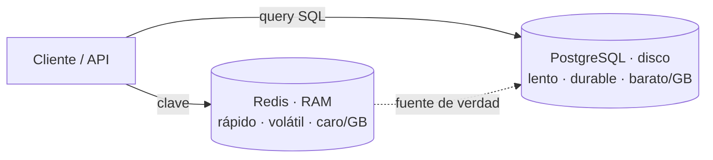
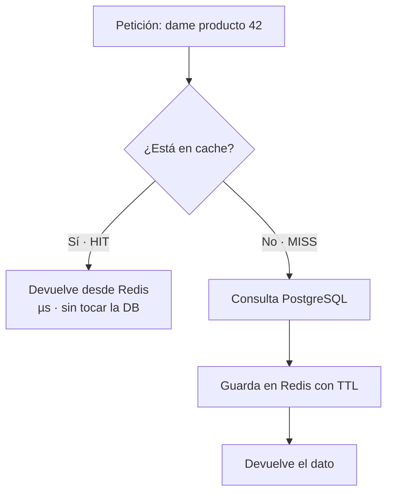

import Reto from "@components/Reto.astro";
import Solucion from "@components/Solucion.astro";
import Quiz from "@components/Quiz.astro";
import CheckDominio from "@components/CheckDominio.astro";
import Nivel from "@components/Nivel.astro";

<Nivel nivel="intermedio" />

:::note[Profundización opcional]
Esta sub-unidad es **opcional/profundización**, no ruta-crítica. Tu capstone de Fase 3 funciona perfectamente **sin** Redis. Léela cuando ya tengas un backend que mediste y que tiene un problema de rendimiento real, o cuando una oferta pida "Redis" explícitamente (aparece seguido). El mensaje central es contraintuitivo: la habilidad senior no es *agregar* una cache, es saber **cuándo NO agregarla** y reconocer la deuda que introduce cuando la agregas.
:::

## 1. Qué vas a saber hacer

Al terminar, sin IA y sin notas, podrás:

- **O1 — Implementar el patrón cache-aside** sobre una lectura de tu backend (con `redis-py`): leer de la cache, en un *miss* ir a la base de datos, poblar la cache con un **TTL**, y **medir** la diferencia de latencia para justificar que la cache valía la pena.
- **O2 — Explicar el trade-off central del caching** (latencia/costo vs. frescura/consistencia) y por qué *cache invalidation* es uno de los problemas difíciles de verdad; elegir con criterio entre **expiración por TTL** e **invalidación por escritura**.
- **O3 — Elegir la estructura de datos Redis correcta** (string / hash / list / set / sorted set) para un caso dado (caching, sesión, rate limiting, cola simple) y argumentar **cuándo una cache NO se justifica**.

## 2. Por qué importa (el dinero está aquí)

> 💰 **Por qué importa:** "Redis" aparece de forma recurrente en las ofertas de backend, y por una buena razón: es el cuchillo suizo de la capa de rendimiento. La misma herramienta te resuelve caching (reducir latencia y carga de la base de datos), sesiones compartidas entre varias instancias de tu API, rate limiting distribuido y colas simples. En la Fase 6, ese mismo patrón cache-aside se convierte en **semantic caching** de respuestas de LLM, que no solo baja la latencia: **baja la factura de tokens directamente**. Saber cachear es saber controlar costo y latencia, dos hilos transversales que un revisor senior espera ver medidos, no adivinados.

Pero hay una honestidad que pocos cursos dan: **una cache mal puesta es de las peores deudas técnicas que existe**. Introduce una segunda fuente de verdad que puede mentir (datos *stale*), bugs que solo aparecen en producción bajo concurrencia, y la pregunta eterna "¿por qué este usuario ve el precio viejo?". Por eso el orden correcto es siempre **medir → entender el cuello de botella → considerar la cache como una de varias opciones**. Un junior agrega Redis porque "es rápido". Un semi-senior agrega Redis porque midió un endpoint a p95 de 800 ms, vio en `EXPLAIN` que la query es la culpable, calculó que los datos cambian una vez al día, y decidió que 5 minutos de *staleness* son aceptables. Esa cadena de razonamiento es lo que esta lección te instala.

## 3. Lo que ya traes (actívalo)

Esta sub-unidad ensambla varias piezas de la Fase 3. Reúsalas antes de seguir:

- De [`3.3` PostgreSQL a fondo](/fase-3-backend/3-3-postgresql-a-fondo/): `EXPLAIN ANALYZE` y la idea de **medir antes de optimizar**. La cache es el último recurso, después de un índice que falta o una query mal escrita.
- De [`3.8` FastAPI](/fase-3-backend/3-8-backend-fastapi/): `lifespan` (donde abrirás y cerrarás la conexión a Redis) y `Depends` (donde inyectarás el cliente). Una operación de cache es I/O de red: encaja con `async`.
- De [`3.7` Diseño de APIs REST](/fase-3-backend/3-7-diseno-apis-rest/): los `GET` son **idempotentes y seguros** (no mutan estado). Por eso son los candidatos naturales a cachear; un `POST` casi nunca lo es.
- De [`3.9` Ports & adapters](/fase-3-backend/3-9-ports-adapters-hexagonal/): la cache es un **adaptador de salida**, igual que el repositorio de base de datos. Tu lógica de dominio no debería saber si por debajo hay Redis o un diccionario en memoria — eso es lo que hará tus tests fáciles más abajo.
- De [`3.13` OWASP web](/fase-3-backend/3-13-owasp-top10-web/): el rate limiting que viste con `slowapi` usa un **store** por debajo; en producción multi-instancia ese store es Redis.

Antes de seguir, responde de memoria:

<Quiz
  question="Tu endpoint GET /reportes/ventas tarda 900 ms en p95. Antes de pensar en cachear, ¿cuál es el primer paso correcto?"
  options={[
    "Agregar Redis de inmediato: si está lento, cachear siempre ayuda",
    "Medir y entender POR QUÉ está lento (EXPLAIN de la query, índices, N+1): la cache puede no ser la respuesta, o puede ser prematura",
    "Subir el plan del servidor a más CPU y RAM",
  ]}
  answer={1}
  explanation="Medir primero. Quizá falta un índice (arreglo permanente y barato) o hay un N+1 (lo viste en 3.5). Cachear una query mal escrita esconde el problema y agrega staleness encima. La cache es una decisión, no un reflejo: se toma después de medir y entender el cuello de botella."
/>

## 4. Redis, en voz alta

Voy a recorrer qué es Redis, sus estructuras, el TTL, y luego el patrón estrella —cache-aside— razonando cada decisión. No memorices comandos: entiende el modelo mental y el trade-off de cada uso.

### 4.1 Qué es (y qué no es) Redis

Redis (*REmote DIctionary Server*) es un **almacén de estructuras de datos clave-valor que vive en memoria RAM**. Esa frase tiene tres palabras que lo explican todo:

- **Clave-valor:** accedes a los datos por una clave exacta (`producto:42`), no con queries tipo SQL. No hay JOINs ni `WHERE precio > 1000`. Si no sabes la clave, no encuentras el valor. Es un diccionario gigante, compartido por red.
- **En memoria (RAM):** por eso es brutalmente rápido —del orden de microsegundos por operación, frente a milisegundos de una base de datos en disco—. Y por eso mismo es **caro por GB** y **volátil**: si el proceso se reinicia, en su configuración por defecto puedes perder datos.
- **Estructuras de datos:** no guarda solo strings. Sabe de listas, hashes, sets y más, con comandos atómicos para cada uno. Eso lo separa de un caché tonto.



:::caution[Redis NO es tu base de datos principal]
La regla mental: **PostgreSQL es la fuente de verdad; Redis es una copia desechable y acelerada de una parte de ella.** Todo lo que pongas en Redis tienes que poder reconstruirlo desde Postgres. Si pierdes Redis, tu app debe seguir funcionando (más lenta). Guardar datos que solo existen en Redis, sin respaldo, es pedirle a un sistema volátil que haga el trabajo de uno durable.
:::

### 4.2 Las cinco estructuras que usarás

Redis tiene muchas estructuras; estas cinco cubren el 95% de los casos de backend. La clave de la habilidad es **elegir la estructura por el caso de uso**, no usar strings para todo.

| Estructura | Qué es | Caso de uso típico |
|---|---|---|
| **String** | Un valor (texto, número, o JSON serializado) | Cachear un objeto (un producto como JSON); un contador con `INCR` |
| **Hash** | Un mapa de campos→valores bajo una clave | Una **sesión** (`sesion:abc` → `{user_id, rol, expira}`); editar un campo sin reescribir todo |
| **List** | Lista ordenada, push/pop por los extremos | **Cola simple** de trabajos (`LPUSH` para encolar, `BRPOP` para consumir) |
| **Set** | Conjunto sin orden ni duplicados | Etiquetas, "usuarios online", tests de pertenencia rápidos |
| **Sorted Set** | Set donde cada miembro tiene un *score* numérico | **Leaderboards**, rate limiting por ventana deslizante, colas con prioridad |

Conectémoslo con `redis-py` (el cliente oficial de Python). Primero, una conexión con `decode_responses=True` para recibir `str` en vez de `bytes` (un gotcha clásico: sin esto comparas `b"valor"` contra `"valor"` y nunca son iguales):

```python
import redis

r = redis.Redis(host="localhost", port=6379, db=0, decode_responses=True)

# String + número
r.set("saludo", "hola", ex=60)   # SET con expiración de 60 s (preferido sobre SETEX)
r.get("saludo")                  # -> "hola"  (o None si expiró / no existe)
r.incr("visitas")                # -> 1, 2, 3...  (atómico)

# Hash: una sesión, campo por campo
r.hset("sesion:abc", mapping={"user_id": "1", "rol": "admin"})
r.hgetall("sesion:abc")          # -> {"user_id": "1", "rol": "admin"}
r.expire("sesion:abc", 1800)     # la sesión caduca en 30 min

# Inspección
r.ttl("saludo")                  # -> segundos que le quedan (~60); -1 sin TTL; -2 no existe
r.delete("saludo")               # borra la clave
```

### 4.3 TTL: la expiración es una feature, no un detalle

`TTL` (*Time To Live*) es el tiempo de vida de una clave. Cuando lo fijas, Redis **borra la clave automáticamente** al expirar. Esto no es un adorno: es el mecanismo que evita que tu cache crezca para siempre (un *memory leak* clásico es cachear sin TTL) y la herramienta más simple de invalidación. Una clave sin TTL vive hasta que la borres a mano o se acabe la memoria.

`ttl(clave)` devuelve tres cosas que conviene memorizar:
- un **número positivo** → segundos que le quedan,
- **-1** → la clave existe pero **no tiene expiración** (sospechoso en una cache),
- **-2** → la clave **no existe** (ya expiró o nunca estuvo).

> El TTL correcto es una **decisión de producto**: ¿cuánta desactualización tolera este dato? El catálogo que cambia una vez al día aguanta un TTL de minutos u horas; el saldo de una cuenta bancaria, segundos o nada. No hay un valor "correcto" universal — hay un trade-off que tú eliges y anotas en un ADR.

### 4.4 El patrón estrella: cache-aside (lazy loading)

**Cache-aside** (o *lazy loading*) es el patrón de caching más usado, y el que debes saber implementar de memoria. La idea: la cache se llena **bajo demanda**, solo cuando alguien pide un dato que no está. El flujo de una **lectura**:



Razonemos el código en voz alta. Quiero acelerar `obtener_producto`, que hoy pega siempre a la base de datos:

```python
import json

def obtener_producto(producto_id: int) -> dict:
    clave = f"producto:{producto_id}"

    # 1) ¿Está en cache? (el HIT, el camino feliz y rápido)
    cacheado = r.get(clave)
    if cacheado is not None:
        return json.loads(cacheado)        # deserializo el JSON que guardé

    # 2) MISS: voy a la fuente de verdad
    producto = db_consultar_producto(producto_id)

    # 3) Pueblo la cache para la próxima vez, CON TTL (5 min)
    r.set(clave, json.dumps(producto), ex=300)

    # 4) Devuelvo
    return producto
```

Tres decisiones para defender:

1. **`json.dumps` / `json.loads`.** Redis guarda strings/bytes, no objetos Python. Serializo a JSON. **No uses `pickle`** para esto: es más lento de razonar, acopla a Python, y deserializar `pickle` de una fuente que un atacante pueda tocar es una vulnerabilidad de ejecución de código. JSON es legible, portable y seguro.
2. **`ex=300`.** Pongo TTL **siempre**. Si me olvido, la entrada vive para siempre: la cache crece sin control y los datos quedan *stale* eternamente. El "5 min" es la decisión de producto del 4.3.
3. **Comparo con `is not None`, no con un `if cacheado:`.** Un valor cacheado legítimo podría ser falsy (`"0"`, `""`, `"[]"`). `if cacheado:` trataría eso como un miss y volvería a la DB de gusto. Detalle pequeño, bug real.

Y ahora la otra mitad, la que mucha gente olvida: **¿qué pasa cuando el dato cambia?** Una **escritura** debe invalidar la cache, o servirás el precio viejo durante todo el TTL:

```python
def actualizar_producto(producto_id: int, datos: dict) -> None:
    # 1) Escribe en la FUENTE DE VERDAD primero
    db_actualizar_producto(producto_id, datos)
    # 2) Invalida la cache: la próxima lectura será un MISS y recargará lo nuevo
    r.delete(f"producto:{producto_id}")
```

El **orden importa**: primero la base de datos, después borrar la cache. Si borraras la cache primero y la escritura a la DB fallara, te quedarías sin cache pero con el dato viejo en la DB — peor de los dos mundos. Y fíjate que **invalidar = borrar**, no "actualizar la cache con el valor nuevo": borrar es más simple y deja que el cache-aside recargue desde la fuente de verdad en la próxima lectura. (Actualizar la cache directamente es el patrón *write-through*, que tiene sus propias trampas de concurrencia.)

### 4.5 El problema difícil: cache invalidation

Hay una frase célebre en computación (atribuida a Phil Karlton): *"Solo hay dos cosas difíciles en ciencias de la computación: invalidación de cache y nombrar cosas."* No es un chiste vacío. El momento entre "el dato cambió" y "la cache refleja el cambio" es donde viven los bugs sutiles:

- **Datos stale (rancios):** entre que se escribe la DB y se invalida (o hasta que expira el TTL), hay lectores que ven lo viejo. A veces es tolerable (un contador de "me gusta"); a veces no (un permiso revocado).
- **Race condition lectura/escritura:** lector A tiene un MISS y consulta la DB; justo entonces escritor B actualiza la DB e invalida; A guarda en cache el valor *viejo* que ya había leído. La cache queda con basura hasta el próximo TTL. (Por eso el TTL es tu red de seguridad: aunque la invalidación falle, el dato no miente *para siempre*.)
- **Thundering herd (estampida):** una clave muy popular expira; mil peticiones tienen un MISS **al mismo tiempo** y las mil pegan a la DB de golpe. La cache que te protegía ahora amplificó el problema. Mitigaciones: TTL con un poco de aleatoriedad (*jitter*) para que no expiren todas juntas, o un *lock* para que solo una repueble.

No tienes que resolver todo esto hoy. El objetivo es que **reconozcas que existe** y que sepas que el TTL es tu defensa de fondo. La invalidación es difícil; tratarla como trivial es la marca del junior.

### 4.6 Otros tres usos en una línea cada uno

Para que veas que Redis es más que cachear:

- **Sesiones compartidas:** si tu API corre en 3 instancias detrás de un load balancer, una sesión guardada en la memoria del proceso 1 no existe para el proceso 2. Guárdala en Redis (un hash con TTL) y las 3 instancias la comparten. Es el caso "sesiones" del título.
- **Rate limiting (ventana fija, versión simple):**

  ```python
  def permitido(ip: str, limite: int = 100, ventana: int = 60) -> bool:
      clave = f"rl:{ip}"
      actual = r.incr(clave)          # atómico: cuenta esta petición
      if actual == 1:                 # primera de la ventana: arranca el reloj
          r.expire(clave, ventana)
      return actual <= limite
  ```

  Honestidad: hay una *race* fina (si el proceso muere entre `incr` y `expire`, la clave no expira nunca). La versión robusta usa un *pipeline* o un script Lua para hacer ambos pasos atómicos, o un sorted set para una ventana deslizante. Esto conecta con el rate limiting de [`3.13`](/fase-3-backend/3-13-owasp-top10-web/).
- **Cola simple:** `LPUSH` para encolar trabajos y `BRPOP` para consumir es una cola funcional en dos comandos. Para trabajos serios (reintentos, *dead-letter queue*, visibilidad) se queda corta — ahí entran herramientas dedicadas que verás en [`3.16` Colas y async](/fase-3-backend/3-16-colas-async/). Saber dónde está el límite es parte del criterio.

## 5. Non-examples y misconceptions (aquí se cae la gente)

:::caution[Podrías pensar X… y está mal]

**"Si algo está lento, cachéalo. La cache siempre ayuda."**
Falso y peligroso. Cachear sin medir esconde el problema real (un índice que falta, un N+1) y agrega *staleness* encima. Primero `EXPLAIN`, índice, query. La cache es el último recurso, no el primero.

**"Cachéalo todo."**
Cachear datos que cambian en cada request (un timestamp, un carrito en vivo) da puros MISS: pagas el costo de la cache sin ningún HIT. Cachea lo que se **lee mucho y cambia poco**. Lo demás, no.

**"Pongo el valor en la cache y listo, ya está acelerado."**
Olvidaste el TTL y la invalidación. Sin TTL, la cache crece sin límite (memory leak) y sirve datos rancios para siempre. Sin invalidación al escribir, muestras el valor viejo durante todo el TTL.

**"Redis es una base de datos rápida, guardo ahí mis datos."**
Redis es **volátil** y **caro por GB**. Es una copia desechable y acelerada de una parte de tu Postgres. Si lo que guardas no se puede reconstruir desde la fuente de verdad, estás usando la herramienta equivocada.

**"Invalidar es fácil: al escribir, actualizo la cache con el valor nuevo."**
Eso es *write-through*, y bajo concurrencia tiene races (dos escrituras casi simultáneas pueden dejar el valor perdedor en la cache). El cache-aside prefiere **borrar** (invalidar) y dejar que la próxima lectura recargue desde la verdad. Más simple, menos sorpresas.

**"Guardo el objeto con `pickle`, total es Python."**
`pickle` acopla a Python, es opaco para depurar, y deserializar `pickle` no confiable ejecuta código arbitrario. Usa JSON: legible, portable, seguro.

**"Conecto y comparo el valor, pero el `if` nunca da true."**
Sin `decode_responses=True`, Redis te devuelve `bytes` (`b"hola"`), no `str`. Comparar `b"hola" == "hola"` es `False`. Activa `decode_responses=True` o decodifica a mano, pero sé consistente.

**"Total, el TTL me protege, no necesito invalidar al escribir."**
El TTL es la red de seguridad, no el plan A. Si un usuario actualiza su perfil y ve el dato viejo 5 minutos, eso es un bug visible. Invalida al escribir; el TTL solo te cubre cuando la invalidación falla.
:::

## 6. Práctica con andamiaje (antes de soltarte)

### 6.1 Predice antes de correr

`r` es un cliente Redis con `decode_responses=True`; arranca **vacío**. Lee sin ejecutar:

```python
r.set("x", "10", ex=30)
print(r.get("x"))        # (1)
print(r.ttl("x"))        # (2) aprox.
r.delete("x")
print(r.get("x"))        # (3)
print(r.ttl("x"))        # (4)
```

<Quiz
  question="¿Qué imprimen, en orden, las líneas (1), (2), (3) y (4)?"
  options={[
    "'10' / un número cercano a 30 / None / -2",
    "10 (int) / 30 exacto / '' / 0",
    "'10' / -1 / None / -1",
  ]}
  answer={0}
  explanation="(1) get devuelve el string '10' (Redis no sabe de int; por eso INCR es especial). (2) ttl devuelve los segundos restantes: ~30, no exacto. (3) tras delete, get devuelve None. (4) ttl de una clave inexistente es -2 (no -1: -1 es 'existe pero sin expiración'). Distinguir -1 de -2 es justo lo que separa entender el TTL de adivinarlo."
/>

### 6.2 Ordena el cache-aside (Parsons)

Estas seis líneas implementan la **lectura** cache-aside, pero están **desordenadas**. ¿Cuál es el orden correcto?

```text
A)     return producto
B)     producto = db_consultar_producto(producto_id)
C) cacheado = r.get(clave)
D)     r.set(clave, json.dumps(producto), ex=300)
E) if cacheado is not None:
F)         return json.loads(cacheado)
```

<Solucion title="Ver el orden correcto (pista, no la solución del ejercicio)">

Orden: **C → E → F → B → D → A**.

```python
cacheado = r.get(clave)              # C  intenta la cache
if cacheado is not None:             # E  ¿HIT?
    return json.loads(cacheado)      # F  sí: devuelve y corta (no toca la DB)
producto = db_consultar_producto(producto_id)  # B  MISS: a la fuente de verdad
r.set(clave, json.dumps(producto), ex=300)      # D  puebla la cache con TTL
return producto                                  # A  devuelve
```

La clave es que el `return` del HIT (F) va **antes** de consultar la DB: si está cacheado, no debes tocar Postgres. Y poblar la cache (D) solo ocurre en el camino del MISS, después de leer la DB.

</Solucion>

### 6.3 Completa el hueco (faded)

Esta escritura debe invalidar la cache, pero le falta una línea y el **orden** es lo que se evalúa:

```python
def cambiar_precio(producto_id: int, nuevo: int) -> None:
    db_actualizar_precio(producto_id, nuevo)
    # ___ (1) invalida la entrada de cache de este producto ___
```

<Solucion title="Ver la línea que falta (pista, no la solución del ejercicio)">

```python
    r.delete(f"producto:{producto_id}")
```

Va **después** de escribir la DB (la fuente de verdad primero) y es un `delete`, no un `set` con el valor nuevo: invalidar es borrar y dejar que la próxima lectura recargue. Si la clave no existe, `delete` no falla: simplemente devuelve 0.

</Solucion>

## 7. Ejercicios Primero-Sin-IA

Trabaja cada uno **a mano y sin IA** dentro de su timebox. Las carpetas viven en tu repo; ábrelas en tu editor. El ejercicio de código está diseñado para correr **sin un Redis real** (la cache se inyecta como un doble de prueba — eso es ports & adapters de [`3.9`](/fase-3-backend/3-9-ports-adapters-hexagonal/) trabajando a tu favor). Pide la corrección con la rúbrica de `.ai/` cuando termines.

<Reto title="Cache-aside con TTL e invalidación" timebox="40 min">

Carpeta: `ejercicios/fase-3/cache-aside-ttl/`

Implementa `CatalogoService` en `cache_aside.py`. Recibe por inyección un `cache` (con `get/set/delete`) y un `repo` (la "base de datos"). Tu trabajo es implementar dos métodos:

- `obtener(producto_id)` → patrón **cache-aside**: HIT devuelve desde cache sin tocar el repo; MISS consulta el repo y **puebla la cache con `TTL_SEGUNDOS`**.
- `actualizar(producto_id, datos)` → escribe en el repo **primero** y luego **invalida** la entrada de cache.

No necesitas instalar Redis: los tests te pasan un `SpyCache` (dict + contadores) y un `SpyRepo` (cuenta accesos a la "DB").

**Hecho significa:**
- `pytest` en verde: un MISS consulta el repo una vez y puebla la cache con el TTL correcto; un segundo `obtener` es un HIT que **no** vuelve al repo; tras `actualizar`, la siguiente lectura devuelve el dato nuevo (no el viejo cacheado).
- Añades **un test tuyo**: un producto que cambia dos veces seguidas nunca sirve un valor intermedio rancio.
- En `bitacora.md` explicas por qué el `return` del HIT va antes de tocar el repo, por qué invalidas borrando (y no actualizando), y por qué el orden DB-primero importa.
- Puedes explicar, sin notas, qué es un *cache miss* y qué hace el TTL.

</Reto>

<Reto title="¿Cachear o no? Decide y elige la estructura" timebox="35 min">

Carpeta: `ejercicios/fase-3/cuando-cachear-decision/`

Modalidad **razonamiento y diseño** (sin código que correr). Te dan cuatro escenarios con métricas reales (latencias, frecuencia de lectura, frecuencia de cambio del dato). Tu trabajo es decidir, como un semi-senior, **si** conviene una cache y **cómo**.

Produce `decisiones.md`. Para **cada** escenario:
- **Decisión:** ¿cachear sí o no? Justifícala con las **métricas dadas** (lee-mucho/cambia-poco vs. lo contrario; ¿el cuello de botella es la query o algo más?).
- Si cacheas: **qué estructura Redis** (string/hash/list/set/sorted set) y **por qué**, qué **TTL** y por qué ese número, y cómo **invalidas**.
- Si NO cacheas: qué harías en su lugar (índice, arreglar N+1, nada).
- Nombra al menos un **riesgo** (staleness, thundering herd, race) que tu decisión introduce o evita.

**Hecho significa:**
- Las cuatro decisiones están justificadas con las métricas, no con "porque es más rápido".
- Al menos una decisión es **"no cachear"** bien argumentada (si cacheaste los cuatro, vuelve a leer las métricas).
- Cada elección de estructura calza con el caso (una sesión no es un string suelto; un leaderboard no es una list).
- Puedes defender, sin notas, por qué cachear un dato que cambia en cada request es contraproducente.

</Reto>

> La **solución de referencia** de cada ejercicio existe para el corrector IA, no para ti: no la busques antes de cerrar tu intento. Las pistas inline de la sección 6 son empujones, no las respuestas.

## 8. Check de dominio

Sin mirar la lección, responde en voz alta o por escrito. Si una te traba, ya sabes qué sección releer.

<CheckDominio items={[
  "Explicar el patrón cache-aside paso a paso (HIT, MISS, poblar con TTL) y por qué el return del HIT va antes de consultar la DB.",
  "Decir qué hace el TTL, qué significan los valores -1 y -2 de ttl(), y por qué cachear sin TTL es un bug.",
  "Explicar por qué la invalidación de cache es difícil: nombrar staleness, la race de lectura/escritura y el thundering herd.",
  "Argumentar cuándo NO conviene una cache (medir primero; datos que cambian mucho; un índice que falta resuelve mejor el problema).",
  "Elegir la estructura Redis correcta para: cachear un producto, una sesión, un contador de rate limit y una cola simple — y justificar cada una.",
  "Explicar por qué Redis no es tu base de datos principal (volátil, caro/GB, copia desechable de la fuente de verdad).",
]} />

<Quiz
  question="Un endpoint sirve un catálogo de productos que cambia una vez al día y se lee miles de veces por minuto, pero hoy responde lento porque la query no tiene índice. ¿Cuál es la mejor primera acción?"
  options={[
    "Cachear en Redis con TTL de 24 h: cambia poco y se lee mucho, caso ideal de cache",
    "Agregar el índice que falta primero (arreglo permanente y barato); recién después evaluar si una cache aún aporta",
    "Las dos a la vez, sin medir, para asegurar el máximo de velocidad",
  ]}
  answer={1}
  explanation="Aunque el patrón de acceso (lee-mucho/cambia-poco) es ideal para cache, el problema concreto AQUÍ es un índice que falta: arreglo permanente, barato y sin staleness. Cachear encima de una query sin índice esconde el problema y agrega complejidad. Mide, arregla la causa raíz, y SOLO entonces evalúa si la cache aún aporta. La opción 1 no es disparatada para el patrón de acceso, pero salta el diagnóstico; la 3 actúa sin medir."
/>

## 9. Recursos (oficial primero)

- **Documentación de Redis** (`redis.io/docs/latest/`): empieza por *Data types* (string, hash, list, set, sorted set) y *Key expiration / TTL*.
- **redis-py — guía oficial** (`redis.readthedocs.io`): conexión, `decode_responses`, comandos, y el cliente async `redis.asyncio` para FastAPI.
- **Redis — Client-side caching y patrones** (`redis.io/docs/latest/develop/use/`): cache-aside y otras estrategias explicadas por la fuente.
- **AWS — Caching strategies** (`docs.aws.amazon.com/AmazonElastiCache/`): cache-aside vs. write-through vs. TTL, con los trade-offs bien escritos (vocabulario de entrevista).
- **FastAPI — Lifespan events** (`fastapi.tiangolo.com/advanced/events/`): dónde abrir/cerrar la conexión a Redis correctamente.

## 10. Conexión con el capstone

El [capstone de la Fase 3](/fase-3-backend/proyecto/) es una **API de producción**. Redis es **opcional** ahí: tu API debe estar terminada y medida **sin** cache primero. Pero si decides agregarla, hazlo como un semi-senior, y eso es material de primera para tu write-up de trade-offs (parte del Definition of Done):

- **Mide antes.** Identifica un endpoint de lectura concreto con un costo real (latencia o carga de DB). Sin esa medición, no agregues la cache.
- **Cache-aside con TTL** en ese endpoint, con la conexión a Redis abierta en el `lifespan` de FastAPI ([`3.8`](/fase-3-backend/3-8-backend-fastapi/)) e inyectada con `Depends`.
- **Invalida al escribir** los endpoints que mutan ese dato. Documenta el TTL elegido y por qué.
- **Anótalo en un ADR:** "agregué cache porque medí X; elegí TTL de Y porque el dato tolera Z de staleness; invalido en los endpoints W". Ese ADR demuestra criterio, que es exactamente lo que un revisor senior busca — más que el hecho de "usar Redis".

En la Fase 6, este mismo patrón reaparece como **prompt caching** y **semantic caching** de respuestas de LLM: la misma idea (no recalcular lo que ya calculaste) aplicada a bajar la **factura de tokens**, no solo la latencia.

## 11. Reflexión + repaso espaciado

Escribe 3–4 frases respondiendo: **en algún proyecto tuyo (o de ejemplo), ¿agregaste o agregarías una cache sin medir primero? ¿Qué deuda introdujo o introduciría?** Sé honesto — el reflejo de "cachear porque está lento" es justo el hábito que esta lección quiere reemplazar por "medir, entender, y recién entonces decidir".

**Gancho de spaced repetition:**
- **Mañana:** reescribe de memoria, sin mirar, la función `obtener_producto` con cache-aside completa (HIT, MISS, `ex=` con TTL, `is not None`). Si te trabas en el orden, repasa el 6.2.
- **En 3 días:** explícale a alguien (o a una grabación tuya, en inglés técnico) por qué *cache invalidation* es difícil, usando los términos *stale*, *race condition* y *thundering herd*.
- **En 1 semana:** toma un endpoint de tu capstone, **mídelo**, y decide con argumentos si merece una cache. Si la merece, agrégala con cache-aside + TTL + invalidación y anótalo en un ADR. Si no, escribe por qué no — esa decisión defendida vale tanto como el código.
