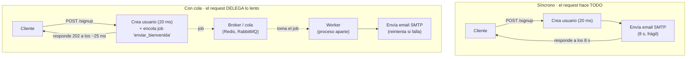
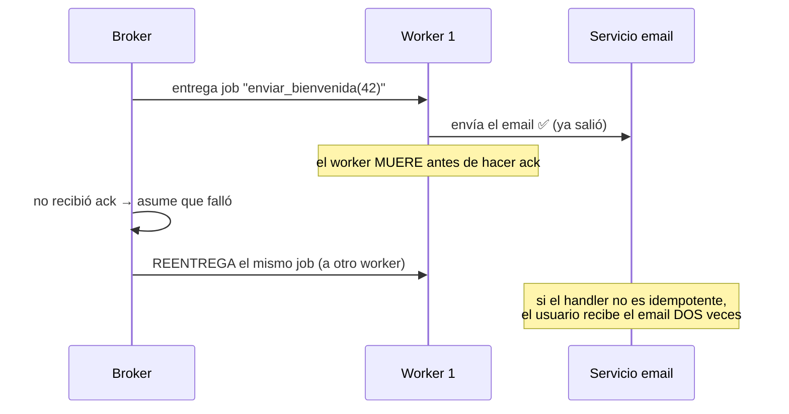
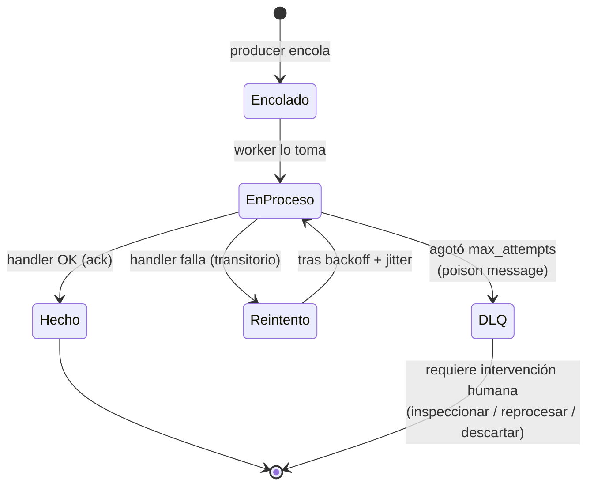

import Reto from "@components/Reto.astro";
import Solucion from "@components/Solucion.astro";
import Quiz from "@components/Quiz.astro";
import CheckDominio from "@components/CheckDominio.astro";
import Nivel from "@components/Nivel.astro";

<Nivel nivel="profundización" />

:::note[Esta lección es opcional — profundización, no ruta crítica]
El **troncal** de la Fase 3 es FastAPI sirviendo requests HTTP (lo viste en [`3.8` Backend con FastAPI](/fase-3-backend/3-8-backend-fastapi/)), y el **capstone se puede terminar sin una cola**. Las colas viven aquí por una razón concreta: en cuanto tu API tenga que hacer algo **lento** (enviar un email, procesar un archivo grande, llamar a un tercero que tarda) dentro de un request, vas a chocar con un muro de latencia y timeouts. La cola es la respuesta estándar de la industria, y —esto es lo importante para ti— es **el mismo patrón** (producer/worker, reintentos, DLQ) que vas a necesitar en la Fase 7 para automatización agéntica confiable. Esta lección te da el **modelo mental y el criterio** para decidir cuándo una cola vale la pena, sin pretender que salgas operando un cluster de Celery en producción. Saltarla no te deja huecos en el camino crítico; hacerla te da el vocabulario que diferencia "mi endpoint a veces se cuelga" de "desacoplé el trabajo lento y lo hice resiliente".
:::

## 1. Qué vas a saber hacer

Al terminar, sin IA y sin notas, podrás:

- **O1 — Explicar por qué** mover trabajo lento fuera del request HTTP (a una cola) mejora latencia y resiliencia, **identificar** qué tareas son candidatas y **decidir** cuándo una cola es over-engineering, nombrando el costo que agregas (un broker, complejidad operacional, consistencia eventual).
- **O2 — Describir el patrón producer / broker / worker** y el ciclo de vida de un job (encolado → tomado → ack/retry → DLQ), explicando qué significa entrega **at-least-once** y por qué **obliga** a que los handlers sean idempotentes.
- **O3 — Diseñar una política de reintentos con backoff + jitter y una dead-letter queue (DLQ)** para un trabajo que puede fallar, distinguiendo un fallo **transitorio** (reintentar) de un **poison message** (mandar a la DLQ y alertar), a nivel de criterio en Celery (Python) y BullMQ (Node).

## 2. Por qué importa

> 💰 **Por qué importa:** "el backend es donde vive la lógica de las apps que quieres construir", y en cuanto esa lógica toca el mundo real (correo, pagos, archivos, modelos de IA que tardan segundos) el request síncrono deja de alcanzar. **Toda** app seria termina con una cola detrás: envío de notificaciones, generación de reportes, ingestión de datos, llamadas a LLMs por lote. Saber explicar en una entrevista *por qué* un `POST /upload` no debería procesar 50.000 filas dentro del request —y dibujar el flujo producer/worker con reintentos y DLQ— es lo que separa al que "hace endpoints" del que "diseña sistemas que no se caen". Y hay un retorno doble: el patrón de cola con reintentos + DLQ + idempotencia que aprendes aquí es **exactamente** el backbone de la automatización confiable de la Fase 7. No estás aprendiendo una herramienta; estás aprendiendo la forma de un problema que vas a ver una y otra vez.

## 3. Lo que ya traes (actívalo)

Esta lección se apoya en cosas que ya viste. Recupéralas antes de seguir:

- De [`3.8` FastAPI](/fase-3-backend/3-8-backend-fastapi/): un endpoint maneja un request y **devuelve una respuesta**. Mientras procesa, ese trabajador del servidor está ocupado y no atiende a nadie más. Aquí veremos qué pasa cuando el trabajo tarda demasiado.
- De [`3.7` Diseño de APIs REST](/fase-3-backend/3-7-diseno-apis-rest/): los status codes. En particular **`202 Accepted`** = "recibí tu petición, la voy a procesar, pero todavía no terminé". Es el status de las colas.
- De [`3.14` Idempotencia y resiliencia](/fase-3-backend/3-14-idempotencia-resiliencia/): reintentos con **backoff exponencial + jitter**, timeouts, y la idea de **idempotencia** (ejecutar dos veces = mismo efecto que una). Esta lección es donde esos conceptos se vuelven obligatorios, no opcionales.
- De [`3.15` Redis](/fase-3-backend/3-15-redis-caching/): Redis no es solo un caché; es el **broker** más común para colas (Celery y BullMQ lo usan). Tenerlo claro evita confundir "caché" con "cola".

Antes de seguir, responde de memoria:

<Quiz
  question="Un endpoint POST /signup crea el usuario en la base (rápido, ~20 ms) y luego envía un email de bienvenida llamando a un servicio SMTP externo que hoy está lento y tarda 8 segundos. El usuario espera con la rueda girando los 8 segundos. ¿Cuál es el problema de fondo, además de la mala experiencia?"
  options={[
    "Ninguno: 8 segundos es aceptable para un signup",
    "El worker del servidor que atiende ese request queda OCUPADO los 8 segundos sin poder atender a nadie más; bajo carga, unos pocos signups lentos agotan los workers y TODA la API se vuelve lenta o devuelve timeouts, aunque el envío de email no tenga nada que ver con crear el usuario",
    "El único problema es que el email podría no llegar; la latencia no importa en el backend",
  ]}
  answer={1}
  explanation="El acoplamiento es el veneno: amarraste el éxito (y la latencia) del request a un trabajo lento y FRÁGIL que no necesita estar ahí. El usuario ya quedó creado a los 20 ms; el email puede salir 200 ms o 30 s después sin que nadie note. Mientras tanto, cada request lento secuestra un worker del pool. La cola corta justo ese acoplamiento: el request encola el email y responde de inmediato; un proceso aparte (el worker) se encarga del envío, reintenta si SMTP está caído, y no toca para nada al pool que atiende usuarios."
/>

## 4. La cola en voz alta (worked example)

Voy a razonar **paso a paso**, tomando el caso del quiz —un signup que manda un email— y desacoplándolo con una cola. Primero el contraste, luego el vocabulario, después el código (Celery y BullMQ a nivel de criterio), y al final el ciclo de vida de un job con reintentos y DLQ.

### 4.1 El contraste, dibujado



La idea central en una frase: **el request hace solo lo rápido e imprescindible, encola lo lento, y responde de inmediato; un proceso separado (el worker) hace el trabajo lento por su cuenta.** El cliente no espera; el pool de workers HTTP no se bloquea; y si el envío falla, se reintenta sin afectar al usuario.

### 4.2 El vocabulario (cuatro palabras que tienes que poder definir)

- **Producer (productor):** quien **encola** el trabajo. Aquí es tu endpoint de FastAPI: crea el usuario y deja un *job* en la cola.
- **Job / task / message:** la unidad de trabajo encolada. Es **datos**, no código: típicamente `{"tipo": "enviar_bienvenida", "user_id": 42}`. El worker sabe qué función ejecutar según el tipo.
- **Broker / cola:** el intermediario que **guarda** los jobs hasta que un worker los tome. Suele ser **Redis** o RabbitMQ. Es lo que hace que el job **sobreviva** aunque el worker esté caído o reiniciando: el job espera en el broker.
- **Consumer / worker:** un **proceso aparte** (otra terminal, otro contenedor, otra máquina) que saca jobs del broker y los ejecuta. Puedes correr **N workers** en paralelo para procesar más rápido — y escalarlos sin tocar la API.

:::caution[El "async" de una cola NO es el async/await de Python]
Cuidado con la palabra. El `async/await` de Python (el que usa FastAPI en [`3.8`](/fase-3-backend/3-8-backend-fastapi/)) es concurrencia **dentro del mismo proceso**: si ese proceso muere, todo muere. El "async" de una cola es **fuera de proceso**: el trabajo vive en otro proceso, sobrevive reinicios del servidor web, y escala por separado. Son dos cosas distintas con el mismo nombre. Cuando un entrevistador pregunta "¿cómo procesarías esto de forma asíncrona?", quiere saber cuál de las dos, y por qué.
:::

### 4.3 El código en Python: Celery (a nivel de criterio)

**Celery** es la librería estándar de colas en Python. Se enchufa a tu FastAPI del troncal. No memorices la API; fíjate en **la forma**: defines una *task*, el endpoint la encola con `.delay(...)`, y un worker la ejecuta en otro proceso.

```python
# tasks.py — definición de la task (la corre el WORKER)
from celery import Celery

# El broker es Redis: ahí viven los jobs hasta que un worker los toma.
app = Celery("postal", broker="redis://localhost:6379/0")


@app.task(
    bind=True,                  # da acceso a `self` (para reintentar)
    max_retries=5,
    acks_late=True,             # confirma el job DESPUÉS de procesarlo, no antes
)
def enviar_bienvenida(self, user_id: int) -> None:
    try:
        usuario = cargar_usuario(user_id)
        smtp_enviar(usuario.email, plantilla="bienvenida")
    except SMTPTemporalError as exc:
        # Fallo TRANSITORIO (SMTP caído un rato): reintenta con backoff.
        # countdown crece: 2 s, 4 s, 8 s, ... (backoff exponencial)
        raise self.retry(exc=exc, countdown=2 ** self.request.retries)
```

```python
# main.py — el endpoint solo ENCOLA y responde 202 (el productor)
from fastapi import FastAPI
from tasks import enviar_bienvenida

api = FastAPI()


@api.post("/signup", status_code=202)
def signup(datos: SignupIn):
    usuario = crear_usuario(datos)          # rápido: ~20 ms
    enviar_bienvenida.delay(usuario.id)     # NO ejecuta: encola y vuelve al instante
    return {"id": usuario.id, "estado": "procesando"}
```

Y el worker se levanta como **proceso aparte**, en otra terminal o contenedor:

```bash
celery -A tasks worker --loglevel=info
```

Léelo en voz alta conmigo, porque cada pieza importa:

- `enviar_bienvenida.delay(usuario.id)` **no envía el email**. Pone un mensaje en Redis y devuelve el control en microsegundos. El endpoint responde `202 Accepted`: "te creé, el email está en camino".
- El worker (`celery ... worker`) es **otro proceso**. Puedes apagar la API y el worker sigue vaciando la cola; puedes apagar el worker y los jobs **esperan** en Redis hasta que vuelva. Ese desacople es todo el punto.
- `self.retry(countdown=2 ** self.request.retries)` implementa el **backoff exponencial** de [`3.14`](/fase-3-backend/3-14-idempotencia-resiliencia/): primer reintento a los ~1 s, luego ~2 s, ~4 s... para no martillar un SMTP que ya está sufriendo.
- `acks_late=True` dice: "no des el job por entregado hasta que **termine** de procesarse". Si el worker se cae a mitad, el job vuelve a la cola y otro worker lo retoma. Esto te da **at-least-once** (lo vemos en 4.5) — la garantía más común y la razón por la que la idempotencia deja de ser opcional.

### 4.4 El mismo patrón en Node: BullMQ (a nivel de criterio)

En el mundo Node, el equivalente es **BullMQ** (también sobre Redis). La forma es idéntica: un `Queue` (el productor encola) y un `Worker` (el consumidor procesa). Cambia la sintaxis, no las ideas.

```typescript
// queue.ts — el productor: encola y responde
import { Queue } from "bullmq";

const conexion = { host: "localhost", port: 6379 };
export const colaEmails = new Queue("emails", { connection: conexion });

// En tu handler de signup (Express/NestJS): encola y responde 202.
await colaEmails.add(
  "enviar-bienvenida",
  { userId: usuario.id },
  {
    attempts: 5,                                  // hasta 5 intentos
    backoff: { type: "exponential", delay: 1000 }, // 1 s, 2 s, 4 s, 8 s...
  },
);
```

```typescript
// worker.ts — proceso APARTE: procesa los jobs
import { Worker } from "bullmq";

const worker = new Worker(
  "emails",
  async (job) => {
    const usuario = await cargarUsuario(job.data.userId);
    await smtpEnviar(usuario.email, "bienvenida"); // si lanza, BullMQ reintenta
  },
  { connection: { host: "localhost", port: 6379 } },
);

// Observabilidad: cuando un job AGOTA sus intentos, queda en el set "failed"
// (la DLQ de facto de BullMQ). Lo escuchas para alertar.
worker.on("failed", (job, err) => {
  if (job && job.attemptsMade >= (job.opts.attempts ?? 1)) {
    alertar(`Job ${job.id} agotó reintentos y quedó en failed: ${err.message}`);
  }
});
```

Mismas cuatro palabras: `Queue` es el broker/productor, `add(...)` encola el job, `new Worker(...)` es el consumidor en otro proceso, `attempts` + `backoff` son la política de reintentos. En BullMQ, cuando un job agota `attempts`, **no desaparece**: queda en el conjunto `failed`, que actúa como **dead-letter queue** — un lugar donde inspeccionar y, si quieres, reprocesar a mano.

### 4.5 At-least-once: por qué los reintentos exigen idempotencia

Aquí está la trampa que separa a juniors de semi-seniors. Cuando configuras reintentos y `acks_late`, eliges (casi siempre) una garantía de entrega llamada **at-least-once**: *cada job se procesa **una o más** veces, nunca cero*. ¿Por qué "o más"? Porque un worker puede **terminar el trabajo y morir justo antes de confirmar (ack)**. El broker, que no recibió la confirmación, asume que falló y **reentrega** el job a otro worker.



La consecuencia es dura y debes poder enunciarla: **con at-least-once, tu handler se puede ejecutar dos veces para el mismo job.** Si el efecto no es idempotente —cobrar una tarjeta, enviar un email, crear un registro— acabas de duplicar el efecto. La cura es la misma de [`3.14`](/fase-3-backend/3-14-idempotencia-resiliencia/): el handler usa una **idempotency key** (p. ej. el `job_id` o un `(user_id, tipo)`) y, antes de hacer el efecto, verifica si ya lo hizo. "Reintentar" y "ser idempotente" son dos caras de la misma moneda: no puedes tener lo uno sin lo otro sin meterte en problemas.

### 4.6 El ciclo de vida de un job (encolado → done o DLQ)

Juntemos todo en una máquina de estados. Esto es lo que tienes que poder dibujar de memoria:



Dos finales posibles:

- **Hecho:** el handler terminó bien, el worker confirma (ack) y el job se borra de la cola.
- **DLQ (dead-letter queue):** el job falló **tantas veces** que agotó `max_attempts`. En vez de reintentar para siempre (lo que tumbaría el worker con un job venenoso), se mueve a una cola aparte —la DLQ— para inspección humana. Un job así se llama **poison message**: algo está mal con el job mismo (datos corruptos, un bug, un email inválido), no con un fallo pasajero del servicio.

La distinción **transitorio vs poison** es la decisión de diseño central de toda cola: un fallo transitorio (SMTP caído 30 s) **merece** reintento; un poison message (el `user_id` no existe) **no** —reintentarlo 5 veces solo desperdicia recursos antes de mandarlo igual a la DLQ—.

## 5. Lo que podrías creer y está mal

:::caution[Misconception 1: "una cola siempre es mejor; mete todo a la cola"]
Falso, y es un error caro. Una cola **agrega** un broker que mantener (Redis/RabbitMQ corriendo, monitoreado, respaldado), procesos worker que desplegar y escalar, y **consistencia eventual** (el trabajo ya no ocurre "ahora", ocurre "pronto"). Para un cálculo de 5 ms, una cola es over-engineering puro: pagas toda esa complejidad para ahorrar nada. La regla: **encola solo lo que es lento, frágil (puede fallar y querer reintentar) o que no necesita estar listo antes de responderle al usuario.** Lo rápido y crítico para la respuesta se queda síncrono.
:::

:::caution[Misconception 2: "FastAPI BackgroundTasks ya es una cola"]
No. `BackgroundTasks` de FastAPI corre el trabajo **en el mismo proceso** después de responder. Si ese proceso se reinicia (deploy, crash, OOM), el trabajo **se pierde sin rastro**: no hay reintentos, no hay DLQ, no hay persistencia, no escala a otra máquina. Sirve para fuego-y-olvido trivial y tolerante a pérdida (un log, una métrica). Para algo que **no puede perderse** (un email de confirmación de pago) necesitas una cola real con un broker que persista el job. Confundir las dos es un error clásico de entrevista.
:::

:::caution[Misconception 3: "los reintentos son gratis / siempre ayudan"]
Dos trampas. Primera: con entrega **at-least-once**, reintentar un handler **no idempotente** duplica el efecto (doble cobro, doble email) — verlo en 4.5. Segunda: reintentar un **poison message** (datos corruptos, un bug) nunca va a funcionar; solo gastas CPU y atrasas la cola antes de mandarlo igual a la DLQ. Reintentar tiene sentido **solo** para fallos transitorios y **solo** con handlers idempotentes y un tope de intentos. Reintentar a ciegas, sin tope, es cómo un solo job venenoso tumba a todos tus workers.
:::

:::caution[Misconception 4: "la DLQ es donde van los errores y ya"]
La DLQ **no es un basurero**; es una **superficie de operación**. Un job en la DLQ es un trabajo que el sistema no pudo completar: un email que no salió, un pago que no se registró. Si nadie la mira, es un agujero negro silencioso donde el trabajo importante muere sin que te enteres. Una DLQ de producción **necesita** alertas (avisar cuando llega algo), un humano que la revise, y un camino para **reprocesar** (arreglar el dato y reencolar) o descartar conscientemente. "Tengo DLQ" sin observabilidad encima es peor que no tenerla, porque te da una falsa sensación de seguridad.
:::

## 6. Práctica con andamiaje (hazla antes de los retos)

Tres pasos que se desvanecen. Hazlos **a mano, sin ejecutar y sin IA** (predice primero); calibran tu modelo mental de reintentos, at-least-once y DLQ.

### 6.1 PREDICT — ¿cuántas veces corre el handler?

Un job se encola con `max_attempts = 3` y backoff. El servicio externo que llama el handler está caído los primeros 5 minutos y luego se recupera. El job se procesa **mientras** el servicio sigue caído. Predice: **¿cuántas veces se ejecuta el handler y dónde termina el job** (Hecho o DLQ)?

<Solucion title="Ver la respuesta (solo después de predecir)">
El handler se ejecuta **3 veces** (el intento original + 2 reintentos, hasta agotar `max_attempts = 3`), todas fallan porque el servicio sigue caído, y el job termina en la **DLQ** como poison message *para este sistema en este momento*. Punto clave: los `max_attempts` **no esperan** a que el servicio se recupere; se agotan según el backoff (p. ej. en pocos segundos). Si el servicio tarda 5 minutos en volver, ningún reintento corto lo va a alcanzar. Lección de diseño: el backoff y el `max_attempts` deben dimensionarse según **cuánto suele durar** una caída transitoria de ese servicio; si las caídas duran minutos, necesitas más intentos espaciados, o reprocesar la DLQ más tarde.
</Solucion>

### 6.2 SPOT THE BUG — el worker que cobra dos veces

Un worker procesa jobs `cobrar(pedido_id, monto)` con reintentos y `acks_late`. El handler hace: `stripe.charge(monto)` y luego `marcar_pedido_pagado(pedido_id)`. En producción, algunos clientes aparecen **cobrados dos veces**. Di **qué falló** y cómo lo arreglarías en una frase.

<Solucion title="Ver la respuesta (solo después de pensarla)">
Falló la **idempotencia bajo at-least-once**. Escenario: el worker llama a `stripe.charge` (el cobro **sí** sale), pero muere antes de `marcar_pedido_pagado` y antes del ack. El broker reentrega el job; el nuevo worker vuelve a llamar `stripe.charge` → **doble cobro**. El arreglo: hacer el efecto idempotente. Lo correcto aquí es pasarle a Stripe una **idempotency key** (p. ej. el `pedido_id` o el `job_id`): Stripe deduplica y el segundo `charge` con la misma key no cobra de nuevo. Alternativa/refuerzo: antes de cobrar, verificar en tu base si el pedido ya está pagado. Regla que te debe sonar de [`3.14`](/fase-3-backend/3-14-idempotencia-resiliencia/): si un efecto se puede ejecutar dos veces (y con colas, **siempre** se puede), tiene que ser idempotente.
</Solucion>

### 6.3 MODIFY — del endpoint síncrono al flujo con cola

Tienes este endpoint que procesa un archivo CSV grande **dentro** del request:

```python
@api.post("/importar")
def importar(archivo: UploadFile):
    filas = parsear_csv(archivo)         # rápido
    for fila in filas:                    # 50.000 filas, ~3 minutos
        validar_y_guardar(fila)
    return {"importadas": len(filas)}
```

**Describe** (en palabras, sin escribir todo el código) cómo lo partirías con una cola: ¿qué se queda en el request y qué se va al worker? ¿Qué status devuelve el endpoint? ¿Cómo sabría el cliente que ya terminó? ¿Dónde aparece la idempotencia? Piensa antes de releer 4.3.

## 7. Ejercicios Primero-Sin-IA

Ahora sin red. Como las colas son nuevas para ti, primero releíste el worked example (sección 4); ahora aplica el criterio y la mecánica. El primero es de **diseño** (a mano), el segundo de **código** (Python puro, sin broker ni infra).

<Reto title="Diseña el pipeline: qué encolar, cómo reintentar, qué va a la DLQ" timebox="35–45 min">

Te damos, en el README del ejercicio, una app SaaS ("Postal") con cinco operaciones (crear cuenta + email, subir un CSV y enviar campaña a 50.000 contactos, consultar estado, recibir un webhook de pagos, recálculo nocturno de analítica). Debes, **a mano y sin ejecutar**, entregar un `DISENO.md` que para **cada** operación decida **síncrono vs cola** con criterio, y para las que vayan a la cola defina la política de reintentos (backoff + jitter + tope), la **idempotency key**, qué se considera poison message (va a la DLQ) y cómo la monitorearías. Cierras con un diagrama Mermaid del flujo de la campaña y nombrando **un** costo de haber metido una cola.

**Hecho significa:**
- [ ] Cada una de las cinco operaciones tiene una decisión **síncrono vs cola justificada con criterio** (lento / frágil / no-crítico-para-la-respuesta), no por moda.
- [ ] Para las operaciones encoladas defines: `max_attempts` + backoff con **jitter**, la **idempotency key** concreta, y qué dato/fallo cuenta como **poison message** (a la DLQ).
- [ ] Distingues al menos un fallo **transitorio** (reintentar) de un **poison message** (DLQ directo) con un ejemplo del dominio.
- [ ] Reconoces al menos una operación que **NO** debería ir a una cola (over-engineering) y explicas por qué.
- [ ] El diagrama de la campaña muestra producer → broker → worker(s) → (Hecho | DLQ) y nombras un costo real de la cola.
- [ ] Puedes explicar, sin notas, por qué at-least-once obliga a idempotencia en el envío de los 50.000 emails.

Enunciado completo y starter: `ejercicios/fase-3/disenar-cola-pipeline/` (carpeta del repo).

<Solucion title="Pista (ábrela solo si superaste el timebox)">
Heurística para sync vs cola: ¿es lento (más de ~100–200 ms)? ¿es frágil (llama a un tercero que puede fallar)? ¿el usuario necesita el resultado **antes** de que le respondas? Si lento+frágil y NO se necesita en la respuesta → cola. El webhook de pagos es el caso fino: validas la firma y respondes 200 **rápido** (el proveedor reintenta si tardas), pero el trabajo pesado que dispara (marcar pagado, notificar) va a la cola. La campaña de 50.000 emails es el caso obvio de cola, y su idempotency key natural es `(campaign_id, contacto_id)` para no mandarle dos veces a la misma persona si un worker muere a mitad. El recálculo nocturno es batch programado, no encolado por request. La operación que NO necesita cola: consultar estado (`GET`) es una lectura rápida. Pista, no solución.
</Solucion>

</Reto>

<Reto title="Implementa un worker con reintentos y DLQ (Python puro)" timebox="40–45 min">

Sin broker, sin Redis, sin Celery: implementas en **Python puro** un mini-dispatcher que captura la **semántica** de una cola. Una función `procesar_cola(jobs, handler)` que: ejecuta cada job con el `handler`, **reintenta** ante excepción hasta `max_attempts`, manda a la **DLQ** los que agotan intentos, y —porque la entrada simula entrega **at-least-once**— **deduplica** por `job.id` para no procesar dos veces el mismo job ya completado. Tu solución corre con `pytest`.

**Hecho significa:**
- [ ] `pytest` en **verde**: un job que falla 2 veces y luego funciona (`max_attempts=3`) termina en `done` con el handler llamado exactamente 3 veces.
- [ ] Un job que siempre falla termina en `dlq` tras exactamente `max_attempts` llamadas (sin loop infinito).
- [ ] Idempotencia: si la cola trae el **mismo `job.id` dos veces** (at-least-once), el handler corre **una sola vez** y el id aparece una sola vez en `done`.
- [ ] Agregaste al menos **un test tuyo** (p. ej. una mezcla de jobs que terminan unos en `done` y otros en `dlq`).
- [ ] Puedes explicar, **sin notas**, por qué la deduplicación por `job.id` es el equivalente de la idempotencia bajo at-least-once.

Enunciado, starter y tests: `ejercicios/fase-3/worker-reintentos-dlq/` (carpeta del repo).

<Solucion title="Pista (ábrela solo si superaste el timebox)">
Usa una `collections.deque` como cola FIFO: sacas de la izquierda (`popleft`), y al fallar **reencolas a la derecha** (`append`) después de incrementar `job.attempts`. La condición de DLQ es `job.attempts >= job.max_attempts` tras un fallo. Para la idempotencia, mantén un `set` de ids ya completados (`ya_hechos`): antes de llamar al handler, si `job.id in ya_hechos`, **salta** el job (no lo ejecutes, no lo dupliques en `done`); al completar con éxito, agrega el id al set. Cuidado con el orden: incrementa `attempts` **antes** de comparar con `max_attempts`, y no olvides que el primer intento también cuenta. Revisa la sección 4.6 (ciclo de vida) antes de mirar la referencia. Pista, no solución.
</Solucion>

</Reto>

## 8. Check de dominio

Sin mirar la lección, en voz alta o por escrito:

<CheckDominio
  items={[
    "Explicar con un ejemplo por qué meter trabajo lento en el request HTTP degrada toda la API bajo carga (agotamiento del pool de workers).",
    "Definir producer, broker, job y worker, y decir qué pieza hace que un job SOBREVIVA a un reinicio del worker.",
    "Distinguir el async/await de Python (en-proceso) del async de una cola (fuera-de-proceso) en una frase.",
    "Explicar qué es entrega at-least-once y POR QUÉ obliga a que el handler sea idempotente.",
    "Dibujar el ciclo de vida de un job (encolado → en proceso → hecho | reintento → DLQ).",
    "Distinguir un fallo transitorio (reintentar con backoff) de un poison message (a la DLQ) con un ejemplo de cada uno.",
    "Dar dos criterios para decidir si una tarea va a una cola o se queda síncrona, y nombrar un caso de over-engineering.",
    "Explicar por qué FastAPI BackgroundTasks NO sustituye a una cola real para trabajo que no puede perderse.",
  ]}
/>

Si fallaste tres o más, vuelve a la sección correspondiente **antes** de avanzar.

<Quiz
  question="Diseñas el envío de una campaña de 50.000 emails con una cola (un job por email), reintentos at-least-once y una DLQ. ¿Qué decisión es IMPRESCINDIBLE para que un worker que muere a mitad no le mande el email dos veces a la misma persona?"
  options={[
    "Subir max_attempts a 50 para que nunca llegue a la DLQ",
    "Hacer el envío idempotente con una idempotency key por destinatario (p. ej. (campaign_id, contacto_id)): antes de enviar, verificar/registrar que a ese contacto ya se le envió, de modo que un reintento no duplique",
    "Usar BackgroundTasks de FastAPI en vez de una cola, porque así no hay reintentos",
  ]}
  answer={1}
  explanation="At-least-once garantiza que cada job corre una o más veces; subir max_attempts solo EMPEORA el problema de duplicados. La única defensa contra el doble envío es la idempotencia: una key por destinatario que permita detectar 'a este ya le envié' y saltar el efecto en el reintento. Cambiar a BackgroundTasks no resuelve nada y además pierde los jobs si el proceso se reinicia (no persiste). Reintentar e idempotencia son inseparables: lo viste en 3.14 y aquí se vuelve obligatorio."
/>

## 9. Recursos (documentación oficial primero)

- **Celery — User Guide / Tasks (oficial):** [docs.celeryq.dev/en/stable/userguide/tasks.html](https://docs.celeryq.dev/en/stable/userguide/tasks.html) — definir tasks, `retry`, `max_retries`, `acks_late` y `Reject` hacia un dead-letter exchange.
- **Celery — Calling Tasks / retry_policy:** [docs.celeryq.dev/en/stable/userguide/calling.html](https://docs.celeryq.dev/en/stable/userguide/calling.html) — `.delay()`/`.apply_async()`, backoff y políticas de reintento.
- **BullMQ — Guide (oficial):** [docs.bullmq.io/guide/workers](https://docs.bullmq.io/guide/workers) — `Queue`, `Worker`, eventos `failed`/`completed`.
- **BullMQ — Retrying failing jobs:** [docs.bullmq.io/guide/retrying-failing-jobs](https://docs.bullmq.io/guide/retrying-failing-jobs) — `attempts`, `backoff` exponencial y el set `failed` como DLQ de facto.
- **FastAPI — Background Tasks:** [fastapi.tiangolo.com/tutorial/background-tasks](https://fastapi.tiangolo.com/tutorial/background-tasks/) — qué SÍ y qué NO resuelve (y cuándo necesitas una cola de verdad).
- **AWS — Amazon SQS dead-letter queues:** [docs.aws.amazon.com/AWSSimpleQueueService/latest/SQSDeveloperGuide/sqs-dead-letter-queues.html](https://docs.aws.amazon.com/AWSSimpleQueueService/latest/SQSDeveloperGuide/sqs-dead-letter-queues.html) — el concepto de DLQ y poison message explicado por un proveedor de colas gestionadas.

## 10. Conexión con el capstone de la fase

El **[Capstone F3 — API de producción](/fase-3-backend/proyecto/)** se puede terminar con FastAPI síncrono, así que una cola **no es obligatoria**. Lo que esta lección le aporta es **criterio y un ADR**:

- Si tu capstone tiene **alguna** operación lenta y frágil (un email de confirmación, una llamada a un tercero, generar un archivo), poder escribir en un ADR "moví el envío de email a una cola con reintentos backoff+jitter, idempotency key por destinatario y DLQ con alerta, porque amarrar el SMTP al request degrada la API bajo carga; acepto el costo de operar un broker Redis" es **exactamente** el trade-off defendible que pide el Definition of Done. No se elige bien lo que no se conoce.
- La tríada **reintentos + idempotencia + DLQ** que aquí aplicaste es la misma columna de la confiabilidad de integración de la **Fase 7** (automatización y data engineering): los `idempotency keys`, las DLQ / poison messages y el replay que verás allá **son este patrón**, llevado a agentes que ejecutan acciones en sistemas externos. Llevarte el instinto —"si reintento, tiene que ser idempotente; si falla siempre, va a la DLQ y alerto"— es lo que de verdad importa para el capstone estrella del portafolio.

## 11. Reflexión y repaso espaciado

Cierra escribiendo dos o tres frases: **¿qué tarea de tu capstone (o de HomeHub, o de cualquier app que hayas tocado) está hoy metida dentro de un request HTTP y debería estar en una cola? ¿Qué ganarías y qué costo aceptarías?** Identificar el acoplamiento lento-dentro-del-request en tu propio código es lo que convierte esta lección en un instinto.

Gancho de **spaced repetition**:

- **Mañana:** sin mirar, dibuja de memoria el ciclo de vida de un job (encolado → en proceso → hecho | reintento → DLQ) y escribe en una frase por qué at-least-once obliga a idempotencia. Verifica contra las secciones 4.5–4.6. Si no puedes explicar la reentrega tras un worker que muere antes del ack, no caló todavía.
- **En 3 días:** toma una operación lenta de tu capstone y escribe la **política completa** que le pondrías: `max_attempts`, fórmula de backoff+jitter, idempotency key concreta, y qué fallo consideras poison message (va a la DLQ). Diseñar la política sin la lección delante es lo que fija el patrón por encima de la herramienta (Celery o BullMQ son detalles; el patrón es lo que se queda).
