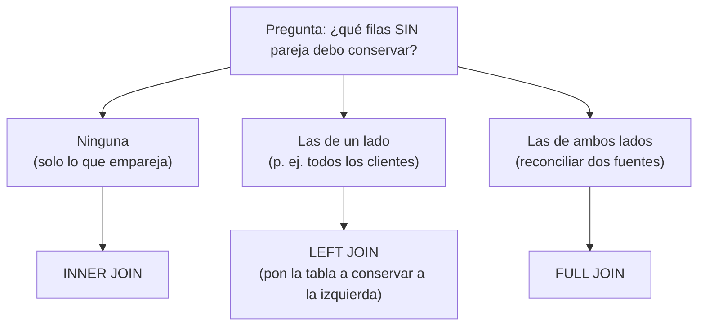
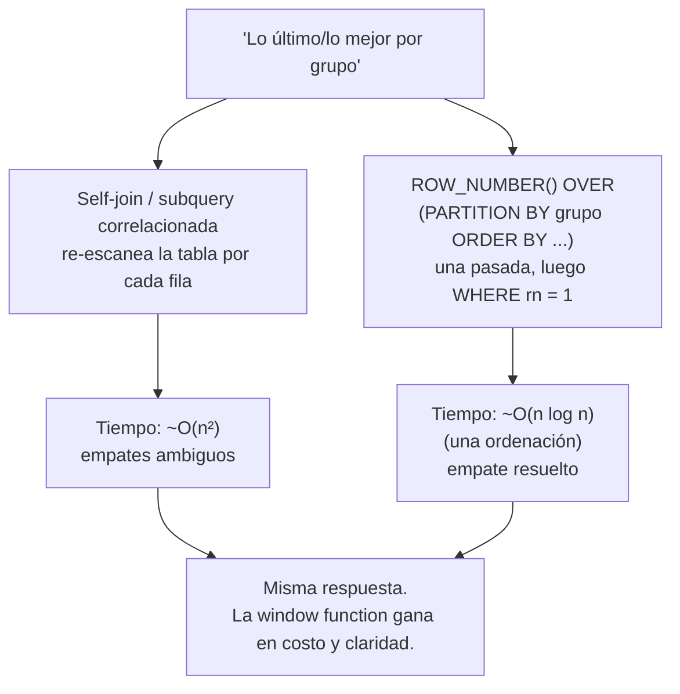

import Reto from "@components/Reto.astro";
import Solucion from "@components/Solucion.astro";
import Quiz from "@components/Quiz.astro";
import CheckDominio from "@components/CheckDominio.astro";
import Nivel from "@components/Nivel.astro";

<Nivel nivel="intermedio" />

En la lección anterior modelaste los datos: tablas, claves, índices, una fila por hecho. Pero los datos repartidos en varias tablas no responden preguntas por sí solos. La pregunta real del trabajo nunca es "muéstrame la tabla `pedidos`"; es *"¿cuáles clientes no compraron nunca?"*, *"¿cuál fue el último pedido de cada cliente?"*, *"¿quién gana más que el promedio de su departamento?"*, *"dame el saldo acumulado mes a mes"*. Esas preguntas se contestan combinando tablas y calculando **a través** de las filas. Esta lección te enseña las cuatro herramientas con las que un backend traduce una pregunta de negocio en una query que la base de datos resuelve en una sola pasada —en vez de traerte todo a la aplicación y resolverlo a mano con bucles (que es exactamente el error que paga tu latencia).

:::tip[Si ya escribiste JOINs antes]
¿Ya usas `INNER JOIN` y `GROUP BY` sin pensar? No te saltes la lección: úsala como **diagnóstico de tus puntos ciegos**, que casi siempre son tres. Salta a los **ejercicios Primero-Sin-IA** (sección 7): el primero mide si ves por qué un `WHERE` sobre la tabla derecha convierte tu `LEFT JOIN` en `INNER` sin avisar, y si predices la salida de una window function sin ejecutarla; el segundo, si sabes reescribir un self-join como `ROW_NUMBER()` y *defender por qué* es más barato. Si los cierras limpio en el timebox, valida con el check de dominio (sección 8) y avanza. Si te trabas en explicar *por qué*, vuelve a la sección 4.
:::

## 1. Qué vas a saber hacer

Al terminar, sin IA y sin notas, podrás:

- **O1 — Escribir e interpretar** los JOINs (`INNER`, `LEFT`, `RIGHT`, `FULL` y el **self-join**), eligiendo el tipo correcto según **qué filas deben sobrevivir cuando no hay coincidencia**, y diagnosticando por qué un `WHERE` mal puesto degrada un outer join a inner.
- **O2 — Descomponer** una pregunta compleja con **subqueries** (incluidas las **correlacionadas**) y **CTEs** (`WITH`, incluida la **recursiva**), explicando el trade-off entre legibilidad y una sola query plana.
- **O3 — Usar window functions** (`ROW_NUMBER`/`RANK`/`LAG`/`LEAD` y agregaciones con `OVER`) para calcular **por grupo sin colapsar las filas**, y **reconocer cuándo una window function reemplaza a un self-join** O(n²).

## 2. Por qué importa (el dinero está aquí)

> 💰 **Por qué importa:** SQL es el skill que **no caduca**. Frameworks van y vienen; la pregunta "¿cómo saco *este* dato de *estas* tablas?" lleva 40 años contestándose igual y seguirá. El backend (skill #1 del mercado, ~70% de las ofertas) vive de traducir preguntas de negocio a queries. Y hay un escalón concreto que separa al junior del semi-senior: el junior trae tres tablas a Python y las cruza con bucles `for`; el semi-senior escribe **un** `JOIN` con una window function y deja que el motor —que para eso está optimizado— lo resuelva en una pasada. Ese escalón es, literalmente, la diferencia entre un endpoint que responde en 40 ms y uno que responde en 8 segundos.

Tres razones por las que esto te paga más allá de la entrevista:

1. **Es costo y latencia medibles.** Resolver "el último pedido de cada cliente" con un self-join correlacionado re-escanea la tabla una vez por fila: el mismo bucle anidado O(n²) que viste en [DSA](/fase-2-ingenieria/2-1-dsa-nivel-trabajo/), ahora en la base de datos. Una window function lo hace en una pasada ordenada. Saber cambiar lo uno por lo otro es optimización pura, y la sabrás defender.
2. **Es la antesala del problema N+1.** El antipatrón #1 de los ORMs (que verás en [`3.5`](/fase-3-backend/3-5-orms-problema-n1/)) es no saber que un `JOIN` existe: el ORM dispara una query por cada fila relacionada. Si dominas los JOINs a mano, reconoces el N+1 al instante y sabes cómo matarlo.
3. **Es leer antes que escribir.** Buena parte de tu trabajo será *entender* queries que escribió otra persona (o un ORM, o una IA) y decidir si están bien. Leer una query de 40 líneas con tres CTEs y razonar qué devuelve es una habilidad examinable —y es la que esta lección entrena con los ejercicios "predice la salida".

Honestidad: no memorizarás sintaxis exótica. Memorizarás **cuatro patrones** (combinar tablas, anidar preguntas, nombrar pasos intermedios, calcular a través de filas) y aprenderás a *reconocer* cuál pide cada problema. Eso es lo permanente.

## 3. Lo que ya traes (actívalo)

Esta sub-unidad construye directo sobre lo anterior. Reúsalo:

- De [`3.1` SQL y modelado relacional](/fase-3-backend/3-1-sql-modelado-relacional/): `SELECT`/`FROM`/`WHERE`, `GROUP BY` con agregados (`COUNT`, `SUM`, `AVG`), claves foráneas. Los JOINs **siguen** las claves foráneas que modelaste; las window functions son primas de `GROUP BY` que **no colapsan** las filas.
- De [`2.1` DSA a nivel de trabajo](/fase-2-ingenieria/2-1-dsa-nivel-trabajo/): la intuición de Big-O. Un self-join es un bucle anidado; reconocer su O(n²) es lo que te empuja hacia la window function.
- De [`0.2` Pensamiento computacional](/fase-0-fundamentos/0-2-pensamiento-computacional/): **descomposición**. Una query compleja no se escribe de un tirón: se descompone en pasos (CTEs), igual que un problema en funciones.

Antes de seguir, responde de memoria:

<Quiz
  question="Tienes `clientes` y `pedidos` (un pedido pertenece a un cliente vía `cliente_id`). Quieres una fila por CADA cliente, incluso los que nunca pidieron nada, con la cuenta de sus pedidos. ¿Qué tipo de JOIN necesitas?"
  options={[
    "INNER JOIN: solo trae filas donde hay coincidencia en ambas tablas",
    "LEFT JOIN desde clientes: conserva todos los clientes, aunque no tengan pedidos",
    "Da igual, cualquier JOIN devuelve lo mismo",
  ]}
  answer={1}
  explanation="Un INNER JOIN descartaría a los clientes sin pedidos (no hay fila que coincidir en `pedidos`). El LEFT JOIN desde `clientes` conserva TODOS los clientes y rellena con NULL los campos de `pedidos` cuando no hay coincidencia. Para contar bien usarás COUNT(p.id) — que ignora los NULL — y no COUNT(*). Esa es la lección de la sección 5."
/>

## 4. Ejemplo resuelto, pensado en voz alta

Voy a resolver preguntas reales sobre una base de datos minúscula, **razonando en voz alta**. No leas esto como resultados: léelo como me oirías pensar. El razonamiento es el producto; el SQL es la prueba.

### 4.0 Las tablas de trabajo

Tres tablas. Una tienda con clientes y pedidos, y una de empleados con su jefe (para los casos jerárquicos):

```sql
-- clientes
id | nombre | ciudad
 1 | Ana    | Santiago
 2 | Bruno  | Valparaíso
 3 | Carla  | Santiago
 4 | Diego  | Concepción   -- ojo: Diego NO tiene pedidos

-- pedidos
 id  | cliente_id | fecha      | monto
 101 |     1      | 2026-01-05 |  50.00
 102 |     1      | 2026-02-10 |  30.00
 103 |     1      | 2026-03-15 |  80.00
 104 |     2      | 2026-01-20 | 100.00
 105 |     3      | 2026-02-01 |  40.00
 106 |     3      | 2026-03-01 |  60.00

-- empleados (jefe_id apunta a otro empleado; Sofía no tiene jefe)
 id | nombre | jefe_id | departamento | salario
  1 | Sofía  |  NULL   | Dirección    |   200
  2 | Marco  |   1     | Ventas       |   120
  3 | Lucía  |   1     | Ingeniería   |   130
  4 | Pedro  |   2     | Ventas       |    90
  5 | Nadia  |   2     | Ventas       |    90
  6 | Tomás  |   3     | Ingeniería   |   110
  7 | Elena  |   3     | Ingeniería   |   140
```

### 4.1 JOINs: combinar filas de dos tablas

Un `JOIN` empareja filas de dos tablas según una condición (casi siempre `clave_foránea = clave_primaria`). La pregunta que decide **el tipo** de JOIN es una sola: *¿qué pasa con las filas que NO encuentran pareja?*

Razono con la pregunta *"dame cada pedido con el nombre de su cliente"*:

```sql
SELECT c.nombre, p.fecha, p.monto
FROM pedidos p
INNER JOIN clientes c ON c.id = p.cliente_id;
```

*"Cada pedido tiene un `cliente_id` que existe en `clientes`, así que todos emparejan. Salen las 6 filas de pedidos. ¿Y Diego? No aparece: Diego no tiene pedidos, y un `INNER JOIN` **descarta** lo que no empareja en ambos lados. Eso es justo lo que quiero aquí —pedidos con su cliente—, no me interesan clientes sin pedidos."*

Ahora la pregunta cambia: *"dame **todos** los clientes y cuántos pedidos hizo cada uno, incluso los que no hicieron ninguno"*. El "incluso los que no" es la señal de un **outer join**:

```sql
SELECT c.nombre, COUNT(p.id) AS num_pedidos
FROM clientes c
LEFT JOIN pedidos p ON p.cliente_id = c.id
GROUP BY c.nombre
ORDER BY c.nombre;
```

*"`LEFT JOIN` significa: conserva **todas** las filas de la tabla izquierda (`clientes`), y donde no haya pedido que emparejar, rellena las columnas de `pedidos` con `NULL`. Diego sobrevive con un pedido fantasma de puros NULL."* La salida:

| nombre | num_pedidos |
|---|---|
| Ana | 3 |
| Bruno | 1 |
| Carla | 2 |
| Diego | 0 |

*"Diego da 0 —no 1— porque usé `COUNT(p.id)`, y `COUNT` de una columna **ignora los NULL**. Si hubiera escrito `COUNT(*)` contaría también la fila fantasma y Diego saldría con 1. Ese detalle es un bug clásico."* (Lo verás de nuevo en la sección 5.)

El patrón hermano: *"¿qué clientes nunca compraron?"* — el **anti-join**, el `LEFT JOIN` + `WHERE ... IS NULL`:

```sql
SELECT c.nombre
FROM clientes c
LEFT JOIN pedidos p ON p.cliente_id = c.id
WHERE p.id IS NULL;   -- solo las filas que NO emparejaron
```

*"De la izquierda salen todos; me quedo solo con aquellos cuya parte derecha quedó en NULL. Resultado: Diego. Es el modo idiomático de preguntar '¿qué hay en A que no esté en B?'."*

Los cuatro tipos, en una frase cada uno:

| Tipo | Qué conserva |
|---|---|
| `INNER JOIN` | Solo filas que emparejan en **ambas** tablas. |
| `LEFT JOIN` | **Todas** las de la izquierda + las que emparejan a la derecha (resto NULL). |
| `RIGHT JOIN` | **Todas** las de la derecha + las que emparejan a la izquierda. (Casi nunca lo necesitas: da vuelta el orden y usa `LEFT`.) |
| `FULL JOIN` | **Todas** de ambos lados; rellena con NULL donde falte pareja. Útil para reconciliar dos fuentes. |



### 4.2 El self-join: una tabla consigo misma

Cuando una fila se relaciona con **otra fila de la misma tabla**, te unes a ti mismo. En `empleados`, `jefe_id` apunta a otro empleado. *"Quiero cada empleado junto al nombre de su jefe."* La misma tabla aparece dos veces, con alias distintos:

```sql
SELECT e.nombre AS empleado, j.nombre AS jefe
FROM empleados e
LEFT JOIN empleados j ON e.jefe_id = j.id
ORDER BY e.id;
```

*"`e` es el empleado, `j` es su jefe —la misma tabla, dos roles. Uso `LEFT JOIN` a propósito: Sofía no tiene jefe (`jefe_id` es NULL), y quiero que aparezca con jefe `NULL` en vez de desaparecer. Un `INNER` la dejaría fuera."* Salida (parcial): `Sofía → NULL`, `Marco → Sofía`, `Pedro → Marco`, `Tomás → Lucía`. Guarda esta idea: **el self-join es un bucle que compara filas de la tabla con otras filas de la misma tabla** —y eso lo vuelve sospechoso de O(n²) cuando crece. Volveremos a ello en 4.5.

### 4.3 Subqueries y correlacionadas: una pregunta dentro de otra

Una **subquery** es un `SELECT` anidado dentro de otro. La más simple es independiente:

```sql
-- pedidos por encima del monto promedio (de TODOS los pedidos)
SELECT id, monto
FROM pedidos
WHERE monto > (SELECT AVG(monto) FROM pedidos);
```

*"La subquery `(SELECT AVG(monto) FROM pedidos)` se calcula **una vez** —da 60— y luego filtro. Salen los pedidos con monto mayor que 60: el 103 (80) y el 104 (100)."*

La **correlacionada** es distinta y más cara: la subquery interna **depende de la fila externa**, así que se vuelve a evaluar *por cada fila*. *"Quiero los empleados que ganan más que el promedio **de su propio departamento**":*

```sql
SELECT e.nombre, e.departamento, e.salario
FROM empleados e
WHERE e.salario > (
    SELECT AVG(e2.salario)
    FROM empleados e2
    WHERE e2.departamento = e.departamento   -- 👈 depende de la fila externa `e`
);
```

*"Por cada empleado `e`, la base recalcula el promedio de su departamento. Ventas promedia 100 (120, 90, 90), Ingeniería 126,67 (130, 110, 140), Dirección 200. Sobreviven Marco (120 mayor que 100), Lucía (130 mayor que 126,67) y Elena (140 mayor que 126,67)."* La línea `WHERE e2.departamento = e.departamento` es la que **correlaciona**: ata la subquery a la fila de afuera. Conceptualmente es un bucle anidado —y es exactamente lo que una window function hará en una pasada (4.5).

### 4.4 CTEs: nombrar los pasos intermedios

Una **CTE** (Common Table Expression, la cláusula `WITH`) es una subquery a la que le pones nombre y la pones **arriba**, para leer la query de arriba hacia abajo como una receta. Misma pregunta que arriba, pero legible:

```sql
WITH promedio_depto AS (
    SELECT departamento, AVG(salario) AS prom
    FROM empleados
    GROUP BY departamento
)
SELECT e.nombre, e.departamento, e.salario
FROM empleados e
JOIN promedio_depto pd ON pd.departamento = e.departamento
WHERE e.salario > pd.prom;
```

*"Primer paso con nombre: `promedio_depto`, una mini-tabla de (departamento, promedio). Segundo paso: uno empleados contra ella y filtro. Mismo resultado que la correlacionada, pero ahora la query **se lee como pasos** y calculo el promedio una sola vez por departamento, no una vez por empleado."* Las CTEs brillan cuando una query tiene 3-4 pasos: cada uno con su nombre, encadenados.

Y su superpoder: la **CTE recursiva**, para datos jerárquicos (un organigrama, un árbol de categorías, una lista de materiales). *"Dame el organigrama completo bajo Sofía, con el nivel de cada uno":*

```sql
WITH RECURSIVE jerarquia AS (
    -- caso base (ancla): el tope, sin jefe
    SELECT id, nombre, jefe_id, 0 AS nivel
    FROM empleados
    WHERE jefe_id IS NULL

    UNION ALL

    -- paso recursivo: los hijos directos de lo ya encontrado
    SELECT e.id, e.nombre, e.jefe_id, j.nivel + 1
    FROM empleados e
    JOIN jerarquia j ON e.jefe_id = j.id
)
SELECT nivel, nombre
FROM jerarquia
ORDER BY nivel, nombre;
```

*"Se lee como una inducción: el **ancla** trae a Sofía (nivel 0). El **paso recursivo** se une a lo ya encontrado para traer a los hijos: Marco y Lucía (nivel 1), luego sus hijos (nivel 2). `UNION ALL` apila cada tanda hasta que no hay más hijos y la recursión para."* Salida:

| nivel | nombre |
|---|---|
| 0 | Sofía |
| 1 | Lucía |
| 1 | Marco |
| 2 | Elena |
| 2 | Nadia |
| 2 | Pedro |
| 2 | Tomás |

Sin recursión, esto exigiría un `JOIN` por nivel —y no sabes cuántos niveles hay. La CTE recursiva resuelve profundidad arbitraria.

### 4.5 Window functions: calcular a través de filas SIN colapsarlas

Aquí está el salto de nivel. `GROUP BY` **colapsa** muchas filas en una (un promedio por departamento, una fila por departamento). Una **window function** calcula lo mismo "a través de un grupo" pero **conserva todas las filas**, agregando el cálculo como una columna más. La cláusula clave es `OVER (...)`.

Primero, la agregación que **no colapsa**. *"Cada empleado, con el promedio de su departamento al lado y su diferencia contra él":*

```sql
SELECT
    nombre,
    departamento,
    salario,
    AVG(salario) OVER (PARTITION BY departamento) AS prom_depto,
    salario - AVG(salario) OVER (PARTITION BY departamento) AS dif_vs_prom
FROM empleados;
```

*"`OVER (PARTITION BY departamento)` dice: 'calcula este `AVG` dentro de cada departamento, pero **no me juntes las filas**'. Salen los 7 empleados, cada uno con `prom_depto` repetido para su grupo. Marco: 120 vs 100 → +20. Pedro: 90 vs 100 → -10.'"* Esto con `GROUP BY` sería imposible sin un `JOIN` extra: `GROUP BY` te daría una fila por departamento, no por empleado.

Segundo, las **funciones de ranking**. *"Ranking de salario dentro de cada departamento":*

```sql
SELECT
    nombre, departamento, salario,
    ROW_NUMBER() OVER (PARTITION BY departamento ORDER BY salario DESC) AS rn,
    RANK()       OVER (PARTITION BY departamento ORDER BY salario DESC) AS rnk,
    DENSE_RANK() OVER (PARTITION BY departamento ORDER BY salario DESC) AS drnk
FROM empleados;
```

*"`PARTITION BY` define los grupos; `ORDER BY` dentro del `OVER` define el orden del ranking. En Ventas (Marco 120, Pedro 90, Nadia 90) mira el empate":*

| nombre | salario | rn | rnk | drnk |
|---|---|---|---|---|
| Marco | 120 | 1 | 1 | 1 |
| Pedro | 90 | 2 | 2 | 2 |
| Nadia | 90 | 3 | 2 | 2 |

*"Las tres difieren en el empate: `ROW_NUMBER` siempre da números únicos (2 y 3, aunque el orden entre Pedro y Nadia es arbitrario si no desempato). `RANK` da 2 y 2 a los empatados y **salta** el siguiente (habría sido 4 si hubiera un cuarto). `DENSE_RANK` da 2 y 2 y **no salta** (el siguiente sería 3). La que uses depende de la regla de negocio del ranking."*

Tercero, **`LAG`/`LEAD` y los totales acumulados**: mirar la fila anterior/siguiente y acumular. *"Los pedidos de Ana, con su acumulado y el monto del pedido anterior":*

```sql
SELECT
    fecha,
    monto,
    SUM(monto) OVER (ORDER BY fecha ROWS UNBOUNDED PRECEDING) AS acumulado,
    LAG(monto) OVER (ORDER BY fecha) AS monto_anterior
FROM pedidos
WHERE cliente_id = 1
ORDER BY fecha;
```

| fecha | monto | acumulado | monto_anterior |
|---|---|---|---|
| 2026-01-05 | 50 | 50 | NULL |
| 2026-02-10 | 30 | 80 | 50 |
| 2026-03-15 | 80 | 160 | 30 |

*"`SUM(...) OVER (ORDER BY fecha ROWS UNBOUNDED PRECEDING)` suma desde el inicio hasta la fila actual: un total corriente. `LAG(monto)` trae el monto de la fila anterior (NULL en la primera, porque no hay anterior). `LEAD` haría lo mismo hacia adelante. Esto es reporting puro —y sin window functions necesitarías un self-join correlacionado por cada fila."*

### 4.6 El clímax: cuándo una window function reemplaza un self-join

La pregunta estrella de esta lección: *"el último pedido (la fecha más reciente) de cada cliente, con su monto"*.

**La forma "obvia" — subquery correlacionada (o self-join):**

```sql
SELECT p.cliente_id, p.fecha, p.monto
FROM pedidos p
WHERE p.fecha = (
    SELECT MAX(p2.fecha)
    FROM pedidos p2
    WHERE p2.cliente_id = p.cliente_id   -- correlacionada: re-escanea por cada fila
);
```

*"Funciona: para cada pedido, pregunto si su fecha es la máxima de su cliente. Pero mira el costo: la subquery se re-evalúa **por cada fila** de `pedidos`. Es el bucle anidado O(n²) de DSA, ahora en SQL. Con 6 filas no se nota; con 6 millones, sí. Y tiene un bug latente: si un cliente tiene dos pedidos el mismo día máximo, salen los dos."*

**La forma de semi-senior — window function:**

```sql
SELECT cliente_id, fecha, monto
FROM (
    SELECT
        p.*,
        ROW_NUMBER() OVER (PARTITION BY cliente_id ORDER BY fecha DESC) AS rn
    FROM pedidos p
) AS numerados
WHERE rn = 1;
```

*"Numero los pedidos de cada cliente del más reciente al más viejo (`ROW_NUMBER` con `ORDER BY fecha DESC`), y me quedo con el #1 de cada partición. **Una sola pasada** ordenada, no un re-escaneo por fila. Y el empate ya no es ambiguo: `ROW_NUMBER` elige exactamente uno."* Salida idéntica:

| cliente_id | fecha | monto |
|---|---|---|
| 1 | 2026-03-15 | 80 |
| 2 | 2026-01-20 | 100 |
| 3 | 2026-03-01 | 60 |



> **La regla a memorizar:** cuando la pregunta es *"el primero / el último / el top-N / el ranking por cada grupo"*, casi siempre la respuesta es una window function (`ROW_NUMBER`/`RANK`) envuelta en una subquery o CTE para filtrar por el número de fila —**no** un self-join. El motor está optimizado para eso.

## 5. Errores que vas a tener (y por qué)

:::caution[Podrías pensar que un `WHERE` sobre la tabla derecha no cambia un LEFT JOIN]
Es el bug silencioso #1 de los outer joins. Si haces `clientes LEFT JOIN pedidos` y luego `WHERE p.monto > 50`, las filas de clientes sin pedidos tienen `p.monto = NULL`, y `NULL > 50` es **falso** —así que esas filas desaparecen y tu `LEFT JOIN` se comportó como un `INNER JOIN`. Si la condición describe la tabla derecha y quieres conservar las filas sin pareja, va en el `ON`, no en el `WHERE`: `LEFT JOIN pedidos p ON p.cliente_id = c.id AND p.monto > 50`. Regla: condición sobre la tabla conservada en outer join → `ON`. Filtro real del resultado final → `WHERE`.
:::

:::caution[Podrías pensar que `COUNT(*)` y `COUNT(columna)` cuentan lo mismo en un LEFT JOIN]
No. `COUNT(*)` cuenta **filas**, incluida la fila fantasma de puros NULL que el `LEFT JOIN` crea para un cliente sin pedidos: ese cliente saldría con 1. `COUNT(p.id)` cuenta **valores no nulos** de `p.id`: el cliente sin pedidos da 0, que es lo correcto. En un `LEFT JOIN`, para contar lo de la derecha, cuenta siempre una columna **de la tabla derecha**, no `*`.
:::

:::caution[Podrías pensar que puedes filtrar por una window function en el WHERE]
No se puede: `SELECT ... WHERE ROW_NUMBER() OVER (...) = 1` da error. Las window functions se calculan **después** del `WHERE`/`GROUP BY`/`HAVING`, en una fase posterior del procesamiento. Para filtrar por su resultado tienes que envolver la query en una **subquery** o **CTE** y filtrar afuera: `SELECT * FROM (... ROW_NUMBER() ... AS rn ...) t WHERE rn = 1`. Es exactamente el patrón de la sección 4.6. Recordar el orden de evaluación (FROM → WHERE → GROUP BY → window → SELECT → ORDER BY) explica casi todos estos errores.
:::

:::caution[Podrías pensar que `RANK` y `ROW_NUMBER` son intercambiables]
Solo coinciden cuando no hay empates. Con empates difieren y elegir mal te da el resultado equivocado: para "el más reciente, **exactamente uno** por cliente" quieres `ROW_NUMBER` (rompe empates arbitrariamente y te garantiza uno). Para "todos los que están en primer lugar" (un ranking deportivo donde dos comparten oro) quieres `RANK` o `DENSE_RANK`. Y `RANK` deja huecos en la numeración (1, 2, 2, 4), `DENSE_RANK` no (1, 2, 2, 3). No es estilo: es la semántica del negocio.
:::

:::caution[Podrías pensar que un RIGHT JOIN es una herramienta distinta que debes dominar]
En la práctica casi nunca se escribe. `A RIGHT JOIN B` es idéntico a `B LEFT JOIN A`. La convención es leer de izquierda a derecha y poner a la izquierda la tabla que quieres conservar, así que el `LEFT JOIN` gana siempre. Reconoce el `RIGHT JOIN` cuando lo leas en código ajeno, pero al escribir, quédate con `LEFT`. El `FULL JOIN` sí tiene su nicho propio: reconciliar dos fuentes donde cualquiera de los dos lados puede tener filas huérfanas.
:::

:::caution[Podrías pensar que una CTE siempre es una "barrera" que la base materializa aparte]
Era cierto en PostgreSQL antiguo (hasta la versión 11, la CTE era un *optimization fence*: se calculaba aparte sí o sí, a veces para mal). Desde PostgreSQL 12 el planificador **inserta (inlines)** las CTEs que se usan una sola vez, como si fueran subqueries, y solo materializa cuando se referencian varias veces o cuando lo fuerzas con `WITH x AS MATERIALIZED (...)`. Conclusión 2026: usa CTEs por **legibilidad** sin miedo al rendimiento, y conoce `AS MATERIALIZED` / `AS NOT MATERIALIZED` para los casos en que quieras decidir tú. (Esto lo medirás de verdad con `EXPLAIN` en [`3.3`](/fase-3-backend/3-3-postgresql-a-fondo/).)
:::

## 6. Práctica con andamiaje (antes de soltarte solo)

Calienta con dos ejercicios cortos *dentro* de la lección. No saltes a la sección 7 sin hacerlos.

### 6.1 Predice la salida (sin ejecutar)

Sobre las tablas de la sección 4.0, lee esta query y **escribe la salida exacta antes de seguir leyendo**:

```sql
SELECT c.ciudad, COUNT(p.id) AS pedidos
FROM clientes c
LEFT JOIN pedidos p ON p.cliente_id = c.id
GROUP BY c.ciudad
ORDER BY c.ciudad;
```

<Solucion title="Ver la salida y el razonamiento">

Santiago agrupa a Ana (id 1, 3 pedidos) y Carla (id 3, 2 pedidos) → 5. Valparaíso solo a Bruno (id 2, 1 pedido) → 1. Concepción solo a Diego (id 4, sin pedidos) → `COUNT(p.id)` ignora su fila NULL → 0.

| ciudad | pedidos |
|---|---|
| Concepción | 0 |
| Santiago | 5 |
| Valparaíso | 1 |

La trampa: si hubiera sido `COUNT(*)`, Concepción daría **1** (la fila fantasma de Diego). Verifica que entendiste *por qué*.

</Solucion>

### 6.2 Reordena la query (Parsons)

Estas líneas forman la query "los 2 pedidos más caros de cada cliente", pero están **desordenadas**. Escribe el orden correcto (las cláusulas SQL tienen un orden obligatorio, y la window function debe filtrarse afuera):

```text
A)   WHERE rn <= 2;
B)   SELECT cliente_id, fecha, monto
C)   FROM (
D)         SELECT p.*,
E)                ROW_NUMBER() OVER (PARTITION BY cliente_id ORDER BY monto DESC) AS rn
F)         FROM pedidos p
G)   ) AS ranqueados
```

<Solucion title="Ver el orden correcto y por qué">

Orden: **B, C, D, E, F, G, A**.

```sql
SELECT cliente_id, fecha, monto          -- B  (qué quiero, ya filtrado)
FROM (                                   -- C  (la subquery numera primero)
    SELECT p.*,                          -- D
           ROW_NUMBER() OVER (PARTITION BY cliente_id ORDER BY monto DESC) AS rn  -- E
    FROM pedidos p                       -- F
) AS ranqueados                          -- G  (la subquery necesita un alias)
WHERE rn <= 2;                           -- A  (filtro por el número de fila AFUERA)
```

La clave: no puedes poner el filtro por `rn` (quedarte con el `rn` menor o igual que 2) dentro del mismo nivel que calcula `rn`, porque las window functions se evalúan después del `WHERE`. Por eso la numeración va en una subquery interna y el filtro por `rn` va en el `SELECT` externo. Y toda subquery en el `FROM` necesita un alias (`AS ranqueados`).

</Solucion>

## 7. Ejercicios Primero-Sin-IA

Dos ejercicios, de menos a más. **Resuélvelos a mano, sin IA, dentro del timebox.** Para verificar, te basta una base PostgreSQL local (el README de cada ejercicio trae un comando Docker de una línea); pero **predice y escribe primero**, ejecuta después.

<Reto title="Lee y diagnostica: JOINs, NULLs y window functions" timebox="35–40 min">

Ejercicio de **lectura y razonamiento** (a mano). Entrena O1 directamente: leer queries ajenas y *predecir* su salida, que es lo que harás revisando código en el trabajo. Te dan una base nueva (una biblioteca) para que apliques los patrones, no para que copies del ejemplo.

```sql
-- socios
id | nombre
 1 | Ana
 2 | Beto
 3 | Cora
 4 | Dani          -- Dani no tiene préstamos

-- prestamos  (fecha_devolucion NULL = el libro sigue prestado)
 id | socio_id | libro        | fecha_devolucion
 10 |    1     | 'Dune'       | 2026-05-01
 11 |    1     | 'Hyperion'   | NULL
 12 |    2     | 'Solaris'    | 2026-04-20
 13 |    3     | 'Dune'       | 2026-05-10
 14 |    3     | 'Neuromante' | 2026-05-12

-- ventas (monto en miles)
 mes | region  | monto
  1  | 'Norte' | 100
  2  | 'Norte' | 150
  3  | 'Norte' | 120
  1  | 'Sur'   | 200
  2  | 'Sur'   | 180
```

En un archivo `respuestas.md`, resuelve **a mano, sin ejecutar**:

1. **Predice la salida** (tabla completa, ordenada) de:
   ```sql
   SELECT s.nombre, COUNT(p.id) AS total
   FROM socios s
   LEFT JOIN prestamos p ON p.socio_id = s.id
   GROUP BY s.nombre
   ORDER BY s.nombre;
   ```
2. **Diagnostica el bug.** Esta query pretendía listar a *todos* los socios con sus préstamos ya devueltos, **incluyendo a los socios sin préstamos**. Pero Dani desaparece del resultado. Explica **por qué** y **reescríbela** para que Dani vuelva a aparecer (con `libro` en NULL):
   ```sql
   SELECT s.nombre, p.libro
   FROM socios s
   LEFT JOIN prestamos p ON p.socio_id = s.id
   WHERE p.fecha_devolucion IS NOT NULL;
   ```
3. **Decide el JOIN.** Para cada pedido, di qué tipo de JOIN usarías y por qué (una línea):
   - (a) "Todos los socios y cuántos libros tienen prestados ahora mismo (los no devueltos), incluso los que tienen 0."
   - (b) "Solo los préstamos que ya fueron devueltos, con el nombre del socio."
   - (c) "Reconciliar la tabla `socios` con una tabla `tarjetas` para detectar socios sin tarjeta **y** tarjetas sin socio, todo de una vez."
4. **Predice la salida** (ordenada por region, luego mes) de:
   ```sql
   SELECT region, mes, monto,
          RANK() OVER (PARTITION BY region ORDER BY monto DESC) AS rnk,
          SUM(monto) OVER (PARTITION BY region ORDER BY mes) AS acumulado
   FROM ventas;
   ```

**Hecho significa:**
- [ ] Diste la tabla completa de las preguntas 1 y 4 (con el orden pedido), no solo una descripción.
- [ ] En la 2 explicaste que el `WHERE` sobre la columna de la tabla derecha eliminó la fila NULL de Dani (degradó el outer join a inner) y moviste la condición al `ON`.
- [ ] En la 3 justificaste cada elección por **qué filas sin pareja deben sobrevivir**.
- [ ] Puedes explicar **sin notas** la diferencia entre `RANK` y `ROW_NUMBER` en un empate.

Enunciado completo y datos: `ejercicios/fase-3/queries-avanzadas-lectura/` (carpeta del repo).

<Solucion title="Pista (ábrela solo si superaste el timebox)">
Para la 1: agrupa por socio, `COUNT(p.id)` ignora NULL → Dani da 0, no 1. Para la 2: ¿qué valor tiene `p.fecha_devolucion` en la fila fantasma que el LEFT JOIN crea para Dani? `NULL`. ¿Y `NULL IS NOT NULL`? Falso → la fila se cae. La condición que describe la tabla derecha y debe preservar las filas sin pareja va en el `ON`. Para la 4: en Norte, `RANK` por monto desc es 150→1, 120→2, 100→3; el `acumulado` con `ORDER BY mes` es un total corriente: 100, 250, 370. Es una pista, no la solución.
</Solucion>

</Reto>

<Reto title="Reemplaza el self-join: window functions sobre transacciones" timebox="45 min" >

Ejercicio de **código SQL**. Escribirás queries contra una base de cuentas y transacciones que te damos en `esquema.sql`. El corazón del ejercicio es el objetivo O3: escribir la versión window de "lo último por grupo" y **defender por qué reemplaza al self-join**.

La base (la cargas con el comando del README):

```sql
-- cuentas
id | titular
 1 | Ana
 2 | Beto
 3 | Cora

-- transacciones (monto: positivo = ingreso, negativo = gasto)
 id | cuenta_id | fecha      | monto
  1 |     1     | 2026-01-02 |  100
  2 |     1     | 2026-01-05 |  -30
  3 |     1     | 2026-01-10 |   50
  4 |     2     | 2026-01-03 |  200
  5 |     2     | 2026-01-08 |  -50
  6 |     3     | 2026-01-04 |   80
```

En `consultas.sql`, escribe (cada una etiquetada `-- A`, `-- B`, `-- C`):

- **A) Saldo acumulado** por cuenta, ordenado por fecha, **sin colapsar las filas**: cada transacción con su `saldo_corriente` (la suma de esa cuenta desde la primera transacción hasta la actual). Usa una window function de agregación.
- **B) La transacción más reciente de cada cuenta** (fecha máxima), con su `id` y `monto`. Primero piénsala con una subquery correlacionada o self-join (la forma "obvia"); luego **entrega la versión con `ROW_NUMBER()`** filtrada en una subquery/CTE.
- **C) Cada transacción con el monto de la anterior** de la misma cuenta (ordenadas por fecha): columnas `cuenta_id`, `fecha`, `monto`, `monto_anterior`. Usa `LAG`.

Y en `NOTAS.md` (4–6 líneas): explica **por qué** la versión `ROW_NUMBER` de (B) es más barata que el self-join, conectándolo con el O(n²) del bucle anidado que viste en DSA.

**Hecho significa:**
- [ ] Las tres queries corren sin error sobre `esquema.sql` y devuelven los resultados esperados del README.
- [ ] (A) conserva las 6 filas (no las colapsa) y el saldo de Ana es 100, 70, 120.
- [ ] (B) se entrega con `ROW_NUMBER()` filtrado **afuera** (subquery o CTE), no con `WHERE ROW_NUMBER()...` (que da error).
- [ ] `NOTAS.md` nombra el trade-off de costo (una pasada ordenada vs re-escaneo por fila) y lo liga al bucle anidado O(n²).
- [ ] Puedes explicar **sin notas** por qué `WHERE rn = 1` no puede ir en el mismo nivel que calcula `rn`.

Enunciado, `esquema.sql` y resultados esperados: `ejercicios/fase-3/window-vs-self-join/` (carpeta del repo).

<Solucion title="Pista (ábrela solo si superaste el timebox)">
Para A: `SUM(monto) OVER (PARTITION BY cuenta_id ORDER BY fecha)` —con `ORDER BY` dentro del `OVER`, el marco por defecto suma desde el inicio de la partición hasta la fila actual (total corriente). Para B: numera con `ROW_NUMBER() OVER (PARTITION BY cuenta_id ORDER BY fecha DESC)` en una subquery, y afuera `WHERE rn = 1`. Para C: `LAG(monto) OVER (PARTITION BY cuenta_id ORDER BY fecha)`; la primera de cada cuenta da NULL. Es una pista, no la solución.
</Solucion>

</Reto>

## 8. Check de dominio

Sin mirar la lección, en voz alta o por escrito:

<CheckDominio
  items={[
    "Explicar la pregunta que decide el tipo de JOIN: '¿qué filas sin pareja deben sobrevivir?'.",
    "Explicar por qué un WHERE sobre la tabla derecha convierte un LEFT JOIN en INNER, y dónde va esa condición en su lugar.",
    "Explicar por qué COUNT(p.id) y COUNT(*) difieren en un LEFT JOIN con filas sin pareja.",
    "Escribir un self-join (empleado y su jefe) y decir por qué necesita LEFT para conservar al que no tiene jefe.",
    "Distinguir una subquery normal de una correlacionada, y por qué la correlacionada es un bucle anidado.",
    "Escribir una CTE recursiva para recorrer una jerarquía (ancla + paso recursivo + UNION ALL).",
    "Explicar la diferencia entre ROW_NUMBER, RANK y DENSE_RANK ante un empate.",
    "Reescribir 'el último por grupo' de un self-join a ROW_NUMBER() y defender por qué es más barato.",
    "Explicar por qué no se puede filtrar por una window function en el WHERE, y qué hacer en su lugar.",
  ]}
/>

Si marcaste menos de siete, vuelve a la sección correspondiente **antes** de avanzar. No es examen: es honestidad contigo.

<Quiz
  question="Quieres, por cada cliente, ÚNICAMENTE su pedido más reciente (exactamente una fila por cliente, aunque dos pedidos compartan la misma fecha máxima). ¿Cuál es el enfoque correcto?"
  options={[
    "GROUP BY cliente_id con MAX(fecha): devuelve la fecha máxima pero no puedes traer el monto de ESE pedido sin un JOIN extra propenso a duplicados",
    "ROW_NUMBER() OVER (PARTITION BY cliente_id ORDER BY fecha DESC) en una subquery, y afuera WHERE rn = 1",
    "RANK() OVER (PARTITION BY cliente_id ORDER BY fecha DESC) con WHERE rnk = 1",
  ]}
  answer={1}
  explanation="ROW_NUMBER garantiza EXACTAMENTE una fila por cliente (rompe los empates), y al numerar la fila completa puedes traer monto, id, lo que sea. GROUP BY + MAX(fecha) solo te da la fecha; recuperar el resto exige un JOIN que duplica si hay empate. RANK daría DOS filas cuando dos pedidos comparten la fecha máxima (ambos rnk=1), violando el 'exactamente una'. Y recuerda: el WHERE rn=1 va en una subquery externa, no en el nivel que calcula rn."
/>

## 9. Recursos (documentación oficial primero)

- **PostgreSQL — Joins between tables (tutorial oficial):** [postgresql.org/docs/current/tutorial-join.html](https://www.postgresql.org/docs/current/tutorial-join.html) — inner/outer joins explicados desde cero por el motor que usarás.
- **PostgreSQL — Window Functions (tutorial oficial):** [postgresql.org/docs/current/tutorial-window.html](https://www.postgresql.org/docs/current/tutorial-window.html) — la mejor introducción a `OVER`, `PARTITION BY` y marcos. Léela entera.
- **PostgreSQL — WITH Queries (CTEs, incl. recursivas):** [postgresql.org/docs/current/queries-with.html](https://www.postgresql.org/docs/current/queries-with.html) — el caso recursivo y la nota sobre `MATERIALIZED` (versión 12+).
- **PostgreSQL — Subquery Expressions:** [postgresql.org/docs/current/functions-subquery.html](https://www.postgresql.org/docs/current/functions-subquery.html) — `IN`, `EXISTS`, `ANY`/`ALL` y subqueries correlacionadas.
- **Use The Index, Luke! (comunidad):** [use-the-index-luke.com](https://use-the-index-luke.com/) — cómo los índices afectan a JOINs y ordenamientos; el puente natural hacia `3.3`.

## 10. Conexión con el capstone de la fase

El **Capstone F3 — [API de producción](/fase-3-backend/proyecto/)** te pide un backend FastAPI con PostgreSQL. Las queries avanzadas aparecen ahí de forma muy concreta:

- Cada **endpoint de listado** con paginación, filtros o "lo último de cada X" se apoya en JOINs y window functions. El endpoint `GET /clientes?incluye=sin_pedidos` es un `LEFT JOIN`; un dashboard de "último pedido por cliente" es `ROW_NUMBER`. Escribir esas queries bien es lo que hace que el endpoint responda rápido.
- Cuando llegues a [`3.5` ORMs y el problema N+1](/fase-3-backend/3-5-orms-problema-n1/), el self-join O(n²) que aprendiste a evitar reaparece como el N+1: el ORM trae los clientes y luego dispara una query por cada uno para sus pedidos. Reconocerlo y reemplazarlo por un `JOIN` (o un `selectinload`) es directamente este conocimiento.
- En tu `ARQUITECTURA.md`/ADRs, "elegí resolver el top-N por grupo con una window function en vez de N+1 queries desde la app, porque pasa de O(n²) a una pasada en el motor" es exactamente el tipo de decisión defendible que un semi-senior documenta.

Una nota de seguridad que recorre toda la fase: estas queries terminarán **detrás de endpoints**, con parámetros que vienen del usuario. Nunca las armes concatenando strings (pegar la entrada del usuario directo en el texto del SQL) —eso es **SQL injection**, el clásico de [OWASP](/fase-3-backend/3-13-owasp-top10-web/)—. Siempre con parámetros (`WHERE id = $1` y el valor aparte). La lógica de la query la diseñas tú; el valor lo pasa el driver, parametrizado.

## 11. Reflexión y repaso espaciado

Cierra escribiendo dos o tres frases: **¿en qué parte de tus proyectos previos (o de HomeHub, o de cualquier app que hayas tocado) trajiste datos a la aplicación y los cruzaste con bucles, cuando un JOIN o una window function lo habría resuelto en la base?** Buscar ese patrón a propósito es el reflejo que esta lección quiere instalarte.

Gancho de **spaced repetition**:

- **Mañana:** reescribe de memoria, sin mirar, la query "el último pedido de cada cliente" con `ROW_NUMBER()`, y explica en una frase por qué reemplaza al self-join. Si no puedes, no lo aprendiste todavía.
- **En 3 días:** toma una de tus tablas reales y escribe **una** query con una window function que responda algo útil (un ranking, un acumulado, un "lo último por grupo") **Primero-Sin-IA**. Verifícala con `EXPLAIN` cuando llegues a [`3.3`](/fase-3-backend/3-3-postgresql-a-fondo/).
- **En 1 semana:** explícale a alguien (o a una grabación) la diferencia entre `GROUP BY` y una window function usando la frase "una colapsa las filas, la otra calcula a través de ellas sin colapsarlas". Enseñarlo en voz alta es el ensayo del live coding de bases de datos.
