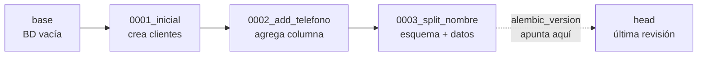
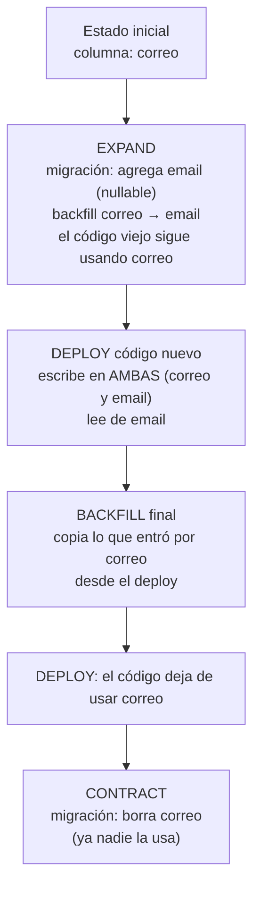
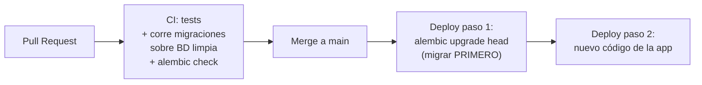

import Reto from "@components/Reto.astro";
import Solucion from "@components/Solucion.astro";
import Quiz from "@components/Quiz.astro";
import CheckDominio from "@components/CheckDominio.astro";
import Nivel from "@components/Nivel.astro";

<Nivel nivel="intermedio" />

Tu código vive en Git: cualquiera clona el repo, corre un comando y obtiene exactamente la misma app que tú. ¿Y tu base de datos? Si la respuesta es "entro al cliente SQL y le pego un `ALTER TABLE` a mano", tienes un problema que no se ve hasta que duele: el esquema de tu máquina, el de tu compañero y el de producción **divergen en silencio**, y nadie sabe cuál es el correcto. Esta lección trata de cómo poner la **estructura de tu base de datos bajo control de versiones**, igual que el código, usando migraciones. Es uno de esos temas que separan a quien "hizo un CRUD una vez" de quien puede tocar la base de una app real sin botarla.

:::tip[Si ya corriste migraciones en algún framework]
¿Ya usaste `prisma migrate`, EF Core migrations, Django migrations o Rails? El **concepto** es el mismo en todos: cambios de esquema versionados, ordenados, aplicables hacia adelante y reversibles. Úsalo como diagnóstico, no como excusa para saltar. La trampa del que "ya hizo migraciones" es nunca haber escrito una **migración de datos** a mano, ni haber pensado qué pasa cuando una migración corre sobre 10 millones de filas en producción mientras la app sigue atendiendo tráfico. Si puedes explicar sin notas qué es expand/contract, por qué `autogenerate` no detecta un rename, y dónde exactamente en tu pipeline de CI/CD corren las migraciones respecto al deploy del código — salta a los ejercicios (sección 7) y mídete. Si dudas en cualquiera, la respuesta está en las secciones 4 a 8.
:::

## 1. Qué vas a saber hacer

Al terminar, sin IA y sin notas, podrás:

- **O1 — Explicar** qué problema resuelven las migraciones y por qué "editar la tabla a mano" no escala, describiendo el modelo mental de Alembic: una **cadena de revisiones**, las funciones `upgrade`/`downgrade`, y la tabla `alembic_version` que recuerda en qué punto está cada base de datos.
- **O2 — Implementar** una migración reversible que cambie **esquema y datos a la vez** (agregar columna + rellenar sus valores), con un `downgrade` que la revierte de verdad; y decidir cuándo conviene `autogenerate` y cuándo escribirla a mano.
- **O3 — Diseñar** un cambio de esquema **zero-downtime** con el patrón **expand/contract**, ubicar la ejecución de migraciones en un pipeline de CI/CD, y escribir un plan de **rollback** seguro paso a paso.

## 2. Por qué importa (el dinero está aquí)

> 💰 **Por qué importa:** REST API es el skill #1 del mercado (≈70% de las ofertas) y el backend es donde vive la lógica de las apps de IA que quieres construir. Toda app real evoluciona: hoy guardas `nombre_completo` y mañana el negocio pide separarlo en `nombre` y `apellido`; hoy una columna acepta nulos y mañana no. El backend que no sabe **evolucionar su esquema sin perder datos ni botar el servicio** no llega a producción. "¿Cómo agregas una columna a una tabla de 50 millones de filas en una app que no puede tener downtime?" es una pregunta de entrevista que filtra senior de junior en una sola respuesta.

Tres razones hacen de esta sub-unidad una bisagra de la Fase 3:

1. **El esquema es código, y el código se versiona.** Sin migraciones, tu base de datos es un estado mutable global sin historial: imposible de reproducir, imposible de revertir, imposible de revisar en un pull request. Las migraciones convierten cada cambio de esquema en un **archivo en Git** que cualquiera aplica para llegar al mismo estado. Es la diferencia entre "funciona en mi máquina" y "funciona, punto".
2. **Una migración mal hecha es un incidente de producción.** Borrar la columna equivocada, agregar un `NOT NULL` sin default sobre una tabla con datos, o tomar un lock que congela la tabla por minutos: cada uno bota la app. Saber escribir migraciones **reversibles** y **zero-downtime** no es un lujo, es lo que evita que tu nombre aparezca en el post-mortem.
3. **Es la base del capstone y de todo lo que sigue.** El Capstone F3 (una API de producción con FastAPI + Postgres) exige que el esquema esté versionado y que las migraciones corran en CI/CD. Sin esto, no tienes una "API de producción": tienes una demo que solo levanta en tu laptop.

## 3. Lo que ya traes (actívalo)

Esta lección se para sobre las tres anteriores. Reúsalo antes de seguir:

- De [`3.1` SQL y modelado relacional](/fase-3-backend/3-1-sql-modelado-relacional/): `CREATE TABLE`, `ALTER TABLE ADD COLUMN`, claves y constraints. Una migración **es** DDL (`CREATE`/`ALTER`/`DROP`), pero envuelto en código versionado y reversible.
- De [`3.3` PostgreSQL a fondo](/fase-3-backend/3-3-postgresql-a-fondo/): transacciones y **locks**. Esto es clave: un `ALTER TABLE` toma un lock sobre la tabla. Si la tabla es enorme o la operación es lenta, ese lock bloquea las queries de tu app — exactamente el origen del downtime que aprenderás a evitar.
- De [`3.2` Queries avanzadas](/fase-3-backend/3-2-queries-avanzadas/): el `UPDATE ... WHERE` con el que rellenarás los datos de las columnas nuevas en una migración de datos.

Antes de seguir, responde de memoria:

<Quiz
  question="Dos desarrolladores, cada uno en su rama, cambian el esquema. Uno agrega la columna `telefono` a `clientes`; el otro agrega `direccion`. Cada uno entra al cliente SQL de su base local y ejecuta el ALTER TABLE a mano. Mergean sus ramas. Un tercer compañero clona el repo y levanta la app. ¿Qué pasa?"
  options={[
    "La app levanta bien: las columnas ya están en la base de datos compartida",
    "La app falla o diverge: los ALTER hechos a mano no quedaron en el repositorio, así que la base del tercero no tiene esas columnas y nadie sabe cuál es el estado 'correcto' del esquema",
    "Git detecta los cambios de esquema y los aplica automáticamente al hacer merge",
  ]}
  answer={1}
  explanation="Editar el esquema a mano no deja rastro versionado: vive en la cabeza de quien lo tocó, no en el repo. La base del tercero no tiene esas columnas, su app revienta al hacer una query que las usa, y los entornos divergen sin que nadie pueda decir cuál es el correcto. Las migraciones resuelven justo esto: cada cambio es un archivo en Git, ordenado, que cualquiera aplica para llegar al mismo estado. Eso es 'la base de datos como código'."
/>

## 4. Cómo se hace, en voz alta

Voy a razonar **paso a paso**, como si montáramos juntos las migraciones de un backend FastAPI + SQLAlchemy desde cero, con **Alembic** (la herramienta de migraciones estándar del ecosistema SQLAlchemy/Python). No te quedes con la sintaxis: quédate con *por qué* cada pieza existe.

### 4.1 El modelo mental: una cadena de revisiones

Una **migración** (Alembic la llama *revision*, "revisión") es un archivo Python con dos funciones: `upgrade()`, que **aplica** un cambio de esquema, y `downgrade()`, que lo **revierte**. Cada revisión apunta a la anterior (`down_revision`), formando una cadena enlazada. Tu base de datos guarda, en una tabla especial `alembic_version`, **en qué revisión está parada**.



- `alembic upgrade head` aplica, en orden, todas las revisiones pendientes hasta la última (`head`).
- `alembic downgrade -1` retrocede **una** revisión, ejecutando su `downgrade()`.
- `alembic current` lee `alembic_version` y te dice dónde está esa base.

La pieza mental clave: **cada entorno (tu laptop, la de tu compañero, staging, producción) puede estar parado en una revisión distinta**, y `upgrade head` lleva a cualquiera al mismo estado final, aplicando solo lo que le falta. Eso es lo que hace reproducible una base de datos.

### 4.2 Arrancar Alembic

Una sola vez por proyecto:

```bash
# instala (en el entorno del proyecto, nunca global)
uv add alembic sqlalchemy

# crea la estructura: alembic.ini + carpeta alembic/ con env.py y versions/
alembic init alembic
```

Esto crea `alembic/env.py`. El único cambio importante ahí es conectar tus **modelos** para que Alembic pueda comparar el esquema deseado contra el real (`autogenerate`, sección 4.5):

```python
# alembic/env.py  (fragmento relevante)
from miapp.modelos import Base   # tu declarative Base de SQLAlchemy

# Alembic compara esta metadata contra la base real para autogenerar
target_metadata = Base.metadata
```

:::caution[La URL de la base NO se hardcodea]
El `alembic.ini` trae una línea `sqlalchemy.url = ...`. **No** pongas ahí la contraseña de producción: es un secreto que terminaría en Git. Léela de una variable de entorno en `env.py` (`os.environ["DATABASE_URL"]`). Esto es el hilo de **seguridad / secrets management** que arrastras desde la Fase 3: las credenciales viven en el entorno, nunca en el repo.
:::

### 4.3 Tu primera revisión: crear una tabla

Generas el archivo vacío y lo rellenas a mano:

```bash
alembic revision -m "inicial: crea clientes"
```

Alembic crea `alembic/versions/0001_inicial.py`. Lo edito:

```python
"""inicial: crea clientes

Revision ID: 0001_inicial
Revises:
Create Date: 2026-06-26 09:00:00.000000
"""
from typing import Sequence, Union

from alembic import op
import sqlalchemy as sa

# identificadores que Alembic usa para ordenar la cadena
revision: str = "0001_inicial"
down_revision: Union[str, None] = None      # es la primera: no hay anterior
branch_labels: Union[str, Sequence[str], None] = None
depends_on: Union[str, Sequence[str], None] = None


def upgrade() -> None:
    op.create_table(
        "clientes",
        sa.Column("id", sa.Integer, primary_key=True),
        sa.Column("nombre_completo", sa.String(length=200), nullable=False),
        sa.Column("correo", sa.String(length=255), nullable=False, unique=True),
    )


def downgrade() -> None:
    op.drop_table("clientes")
```

Razono en voz alta:
- `op` es la API de operaciones de Alembic: `op.create_table`, `op.add_column`, `op.drop_column`, `op.alter_column`, `op.execute`. Abstrae el DDL para que funcione en Postgres, MySQL o SQLite.
- `upgrade` **construye**; `downgrade` **deshace exactamente lo que construyó**. Aquí la inversa de crear la tabla es borrarla. La simetría no es casualidad: escribir el `downgrade` te obliga a pensar "¿cómo revierto esto?" *antes* de tener un incidente.
- Lo aplico:

```bash
alembic upgrade head     # crea la tabla + la tabla alembic_version apuntando a 0001
alembic current          # -> 0001_inicial (head)
```

### 4.4 Una migración de solo-esquema: agregar una columna

```bash
alembic revision -m "agrega telefono a clientes"
```

```python
revision: str = "0002_add_telefono"
down_revision: Union[str, None] = "0001_inicial"   # encadena con la anterior
# ...

def upgrade() -> None:
    op.add_column(
        "clientes",
        sa.Column("telefono", sa.String(length=20), nullable=True),
    )

def downgrade() -> None:
    op.drop_column("clientes", "telefono")
```

:::caution[Por qué `nullable=True` y no `NOT NULL`]
Si la tabla ya tiene datos y agregas `telefono` como `NOT NULL` **sin** un valor por defecto, la migración **falla**: las filas existentes no tienen teléfono y violan la restricción. El patrón correcto cuando una columna debe terminar siendo obligatoria es de **tres pasos**: (1) agregar nullable, (2) rellenar (migración de datos), (3) recién entonces marcar `NOT NULL`. Lo verás aplicado en expand/contract (sección 4.7).
:::

### 4.5 `autogenerate`: el atajo que SIEMPRE se revisa

Escribir cada `op.add_column` a mano es tedioso. Si cambias tu **modelo** SQLAlchemy (agregas un atributo a la clase) y conectaste `target_metadata`, Alembic puede **comparar** el modelo contra la base real y escribir la migración por ti:

```bash
alembic revision --autogenerate -m "agrega telefono a clientes"
```

Alembic detecta la diferencia y genera el `upgrade`/`downgrade`. **Pero `autogenerate` no es magia, y revisar su salida no es opcional.** Lo que **no** detecta o detecta mal:

- **Renombres.** Si renombras `correo` a `email` en el modelo, `autogenerate` lo ve como "borra `correo`, agrega `email`" — un `drop_column` + `add_column`. Si lo aplicas tal cual, **pierdes todos los datos** de esa columna. Un rename hay que escribirlo a mano con `op.alter_column(..., new_column_name=...)`.
- **Cambios de tipo ambiguos**, tablas que no están en tu metadata, datos (nunca migra datos), e índices/constraints según configuración.

> Regla de oro: **`autogenerate` redacta un borrador; tú eres quien lo edita y lo firma.** Lee cada línea generada como si la hubieras escrito tú, porque eres responsable de ella.

### 4.6 Migración de **datos**, no solo de esquema

Este es el salto que casi nadie aprende bien. El negocio pide separar `nombre_completo` en `nombre` y `apellido`. No basta con cambiar columnas: hay que **mover los datos existentes**. Esto va en la misma migración, en orden:

```python
revision: str = "0003_split_nombre"
down_revision: Union[str, None] = "0002_add_telefono"
# ...

def upgrade() -> None:
    # 1) ESQUEMA: agrega las columnas nuevas (nullable, porque aún están vacías)
    op.add_column("clientes", sa.Column("nombre", sa.String(length=100), nullable=True))
    op.add_column("clientes", sa.Column("apellido", sa.String(length=100), nullable=True))

    # 2) DATOS: rellena las columnas nuevas desde nombre_completo.
    #    Tabla LIGERA ad-hoc: NO importamos el modelo real, porque el modelo
    #    cambia con el tiempo y rompería migraciones viejas. La migración
    #    describe el esquema TAL COMO ERA en este punto de la historia.
    clientes = sa.table(
        "clientes",
        sa.column("id", sa.Integer),
        sa.column("nombre_completo", sa.String),
        sa.column("nombre", sa.String),
        sa.column("apellido", sa.String),
    )
    conn = op.get_bind()   # la conexión activa de la migración
    for fila in conn.execute(sa.select(clientes.c.id, clientes.c.nombre_completo)):
        partes = (fila.nombre_completo or "").split(None, 1)
        nombre = partes[0] if partes else ""
        apellido = partes[1] if len(partes) > 1 else ""
        conn.execute(
            clientes.update()
            .where(clientes.c.id == fila.id)
            .values(nombre=nombre, apellido=apellido)
        )


def downgrade() -> None:
    # inversa: los datos vuelven a vivir en nombre_completo (que nunca borramos),
    # así que basta con quitar las columnas nuevas.
    op.drop_column("clientes", "apellido")
    op.drop_column("clientes", "nombre")
```

Tres cosas que razono en voz alta:
1. **El orden importa.** Primero existe la columna, después la rellenas. Invertirlo es un error que `UPDATE` te grita.
2. **Tabla ligera, no el modelo real.** Importar tu clase `Cliente` parece cómodo, pero el modelo *evoluciona*: dentro de un año tendrá columnas que en este punto de la historia no existían, y la migración vieja reventaría. La migración debe describir el esquema **congelado en su momento**. Esto es disciplina de *spec-driven*: la migración es la spec ejecutable de un cambio puntual.
3. **`downgrade` reversible (con asterisco).** Aquí es reversible porque **no borramos `nombre_completo`**: los datos originales siguen ahí. Si en esta misma migración hubiéramos hecho `op.drop_column("clientes", "nombre_completo")`, el `downgrade` sería **imposible de hacer bien**: no hay forma de reconstruir "Ada Lovelace" desde "Ada" + "Lovelace" con 100% de fidelidad (¿y los apellidos compuestos? ¿los espacios originales?). **Borrar datos no se revierte.** Por eso el borrado de la columna vieja se hace en una migración *posterior y separada* (contract), cuando ya estás seguro.

### 4.7 Zero-downtime: el patrón expand/contract

En producción no puedes parar la app para migrar. Y hay un detalle brutal que rompe a los juniors: durante un **deploy con rolling update**, el código **viejo** y el **nuevo** corren **al mismo tiempo** unos segundos o minutos. Si tu migración renombra `correo` a `email` y la aplicas de golpe, el código viejo —que todavía hace `SELECT correo`— empieza a tirar errores 500. Boom: downtime.

La solución es **expand/contract** (también "parallel change"): nunca haces un cambio incompatible de un solo golpe. Lo partes en pasos donde **viejo y nuevo conviven**:



La idea central: **separa el cambio de esquema del cambio de código, y nunca elimines algo que el código en ejecución todavía usa.** Cada paso es compatible hacia atrás. Si algo falla, retrocedes un paso sin perder datos. Es más trabajo que un `ALTER` de una línea — y es exactamente lo que hace la diferencia entre un backend de juguete y uno de producción.

> Detalle de **costo/latencia y locks**: rellenar 10 millones de filas en un solo `UPDATE` toma un lock largo y puede congelar la tabla. El backfill de producción se hace **por lotes** (`WHERE id BETWEEN ... ` en bloques de unos miles, con pausas), monitoreando los locks. Esto conecta directo con lo que viste de locks en [`3.3`](/fase-3-backend/3-3-postgresql-a-fondo/).

### 4.8 Dónde corren las migraciones en CI/CD

Una migración no se corre "a mano en producción" (volvimos al problema del inicio). Se corre en el **pipeline**, en un orden que importa:



- **En CI** (en cada PR): corre las migraciones sobre una base limpia y luego los tests. Así una migración rota se detecta **antes** de mergear. `alembic check` falla si el modelo y las migraciones se desincronizaron (alguien cambió el modelo y olvidó generar la migración).
- **En el deploy**: con expand/contract bien hecho, **migras primero, deployas el código después**. Como el cambio es compatible hacia atrás, el código viejo sigue funcionando contra el esquema nuevo durante la ventana de rollout. (Para un cambio destructivo *contract*, es al revés: primero retiras el código que usa lo viejo, después borras.)

## 5. No-ejemplos y malentendidos

:::caution[Malentendidos que cuestan un incidente]

**"`autogenerate` genera la migración perfecta, no hace falta revisarla."**
Falso y peligroso. No detecta renames (los ve como drop+add → **pérdida de datos**), no migra datos, y a veces se equivoca con tipos/índices. Siempre lee y edita la salida. Es un borrador, no un veredicto.

**"El `downgrade` es opcional, nunca lo voy a usar."**
Dos errores en uno. Primero: el `downgrade` **es tu botón de rollback** cuando una migración sale mal en staging. Segundo, y más profundo: escribir el `downgrade` te **fuerza a pensar la reversibilidad** mientras diseñas el cambio. Si descubres que no puedes escribir un `downgrade` honesto (porque borrarías datos irrecuperables), esa es la señal de que necesitas partir el cambio en pasos (expand/contract).

**"Una migración que borra datos se puede 'deshacer'."**
No. `DROP COLUMN`, `DELETE`, `TRUNCATE` destruyen información. El `downgrade` puede recrear la *columna*, pero no resucitar los *datos* que vivían en ella. Por eso lo destructivo (contract) se hace en una migración separada y tardía, y por eso existen los backups.

**"Renombro la columna y deployo el código nuevo en el mismo paso, listo."**
Durante el rolling deploy conviven código viejo y nuevo. El viejo consulta la columna con el nombre viejo y revienta. Eso es downtime. Usa expand/contract.

**"Agrego la columna `NOT NULL` directamente."**
Sobre una tabla con datos, falla: las filas existentes violarían la restricción. El patrón es agregar nullable → rellenar → marcar `NOT NULL`.

**"La migración la corro yo en producción con un cliente SQL."**
Eso es exactamente "editar la tabla a mano" con otro nombre: no queda versionado, no es reproducible, no corre en CI. Las migraciones corren en el pipeline.
:::

## 6. Práctica guiada (el andamiaje se desvanece)

### 6.1 Predice (PRIMM)

Tienes una base parada en `head`, con la cadena `0001 → 0002 → 0003` toda aplicada. Ejecutas:

```bash
alembic downgrade -1
alembic current
```

**Antes de leer la respuesta**: ¿qué imprime `alembic current`?

<Quiz
  question="Cadena 0001 → 0002 → 0003 aplicada hasta head. Corres `alembic downgrade -1` y luego `alembic current`. ¿Qué muestra?"
  options={[
    "0001 (vuelve al inicio de la cadena)",
    "0002 (retrocede exactamente una revisión desde 0003, ejecutando el downgrade de 0003)",
    "Nada: la base queda sin versión registrada",
  ]}
  answer={1}
  explanation="`downgrade -1` retrocede UNA revisión relativa a la actual: de 0003 a 0002, ejecutando el downgrade() de 0003. `alembic current` lee la tabla alembic_version y muestra 0002. Para volver al inicio sería `alembic downgrade base`; para retroceder a una revisión concreta, `alembic downgrade 0001`."
/>

### 6.2 Reordena (Parsons)

Estas son las líneas del `upgrade()` de la migración que separa `nombre_completo` en `nombre` + `apellido`, **desordenadas**. Reordénalas mentalmente. La clave: ¿qué tiene que existir antes de poder escribir en ello?

```text
(a)  op.add_column("clientes", sa.Column("apellido", sa.String(), nullable=True))
(b)  for fila in conn.execute(sa.select(t.c.id, t.c.nombre_completo)):
(c)  op.add_column("clientes", sa.Column("nombre", sa.String(), nullable=True))
(d)  conn = op.get_bind()
(e)      nombre, _, apellido = (fila.nombre_completo or "").partition(" ")
(f)      conn.execute(t.update().where(t.c.id == fila.id).values(nombre=nombre, apellido=apellido))
```

<Solucion title="Ver orden correcto y el porqué">

Orden: **c, a, d, b, e, f**.

```text
(c)  op.add_column(... "nombre" ...)        # 1) esquema primero
(a)  op.add_column(... "apellido" ...)       # 2) la otra columna
(d)  conn = op.get_bind()                    # 3) obtén la conexión
(b)  for fila in conn.execute(select...):    # 4) recorre las filas
(e)      nombre, _, apellido = ...partition  #    calcula los valores
(f)      conn.execute(update...)             #    escribe en las columnas nuevas
```

La regla que ordena todo: **primero la migración de esquema (las columnas tienen que existir), después la migración de datos (rellenarlas)**. Si intentas el `UPDATE ... SET nombre = ...` antes de que la columna `nombre` exista, la base de datos te responde "no such column". Pista de pista: una pista no es la solución del ejercicio 7; es un empujón conceptual.

</Solucion>

## 7. Ejercicios Primero-Sin-IA

Resuélvelos **a mano, sin IA**, dentro del timebox. La carpeta de cada ejercicio (la abres en tu repo/VSCode) trae el enunciado completo, el starter y, cuando aplica, los tests.

<Reto title="Escribe una migración reversible con backfill" timebox="35 min">

Carpeta: `ejercicios/fase-3/migracion-reversible/`

Tienes una tabla `usuarios` con una sola columna de nombre, `nombre_completo`. Implementa, en `migracion.py`, las dos funciones de una migración (versión mínima, sobre `sqlite3` de la stdlib para que no necesites instalar nada):

- `upgrade(conn)`: agrega las columnas `nombre` y `apellido`, y **rellena** sus valores desde `nombre_completo` (la primera palabra es el nombre; el resto, el apellido; si no hay resto, apellido = `""`).
- `downgrade(conn)`: revierte el cambio dejando la tabla **exactamente** como estaba (solo `id` y `nombre_completo`, con los datos intactos).

**Criterios de "hecho":**
- [ ] `uv run pytest` pasa en verde (round-trip incluido: `upgrade` → `downgrade` deja la tabla idéntica al inicio).
- [ ] El backfill maneja el caso de un solo nombre sin apellido (`"Cher"` → `nombre="Cher"`, `apellido=""`).
- [ ] El `downgrade` **no** pierde ni altera `nombre_completo`.
- [ ] Agregaste al menos un caso de prueba tuyo (un nombre borde que se te ocurra).
- [ ] Puedes explicar, sin notas, por qué `upgrade` agrega las columnas **antes** de rellenarlas.

<Solucion title="Pista (ábrela solo si superaste el timebox)">
El orden dentro de `upgrade` es: `ALTER TABLE ... ADD COLUMN` para cada columna nueva, **luego** un `SELECT` de las filas, y por cada fila un `UPDATE`. Para partir el nombre, `str.split(None, 1)` divide en la primera racha de espacios y te da una lista de 1 o 2 elementos — justo lo que necesitas para el caso "sin apellido". Para el `downgrade`, recuerda que `ALTER TABLE ... DROP COLUMN` existe en SQLite 3.35+. No mires la solución de referencia hasta cerrar tu intento.
</Solucion>

</Reto>

<Reto title="Diseña un cambio de esquema zero-downtime" timebox="40 min">

Carpeta: `ejercicios/fase-3/plan-migracion-zero-downtime/`

Producción: una API con **rolling deploys** (varias instancias; durante el rollout conviven código viejo y nuevo). La tabla `clientes` tiene 10 millones de filas y una columna `correo`. El negocio pide **renombrarla a `email`**. Un junior abrió un PR con una sola migración: `op.alter_column("clientes", "correo", new_column_name="email")`, junto con el código nuevo que ya usa `email`.

Escribe en `PLAN.md`:
1. **Por qué la propuesta del junior bota la app** (al menos dos razones concretas distintas).
2. La **secuencia expand/contract**: cada migración y cada deploy de código, en orden, indicando en cada paso qué es compatible con el código en ejecución.
3. Cómo **backfilleas 10M filas** sin congelar la tabla.
4. El **plan de rollback** en cada paso (qué pasa si falla en el medio).

**Criterios de "hecho":**
- [ ] Nombras el problema del rolling deploy (viejo y nuevo conviven) como causa raíz, no solo "es riesgoso".
- [ ] Tu secuencia nunca elimina algo que el código en ejecución todavía usa.
- [ ] El backfill es por lotes, no un `UPDATE` único de 10M filas.
- [ ] Cada paso destructivo (borrar `correo`) ocurre **al final**, cuando ya nadie la usa, y reconoces que ese paso no es reversible (de ahí el backup).
- [ ] Puedes defender, sin notas, por qué se migra el esquema en pasos separados del deploy de código.

<Solucion title="Pista (ábrela solo si superaste el timebox)">
Piensa en términos de "¿qué columna usa cada versión del código mientras conviven?". El patrón tiene tres fases: **expand** (agregas `email` nullable + backfilleas + el código nuevo escribe en `correo` y `email` a la vez), una fase de transición (el código nuevo ya lee de `email`), y **contract** (cuando ninguna instancia usa `correo`, recién ahí la borras). El rename de un solo golpe falla porque deja al código viejo consultando una columna que ya no existe. No mires la solución de referencia hasta cerrar tu intento.
</Solucion>

</Reto>

## 8. Check de dominio (active recall)

Sin mirar la lección:

<CheckDominio
  items={[
    "Explicar, en una frase, qué problema resuelven las migraciones y por qué 'editar la tabla a mano' no escala",
    "Dibujar de memoria la cadena de revisiones y decir qué hacen `upgrade head`, `downgrade -1` y `current`",
    "Escribir el upgrade/downgrade de una migración que agrega una columna",
    "Explicar por qué una migración de datos importa una tabla 'ligera' en vez del modelo real",
    "Nombrar dos cosas que `autogenerate` NO detecta o detecta mal (y por qué un rename es peligroso)",
    "Explicar el patrón expand/contract y por qué el rolling deploy lo hace necesario",
    "Decir dónde corren las migraciones en un pipeline de CI/CD y en qué orden respecto al deploy del código",
  ]}
/>

Si alguno te costó, su respuesta está en las secciones 4 a 4.8. La prueba real: explícaselo en voz alta a alguien (o a la pared) sin notas.

## 9. Recursos (documentación oficial primero)

- **Alembic — Tutorial**: https://alembic.sqlalchemy.org/en/latest/tutorial.html — el flujo `init` → `revision` → `upgrade`/`downgrade`, leído de la fuente.
- **Alembic — Auto Generating Migrations**: https://alembic.sqlalchemy.org/en/latest/autogenerate.html — qué detecta `autogenerate`, sus límites, y `alembic check`.
- **Alembic — Operation Reference (`op`)**: https://alembic.sqlalchemy.org/en/latest/ops.html — `add_column`, `alter_column`, `bulk_insert`, `execute`, `batch_alter_table`, todo.
- **Alembic — Cookbook (migraciones de datos)**: https://alembic.sqlalchemy.org/en/latest/cookbook.html — separar `data_upgrades` de `schema_upgrades`.
- **SQLAlchemy 2.0 — Core / `text` y tablas ad-hoc**: https://docs.sqlalchemy.org/en/20/core/ — para el `op.get_bind()` y las `sa.table`/`sa.column` ligeras.
- **PostgreSQL — `ALTER TABLE`**: https://www.postgresql.org/docs/current/sql-altertable.html — qué locks toma cada operación (clave para zero-downtime).

## 10. Conexión con el proyecto (Capstone F3)

El [Capstone F3 — API de producción](/fase-3-backend/proyecto/) **exige** que tu esquema esté versionado con migraciones, no creado a mano. Concretamente, esta sub-unidad alimenta el Definition of Done del capstone en varios puntos:

- **Reproducibilidad y spec-driven**: cualquiera levanta tu API y corre `alembic upgrade head` para tener el esquema correcto. Cada cambio de esquema queda en Git, revisable en el PR.
- **CI/CD**: tus migraciones corren en el pipeline (sección 4.8); `alembic check` detecta desincronización modelo ↔ migraciones.
- **Producción sin downtime**: cuando el capstone evolucione su esquema, lo harás con expand/contract, no con un `ALTER` que bote el servicio.
- **Testing**: el round-trip `upgrade`/`downgrade` es testeable, igual que cualquier otra pieza de tu backend.

Sin migraciones, tu entrega es una demo local; con ellas, es una API que otro equipo podría operar.

## 11. Reflexión + repaso espaciado

**Prompt de reflexión (escríbelo, 3–4 líneas):** piensa en la última vez que cambiaste una tabla "a mano" (o imagínalo). ¿Cómo sabría tu compañero —o tu yo de dentro de seis meses— qué cambió, por qué, y cómo revertirlo? Si tu respuesta no es "está en un archivo en Git", ahí está el valor de esta lección.

**Repaso espaciado:**
- **Mañana (día +1):** sin mirar, reescribe de memoria el `upgrade`/`downgrade` de la migración que separa `nombre_completo`. Si no puedes, no lo aprendiste todavía: vuelve a 4.6.
- **En una semana (día +7):** explícale a alguien el patrón expand/contract usando el caso del rename `correo` → `email`. Si lo defiendes sin trabarte, lo interiorizaste.
- **Gancho hacia adelante:** en [`3.5` ORMs y el problema N+1](/fase-3-backend/3-5-orms-problema-n1/) volverás a SQLAlchemy, pero desde el lado del *acceso a datos*. Las migraciones que escribiste aquí son las que crean las tablas que ese ORM consultará.

> [!tip] GLaDOS dice
> Editar la tabla de producción a mano un viernes a las 18:00 es, estadísticamente, la decisión que precede al peor fin de semana de tu carrera. Versiona el esquema. Escribe el `downgrade`. Tu yo del lunes te lo agradecerá.
