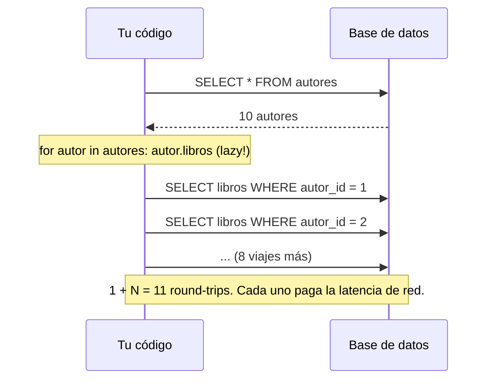

import Reto from "@components/Reto.astro";
import Solucion from "@components/Solucion.astro";
import Quiz from "@components/Quiz.astro";
import CheckDominio from "@components/CheckDominio.astro";
import Nivel from "@components/Nivel.astro";

<Nivel nivel="intermedio" />

Hasta ahora escribiste SQL a mano: tú decidías cada `SELECT`, cada `JOIN`, cada índice. Un **ORM** (Object-Relational Mapper) promete escribir ese SQL por ti, para que trabajes con objetos de Python en vez de filas y columnas. Suena a magia. Y como toda magia, tiene letra chica: el ORM puede generar, sin que lo notes, **cientos de queries donde bastaba una**. Ese es el problema **N+1**, el bug de rendimiento más común y más caro de los backends modernos, y la razón #1 por la que "saber usar un ORM" no te exime de saber SQL. Esta lección es sobre las dos cosas a la vez.

:::tip[Si ya tocaste un ORM (Django, Prisma, EF Core, SQLAlchemy)]
¿Ya escribiste `Model.objects.all()` o `prisma.user.findMany()`? Úsalo como diagnóstico, no como excusa para saltar. La trampa del que "ya sabe ORMs" es no poder responder *por qué* su endpoint que andaba bien en local se arrastra en producción. Si puedes, sin notas: (1) explicar qué es lazy loading y por qué dispara el N+1, (2) leer un log de SQL y decir "aquí hay un N+1" contando las queries, y (3) decidir cuándo usas `joinedload` y cuándo `selectinload` y por qué no son intercambiables — salta a los ejercicios (sección 7) y mídete. Si dudas en cualquiera, las secciones 4 a 6 son para ti.
:::

## 1. Qué vas a saber hacer

Al terminar, sin IA y sin notas, podrás:

- **O1 — Definir un modelo en SQLAlchemy 2.0** (estilo declarativo: `DeclarativeBase`, `Mapped`, `mapped_column`, `relationship`) y consultar datos con una `Session` y `select()`, explicando qué SQL produce cada operación.
- **O2 — Diagnosticar un problema N+1** mirando las queries reales: activar el log de SQL o contar las queries con un listener, y reconocer el patrón "1 query + N queries" como antipatrón.
- **O3 — Resolver el N+1 con eager loading** (`joinedload` vs `selectinload`) y **explicar el trade-off** entre ORM y SQL crudo: cuándo el ORM ayuda y cuándo debes bajar a SQL.

## 2. Por qué importa (el dinero está aquí)

> 💰 **Por qué importa:** REST API es el skill #1 del mercado (≈70% de las ofertas) y el backend es donde vive la lógica de tus apps de IA. Casi todo backend en producción usa un ORM —es lo que verás el día 1 en cualquier empresa—. Pero el ORM es un arma de doble filo: te hace productivo y, al mismo tiempo, esconde el costo real de cada acceso a datos. El N+1 es el bug que **no se ve en tu máquina** (con 10 filas de prueba todo vuela) y que **mata la app en producción** (con 10.000 filas, ese endpoint hace 10.001 viajes a la base y tarda 8 segundos). Un semi-senior sabe leer las queries que su ORM genera. Un junior confía en que "el ORM se encarga".

Tres razones hacen de esta sub-unidad una bisagra de la Fase 3:

1. **Es la pregunta de entrevista de backend más frecuente sobre ORMs.** "¿Qué es el problema N+1 y cómo lo resuelves?" filtra candidatos en segundos. No es trivia: es saber que el código bonito esconde un costo, y saber medirlo.
2. **El costo es latencia real, medible en dinero.** Cada query es un *round-trip* a la base: la app pide, espera la red, la base responde. Convertir 1 query en 200 no multiplica por 200 el *cómputo*, multiplica los *viajes* —y la latencia de red domina. Es el hilo de **costo/latencia** que te seguirá hasta la Fase 6 (donde cada llamada a un LLM tiene el mismo problema: round-trips caros que hay que agrupar).
3. **Es la frontera donde "el ORM no basta".** Aprender a diagnosticar el N+1 te obliga a ver el SQL que el ORM genera. Y una vez que lo ves, descubres los casos donde el ORM estorba y debes escribir SQL a mano. Esa decisión —ORM vs SQL crudo— es material de **ADR** en tu capstone.

## 3. Lo que ya traes (actívalo)

Esta lección se para sobre toda la fase hasta aquí. Reúsalo antes de seguir:

- De [`3.1` SQL y modelado relacional](/fase-3-backend/3-1-sql-modelado-relacional/): claves foráneas y relaciones uno-a-muchos. Un `relationship()` del ORM **es** una FK vista desde Python.
- De [`3.2` Queries avanzadas](/fase-3-backend/3-2-queries-avanzadas/): el `JOIN`. `joinedload` no es más que un `LEFT JOIN` que el ORM escribe por ti — ya sabes leerlo.
- De [`3.3` PostgreSQL a fondo](/fase-3-backend/3-3-postgresql-a-fondo/): leer un plan con `EXPLAIN` y entender que cada query tiene un costo. El N+1 es ese costo multiplicado por descuido.

Antes de seguir, responde de memoria:

<Quiz
  question="Tienes una tabla `autores` y una tabla `libros` con una FK `libros.autor_id`. Quieres, en una sola pantalla, listar cada autor con los títulos de sus libros. En SQL crudo, ¿cuántas queries necesitas como mínimo?"
  options={[
    "Una por cada autor, más una para la lista de autores",
    "Una sola: un JOIN entre autores y libros (o dos, si prefieres traer las colecciones por separado)",
    "Es imposible en SQL; necesitas un ORM",
  ]}
  answer={1}
  explanation="Un JOIN resuelve todo en una query. O, si no quieres multiplicar filas, dos queries: una de autores y otra de libros con WHERE autor_id IN (...). Lo que NUNCA harías a mano es una query por autor. Y sin embargo, eso es exactamente lo que un ORM hace por defecto si no se lo impides. Esa brecha entre 'lo que harías a mano' y 'lo que el ORM hace solo' es el problema N+1."
/>

## 4. Cómo piensa un ORM, en voz alta

Voy a razonar **paso a paso**, como frente a la misma terminal. Vamos a construir un modelo, hacer una consulta inocente, ver el desastre en el log de SQL, y arreglarlo de dos maneras entendiendo cuándo conviene cada una.

### 4.1 Qué es un ORM (y qué no es)

Un **ORM** mapea tablas a clases y filas a objetos. En vez de `SELECT * FROM autores WHERE id = 1` y un diccionario, escribes `session.get(Autor, 1)` y recibes un objeto `Autor` con atributos. La promesa: trabajar en el lenguaje de tu dominio (objetos), no en el de la base (filas).

Lo que un ORM **sí** te da:

- **Menos código repetitivo** (boilerplate) para CRUD: crear, leer, actualizar, borrar.
- **Seguridad por defecto**: las queries van **parametrizadas**, así que el ORM te protege de SQL injection sin que pienses en ello (el hilo de seguridad de [`3.13`](/fase-3-backend/3-13-owasp-top10-web/) empieza aquí: nunca concatenes strings en SQL).
- **Portabilidad**: el mismo código corre sobre Postgres, SQLite o MySQL (con matices).

Lo que un ORM **no** te da:

- No te exime de **saber SQL**. El ORM genera SQL; si no sabes leerlo, no puedes depurarlo.
- No es gratis: cada acceso a un atributo puede esconder una query. (Aquí nace el N+1.)
- No siempre es la mejor herramienta. Para queries analíticas complejas (window functions, CTEs recursivos, agregaciones pesadas) suele ser más claro y rápido el SQL crudo.

:::note[La regla mental]
El ORM es una **capa de conveniencia sobre SQL**, no un reemplazo. El buen backender piensa en SQL y *escribe* en ORM cuando conviene. El día que el ORM te estorbe, bajas a SQL — y para eso necesitas seguir entendiendo lo que hay debajo.
:::

### 4.2 Un modelo en SQLAlchemy 2.0 (estilo declarativo moderno)

Vamos a usar **SQLAlchemy**, el ORM estándar de Python (el que usa FastAPI en la mayoría de proyectos). La versión 2.0 introdujo un estilo declarativo con type hints que es el que verás en código nuevo. Modelamos un caso clásico uno-a-muchos: un `Autor` tiene muchos `Libro`.

```python
# modelos.py
from __future__ import annotations

from sqlalchemy import ForeignKey, String
from sqlalchemy.orm import DeclarativeBase, Mapped, mapped_column, relationship


class Base(DeclarativeBase):
    """Clase base de todos los modelos. SQLAlchemy 2.0 reemplaza el viejo
    declarative_base() por heredar de DeclarativeBase."""
    pass


class Autor(Base):
    __tablename__ = "autores"

    id: Mapped[int] = mapped_column(primary_key=True)
    nombre: Mapped[str] = mapped_column(String(100))

    # relationship NO es una columna: es el "puente" Python sobre la FK.
    # Por defecto es LAZY: acceder a autor.libros dispara una query nueva.
    libros: Mapped[list["Libro"]] = relationship(back_populates="autor")


class Libro(Base):
    __tablename__ = "libros"

    id: Mapped[int] = mapped_column(primary_key=True)
    titulo: Mapped[str] = mapped_column(String(200))
    autor_id: Mapped[int] = mapped_column(ForeignKey("autores.id"))

    autor: Mapped["Autor"] = relationship(back_populates="libros")
```

Razono en voz alta: *"`Mapped[int]` y `mapped_column(...)` son la forma 2.0 de declarar columnas con tipos. `relationship()` no crea ninguna columna en la base —la FK ya vive en `libros.autor_id`—; es azúcar de Python para que pueda escribir `autor.libros` y obtener una lista de objetos `Libro`. `back_populates` hace que las dos puntas se mantengan sincronizadas. Y el detalle que lo cambia todo: por defecto ese `relationship` es **lazy**."*

### 4.3 Consultar con una Session

Una **`Session`** es tu unidad de trabajo: abre una conexión, rastrea los objetos que cargas, y traduce tus operaciones a SQL. La consulta moderna usa `select()`:

```python
from sqlalchemy import create_engine, select
from sqlalchemy.orm import Session

from modelos import Base, Autor

# echo=True imprime CADA query que SQLAlchemy ejecuta — nuestra herramienta de diagnóstico.
engine = create_engine("sqlite:///biblioteca.db", echo=True)
Base.metadata.create_all(engine)

with Session(engine) as session:
    autores = session.scalars(select(Autor)).all()   # 1 query: SELECT * FROM autores
    for autor in autores:
        print(autor.nombre)
```

`echo=True` es lo primero que enciendes cuando algo va lento: te muestra **exactamente** el SQL que el ORM genera. Es tu primer instrumento de **observabilidad** (el hilo que en la Fase 5 se vuelve trazas y logs estructurados).

### 4.4 El bug: la consulta inocente que explota

Ahora la operación cotidiana: listar cada autor con los títulos de sus libros. El código se ve perfecto:

```python
with Session(engine) as session:
    autores = session.scalars(select(Autor)).all()
    for autor in autores:
        titulos = [libro.titulo for libro in autor.libros]   # <-- acceso a la relación
        print(autor.nombre, titulos)
```

Con `echo=True` y, digamos, **10 autores**, el log de SQL muestra esto (resumido):

```text
SELECT autores.id, autores.nombre FROM autores                       -- 1 query
SELECT libros.id, libros.titulo, libros.autor_id
  FROM libros WHERE libros.autor_id = ?                              -- autor 1
SELECT libros.id, libros.titulo, libros.autor_id
  FROM libros WHERE libros.autor_id = ?                              -- autor 2
... (8 queries más, una por cada autor restante)
```

Razono: *"Conté **11 queries** para 10 autores: 1 para traer los autores, y luego **una por cada autor** cuando accedí a `autor.libros`. Eso es el patrón **N+1**: 1 query inicial + N queries (una por cada uno de los N resultados). Con 10 autores son 11 queries. Con 10.000 autores son 10.001. La página tardaba 80 ms en mi laptop con datos de prueba, y tarda 8 segundos en producción. El código no cambió; solo creció la tabla."*



**Por qué pasa:** el `relationship` es **lazy** por defecto. SQLAlchemy no carga `autor.libros` hasta el milisegundo exacto en que lo *accedes*. Como lo accedes dentro de un `for`, dispara una query por iteración. El ORM hizo justo lo que le pediste —solo que no te diste cuenta de lo que pediste.

### 4.5 Diagnóstico sin echo: contar queries

`echo=True` es genial para ojear, pero para **medir** (y para *testear*, como verás en los ejercicios) necesitas un número. Se cuenta con un **event listener** sobre el engine:

```python
from sqlalchemy import event

class ContadorQueries:
    def __init__(self):
        self.total = 0
    def __call__(self, conn, cursor, statement, params, context, executemany):
        self.total += 1

contador = ContadorQueries()
event.listen(engine, "before_cursor_execute", contador)
# ... corre tu código ...
print(f"Se ejecutaron {contador.total} queries")   # 11 = ¡N+1!
event.remove(engine, "before_cursor_execute", contador)
```

Esto convierte "creo que va lento" en "ejecuta 11 queries y debería ejecutar 2". Y un número es **testeable**: puedes escribir un test que falle si el conteo se dispara. Eso es **TDD aplicado a rendimiento** —el método del Primero-Sin-IA llevado a un bug que normalmente solo se nota en producción.

### 4.6 La cura #1: `selectinload` (para colecciones / to-many)

`selectinload` le dice al ORM: *"carga la relación con una segunda query que use `WHERE autor_id IN (...)`"*. Resultado: **2 queries fijas**, sin importar cuántos autores haya.

```python
from sqlalchemy.orm import selectinload

with Session(engine) as session:
    autores = session.scalars(
        select(Autor).options(selectinload(Autor.libros))
    ).all()
    for autor in autores:
        titulos = [libro.titulo for libro in autor.libros]   # ya NO dispara queries
        print(autor.nombre, titulos)
```

El log ahora muestra exactamente dos queries:

```text
SELECT autores.id, autores.nombre FROM autores
SELECT libros.id, libros.titulo, libros.autor_id
  FROM libros WHERE libros.autor_id IN (?, ?, ?, ?, ?, ?, ?, ?, ?, ?)
```

Razono: *"Pasé de 1+N a un 2 constante. La segunda query trae **todos** los libros de **todos** los autores en un solo viaje, y SQLAlchemy los reparte en los `.libros` de cada autor. Es la opción que prefiero para relaciones **to-many** (colecciones): no multiplica filas y escala parejo."*

### 4.7 La cura #2: `joinedload` (para to-one, o colecciones chicas)

`joinedload` carga la relación con un **`LEFT OUTER JOIN`** en la *misma* query: **1 sola query**.

```python
from sqlalchemy.orm import joinedload

with Session(engine) as session:
    autores = session.scalars(
        select(Autor).options(joinedload(Autor.libros))
    ).unique().all()   # <-- .unique() es OBLIGATORIO con joinedload de colecciones
    for autor in autores:
        print(autor.nombre, [libro.titulo for libro in autor.libros])
```

```text
SELECT autores.id, autores.nombre, libros.id, libros.titulo, libros.autor_id
  FROM autores LEFT OUTER JOIN libros ON autores.id = libros.autor_id
```

Razono: *"Una query, pero ojo con el `.unique()`. El `JOIN` repite la fila del autor por cada libro: un autor con 3 libros aparece 3 veces en el resultado crudo. `.unique()` le dice a SQLAlchemy que deduplique los autores en memoria. Y no es opcional: en SQLAlchemy 2.0, si uso `session.scalars(...)` con un `joinedload` de colección y olvido el `.unique()`, el ORM **lanza un `InvalidRequestError`** exigiéndomelo —falla ruidosamente, no en silencio. Eso es bueno: el error me empuja al hábito correcto."*

### 4.8 ¿`joinedload` o `selectinload`? El trade-off

| Criterio | `joinedload` (JOIN) | `selectinload` (IN) |
|---|---|---|
| Nº de queries | 1 | 2 |
| Mejor para | relaciones **to-one** (cada `Libro` su `Autor`) | relaciones **to-many** (colecciones) |
| Riesgo | multiplica filas; **requiere `.unique()`** en colecciones; un JOIN ancho mueve datos repetidos | una query extra (round-trip adicional) |
| Cuándo gana | trae 1 objeto relacionado por fila | la colección es grande o anidas varias relaciones |

Regla práctica de partida: **to-one → `joinedload`**; **to-many → `selectinload`**. Y mídelo: enciende `echo`, cuenta queries, decide con datos, no con fe.

:::caution[Eager loading no es "siempre mejor"]
Si en una pantalla **no** vas a usar `autor.libros`, cargarlo eager es desperdiciar trabajo. Lazy está bien cuando accedes a la relación **a veces**; el N+1 solo aparece cuando la accedes **dentro de un bucle sobre muchos resultados**. La cura no es "todo eager", es "eager donde el bucle lo exige".
:::

### 4.9 Cuándo el ORM estorba: baja a SQL crudo

El ORM brilla en CRUD y navegación de relaciones. Pero hay casos donde pelear con él cuesta más que escribir SQL:

- **Reportes analíticos**: window functions, CTEs recursivos, `GROUP BY` con `HAVING` y subqueries. El SQL es más claro que la cadena de métodos del ORM.
- **Operaciones masivas**: insertar/actualizar millones de filas. El ORM, objeto por objeto, es lento; un `INSERT ... SELECT` o un bulk en Core vuela.
- **Optimización fina**: cuando necesitas un hint específico del motor o una forma exacta de query que el ORM no expresa bien.

SQLAlchemy te deja bajar sin abandonar la sesión, con SQL **parametrizado** (nunca con f-strings — eso es SQL injection):

```python
from sqlalchemy import text

with Session(engine) as session:
    filas = session.execute(
        text("SELECT nombre, COUNT(*) AS n FROM autores "
             "JOIN libros ON libros.autor_id = autores.id "
             "GROUP BY autores.id ORDER BY n DESC LIMIT :limite"),
        {"limite": 5},          # parámetro ligado: seguro, nunca concatenado
    ).all()
```

> La decisión "ORM aquí, SQL crudo allá" es exactamente el tipo de cosa que documentas en un **ADR**: qué elegiste, por qué, y qué trade-off aceptaste.

### 4.10 La noción de repository pattern

Si los `select(...)` se desparraman por todos tus endpoints, el día que cambies de estrategia (o de ORM) tocas cien archivos. El **repository pattern** concentra el acceso a datos detrás de una interfaz con nombres de tu dominio:

```python
class RepositorioAutores:
    def __init__(self, session: Session):
        self._session = session

    def listar_con_libros(self) -> list[Autor]:
        # El N+1 se arregla AQUÍ, una vez. Los endpoints ni se enteran.
        return self._session.scalars(
            select(Autor).options(selectinload(Autor.libros))
        ).unique().all()
```

El endpoint pide `repo.listar_con_libros()` y no sabe —ni le importa— si por dentro hay `joinedload`, `selectinload` o SQL crudo. Ese límite es justo el **port** de la arquitectura hexagonal que formalizas en [`3.9` Ports & adapters](/fase-3-backend/3-9-ports-adapters-hexagonal/): la lógica de negocio depende de una *interfaz*, no del ORM concreto.

## 5. Errores y malentendidos frecuentes

:::caution[Malentendido 1: "El ORM optimiza las queries por mí"]
Podrías pensar que el ORM, siendo "inteligente", agrupa los accesos solo. **Está mal.** El ORM ejecuta exactamente lo que tu código pide, *cuando* lo pide. Acceder a `autor.libros` dentro de un `for` es pedir una query por iteración, y el ORM obedece. La optimización (eager loading) la pides **tú**, explícitamente.
:::

:::caution[Malentendido 2: "Si pongo lazy='joined' en el modelo, listo para siempre"]
Configurar eager loading *global* en el `relationship` parece cómodo, pero penaliza **todas** las consultas —incluso las que no usan la relación—. La buena práctica es decidir el loading **por consulta**, con `.options(...)`, según lo que esa pantalla necesita. Eager por defecto en el modelo es un olor a problema.
:::

:::caution[Malentendido 3: "joinedload y selectinload son intercambiables"]
No lo son. `joinedload` de una **colección** vía `session.scalars(...)` sin `.unique()` te lanza un `InvalidRequestError` en SQLAlchemy 2.0 (porque el `JOIN` multiplica las filas del lado "uno"); y con colecciones grandes, aunque pongas el `.unique()`, infla el resultado con datos repetidos que viajan por la red. `selectinload` de un **to-one** hace un round-trip extra innecesario. Cada uno tiene su nicho (sección 4.8). Elegir mal rara vez rompe la corrección, pero arruina el rendimiento que viniste a arreglar.
:::

:::caution[Malentendido 4: "El N+1 no existe en mi app porque va rápido"]
Va rápido porque tu tabla de pruebas tiene 10 filas. El N+1 es invisible en desarrollo y letal en producción. La única forma honesta de saberlo es **contar las queries** (sección 4.5), no confiar en el cronómetro de tu laptop con datos de juguete.
:::

**Non-example** (esto *no* es un N+1): hacer 2 queries a propósito —una de autores, una de libros— porque decidiste que `selectinload` es lo correcto. El N+1 no es "más de una query"; es "**una query por cada resultado**, sin querer". Dos queries fijas para 10.000 autores está perfecto. 10.001 queries para 10.000 autores es el bug.

## 6. Práctica con andamiaje (predice → corre → investiga)

Antes de los ejercicios formales, calienta con el método **PRIMM**: *predice* el comportamiento antes de correrlo. En el N+1, predecir = contar queries mentalmente, que es justo la habilidad de diagnóstico.

### 6.1 Predice el conteo de queries

Lee este código (los modelos son los de la sección 4.2, con 5 autores en la base) y **predice cuántas queries ejecuta** antes de leer la respuesta:

```python
with Session(engine) as session:
    autores = session.scalars(select(Autor)).all()
    for autor in autores:
        print(f"{autor.nombre}: {len(autor.libros)} libros")
```

<Solucion title="Ver la predicción correcta">

**6 queries** (= 1 + N, con N = 5). Una para `SELECT autores`, y una por cada autor al evaluar `len(autor.libros)` (acceder a la relación lazy la materializa con una query). Es un N+1 de manual. La cura: `select(Autor).options(selectinload(Autor.libros))` → 2 queries. El detalle fino: `len()` sobre la relación basta para disparar la carga; no hace falta iterar los libros.

</Solucion>

### 6.2 Parsons: reordena la cura

Estas líneas resuelven el N+1 con `joinedload`, pero están **desordenadas**. Ponlas en el orden correcto mentalmente (una de ellas tiene una trampa que debes detectar):

```text
A)     for autor in autores:
B)     autores = session.scalars(
C)         print(autor.nombre, [l.titulo for l in autor.libros])
D)         select(Autor).options(joinedload(Autor.libros))
E)     ).unique().all()
F) with Session(engine) as session:
```

<Solucion title="Ver el orden correcto">

Orden: **F → B → D → E → A → C**.

```python
with Session(engine) as session:                              # F
    autores = session.scalars(                                # B
        select(Autor).options(joinedload(Autor.libros))       # D
    ).unique().all()                                          # E
    for autor in autores:                                     # A
        print(autor.nombre, [l.titulo for l in autor.libros]) # C
```

La trampa: la línea **E** lleva `.unique()`. El `JOIN` repite cada autor una vez por libro, y en SQLAlchemy 2.0, si usas `session.scalars(...)` y omites el `.unique()` (`).all()` a secas), el ORM **lanza un `InvalidRequestError`** que te obliga a ponerlo. Con `joinedload` de una colección, `.unique()` no es opcional.

</Solucion>

## 7. Ejercicios (Primero-Sin-IA)

> Trabaja **a mano, sin IA**, dentro del timebox. La IA entra solo al final, para *revisar* tu intento, nunca para generarlo. Las carpetas viven en tu repo; ábrelas en tu editor.

<Reto title="Caza y mata el N+1" timebox="40–45 min">

En `ejercicios/fase-3/cazar-n1/` tienes los modelos `Autor`/`Libro` (SQLAlchemy 2.0, SQLite en memoria — **no necesitas Postgres**) y una función `listar_autores_con_libros(session)` sin implementar. El test de aceptación siembra 10 autores con 3 libros cada uno, **cuenta las queries** con un event listener, y exige dos cosas:

1. **Corrección**: devolver `[{"autor": nombre, "libros": [títulos...]}, ...]` con los datos correctos.
2. **Sin N+1**: resolverlo en **≤ 2 queries**, sin importar cuántos autores haya. Si tu solución dispara 11 queries (1 + N), el test falla con un mensaje que te lo dice.

Pasos:

1. Implementa la versión **ingenua** primero (lazy), corre el test, y **mira cómo falla** por exceso de queries. Ver el bug es parte del ejercicio.
2. Arréglalo con eager loading. Decide `joinedload` o `selectinload` y deja por escrito en `bitacora.md` **por qué** elegiste esa, y cuántas queries ejecuta cada opción.
3. Corre `uv run pytest` (o `pytest`) hasta verde.

**Hecho significa:**
- `pytest` en verde: datos correctos **y** conteo de queries ≤ 2.
- `bitacora.md` justifica la elección y reporta el conteo de la versión ingenua vs la curada.
- Puedes explicar **sin notas** por qué la versión lazy dispara 1+N queries.

</Reto>

<Reto title="Diagnostica el N+1 y decide ORM vs SQL crudo" timebox="30 min">

Ejercicio de **razonamiento** (a mano, sin código que correr). En `ejercicios/fase-3/orm-vs-sql-diagnostico/` tienes un fragmento de **log de SQL real** de un endpoint lento y tres escenarios de diseño. Entregas dos archivos en Markdown:

1. `diagnostico.md`: ¿hay un N+1 en el log? Cuenta las queries, nombra el patrón, identifica qué acceso a relación lo causa, y propón la cura (`joinedload` o `selectinload`) justificando.
2. `decisiones.md`: para cada uno de los 3 escenarios (un CRUD simple, un reporte con window functions, una carga masiva de millones de filas), decide **ORM o SQL crudo** y justifica en 2–3 líneas.

**Hecho significa:**
- Cuentas correctamente las queries del log y nombras el N+1.
- Tu cura es coherente con el tipo de relación (to-one vs to-many).
- Cada decisión ORM-vs-SQL tiene una justificación defendible (no "porque sí").
- Mencionas, al menos una vez, que el SQL crudo debe ir **parametrizado** (seguridad).

</Reto>

## 8. Check de dominio

<CheckDominio items={[
  "Explicar, sin notas, qué es el problema N+1 y por qué el lazy loading lo causa",
  "Definir un modelo SQLAlchemy 2.0 con DeclarativeBase, Mapped, mapped_column y un relationship",
  "Diagnosticar un N+1 contando queries (echo=True o un event listener) en vez de adivinar por el cronómetro",
  "Elegir entre joinedload y selectinload según la relación, y recordar el .unique() de joinedload en colecciones",
  "Nombrar dos casos concretos donde bajarías a SQL crudo en vez de usar el ORM",
  "Explicar por qué el repository pattern concentra la cura del N+1 en un solo lugar",
]} />

<Quiz
  question="Un endpoint lista 500 pedidos y, para cada uno, muestra el nombre del cliente (relación pedido.cliente, que es to-one). Va lentísimo. ¿Cuál es el diagnóstico y la cura más natural?"
  options={[
    "Es un N+1 (1 + 500 queries por el lazy loading de pedido.cliente); cúralo con selectinload",
    "Es un N+1 (1 + 500 queries por el lazy loading de pedido.cliente); cúralo con joinedload, que es to-one",
    "No es un N+1; agrega un índice en pedidos.cliente_id y listo",
  ]}
  answer={1}
  explanation="Es un N+1 clásico: 1 query de pedidos + 1 query por cada pedido al acceder a pedido.cliente. Como la relación es to-one (cada pedido tiene UN cliente), joinedload es la cura natural: un LEFT JOIN trae el cliente en la misma query, sin .unique() necesario (no es colección). selectinload también funcionaría, pero agrega un round-trip que aquí no hace falta. Un índice ayuda al rendimiento de cada query, pero no reduce que sean 501."
/>

## 9. Recursos

Documentación **oficial** primero (es la fuente de verdad; los tutoriales envejecen):

- [SQLAlchemy 2.0 — ORM Quick Start](https://docs.sqlalchemy.org/en/20/orm/quickstart.html) — el estilo declarativo moderno (`DeclarativeBase`, `Mapped`, `mapped_column`).
- [SQLAlchemy 2.0 — Relationship Loading Techniques](https://docs.sqlalchemy.org/en/20/orm/queryguide/relationships.html) — la guía canónica de lazy/eager, `joinedload`, `selectinload` y el problema N+1 con sus nombres.
- [SQLAlchemy 2.0 — ORM Querying Guide](https://docs.sqlalchemy.org/en/20/orm/queryguide/select.html) — `select()`, `Session.scalars()`, `.unique()`.
- [SQLAlchemy — Working with Engines and Connections](https://docs.sqlalchemy.org/en/20/core/connections.html) — `echo`, logging y eventos del engine.

## 10. Conexión con el capstone

El [capstone de la Fase 3](/fase-3-backend/proyecto/) es una **API de producción** (FastAPI + Postgres + ORM). Esta sub-unidad es directamente parte del Definition of Done de ese proyecto:

- Tus endpoints que listan recursos con sus relaciones (pedidos con cliente, autor con libros, etc.) **no pueden tener N+1**: es lo primero que un reviewer mira.
- El acceso a datos vive detrás de un **repositorio** (sección 4.10), que es el *port* que formalizas en [`3.9`](/fase-3-backend/3-9-ports-adapters-hexagonal/).
- La decisión ORM-vs-SQL-crudo de alguna query, justificada, va en un **ADR**.
- El número de queries por endpoint es **observable y testeable** —el mismo conteo del ejercicio se vuelve un test de regresión que protege tu API de un N+1 futuro.

## 11. Reflexión + repaso espaciado

Antes de cerrar, escribe 3–4 frases respondiendo: *¿En qué momento exacto del código se decide si habrá N+1 o no? ¿Por qué ese bug es invisible en mi máquina y mortal en producción?* Si no puedes responderlo sin releer, vuelve a la sección 4.4.

**Gancho de repaso espaciado:**

- **Mañana:** reescribe de memoria, sin mirar, el modelo `Autor`/`Libro` y la versión curada de `listar_autores_con_libros` con `selectinload`. Si no sale, no lo aprendiste todavía.
- **En 1 semana:** toma cualquier código tuyo que itere sobre resultados y acceda a una relación adentro. Enciende `echo=True` y **cuenta las queries**. ¿Hay un N+1 escondido?
- **Antes del capstone:** convierte el conteo de queries en un test de aceptación de uno de tus endpoints (como el del ejercicio `cazar-n1`). Que el N+1 no pueda volver sin que un test grite.
