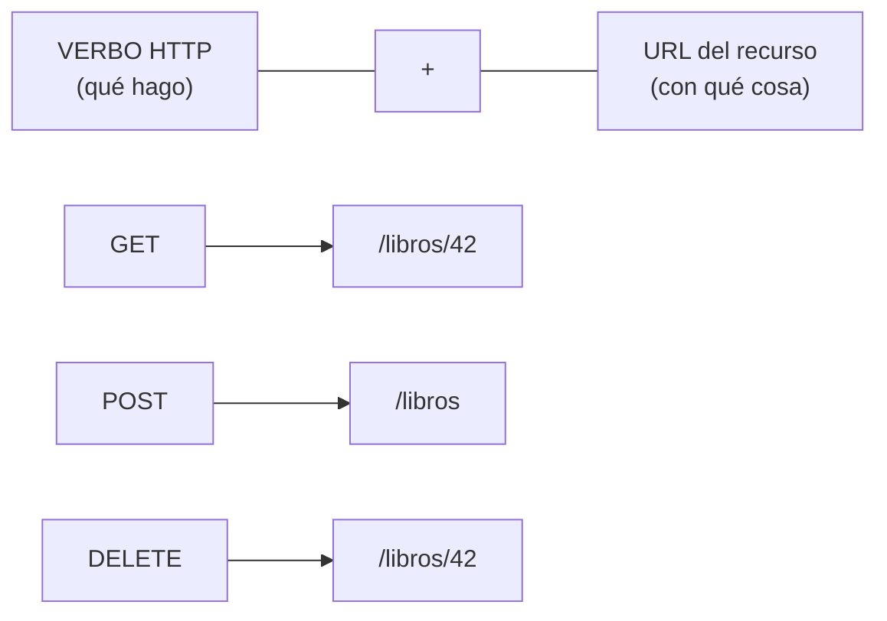

import Reto from "@components/Reto.astro";
import Solucion from "@components/Solucion.astro";
import Quiz from "@components/Quiz.astro";
import CheckDominio from "@components/CheckDominio.astro";
import Nivel from "@components/Nivel.astro";

<Nivel nivel="intermedio" />

## 1. Qué vas a saber hacer

Al terminar, sin IA y sin notas, podrás:

- **O1 — Diseñar** los recursos y endpoints de una API REST a partir de requisitos en lenguaje natural: nombrar recursos como **sustantivos**, mapear operaciones a **verbos HTTP** y elegir el **status code** correcto para cada caso (éxito, error del cliente, error del servidor).
- **O2 — Explicar el trade-off** entre las decisiones de diseño que no tienen una sola respuesta: versionado (URL vs header), paginación (offset vs cursor) e idempotencia de métodos; y justificar tu elección para un contexto dado.
- **O3 — Especificar** un modelo de errores consistente con `problem+json` (RFC 9457) y un contrato **OpenAPI** mínimo, entendiendo por qué el contrato es la fuente de verdad que conecta backend, frontend y tests.

## 2. Por qué importa

> 💰 **Por qué importa:** "diseñar y construir APIs REST" es, año tras año, el skill backend **#1 del mercado** (aparece en torno al 70% de las ofertas). Pero hay una diferencia brutal entre *hacer que un endpoint responda* y *diseñar una API que un equipo pueda consumir sin preguntarte nada*. Lo primero lo hace cualquiera con un tutorial. Lo segundo —elegir el status code correcto, un modelo de errores predecible, paginación que no se cae con un millón de filas, un versionado que no rompe a los clientes— es exactamente lo que un entrevistador usa para separar a un junior de un semi-senior.

Y hay una razón extra para ti como **AI/Automation Engineer**: casi todo lo que vas a construir después —el backend que sirve un RAG, el agente que llama herramientas externas, la automatización que recibe webhooks— **habla REST**. Una API mal diseñada contamina todo lo que la consume. Diseñarla bien una vez te ahorra meses de parches.

Esta lección es de **diseño**: no vas a montar un servidor todavía (eso es [`3.8` FastAPI](/fase-3-backend/3-8-backend-fastapi/)). Vas a aprender a decidir *qué* construir antes de escribir el primer `@app.get`.

## 3. Lo que ya traes (actívalo)

Esta lección se apoya en dos cosas que ya viste:

- **HTTP, de la Fase 0:** request/response, métodos (`GET`/`POST`/...), status codes (2xx/4xx/5xx), headers y body. Una API REST **es** HTTP usado con disciplina. Si "status code" o "header" te suenan borrosos, vuelve a esa lección antes de seguir.
- **Modelado de datos, de [`3.1` SQL y modelado relacional](/fase-3-backend/3-1-sql-modelado-relacional/):** entidades, relaciones 1:N y N:M. Tus **recursos** REST casi siempre nacen de tus **entidades** de datos. Un `libro`, un `préstamo`, un `usuario` son a la vez filas en una tabla y recursos en tu API.

Antes de seguir, responde de memoria:

<Quiz
  question="En HTTP, ¿qué afirmación describe mejor la diferencia entre un método 'seguro' (safe) y uno 'idempotente'?"
  options={[
    "Son sinónimos: ambos significan que el método no cambia datos",
    "Seguro = no modifica el estado del servidor; idempotente = repetir la misma petición deja el servidor en el mismo estado que hacerla una vez",
    "Seguro = requiere autenticación; idempotente = no requiere autenticación",
  ]}
  answer={1}
  explanation="Safe (GET, HEAD) significa que la petición no debería modificar estado. Idempotente significa que repetirla N veces tiene el mismo efecto que hacerla 1 vez (PUT, DELETE lo son; POST no). Todo método seguro es idempotente, pero no al revés: DELETE cambia estado (no es safe) pero borrar dos veces deja igual que borrar una (sí es idempotente). Esta distinción decide qué puede reintentar un cliente sin miedo."
/>

## 4. Diseñar una API, en voz alta

Voy a diseñar una API completa **razonando paso a paso**, como lo haría en una pizarra antes de tocar código. El requisito que me dan es este:

> *"Necesitamos un sistema para una biblioteca: registrar libros, que los socios pidan libros prestados y los devuelvan. Hay que poder listar libros, buscar por título y ver qué préstamos tiene un socio. No se puede prestar un libro que ya está prestado."*

### 4.1 Paso 1 — Encuentra los recursos (los sustantivos)

Mi primera regla: **los recursos son sustantivos, no verbos.** Leo el requisito y subrayo los sustantivos del dominio: *libro, socio, préstamo*. Esos son mis recursos. Cada uno será una **colección** (muchos) con sus **elementos** individuales:

| Recurso | Colección | Elemento |
|---|---|---|
| Libros | `/libros` | `/libros/{id}` |
| Socios | `/socios` | `/socios/{id}` |
| Préstamos | `/prestamos` | `/prestamos/{id}` |

Fíjate en algo crítico: la URL **nunca** dice qué hacer. No es `/crearLibro` ni `/getLibros` ni `/libros/borrar`. La URL identifica **una cosa** (un recurso); el **verbo HTTP** dice qué hacer con ella. Esa separación es la idea central de REST.



### 4.2 Paso 2 — Mapea operaciones a verbos

Ahora tomo cada operación del requisito y le asigno un verbo HTTP. La tabla canónica del CRUD sobre una colección:

| Operación | Verbo + URL | Status éxito | Idempotente |
|---|---|---|---|
| Listar libros | `GET /libros` | `200 OK` | sí (safe) |
| Ver un libro | `GET /libros/{id}` | `200 OK` | sí (safe) |
| Crear un libro | `POST /libros` | `201 Created` + header `Location` | **no** |
| Reemplazar un libro entero | `PUT /libros/{id}` | `200 OK` (o `204`) | sí |
| Modificar campos sueltos | `PATCH /libros/{id}` | `200 OK` | depende |
| Borrar un libro | `DELETE /libros/{id}` | `204 No Content` | sí |

Razono cada elección dudosa en voz alta:

- **`POST` para crear, no `PUT`.** El cliente no sabe el `id` del libro nuevo (lo asigna el servidor). `POST /libros` significa "crea un libro dentro de esta colección"; la respuesta `201 Created` incluye un header `Location: /libros/42` que dice dónde quedó. `POST` **no es idempotente**: si lo reenvías por un timeout, creas dos libros. (Cómo blindar eso es tema de [`3.14` Idempotencia](/fase-3-backend/3-14-idempotencia-resiliencia/).)
- **`PUT` vs `PATCH`.** `PUT /libros/42` reemplaza el recurso **completo** (mandas todos los campos); repetirlo deja el mismo resultado, por eso es idempotente. `PATCH` manda **solo lo que cambia** (`{"stock": 3}`); su idempotencia "depende" de cómo lo definas (un PATCH que dice "súmale 1 al stock" **no** es idempotente).
- **`DELETE` da `204 No Content`.** Borraste; no hay cuerpo que devolver. Y es idempotente: borrar un libro ya borrado puede dar `204` otra vez (o `404` si prefieres ser estricto), pero el estado final es el mismo.

### 4.3 Paso 3 — Las acciones que no son CRUD: "prestar" y "devolver"

Aquí llega la parte que tumba a la mayoría. *"Prestar un libro"* **no es** un verbo CRUD. La tentación del principiante es inventar `POST /libros/42/prestar`. Eso vuelve a meter un verbo en la URL.

El truco REST: **convierte la acción en un recurso.** "Prestar" crea un **préstamo**. Devolver, lo cierra. Entonces:

```http
POST /prestamos
Content-Type: application/json

{ "libro_id": 42, "socio_id": 7 }
```

- Si el libro está disponible → `201 Created` con el préstamo nuevo y su `Location: /prestamos/100`.
- Si el libro ya está prestado → **`409 Conflict`**. No es `400` (la petición está bien formada) ni `404` (el libro existe): es un conflicto con el **estado actual** del recurso. Elegir `409` aquí es justo el tipo de decisión que demuestra que entiendes los status codes.

Devolver el libro es cambiar el estado del préstamo:

```http
PATCH /prestamos/100
{ "estado": "devuelto" }
```

> Regla práctica: **si te descubres poniendo un verbo en la URL, casi siempre hay un recurso escondido esperando nacer.** "Activar cuenta" → un recurso `activacion`. "Buscar" → un parámetro de query, no un endpoint `/buscar`.

### 4.4 Paso 4 — Buscar, filtrar, ordenar y paginar

El requisito pide *"buscar libros por título"* y *"listar"*. Listar un millón de libros en una sola respuesta es un suicidio de memoria y latencia. Todo esto vive en la **query string** de `GET /libros`, no en URLs nuevas:

```http
GET /libros?titulo=quijote&genero=novela&sort=-anio&limit=20
```

- **Filtrado:** `?genero=novela&disponible=true`.
- **Búsqueda:** `?titulo=quijote` (coincidencia parcial; defínelo en tu contrato).
- **Ordenamiento:** `?sort=-anio` (el `-` = descendente; convención común).
- **Paginación:** y aquí hay una **decisión de diseño con trade-off real**, paginación **offset** vs **cursor**:

| | **Offset** (`?page=3&limit=20` o `?offset=40`) | **Cursor / keyset** (`?limit=20&after=<token>`) |
|---|---|---|
| Cómo funciona | "salta 40 filas, dame 20" | "dame 20 después de este id/fecha" |
| Saltar a una página arbitraria | Fácil (página 7 directo) | No se puede (solo siguiente/anterior) |
| Rendimiento en páginas profundas | **Malo**: la base recorre y descarta las 40.000 filas saltadas | **Bueno**: usa el índice, no recorre lo descartado |
| Estabilidad si entran filas nuevas | **Frágil**: una inserción corre todo y ves duplicados o saltos | **Estable**: el cursor ancla a un punto fijo |

Mi criterio: **offset** para un panel de administración con pocos datos donde "ir a la página 5" importa; **cursor** para feeds grandes, scroll infinito o APIs públicas con millones de filas (es lo que usan GitHub, Stripe, Slack). Esto conecta con lo que viste de índices en [`3.3` PostgreSQL](/fase-3-backend/3-3-postgresql-a-fondo/): el cursor es rápido **porque** se apoya en un índice.

### 4.5 Paso 5 — El modelo de errores: consistente y estándar

Una API que devuelve los errores de cualquier forma (a veces `{"error": "..."}`, a veces texto plano, a veces un 200 con `{"ok": false}`) es una pesadilla para quien la consume. El estándar moderno es **`problem+json` (RFC 9457)**: un cuerpo JSON con forma fija y el header `Content-Type: application/problem+json`.

```http
HTTP/1.1 409 Conflict
Content-Type: application/problem+json

{
  "type": "https://api.biblioteca.cl/errors/libro-no-disponible",
  "title": "El libro no está disponible",
  "status": 409,
  "detail": "El libro 42 ya tiene un préstamo activo (préstamo 87).",
  "instance": "/prestamos"
}
```

Los cinco campos estándar:

- **`type`** — URI que identifica el *tipo* de problema (es el identificador estable para máquinas; si no lo pones, vale `"about:blank"`).
- **`title`** — resumen humano corto y estable del tipo de error.
- **`status`** — el código HTTP, repetido en el cuerpo por comodidad.
- **`detail`** — explicación de *esta* ocurrencia concreta.
- **`instance`** — URI de la ocurrencia específica.

Puedes **extender** el objeto con campos propios (p. ej. `"campos_invalidos": [...]`). La gracia: cualquier cliente sabe leer estos errores sin documentación extra, y tú dejas de inventar un formato distinto por endpoint.

:::tip[Hilo de seguridad]
Un `detail` que dice `"contraseña incorrecta para el usuario admin@x.cl"` le confirma a un atacante que ese usuario existe. En errores de autenticación, sé **vago a propósito**: `"credenciales inválidas"`. Y **nunca** dejes que un `500` devuelva el stack trace al cliente: eso filtra rutas internas, versiones y a veces secretos. Más sobre esto en [`3.13` OWASP](/fase-3-backend/3-13-owasp-top10-web/).
:::

### 4.6 Paso 6 — Versionado

El día que cambies la forma de una respuesta, romperás a todos los clientes que ya la consumen, salvo que **versiones** la API. Tres enfoques:

| Enfoque | Ejemplo | A favor | En contra |
|---|---|---|---|
| **En la URL** | `GET /v1/libros` | Visible, trivial de probar en un navegador/curl, fácil de rutear | "Impuro" para los puristas REST (la URL de un recurso no debería cambiar) |
| **En un header** | `Accept: application/vnd.biblioteca.v1+json` | Mantiene URLs limpias y estables | Invisible, difícil de probar a mano, más fácil de olvidar |
| **En query param** | `GET /libros?version=1` | Simple | Se mezcla con filtros; se cachea raro |

En la práctica, **el versionado en la URL (`/v1`) gana en la mayoría de los casos** por una razón pragmática: es obvio, se prueba con un clic y todo el mundo lo entiende. Los puristas prefieren el header; el mercado mayoritariamente usa la URL (GitHub, Stripe la exponen así). Lo importante no es cuál eliges, sino que **decidas conscientemente y lo dejes escrito en un ADR** (esto es spec-driven dev: la decisión vive documentada, no en la cabeza de alguien).

### 4.7 Paso 7 — El contrato: OpenAPI

Hasta aquí diseñé en una tabla. Pero el frontend, los tests y la documentación necesitan una **fuente de verdad única y legible por máquinas**: el contrato **OpenAPI** (antes "Swagger"). Es un archivo YAML/JSON que describe cada endpoint, sus parámetros, sus cuerpos y sus respuestas. Un fragmento para nuestro `POST /prestamos`:

```yaml
openapi: 3.1.0
info:
  title: API Biblioteca
  version: "1.0.0"
paths:
  /prestamos:
    post:
      summary: Crea un préstamo (presta un libro a un socio)
      requestBody:
        required: true
        content:
          application/json:
            schema:
              type: object
              required: [libro_id, socio_id]
              properties:
                libro_id: { type: integer }
                socio_id: { type: integer }
      responses:
        "201":
          description: Préstamo creado
          headers:
            Location:
              schema: { type: string }
          content:
            application/json:
              schema: { $ref: "#/components/schemas/Prestamo" }
        "409":
          description: El libro ya está prestado
          content:
            application/problem+json:
              schema: { $ref: "#/components/schemas/Problem" }
```

Tienes dos formas de trabajar con esto:

- **Contract-first:** escribes el OpenAPI a mano *antes* de codear. El contrato es el acuerdo; el frontend puede empezar con datos falsos (mocks) sin esperar al backend.
- **Code-first:** escribes el código y el framework **genera** el OpenAPI. Es lo que hace **FastAPI** (que verás en [`3.8`](/fase-3-backend/3-8-backend-fastapi/)): emite OpenAPI 3.1 automáticamente y te da una UI interactiva (Swagger UI) gratis.

> La versión más reciente del estándar es **OpenAPI 3.2.0** (sept. 2025), sin cambios que rompan respecto a 3.1; FastAPI emite 3.1. Para diseñar, 3.1 es base más que suficiente.

De cualquier modo, el principio es el mismo y es un **hilo transversal del curso**: la API tiene un contrato escrito y versionado, no una forma que se descubre llamándola.

## 5. Errores de concepto que debes evitar

:::caution[Podrías pensar X… y está mal]
**"Pongo el verbo en la URL: `/getLibros`, `/crearUsuario`, `/libros/42/borrar`."**
Mal. La URL nombra **recursos** (sustantivos); el verbo HTTP dice la acción. `GET /libros`, `POST /libros`, `DELETE /libros/42`. Si ves un verbo en una ruta, casi siempre falta modelar un recurso.

**"Devuelvo `200 OK` siempre y meto el error en el cuerpo (`{"ok": false}`)."**
Mal, y peligroso. El status code es la **primera señal** que leen los proxys, los caches, los monitores y el código del cliente. Un error con `200` engaña a tus métricas (parece que todo va bien) y obliga a cada cliente a parsear el cuerpo para saber si falló. Usa `4xx` para errores del cliente y `5xx` para errores del servidor.

**"`404` y `400` son lo mismo, total ambos son errores."**
No. `400 Bad Request` = la petición está mal formada (JSON inválido, falta un campo). `404 Not Found` = la petición está bien pero el recurso no existe. `409 Conflict` = la petición es válida pero choca con el estado actual (libro ya prestado). `422 Unprocessable Content` = sintaxis correcta pero la validación de negocio falla. Elegir el código correcto **es** el diseño.

**"Versionar es opcional, ya lo agregaré cuando lo necesite."**
Cuando lo necesites, ya tendrás clientes en producción y cambiar la forma de una respuesta los romperá a todos a la vez. El `/v1` cuesta casi nada el día uno y te salva después.

**"REST y CRUD son sinónimos."**
CRUD (create/read/update/delete) es solo el caso fácil. Acciones como "prestar", "publicar", "cancelar" **no** son CRUD: se modelan como **nuevos recursos** o como cambios de estado vía `PATCH`, no como verbos en la URL.
:::

## 6. Práctica con andamiaje

Antes del ejercicio sin red, calienta con dos micro-retos. La idea es **predecir antes de verificar** (pensar primero, igual que el Primero-Sin-IA).

**6.1 — Predice el status code.** Para cada situación, di el código *antes* de abrir la respuesta. Tapa la columna derecha:

| Situación | Código correcto |
|---|---|
| `GET /libros/9999` y el libro 9999 no existe | `404 Not Found` |
| `POST /libros` con un JSON al que le falta el campo `titulo` | `400 Bad Request` (o `422` si el cuerpo es sintácticamente válido pero falla validación) |
| `POST /prestamos` de un libro que ya está prestado | `409 Conflict` |
| `DELETE /libros/42` exitoso, sin cuerpo que devolver | `204 No Content` |
| `GET /libros` pero el usuario no envió token de auth | `401 Unauthorized` |
| `DELETE /libros/42` pero este usuario no tiene permiso | `403 Forbidden` |
| La base de datos está caída y la query revienta | `500 Internal Server Error` |

Si fallaste más de dos, no sigas: relee la sección 4.2 y 4.5. Estos siete códigos cubren el 90% de tu día.

**6.2 — Arregla la ruta (faded).** Cada fila tiene un diseño malo. Complétalo con la versión REST correcta. La primera viene resuelta:

| Diseño malo | Diseño REST correcto |
|---|---|
| `GET /obtenerTodosLosLibros` | `GET /libros` ✅ |
| `POST /libros/crear` | `POST /libros` |
| `GET /libros/buscar?q=quijote` | `GET /libros?titulo=quijote` |
| `POST /libros/42/marcarPrestado` | `POST /prestamos` con `{"libro_id": 42, ...}` |
| `GET /usuarios/7/sus-prestamos` | `GET /socios/7/prestamos` (anidar el recurso hijo) |

## 7. Ejercicios Primero-Sin-IA

Ahora sin red. Resuelve **a mano** dentro del timebox, después valida con la documentación oficial, y **solo al final** usa una IA para *revisar* tu razonamiento (no para generarlo).

<Reto title="Diseña la API de un sistema de eventos desde requisitos" timebox="40 min">

A partir de un requisito en prosa, produce el **diseño completo** de una API REST (recursos, endpoints, status codes, modelo de errores, paginación y una decisión de versionado justificada), más un fragmento de contrato **OpenAPI**. Es un ejercicio de **diseño en papel/markdown**: no se programa ningún servidor.

El requisito y los criterios de "hecho" están en `ejercicios/fase-3/disenar-api-rest-eventos/`. Entrega tu `diseno-api.md` y tu `openapi.yaml` en esa carpeta.

</Reto>

<Solucion title="Pista (ábrela solo si te trabaste tras intentarlo)">

Empieza subrayando los **sustantivos** del requisito: esos son tus recursos. Para cada uno, escribe la tabla CRUD (`GET`/`POST`/`PUT`/`PATCH`/`DELETE` + status). Después busca las **acciones que no son CRUD** ("inscribirse", "cancelar"): cada una es un recurso escondido o un cambio de estado, nunca un verbo en la URL. Para "evento lleno", piensa qué status code refleja un choque con el **estado actual** (no es 400 ni 404). Para la paginación, decide offset o cursor según si la lista puede crecer mucho, y **escribe por qué**. No necesitas implementar nada: necesitas decidir y defender.

</Solucion>

<Reto title="Construye respuestas de error problem+json (RFC 9457)" timebox="35 min">

Implementa, en **Python puro y sin frameworks**, dos funciones: una que construya un cuerpo de error `problem+json` válido según RFC 9457, y otra que elija el status code correcto para una situación dada. Hay tests con `pytest` que verifican la forma del problema y los códigos.

Starter, tests y criterios en `ejercicios/fase-3/problem-details-rfc9457/`. Corre `uv run pytest` (o `pytest`) hasta que pase en verde, y añade al menos un caso de prueba tuyo.

</Reto>

<Solucion title="Pista (ábrela solo si te trabaste tras intentarlo)">

`problem+json` es solo un diccionario con forma fija: `type`, `title`, `status`, `detail`, `instance`. Los campos opcionales **no deben aparecer** si no los pasas (no pongas `"detail": null`): constrúyelo agregando solo lo que tienes. Para el `type` ausente, el estándar dice que vale `"about:blank"`. Para elegir el status: pregúntate primero "¿el problema es del cliente (4xx) o del servidor (5xx)?", y dentro de los 4xx, "¿está mal formada (400), no existe (404), no autenticado (401), sin permiso (403) o choca con el estado (409)?". Mira la sección 4.5 y 4.2 antes de la solución de referencia.

</Solucion>

## 8. Check de dominio

<CheckDominio items={[
  "Explicar, sin notas, por qué la URL lleva sustantivos y el verbo HTTP la acción.",
  "Modelar una acción que NO es CRUD (ej. 'prestar', 'publicar') sin meter un verbo en la URL.",
  "Decir de memoria qué significan 200, 201, 204, 400, 401, 403, 404, 409 y 500, y dar un ejemplo de cada uno.",
  "Explicar la diferencia entre safe e idempotente, y clasificar GET/POST/PUT/PATCH/DELETE.",
  "Defender cuándo usar paginación offset vs cursor con un argumento de rendimiento.",
  "Escribir un cuerpo problem+json con sus cinco campos y nombrar el Content-Type correcto.",
  "Explicar qué es un contrato OpenAPI y la diferencia entre contract-first y code-first.",
]} />

Y una última de active recall:

<Quiz
  question="Un cliente hace POST /pagos, el servidor cobra pero la respuesta se pierde por un timeout. El cliente reintenta el mismo POST. ¿Cuál es el problema de fondo y qué propiedad lo explica?"
  options={[
    "Ninguno: POST es idempotente, así que reintentar es seguro",
    "Se puede cobrar dos veces, porque POST NO es idempotente; reintentarlo crea un segundo recurso (pago). Hay que blindarlo con una idempotency key",
    "El servidor devolverá 409 automáticamente en el segundo intento",
  ]}
  answer={1}
  explanation="POST no es idempotente: cada llamada crea un recurso nuevo, así que un reintento puede cobrar dos veces. El status code por sí solo no te protege. La solución estándar es una idempotency key (un identificador único que el cliente manda y el servidor recuerda) — justo lo que verás en 3.14 Idempotencia y resiliencia. Reconocer este peligro al diseñar es señal de criterio semi-senior."
/>

## 9. Recursos (documentación oficial primero)

- **MDN — HTTP** (request methods, status codes): la referencia más legible para empezar. `developer.mozilla.org/en-US/docs/Web/HTTP`
- **RFC 9110 — HTTP Semantics**: la fuente normativa de métodos, idempotencia y status codes. `rfc-editor.org/rfc/rfc9110`
- **RFC 9457 — Problem Details for HTTP APIs**: el estándar de `problem+json` (obsoleta la RFC 7807). `rfc-editor.org/rfc/rfc9457`
- **OpenAPI Specification** (3.1 / 3.2): el formato del contrato. `spec.openapis.org`
- **Swagger UI / editor**: para visualizar y probar un OpenAPI. `swagger.io/tools`

## 10. Conexión con el capstone

El **[Capstone F3 — API de producción](/fase-3-backend/proyecto/)** es, literalmente, la API que diseñas aquí, ya implementada en FastAPI con auth, Postgres y tests. Lo que esta lección te deja listo para el proyecto:

- El **diseño de recursos y endpoints** que harás en el ejercicio de eventos es el plano de tu capstone; cámbiale el dominio y ya tienes el esqueleto.
- El **modelo de errores `problem+json`** del segundo ejercicio es el manejador de errores global que tu API debe tener (un `500` que filtra stack traces reprueba el Definition of Done por seguridad).
- La **decisión de versionado** (URL vs header) va escrita en un **ADR** del repo: es uno de los trade-offs defendibles que el capstone exige.
- El **contrato OpenAPI** es un entregable de primera clase del proyecto; en [`3.8`](/fase-3-backend/3-8-backend-fastapi/) lo obtendrás casi gratis, pero solo será bueno si el diseño de abajo lo es.

## 11. Reflexión y repaso espaciado

Cierra escribiendo dos o tres frases: **¿cuál fue la decisión de diseño que más te costó justificar —el status code de un caso raro, offset vs cursor, dónde versionar— y por qué no tenía una respuesta única?** Identificar dónde el diseño es *trade-off* y no *receta* es exactamente el músculo que un entrevistador busca.

Gancho de **spaced repetition**:

- **Mañana:** sin mirar, escribe de memoria la tabla CRUD completa (verbo + URL + status éxito + idempotente) para un recurso `/articulos`, y modela la acción "publicar un artículo" sin usar un verbo en la URL.
- **En 3 días:** toma cualquier API pública que uses (GitHub, Stripe, la de tu banco si la conoces) y **audítala**: ¿usa sustantivos? ¿qué status codes devuelve? ¿pagina con offset o cursor? ¿cómo versiona? Escribe tres aciertos y un error de diseño que detectes.
