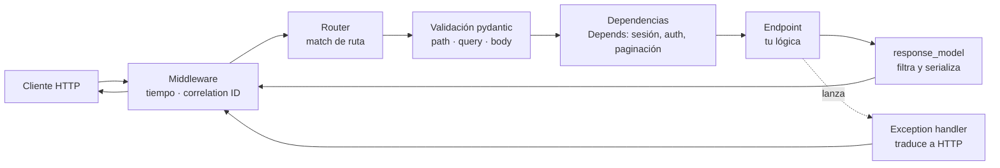

import Reto from "@components/Reto.astro";
import Solucion from "@components/Solucion.astro";
import Quiz from "@components/Quiz.astro";
import CheckDominio from "@components/CheckDominio.astro";
import Nivel from "@components/Nivel.astro";

<Nivel nivel="intermedio" />

Hasta ahora diseñaste tablas, escribiste queries y modelaste recursos REST en papel. Pero un cliente —un navegador, una app móvil, otro servicio, o un agente de IA— no habla SQL ni lee tu diagrama de recursos: habla **HTTP**. El backend es la pieza que recibe un request HTTP, decide qué hacer, toca la base de datos y responde. **FastAPI** es el framework con el que vas a construir ese backend durante el resto del curso. No es un framework más: es el estándar de facto para servir modelos y sistemas RAG en producción, y por eso es **el** backend troncal de este curso y tu puente directo a la Fase 6. Lo que aprendas aquí lo vas a reusar en cada capstone que toque IA.

:::tip[Si ya tocaste FastAPI (o Flask/Express/NestJS)]
¿Ya escribiste un `@app.get(...)` o montaste un endpoint? Úsalo como diagnóstico, no como excusa para saltar. La trampa del que "ya sabe FastAPI" es copiar el patrón sin entender la maquinaria: confunde `async def` con "más rápido", devuelve el modelo de base de datos directo (y filtra un `password_hash`), o llena el endpoint de `HTTPException` acoplando la lógica al transporte. Si puedes, sin notas: (1) explicar **cuándo** un endpoint debe ser `async def` y cuándo `def`, y por qué importa; (2) decir qué hace `response_model` además de documentar; (3) explicar qué resuelve `Depends` que no resolverías pasando argumentos a mano. Si dudas en cualquiera, lee desde la sección 4. Si no, salta a los ejercicios (sección 7) y mídete.
:::

## 1. Qué vas a saber hacer

Al terminar, sin IA y sin notas, podrás:

- **O1 — Implementar una API FastAPI** con endpoints que reciben datos por path, query y body, validan con modelos pydantic, devuelven un `response_model` explícito con el status code correcto y manejan el caso "no existe" con `HTTPException`.
- **O2 — Inyectar dependencias con `Depends`** (estilo `Annotated`) para compartir lógica reutilizable —sesión de base de datos, paginación, autenticación— y explicar por qué eso es más testeable y limpio que pasar argumentos a mano.
- **O3 — Explicar el trade-off `async` vs `def`** en FastAPI y decidir correctamente cuál usar según el tipo de trabajo (I/O concurrente vs. código bloqueante), conectándolo con el costo/latencia de llamar a un LLM.

## 2. Por qué importa (el dinero está aquí)

> 💰 **Por qué importa:** REST API es el skill #1 del mercado (alrededor del 70% de las ofertas lo piden) y el backend es donde vive la lógica de las apps de IA que quieres construir. Cuando sirves un modelo, un pipeline RAG o un agente, lo expones como una API HTTP — y en el ecosistema Python, esa API casi siempre es FastAPI. Saber montar un endpoint robusto, tipado y documentado no es "un framework más en el CV": es la herramienta con la que entregas todo lo demás. Un junior pega endpoints que funcionan en su máquina. Un semi-senior entrega un backend que valida la entrada, no filtra datos, no se cuelga bajo carga y se documenta solo.

Tres razones hacen de esta sub-unidad la columna vertebral de la Fase 3:

1. **Es el puente literal a la IA.** En la Fase 6 vas a envolver un modelo o un pipeline RAG detrás de un endpoint. Ese endpoint será FastAPI. Llamar a un LLM es una operación de I/O lenta (cientos de milisegundos, a veces segundos); FastAPI con `async` te deja atender otros requests **mientras esperas** esa respuesta, sin levantar más servidores. Ese es el hilo de **costo/latencia** que arrastras desde [`3.5`](/fase-3-backend/3-5-orms-problema-n1/) y que dominará la Fase 6.
2. **La validación de entrada es tu primera defensa de seguridad.** FastAPI valida cada request contra tus modelos pydantic *antes* de que tu código lo toque. Eso no es comodidad: es la primera línea contra datos malformados e inyección, el inicio del hilo **OWASP** que formalizas en [`3.13`](/fase-3-backend/3-13-owasp-top10-web/). "Nunca confíes en la entrada del cliente" empieza aquí.
3. **La documentación gratis es spec-driven real.** FastAPI genera tu spec OpenAPI a partir de tus tipos. La API que diseñaste a mano en [`3.7`](/fase-3-backend/3-7-diseno-apis-rest/) se vuelve un contrato vivo en `/docs`, sin escribir YAML. Eso te ahorra el documento que nadie mantiene y te da el contrato que el frontend de la Fase 4 va a consumir.

## 3. Lo que ya traes (actívalo)

Esta lección no parte de cero: ensambla casi toda la Fase 3 y la 1. Reúsalo antes de seguir.

- De [`3.7` Diseño de APIs REST](/fase-3-backend/3-7-diseno-apis-rest/): recursos, verbos, status codes, paginación y errores. FastAPI es la **implementación** de ese diseño; el contrato que pensaste ahí es el que vas a codear aquí.
- De [`1.4` Type hints + pydantic](/fase-1-lenguajes/1-4-type-hints-mypy-pydantic/): los modelos pydantic son el corazón de FastAPI. Si un `BaseModel` con `Field` te suena, ya tienes media lección.
- De [`1.3` Python asíncrono](/fase-1-lenguajes/1-3-python-asincrono/): `async`/`await` y el event loop. Aquí lo aplicas de verdad, con consecuencias medibles.
- De [`3.5` ORMs](/fase-3-backend/3-5-orms-problema-n1/): la `Session` de SQLAlchemy. La vas a inyectar como dependencia, no a crearla a mano en cada endpoint.

Antes de seguir, responde de memoria:

<Quiz
  question="Un cliente hace POST /pedidos con un body JSON donde falta el campo obligatorio `cliente_id`. Tienes un modelo pydantic que lo declara requerido. ¿Qué responde FastAPI y quién detiene el request?"
  options={[
    "Llega a tu función de endpoint con cliente_id en None y tú decides qué hacer",
    "FastAPI lo rechaza ANTES de tu función con un 422 Unprocessable Entity y un detalle de qué campo falló",
    "FastAPI responde 500 Internal Server Error porque el JSON está incompleto",
  ]}
  answer={1}
  explanation="FastAPI valida el body contra tu modelo pydantic en el borde, antes de ejecutar tu código. Si falla, responde 422 con la ruta exacta del error. Tu función solo corre con datos ya válidos: por eso no necesitas un muro de ifs defensivos al inicio de cada endpoint."
/>

## 4. Cómo se construye una API FastAPI, en voz alta

Voy a razonar **paso a paso**, construyendo un catálogo de libros desde el endpoint más tonto hasta una estructura que escala. Abre una terminal y sígueme: la idea es que veas *por qué* cada pieza aparece, no que memorices la sintaxis.

Primero, instala y arranca:

```bash
uv add "fastapi[standard]"        # incluye uvicorn y el CLI `fastapi`
uv run fastapi dev main.py        # servidor de desarrollo con recarga automática
```

`fastapi dev` es el CLI moderno (viene con `fastapi[standard]`); por debajo levanta **uvicorn**, el servidor ASGI que ejecuta tu app. La alternativa explícita es `uv run uvicorn main:app --reload`.

### 4.1 Qué es FastAPI y por qué este y no otro

FastAPI es un framework para construir APIs HTTP en Python sobre tres pilares que lo distinguen:

- **Tipos como contrato.** Declaras los tipos de tus parámetros y cuerpos con type hints de Python; FastAPI los usa para **validar** la entrada, **serializar** la salida y **documentar** todo. Una sola fuente de verdad: tus anotaciones.
- **Async nativo.** Está construido sobre ASGI, así que puede atender muchos requests concurrentes que esperan I/O (base de datos, otra API, un LLM) sin bloquearse. Esto es lo que lo hace el estándar para servir IA.
- **OpenAPI automático.** Genera la spec OpenAPI y dos UIs interactivas (`/docs` y `/redoc`) a partir de tu código. La documentación nunca se desactualiza porque *es* tu código.

### 4.2 El endpoint más simple

```python
# main.py
from fastapi import FastAPI

app = FastAPI(title="Catálogo de libros")


@app.get("/health")
async def health() -> dict[str, str]:
    return {"status": "ok"}
```

`app` es la aplicación. El decorador `@app.get("/health")` registra una **operación de path**: cuando llegue un `GET /health`, FastAPI ejecuta `health()` y serializa el dict a JSON. Anda a `http://127.0.0.1:8000/health` y luego a `http://127.0.0.1:8000/docs`: ahí ya tienes tu endpoint documentado y probable desde el navegador. No escribiste una línea de documentación.

### 4.3 Path parameters: la URL trae datos

Un recurso individual se identifica en la URL. FastAPI extrae y **valida** ese fragmento según el tipo que declares:

```python
@app.get("/libros/{libro_id}")
async def obtener_libro(libro_id: int):
    return {"libro_id": libro_id}
```

`{libro_id}` en la ruta se mapea al parámetro `libro_id: int`. La clave es el `: int`: si alguien pide `/libros/abc`, FastAPI responde **422** automáticamente, sin que tú escribas nada. Si pide `/libros/42`, tu función recibe el entero `42`, ya convertido. El tipo no es decoración: es validación y conversión.

### 4.4 Query parameters: filtros y opciones

Lo que va después del `?` en la URL son query params. Cualquier parámetro de la función que **no** esté en la ruta, FastAPI lo busca en el query string. Para validarlos con reglas, usamos `Annotated` con `Query`:

```python
from typing import Annotated
from fastapi import Query


@app.get("/libros")
async def listar_libros(
    autor: str | None = None,
    limite: Annotated[int, Query(ge=1, le=100)] = 20,
):
    # `autor` es opcional (default None); `limite` por defecto 20,
    # y FastAPI rechaza con 422 cualquier valor fuera de [1, 100].
    return {"autor": autor, "limite": limite}
```

El estilo moderno (FastAPI 0.95+) es `Annotated[int, Query(...)]`: el tipo va primero, los metadatos de validación dentro de `Query`. `ge=1, le=100` significa "greater-or-equal 1, less-or-equal 100" — un cliente no puede pedir 10.000 resultados de una y tumbarte la base. Defender los límites de paginación es una decisión de costo/latencia *y* de seguridad.

### 4.5 Request body: modelos pydantic de entrada

Para crear o actualizar, el cliente manda un cuerpo JSON. Lo describes con un modelo pydantic, y FastAPI lo valida entero antes de ejecutar tu código:

```python
from pydantic import BaseModel, Field


class LibroCrear(BaseModel):
    titulo: str = Field(min_length=1, max_length=200)
    autor: str
    anio: int | None = None
```

Cualquier parámetro de tu función tipado con un `BaseModel` lo toma del body. Si el JSON no calza (falta `titulo`, `anio` no es entero, `titulo` viene vacío), el cliente recibe un 422 con el detalle exacto. Tu función nunca ve datos inválidos.

### 4.6 Response model y status code: controla lo que sale

Igual de importante que validar lo que entra es controlar lo que sale. **No devuelvas tu objeto de base de datos directo**: puede arrastrar campos que el cliente no debe ver. Declara un modelo de salida explícito:

```python
from fastapi import status


class LibroPublico(BaseModel):
    id: int
    titulo: str
    autor: str
    anio: int | None = None


@app.post("/libros", response_model=LibroPublico, status_code=status.HTTP_201_CREATED)
async def crear_libro(datos: LibroCrear) -> LibroPublico:
    nuevo = repositorio.crear(datos)   # devuelve un objeto con id, fecha_creacion, etc.
    return nuevo
```

Dos cosas pasan aquí:

- `response_model=LibroPublico` **filtra** la respuesta: aunque `nuevo` tenga 15 campos (incluido, digamos, un `creado_por_ip`), el cliente solo recibe los 4 declarados en `LibroPublico`. Ese filtrado es una barrera de seguridad: lo que no está en el modelo de salida, no se fuga.
- `status_code=status.HTTP_201_CREATED` devuelve **201**, no el 200 por defecto. Crear un recurso es un 201 — exactamente lo que diseñaste en [`3.7`](/fase-3-backend/3-7-diseno-apis-rest/).

### 4.7 Errores esperados: `HTTPException`

¿Qué pasa si piden un libro que no existe? No es un error de tu código: es un caso de negocio legítimo. Lo señalas lanzando `HTTPException`:

```python
from fastapi import HTTPException


@app.get("/libros/{libro_id}", response_model=LibroPublico)
async def obtener_libro(libro_id: int):
    libro = repositorio.obtener(libro_id)
    if libro is None:
        raise HTTPException(status_code=404, detail="Libro no encontrado")
    return libro
```

`raise HTTPException(404, ...)` corta la ejecución y FastAPI responde `{"detail": "Libro no encontrado"}` con status 404. La diferencia con un `return {"error": ...}` es enorme: el status code 404 es lo que el cliente HTTP (y el frontend, y otro servicio) usa para decidir qué hacer. Un error que devuelve 200 es un error que nadie detecta.

### 4.8 Inyección de dependencias: `Depends`

Aquí está la pieza que separa una API de juguete de una real. Casi todo endpoint necesita lo mismo: una sesión de base de datos, parámetros de paginación, el usuario autenticado. Repetir ese código en cada función es frágil y no se testea. FastAPI lo resuelve con **dependencias**: funciones que FastAPI ejecuta por ti y cuyo resultado *inyecta* en tu endpoint.

```python
from typing import Annotated
from fastapi import Depends, Query


def parametros_paginacion(
    saltar: Annotated[int, Query(ge=0)] = 0,
    limite: Annotated[int, Query(ge=1, le=100)] = 20,
) -> dict[str, int]:
    return {"saltar": saltar, "limite": limite}


# Atajo reutilizable: un alias de tipo con la dependencia adentro.
Paginacion = Annotated[dict[str, int], Depends(parametros_paginacion)]


@app.get("/libros", response_model=list[LibroPublico])
async def listar_libros(paginacion: Paginacion):
    return repositorio.listar(saltar=paginacion["saltar"], limite=paginacion["limite"])
```

Cuando llega un request a `/libros`, FastAPI ve `Paginacion`, ejecuta `parametros_paginacion` (leyendo `saltar` y `limite` del query string, ya validados), y le pasa el resultado a tu endpoint. El patrón `Paginacion = Annotated[..., Depends(...)]` te deja **reusar** esa dependencia en diez endpoints escribiendo `paginacion: Paginacion` en cada uno.

El caso estrella es la **sesión de base de datos**, con una dependencia que usa `yield` para limpiar siempre (incluso si el endpoint falla):

```python
from sqlalchemy.orm import Session


def get_session():
    with Session(engine) as session:
        yield session       # FastAPI entrega la sesión; el bloque `with` la cierra al terminar


SessionDep = Annotated[Session, Depends(get_session)]


@app.get("/libros/{libro_id}", response_model=LibroPublico)
async def obtener_libro(libro_id: int, session: SessionDep):
    libro = session.get(Libro, libro_id)
    if libro is None:
        raise HTTPException(status_code=404, detail="Libro no encontrado")
    return libro
```

¿Por qué esto es mejor que crear la sesión a mano dentro del endpoint? Porque en los tests puedes **sustituir** la dependencia (`app.dependency_overrides[get_session] = ...`) por una sesión de prueba sin tocar el endpoint. La inyección de dependencias es lo que hace tu backend testeable — el hilo de **testing** que vienes tejiendo desde la Fase 2.

### 4.9 `async def` vs `def`: el trade-off que casi todos malentienden

FastAPI acepta endpoints `async def` y `def` normales. La diferencia **no** es velocidad bruta:

- Usa **`async def`** cuando dentro vas a `await` algo que es I/O no bloqueante: una llamada HTTP con `httpx.AsyncClient`, una query con un driver async (`asyncpg`), una llamada a un LLM con su SDK async. Mientras esperas, el event loop atiende **otros** requests. Esto es lo que te deja servir IA con un solo proceso aguantando cientos de conexiones lentas.
- Usa **`def`** normal cuando tu código es **bloqueante**: una query con SQLAlchemy síncrono, una librería que no es async, cómputo pesado. FastAPI lo ejecuta automáticamente en un **threadpool**, así no congela el event loop.

El error mortal: poner `async def` y dentro llamar código bloqueante (un `requests.get`, un `time.sleep`, una query ORM síncrona). Eso **bloquea el event loop entero** y todos los demás requests se congelan — tu servidor "rápido" pasa a ser más lento que uno síncrono. Regla simple: si no vas a `await` nada async adentro, usa `def`.

```python
import httpx


# Correcto: I/O async esperada con await → async def
@app.get("/clima/{ciudad}")
async def clima(ciudad: str):
    async with httpx.AsyncClient() as cliente:
        respuesta = await cliente.get(f"https://api.ejemplo/clima?q={ciudad}")
    return respuesta.json()


# Correcto: trabajo bloqueante (CPU o lib síncrona) → def normal, va al threadpool
@app.get("/reporte")
def generar_reporte():
    return calculo_pesado_y_sincrono()
```

Cuando llegues a la Fase 6, este trade-off será dinero: un endpoint que llama a un LLM debe ser `async` y `await` el SDK async, o un puñado de usuarios concurrentes te obligará a pagar más servidores de los necesarios.

### 4.10 Background tasks: responde ya, trabaja después

A veces hay que hacer algo *después* de responder, que no debe hacer esperar al cliente: enviar un email de confirmación, escribir a un log de auditoría, invalidar un cache. Para eso están las `BackgroundTasks`:

```python
from fastapi import BackgroundTasks


def registrar_auditoria(mensaje: str) -> None:
    with open("audit.log", "a", encoding="utf-8") as f:
        f.write(mensaje + "\n")


@app.post("/libros", response_model=LibroPublico, status_code=201)
async def crear_libro(datos: LibroCrear, tareas: BackgroundTasks):
    libro = repositorio.crear(datos)
    tareas.add_task(registrar_auditoria, f"libro creado: {libro.id}")
    return libro     # el cliente recibe la respuesta YA; la tarea corre después
```

:::caution[Background tasks NO son una cola de mensajes]
Las `BackgroundTasks` corren **en el mismo proceso** del servidor, justo después de enviar la respuesta. Si el proceso se reinicia o se cae, la tarea se pierde — no hay reintentos ni persistencia. Sirven para trabajo liviano y prescindible (un log, un email best-effort). Para trabajo crítico, largo o que debe sobrevivir a una caída, necesitas una **cola real** (Celery/Redis, ver [`3.16`](/fase-3-backend/3-16-colas-async/)). Usar background tasks para procesar un pago es un bug esperando a ocurrir.
:::

### 4.11 Middleware: lógica para todos los requests

Un **middleware** es código que envuelve *cada* request: corre antes de llegar al endpoint y después de generar la respuesta. Es el lugar natural para observabilidad — medir tiempos, asignar un correlation ID, loguear de forma estructurada:

```python
import time
from fastapi import Request


@app.middleware("http")
async def medir_tiempo(request: Request, call_next):
    inicio = time.perf_counter()
    respuesta = await call_next(request)        # ejecuta el resto de la cadena
    duracion = time.perf_counter() - inicio
    respuesta.headers["X-Process-Time"] = f"{duracion:.4f}"
    return respuesta
```

Cada respuesta ahora trae cuánto tardó. Un middleware que además lee o genera un `X-Request-ID` y lo mete en cada log te da **correlation IDs**: poder seguir un request por todos tus logs es el hilo de **observabilidad** que formalizas en la [Fase 5](/fase-5-devops/) (`5.10`). En IA, ese mismo middleware es donde mides tokens, latencia y costo por request.

### 4.12 Exception handlers globales: traduce errores en un solo lugar

`HTTPException` está bien para casos puntuales, pero no quieres que tu lógica de dominio importe `HTTPException` y sepa de códigos HTTP — eso acopla el negocio al transporte. El patrón limpio: tu dominio lanza **sus propias** excepciones, y un *exception handler* global las traduce a HTTP en el borde:

```python
from fastapi import Request
from fastapi.responses import JSONResponse


class RecursoNoEncontrado(Exception):
    def __init__(self, recurso: str, id_: int) -> None:
        self.recurso = recurso
        self.id = id_


@app.exception_handler(RecursoNoEncontrado)
async def manejar_no_encontrado(request: Request, exc: RecursoNoEncontrado):
    return JSONResponse(
        status_code=404,
        content={"error": "no_encontrado", "recurso": exc.recurso, "id": exc.id},
    )
```

Ahora tu capa de dominio hace `raise RecursoNoEncontrado("libro", libro_id)` sin saber nada de HTTP, y el handler centraliza la forma del error 404 para toda la API. Una sola forma de error, consistente, fácil de cambiar. Esto es la semilla de **ports & adapters** ([`3.9`](/fase-3-backend/3-9-ports-adapters-hexagonal/)): el dominio no depende del framework web.

### 4.13 Estructura que escala: `APIRouter`

Un solo `main.py` con 40 endpoints es ingobernable. FastAPI parte la app en routers, uno por recurso o área:

```python
# app/routers/libros.py
from fastapi import APIRouter

router = APIRouter(prefix="/libros", tags=["libros"])


@router.get("", response_model=list[LibroPublico])
async def listar_libros(paginacion: Paginacion):
    ...


@router.post("", response_model=LibroPublico, status_code=201)
async def crear_libro(datos: LibroCrear):
    ...
```

```python
# app/main.py
from contextlib import asynccontextmanager
from fastapi import FastAPI
from app.routers import libros


@asynccontextmanager
async def lifespan(app: FastAPI):
    # startup: abrir el pool de conexiones, cargar config/modelos
    yield
    # shutdown: cerrar recursos limpiamente


app = FastAPI(title="Catálogo", lifespan=lifespan)
app.include_router(libros.router)
```

Dos piezas nuevas:

- **`APIRouter`** agrupa endpoints con un `prefix` y `tags` comunes; `app.include_router(...)` los monta. Tu `/docs` queda organizado por tags.
- **`lifespan`** es el context manager moderno para startup/shutdown (reemplaza los antiguos `@app.on_event`): el código antes del `yield` corre al arrancar, el de después al apagar. Ahí abres y cierras el pool de la base de datos.

Una estructura típica que vas a reusar en el capstone:

```
app/
  main.py            # crea FastAPI, monta routers, middleware, handlers, lifespan
  dependencies.py    # get_session, paginacion, autenticación (Depends compartidos)
  models.py          # esquemas pydantic (entrada/salida)
  routers/
    libros.py        # APIRouter de un recurso
  domain/            # lógica de negocio (no importa FastAPI) → port hacia 3.9
```

Ese diagrama del viaje completo de un request:



## 5. Non-examples y misconceptions (lee esto, aquí se cae la gente)

:::caution[Podrías pensar X… y está mal]

**"`async def` hace mi endpoint más rápido, lo pongo en todos."**
Falso, y a menudo lo hace *más lento*. `async` solo ayuda cuando `await` algo de I/O no bloqueante mientras otros requests avanzan. Si pones `async def` y dentro corres una query síncrona, un `requests.get` o un `time.sleep`, **bloqueas el event loop** y congelas el servidor entero. Sin `await` async adentro → usa `def` normal (FastAPI lo manda al threadpool).

**"Devuelvo el objeto de la base de datos y listo."**
Es la fuga de datos más común. Tu modelo de DB puede tener `password_hash`, `email_interno`, `creado_por_ip`. Sin un `response_model` explícito, todo eso viaja al cliente. Declara siempre un modelo de salida que contenga **solo** lo público.

**"Valido la entrada con `if` al inicio del endpoint."**
Reinventas (peor) lo que pydantic ya hace. Declara los tipos y las restricciones en el modelo; FastAPI rechaza lo inválido con 422 antes de tu código. Ojo: validar el *tipo* no es validar la *autorización* — que el `cliente_id` sea un entero válido no significa que este usuario pueda verlo (eso es [`3.12`](/fase-3-backend/3-12-auth-oauth2/)).

**"`Depends` es solo para inyectar la base de datos."**
Es para cualquier lógica reutilizable: paginación, configuración, el usuario autenticado, un rate limiter. Y su superpoder real es el testing: `dependency_overrides` te deja sustituir cualquier dependencia por una falsa sin tocar el endpoint.

**"Pongo `HTTPException` en mi lógica de negocio."**
Acoplas el dominio al transporte HTTP. La función que calcula un precio no debería saber qué es un 404. Que el dominio lance sus propias excepciones y un exception handler las traduzca en el borde. Tu lógica queda reusable fuera de una API.

**"Las background tasks reemplazan a una cola."**
No. Corren en el mismo proceso y mueren con él. Trabajo crítico o largo → cola real ([`3.16`](/fase-3-backend/3-16-colas-async/)).
:::

## 6. Práctica con andamiaje (antes de soltarte)

### 6.1 Predice antes de correr

Lee este endpoint **sin ejecutarlo** y responde el quiz. Es el patrón completo en miniatura:

```python
from typing import Annotated
from fastapi import FastAPI, Query, HTTPException, status
from pydantic import BaseModel, Field

app = FastAPI()
_DB: dict[int, dict] = {}
_siguiente_id = 1


class ItemCrear(BaseModel):
    nombre: str = Field(min_length=1)
    precio: float = Field(gt=0)


class ItemPublico(BaseModel):
    id: int
    nombre: str
    precio: float


@app.post("/items", response_model=ItemPublico, status_code=status.HTTP_201_CREATED)
async def crear(datos: ItemCrear):
    global _siguiente_id
    item = {"id": _siguiente_id, "nombre": datos.nombre, "precio": datos.precio, "secreto": "xyz"}
    _DB[_siguiente_id] = item
    _siguiente_id += 1
    return item
```

<Quiz
  question="Un cliente hace POST /items con un body donde precio vale -5. El modelo declara `precio` con `Field(gt=0)` (debe ser mayor que cero). ¿Qué responde la API?"
  options={[
    "201 con el item creado y precio -5",
    "422: pydantic rechaza precio negativo (gt=0) antes de ejecutar `crear`",
    "500 porque el precio negativo rompe el cálculo",
  ]}
  answer={1}
  explanation="`precio: float = Field(gt=0)` exige precio mayor que cero. El body con -5 falla la validación en el borde y FastAPI responde 422 sin ejecutar tu función. La validación vive en el modelo, no en ifs."
/>

<Quiz
  question="Ese mismo POST, pero ahora con un body válido (precio 5). El dict que se guarda en memoria tiene además un campo `secreto` que el modelo de salida NO declara. ¿Qué recibe el cliente en la respuesta?"
  options={[
    "id, nombre, precio Y secreto: todo lo que tiene el dict",
    "Solo id, nombre y precio: response_model=ItemPublico filtra lo demás",
    "Un error, porque el dict tiene un campo que el modelo no declara",
  ]}
  answer={1}
  explanation="`response_model=ItemPublico` filtra la salida a los campos declarados. El campo `secreto` existe en memoria pero NO viaja al cliente. Por eso nunca devuelves el objeto crudo: el response_model es tu barrera anti-fuga."
/>

### 6.2 Completa el hueco (faded)

Este endpoint debe devolver **404** cuando el item no existe. Falta exactamente una línea. ¿Cuál?

```python
@app.get("/items/{item_id}", response_model=ItemPublico)
async def obtener(item_id: int):
    item = _DB.get(item_id)
    # ___ (1) si item es None: cortar con un 404 ___
    return item
```

<Solucion title="Ver la línea que falta (pista, no la solución del ejercicio)">

```python
    if item is None:
        raise HTTPException(status_code=404, detail="Item no encontrado")
```

`raise HTTPException(404, ...)` corta la ejecución y produce la respuesta 404. Un `return {"error": ...}` sería un 404 disfrazado de 200: el cliente no podría distinguirlo de un éxito. El status code *es* el mensaje.

</Solucion>

## 7. Ejercicios Primero-Sin-IA

Trabaja cada uno **a mano y sin IA** dentro de su timebox. Las carpetas viven en tu repo; ábrelas en tu editor. Implementa, **corre los tests** y solo cuando estés trabado de verdad usa la IA para *revisar* (no para generar). Pídele la corrección con la rúbrica de `.ai/` cuando termines.

<Reto title="Tu primera API FastAPI: tareas con CRUD parcial" timebox="40–45 min">

Carpeta: `ejercicios/fase-3/primer-endpoint-fastapi/`

Construye una mini-API de **tareas** en memoria. Implementa tres endpoints sobre el contrato que define el README:

- `POST /tareas` → crea una tarea desde un body pydantic, responde **201** con el modelo público (id, titulo, descripcion, completada).
- `GET /tareas/{tarea_id}` → devuelve una tarea o **404** con `HTTPException` si no existe.
- `GET /tareas` → lista, con filtro opcional `completada` y un `limite` validado en `[1, 100]`.

**Hecho significa:**
- `pytest` en verde: el test (con `TestClient`) verifica los status codes, la validación 422 cuando falta `titulo`, el 404, el filtro y el límite.
- Defines tú el modelo de entrada `TareaCrear` (con `titulo` obligatorio); el de salida `TareaPublica` ya viene dado para fijar el contrato.
- Puedes explicar, sin notas, por qué `titulo` ausente da 422 y no 500, y qué hace `response_model`.

Implementa primero la versión que se te ocurra y **mira el test fallar**: ver el 422 y el 404 funcionando es parte del aprendizaje.

</Reto>

<Reto title="Dependencias, errores globales y background tasks" timebox="40 min">

Carpeta: `ejercicios/fase-3/dependencias-y-errores-fastapi/`

Sobre una API de **notas**, conecta cuatro piezas de FastAPI que un backend real siempre usa:

- Una dependencia `obtener_api_key` (lee el header `x-api-key`) que protege los endpoints: **401** si falta o es incorrecta, pasa si es la correcta. Reúsala con `Annotated[..., Depends(...)]`.
- Una dependencia de **paginación** (`saltar`, `limite` validado) compartida.
- Un **exception handler global** para una excepción de dominio `RecursoNoEncontrado` que responde **404** con una forma JSON propia (no el `{"detail": ...}` por defecto).
- Una **background task** que, al crear una nota, registra un evento en una lista de auditoría en memoria.

**Hecho significa:**
- `pytest` en verde: el test verifica el 401 sin/with-wrong key, el 200 con key, el 404 con la forma JSON custom, el 422 de paginación inválida, y que la auditoría creció tras el POST (la background task corrió).
- Puedes explicar por qué el dominio lanza `RecursoNoEncontrado` en vez de `HTTPException`, y por qué inyectar la api-key como dependencia es más testeable que leer el header dentro de cada endpoint.

</Reto>

> La **solución de referencia** de cada ejercicio existe para el corrector IA, no para ti: no la busques antes de cerrar tu intento. La pista inline de arriba (sección 6.2) es un empujón, no la respuesta.

## 8. Check de dominio

Sin mirar la lección, responde en voz alta o por escrito. Si una te traba, ya sabes qué sección releer.

<CheckDominio items={[
  "Explicar cuándo un endpoint debe ser `async def` y cuándo `def`, con un ejemplo de cada uno y qué pasa si lo eliges mal.",
  "Decir tres cosas que hace `response_model` además de documentar (filtrar, validar la salida, serializar) y por qué devolver el objeto de DB crudo es un riesgo.",
  "Explicar qué problema resuelve `Depends` que no resolverías pasando argumentos a mano, y cómo eso ayuda a testear.",
  "Describir la diferencia entre lanzar `HTTPException` en el endpoint y registrar un exception handler global para una excepción de dominio.",
  "Predecir qué status code devuelve FastAPI si llega un body que no pasa la validación pydantic, y quién detiene el request.",
  "Explicar por qué una background task NO sirve para procesar un pago y qué usarías en su lugar.",
]} />

<Quiz
  question="Tienes un endpoint que llama a un LLM y tarda ~2 segundos por request. Quieres atender muchos usuarios concurrentes sin levantar más servidores. ¿Cuál es la decisión correcta?"
  options={[
    "def normal: FastAPI lo manda al threadpool y resuelve la concurrencia",
    "async def + await del SDK async del LLM: el event loop atiende otros requests mientras espera la respuesta",
    "async def + el SDK síncrono del LLM con requests: es async, así que escala igual",
  ]}
  answer={1}
  explanation="La llamada al LLM es I/O lenta. async def + await de un cliente async libera el event loop durante esos 2 segundos para atender otros requests. La opción 3 es la trampa: async def con una llamada bloqueante (requests síncrono) congela el event loop y empeora todo. El threadpool (opción 1) funciona pero escala peor que async puro para I/O masiva."
/>

## 9. Recursos (oficial primero)

- **FastAPI — documentación oficial** (`fastapi.tiangolo.com`): el tutorial paso a paso es excelente y está al día. Lee, en orden, *Path Parameters*, *Query Parameters*, *Request Body*, *Dependencies* y *Handling Errors*.
- **FastAPI — Bigger Applications** (sección del tutorial): cómo partir la app con `APIRouter`. Es la referencia para la estructura de la sección 4.13.
- **FastAPI — Lifespan Events**: el patrón `asynccontextmanager` para startup/shutdown.
- **Pydantic v2 — documentación oficial** (`docs.pydantic.dev`): tus modelos viven aquí; `Field`, validadores y `model_config`.
- **Starlette — Middleware**: FastAPI corre sobre Starlette; los detalles finos de middleware están en su doc.
- **MDN — HTTP response status codes**: para no inventar status codes (refuerza [`3.7`](/fase-3-backend/3-7-diseno-apis-rest/)).

## 10. Conexión con el capstone

El [capstone de la Fase 3](/fase-3-backend/proyecto/) es una **API de producción en FastAPI**. Esta sub-unidad es su esqueleto: los endpoints, los modelos de entrada/salida, la inyección de la sesión de base de datos, el manejo de errores y la estructura con routers son exactamente lo que vas a montar. Lo que aprendiste aquí se cruza con:

- [`3.5` ORMs](/fase-3-backend/3-5-orms-problema-n1/): la `Session` que inyectas con `Depends`, y cuidar el N+1 en cada endpoint que liste recursos.
- [`3.9` Ports & adapters](/fase-3-backend/3-9-ports-adapters-hexagonal/): tu dominio lanza excepciones propias (no `HTTPException`) y los routers son el *adapter* HTTP. El exception handler de la sección 4.12 es la primera costura.
- [`3.12` Auth/OAuth2](/fase-3-backend/3-12-auth-oauth2/): la autenticación llega como una **dependencia** más (`Depends`), igual que la paginación del ejercicio 2.
- [`3.13` OWASP](/fase-3-backend/3-13-owasp-top10-web/): la validación pydantic y el `response_model` son tus primeras defensas; ahí las endureces.

Cuando montes el capstone, recuerda el **Definition of Done** de la fase: tests verdes en CI, validación y seguridad aplicadas, observabilidad (el middleware de la sección 4.11), spec (tu OpenAPI automático) y un README que explique tus decisiones — incluida la de `async` vs `def` como un ADR.

## 11. Reflexión + repaso espaciado

Escribe 3–4 frases respondiendo: **¿en qué momento de esta lección entendiste que `async def` no es "el botón de turbo"?** Si todavía no te queda claro cuándo usar `def` normal, ese es tu punto a reforzar — es la pregunta de entrevista que separa a quien copió el patrón de quien lo entiende.

**Gancho de spaced repetition:**
- **Mañana:** reescribe de memoria, sin mirar, el endpoint `POST /tareas` completo (modelo de entrada, `response_model`, `status_code=201`). Si te trabas, ya sabes qué releer.
- **En 3 días:** explícale a alguien (o a una grabación tuya, en inglés técnico) la diferencia entre `HTTPException` y un exception handler global, con un ejemplo de cuándo usar cada uno.
- **En 1 semana:** al empezar el capstone, monta el esqueleto (app + un router + la dependencia de sesión + el exception handler) sin copiar de aquí. Esa es la prueba real de que lo interiorizaste.
