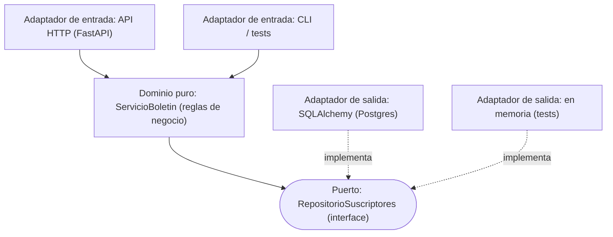
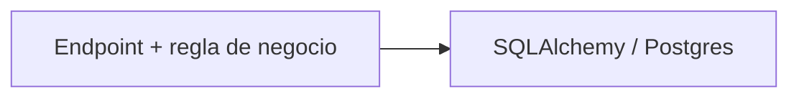
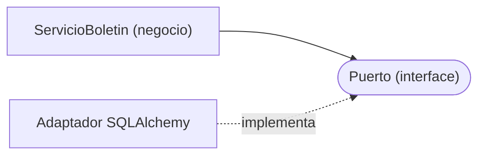

import Reto from "@components/Reto.astro";
import Solucion from "@components/Solucion.astro";
import Quiz from "@components/Quiz.astro";
import CheckDominio from "@components/CheckDominio.astro";
import Nivel from "@components/Nivel.astro";

<Nivel nivel="intermedio" />

En [`3.8`](/fase-3-backend/3-8-backend-fastapi/) montaste tu primer backend con FastAPI. Funciona. Pero si miras un endpoint típico, hace **todo a la vez**: lee el request HTTP, aplica reglas de negocio, abre una sesión de base de datos y arma SQL. Tres responsabilidades de tres mundos distintos, cosidas en una sola función. El día que quieras testear la regla de negocio te toca levantar una base de datos. El día que cambies de Postgres a otra cosa, reescribes la lógica. La **arquitectura hexagonal** —también llamada *ports & adapters*— pone la lógica de negocio en el centro, **pura**, y empuja la infraestructura (DB, HTTP, APIs externas) a los bordes, detrás de **interfaces**. Esta lección no te enseña a dibujar el hexágono bonito al final del proyecto: te enseña a construir **con** esa separación desde ya, en su versión *light* —la mínima que paga, sin la ceremonia que no paga.

:::tip[Si ya tocaste arquitectura hexagonal / clean architecture / ports & adapters]
¿Ya leíste sobre "domain layer", "use cases" o el hexágono de Cockburn? Úsalo como diagnóstico, no como excusa para saltar. La trampa del que "ya sabe clean architecture" es **sobre-ingeniería**: 6 capas, interfaces para todo, mappers por todos lados, en un CRUD de 200 líneas. Si puedes, sin notas: (1) explicar por qué la flecha de dependencia apunta **hacia** el dominio y nunca al revés, (2) escribir un caso de uso testeable sin levantar una sola pieza de infraestructura, y (3) decir **qué NO merece un puerto** en un proyecto pequeño y por qué —salta a los ejercicios (sección 7) y mídete. Si dudas en cualquiera, las secciones 4 a 6 son para ti.
:::

## 1. Qué vas a saber hacer

Al terminar, sin IA y sin notas, podrás:

- **O1 — Separar un endpoint acoplado en tres piezas**: dominio puro (entidad + reglas), un **puerto** (interface) y un **adaptador** de infraestructura; explicando por qué las dependencias apuntan **hacia** el dominio y nunca al revés.
- **O2 — Implementar un puerto con dos adaptadores intercambiables** (uno SQLAlchemy y uno en memoria) y cablearlos en FastAPI con `Depends`, demostrando con un test que puedes **cambiar de infraestructura sin tocar el dominio**.
- **O3 — Explicar el trade-off de "hexagonal light"**: qué merece un puerto y qué es sobre-ingeniería, y por qué la **testabilidad real** —no la pureza por la pureza— es la justificación.

## 2. Por qué importa

> 💰 **Por qué importa:** la REST API es el skill #1 del mercado (≈70% de las ofertas) y el backend es donde vive la lógica de tus apps de IA. Un junior entrega endpoints que "funcionan en mi máquina"; un semi-senior entrega backends que se pueden **testear en segundos sin DB**, **cambiar de proveedor sin reescribir**, y donde la lógica de negocio **no se mezcla** con el framework de turno. Esa separación es lo que un reviewer mira y lo que una pregunta de arquitectura en entrevista ("¿cómo testeas esto sin la base de datos?", "¿cómo cambiarías de SQL a un servicio externo?") expone en 30 segundos.

Tres razones hacen de esta sub-unidad una bisagra, no un adorno:

1. **Testabilidad que se paga sola.** Si la regla de negocio vive pegada a SQLAlchemy, cada test necesita una base de datos: lento, frágil, con estado compartido. Si vive detrás de un **puerto**, la testeas con un **doble en memoria** en milisegundos. Es el hilo de **testing/TDD** llevado a la arquitectura: el código testeable no es un accidente, es un diseño.
2. **La infraestructura cambia; el negocio, menos.** Hoy Postgres, mañana un read-replica, en la Fase 7 una cola, en la Fase 6 **un LLM detrás de un puerto** (`GeneradorDeRespuestas` con un adaptador OpenAI/Anthropic, intercambiable y *mockeable* en tus evals). El mismo patrón que aprendes aquí es el que te deja swappear modelos y mockear la IA cuando llegues a evals. La hexagonal *light* es la inversión más barata que protege todo lo que viene.
3. **Es material de ADR y de entrevista.** "¿Por qué metiste un puerto aquí y no allá?" tiene una respuesta defendible (testabilidad, punto de cambio probable) o no la tiene (lo viste en un tutorial). Decidir **dónde** trazar el límite —y dónde NO— es criterio de semi-senior, y va documentado en un **ADR** de tu capstone.

## 3. Lo que ya traes (actívalo)

Esta lección reúne hilos que ya tocaste. Recupéralos antes de seguir:

- De [`3.5` ORMs y el problema N+1](/fase-3-backend/3-5-orms-problema-n1/): el **repository pattern**. Ese `RepositorioAutores` que concentraba el acceso a datos **ya era un puerto** —solo que no lo llamamos así. Hoy le ponemos nombre y lo formalizamos.
- De [`3.8` Backend con FastAPI](/fase-3-backend/3-8-backend-fastapi/): la inyección de dependencias con `Depends`. Es justo el mecanismo que usa FastAPI para entregarte el adaptador correcto en cada contexto (Postgres en producción, un doble en los tests).
- De la Fase 2: **SOLID**, en particular la **D** (*Dependency Inversion Principle*) —"depende de abstracciones, no de implementaciones"— y la **taxonomía de test doubles** (fake/stub/mock). La hexagonal es, en gran parte, la **D** aplicada con disciplina.

Antes de seguir, responde de memoria:

<Quiz
  question="En 3.5 escribiste un RepositorioAutores con un método listar_con_libros() que por dentro usaba SQLAlchemy. Un endpoint lo usaba sin saber qué había debajo. ¿Qué principio SOLID estabas aplicando, aunque no lo nombraras?"
  options={[
    "Single Responsibility: el repositorio hace una sola cosa",
    "Dependency Inversion: el endpoint depende de una abstracción (el repositorio), no del ORM concreto",
    "Open/Closed: el repositorio está cerrado a modificación",
  ]}
  answer={1}
  explanation="Es Dependency Inversion (la D de SOLID). El endpoint (política de alto nivel) no depende de SQLAlchemy (detalle de bajo nivel): depende de la interfaz del repositorio. Eso es exactamente lo que un 'puerto' formaliza. La hexagonal no es un concepto nuevo y exótico: es la D aplicada con disciplina y con un nombre para cada pieza."
/>

## 4. Cómo se piensa, en voz alta

Voy a razonar **paso a paso**, como frente al editor. Tomamos un endpoint que lo hace todo y lo separamos en dominio + puerto + adaptador, hasta poder testear la regla de negocio sin tocar una base de datos. El dominio será un mini servicio de **boletín** (newsletter): suscribir un email, con una regla de negocio —el plan gratis permite como máximo 3 suscriptores—.

### 4.1 El punto de partida: el endpoint que lo hace todo

Así se ve el endpoint "que funciona" pero está **acoplado**:

```python
# api_acoplada.py — TODO mezclado: HTTP + negocio + base de datos
from fastapi import FastAPI, HTTPException
from pydantic import BaseModel
from sqlalchemy import create_engine, func, select
from sqlalchemy.orm import Session

from modelos import Base, SuscriptorORM   # modelo SQLAlchemy

engine = create_engine("postgresql+psycopg://.../boletin")
Base.metadata.create_all(engine)
app = FastAPI()

LIMITE_PLAN_GRATIS = 3


class SuscribirIn(BaseModel):
    email: str


@app.post("/suscriptores", status_code=201)
def suscribir(payload: SuscribirIn):
    with Session(engine) as session:
        # --- regla de negocio, enredada con SQL ---
        total = session.scalar(select(func.count()).select_from(SuscriptorORM))
        if total >= LIMITE_PLAN_GRATIS:
            raise HTTPException(status_code=402, detail="Límite del plan gratis alcanzado")
        ya_existe = session.scalar(
            select(SuscriptorORM).where(SuscriptorORM.email == payload.email)
        )
        if ya_existe is not None:
            raise HTTPException(status_code=409, detail="Email ya suscrito")
        # --- persistencia ---
        fila = SuscriptorORM(email=payload.email)
        session.add(fila)
        session.commit()
        return {"id": fila.id, "email": fila.email}
```

Razono en voz alta: *"Esto funciona, pero tiene tres trabajos en una función. Hay reglas de negocio (`>= LIMITE`, email único) **interleaveadas** con SQL (`select`, `session.add`). Para testear que 'el cuarto suscriptor es rechazado' necesito levantar Postgres, sembrar 3 filas y hacer un request HTTP. Tres capas para probar una regla aritmética. Y si mañana el boletín se guarda en un servicio externo en vez de Postgres, reescribo la regla de negocio entera porque está pegada al `session`."*

:::caution[El olor concreto]
La señal de alarma no es "usa SQLAlchemy" (eso está bien en su lugar). Es que **no puedo ejercitar la regla de negocio sin la infraestructura**. Cuando testear la lógica exige levantar una DB, la lógica y la DB están acopladas. Ese acoplamiento es lo que la hexagonal rompe.
:::

### 4.2 La idea central: el dominio en el centro, la infra en los bordes

La hexagonal coloca tu **lógica de negocio pura** en el centro. Alrededor, en los bordes, viven los **adaptadores**: piezas que hablan con el mundo exterior (HTTP, base de datos, email, APIs). Entre el centro y cada borde hay un **puerto**: una *interface* que define **qué** se necesita, no **cómo** se hace.



Dos familias de adaptadores:

- **De entrada** (*driving*, los que "manejan" la app): el endpoint HTTP, una CLI, un test. Llaman al dominio.
- **De salida** (*driven*, los que el dominio "maneja"): la base de datos, un cliente de email, otra API. El dominio los usa **a través de un puerto**.

La regla de oro —y lo único que de verdad tienes que interiorizar— es la **dirección de las dependencias**:

> **Todo apunta hacia el dominio. El dominio no apunta a nada de infraestructura.**

El dominio no importa `fastapi` ni `sqlalchemy`. Los adaptadores sí importan el dominio (porque implementan sus puertos o lo invocan). Esa asimetría es la arquitectura entera.

### 4.3 El puerto: una interface, no una implementación

Un **puerto** es una *interface*: declara los métodos que el dominio necesita, sin decir cómo se cumplen. En Python lo expresamos con `typing.Protocol`:

```python
# dominio.py
from typing import Protocol


class RepositorioSuscriptores(Protocol):
    """Puerto de salida. El dominio habla con la persistencia SOLO a través de
    esta interface. No sabe —ni le importa— si detrás hay Postgres, un archivo
    o un dict en memoria."""

    def agregar(self, email: str) -> int: ...      # devuelve el id asignado
    def existe(self, email: str) -> bool: ...
    def total(self) -> int: ...
```

Razono: *"Un `Protocol` define el contrato por **estructura**: cualquier clase que tenga estos tres métodos con estas firmas **es** un `RepositorioSuscriptores`, sin necesidad de heredar de nada. Eso es *structural typing* (duck typing con tipos). La alternativa es una `ABC` (`abc.ABC` + `@abstractmethod`), que es *nominal*: el adaptador debe heredar explícitamente. Para hexagonal *light* prefiero `Protocol`: el adaptador ni siquiera necesita importar el dominio para cumplir el contrato, así que el acoplamiento es aún menor."*

:::note[Protocol vs ABC, en una línea]
`Protocol` = "si camina como pato y grazna como pato, es pato" (no hay que heredar). `ABC` = "tienes que declarar que eres pato heredando de Pato". Ambos sirven como puerto; `Protocol` acopla menos y es la opción *light*. `ABC` te da un error más temprano si olvidas un método.
:::

### 4.4 El dominio puro: entidad + reglas de negocio

Ahora el corazón. La **entidad** y el **servicio** (caso de uso) con la regla de negocio. Cero infraestructura:

```python
# dominio.py (continúa)
from dataclasses import dataclass

LIMITE_PLAN_GRATIS = 3


@dataclass
class Suscriptor:
    """Entidad del dominio. OJO: NO es el modelo de SQLAlchemy. Es un objeto de
    negocio plano. El adaptador traduce entre esta entidad y la fila de la DB."""
    email: str
    id: int | None = None


class EmailYaSuscrito(Exception):
    """Error de dominio: violar la regla 'email único'."""


class LimitePlanAlcanzado(Exception):
    """Error de dominio: violar el cupo del plan gratis."""


class ServicioBoletin:
    """Caso de uso. Recibe el puerto por el constructor (inyección de dependencia
    'a mano'): el servicio depende de la INTERFACE, no de un adaptador concreto."""

    def __init__(self, repo: RepositorioSuscriptores) -> None:
        self._repo = repo

    def suscribir(self, email: str) -> Suscriptor:
        if self._repo.total() >= LIMITE_PLAN_GRATIS:
            raise LimitePlanAlcanzado(f"El plan gratis admite {LIMITE_PLAN_GRATIS} suscriptores")
        if self._repo.existe(email):
            raise EmailYaSuscrito(email)
        nuevo_id = self._repo.agregar(email)
        return Suscriptor(email=email, id=nuevo_id)
```

Razono: *"Mira lo que NO hay aquí: ni `import fastapi`, ni `import sqlalchemy`, ni `HTTPException`, ni `session`. Las reglas de negocio (`>= LIMITE`, email único) son aritmética y lógica pura sobre un puerto. El servicio recibe el repositorio por el constructor —inyección de dependencia 'a mano'—, así que en un test le paso un doble en memoria y en producción le paso el de Postgres, **sin cambiar una línea del dominio**. Los errores son **excepciones de dominio** (`LimitePlanAlcanzado`), no `HTTPException`: el dominio no sabe que existe HTTP. Traducir esa excepción a un status code es trabajo del adaptador de entrada."*

:::caution[La entidad del dominio NO es el modelo del ORM]
`Suscriptor` (dataclass) y `SuscriptorORM` (modelo SQLAlchemy) son **dos cosas distintas a propósito**. Si usas el modelo del ORM como entidad de dominio, tu dominio queda acoplado a SQLAlchemy por la puerta de atrás (importa `Mapped`, `relationship`, el `Session` expira objetos...). El adaptador **traduce** entre ambos. En proyectos chicos esto puede sentirse repetitivo —es la tensión "light" de la sección 4.9—, pero es lo que mantiene el dominio realmente puro.
:::

### 4.5 El adaptador de salida: SQLAlchemy implementa el puerto

El adaptador es la pieza que **sí** sabe de Postgres. Cumple el puerto `RepositorioSuscriptores` y traduce entre la fila ORM y la entidad de dominio:

```python
# adaptador_sqlalchemy.py
from sqlalchemy import func, select
from sqlalchemy.orm import Session

from modelos import SuscriptorORM   # el modelo SQLAlchemy de 3.5


class RepositorioSuscriptoresSQLAlchemy:
    """Adaptador de salida. Implementa el puerto RepositorioSuscriptores
    (por estructura: tiene agregar/existe/total con las firmas correctas)."""

    def __init__(self, session: Session) -> None:
        self._session = session

    def agregar(self, email: str) -> int:
        fila = SuscriptorORM(email=email)
        self._session.add(fila)
        self._session.flush()          # asigna el id sin cerrar la transacción
        return fila.id

    def existe(self, email: str) -> bool:
        return self._session.scalar(
            select(SuscriptorORM).where(SuscriptorORM.email == email)
        ) is not None

    def total(self) -> int:
        return self._session.scalar(select(func.count()).select_from(SuscriptorORM)) or 0
```

Fíjate que **no hereda de nada**: gracias a `Protocol`, basta con tener los métodos correctos. Y todo el SQL vive aquí, encapsulado. El dominio jamás verá un `select`.

### 4.6 La inversión de dependencias, dibujada

Antes (acoplado), la flecha de dependencia iba del negocio **hacia** la infraestructura:



Después (hexagonal), **invertimos** la flecha con un puerto en medio. El negocio depende del puerto; la infraestructura **también** depende del puerto (lo implementa). La dependencia hacia el detalle desapareció:



Eso es **Dependency Inversion**: ambos lados dependen de la abstracción (el puerto), nadie depende del detalle concreto. La "inversión" es literal: la flecha que apuntaba al detalle ahora apunta al puerto, en sentido contrario.

### 4.7 Cablear con FastAPI: `Depends` entrega el adaptador

El adaptador de entrada es el endpoint. Aquí —y **solo** aquí— se traducen las excepciones de dominio a status codes HTTP, y se conecta el puerto con su implementación concreta vía `Depends`:

```python
# api.py
from collections.abc import Iterator
from typing import Annotated

from fastapi import Depends, FastAPI, HTTPException
from pydantic import BaseModel
from sqlalchemy import create_engine
from sqlalchemy.orm import Session

from adaptador_sqlalchemy import RepositorioSuscriptoresSQLAlchemy
from dominio import (
    EmailYaSuscrito,
    LimitePlanAlcanzado,
    RepositorioSuscriptores,
    ServicioBoletin,
)

engine = create_engine("postgresql+psycopg://.../boletin")
app = FastAPI()


def obtener_session() -> Iterator[Session]:
    with Session(engine) as session:
        yield session
        session.commit()


def obtener_repo(
    session: Annotated[Session, Depends(obtener_session)],
) -> RepositorioSuscriptores:
    # Punto único de cableado: aquí se elige el adaptador concreto.
    return RepositorioSuscriptoresSQLAlchemy(session)


# Alias reutilizable (patrón de 3.8): el endpoint pide el PUERTO, no el adaptador.
RepoSuscriptores = Annotated[RepositorioSuscriptores, Depends(obtener_repo)]


class SuscribirIn(BaseModel):
    email: str


class SuscriptorOut(BaseModel):
    id: int
    email: str


@app.post("/suscriptores", status_code=201, response_model=SuscriptorOut)
def suscribir(payload: SuscribirIn, repo: RepoSuscriptores) -> SuscriptorOut:
    servicio = ServicioBoletin(repo)
    try:
        suscriptor = servicio.suscribir(payload.email)
    except LimitePlanAlcanzado as exc:
        raise HTTPException(status_code=402, detail=str(exc)) from exc
    except EmailYaSuscrito as exc:
        raise HTTPException(status_code=409, detail="Email ya suscrito") from exc
    return SuscriptorOut(id=suscriptor.id, email=suscriptor.email)
```

Razono: *"El endpoint ahora es flaco y obvio: parsea el input (`SuscribirIn`), llama al servicio, traduce errores de dominio a HTTP, y mapea la entidad a un schema de salida (`SuscriptorOut`). La regla de negocio NO está aquí —está en `ServicioBoletin`—. El endpoint pide un `RepositorioSuscriptores` (el **puerto**); `Depends(obtener_repo)` decide que el concreto es el de SQLAlchemy. Ese `obtener_repo` es el **único** lugar donde se nombra el adaptador real. Cambiarlo cambia toda la app."*

### 4.8 El pago: testear sin base de datos

Aquí se cobra la inversión. Como el dominio depende del **puerto**, en los tests le inyecto un **doble en memoria** —un *fake* que cumple el mismo contrato— y ejercito la regla de negocio **sin Postgres, sin red, en milisegundos**:

```python
# adaptador_memoria.py — otro adaptador del MISMO puerto, para tests
class RepositorioSuscriptoresEnMemoria:
    def __init__(self) -> None:
        self._emails: list[str] = []

    def agregar(self, email: str) -> int:
        self._emails.append(email)
        return len(self._emails)          # id = posición

    def existe(self, email: str) -> bool:
        return email in self._emails

    def total(self) -> int:
        return len(self._emails)
```

```python
# test_dominio.py — la regla de negocio, probada sin infraestructura
import pytest

from adaptador_memoria import RepositorioSuscriptoresEnMemoria
from dominio import LimitePlanAlcanzado, ServicioBoletin


def test_rechaza_el_cuarto_suscriptor():
    servicio = ServicioBoletin(RepositorioSuscriptoresEnMemoria())
    for n in range(3):
        servicio.suscribir(f"persona{n}@mail.com")
    with pytest.raises(LimitePlanAlcanzado):
        servicio.suscribir("persona4@mail.com")   # el 4º viola el plan gratis
```

Y en los tests del endpoint, **sobreescribo la dependencia** para que el `Depends` entregue el doble en vez del adaptador real (patrón canónico de FastAPI):

```python
# test_api.py
from fastapi.testclient import TestClient

from adaptador_memoria import RepositorioSuscriptoresEnMemoria
from api import app, obtener_repo


def test_limite_via_http():
    fake = RepositorioSuscriptoresEnMemoria()        # UNA instancia compartida
    app.dependency_overrides[obtener_repo] = lambda: fake
    try:
        client = TestClient(app)
        for n in range(3):
            assert client.post("/suscriptores", json={"email": f"p{n}@m.com"}).status_code == 201
        # el 4º request debe rebotar con 402 (Payment Required)
        assert client.post("/suscriptores", json={"email": "p4@m.com"}).status_code == 402
    finally:
        app.dependency_overrides.clear()
```

Razono: *"`app.dependency_overrides[obtener_repo] = lambda: fake` le dice a FastAPI: 'cuando un endpoint pida `obtener_repo`, no llames al de Postgres; usa este doble'. Y un detalle clave: el lambda devuelve **siempre la misma** instancia `fake`, así el estado (los 3 emails ya suscritos) **persiste entre requests** dentro del test. Si devolviera `RepositorioSuscriptoresEnMemoria()` nuevo en cada llamada, el contador se reiniciaría y el cuarto request nunca toparía el límite. Mismo endpoint, misma regla, **cero base de datos**. Eso es lo que la hexagonal compra."*

Esta es la **prueba viva** del beneficio: el *mismo* contrato (`RepositorioSuscriptores`) tiene dos implementaciones —Postgres y memoria— y son **intercambiables**. Cambias de infraestructura sin tocar el dominio. En la Fase 6, ese segundo adaptador será un LLM falso que devuelve respuestas fijas para tus **evals**, mientras el real llama a la API. Mismo patrón.

### 4.9 "Light": cuánto es suficiente (y dónde frenar)

Hexagonal *light* significa **aplicar el patrón donde paga, y no donde no**. La pregunta para cada límite es: *"¿esto me da testabilidad real o un punto de cambio probable?"*. Si la respuesta es no, **no metas un puerto**.

| Sí merece un puerto | NO merece un puerto (sería sobre-ingeniería) |
|---|---|
| Persistencia (DB): la mockeas en tests, podría cambiar | Una función pura de formato de fecha (ya es testeable sola) |
| Servicios externos (email, pagos, **LLM**): lentos, caros, con efectos | Un `enum` o una constante de configuración |
| Algo que quieras **falsear en tests** o **cambiar de proveedor** | Lógica que solo usa el lenguaje estándar y no toca el mundo exterior |

:::caution[El otro extremo: pattern-itis]
La sobre-ingeniería es tan dañina como el acoplamiento. Síntomas: un puerto por cada clase, mappers que copian campo a campo entre tres representaciones del mismo dato, una "capa de aplicación" vacía que solo reenvía llamadas. Si un puerto tiene **una sola** implementación que nunca cambiará y que ya es trivial de testear, probablemente no necesitabas el puerto. *Light* = la mínima separación que te da testabilidad y un punto de cambio real. La regla mental: **introduce el puerto cuando el dolor (test que necesita DB, proveedor que podría cambiar) ya es visible**, no "por si acaso".
:::

> Esta decisión —dónde trazo el límite y por qué— es exactamente el contenido de un **ADR**: "Decisión: introducir un puerto `RepositorioX` para la persistencia. Contexto: necesitamos testear las reglas sin DB. Consecuencia: un adaptador extra y un mapeo entidad↔ORM. Alternativa descartada: usar el modelo ORM como entidad (más simple, pero acopla el dominio a SQLAlchemy)."

## 5. Errores y malentendidos frecuentes

:::caution[Malentendido 1: "Hexagonal = muchas carpetas y muchas capas"]
Podrías pensar que la arquitectura *es* la estructura de directorios (`domain/`, `application/`, `infrastructure/`, `interfaces/`...). **Está mal.** La arquitectura es la **dirección de las dependencias**, no las carpetas. Puedes tener hexagonal correcta en **tres archivos** (`dominio.py`, `adaptador_sqlalchemy.py`, `api.py`) y un desastre acoplado repartido en veinte carpetas. Primero la flecha apunta bien; las carpetas vienen después, si el tamaño lo pide.
:::

:::caution[Malentendido 2: "El modelo de SQLAlchemy puede ser mi entidad de dominio"]
Tentador, porque ahorra el mapeo. Pero el modelo ORM arrastra dependencias de SQLAlchemy (lazy loading, expiración de objetos al cerrar la sesión, `Mapped`...). Si es tu entidad, tu "dominio puro" importa SQLAlchemy y deja de ser puro. El test `import sqlalchemy` aparece en el dominio: ahí lo cazas. En proyectos muy chicos algunos aceptan el atajo conscientemente; pero entonces no digas que tienes hexagonal —tienes un CRUD pragmático, que también es una decisión válida si la documentas.
:::

:::caution[Malentendido 3: "El dominio puede lanzar HTTPException para ahorrarme código"]
Si el dominio lanza `HTTPException`, importa `fastapi` y queda acoplado a la web: no lo podrías reusar desde una CLI, una cola o un test sin arrastrar el framework HTTP. El dominio lanza **excepciones de dominio** (`LimitePlanAlcanzado`); el **adaptador de entrada** las traduce a 402/409/etc. El negocio no sabe qué es un status code.
:::

:::caution[Malentendido 4: "Más puertos = mejor arquitectura"]
No. Un puerto sin una segunda implementación plausible y sin un test que lo aproveche es ceremonia. La hexagonal *light* mete puertos **donde hay testabilidad o cambio real en juego** (DB, servicios externos, LLM) y deja el resto como código directo. Medir bien dónde NO ponerlo es tan senior como saber dónde sí.
:::

**Non-example** (esto *no* viola la hexagonal): que el adaptador `RepositorioSuscriptoresSQLAlchemy` importe `dominio` y `modelos`. Eso es **correcto** —los adaptadores dependen del dominio, esa es la dirección permitida—. La violación sería al revés: que `dominio.py` importe `adaptador_sqlalchemy` o `fastapi`. Dependencia hacia adentro = bien; hacia afuera (a la infra) = mal.

## 6. Práctica con andamiaje (predice → reordena)

Antes de los ejercicios formales, calienta con el método **PRIMM**: *predice* antes de ejecutar.

### 6.1 Predice: ¿compila la arquitectura?

Lee estos imports al inicio de `dominio.py` y **predice si rompen la regla hexagonal** antes de ver la respuesta:

```python
# dominio.py
from dataclasses import dataclass
from typing import Protocol
from sqlalchemy.orm import Session   # (?)
```

<Solucion title="Ver la respuesta">

**Rompe la regla.** `from sqlalchemy.orm import Session` en `dominio.py` significa que el dominio depende de la infraestructura: la flecha apunta hacia afuera, justo lo prohibido. Aunque "solo" sea para un type hint, acopla el dominio a SQLAlchemy. La forma correcta: el dominio importa **su propio puerto** (`RepositorioSuscriptores`, definido con `Protocol` usando solo `typing`), y es el **adaptador** quien importa `Session`. Un test de "pureza" que escanee los imports de `dominio.py` cazaría esta línea —y es justo lo que harás en el ejercicio.

</Solucion>

### 6.2 Parsons: reordena el cableado de FastAPI

Estas líneas cablean el puerto con su adaptador en FastAPI, pero están **desordenadas**. Ponlas en el orden correcto mentalmente:

```text
A) def obtener_repo(session: Annotated[Session, Depends(obtener_session)]) -> RepositorioSuscriptores:
B)     with Session(engine) as session:
C) def obtener_session() -> Iterator[Session]:
D)         yield session
E)     return RepositorioSuscriptoresSQLAlchemy(session)
```

<Solucion title="Ver el orden correcto">

Orden: **C → B → D → A → E**.

```python
def obtener_session() -> Iterator[Session]:          # C
    with Session(engine) as session:                 # B
        yield session                                # D

def obtener_repo(                                    # A
    session: Annotated[Session, Depends(obtener_session)],
) -> RepositorioSuscriptores:
    return RepositorioSuscriptoresSQLAlchemy(session) # E
```

La cadena de dependencias: `obtener_session` (provee la `Session` y la cierra) → `obtener_repo` (envuelve esa sesión en el adaptador y la devuelve **tipada como el puerto**, no como el concreto) → el endpoint pide `RepositorioSuscriptores`. El tipo de retorno `-> RepositorioSuscriptores` en `obtener_repo` documenta que entregas el **puerto**: el endpoint no debe conocer el adaptador concreto.

</Solucion>

## 7. Ejercicios (Primero-Sin-IA)

> Trabaja **a mano, sin IA**, dentro del timebox. La IA entra solo al final, para *revisar* tu intento, nunca para generarlo. Las carpetas viven en tu repo; ábrelas en tu editor.

<Reto title="Refactor: desacopla un endpoint en dominio + puerto + adaptadores" timebox="45 min">

En `ejercicios/fase-3/refactor-hexagonal-tareas/` tienes una API de **tareas** acoplada (`app_acoplado.py`): un endpoint que mezcla HTTP, una regla de negocio (no permitir más de 5 tareas **pendientes**) y SQLAlchemy. Tu trabajo es refactorizarla a hexagonal *light* completando estos stubs según el contrato que da el README:

- `dominio.py`: la entidad `Tarea` (dataclass, **no** el modelo ORM), el puerto `RepositorioTareas` (`Protocol`), el `ServicioTareas` con la regla de negocio, y la excepción de dominio `LimiteTareasPendientes`.
- `adaptador_memoria.py`: `RepositorioTareasMemoria` (para tests).
- `adaptador_sqlalchemy.py`: `RepositorioTareasSQLAlchemy` (usa el `modelos.py` provisto).
- `api.py`: el endpoint flaco + el `Depends` que entrega el puerto.

Tres tests verifican el diseño, no solo el resultado:

1. `test_dominio_sin_infra.py`: escanea los imports de `dominio.py` y **falla si importa `fastapi` o `sqlalchemy`** (pureza), y ejercita la regla de negocio con un doble en memoria, **sin DB**.
2. `test_contrato_repositorio.py`: corre el **mismo** set de pruebas contra tus dos adaptadores (memoria y SQLAlchemy con SQLite en memoria) → demuestra que son intercambiables.
3. `test_api.py`: usa `app.dependency_overrides` para inyectar el doble y comprueba que la regla de negocio aflora como un **409** por HTTP.

**Hecho significa:**
- `uv run pytest` (o `pytest`) en **verde**: pureza del dominio + regla de negocio + contrato de ambos adaptadores + endpoint.
- El dominio **no importa** `fastapi` ni `sqlalchemy` (lo verifica el test, no tu palabra).
- `bitacora.md` con un mini-ADR: por qué pusiste un puerto en la persistencia y qué NO le pusiste puerto (y por qué sería sobre-ingeniería).
- Puedes explicar **sin notas** en qué dirección apuntan las dependencias y por qué el endpoint pide el puerto, no el adaptador.

</Reto>

<Reto title="Diseña los puertos de una feature (y decide dónde NO ponerlos)" timebox="35 min">

Ejercicio de **razonamiento y diseño** (a mano, sin código que correr). En `ejercicios/fase-3/disenar-puertos-cobranza/` tienes la especificación de una feature ("al recibir un pago se registra la transacción, se envía un recibo por email y se notifica a un webhook externo") y **tres micro-decisiones** sobre dónde introducir puertos. Entregas dos archivos en Markdown:

1. `diseno.md`: identifica qué es **dominio puro** vs **adaptador**; lista los **puertos** necesarios con sus métodos; y para cada una de las 3 micro-decisiones, decide **puerto SÍ / puerto NO** con justificación (testabilidad o punto de cambio real vs sobre-ingeniería).
2. `diagrama.md`: un diagrama Mermaid del hexágono mostrando la **dirección de las dependencias** (qué apunta al dominio, qué implementa cada puerto).

**Hecho significa:**
- Cada puerto propuesto tiene una razón defendible (algo que mockear o que podría cambiar), no "porque sí".
- Al menos una micro-decisión es **"puerto NO"** bien justificada (detectaste la sobre-ingeniería).
- El diagrama tiene **todas** las flechas apuntando hacia el dominio; ninguna sale del dominio hacia la infra.
- Mencionas cómo testearías la regla de negocio sin levantar email, webhook ni DB.

</Reto>

## 8. Check de dominio

<CheckDominio items={[
  "Explicar, sin notas, en qué dirección apuntan las dependencias en hexagonal y por qué el dominio no importa infraestructura",
  "Definir un puerto con typing.Protocol y decir en qué se diferencia de una ABC",
  "Escribir un caso de uso (servicio) que reciba el puerto por el constructor y testearlo con un doble en memoria, sin DB",
  "Cablear el puerto con su adaptador en FastAPI usando Depends, y sobreescribirlo en tests con app.dependency_overrides",
  "Explicar por qué la entidad de dominio NO debe ser el modelo del ORM",
  "Decidir, para un caso concreto, dónde merece un puerto y dónde sería sobre-ingeniería",
]} />

<Quiz
  question="Tu ServicioBoletin recibe un RepositorioSuscriptores por el constructor. En un test quieres verificar que el 4º suscriptor es rechazado, sin levantar Postgres. ¿Qué haces?"
  options={[
    "Levantas una base SQLite de prueba y siembras 3 filas antes de cada test",
    "Le pasas al servicio un doble en memoria que cumple el puerto (mismos métodos) y ya tiene 3 suscriptores",
    "Mockeas la clase Session de SQLAlchemy con unittest.mock para que devuelva 3",
  ]}
  answer={1}
  explanation="La gracia de la hexagonal es exactamente esto: el servicio depende del PUERTO, así que le inyectas un doble en memoria que cumple el contrato (agregar/existe/total) y precargas 3 suscriptores. Cero DB, milisegundos, sin estado compartido. Levantar SQLite ya es mejor que Postgres pero sigue siendo infraestructura innecesaria para probar una regla aritmética. Mockear Session acopla el test a los detalles internos de SQLAlchemy (mockear de más): si cambias de ORM, el test se rompe aunque la regla no cambió."
/>

## 9. Recursos

Documentación **oficial** primero (es la fuente de verdad; los blogs envejecen):

- [FastAPI — Dependencies](https://fastapi.tiangolo.com/tutorial/dependencies/) — `Depends`, el patrón `Annotated[T, Depends(...)]` y dependencias con `yield`.
- [FastAPI — Testing Dependencies with Overrides](https://fastapi.tiangolo.com/advanced/testing-dependencies/) — `app.dependency_overrides`, el mecanismo exacto del test del ejercicio.
- [Python docs — `typing.Protocol`](https://docs.python.org/3/library/typing.html#typing.Protocol) — *structural subtyping* para definir puertos sin herencia.
- [Python docs — `abc`](https://docs.python.org/3/library/abc.html) — la alternativa nominal (ABC + `@abstractmethod`).
- [Alistair Cockburn — Hexagonal Architecture](https://alistair.cockburn.us/hexagonal-architecture/) — el artículo original de *ports & adapters*, del autor del término.

## 10. Conexión con el capstone

El [capstone de la Fase 3](/fase-3-backend/proyecto/) es una **API de producción** (FastAPI + Postgres + ORM + auth + tests). Esta sub-unidad es estructural para su Definition of Done:

- El acceso a datos vive detrás de **puertos** (repositorios). Tu lógica de negocio es testeable **sin levantar Postgres** —y eso se nota en tiempos de test verdes en segundos, no minutos—.
- La decisión "puerto aquí, código directo allá" va documentada en un **ADR** (constructive alignment con el hilo spec-driven).
- El mismo patrón de `dependency_overrides` te deja escribir tests de endpoint **rápidos y deterministas**, sin estado compartido entre tests.
- Es la semilla de la Fase 6: cuando metas un LLM, irá **detrás de un puerto** (`GeneradorDeRespuestas`), con un adaptador real y uno falso para tus **evals**. La hexagonal que aplicas hoy es la que te deja mockear la IA mañana.

## 11. Reflexión + repaso espaciado

Antes de cerrar, escribe 3–4 frases respondiendo: *¿Cuál es la única regla que define la arquitectura hexagonal, y cómo la verificaría un test automático? ¿En qué punto de mi capstone introduciría un puerto y en qué punto sería sobre-ingeniería?* Si no puedes responderlo sin releer, vuelve a las secciones 4.2 y 4.9.

**Gancho de repaso espaciado:**

- **Mañana:** reescribe de memoria, sin mirar, el puerto `RepositorioSuscriptores` (`Protocol`), el `ServicioBoletin.suscribir`, y el test que lo prueba con un doble en memoria. Si no sale, no lo aprendiste todavía.
- **En 1 semana:** toma un endpoint cualquiera de tu capstone y pregúntate: *¿puedo testear su regla de negocio sin DB?* Si la respuesta es no, ahí falta un puerto.
- **Antes del capstone:** escribe el ADR de "por qué hexagonal light aquí" y el test de pureza que falla si el dominio importa `fastapi` o `sqlalchemy`. Que la arquitectura no pueda degradarse sin que un test grite.
