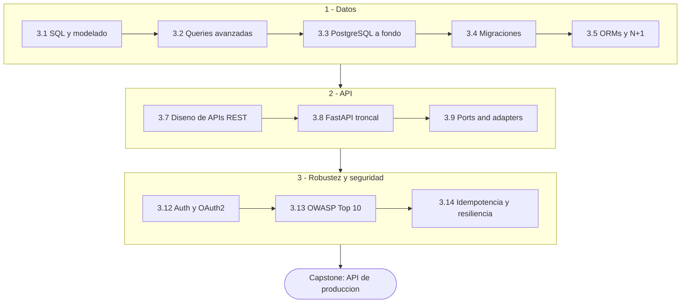
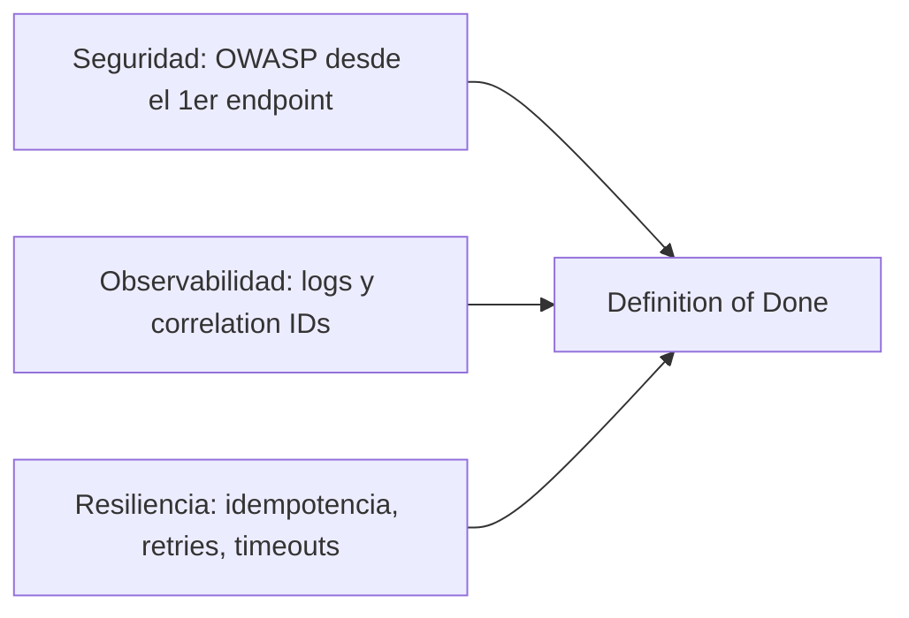

import Reto from "@components/Reto.astro";
import Solucion from "@components/Solucion.astro";
import CheckDominio from "@components/CheckDominio.astro";
import Quiz from "@components/Quiz.astro";
import Nivel from "@components/Nivel.astro";

<Nivel nivel="intermedio" />

Aquí dejas de "saber programar" y empiezas a **construir el software que vive
en producción**: el lugar donde se guardan los datos, donde otra app pide
información por una URL, y donde un atacante intenta colarse. La Fase 3 te lleva
de **no haber escrito una sola query SQL** a tener una **API REST de
producción**: con base de datos PostgreSQL, autenticación, arquitectura
desacoplada, seguridad aplicada y pruebas. Es la columna sobre la que se montan
el frontend de la [Fase 4](/fase-4-frontend/) y los sistemas de IA de la
[Fase 6](/fase-6-ai-engineering/).

## Objetivos de la fase

Al cerrar la Fase 3 sabrás **hacer** esto (no solo "haber leído sobre ello"):

- **Modelar** un dominio en tablas relacionales normalizadas y **escribir** SQL
  —incluidas queries avanzadas (JOINs, CTEs, window functions)— que responda
  correcto y rápido sobre datos reales.
- **Operar** PostgreSQL a fondo: transacciones e *isolation levels*, leer un
  `EXPLAIN`, *connection pooling*, *locking* optimista vs. pesimista; y
  **diagnosticar** el problema N+1 de un ORM.
- **Diseñar y construir** una API REST con **FastAPI** bajo arquitectura
  *ports & adapters*, con autenticación **OAuth2/JWT** y documentación OpenAPI.
- **Aplicar seguridad y resiliencia desde el primer endpoint**: OWASP Top 10
  web, idempotencia, *retries* con *backoff*, *rate limiting* y *secrets
  management* —no como una "fase de calidad" posterior, sino como hábito diario.

:::tip[Por qué importa (relevancia de mercado)]
**REST API es el skill #1 del mercado backend.** El backend es donde vive la
lógica de negocio y de las apps de IA que quieres construir: un modelo no sirve
de nada sin una API segura que lo exponga, una base de datos que lo alimente y
*observabilidad* para saber qué está pasando. Saber *usar* una IA te paga poco;
saber *construir y sostener* el sistema que la envuelve es lo que cobra la banda
semi-senior. FastAPI es, además, **tu puente directo a la Fase 6**: es el
framework estándar para servir RAG y agentes en producción.
:::

## ¿Para quién es esta fase?

Está escrita para **cero real**: no asume que ya escribiste SQL, ni que
levantaste un servidor, ni que sabes qué es un JWT. Cada concepto arranca desde
el principio, con un ejemplo resuelto antes de pedirte que lo hagas tú. Lo único
que damos por hecho es lo de las fases previas: que programas con autonomía
([Fase 1](/fase-1-lenguajes/)) y que escribes tests y commits limpios
([Fase 2](/fase-2-ingenieria/)).

:::tip[Si ya lo tocaste]
¿Vienes con SQL oxidado, ya levantaste una API o tocaste un ORM? No saltes en
seco: **valida**. Haz el diagnóstico de entrada del final de esta página y
resuelve un ejercicio Primero-Sin-IA de cada sub-unidad que creas dominar. Si lo
cierras sin notas y sin IA en el timebox, marca la casilla y avanza. Si te
trabas —por ejemplo, no sabes explicar qué *isolation level* evita un *lost
update*, o por qué un endpoint sin idempotencia cobra dos veces— era un falso
"ya lo sé": quédate. La experiencia previa es un **atajo de validación**, nunca
un permiso para saltar a ciegas.
:::

## La narrativa de la fase: de la tabla al endpoint seguro

La fase tiene un arco deliberado. No es una lista de temas sueltos: es la
construcción, capa por capa, de un backend de producción. Primero los **datos**
(dónde y cómo se guardan), luego el **motor** que los sirve, luego la
**interfaz** por la que se piden, y atravesándolo todo, la **seguridad** y la
**resiliencia**.

Las sub-unidades **opcionales/profundización** (Prisma, NestJS, GraphQL, Redis,
colas) **no están en este camino mínimo**: amplían tu repertorio según el rol al
que apuntes, pero no son requisito para llegar al capstone. Las dejamos marcadas
y disponibles, nunca eliminadas.

## Mapa de la fase

Dieciséis sub-unidades de contenido más el capstone. Las marcadas
**(opcional)** son profundización: hazlas si el rol objetivo las pide
(ecosistema Node, GraphQL, caching, colas), pero el camino crítico no las
necesita.

| # | Sub-unidad | Qué construyes ahí |
|---|---|---|
| 3.1 | [SQL y modelado relacional desde cero](/fase-3-backend/3-1-sql-modelado-relacional/) | Modelado, normalización, claves primarias/foráneas, índices. El cimiento de todo. |
| 3.2 | [Queries avanzadas](/fase-3-backend/3-2-queries-avanzadas/) | JOINs, subqueries, CTEs y window functions: extraer respuestas reales de datos relacionados. |
| 3.3 | [PostgreSQL a fondo](/fase-3-backend/3-3-postgresql-a-fondo/) | Transacciones, *isolation levels*, `EXPLAIN`, *connection pooling*, *locking* optimista/pesimista. |
| 3.4 | [Migraciones de esquema](/fase-3-backend/3-4-migraciones-esquema/) | Versionar la base de datos como versionas el código; aplicar y revertir cambios sin perder datos. |
| 3.5 | [ORMs y el problema N+1](/fase-3-backend/3-5-orms-problema-n1/) | SQLAlchemy; cuándo ORM y cuándo SQL crudo; diagnosticar y matar el antipatrón #1 de los ORMs. |
| 3.6 | [Prisma (TypeScript)](/fase-3-backend/3-6-prisma-ts/) **(opcional)** | Un segundo ORM, el del ecosistema Node, para roles fullstack TS. |
| 3.7 | [Diseño de APIs REST](/fase-3-backend/3-7-diseno-apis-rest/) | Recursos, verbos, status codes, versionado, paginación, errores, OpenAPI/Swagger. |
| 3.8 | [Backend con FastAPI (troncal)](/fase-3-backend/3-8-backend-fastapi/) | Rutas, *dependency injection*, pydantic, async, *background tasks*. Tu puente a la IA. |
| 3.9 | [Ports & adapters / hexagonal light](/fase-3-backend/3-9-ports-adapters-hexagonal/) | Desacoplar la lógica de negocio de la base de datos y del framework, desde el inicio. |
| 3.10 | [Backend con Node.js + NestJS](/fase-3-backend/3-10-backend-nestjs/) **(opcional)** | Express → NestJS, DI y módulos: el backend empresarial del mundo TS. |
| 3.11 | [GraphQL: nociones](/fase-3-backend/3-11-graphql-nociones/) **(opcional)** | Qué resuelve GraphQL frente a REST y cuándo conviene cada uno. |
| 3.12 | [Autenticación y OAuth2 a fondo](/fase-3-backend/3-12-auth-oauth2/) | JWT, *client credentials* vs. *auth code + PKCE*, *refresh*/rotación/scopes, hashing, sesiones vs. tokens. |
| 3.13 | [OWASP Top 10 web hands-on](/fase-3-backend/3-13-owasp-top10-web/) | *Broken Access Control*, *Injection*, **SSRF** (crítico para agentes que hacen *fetch*), CORS, *rate limiting*, gitleaks. |
| 3.14 | [Idempotencia y resiliencia](/fase-3-backend/3-14-idempotencia-resiliencia/) | *Idempotency keys*, *retries* con *backoff + jitter*, *circuit breaker*, *timeouts*. |
| 3.15 | [Redis (caching/sesiones)](/fase-3-backend/3-15-redis-caching/) **(opcional)** | Caching y sesiones para rendimiento; semilla del *semantic caching* de IA. |
| 3.16 | [Colas y procesamiento async](/fase-3-backend/3-16-colas-async/) **(opcional)** | Celery/BullMQ; trabajo en segundo plano; enlaza con DLQ y *outbox* de la Fase 7. |
| 3.P | [🛠️ Capstone — API de producción](/fase-3-backend/proyecto/) | FastAPI con auth JWT, Postgres + ORM, tests, OpenAPI, *rate limiting*, *ports & adapters* y *secrets*. |

> **Pista B (para quien vino por la IA):** este es el backend sobre el que, en
> la Fase 6, montarás tu RAG y tus agentes. Cada decisión de seguridad y
> resiliencia que aprendas aquí reaparece —amplificada— cuando un LLM puede
> *fetchear* URLs (SSRF) o ejecutar acciones (idempotencia, *least privilege*).

## Los hilos transversales que arrancan aquí

La Fase 3 es donde **tres hilos del curso dejan de ser teoría y se vuelven
hábito**. No son "una sub-unidad": atraviesan cada endpoint que escribas, y son
parte del Definition of Done de todo capstone de aquí en adelante.

- **Seguridad (OWASP web).** Empieza en tu **primer endpoint**, no en una
  auditoría final. Cada ruta que expongas se piensa con *Broken Access Control*,
  *Injection* y SSRF en mente. Se trabaja a fondo en
  [3.13](/fase-3-backend/3-13-owasp-top10-web/) y
  [3.12](/fase-3-backend/3-12-auth-oauth2/).
- **Idempotencia y resiliencia.** Una API de producción recibe reintentos,
  *timeouts* y peticiones duplicadas. Diseñar para eso —no parchearlo después—
  es lo que separa un *demo* de un servicio. Vive en
  [3.14](/fase-3-backend/3-14-idempotencia-resiliencia/).
- **Arquitectura desde el día 1.** *Ports & adapters*
  ([3.9](/fase-3-backend/3-9-ports-adapters-hexagonal/)) entra **temprano** a
  propósito: construyes *con* arquitectura en vez de fijar malos límites y
  dibujar diagramas al final. La lógica de negocio no debe saber si detrás hay
  Postgres, Redis o un archivo de prueba.

:::note[Spec-driven y Conventional Commits no se sueltan]
Igual que en las fases previas, cada pieza que construyas aquí —incluido el
capstone— arranca con una **mini-spec** (contrato del endpoint: entradas,
salidas, errores, casos borde) y se versiona con **Conventional Commits**. Las
decisiones de arquitectura no triviales (¿ORM o SQL crudo? ¿sesiones o tokens?)
se dejan escritas en un **ADR**. El mercado da esto por sentado en un
semi-senior.
:::

## Checklist de avance

Marca una sub-unidad como completa **solo** cuando cumplas las tres condiciones
(criterio del roadmap): (a) entiendes el concepto **sin notas**, (b) hiciste el
ejercicio **sin IA**, y (c) lo **aplicaste** en el capstone.

- [ ] 3.1 — SQL y modelado relacional desde cero
- [ ] 3.2 — Queries avanzadas
- [ ] 3.3 — PostgreSQL a fondo
- [ ] 3.4 — Migraciones de esquema
- [ ] 3.5 — ORMs y el problema N+1
- [ ] 3.6 — Prisma (TS) *(opcional/profundización)*
- [ ] 3.7 — Diseño de APIs REST
- [ ] 3.8 — Backend con FastAPI (troncal)
- [ ] 3.9 — Ports & adapters / hexagonal light
- [ ] 3.10 — Backend con Node.js + NestJS *(opcional/profundización)*
- [ ] 3.11 — GraphQL: nociones *(opcional/profundización)*
- [ ] 3.12 — Autenticación y OAuth2 a fondo
- [ ] 3.13 — OWASP Top 10 web hands-on
- [ ] 3.14 — Idempotencia y resiliencia
- [ ] 3.15 — Redis (caching/sesiones) *(opcional/profundización)*
- [ ] 3.16 — Colas y procesamiento async *(opcional/profundización)*
- [ ] 3.P — Capstone: API de producción (cumple el Definition of Done de abajo)
- [ ] `RETROSPECTIVA.md` de la fase escrita (qué aprendí, qué me costó, qué proyecto lo demuestra)

<CheckDominio
  title="Antes de avanzar a la Fase 4, ¿puedes…?"
  items={[
    "Modelar tres entidades relacionadas con sus claves foráneas y escribir un JOIN que las cruce, sin notas",
    "Explicar qué es el problema N+1 y mostrar cómo lo detectarías y lo arreglarías",
    "Levantar un endpoint FastAPI con validación pydantic y explicar dónde aplicarías ports & adapters",
    "Nombrar tres riesgos del OWASP Top 10 y cómo los mitigas en una API REST",
    "Explicar por qué un POST de pago necesita una idempotency key y qué pasa sin ella",
  ]}
/>

## Definition of Done (la vara del capstone)

Todos los capstones del curso comparten **un único** Definition of Done. La
Fase 3 es donde empiezan a aplicar de verdad varios de sus puntos (seguridad,
tests en CI, arquitectura), aunque algunos —IA, observabilidad completa con
trazas— se cumplen en plenitud en fases posteriores.

:::caution[Lo que aplica al Capstone F3 (API de producción)]
1. **Spec inicial** (contrato de la API) + **ADRs** de las decisiones clave
   (elección de ORM, estrategia de auth, dónde van los límites de la
   arquitectura).
2. **Tests verdes + lint en CI**; calidad medida por **aserciones reales** sobre
   el comportamiento de los endpoints, no por % de cobertura.
3. **Seguridad aplicada:** OWASP web (auth, control de acceso, *injection*,
   SSRF, CORS, *rate limiting*) + *secret-scanning* (gitleaks) + *dependency
   scanning* en el pipeline.
4. **Observabilidad mínima:** *structured logs* + *correlation IDs* en cada
   request (la traza distribuida completa con OTel llega en la Fase 5).
5. **Resiliencia:** *idempotency keys* en operaciones no idempotentes, *retries*
   con *backoff*, *timeouts*.
6. **Demo que CORRE** + **README en inglés** + **write-up de trade-offs** (qué
   elegí, qué medí, qué dejé fuera y por qué).
7. **Conventional Commits** en todo el historial.
:::

:::note[Lo que llega después (mismo DoD, otras fases)]
Accesibilidad WCAG (cuando haya UI, [Fase 4](/fase-4-frontend/)) · trazas
distribuidas con OpenTelemetry y SLOs ([Fase 5](/fase-5-devops/)) · *eval
harness* + *budget* de costo/latencia y OWASP LLM/Agentic (cuando toque IA,
[Fase 6](/fase-6-ai-engineering/)). Aquí plantamos seguridad, arquitectura y
resiliencia; el resto se va sumando capa a capa.
:::

## Conexión hacia adelante

- **Hacia la [Fase 4](/fase-4-frontend/):** el frontend que construirás allí
  consume *esta* API. Un buen diseño REST (3.7) y errores claros hacen que la UI
  sea simple; uno malo la vuelve un infierno de *workarounds*.
- **Hacia la [Fase 6](/fase-6-ai-engineering/):** FastAPI (3.8) es el estándar
  para servir RAG y agentes. La seguridad de 3.13 (sobre todo **SSRF**) y la
  idempotencia de 3.14 son *exactamente* lo que necesitas cuando un LLM hace
  *fetch* de URLs o ejecuta acciones con efectos secundarios. No estás
  aprendiendo "backend genérico": estás construyendo el chasis de tus sistemas
  de IA.

## Ejercicio de entrada: diagnóstico y plan de Fase 3

Antes de tocar la primera lección, orientarte. Este ejercicio no se corrige
"bien o mal": se corrige por **honestidad, concreción y alineación con el
capstone**. Es tu *placement* y tu contrato con la fase.

<Reto title="Diagnóstico, plan y mapa al capstone de Fase 3" timebox="35 min">

Sin IA, en tres archivos markdown dentro de `ejercicios/fase-3/fase-3-index/`:

1. **`diagnostico.md`** — una tabla con las 16 sub-unidades (3.1 a 3.16) y, para
   cada una, tu nivel **honesto**: `nuevo` · `lo reconozco` · `lo sé hacer sin
   notas`. La prueba de "lo sé hacer" es concreta: ¿podrías, ahora, sin notas y
   sin IA, escribir un JOIN de tres tablas / levantar un endpoint / explicar qué
   *isolation level* evita un *lost update*? Si dudas, no es "lo sé hacer".
2. **`plan-fase-3.md`** — tu plan: **bloques semanales concretos** (día y hora),
   y una **decisión explícita sobre las 5 opcionales** (3.6, 3.10, 3.11, 3.15,
   3.16): cuáles harás y cuáles saltas, **justificado por el rol al que
   apuntas** (p. ej. "salto NestJS y Prisma porque voy a IA/Python; hago Redis
   porque el *semantic caching* me sirve en F6").
3. **`mapa-capstone.md`** — una tabla que conecte **cada punto del Definition of
   Done del Capstone F3** (los 7 de arriba) con **qué sub-unidades te lo
   enseñan**. Esto te obliga a ver la fase como una construcción hacia un
   objetivo, no como temas sueltos.

**Hecho significa:** la tabla cubre las 16 sub-unidades con un nivel defendible
(no todo en "lo sé hacer"); el plan decide explícitamente sobre las opcionales
con una razón ligada a tu objetivo; y el mapa conecta los 7 puntos del DoD con
al menos una sub-unidad cada uno, sin inventar conexiones.

</Reto>

<Solucion title="Pista (ábrela solo si te trabas, no es la solución)">

Para el diagnóstico, cuidado con la sobreconfianza (efecto Dunning-Kruger): si
nunca escribiste una migración ni explicaste el problema N+1 en voz alta, eso es
`nuevo`, no "lo reconozco". Para las opcionales, la pregunta guía es: *"¿el rol
que busco lo pide, o me desbloquea algo de una fase posterior?"* — si la
respuesta a ambas es no, sáltala sin culpa (sigue marcada para después). Para el
mapa al capstone, empieza por los puntos del DoD más "obvios": la seguridad
(punto 3) la cubren 3.12 y 3.13; la resiliencia (punto 5), 3.14; los datos los
toca casi todo el bloque 3.1–3.5. El punto difícil de ubicar suele ser la
arquitectura del ADR (punto 1): vive sobre todo en 3.9.

</Solucion>

### Cómo pedir la corrección

Cuando termines, pídele a tu IA:

> "Corrige `ejercicios/fase-3/fase-3-index/` usando el framework de `.ai/`. Sigue
> `INSTRUCCIONES-CORRECTOR.md`."

El corrector revisará la **honestidad** de tu autoevaluación, la **realidad** de
tu plan y la **coherencia** de tu mapa al capstone, no si "acertaste". No existe
una respuesta única correcta.

## Quiz de orientación

<Quiz
  question="¿Cuál de estas afirmaciones describe mejor el rol de FastAPI en este curso?"
  options={[
    "Es un framework de frontend para construir la UI de la app",
    "Es el backend troncal de la fase y el puente a servir IA en producción (Fase 6)",
    "Es una base de datos relacional alternativa a PostgreSQL",
    "Es una herramienta de testing que reemplaza a pytest",
  ]}
  answer={1}
  explanation="FastAPI es el backend troncal de la Fase 3 y el estándar para servir RAG/agentes en la Fase 6. NestJS, Prisma y GraphQL quedan como profundización opcional."
/>

## Recursos

Prefiere siempre **documentación oficial** sobre tutoriales sueltos. Mantén una
lista viva en `articulos.md` dentro de cada sub-unidad.

- [Documentación oficial de PostgreSQL](https://www.postgresql.org/docs/) — la referencia de la base de datos de la fase.
- [Documentación oficial de FastAPI](https://fastapi.tiangolo.com/) — el backend troncal (3.8).
- [Documentación oficial de SQLAlchemy](https://docs.sqlalchemy.org/) — el ORM de Python (3.5).
- [OWASP Top 10](https://owasp.org/www-project-top-ten/) — el catálogo de riesgos web que aplicarás desde el primer endpoint (3.13).
- [MDN — HTTP](https://developer.mozilla.org/es/docs/Web/HTTP) — repaso de métodos, status codes y headers (base para 3.7).

## Reflexión + repaso

:::note[Para tu RETROSPECTIVA.md]
¿Cuántas veces, antes de este curso, expusiste un endpoint sin pensar quién
puede llamarlo ni qué pasa si lo llaman dos veces? Escribe dos frases. Esa
honestidad marca la distancia entre "hacer que funcione en mi máquina" y
"construir para producción", que es justo lo que esta fase te enseña a cruzar.
:::

**Gancho de repaso:** vuelve a esta portada al cerrar **cada** sub-unidad y
marca su casilla. Al terminar la 3.14, antes del capstone, reescribe **de
memoria** (sin abrir esta página) los tres hilos transversales que arrancan en
esta fase y los 7 puntos del Definition of Done del Capstone F3. Si te falta
alguno, ahí tienes tu próximo repaso.
