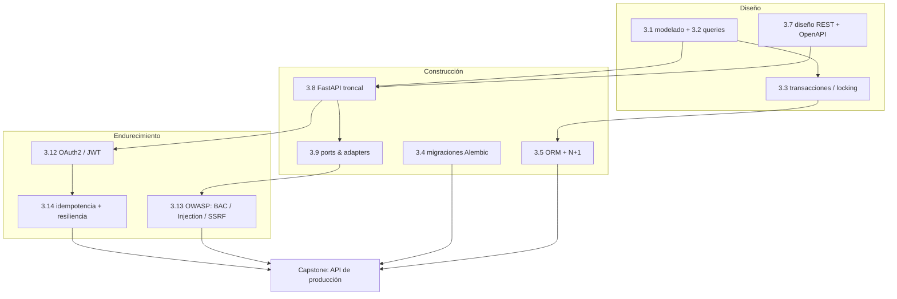
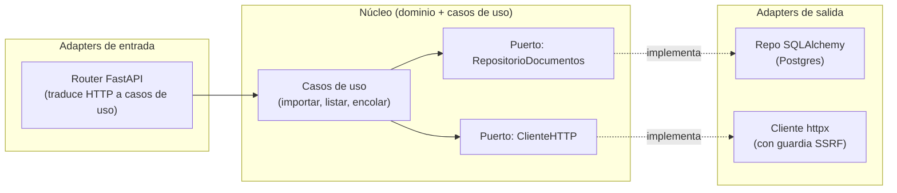

import Reto from "@components/Reto.astro";
import Solucion from "@components/Solucion.astro";
import Quiz from "@components/Quiz.astro";
import CheckDominio from "@components/CheckDominio.astro";
import Nivel from "@components/Nivel.astro";

<Nivel nivel="avanzado" />

Durante dieciséis sub-unidades aprendiste piezas sueltas: modelaste tablas, escribiste queries, montaste endpoints, verificaste un JWT a mano, blindaste un fetch contra SSRF, diseñaste un pago idempotente. Cada una era un músculo aislado. **Este capstone es el partido.** Vas a ensamblar todo eso en una sola API que no solo "funciona en tu máquina", sino que cumple el estándar con el que un equipo real la pondría en producción: tiene una spec, decisiones documentadas, tests que miden lo que importa, seguridad aplicada desde el primer endpoint, errores honestos, secretos fuera del repo y un historial de commits que se lee como la historia del proyecto.

No es un ejercicio con tests que ya vienen escritos. Aquí tú decides el dominio, la arquitectura y cada línea —y luego defiendes por qué. Es la base que la [Fase 4 (frontend)](/fase-4-frontend/) va a consumir y que la [Fase 6 (IA)](/fase-6-ai-engineering/) va a envolver con un pipeline RAG. Constrúyela bien una vez y la reusas todo el resto del curso.

:::tip[Si ya construiste una API "en producción"]
¿Ya tienes un FastAPI/Express/NestJS desplegado con auth y base de datos? Perfecto: úsalo como diagnóstico, no como excusa para reciclar. La trampa del que "ya sabe backend" es entregar un CRUD que corre pero que, mirado de cerca, filtra el recurso de otro usuario (no hay control de acceso real), reintenta un pago dos veces (no hay idempotencia), devuelve `{"detail": "error"}` para todo (no hay contrato de error), guarda el `SECRET_KEY` en el código y mide "calidad" con un número de coverage. Si puedes, sin notas: (1) explicar la diferencia entre **autenticación** y **autorización** y dónde vive cada una en tu código; (2) decir qué garantiza una **idempotency key** que un simple `try/except` no garantiza; (3) explicar por qué el **mutation score** dice más que el coverage. Si dudas en alguna, este capstone es exactamente donde se cierra el hueco. Si no dudas, demuéstralo: el listón aquí es el Definition of Done completo, no el happy path.
:::

## 1. Qué vas a saber hacer

Al terminar este capstone, sin IA para razonar el diseño y pudiendo defender cada decisión sin notas, podrás:

- **O1 — Diseñar y construir una API REST de producción end-to-end**: spec primero, arquitectura **ports & adapters**, persistencia en PostgreSQL con SQLAlchemy y migraciones versionadas con Alembic, contrato OpenAPI vivo y errores que respetan **RFC 9457**.
- **O2 — Aplicar seguridad como hábito, no como fase**: autenticación con **OAuth2 (password flow) + JWT** y autorización por dueño/scope; mitigaciones concretas de **Broken Access Control (IDOR), Injection y SSRF**; **rate limiting**; secretos fuera del repo y verificados con secret-scanning.
- **O3 — Hacer el sistema confiable y demostrable**: **idempotencia** en los endpoints sensibles, **observabilidad** (logs estructurados + correlation IDs), una **suite de tests medida por mutation score** (no por % de cobertura), un README en inglés y un write-up honesto de trade-offs —todo mapeado al **Definition of Done** del curso.

## 2. Por qué importa (el dinero está aquí)

> 💰 **Por qué importa:** "REST API" es el skill #1 del mercado (alrededor del 70% de las ofertas lo piden), pero ese dato esconde la trampa real. Miles de candidatos saben pegar un CRUD; **lo que separa al junior del semi-senior es lo que rodea al CRUD**: ¿valida la entrada?, ¿controla el acceso?, ¿no se cae si lo llamas dos veces?, ¿deja rastro cuando falla?, ¿puedes desplegar un cambio sin perder datos? Este capstone es, literalmente, la pieza de portafolio que responde "sí" a todas esas preguntas. Y no es desechable: es **la base reutilizable de tus apps de IA**. En la Fase 6, servir un modelo o un pipeline RAG es exponer este mismo backend con un endpoint más. El recruiter que abra tu repo no va a leer todo el código —va a mirar el README, el historial de commits, si hay tests de verdad y si los secretos están donde deben. Esto es lo que mira.

Tres razones lo hacen el capstone bisagra del curso:

1. **Es donde los hilos transversales dejan de ser teoría.** Spec-driven, testing, seguridad y observabilidad no se enseñan "después": se aplican *aquí*, en un proyecto que corre. Es tu primer Definition of Done completo.
2. **Es acumulativo de verdad.** La misma API la consume el frontend de la Fase 4 y la extiende el RAG de la Fase 6. Las decisiones que tomes ahora (arquitectura, contrato, errores) las vas a agradecer —o pagar— tres fases más adelante.
3. **Es tu mejor historia de entrevista de backend.** "Construí una API con auth y Postgres" no impresiona. "Cerré un IDOR cambiando la query para que filtrara por dueño, hice el endpoint de cobro idempotente con una idempotency key y un índice único, y medí mis tests con mutation testing porque el coverage mentía" —eso sí.

## 3. Lo que ya traes (actívalo)

Este capstone no introduce conceptos nuevos: **ensambla toda la Fase 3**. Antes de empezar, recorre el mapa y reconoce dónde vive cada pieza.



- De [`3.1`](/fase-3-backend/3-1-sql-modelado-relacional/) y [`3.2`](/fase-3-backend/3-2-queries-avanzadas/): el modelo de datos y las queries. Tu esquema arranca aquí.
- De [`3.3`](/fase-3-backend/3-3-postgresql-a-fondo/): transacciones, isolation y locking —los necesitas en cualquier acción que modifique stock, saldo o estado compartido.
- De [`3.4`](/fase-3-backend/3-4-migraciones-esquema/): cada cambio de esquema es una migración Alembic versionada. Nada de `create_all` en producción.
- De [`3.5`](/fase-3-backend/3-5-orms-problema-n1/): SQLAlchemy y el N+1 que vas a cazar en tus listados.
- De [`3.7`](/fase-3-backend/3-7-diseno-apis-rest/): recursos, verbos, status codes, paginación. El contrato que diseñaste se vuelve OpenAPI vivo.
- De [`3.8`](/fase-3-backend/3-8-backend-fastapi/): el esqueleto FastAPI —routers, `Depends`, `response_model`, manejo de errores.
- De [`3.9`](/fase-3-backend/3-9-ports-adapters-hexagonal/): la arquitectura. El dominio no sabe que existe HTTP ni SQLAlchemy.
- De [`3.12`](/fase-3-backend/3-12-auth-oauth2/): OAuth2 password flow, JWT, hashing, scopes.
- De [`3.13`](/fase-3-backend/3-13-owasp-top10-web/): Broken Access Control, Injection, SSRF, rate limiting, secrets management.
- De [`3.14`](/fase-3-backend/3-14-idempotencia-resiliencia/): idempotency keys, reintentos con backoff+jitter, timeouts.

Antes de seguir, responde de memoria:

<Quiz
  question="Tu API tiene GET /documentos/{id}. Un usuario autenticado pide un id que pertenece a OTRO usuario y la API se lo devuelve con 200. El JWT era válido. ¿Qué falló y de qué vulnerabilidad OWASP se trata?"
  options={[
    "Falló la autenticación: el JWT no debió validar. Es un problema de OAuth2.",
    "Falló la autorización: autenticó bien (sabe quién es) pero no verificó que el recurso le pertenezca. Es Broken Access Control (IDOR).",
    "No falló nada: si el JWT es válido, el usuario puede ver cualquier documento.",
  ]}
  answer={1}
  explanation="Autenticación (quién eres) y autorización (qué puedes tocar) son distintas. El token válido resuelve la primera; el segundo control —¿este documento es tuyo?— faltó. Es Broken Access Control, el #1 del OWASP Top 10. La defensa correcta no es un `if` extra: es que la query SIEMPRE filtre por el dueño (WHERE owner_id = current_user.id), de modo que el recurso ajeno ni siquiera exista para esa consulta."
/>

## 4. Cómo un semi-senior arranca este proyecto (en voz alta)

El instinto de junior es abrir el editor y escribir `@app.get(...)`. El instinto de semi-senior es **no tocar código todavía**. Voy a pensar este capstone en voz alta, como lo plantearía de verdad, para que veas el orden —porque el orden *es* la habilidad.

**Paso 1 — Elijo un dominio que tenga las superficies que el capstone exige.** No cualquier CRUD sirve. Necesito un dominio que naturalmente tenga: (a) recursos que pertenecen a un usuario (para que exista una superficie de control de acceso real), (b) una acción sensible que no debe ejecutarse dos veces (para idempotencia), y (c) un endpoint que haga una petición de red saliente (para SSRF). Elijo una **base de conocimiento de documentos**: usuarios que tienen `colecciones` y `documentos`; una acción de "importar documento desde una URL" (red saliente → SSRF) y un "encolar procesamiento" (acción sensible → idempotencia). Bonus enorme: este dominio es justo lo que la Fase 6 convierte en un RAG. Pienso a tres fases vista.

> No estás obligado a usar *este* dominio. Cualquiera sirve si tiene las tres superficies. Un gestor de gastos compartidos, una API de reservas, un acortador de URLs con cuotas —todos califican. Lo que **no** califica es un "to-do list" sin dueños ni acciones sensibles: te quedas sin la mitad de los requisitos.

**Paso 2 — Escribo la SPEC antes que el código.** En texto plano: los recursos, los endpoints con su verbo y status code, qué campos entran y salen, los casos borde y los códigos de error. La spec es mi lista de tests futura. Si no puedo describir el endpoint en una línea, no lo entiendo todavía.

**Paso 3 — Decido la arquitectura y la dejo en un ADR.** Elijo ports & adapters *light* (lo de [`3.9`](/fase-3-backend/3-9-ports-adapters-hexagonal/)). El núcleo (entidades + casos de uso) no importa `fastapi` ni `sqlalchemy`. Defino **puertos** (interfaces: `RepositorioDocumentos`, `RelojSistema`, `ClienteHTTP`) y **adapters** (las implementaciones: router FastAPI, repo SQLAlchemy, cliente httpx). ¿Por qué? Porque en la Fase 6 voy a añadir un adapter de "indexador RAG" sin tocar el dominio, y porque mis tests del dominio corren sin levantar Postgres. Lo escribo en un ADR con la alternativa que descarto (un CRUD acoplado, más rápido hoy, más caro en F6).



**Paso 4 — Pienso el modelo de datos y la primera migración.** `users`, `colecciones`, `documentos`, y una tabla `idempotency_keys`. Las claves foráneas dejan claro el dueño. La migración Alembic inicial crea el esquema; nunca uso `Base.metadata.create_all` en producción porque no deja historia ni permite rollback.

**Paso 5 — Construyo por capas verticales, no horizontales.** El error es "primero todos los modelos, luego todos los endpoints". Mejor: una feature completa de punta a punta (registro + login → JWT) y la pruebo. Luego la siguiente (crear colección, con su control de acceso y su test). Cada feature entra verde antes de la próxima. Así nunca tengo 2000 líneas que "deberían funcionar".

**Paso 6 — Endurezco mientras construyo, no al final.** Cuando escribo `GET /documentos/{id}`, en *ese* momento la query filtra por `owner_id` (control de acceso). Cuando escribo el import por URL, en *ese* momento le pongo la guardia SSRF. Cuando escribo el login, en *ese* momento le pongo rate limiting. La seguridad tejida, no espolvoreada al final.

**Paso 7 — Mido los tests por lo que detectan, no por lo que tocan.** Escribo tests de contrato con `TestClient` (401, 404 con forma RFC 9457, 409 de idempotencia, 422 de validación, 429 de rate limit) y tests de dominio puros. Luego corro **mutmut**: si mata pocos mutantes, mis aserciones son decorativas aunque el coverage diga 95%.

**Paso 8 — Cierro con la prueba de que corre y con honestidad.** Un README en inglés con `docker compose up` y una sesión real; un write-up de trade-offs (qué dejé fuera, qué me costó, qué mediría distinto). Y reviso que el historial sea Conventional Commits leíble.

Ese es el orden. Nota que el código aparece recién en el paso 5. Todo lo anterior es pensar —y es exactamente lo que el Primero-Sin-IA protege.

## 5. Errores que hunden este capstone

:::caution[Confronta estas trampas antes de caer en ellas]
Estos son los errores que convierten un capstone "técnicamente entregado" en uno que no cumple el Definition of Done. Cada uno es una pregunta de entrevista disfrazada.

- **"Autentiqué, luego está seguro."** Podrías pensar que un JWT válido basta. Está mal: eso resuelve *quién eres*, no *qué puedes tocar*. Sin el filtro por dueño en la query, cualquier usuario lee documentos ajenos cambiando un id en la URL. Auth ≠ authz.
- **"Manejo la doble ejecución con un `try/except`."** Está mal: si el cliente reintenta tras un timeout, tu `except` ni se entera —es un request nuevo. La idempotencia necesita una **clave** que el cliente envía (`Idempotency-Key`) y un registro persistido que reconozca "esto ya lo hice y este fue el resultado". Sin eso, un reintento de red cobra dos veces.
- **"Valido la URL con un regex y ya, no hay SSRF."** Está mal: un atacante apunta a `http://169.254.169.254/` (metadata del cloud) o a `http://localhost:5432`. La guardia real resuelve el DNS, rechaza IPs privadas/loopback/link-local, prohíbe redirecciones a destinos internos y limita esquemas a `http/https`. Un regex de "parece una URL" no protege nada.
- **"Tengo 95% de coverage, mis tests son buenos."** Está mal: el coverage solo dice qué líneas *se ejecutaron*, no si una aserción *fallaría* al romper la lógica. Un test sin `assert` da coverage y no detecta nada. El **mutation score** mide lo que de verdad importa. Persigue mutantes muertos, no porcentajes.
- **"Devuelvo `{"detail": "no encontrado"}` para todo."** Está mal: el cliente (tu frontend de F4) no puede programar contra eso. **RFC 9457** define una forma estándar (`type`, `title`, `status`, `detail`, `instance`) con content-type `application/problem+json`. Un contrato de error es parte del contrato de la API.
- **"El `SECRET_KEY` está en el código, después lo saco."** Está mal —y "después" no llega. Los secretos viven en variables de entorno / `.env` (gitignored), y un secret-scanner (gitleaks) corre en CI para que un `git push` con una clave pegada no pase. Esto es DoD, no opcional.
- **"`create_all` me crea las tablas, no necesito migraciones."** Está mal en producción: no hay historia, no hay rollback, no puedes evolucionar el esquema con datos existentes. Cada cambio es una migración Alembic.
- **"`async def` en todo porque es más rápido."** Está mal si dentro llamas a un cliente bloqueante: congelas el event loop. `async` solo ayuda si esperas I/O con `await` de un cliente async. Es el trade-off de [`3.8`](/fase-3-backend/3-8-backend-fastapi/).
:::

## 6. El andamiaje: construir por capas (faded)

No empieces de cero frente a una página en blanco —pero tampoco te doy el código. El andamiaje aquí es el **orden de construcción** y el **esqueleto mínimo**; tú rellenas la lógica. A medida que avanzas, el andamiaje desaparece (las primeras capas las describo más; las últimas son tuyas).

**Capa 0 — Scaffold y disciplina (te lo dejo casi listo):**

```text
mi-api/
├── pyproject.toml         # deps con uv (fastapi[standard], sqlalchemy, alembic, pyjwt, pwdlib[argon2], httpx, slowapi)
├── .env.example           # plantilla de secretos; .env real va gitignored
├── docker-compose.yml      # tu app + postgres
├── alembic.ini / migrations/
├── src/
│   ├── dominio/            # entidades + puertos (CERO imports de fastapi/sqlalchemy)
│   ├── casos_uso/          # la lógica de negocio
│   ├── adapters/
│   │   ├── http/           # routers FastAPI, dependencias, manejo de errores RFC 9457
│   │   └── db/             # modelos SQLAlchemy + repos que implementan los puertos
│   └── main.py             # arma la app, el lifespan, el limiter, los exception handlers
└── tests/                  # contrato (TestClient) + dominio (puro)
```

**Capa 1 — Auth (faded medio):** el endpoint `POST /auth/registro` y `POST /auth/token`. Recuerda de [`3.12`](/fase-3-backend/3-12-auth-oauth2/): `OAuth2PasswordRequestForm`, hashing con `pwdlib`, firma del JWT con `PyJWT`. Aquí tienes la pieza que más se equivoca —el resto es tuyo:

```python
# El error típico: comparar contraseñas en texto plano o con == sobre el hash.
# Lo correcto, con la librería que recomienda FastAPI hoy:
from pwdlib import PasswordHash

hasher = PasswordHash.recommended()   # argon2 por defecto

def hash_password(plano: str) -> str:
    return hasher.hash(plano)

def verificar_password(plano: str, hashed: str) -> bool:
    return hasher.verify(plano, hashed)   # NUNCA  plano == hashed
```

**Capa 2 — Recurso con dueño (faded ligero):** `colecciones` y `documentos`. El control de acceso no es un `if` al final: es que el repositorio reciba el `owner_id` y la query lo use siempre. Piénsalo como "el recurso de otro no existe para mí".

**Capa 3 — Import por URL con guardia SSRF (tuyo):** `POST /documentos/importar` con body `{url, coleccion_id}`. Reusa la guardia que construiste en el ejercicio `blindar-fetch-ssrf`. Sin red de seguridad → no merece estar.

**Capa 4 — Idempotencia (tuyo):** el endpoint sensible (encolar procesamiento, o el import) acepta header `Idempotency-Key`. Reusa lo de [`3.14`](/fase-3-backend/3-14-idempotencia-resiliencia/): índice único sobre la clave, y la segunda vez devuelves el resultado guardado, no repites el efecto.

**Capa 5 — Pulido (tuyo):** errores RFC 9457, rate limiting con `slowapi`, logs estructurados con correlation ID por request, paginación sin N+1, y la suite medida con mutmut.

<Solucion title="Pista: la forma de un error RFC 9457 (no es la solución del capstone)">

Un exception handler global traduce tus excepciones de dominio a la forma estándar. Esto es un empujón, no el diseño completo:

```python
from fastapi.responses import JSONResponse

async def manejar_no_encontrado(request, exc):
    return JSONResponse(
        status_code=404,
        media_type="application/problem+json",
        content={
            "type": "https://miapi.example/errors/recurso-no-encontrado",
            "title": "Recurso no encontrado",
            "status": 404,
            "detail": str(exc),
            "instance": str(request.url.path),
        },
    )
```

Lo importante no es copiar esto: es que el *dominio* lance `RecursoNoEncontrado` (sin saber de HTTP) y que el *adapter* lo traduzca. Esa costura es lo que [`3.9`](/fase-3-backend/3-9-ports-adapters-hexagonal/) te enseñó.

</Solucion>

## 7. El capstone (Primero-Sin-IA)

<Reto title="API de producción: base de conocimiento de documentos" timebox="proyecto · 15–25 h repartidas en 1–2 semanas">

Carpeta: `ejercicios/fase-3/capstone-api-produccion/`

Construye una **API REST de producción** sobre el dominio que elijas (recomendado: base de conocimiento de documentos). El README del ejercicio trae el brief completo, las plantillas de `SPEC.md`/ADR y el `.env.example`. Tu API debe cumplir, como mínimo:

- **Persistencia real:** PostgreSQL + SQLAlchemy; **todo cambio de esquema es una migración Alembic** (cero `create_all` en producción).
- **Arquitectura:** ports & adapters *light* —el dominio no importa `fastapi` ni `sqlalchemy`.
- **Auth y authz:** OAuth2 password flow + JWT (hashing con `pwdlib`, firma con `PyJWT`); **autorización por dueño/scope** en cada recurso.
- **OWASP aplicado:** cierra **Broken Access Control (IDOR)** con filtrado por dueño en la query, **Injection** con queries parametrizadas/ORM, y **SSRF** con una guardia en el import por URL (bloquea IPs privadas/loopback/metadata, valida esquema, controla redirecciones).
- **Confiabilidad:** **idempotencia** (`Idempotency-Key`) en el endpoint sensible; **rate limiting** en auth e import.
- **Contrato:** OpenAPI automático en `/docs`; errores en formato **RFC 9457** (`application/problem+json`).
- **Calidad:** suite de tests (contrato + dominio) **medida por mutation score** con mutmut; lint en CI.
- **Operabilidad:** logs estructurados con **correlation ID** por request; secretos en `.env` (gitignored) + gitleaks en CI.
- **Comunicación:** README **en inglés** con `docker compose up` y una demo que corre; write-up de trade-offs; historial 100% Conventional Commits.

**Hecho significa** (mapeado al Definition of Done único del curso — la lista completa está en el README del ejercicio):

- **(DoD 1)** Existe `SPEC.md` (escrita antes del código) + al menos un **ADR** real de la decisión de arquitectura.
- **(DoD 2)** Tests verdes + lint en CI; calidad demostrada con **mutation score**, no con % de coverage.
- **(DoD 3)** Seguridad aplicada: BAC/Injection/SSRF cerrados; secret-scanning + dependency-scanning en el pipeline.
- **(DoD 4)** Observabilidad: logs estructurados + correlation IDs (trazas OTel como stretch).
- **(DoD 8)** Demo que corre + README en inglés + write-up de trade-offs.
- **(DoD 9)** Conventional Commits en todo el historial.

Empieza por la **spec y el ADR** (paso 2 y 3 de la sección 4), no por el código. Construye por capas verticales: una feature completa y verde antes de la siguiente.

</Reto>

> La **solución de referencia** (un proyecto ejemplar) existe para el corrector IA, no para ti. En un capstone de diseño **no hay una única respuesta correcta**: el corrector evalúa tu spec, tu arquitectura, tus mitigaciones y si puedes defender cada decisión —no si elegiste "el" dominio. No la busques antes de cerrar tu intento.

## 8. Check de dominio

Sin mirar la lección, responde en voz alta o por escrito. Si una te traba, ya sabes qué sub-unidad de la Fase 3 releer —y es probable que sea la que más se evalúa en entrevista.

<CheckDominio items={[
  "Explicar la diferencia entre autenticación y autorización con un ejemplo de un fallo de cada una en tu API, y dónde vive el control en tu código.",
  "Describir, sin código, cómo cierras un IDOR en GET /documentos/{id} y por qué la defensa correcta vive en la query, no en un if posterior.",
  "Explicar qué garantiza una idempotency key que un try/except no garantiza, y qué pasa exactamente cuando el cliente reintenta tras un timeout.",
  "Enumerar tres controles concretos de una guardia SSRF y a qué destino interno típico apunta un atacante si faltan.",
  "Explicar por qué el mutation score dice más que el coverage, y dar un ejemplo de un test con 100% de coverage que no detecta nada.",
  "Justificar por qué tu dominio no importa fastapi ni sqlalchemy, y qué ganas concretamente cuando en la Fase 6 añadas un adapter de indexación RAG.",
  "Describir la forma de un error RFC 9457 y por qué un contrato de error le importa al frontend de la Fase 4.",
]} />

<Quiz
  question="Tu endpoint POST /documentos/procesar encola un trabajo costoso. El cliente lo llama, tu API procesa, pero la respuesta se pierde por un timeout de red. El cliente, siguiendo buenas prácticas, reintenta con el MISMO Idempotency-Key. ¿Qué debe pasar?"
  options={[
    "Se encola un segundo trabajo: cada request HTTP es independiente.",
    "La API reconoce la clave ya vista, NO vuelve a encolar, y devuelve el mismo resultado/estado del primer intento.",
    "La API responde 429 porque es el segundo request en poco tiempo.",
  ]}
  answer={1}
  explanation="Ese es el punto exacto de la idempotencia: el reintento seguro. La API persiste la clave (con un índice único) junto al resultado del primer intento; al ver la misma clave, devuelve ese resultado sin repetir el efecto. La opción 1 cobra/procesa dos veces (el bug clásico de pagos). La 3 confunde idempotencia con rate limiting: un reintento legítimo no es abuso."
/>

## 9. Recursos (oficial primero)

- **FastAPI — Security** (`fastapi.tiangolo.com/tutorial/security/`): OAuth2 con password flow, `OAuth2PasswordBearer`, JWT con PyJWT y hashing con pwdlib. Es la fuente al día de la auth que montas aquí.
- **FastAPI — Bigger Applications**: `APIRouter`, estructura de proyecto y `lifespan`. La columna de tu organización en `src/`.
- **SQLAlchemy 2.0 — ORM Quickstart** (`docs.sqlalchemy.org`): `Session`, `Mapped`, relaciones y el estilo 2.0 que usas en los repos.
- **Alembic — Tutorial** (`alembic.sqlalchemy.org`): autogenerar, revisar y aplicar migraciones; el flujo `revision --autogenerate` / `upgrade head`.
- **RFC 9457 — Problem Details for HTTP APIs** (`datatracker.ietf.org/doc/html/rfc9457`): el estándar de errores que implementas (obsoleta el RFC 7807).
- **SlowApi** (`slowapi.readthedocs.io`): rate limiting para Starlette/FastAPI; `Limiter`, `@limiter.limit(...)` y el handler de `RateLimitExceeded`.
- **OWASP Top 10** (`owasp.org/Top10/`): fichas de Broken Access Control (A01), Injection (A03) y SSRF (A10) —las tres que cierras.
- **gitleaks** (`github.com/gitleaks/gitleaks`) y **mutmut** (`mutmut.readthedocs.io`): secret-scanning y mutation testing para tu CI.

## 10. Conexión con el proyecto (hacia adelante)

Este capstone **es** el proyecto de la Fase 3, y a la vez es la primera capa de un proyecto que crece tres fases más:

- **Fase 4 — [Frontend](/fase-4-frontend/):** el frontend Next.js va a consumir *esta* API. Tu contrato OpenAPI y tus errores RFC 9457 son lo que hace que el frontend pueda programar estados de error de verdad (empty/loading/error/success). Un contrato pobre hoy es un frontend frágil mañana.
- **Fase 5 — DevOps:** el `Dockerfile`, el `docker-compose` y el CI con gates de seguridad que esbozas aquí se formalizan allá, con observabilidad completa (trazas OTel) y deploy con usuarios reales.
- **Fase 6 — [AI Engineering](/fase-6-ai-engineering/):** aquí está el pago de haber hecho ports & adapters. El pipeline RAG entra como un **adapter más** (un `IndexadorDocumentos` que implementa un puerto), sin reescribir el dominio. Tu endpoint de "importar documento" se vuelve el ingest del RAG. Por eso elegiste el dominio de documentos.

Cuando lo cierres, lo que llevas al portafolio no es "una API": es la prueba de que sabes construir el software que envuelve a la IA con el estándar de un equipo. Recuerda el **Definition of Done** completo —no des por terminado nada que no lo cumpla.

## 11. Reflexión + repaso espaciado

Escribe 4–5 frases respondiendo: **¿cuál de los requisitos del Definition of Done te costó más, y qué te dice eso sobre el hilo transversal que menos has interiorizado?** Si fue la idempotencia, tu hábito flojo es la resiliencia; si fue el mutation score, es el testing; si fue el SSRF, es la seguridad. Ahí está tu próximo foco.

**Gancho de spaced repetition:**

- **Mañana:** reescribe de memoria tu `SPEC.md` (recursos, endpoints, errores). Si no puedes, no internalizaste tu propio diseño —vuelve a la sección 4.
- **En 3 días:** explícale a alguien (o a una grabación tuya, en inglés técnico) cómo cerraste el IDOR y por qué la defensa vive en la query. Es la pregunta de entrevista de backend más frecuente.
- **En 1 semana:** corre `mutmut` de nuevo sobre un módulo y mata un mutante que hoy sobrevive. Vas a sentir, en vivo, la diferencia entre "coverage" y "tests que detectan".
- **Antes de la Fase 6:** repasa tu ADR de arquitectura. Cuando añadas el adapter RAG sin tocar el dominio, ese día entenderás para qué sirvió el hexágono.
