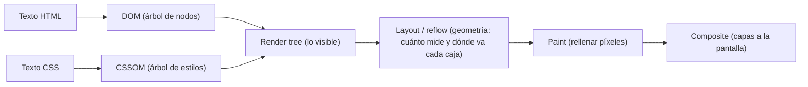

import Reto from "@components/Reto.astro";
import Solucion from "@components/Solucion.astro";
import Quiz from "@components/Quiz.astro";
import CheckDominio from "@components/CheckDominio.astro";
import Nivel from "@components/Nivel.astro";

<Nivel nivel="básico" />

## 1. Qué vas a saber hacer

Esta es la primera lección de frontend. Antes de tocar Tailwind, React o Next.js vas a entender **la base que todos ellos generan por debajo**: HTML (la estructura) y CSS (la presentación). No es un tema "de relleno" para llegar a lo divertido. Tailwind es CSS con nombres cortos; React produce HTML. Si no entiendes el box model y la cascada, vas a *pelear* contra esas herramientas en vez de manejarlas, y no vas a saber por qué tu layout se rompe.

Al terminar, sin IA y sin notas, podrás:

- **O1 — Estructurar** una página con HTML **semántico** (los landmarks `header`, `nav`, `main`, `article`, `section`, `aside`, `footer`), explicando **por qué** mejoran la accesibilidad y el SEO frente a llenar todo de `div`.
- **O2 — Predecir** qué declaración de CSS gana y qué tamaño real ocupa una caja, aplicando a mano el **box model**, el **flujo normal** y la **cascada/especificidad** — sin abrir el navegador.
- **O3 — Construir** un layout **responsive mobile-first** con **Flexbox** y **Grid**, usando unidades relativas (`rem`/`em`/`%`) y `media queries`, y explicar el trade-off de cuándo usar cada herramienta de layout.

## 2. Por qué importa (el dinero está aquí)

> 💰 **Por qué importa:** React es uno de los skills más pedidos del mercado web, y un AI/Automation Engineer que **también monta la UI de su propia demo** vale más que el que solo entrega un endpoint. Tu portafolio se juega en el **demo en vivo que corre**: si el reclutador abre tu app de IA y el layout está roto o se ve amateur, esa primera impresión te cuesta la entrevista.

Seamos honestos: HTML/CSS **no** va a ser el titular de tu CV como AI Engineer. Pero es el piso sobre el que se para todo lo visible. Y hay un detalle que separa a quien "copia CSS de internet hasta que se ve bien" de quien lo controla: entender que el CSS **no se aplica en el orden que escribes, sino según la cascada y la especificidad**, y que una caja casi nunca mide lo que dice su `width`. Quien no entiende eso vive agregando `!important` a ciegas. Quien lo entiende, depura en diez segundos. Esa diferencia se nota cuando tu demo tiene que estar listo *hoy*.

:::tip[Si ya tocaste HTML/CSS antes]
¿Ya hiciste una página, o copiaste algo de CSS en un proyecto? No te saltes la lección: úsala como **diagnóstico**. Salta directo a los **dos ejercicios Primero-Sin-IA** (sección 7). El primero —predecir a mano qué regla CSS gana y cuánto mide una caja— es justo donde se cae quien "ya sabe CSS" pero nunca calculó una especificidad. Si los cierras limpios en el timebox, valida con el check de dominio (sección 8) y avanza a [`4.2` Tailwind CSS](/fase-4-frontend/4-2-tailwind/). Si te trabas con la especificidad, el box model o mobile-first, vuelve a la sección 4.
:::

## 3. Lo que ya traes (actívalo)

Esta sub-unidad se para sobre lo que viste en Fase 0 sobre **cómo funciona la web**. Reúsalo:

- De [`0.4` Cómo funciona la web y un computador](/fase-0-fundamentos/0-4-web-y-computador/): el **navegador** le pide al servidor un documento por HTTP, y el servidor responde con **texto** (HTML). El navegador no recibe una imagen de la página: recibe instrucciones que él mismo dibuja. Hoy vas a ver *cómo* las dibuja.
- También de F0: cliente-servidor y que **todo viaja como texto plano**. El HTML es ese texto; el CSS es otro texto que viaja aparte y le dice al navegador cómo pintar el primero.

Antes de seguir, responde de memoria:

<Quiz
  question="El servidor te responde con un documento HTML. ¿Qué hace el navegador con ese texto para mostrarte la página?"
  options={[
    "Lo muestra tal cual, como un archivo de texto",
    "Lo parsea para construir un árbol de objetos (el DOM), le aplica el CSS y recién entonces calcula posiciones y pinta píxeles",
    "Se lo manda a Google para que lo renderice y le devuelva una imagen",
  ]}
  answer={1}
  explanation="El navegador convierte el texto HTML en un árbol de objetos (el DOM), parsea el CSS en otro árbol (el CSSOM), los combina en un render tree, calcula la geometría de cada caja (layout) y por último pinta. Entender esta tubería explica por qué un cambio de CSS puede recalcular toda la página."
/>

## 4. Ejemplo resuelto, pensado en voz alta

Voy a construir una pequeña página: una tarjeta de artículo dentro de una página con cabecera, navegación y pie. En el camino paso por todo el temario. **No leas esto como un resultado terminado: léelo como me oirías razonar si estuviera al lado tuyo.**

### 4.1 Primero: cómo el navegador convierte texto en píxeles

Antes de escribir nada, el modelo mental. Cuando llega el HTML, el navegador hace esto:



Razono en voz alta: *"El HTML se vuelve el **DOM**, un árbol de nodos. El CSS se vuelve el **CSSOM**. El navegador los junta en el **render tree** —solo lo que se ve; un elemento con `display: none` ni aparece— y luego hace **layout**: calcular cuánto mide y dónde va cada caja. Recién al final **pinta**. La lección clave: cambiar tamaños o posiciones obliga a recalcular el layout (un *reflow*), que es caro. Por eso conviene entender el box model: te ahorra sorpresas y reflows innecesarios."*

### 4.2 La estructura: HTML semántico, no una sopa de `div`

Empiezo por el esqueleto. La tentación del principiante es escribir todo con `div`:

```html
<div class="cabecera">...</div>
<div class="menu">...</div>
<div class="contenido">...</div>
<div class="pie">...</div>
```

Eso **funciona visualmente**, pero es lo que llamamos *div-soup*: para el navegador, un lector de pantalla o Google, son todas cajas anónimas idénticas. La versión semántica usa etiquetas que **dicen qué son**:

```html
<!DOCTYPE html>
<html lang="es">
  <head>
    <meta charset="utf-8" />
    <meta name="viewport" content="width=device-width, initial-scale=1" />
    <title>Mi blog de IA</title>
    <link rel="stylesheet" href="styles.css" />
  </head>
  <body>
    <header>
      <h1>Mi blog de IA</h1>
      <nav aria-label="Principal">
        <a href="/">Inicio</a>
        <a href="/articulos">Artículos</a>
      </nav>
    </header>

    <main>
      <article>
        <h2>Qué es un embedding</h2>
        <p>Un embedding es un vector que representa significado…</p>
      </article>
    </main>

    <footer>
      <p>© 2026 — hecho a mano, sin frameworks.</p>
    </footer>
  </body>
</html>
```

Razono: *"`header`, `nav`, `main`, `article`, `footer` son **landmarks**. Para mí se ven igual que un `div`, pero para una tecnología de asistencia son señales de navegación: un usuario de lector de pantalla puede saltar directo al `main` o listar los landmarks como un índice. Google los usa para entender la jerarquía del contenido (mejor SEO). Y el `lang='es'` en `html` le dice al lector de pantalla en qué idioma pronunciar. Nada de esto cuesta más HTML —es la **misma cantidad de etiquetas**, solo que con nombre."*

Reglas que aplico siempre:

- **Un solo `h1` por página** (el título principal), y los encabezados bajan en orden (`h1` → `h2` → `h3`) sin saltarse niveles. La jerarquía de encabezados **es** el índice del documento.
- `main` es **único** y envuelve el contenido central (no el header ni el footer repetidos).
- `section` necesita un encabezado que la titule; si solo quieres una caja para estilar, eso **sí** es un `div`. `div` y `span` no están prohibidos: son los elementos **sin** significado, justo para cuando no hay un significado que comunicar.
- Las imágenes llevan `alt` describiendo lo que muestran (o `alt=""` si son puramente decorativas).

:::note[El `<head>` y el `viewport` no son opcionales]
Ese `<meta name="viewport" ...>` le dice al móvil que use el ancho real del dispositivo en vez de fingir una pantalla de escritorio y encoger todo. **Sin esa línea, tu diseño responsive no funciona en el celular**, por más `media queries` que escribas. Es el error #1 de "se ve bien en mi compu pero horrible en el teléfono".
:::

### 4.3 El box model: por qué tu caja de 300px mide 350

Ahora el CSS. La idea más importante de todo el CSS: **cada elemento es una caja** compuesta por cuatro capas, de adentro hacia afuera: **content** (el contenido), **padding** (relleno interno), **border** (borde) y **margin** (espacio externo).

```css
.tarjeta {
  width: 300px;
  padding: 20px;
  border: 5px solid #ccc;
  margin: 16px;
}
```

Razono en voz alta: *"Pregunta trampa: ¿cuánto espacio horizontal ocupa esa tarjeta? Mi instinto dice 300px. **Está mal.** Por defecto (`box-sizing: content-box`), el `width` se refiere **solo al content**. El padding y el border se **suman** por fuera: 300 + 20·2 (padding) + 5·2 (border) = **350px** de ancho visible. El margin (16px a cada lado) es espacio adicional, pero por fuera de la caja. Por eso 'mi columna de 300px no cabe' es el bug clásico."*

La solución que usa todo el mundo profesional:

```css
*, *::before, *::after {
  box-sizing: border-box;
}
```

*"Con `border-box`, el `width: 300px` incluye padding y border: la caja mide **exactamente** 300px y el content se encoge para acomodarlos. Es mucho más predecible. Esta regla con el `*` (selector universal) suele ir al principio de toda hoja de estilos. Tailwind, por cierto, ya la pone por ti —pero ahora sabes qué hace."*

### 4.4 Flujo normal, selectores y la cascada (la parte que casi nadie entiende)

Sin CSS de posición, los elementos siguen el **flujo normal**: los elementos **block** (`div`, `p`, `h1`, `article`…) se apilan uno **debajo** del otro y ocupan todo el ancho disponible; los **inline** (`a`, `span`, `strong`…) fluyen **en línea**, uno al lado del otro, como palabras en un párrafo. Casi todo el layout consiste en *negociar* con este flujo, no en pelearlo.

Para aplicar estilos, los **selectores** apuntan a elementos:

```css
p { color: black; }            /* por tipo de elemento */
.intro { color: blue; }        /* por clase */
#cabecera { color: green; }     /* por id */
article p { color: gray; }     /* p que sea descendiente de article */
```

¿Y qué pasa cuando **varias reglas tocan el mismo elemento**? Aquí está la pregunta que define si entiendes CSS. La respuesta **no** es "gana la última". La respuesta es la **especificidad**: el navegador le asigna a cada selector un puntaje de tres números `(a, b, c)`:

- **a** = cuántos **id** (`#`) tiene el selector.
- **b** = cuántas **clases**, atributos y pseudo-clases (`.clase`, `[type]`, `:hover`).
- **c** = cuántos **tipos** de elemento y pseudo-elementos (`p`, `article`, `::before`).

Se comparan de izquierda a derecha (un id vence a cualquier cantidad de clases). **Solo si empatan en especificidad** gana la que aparece después (el orden de origen). Veámoslo:

```html
<article class="card" id="main">
  <p class="intro">Hola</p>
</article>
```

```css
p             { color: black; }   /* (0,0,1) */
.intro        { color: blue; }    /* (0,1,0) */
article p     { color: green; }   /* (0,0,2) */
#main .intro  { color: red; }     /* (1,1,0) */
```

Razono paso a paso: *"¿De qué color queda el `<p>`? Las cuatro reglas lo tocan. Comparo especificidades: `#main .intro` es `(1,1,0)` —tiene un id—. Ninguna otra tiene id, así que gana sin importar el orden. El `<p>` queda **rojo**. Fíjate que `article p` `(0,0,2)` le gana a `p` `(0,0,1)` por tener un tipo más, pero ambas pierden contra cualquier clase, porque la columna `b` pesa más que la `c`."*

:::caution[`!important` no es la solución: es la deuda]
Cuando alguien no entiende la especificidad, "arregla" las cosas con `!important`, que salta por encima de toda la cascada. El problema: el siguiente conflicto necesita **otro** `!important`, y terminas en una guerra de importancias imposible de mantener. La regla profesional: usa `!important` casi nunca. Si tu CSS necesita uno, casi siempre es señal de que un selector tiene de más o que el orden de tu hoja está mal.
:::

### 4.5 Flexbox: alinear en una dimensión

Para la barra de navegación quiero los enlaces en fila, separados a los extremos. Eso es **Flexbox**, la herramienta para layout en **una dimensión** (una fila *o* una columna):

```css
header {
  display: flex;
  justify-content: space-between; /* reparte el espacio sobrante en el eje principal */
  align-items: center;            /* centra en el eje cruzado */
  gap: 1rem;                      /* espacio entre hijos, sin hacks de margin */
}
```

*"`display: flex` convierte a `header` en un **contenedor flex** y a sus hijos directos en **items**. `justify-content` controla el eje principal (horizontal por defecto) y `align-items` el cruzado. `gap` es la forma moderna de espaciar —olvídate de poner `margin` a cada hijo. Flexbox es perfecto para barras, botones en fila, centrar una cosa: cuando el problema es **una línea**."*

### 4.6 Grid: layout en dos dimensiones

Para la rejilla de tarjetas del contenido quiero filas **y** columnas a la vez. Eso es **CSS Grid**, la herramienta para **dos dimensiones**:

```css
.tarjetas {
  display: grid;
  grid-template-columns: repeat(auto-fill, minmax(250px, 1fr));
  gap: 1rem;
}
```

Razono: *"Esta línea es magia útil: `repeat(auto-fill, minmax(250px, 1fr))` dice 'haz tantas columnas como quepan, cada una de al menos 250px y que crezcan a partes iguales'. En una pantalla ancha entran 4 columnas; en una angosta, 1 —**sin escribir una sola media query**. Grid resuelve el layout 2D (galerías, dashboards, la estructura de la página). Regla mental: **Flexbox para una dimensión, Grid para dos.** No es 'uno reemplaza al otro': se usan juntos."*

### 4.7 Responsive mobile-first: rem, em, % y media queries

Última pieza: que se vea bien en cualquier pantalla. La estrategia profesional es **mobile-first**: escribes los estilos base para la pantalla **más chica** y luego **añades** complejidad con `media queries` a medida que hay más espacio.

```css
/* Base: móvil. El menú va en columna porque no hay ancho. */
nav {
  display: flex;
  flex-direction: column;
  gap: 0.5rem;
}

/* A partir de 640px (tablet/desktop): el menú pasa a fila. */
@media (min-width: 640px) {
  nav {
    flex-direction: row;
    gap: 1.5rem;
  }
}
```

Y las **unidades**. Evita pegarte a `px` para todo:

- **`rem`** — relativa al `font-size` de la **raíz** (`html`, 16px por defecto). `1rem` = 16px, `1.5rem` = 24px. **Es la que debes usar** para tipografía y espaciado, porque si el usuario sube el tamaño de letra de su navegador (accesibilidad), tu diseño escala con él. Pegarte a `px` ignora esa preferencia.
- **`em`** — relativa al `font-size` del **propio elemento**. Útil para que el padding de un botón escale con su texto.
- **`%`** — relativa al **contenedor padre**. Útil para anchos fluidos.

Razono: *"¿Por qué mobile-first y no al revés? Porque es más fácil **añadir** espacio cuando sobra que **quitarlo** cuando falta. Empezar por el móvil te obliga a priorizar el contenido esencial; lo demás se agrega con `min-width`. Y por qué `rem`: si maqueto todo en `px`, un usuario con baja visión que sube la fuente del navegador no ve ningún cambio —rompí su accesibilidad sin darme cuenta. Con `rem`, todo respira con él."*

## 5. Non-examples y misconceptions (lee esto, te ahorra horas)

:::caution[Errores que parecen correctos pero no lo son]

- **"`<section>` es un `<div>` con mejor nombre, lo uso para cualquier caja."** Falso. `section` es una sección **temática del contenido** y necesita un encabezado que la titule. Para una caja que solo agrupas para estilar (un wrapper de layout), el elemento correcto es `div`. Usar `section` por todos lados ensucia el outline de landmarks tanto como abusar de `div`.

- **"El último CSS que escribo siempre gana."** Falso, y es el malentendido #1. Solo gana el último **cuando hay empate de especificidad**. Una regla con `#id` escrita arriba le gana a diez reglas con `.clase` escritas abajo. Si "no me toma el estilo", lo primero a revisar es la especificidad, no el orden.

- **"`width: 300px` significa que la caja mide 300px."** Falso por defecto. Con `content-box` (el default), padding y border se suman por fuera. Por eso casi todos ponen `box-sizing: border-box` al inicio.

- **"Maqueto en `px` que es exacto y se acabó."** Funciona, pero rompe la accesibilidad: ignora la preferencia de tamaño de fuente del usuario. Usa `rem` para tipografía y espaciado.

- **"Flexbox o Grid, tengo que elegir uno."** No. Flexbox es 1D (una fila o columna), Grid es 2D (filas y columnas). En una app real usas **ambos**: Grid para la estructura de la página, Flexbox dentro de cada componente.

- **"Diseño primero para desktop porque es donde trabajo."** Es el camino difícil. Desktop-first te obliga a *deshacer* estilos con `max-width` en cada pantalla menor. Mobile-first **añade** con `min-width` y sale más limpio.

- **"Como tengo un menú con enlaces, no necesito `<nav>`; total se ve igual."** Se ve igual para ti. Para un lector de pantalla, `<nav>` es un punto de salto declarado. Quitarlo no cambia el píxel, pero borra una ayuda de navegación. La semántica es invisible **hasta que** la necesita quien depende de ella.
:::

:::note[Un detalle de seguridad que ya puedes adoptar]
Si abres un enlace externo en una pestaña nueva con `target="_blank"`, añade `rel="noopener noreferrer"`. Sin `noopener`, la página que abres obtiene una referencia a la tuya (`window.opener`) y puede redirigirla a un sitio de phishing —se llama *reverse tabnabbing*. Los navegadores modernos ya lo aplican implícitamente con `target="_blank"`, pero escribirlo explícito es el hábito correcto (OWASP). La seguridad web empieza incluso en el HTML.
:::

## 6. Práctica con andamiaje (PRIMM)

Antes de los ejercicios sin red, calienta con piezas pequeñas. Predice **antes** de cualquier otra cosa.

### 6.1 PREDICT — ¿cuánto mide y de qué color?

Sin abrir el navegador, predice el **ancho total visible** del `div` y el **color de su texto**:

```html
<style>
  *, *::before, *::after { box-sizing: content-box; }
  .caja { width: 200px; padding: 10px; border: 2px solid; }
  div { color: black; }
  .caja { color: blue; }
  #destacado { color: green; }
</style>

<div class="caja" id="destacado">Texto</div>
```

Escribe en un papel: ancho total = ? · color = ? · **por qué**. (La respuesta y el porqué están en la sección 4.3 y 4.4.)

<Solucion title="Ver respuesta (después de predecir)">

**Ancho = 224px.** Con `content-box`, el `width: 200px` es solo el content; se suman padding (10·2 = 20) y border (2·2 = 4): 200 + 20 + 4 = **224px**.

**Color = verde.** Especificidades: `div` = `(0,0,1)`, `.caja` = `(0,1,0)`, `#destacado` = `(1,0,0)`. El id gana a todo: **verde**. El orden no importa aquí porque no hay empate.
</Solucion>

### 6.2 PARSONS — ordena un CSS mobile-first

Estas líneas están **desordenadas**. Reordénalas para que el resultado sea **mobile-first correcto**: tarjetas en columna por defecto, en fila a partir de 700px.

```css
  }
@media (min-width: 700px) {
.tarjetas { display: flex; flex-direction: column; gap: 1rem; }
  .tarjetas { flex-direction: row; }
```

<Solucion title="Ver el orden correcto">

```css
.tarjetas { display: flex; flex-direction: column; gap: 1rem; }

@media (min-width: 700px) {
  .tarjetas { flex-direction: row; }
}
```

La lógica: el estilo **base** (móvil, columna) va primero, **fuera** de toda media query. La media query con `min-width` **añade** el cambio (fila) cuando hay al menos 700px de ancho. Eso es mobile-first: base = pantalla chica, las queries agregan a partir de ahí.
</Solucion>

### 6.3 MODIFY

Toma la rejilla de la sección 4.6 (`grid-template-columns: repeat(auto-fill, minmax(250px, 1fr))`). Modifícala para que cada columna mida **al menos 180px** en vez de 250px. Predice **antes de probar**: con un contenedor de 800px, ¿cuántas columnas entran con 250px de mínimo? ¿Y con 180px? (Pista: divide el ancho disponible por el mínimo y trunca hacia abajo.)

## 7. Ejercicios Primero-Sin-IA

Ahora sin andamiaje. Resuélvelos **a mano, sin IA** dentro del timebox. El primero entrena tu modelo mental del box model y la cascada (predecir sin ejecutar); el segundo te hace construir una página real con estructura semántica y layout responsive. Está bien que sea lento: el músculo se construye con el esfuerzo, no con la respuesta.

<Reto title="Especificidad y box model a mano" timebox="25–35 min">

**Modalidad: a mano, sin navegador, sin IA.** Te dan un fragmento de HTML y un bloque de CSS con reglas que se pisan. Tu trabajo es **predecir**, razonando como el navegador: qué color final tiene cada elemento (aplicando especificidad + cascada) y cuánto mide una caja (aplicando el box model). **Solo después** abres el navegador (o las DevTools) para verificar.

Enunciado completo, fragmento a trazar y qué entregar: `ejercicios/fase-4/especificidad-cascada-a-mano/` (carpeta del repo).

**Hecho significa:**
- [ ] Entregaste una **tabla de especificidad** `(a,b,c)` por cada regla en conflicto, no solo el color final.
- [ ] Predijiste el color de cada elemento **antes** de abrir el navegador, con el porqué.
- [ ] Calculaste el ancho total de la caja indicada bajo `content-box` **y** bajo `border-box`.
- [ ] Verificaste con DevTools y, si fallaste, escribiste en 2–3 frases **qué idea** tenías mal (no "me equivoqué en un número").
- [ ] Puedes explicar, sin notas, por qué un `#id` le gana a diez `.clase`.

<Solucion title="Pista (ábrela solo si superaste el timebox)">
Para el color: arma la tabla `(a,b,c)` de **cada** selector que toque el elemento (cuenta ids, luego clases/atributos/pseudo-clases, luego tipos). Compara columna por columna de izquierda a derecha; el orden de escritura **solo** desempata cuando los tres números son iguales. Para la caja: recuerda que con `content-box` el `width` es solo el content y se le suman `padding·2` y `border·2`; con `border-box` el `width` ya incluye padding y border. Esto es una pista, no la solución.
</Solucion>

</Reto>

<Reto title="Landing semántica y responsive (sin frameworks)" timebox="40–50 min">

**Empieza por una mini-spec** (3–5 líneas): qué secciones tiene la página y cómo se reacomodan en móvil vs. desktop. Luego construye, con HTML + CSS **a mano** (sin Tailwind, sin librerías), una landing de una "app de IA" ficticia que cumpla la estructura semántica y el layout responsive que pide el enunciado.

Hay un test (`node --test`) que verifica el **esqueleto semántico** (landmarks presentes, un solo `h1`, `alt` en imágenes, `meta viewport`, que uses una media query y grid/flex). Ojo: el test comprueba que la **estructura** está; que se *vea bien* lo juzgan tu ojo y el corrector IA. Las dos cosas importan.

Enunciado completo, spec, starter (`index.html`, `styles.css`) y tests: `ejercicios/fase-4/landing-semantica-responsive/` (carpeta del repo).

**Hecho significa:**
- [ ] La página usa landmarks reales (`header`, `nav`, `main`, `footer`) y **un solo `h1`**, con encabezados en orden.
- [ ] Es **mobile-first**: estilos base para móvil + al menos una `media query` con `min-width` que reacomoda el layout.
- [ ] Usas **Grid** para la rejilla de tarjetas y **Flexbox** para una fila (p. ej. la nav), y puedes justificar por qué cada uno.
- [ ] Tipografía y espaciado en `rem` (no todo en `px`); `box-sizing: border-box` aplicado.
- [ ] Las imágenes tienen `alt`; `html` tiene `lang`; el `<head>` tiene `meta charset` y `meta viewport`.
- [ ] Todos los tests pasan y escribiste la mini-spec + 1–2 líneas de decisión (por qué Grid aquí, Flexbox allá).

<Solucion title="Pista (ábrela solo si superaste el timebox)">
Arranca por el **HTML semántico** completo y sin estilos: `header` con `h1` + `nav`, `main` con un contenedor de tarjetas (cada tarjeta es un `article` con su `h2`), y `footer`. Verifica que se lee bien **sin CSS** (esa es la prueba de que la estructura es correcta). Recién entonces estila: primero `box-sizing: border-box` y los estilos móviles (todo en columna), luego una `@media (min-width: ...)` que pase la nav a fila y active el `grid-template-columns: repeat(auto-fill, minmax(..., 1fr))` de las tarjetas. Pista, no solución.
</Solucion>

</Reto>

## 8. Check de dominio

Sin mirar la lección, en voz alta o por escrito:

<CheckDominio
  items={[
    "Nombrar cinco landmarks semánticos y explicar qué gana un lector de pantalla con ellos frente a una sopa de div.",
    "Calcular el ancho total de una caja con width, padding y border, en content-box y en border-box.",
    "Explicar la especificidad (a,b,c) y por qué un id le gana a varias clases sin importar el orden.",
    "Decir cuándo usar Flexbox y cuándo Grid, con un ejemplo de cada uno.",
    "Explicar qué es mobile-first y por qué se prefiere a desktop-first.",
    "Justificar por qué usar rem en vez de px para tipografía mejora la accesibilidad.",
  ]}
/>

Si marcaste menos de cinco, vuelve a la sección correspondiente **antes** de avanzar. No es un examen: es honestidad contigo.

<Quiz
  question="Dos reglas tocan el mismo párrafo: `.destacado` (escrita primero) le pone color rojo, y `#aviso p` (escrita después) le pone azul. ¿De qué color queda?"
  options={[
    "Rojo, porque .destacado se escribió primero",
    "Azul, porque #aviso p tiene mayor especificidad (un id) y eso vence al orden",
    "Azul, solo porque se escribió después",
  ]}
  answer={1}
  explanation="Especificidades: .destacado = (0,1,0); #aviso p = (1,0,1). El id de la segunda regla la hace más específica, así que gana sin importar el orden. El orden de escritura solo desempata cuando la especificidad es idéntica. Confundir 'gana el último' con 'gana el más específico' es el error #1 al depurar CSS."
/>

## 9. Recursos (documentación oficial primero)

- **MDN — HTML: elementos semánticos / estructura del documento:** [developer.mozilla.org/.../HTML/Element](https://developer.mozilla.org/en-US/docs/Web/HTML/Element) — la referencia de cada etiqueta y qué significa.
- **MDN — The box model:** [developer.mozilla.org/.../The_box_model](https://developer.mozilla.org/en-US/docs/Learn_web_development/Core/Styling_basics/Box_model) — content/padding/border/margin con diagramas.
- **MDN — Specificity:** [developer.mozilla.org/.../Specificity](https://developer.mozilla.org/en-US/docs/Web/CSS/CSS_cascade/Specificity) — cómo se calcula `(a,b,c)`, con ejemplos.
- **MDN — Flexbox:** [developer.mozilla.org/.../Flexbox](https://developer.mozilla.org/en-US/docs/Web/CSS/CSS_flexible_box_layout/Basic_concepts_of_flexbox) — conceptos básicos del layout 1D.
- **MDN — CSS Grid Layout:** [developer.mozilla.org/.../Grid_layout](https://developer.mozilla.org/en-US/docs/Web/CSS/CSS_grid_layout/Basic_concepts_of_grid_layout) — el layout 2D paso a paso.
- **web.dev — Learn CSS (Google):** [web.dev/learn/css](https://web.dev/learn/css/) — curso oficial moderno, gratuito; excelente para box model y layout.
- **MDN — Responsive design / media queries:** [developer.mozilla.org/.../Responsive_Design](https://developer.mozilla.org/en-US/docs/Learn_web_development/Core/CSS_layout/Responsive_Design) — mobile-first, unidades y `media queries`.
- **WHATWG — HTML Standard (la fuente de verdad de HTML):** [html.spec.whatwg.org](https://html.spec.whatwg.org/) — densa, pero es el estándar real.

## 10. Conexión con el capstone de la fase

El [**Capstone F4 — Frontend de una app de IA**](/fase-4-frontend/proyecto/) te pide construir, en Next.js + TypeScript, la interfaz de una app de chat/RAG con streaming sobre tu backend de la Fase 3. Esta lección es el cimiento invisible de ese proyecto:

- React generará HTML: si tu árbol de componentes produce *div-soup*, tu app falla el **gate de accesibilidad** (WCAG 2.2) que [`4.4`](/fase-4-frontend/4-4-accesibilidad-wcag/) declara obligatorio en el capstone. La semántica que practicaste hoy es lo que hace que un lector de pantalla pueda usar tu chat.
- El layout responsive (Grid + Flexbox + mobile-first) es lo que hace que tu demo se vea bien en el teléfono del reclutador, no solo en tu monitor.
- [`4.2` Tailwind](/fase-4-frontend/4-2-tailwind/) es **este mismo CSS** con clases utilitarias: `p-4` es `padding: 1rem`, `flex` es `display: flex`. Sin entender el box model y la cascada de hoy, Tailwind es magia que no puedes depurar.

## 11. Reflexión y repaso espaciado

Cierra escribiendo dos o tres frases: **¿qué idea de CSS te chocó más con tu intuición —que `width` no es el ancho real, que "el último gana" es falso, o que `px` puede romper la accesibilidad— y por qué?** Nombrar la fricción con precisión es lo que la convierte en algo que ya no te va a sorprender.

Gancho de **spaced repetition**:

- **Mañana:** sin mirar, dibuja en papel el box model (las cuatro capas) y calcula el ancho total de una caja `width: 250px; padding: 16px; border: 1px` en `content-box` y en `border-box`.
- **En 3 días:** toma el ejercicio de la landing y agrégale un `aside` semántico (una barra lateral) que en móvil vaya **debajo** del `main` y en desktop **al lado** (Grid de 2 columnas con media query). Sin volver a leer tu solución vieja.
- **En 1 semana:** explícale a alguien (o a una grabación) la diferencia entre Flexbox y Grid con un ejemplo de cada uno, y por qué `#id` le gana a `.clase`. Enseñarlo es el test de dominio definitivo —y es justo el tipo de pregunta de fundamentos que cae en una entrevista de frontend.
