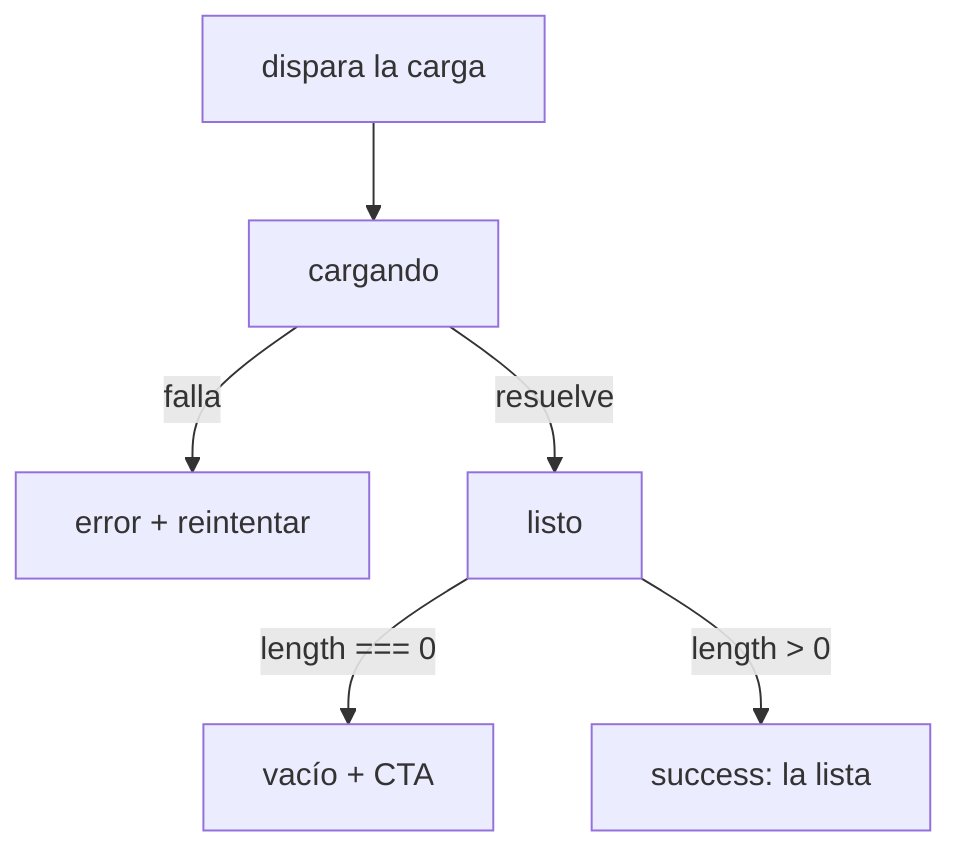
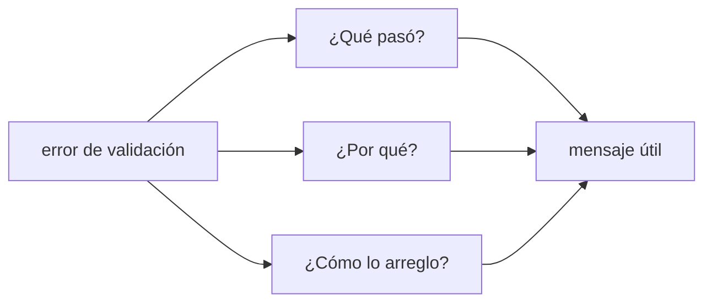

import Reto from "@components/Reto.astro";
import Solucion from "@components/Solucion.astro";
import Quiz from "@components/Quiz.astro";
import CheckDominio from "@components/CheckDominio.astro";
import Nivel from "@components/Nivel.astro";

<Nivel nivel="intermedio" />

Ya sabes montar componentes en React ([4.5](/fase-4-frontend/4-5-react-typescript/)) y traer datos del servidor con TanStack Query ([4.7](/fase-4-frontend/4-7-estado-y-datos/)). Esta lección no agrega una librería nueva: agrega **criterio**. Es la diferencia entre una interfaz que "funciona en tu máquina con buen internet" y una que **no se rompe delante de quien la evalúa**. Vas a aprender el vocabulario con el que un revisor senior diagnostica una UI (las **heurísticas de Nielsen**), y el hábito que separa al junior del que no lo es: tratar **empty, loading, error y success** como cuatro pantallas que diseñas a propósito, no como un detalle que aparece "si sobra tiempo".

> La trampa de esta lección: programar solo el **happy path** —el caso en que los datos llegan, llegan rápido y hay varios—. Es el error #1 del junior. La app se ve perfecta en la demo ensayada y luego, en vivo, alguien busca algo que no existe y ve una pantalla en blanco; o el wifi del café tarda y ve un spinner eterno sin saber si se colgó; o el backend devuelve 500 y la UI miente diciendo "no hay resultados". Los datos no siempre llegan. La regla que vas a interiorizar hoy: **cada vista que carga datos tiene cuatro estados, y los cuatro se dibujan.**

:::tip[Si ya lo tocaste]
Si ya construiste UIs "con loading y error" antes, no te saltes la lección: úsala de diagnóstico. Salta a los **tres ejercicios Primero-Sin-IA** (sección 7). Si en el ejercicio de código dejas el test en verde con los **cuatro** estados distintos y **accesibles** (loading anunciado con `role="status"`, error con `role="alert"` y reintento, empty con CTA, success con lista), en la auditoría nombras la **heurística de Nielsen concreta** que viola cada problema (no "se ve mal"), y en el de formularios reescribes los mensajes de error y justificas el *timing* de validación, valida con el check de dominio (sección 8) y avanza a [4.11 UI para apps de IA](/fase-4-frontend/4-11-ui-apps-ia/). Si dudaste en "¿el empty es un estado aparte del success?", vuelve a la sección 4.
:::

## 1. Qué vas a saber hacer

Al terminar, sin IA y sin notas, podrás:

- **O1 — Diseñar e implementar** los **cuatro estados de primera clase** (empty / loading / error / success) de una vista que carga datos, modelando el estado como una **máquina de estados** y renderizando cada rama de forma **distinta y accesible**.
- **O2 — Auditar** una interfaz nombrando, por cada problema, la **heurística de Nielsen** concreta que viola (no "se ve mal") y **priorizar** las correcciones por impacto.
- **O3 — Rediseñar** la UX de un formulario aplicando **prevención de errores**, validación con buen *timing*, mensajes claros y constructivos, *affordances* y feedback, conectándolo con la accesibilidad.

## 2. Por qué importa (el dinero está aquí)

> 💰 **Por qué importa:** React (44%) es de los skills más pedidos, y un AI Engineer que monta la UI de su propia demo vale más. Pero "monté una UI" no impresiona a nadie: lo que separa tu portafolio del de los otros 200 candidatos con el mismo proyecto RAG es que **la tuya no se cae cuando algo sale mal**. Los estados de primera clase y el vocabulario de usabilidad son baratos de aprender, casi nadie junior los hace bien, y son exactamente lo que un evaluador rompe a propósito en una entrevista.

Tres razones concretas, sin inflar:

- **Tu demo se evalúa en vivo, no ensayada.** Quien revisa tu app va a buscar algo que no existe, va a tener mal internet, va a recargar a mitad de carga. Si cada uno de esos caminos termina en una pantalla útil (no en blanco, no en un spinner infinito, no en un error de consola), demuestras criterio de producción. Si termina en blanco, da igual lo lindo que se vea el happy path.
- **"Usabilidad" deja de ser opinión cuando tiene nombre.** Decir "esto se ve raro" no sirve en un code review. Decir "esto viola *Visibilidad del estado del sistema*: el botón no da feedback de que la acción está en curso" es accionable. Las heurísticas de Nielsen te dan el lenguaje compartido que te hace un revisor creíble —y un mejor cliente de la IA, porque puedes pedir correcciones precisas—.
- **Es un gate del Definition of Done.** El criterio del curso es explícito: todo capstone con UI debe tener **estados completos (empty/loading/error/success)** además de [a11y mínima WCAG 2.2](/fase-4-frontend/4-4-accesibilidad-wcag/). Si tu [Capstone F4](/fase-4-frontend/proyecto/) muestra una pantalla en blanco cuando el RAG no encuentra fuentes, **no está terminado**.

## 3. Lo que ya traes (actívalo)

Esta lección se para sobre cosas que ya hiciste:

- De [4.7 Estado y datos](/fase-4-frontend/4-7-estado-y-datos/): `useQuery` te da `isPending` (cargando), `isError` (error) y `data` (éxito). Hoy descubres lo que **no** te da: la diferencia entre "éxito con datos" y "éxito con cero datos". Ese **empty** es lógica de tu aplicación, y es justo el estado que el junior olvida.
- De [4.4 Accesibilidad WCAG 2.2](/fase-4-frontend/4-4-accesibilidad-wcag/): `role="alert"` y `aria-live` para anunciar contenido dinámico. Hoy se cierran: un estado de error que no se anuncia a un lector de pantalla no es un estado de error útil.

Antes de seguir, responde de memoria:

<Quiz
  question="En 4.7, tu useQuery devuelve status 'success' y data = [] (un arreglo vacío). ¿Qué estado debe ver el usuario?"
  options={[
    "El mismo que cuando hay datos: una lista (vacía), porque success es success",
    "Un estado 'empty' diseñado a propósito (mensaje + una acción para avanzar), distinto del de error y del de carga",
    "Un mensaje de error, porque no llegó nada",
  ]}
  answer={1}
  explanation="status === 'success' con data.length === 0 NO es un error (la petición salió bien) ni una carga (ya terminó): es un estado vacío legítimo. TanStack Query no lo distingue por ti —te da pending/error/success—; ese check (data.length === 0) y la pantalla que lo acompaña son tu responsabilidad. Mostrar una lista vacía sin explicación es el bug del happy path; mostrar un error es mentir."
/>

## 4. Ejemplo resuelto, pensado en voz alta

Voy a construir el panel de **fuentes** de un chat RAG —el tipo de componente que harás en el capstone: cuando la IA responde, este panel muestra los documentos que citó—. Empiezo como lo escribiría alguien que solo piensa en el happy path, veo cómo se rompe, y lo arreglo. **No leas esto como reglas sueltas: léelo como me oirías razonar al lado tuyo.**

Primer intento, el del happy path:

```tsx
function PanelFuentes({ fuentes }: { fuentes: Fuente[] }) {
  return (
    <ul>
      {fuentes.map((f) => (
        <li key={f.id}><a href={f.url}>{f.titulo}</a></li>
      ))}
    </ul>
  );
}
```

Pienso en voz alta: *"Esto se ve bien en mi demo, donde siempre paso tres fuentes de prueba. Pero pensemos como un auditor que quiere romperlo. Pregunta uno: ¿de dónde salen las `fuentes`? De una llamada al backend, que **tarda**. Mientras tarda, ¿qué ve el usuario? Nada. Pregunta dos: ¿y si la llamada **falla** (500, sin red)? El componente ni se entera; probablemente reviente más arriba o quede en blanco. Pregunta tres: ¿y si la IA respondió pero **no citó ninguna fuente** (`fuentes = []`)? El `.map` sobre un arreglo vacío renderiza un `<ul>` vacío: una caja en blanco sin explicación. Tres caminos rotos. El componente no recibe `fuentes` ya listas: tiene que **cargarlas**, y cargar algo es una máquina de cuatro estados."*

### 4.1 La idea central: modela el estado como datos

El error de raíz del primer intento es que asume que los datos *están*. La realidad es que una carga pasa por **fases**, y conviene representarlas como un único valor (una *máquina de estados*) en vez de tres booleanos sueltos (`cargando`, `hayError`, `hayDatos`) que pueden contradecirse entre sí (¿qué significa `cargando=true` y `hayError=true` a la vez?). Un tipo unión discriminada hace **imposibles** esos estados imposibles:

```tsx
type Estado =
  | { fase: "cargando" }
  | { fase: "error"; mensaje: string }
  | { fase: "listo"; fuentes: Fuente[] };
```

Fíjate en lo importante: **no hay una fase `"vacío"`**. El vacío no es una fase de la carga —la petición terminó bien—; es un **caso dentro de `"listo"`**: `fuentes.length === 0`. Esto es exactamente lo que viste en [4.7](/fase-4-frontend/4-7-estado-y-datos/): `useQuery` te da `pending | error | success`, y el empty lo decides tú mirando `data`.



### 4.2 Las cuatro ramas, una por una

Ahora el componente carga sus datos y dibuja **cada** rama. Léelo y después desgloso cada decisión:

```tsx
import { useEffect, useState } from "react";

interface Fuente { id: string; titulo: string; url: string; }

type Estado =
  | { fase: "cargando" }
  | { fase: "error"; mensaje: string }
  | { fase: "listo"; fuentes: Fuente[] };

function PanelFuentes({ consulta }: { consulta: string }) {
  const [estado, setEstado] = useState<Estado>({ fase: "cargando" });

  function buscar() {
    setEstado({ fase: "cargando" });
    fetch(`/api/fuentes?q=${encodeURIComponent(consulta)}`)
      .then((res) => {
        if (!res.ok) throw new Error(`HTTP ${res.status}`); // sin esto, un 500 nunca se ve como error
        return res.json() as Promise<Fuente[]>;
      })
      .then((fuentes) => setEstado({ fase: "listo", fuentes }))
      .catch((e: unknown) =>
        setEstado({ fase: "error", mensaje: e instanceof Error ? e.message : "Error desconocido" }),
      );
  }

  useEffect(buscar, [consulta]);

  switch (estado.fase) {
    case "cargando":
      // 1) LOADING: anunciado a lectores de pantalla; idealmente un skeleton, no solo un spinner.
      return <p role="status">Buscando fuentes…</p>;

    case "error":
      // 2) ERROR: anunciado (role="alert"), mensaje humano y una ACCIÓN para recuperarse.
      return (
        <div role="alert">
          <p>No pudimos cargar las fuentes. Revisa tu conexión.</p>
          <button type="button" onClick={buscar}>Reintentar</button>
        </div>
      );

    case "listo":
      // 3) EMPTY: éxito sin datos. No es error: es una oportunidad de guiar al usuario.
      if (estado.fuentes.length === 0) {
        return (
          <div>
            <p>La IA respondió sin citar fuentes para “{consulta}”.</p>
            <button type="button" onClick={buscar}>Ampliar la búsqueda</button>
          </div>
        );
      }
      // 4) SUCCESS: el happy path, que ahora es solo UNA de las cuatro ramas.
      return (
        <ul>
          {estado.fuentes.map((f) => (
            <li key={f.id}><a href={f.url}>{f.titulo}</a></li>
          ))}
        </ul>
      );
  }
}
```

Pienso en voz alta, rama por rama: *"**Cargando**: un texto con `role='status'` para que el lector de pantalla anuncie 'Buscando fuentes' sin que el usuario tenga que ir a buscarlo. En producción preferiría un **skeleton** (cajas grises con la forma del contenido) antes que un spinner: comunica qué va a aparecer y reserva el espacio, así no hay un salto cuando llega el contenido. **Error**: `role='alert'` para que se anuncie solo, un mensaje en lenguaje humano (no `Error: HTTP 500`) y —lo más importante— un **botón de reintento**: nunca dejes al usuario en un callejón sin salida. **Vacío**: lo dibujo dentro de `listo`, porque la petición salió bien; en vez de una caja en blanco, explico qué pasó y ofrezco una salida ('Ampliar la búsqueda'). **Éxito**: la lista de siempre. El happy path no desapareció; quedó en su sitio, como una de cuatro ramas iguales en importancia."*

> El hilo invisible de este componente: las heurísticas de Nielsen están todas aquí. **Visibilidad del estado del sistema** (el loading dice "estoy trabajando"). **Ayudar a recuperarse de errores** (el mensaje humano + reintentar). **Control y libertad del usuario** (siempre hay una salida). Y se conecta con la a11y de [4.4](/fase-4-frontend/4-4-accesibilidad-wcag/): `role="status"` y `role="alert"` no son adorno, son cómo un usuario de lector de pantalla *se entera* de que el estado cambió.

### 4.3 El catálogo: las 10 heurísticas de Nielsen

Nielsen las publicó en 1994 y siguen siendo el vocabulario estándar de la industria. No son reglas rígidas: son **lentes** para inspeccionar una interfaz. Tenerlas en la cabeza te deja diagnosticar en segundos lo que antes era "mmm, algo no me gusta". Las 10, con su nombre canónico en inglés (el que verás en ofertas y artículos):

| # | Heurística | En una frase | Se rompe cuando… |
|---|---|---|---|
| 1 | **Visibility of system status** | El sistema siempre dice qué está pasando | botón que no responde al click; sin loading ni feedback |
| 2 | **Match with the real world** | Habla el idioma del usuario, no el de la base de datos | `ERR_CODE_42`; "entidad", "registro" en vez de "tarea", "factura" |
| 3 | **User control and freedom** | Salidas de emergencia: deshacer, cancelar, volver | acción destructiva sin deshacer; modal del que no se sale |
| 4 | **Consistency and standards** | Lo mismo se ve y se llama igual en todos lados | "Guardar" aquí, "Enviar" allá para la misma acción |
| 5 | **Error prevention** | Mejor evitar el error que avisarlo | borrar sin confirmar; dejar escribir letras en un campo de monto |
| 6 | **Recognition rather than recall** | Mostrar opciones, no obligar a recordarlas | el usuario debe memorizar un código entre pantallas |
| 7 | **Flexibility and efficiency** | Atajos para expertos sin estorbar al novato | sin shortcuts; mismo flujo lento para todos |
| 8 | **Aesthetic and minimalist design** | Cada elemento de más compite con el importante | pantalla saturada; el CTA perdido entre ruido |
| 9 | **Help recognize, diagnose, recover from errors** | Errores en lenguaje claro + cómo arreglarlos | "Algo salió mal"; error sin acción de salida |
| 10 | **Help and documentation** | Ayuda accesible cuando se necesita | función compleja sin tooltip ni guía |

No las memorices como lista: úsalas como **checklist de inspección**. Cuando algo te incomode de una pantalla, recórrelas y casi siempre una le pone nombre al problema.

### 4.4 UX de formularios: prevenir antes que corregir

El formulario es donde más fricción sufre el usuario, y donde más heurísticas se cruzan. Cuatro decisiones que separan un formulario amable de uno hostil:

- **Prevención (heurística 5) sobre corrección.** El mejor mensaje de error es el que nunca aparece. ¿El campo es un monto? Usa `inputmode="numeric"` y no dejes escribir letras. ¿Hay un formato fijo? Muéstralo de ejemplo. ¿La acción es destructiva? Pide confirmación o, mejor aún, ofrece **deshacer** (heurística 3) en vez de un "¿estás seguro?" que todos clican sin leer.
- **Timing de validación.** Validar en **cada tecla** es hostil: el campo grita "email inválido" cuando llevas escrita la primera letra. La regla práctica: **valida al salir del campo** (`onBlur`) la primera vez, y **en cada tecla solo después** de que el campo ya falló una vez (para que el usuario vea cuándo lo corrige). El submit valida todo al final. Y da feedback **positivo** también: un check verde cuando el campo queda bien.
- **Mensajes claros y constructivos (heurística 9).** Un buen mensaje de error tiene tres partes: **qué** pasó, **por qué**, y **cómo** arreglarlo. "Email inválido" no sirve. "El email necesita un @ (ej: nombre@correo.cl)" sí. Nunca culpes al usuario ("escribiste mal"); describe el problema y la salida.
- **Affordances y feedback.** Un elemento debe *parecer* lo que hace: un botón parece presionable (tiene relieve, cursor de mano, estados hover/focus de [4.4](/fase-4-frontend/4-4-accesibilidad-wcag/)); un campo deshabilitado se ve deshabilitado. Y toda acción da feedback: al enviar, el botón pasa a "Enviando…" y se deshabilita (esto es —otra vez— la máquina de estados: un submit tiene su propio loading/error/success).



## 5. Errores de criterio que vas a tener (y por qué)

:::caution[Podrías pensar que con loading y success basta]
Es el error del happy path con un parche. Loading + success cubre "tarda y luego llega con datos". Pero faltan dos caminos reales: **error** (la petición falla —siempre falla alguna vez—) y **empty** (la petición sale bien pero vuelve sin datos). El empty es el más olvidado porque en tus pruebas siempre hay datos de ejemplo. Resultado: una caja en blanco que el usuario interpreta como "se rompió". Son cuatro estados, no dos ni tres.
:::

:::caution[Podrías pensar que tragarte el error y mostrar una lista vacía "maneja" el fallo]
Al revés: es mentir. Si tu `catch` hace `return []` (o tu `queryFn` se traga el error y devuelve `[]`), la UI dice "no hay resultados" cuando en realidad el servidor está caído. El usuario reintentará buscando otra cosa, no recargando —porque cree que el problema es su búsqueda—. Un error es un error: muéstralo, anúncialo (`role="alert"`) y ofrece reintentar. Esto es lo mismo que viste en [4.7](/fase-4-frontend/4-7-estado-y-datos/): la `queryFn` **debe lanzar** en fallo para que `isError` se active.
:::

:::caution[Podrías pensar que un spinner es un buen estado de carga]
Un spinner que gira para siempre es indistinguible de una app colgada, y además provoca *layout shift* (el contenido salta cuando llega, empujando lo de abajo). Para cargas cortas (menos de un segundo), a veces es mejor no mostrar nada (un parpadeo de spinner molesta). Para cargas con contenido estructurado, un **skeleton** —cajas grises con la forma del contenido— comunica qué va a aparecer y reserva el espacio. El spinner no está prohibido, pero rara vez es la mejor opción.
:::

:::caution[Podrías pensar que el estado vacío es "no hay nada" y basta un texto gris]
El empty es la **primera impresión** de una función y, a menudo, una oportunidad de onboarding. Hay tres vacíos distintos y no se tratan igual: (a) **primer uso** ("aún no tienes tareas" → CTA para crear la primera, tono motivador); (b) **sin resultados de búsqueda** ("nada coincide con 'xyz'" → sugiere ampliar/limpiar el filtro); (c) **todo despejado** ("bandeja vacía, buen trabajo" → celebración). Un "No hay datos" gris desperdicia los tres. El empty siempre **explica** y, cuando puede, **ofrece una acción**.
:::

:::caution[Podrías pensar que validar en cada tecla ayuda al usuario]
La validación agresiva en cada pulsación es de las cosas más hostiles que puedes hacer: el campo te marca en rojo "email inválido" cuando llevas escrita la `a` de `alvaro@…`. Valida **al salir del campo** (`onBlur`) la primera vez; solo si ese campo ya falló, valida en vivo mientras lo corrige (para que vea cuándo queda bien). El submit valida todo. Castigar al usuario por no haber terminado de escribir no es ayudar.
:::

## 6. Práctica con andamiaje (que se desvanece)

Tres pasos, de más apoyo a menos. **A mano primero**, sin IA. Los dos primeros se resuelven razonando, sin ejecutar nada.

### 6.1 PREDICT — ¿qué ve el usuario en cada camino?

Lee este componente (no lo ejecutes). Para cada uno de los tres escenarios, **predice qué ve el usuario en pantalla** y di si la experiencia es buena o mala.

```tsx
function ListaPedidos({ pedidos, cargando }: { pedidos: Pedido[]; cargando: boolean }) {
  if (cargando) return <Spinner />;
  return (
    <ul>
      {pedidos.map((p) => <li key={p.id}>{p.numero}</li>)}
    </ul>
  );
}
```

Escenarios: **(A)** la API tarda 4 segundos y luego devuelve 3 pedidos. **(B)** la API devuelve `[]` (el usuario no tiene pedidos). **(C)** la API responde 500 y el código que llama hace `catch(() => setPedidos([]))`.

<Solucion title="Ver la respuesta (solo después de predecir)">

- **(A)** Spinner 4 segundos, luego la lista. La parte de carga *existe* pero es un spinner (sin skeleton, posible layout shift) y no está anunciado a lectores de pantalla. Aceptable pero mejorable.
- **(B)** Un `<ul>` **vacío**: una caja en blanco. El componente no distingue "éxito sin datos" de nada: `cargando` es `false` y `pedidos` es `[]`, así que cae en el `return` de la lista y mapea sobre cero elementos. El usuario ve la nada y no sabe si se rompió. **Falta el estado empty.**
- **(C)** **Idéntico a (B)**: una caja en blanco, porque el `catch` convirtió el error en `[]`. La UI **miente**: dice "no tienes pedidos" cuando el servidor está caído. **Falta el estado error** y, peor, está enmascarado.

El componente solo modela **dos** estados (cargando / no-cargando) con un booleano. Le faltan **error** y **empty**, y los dos booleanos no pueden representarlos. Por eso se modela como una máquina de estados, no con flags sueltos.
</Solucion>

### 6.2 Parsons — ordena la máquina de estados

Tienes las cuatro ramas de render desordenadas. **Ordénalas** en el orden correcto de los guards (de la que debe chequearse primero a la última) y di **por qué** ese orden importa.

```text
Ramas (desordenadas):
  R1. return <ListaItems items={estado.items} />            // success
  R2. if (estado.fase === "error") return <Error ... />
  R3. if (estado.fase === "cargando") return <Skeleton />
  R4. if (estado.fase === "listo" && estado.items.length === 0) return <Vacio />
```

<Solucion title="Ver el orden y el criterio">

Orden correcto: **R3 → R2 → R4 → R1**.

```tsx
if (estado.fase === "cargando") return <Skeleton />;        // R3
if (estado.fase === "error") return <Error ... />;          // R2
if (estado.fase === "listo" && estado.items.length === 0)
  return <Vacio />;                                          // R4
return <ListaItems items={estado.items} />;                 // R1  (listo con datos)
```

**Por qué este orden:** los estados "transitorios o de fallo" (cargando, error) se chequean **antes**, porque mientras estás en ellos no tienes datos válidos que mostrar. El empty (R4) va **antes** del success (R1) porque es un caso más específico del mismo `fase: "listo"`: si no chequeas `length === 0` primero, caerías en R1 y renderizarías una lista vacía (la caja en blanco). El éxito con datos (R1) es el **último**, el caso por defecto. Regla general: **del estado más específico/excepcional al más general**.
</Solucion>

### 6.3 MODIFY — agrega los estados que faltan (a mano)

Este componente solo dibuja el happy path. Reescríbelo **a mano** para que modele y dibuje los **cuatro** estados, partiendo de una máquina de estados. No necesitas ejecutarlo; escríbelo en un `.tsx` o en papel.

```tsx
function PanelCitas({ citas }: { citas: Cita[] }) {
  return (
    <ul>
      {citas.map((c) => <li key={c.id}>{c.fecha}</li>)}
    </ul>
  );
}
```

Pista: ¿de dónde vienen las `citas`? Cámbialo para que el componente las **cargue** (un `useState<Estado>` + `useEffect`). Define el tipo `Estado` con tres fases (`cargando | error | listo`), y dibuja el empty **dentro** de `listo` cuando `citas.length === 0`. El error necesita `role="alert"` y un botón de reintento; el loading, `role="status"`. Si te cuesta, vuelve al ejemplo resuelto (4.2): tu componente debe tener la misma forma.

## 7. Ejercicios Primero-Sin-IA

Resuélvelos **a mano, sin IA** dentro del timebox. Documentación oficial permitida (NN/g, MDN, React); IA solo al final, para *revisar*, no para *generar*.

<Reto title="Los cuatro estados de primera clase en React (deja el test en verde)" timebox="40 min">

Te damos el esqueleto de un componente `BandejaTareas` que recibe una prop `cargar: () => Promise<Tarea[]>` (una función que trae las tareas del servidor y puede resolver con datos, resolver con `[]`, o rechazar). La carga ya está cableada por ti (`useState` + `useEffect`); tu trabajo es **dibujar las cuatro ramas**.

Hay un test (Vitest + React Testing Library) que verifica el comportamiento de los cuatro estados: que mientras carga haya un indicador con `role="status"`; que al fallar aparezca un `role="alert"` y un botón **Reintentar** que vuelva a llamar a `cargar`; que con `[]` se muestre un estado vacío **con un CTA** (un botón) y **sin** lista ni alerta; y que con datos se renderice la lista. El test arranca en **rojo** a propósito.

Entregable: tu solución en `ejercicios/fase-4/estados-de-primera-clase/` (completa `BandejaTareas.tsx`), con el test en verde.

**Hecho significa:**
- [ ] El **test pasa en verde** (`pnpm install && pnpm test` dentro de la carpeta): las cuatro ramas cumplen.
- [ ] Los **cuatro estados son visual y semánticamente distintos**: nadie confunde "vacío" con "error" ni con "cargando".
- [ ] El **loading se anuncia** (`role="status"`) y el **error se anuncia** (`role="alert"`) — la conexión con [a11y](/fase-4-frontend/4-4-accesibilidad-wcag/).
- [ ] El **error ofrece salida**: un botón "Reintentar" que vuelve a disparar la carga (control y libertad del usuario).
- [ ] El **vacío es accionable**: explica + ofrece un CTA (crear la primera tarea), no es una caja en blanco.
- [ ] El **empty se chequea dentro del éxito** (`tareas.length === 0`), no como una fase aparte de la carga.

Enunciado completo, *starter* y test: `ejercicios/fase-4/estados-de-primera-clase/` (carpeta del repo).

<Solucion title="Pista (ábrela solo si superaste el timebox)">
El esqueleto ya te deja `estado` (una unión `cargando | error | listo`) y la función `ejecutarCarga`. Tu render es un `switch (estado.fase)` o una cadena de `if`. (1) `cargando` → algo con `role="status"`. (2) `error` → un contenedor con `role="alert"`, el `estado.mensaje`, y `<button onClick={ejecutarCarga}>Reintentar</button>`. (3) `listo` → **primero** `if (estado.tareas.length === 0)` devuelve el vacío con un `<button>` de CTA; **si no**, el `<ul>` con `.map` y `key={t.id}`. El error más común aquí es olvidar el `length === 0` y renderizar un `<ul>` vacío. Corre el test entre cada rama para ver cuál falta. Esto es una pista, no la solución.
</Solucion>

</Reto>

<Reto title="Auditoría de usabilidad: nombra la heurística de Nielsen, no el gusto" timebox="30–35 min">

Te damos la descripción de una pantalla real con varios problemas de usabilidad (en `pantalla-a-auditar.md`). Tu tarea **no** es rediseñarla en código, sino **auditarla por escrito**: por cada problema, nombra la **heurística de Nielsen concreta** que viola (con su número y nombre, p. ej. "H1 *Visibility of system status*"), explica por qué, y propón una corrección accionable. Al menos uno de los problemas debe ser un **estado faltante** (empty/loading/error) atado a su heurística.

Este ejercicio entrena el músculo que te hace buen revisor en code review y buen cliente de la IA: **ver el problema y nombrarlo con vocabulario compartido**, en vez de "se ve mal".

Entregable: tu solución en `ejercicios/fase-4/auditoria-heuristica-nielsen/` (un `auditoria.md` con la lista de problemas → heurística → corrección, más un top-3 priorizado).

**Hecho significa:**
- [ ] Identificaste **al menos seis** problemas distintos, cada uno atado a una **heurística de Nielsen concreta** (número + nombre), no a un juicio de gusto.
- [ ] Entre los problemas cubres al menos **un estado faltante** (empty/loading/error) y lo conectas con su heurística (típicamente H1 o H9).
- [ ] Cada problema trae una **corrección accionable** (qué cambiarías, concreto).
- [ ] Distinguiste al menos un caso donde el problema es **prevenir un error** (H5) y no solo avisarlo.
- [ ] El **top-3 priorizado** está justificado por impacto (qué bloquea o confunde a todos vs. qué es molestia menor), no por orden de aparición.

Enunciado completo y *starter*: `ejercicios/fase-4/auditoria-heuristica-nielsen/` (carpeta del repo).

<Solucion title="Pista (ábrela solo si superaste el timebox)">
Recorre la pantalla con las 10 heurísticas como checklist, una por una: ¿el sistema dice qué pasa (H1)? ¿habla el idioma del usuario o el de la BD (H2)? ¿hay salida/deshacer (H3)? ¿es consistente consigo misma (H4)? ¿previene errores o solo los avisa (H5)? ¿obliga a recordar (H6)? ¿hay ruido que tapa lo importante (H8)? ¿los errores dicen cómo recuperarse (H9)? Para los estados, pregunta: ¿qué ve el usuario mientras carga, si falla, si no hay datos? Para priorizar: lo que **bloquea o engaña** a todos va antes que lo que **molesta** a algunos. Esto es una pista, no la solución.
</Solucion>

</Reto>

<Reto title="Rediseña la UX de un formulario hostil" timebox="30–35 min">

Te damos la descripción de un formulario que funciona pero es hostil (en `formulario-actual.md`): valida en cada tecla, sus mensajes de error son vagos o culpan al usuario, no previene errores, no da feedback al enviar y tiene una acción destructiva sin salida. Tu tarea es **rediseñar su UX por escrito** (no en código): reescribir cada mensaje de error, decidir el *timing* de validación de cada campo, agregar prevención, *affordances* y feedback, y atar al menos tres decisiones a la accesibilidad de [4.4](/fase-4-frontend/4-4-accesibilidad-wcag/).

Entregable: tu solución en `ejercicios/fase-4/ux-formulario-prevencion-errores/` (un `rediseno-ux.md`).

**Hecho significa:**
- [ ] **Reescribiste cada mensaje de error** con la estructura qué/por qué/cómo, sin culpar al usuario (de "email inválido" a algo accionable con ejemplo).
- [ ] **Decidiste el *timing* de validación** por campo (onBlur la primera vez / en vivo tras el primer fallo / submit) y lo justificaste.
- [ ] Agregaste al menos **dos medidas de prevención de errores** (H5): constraints de input, formato de ejemplo, confirmación o deshacer para lo destructivo.
- [ ] El **envío tiene sus propios estados** (botón "Enviando…" deshabilitado; éxito y error visibles) — la máquina de estados aplicada al submit.
- [ ] Conectaste al menos **tres** decisiones con la a11y (errores anunciados con `role="alert"`, `<label>` asociados, foco al primer campo con error, contraste del estado de error).

Enunciado completo y *starter*: `ejercicios/fase-4/ux-formulario-prevencion-errores/` (carpeta del repo).

<Solucion title="Pista (ábrela solo si superaste el timebox)">
Para los mensajes, aplica la plantilla de tres partes: **qué** falló, **por qué**, **cómo** se arregla, con un ejemplo entre paréntesis. Para el timing, la regla es "no castigues al que aún escribe": valida al salir del campo, y solo en vivo si ya falló una vez. Para prevención, pregúntate por cada error posible "¿podría haberlo evitado en vez de avisarlo?" (un `inputmode`, un valor por defecto, un selector en vez de texto libre). Para la acción destructiva, "deshacer" (con un toast de 5 s) suele ser mejor UX que un "¿estás seguro?". Para el submit, recuerda que es una carga: tiene loading/error/success igual que cualquier otra. Esto es una pista, no la solución.
</Solucion>

</Reto>

## 8. Check de dominio

Sin mirar la lección, en voz alta o por escrito:

<CheckDominio
  items={[
    "Nombrar los cuatro estados de primera clase y por qué el empty NO es una fase de la carga sino un caso del éxito.",
    "Explicar por qué tragarse un error y devolver [] hace que la UI mienta, y qué pasa en TanStack Query si la queryFn no lanza.",
    "Decidir entre spinner y skeleton para un estado de carga, y nombrar el problema del layout shift.",
    "Distinguir los tres tipos de estado vacío (primer uso / sin resultados / todo despejado) y cómo se tratan distinto.",
    "Recitar al menos seis de las 10 heurísticas de Nielsen y dar un ejemplo de violación de cada una.",
    "Explicar el timing correcto de validación de un formulario y por qué validar en cada tecla es hostil.",
    "Escribir un buen mensaje de error con la estructura qué/por qué/cómo, y conectarlo con role='alert'.",
  ]}
/>

Si marcaste menos de seis, vuelve a la sección correspondiente **antes** de avanzar. No es un examen: es honestidad contigo.

<Quiz
  question="Tu app de chat RAG carga las fuentes citadas. El backend responde 200 con un arreglo vacío porque la IA no citó ninguna fuente. ¿Qué hace una UI seria?"
  options={[
    "Muestra un mensaje de error, porque no llegaron fuentes",
    "Muestra un <ul> vacío: success es success, no hay nada que dibujar",
    "Muestra un estado vacío diseñado a propósito (explica que no hubo fuentes + ofrece una acción), distinto del error y del loading",
  ]}
  answer={2}
  explanation="200 + [] es un éxito sin datos, no un error (la petición salió bien) ni una carga (ya terminó). Mostrar un error mentiría; mostrar un <ul> vacío deja una caja en blanco que el usuario lee como 'se rompió'. La respuesta seria es un estado empty intencional: explica qué pasó y, cuando puede, ofrece una salida. Es exactamente el caso que TanStack Query no distingue por ti (status='success', data.length===0)."
/>

## 9. Recursos (documentación oficial primero)

- **NN/g — 10 Usability Heuristics for User Interface Design** — [nngroup.com/articles/ten-usability-heuristics](https://www.nngroup.com/articles/ten-usability-heuristics/). La fuente autoritativa de Jakob Nielsen; léela completa con sus ejemplos. Es la base de la auditoría de hoy.
- **NN/g — Error-Message Guidelines** — [nngroup.com/articles/error-message-guidelines](https://www.nngroup.com/articles/error-message-guidelines/). Cómo escribir mensajes de error útiles (la estructura qué/por qué/cómo).
- **NN/g — Empty States** — busca "empty state" en nngroup.com. Los tres tipos de vacío y cómo diseñarlos como onboarding, no como callejón.
- **web.dev / MDN — Forms** — [developer.mozilla.org/es/docs/Learn/Forms](https://developer.mozilla.org/es/docs/Learn/Forms). Validación nativa, `inputmode`, constraints y formularios accesibles.
- **WCAG 2.2 (cruce con 4.4)** — [w3.org/TR/WCAG22](https://www.w3.org/TR/WCAG22/). SC 4.1.3 (Status Messages) cubre justamente anunciar loading/error a lectores de pantalla.

## 10. Conexión con el capstone de la fase

El **[Capstone F4 — Frontend de una app de IA](/fase-4-frontend/proyecto/)** tiene los **estados completos** como criterio explícito del Definition of Done, a la par de la [a11y](/fase-4-frontend/4-4-accesibilidad-wcag/). Esta lección es la que te deja cruzar ese gate:

- Tu **lista de conversaciones** y tu **historial de mensajes** (server state de [4.7](/fase-4-frontend/4-7-estado-y-datos/)) necesitan sus cuatro estados: skeleton mientras cargan, error con reintento si el backend falla, un empty que invite a "empezar tu primera conversación", y la lista cuando hay datos. Eso es O1.
- El **panel de fuentes** del RAG es el ejemplo resuelto de esta lección casi tal cual: cuando la IA no cita nada, un empty intencional, no una caja en blanco.
- El **input del prompt** es un formulario: validación amable, botón que pasa a "Enviando…", errores anunciados. Eso es O3, y enlaza con la [UI de streaming](/fase-4-frontend/4-11-ui-apps-ia/) de 4.11, donde el texto que llega token por token necesita `aria-live` —otro estado del sistema hecho visible—.
- Antes de entregar, **audita tu propia UI** con las 10 heurísticas (O2): es el mismo ejercicio de la sección 7, ahora sobre tu app. Si no sabes nombrar lo que está mal, no sabrás arreglarlo.

## 11. Reflexión y repaso espaciado

Cierra escribiendo dos o tres frases: **¿en qué proyecto tuyo (HomeHub, un demo, lo que sea) dejaste una vista que solo dibuja el happy path?** Identifícala con precisión —qué pasa hoy si su API falla o vuelve vacía— porque eso es exactamente lo que un evaluador encontrará primero.

Gancho de **spaced repetition**:

- **Mañana:** toma el componente del ejercicio A y reescríbelo **de memoria**, partiendo del tipo `Estado`. Si no recuerdas dónde va el chequeo de `length === 0`, no internalizaste que el empty vive dentro del éxito —vuelve a la sección 4.1—.
- **En 3 días:** abre una app que uses a diario, desconecta el wifi y úsala. ¿Qué pasa cuando algo falla? ¿Hay reintento? ¿La carga es skeleton o spinner infinito? Encuentra una violación y nombra la heurística de Nielsen.
- **En 1 semana:** audita una pantalla de un proyecto tuyo con las 10 heurísticas y arregla los **estados faltantes**. Es el germen del checklist que aplicarás al [Capstone F4](/fase-4-frontend/proyecto/).
