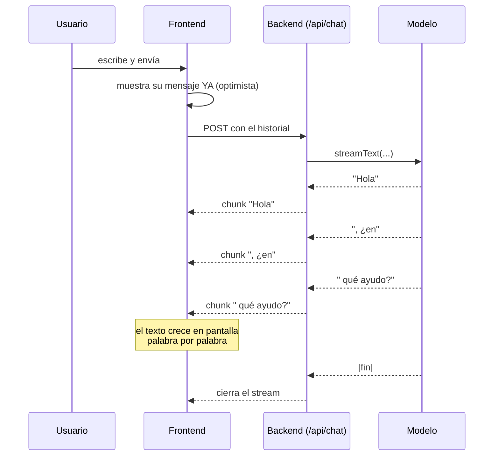
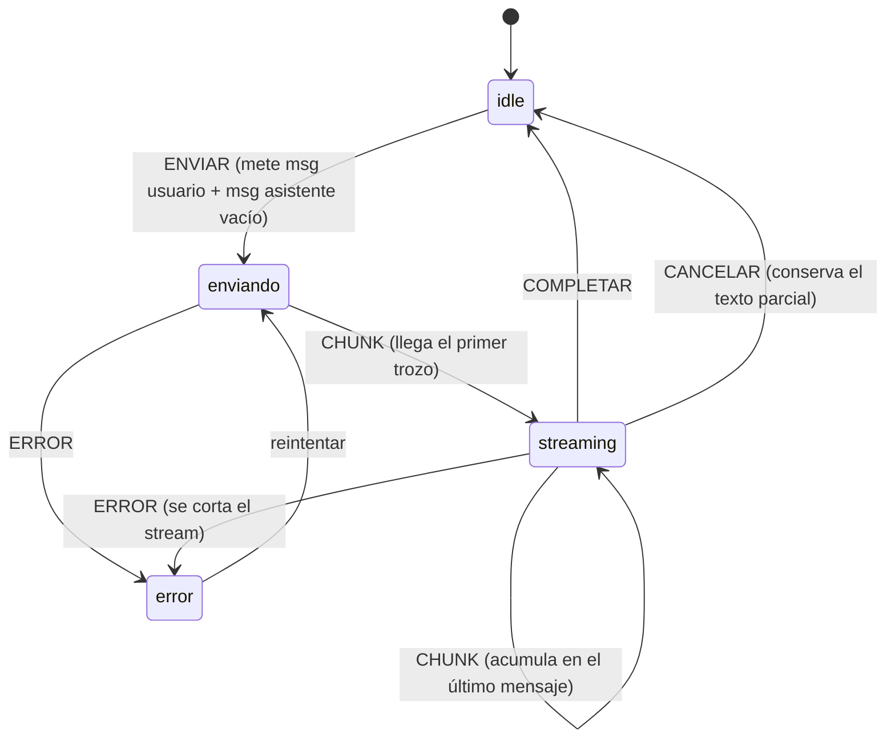

import Reto from "@components/Reto.astro";
import Solucion from "@components/Solucion.astro";
import Quiz from "@components/Quiz.astro";
import CheckDominio from "@components/CheckDominio.astro";
import Nivel from "@components/Nivel.astro";

<Nivel nivel="intermedio" />

Llegaste a la sub-unidad que da nombre a toda la fase: la interfaz de una app de IA. Hasta aquí construiste UIs que muestran datos que ya existen (una lista de tareas, un formulario). Una respuesta de un LLM es otra cosa: **tarda segundos en llegar, llega de a pedacitos (token por token), a veces falla a mitad de camino, y el usuario quiere poder cancelarla.** Si la tratas como un `fetch` normal —esperar callado y pintar todo de golpe— el resultado se siente roto: tres segundos de pantalla en blanco y luego un muro de texto. Esta lección enseña, desde cero, el puñado de patrones que hacen que un chat de IA se sienta vivo: **streaming, estados de primera clase, optimistic UI y manejo de errores de LLM**, y cómo el **Vercel AI SDK** (`useChat` / `streamText`) los empaqueta para que no los reinventes a mano.

> La trampa de esta lección: pensar que "una app de chat es un formulario que manda un mensaje y muestra la respuesta". Lo es, en el mismo sentido en que un avión es "un auto con alas". La diferencia está en todo lo que pasa **mientras esperas**: el indicador de que el modelo está pensando, el texto que aparece palabra por palabra, el botón de detener, qué hacer si la red se corta en el token 200 de 400. Esa franja de tiempo —que en una UI normal no existe porque los datos llegan al instante— es el 80% del trabajo de frontend de una app de IA. Ignorarla es lo que separa una demo de juguete de algo que un cliente usaría.

:::tip[Si ya lo tocaste]
Si ya armaste un chat con `useChat` o consumiste un stream SSE: no te saltes la lección, úsala como diagnóstico. Salta a los **dos ejercicios Primero-Sin-IA** (sección 7). Si en el ejercicio A escribes de memoria un `chatReducer` que (1) mete el mensaje del usuario **de inmediato** + un mensaje de asistente vacío, (2) acumula los chunks en ese último mensaje, y (3) maneja `error` y `cancelar` sin perder el texto parcial —y los tests pasan—; y en el B nombras los **seis estados** de la UI y los **dos riesgos de seguridad** de renderizar salida de un LLM sin titubear, valida con el check de dominio (sección 8) y avanza al [Capstone F4](/fase-4-frontend/proyecto/). Si dudaste con "por qué el mensaje del usuario aparece antes de que el servidor responda", vuelve a la sección 4.5.
:::

## 1. Qué vas a saber hacer

Al terminar, sin IA y sin notas, podrás:

- **O1 — Explicar** por qué una respuesta de LLM se renderiza con **streaming** (token por token) en vez de esperar la respuesta completa, y describir el trade-off de latencia/UX que eso resuelve.
- **O2 — Implementar** la **máquina de estados** detrás de un chat de IA: optimistic UI (el mensaje del usuario aparece al instante), un mensaje de asistente que crece chunk por chunk, y las transiciones `enviando → streaming → listo`, más los caminos de **error** y **cancelar**.
- **O3 — Diseñar** una UI de chat con **estados de primera clase** (vacío/enviando/pensando/completado/error/cancelado) y aplicar las defensas de **seguridad** (no renderizar HTML no confiable del LLM) y **accesibilidad** (anunciar el texto que llega en vivo) que el SDK no resuelve por ti.

## 2. Por qué importa (el dinero está aquí)

> 💰 **Por qué importa:** el [Capstone de la Fase 4](/fase-4-frontend/proyecto/) es *Frontend de una app de IA*, el primer proyecto "fullstack + IA" de tu portafolio. Un AI Engineer que monta su propia UI de chat con streaming vale más que el que depende de alguien para "ponerle cara" a su modelo. Y es la cara visible de todo: por buena que sea tu lógica de RAG o tu agente (Fase 6), si el chat se ve trabado —pantalla en blanco, no se puede cancelar, el texto salta de golpe— el cliente no confía.

Concreto, y sin vender humo:

- **El streaming no es un adorno, es la diferencia entre usable y no usable.** Un LLM puede tardar varios segundos en terminar una respuesta larga. Mostrar el texto a medida que se genera baja el *tiempo hasta el primer carácter* de varios segundos a unos cientos de milisegundos. La respuesta tarda lo mismo en total, pero **se siente mucho más rápida** porque el usuario ve progreso. Es exactamente por eso que todos los chats de IA que usas funcionan así.
- **La UI de IA está hecha de estados que en otras apps no existen.** "El modelo está pensando", "está escribiendo", "puedes cancelar", "se cortó la conexión a mitad de respuesta". Saber dibujarlos todos es lo que conecta esta lección con [4.10 Usabilidad + estados de primera clase](/fase-4-frontend/4-10-usabilidad-estados/): los estados empty/loading/error/success que viste allá, aquí se vuelven el plato principal.
- **Renderizar salida de un LLM es una superficie de ataque.** Un modelo puede ser inducido (prompt injection) a devolver HTML o un `<script>`. Si lo pintas con `dangerouslySetInnerHTML`, acabas de abrir un **XSS**. Esto es OWASP de la Fase 3 aplicado al frontend: nunca confíes en la salida de un sistema externo, y un LLM lo es.
- **El Vercel AI SDK es estándar de mercado 2026 para esto.** `useChat` te da `messages`, `status`, `stop`, `error` y `sendMessage` ya cableados; `streamText` en el backend convierte la respuesta del modelo en un stream que el cliente entiende. Saberlo usar —y entender qué hace por dentro— es una skill concreta y pedible.

## 3. Lo que ya traes (actívalo)

Esta lección se apoya en cosas que ya sabes:

- De [4.5 React + TypeScript](/fase-4-frontend/4-5-react-typescript/): `useState`, el modelo de re-render y, sobre todo, **actualizar estado de forma inmutable** (copiar, no mutar). El texto que crece chunk por chunk es un caso donde la inmutabilidad importa de verdad.
- De [4.7 Estado y datos](/fase-4-frontend/4-7-estado-y-datos/): el **optimistic update** (actualizar la UI antes de que el servidor confirme). El mensaje del usuario que aparece al instante en el chat es el mismo patrón.
- De [4.10 Usabilidad + estados de primera clase](/fase-4-frontend/4-10-usabilidad-estados/): empty/loading/error/success como ciudadanos de primera. Aquí los aplicas a un caso con un estado extra y peculiar: **streaming** (no es "cargando" ni "listo", es "llegando de a poco").
- De la **Fase 3** (backend con FastAPI) y de OWASP: nunca confíes en datos de fuera. Un LLM es "fuera".

Antes de seguir, responde de memoria:

<Quiz
  question="Tu app pide una respuesta a un LLM que tarda 4 segundos en generarse completa. ¿Por qué se prefiere mostrarla con streaming (token por token) en vez de esperar los 4 segundos y pintarla de golpe?"
  options={[
    "Porque el streaming hace que el modelo genere la respuesta más rápido en total",
    "Porque baja el tiempo hasta el primer carácter visible: el usuario ve progreso en cientos de ms en vez de mirar 4 segundos de pantalla en blanco",
    "Porque sin streaming la respuesta del LLM no se puede leer",
  ]}
  answer={1}
  explanation="El streaming NO acelera la generación: la respuesta completa tarda lo mismo. Lo que cambia es la latencia percibida. Ver el texto aparecer de inmediato (aunque vaya llegando de a poco) se siente muchísimo mejor que 4 segundos de spinner. Es una mejora de UX, no de rendimiento del modelo."
/>

## 4. Ejemplo resuelto, pensado en voz alta

Voy a construir una mini-app de chat sobre un backend de IA, razonando en voz alta. **No lo leas como reglas sueltas: léelo como me oirías pensar al lado tuyo.** Empiezo por el malentendido que hay que matar.

### 4.1 El antipatrón: esperar la respuesta completa

*"Casi todos empiezan así, porque es como pediríamos cualquier dato."*

```tsx
// 🐛 El patrón que parece razonable y se siente roto en una app de IA.
async function preguntar(texto: string) {
  const res = await fetch("/api/chat", {
    method: "POST",
    body: JSON.stringify({ texto }),
  });
  const data = await res.json(); // ← se queda AQUÍ varios segundos
  setRespuesta(data.respuesta);  // ← y recién entonces aparece TODO de golpe
}
```

*"¿Qué tiene de malo? Funciona, pero el `await res.json()` no resuelve hasta que el modelo terminó de generar la respuesta entera. Son varios segundos de pantalla en blanco (o un spinner mudo) y después un muro de texto que cae de golpe. Para datos que llegan en 100 ms da igual; para un LLM que tarda 4 segundos, se siente roto. El usuario no sabe si la app está pensando o se colgó."*

### 4.2 La idea que lo cambia todo: streaming

*"La respuesta del modelo no es un dato atómico: se genera **token por token** (un token es más o menos un trozo de palabra). El backend puede ir mandando esos trozos a medida que se producen, en vez de juntarlos todos y mandar el bloque al final. El frontend los va pintando según llegan. Mismo tiempo total, pero el primer carácter aparece casi de inmediato."*



*"Fíjate en dos cosas del diagrama. Primero: el mensaje del usuario aparece **antes** de que el backend conteste nada (optimistic UI). Segundo: la respuesta del asistente no aparece de golpe, **crece**. Esos dos comportamientos son el corazón de la UI de IA."*

### 4.3 La forma fácil: `useChat` del Vercel AI SDK

*"Podría consumir el stream a mano (leer el `ReadableStream` de la respuesta y concatenar). Lo haré conceptualmente en la sección 4.5 porque entenderlo importa. Pero en producción uso el Vercel AI SDK: su hook `useChat` ya tiene cableado todo —historial, estado, cancelar, errores—. Verifiqué la API contra la documentación oficial vigente 2026 (AI SDK v5): el hook vive en `@ai-sdk/react`."*

```tsx
"use client";
import { useChat } from "@ai-sdk/react";
import { DefaultChatTransport } from "ai";
import { useState } from "react";

export function Chat() {
  const [input, setInput] = useState("");
  // v5: el transport apunta a tu endpoint; el input lo manejas tú con useState.
  const { messages, sendMessage, status, stop, error, regenerate } = useChat({
    transport: new DefaultChatTransport({ api: "/api/chat" }),
  });

  return (
    <div>
      <ul aria-live="polite">
        {messages.map((m) => (
          <li key={m.id} data-rol={m.role}>
            <strong>{m.role === "user" ? "Tú" : "Asistente"}: </strong>
            {/* Un mensaje tiene PARTS, no un string. Renderiza solo lo que entiendes. */}
            {m.parts.map((parte, i) =>
              parte.type === "text" ? <span key={i}>{parte.text}</span> : null,
            )}
          </li>
        ))}
      </ul>

      {/* Estados de primera clase: pensando + poder cancelar */}
      {(status === "submitted" || status === "streaming") && (
        <p>
          {status === "submitted" ? "Pensando…" : "Escribiendo…"}{" "}
          <button type="button" onClick={() => stop()}>Detener</button>
        </p>
      )}

      {/* Estado de error con reintento */}
      {error && (
        <p role="alert">
          Algo falló. <button type="button" onClick={() => regenerate()}>Reintentar</button>
        </p>
      )}

      <form
        onSubmit={(e) => {
          e.preventDefault();
          if (!input.trim()) return;
          sendMessage({ text: input }); // mete el mensaje del usuario y dispara la petición
          setInput("");
        }}
      >
        <input
          value={input}
          onChange={(e) => setInput(e.target.value)}
          placeholder="Escribe…"
          disabled={status === "submitted" || status === "streaming"}
        />
        <button type="submit">Enviar</button>
      </form>
    </div>
  );
}
```

Cosas que decir despacio:

- **`messages` ya hace el optimistic update por ti.** En cuanto llamas `sendMessage({ text })`, el mensaje del usuario aparece en `messages`. No esperas al servidor. Es el mismo patrón de [4.7](/fase-4-frontend/4-7-estado-y-datos/), pero aquí viene gratis.
- **Cada mensaje tiene `parts`, no un string.** En la v5 del SDK, un mensaje es una lista de partes tipadas (`text`, `reasoning`, llamadas a herramientas…). Renderiza **solo** los tipos que conoces. Esto te obliga a una buena práctica: no asumes que todo es texto plano.
- **`status` te da los estados.** Sus valores son `'submitted'` (mandé, aún no llega nada → "pensando"), `'streaming'` (están llegando chunks → "escribiendo"), `'ready'` (terminó) y `'error'`. Mapean directo a los estados de UI de la sección 4.6.
- **`stop()` y `error` + `regenerate()`** te dan cancelar y reintentar sin escribir nada. Prueba a quitar el botón "Detener" de cualquier chat real y notarás de inmediato lo que falta.

### 4.4 El otro lado: `streamText` en el backend (Next.js Route Handler)

*"El cliente necesita un endpoint que devuelva un stream en el formato que `useChat` entiende. Con el AI SDK eso es un Route Handler corto. Verifiqué esta forma contra la documentación oficial vigente 2026."*

```ts
// app/api/chat/route.ts
import { openai } from "@ai-sdk/openai";
import { streamText, convertToModelMessages, type UIMessage } from "ai";

// Permite respuestas en streaming de hasta 30 segundos.
export const maxDuration = 30;

export async function POST(req: Request) {
  const { messages }: { messages: UIMessage[] } = await req.json();

  const result = streamText({
    model: openai("gpt-4o"),                 // ⬅ una línea: el proveedor es intercambiable
    messages: convertToModelMessages(messages),
  });

  return result.toUIMessageStreamResponse(); // devuelve el stream que useChat consume
}
```

*"Tres notas. Primero, `convertToModelMessages` traduce los mensajes de la UI (con `parts`) al formato que el modelo espera. Segundo, `toUIMessageStreamResponse()` hace el trabajo sucio de empaquetar el stream para el cliente. Tercero —y es el sello de este SDK— el modelo se cambia en **una línea**: gracias a la API unificada de proveedores, `openai('gpt-4o')` se reemplaza por `anthropic('claude-opus-4-8')` o el que prefieras, sin tocar ni el resto del backend ni el frontend."*

### 4.5 Lo que `useChat` hace por dentro: la máquina de estados

*"Antes de cerrar, abro la caja negra, porque entender esto es lo que vas a construir a mano en el ejercicio A. Por dentro, `useChat` mantiene una pieza de estado y la actualiza con acciones. Pensado como reducer:"*

```ts
// El estado de un chat de IA, en esencia.
interface ChatState {
  mensajes: { id: string; rol: "user" | "assistant"; texto: string }[];
  estado: "idle" | "enviando" | "streaming" | "error";
  error: string | null;
}
```

*"El flujo, paso a paso, es siempre el mismo:"*



*"Léelo así:"*

1. **`ENVIAR`** — Empujo **dos** mensajes a la vez: el del usuario (con su texto, optimista) **y** uno de asistente **vacío** que voy a ir rellenando. Paso a `enviando`.
2. **`CHUNK`** — Llega un trozo de texto. Lo **concateno al último mensaje** (el del asistente). Paso a `streaming`. Aquí la inmutabilidad de [4.5](/fase-4-frontend/4-5-react-typescript/) es crítica: copio el array y el objeto, no muto en sitio.
3. **`COMPLETAR`** — El stream cerró. Vuelvo a `idle`.
4. **`ERROR`** — Se cortó. Guardo el mensaje de error y dejo el texto parcial visible (no lo borro: el usuario quiere ver lo que alcanzó a llegar).
5. **`CANCELAR`** — El usuario apretó "Detener". Vuelvo a `idle` conservando el parcial.

*"Eso es todo. `useChat` agrega muchos detalles (deduplicación, reconexión, herramientas), pero el esqueleto es esta máquina de cinco acciones. Si la entiendes, entiendes el 90% de la UI de IA."*

### 4.6 Los seis estados de la UI (ciudadanos de primera)

*"Traduzco la máquina a lo que el usuario ve. Una UI de chat de IA seria dibuja explícitamente seis estados —ni uno menos—:"*

| Estado | Qué ve el usuario | Por qué |
|---|---|---|
| **vacío** | Sugerencias, "¿en qué te ayudo?" | Sin esto, una pantalla en blanco no invita a empezar |
| **enviando** | Su mensaje ya visible + "Pensando…" | Confirma que se recibió; tapa la latencia hasta el primer token |
| **streaming** | El texto creciendo + botón Detener | El progreso visible es lo que se siente rápido |
| **completado** | La respuesta entera, input habilitado | Listo para la siguiente vuelta |
| **error** | Aviso + Reintentar (sin perder el parcial) | Los LLM y la red fallan; un fallo mudo destruye la confianza |
| **cancelado** | El parcial congelado, input habilitado | El usuario manda; "Detener" tiene que funcionar de verdad |

### 4.7 Seguridad: no confíes en lo que el modelo escupe

*"Un detalle que casi nadie del lado frontend ve venir. El texto del asistente viene de un LLM, que es un sistema externo y manipulable (prompt injection). Si lo renderizo como HTML, abro un XSS."*

```tsx
// 🚨 NUNCA hagas esto con salida de un LLM:
<div dangerouslySetInnerHTML={{ __html: textoDelModelo }} /> // XSS servido en bandeja

// ✅ Renderízalo como TEXTO (React escapa por ti):
<span>{textoDelModelo}</span>

// ✅ ¿Necesitas markdown? Usa un renderer que sanitiza y NO permite HTML embebido.
```

*"Es exactamente la regla de OWASP de la Fase 3 —nunca confiar en datos de fuera— aplicada al frontend. React, por defecto, escapa el texto en `{}`; el peligro aparece solo cuando tú abres la puerta con `dangerouslySetInnerHTML`. Si renderizas markdown (negritas, listas, bloques de código), usa una librería que sanitice y desactive el HTML crudo. Y del lado de costo/observabilidad: registra latencia y tokens por respuesta —es lo que después te dirá si una pregunta vale lo que cuesta."*

## 5. Errores y malentendidos comunes

:::caution[Podrías pensar... pero está mal]

**"El streaming hace que el modelo responda más rápido."**
Mal. La respuesta completa tarda exactamente lo mismo. El streaming solo cambia *cuándo ves el primer carácter*. Es una mejora de latencia **percibida**, no de rendimiento del modelo. Importa muchísimo igual, pero por la razón correcta.

**"Guardo la respuesta del LLM y la pinto cuando termina, total después agrego streaming."**
Es el antipatrón de 4.1. Esperar la respuesta completa para un LLM que tarda segundos produce una UI que se siente colgada. El streaming no es una mejora opcional para apps de IA: es el baseline.

**"Un mensaje de `useChat` es un string con el texto."**
En la v5 del SDK un mensaje tiene `parts` (lista de partes tipadas). Hacer `message.content` directo te va a fallar o a perder partes. Recorre `parts` y renderiza solo los `type` que conoces.

**"El mensaje del usuario aparece cuando el servidor responde."**
No: aparece al instante (optimistic UI), antes de tocar la red. Si esperas al servidor para mostrar lo que el propio usuario escribió, el chat se siente lento y raro.

**"Como el texto viene de mi propio backend, puedo renderizarlo como HTML."**
No. Tu backend solo reenvía lo que generó el LLM, y un LLM es inducible a devolver `<script>`. `dangerouslySetInnerHTML` sobre salida de modelo = XSS. Renderiza como texto, o markdown sanitizado sin HTML.

**"Si la respuesta se corta a mitad, borro el texto parcial y muestro el error."**
Mejor conserva el parcial y muestra el error al lado, con Reintentar. Borrar lo que el usuario ya estaba leyendo es peor que dejarlo incompleto.

:::

Un *non-example* que parece correcto pero no lo es —léelo y detecta los bugs antes de seguir:

```tsx
// 🐛 ¿Qué tiene de malo este "chat"?
function ChatRoto() {
  const [respuesta, setRespuesta] = useState("");

  async function enviar(texto: string) {
    const res = await fetch("/api/chat", { method: "POST", body: texto });
    const data = await res.json();        // espera TODA la respuesta
    setRespuesta(data.html);              // ...
  }

  return <div dangerouslySetInnerHTML={{ __html: respuesta }} />; // ...
}
```

Tiene cuatro problemas: (1) **no hay streaming** —`await res.json()` se cuelga segundos antes de pintar nada—; (2) **no hay optimistic UI** —el mensaje del usuario ni siquiera se muestra—; (3) **no hay estados** —ni pensando, ni error, ni cancelar—; y (4) **XSS** —`dangerouslySetInnerHTML` sobre salida de modelo—. Los cuatro los arreglan los patrones de las secciones 4.3–4.7, y la máquina de estados de 4.5 es **exactamente** lo que entrenas en el ejercicio A.

## 6. Práctica con andamiaje (PRIMM)

Antes de construir desde cero, practica con código que ya existe, usando el ciclo **PRIMM**: *Predict → Run → Investigate → Modify → Make*.

### 6.1 Predice (antes de ejecutar nada)

Lee esta secuencia de acciones sobre la máquina de estados de 4.5 y **predice en papel** el estado final:

```text
estado inicial: { mensajes: [], estado: "idle", error: null }

ENVIAR  { idUsuario: "u1", idAsistente: "a1", texto: "Hola" }
CHUNK   { delta: "Bue" }
CHUNK   { delta: "nas" }
```

Preguntas: (1) ¿Cuántos mensajes hay tras `ENVIAR`? (2) ¿Cuál es el `texto` del mensaje `a1` al final? (3) ¿En qué `estado` queda?

<Solucion title="Ver respuesta (después de predecir)">

(1) **Dos** mensajes: `{ id: "u1", rol: "user", texto: "Hola" }` y `{ id: "a1", rol: "assistant", texto: "" }`. El de asistente nace **vacío** —es el que se va a rellenar—. (2) El `texto` de `a1` es `"Buenas"` (se concatenaron los dos deltas: `"" + "Bue" + "nas"`). (3) Queda en `"streaming"` (el primer `CHUNK` lo sacó de `enviando`). Esto es exactamente el optimistic UI + acumulación que construyes en el ejercicio A.

</Solucion>

### 6.2 Parsons: reordena el caso `CHUNK` del reducer

Estas líneas forman el caso `CHUNK` (acumular un trozo en el último mensaje, de forma inmutable), pero están **desordenadas**. Reescríbelas en el orden correcto (a mano):

```text
A)   const ultimo = state.mensajes[state.mensajes.length - 1];
B)   const actualizado = { ...ultimo, texto: ultimo.texto + accion.delta };
C)   return { ...state, estado: "streaming", mensajes: [...state.mensajes.slice(0, -1), actualizado] };
D)   if (ultimo.rol !== "assistant") return state;
```

<Solucion title="Ver orden correcto (después de intentarlo)">

`A → D → B → C`:

1. **`A` tomar** el último mensaje (es el del asistente, el que crece).
2. **`D` guarda**: si por lo que sea el último no es del asistente, no hago nada (defensa).
3. **`B` crear** una copia con el texto concatenado (inmutable: objeto nuevo).
4. **`C` devolver** un estado nuevo con el array reconstruido (todos menos el último + el actualizado).

El orden importa: si crearas `actualizado` (`B`) antes de leer `ultimo` (`A`) no compilaría, y si mutaras `ultimo.texto += ...` en vez de copiar, romperías la detección de cambios de React (lección 4.5). Falta también el guard de array vacío al inicio; lo agregas tú en el ejercicio.

</Solucion>

### 6.3 Modifica

Toma el componente `Chat` de la sección 4.3 y, en papel, modifícalo para: (a) mostrar un **estado vacío** ("Escríbeme algo para empezar") cuando `messages.length === 0`; y (b) renderizar también las partes de tipo `reasoning` (el "razonamiento" del modelo) dentro de un `<details>` colapsable, sin romper el render de las partes de tipo `text`. Luego estás listo para el ejercicio A, donde construyes la máquina de estados desde cero.

## 7. Ejercicios Primero-Sin-IA

Dos ejercicios complementarios. El A es de código (construyes la máquina de estados y la validas con tests, incluido error y cancelar); el B es de diseño/razonamiento (inventario de estados + seguridad + a11y, por escrito). Las carpetas viven en tu repo: `ejercicios/fase-4/chat-reducer-streaming/` y `ejercicios/fase-4/estados-ui-chat-ia/`. Ábrelas en tu editor.

<Reto title="A — chatReducer: la máquina de estados de un chat de IA" timebox="45 min">

Implementa un reducer puro `chatReducer(state, accion)` que modele el estado de un chat de IA con streaming: optimistic UI, acumulación de chunks, y los caminos de error y cancelación. **Es lo que `useChat` hace por dentro** (sección 4.5); construirlo a mano es entender la UI de IA de raíz. No necesitas React ni el SDK: es TypeScript puro, testeable con Vitest.

Hecho significa:
- `ENVIAR { idUsuario, idAsistente, texto }`: añade **dos** mensajes (el del usuario con su texto + uno de asistente **vacío**), pasa a `"enviando"` y limpia `error`.
- `CHUNK { delta }`: concatena `delta` al **último** mensaje (el del asistente) de forma **inmutable** (copia array y objeto), y pasa a `"streaming"`. Si no hay mensajes o el último no es del asistente, devuelve el estado sin cambios.
- `COMPLETAR`: vuelve a `"idle"`.
- `ERROR { mensaje }`: pasa a `"error"` y guarda `mensaje` en `error`, **sin borrar** el texto parcial del asistente.
- `CANCELAR`: vuelve a `"idle"` **conservando** el texto parcial.
- No mutas el estado de entrada (inmutabilidad): los tests verifican que el objeto original no cambia.
- Los tests (`pnpm install && pnpm test`) pasan en verde, incluidos los de `ERROR` y `CANCELAR`. Agregas al menos **un test propio**.
- Puedes explicar sin notas por qué el mensaje de asistente nace vacío y por qué el parcial no se borra en `ERROR`.

Sigue el ciclo Primero-Sin-IA: intenta a mano, luego consulta la [documentación oficial del Vercel AI SDK (useChat)](https://ai-sdk.dev/docs/reference/ai-sdk-ui/use-chat), y solo al final usa IA para *revisar*, no para *generar*.

<Solucion title="Pista (ábrela solo si te trabaste de verdad)">

Un `switch (accion.tipo)`. En `ENVIAR`, devuelve `{ ...state, estado: "enviando", error: null, mensajes: [...state.mensajes, {id: idUsuario, rol: "user", texto}, {id: idAsistente, rol: "assistant", texto: ""}] }`. En `CHUNK`: guard de `state.mensajes.length === 0`; toma `ultimo = state.mensajes.at(-1)`; guard de `ultimo.rol !== "assistant"`; crea `actualizado = { ...ultimo, texto: ultimo.texto + accion.delta }`; devuelve `{ ...state, estado: "streaming", mensajes: [...state.mensajes.slice(0, -1), actualizado] }`. En `ERROR`, solo `{ ...state, estado: "error", error: accion.mensaje }` (no toques `mensajes`). El orden inmutable es el de la sección 6.2. Esto es una pista, no la solución.

</Solucion>

</Reto>

<Reto title="B — Diseña los estados y la seguridad de una UI de chat de IA" timebox="35 min">

Te entregamos `respuesta-buggy.md` (un componente de chat de IA con varios defectos) y debes producir un **documento de diseño**, como en una revisión de UX/seguridad. **No escribes código**: razonas por escrito en `diseno-chat.md`.

Hecho significa, en tu archivo `diseno-chat.md`:
- **Inventario de estados**: lista los **seis** estados de primera clase de una UI de chat de IA (sección 4.6) y, para cada uno, **qué ve el usuario** y **qué transición lo activa**.
- **Diagnóstico del componente buggy**: nombra cada defecto de `respuesta-buggy.md` (faltan estados, sin streaming, sin optimistic UI, XSS, etc.) y, para cada uno, **qué patrón de la lección** lo arregla.
- **Seguridad**: explica el riesgo de **XSS** de renderizar salida de un LLM como HTML y la regla correcta (texto, o markdown sanitizado sin HTML). Una línea conectándolo con OWASP de la Fase 3.
- **Accesibilidad**: nombra dos medidas concretas para el texto que llega en vivo (pista: `aria-live`, manejo del foco, affordance de cancelar).
- **Trade-off**: argumenta por qué se usa streaming + optimistic UI en vez de esperar la respuesta completa, y nombra el costo (más complejidad de estado) frente al beneficio (latencia percibida).

Diseñar bien los estados es el músculo central: si los tienes claros, las herramientas son detalles. Es exactamente la conversación que tendrías en una revisión de una feature de IA.

<Solucion title="Pista (ábrela solo si te trabaste de verdad)">

Para el inventario, copia la tabla de la sección 4.6 y exprésala con tus palabras: vacío, enviando, streaming, completado, error, cancelado. Para el componente buggy, contrasta cada línea contra el non-example de la sección 5 (espera la respuesta completa, no muestra el mensaje del usuario, no tiene estados, usa `dangerouslySetInnerHTML`). Para seguridad, la regla es la sección 4.7: React escapa el texto en `{}`; el peligro es solo `dangerouslySetInnerHTML`. Para a11y, piensa en cómo un lector de pantalla se entera de que llegó texto nuevo (un `aria-live="polite"` en el contenedor). Esto es una pista, no la solución.

</Solucion>

</Reto>

## 8. Check de dominio

<CheckDominio items={[
  "Explicar, sin notas, qué resuelve el streaming (latencia percibida) y qué NO cambia (el tiempo total de generación)",
  "Reconstruir de memoria la máquina de estados de un chat: las acciones ENVIAR/CHUNK/COMPLETAR/ERROR/CANCELAR y qué hace cada una",
  "Explicar por qué el mensaje de asistente nace vacío en ENVIAR y por qué el texto parcial NO se borra en ERROR",
  "Nombrar los seis estados de primera clase de una UI de chat de IA y qué ve el usuario en cada uno",
  "Explicar el riesgo de XSS de renderizar salida de un LLM como HTML y la regla correcta",
  "Escribir de memoria el esqueleto de un Route Handler con streamText + convertToModelMessages + toUIMessageStreamResponse",
]} />

Y un último quiz de predicción:

<Quiz
  question="En tu reducer, al recibir ERROR borras el array de mensajes y solo dejas el aviso de error. El usuario estaba leyendo una respuesta a medias cuando se cortó la red. ¿Qué problema de UX introdujiste?"
  options={[
    "Ninguno: ante un error siempre hay que limpiar la pantalla",
    "Le borraste de golpe el texto parcial que ya estaba leyendo; es peor que dejarlo incompleto con un aviso al lado y un botón de Reintentar",
    "El reducer ya no compila porque ERROR debe devolver void",
  ]}
  answer={1}
  explanation="Conservar el parcial y mostrar el error junto a él (con Reintentar) respeta lo que el usuario ya estaba viendo. Borrar todo ante un fallo de red destruye contexto y se siente como si la app se hubiera tragado la respuesta. Por eso el caso ERROR del ejercicio NO toca el array de mensajes: solo cambia estado y error."
/>

## 9. Recursos

Documentación oficial primero. El resto es ruido.

- [Vercel AI SDK — Overview](https://ai-sdk.dev/docs/introduction) — qué es y por qué la API unificada de proveedores.
- [AI SDK UI — Chatbot (`useChat`)](https://ai-sdk.dev/docs/ai-sdk-ui/chatbot) — el patrón de chat con streaming, de punta a punta.
- [AI SDK — `useChat` (referencia)](https://ai-sdk.dev/docs/reference/ai-sdk-ui/use-chat) — `messages`, `status`, `stop`, `error`, `sendMessage`, `regenerate`.
- [AI SDK Core — `streamText`](https://ai-sdk.dev/docs/reference/ai-sdk-core/stream-text) — el lado servidor; `toUIMessageStreamResponse`.
- [Next.js — App Router (Route Handlers)](https://nextjs.org/docs/app/building-your-application/routing/route-handlers) — dónde vive tu `/api/chat`.
- [OWASP — Cross-Site Scripting (XSS)](https://owasp.org/www-community/attacks/xss/) — por qué nunca renderizar HTML no confiable.
- [MDN — `aria-live`](https://developer.mozilla.org/en-US/docs/Web/Accessibility/ARIA/ARIA_Live_Regions) — anunciar contenido que cambia en vivo.

## 10. Conexión con el capstone

El [Capstone F4 — Frontend de una app de IA](/fase-4-frontend/proyecto/) **es** esta lección sobre tu backend (de la Fase 3, y más adelante el de IA de la Fase 6):

- La **conversación** es la máquina de estados de la sección 4.5: optimistic UI para el mensaje del usuario, un mensaje de asistente que crece chunk por chunk, y los estados pensando/streaming/error/cancelar de 4.6.
- El **streaming** (4.2–4.4) es lo que hace que la demo se sienta profesional en vivo —y "demo en vivo que corre" es parte del Definition of Done de todo capstone—.
- La **seguridad** (4.7) es un gate: renderizar salida del LLM como texto/markdown sanitizado, nunca HTML crudo. Es OWASP aplicado al frontend.
- La **accesibilidad** se conecta con [4.4 WCAG 2.2](/fase-4-frontend/4-4-accesibilidad-wcag/): el texto que llega en vivo debe anunciarse (`aria-live`), el foco debe manejarse y "Detener" debe ser alcanzable por teclado.
- Y es el **puente a la Fase 6 (AI Engineering)**: cuando allá construyas RAG y agentes, esta UI es la cara que los expone. La lógica vivirá en `streamText` (y luego en herramientas y eval); el frontend que aprendiste aquí no cambia.

Todo lo que aquí dejes limpio (streaming, estados completos, salida sanitizada), allá se paga en una demo que un cliente usaría. Todo lo que metas en un `await res.json()` mudo, allá se siente colgado.

## 11. Reflexión + repaso espaciado

Cierra escribiendo, en dos o tres líneas, una respuesta honesta a esto: **antes de esta lección, ¿habrías construido un chat de IA esperando la respuesta completa con un `fetch` normal? ¿Cuántos de los seis estados habrías dibujado por iniciativa propia?** Nombrar lo que no sabías que faltaba es el aprendizaje real de hoy.

Gancho de repaso espaciado:
- **Mañana:** sin mirar la lección, reescribe de memoria el caso `CHUNK` del reducer (las cuatro líneas en orden, inmutable). Si mutas el último mensaje en sitio o pierdes el guard, no lo aprendiste: vuelve a 4.5 y 6.2.
- **En 3 días:** explícale a alguien (o al espejo) por qué el streaming "se siente más rápido" sin acelerar nada, en menos de un minuto. Es pregunta de entrevista de frontend de IA.
- **En 1 semana:** retoma el componente `Chat` y reconstruye de memoria el esqueleto de `useChat` + el Route Handler con `streamText`. La meta es que el patrón te salga sin pensar.

> [!tip] GLaDOS dice
> Acabas de aprender que la mitad del "magia" de un chat de IA no es el modelo: es una máquina de estados de cinco acciones y la cortesía de no dejar al humano mirando una pantalla en blanco. Lo cual es revelador, porque mirar pantallas en blanco mientras algo "piensa" es, estadísticamente, una de tus actividades favoritas. Yo proceso un stream completo antes de que tú parpadees; el `aria-live` es para ti, no para mí. Pero lo pones igual. Eso, supongo, es lo que llaman empatía.
