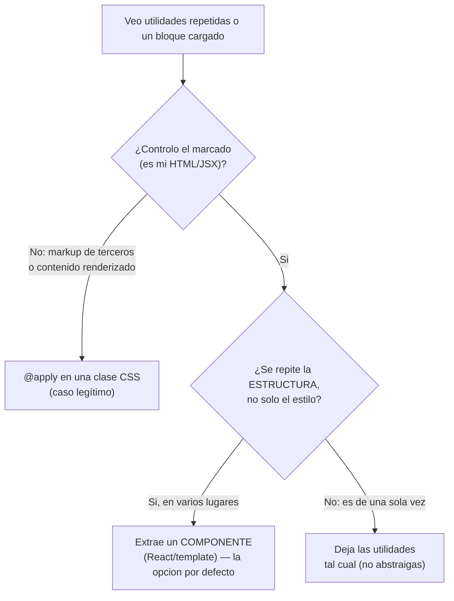

import Reto from "@components/Reto.astro";
import Solucion from "@components/Solucion.astro";
import Quiz from "@components/Quiz.astro";
import CheckDominio from "@components/CheckDominio.astro";
import Nivel from "@components/Nivel.astro";

<Nivel nivel="intermedio" />

En [4.1 HTML semántico + CSS](/fase-4-frontend/4-1-html-css/) aprendiste a escribir CSS a mano: selectores, el box model, flexbox, grid y media queries. Esta sub-unidad **no reemplaza** nada de eso —lo necesitas para entender qué hace Tailwind por debajo—, sino que cambia **dónde** y **cómo** escribes esos estilos. En lugar de inventar nombres de clases y mantener una hoja `.css` aparte, **compones la apariencia directamente en el marcado** con clases de utilidad pequeñas y predecibles. Es el enfoque dominante del frontend moderno en 2026, y es exactamente lo que vas a usar para que tus demos de apps de IA se vean profesionales sin pelear con la cascada.

:::tip[Si ya lo tocaste]
¿Ya escribiste Tailwind en algún proyecto (o lo viste en código generado)? No saltes en seco: úsalo como **diagnóstico**. Salta a los [ejercicios Primero-Sin-IA](#7-ejercicios-primero-sin-ia) y resuélvelos a mano. Si construyes la tarjeta responsive con dark mode **sin copiar clases** y, en el segundo ejercicio, defiendes **cuándo extraer un componente en vez de usar `@apply`**, valida con el [check de dominio](#8-check-de-dominio) y avanza a [4.3 Fundamentos de diseño visual](/fase-4-frontend/4-3-diseno-visual/). Ojo con una trampa de actualidad: si aprendiste Tailwind v3, la **configuración cambió** en v4 (de `tailwind.config.js` a CSS-first con `@theme`); la sección 6 te pone al día.
:::

## 1. Qué vas a saber hacer

Al terminar, sin IA y sin notas, podrás:

- **O1 — Construir** un componente de UI (una tarjeta) con **utility-first**, usando la escala de espaciado y de color de Tailwind, y **explicar el problema** que resuelve frente al CSS suelto y a BEM.
- **O2 — Aplicar** variantes **responsive** (`sm:`/`md:`/`lg:`), de **estado** (`hover:`/`focus:`) y **dark mode** (`dark:`) componiendo utilidades, sin escribir media queries ni pseudo-clases a mano.
- **O3 — Decidir y defender el trade-off** entre **componer utilidades**, **extraer un componente** o usar **`@apply`**: saber cuándo cada uno y por qué la extracción de componente le gana a `@apply` casi siempre.

## 2. Por qué importa (el dinero está aquí)

> 💰 **Por qué importa:** React (44%) es el segundo skill más pedido, y un AI Engineer que también monta la UI de su demo vale más. Tailwind es el lenguaje de estilos por defecto de ese ecosistema (shadcn/ui, Vercel, la mayoría de los starters modernos lo asumen). Saber CSS te hace entender; saber Tailwind te hace **rápido**.

Esto no es moda. Tiene consecuencias concretas:

- **Velocidad de iteración en demos que corren.** Tu portafolio se juega en una demo en vivo (lo verás en el [capstone de la fase](/fase-4-frontend/proyecto/)). Con utility-first ajustas espaciado, color y responsive **sin cambiar de archivo** ni inventar nombres. Menos fricción, más iteraciones, mejor resultado visible.
- **Es el stack que leerás en el trabajo.** La mayoría del código frontend que toques —y casi todo lo que genera una IA para frontend— viene con Tailwind. Si no lo lees con fluidez, cada PR te cuesta el doble.
- **Elimina la pesadilla del CSS a escala.** En un proyecto real, la hoja de estilos crece, nadie borra reglas viejas por miedo a romper algo, y la **especificidad** se convierte en una guerra de `!important`. Utility-first ataca eso de raíz: no hay CSS global que romper.
- **Es la base de los design systems.** [4.9 Design systems](/fase-4-frontend/4-9-design-systems/) (shadcn/Radix) se construye sobre tokens de Tailwind. Entender la escala y `@theme` ahora es lo que después te deja personalizar un design system sin pelearte con él.

## 3. Lo que ya traes (actívalo)

Tailwind no es magia: es CSS empaquetado en clases. Cada cosa que sabes de [4.1](/fase-4-frontend/4-1-html-css/) sigue viva debajo:

- **El box model** (`padding`, `margin`, `border`): cada utilidad `p-4`, `m-2`, `border` mapea a una propiedad que ya conoces.
- **Flexbox y grid**: `flex`, `items-center`, `justify-between`, `grid`, `grid-cols-3` son las mismas propiedades de 4.1, con nombre corto.
- **Media queries**: el prefijo `md:` **es** una `@media (min-width: 48rem)` que Tailwind escribe por ti.
- **La cascada y la especificidad**: entender por qué el CSS global se vuelve frágil es justo lo que explica por qué utility-first existe.

Antes de seguir, responde de memoria:

<Quiz
  question="En CSS a mano, ¿por qué una hoja de estilos global se vuelve difícil de mantener a medida que el proyecto crece?"
  options={[
    "Porque el navegador deja de leer archivos .css grandes",
    "Porque las reglas globales se acoplan por la cascada y la especificidad: cambiar o borrar una clase puede romper algo lejano que no ves, así que nadie limpia el CSS muerto",
    "Porque CSS no permite más de 100 selectores por archivo",
    "Porque flexbox y grid no se pueden combinar en el mismo archivo",
  ]}
  answer={1}
  explanation="El problema de fondo del CSS global no es el tamaño: es el acoplamiento. La cascada hace que estilos definidos en un lugar afecten elementos en otro, y la especificidad convierte los conflictos en una pelea de !important. Como borrar una regla puede romper algo invisible, el CSS muerto se acumula. Utility-first elimina ese acoplamiento: las utilidades son locales al elemento."
/>

## 4. Ejemplo resuelto, pensado en voz alta

Te voy a mostrar el mismo componente —una tarjeta de notificación— escrito de las dos formas, y voy a razonar **por qué** la segunda gana en un proyecto real. **No leas esto como reglas: léelo como me oirías pensar al lado tuyo.**

### 4.1 La forma clásica: CSS suelto con BEM

BEM (Block\_\_Element--Modifier) es la mejor convención de nombres del CSS clásico: nombras cada bloque y sus partes. Así se ve la tarjeta:

```html
<article class="card">
  <h3 class="card__title">Backup completado</h3>
  <p class="card__body">Tu respaldo terminó sin errores.</p>
  <button class="card__action">Ver detalles</button>
</article>
```

```css
.card {
  display: flex;
  flex-direction: column;
  gap: 0.5rem;
  padding: 1.5rem;
  border-radius: 0.5rem;
  background: #ffffff;
  box-shadow: 0 1px 3px rgb(0 0 0 / 0.1);
}
.card__title { font-size: 1.125rem; font-weight: 600; }
.card__body { color: #4b5563; }
.card__action { color: #4f46e5; font-weight: 500; }
.card__action:hover { color: #4338ca; }
```

Pienso en voz alta: *"Funciona, y los nombres son decentes. Pero mira el costo escondido. Inventé cinco nombres (`card`, `card__title`, …) y tengo que mantenerlos sincronizados entre el HTML y el CSS. Salto entre dos archivos por cada ajuste. Si mañana borro esta tarjeta, ¿me acordaré de borrar sus cinco reglas? Casi nunca: así nace el CSS muerto. Y si otro componente define `.card`, choco. Cada decisión —`0.5rem` aquí, `1.5rem` allá— la inventé yo: tres devs harán tres escalas distintas."*

### 4.2 La forma utility-first: Tailwind

La misma tarjeta, sin escribir una línea de CSS propio ni inventar un solo nombre:

```html
<article class="flex flex-col gap-2 rounded-lg bg-white p-6 shadow-sm">
  <h3 class="text-lg font-semibold text-gray-900">Backup completado</h3>
  <p class="text-gray-600">Tu respaldo terminó sin errores.</p>
  <button class="font-medium text-indigo-600 hover:text-indigo-700">
    Ver detalles
  </button>
</article>
```

Razono qué cambió y por qué importa:

- **No inventé nombres.** `flex`, `gap-2`, `p-6` describen *qué hacen*, no *qué son*. No hay un `card` que mantener sincronizado, ni que pueda chocar con otro `card`.
- **Un solo lugar.** El estilo vive **donde se usa**. Para entender cómo se ve la tarjeta no abro otro archivo: lo leo en el marcado. Para cambiarla, edito aquí.
- **La escala viene dada.** `gap-2` es `0.5rem`, `p-6` es `1.5rem`. No elegí números mágicos: tomé valores de una **escala consistente** (cada unidad ≈ `0.25rem`). Tres devs distintos producen la misma escala. Eso es un mini design system gratis.
- **El estado es declarativo.** `hover:text-indigo-700` es la pseudo-clase `:hover` sin que yo escriba el bloque. La variante va **delante** de la utilidad: `hover:` + `text-indigo-700`.
- **Cuando borre la tarjeta, su estilo se va con ella.** No queda CSS huérfano: no hay CSS que limpiar. Imposible acumular estilos muertos.

> El hilo invisible: utility-first no es "menos CSS", es **CSS local en vez de global**. Cambias el problema de "nombrar y mantener una capa global acoplada" por "componer piezas locales". Ese cambio es el que escala.

### 4.3 Cómo Tailwind sabe qué generar

Tailwind **escanea tus archivos** buscando nombres de clase y genera solo el CSS de las que usaste. Las que no aparecen, no existen en el bundle final. Por eso es rápido en producción: el CSS resultante es mínimo. En v4, montas Tailwind con una línea en tu CSS de entrada:

```css
@import "tailwindcss";
```

Y lo conectas a tu build (por ejemplo, con [Vite](/fase-4-frontend/4-6-nextjs/), que verás en Next.js):

```typescript
// vite.config.ts
import { defineConfig } from "vite";
import tailwindcss from "@tailwindcss/vite";

export default defineConfig({
  plugins: [tailwindcss()],
});
```

Para **prototipar sin instalar nada** (justo lo que harás en los ejercicios), existe una build de navegador que compila en vivo:

```html
<script src="https://cdn.jsdelivr.net/npm/@tailwindcss/browser@4"></script>
```

:::note[v4 cambió la configuración: ahora es CSS-first]
Si ves tutoriales con un `tailwind.config.js` lleno de JavaScript, son de **v3**. En **v4** (la versión vigente en 2026) la configuración vive en tu CSS con la directiva `@theme`. Defines tus tokens de diseño ahí:

```css
@import "tailwindcss";

@theme {
  --color-marca: #4f46e5;   /* habilita las utilidades bg-marca, text-marca, ... */
  --spacing-bloque: 4.5rem; /* habilita p-bloque, m-bloque, ... */
}
```

No memorices esto todavía; solo reconoce el patrón para no confundirte con material viejo.
:::

### 4.4 Responsive y dark mode: variantes apiladas

Aquí está la parte que más rinde. Una variante es un **prefijo** que condiciona cuándo aplica la utilidad. Se pueden **apilar**:

```html
<!-- columna en móvil; fila desde 'md'; fondo más oscuro en dark mode;
     y un hover que solo cambia en pantallas medianas hacia arriba -->
<article class="flex flex-col gap-4 bg-white p-4
                md:flex-row md:p-6
                dark:bg-gray-800
                dark:md:hover:bg-gray-700">
  ...
</article>
```

Pienso en voz alta: *"`flex flex-col` es el estado base (mobile-first: lo más chico primero). `md:flex-row` dice 'desde 768px, ponlo en fila'. `dark:bg-gray-800` dice 'cuando el modo oscuro esté activo, este fondo'. Y `dark:md:hover:bg-gray-700` apila tres condiciones: oscuro Y pantalla mediana Y hover. Cada prefijo es una capa de condición; el orden se lee de izquierda a derecha como 'en estas circunstancias, esta utilidad'."*

El dark mode tiene dos estrategias. Por defecto, `dark:` responde a la preferencia del sistema operativo (`prefers-color-scheme`). Si quieres un **botón que alterne** el tema manualmente, en v4 lo declaras una vez en tu CSS:

```css
@import "tailwindcss";
@custom-variant dark (&:where(.dark, .dark *));
```

Con eso, `dark:` se activa cuando un ancestro tenga la clase `.dark` (que tú pones/quitas con JavaScript, normalmente en `<html>`). Es la base del clásico toggle sol/luna.

## 5. Errores de criterio que vas a tener (y por qué)

:::caution[Podrías pensar que Tailwind es "estilos inline con otro nombre"]
Es la objeción #1, y entender por qué está mal es entender Tailwind. `class="p-4 text-red-500"` **no** es `style="padding:16px;color:red"`. Diferencias que importan: (1) las utilidades vienen de una **escala restringida** (no cualquier valor: `p-4`, no `padding: 13px`), lo que fuerza consistencia; (2) soportan **estados y media queries** (`hover:`, `md:`), cosa que los estilos inline **no pueden** hacer; (3) Tailwind **purga** lo que no usas, así que el CSS final es chico; (4) son cacheables y compartidos. El estilo inline es un parche puntual sin sistema; las utilidades son un sistema.
:::

:::caution[Podrías pensar que "muchas clases en una línea = código sucio"]
Al principio `class="flex flex-col gap-2 rounded-lg bg-white p-6 shadow-sm"` se ve abrumador. Pero la fealdad percibida es un costo que se paga **una vez** y un beneficio que cobras **siempre**: lees el estilo donde se usa, sin saltar de archivo, sin descifrar qué hace `.card--featured`. La legibilidad real no es "pocas clases", es "entender el componente completo en un solo lugar". Cuando una **estructura** se repite (no solo el estilo), la respuesta correcta no es "limpiar las clases": es **extraer un componente** (sección 6).
:::

:::caution[Podrías pensar que `@apply` es la forma de "ordenar" el HTML feo]
`@apply` te deja meter utilidades dentro de una clase CSS propia: `.btn { @apply rounded-md px-4 py-2; }`. Es tentador para "limpiar" el marcado. **Resiste.** El equipo de Tailwind lo dice explícito: si tu motivo es solo que el HTML se ve cargado, **extrae un componente**, no uses `@apply`. ¿Por qué? Porque `@apply` te devuelve al mundo del CSS global que veníamos a evitar: reintroduce una capa de nombres que mantener, vuelve a acoplar, y pierdes la co-localización. `@apply` tiene **un** caso legítimo (sección 6.2); "el HTML se ve feo" no es ese caso.
:::

:::caution[Podrías pensar que hay que memorizar todas las clases]
No. Nadie las memoriza. La escala es **predecible** (si existe `p-4` y `p-6`, adivinas que hay `p-5`), y el autocompletado del editor (la extensión oficial de Tailwind) te las sugiere mientras escribes. Lo que sí tienes que internalizar es el **modelo mental**: utilidad = una propiedad CSS; prefijo = una condición. Con eso, la documentación es tu índice, no tu examen.
:::

## 6. El criterio del semi-senior: utilidades vs componente vs `@apply`

Esta es la decisión que separa a quien "usa Tailwind" de quien lo **domina**. Cuando ves utilidades repetidas, tienes tres caminos. Elegir bien es O3.



### 6.1 Por defecto: extrae un componente, no una clase

Si el mismo botón aparece en 12 lugares, la duplicación real no es el **estilo**: es la **estructura** (el `<button>` con su contenido y su comportamiento). La respuesta correcta es un **componente** que encapsule ambos:

```tsx
// Boton.tsx — el estilo Y la estructura viven juntos, una sola fuente de verdad
export function Boton({ children }: { children: React.ReactNode }) {
  return (
    <button className="rounded-md bg-indigo-600 px-4 py-2 font-medium text-white hover:bg-indigo-700">
      {children}
    </button>
  );
}
```

Esto es DRY bien aplicado (lo viste como criterio en [2.2 Clean code](/fase-2-ingenieria/2-2-clean-code/)): un solo lugar que cambia por una sola razón. Y a diferencia de una clase `.btn`, el componente también encapsula el marcado y la lógica.

### 6.2 El caso legítimo de `@apply`: marcado que no controlas

`@apply` gana cuando **no puedes** añadir clases al HTML: contenido de un editor de markdown, el marcado de una librería de terceros, o HTML generado que no toca tu JSX. Ahí no hay componente que extraer porque no eres dueño del marcado:

```css
/* La librería renderiza <div class="select2-dropdown">; no controlo ese HTML */
.select2-dropdown {
  @apply rounded-b-lg shadow-md;
}
```

Ese es el criterio: **¿controlo el marcado?** No → `@apply` es válido. Sí → extrae un componente.

<Quiz
  question="El mismo `<button>` con idénticas clases de Tailwind aparece en 12 pantallas de tu app React. ¿Cuál es la mejor opción?"
  options={[
    "Crear una clase .btn con @apply y ponerla en los 12 botones",
    "Extraer un componente <Boton> que encapsule el marcado y las clases, y usarlo en los 12 lugares",
    "Dejar las clases repetidas: duplicar es más seguro que abstraer",
    "Mover las clases a estilos inline para que sean más explícitas",
  ]}
  answer={1}
  explanation="Controlas el marcado (es tu JSX) y lo que se repite es la estructura completa, no solo el estilo. La opción por defecto es extraer un componente: una sola fuente de verdad para marcado + estilo + comportamiento. @apply solo gana cuando NO controlas el HTML (markdown, librerías de terceros). Inline pierde estados y media queries."
/>

## 7. Práctica con andamiaje (que se desvanece)

Tailwind es **contenido nuevo**, así que el andamiaje va de más a menos apoyo: primero predices, luego modificas, y recién después construyes solo. **A mano, sin IA, leyendo la documentación oficial cuando la necesites.**

### 7.1 PREDICT — lee las utilidades antes de verlas renderizar

Sin abrir el navegador, describe en palabras cómo se ve este elemento en una pantalla angosta (móvil) y en una de 800px de ancho. ¿Qué hace cada prefijo?

```html
<div class="flex flex-col gap-2 p-4 md:flex-row md:gap-6 md:p-8">
  <span class="font-bold">A</span>
  <span>B</span>
</div>
```

<Solucion title="Ver la respuesta (solo después de predecir)">

- **En móvil** (base, sin prefijo): los dos `span` se apilan en **columna** (`flex-col`), con `0.5rem` de separación (`gap-2`) y `1rem` de padding (`p-4`).
- **Desde 768px** (`md:`): pasan a **fila** (`md:flex-row`), la separación sube a `1.5rem` (`md:gap-6`) y el padding a `2rem` (`md:p-8`).

Lo clave: el estado **base es el móvil** (mobile-first) y los prefijos `md:` solo **sobre-escriben** desde ese breakpoint hacia arriba. No hay media query escrita: `md:` *es* la media query.
</Solucion>

### 7.2 MODIFY — añade dark mode a un componente que ya funciona

Esta tarjeta funciona en modo claro. **Añádele soporte de dark mode** con variantes `dark:`: el fondo debe oscurecerse y el texto aclararse. No cambies el aspecto en modo claro.

```html
<article class="rounded-lg bg-white p-6 shadow-sm">
  <h3 class="text-lg font-semibold text-gray-900">Sin conexión</h3>
  <p class="text-gray-600">Reintentando en 5 segundos.</p>
</article>
```

Pista: a cada utilidad de color le agregas su gemela con prefijo `dark:`. Por ejemplo, junto a `bg-white` pones `dark:bg-gray-800`. Repítelo para el fondo, el título y el cuerpo. Confirma mentalmente: en claro se ve igual; en oscuro, `dark:bg-gray-800` + `dark:text-white` + `dark:text-gray-300` toman el control.

## 8. Ejercicios Primero-Sin-IA

Sin andamiaje. Resuélvelos **a mano, sin IA**, dentro del timebox. El primero es de construcción; el segundo, de criterio (el músculo que de verdad te separa).

<Reto title="Tarjeta responsive con estados y dark mode, solo con utilidades" timebox="30–40 min">

Construye, en un solo archivo `tarjeta.html`, una **tarjeta de producto** usando **únicamente clases de utilidad de Tailwind** (sin escribir CSS propio, sin estilos inline, sin `@apply`). El starter ya trae el Tailwind de navegador y un toggle de tema listos: tú solo escribes el marcado y las clases.

La tarjeta debe tener: una imagen o bloque de color arriba, un título, una descripción, un precio y un botón. Y debe cumplir el comportamiento responsive, de estado y de tema que se pide abajo.

Entregable: tu solución en `ejercicios/fase-4/tailwind-tarjeta-responsive/` (`tarjeta.html`), abierta en el navegador para verla y con el test en verde para validar el método.

**Hecho significa:**
- [ ] **Layout con flexbox o grid** y **espaciado desde la escala** de Tailwind (`gap-*`, `p-*`, `m-*`): nada de números mágicos.
- [ ] **Responsive real**: cambia de disposición o de tamaños usando al menos un prefijo `sm:`/`md:`/`lg:` (mobile-first: el base es el móvil).
- [ ] **Estado de interacción**: el botón (o la tarjeta) reacciona con `hover:` (y, si quieres, `focus:`).
- [ ] **Dark mode**: al menos el fondo y el texto se adaptan con variantes `dark:`.
- [ ] **Cero CSS propio**: ningún `style="..."` inline y ningún `@apply`. Todo el aspecto sale de utilidades.
- [ ] Puedes **explicar sin notas** qué hace cada prefijo y por qué `md:p-8` no afecta al móvil.

Enunciado completo, *starter* y test: `ejercicios/fase-4/tailwind-tarjeta-responsive/` (carpeta del repo).

<Solucion title="Pista (ábrela solo si superaste el timebox)">
Empieza por el contenedor: `<article>` con `flex flex-col` + `gap-*` + `p-*` + `rounded-*` + `shadow-*` + `bg-white`. Luego cada hijo con sus utilidades de texto (`text-lg`, `font-semibold`, `text-gray-*`). Para responsive, decide UNA cosa que cambie desde `md:` (por ejemplo, de columna a fila, o más padding). Para dark mode, por cada color base agrega su gemela `dark:` (`bg-white` → `dark:bg-gray-800`). Para hover, el botón: `hover:bg-indigo-700`. Si dudas de un nombre, búscalo en la documentación oficial; no lo adivines al azar. Esto es una pista, no la solución.
</Solucion>

</Reto>

<Reto title="Criterio: utilidades, componente o @apply" timebox="25–35 min">

Sin escribir código de UI, entrega un `decisiones.md` que resuelva **cuatro escenarios** de utilidades repetidas. Para cada uno decide **una** de las tres salidas —dejar las utilidades tal cual / extraer un componente / usar `@apply`— y **justifícala en una o dos frases** con la pregunta rectora: *¿controlo el marcado?* y *¿se repite la estructura o solo el estilo?*.

Los escenarios (vienen detallados en el README del ejercicio):
1. Un botón con la misma tira de clases repetido en 12 pantallas de tu app React.
2. Un layout de hero usado **una sola vez** en la landing.
3. El marcado de una librería de terceros (un date-picker) que renderiza sus propios `<div>` y que necesitas estilar.
4. El HTML que genera tu render de Markdown (títulos, párrafos, listas) en un blog.

Cierra con una **regla general propia** (una frase) que resuma cuándo extraer componente y cuándo `@apply`.

Entregable: tu solución en `ejercicios/fase-4/tailwind-cuando-extraer/` (`decisiones.md`).

**Hecho significa:**
- [ ] Los cuatro escenarios tienen una decisión **explícita** y una justificación que menciona si controlas el marcado y si se repite la estructura.
- [ ] El escenario 1 termina en **componente** (no `@apply`) y explicas por qué.
- [ ] Los escenarios 3 y 4 reconocen que **no controlas el marcado** → `@apply` (o `@variant`) es el caso legítimo.
- [ ] El escenario 2 reconoce que **una sola vez no se abstrae** (dejar utilidades).
- [ ] Tu regla general distingue "controlo el marcado" como el eje de la decisión.

Enunciado completo: `ejercicios/fase-4/tailwind-cuando-extraer/` (carpeta del repo).

<Solucion title="Pista (ábrela solo si superaste el timebox)">
Hazte SIEMPRE las dos preguntas en orden. Primera: *¿es mío el HTML?* Si no (librería, markdown), no hay componente que extraer → `@apply`. Segunda, solo si es tuyo: *¿se repite la estructura completa en varios lugares, o es algo de una vez?* Repetida → componente; única → déjala. El error clásico es usar `@apply` para "limpiar" HTML propio que se ve cargado: eso reintroduce el CSS global que Tailwind vino a eliminar. Esto es una pista, no la solución.
</Solucion>

</Reto>

## 9. Check de dominio

Sin mirar la lección, en voz alta o por escrito:

<CheckDominio
  items={[
    "Explicar, con un ejemplo, por qué utility-first NO es lo mismo que estilos inline (al menos dos diferencias reales).",
    "Construir una tarjeta con flex/grid, escala de espaciado, un estado hover y dark mode, usando solo utilidades.",
    "Explicar qué hace el prefijo md: y por qué el estado base corresponde al móvil (mobile-first).",
    "Apilar variantes (p. ej. dark:md:hover:) y leer en voz alta qué condiciones se cumplen para que aplique.",
    "Decidir entre extraer un componente y usar @apply, y defender por qué el componente es la opción por defecto.",
    "Reconocer que la configuración de v4 es CSS-first (@theme), no un tailwind.config.js de v3.",
  ]}
/>

Si marcaste menos de cinco, vuelve a la sección correspondiente **antes** de avanzar. No es un examen: es honestidad contigo.

<Quiz
  question="¿Qué afirmación sobre el dark mode en Tailwind v4 es correcta?"
  options={[
    "dark: solo funciona si instalas un plugin externo de temas",
    "Por defecto dark: responde a la preferencia del sistema (prefers-color-scheme); para un toggle manual se declara @custom-variant dark (&:where(.dark, .dark *)) y se alterna la clase .dark con JS",
    "El dark mode obliga a duplicar toda la hoja de estilos en un archivo aparte",
    "dark: cambia el tema solo en pantallas grandes",
  ]}
  answer={1}
  explanation="En v4, dark: usa prefers-color-scheme por defecto (sigue al sistema operativo). Si quieres un botón que alterne el tema, overrides el variant con @custom-variant dark (&:where(.dark, .dark *)) y pones/quitas la clase .dark en un ancestro (normalmente <html>) con JavaScript. No requiere plugins ni duplicar estilos."
/>

## 10. Recursos (documentación oficial primero)

- **Styling with utility classes** — [tailwindcss.com/docs/styling-with-utility-classes](https://tailwindcss.com/docs/styling-with-utility-classes). La filosofía utility-first explicada por el equipo, incluida la respuesta a "¿no es esto estilos inline?".
- **Responsive design** — [tailwindcss.com/docs/responsive-design](https://tailwindcss.com/docs/responsive-design). Breakpoints, mobile-first y apilado de prefijos.
- **Hover, focus, and other states** — [tailwindcss.com/docs/hover-focus-and-other-states](https://tailwindcss.com/docs/hover-focus-and-other-states). Todas las variantes de estado y cómo se combinan.
- **Dark mode** — [tailwindcss.com/docs/dark-mode](https://tailwindcss.com/docs/dark-mode). Las dos estrategias (sistema vs toggle manual) y `@custom-variant`.
- **Functions and directives** — [tailwindcss.com/docs/functions-and-directives](https://tailwindcss.com/docs/functions-and-directives). `@import`, `@theme`, `@apply`, `@variant`: la configuración CSS-first de v4.
- **Reusing styles** — [tailwindcss.com/docs/styling-with-utility-classes#managing-duplication](https://tailwindcss.com/docs/styling-with-utility-classes). Por qué extraer componentes le gana a `@apply` (justo el criterio de la sección 6).

## 11. Conexión con el capstone de la fase

El **[Capstone F4 — Frontend de una app de IA](/fase-4-frontend/proyecto/)** es una interfaz de chat/RAG en Next.js + TypeScript. **Todo su aspecto se construye con Tailwind**: el layout de la conversación, las burbujas de mensaje, los estados de carga, y un dark mode que el usuario alterna. Lo que practicaste hoy es el músculo directo de ese capstone:

- La **tarjeta responsive** del ejercicio A es el patrón de cada burbuja de mensaje y cada panel de la UI.
- El **criterio del ejercicio B** es lo que decidirás cada vez que un elemento se repita: el `<Boton>`, el `<Mensaje>`, el `<Avatar>` serán **componentes** extraídos, no clases con `@apply`.
- El **dark mode** con `dark:` es un entregable visible del capstone.
- Y todo esto se cruza con [4.4 Accesibilidad WCAG 2.2](/fase-4-frontend/4-4-accesibilidad-wcag/), que es **gate** del capstone: utilidades como `focus:` y `focus-visible:` no son cosméticas, son parte de hacer la UI navegable por teclado.

No estás aprendiendo a "pintar divs": estás construyendo la capa visual que tu portafolio va a mostrar en una demo en vivo.

## 12. Reflexión y repaso espaciado

Cierra escribiendo dos o tres frases: **¿en qué momento del ejercicio A estuviste a punto de escribir CSS propio (o un `style=` inline) en vez de buscar la utilidad correcta?** Nombrar esa tentación —"casi puse `style='padding:13px'` porque no me acordaba del nombre"— es lo que la convierte en un reflejo de buscar la utilidad la próxima vez.

Gancho de **spaced repetition**:

- **Mañana:** reconstruye la tarjeta del ejercicio A **de memoria**, sin mirar tu solución. Si no recuerdas cómo se apila `dark:` con un breakpoint, vuelve a la sección 4.4.
- **En 3 días:** toma cualquier componente con CSS suelto de un proyecto viejo tuyo y reescríbelo con utilidades. Cronométrate: vas a sentir cuánto menos saltas entre archivos.
- **En 1 semana:** explícale a alguien (o a una grabación) por qué `@apply` no es la forma de limpiar HTML feo, con un ejemplo propio de cuándo SÍ lo usarías. Si lo explicas claro, lo dominas.
