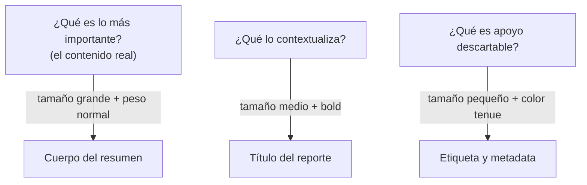

import Reto from "@components/Reto.astro";
import Solucion from "@components/Solucion.astro";
import Quiz from "@components/Quiz.astro";
import CheckDominio from "@components/CheckDominio.astro";
import Nivel from "@components/Nivel.astro";

<Nivel nivel="básico" />

Sabes maquetar con HTML, CSS y Tailwind (eso vino de [4.1](/fase-4-frontend/4-1-html-css/) y [4.2](/fase-4-frontend/4-2-tailwind/)). Pero "saber poner cajas en la pantalla" no es lo mismo que "saber dónde van". Esta sub-unidad es la diferencia entre una demo que parece de estudiante y una que parece de producto. **No es teoría de arte: son cinco palancas con reglas accionables** que puedes aplicar sin "tener ojo".

> La trampa de esta lección: creer que el diseño visual es talento innato o cuestión de gusto. No lo es. El 90% de lo que hace que una interfaz se vea profesional son **decisiones sistemáticas** —una escala de espaciado, una escala tipográfica, una paleta con roles, alineación a una grilla— que cualquiera puede ejecutar con una checklist. El gusto pule el último 10%. Hoy aprendes el 90% que se aprende.

:::tip[Si ya lo tocaste]
Si ya armaste interfaces que "se ven bien", no te saltes la lección: úsala como diagnóstico. Salta directo a los **dos ejercicios Primero-Sin-IA** (sección 7). Si en el ejercicio A logras que la tarjeta pase el test de contraste **y** un tercero entiende la jerarquía con el *squint test*, y en el B tu crítica nombra la heurística exacta que se viola (no "se ve feo"), valida con el check de dominio (sección 8) y avanza a [4.4 Accesibilidad WCAG 2.2](/fase-4-frontend/4-4-accesibilidad-wcag/). Si dudaste con la diferencia entre *proximidad* y *cajas*, vuelve a la sección 4.4.
:::

## 1. Qué vas a saber hacer

Al terminar, sin IA y sin notas, podrás:

- **O1 — Diagnosticar** una interfaz aplicando una checklist de las cinco palancas (jerarquía, layout/alineación, tipografía, espaciado, color) y nombrar **qué heurística concreta** se viola en cada problema (no "se ve mal").
- **O2 — Rediseñar** un componente real aplicando una **escala de espaciado**, una **escala tipográfica** y una **paleta con roles**, justificando cada decisión.
- **O3 — Verificar** que tu paleta cumple el **contraste mínimo WCAG 2.2 AA** (texto ≥ 4.5:1, UI ≥ 3:1) y explicar por qué "color tenue" no es excusa para incumplirlo.

## 2. Por qué importa (el dinero está aquí)

> 💰 **Por qué importa:** React es el segundo skill más pedido y un AI Engineer que también monta la UI de su demo **vale más**. Pero una demo que se ve amateur destruye la credibilidad que tu portafolio intenta construir. El reclutador no lee tu código primero: ve la pantalla. Un layout descuidado dice "junior" antes de que abras la boca.

Esto no es decoración. Tiene consecuencias medibles:

- **Tu portafolio es tu argumento de venta, y se juzga en 50 ms.** Hay investigación clásica (Google/Lindgaard) de que la gente forma un juicio de credibilidad de una página en milisegundos, antes de leer una palabra. Si tu RAG funciona perfecto pero la UI parece un formulario de 2003, el visitante asume que el resto también está mal hecho.
- **Es un multiplicador gratis sobre trabajo que ya hiciste.** El backend tomó semanas; aplicar una escala de espaciado y una paleta con contraste toma una tarde y cambia por completo la percepción. Es el mejor retorno por hora de toda la Fase 4.
- **Alimenta directamente el gate de accesibilidad.** El contraste de color que practicas hoy **es** un criterio de [4.4 WCAG 2.2](/fase-4-frontend/4-4-accesibilidad-wcag/) y un requisito del Definition of Done de todo capstone con UI. Diseño visual y accesibilidad no son temas separados: el contraste es donde se tocan.
- **Te hace mejor cliente de la IA, no peor.** Cuando le pides a un modelo "mejora esta UI", si no sabes nombrar el problema ("falta jerarquía, todo pesa igual; el espaciado es inconsistente"), recibes cambios aleatorios que no puedes evaluar. El criterio visual es lo que convierte el prompt vago en dirección precisa.

## 3. Lo que ya traes (actívalo)

Esta lección se para sobre cosas que ya sabes hacer:

- De [4.1 HTML semántico + CSS](/fase-4-frontend/4-1-html-css/): **flexbox y grid**. Hoy no los usas para "que quepa", sino para **alinear** todo a una grilla invisible —la alineación es la mitad de que algo se vea ordenado.
- De [4.1](/fase-4-frontend/4-1-html-css/): las **custom properties** de CSS (`--mi-variable`). Son el vehículo de las escalas y la paleta que vas a construir; un *design token* no es más que una custom property con un nombre que es una decisión.
- De [4.2 Tailwind CSS](/fase-4-frontend/4-2-tailwind/): la escala de espaciado de Tailwind (`p-2`, `p-4`, `gap-6`...) **ya es** una escala de 4/8px. Hoy entiendes *por qué* existe y por qué nunca deberías usar un `margin: 13px` arbitrario.

Antes de seguir, responde de memoria:

<Quiz
  question="En Tailwind escribes `gap-4` y `p-6` en vez de `gap: 15px` y `padding: 23px`. ¿Cuál es la razón de fondo?"
  options={[
    "Porque Tailwind no permite valores arbitrarios",
    "Porque los valores de una escala consistente (múltiplos de una base) crean ritmo visual; los valores arbitrarios se ven 'casi alineados' y el ojo lo nota como desorden",
    "Porque las clases son más cortas de escribir que el CSS",
  ]}
  answer={1}
  explanation="Una escala de espaciado (4, 8, 12, 16, 24, 32...) hace que todos los espacios sean múltiplos de una base común, creando un ritmo que el ojo lee como 'intencional'. Valores arbitrarios como 13px o 23px producen espacios 'casi pero no del todo' iguales, y ese 'casi' es exactamente lo que hace que algo se vea descuidado aunque no sepas por qué. Tailwind sí permite valores arbitrarios con corchetes, pero su escala por defecto existe justamente para empujarte al ritmo consistente."
/>

## 4. Ejemplo resuelto, pensado en voz alta

Te voy a mostrar el rediseño de un componente real, de principio a fin. **No leas esto como reglas sueltas: léelo como me oirías razonar al lado tuyo.** Es una tarjeta que muestra un resumen generado por IA —el tipo de componente que vas a construir en el capstone—. Funciona, pero se ve amateur. Vamos a arreglarla con las cinco palancas, una a la vez.

Punto de partida (HTML):

```html
<div class="tarjeta">
  <span>Resumen generado</span>
  <span>Reporte trimestral Q3 2025</span>
  <span>Las ventas crecieron 12% impulsadas por la región norte. El margen
  cayó 2 puntos por costos de logística. Se recomienda renegociar contratos
  de transporte antes de Q1.</span>
  <span>Generado por gpt-4o · 1.240 tokens · hace 3 min</span>
  <button>Ver fuentes</button>
</div>
```

```css
.tarjeta {
  border: 1px solid gray;
  padding: 10px;
}
.tarjeta span { display: block; }
button { background: #5b8def; color: #bcd0f5; border: none; padding: 6px; }
```

Pienso en voz alta: *"Todo el texto pesa exactamente lo mismo —no sé qué leer primero—. Los espacios son inexistentes y el único que hay (10px) no responde a ninguna lógica. El botón tiene texto celeste sobre fondo azul: casi no se lee. Y nada está agrupado: el título del reporte y el cuerpo se sienten tan separados como el cuerpo y el pie. Voy a aplicar las cinco palancas en orden, y después de cada una doy un paso atrás a mirar."*

### 4.1 Palanca 1 — jerarquía: ¿qué leo primero?

La pregunta rectora del diseño visual es: **si entrecierras los ojos hasta que todo se vuelve borroso (el *squint test*), ¿qué resalta?** En la versión original, nada: todo es gris parejo. Eso significa que no hay jerarquía.

La jerarquía se construye con cuatro herramientas, en este orden de fuerza: **tamaño**, **peso** (bold), **color/contraste** y **posición/espacio**. Decido qué es más importante (el cuerpo del resumen, que es el contenido real), qué es secundario (el título del reporte), y qué es metadata de apoyo (la etiqueta "Resumen generado" y el pie con tokens). Tres niveles. Asigno tamaño y peso a cada uno.



### 4.2 Palanca 2 — tipografía: una escala, no números al azar

Aquí está el error #1 de los principiantes: elegir `font-size` a ojo (16px, 18px, 22px, "se ve bien"). En su lugar uso una **escala tipográfica modular**: parto de una base de 16px (`1rem`, nunca menos para texto de cuerpo) y multiplico por una razón fija. Con razón 1.25 obtengo: 16 → 20 → 25 → 31px. Tres tamaños me bastan.

Y dos reglas de legibilidad que casi nadie aplica:
- **`line-height` (interlineado):** para texto de cuerpo, ~1.5; para títulos, más ajustado (~1.2). Un cuerpo con `line-height: 1` es una pared ilegible.
- **Longitud de línea (*measure*):** el texto de párrafo se lee mejor entre 45 y 75 caracteres por línea. Más ancho y el ojo se pierde al volver. Lo controlo con `max-width` en unidades `ch`.

### 4.3 Palanca 3 — espaciado: el whitespace es estructura, no vacío

El espacio en blanco no es "lo que sobra": es la herramienta que **agrupa y separa**. Defino una **escala de espaciado** basada en 4px (4, 8, 16, 24, 32...) y la pongo en custom properties. Regla clave (ley de proximidad de la Gestalt): **los elementos relacionados van cerca; los no relacionados, lejos.** El título y el cuerpo son del mismo bloque → poco espacio entre ellos. El cuerpo y la metadata son cosas distintas → más espacio. El espaciado *es* la agrupación; no necesito cajas ni líneas para separar grupos, solo whitespace bien dosificado.

### 4.4 Palanca 4 — color: roles y contraste, no decoración

No elijo colores "bonitos": elijo **roles**. Una base neutra (un gris muy claro de fondo, un gris muy oscuro de texto), **un** color de acento para la acción principal, y colores tenues para lo secundario. La regla 60-30-10: ~60% neutro dominante, ~30% secundario, ~10% acento.

Y el no-negociable: **contraste WCAG AA**. El texto normal necesita una razón de contraste ≥ 4.5:1 contra su fondo; los elementos de UI (como el borde de un botón o un ícono) ≥ 3:1. El botón original tenía texto `#bcd0f5` sobre `#5b8def`: contraste ~2.1:1, **ilegible e inaccesible**. Lo arreglo con texto blanco sobre un azul más oscuro. "Color tenue" para la metadata no significa "gris clarito que no se lee": significa el gris más claro que **todavía pasa 4.5:1**.

### 4.5 Palanca 5 — alineación: todo cuelga de una línea invisible

Última pasada: la **alineación**. Todo lo que pueda compartir un borde izquierdo, lo comparte. La consistencia de alineación es lo que el ojo lee como "ordenado". Y agrupo visualmente con proximidad, no con bordes. El resultado:

```html
<article class="tarjeta">
  <p class="tarjeta__etiqueta">Resumen generado</p>
  <h3 class="tarjeta__titulo">Reporte trimestral Q3 2025</h3>
  <p class="tarjeta__cuerpo">
    Las ventas crecieron 12% impulsadas por la región norte. El margen cayó
    2 puntos por costos de logística. Se recomienda renegociar contratos de
    transporte antes de Q1.
  </p>
  <p class="tarjeta__meta">Generado por gpt-4o · 1.240 tokens · hace 3 min</p>
  <button class="boton">Ver fuentes</button>
</article>
```

```css
:root {
  /* Escala de espaciado (base 4px) */
  --espacio-1: 0.25rem;  /* 4px  */
  --espacio-2: 0.5rem;   /* 8px  */
  --espacio-3: 1rem;     /* 16px */
  --espacio-4: 1.5rem;   /* 24px */

  /* Escala tipográfica (base 16px, razón 1.25) */
  --texto-sm: 0.8rem;    /* ~13px metadata */
  --texto-base: 1rem;    /* 16px cuerpo    */
  --texto-lg: 1.25rem;   /* 20px título    */

  /* Paleta con roles (todas pasan AA) */
  --color-fondo: #ffffff;
  --color-texto: #1a1a1a;       /* ~17:1 sobre fondo  */
  --color-texto-tenue: #595959; /* ~7:1  sobre fondo  */
  --color-acento: #1d4ed8;      /* azul oscuro        */
  --color-texto-sobre-acento: #ffffff; /* ~6.7:1 sobre acento */
}

.tarjeta {
  background: var(--color-fondo);
  border: 1px solid #e5e5e5;
  border-radius: 8px;
  padding: var(--espacio-4);
  max-width: 60ch;              /* longitud de línea legible */
  display: flex;
  flex-direction: column;
}

.tarjeta__etiqueta {
  font-size: var(--texto-sm);
  text-transform: uppercase;
  letter-spacing: 0.05em;
  color: var(--color-texto-tenue);
  margin: 0 0 var(--espacio-1); /* pegada al título: mismo grupo */
}

.tarjeta__titulo {
  font-size: var(--texto-lg);
  font-weight: 700;
  line-height: 1.2;
  color: var(--color-texto);
  margin: 0 0 var(--espacio-3); /* separa del cuerpo */
}

.tarjeta__cuerpo {
  font-size: var(--texto-base);
  line-height: 1.5;
  color: var(--color-texto);
  margin: 0 0 var(--espacio-4); /* más espacio: empieza otra zona */
}

.tarjeta__meta {
  font-size: var(--texto-sm);
  color: var(--color-texto-tenue);
  margin: 0 0 var(--espacio-3);
}

.boton {
  align-self: flex-start;
  background: var(--color-acento);
  color: var(--color-texto-sobre-acento);
  border: none;
  border-radius: 6px;
  padding: var(--espacio-2) var(--espacio-3);
  font-size: var(--texto-base);
  font-weight: 600;
  cursor: pointer;
}
```

Pienso en voz alta: *"Ahora el squint test funciona: lo que resalta es el título (grande, bold) y el botón (bloque de color), exactamente lo que quiero que la gente vea primero. La metadata se desvanece sin desaparecer. Todo cuelga del mismo borde izquierdo. Los espacios cuentan una historia: etiqueta y título están juntos (4px) porque son un grupo; el cuerpo respira; el botón está claramente separado. Y cada color que usé pasa 4.5:1. No 'tengo ojo' —seguí la checklist—."*

> El hilo invisible de este rediseño: las custom properties (`--espacio-*`, `--texto-*`, `--color-*`) son **design tokens**, y cada token es una **decisión documentada**. Esa es la misma disciplina spec-driven que viste en [Fase 2](/fase-2-ingenieria/2-13-colaboracion-spec-driven-adrs/): nombrar tus decisiones para que sean consistentes y revisables. Lo formalizas en [4.9 Design systems](/fase-4-frontend/4-9-design-systems/).

## 5. Errores de criterio que vas a tener (y por qué)

:::caution[Podrías pensar que "más colores y más detalles = más profesional"]
Al revés. El diseño amateur se delata por *exceso*: cinco colores de acento, tres tipografías, gradientes, sombras por todos lados. El diseño profesional es **restringido**: una base neutra, **un** acento, una o dos tipografías, una escala de espaciado. La sofisticación se ve en la consistencia y el uso del espacio, no en la cantidad de adornos. Cuando dudes, **quita**, no agregues.
:::

:::caution[Podrías pensar que el espacio en blanco es espacio "desperdiciado"]
El instinto del principiante es llenar cada pixel "para aprovechar la pantalla". El whitespace no es vacío: es la herramienta que crea agrupación (ley de proximidad), guía la atención y reduce la carga cognitiva. Las interfaces que respiran se leen como premium; las apretadas, como un formulario de impuestos. El espacio **es** contenido: comunica qué va con qué.
:::

:::caution[Podrías pensar que "color tenue" justifica saltarse el contraste]
Es la confusión más cara de la lección y la que rompe el gate de [4.4](/fase-4-frontend/4-4-accesibilidad-wcag/). Hacer la metadata "gris clarito" se siente elegante, pero un `#aaaaaa` sobre blanco da ~2.3:1 y es ilegible para mucha gente (y para ti mismo bajo el sol). "Tenue" significa **el gris más claro que todavía pasa 4.5:1**, no "el que se ve sutil". La jerarquía por contraste tiene un piso, y ese piso es AA. Además: **nunca uses solo el color** para comunicar (error/éxito), porque ~8% de los hombres no distingue rojo de verde; acompaña con ícono o texto.
:::

:::caution[Podrías pensar que la jerarquía se logra "haciendo todo grande y bold"]
Si todo grita, nada se oye. La jerarquía es **contraste relativo**: algo resalta solo porque lo demás *no*. Si pones el título, el cuerpo y la metadata todos en bold, vuelves al punto de partida (todo pesa igual). La metadata tiene que ser *deliberadamente* pequeña y tenue para que el contenido importante destaque. Bajar el volumen de lo secundario es tan importante como subir el de lo principal.
:::

## 6. Práctica con andamiaje (que se desvanece)

Tres pasos, de más apoyo a menos. **A mano primero**, sin IA. No necesitas ejecutar nada para los dos primeros: se resuelven razonando.

### 6.1 PREDICT — aplica el squint test mentalmente

Lee este CSS (no lo ejecutes). Tres elementos comparten el mismo contenedor. Predice: en el *squint test* (todo borroso), ¿cuál resalta primero, cuál segundo, cuál casi desaparece? Justifica con la palanca que manda en cada caso.

```css
.a { font-size: 0.8rem; color: #777; font-weight: 400; }
.b { font-size: 1.5rem; color: #111; font-weight: 700; }
.c { font-size: 1rem;   color: #333; font-weight: 400; }
```

<Solucion title="Ver la respuesta (solo después de predecir)">

Orden de qué resalta: **`.b` → `.c` → `.a`**.

- `.b` gana por **dos palancas a la vez**: tamaño grande (1.5rem) *y* peso bold (700) *y* el color más oscuro (#111, máximo contraste). Es el nivel 1 de la jerarquía.
- `.c` es el intermedio: tamaño base, peso normal, gris oscuro. Resalta menos que `.b` pero más que `.a`.
- `.a` casi desaparece: el más pequeño (0.8rem) y el de menor contraste (#777 sobre blanco da ~4.5:1, justo en el piso). Es metadata de apoyo.

Lo importante no es el orden: es que pudiste **nombrar la palanca** que decide en cada caso (tamaño + peso + contraste), en vez de decir "el b se ve más importante". Eso es tener criterio en vez de intuición.
</Solucion>

### 6.2 Parsons — ordena una escala de espaciado

Estos valores de una escala de espaciado base-4 están **desordenados**. Reordénalos de menor a mayor y di cuál es la "base" (el múltiplo del que salen todos):

```text
--espacio-4: 1.5rem;
--espacio-1: 0.25rem;
--espacio-3: 1rem;
--espacio-2: 0.5rem;
```

…y como segundo nivel: si necesitaras un espacio entre `--espacio-3` (16px) y `--espacio-4` (24px), ¿qué valor agregarías para que **siga en la escala**?

<Solucion title="Ver el orden y el criterio">

Orden de menor a mayor: `--espacio-1` (0.25rem = 4px), `--espacio-2` (0.5rem = 8px), `--espacio-3` (1rem = 16px), `--espacio-4` (1.5rem = 24px).

La **base es 4px** (0.25rem): todos los valores son múltiplos de 4 (4, 8, 16, 24). Por eso "escala base-4".

Para un valor entre 16px y 24px que siga en la escala: **20px (1.25rem)**, porque es múltiplo de 4. Un `18px` rompería la escala (no es múltiplo de 4) y reintroduce el "casi alineado" que el ojo detecta como desorden. La gracia de la escala es que **nunca improvisas un número**: eliges el siguiente peldaño.
</Solucion>

### 6.3 MODIFY — arregla una tarjeta sin jerarquía

Esta tarjeta funciona pero todo pesa igual (sin jerarquía) y los espacios son arbitrarios. Modifícala **a mano** aplicando al menos tres palancas: define una escala tipográfica de tres tamaños, agrupa con espaciado (proximidad) y arregla el contraste del texto tenue.

```css
.item { padding: 11px; border: 1px solid #ddd; }
.item h4   { font-size: 16px; color: #000; margin: 7px 0; }
.item p    { font-size: 16px; color: #000; margin: 7px 0; }
.item small{ font-size: 16px; color: #ccc; margin: 7px 0; }
```

Pista: el `<h4>` debe ser el más grande y bold; el `<small>` el más pequeño y tenue **pero pasando 4.5:1** (`#ccc` sobre blanco da ~1.6:1, no sirve; baja a un gris como `#595959`); los márgenes de 7px y 11px reemplázalos por valores de una escala base-4 (4, 8, 16, 24), usando *menos* espacio dentro de un grupo y *más* entre grupos. Verifica a ojo que el squint test ahora distingue tres niveles.

## 7. Ejercicios Primero-Sin-IA

Sin andamiaje. Resuélvelos **a mano, sin IA** dentro del timebox. Documentación oficial permitida; IA solo al final, para *revisar*, no para *generar*.

<Reto title="Rediseña una tarjeta de IA: jerarquía, escala y contraste AA" timebox="40–45 min">

Te damos una tarjeta de resultado de IA en HTML + CSS que funciona pero se ve amateur: sin jerarquía, espacios arbitrarios, una paleta que **no pasa contraste**. Tu tarea: rediseñarla aplicando las cinco palancas, y dejar la paleta en *design tokens* (`--color-*`) que cumplan **WCAG 2.2 AA**.

Hay un test automatizado que lee tu `estilos.css`, extrae los tokens de color y verifica el contraste de los pares clave (texto/fondo ≥ 4.5:1, texto-sobre-acento/acento ≥ 4.5:1, acento/fondo ≥ 3:1). El contraste es la parte **objetiva**; la jerarquía, el espaciado y la tipografía se evalúan con la rúbrica y el *squint test*.

Entregable: tu solución en `ejercicios/fase-4/jerarquia-y-contraste-tarjeta/` (HTML + CSS con tokens + un `decisiones.md` corto), con el test de contraste en verde.

**Hecho significa:**
- [ ] El **test de contraste pasa en verde** (`pnpm install && pnpm test` dentro de la carpeta): todos los pares cumplen su umbral AA.
- [ ] Hay **tres niveles de jerarquía** distinguibles con el squint test (título / cuerpo / metadata), construidos con tamaño + peso + contraste.
- [ ] El espaciado usa una **escala consistente** (no números arbitrarios) y agrupa por proximidad (menos espacio intra-grupo, más inter-grupo).
- [ ] La tipografía usa una **escala de máximo tres tamaños** con `line-height` adecuado (cuerpo ~1.5) y longitud de línea controlada (`max-width` en `ch`).
- [ ] `decisiones.md` justifica, en 4–6 líneas, **por qué** elegiste tus tamaños, tu base de espaciado y tus colores (incluyendo cómo verificaste el contraste).

Enunciado completo, *starter* y test: `ejercicios/fase-4/jerarquia-y-contraste-tarjeta/` (carpeta del repo).

<Solucion title="Pista (ábrela solo si superaste el timebox)">
Trabaja una palanca a la vez, en este orden: (1) define la escala de espaciado y la tipográfica como custom properties *antes* de tocar nada más; (2) asigna los tres niveles de jerarquía decidiendo primero qué es lo más importante; (3) para el contraste, no adivines: usa una herramienta (WebAIM Contrast Checker o el panel de DevTools) y empieza por un texto casi-negro sobre fondo casi-blanco —eso pasa siempre—, luego oscurece el acento hasta que el texto blanco encima dé ≥ 4.5:1. El "gris tenue" de la metadata bájalo solo hasta que siga pasando 4.5:1, ni un paso más. Esto es una pista, no la solución.
</Solucion>

</Reto>

<Reto title="Crítica de diseño: nombra la heurística, no el gusto" timebox="25–30 min">

Te damos la descripción de una pantalla real con varios problemas de diseño visual. Tu tarea **no** es rediseñarla en código, sino **diagnosticarla por escrito**: para cada problema, nombra la **palanca y la heurística exacta** que se viola (p. ej. "ley de proximidad: la etiqueta está más cerca del campo de abajo que del suyo") y propón la corrección concreta. Luego prioriza: si solo pudieras arreglar **tres** cosas, ¿cuáles y por qué?

Este ejercicio entrena el músculo que te hace buen cliente de la IA y buen revisor en code review: **ver el problema y nombrarlo con precisión**, en vez de "se ve feo".

Entregable: tu solución en `ejercicios/fase-4/critica-y-rediseno-visual/` (un `critica.md` con la lista diagnosticada + el top-3 priorizado).

**Hecho significa:**
- [ ] Identificaste al menos **cinco** problemas distintos, cada uno atado a **una de las cinco palancas** (jerarquía, layout/alineación, tipografía, espaciado, color).
- [ ] Cada problema nombra la **heurística concreta** que viola (proximidad, contraste AA, escala, alineación, longitud de línea, 60-30-10...), no un juicio de gusto.
- [ ] Cada problema trae una **corrección accionable** (qué cambiarías, con un valor o regla concreta).
- [ ] El **top-3 priorizado** está justificado por impacto (qué problema rompe más la lectura o la accesibilidad), no por orden de aparición.

Enunciado completo y *starter*: `ejercicios/fase-4/critica-y-rediseno-visual/` (carpeta del repo).

<Solucion title="Pista (ábrela solo si superaste el timebox)">
Recorre la pantalla con la checklist de las cinco palancas, una por una, en vez de mirar "en general": pregúntate por cada una "¿se respeta aquí?". Para priorizar, pondera dos ejes: cuánto rompe la **legibilidad/jerarquía** (¿sé qué leer primero?) y cuánto rompe la **accesibilidad** (¿pasa el contraste? ¿depende solo del color?). Los problemas que fallan ambos ejes van primero. Esto es una pista, no la solución.
</Solucion>

</Reto>

## 8. Check de dominio

Sin mirar la lección, en voz alta o por escrito:

<CheckDominio
  items={[
    "Nombrar las cinco palancas del diseño visual y, para cada una, una heurística accionable concreta.",
    "Explicar el squint test y para qué sirve diagnosticar jerarquía con él.",
    "Construir una escala de espaciado base-4 y justificar por qué un margin: 13px arbitrario se ve mal.",
    "Explicar qué es una escala tipográfica y por qué el texto de cuerpo nunca baja de 16px ni line-height de ~1.5.",
    "Definir el contraste mínimo WCAG AA (texto 4.5:1, UI 3:1) y por qué 'color tenue' no lo exime.",
    "Dar un ejemplo de la ley de proximidad: cómo el espaciado agrupa sin necesidad de cajas ni líneas.",
  ]}
/>

Si marcaste menos de cinco, vuelve a la sección correspondiente **antes** de avanzar. No es un examen: es honestidad contigo.

<Quiz
  question="Un compañero pone la metadata de una tarjeta en #b0b0b0 sobre fondo blanco 'para que se vea sutil y elegante'. ¿Qué le dices?"
  options={[
    "Está perfecto: lo secundario debe verse tenue y eso se logra con gris claro",
    "Que #b0b0b0 sobre blanco da ~2.6:1 y no pasa WCAG AA (4.5:1); 'tenue' significa el gris más claro que TODAVÍA pasa 4.5:1, no el que se ve sutil",
    "Que el problema es el fondo blanco, no el gris",
  ]}
  answer={1}
  explanation="La jerarquía por contraste tiene un piso innegociable: AA exige 4.5:1 para texto normal. #b0b0b0 sobre blanco ronda 2.2:1 y es ilegible para mucha gente. 'Tenue' es una decisión de jerarquía válida, pero acotada por accesibilidad: el gris más claro permitido es el que aún da 4.5:1 (alrededor de #767676 sobre blanco). Verificarlo con una herramienta de contraste es parte del trabajo, no opcional."
/>

## 9. Recursos (documentación oficial primero)

- **MDN — Aprende CSS** — [developer.mozilla.org/es/docs/Learn/CSS](https://developer.mozilla.org/es/docs/Learn/CSS). La referencia para custom properties, `clamp()`, `ch` y todo lo que usaste hoy.
- **WCAG 2.2 — Contrast (Minimum), SC 1.4.3** — [w3.org/WAI/WCAG22/Understanding/contrast-minimum](https://www.w3.org/WAI/WCAG22/Understanding/contrast-minimum.html). La fuente autoritativa del 4.5:1; léela porque es un criterio del gate de [4.4](/fase-4-frontend/4-4-accesibilidad-wcag/).
- **WebAIM Contrast Checker** — [webaim.org/resources/contrastchecker](https://webaim.org/resources/contrastchecker/). La herramienta práctica para verificar tus pares de color (la que usarás en el ejercicio A).
- **Refactoring UI (Adam Wathan & Steve Schoger)** — [refactoringui.com](https://www.refactoringui.com/). Las heurísticas accionables de esta lección, ampliadas: jerarquía por color/peso, espaciado, "empieza con demasiado espacio y quita". Pensado para developers, no para artistas.
- **Material Design 3 — Typography & Color roles** — [m3.material.io](https://m3.material.io/styles/typography/overview). Un ejemplo industrial de escalas tipográficas y paletas con roles, útil como referencia de cómo lo hace un design system real.

## 10. Conexión con el capstone de la fase

El **[Capstone F4 — Frontend de una app de IA](/fase-4-frontend/proyecto/)** es exactamente esta tarjeta a escala de aplicación. Toda la UI que construyas sobre tu backend de Fase 3 se va a juzgar visualmente, y esta lección es la que evita que se vea amateur:

- La **jerarquía y el espaciado** que practicaste son lo que hace que tu interfaz de chat/RAG se lea como un producto y no como un prototipo.
- Los **design tokens** (`--color-*`, `--espacio-*`, `--texto-*`) son la base sobre la que montarás [4.9 Design systems](/fase-4-frontend/4-9-design-systems/) y la consistencia entre tus componentes.
- El **contraste AA** que verificaste es un criterio directo del **a11y gate** de [4.4](/fase-4-frontend/4-4-accesibilidad-wcag/), que el Definition of Done exige a todo capstone con UI. Diseño visual y accesibilidad se cierran en el mismo punto: el color que se lee.

No estás aprendiendo a "decorar": estás construyendo el criterio con el que tu portafolio se va a vender.

## 11. Reflexión y repaso espaciado

Cierra escribiendo dos o tres frases: **de las cinco palancas, ¿cuál te costó más aplicar con criterio, y en qué momento estuviste a punto de caer en el exceso** (demasiados colores, demasiado bold, demasiado lleno)? Nombrar la tentación con precisión es lo que la convierte en una checklist que reconoces la próxima vez.

Gancho de **spaced repetition**:

- **Mañana:** toma la tarjeta del ejercicio A y reescribe su CSS **de memoria**, partiendo de las escalas. Si no recuerdas tu base de espaciado o tu escala tipográfica, no internalizaste el sistema —vuelve a la sección 4—.
- **En 3 días:** abre cualquier interfaz que uses a diario (tu banco, una app) y haz el *squint test*: ¿qué resalta? ¿La jerarquía es intencional? Encuentra una violación de contraste o de proximidad y nómbrala.
- **En 1 semana:** rediseña un componente feo de un proyecto viejo tuyo aplicando solo la escala de espaciado y el contraste AA. Cronométrate: vas a sentir cuánto cambia la percepción con una hora de trabajo sistemático.
