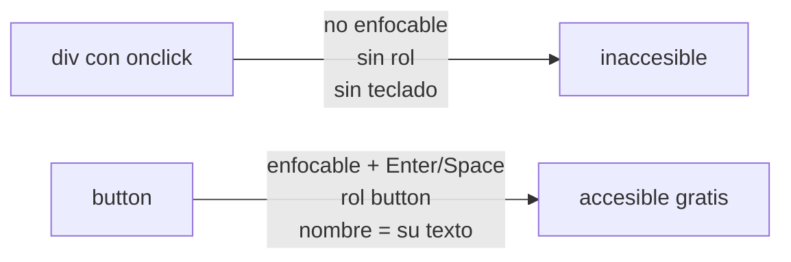
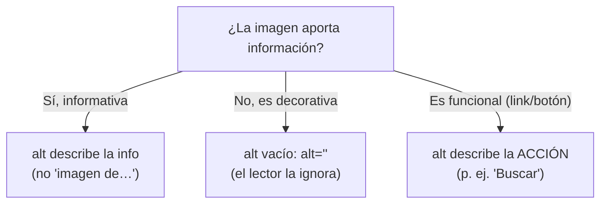

import Reto from "@components/Reto.astro";
import Solucion from "@components/Solucion.astro";
import Quiz from "@components/Quiz.astro";
import CheckDominio from "@components/CheckDominio.astro";
import Nivel from "@components/Nivel.astro";

<Nivel nivel="intermedio" />

Sabes maquetar con HTML semántico y CSS ([4.1](/fase-4-frontend/4-1-html-css/)) y darle un aspecto profesional con diseño visual ([4.3](/fase-4-frontend/4-3-diseno-visual/)). Pero "se ve bien" y "lo puede usar todo el mundo" son dos cosas distintas. Esta lección es la que convierte tu interfaz en algo **operable sin mouse, legible para un lector de pantalla y conforme con un estándar verificable**. No es un extra de buena gente: es un **gate** —un requisito de paso— de todo capstone con UI en este curso, y un filtro real en el mercado.

> La trampa de esta lección: tratar la accesibilidad (a11y) como una capa de "arreglos para discapacitados" que se pega al final. No lo es. La a11y bien hecha es **HTML correcto desde el primer tag**; mal hecha, es ARIA pegada encima de `<div>` que ni siquiera son operables con teclado. La regla de oro que vas a interiorizar hoy: **el HTML semántico ya es accesible; ARIA es para lo que el HTML no cubre, y mal usada empeora las cosas.**

:::tip[Si ya lo tocaste]
Si ya hiciste interfaces "accesibles" antes, no te saltes la lección: úsala como diagnóstico. Salta a los **dos ejercicios Primero-Sin-IA** (sección 7). Si en el ejercicio A dejas el test de a11y en verde **explicando qué Success Criterion (SC) de WCAG cubre cada arreglo**, y en el B trazas el orden de foco a mano, detectas la trampa de foco y nombras el SC violado en cada problema (no "no es accesible"), valida con el check de dominio (sección 8) y avanza a [4.5 React + TypeScript](/fase-4-frontend/4-5-react-typescript/). Si dudaste entre "cuándo ARIA sí" y "cuándo el HTML ya basta", vuelve a la sección 4.3.
:::

## 1. Qué vas a saber hacer

Al terminar, sin IA y sin notas, podrás:

- **O1 — Construir** una interfaz operable solo con teclado (orden de foco lógico, foco siempre visible, sin trampas) y **explicar** por qué un `<div>` con `onclick` no lo es.
- **O2 — Decidir** cuándo usar HTML semántico y cuándo añadir ARIA, aplicando la **Primera Regla de ARIA**, y justificar por qué "no ARIA es mejor que mal ARIA".
- **O3 — Hacer accesible** un formulario (labels asociados, mensajes de error anunciados, contraste AA, texto alternativo correcto) y **verificarlo** con teclado y con un lector de pantalla, nombrando el SC de WCAG 2.2 que cumple cada decisión.

## 2. Por qué importa (el dinero está aquí)

> 💰 **Por qué importa:** un AI Engineer que monta la UI de su propia demo vale más, pero una UI que el evaluador no puede operar —o que falla una auditoría— resta credibilidad en vez de sumarla. La a11y es de los pocos skills de frontend que es **legalmente exigible, medible con herramientas, y que casi nadie junior hace bien**. Saber nombrarla con el vocabulario del estándar te separa del que solo "pone divs bonitos".

Tres razones concretas, sin inflar:

- **Legal y de mercado.** En la UE, la *European Accessibility Act* exige accesibilidad en muchos productos digitales (en vigor desde junio 2025); en EE. UU. el ADA se aplica a la web y la Sección 508 la exige en el sector público. Las empresas que contratan remoto-USD lo saben: "experiencia con WCAG" aparece en ofertas reales. No es un nicho moral, es un requisito de contrato.
- **Beneficia a mucha más gente que "los ciegos".** Teclado: usuarios motores y power-users. Contraste: visión baja y cualquiera bajo el sol. Texto alternativo: conexiones lentas y SEO. Foco visible: todo el que navega con `Tab`. La a11y es **diseño para situaciones**, no para una minoría.
- **Es un gate del Definition of Done.** El criterio del curso es explícito: todo capstone con UI debe tener **a11y mínima (WCAG 2.2)** y estados completos. Si tu [Capstone F4](/fase-4-frontend/proyecto/) no se puede operar con teclado, no está terminado —da igual qué tan lindo se vea—.

## 3. Lo que ya traes (actívalo)

Esta lección se para sobre cosas que ya sabes hacer:

- De [4.1 HTML semántico + CSS](/fase-4-frontend/4-1-html-css/): los elementos semánticos (`<header>`, `<nav>`, `<main>`, `<button>`, `<label>`). Hoy descubres que **cada uno ya trae accesibilidad gratis** (rol, nombre, comportamiento de teclado) que tendrías que reconstruir a mano si usaras `<div>`.
- De [4.3 Diseño visual](/fase-4-frontend/4-3-diseno-visual/): el **contraste WCAG AA** (texto 4.5:1, UI 3:1) y la regla de "nunca uses solo el color". No eran temas de diseño: eran criterios de accesibilidad que ya practicaste. Hoy se cierran.

Antes de seguir, responde de memoria:

<Quiz
  question="En 4.3 verificaste que tu texto pasara 4.5:1 de contraste contra el fondo. ¿De qué documento sale ese 4.5:1?"
  options={[
    "Es una convención de Tailwind para sus colores por defecto",
    "Es el Success Criterion 1.4.3 (Contrast Minimum) de WCAG, nivel AA — el mismo estándar que estudias hoy",
    "Es una recomendación de Google para SEO",
  ]}
  answer={1}
  explanation="El 4.5:1 para texto normal (y 3:1 para texto grande o componentes de UI, SC 1.4.11) es parte de WCAG 2.2, nivel AA. Diseño visual y accesibilidad no son temas separados: el contraste es exactamente donde se tocan, y por eso el gate de esta lección reusa lo que ya practicaste."
/>

## 4. Ejemplo resuelto, pensado en voz alta

Voy a tomar una tarjeta de "aprobar acción de IA" —el tipo de componente que construirás en el capstone— que **funciona con mouse y se ve decente, pero es inaccesible**, y la voy a arreglar capa por capa. **No leas esto como reglas sueltas: léelo como me oirías razonar al lado tuyo.**

Punto de partida:

```html
<div class="app">
  <div class="card">
    <div class="title">Revisar acción detectada por la IA</div>
    
    <div>Renegociar contrato de logística antes de Q1.</div>
    <input placeholder="Tu nota para el aprobador">
    <div class="error">Escribe una nota antes de aprobar.</div>
    <div class="btn" onclick="aprobar()">Aprobar</div>
  </div>
</div>
```

Pienso en voz alta: *"Lo pruebo como lo probaría un auditor: desenchufo el mouse mentalmente y navego con `Tab`. El `<input>` recibe foco… y nada más. El 'botón' Aprobar es un `<div>`: no entra en el orden de tabulación, no responde a `Enter` ni a `Space`, y un lector de pantalla lo anuncia como texto plano, no como botón. La imagen no tiene `alt`: el lector dice 'check.svg' o 'imagen', ruido inútil. El `<input>` solo tiene `placeholder`, que desaparece al escribir y muchos lectores no lo anuncian como nombre. El error es un `<div>` suelto: nadie sabe a qué campo pertenece ni se anuncia cuando aparece. Y todo es un `<div>`: no hay landmarks ni encabezados, así que un usuario de lector de pantalla no puede saltar a las secciones. Cinco capas que arreglar: semántica, teclado, ARIA donde haga falta, contraste y formulario. Voy una a una."*

### 4.1 Capa 1 — semántica: el HTML correcto YA es accesible

La pregunta rectora de la a11y es: **¿estoy usando el elemento que el navegador ya sabe hacer accesible, o estoy reinventándolo con un `<div>`?** Cada elemento semántico trae tres cosas gratis que un `<div>` no tiene:

- **Rol** (qué es): `<button>` se anuncia como "botón", `<nav>` como "navegación".
- **Nombre** (cómo se llama): el texto del botón, el `<label>` del campo.
- **Comportamiento de teclado**: `<button>` es enfocable y se activa con `Enter`/`Space`; `<a href>` con `Enter`.

Cambio el `<div class="title">` por un encabezado (`<h1>`), el contenedor por `<main>` (un *landmark* que el lector usa para saltar al contenido), y —lo más importante— el `<div class="btn">` por un `<button>` de verdad. Con ese solo cambio gano foco, activación por teclado, rol y nombre. **Cero ARIA.**



### 4.2 Capa 2 — teclado: orden de foco y foco visible

Dos reglas no negociables del estándar:

- **Todo lo interactivo es operable con teclado** (SC 2.1.1) y **sin trampas de foco** (SC 2.1.2): si entras con `Tab`, debes poder salir con `Tab`/`Shift+Tab`, nunca quedar atrapado.
- **El foco siempre es visible** (SC 2.4.7): quien navega con teclado tiene que *ver* dónde está parado.

El **orden de foco sigue el orden del DOM**. Esa es la palanca clave: si ordenas bien tu HTML, el orden de tabulación sale correcto solo. Por eso casi nunca necesitas `tabindex` con número positivo —es un antipatrón que rompe el orden natural—. Solo uso `tabindex="0"` (mete algo en el orden) o `tabindex="-1"` (enfocable por código, no por `Tab`), nunca `tabindex="3"`.

Y el error #1 de CSS en a11y: borrar el contorno de foco porque "se ve feo". Nunca `outline: none` a secas. Lo que hago es **reemplazarlo por uno mejor** con `:focus-visible` (que solo muestra el anillo a quien navega con teclado, no al que hace click):

```css
:focus-visible {
  outline: 3px solid #1d4ed8;
  outline-offset: 2px;
  border-radius: 4px;
}
```

### 4.3 Capa 3 — ARIA: cuándo SÍ, y por qué casi nunca

Aquí está el malentendido más caro de la accesibilidad. La especificación lo dice con todas sus letras —la **Primera Regla de ARIA**—:

> *"If you can use a native HTML element or attribute with the semantics and behavior you require already built in, instead of re-purposing an element and adding an ARIA role, state or property to make it accessible, then do so."*

Traducido: **si existe el elemento HTML que hace lo que necesitas, úsalo en vez de simular su semántica con ARIA.** El corolario, repetido en toda la documentación de WAI-ARIA: **"No ARIA is better than bad ARIA"** —ARIA mal puesta es peor que ninguna—, porque un `role` que mientes (un `<div role="button">` sin manejar teclado) le promete al lector de pantalla algo que el componente no cumple.

Entonces, ¿cuándo ARIA *sí*? Cuando el HTML no tiene un elemento para lo que haces. Los tres casos honestos que vas a usar:

- **`aria-describedby`** para enlazar un campo con su mensaje de error o de ayuda (no existe HTML nativo que asocie un input con un texto descriptivo aparte de su label).
- **`aria-label` / `aria-labelledby`** para dar nombre a algo que no tiene texto visible (un botón que solo es un ícono).
- **`role="alert"` / `aria-live`** para anunciar contenido que aparece dinámicamente (un error que sale tras enviar el formulario) sin que el usuario tenga que ir a buscarlo.

En la tarjeta, el `<button>` y los landmarks **no llevan ARIA** (el HTML ya da rol y nombre). Solo el error la necesita.

### 4.4 Capa 4 — contraste y target size (cierra con 4.3)

Recupero lo de [4.3](/fase-4-frontend/4-3-diseno-visual/): texto ≥ 4.5:1 (SC 1.4.3), componentes de UI y bordes de foco ≥ 3:1 (SC 1.4.11), y **nunca el color como único medio** para comunicar (el error no puede ser solo un borde rojo: lleva ícono y texto, SC 1.4.1). WCAG 2.2 añade dos criterios nuevos que aplican aquí:

- **Target Size (Minimum), SC 2.5.8 (AA):** los objetivos táctiles deben medir al menos **24×24 píxeles CSS** (con excepciones). Un botón de 16px de alto es imposible de acertar en un teléfono. Apunto a 44×44, que es el mínimo cómodo.
- **Focus Not Obscured, SC 2.4.11 (AA):** cuando un elemento recibe foco, no puede quedar **tapado** por una barra fija o un sticky header. Si tienes un header pegajoso, el elemento enfocado tiene que seguir visible.

### 4.5 Capa 5 — formulario y texto alternativo

Dos arreglos finales:

- **Cada campo lleva un `<label>` asociado** por `for`/`id` (SC 1.3.1 y 4.1.2). El `placeholder` **no es un label**: desaparece al escribir, suele tener bajo contraste y no se anuncia de forma fiable. El label visible se queda siempre.
- **Texto alternativo correcto** (SC 1.1.1), que es una *decisión*, no "poner alt a todo":



En la tarjeta, el ícono de check es decorativo (el texto ya dice todo): le pongo `alt=""` para que el lector **no** lo anuncie. Si le pusiera `alt="check"`, agregaría ruido.

### 4.6 El resultado

```html
<main class="card">
  <h1 class="card__title">Revisar acción detectada por la IA</h1>

  <p class="card__body">
    
    Renegociar contrato de logística antes de Q1.
  </p>

  <form class="form" novalidate>
    <div class="form__row">
      <label for="nota">Nota para el aprobador <span aria-hidden="true">*</span></label>
      <textarea id="nota" name="nota" required
                aria-describedby="nota-error" aria-invalid="true"></textarea>
      <p id="nota-error" role="alert" class="form__error">
        Escribe una nota antes de aprobar.
      </p>
    </div>

    <button type="submit" class="boton">Aprobar acción</button>
  </form>
</main>
```

Pienso en voz alta: *"Ahora repito la prueba del auditor. Con `Tab`: el textarea recibe foco con anillo visible, luego el botón —orden lógico, sale del DOM—. Con `Enter` el botón se activa. El lector de pantalla anuncia 'principal' (el `<main>`), el encabezado de nivel 1, el campo como 'Nota para el aprobador, campo de texto, requerido', y cuando aparece el error lo dice solo porque es `role="alert"`. La imagen decorativa no la menciona. No usé ARIA donde el HTML bastaba: solo `aria-describedby`, `aria-invalid` y `role="alert"`, que es justo donde el HTML no llega. Eso es a11y: HTML correcto primero, ARIA quirúrgica después."*

> El hilo invisible de este arreglo: la a11y es **testeable**, igual que el código. El ejercicio de hoy trae un test automatizado que audita tu HTML (labels, landmarks, foco, alt, errores enlazados) —es un *linter de accesibilidad*, la misma disciplina de red-green que viste en testing—. Un test verde no garantiza accesibilidad perfecta (el juicio humano con lector de pantalla sigue siendo necesario), pero atrapa el 80% de los errores mecánicos antes de que lleguen a producción.

## 5. Errores de criterio que vas a tener (y por qué)

:::caution[Podrías pensar que "añadir ARIA hace las cosas accesibles"]
Es exactamente al revés de lo que parece. Poner `role="button"` a un `<div>` le dice al lector de pantalla "esto es un botón", pero **no** lo hace enfocable ni operable con `Enter`/`Space`: ahora mientes con más volumen. Tendrías que añadir `tabindex="0"`, manejar `keydown` para `Enter` y `Space`, y aun así replicar comportamientos del navegador. Un `<button>` nativo te da las cuatro cosas gratis. Por eso la Primera Regla de ARIA y "no ARIA es mejor que mal ARIA": ARIA **describe**, no **implementa**.
:::

:::caution[Podrías pensar que el `placeholder` sirve de label]
No. El placeholder desaparece en cuanto el usuario escribe (adiós contexto), suele venir en gris claro que **no pasa contraste**, y los lectores de pantalla no lo anuncian de forma consistente como nombre del campo. Un campo sin `<label>` asociado falla SC 1.3.1 y 4.1.2. El placeholder es para un *ejemplo de formato* ("ej: nombre@correo.cl"), nunca para reemplazar el label.
:::

:::caution[Podrías pensar que el contorno de foco es feo y hay que quitarlo]
`outline: none` sin reemplazo es una de las causas #1 de inaccesibilidad: deja a quien navega con teclado **sin saber dónde está**, violando SC 2.4.7. Si el outline por defecto no te gusta, no lo borres: reemplázalo con `:focus-visible` por uno que combine con tu diseño (y que pase 3:1 de contraste, SC 1.4.11). El foco visible no es opcional; su estilo, sí.
:::

:::caution[Podrías pensar que `tabindex` con números arregla el orden de tabulación]
Un `tabindex` positivo (`tabindex="1"`, `"3"`...) es un antipatrón: fuerza un orden de foco que se desincroniza del orden visual y del DOM en cuanto agregas un elemento, y crea bugs imposibles de mantener. El orden de foco correcto se logra **ordenando el HTML** (el orden de foco sigue el DOM). Usa solo `tabindex="0"` (incluir en el orden natural) o `tabindex="-1"` (enfocable solo por código), nunca positivos.
:::

:::caution[Podrías pensar que la a11y es "para una minoría" y se puede dejar para después]
Dos errores en uno. Primero, el alcance: teclado, contraste, foco y alt benefician a usuarios motores, de visión baja, en móvil, bajo el sol, con conexión lenta y a los buscadores —es una mayoría situacional, no una minoría—. Segundo, el momento: la a11y "pegada al final" significa reescribir `<div>` en `<button>`, reordenar el DOM y rehacer formularios. Hecha desde el primer tag (HTML semántico), **es gratis**. Dejarla para después es el camino caro.
:::

## 6. Práctica con andamiaje (que se desvanece)

Tres pasos, de más apoyo a menos. **A mano primero**, sin IA. Los dos primeros se resuelven razonando, sin ejecutar nada.

### 6.1 PREDICT — traza el orden de foco

Lee este HTML (no lo ejecutes). Predice el **orden en que los elementos reciben foco al pulsar `Tab`** repetidamente, e identifica si hay alguno **inalcanzable** con teclado.

```html
<a href="#main">Saltar al contenido</a>
<nav>
  <a href="/inicio">Inicio</a>
  <div class="boton" onclick="abrirMenu()">Menú</div>
</nav>
<main id="main">
  <button>Aprobar</button>
  <input type="text" />
</main>
```

<Solucion title="Ver la respuesta (solo después de predecir)">

Orden de foco con `Tab`: **1) "Saltar al contenido"** (`<a href>`, enfocable) → **2) "Inicio"** (`<a href>`) → **3) "Aprobar"** (`<button>`) → **4) el `<input>`**.

El **`<div class="boton">` "Menú" es inalcanzable con teclado**: un `<div>`, aunque tenga `onclick`, no entra en el orden de tabulación (no es enfocable por defecto) y no responde a `Enter`/`Space`. Un usuario de teclado no puede abrir ese menú. El arreglo correcto **no** es ponerle `tabindex="0"` y un handler de teclado a mano: es cambiarlo por `<button>`.

Fíjate además en que el orden de foco **siguió exactamente el orden del DOM**. Esa es la regla: ordena bien el HTML y el orden de tabulación sale solo.
</Solucion>

### 6.2 Parsons — decide ARIA sí o no

Para cada caso, decide si necesita ARIA o si el HTML semántico ya basta. Empareja cada situación (izquierda) con la decisión correcta (derecha):

```text
Situaciones:
  S1. Un botón que solo muestra un ícono de basurero (sin texto visible)
  S2. Un botón con el texto "Guardar"
  S3. Un mensaje de error que aparece tras enviar el formulario
  S4. La navegación principal del sitio
  S5. Un campo de texto con un mensaje de ayuda debajo

Decisiones:
  D1. HTML basta: <button>Guardar</button> (rol y nombre gratis)
  D2. HTML basta: <nav> (landmark de navegación gratis)
  D3. ARIA necesaria: aria-label en el <button> (no hay texto visible)
  D4. ARIA necesaria: role="alert" para que se anuncie al aparecer
  D5. ARIA necesaria: aria-describedby del input al id del mensaje
```

<Solucion title="Ver los emparejamientos y el criterio">

- **S1 → D3**: el botón de ícono no tiene texto, así que no tiene nombre accesible. `aria-label="Eliminar"` se lo da. (Sigue siendo un `<button>` nativo; ARIA solo añade el nombre que falta.)
- **S2 → D1**: el `<button>` con texto ya tiene rol *y* nombre. **Cero ARIA.**
- **S3 → D4**: el error aparece dinámicamente; sin `role="alert"` (o `aria-live`), el usuario de lector de pantalla no se entera de que salió. Es uno de los casos legítimos de ARIA.
- **S4 → D2**: `<nav>` es un landmark nativo. No necesitas `role="navigation"` (sería redundante).
- **S5 → D5**: no existe HTML nativo que asocie un input con un texto de ayuda *separado* de su label; `aria-describedby` apunta al `id` del mensaje.

El patrón: **ARIA solo cuando el HTML no tiene el elemento o el atributo nativo** (nombre faltante, anuncio dinámico, descripción asociada). Si el HTML ya lo cubre (S2, S4), añadir ARIA es ruido o, peor, una mentira.
</Solucion>

### 6.3 MODIFY — arregla una tarjeta inaccesible a mano

Esta tarjeta funciona con mouse pero falla varias cosas. Modifícala **a mano** arreglando al menos cuatro problemas de accesibilidad y nombrando, en un comentario al lado de cada cambio, **qué problema resolvías**.

```html
<div class="card">
  <div class="title">Resultado del análisis</div>
  
  <p>El margen cayó 2 puntos en Q3.</p>
  <input placeholder="Comentario">
  <div class="btn" onclick="enviar()">Enviar</div>
</div>
```

Pista: ¿qué `<div>` debería ser un encabezado? ¿Cuál un `<button>`? ¿El gráfico es informativo o decorativo (qué `alt` le toca)? ¿Dónde está el `<label>` del campo? Verifica tu resultado navegando con `Tab` en el navegador: si no puedes llegar a "Enviar" y activarlo con `Enter`, todavía falta.

## 7. Ejercicios Primero-Sin-IA

Sin andamiaje. Resuélvelos **a mano, sin IA** dentro del timebox. Documentación oficial permitida (WCAG, MDN, WAI-ARIA); IA solo al final, para *revisar*, no para *generar*.

<Reto title="Haz accesible un formulario y deja el test de a11y en verde" timebox="40–45 min">

Te damos un formulario de "aprobar acción de IA" en HTML que funciona con mouse pero es inaccesible: `<div>` que deberían ser landmarks y encabezados, un "botón" que es un `<div onclick>`, campos sin `<label>`, una imagen sin `alt`, un error suelto sin enlazar, y un `tabindex` positivo.

Hay un test automatizado (un *linter de a11y* con jsdom) que lee tu `formulario.html` y verifica siete cosas mecánicas: landmark `<main>`, al menos un encabezado, cada control con nombre accesible (label asociado o `aria-label` — el `placeholder` **no** cuenta), cero `tabindex` positivo, que "Aprobar" sea un `<button>` real, que la imagen tenga atributo `alt` (informativo o vacío), y que el error esté enlazado por `aria-describedby` a un elemento con `role="alert"`. El test arranca en **rojo** a propósito. La parte mecánica la cubre el test; el foco visible (`:focus-visible`) y la prueba con lector de pantalla se evalúan con la rúbrica.

Entregable: tu solución en `ejercicios/fase-4/formulario-accesible/` (HTML + CSS + un `decisiones.md` corto que mapee cada arreglo a su SC de WCAG), con el test en verde.

**Hecho significa:**
- [ ] El **test de a11y pasa en verde** (`pnpm install && pnpm test` dentro de la carpeta): los siete chequeos cumplen.
- [ ] La interfaz es **operable solo con teclado**: puedes tabular en orden lógico hasta el botón y activarlo con `Enter`/`Space`, sin trampas de foco.
- [ ] El **foco es visible** (`:focus-visible` con contraste ≥ 3:1), no `outline: none` a secas.
- [ ] **ARIA solo donde el HTML no llega** (error con `role="alert"` + `aria-describedby`); el `<button>` y los landmarks **sin** ARIA redundante.
- [ ] `decisiones.md` mapea, en 5–8 líneas, **cada arreglo a su SC de WCAG 2.2** (p. ej. "label asociado → SC 1.3.1; foco visible → SC 2.4.7").

Enunciado completo, *starter* y test: `ejercicios/fase-4/formulario-accesible/` (carpeta del repo).

<Solucion title="Pista (ábrela solo si superaste el timebox)">
Arregla por capas, no en desorden: (1) **semántica primero** —cambia los `<div>` por `<main>`, `<h1>`, `<button>`, `<label>`—; verás que la mitad de los chequeos pasan solo con eso, porque el HTML correcto ya es accesible. (2) Quita el `tabindex` positivo: el orden de foco lo da el DOM. (3) Para el error, ponle un `id`, un `role="alert"`, y conéctalo desde el campo con `aria-describedby="ese-id"`. (4) La imagen: si el texto ya dice lo que muestra, es decorativa → `alt=""`. (5) En el CSS, añade `:focus-visible`. Corre el test entre cada capa para ver qué falta. Esto es una pista, no la solución.
</Solucion>

</Reto>

<Reto title="Auditoría de accesibilidad: traza el foco y nombra el SC violado" timebox="30–35 min">

Te damos la descripción de una pantalla real con varios problemas de accesibilidad (orden de foco, trampa de foco, ARIA mal usada, contraste, alt, error no anunciado). Tu tarea **no** es arreglarla en código, sino **auditarla por escrito**: traza el orden de foco a mano, e identifica cada problema nombrando el **Success Criterion concreto de WCAG 2.2** que viola (p. ej. "SC 2.1.2 No Keyboard Trap: el modal atrapa el foco y `Esc` no cierra") y la corrección. Luego prioriza: si solo pudieras arreglar **tres**, ¿cuáles y por qué?

Este ejercicio entrena el músculo que te hace buen revisor en code review y buen cliente de la IA: **ver el problema y nombrarlo con el vocabulario del estándar**, en vez de "no es accesible".

Entregable: tu solución en `ejercicios/fase-4/auditoria-a11y-teclado/` (un `auditoria.md` con el orden de foco trazado + la lista de problemas con su SC + el top-3 priorizado).

**Hecho significa:**
- [ ] Trazaste el **orden de foco** completo de la pantalla y marcaste qué elementos son **inalcanzables** o crean una **trampa**.
- [ ] Identificaste al menos **cinco** problemas distintos, cada uno atado a un **SC concreto de WCAG 2.2** (con su número), no a un juicio vago.
- [ ] Distinguiste al menos un caso de **ARIA mal usada** (rol que miente / ARIA redundante sobre HTML que ya bastaba) y explicaste por qué empeora las cosas.
- [ ] Cada problema trae una **corrección accionable** (qué cambiarías, y si la solución correcta es "usar HTML nativo en vez de ARIA", dilo).
- [ ] El **top-3 priorizado** está justificado por impacto (qué bloquea por completo a un usuario vs. qué es molestia), no por orden de aparición.

Enunciado completo y *starter*: `ejercicios/fase-4/auditoria-a11y-teclado/` (carpeta del repo).

<Solucion title="Pista (ábrela solo si superaste el timebox)">
Recorre la pantalla con una checklist de SC, no "en general": teclado (2.1.1, 2.1.2), foco visible (2.4.7), foco no tapado (2.4.11), nombre/rol/valor (4.1.2), info y relaciones (1.3.1), contraste (1.4.3 / 1.4.11), uso del color (1.4.1), texto alternativo (1.1.1), target size (2.5.8). Para el orden de foco, recuerda que sigue el DOM salvo que haya `tabindex` positivos (que lo rompen). Para priorizar, pregunta: ¿esto **bloquea** a alguien por completo (no puede usar la función) o lo **molesta** (puede, pero peor)? Lo que bloquea va primero. Esto es una pista, no la solución.
</Solucion>

</Reto>

## 8. Check de dominio

Sin mirar la lección, en voz alta o por escrito:

<CheckDominio
  items={[
    "Explicar por qué un <div> con onclick no es accesible y qué cuatro cosas te da gratis un <button> nativo.",
    "Enunciar la Primera Regla de ARIA y dar un ejemplo de cuándo ARIA SÍ hace falta y uno de cuándo el HTML ya basta.",
    "Describir cómo se determina el orden de foco y por qué un tabindex positivo es un antipatrón.",
    "Explicar por qué nunca se hace outline: none sin reemplazo y qué hace :focus-visible.",
    "Decidir el alt correcto para una imagen informativa, una decorativa y una funcional.",
    "Listar tres SC de WCAG 2.2 que aplicas en un formulario accesible (label, error anunciado, contraste) con su número.",
    "Explicar cómo probarías la accesibilidad de una pantalla con teclado y con un lector de pantalla.",
  ]}
/>

Si marcaste menos de seis, vuelve a la sección correspondiente **antes** de avanzar. No es un examen: es honestidad contigo.

<Quiz
  question="Un compañero hace un menú desplegable con <div role='button' onclick='abrir()'> y dice 'le puse el rol, ya es accesible'. ¿Qué le dices?"
  options={[
    "Está bien: con role='button' el lector de pantalla ya lo anuncia como botón",
    "El rol miente: un <div> no es enfocable con Tab ni responde a Enter/Space. Por la Primera Regla de ARIA, usa <button>, que da rol, nombre, foco y teclado gratis; 'no ARIA es mejor que mal ARIA'",
    "Solo le falta agregar tabindex='1' para que entre en el orden de foco",
  ]}
  answer={1}
  explanation="role='button' solo cambia cómo se anuncia, no el comportamiento: el div sigue sin recibir foco con Tab ni activarse con teclado, así que le promete al usuario algo que no cumple. La Primera Regla de ARIA dice usar el elemento nativo (<button>) cuando existe; este es el caso de libro. Y tabindex='1' es un antipatrón (rompe el orden de foco); además no resolvería la activación por teclado."
/>

## 9. Recursos (documentación oficial primero)

- **WCAG 2.2 — W3C Recommendation** — [w3.org/TR/WCAG22](https://www.w3.org/TR/WCAG22/). La fuente autoritativa. Útil para buscar el número y el texto exacto de cada Success Criterion que cites.
- **WAI-ARIA — Using ARIA (Rules of ARIA Use)** — [w3.org/TR/using-aria](https://www.w3.org/TR/using-aria/). De aquí sale la Primera Regla de ARIA que aplicaste hoy; léela completa, es corta.
- **MDN — Accessibility** — [developer.mozilla.org/es/docs/Web/Accessibility](https://developer.mozilla.org/es/docs/Web/Accessibility). Guías prácticas de HTML accesible, ARIA y teclado, con ejemplos.
- **WAI — Easy Checks (cómo evaluar a11y a mano)** — [w3.org/WAI/test-evaluate/preliminary](https://www.w3.org/WAI/test-evaluate/preliminary/). Cómo probar teclado y lo básico sin herramientas caras.
- **WebAIM — Keyboard Accessibility / Screen Readers** — [webaim.org/techniques/keyboard](https://webaim.org/techniques/keyboard/). Cómo navega un usuario de teclado y de lector de pantalla, para que tu prueba sea realista.

## 10. Conexión con el capstone de la fase

El **[Capstone F4 — Frontend de una app de IA](/fase-4-frontend/proyecto/)** tiene la accesibilidad como **gate explícito**: el Definition of Done exige "a11y mínima (WCAG 2.2) si tiene UI; estados completos". Esta lección es la que te deja cruzar ese gate:

- Tu interfaz de chat/RAG debe ser **operable con teclado** de punta a punta —enviar un mensaje, navegar el historial, abrir fuentes— sin tocar el mouse. Eso es O1.
- Los **formularios** (el input del prompt, ajustes) llevan labels, errores anunciados con `role="alert"` y contraste AA. Eso es O3, y se conecta directo con los [estados de primera clase](/fase-4-frontend/4-10-usabilidad-estados/) (empty/loading/error/success): un estado de error que no se anuncia no sirve.
- La **UI de streaming** de [4.11](/fase-4-frontend/4-11-ui-apps-ia/) —texto que aparece token por token— necesita `aria-live` para que un lector de pantalla la siga; ahí vuelve ARIA, en su uso legítimo.

No estás aprendiendo a "cumplir una norma aburrida": estás construyendo el criterio que hace que tu demo la pueda usar **cualquiera** que la evalúe —incluido el reclutador que navega con teclado—.

## 11. Reflexión y repaso espaciado

Cierra escribiendo dos o tres frases: **¿en qué momento estuviste a punto de "resolver con ARIA" algo que el HTML nativo ya cubría?** Nombrar esa tentación con precisión es lo que la convierte, la próxima vez, en un reflejo de "primero, ¿hay un elemento nativo para esto?".

Gancho de **spaced repetition**:

- **Mañana:** toma el formulario del ejercicio A y reescríbelo **de memoria**, partiendo de HTML semántico. Si no recuerdas qué llevaba ARIA y qué no, no internalizaste la Primera Regla —vuelve a la sección 4.3—.
- **En 3 días:** abre cualquier sitio que uses a diario y navégalo **solo con `Tab`** (sin mouse). ¿Llegas a todo? ¿Ves siempre dónde está el foco? Encuentra una violación (un botón que es un div, un foco invisible) y nombra el SC.
- **En 1 semana:** activa el lector de pantalla de tu sistema (VoiceOver en Mac con `Cmd+F5`, Narrator en Windows, Orca en Linux) y escucha cómo lee una página tuya. Es incómodo la primera vez y revelador siempre: oirás exactamente qué tan bien (o mal) nombraste tus elementos.
