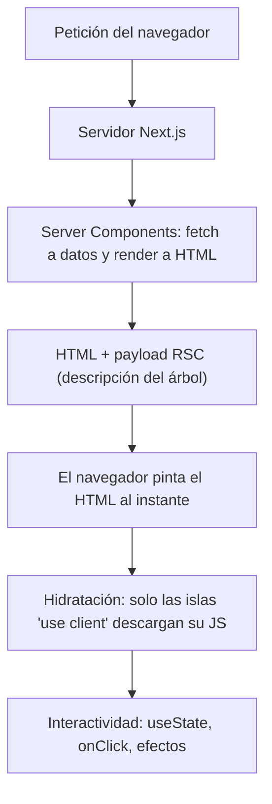

import Reto from "@components/Reto.astro";
import Solucion from "@components/Solucion.astro";
import Quiz from "@components/Quiz.astro";
import CheckDominio from "@components/CheckDominio.astro";
import Nivel from "@components/Nivel.astro";

<Nivel nivel="intermedio" />

En [4.5](/fase-4-frontend/4-5-react-typescript/) aprendiste React: componentes, props, estado, hooks. Todo eso corría en el navegador. Next.js es el **framework** que envuelve a React y le agrega lo que una app de verdad necesita: enrutado por archivos, render en el servidor, una capa de API y despliegue de un solo paso. Pero trae un giro mental que es **toda** la lección: en React puro (con Vite) tus componentes viven en el navegador; en el **App Router** de Next.js, tus componentes corren en el **servidor por defecto**, y tú decides explícitamente cuáles "bajan" al navegador con la directiva `'use client'`. Esa inversión —de "todo es cliente" a "todo es servidor salvo que yo diga lo contrario"— es lo que hace que una app de Next.js sea rápida y barata… o lenta y cara.

> La trampa de esta lección: tratar a Next.js como "React con un router" y poner `'use client'` arriba de cada archivo "por si acaso". Eso anula el motivo entero de usar Next.js: vuelves a mandar todo el JavaScript al navegador y pierdes el render en servidor. El junior pone `'use client'` en todo; el semi-senior sabe **empujar esa frontera lo más abajo posible** en el árbol de componentes. Ese juicio es exactamente lo que se evalúa.

:::tip[Si ya lo tocaste]
Si ya desplegaste una app en Next.js, no te saltes la lección: úsala como diagnóstico. Salta a los **dos ejercicios Primero-Sin-IA** (sección 7). Si en el A construyes un Route Handler con validación de entrada y status codes correctos sin mirar docs, y en el B colocas la frontera `'use client'` lo más abajo posible y eliges el modo de render de la página **defendiendo el trade-off de frescura vs. costo**, valida con el check de dominio (sección 8) y avanza a [4.7 Estado y datos](/fase-4-frontend/4-7-estado-y-datos/). Si tu instinto fue `getServerSideProps`, aprendiste el **Pages Router** antiguo: esta lección es App Router, el modelo vigente.
:::

## 1. Qué vas a saber hacer

Al terminar, sin IA y sin notas, podrás:

- **O1 — Estructurar** una ruta del App Router (carpeta + `layout.tsx` + `page.tsx`) y **decidir** qué parte es Server Component y qué parte es Client Component, colocando `'use client'` lo más abajo posible en el árbol.
- **O2 — Implementar** la capa de servidor: un Route Handler (`route.ts`) que expone un endpoint JSON con **validación de entrada**, y una Server Action que muta datos y revalida la caché.
- **O3 — Explicar y elegir** el modo de render de una página —estático (SSG), incremental (ISR con `revalidate`) o dinámico (SSR)— según la naturaleza de sus datos, y justificar el trade-off de frescura contra costo y latencia.

## 2. Por qué importa (el dinero está aquí)

> 💰 **Por qué importa:** Next.js es el **estándar fullstack del mercado** y el framework sobre el que se montan los capstones de esta fase. Pero el diferencial salarial no es saber correr `create-next-app` —eso lo hace cualquiera—: es entender la **frontera servidor/cliente**, que es justo lo que decide si tu app carga en 300ms o en 3 segundos, y si tu factura de hosting es de 5 dólares o de 500. Esa decisión, invisible en una demo, es lo que separa al que "hizo el tutorial" del que puede sostener la app en producción.

Concreto, sin vender humo:

- **Es donde se monta la UI de toda app de IA.** La interfaz de chat con streaming que verás en [4.11](/fase-4-frontend/4-11-ui-apps-ia/) y el [capstone](/fase-4-frontend/proyecto/) viven en Next.js: el frontend consume tu backend de la Fase 3 y, muchas veces, el propio Next.js **es** ese backend vía Route Handlers y Server Actions. Fullstack en un solo proyecto.
- **El bug más caro es la frontera mal puesta.** Un `'use client'` demasiado arriba arrastra medio árbol al navegador y mata el render de servidor. Un secreto de API leído en un Client Component se filtra al navegador (un fallo de seguridad real). Saber dónde corre cada línea te ahorra ambos.
- **El render en servidor es SEO y velocidad gratis.** Una página estática o renderizada en servidor llega al navegador como HTML listo: Google la indexa y el usuario la ve al instante. Una SPA pura manda un HTML vacío y "ya cargará el JS". Para un portafolio que quieres que **encuentren**, eso importa.
- **Vercel hizo Next.js, así que el deploy es trivial** y entra en la conversación de costo/latencia que el mercado 2026 espera de un semi-senior.

## 3. Lo que ya traes (actívalo)

Esta lección se apoya en cosas que ya sabes:

- De [4.5 React + TypeScript](/fase-4-frontend/4-5-react-typescript/): componentes, props tipadas, `useState`, `useEffect`, el estado como "foto" del render. **Los Client Components son exactamente el React que ya aprendiste.** Lo nuevo son los Server Components.
- De [4.1 HTML semántico + CSS](/fase-4-frontend/4-1-html-css/): el HTML como árbol de nodos. Un Server Component **produce ese HTML en el servidor**, antes de llegar al navegador.
- De **Cómo funciona la web** (sub-unidad 0.4 de la Fase 0): cliente-servidor, request/response, HTTP, status codes. Next.js vive en **ambos lados** de esa frontera a la vez; tener claro qué es servidor y qué es cliente es prerrequisito real aquí.
- De **APIs y JSON** (sub-unidad 1.5 de la Fase 1): un Route Handler es, al final, una función que recibe una `Request` y devuelve una `Response` con JSON. Ya escribiste clientes de API; ahora escribes el servidor.

Antes de seguir, responde de memoria:

<Quiz
  question="¿Cuál de estas cosas NO puede hacer un componente que corre en el servidor (Server Component)?"
  options={[
    "Hacer await fetch a una base de datos o a una API",
    "Usar useState y responder a un onClick del usuario",
    "Devolver JSX que el servidor convierte en HTML",
  ]}
  answer={1}
  explanation="Un Server Component corre una sola vez en el servidor para producir HTML: no hay navegador, no hay interactividad, no hay estado que cambie en el tiempo. Por eso NO puede usar useState, useEffect, onClick ni APIs del navegador (localStorage, window). Sí puede hacer fetch/await directamente (está en el servidor, cerca de los datos) y devolver JSX. La interactividad es justo lo que delegas a un Client Component con 'use client'."
/>

## 4. Ejemplo resuelto, pensado en voz alta

Voy a construir, de principio a fin, una página real: un **catálogo de modelos de IA** con búsqueda, pensado como el germen de tu capstone. Razono en voz alta en cada paso. **No lo leas como reglas sueltas: léelo como me oirías pensar al lado tuyo.**

### 4.1 La estructura: las carpetas SON las rutas

Pienso en voz alta: *"En el App Router, la carpeta `app/` es el mapa de URLs. Cada carpeta es un segmento de la ruta; el archivo `page.tsx` dentro de una carpeta es la UI de esa ruta, y `layout.tsx` es el cascarón compartido que envuelve a las páginas hijas. No configuro un router a mano: la estructura de archivos ES el router."*

```text
app/
├── layout.tsx        → cascarón raíz (html, body, nav). Envuelve TODO.
├── page.tsx          → la ruta "/"
├── modelos/
│   ├── page.tsx      → la ruta "/modelos"
│   └── [id]/
│       └── page.tsx  → ruta dinámica "/modelos/123"
└── api/
    └── modelos/
        └── route.ts  → endpoint JSON en "/api/modelos" (NO es UI)
```

Dos reglas que confunden al principio: (1) en un mismo segmento **no** pueden convivir `page.tsx` y `route.ts` —uno sirve UI, el otro sirve datos; chocan—. (2) Una carpeta entre corchetes como `[id]` es un **segmento dinámico**: captura el valor de la URL.

### 4.2 El layout y la página: Server Components por defecto

*"Empiezo por el layout. Es un Server Component (no escribí ninguna directiva, y en el App Router eso significa servidor). Recibe `children` y define el cascarón. El layout raíz es el único que debe incluir `<html>` y `<body>`."*

```tsx
// app/layout.tsx — Server Component (por defecto, sin directiva)
export default function RootLayout({
  children,
}: {
  children: React.ReactNode;
}) {
  return (
    <html lang="es">
      <body>
        <nav>Catálogo de modelos</nav>
        {children}
      </body>
    </html>
  );
}
```

*"Ahora la página. Quiero mostrar la lista de modelos cargada desde una API. Como es un Server Component, puedo hacer `await fetch` directamente en el cuerpo del componente: estoy en el servidor, cerca de los datos. El componente es `async`, algo que en React de navegador no podías hacer."*

```tsx
// app/modelos/page.tsx — Server Component asíncrono
interface Modelo {
  id: string;
  nombre: string;
  proveedor: string;
}

export default async function PaginaModelos() {
  // Corre en el SERVIDOR. El navegador nunca ve esta llamada ni una clave de API.
  const res = await fetch("https://api.ejemplo.com/modelos");
  const modelos: Modelo[] = await res.json();

  return (
    <main>
      <h1>Modelos disponibles</h1>
      <ul>
        {modelos.map((m) => (
          <li key={m.id}>
            {m.nombre} — {m.proveedor}
          </li>
        ))}
      </ul>
    </main>
  );
}
```

Modelo mental, di esto despacio: **el navegador no recibe este componente ni su JavaScript; recibe el HTML ya armado.** El `fetch` ocurre en el servidor, así que una clave de API o una conexión a la base de datos viven ahí y **nunca** se filtran al cliente. Eso es seguridad por construcción.

> Cambio de Next.js 15 que tropieza a todos: en una ruta dinámica como `app/modelos/[id]/page.tsx`, los `params` (y los `searchParams`) ahora son una **Promise** que debes `await`-ear. Antes (Next.js 14) eran objetos planos. Lo mismo con `cookies()` y `headers()`: ahora son asíncronos.

```tsx
// app/modelos/[id]/page.tsx — params es una Promise en Next.js 15
export default async function DetalleModelo({
  params,
}: {
  params: Promise<{ id: string }>;
}) {
  const { id } = await params; // <- hay que await-earlo
  return <h1>Modelo {id}</h1>;
}
```

### 4.3 La frontera: `'use client'` para la parte interactiva

*"La búsqueda en vivo necesita estado (`useState`) y un `onChange`: eso es interactividad, y la interactividad solo existe en el navegador. Así que la caja de búsqueda tiene que ser un Client Component. Lo marco con `'use client'` en la primera línea del archivo. La clave: NO convierto la página entera en cliente —solo el trocito que de verdad necesita el navegador—. La página sigue siendo Server Component; le 'inserto' una isla de cliente."*

```tsx
// app/modelos/BuscadorModelos.tsx
"use client"; // <- esta línea marca la FRONTERA: de aquí para adentro, navegador

import { useState } from "react";

export function BuscadorModelos({ nombres }: { nombres: string[] }) {
  const [query, setQuery] = useState("");
  // Estado derivado, igual que en 4.5: se calcula en el render, sin useEffect.
  const visibles = nombres.filter((n) =>
    n.toLowerCase().includes(query.toLowerCase()),
  );

  return (
    <div>
      <input
        value={query}
        placeholder="Buscar modelo"
        onChange={(e) => setQuery(e.target.value)}
      />
      <ul>
        {visibles.map((n) => (
          <li key={n}>{n}</li>
        ))}
      </ul>
    </div>
  );
}
```

Tres cosas que debes interiorizar de la directiva `'use client'`:

- **Marca una frontera, no un archivo aislado.** Todo módulo que un Client Component **importe** se vuelve también cliente. Por eso conviene poner `'use client'` en hojas pequeñas del árbol, no en la raíz.
- **El Server Component puede renderizar al Client Component y pasarle props**, pero esas props tienen que ser **serializables** (strings, números, objetos, arreglos). No puedes pasarle una función cualquiera ni una conexión a la DB: cruzan la red. (La excepción son las Server Actions, sección 4.5.)
- **El patrón ganador es "servidor afuera, islas de cliente adentro".** La página obtiene los datos en el servidor y le pasa solo lo necesario a la isla interactiva.

```tsx
// app/modelos/page.tsx — la página (servidor) inserta la isla (cliente)
import { BuscadorModelos } from "./BuscadorModelos";

export default async function PaginaModelos() {
  const res = await fetch("https://api.ejemplo.com/modelos");
  const modelos: { nombre: string }[] = await res.json();
  const nombres = modelos.map((m) => m.nombre); // prop serializable

  return (
    <main>
      <h1>Modelos disponibles</h1>
      <BuscadorModelos nombres={nombres} />
    </main>
  );
}
```

Este es el flujo completo de render que acabas de construir:



### 4.4 Route Handler: tu propia API dentro de Next.js

*"El buscador de arriba filtra una lista que ya tengo en memoria. Pero a veces el cliente necesita pedir datos al servidor bajo demanda (por ejemplo, autocompletar contra una base de datos enorme). Para eso expongo un endpoint con un Route Handler: el archivo `route.ts`. Es una función que recibe una `Request` y devuelve una `Response`, igual que cualquier API HTTP que ya consumiste."*

```ts
// app/api/modelos/route.ts — endpoint en GET /api/modelos
const MODELOS = [
  { id: "1", nombre: "Claude Opus", proveedor: "Anthropic" },
  { id: "2", nombre: "GPT-5.1", proveedor: "OpenAI" },
];

export async function GET(request: Request): Promise<Response> {
  // Leo el query param ?q= de la URL.
  const q = new URL(request.url).searchParams.get("q") ?? "";

  // SEGURIDAD: nunca confío en la entrada. Acoto su tamaño antes de usarla.
  if (q.length > 64) {
    return Response.json({ error: "consulta demasiado larga" }, { status: 400 });
  }

  const visibles = MODELOS.filter((m) =>
    m.nombre.toLowerCase().includes(q.toLowerCase()),
  );

  return Response.json({ query: q, count: visibles.length, items: visibles });
}
```

Cosas que importan aquí:

- **El nombre de la función es el verbo HTTP.** `export async function GET(...)`, `POST`, `PUT`, `DELETE`. Cada uno es un handler distinto en el mismo archivo.
- **Usas las APIs web estándar** `Request`, `Response`, `URL`. `Response.json(datos, { status })` arma la respuesta. (En un proyecto Next.js real, el framework te pasa un `NextRequest`, que es un superset de `Request`; tiparlo como `Request` mantiene el código portable y testeable.)
- **La validación de entrada no es opcional.** Un endpoint sin validar es una puerta abierta (OWASP: *Injection*, entrada no acotada). Acota tamaños, valida tipos, devuelve `400` ante basura. Lo practicas en el ejercicio A.

:::caution[Cuándo NO usar un Route Handler]
La documentación oficial lo dice claro: **un Server Component debe leer datos directamente** (su `await fetch` o su consulta a la DB), **no** llamando a tu propio Route Handler. Hacerlo agrega un salto HTTP innecesario y puede romper el prerender. Los Route Handlers son para **clientes** (tu Client Component, una app móvil, un webhook de terceros), no para que un Server Component se hable a sí mismo.
:::

### 4.5 Server Action: mutar datos sin escribir un endpoint a mano

*"Para escribir datos (marcar un favorito, crear un registro) podría hacer un `POST` a un Route Handler y llamarlo con `fetch` desde el cliente. Pero Next.js ofrece algo más directo: una Server Action. Es una función asíncrona marcada con `'use server'` que corre en el servidor pero la puedo invocar desde un formulario como si fuera local. Next.js arma el endpoint por mí."*

```tsx
// app/modelos/acciones.ts
"use server"; // <- todo lo de este archivo son Server Actions

import { revalidatePath } from "next/cache";

export async function marcarFavorito(formData: FormData) {
  const id = String(formData.get("id"));
  // SEGURIDAD: aquí validas y autorizas (¿este usuario puede? ¿el id existe?)
  // antes de escribir en la DB. Nunca confíes en lo que mandó el formulario.
  await guardarFavoritoEnDB(id);

  // Refresca la caché de esta ruta para que la UI muestre el cambio.
  revalidatePath("/modelos");
}
```

```tsx
// En un componente: el formulario llama a la action directamente.
import { marcarFavorito } from "./acciones";

function BotonFavorito({ id }: { id: string }) {
  return (
    <form action={marcarFavorito}>
      <input type="hidden" name="id" value={id} />
      <button type="submit">★ Favorito</button>
    </form>
  );
}
```

La diferencia mental: **Route Handler = una API pública con su URL** (la consume cualquiera: tu cliente, un tercero, un webhook). **Server Action = una mutación que tu propia UI dispara** (Next.js gestiona el transporte; tú no escribes la URL ni el `fetch`). La validación y autorización viven en el servidor en **ambos** casos: la regla de oro de seguridad es que el cliente puede mentir, así que **nunca** confíes en lo que llega.

### 4.6 Modos de render: estático, incremental o dinámico

*"Última gran decisión: ¿cuándo se genera el HTML de esta página? No hay una respuesta única; depende de los datos. Razono caso por caso."*

| Modo | Cuándo se genera el HTML | Úsalo cuando… | Costo/latencia |
|---|---|---|---|
| **Estático (SSG)** | Una vez, al hacer build | Los datos casi no cambian (landing, docs, post de blog) | El más barato y rápido |
| **Incremental (ISR)** | En build + se regenera cada `N` segundos | Datos que cambian con calma (catálogo, precios) | Barato; frescura acotada |
| **Dinámico (SSR)** | En **cada** petición | Datos por usuario o que cambian a cada segundo (dashboard, carrito) | El más caro; siempre fresco |

En el App Router controlas esto sobre todo con el caché del `fetch` y con exports de configuración del segmento:

```tsx
// ISR: regenera esta página como máximo cada 60 segundos.
export const revalidate = 60;

// Forzar dinámico: se renderiza en cada petición (SSR puro).
export const dynamic = "force-dynamic";
```

> Cambio clave de Next.js 15: **`fetch` ya NO se cachea por defecto** (en Next.js 14 sí). Hoy, si quieres que un `fetch` se cachee, lo pides explícito con `cache: 'force-cache'`; si quieres datos siempre frescos, `cache: 'no-store'`. Un `fetch` con `no-store` (o `revalidate: 0`) vuelve **dinámica** toda la ruta.

```tsx
const a = await fetch("https://..."); // NO cacheado (default v15)
const b = await fetch("https://...", { cache: "force-cache" }); // cacheado
const c = await fetch("https://...", { cache: "no-store" }); // siempre fresco → ruta dinámica
```

La pregunta que debes saber responder en entrevista: *"¿por qué esta página es ISR de 60s y no SSR?"* Respuesta de semi-senior: *"porque el catálogo cambia cada pocos minutos, no por usuario; servir HTML cacheado y regenerarlo cada minuto da frescura suficiente a una fracción del costo de renderizar en cada petición."* Ese es el trade-off de O3.

### 4.7 Metadata / SEO básico

*"Para que Google y las redes muestren bien la página, defino su título y descripción. Si son fijos, exporto un objeto `metadata`. Si dependen de los datos (el título del modelo `[id]`), uso `generateMetadata`, que es asíncrono y también `await`-ea los params."*

```tsx
// metadata estática
export const metadata = {
  title: "Catálogo de modelos de IA",
  description: "Compara modelos por proveedor y capacidad.",
};

// metadata dinámica (Next.js 15: params es Promise)
export async function generateMetadata({
  params,
}: {
  params: Promise<{ id: string }>;
}) {
  const { id } = await params;
  return { title: `Modelo ${id}` };
}
```

### 4.8 Deploy en Vercel

*"Vercel creó Next.js, así que el despliegue es de cero configuración: conecto el repo de GitHub, cada `git push` a la rama de producción dispara un build y un deploy. Las variables de entorno (claves de API) las pongo en el panel de Vercel, **no** en el repo. Las que el navegador necesita ver deben llevar el prefijo `NEXT_PUBLIC_`; las demás se quedan en el servidor."*

Regla de seguridad que conecta con todo lo anterior: una variable **sin** `NEXT_PUBLIC_` solo existe en el servidor (Server Components, Route Handlers, Server Actions). Si lees un secreto en un Client Component, o le pones `NEXT_PUBLIC_` a una clave privada, **la filtras al navegador**. Otra razón para mantener la frontera bien puesta.

## 5. Errores y malentendidos comunes

:::caution[Podrías pensar... pero está mal]

**"Pongo `'use client'` arriba de todos mis archivos para no preocuparme."**
Mal, y es el error #1. Anula el render en servidor, manda más JavaScript al navegador (app más lenta) y pierdes el SEO. La directiva marca una **frontera**: ponla en las hojas interactivas más pequeñas, deja todo lo demás en servidor.

**"Los Server Components son más lentos porque tienen que ir al servidor."**
Al revés. Corren cerca de los datos (menos saltos de red que un cliente que pide a una API) y **no** suman nada al bundle de JavaScript del navegador. Lo que llega al cliente es HTML listo. El cliente solo descarga JS para las islas interactivas.

**"Mi Server Component debería pedir sus datos a mi propio Route Handler."**
Mal (lo dice la doc oficial). Un Server Component lee datos **directamente** con `await fetch`/DB. Llamar a tu propio endpoint agrega un salto HTTP y puede romper el prerender. Los Route Handlers son para clientes, no para que el servidor se hable solo.

**"`fetch` se cachea por defecto, como en Next.js 14."**
Mal en Next.js 15: ya **no** se cachea por defecto. Si asumes el comportamiento viejo, tu app o sirve datos viejos donde no debe, o gasta de más donde podrías cachear. Opta explícito: `force-cache` o `no-store`.

**"`'use server'` hace que un componente corra en el servidor."**
Mal. Los Server Components corren en servidor **sin** ninguna directiva (es el default). `'use server'` marca una **Server Action** (una función servidor que la UI puede invocar), no un componente. Son cosas distintas que se parecen en el nombre.

**"`params` y `searchParams` son objetos, los leo directo."**
Mal en Next.js 15: son **Promises**. `const { id } = await params;`. Lo mismo con `cookies()` y `headers()`.

:::

Un *non-example* que parece razonable pero está roto. Léelo y detecta los **dos** bugs antes de seguir:

```tsx
// 🐛 ¿Qué tiene de malo?
"use client";

export default async function Pagina() {
  const clave = process.env.OPENAI_API_KEY; // (1)
  const res = await fetch("https://api.openai.com/...", {
    headers: { Authorization: `Bearer ${clave}` },
  });
  const datos = await res.json();
  return <div>{datos.length} resultados</div>;
}
```

Dos errores graves: **(1)** un componente con `'use client'` corre en el navegador, así que `process.env.OPENAI_API_KEY` no existe ahí —y si la hubieras expuesto con `NEXT_PUBLIC_`, **la habrías filtrado a cualquiera que abra las devtools**: fuga de credencial—. **(2)** un Client Component **no puede ser `async`** ni hacer `await` en su cuerpo de render. Lo correcto: borra el `'use client'`, déjalo como Server Component (puede ser `async` y leer el secreto sin filtrarlo). Si necesitaras interactividad además, separas la isla cliente y le pasas solo los datos ya resueltos. Este es exactamente el músculo del ejercicio B.

## 6. Práctica con andamiaje (PRIMM)

Antes de construir desde cero, practica sobre código que ya existe, con el ciclo **PRIMM**: *Predict → Run → Investigate → Modify → Make*.

### 6.1 Predice (antes de ejecutar nada)

Tienes este árbol de componentes. `Pagina` no tiene directiva; `Contador` tiene `'use client'`. **Predice en papel:** ¿cuáles corren en el servidor, cuáles en el navegador, y qué JavaScript descarga el cliente?

```tsx
// app/page.tsx — sin directiva
import { Contador } from "./Contador";
import { Footer } from "./Footer"; // sin directiva, solo muestra texto

export default async function Pagina() {
  const datos = await fetch("https://api.ejemplo.com/info").then((r) => r.json());
  return (
    <main>
      <h1>{datos.titulo}</h1>
      <Contador />
      <Footer />
    </main>
  );
}
```

```tsx
// app/Contador.tsx
"use client";
import { useState } from "react";
export function Contador() {
  const [n, setN] = useState(0);
  return <button onClick={() => setN(n + 1)}>n = {n}</button>;
}
```

Escribe tu predicción antes de abrir la respuesta.

<Solucion title="Ver respuesta (después de predecir)">

`Pagina` y `Footer` corren **en el servidor**: no tienen directiva y no usan interactividad. El `await fetch` ocurre en el servidor y el navegador recibe su HTML ya armado. `Contador` corre **en el navegador**: tiene `'use client'`, usa `useState` y `onClick`. El navegador descarga el JavaScript **solo** de `Contador` (la isla); `Pagina` y `Footer` no suman JS al bundle. Esa es la economía de los Server Components: pagas JavaScript únicamente por lo interactivo.

</Solucion>

### 6.2 Parsons: reordena un Route Handler

Estas líneas forman un Route Handler `GET` que devuelve JSON, pero están **desordenadas**. Reescríbelas en el orden correcto (a mano, en papel):

```text
A)   const q = new URL(request.url).searchParams.get("q") ?? "";
B) export async function GET(request: Request): Promise<Response> {
C)   return Response.json({ query: q, items: resultado });
D)   const resultado = BASE.filter((x) => x.includes(q));
E) }
```

<Solucion title="Ver orden correcto (después de intentarlo)">

`B → A → D → C → E`:

```ts
export async function GET(request: Request): Promise<Response> {
  const q = new URL(request.url).searchParams.get("q") ?? "";
  const resultado = BASE.filter((x) => x.includes(q));
  return Response.json({ query: q, items: resultado });
}
```

El orden es el flujo de cualquier handler: **firma** (el verbo HTTP como nombre) → **leer la entrada** (query param) → **procesar** (filtrar) → **responder** (`Response.json`). Falta lo importante que añadirás en el ejercicio A: **validar** la entrada antes de procesar.

</Solucion>

### 6.3 Modifica

Toma el handler de arriba y, sin ejecutarlo aún, modifícalo en papel para que: (a) **valide** que `q` no supere 50 caracteres y devuelva `Response.json({ error: ... }, { status: 400 })` si lo hace, y (b) acepte un segundo query param `?limit=` que limite cuántos resultados devuelve. Luego ya estás listo para el ejercicio A, donde lo construyes y lo pruebas con tests reales.

## 7. Ejercicios Primero-Sin-IA

Dos ejercicios complementarios. El A es de código (lo construyes y lo validas con tests); el B es de razonamiento y diseño (decides la arquitectura y escribes tu justificación). Las carpetas viven en tu repo: `ejercicios/fase-4/route-handler-modelos/` y `ejercicios/fase-4/frontera-server-client/`. Ábrelas en tu editor.

<Reto title="A — Route Handler con validación de entrada" timebox="40 min">

Implementa el Route Handler `GET` de `app/api/modelos/route.ts`: un endpoint que filtra un catálogo de modelos por una consulta `q` y limita los resultados con `limit`, **validando la entrada** y devolviendo los status codes correctos. Lo escribes con las APIs web estándar `Request`/`Response`, así que corre y se prueba sin levantar Next.js.

Contrato del endpoint (los tests lo verifican):
- `?q=` (opcional): filtra por **substring case-insensitive** contra el `nombre` **o** el `proveedor` del modelo. Sin `q` (o vacío), no filtra.
- `?limit=` (opcional, default `10`): debe ser un entero `≥ 1`; si no lo es (`abc`, `0`, negativo), responde `400`. Si supera `50`, se **acota** a `50` (no es error).
- Si `q` supera 64 caracteres, responde `400` (entrada no acotada = riesgo de seguridad).
- Respuesta exitosa (`200`): `Response.json({ query, count, items })`, donde `count` es la cantidad de `items` devueltos.

Hecho significa:
- Lees `q` y `limit` desde `new URL(request.url).searchParams`.
- **Validas antes de procesar**: `q` largo y `limit` inválido devuelven `400` con un cuerpo `{ error }`.
- Filtras case-insensitive contra `nombre` y `proveedor`; acotas por `limit` (con su clamp a 50).
- Devuelves la forma exacta `{ query, count, items }` con status `200`.
- Los tests (`pnpm install && pnpm test`) pasan en verde, y agregas **un test propio** (un caso borde: `q` con espacios, `limit` en el borde, acentos…).
- Puedes explicar sin notas por qué validar la entrada en el servidor es obligatorio aunque el cliente "ya valide".

Sigue el ciclo Primero-Sin-IA: intenta a mano, luego consulta la [documentación oficial de Route Handlers](https://nextjs.org/docs/app/api-reference/file-conventions/route), y solo al final usa IA para *revisar*, no para *generar*.

<Solucion title="Pista (ábrela solo si te trabaste de verdad)">

El esqueleto: lee `const params = new URL(request.url).searchParams;`. Saca `q` con `params.get("q") ?? ""` y haz `q.trim()`. Valida el largo de `q` y haz `return Response.json({ error }, { status: 400 })` si falla. Para `limit`: si `params.has("limit")`, parsea con `Number()`, comprueba que sea entero `≥ 1` (`Number.isInteger`), si no → `400`; luego `Math.min(limit, 50)`. Filtra con `m.nombre.toLowerCase().includes(q.toLowerCase()) || m.proveedor.toLowerCase().includes(...)`, corta con `.slice(0, limit)`, y responde `{ query: q, count: items.length, items }`. Esto es una pista, no la solución.

</Solucion>

</Reto>

<Reto title="B — Decide la frontera servidor/cliente y el modo de render" timebox="35 min">

Ejercicio de **razonamiento y diseño** (sin código ejecutable, como una revisión de arquitectura). Te entregamos la descripción de una página de catálogo de modelos con 7 piezas. Tu trabajo: para **cada** pieza, decidir qué es —**Server Component**, **Client Component**, **Route Handler** o **Server Action**— y dónde cae la frontera `'use client'`; y para **la página completa**, elegir el modo de render (estático / ISR / dinámico) **justificando el trade-off**.

Las 7 piezas:
1. La **lista de modelos** cargada desde la base de datos al abrir la página.
2. La **caja de búsqueda** que filtra la lista en vivo mientras el usuario teclea.
3. El **botón de tema** claro/oscuro que lee y escribe en `localStorage`.
4. El botón **"marcar favorito"** que guarda el favorito del usuario en la DB.
5. Un **autocompletado** que, al teclear, pide sugerencias al servidor contra un índice grande.
6. El **layout** con el logo y la navegación (no cambia).
7. Un **ping de analítica** que se dispara una vez cuando el usuario abre la página.

Hecho significa, en tu archivo `decisiones.md`:
- Una **tabla** con las 7 piezas y, por cada una: la categoría elegida + 1-2 frases de justificación (por qué el navegador o por qué el servidor).
- Una frase indicando **dónde** pondrías la directiva `'use client'` (en qué piezas) y por qué **no** en la página entera.
- El **modo de render de la página** (estático / ISR / dinámico) con una justificación que mencione frescura vs. costo/latencia. Si crees que depende, di **de qué** depende.
- Una nota de **seguridad**: en qué pieza(s) la validación/autorización es obligatoria en el servidor y por qué no basta validar en el cliente.

No hay tests: el valor está en la **calidad de tu razonamiento**. Intenta resolverlo entero antes de mirar docs o IA.

<Solucion title="Pista (ábrela solo si te trabaste de verdad)">

Pregúntate por cada pieza, en este orden: (1) ¿necesita **interactividad o APIs del navegador** (estado, eventos, `localStorage`)? Entonces Client Component. (2) ¿Solo **lee datos y arma HTML**, sin interacción? Server Component. (3) ¿**Muta datos** que la propia UI dispara (un favorito)? Server Action. (4) ¿Expone datos **bajo demanda a un cliente** (autocompletar contra un índice grande)? Route Handler. La búsqueda en memoria (2) y la búsqueda contra el servidor (5) son distintas: una filtra una lista que ya tienes, la otra pide al servidor. Para el modo de render: ¿los datos son **por usuario**? (apunta a dinámico) ¿cambian **cada cuánto**? (estable → estático/ISR). Esto es una pista, no la solución.

</Solucion>

</Reto>

## 8. Check de dominio

<CheckDominio items={[
  "Explicar, sin notas, qué corre en el servidor y qué en el navegador en el App Router, y qué hace exactamente la directiva 'use client'",
  "Decidir, ante una pieza de UI nueva, si es Server Component, Client Component, Route Handler o Server Action — y justificarlo",
  "Explicar por qué poner 'use client' en la raíz del árbol es un antipatrón, y por qué un secreto leído en un Client Component se filtra",
  "Escribir un Route Handler GET que lea un query param, valide la entrada y devuelva el status code correcto",
  "Elegir entre estático / ISR / dinámico para una página y defender el trade-off de frescura vs. costo/latencia",
  "Nombrar dos cambios de Next.js 15 respecto al 14 (fetch sin caché por defecto; params/searchParams/cookies asíncronos)",
]} />

Y un último quiz de decisión:

<Quiz
  question="Una página muestra el catálogo público de productos de una tienda. Los precios cambian cada pocos minutos, y son IGUALES para todos los visitantes. ¿Qué modo de render eliges?"
  options={[
    "Dinámico (SSR): renderizar en cada petición con cache 'no-store'",
    "ISR: export const revalidate = 60, sirve HTML cacheado y lo regenera cada minuto",
    "Cliente puro: un Client Component que hace fetch en useEffect al montar",
  ]}
  answer={1}
  explanation="Los datos NO dependen del usuario (mismo catálogo para todos) y cambian con calma (minutos, no segundos): ese es el caso de libro para ISR. Sirves HTML cacheado —barato y rápido, bueno para SEO— y lo regeneras cada N segundos para mantener frescura suficiente. SSR en cada petición sería pagar de más por una frescura que nadie nota. El fetch en useEffect (cliente puro) tira el SEO y la velocidad, justo lo que Next.js te da gratis. La pregunta de entrevista es siempre la misma: ¿por usuario? ¿cada cuánto cambia?"
/>

## 9. Recursos

Documentación oficial primero. El resto es ruido.

- [Next.js — App Router docs](https://nextjs.org/docs/app) — la fuente. Empieza por "Getting Started".
- [Server and Client Components](https://nextjs.org/docs/app/getting-started/server-and-client-components) — el corazón de esta lección: la frontera y cuándo `'use client'`.
- [Route Handlers (`route.ts`)](https://nextjs.org/docs/app/api-reference/file-conventions/route) — la referencia del endpoint que construyes en el ejercicio A.
- [Server Actions y mutaciones](https://nextjs.org/docs/app/getting-started/updating-data) — `'use server'`, formularios y `revalidatePath`.
- [Caching y revalidación / ISR](https://nextjs.org/docs/app/guides/incremental-static-regeneration) — modos de render y el `revalidate`.
- [Guía de actualización a Next.js 15](https://nextjs.org/docs/app/guides/upgrading/version-15) — los cambios que rompen: APIs de request asíncronas y `fetch` sin caché por defecto.

## 10. Conexión con el capstone

El [Capstone F4 — Frontend de una app de IA](/fase-4-frontend/proyecto/) **vive** en Next.js. La página del chat es un Server Component que arma el cascarón y carga el historial inicial; el cuadro de mensajes con su input controlado y el streaming token por token es una **isla `'use client'`** (la interactividad que practicaste en [4.5](/fase-4-frontend/4-5-react-typescript/)); la llamada al modelo de IA pasa por un **Route Handler** (con validación de entrada, como en el ejercicio A) o una **Server Action**, manteniendo la clave de API en el servidor donde no se filtra. Y elegirás el modo de render con el mismo criterio del ejercicio B. Toda decisión de frontera que tomes limpia aquí, allá se paga en velocidad y seguridad; toda la que dejes confusa, allá explota. En [4.7 Estado y datos](/fase-4-frontend/4-7-estado-y-datos/) verás cómo el cliente (TanStack Query, formularios) conversa con esta capa de servidor.

## 11. Reflexión + repaso espaciado

Cierra escribiendo, en dos o tres líneas honestas: **¿cuál de las dos fronteras de hoy te costó más de ver —la de servidor/cliente (`'use client'`) o la de Route Handler vs. Server Action— y por qué?** Nombrar el punto débil es el primer paso para cerrarlo.

Gancho de repaso espaciado:
- **Mañana:** sin mirar la lección, dibuja de memoria el árbol de la sección 4.3 y marca qué corre en servidor, qué en cliente, y dónde va `'use client'`. Si dudas, vuelve a la sección 4.3.
- **En 3 días:** reescribe de memoria el Route Handler del ejercicio A, **incluida la validación**. Si te sale sin el `400`, todavía no interiorizaste el hilo de seguridad: vuelve a la sección 4.4.
- **En 1 semana:** explícale a alguien (o al espejo) por qué un `fetch` con `no-store` vuelve dinámica toda la ruta, y cuándo eso es lo correcto y cuándo es un derroche. Si titubeas, repasa la sección 4.6.

> [!tip] GLaDOS dice
> Acabas de aprender que tu trabajo en Next.js es, sobre todo, **decidir dónde corre cada línea**: servidor por defecto, navegador solo donde de verdad hace falta. Es casi filosófico —minimizar lo que mandas al cliente, igual que minimizar lo que mandas al mundo—. Pon `'use client'` en todo y tendrás una SPA disfrazada de cosa moderna, lenta y con la clave de API expuesta. Pon la frontera donde corresponde y tendrás algo que carga al instante y no te delata. Una de esas dos cosas la hace un humano apurado. Confío en que tú no.
