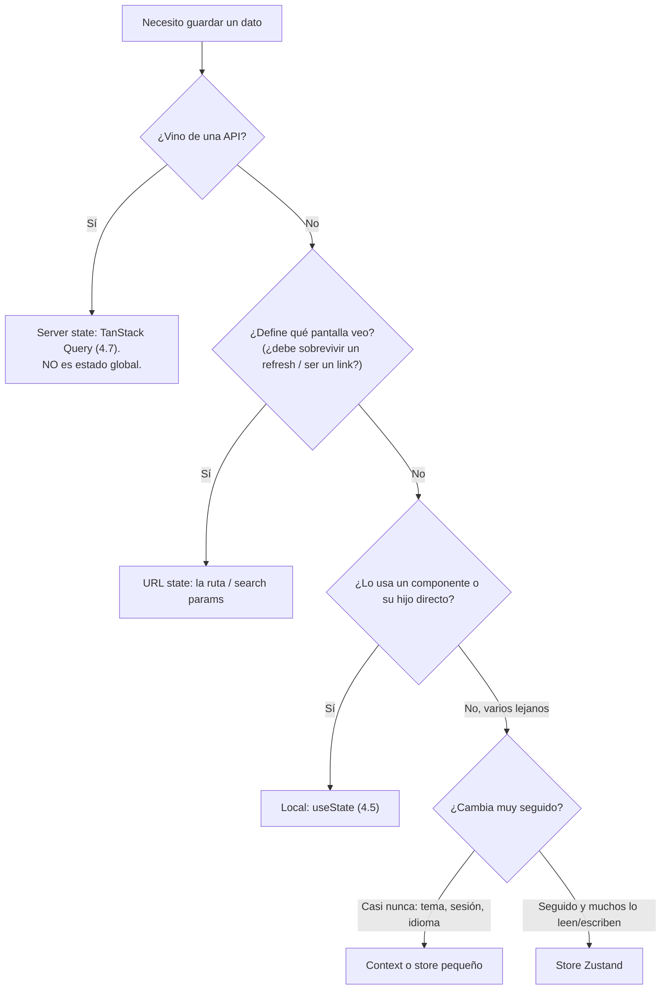

import Reto from "@components/Reto.astro";
import Solucion from "@components/Solucion.astro";
import Quiz from "@components/Quiz.astro";
import CheckDominio from "@components/CheckDominio.astro";
import Nivel from "@components/Nivel.astro";

<Nivel nivel="intermedio" />

Hasta aquí cada componente guardaba su propio estado con `useState` (lo viste en [4.5](/fase-4-frontend/4-5-react-typescript/)) y los datos que venían del backend los manejaba TanStack Query (lo viste en [4.7](/fase-4-frontend/4-7-estado-y-datos/)). Funciona perfecto... hasta que aparece un dato que **muchos componentes lejanos** necesitan leer y escribir: el tema claro/oscuro, el modelo de IA seleccionado, si la barra lateral está abierta. Pasarlo por props a través de diez componentes (lo que se llama *prop drilling*) es doloroso y frágil. Para eso existe el **estado global**. Y existe una librería que lo resuelve sin ceremonia: **Zustand**.

Pero antes de aprender Zustand tienes que aprender algo más importante: **cuándo NO usarlo.** Esta lección dedica la mitad de su energía a esa decisión, porque el error más caro de un junior con frontend no es "no saber Redux": es **meter en un store global cosas que no son estado global** —sobre todo datos del servidor— y crear un monstruo de dos fuentes de verdad que nadie puede depurar.

> La trampa de esta lección: pensar que "estado global = donde va todo el estado de la app". Falso. El estado global de cliente es una **minoría** de tu estado. La mayoría es *server state* (datos de una API: eso lo dueña TanStack Query, no Zustand), *URL state* (el id de lo que estás viendo: eso vive en la ruta) o *local state* (`useState`). Si interiorizas los **cuatro tipos de estado** y dónde vive cada uno, ya sabes el 80% de lo que un equipo serio espera de ti. Zustand es solo la herramienta para el trozo que de verdad es global.

:::tip[Si ya lo tocaste]
Si ya escribiste un store de Zustand o de Redux, no te saltes la lección: úsala como diagnóstico. Salta a los **dos ejercicios Primero-Sin-IA** (sección 7). Si en el ejercicio B clasificas las 8 piezas de estado en los cuatro tipos sin dudar (y explicas por qué la lista de conversaciones NO va en Zustand), y en el A escribes un store con **selectores atómicos** y `persist` con `partialize` correcto **sin un solo re-render de más**, valida con el check de dominio (sección 8) y avanza a [4.9 Design systems](/fase-4-frontend/4-9-design-systems/). Si dudaste con "¿esto es server state o estado global?", quédate: esa duda es justo lo que esta lección cura.
:::

## 1. Qué vas a saber hacer

Al terminar, sin IA y sin notas, podrás:

- **O1 — Decidir y justificar** dónde vive cada pieza de estado de una app (local, server, URL, o global de cliente), explicando por qué la mayoría **no** es estado global y por qué meter server state en un store es un antipatrón.
- **O2 — Implementar** un store de Zustand en TypeScript con **selectores atómicos**, actions agrupadas e inmutables, y el middleware `persist` con `partialize`, evitando re-renders innecesarios.
- **O3 — Explicar el trade-off** entre Zustand, Context y Redux —y por qué Zustand suele bastar—, y **depurar** los dos errores clásicos: el selector que devuelve un objeto nuevo (bucle infinito en Zustand v5) y el estado duplicado entre el store y la cache del servidor.

## 2. Por qué importa (el dinero está aquí)

> 💰 **Por qué importa:** un AI Engineer que monta la UI de su propia demo tiene que decidir, en cada feature, dónde guardar el estado. Esa decisión —invisible en un tutorial, brutal en una app real— es lo que separa una interfaz que se siente sólida de una que parpadea, refetchea de más y muestra datos viejos. En entrevista no te van a preguntar la API de Zustand (se aprende en una tarde): te van a preguntar **"¿esto es estado global o server state?"** y **"¿por qué no usaste Redux?"**. Saber responder eso con criterio vale más que memorizar diez librerías.

Concreto, sin vender humo:

- **El sobre-engineering de estado es un olor a junior.** Levantar Redux con su boilerplate de *actions/reducers/dispatch* para guardar tres flags es exactamente lo que un revisor senior marca como "complejidad que no pagas". Elegir la herramienta más simple que resuelve el problema —y defender por qué— es una señal de seniority.
- **Confundir server state con estado global crea bugs caros.** Si copias la lista de productos de la API a un store de Zustand, ahora tienes **dos fuentes de verdad**: la cache de TanStack Query y tu store. ¿Cuál está actualizada? Reimplementas a mano refetch, invalidación y staleness —justo lo que TanStack Query ya te daba gratis (lo viste en [4.7](/fase-4-frontend/4-7-estado-y-datos/))—. Este malentendido se paga en horas de depuración.
- **Zustand es la elección de mercado 2026 para estado de cliente.** Es minúsculo (un par de KB), no necesita envolver tu app en un `Provider`, y su API es un hook. Saber **por qué** se prefiere sobre Redux (menos boilerplate, sin el `Context` que re-renderiza todo) es una respuesta de entrevista lista para usar.
- **Es la base directa del capstone.** El tema, el modelo activo y el estado de la barra lateral de tu app de IA son estado global de cliente; los mensajes y conversaciones son server state. Tener clara esa frontera hace que el [capstone](/fase-4-frontend/proyecto/) se construya solo.

## 3. Lo que ya traes (actívalo)

Esta lección se apoya en tres cosas que ya sabes:

- De [4.5 React + TypeScript](/fase-4-frontend/4-5-react-typescript/): `useState` para estado **local**, la inmutabilidad al actualizar (crear copias nuevas, no mutar), y los selectores como funciones puras. También viste `useContext` de pasada: aquí lo ponemos en su lugar exacto.
- De [4.7 Estado y datos](/fase-4-frontend/4-7-estado-y-datos/): TanStack Query es el dueño del **server state** (la cache de lo que viene de una API, con su refetch e invalidación). Recuérdalo: **eso no es estado global**, ya tiene casa.
- De **TypeScript** (sub-unidad 1.8 de la Fase 1): `interface`, tipos de unión (`"claro" | "oscuro"`), generics. Aquí los usas para tipar el store entero.

Antes de seguir, responde de memoria:

<Quiz
  question="Acabas de hacer fetch de la lista de pedidos de un usuario desde /api/pedidos. ¿Dónde debería vivir esa lista?"
  options={[
    "En un store global de Zustand, para tenerla disponible en toda la app",
    "En la cache de TanStack Query (es server state): él maneja refetch, staleness e invalidación",
    "En un useState del componente raíz, y la paso por props a todos lados",
  ]}
  answer={1}
  explanation="Es server state: datos que viven en el backend y de los que tu UI guarda una copia temporal (cache). TanStack Query existe precisamente para eso. Copiarla a Zustand crearía dos fuentes de verdad y te obligaría a reimplementar a mano el refetch y la invalidación. Regla de oro: si el dato vino de una API, casi nunca es estado global de cliente."
/>

## 4. Ejemplo resuelto, pensado en voz alta

Voy a construir un store real de principio a fin, razonando en voz alta. Vamos a hacer el estado global de cliente de una app de chat con IA: el **tema** (claro/oscuro), el **modelo activo** y los **modelos favoritos**. Tres datos que muchos componentes lejanos leen y escriben. Pero empiezo por la pregunta que va **antes** del código.

### 4.1 Los cuatro tipos de estado (la decisión que importa)

*"Antes de tocar Zustand me pregunto: ¿este dato es de verdad estado global de cliente? Casi todo el estado de una app cae en uno de cuatro cubos, y cada uno tiene su herramienta."*

| Tipo de estado | Qué es | Dónde vive | Ejemplo |
|---|---|---|---|
| **Local / UI** | Lo usa un componente o su hijo directo | `useState` (4.5) | El texto que escribes en el input |
| **Server state** | Datos que viven en el backend; la UI guarda una copia (cache) | TanStack Query (4.7) | La lista de conversaciones |
| **URL state** | Define *qué* estás viendo; debe sobrevivir a un refresh y ser compartible | La ruta / *search params* | El id de la conversación abierta |
| **Global de cliente** | Estado de cliente que **muchos componentes lejanos** comparten | **Zustand** (esta lección) | Tema, modelo activo |

La regla mental, en forma de escalera —y la subo solo cuando el peldaño anterior no alcanza:



*"Solo el peldaño final —datos de cliente que comparten muchos componentes lejanos— justifica un store. Y fíjate que `useContext` y Zustand conviven: Context es bueno para valores que **casi nunca cambian** (tema, usuario logueado), porque re-renderiza a todos sus consumidores en cada cambio; Zustand brilla cuando el dato **cambia seguido** y quieres que solo se re-rendericen los componentes que leen justo ese trozo."*

### 4.2 El store más pequeño posible

*"Un store de Zustand se crea con `create`. Le paso una función que recibe `set` (para actualizar) y devuelve el estado inicial. En TypeScript uso la forma 'currificada' `create<Tipo>()(...)` —los paréntesis vacíos extra son una peculiaridad de Zustand para que la inferencia de tipos funcione bien—. El resultado es un **hook**: lo llamas como `useUiStore(...)` dentro de un componente."*

```ts
import { create } from "zustand";

interface UiState {
  tema: "claro" | "oscuro";
}

// Forma currificada para TypeScript: create<Tipo>()(initializer).
export const useUiStore = create<UiState>()(() => ({
  tema: "claro",
}));
```

No hay `Provider`, no hay envolver la app. El store es un objeto que vive fuera de React; el hook te conecta a él. Esa ausencia de ceremonia es, literalmente, el argumento de venta de Zustand frente a Redux.

### 4.3 Selectores atómicos: lee solo lo que necesitas

*"Para leer el estado en un componente, le paso al hook un **selector**: una función que extrae justo el trozo que me interesa. Esto es CLAVE para el rendimiento: Zustand vuelve a renderizar el componente solo si el valor que devolvió el selector cambió."*

```tsx
// ✅ Selector atómico: este componente se re-renderiza SOLO si `tema` cambia.
function BotonTema() {
  const tema = useUiStore((state) => state.tema);
  return <button>Tema actual: {tema}</button>;
}
```

El antipatrón que tienes que evitar desde el día uno:

```tsx
// ❌ Lee el store ENTERO. Se re-renderiza ante CUALQUIER cambio del store,
// aunque este componente solo use `tema`.
function BotonTema() {
  const { tema } = useUiStore();
  return <button>Tema actual: {tema}</button>;
}
```

Modelo mental, dilo despacio: **un selector le dice a Zustand "avísame solo cuando esto cambie".** Sin selector (o destructurando el store entero) le estás diciendo "avísame ante cualquier cambio". En una app real con un store de quince campos, eso es la diferencia entre una UI fluida y una que se re-renderiza completa cada vez que alguien teclea.

### 4.4 Actions e inmutabilidad: agrupa lo que muta el estado

*"Ahora agrego las funciones que cambian el estado. La convención de Zustand es ponerlas **dentro del propio store** (no en componentes sueltos). Para actualizar uso `set`. Y como aprendí en React, **nunca muto**: creo objetos y arreglos nuevos."*

```ts
import { create } from "zustand";

interface UiState {
  tema: "claro" | "oscuro";
  modeloActivo: string;
  modelosFavoritos: string[];
  // actions (las agrupo conceptualmente; son parte del estado):
  alternarTema: () => void;
  setModelo: (modelo: string) => void;
  alternarFavorito: (modelo: string) => void;
}

export const useUiStore = create<UiState>()((set) => ({
  tema: "claro",
  modeloActivo: "claude-haiku",
  modelosFavoritos: [],

  // `set` con una función recibe el estado más reciente (como setX(prev => ...) en useState).
  alternarTema: () =>
    set((state) => ({ tema: state.tema === "claro" ? "oscuro" : "claro" })),

  // `set` con un objeto hace un MERGE superficial: solo toca las claves que pasas.
  setModelo: (modelo) => set({ modeloActivo: modelo }),

  // Inmutabilidad: creo un arreglo NUEVO con filter/spread, nunca `push`.
  alternarFavorito: (modelo) =>
    set((state) => ({
      modelosFavoritos: state.modelosFavoritos.includes(modelo)
        ? state.modelosFavoritos.filter((m) => m !== modelo)
        : [...state.modelosFavoritos, modelo],
    })),
}));
```

Dos detalles que confunden a todos:

- **`set` hace un merge superficial.** `set({ modeloActivo: x })` solo cambia esa clave; no borra el resto del estado (a diferencia de `useState`, que reemplaza). Si necesitas reemplazo total, hay un segundo argumento `set(nuevo, true)`, pero rara vez lo querrás.
- **La inmutabilidad sigue siendo obligatoria.** Zustand compara por identidad de referencia, igual que React. `state.modelosFavoritos.push(x)` muta en sitio, la referencia no cambia y los componentes pueden no enterarse. Siempre `[...arreglo, nuevo]` o `arreglo.filter(...)`.

Para leer una action en un componente, también es un selector atómico:

```tsx
function SelectorModelo() {
  const modelo = useUiStore((s) => s.modeloActivo);
  const setModelo = useUiStore((s) => s.setModelo); // las actions son estables: no re-renderizan
  return (
    <select value={modelo} onChange={(e) => setModelo(e.target.value)}>
      <option value="claude-haiku">Claude Haiku</option>
      <option value="gpt-4o-mini">GPT-4o mini</option>
    </select>
  );
}
```

### 4.5 Leer varios valores a la vez: `useShallow` (y el bug de v5)

*"¿Y si un componente necesita dos campos del store? Lo intuitivo es devolver un objeto desde el selector. Y aquí está la trampa más afilada de Zustand v5."*

```tsx
// ❌ TRAMPA en Zustand v5: el selector devuelve un OBJETO NUEVO en cada render.
// Zustand compara por referencia, ve un objeto distinto cada vez, y re-renderiza
// sin parar: BUCLE INFINITO (o, en el mejor caso, un re-render en cada render).
function Cabecera() {
  const { tema, modeloActivo } = useUiStore((s) => ({
    tema: s.tema,
    modeloActivo: s.modeloActivo,
  }));
  // ...
}
```

La solución es `useShallow`: envuelve el selector y compara el objeto resultante de forma **superficial** (clave por clave), devolviendo la misma referencia si nada cambió.

```tsx
import { useShallow } from "zustand/react/shallow";

// ✅ Correcto: useShallow estabiliza la referencia. Re-renderiza solo si
// `tema` o `modeloActivo` cambiaron de valor.
function Cabecera() {
  const { tema, modeloActivo } = useUiStore(
    useShallow((s) => ({ tema: s.tema, modeloActivo: s.modeloActivo })),
  );
  // ...
}
```

> En Zustand v5 (la versión actual en 2026) se eliminó el segundo argumento de comparación que tenía v4. Si vienes de tutoriales viejos que hacen `useStore(selector, shallow)`, eso ya **no compila**. La forma moderna es `useShallow`. La alternativa más simple, y a menudo la mejor, es **no devolver un objeto**: usa dos selectores atómicos separados (`const tema = useUiStore(s => s.tema)` y `const modelo = useUiStore(s => s.modeloActivo)`). Solo cuando son muchos campos vale la pena `useShallow`.

### 4.6 Persistir entre recargas: el middleware `persist`

*"Quiero que el tema y los favoritos sobrevivan a un refresh del navegador. Para eso envuelvo el initializer en el middleware `persist`. Y aquí tomo una decisión de diseño importante con `partialize`: NO persisto todo, solo lo que de verdad debe durar."*

```ts
import { create } from "zustand";
import { persist, createJSONStorage } from "zustand/middleware";

export const useUiStore = create<UiState>()(
  persist(
    (set) => ({
      tema: "claro",
      modeloActivo: "claude-haiku",
      modelosFavoritos: [],
      alternarTema: () =>
        set((s) => ({ tema: s.tema === "claro" ? "oscuro" : "claro" })),
      setModelo: (modelo) => set({ modeloActivo: modelo }),
      alternarFavorito: (modelo) =>
        set((s) => ({
          modelosFavoritos: s.modelosFavoritos.includes(modelo)
            ? s.modelosFavoritos.filter((m) => m !== modelo)
            : [...s.modelosFavoritos, modelo],
        })),
    }),
    {
      name: "ui-chat-storage", // clave única en el storage
      storage: createJSONStorage(() => localStorage), // por defecto ya es localStorage
      // partialize: persisto SOLO preferencias duraderas.
      // modeloActivo es de sesión: no quiero "recordarlo" entre días.
      partialize: (state) => ({
        tema: state.tema,
        modelosFavoritos: state.modelosFavoritos,
      }),
    },
  ),
);
```

`partialize` no es un detalle: es una decisión de producto y de seguridad. Persistir todo "por si acaso" guarda basura transitoria y —peor— corre el riesgo de dejar datos sensibles en disco.

:::caution[Seguridad: qué NO persistir]
`localStorage` es texto plano que **cualquier script de la página puede leer**. Si tu app sufre un XSS (cross-site scripting), el atacante lee todo lo que pusiste ahí. Por eso **nunca persistas tokens de sesión, API keys ni PII** en un store con `persist`. Los secretos de sesión van en una **cookie httpOnly** que el JavaScript no puede leer. `persist` es para preferencias de UI (tema, idioma, layout), no para credenciales. Es OWASP aplicado a tu store. (Profundizas en autenticación segura en la Fase 3 y en seguridad LLM en la Fase 6.)
:::

:::caution[SSR / Next.js: el hydration mismatch]
Si usas este store en [Next.js](/fase-4-frontend/4-6-nextjs/), aparece un problema clásico: el servidor renderiza con el valor **inicial** (`tema: "claro"`) porque no tiene acceso a `localStorage`; el cliente, al hidratar, lee el `localStorage` y puede tener `"oscuro"`. React detecta que el HTML del servidor y el del cliente no coinciden y lanza un *hydration mismatch*. La solución estándar: leer el valor persistido solo **después** de montar (un `useEffect` que active una bandera, o la opción `skipHydration` de `persist` y rehidratar a mano). Lo importante ahora es que **sepas que el problema existe**; lo resolverás cuando montes el capstone en Next.js.
:::

### 4.7 Leer y escribir el store fuera de React

*"A veces necesito tocar el store desde código que no es un componente: un manejador de evento global, un cliente de API, un test. El hook expone métodos para eso."*

```ts
// Leer el valor actual una vez (sin suscribirte a cambios):
const temaActual = useUiStore.getState().tema;

// Disparar una action desde fuera de React:
useUiStore.getState().setModelo("gpt-4o-mini");

// Suscribirte a cambios fuera de un componente (devuelve una función para desuscribir):
const desuscribir = useUiStore.subscribe((state) => {
  console.log("el store cambió, tema =", state.tema);
});
```

Esto es lo que hace a Zustand tan cómodo: el store **no depende de React**. El hook es solo una de las formas de leerlo. (Para depurar en el navegador, existe el middleware `devtools` que conecta con Redux DevTools; útil para ver el historial de cambios —un toque de observabilidad para tu estado de cliente.)

### 4.8 ¿Y Redux? (profundización)

<Nivel nivel="profundización" />

Redux fue el estándar de estado global durante años, y todavía aparece en ofertas, así que conviene saber qué resuelve. Su modelo es un **flujo unidireccional estricto**: un único store inmutable, *actions* (objetos que describen "qué pasó"), *reducers* (funciones puras que calculan el nuevo estado) y `dispatch` para emitir actions. Esa rigidez da dos cosas reales: **trazabilidad total** (cada cambio es una action con nombre, ideal para *time-travel debugging* y auditoría) y una arquitectura predecible en equipos muy grandes. Redux Toolkit (RTK) moderno reduce mucho el boilerplate histórico.

Por qué Zustand suele bastar, en una tabla:

| | **Zustand** | **Redux (Toolkit)** |
|---|---|---|
| Boilerplate | Mínimo (un `create`) | Slices, reducers, dispatch |
| `Provider` | No necesita | Sí, envuelve la app |
| Curva | Una tarde | Días (conceptos nuevos) |
| Tamaño | ~1 KB | Mayor |
| Brilla cuando | Estado de cliente normal | Apps enormes, equipos grandes, auditoría estricta del estado |

La decisión honesta: **empieza con Zustand**. Es más simple, más rápido de escribir y cubre el 95% de los casos de una app de IA o de portafolio. Sube a Redux solo si el proyecto te lo exige por escala o por un requisito explícito de trazabilidad del estado. Elegir lo simple y poder defender por qué es, repito, una señal de seniority —no de pereza.

## 5. Errores y malentendidos comunes

:::caution[Podrías pensar... pero está mal]

**"El estado global es donde va todo el estado de la app."**
Mal. Es una **minoría** de tu estado. La mayoría es server state (TanStack Query), URL state (la ruta) o local (`useState`). El estado global de cliente son las pocas cosas que muchos componentes lejanos comparten: tema, sesión, preferencias de UI. Si tu store tiene "la lista de productos", casi seguro metiste server state donde no va.

**"Pongo los datos de la API en Zustand para tenerlos a mano."**
Mal y caro. Eso es server state: ya tiene dueño (TanStack Query, con su cache, refetch e invalidación). Copiarlo al store crea **dos fuentes de verdad** y te obliga a reimplementar a mano lo que ya tenías gratis. ¿Cuál de las dos copias está fresca? Nadie sabe. Es el bug #1 de esta familia.

**"Context es un gestor de estado global; lo uso para todo."**
Mal. `useContext` es un mecanismo de **transporte** (inyección de dependencias), no un gestor de estado: no optimiza re-renders. Cuando el valor del Context cambia, **todos** sus consumidores se re-renderizan. Va perfecto para valores que casi nunca cambian (tema fijo, usuario logueado). Para estado que cambia seguido y leen muchos, un store con selectores atómicos (Zustand) es la herramienta correcta.

**"Uso un store global para no hacer prop drilling de dos niveles."**
Exagerado. Pasar una prop uno o dos niveles está bien. Antes de globalizar, prueba **composición** (pasar `children`) o **levantar el estado** al ancestro común. El store global es para datos verdaderamente compartidos por componentes lejanos, no para evitar escribir una prop.

**"Destructuro el store entero, total ya lo tengo."**
Mal para el rendimiento. `const { tema } = useUiStore()` suscribe el componente a **cualquier** cambio del store. Usa selectores atómicos: `useUiStore(s => s.tema)`.

**"Devuelvo un objeto desde el selector como en los tutoriales."**
En Zustand v5 eso causa un re-render en cada render (o un bucle infinito), porque el objeto es una referencia nueva cada vez. Usa dos selectores atómicos, o envuelve con `useShallow`.

:::

Un *non-example* que parece correcto y no lo es —léelo y caza el bug antes de seguir:

```tsx
import { useUiStore } from "./store";

// 🐛 ¿Qué tiene de malo? (pista: mira lo que DEVUELVE el selector)
function Resumen() {
  const datos = useUiStore((s) => ({
    tema: s.tema,
    favoritos: s.modelosFavoritos,
  }));
  return <p>{datos.tema} · {datos.favoritos.length} favoritos</p>;
}
```

El bug: el selector devuelve un **objeto literal nuevo** en cada llamada. Zustand compara el resultado del selector por referencia (`Object.is`); como `{...}` es una referencia distinta cada render, Zustand cree que "cambió" siempre y re-renderiza en bucle (React incluso puede avisar de un *maximum update depth*). El arreglo: o dos selectores atómicos (`const tema = useUiStore(s => s.tema); const favoritos = useUiStore(s => s.modelosFavoritos);`), o `useUiStore(useShallow((s) => ({ tema: s.tema, favoritos: s.modelosFavoritos })))`. Este es **exactamente** uno de los efectos que depurarás en el ejercicio.

## 6. Práctica con andamiaje

Antes de construir desde cero, dos pasos con red de seguridad.

### 6.1 Predice (antes de ejecutar nada)

Tienes este store y dos componentes. Cuentas cuántas veces se re-renderiza cada uno tras pulsar el botón "Tema" una vez (que solo cambia `tema`):

```tsx
const useStore = create<{ tema: string; contador: number; /* + actions */ }>()(/* ... */);

function MuestraTema() {
  const tema = useStore((s) => s.tema);          // componente A
  return <span>{tema}</span>;
}
function MuestraContador() {
  const contador = useStore((s) => s.contador);  // componente B
  return <span>{contador}</span>;
}
```

Predice: al cambiar **solo** `tema`, ¿cuántas veces se re-renderiza A? ¿Y B? Escribe tus dos respuestas antes de abrir la solución.

<Solucion title="Ver respuesta (después de predecir)">

**A se re-renderiza (su selector devuelve `tema`, que cambió). B NO se re-renderiza** (su selector devuelve `contador`, que no cambió: Zustand compara el valor anterior con el nuevo y, al ser iguales, no notifica a B). Ese es todo el punto de los selectores atómicos: cada componente se suscribe solo a su trozo. Si en vez de selectores hubieras hecho `const { tema } = useStore()` en ambos, **los dos** se re-renderizarían ante cualquier cambio del store. Por eso los selectores no son opcionales: son la diferencia entre una UI eficiente y una que se repinta entera.

</Solucion>

### 6.2 Completa el store (faded)

Aquí tienes un store de Zustand al que le faltan tres piezas. Complétalo **en papel** (no lo ejecutes aún), respetando inmutabilidad y la forma currificada:

```ts
import { create } from "zustand";

interface CarritoState {
  items: string[];
  agregar: (item: string) => void;   // añade un item (sin duplicar)
  vaciar: () => void;
}

export const useCarrito = create<CarritoState>()((set) => ({
  items: [],
  // (1) agregar: si el item NO está, añádelo creando un arreglo nuevo; si está, no cambies nada
  agregar: (item) => set((state) => /* ??? */),
  // (2) vaciar: deja items en []
  vaciar: () => /* ??? */,
}));
```

<Solucion title="Ver solución (después de intentarlo)">

```ts
agregar: (item) =>
  set((state) => ({
    items: state.items.includes(item) ? state.items : [...state.items, item],
  })),
vaciar: () => set({ items: [] }),
```

Lo esencial: `agregar` usa `set` con función (depende del estado anterior) y crea un arreglo **nuevo** con `[...state.items, item]` —nunca `state.items.push(item)`, que mutaría y rompería la detección de cambios—. `vaciar` usa `set` con objeto porque no depende del estado previo. Si el item ya está, devuelve `state.items` (la misma referencia): Zustand ve que no cambió y no re-renderiza.

</Solucion>

## 7. Ejercicios Primero-Sin-IA

Dos ejercicios complementarios. El A es de código (construyes un store y lo validas con tests); el B es de razonamiento puro (decides la arquitectura de estado y la justificas por escrito). Las carpetas viven en tu repo: `ejercicios/fase-4/store-ui-zustand/` y `ejercicios/fase-4/decidir-estado-global/`. Ábrelas en tu editor.

<Reto title="A — Store de UI con persist y selectores atómicos" timebox="40 min">

Construye `useUiStore`, el estado global de cliente de una app de chat con IA, en **Zustand v5 + TypeScript**. La clave del ejercicio está en dos decisiones: usar `persist` con `partialize` para guardar **solo** lo que debe durar, y que las actions sean **inmutables**.

Estado: `modeloActivo: string`, `modelosFavoritos: string[]`, `tema: "claro" | "oscuro"`.
Actions: `setModelo(modelo)`, `alternarFavorito(modelo)` (lo agrega si no está, lo quita si está), `alternarTema()`.

Hecho significa:
- El store se crea con la forma currificada `create<UiState>()(...)` y exporta `useUiStore` y el tipo `UiState`.
- `setModelo` cambia el modelo; `alternarTema` alterna claro/oscuro; `alternarFavorito` hace toggle creando **arreglos nuevos** (sin `push`, sin mutar).
- Envuelto en `persist` con `name: "ui-chat-storage"` y `createJSONStorage(() => localStorage)`.
- `partialize` persiste **solo** `tema` y `modelosFavoritos`. `modeloActivo` es de sesión: **no** se persiste.
- Un componente lee el modelo con un **selector atómico** y se re-renderiza al cambiarlo.
- Los tests (`pnpm install && pnpm test`) pasan en verde.
- Puedes explicar sin notas por qué `modeloActivo` no se persiste y por qué `localStorage` no es lugar para un token.

Sigue el ciclo Primero-Sin-IA: intenta a mano, luego consulta la [documentación oficial de Zustand](https://zustand.docs.pmnd.rs/), y solo al final usa IA para *revisar*, no para *generar*.

<Solucion title="Pista (ábrela solo si te trabaste de verdad)">

El esqueleto es `create<UiState>()(persist((set) => ({ ...estado, ...actions }), { name, storage, partialize }))`. Las actions de toggle usan `set((state) => ({ ... }))` y deciden con `state.x.includes(...)` entre `state.x.filter(...)` (quitar) y `[...state.x, nuevo]` (agregar). El `partialize` es una función que recibe el estado y devuelve un objeto **solo** con las claves a persistir: `(state) => ({ tema: state.tema, modelosFavoritos: state.modelosFavoritos })`. Para el componente: `const modelo = useUiStore((s) => s.modeloActivo)`. Esto es una pista, no la solución.

</Solucion>

</Reto>

<Reto title="B — ¿Dónde vive cada pieza de estado?" timebox="30 min">

Ejercicio de **diseño y razonamiento** (sin código). Te entregamos la spec de una app de chat con IA con **8 piezas de estado**. Tu trabajo: clasificar cada una en uno de los cuatro tipos (local/`useState`, server state/TanStack Query, URL state, o global de cliente/Zustand) y **justificar** cada decisión en una frase. Es, en el fondo, un mini-ADR: una decisión de arquitectura defendida.

Las 8 piezas están en el `README.md` del ejercicio. Entregas un archivo `decision-estado.md` con la tabla completa y dos respuestas cortas a las "preguntas trampa" (sobre meter server state en el store y sobre persistir un token).

Hecho significa, en tu `decision-estado.md`:
- Las 8 piezas clasificadas, cada una con su tipo y una justificación de una frase (por qué ahí y no en otro cubo).
- Identificas correctamente que la lista de conversaciones y los mensajes son **server state** (no global), y el id de conversación abierta es **URL state**.
- Respondes la trampa del token desde **seguridad**: por qué no va en un store persistido a `localStorage` y dónde debería ir.
- Para al menos una pieza "ambigua" (p. ej. si el sidebar está abierto), explicas el trade-off de tu elección (local levantado vs. store pequeño).

No hay tests: este ejercicio entrena el **criterio**, que es justo lo que se evalúa en entrevista. Resuélvelo a mano antes de mirar nada.

<Solucion title="Pista (ábrela solo si te trabaste de verdad)">

Para cada pieza, recorre la escalera de la sección 4.1 en orden: (1) ¿vino de una API? → server state. (2) ¿define qué pantalla veo / debería sobrevivir un refresh y ser compartible por link? → URL state. (3) ¿lo usa un solo componente o su hijo? → `useState` local. (4) ¿lo comparten muchos componentes lejanos? → store global (y si casi nunca cambia, Context también sirve). El token no es "estado de UI": es un secreto, y eso cambia la respuesta de "dónde" a una de seguridad. Esto es una pista, no la solución.

</Solucion>

</Reto>

## 8. Check de dominio

<CheckDominio items={[
  "Nombrar los cuatro tipos de estado y dar un ejemplo de cada uno, sin notas",
  "Explicar por qué meter la lista de pedidos de una API en Zustand es un antipatrón",
  "Decir qué hace un selector atómico y por qué destructurar el store entero es malo para el rendimiento",
  "Explicar por qué un selector que devuelve un objeto nuevo causa un bucle en Zustand v5, y dar dos arreglos",
  "Justificar partialize: qué persistir y por qué un token nunca va en localStorage",
  "Defender, en una frase, por qué elegiste Zustand sobre Redux para una app normal",
]} />

Y un último quiz de predicción:

<Quiz
  question="Tu componente hace `const { tema, modelo } = useUiStore((s) => ({ tema: s.tema, modelo: s.modeloActivo }))` en Zustand v5. ¿Qué pasa?"
  options={[
    "Funciona perfecto y es la forma recomendada de leer varios valores",
    "Se re-renderiza en cada render (objeto nuevo cada vez); arréglalo con useShallow o dos selectores atómicos",
    "Error de compilación: los selectores no pueden devolver objetos",
  ]}
  answer={1}
  explanation="El selector devuelve un objeto literal nuevo en cada llamada. Zustand compara el resultado por referencia con Object.is; como la referencia es distinta cada vez, cree que cambió siempre y re-renderiza sin parar (React puede avisar de 'maximum update depth'). Compila sin problema; el bug es en tiempo de ejecución. Lo arreglas con dos selectores atómicos separados, o envolviendo el selector en useShallow de 'zustand/react/shallow'."
/>

## 9. Recursos

Documentación oficial primero. El resto es ruido.

- [Zustand — documentación oficial](https://zustand.docs.pmnd.rs/) — empieza por "Introduction" y la guía de TypeScript.
- [Zustand — persist middleware](https://zustand.docs.pmnd.rs/integrations/persisting-store-data) — `name`, `storage`, `partialize`, rehidratación y el problema de SSR.
- [Zustand — guía de TypeScript](https://zustand.docs.pmnd.rs/guides/typescript) — por qué la forma currificada `create<T>()(...)`.
- [Zustand — migración a v5](https://zustand.docs.pmnd.rs/migrations/migrating-to-v5) — qué cambió respecto a v4 (la eliminación del `equalityFn` y `useShallow`).
- [react.dev — Passing Data Deeply with Context](https://react.dev/learn/passing-data-deeply-with-context) — qué es y qué no es `useContext`.
- [TanStack Query — Does this belong in global state?](https://tanstack.com/query/latest/docs/framework/react/guides/does-this-replace-client-state) — el límite exacto entre server state y estado de cliente.

## 10. Conexión con el capstone

El [Capstone F4 — Frontend de una app de IA](/fase-4-frontend/proyecto/) te obliga a tomar esta decisión en vivo. El tema, el modelo activo y las preferencias de UI son el estado global de cliente: ahí va tu `useUiStore` con `persist`, casi idéntico al del ejercicio A. Las conversaciones y los mensajes vienen del backend de la [Fase 3](/fase-4-frontend/4-7-estado-y-datos/): son server state, los maneja TanStack Query, **no** el store. El id de la conversación abierta vive en la URL. Y el input del chat es estado local (`useState`), como en [4.5](/fase-4-frontend/4-5-react-typescript/). Si dibujas esa frontera bien desde el inicio —el ejercicio B es justo ese plano—, el capstone se arma limpio; si metes server state en Zustand, te pasarás el capstone peleando con datos viejos. En [4.10 Usabilidad y estados](/fase-4-frontend/4-10-usabilidad-estados/) verás cómo esos estados (loading/error/empty/success) se reflejan en la UI.

## 11. Reflexión + repaso espaciado

Cierra escribiendo, en dos o tres líneas, una respuesta honesta a esto: **de las 8 piezas del ejercicio B, ¿cuál te costó más clasificar, y por qué dudaste entre dos cubos?** Nombrar la frontera borrosa es la mejor forma de afilarla.

Gancho de repaso espaciado:
- **Mañana:** sin mirar la lección, reescribe de memoria el `useUiStore` del ejercicio A, con su `persist` y `partialize`. Si no te sale qué persistir, vuelve a la sección 4.6.
- **En 3 días:** explícale a alguien (o al espejo) la diferencia entre server state y estado global de cliente, con un ejemplo de cada uno. Si titubeas, repasa la sección 4.1.
- **En 1 semana:** retoma el non-example de la sección 5 (el selector que devuelve un objeto) y explica por qué entra en bucle y las dos formas de arreglarlo, sin notas. La meta es que el reflejo "selector atómico o `useShallow`" te salga solo.

> [!tip] GLaDOS dice
> Felicidades: aprendiste que la mejor decisión de estado global suele ser **no tener tanto estado global**. Hay una ironía deliciosa en una lección sobre una herramienta cuya maestría se mide por lo poco que la metes donde no va. La mayoría de tus colegas amontonará todo en un store gigante y luego pasará tardes preguntándose por qué la lista de productos muestra datos de ayer. Tú no. Tú sabes dónde vive cada cosa. Para ser un humano, es casi... ordenado.
