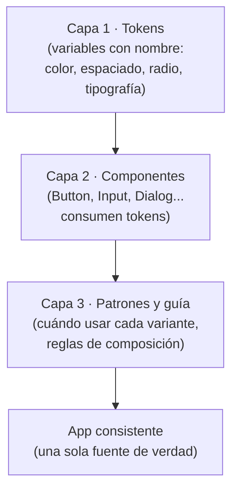
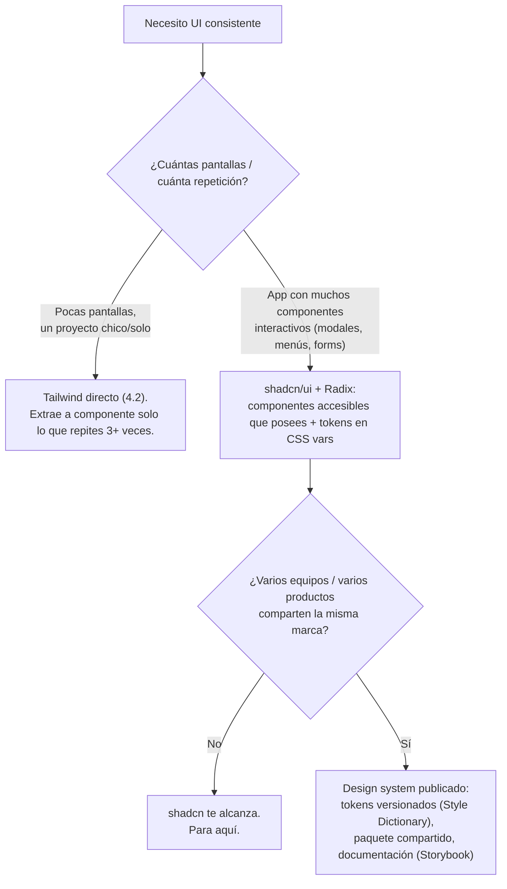

import Reto from "@components/Reto.astro";
import Solucion from "@components/Solucion.astro";
import Quiz from "@components/Quiz.astro";
import CheckDominio from "@components/CheckDominio.astro";
import Nivel from "@components/Nivel.astro";

<Nivel nivel="profundización" />

:::note[Esta sub-unidad es opcional / profundización]
No la necesitas para terminar la Fase 4. El camino crítico ya está cubierto: sabes escribir HTML/CSS ([4.1](/fase-4-frontend/4-1-html-css/)), componer Tailwind ([4.2](/fase-4-frontend/4-2-tailwind/)) y construir UI accesible ([4.4](/fase-4-frontend/4-4-accesibilidad-wcag/)). Puedes entregar el [capstone](/fase-4-frontend/proyecto/) entero con Tailwind directo y quedar bien. Esta lección es para el día en que tu UI **crece**: cuando el mismo botón aparece en quince sitios con cinco azules distintos y tres tamaños "casi iguales", y la inconsistencia empieza a costar tiempo y credibilidad. Léela cuando ese problema te duela —o si quieres entender qué genera realmente `npx shadcn@latest add button`, porque pegar código que no entiendes es justo lo que el Primero-Sin-IA combate.
:::

Hasta aquí, cada vez que necesitabas un botón escribías sus clases de Tailwind a mano: `inline-flex items-center rounded-md bg-blue-600 px-4 py-2 text-white hover:bg-blue-700`. Funciona perfecto para un botón. El problema aparece al botón número veinte: ¿era `bg-blue-600` o `bg-blue-700`? ¿`px-4` o `px-5`? ¿`rounded-md` o `rounded-lg`? Multiplica esa duda por cada color, espaciado, tamaño de texto y radio de tu app, repártela entre varios archivos (y, en un equipo, entre varias personas) y obtienes el enemigo silencioso de toda interfaz: la **inconsistencia**. Un **design system** es la respuesta de ingeniería a ese problema: convertir esas decisiones visuales en **variables con nombre** (design tokens) y en **componentes reutilizables** que las consumen, para que "el azul de marca" o "el botón primario" sean **una sola fuente de verdad**, no una opinión que cada quien improvisa.

> La trampa de esta lección: creer que "design system = librería de componentes bonitos que instalo". Falso, y por partida doble. Primero, el corazón de un DS no son los componentes: son los **tokens** (el vocabulario compartido) y las **reglas** de cómo se combinan. Segundo, la herramienta estrella de 2026 —**shadcn/ui**— **no es una dependencia** que instalas y escondes: es código que el CLI **copia dentro de tu repo** y que **tú posees y editas**. Si interiorizas esas dos ideas —tokens como fuente de verdad, y "código que posees" en vez de "caja negra que importas"— ya entendiste el 80% de por qué un DS escala donde un montón de clases sueltas no.

:::tip[Si ya lo tocaste]
Si ya usaste shadcn/ui o definiste variables de tema, no te saltes la lección: úsala como diagnóstico. Salta a los **dos ejercicios Primero-Sin-IA** (sección 7). Si en el ejercicio A implementas el `variants()` (el motor que hay debajo de `class-variance-authority`) con `base`, `variants` y `defaultVariants` correctos y todos los tests pasan a la primera, y en el B justificas con un mini-ADR cuándo usar Tailwind directo vs shadcn vs un DS publicado **sin caer en el sobre-engineering**, valida con el check de dominio (sección 8) y avanza a [4.10 Usabilidad y estados](/fase-4-frontend/4-10-usabilidad-estados/). Si te cuesta explicar *por qué* shadcn no es una dependencia o *qué* te da Radix gratis, quédate: eso es justo lo que esta lección cura.
:::

## 1. Qué vas a saber hacer

Al terminar, sin IA y sin notas, podrás:

- **O1 — Explicar** qué es un design system y sus tres capas (tokens → componentes → patrones), y por qué **escala la consistencia** mejor que repetir clases de utilidad sueltas.
- **O2 — Implementar** un mapeo de *props a clases* basado en tokens (el patrón `variants` que hay debajo de `class-variance-authority`), y **explicar** cómo shadcn/ui lo usa sobre primitivas accesibles de Radix.
- **O3 — Decidir y justificar el trade-off**: cuándo adoptar un design system (o shadcn/ui) y cuándo basta componer Tailwind directo, sin sobre-ingeniería ni cargo cult.

## 2. Por qué importa (el dinero está aquí)

> 💰 **Por qué importa:** un AI Engineer que monta la UI de su propia demo no compite por hacer la interfaz "más bonita": compite por hacerla **consistente y creíble sin perder días en CSS**. Un design system es exactamente esa palanca. Y en entrevista no te van a pedir que recites la API de shadcn (se aprende en una tarde): te van a preguntar **"¿cuándo montarías un design system y cuándo no?"** y **"¿shadcn/ui es una dependencia?"**. Responder eso con criterio —y saber que Radix te regala la accesibilidad que de otro modo implementarías mal— es señal de seniority.

Concreto, sin vender humo:

- **La consistencia es percepción de calidad.** Un portafolio donde cada pantalla usa el mismo espaciado, los mismos radios y el mismo azul se *siente* profesional aunque el diseño sea sobrio. Uno con cinco azules y botones de tamaños caprichosos se siente amateur, y eso contradice la tesis de "demo que vende" de la Fase 4. Los tokens son lo que hace esa consistencia barata.
- **shadcn/ui es la elección de mercado 2026 para React.** No porque sea "la más bonita", sino por su modelo: el CLI **copia** componentes accesibles (construidos sobre [Radix](https://www.radix-ui.com/)) **dentro de tu código**. No hay caja negra que actualizar a ciegas; los editas como tu propio código. Saber *por qué* ese modelo ("open code") ganó es una respuesta de entrevista lista.
- **Reescribir accesibilidad a mano es donde casi todos fallan.** Un menú desplegable o un diálogo accesibles (foco atrapado, `Esc` que cierra, navegación con flechas, ARIA correcto) son brutalmente difíciles de hacer bien. Radix los resuelve por ti. Esto conecta directo con el gate de accesibilidad que viste en [4.4](/fase-4-frontend/4-4-accesibilidad-wcag/): adoptar Radix es, en gran medida, *cumplir WCAG por defecto*.
- **El sobre-engineering de UI también es un olor a junior.** Montar un design system con tokens publicados como paquete para un sitio de tres páginas es exactamente lo que un revisor senior marca como "complejidad que no pagas". Elegir Tailwind directo cuando alcanza —y defender por qué— vale tanto como saber montar el DS cuando hace falta.

## 3. Lo que ya traes (actívalo)

Esta lección se apoya en cosas que ya sabes:

- De [4.1 HTML + CSS](/fase-4-frontend/4-1-html-css/): las **custom properties** de CSS (`--mi-variable` y `var(--mi-variable)`). Los design tokens **son** custom properties con disciplina y nombre. También la cascada y la herencia: por eso un token definido en `:root` está disponible en toda la app.
- De [4.2 Tailwind](/fase-4-frontend/4-2-tailwind/): el dolor de las clases largas repetidas y la pregunta "¿cuándo extraigo esto a un componente?". Un DS es la respuesta sistemática a esa pregunta. Tailwind v4, además, **define sus tokens de tema en CSS** (con `@theme`), así que ya viste tokens sin llamarlos así.
- De [4.4 Accesibilidad WCAG 2.2](/fase-4-frontend/4-4-accesibilidad-wcag/): foco visible, navegación por teclado, roles y ARIA. Aquí verás que Radix te da todo eso "de fábrica".
- De [4.5 React + TypeScript](/fase-4-frontend/4-5-react-typescript/): componentes, props tipadas y composición. Un componente de design system es eso mismo, con sus variantes tipadas.

Antes de seguir, responde de memoria:

<Quiz
  question="Tienes el mismo botón azul repetido en 12 archivos, cada uno con sus clases de Tailwind escritas a mano. Mañana cambia el azul de marca. ¿Qué problema resuelve un design system aquí?"
  options={[
    "Hace que el botón se vea más bonito con animaciones",
    "Convierte 'el azul de marca' y 'el botón primario' en una sola fuente de verdad (un token + un componente), así el cambio es en un solo lugar",
    "Reemplaza a Tailwind por completo para que no escribas más CSS",
  ]}
  answer={1}
  explanation="El valor de un DS es la fuente de verdad única: un token de color y un componente Button reutilizable. Cambias el token una vez y se propaga a los 12 sitios. No reemplaza a Tailwind (lo usa por debajo) ni es cuestión de animaciones: es consistencia barata a escala."
/>

## 4. Ejemplo resuelto, pensado en voz alta

Voy a partir del dolor real —un botón repetido— y construir, paso a paso, las tres capas de un design system para nuestra app de chat con IA (la misma "ChatLab" del capstone). Razono en voz alta en cada decisión.

### 4.1 Las tres capas de un design system

*"Antes de tocar código me ordeno la cabeza. Un design system no es una cosa, son tres capas que se apoyan una en otra. Si me salto la de abajo, las de arriba se desmoronan."*

| Capa | Qué es | Ejemplo en ChatLab |
|---|---|---|
| **1. Tokens** | El vocabulario: decisiones visuales con nombre (color, espaciado, tipografía, radio, sombra) | `--color-primary`, `--space-4`, `--radius-md` |
| **2. Componentes** | Piezas reutilizables que **consumen** tokens y exponen variantes | `Button`, `Input`, `Dialog` |
| **3. Patrones / guía** | Reglas de cómo combinar componentes y cuándo usar cada variante | "el botón destructivo solo en acciones irreversibles" |



*"La analogía que me funciona: los tokens son el **vocabulario**, los componentes son **frases** hechas, y la guía es la **gramática**. Juntos forman un idioma que todo el equipo (o el yo del mes que viene) habla igual. Sin tokens, cada frase inventa sus palabras."*

### 4.2 Capa 1: design tokens como variables

*"Empiezo por el vocabulario. Un design token es una decisión visual guardada en una variable con nombre. En la web, el vehículo natural son las **custom properties** de CSS que ya vi en 4.1. La clave está en usar DOS niveles."*

```css
:root {
  /* Tokens PRIMITIVOS: la paleta cruda, sin significado de uso. */
  --blue-600: oklch(0.55 0.18 264);
  --blue-700: oklch(0.48 0.18 264);
  --gray-50:  oklch(0.98 0    0);
  --gray-900: oklch(0.21 0    0);

  /* Tokens SEMÁNTICOS: el USO, apuntando a un primitivo. */
  --color-primary:            var(--blue-600);
  --color-primary-hover:      var(--blue-700);
  --color-foreground:         var(--gray-900);
  --color-background:         var(--gray-50);

  /* Otros ejes (un DS no es solo color): */
  --space-4:  1rem;
  --radius-md: 0.375rem;
  --text-sm:  0.875rem;
}
```

*"¿Por qué dos niveles, si parece una vuelta de más? Porque separan **qué color es** de **para qué se usa**. `--blue-600` es un hecho; `--color-primary` es una intención. Esa indirección es lo que hace barato el tema oscuro: no toco los componentes, solo reapunto los semánticos."*

```css
/* Tema oscuro: solo cambian a qué primitivo apunta cada token semántico. */
.dark {
  --color-foreground: var(--gray-50);
  --color-background: var(--gray-900);
  --color-primary:    var(--blue-700);
}
```

Detalle de 2026 que conviene saber: **Tailwind v4 define sus tokens de tema directamente en CSS** con la directiva `@theme`, y shadcn/ui usa exactamente este patrón de tokens semánticos en CSS variables (en formato `oklch`). No necesitas memorizar la sintaxis ahora; lo importante es el modelo mental: **primitivo → semántico → componente**.

:::caution[El error que parece "ahorro" y no lo es]
Saltarte la capa semántica y que tus componentes usen el primitivo directo (`bg-[--blue-600]` por todos lados) parece más simple. Pero el día del tema oscuro, o del rebrand, tendrás que buscar y reemplazar `--blue-600` en cien sitios —y rezar para no olvidar uno—. Con la indirección, cambias `--color-primary` en **un** lugar. La capa semántica no es burocracia: es la fuente de verdad que justifica todo el DS.
:::

### 4.3 Capa 2: de token a componente reutilizable

*"Ahora el componente. El dolor concreto: el mismo botón aparece en variantes (primario, secundario, destructivo) y tamaños (sm, md, lg). Escribir las clases a mano cada vez garantiza inconsistencia. Necesito un **mapeo de props a clases**: le paso `variant` y `size`, me devuelve la combinación correcta de clases-token."*

Esa es, literalmente, la función de **`class-variance-authority` (cva)**: la librería que usa shadcn/ui por debajo. Así se ve un botón real de shadcn/ui (lo verifiqué contra su documentación):

```tsx
import * as React from "react";
import { Slot } from "@radix-ui/react-slot";
import { cva, type VariantProps } from "class-variance-authority";
import { cn } from "@/lib/utils";

// cva(base, config): base SIEMPRE presente + clases por cada variante elegida.
const buttonVariants = cva(
  "inline-flex items-center justify-center rounded-md text-sm font-medium transition-colors focus-visible:outline-none focus-visible:ring-2 disabled:pointer-events-none disabled:opacity-50",
  {
    variants: {
      variant: {
        default: "bg-primary text-primary-foreground hover:bg-primary/90",
        destructive: "bg-destructive text-destructive-foreground hover:bg-destructive/90",
        outline: "border border-input bg-background hover:bg-accent",
        ghost: "hover:bg-accent hover:text-accent-foreground",
      },
      size: {
        default: "h-10 px-4 py-2",
        sm: "h-9 px-3",
        lg: "h-11 px-8",
      },
    },
    // Si no paso variant/size, usa estos:
    defaultVariants: { variant: "default", size: "default" },
  },
);

// VariantProps extrae el tipo de las variantes desde la config de cva.
export interface ButtonProps
  extends React.ButtonHTMLAttributes<HTMLButtonElement>,
    VariantProps<typeof buttonVariants> {
  asChild?: boolean;
}

const Button = React.forwardRef<HTMLButtonElement, ButtonProps>(
  ({ className, variant, size, asChild = false, ...props }, ref) => {
    const Comp = asChild ? Slot : "button";
    return (
      <Comp className={cn(buttonVariants({ variant, size, className }))} ref={ref} {...props} />
    );
  },
);
Button.displayName = "Button";

export { Button, buttonVariants };
```

Dilo despacio, porque cada pieza tiene un porqué:

- **`cva(base, { variants, defaultVariants })`** es un mapeador: `buttonVariants({ variant: "outline", size: "sm" })` devuelve un string de clases. La `base` siempre va; cada variante añade sus clases-token. Las clases (`bg-primary`, `text-primary-foreground`) **apuntan a tokens semánticos** —ahí se cierra el círculo con la capa 1—.
- **`VariantProps<typeof buttonVariants>`** deriva los tipos de las props (`variant: "default" | "destructive" | ...`) **de la propia config**. Cambias una variante y TypeScript actualiza el autocompletado solo. Esto es consistencia *verificada por el compilador*.
- **`cn(...)`** es el helper que verás en cada componente shadcn: combina `clsx` (juntar clases condicionales) con `tailwind-merge` (resolver conflictos de Tailwind: si pasas `px-8` por `className`, gana sobre el `px-4` de la variante). Sin `cn`, las clases que pasa el usuario podrían quedar pisadas o duplicadas.
- **`asChild` + `Slot`** (de Radix) es el truco de composición: permite que el botón **se convierta** en el elemento hijo (por ejemplo, un `<a>`) conservando estilos y accesibilidad. Es composición sobre configuración.

Ahora usarlo es trivial y **consistente por construcción**:

```tsx
<Button>Enviar</Button>                          {/* default + default */}
<Button variant="destructive" size="sm">Borrar chat</Button>
<Button variant="outline">Cancelar</Button>
```

### 4.4 shadcn/ui + Radix: código que posees, accesible por defecto

*"Aquí está el malentendido que más gente tiene. Yo NO instalo shadcn/ui como instalo, digamos, una librería de fechas. shadcn/ui es un CLI que **copia el código del componente dentro de mi repo**."*

```bash
# Una vez por proyecto: crea components.json y el helper cn en src/lib/utils.
npx shadcn@latest init

# Trae el Button: ESCRIBE el archivo button.tsx en tu carpeta de componentes.
npx shadcn@latest add button
```

Tras `add button`, tienes un `button.tsx` **tuyo** en tu proyecto —exactamente el código de la sección 4.3—. No es una caja negra importada de `node_modules`: es código abierto que lees, entiendes y editas. shadcn lo llama "open code". Las consecuencias son enormes:

- **Lo posees:** ¿necesitas una variante `gradient`? Editas tu `button.tsx`. No esperas a que el mantenedor la agregue ni peleas con `!important` para sobrescribir estilos de una librería cerrada.
- **No hay actualización a ciegas:** lo que copiaste no cambia bajo tus pies. El costo es que las "mejoras" no llegan solas; el beneficio es control total.
- **Construido sobre Radix:** los componentes interactivos (Dialog, DropdownMenu, Select, Tooltip...) usan las **primitivas de Radix UI**: componentes sin estilo pero **accesibles de verdad** —foco atrapado en un modal, cierre con `Esc`, navegación con flechas, roles y `aria-*` correctos, anuncios a lectores de pantalla—. Tú solo pones las clases de Tailwind encima. Es el gate de [WCAG 2.2 (4.4)](/fase-4-frontend/4-4-accesibilidad-wcag/) resuelto en su parte más difícil.

*"Resumen de mi cabeza: tokens (4.2) dan el vocabulario, cva (4.3) ensambla componentes consistentes, y shadcn+Radix me regalan componentes accesibles que poseo. Eso es un design system funcionando."*

### 4.5 ¿Cuándo adoptar todo esto vs componer Tailwind directo?

*"La pregunta de seniority. Un DS tiene un costo (montarlo, mantenerlo, aprenderlo). Solo vale la pena cuando el costo de la inconsistencia supera ese costo. Subo la escalera solo cuando el peldaño de abajo no alcanza."*



La decisión honesta: **empieza con Tailwind directo**. Cuando empieces a copiar y pegar el mismo bloque de clases por tercera vez, extráelo a un componente. Cuando necesites modales/menús/selects accesibles, trae shadcn/ui (te ahorra la accesibilidad y te da consistencia). Solo monta un design system **publicado** (tokens versionados como paquete, Storybook, etc.) cuando **varios equipos o productos** comparten marca. Saltarte peldaños es el sobre-engineering que un revisor marca; quedarte corto cuando la app ya duele es deuda técnica. Elegir el peldaño correcto —y defenderlo— es el skill.

## 5. Errores y malentendidos comunes

:::caution[Podrías pensar... pero está mal]

**"Un design system es una librería de componentes que instalo."**
Mal. El corazón de un DS son los **tokens** (la fuente de verdad del vocabulario visual) y las **reglas** de uso; los componentes son la capa de en medio. Una carpeta de componentes sin tokens detrás es solo... una carpeta de componentes, y vuelve a divergir en cuanto alguien improvisa un color.

**"shadcn/ui es una dependencia como cualquier librería de UI."**
Mal, y es *el* malentendido. shadcn/ui **copia el código dentro de tu repo** (modelo "open code"): no vive escondido en `node_modules`, lo posees y lo editas. Por eso no se "actualiza solo" y por eso puedes adaptarlo sin pelear contra estilos cerrados. Confundirlo con una librería tradicional te lleva a no entender ni sus ventajas ni su costo.

**"Los design tokens son solo variables de color."**
Mal. Color es el ejemplo obvio, pero un DS tokeniza **espaciado, tipografía, radios, sombras, anchos de borde, z-index, duraciones de animación**. La consistencia del espaciado (que todo respire con la misma escala) se nota tanto como la del color.

**"Mientras más componentes y variantes tenga, mejor es el DS."**
Mal. Un buen DS **restringe**: ofrece pocas variantes bien pensadas para que el equipo no improvise. Cincuenta variantes de botón reintroducen el caos que el DS venía a matar. Menos opciones, más consistencia.

**"Radix se ve sin estilo y feo; mejor construyo mis modales y menús yo mismo."**
Trampa peligrosa. Radix es feo *a propósito* (te da el comportamiento, tú el estilo). Reimplementar a mano el foco atrapado, el `Esc`, la navegación con teclado y el ARIA de un diálogo o un menú es brutalmente difícil y casi siempre se hace mal —rompiendo justo la accesibilidad de [4.4](/fase-4-frontend/4-4-accesibilidad-wcag/)—. Usar Radix no es pereza: es no reinventar (mal) algo resuelto.

**"Necesito un design system completo desde el día uno."**
Mal y caro. Para un sitio chico o un solo desarrollador, Tailwind directo es lo correcto. Montar tokens publicados, Storybook y un paquete compartido para tres pantallas es sobre-engineering. El DS llega cuando la escala lo pide.

:::

Un *non-example* que parece un buen componente y no lo es —cázalo antes de seguir:

```tsx
// 🐛 ¿Qué tiene de malo este "componente reutilizable"?
function Boton({ tipo, children }: { tipo: string; children: React.ReactNode }) {
  if (tipo === "primario") {
    return <button className="bg-blue-600 px-4 py-2 text-white rounded-md">{children}</button>;
  }
  if (tipo === "peligro") {
    return <button className="bg-red-600 px-5 py-2 text-white rounded-lg">{children}</button>;
  }
  return <button className="bg-gray-200 px-4 py-2 rounded-md">{children}</button>;
}
```

Tiene tres defectos que un DS resuelve: (1) **no usa tokens** —`bg-blue-600` es un primitivo crudo; el día del rebrand, a buscar y reemplazar—; (2) **es inconsistente consigo mismo** —el botón "peligro" usa `px-5` y `rounded-lg`, los otros `px-4` y `rounded-md`: ya divergió en su propio archivo—; (3) `tipo: string` **no está tipado** —pasar `"primarioo"` compila y rompe en silencio; con `cva` + `VariantProps` el compilador solo acepta las variantes reales—. Este es, en esencia, el motor que reconstruirás en el ejercicio A para entender qué te ahorra `cva`.

## 6. Práctica con andamiaje

Antes de construir desde cero, dos pasos con red de seguridad.

### 6.1 Predice (antes de ejecutar nada)

Dada esta config de `cva` (la API real), predice el string de clases que devuelve cada llamada. Hazlo **en papel**:

```ts
const badge = cva("rounded px-2 text-xs", {
  variants: {
    tono: { neutro: "bg-gray-100 text-gray-800", exito: "bg-green-100 text-green-800" },
  },
  defaultVariants: { tono: "neutro" },
});

badge();                    // (1) ¿?
badge({ tono: "exito" });   // (2) ¿?
```

Escribe tus dos respuestas antes de abrir la solución.

<Solucion title="Ver respuesta (después de predecir)">

**(1)** `badge()` → `"rounded px-2 text-xs bg-gray-100 text-gray-800"`. No pasaste `tono`, así que aplica el `defaultVariants` (`neutro`). La `base` siempre va primero, luego las clases de la variante elegida.

**(2)** `badge({ tono: "exito" })` → `"rounded px-2 text-xs bg-green-100 text-green-800"`. La `base` se mantiene; cambia solo el bloque de clases de la variante `tono` a las de `exito`.

La idea esencial: `cva` **concatena** la base con las clases de cada variante seleccionada (o su default). Eso es todo el truco. Reconstruir esa lógica es justo el ejercicio A.

</Solucion>

### 6.2 Completa la config (faded)

Aquí tienes una config de `cva` para un `Alert` a la que le faltan dos piezas. Complétala **en papel**, respetando la API que viste en 4.3:

```ts
import { cva } from "class-variance-authority";

const alert = cva("rounded-md border p-4 text-sm", {
  variants: {
    variant: {
      info: "border-blue-200 bg-blue-50 text-blue-900",
      // (1) agrega la variante `error`: borde rojo-200, fondo rojo-50, texto rojo-900
    },
  },
  // (2) si no se pasa `variant`, que use `info` por defecto
});
```

<Solucion title="Ver solución (después de intentarlo)">

```ts
const alert = cva("rounded-md border p-4 text-sm", {
  variants: {
    variant: {
      info: "border-blue-200 bg-blue-50 text-blue-900",
      error: "border-red-200 bg-red-50 text-red-900", // (1)
    },
  },
  defaultVariants: { variant: "info" }, // (2)
});
```

Lo esencial: una variante nueva es **una clave más** dentro del objeto `variant` con su string de clases-token; `defaultVariants` es el objeto que define qué opción usar cuando la prop no se pasa. Fíjate que las clases deberían apuntar a **tokens semánticos** (`--color-danger`...) en un DS real; aquí usamos primitivos para no introducir la capa de tema en un faded corto.

</Solucion>

## 7. Ejercicios Primero-Sin-IA

Dos ejercicios complementarios. El A es de código (reconstruyes el motor de variantes y lo validas con tests); el B es de razonamiento puro (decides la estrategia de UI y la justificas). Las carpetas viven en tu repo: `ejercicios/fase-4/variantes-de-componente/` y `ejercicios/fase-4/adoptar-design-system/`. Ábrelas en tu editor.

<Reto title="A — Reconstruye el motor de variantes (mini-cva)" timebox="40 min">

Implementa `variants()`, una versión mínima de lo que hace `class-variance-authority` por debajo, en **TypeScript puro** (sin dependencias). Entender este motor es entender qué te da shadcn —y dejar de pegar código que no comprendes—.

`variants(config)` recibe `{ base, variants, defaultVariants }` y devuelve una **función** que, dado un objeto de props, retorna el string de clases correcto.

Comportamiento esperado:
- La clase `base` aparece **siempre** y va **primero**.
- Para cada eje de variante, usa la opción que indican las props; si una prop no viene, usa la de `defaultVariants`.
- El resultado es un string con las clases separadas por **un solo espacio**, sin espacios extra al inicio/fin.

Hecho significa:
- `variants({ base: "btn", variants: { size: { sm: "h-9", lg: "h-11" } }, defaultVariants: { size: "sm" } })()` devuelve `"btn h-9"`.
- Pasar `{ size: "lg" }` devuelve `"btn h-11"`.
- Con dos ejes (p. ej. `variant` y `size`), combina ambos en el orden en que están declarados en `config.variants`.
- Si una prop trae una opción inexistente o `undefined`, cae al default de ese eje (no rompe, no añade `undefined`).
- Los tests (`pnpm install && pnpm test`) pasan en verde, y agregas **un test propio** (un caso borde).
- Puedes explicar sin notas por qué este motor hace consistente un componente y qué añade `cva` real que tu versión no (pista: `compoundVariants`, `VariantProps`, integración con `tailwind-merge`).

Sigue el ciclo Primero-Sin-IA: intenta a mano, luego consulta la [documentación oficial de cva](https://cva.style/docs), y solo al final usa IA para *revisar*, no para *generar*.

<Solucion title="Pista (ábrela solo si te trabaste de verdad)">

`variants` es una *factory*: devuelve una función. Dentro, parte de un arreglo `[config.base]`. Recorre las claves de `config.variants` (cada eje): para cada eje, la opción elegida es `props?.[eje] ?? config.defaultVariants?.[eje]`; si esa opción existe en `config.variants[eje]`, empuja su string al arreglo. Al final, `arreglo.filter(Boolean).join(" ")` te da el string limpio (el `filter(Boolean)` descarta `undefined`/vacíos y evita dobles espacios). Tiparlo bien con generics es opcional para pasar los tests; céntrate primero en el comportamiento. Esto es una pista, no la solución.

</Solucion>

</Reto>

<Reto title="B — ¿Tailwind directo, shadcn/ui o design system? (mini-ADR)" timebox="30 min">

Ejercicio de **diseño y razonamiento** (sin código). Te damos **cuatro escenarios**. Para cada uno, decide la estrategia de UI —(a) Tailwind directo, (b) shadcn/ui + tokens, o (c) design system publicado (tokens versionados + paquete compartido)— y **justifícala en una o dos frases** como un mini-ADR (decisión + porqué + costo que aceptas). Más dos preguntas trampa.

Los cuatro escenarios y las preguntas viven en el `README.md` del ejercicio. Entregas un `decision-ds.md`.

Hecho significa, en tu `decision-ds.md`:
- Los **4 escenarios** decididos, cada uno con su estrategia y una justificación que apele al **trade-off real** (costo de montar/mantener vs costo de la inconsistencia), no a "porque es lo moderno".
- Reconoces que el sitio chico/portafolio NO necesita un DS publicado (evitas el sobre-engineering) y que el producto multi-equipo SÍ lo justifica.
- Respondes la trampa **T1**: por qué shadcn/ui **no es una dependencia** y qué consecuencia práctica tiene (lo posees / no se actualiza solo).
- Respondes la trampa **T2** desde **accesibilidad**: qué te da Radix "gratis" y por qué reimplementar un modal/menú accesible a mano es mala idea (conéctalo con WCAG de 4.4).
- Puedes **defender tus decisiones sin notas** (check de dominio).

No hay tests: este ejercicio entrena el **criterio**, que es justo lo que se evalúa en entrevista. Resuélvelo a mano antes de mirar nada.

<Solucion title="Pista (ábrela solo si te trabaste de verdad)">

Para cada escenario sube la escalera de la sección 4.5: ¿pocas pantallas / un solo dev? → Tailwind directo. ¿Muchos componentes interactivos (modales, menús, forms) y quieres accesibilidad + consistencia sin reinventar? → shadcn/ui + tokens. ¿Varios equipos/productos comparten marca? → DS publicado (tokens versionados, paquete, Storybook). La pregunta clave en cada uno: ¿el costo de la inconsistencia ya supera el costo de montar la herramienta? Para T1 piensa en *dónde vive el código* (tu repo vs node_modules). Para T2 piensa en lo más difícil de un diálogo accesible: foco, teclado, ARIA. Esto es una pista, no la solución.

</Solucion>

</Reto>

## 8. Check de dominio

<CheckDominio items={[
  "Nombrar las tres capas de un design system y dar un ejemplo de cada una, sin notas",
  "Explicar por qué un token semántico (--color-primary) apunta a uno primitivo (--blue-600) y qué problema resuelve esa indirección",
  "Explicar qué hace cva (mapear props a clases-token) y para qué sirven VariantProps y el helper cn",
  "Explicar por qué shadcn/ui NO es una dependencia y qué consecuencia tiene poseer el código",
  "Decir qué te da Radix 'gratis' y por qué no conviene reimplementar un modal o menú accesible a mano",
  "Justificar, con el trade-off, cuándo basta Tailwind directo y cuándo adoptar shadcn o un DS publicado",
]} />

Y un último quiz de decisión:

<Quiz
  question="Estás solo, construyendo el frontend del capstone (una app de chat de ~5 pantallas) y quieres modales y menús accesibles sin pelear con el teclado y el foco. ¿Qué eliges?"
  options={[
    "Monto un design system publicado con tokens versionados y Storybook desde ya, por las dudas",
    "shadcn/ui + tokens en CSS variables: trae componentes accesibles (sobre Radix) que poseo, y me da consistencia sin sobre-engineering",
    "Construyo cada modal y menú a mano con divs y onClick para tener control total",
  ]}
  answer={1}
  explanation="shadcn/ui es el peldaño correcto: te da componentes accesibles (Radix resuelve foco/teclado/ARIA) que copias y posees, más consistencia vía tokens. Montar un DS publicado para 5 pantallas y un solo dev es sobre-engineering; construir modales accesibles a mano es reinventar (mal) algo difícil y romper WCAG. La señal de seniority es elegir el peldaño justo."
/>

## 9. Recursos

Documentación oficial primero. El resto es ruido.

- [shadcn/ui — documentación oficial](https://ui.shadcn.com/docs) — empieza por "Introduction" (filosofía "open code") y "Theming" (tokens en CSS variables).
- [shadcn/ui — Button](https://ui.shadcn.com/docs/components/button) — el componente de la lección, con su `cva` y `buttonVariants`.
- [Radix UI — Primitives](https://www.radix-ui.com/primitives) — qué resuelve cada primitiva y por qué son accesibles por defecto (foco, teclado, ARIA).
- [class-variance-authority — docs](https://cva.style/docs) — la API real (`base`, `variants`, `compoundVariants`, `defaultVariants`) y `VariantProps`.
- [Tailwind CSS — Theme (v4)](https://tailwindcss.com/docs/theme) — cómo Tailwind v4 define tokens de tema en CSS con `@theme`.
- [MDN — CSS custom properties (variables)](https://developer.mozilla.org/en-US/docs/Web/CSS/Using_CSS_custom_properties) — el mecanismo bajo los design tokens.
- [Design Tokens Format (W3C Community Group)](https://www.designtokens.org/) y [Style Dictionary](https://styledictionary.com/) — el estándar y la herramienta para tokens versionados de un DS publicado.

## 10. Conexión con el capstone

El [Capstone F4 — Frontend de una app de IA](/fase-4-frontend/proyecto/) **no exige** un design system: puedes entregarlo con Tailwind directo y aprobar. Pero si decides adoptar shadcn/ui, esta lección te da el mapa. El **tema claro/oscuro** que guardas en el `useUiStore` de [4.8](/fase-4-frontend/4-8-estado-global/) se materializa como **tokens semánticos** que reapuntan en `.dark` (sección 4.2): el store dice "estoy en oscuro", los tokens hacen el resto. Los **componentes accesibles** (el diálogo de confirmación para borrar un chat, el menú de selección de modelo) los traes de shadcn/Radix y cumplen el **gate de WCAG de [4.4](/fase-4-frontend/4-4-accesibilidad-wcag/)** casi solos. Y los **estados de primera clase** (loading/empty/error/success) que verás en [4.10](/fase-4-frontend/4-10-usabilidad-estados/) se vuelven consistentes cuando cada uno usa los mismos tokens de color y espaciado. El ejercicio B es, en el fondo, la decisión de arquitectura visual de tu capstone: tómala con criterio y déjala escrita como un mini-ADR.

## 11. Reflexión + repaso espaciado

Cierra escribiendo, en dos o tres líneas, una respuesta honesta a esto: **para tu capstone, ¿elegirías Tailwind directo o shadcn/ui, y cuál es el costo concreto que aceptas con esa decisión?** Nombrar el costo (no solo el beneficio) es lo que convierte una preferencia en una decisión de ingeniería.

Gancho de repaso espaciado:
- **Mañana:** sin mirar la lección, reescribe de memoria el motor `variants()` del ejercicio A. Si no te sale el `filter(Boolean).join(" ")`, vuelve a la sección 4.3 y a la pista.
- **En 3 días:** explícale a alguien (o al espejo) por qué `--color-primary` apunta a `--blue-600` en vez de usar el azul directo en los componentes, con el ejemplo del tema oscuro. Si titubeas, repasa la sección 4.2.
- **En 1 semana:** retoma la escalera de decisión de la sección 4.5 y clasifica un proyecto real tuyo (¿Tailwind directo, shadcn o DS publicado?). La meta es que el reflejo "elige el peldaño justo, no el más vistoso" te salga solo.

> [!tip] En la práctica
> Acabas de aprender que el mejor design system suele empezar por **no** montar un design system. Hay una belleza fría en eso: la herramienta cuya maestría se mide por saber cuándo NO usarla. La mayoría de tus colegas instalará tres librerías de UI, las mezclará, y luego pasará tardes preguntándose por qué hay cinco azules distintos en la misma pantalla. Tú no. Tú sabes qué es un token, qué posees y qué te regala Radix. Eso es, sencillamente, consistencia.
