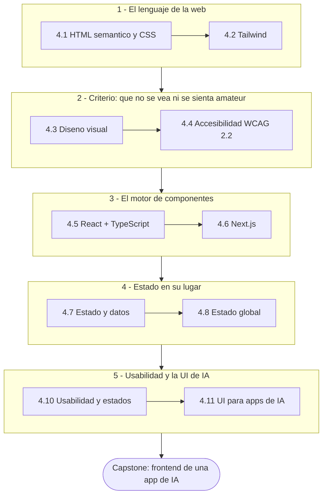
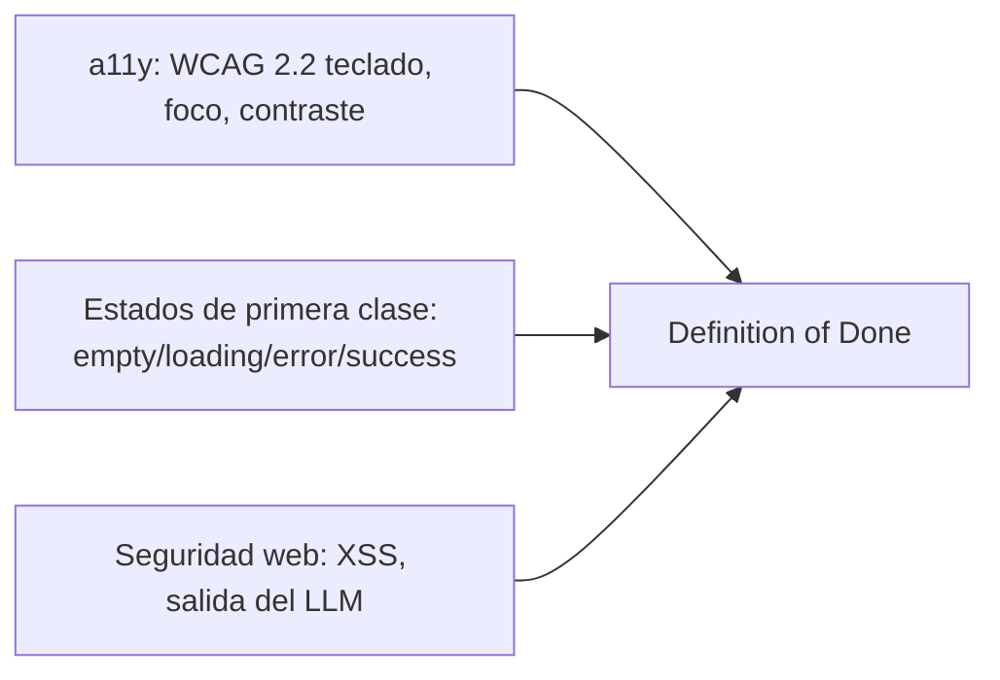

import Reto from "@components/Reto.astro";
import Solucion from "@components/Solucion.astro";
import CheckDominio from "@components/CheckDominio.astro";
import Quiz from "@components/Quiz.astro";
import Nivel from "@components/Nivel.astro";

<Nivel nivel="intermedio" />

Aquí tu trabajo **se vuelve visible**. Hasta ahora construiste lógica, datos y
una API que solo otra máquina veía. La Fase 4 te da la cara de todo eso: la
interfaz por la que una persona —tu usuario, un reclutador, tu pareja probando
tu app— interactúa con lo que hiciste. Vas de **no haber escrito una sola
etiqueta HTML** a montar el **frontend de una app de IA con streaming**, en
Next.js, accesible y con todos sus estados resueltos. No buscas ser frontend
puro: buscas *ownership* de punta a punta, que tu demo **se vea profesional y
funcione para todos**.

## Objetivos de la fase

Al cerrar la Fase 4 sabrás **hacer** esto (no solo "haber leído sobre ello"):

- **Estructurar y estilar** una interfaz desde cero con HTML semántico, CSS
  (flexbox, grid, responsive) y Tailwind, aplicando **fundamentos de diseño
  visual** (jerarquía, espaciado, tipografía, color) para que no se vea amateur.
- **Construir** componentes con **React + TypeScript** y una app completa con
  **Next.js** (App Router, Server/Client Components, data fetching), conectada a
  tu API de la [Fase 3](/fase-3-backend/).
- **Manejar el estado correcto en el lugar correcto:** estado de servidor con
  **TanStack Query**, formularios con **React Hook Form + zod**, estado global
  de UI con **Zustand**.
- **Diseñar interfaces usables y accesibles:** WCAG 2.2 (teclado, foco,
  contraste, ARIA) y **estados de primera clase** (empty/loading/error/success)
  —y sobre todo, una **UI de IA con streaming** token por token que no congele
  ni mienta cuando el modelo falla.

:::tip[Por qué importa (relevancia de mercado)]
**React es el segundo skill más pedido del mercado (≈44% de las ofertas
fullstack).** Pero el diferenciador real para un AI Engineer no es saber React:
es que **la demo de tu modelo se vea y se sienta como un producto**. Un backend
de IA sin una UI decente no se puede mostrar, y "no se puede mostrar" es "no
existe" para un reclutador. Saber montar la interfaz de tu propio sistema de IA
—con streaming, estados de error honestos y accesibilidad— te separa del 80% que
solo enseña un endpoint en Postman. Esta fase produce el **primer proyecto
fullstack + IA de tu portafolio**.
:::

## ¿Para quién es esta fase?

Está escrita para **cero real**: no asume que ya escribiste HTML, ni que sabes
qué es flexbox, ni que tocaste React. Cada concepto arranca desde el principio,
con un ejemplo resuelto antes de pedirte que lo hagas tú. Lo único que damos por
hecho es lo de las fases previas: que programas con autonomía
([Fase 1](/fase-1-lenguajes/)), que escribes tests y commits limpios
([Fase 2](/fase-2-ingenieria/)) y que tienes una API que consumir
([Fase 3](/fase-3-backend/)).

:::tip[Si ya lo tocaste]
¿Vienes con HTML/CSS oxidado, ya montaste algo en React o desplegaste en Vercel?
No saltes en seco: **valida**. Haz el diagnóstico de entrada del final de esta
página y resuelve un ejercicio Primero-Sin-IA de cada sub-unidad que creas
dominar. Si lo cierras sin notas y sin IA en el timebox, marca la casilla y
avanza. Si te trabas —por ejemplo, no sabes explicar la diferencia entre estado
de servidor y estado de cliente, o por qué un `div` con `onClick` no es un botón
accesible— era un falso "ya lo sé": quédate. La experiencia previa es un **atajo
de validación**, nunca un permiso para saltar a ciegas.
:::

## La narrativa de la fase: del markup a la app de IA

La fase tiene un arco deliberado. No es una lista de temas sueltos: es la
construcción, capa por capa, de una interfaz de producción. Primero el
**lenguaje de la web** (estructura y estilo), luego el **criterio** para que no
se vea fea y sea usable por todos, luego el **motor de componentes** (React +
Next.js), después **dónde vive cada estado**, y al final lo que te trajo aquí:
una **UI para IA**.

La sub-unidad **opcional/profundización** (4.9 design systems) **no está en este
camino mínimo**: amplía tu repertorio (tokens, shadcn/Radix) según el rol al que
apuntes, pero no es requisito para llegar al capstone. La dejamos marcada y
disponible, nunca eliminada.

## Mapa de la fase

Once sub-unidades de contenido más el capstone. La marcada **(opcional)** es
profundización: hazla si el rol objetivo la pide (design systems con tokens),
pero el camino crítico no la necesita.

| # | Sub-unidad | Qué construyes ahí |
|---|---|---|
| 4.1 | [HTML semántico + CSS](/fase-4-frontend/4-1-html-css/) | Estructura semántica, el box model, flexbox, grid y responsive. El esqueleto de toda interfaz. |
| 4.2 | [Tailwind CSS](/fase-4-frontend/4-2-tailwind/) | Estilado utility-first: rapidez sin salir del HTML; cuándo extraer un componente. |
| 4.3 | [Fundamentos de diseño visual](/fase-4-frontend/4-3-diseno-visual/) | Jerarquía, layout/grid, tipografía, espaciado y color: el criterio para que no se vea amateur. |
| 4.4 | [Accesibilidad WCAG 2.2](/fase-4-frontend/4-4-accesibilidad-wcag/) | Teclado, foco, contraste y ARIA. **Gate de todos los capstones con UI**, no un extra. |
| 4.5 | [React + TypeScript](/fase-4-frontend/4-5-react-typescript/) | Componentes, props, estado, hooks y custom hooks, formularios controlados, tipados con TS. |
| 4.6 | [Next.js](/fase-4-frontend/4-6-nextjs/) | App Router, Server vs Client Components, Route Handlers/Server Actions, data fetching, deploy en Vercel. |
| 4.7 | [Estado y datos](/fase-4-frontend/4-7-estado-y-datos/) | TanStack Query para estado de servidor; React Hook Form + zod para formularios. |
| 4.8 | [Estado global](/fase-4-frontend/4-8-estado-global/) | Zustand para estado de UI compartido; cuándo *no* necesitas estado global. |
| 4.9 | [Design systems](/fase-4-frontend/4-9-design-systems/) **(opcional)** | shadcn/Radix, design tokens y consistencia a escala. Profundización. |
| 4.10 | [Usabilidad + estados de primera clase](/fase-4-frontend/4-10-usabilidad-estados/) | Heurísticas de Nielsen; empty/loading/error/success; UX de formularios y validación. |
| 4.11 | [UI para apps de IA](/fase-4-frontend/4-11-ui-apps-ia/) | Streaming token por token, interfaces de chat, manejo de estados de carga/error del LLM, Vercel AI SDK. |
| 4.P | [🛠️ Capstone — Frontend de una app de IA](/fase-4-frontend/proyecto/) | Next.js + TS sobre tu backend de la Fase 3, con streaming, a11y como gate y estados completos. |

> **Pista B (para quien vino por la IA):** la 4.11 es tu meta de esta fase y el
> puente directo a la [Fase 6](/fase-6-ai-engineering/). El streaming, el manejo
> de errores del modelo y los estados de carga que aprendes aquí son *exactamente*
> la capa que tus RAGs y agentes van a necesitar para que alguien los use.

## Los hilos transversales en esta fase

La Fase 4 es donde **dos hilos del curso se vuelven gate**, no recomendación. No
son "una sub-unidad": atraviesan cada pantalla que construyas y forman parte del
Definition of Done de todo capstone con UI de aquí en adelante.

- **Accesibilidad (WCAG 2.2).** No es un "extra para después": es un **gate**.
  Una UI que no se puede operar con teclado, sin foco visible o con contraste
  insuficiente, **no está terminada**. Se trabaja a fondo en
  [4.4](/fase-4-frontend/4-4-accesibilidad-wcag/) y se mantiene en cada pantalla.
- **Estados de primera clase.** El "camino feliz" no es la app: una interfaz
  real tiene estados de vacío, carga, error y éxito. Tratarlos como ciudadanos
  de primera —no como un `if` de último minuto— es lo que separa un *demo* de un
  producto. Vive en [4.10](/fase-4-frontend/4-10-usabilidad-estados/) y se vuelve
  crítico en la UI de IA ([4.11](/fase-4-frontend/4-11-ui-apps-ia/)), donde el
  modelo es lento y a veces falla.
- **Seguridad web en el cliente.** La salida de un LLM es **contenido no
  confiable**: renderizarla como HTML crudo es una puerta abierta a XSS
  (relacionado con *Improper Output Handling* del lado de IA). El hilo de
  seguridad de la [Fase 3](/fase-3-backend/3-13-owasp-top10-web/) cruza al
  frontend aquí.

:::note[Spec-driven y Conventional Commits no se sueltan]
Igual que en las fases previas, cada pieza que construyas aquí —incluido el
capstone— arranca con una **mini-spec** (qué pantallas, qué estados, qué
contratos de datos con la API) y se versiona con **Conventional Commits**. Las
decisiones no triviales (¿Server o Client Component? ¿estado de servidor o
global? ¿qué patrón de streaming?) se dejan escritas en un **ADR**.
:::

## Checklist de avance

Marca una sub-unidad como completa **solo** cuando cumplas las tres condiciones
(criterio del roadmap): (a) entiendes el concepto **sin notas**, (b) hiciste el
ejercicio **sin IA**, y (c) lo **aplicaste** en el capstone.

- [ ] 4.1 — HTML semántico + CSS
- [ ] 4.2 — Tailwind CSS
- [ ] 4.3 — Fundamentos de diseño visual
- [ ] 4.4 — Accesibilidad WCAG 2.2
- [ ] 4.5 — React + TypeScript
- [ ] 4.6 — Next.js
- [ ] 4.7 — Estado y datos (TanStack Query, RHF + zod)
- [ ] 4.8 — Estado global (Zustand)
- [ ] 4.9 — Design systems *(opcional/profundización)*
- [ ] 4.10 — Usabilidad + estados de primera clase
- [ ] 4.11 — UI para apps de IA
- [ ] 4.P — Capstone: frontend de una app de IA (cumple el Definition of Done de abajo)
- [ ] `RETROSPECTIVA.md` de la fase escrita (qué aprendí, qué me costó, qué proyecto lo demuestra)

<CheckDominio
  title="Antes de avanzar a la Fase 5, ¿puedes…?"
  items={[
    "Maquetar una tarjeta responsive con flexbox/grid y explicar por qué elegiste cada uno, sin notas",
    "Explicar la diferencia entre un Server Component y un Client Component de Next.js, y cuándo usar cada uno",
    "Decir dónde vive cada tipo de estado: servidor (TanStack Query), formulario (RHF + zod) y UI global (Zustand)",
    "Listar los cuatro estados de primera clase de una vista y mostrar cómo los renderizarías",
    "Hacer accesible con teclado y foco visible un menú o un modal, y verificar el contraste",
    "Explicar cómo renderizas un stream de tokens de un LLM sin congelar la UI y sin abrir un XSS",
  ]}
/>

## Definition of Done (la vara del capstone)

Todos los capstones del curso comparten **un único** Definition of Done. La
Fase 4 es donde se activan sus puntos de **accesibilidad y estados completos**
—que aquí son **gate, no opcional**— además de reaplicar tests, seguridad y
commits limpios. Algunos puntos (eval harness de IA, trazas distribuidas
completas) se cumplen en plenitud en fases posteriores.

:::caution[Lo que aplica al Capstone F4 (frontend de una app de IA)]
1. **Spec inicial** (pantallas, estados, contrato de datos con la API) + **ADRs**
   de las decisiones clave (Server vs Client Components, estrategia de estado,
   patrón de streaming).
2. **Tests verdes + lint en CI**; calidad medida por **aserciones reales** de
   comportamiento de los componentes (Testing Library), no por % de cobertura.
3. **Seguridad web aplicada:** no renderizar como HTML la salida no confiable del
   LLM (prevención de XSS), headers y manejo de errores correctos contra tu API.
4. **Observabilidad mínima:** *error tracking* en el cliente + propagar el
   *correlation ID* al backend de la Fase 3 para poder seguir un request de punta
   a punta.
5. **a11y WCAG 2.2 + estados completos** (empty/loading/error/success) como
   **gate**: si la UI no es operable con teclado, sin foco visible o sin contraste
   suficiente, o si solo resuelve el "camino feliz", **no está terminada**.
6. **Demo que CORRE** + **README en inglés** + **write-up de trade-offs** (qué
   elegí, qué medí, qué dejé fuera y por qué).
7. **Conventional Commits** en todo el historial.
:::

:::note[Lo que llega después (mismo DoD, otras fases)]
Trazas distribuidas con OpenTelemetry y SLOs ([Fase 5](/fase-5-devops/)) · *eval
harness* + *budget* de costo/latencia y OWASP LLM/Agentic completos (cuando el
backend de IA es el protagonista, [Fase 6](/fase-6-ai-engineering/)). Aquí
plantamos accesibilidad, estados y seguridad de la salida del modelo en la UI; el
resto se va sumando capa a capa.
:::

## Conexión con las otras fases

- **Desde la [Fase 3](/fase-3-backend/):** el frontend de esta fase **consume tu
  propia API**. Un buen diseño REST (3.7) y errores claros hacen que la UI sea
  simple; uno malo te obliga a parchear en el cliente. Aquí cobras lo que
  invertiste allá.
- **Hacia la [Fase 6](/fase-6-ai-engineering/):** la UI de IA (4.11) —streaming,
  estados de error del modelo, chat— es la **cara de los RAGs y agentes** que
  construirás después. No estás aprendiendo "frontend genérico": estás
  construyendo la interfaz con la que se mostrará y se usará tu sistema de IA.

## Ejercicio de entrada: diagnóstico, plan y mapa al capstone de Fase 4

Antes de tocar la primera lección, orientarte. Este ejercicio no se corrige
"bien o mal": se corrige por **honestidad, concreción y alineación con el
capstone**. Es tu *placement* y tu contrato con la fase.

<Reto title="Diagnóstico, plan y mapa al capstone de Fase 4" timebox="35 min">

Sin IA, en tres archivos markdown dentro de `ejercicios/fase-4/fase-4-index/`:

1. **`diagnostico.md`** — una tabla con las 11 sub-unidades (4.1 a 4.11) y, para
   cada una, tu nivel **honesto**: `nuevo` · `lo reconozco` · `lo sé hacer sin
   notas`. La prueba de "lo sé hacer" es concreta: ¿podrías, ahora, sin notas y
   sin IA, maquetar una tarjeta responsive / explicar Server vs Client Components
   / hacer un modal accesible con teclado? Si dudas, no es "lo sé hacer".
2. **`plan-fase-4.md`** — tu plan: **bloques semanales concretos** (día, hora y
   duración), tu **ritual de repaso**, y una **decisión explícita sobre la única
   opcional** (4.9 design systems): ¿la haces o la saltas?, **justificado por el
   rol al que apuntas** (p. ej. "salto design systems por ahora; con Tailwind +
   estados sólidos me alcanza para el capstone, lo retomo si un rol pide
   componentes a escala").
3. **`mapa-capstone.md`** — una tabla que conecte **cada uno de los 7 puntos del
   Definition of Done del Capstone F4** (los de arriba) con **qué sub-unidad(es)
   te lo enseñan**. Una fila por punto del DoD.

**Hecho significa:** la tabla cubre las 11 sub-unidades con un nivel defendible
(no todo en "lo sé hacer"); el plan tiene bloques reales y decide sobre la
opcional con una razón ligada a tu objetivo; y el mapa conecta los 7 puntos del
DoD con al menos una sub-unidad cada uno, sin inventar conexiones forzadas.

</Reto>

<Solucion title="Pista (ábrela solo si te trabas, no es la solución)">

Para el diagnóstico, cuidado con la sobreconfianza (efecto Dunning-Kruger):
"vi un tutorial de React" no es "lo sé hacer". Si nunca explicaste en voz alta
por qué un `useEffect` corre dos veces, o nunca hiciste un menú navegable con
teclado, eso es `nuevo` o `lo reconozco`, no "lo sé hacer". Para el mapa al
capstone, empieza por el punto **estrella** de esta fase: el punto 5 (a11y +
estados) lo cubren sobre todo 4.4 y 4.10; la UI de IA y su seguridad (puntos 3 y
parte del 5) viven en 4.11; el estado correcto (parte del 1 y del 6) en 4.7 y
4.8. El punto difícil de ubicar suele ser la observabilidad (punto 4): se apoya
en lo que aprendas de Next.js (4.6) y en el contrato con tu API de la Fase 3.

</Solucion>

### Cómo pedir la corrección

Cuando termines, pídele a tu IA:

> "Corrige `ejercicios/fase-4/fase-4-index/` usando el framework de `.ai/`. Sigue
> `INSTRUCCIONES-CORRECTOR.md`."

El corrector revisará la **honestidad** de tu autoevaluación, la **realidad** de
tu plan y la **coherencia** de tu mapa al capstone, no si "acertaste". No existe
una respuesta única correcta.

## Quiz de orientación

<Quiz
  question="En esta fase, ¿qué significa que la accesibilidad (WCAG 2.2) y los estados completos sean un 'gate'?"
  options={[
    "Que son temas opcionales que sumas si te sobra tiempo al final",
    "Que sin ellos el capstone no se considera terminado, aunque el camino feliz funcione",
    "Que solo aplican a sitios gubernamentales, no a apps de IA",
    "Que los resuelve automáticamente Next.js sin que tengas que hacer nada",
  ]}
  answer={1}
  explanation="a11y y estados de primera clase son parte del Definition of Done: una UI que no se opera con teclado, sin foco/contraste, o que solo cubre el camino feliz, NO está terminada. No es un extra; es la vara."
/>

## Recursos

Prefiere siempre **documentación oficial** sobre tutoriales sueltos. Mantén una
lista viva en `articulos.md` dentro de cada sub-unidad.

- [MDN Web Docs](https://developer.mozilla.org/es/docs/Web) — la referencia de HTML, CSS y JavaScript (base de 4.1).
- [Documentación oficial de React](https://react.dev/) — componentes y hooks (4.5).
- [Documentación oficial de Next.js](https://nextjs.org/docs) — App Router y rendering (4.6).
- [WCAG 2.2 (W3C)](https://www.w3.org/TR/WCAG22/) — el estándar de accesibilidad que es gate de la fase (4.4).
- [Documentación oficial de Tailwind CSS](https://tailwindcss.com/docs) — utility-first (4.2).

## Reflexión + repaso

:::note[Para tu RETROSPECTIVA.md]
Piensa en la última interfaz que usaste y que te frustró (una que se colgó sin
avisar, o que no funcionaba con el teclado). En dos frases, ¿qué estado o qué
detalle de accesibilidad le faltaba? Esa frustración es justo lo que esta fase te
entrena a **no** producir.
:::

**Gancho de repaso:** vuelve a esta portada al cerrar **cada** sub-unidad y marca
su casilla. Al terminar la 4.11, antes del capstone, reescribe **de memoria**
(sin abrir esta página) los cuatro estados de primera clase, los puntos del gate
de accesibilidad y los 7 puntos del Definition of Done del Capstone F4. Si te
falta alguno, ahí tienes tu próximo repaso.
