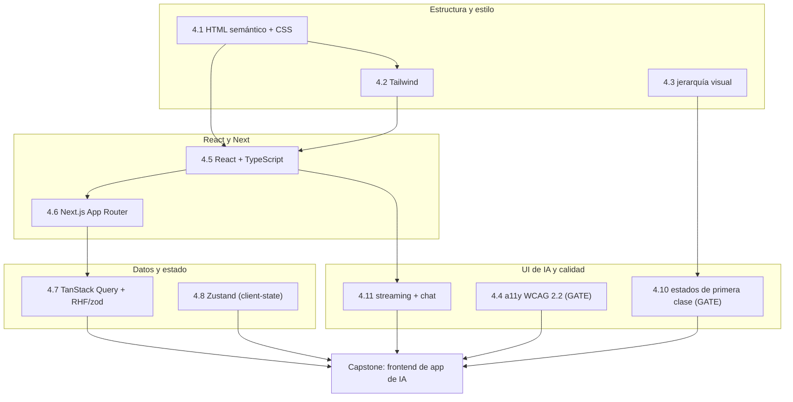
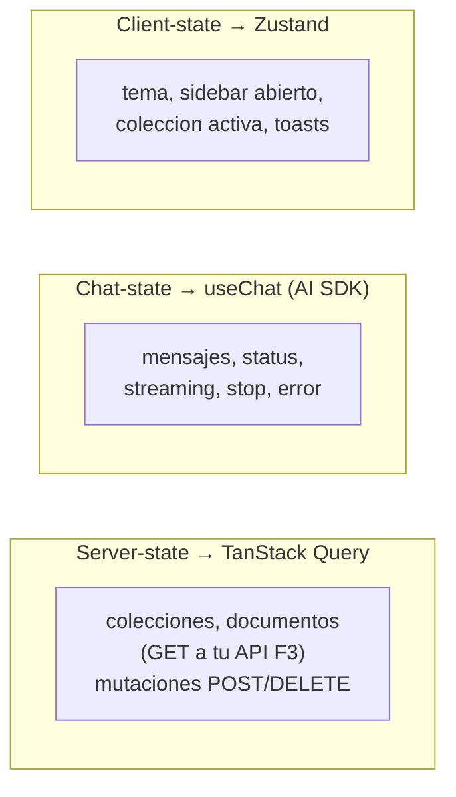

import Reto from "@components/Reto.astro";
import Solucion from "@components/Solucion.astro";
import Quiz from "@components/Quiz.astro";
import CheckDominio from "@components/CheckDominio.astro";
import Nivel from "@components/Nivel.astro";

<Nivel nivel="avanzado" />

Durante once sub-unidades aprendiste piezas sueltas: escribiste HTML semántico, domaste Tailwind, ordenaste la jerarquía visual, auditaste accesibilidad con el teclado, tipaste componentes de React, separaste Server de Client Components, distinguiste server-state de client-state, montaste un store de Zustand, dibujaste los cuatro estados de primera clase y construiste a mano la máquina de estados de un chat de IA. Cada una era un músculo aislado. **Este capstone es el partido.** Vas a ensamblar todo eso en una sola aplicación que consume tu [API de la Fase 3](/fase-3-backend/proyecto/) y le pone una **cara que un cliente usaría**: un chat con streaming token por token, formularios validados, datos cacheados, y —el listón que de verdad separa una demo amateur de una profesional— accesibilidad real y los estados completos como requisito, no como adorno.

No es un ejercicio con tests que ya vienen escritos. Aquí decides la estructura, la frontera entre tipos de estado y cada decisión de UX —y luego la defiendes. Es la **cara visible** de todo lo que construiste y de todo lo que viene: en la [Fase 6 (IA)](/fase-6-ai-engineering/) la lógica de RAG y agentes vivirá detrás de este mismo frontend, sin que la UI cambie. Constrúyela bien una vez y la reusas el resto del curso.

:::tip[Si ya armaste un frontend "que se ve bien"]
¿Ya tienes un dashboard en React/Next desplegado, con su chat y sus formularios? Perfecto: úsalo como diagnóstico, no como excusa para reciclar. La trampa del que "ya sabe frontend" es entregar una UI que se ve linda en el happy path pero, mirada de cerca, no se puede usar con el teclado (foco perdido al abrir un modal), guarda la lista de servidor en un store global que queda obsoleto, pinta la respuesta del LLM con `dangerouslySetInnerHTML` (XSS servido en bandeja), y solo dibujó el estado "todo salió bien" —pantalla en blanco cuando no hay datos, spinner mudo eterno cuando falla la red. Si puedes, sin notas: (1) explicar por qué la lista de colecciones **no** va en Zustand sino en TanStack Query; (2) nombrar los cuatro estados de primera clase y los dos que una UI de IA añade; (3) decir qué atributo ARIA anuncia el texto que llega en streaming y por qué. Si dudas en alguna, este capstone es donde se cierra el hueco. Si no dudas, demuéstralo: el listón aquí es el Definition of Done completo con el **gate de a11y**, no que "se vea bien" en tu pantalla.
:::

## 1. Qué vas a saber hacer

Al terminar este capstone, sin IA para razonar el diseño y pudiendo defender cada decisión sin notas, podrás:

- **O1 — Construir un frontend Next.js + TypeScript de producción** sobre una API REST real: App Router, separación correcta de Server/Client Components, **server-state con TanStack Query** (caching, loading, error) y **formularios con React Hook Form + zod**, reservando **Zustand** solo para el client-state que de verdad es global.
- **O2 — Implementar una UI de chat de IA con streaming token por token**: optimistic UI, un mensaje de asistente que crece chunk por chunk, los estados pensando/streaming/error/cancelar, y las defensas de **seguridad** (nunca renderizar salida del LLM como HTML) que el SDK no resuelve por ti.
- **O3 — Pasar el gate de calidad de la fase**: **accesibilidad WCAG 2.2** (teclado, foco, contraste, `aria-live`) y los **cuatro estados de primera clase** (empty/loading/error/success) en cada vista como requisitos de aceptación; más una demo que corre, README en inglés y write-up de trade-offs, todo mapeado al **Definition of Done** del curso.

## 2. Por qué importa (el dinero está aquí)

> 💰 **Por qué importa:** React (alrededor del 44% de las ofertas) es el segundo skill más pedido, pero el dato esconde la trampa real: miles de candidatos saben pintar componentes en el happy path. **Lo que separa al junior del semi-senior es lo que rodea al componente**: ¿se puede usar con el teclado?, ¿qué muestra cuando no hay datos o falla la red?, ¿el chat se siente vivo o trabado?, ¿renderiza salida del modelo sin abrir un XSS? Este capstone es, literalmente, la pieza de portafolio que responde "sí" a todas esas preguntas. Y es la **cara visible** de tu trabajo: por brillante que sea tu RAG o tu agente de la Fase 6, si el chat se ve colgado —pantalla en blanco, no se puede cancelar, el texto salta de golpe— el cliente no confía. El AI Engineer que monta su propia UI vale más que el que depende de alguien para "ponerle cara" a su modelo.

Tres razones lo hacen el capstone bisagra entre tu backend y tu IA:

1. **Es donde a11y y los estados dejan de ser teoría.** En las sub-unidades [4.4](/fase-4-frontend/4-4-accesibilidad-wcag/) y [4.10](/fase-4-frontend/4-10-usabilidad-estados/) los viste como conceptos; aquí son **gate de aceptación**: si el modal atrapa el foco mal o falta el estado de error, el capstone no está hecho —aunque "funcione".
2. **Es acumulativo de verdad.** Consume el contrato OpenAPI y los errores RFC 9457 de tu [API de la Fase 3](/fase-3-backend/proyecto/), y será la misma cara que la [Fase 6](/fase-6-ai-engineering/) llene con RAG y agentes reales. Las decisiones de frontera de estado que tomes ahora se pagan —o se cobran— tres fases después.
3. **Es tu primera historia de portafolio "fullstack + IA".** "Hice una UI de chat" no impresiona. "Separé el server-state en TanStack Query del client-state en Zustand para que la lista no quedara obsoleta, hice el chat con streaming y un `aria-live` que anuncia el texto al lector de pantalla, y renderizo la salida del LLM como texto plano porque un modelo es inducible a devolver un `<script>`" —eso sí.

## 3. Lo que ya traes (actívalo)

Este capstone no introduce conceptos nuevos: **ensambla toda la Fase 4**. Antes de empezar, recorre el mapa y reconoce dónde vive cada pieza.



- De [`4.1`](/fase-4-frontend/4-1-html-css/) y [`4.2`](/fase-4-frontend/4-2-tailwind/): HTML semántico, flexbox/grid responsive y utility-first. El esqueleto de cada pantalla arranca aquí.
- De [`4.3`](/fase-4-frontend/4-3-diseno-visual/): jerarquía, espaciado y contraste. Lo que hace que el "demo en vivo" no se vea amateur.
- De [`4.4`](/fase-4-frontend/4-4-accesibilidad-wcag/): teclado, ARIA, contraste, foco. **Es gate, no opcional.**
- De [`4.5`](/fase-4-frontend/4-5-react-typescript/): componentes, hooks, props tipadas y, sobre todo, actualización **inmutable** de estado.
- De [`4.6`](/fase-4-frontend/4-6-nextjs/): App Router, la frontera Server/Client Components y los Route Handlers donde vivirá tu endpoint de chat.
- De [`4.7`](/fase-4-frontend/4-7-estado-y-datos/): **TanStack Query** para los datos del servidor (colecciones, documentos) y **React Hook Form + zod** para los formularios.
- De [`4.8`](/fase-4-frontend/4-8-estado-global/): **Zustand** solo para el client-state global (tema, sidebar abierto, colección activa) —no para datos del servidor.
- De [`4.10`](/fase-4-frontend/4-10-usabilidad-estados/): empty/loading/error/success como ciudadanos de primera. **Es gate.**
- De [`4.11`](/fase-4-frontend/4-11-ui-apps-ia/): streaming, la máquina de estados del chat, optimistic UI y la regla anti-XSS de renderizar salida del LLM.

Antes de seguir, responde de memoria:

<Quiz
  question="Tu app muestra una lista de colecciones que vive en tu API de la Fase 3. La guardas en un store de Zustand con un useEffect que hace fetch una vez al montar. Otro usuario crea una colección desde otra pestaña. ¿Qué problema tiene tu diseño y dónde debería vivir esa lista?"
  options={[
    "Ninguno: Zustand es estado global, es el lugar correcto para cualquier dato compartido.",
    "Es server-state, no client-state: queda obsoleto sin invalidación, no tiene loading/error de primera clase ni refetch. Debe vivir en TanStack Query (useQuery), no en Zustand.",
    "El problema es solo de rendimiento; con un useMemo se arregla.",
  ]}
  answer={1}
  explanation="La lista de colecciones es un espejo de datos que son del servidor: su fuente de verdad está en la base de datos, no en el cliente. TanStack Query existe para eso: cachea, da loading/error, refetchea en foco y permite invalidar tras una mutación. Meterlo en Zustand te obliga a reimplementar todo eso a mano y casi siempre termina obsoleto. La regla de 4.8: Zustand para client-state (tema, UI), TanStack Query para server-state."
/>

## 4. Cómo un semi-senior arranca este proyecto (en voz alta)

El instinto de junior es abrir el editor y escribir `<div className="...">`. El instinto de semi-senior es **decidir las fronteras antes de tocar un componente**. Voy a pensar este capstone en voz alta, como lo plantearía de verdad, para que veas el orden —porque el orden *es* la habilidad.

**Paso 1 — Decido dónde vive cada tipo de estado.** Esta es *la* decisión de frontend de la app, y la tomo antes que nada. Tengo tres clases de estado y cada una tiene su hogar:



Si me equivoco aquí —por ejemplo, meto la lista de colecciones en Zustand— pago el error en cada vista. Lo dejo escrito en un ADR.

**Paso 2 — Decido dónde vive la IA (hoy y en F6).** Mi backend de la Fase 3 sirve los datos (auth, colecciones, documentos). Pero todavía no tiene IA —esa llega en la Fase 6. Para este capstone, el endpoint de chat lo monto como un **Route Handler de Next.js** con `streamText` del AI SDK, que habla directo con el modelo. Lo dejo en un ADR explícito: *"hoy el chat vive en Next; en F6 se moverá a un endpoint de streaming del backend FastAPI sin que la UI cambie, porque el contrato del stream es el mismo"*. Pensar a dos fases vista evita rehacer la UI después.

**Paso 3 — Escribo la SPEC antes que el código.** En texto plano: las pantallas (login, lista de colecciones, vista de chat), las rutas, qué datos consume cada una de mi API F3, y —clave en frontend— **los estados de cada vista**: el empty/loading/error/success de [4.10](/fase-4-frontend/4-10-usabilidad-estados/) y los seis estados del chat de [4.11](/fase-4-frontend/4-11-ui-apps-ia/). La spec de un frontend serio enumera estados, no solo "pantallas felices".

**Paso 4 — Monto el scaffold y los providers.** `create-next-app` con TypeScript y Tailwind; envuelvo la app en `QueryClientProvider` (TanStack Query) y mi store de Zustand. Defino la frontera Server/Client: las páginas que solo muestran datos pueden ser Server Components; todo lo interactivo (chat, formularios, lo que usa hooks) lleva `"use client"`.

**Paso 5 — Construyo por capas verticales, no horizontales.** El error es "primero todos los componentes, luego conectar datos". Mejor: una feature completa de punta a punta. Empiezo por **auth** (formulario con RHF+zod → llamo a `/auth/token` de mi API → guardo el token) y la pruebo. Luego **colecciones** (lista con `useQuery`, con sus cuatro estados; crear con `useMutation` + invalidación). Luego el **chat**. Cada feature entra verde y accesible antes de la próxima.

**Paso 6 — Dibujo los cuatro estados desde el primer componente con datos.** Cuando escribo la lista de colecciones, en *ese* momento decido qué se ve si `isPending` (skeleton, no spinner mudo), si `isError` (mensaje + reintentar, leyendo el `detail` del error RFC 9457 de mi backend), si la lista viene vacía (empty state que invita a crear la primera), y el success. No "después": los estados son parte de la feature.

**Paso 7 — Tejo la accesibilidad mientras construyo, no al final.** Cada control interactivo es alcanzable por teclado y tiene foco visible; el modal de "crear colección" atrapa y devuelve el foco; el contenedor del chat lleva `aria-live="polite"` para que el lector de pantalla anuncie el texto que llega; los colores pasan el contraste mínimo de WCAG 2.2. La a11y espolvoreada al final **nunca** pasa el gate; tejida, sí.

**Paso 8 — Aplico la seguridad del frontend.** La respuesta del asistente viene de un LLM, que es un sistema externo y manipulable: la renderizo como **texto** (React escapa por mí), nunca con `dangerouslySetInnerHTML`. Las URLs base y claves van en variables de entorno, no en el código. Si llamo a mi API F3 desde el navegador, configuro CORS en el backend, no abro `*`.

**Paso 9 — Mido y cierro con honestidad.** Tests de los componentes y de la máquina de estados del chat (Vitest + Testing Library); un chequeo de a11y automatizado (axe) más una **pasada manual con el teclado** (axe no detecta todo); un README en inglés con `pnpm dev` y una demo que corre; y un write-up de trade-offs. Reviso que el historial sea Conventional Commits.

Ese es el orden. Nota que el primer componente aparece recién en el paso 5. Todo lo anterior es **decidir fronteras y estados** —y es exactamente lo que el Primero-Sin-IA protege.

## 5. Errores que hunden este capstone

:::caution[Confronta estas trampas antes de caer en ellas]
Cada uno de estos errores convierte un capstone "técnicamente entregado" en uno que no pasa el gate. Cada uno es una pregunta de entrevista disfrazada.

- **"Guardo los datos del servidor en Zustand."** Podrías pensar que un store global es el lugar de "todo lo compartido". Está mal: la lista de colecciones es **server-state** —su fuente de verdad es la base de datos—. En Zustand queda obsoleta, sin loading/error de primera clase ni refetch. Va en TanStack Query (`useQuery`); Zustand es para client-state (tema, sidebar, colección activa).
- **"El chat espera la respuesta completa con `await res.json()`."** Está mal para una app de IA: un LLM tarda segundos y el usuario mira una pantalla en blanco y luego un muro de texto. El baseline es **streaming** token por token (lección [4.11](/fase-4-frontend/4-11-ui-apps-ia/)), no una mejora opcional.
- **"Renderizo la respuesta del modelo con `dangerouslySetInnerHTML` para que se vea con formato."** Está mal: un LLM es inducible (prompt injection) a devolver `<script>`. Eso es un **XSS**. Renderiza como texto plano (React escapa en `{}`), o markdown con un renderer que sanitiza y prohíbe HTML crudo. Es OWASP de la Fase 3 aplicado al frontend.
- **"La a11y la reviso al final con una extensión."** Está mal: la accesibilidad tejida al final casi siempre obliga a reestructurar (foco, orden del DOM, roles). Y axe automatizado solo cubre una parte —el foco de teclado, el orden de lectura y los textos alternativos exigen una **pasada manual**. En este capstone la a11y es **gate**: sin teclado completo y foco manejado, no está hecho.
- **"Dibujé la pantalla cuando hay datos; el resto lo veo después."** Está mal: el estado **vacío** (nunca hubo datos), el **loading** (skeleton, no spinner mudo) y el **error** (mensaje accionable + reintentar) son ciudadanos de primera ([4.10](/fase-4-frontend/4-10-usabilidad-estados/)). Una UI que solo tiene happy path se siente rota en cuanto la red tose.
- **"Si la respuesta del chat se corta, borro el texto parcial y muestro el error."** Está mal: conserva el parcial y muestra el error al lado con Reintentar. Borrar lo que el usuario estaba leyendo es peor que dejarlo incompleto.
- **"El backend me devuelve `{detail: ...}` para todo, así que muestro 'algo falló'."** Si tu API F3 cumple su contrato, los errores vienen en **RFC 9457** (`type`/`title`/`status`/`detail`). Lee el `detail` y muestra algo útil; un contrato de error existe para que el frontend programe contra él.
- **"Pongo el token JWT en `localStorage` y listo."** Cuidado: `localStorage` es legible por cualquier script, así que un XSS te exfiltra el token. Una cookie `HttpOnly` (puesta por el backend) es más segura. Como mínimo, sé consciente del trade-off y nómbralo en tu write-up; no lo hagas en piloto automático.
:::

Un *non-example* que parece correcto pero no lo es —léelo y detecta los problemas antes de seguir:

```tsx
"use client";
// 🐛 ¿Qué tiene de malo esta "lista de colecciones"?
function Colecciones() {
  const [items, setItems] = useState([]);
  useEffect(() => {
    fetch("/api/colecciones").then((r) => r.json()).then(setItems);
  }, []);
  return (
    <ul>
      {items.map((c) => (
        <li key={c.id}>{c.nombre}</li>
      ))}
    </ul>
  );
}
```

Tiene cuatro problemas: (1) **server-state a mano** —reinventa caching, refetch e invalidación que TanStack Query ya da—; (2) **sin estado de loading** —pinta una lista vacía mientras carga, indistinguible del estado vacío real—; (3) **sin estado de error** —si el fetch falla, se traga el error en silencio—; y (4) **sin estado vacío** —cuando de verdad no hay colecciones, no invita a crear la primera—. Los cuatro los arreglan `useQuery` (4.7) más los cuatro estados de primera clase (4.10).

## 6. El andamiaje: construir por capas (faded)

No empieces de cero frente a una página en blanco —pero tampoco te doy el código. El andamiaje aquí es el **orden de construcción** y la **frontera de estado**; tú rellenas los componentes. A medida que avanzas, el andamiaje desaparece (las primeras capas las describo más; las últimas son tuyas).

**Capa 0 — Scaffold y providers (te lo dejo casi listo):**

```text
mi-frontend/
├── package.json            # next, react, typescript, tailwindcss, @tanstack/react-query,
│                           # react-hook-form, zod, zustand, ai, @ai-sdk/react, @ai-sdk/<provider>
├── .env.local.example      # NEXT_PUBLIC_API_URL (tu API F3) + la API key del modelo (server-only)
├── src/
│   ├── app/
│   │   ├── layout.tsx       # Server Component: html/body + <Providers>
│   │   ├── providers.tsx    # "use client": QueryClientProvider (+ tema)
│   │   ├── page.tsx         # lista de colecciones (los 4 estados)
│   │   ├── chat/page.tsx    # vista de chat (streaming, 6 estados)
│   │   └── api/chat/route.ts# Route Handler con streamText (BFF del chat)
│   ├── lib/
│   │   ├── api.ts           # cliente de tu API F3 (lee NEXT_PUBLIC_API_URL)
│   │   └── store.ts         # Zustand: tema, sidebar, colección activa
│   └── components/          # ColeccionesList, Chat, EstadoVacio, Skeleton, ErrorState...
└── tests/                   # Vitest + Testing Library + un chequeo axe
```

**Capa 1 — Providers y auth (faded medio):** el `providers.tsx` con `QueryClientProvider`, y el formulario de login con RHF+zod que llama a `/auth/token` de tu API F3. Recuerda de [`4.7`](/fase-4-frontend/4-7-estado-y-datos/): el schema de zod es la fuente de verdad de la validación. Aquí tienes la pieza que más se equivoca —el resto es tuyo:

```tsx
// src/app/providers.tsx
"use client";
import { QueryClient, QueryClientProvider } from "@tanstack/react-query";
import { useState } from "react";

export function Providers({ children }: { children: React.ReactNode }) {
  // Un QueryClient por carga del cliente (no a nivel de módulo: evita compartir caché entre requests SSR).
  const [client] = useState(() => new QueryClient());
  return <QueryClientProvider client={client}>{children}</QueryClientProvider>;
}
```

**Capa 2 — Colecciones con los cuatro estados (faded ligero):** la lista con `useQuery` y la creación con `useMutation` + invalidación. El reto no es traer los datos: es que **cada estado** esté dibujado. Piénsalo como "la pantalla tiene cuatro caras, no una".

**Capa 3 — Chat con streaming (tuyo):** la vista de chat con `useChat` del AI SDK y tu Route Handler con `streamText`. Reusa la máquina de estados que construiste en el ejercicio `chat-reducer-streaming` y los seis estados de [`4.11`](/fase-4-frontend/4-11-ui-apps-ia/). El `aria-live` y la salida como texto plano no son negociables.

**Capa 4 — El gate de calidad (tuyo):** pasada de accesibilidad (teclado completo, foco manejado en el modal, contraste, `aria-live`), seguridad (salida del LLM como texto, secretos en env, CORS en el backend), y la suite de tests con un chequeo axe.

<Solucion title="Pista: la forma de los cuatro estados con useQuery (no es la solución del capstone)">

Esto es un empujón sobre cómo se ven los cuatro estados con TanStack Query v5, no el diseño de tu app:

```tsx
"use client";
import { useQuery } from "@tanstack/react-query";

function ColeccionesList() {
  const { data, isPending, isError, error } = useQuery({
    queryKey: ["colecciones"],
    queryFn: obtenerColecciones, // GET a tu API F3
  });

  if (isPending) return <SkeletonLista />;          // loading: skeleton, no spinner mudo
  if (isError) return <ErrorState mensaje={error.message} onReintentar={/* refetch */ undefined} />;
  if (data.length === 0) return <EstadoVacio />;    // vacío: invita a crear la primera
  return (
    <ul>
      {data.map((c) => (
        <li key={c.id}>{c.nombre}</li>
      ))}
    </ul>
  ); // success
}
```

Lo importante no es copiar esto: es que **cada rama** sea un componente real y accesible (el `ErrorState` con un botón de reintentar alcanzable por teclado; el `EstadoVacio` con un call-to-action claro). La forma de leer el `detail` del error RFC 9457 de tu backend la diseñas tú.

</Solucion>

## 7. El capstone (Primero-Sin-IA)

<Reto title="Frontend de una app de IA sobre tu backend de la Fase 3" timebox="proyecto · 15–25 h repartidas en 1–2 semanas">

Carpeta: `ejercicios/fase-4/capstone-frontend-ia/`

Construye un **frontend Next.js + TypeScript** que consuma tu [API de la Fase 3](/fase-3-backend/proyecto/) y le ponga una cara usable: gestión de datos (colecciones/documentos) y un **chat de IA con streaming**. El README del ejercicio trae el brief completo, las plantillas de `SPEC.md`/ADR y el `.env.local.example`. Tu frontend debe cumplir, como mínimo:

- **Stack:** Next.js (App Router) + TypeScript + Tailwind. Separación correcta de Server/Client Components.
- **Datos del servidor:** **TanStack Query** para leer y mutar los datos de tu API F3 (con invalidación tras mutar). Prohibido guardar server-state en Zustand o en `useEffect` + `useState` a mano.
- **Formularios:** **React Hook Form + zod** (login y crear colección, como mínimo). El schema de zod es la validación.
- **Client-state global:** **Zustand** solo donde aplique (tema, sidebar, colección activa). Si no lo necesitas, no lo metas.
- **Chat de IA con streaming:** UI de chat con `useChat` (`@ai-sdk/react`) y un Route Handler con `streamText`; optimistic UI, mensaje del asistente que crece chunk por chunk, y los estados pensando/streaming/error/cancelar.
- **GATE — estados de primera clase:** **cada vista con datos dibuja empty/loading/error/success**; el chat dibuja sus seis estados (vacío/enviando/streaming/completado/error/cancelado).
- **GATE — accesibilidad WCAG 2.2:** operable solo con teclado, foco visible y manejado (modal que atrapa y devuelve el foco), contraste suficiente, y `aria-live` que anuncia el texto del chat que llega en vivo.
- **Seguridad:** la salida del LLM se renderiza como **texto** (o markdown sanitizado sin HTML crudo), nunca con `dangerouslySetInnerHTML`; secretos/URLs en variables de entorno; CORS configurado en el backend (no `*`).
- **Calidad:** suite de tests (componentes + máquina de estados del chat) con Vitest + Testing Library, más un chequeo de a11y con axe; lint en CI.
- **Observabilidad:** registra latencia y tokens por respuesta del chat (en consola o un log) —la semilla del costo/latencia que la Fase 6 formaliza.
- **Comunicación:** README **en inglés** con `pnpm dev`/`pnpm build` y una demo que corre (capturas o un GIF); write-up de trade-offs; historial 100% Conventional Commits.

**Hecho significa** (mapeado al Definition of Done único del curso — la lista completa está en el README del ejercicio):

- **(DoD 1)** Existe `SPEC.md` (escrita antes del código, con el inventario de estados de cada vista) + al menos un **ADR** real (la frontera server/client/chat-state, o dónde vive la IA hoy y en F6).
- **(DoD 2)** Tests verdes + lint en CI; tests de componentes y de la máquina de estados del chat (no "se ve bien en mi pantalla").
- **(DoD 3)** Seguridad aplicada: salida del LLM como texto (sin `dangerouslySetInnerHTML`); secretos en env; CORS acotado.
- **(DoD 4)** Observabilidad: latencia/tokens por respuesta del chat registrados (semilla de costo/latencia).
- **(DoD 7)** **a11y WCAG 2.2** (teclado/foco/contraste/`aria-live`) + los **cuatro estados** en cada vista. Este es el gate de la fase.
- **(DoD 8)** Demo que corre + README en inglés + write-up de trade-offs.
- **(DoD 9)** Conventional Commits en todo el historial.

Empieza por la **frontera de estado y la spec** (pasos 1–3 de la sección 4), no por los componentes. Construye por capas verticales: una feature completa, accesible y con sus cuatro estados antes de la siguiente.

</Reto>

> La **solución de referencia** (un proyecto ejemplar) existe para el corrector IA, no para ti. En un capstone de diseño **no hay una única respuesta correcta**: el corrector evalúa tu frontera de estado, tus estados de primera clase, tu accesibilidad y si puedes defender cada decisión —no si elegiste "el" layout. No la busques antes de cerrar tu intento.

## 8. Check de dominio

Sin mirar la lección, responde en voz alta o por escrito. Si una te traba, ya sabes qué sub-unidad de la Fase 4 releer —y es probable que sea la que más se evalúa en entrevista.

<CheckDominio items={[
  "Explicar la diferencia entre server-state y client-state con un ejemplo de tu app de cada uno, y por qué la lista de colecciones va en TanStack Query y no en Zustand.",
  "Nombrar los cuatro estados de primera clase (empty/loading/error/success) y los dos extra que añade una UI de chat de IA, y qué ve el usuario en cada uno.",
  "Describir, sin código, cómo el chat hace streaming y optimistic UI: por qué el mensaje del asistente nace vacío y por qué el texto parcial no se borra en error.",
  "Explicar el riesgo de XSS de renderizar la salida del LLM como HTML y la regla correcta, conectándolo con OWASP de la Fase 3.",
  "Enumerar tres medidas concretas de accesibilidad WCAG 2.2 que aplicaste (teclado, foco en el modal, contraste, aria-live) y por qué axe automatizado no basta.",
  "Justificar dónde vive la IA en tu app hoy (Route Handler con streamText) y cómo se moverá al backend FastAPI en la Fase 6 sin que la UI cambie.",
  "Explicar cómo lees el error RFC 9457 de tu backend para construir un estado de error útil en vez de un 'algo falló'.",
]} />

<Quiz
  question="En tu vista de chat, al recibir un error de red a mitad del streaming borras el array de mensajes y muestras solo el aviso. El usuario estaba leyendo una respuesta a medias. Además, tu lista de colecciones la guardaste en Zustand con un fetch en useEffect. ¿Cuáles son los dos problemas?"
  options={[
    "Ninguno: limpiar ante un error y centralizar datos en Zustand son buenas prácticas.",
    "(1) Borrar el parcial destruye contexto que el usuario leía: hay que conservarlo y mostrar el error al lado con Reintentar. (2) La lista es server-state: va en TanStack Query, no en Zustand, que queda obsoleta y sin loading/error.",
    "El único problema es el de Zustand; borrar el parcial está bien.",
  ]}
  answer={1}
  explanation="Son dos hilos de la fase a la vez. En el chat (4.11), el caso de error no toca el array de mensajes: conserva el parcial y muestra el error con Reintentar; borrarlo se siente como si la app se tragara la respuesta. Y la lista (4.7/4.8) es server-state: TanStack Query le da caching, loading/error e invalidación; en Zustand reinventas todo eso y casi siempre queda obsoleto."
/>

## 9. Recursos (oficial primero)

- [Next.js — App Router](https://nextjs.org/docs/app): Server vs Client Components, layouts y Route Handlers (donde vive tu `/api/chat`).
- [TanStack Query — Overview](https://tanstack.com/query/latest/docs/framework/react/overview): `useQuery`, `useMutation`, invalidación de caché y los estados `isPending`/`isError`.
- [React Hook Form — Get Started](https://react-hook-form.com/get-started) y [zod](https://zod.dev/): formularios validados con el schema como fuente de verdad.
- [Zustand](https://zustand.docs.pmnd.rs/): client-state global mínimo; cuándo (y cuándo no) usarlo.
- [Vercel AI SDK — Chatbot (`useChat`)](https://ai-sdk.dev/docs/ai-sdk-ui/chatbot) y [`streamText`](https://ai-sdk.dev/docs/reference/ai-sdk-core/stream-text): el chat con streaming de punta a punta (verificado contra la API vigente 2026, AI SDK v5).
- [WCAG 2.2 — Quick Reference](https://www.w3.org/WAI/WCAG22/quickref/) y [MDN — `aria-live`](https://developer.mozilla.org/en-US/docs/Web/Accessibility/ARIA/ARIA_Live_Regions): el gate de accesibilidad y cómo anunciar contenido en vivo.
- [Testing Library](https://testing-library.com/docs/) y [axe-core](https://github.com/dequelabs/axe-core): tests de componentes y chequeo de accesibilidad.
- [OWASP — Cross-Site Scripting (XSS)](https://owasp.org/www-community/attacks/xss/): por qué nunca renderizar HTML no confiable (la salida del LLM lo es).

## 10. Conexión con el proyecto (hacia adelante)

Este capstone **es** el proyecto de la Fase 4, y a la vez es la cara de un proyecto que crece dos fases más:

- **Fase 5 — DevOps:** este frontend se despliega (Vercel o tu homelab) con su pipeline, variables por ambiente y observabilidad real. La latencia/tokens que registras aquí se vuelven métricas de verdad.
- **Fase 6 — [AI Engineering](/fase-6-ai-engineering/):** aquí está el pago de haber separado bien el estado y dejado la IA detrás de un contrato de streaming. Cuando construyas RAG y agentes, **la UI no cambia**: el Route Handler con `streamText` se reemplaza por un endpoint de streaming de tu backend FastAPI, y tu chat —optimistic UI, seis estados, `aria-live`, salida sanitizada— los expone tal cual. La frontera que diseñaste hoy es lo que hace que esa transición sea de un día, no de una reescritura.

Cuando lo cierres, lo que llevas al portafolio no es "una UI de chat": es la prueba de que sabes ponerle una cara **usable y accesible** a un sistema de IA, con el estándar de un equipo. Recuerda el **Definition of Done** completo —con el gate de a11y— no des por terminado nada que no lo cumpla.

## 11. Reflexión + repaso espaciado

Escribe 4–5 frases respondiendo: **¿cuál de los requisitos del gate te costó más —la accesibilidad o los cuatro estados— y qué te dice eso sobre el hábito que menos has interiorizado?** Si fue la a11y, tu punto ciego es pensar la UI desde el mouse y la vista; si fueron los estados, es asumir que todo siempre sale bien. Ahí está tu próximo foco.

**Gancho de spaced repetition:**

- **Mañana:** reescribe de memoria tu inventario de estados (los cuatro de cada vista + los seis del chat). Si no puedes, no internalizaste tu propio diseño —vuelve a la sección 4.
- **En 3 días:** navega tu app completa **solo con el teclado**, sin tocar el mouse. Cada lugar donde te quedes atrapado o pierdas el foco es un fallo del gate de a11y que hoy no viste.
- **En 1 semana:** explícale a alguien (o a una grabación tuya, en inglés técnico) por qué la lista de colecciones va en TanStack Query y no en Zustand. Es la pregunta de frontend de estado más frecuente.
- **Antes de la Fase 6:** repasa tu ADR de "dónde vive la IA". Cuando reemplaces el Route Handler por el backend de RAG sin tocar la UI, ese día entenderás para qué sirvió la frontera.
