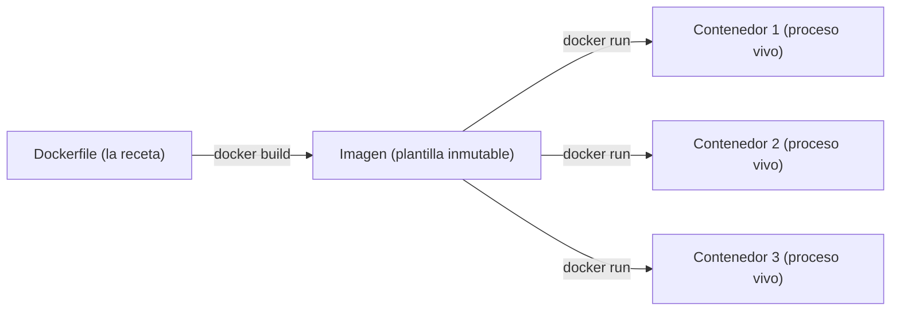

import Reto from "@components/Reto.astro";
import Solucion from "@components/Solucion.astro";
import Quiz from "@components/Quiz.astro";
import CheckDominio from "@components/CheckDominio.astro";
import Nivel from "@components/Nivel.astro";

<Nivel nivel="intermedio" />

Construiste un backend en la [Fase 3](/fase-3-backend/) que corre en tu máquina. Funciona. Lo demuestras, cierras el laptop, y al abrirlo en otro computador —o al subirlo a un servidor— **deja de funcionar**: falta una librería, la versión de Python no es la misma, el Postgres está en otro puerto. Ese abismo entre "corre en mi máquina" y "corre en cualquier máquina" es el problema que Docker resuelve, y es el primer escalón de todo lo que vas a desplegar en esta fase.

Esta lección parte **desde cero**: qué es un contenedor, en qué se diferencia de una imagen, cómo se escribe un `Dockerfile` que no desperdicie tiempo ni espacio, y cómo orquestar varios servicios juntos con Docker Compose. No asume que ya usaste Docker.

:::tip[Si ya lo tocaste]
¿Ya escribiste `Dockerfile`s y corriste `docker compose up`? Úsalo como diagnóstico, no como permiso para saltar. La trampa del que "ya usa Docker" se nota en tres síntomas: imágenes de 1 GB que podrían pesar 150 MB, builds que reinstalan todo en cada cambio de una línea, y contenedores que corren como `root` con un `.env` copiado adentro. Si tu `Dockerfile` no es **multi-stage**, no fija el tag de la imagen base, corre como `root` o no tiene `.dockerignore`, no lo dominabas: lo usabas. Salta directo a los dos ejercicios Primero-Sin-IA (sección 7); si los cierras sin notas dentro del timebox, valida y avanza.
:::

## 1. Qué vas a saber hacer

Al terminar, sin IA y sin notas, podrás:

- **O1 — Explicar** qué problema resuelve un contenedor (la paridad de entornos), y distinguir con precisión **imagen vs. contenedor** usando el modelo mental de **capas**.
- **O2 — Implementar** un `Dockerfile` **multi-stage** para tu backend FastAPI: con caché de capas correcta, imagen mínima, usuario **no-root** y `HEALTHCHECK` — defendiendo cada decisión.
- **O3 — Componer** un stack multi-servicio (app + Postgres + Redis) con **Docker Compose**: redes, volúmenes, variables de entorno y orden de arranque con *health checks*.

## 2. Por qué importa (el dinero está aquí)

> 💰 **Por qué importa:** en las ofertas del nicho, **Docker aparece en ~1 de cada 3** (junto con CI/CD ~32%, AWS ~30%, Azure ~17%). No es un "extra de DevOps": es la unidad de empaque con la que el mundo entero entrega software hoy. Tu CI lo usa, tu deploy lo usa, tu app de IA con su modelo y su vector DB lo usa. Un AI/Automation Engineer que sabe contenerizar su propio trabajo y subirlo a producción **vale más** que uno que entrega un repo y dice "tú lo configuras".

Hay tres razones por las que esta sub-unidad es la base de toda la Fase 5:

1. **Mata el "en mi máquina funciona" de raíz.** Un contenedor empaqueta tu código *y* su sistema operativo *y* sus dependencias en una sola unidad reproducible. La misma imagen que probaste localmente es, bit por bit, la que corre en el servidor. Eso es **paridad de entornos**, y es justo lo que la [`5.2` 12-factor app](/fase-5-devops/5-2-12-factor/) formaliza como principio.
2. **Es el insumo de todo lo que sigue.** El [`5.3` CI/CD](/fase-5-devops/5-3-cicd-github-actions/) construye y publica imágenes; los [`5.4` gates de seguridad](/fase-5-devops/5-4-seguridad-supply-chain-ci/) escanean *esas* imágenes; el [`5.9` despliegue](/fase-5-devops/5-9-despliegue/) las corre. Si tu imagen es enorme, insegura o no reproducible, todo lo demás hereda el problema.
3. **El tamaño y la seguridad de la imagen son dinero y riesgo medibles.** Una imagen de 150 MB se descarga, escanea y arranca mucho más rápido que una de 1.2 GB —menos costo de CI, menos latencia de arranque— y una imagen con menos cosas adentro tiene **menos superficie de ataque**. Estos dos hilos (costo y seguridad) los vas a tejer en cada `Dockerfile` que escribas.

## 3. Lo que ya traes (actívalo)

Esta lección se apoya en cosas que ya hiciste. Reúsalas antes de seguir:

- De la [Fase 3 — Backend](/fase-3-backend/): tu API FastAPI con Postgres y, quizás, Redis. **Eso** es lo que vamos a contenerizar; no construimos una app nueva, empaquetamos la que ya tienes.
- De la [`0.5` Terminal y Linux](/fase-0-fundamentos/0-5-terminal-y-linux/): variables de entorno, procesos, permisos de archivos y de usuario. Un contenedor *es* un proceso Linux aislado; todo lo que sabes de la terminal aplica adentro.
- De la [`0.4` Cómo funciona la web y un computador](/fase-0-fundamentos/0-4-web-y-computador/): puertos, IPs y el modelo cliente-servidor. Exponer un puerto del contenedor al host es exactamente eso.

Antes de seguir, responde de memoria:

<Quiz
  question="¿Por qué una máquina virtual (VM) tradicional es más pesada que un contenedor para correr la misma app?"
  options={[
    "Porque la VM corre tu código en un lenguaje interpretado y el contenedor en uno compilado",
    "Porque la VM incluye un sistema operativo invitado completo (kernel propio), mientras el contenedor comparte el kernel del host y solo empaqueta los procesos y librerías de la app",
    "Porque los contenedores no pueden correr bases de datos y por eso ocupan menos",
  ]}
  answer={1}
  explanation="Un contenedor NO es una VM ligera con su propio kernel: comparte el kernel del host y aísla procesos con namespaces y cgroups del propio Linux. Por eso arranca en milisegundos y pesa MB en vez de GB. La VM, en cambio, virtualiza hardware y carga un SO invitado entero. Entender esto explica por qué una imagen base 'slim' alcanza: el kernel ya lo pone el host."
/>

## 4. Empaquetando FastAPI, pensado en voz alta

Voy a contenerizar un backend FastAPI **paso a paso**. No leas esto como un resultado terminado: léelo como me oirías razonar al lado tuyo, equivocándome y corrigiendo. Partimos de una app mínima con un endpoint y un *health check*:

```python
# app/main.py
from fastapi import FastAPI

app = FastAPI()


@app.get("/health")
def health():
    return {"status": "ok"}


@app.get("/")
def root():
    return {"mensaje": "Hola desde un contenedor"}
```

Y su lista de dependencias:

```text
# requirements.txt
fastapi[standard]==0.128.0
```

### 4.1 Imagen vs. contenedor (el modelo mental)

Antes de escribir nada, fijo los dos conceptos que más se confunden:

- Una **imagen** es una plantilla *inmutable* de solo lectura: el sistema de archivos congelado con tu app y sus dependencias. Es como una clase en POO, o el molde de un queque.
- Un **contenedor** es una *instancia en ejecución* de una imagen: un proceso vivo, con su capa de escritura encima. Es el objeto, o el queque horneado. De una imagen puedes arrancar 100 contenedores idénticos.



Razono: *"Si me confundo aquí, todo lo demás se enreda. La imagen no 'corre'; se ejecuta un contenedor a partir de ella. Cuando borro un contenedor, la imagen sigue intacta. Cuando cambio el código, reconstruyo la imagen y arranco un contenedor nuevo."*

### 4.2 El primer Dockerfile (ingenuo, pero honesto)

Un `Dockerfile` es la receta: una secuencia de instrucciones que Docker ejecuta de arriba hacia abajo para construir la imagen. Mi primer intento, deliberadamente simple:

```dockerfile
FROM python:3.13
WORKDIR /app
COPY . .
RUN pip install -r requirements.txt
CMD ["fastapi", "run", "app/main.py", "--port", "8000"]
```

Lo construyo y lo corro:

```bash
docker build -t miapp .
docker run -p 8000:8000 miapp
```

Razono: *"`-p 8000:8000` mapea el puerto 8000 del host al 8000 del contenedor (host:contenedor). Sin eso, el contenedor escucha pero nadie lo alcanza desde afuera —exactamente lo que vimos en la [`0.4`](/fase-0-fundamentos/0-4-web-y-computador/) sobre puertos."*

Funciona. Pero tiene **tres problemas graves** que voy a ir matando: la imagen es enorme, el build es lento en cada cambio, y corre como `root`.

### 4.3 Las capas y por qué el ORDEN importa

Aquí está la idea más rentable de toda la lección. **Cada instrucción del `Dockerfile` crea una capa** (un *layer*): un diff del sistema de archivos apilado sobre el anterior. Docker **cachea** cada capa: si una instrucción y todo lo que está *encima* de ella no cambió, Docker reutiliza la capa cacheada en vez de re-ejecutarla.

El problema de mi primer intento es esta línea:

```dockerfile
COPY . .
RUN pip install -r requirements.txt
```

Razono en voz alta: *"Copié TODO el código antes de instalar dependencias. Entonces, cada vez que cambio una sola línea de `main.py`, la capa del `COPY` se invalida, y como `pip install` está encima, también se invalida: Docker reinstala fastapi y todas sus dependencias desde cero. En un proyecto real eso son minutos perdidos en cada build."*

La regla: **lo que cambia poco va arriba; lo que cambia mucho va abajo.** Las dependencias cambian rara vez; el código fuente cambia constantemente. Así que separo:

```dockerfile
FROM python:3.13
WORKDIR /app

# 1. Solo el manifiesto de dependencias (cambia poco)
COPY requirements.txt .
RUN pip install -r requirements.txt

# 2. El código (cambia mucho) — DESPUÉS
COPY ./app ./app

CMD ["fastapi", "run", "app/main.py", "--port", "8000"]
```

*"Ahora, si toco `main.py`, Docker reutiliza la capa de `pip install` (no cambió `requirements.txt`) y solo rehace el `COPY ./app`. El build pasa de minutos a segundos."* Este patrón —copiar el manifiesto, instalar, después copiar el código— es uno de los reflejos que más distingue a quien sabe Docker.

### 4.4 Multi-stage: separar el "cómo se construye" del "cómo se corre"

La imagen sigue pesando ~1 GB. ¿Por qué? Porque `python:3.13` trae un sistema operativo completo con compiladores, headers y herramientas de build que **necesito para instalar**, pero que **no necesito para correr**. Cargarlas en producción es peso muerto y superficie de ataque.

La solución es un **multi-stage build**: uso una primera etapa (el *builder*) con todas las herramientas para instalar las dependencias, y una segunda etapa (el *runtime*) mínima, a la que solo **copio lo ya instalado**. Las herramientas de build se quedan en el builder y nunca llegan a la imagen final.

```dockerfile
# ---------- Etapa 1: builder ----------
FROM python:3.13-slim AS builder

# uv: instalador de paquetes de Python, mucho más rápido que pip
RUN pip install --no-cache-dir uv

WORKDIR /app
COPY requirements.txt .

# Creo un venv aislado e instalo ahí dentro
RUN python -m venv /opt/venv
ENV PATH="/opt/venv/bin:$PATH"
RUN uv pip install --no-cache -r requirements.txt

# ---------- Etapa 2: runtime ----------
FROM python:3.13-slim AS runtime

# Usuario sin privilegios (NO corremos como root)
RUN groupadd --system app && useradd --system --gid app --no-create-home appuser

# Copio SOLO el venv ya construido desde el builder
COPY --from=builder /opt/venv /opt/venv
ENV PATH="/opt/venv/bin:$PATH"

WORKDIR /app
COPY ./app ./app

USER appuser
EXPOSE 8000

CMD ["fastapi", "run", "app/main.py", "--port", "8000"]
```

Razono pieza por pieza: *"`python:3.13-slim` en vez de `python:3.13` ya recorta cientos de MB (slim trae lo mínimo de Debian). El `AS builder` nombra la etapa. El `COPY --from=builder /opt/venv` trae solo el entorno virtual con las librerías; el compilador de C que usé para instalar se queda atrás. La imagen final no tiene `uv`, ni `gcc`, ni headers: solo Python slim + mi venv + mi código."*

Dos decisiones que parecen detalles y no lo son:

- **`USER appuser`** — por defecto un contenedor corre como `root`. Si alguien explota una vulnerabilidad de tu app, ser `root` dentro del contenedor es un peldaño hacia el host. Correr como usuario sin privilegios es defensa en profundidad (lo conectarás con OWASP en [`5.4`](/fase-5-devops/5-4-seguridad-supply-chain-ci/)).
- **`EXPOSE 8000`** — es *documentación*: declara qué puerto usa la app. No publica nada por sí solo (eso lo hace `-p` o Compose), pero deja claro el contrato.

### 4.5 El `.dockerignore` (el archivo que casi todos olvidan)

`COPY ./app ./app` está bien, pero en proyectos reales se ve mucho `COPY . .`. El problema: eso arrastra a la imagen tu `.git`, tu `.venv` local, `__pycache__`, los tests, y —lo más peligroso— tu `.env` con secretos. La imagen termina pesada *y* filtrando credenciales.

El `.dockerignore` funciona como el `.gitignore`: lista lo que NO debe entrar al *build context*.

```text
# .dockerignore
.git
.venv
__pycache__/
*.pyc
.env
.env.*
tests/
*.md
.pytest_cache/
```

Razono: *"Excluir `.env` no es opcional: un secreto horneado dentro de una imagen queda ahí para siempre, en una capa, visible para cualquiera que haga `docker history`. Los secretos entran en runtime por variable de entorno (lo formaliza la [`5.2`](/fase-5-devops/5-2-12-factor/)), nunca en build."*

### 4.6 HEALTHCHECK: que Docker sepa si la app está viva

Un contenedor puede estar "corriendo" (el proceso existe) pero la app adentro estar colgada. Un `HEALTHCHECK` le enseña a Docker a *preguntarle* a la app si está sana:

```dockerfile
HEALTHCHECK --interval=30s --timeout=3s --start-period=5s --retries=3 \
  CMD python -c "import urllib.request,sys; sys.exit(0 if urllib.request.urlopen('http://localhost:8000/health').getcode()==200 else 1)"
```

Razono: *"Uso `python -c` con `urllib` en vez de `curl` a propósito: la imagen `slim` no trae `curl`, y no voy a instalarlo solo para esto (sumaría peso y superficie). Golpeo mi propio endpoint `/health`. Si responde 200, el contenedor está `healthy`; si no, Docker lo marca `unhealthy` y —en Compose— otros servicios pueden esperar a que esté sano antes de arrancar."* Ese `/health` que pusimos en `main.py` no era decorativo: es el contrato de salud.

### 4.7 Volúmenes: los datos que deben sobrevivir al contenedor

La capa de escritura de un contenedor es **efímera**: cuando borras el contenedor, se borra. Para Postgres, eso significaría perder la base de datos cada vez. Los **volúmenes** resuelven esto: persisten datos *fuera* del ciclo de vida del contenedor.

- **Named volume** (`pgdata:/var/lib/postgresql/data`): Docker lo gestiona; ideal para datos de bases de datos.
- **Bind mount** (`./src:/app/src`): mapea una carpeta del host; útil en desarrollo para ver tus cambios al instante sin reconstruir.

Razono: *"Regla práctica: named volumes para datos de producción (la DB), bind mounts para el código en desarrollo. Nunca guardes datos importantes solo en la capa de escritura del contenedor."*

### 4.8 De un contenedor a un stack: Docker Compose

Mi app no vive sola: necesita Postgres y Redis. Podría levantar tres contenedores a mano con tres `docker run` largos, conectarlos a una red, recordar el orden... o describirlo todo, una vez, en un archivo declarativo. Eso es **Docker Compose**.

```yaml
# compose.yaml
name: miapp

services:
  api:
    build: .
    ports:
      - "8000:8000"
    environment:
      DATABASE_URL: "postgresql://app:${POSTGRES_PASSWORD}@db:5432/appdb"
      REDIS_URL: "redis://cache:6379/0"
    depends_on:
      db:
        condition: service_healthy
      cache:
        condition: service_healthy
    restart: unless-stopped

  db:
    image: postgres:17
    environment:
      POSTGRES_USER: app
      POSTGRES_PASSWORD: ${POSTGRES_PASSWORD}
      POSTGRES_DB: appdb
    volumes:
      - pgdata:/var/lib/postgresql/data
    healthcheck:
      test: ["CMD-SHELL", "pg_isready -U app -d appdb"]
      interval: 10s
      timeout: 5s
      retries: 5
      start_period: 10s

  cache:
    image: redis:7
    healthcheck:
      test: ["CMD", "redis-cli", "ping"]
      interval: 10s
      timeout: 3s
      retries: 5

volumes:
  pgdata:
```

Lo levanto con un solo comando:

```bash
docker compose up --build
```

Razono las decisiones clave en voz alta:

- **Sin `version:` arriba.** En Docker Compose moderno el campo `version` es **obsoleto**: si lo pones, Compose lo ignora y te advierte. El archivo arranca directo con `services`. (Si ves tutoriales con `version: "3.8"`, son viejos.)
- **Las redes salen gratis.** Compose crea una red por defecto y conecta los tres servicios. Dentro de esa red, **el nombre del servicio es el hostname**: la API llega a Postgres en `db:5432` y a Redis en `cache:6379`, no por IP. Por eso mi `DATABASE_URL` dice `@db:5432`. Esto es DNS interno de Docker, y es uno de los conceptos que más cuesta al principio.
- **`depends_on` con `condition: service_healthy`, no a secas.** Aquí está el error #1 de los stacks. `depends_on: [db]` (forma corta) solo espera a que el contenedor de Postgres *arranque*, no a que Postgres esté *listo para aceptar conexiones* —que tarda más. Mi API arrancaría, intentaría conectar, y moriría. La forma larga con `condition: service_healthy` hace que la API espere hasta que el `healthcheck` de `db` pase. Por eso `db` y `cache` tienen `healthcheck`.
- **El secreto entra por `${POSTGRES_PASSWORD}`**, que Compose lee de un archivo `.env` (o del entorno). La contraseña **no está escrita** en el `compose.yaml` —que sí va al repo. El `.env` va al `.gitignore`.
- **Pin de imágenes:** `postgres:17`, `redis:7` —fijo la versión mayor. Nunca `postgres:latest`: `latest` cambia bajo tus pies y rompe la reproducibilidad (lo mismo que enseña la [`5.2`](/fase-5-devops/5-2-12-factor/)).

:::note[Un apunte honesto sobre Redis]
Desde Redis 7.4 la licencia cambió y nació **Valkey**, un fork open-source mantenido por la Linux Foundation, compatible como reemplazo directo (`image: valkey/valkey:8`). Para aprender, `redis:7` está perfecto; en producción muchos equipos ya migraron a Valkey por la licencia. Saberlo es exactamente el tipo de matiz que un entrevistador valora.
:::

## 5. Non-examples y misconceptions (lee esto despacio)

Aquí es donde la mayoría cree que sabe Docker y tropieza. Confronta cada idea:

:::caution[Misconception 1: "Un contenedor es una máquina virtual ligera"]
**Está mal.** Una VM virtualiza hardware y carga un kernel y un SO invitado completos. Un contenedor **comparte el kernel del host** y solo aísla procesos (con *namespaces* y *cgroups* de Linux). Por eso un contenedor arranca en milisegundos y pesa MB, no GB. Consecuencia práctica: no necesitas un SO "completo" en tu imagen base —`slim` o `distroless` alcanzan, porque el kernel lo pone el host.
:::

:::caution[Misconception 2: "Da igual el orden de las instrucciones del Dockerfile"]
**Está mal, y te cuesta minutos en cada build.** El orden define qué cachea Docker. Si haces `COPY . .` *antes* de instalar dependencias, cualquier cambio en tu código invalida la capa de instalación y reinstala todo. Pon lo estable arriba (el manifiesto de dependencias) y lo volátil abajo (tu código). Es la diferencia entre un build de 3 segundos y uno de 3 minutos.
:::

:::caution[Misconception 3: "Una imagen sin multi-stage está bien si funciona"]
**A medias, y el costo es real.** Sin multi-stage cargas compiladores, headers y herramientas de build en producción: cientos de MB de peso muerto y superficie de ataque que no usas. Multi-stage no es "elegancia": es menos costo de almacenamiento y transferencia en CI, arranques más rápidos y menos CVEs que escanear en la [`5.4`](/fase-5-devops/5-4-seguridad-supply-chain-ci/).
:::

:::caution[Misconception 4: "Pongo el .env adentro de la imagen para que tenga sus secretos"]
**Está mal, y es un agujero de seguridad serio.** Lo que copias a una imagen queda **grabado en una capa para siempre**, visible con `docker history` o `docker save`. Cualquiera con la imagen tiene tus secretos. Los secretos entran en **runtime** —por variable de entorno, por `--env-file`, o por un gestor de secretos— nunca en build. Y `.env` debe estar en `.dockerignore` *y* en `.gitignore`.
:::

:::caution[Misconception 5: "depends_on hace que mi API espere a que Postgres esté listo"]
**Está mal en la forma corta.** `depends_on: [db]` solo espera a que el *contenedor* arranque, no a que el *servicio adentro* acepte conexiones. Postgres tarda un par de segundos extra en inicializar; tu API arranca antes, falla al conectar y se cae. La solución es la forma larga con `condition: service_healthy` + un `healthcheck` en `db`. Sin eso, tienes una carrera (*race condition*) que a veces gana y a veces no.
:::

:::caution[Misconception 6: "Uso `latest` para tener siempre lo más nuevo"]
**Está mal: `latest` es lo contrario de reproducible.** `latest` apunta a lo que sea más reciente *en el momento del pull*, así que dos builds del "mismo" Dockerfile pueden traer Postgres distintos y romperse de formas imposibles de depurar. Fija versiones (`postgres:17`, `python:3.13-slim`). La reproducibilidad es el punto entero de los contenedores; `latest` lo tira a la basura.
:::

## 6. Práctica con andamiaje

Antes de los ejercicios sin red, calienta con dos pasos. Hazlos en orden, **sin construir ni ejecutar nada todavía** —razónalo.

### 6.1 PREDICT — ¿este build reusa la caché?

Tengo este `Dockerfile` ya construido una vez. Ahora cambio **una línea de `app/main.py`** (no toco `requirements.txt`) y vuelvo a correr `docker build`. **Predice** qué capas reusa de la caché y cuáles re-ejecuta:

```dockerfile
FROM python:3.13-slim
WORKDIR /app
COPY requirements.txt .
RUN pip install -r requirements.txt
COPY ./app ./app
CMD ["fastapi", "run", "app/main.py", "--port", "8000"]
```

<Solucion title="Ver la respuesta (solo después de predecir)">
Docker reusa de la caché las primeras cuatro capas: `FROM`, `WORKDIR`, `COPY requirements.txt .` y `RUN pip install ...` —porque ni `requirements.txt` ni nada por encima cambió. La caché se **invalida** a partir de `COPY ./app ./app` (cambiaste un archivo dentro de `app/`), así que esa capa y la siguiente (`CMD`, aunque `CMD` no instala nada) se reconstruyen. Resultado: build casi instantáneo, **sin** reinstalar dependencias. Ese es justo el beneficio de poner el manifiesto antes que el código. Si hubieras puesto `COPY . .` antes del `pip install`, el mismo cambio de una línea habría invalidado la instalación entera.
</Solucion>

### 6.2 MODIFY — arregla un Dockerfile malo

Este `Dockerfile` "funciona" pero comete **cuatro** de los errores de la sección 5. Encuéntralos y reescríbelo. No ejecutes: razónalo a partir de lo aprendido.

```dockerfile
FROM python:latest
WORKDIR /app
COPY . .
RUN pip install -r requirements.txt
ENV DATABASE_PASSWORD=supersecreto123
CMD ["fastapi", "run", "app/main.py", "--port", "8000"]
```

<Solucion title="Ver los cuatro errores (después de intentarlo)">
1. **`FROM python:latest`** → no es reproducible. Fija el tag y usa slim: `FROM python:3.13-slim`.
2. **`COPY . .` antes de `pip install`** → invalida la caché de dependencias en cada cambio de código *y* arrastra `.git`, `.env`, etc. Separa: `COPY requirements.txt .` → `RUN pip install ...` → `COPY ./app ./app`, y agrega un `.dockerignore`.
3. **`ENV DATABASE_PASSWORD=supersecreto123`** → secreto horneado en una capa, visible para siempre. Fuera: el secreto entra en runtime por variable de entorno / `--env-file`, nunca en el Dockerfile.
4. **Corre como `root`** (no hay `USER`) → falta crear un usuario sin privilegios y un `USER appuser` antes del `CMD`. Bonus: no hay multi-stage ni `HEALTHCHECK` —ambos deberían estar para una imagen de producción.

La versión corregida es, en esencia, el `Dockerfile` multi-stage de la sección 4.4 más el `.dockerignore` de la 4.5. Si lo reconstruiste de memoria, vas bien.
</Solucion>

## 7. Ejercicios Primero-Sin-IA

Ahora sin andamiaje. Resuélvelos **a mano, sin IA**, dentro del timebox. La regla: cada decisión del `Dockerfile`/`compose.yaml` debes poder **defenderla** —si no sabes por qué pusiste algo, todavía no lo aprendiste. Cada ejercicio trae un test que actúa como *linter*: te da feedback rápido, pero pasar el linter no es la meta, es el piso.

<Reto title="Dockeriza el backend FastAPI (multi-stage, seguro y mínimo)" timebox="40 min">

En `ejercicios/fase-5/dockerizar-fastapi/` te damos una app FastAPI mínima (`app/main.py` con un `/health`), su `requirements.txt`, un `Dockerfile` vacío y un `.dockerignore` vacío. Tu trabajo: escribir un `Dockerfile` de **producción** y un `.dockerignore` reales, sin copiar a ciegas el de la lección —reconstrúyelo razonando.

Tu `Dockerfile` debe:
1. Ser **multi-stage**: una etapa *builder* que instala dependencias y una *runtime* mínima que solo copia lo necesario.
2. Usar una imagen base **pinneada y slim** (nada de `latest`).
3. Ordenar las instrucciones para **aprovechar la caché de capas** (manifiesto de dependencias antes que el código).
4. Correr como **usuario no-root**.
5. Incluir un **`HEALTHCHECK`** que golpee `/health` sin depender de `curl`.
6. `EXPOSE` el puerto y un `CMD` que arranque la app.

Tu `.dockerignore` debe excluir, como mínimo, `.git`, `.env` (y `.env.*`), `__pycache__`, `.venv` y los tests.

Entregable: tu `Dockerfile`, tu `.dockerignore`, y un `notas.md` (5–8 líneas) que responda: **¿por qué multi-stage reduce tamaño Y mejora seguridad a la vez?** y **¿qué capa se invalida si cambias `app/main.py`, y cuál NO?**. Si tienes Docker instalado, agrega al `notas.md` el tamaño de la imagen (`docker images`) —si no, descríbelo conceptualmente.

**Hecho significa:**
- [ ] `pytest test_dockerfile.py` pasa en **verde** (el linter verifica multi-stage, pin, no-root, healthcheck, orden de capas y `.dockerignore`).
- [ ] Tu `Dockerfile` no hornea ningún secreto (ningún `ENV` con una contraseña/clave literal).
- [ ] El `notas.md` explica el doble beneficio de multi-stage y la lógica de invalidación de caché, **con tus palabras**.
- [ ] Puedes explicar **sin notas** la diferencia entre imagen y contenedor, y por qué `EXPOSE` no publica el puerto.

Enunciado completo y starter: `ejercicios/fase-5/dockerizar-fastapi/` (carpeta del repo).

<Solucion title="Pista (ábrela solo si superaste el timebox)">
La etapa builder instala dentro de un venv (`python -m venv /opt/venv`, activa con `ENV PATH=...`) usando `uv` o `pip`. La runtime parte de la *misma* base slim y solo hace `COPY --from=builder /opt/venv /opt/venv` —el venv es portable entre las dos etapas porque comparten la versión de Python. Para el no-root: `groupadd --system app && useradd --system --gid app appuser`, y `USER appuser` justo antes del `CMD`. Para el healthcheck sin curl: `python -c "import urllib.request,sys; ..."`. Pista, no solución: el orden exacto de las líneas lo decides tú.
</Solucion>

</Reto>

<Reto title="Compón el stack: app + Postgres + Redis con health gates" timebox="40 min">

En `ejercicios/fase-5/compose-app-postgres-redis/` te damos un `compose.yaml` esqueleto con TODOs y un `.env.example`. Escribe un `compose.yaml` que levante tres servicios —tu `api` (build local), `db` (Postgres) y `cache` (Redis)— bien orquestados.

Debe cumplir:
1. **Sin** campo `version:` arriba (es obsoleto).
2. La `api` se construye con `build: .`; `db` y `cache` usan imágenes **pinneadas** (no `latest`).
3. `db` y `cache` tienen **`healthcheck`** (Postgres con `pg_isready`, Redis con `redis-cli ping`).
4. La `api` usa **`depends_on` con `condition: service_healthy`** para esperar a ambos.
5. La `api` alcanza a la DB y al cache **por nombre de servicio** (`db`, `cache`), no por IP, en sus URLs de entorno.
6. Postgres persiste sus datos en un **named volume** declarado arriba.
7. La contraseña de Postgres entra por **`${POSTGRES_PASSWORD}`** (de `.env`), nunca escrita en el archivo. Tu `.env.example` documenta la variable (sin un valor real secreto).

Entregable: tu `compose.yaml`, tu `.env.example`, y un `notas.md` (5–8 líneas) que responda: **¿por qué `depends_on: [db]` (forma corta) no basta?** y **¿cómo resuelve la `api` el hostname `db` sin que tú configures ninguna IP?**.

**Hecho significa:**
- [ ] `pytest test_compose.py` pasa en **verde** (verifica ausencia de `version`, healthchecks, `service_healthy`, named volume y que la contraseña use `${...}`).
- [ ] La contraseña no aparece en texto plano en `compose.yaml`; `.env` está pensado para ir al `.gitignore`.
- [ ] El `notas.md` explica la *race condition* que evita el health gate y el DNS interno de la red de Compose, **con tus palabras**.
- [ ] Puedes explicar **sin notas** la diferencia entre un named volume y un bind mount, y cuándo usar cada uno.

Enunciado completo y starter: `ejercicios/fase-5/compose-app-postgres-redis/` (carpeta del repo).

<Solucion title="Pista (ábrela solo si superaste el timebox)">
El esqueleto del servicio `db` necesita `image: postgres:17`, las tres variables `POSTGRES_USER/PASSWORD/DB`, un `volumes: [pgdata:/var/lib/postgresql/data]` y el bloque `healthcheck` con `test: ["CMD-SHELL", "pg_isready -U app -d appdb"]`. El de `cache`, `image: redis:7` y `test: ["CMD", "redis-cli", "ping"]`. En `api`, el `depends_on` va en forma larga (`db:` → `condition: service_healthy`). La `DATABASE_URL` apunta a `@db:5432` y la `REDIS_URL` a `cache:6379`. Y abajo, a nivel raíz, `volumes:` con `pgdata:`. Pista, no solución: arma el YAML tú.
</Solucion>

</Reto>

## 8. Check de dominio

Sin mirar la lección, en voz alta o por escrito:

<CheckDominio
  items={[
    "Explicar la diferencia entre imagen y contenedor con una analogía propia (clase/objeto, molde/queque).",
    "Decir por qué un contenedor pesa MB y arranca en milisegundos, mientras una VM pesa GB.",
    "Explicar qué es una capa, cómo funciona la caché, y por qué el orden de las instrucciones importa.",
    "Justificar un multi-stage build: qué se queda en el builder y por qué reduce tamaño Y riesgo.",
    "Nombrar tres formas de hacer una imagen más segura (base slim/pinneada, no-root, sin secretos, .dockerignore).",
    "Explicar por qué `depends_on` en forma corta no basta y qué lo arregla.",
    "Distinguir named volume de bind mount y cuándo usar cada uno.",
    "Explicar cómo dos servicios de Compose se encuentran por nombre sin configurar IPs.",
  ]}
/>

Si marcaste menos de seis, vuelve a la sección correspondiente **antes** de avanzar. No es un examen: es honestidad contigo.

<Quiz
  question="Construyes una imagen sin multi-stage usando python:3.13 completo (no slim) y copiando todo el contexto con COPY punto punto. ¿Cuál es el problema MÁS grave para producción?"
  options={[
    "Que la app va a correr más lenta porque la imagen es grande",
    "Que la imagen carga compiladores y herramientas de build innecesarios (más peso y más superficie de ataque) y, al copiar todo el contexto, puede filtrar secretos y .git a una capa permanente",
    "Que no vas a poder mapear puertos con la opción -p",
  ]}
  answer={1}
  explanation="El tamaño no hace que la app corra más lento una vez arrancada; el problema es de seguridad y costo: una imagen con todo el toolchain de build tiene mucha más superficie de ataque (más CVEs que escanear), pesa de más (más costo de CI/transferencia) y copiar todo el contexto sin un .dockerignore puede hornear tu .env y tu .git en una capa que queda para siempre. Multi-stage + base slim + .dockerignore atacan las tres cosas."
/>

## 9. Recursos (documentación oficial primero)

- **Docker — Building best practices (oficial):** [docs.docker.com/build/building/best-practices](https://docs.docker.com/build/building/best-practices/) — caché de capas, orden de instrucciones, imágenes mínimas y `.dockerignore`, de la fuente.
- **Docker — Multi-stage builds (oficial):** [docs.docker.com/build/building/multi-stage](https://docs.docker.com/build/building/multi-stage/) — el patrón builder/runtime explicado por Docker.
- **Compose file reference (oficial):** [docs.docker.com/reference/compose-file/services](https://docs.docker.com/reference/compose-file/services/) — `services`, `healthcheck`, `depends_on`; confirma que `version` quedó obsoleto.
- **Control startup and shutdown order (oficial):** [docs.docker.com/compose/how-tos/startup-order](https://docs.docker.com/compose/how-tos/startup-order/) — por qué `depends_on` necesita `condition: service_healthy`.
- **FastAPI — Deployment with Docker (oficial):** [fastapi.tiangolo.com/deployment/docker](https://fastapi.tiangolo.com/deployment/docker/) — el `Dockerfile` de referencia para FastAPI y el comando `fastapi run`.
- **uv — instalador de paquetes (oficial):** [docs.astral.sh/uv](https://docs.astral.sh/uv/) — el instalador rápido que usaste en la etapa builder.

## 10. Conexión con el capstone de la fase

El **[Capstone F5 — Pipeline completo a producción](/fase-5-devops/proyecto/)** arranca exactamente aquí: el `Dockerfile` multi-stage de tu backend y el `compose.yaml` del stack son la **primera entrega** del proyecto, la pieza sobre la que se monta todo lo demás.

- El [`5.3` CI/CD](/fase-5-devops/5-3-cicd-github-actions/) va a **construir y publicar** esta imagen automáticamente en cada push. Si tu build no aprovecha la caché de capas, tu pipeline será lento; si la imagen es enorme, costará más.
- Los [`5.4` gates de seguridad](/fase-5-devops/5-4-seguridad-supply-chain-ci/) van a **escanear** esta imagen. Cuanto más mínima (multi-stage, slim, no-root), menos hallazgos tendrás que justificar.
- La [`5.10` observabilidad](/fase-5-devops/5-10-observabilidad/) asume que tu contenedor **escribe sus logs a stdout** (principio 12-factor): Docker los captura, y de ahí salen a tu sistema de trazas.
- El Definition of Done del capstone exige un **deploy que corre con usuarios reales**. Empieza por una imagen que cualquiera pueda reconstruir, bit por bit, desde tu repo.

## 11. Reflexión y repaso espaciado

Cierra escribiendo dos o tres frases respondiendo: **¿en qué parte del `Dockerfile` o del `compose.yaml` estuviste a punto de copiar algo "porque sí" sin entender por qué, y qué decisión específica te obligó a frenarte y razonar (el orden de las capas, el `service_healthy`, el usuario no-root)?** Nombrar esa fricción es la señal de que el modelo mental está calando, no solo la sintaxis.

Gancho de **spaced repetition**:

- **Mañana:** reescribe de memoria, sin mirar, el `Dockerfile` multi-stage completo (builder + runtime + no-root + healthcheck). Si no te sale el `COPY --from=builder`, no lo aprendiste todavía.
- **En 3 días:** toma cualquier `Dockerfile` viejo tuyo (o uno de un repo público) y aplícale el "MODIFY" de la sección 6.2: lista cuántos de los seis misconceptions comete. Te sorprenderá cuántos `FROM ...:latest` y `COPY . .` hay sueltos por ahí.
- **En 1 semana:** explícale a alguien (o a una grabación) por qué un contenedor no es una VM y por qué `depends_on: [db]` no basta, con un ejemplo en vivo. Es justo lo que un entrevistador de DevOps te pedirá que dibujes en una pizarra.
