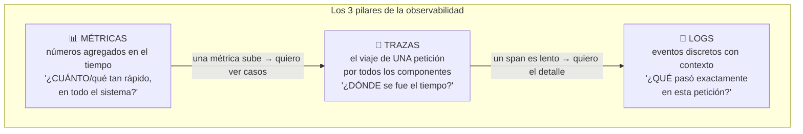

import Reto from "@components/Reto.astro";
import Solucion from "@components/Solucion.astro";
import Quiz from "@components/Quiz.astro";
import CheckDominio from "@components/CheckDominio.astro";
import Nivel from "@components/Nivel.astro";

<Nivel nivel="intermedio" />

Desplegaste algo en la [5.9](/fase-5-devops/5-9-despliegue/). Tiene usuarios reales (aunque sean tres). Y entonces, un martes, alguien te dice "la app está lenta". ¿Lenta para quién? ¿En qué endpoint? ¿Desde cuándo? ¿La base de datos, el LLM, la red? Si tu única respuesta es entrar por SSH y mirar `print()` sueltos, no tienes un sistema en producción: tienes una caja negra que a veces funciona. **Observabilidad es la diferencia entre "creo que es la base de datos" y "el span `buscar_contexto` tardó 2.1 s en el 4% de las peticiones del último cuarto de hora, todas del mismo `correlation_id`".** En esta lección instrumentas tu primer servicio desde cero con los tres pilares —logs, métricas, trazas—, OpenTelemetry como estándar, y aprendes a medir si tu sistema cumple lo que prometió (SLOs y error budgets). Esto **no es una fase tardía**: es un hilo que tejes desde el primer servicio y que en la Fase 6 será lo que conecte cada llamada a tu LLM con su costo, su latencia y sus evals.

:::tip[Si ya pusiste logs o un dashboard en producción]
¿Ya escribiste a un archivo de log, miraste un dashboard de Grafana, o conectaste algo a Datadog? Bien: tienes la intuición de "quiero ver qué pasa adentro". La trampa del que "ya lo tocó" es tratar la observabilidad como **tres herramientas separadas que se compran** (un sitio para logs, otro para métricas, otro para trazas) en vez de **un modelo coherente que se instrumenta una vez**. Señales de que copiaste sin entender: tus logs son `print()` con f-strings que nadie puede buscar ni filtrar; no puedes correlacionar un log con la petición que lo generó; confundes "monitoreo" (preguntas que ya sabías hacer) con "observabilidad" (poder responder preguntas que no anticipaste); y nunca definiste **cuánta** falla es aceptable (no tienes SLO, así que toda caída es una emergencia o ninguna lo es). Salta a los **ejercicios Primero-Sin-IA** (sección 7): el primero te hace instrumentar una cadena de llamadas con trazas + correlation ID y lo verifica un test; el segundo te hace calcular un error budget y decidir si congelar el deploy. Si los cierras y puedes explicar **por qué una traza distribuida responde lo que mil logs no**, valida con el check de dominio (sección 8).
:::

## 1. Qué vas a saber hacer

Al terminar, sin IA y sin notas, podrás:

- **O1 — Instrumentar un servicio** con los tres pilares: **structured logging** (JSON con un `correlation_id` que une todos los logs de una petición), **métricas RED** (con un counter y un histogram de OpenTelemetry) y **trazas** (spans anidados que forman el call-chain), explicando qué pregunta responde cada pilar y por qué ninguno reemplaza a otro.
- **O2 — Explicar el trade-off** entre observabilidad y costo/ruido: por qué se hace **sampling**, por qué la **cardinalidad** de las etiquetas explota los costos, y por qué **nunca** se registran secretos ni PII en logs o spans (OWASP).
- **O3 — Diseñar un SLO con su error budget**: dada una tasa de error medida, calcular cuánto presupuesto de falla queda, decidir si se puede desplegar o hay que congelar, y distinguir RED (servicios) de USE (recursos) para elegir qué alertar.

## 2. Por qué importa (el dinero está aquí)

> 💰 **Por qué importa:** la observabilidad es lo que separa a quien "hace que corra en su máquina" de quien **opera software para otros**. En las ofertas de la banda que persigues aparece como *logging estructurado*, *monitoring*, *Datadog/Grafana/Prometheus*, *distributed tracing* y, cada vez más, *OpenTelemetry* como estándar neutral. Pero el premio real está más adelante: en 2026, **un sistema de IA sin observabilidad es injugable en producción**. Cuando tu agente encadena cinco llamadas a un LLM y una alucina, o cuando tu factura de tokens se triplica de un día para otro, la **traza del call-chain** —con tokens, latencia y costo por paso— es la única forma de saber qué pasó. Esa misma traza es de donde salen los datasets de evals (Fase 6). El candidato que llega a la entrevista diciendo "instrumento con OpenTelemetry desde el primer servicio, correlaciono logs con trazas, y mido mis agentes con SLOs de costo por petición" está describiendo exactamente el trabajo de un AI/Automation Engineer semi-senior. El que dice "pongo prints y los miro en la consola" describe el de un junior.

Tres razones la vuelven una bisagra de carrera:

1. **La historia de falla en producción es tu mejor activo de portafolio.** El [track de empleabilidad](/track-0-empleabilidad/) te pedirá un post-mortem público real: romper algo en producción, diagnosticarlo y contarlo. **No puedes diagnosticar lo que no instrumentaste.** La observabilidad es el prerrequisito técnico de esa narrativa de semi-senior que el 90% de los portafolios "solo-homelab" no tiene.
2. **Es el sistema nervioso de toda la Fase 6 y 7.** Los evals de IA, el costo/latencia por petición, el techo de gasto de un agente, la trazabilidad "este score salió de este prompt con este modelo": todo cuelga de las trazas que aprendes a emitir aquí. Instrumentar bien ahora paga intereses en cada lección de IA.
3. **OpenTelemetry te desacopla del proveedor.** Aprender un SDK propietario te casa con una factura. Aprender OTel —el estándar vendor-neutral— significa que instrumentas **una vez** y exportas a Grafana, Datadog, Azure Monitor o un colector local sin reescribir nada. Es la apuesta correcta de mercado.

## 3. Lo que ya traes (actívalo)

Esta lección ensambla hilos que ya tienes. Recupéralos antes de seguir:

- De [`2.12` Debugging y código legado](/fase-2-ingenieria/2-12-debugging-codigo-legado/): la diferencia entre `print()` y **logging estructurado**. Aquí la llevamos a producción: el log deja de ser texto para humanos y pasa a ser **datos que una máquina filtra**.
- De [`3.8` Backend con FastAPI](/fase-3-backend/3-8-backend-fastapi/): el servicio que instrumentamos es justo este. Vas a añadirle un middleware y a envolver sus funciones en spans, sin cambiar su lógica.
- De [`3.14` Idempotencia y resiliencia](/fase-3-backend/3-14-idempotencia-resiliencia/): los reintentos, timeouts y circuit breakers que pusiste **necesitan métricas para saber si se están disparando**. Resiliencia sin observabilidad es volar a ciegas.
- De [`5.2` 12-factor](/fase-5-devops/5-2-12-factor/): el factor XI ("logs como flujo de eventos") dice que la app **escribe a stdout** y el entorno se encarga de recolectarlos. Eso es exactamente lo que haremos: la app no abre archivos ni gestiona rotación; emite JSON a stdout.
- De [`5.3` CI/CD](/fase-5-devops/5-3-cicd-github-actions/) y [`5.9` Despliegue](/fase-5-devops/5-9-despliegue/): lo que desplegaste es lo que ahora hay que poder observar.

Antes de seguir, responde de memoria:

<Quiz
  question="En la 5.2 aprendiste que una app 12-factor trata los logs como un 'flujo de eventos' y los escribe a stdout. ¿Por qué eso encaja con la observabilidad y no es solo una convención arbitraria?"
  options={[
    "Porque escribir a stdout es más rápido que escribir a un archivo",
    "Porque la app no debe preocuparse de DÓNDE terminan los logs (archivo, agregador, búsqueda): solo emite eventos estructurados a stdout y el entorno los enruta. Eso desacopla la app de la infraestructura de observabilidad y permite cambiar de backend sin tocar código",
    "Porque stdout cifra los logs automáticamente y protege los secretos",
  ]}
  answer={1}
  explanation="El factor XI separa la responsabilidad de EMITIR un evento (de la app) de la de RECOLECTARLO y ALMACENARLO (del entorno). La app escribe JSON a stdout; en local lo lees en consola, en producción un colector lo manda a tu backend. Mismo código, distinto destino. Y stdout NO cifra nada: por eso jamás se loguean secretos."
/>

## 4. Ejemplo resuelto, pensado en voz alta

Vamos a instrumentar, de cero, un servicio que recibe una pregunta, busca contexto en una base de datos y llama a un LLM —el esqueleto de cualquier app de IA que construirás en la Fase 6. Razono cada decisión como me oirías al lado tuyo. **No lo leas como código para copiar: léelo como un modelo mental que se arma pieza por pieza.**

### 4.1 Los tres pilares: qué pregunta responde cada uno

Antes de tocar código, el mapa. La observabilidad moderna se apoya en tres tipos de telemetría. No son intercambiables: cada uno responde una pregunta distinta.



Razono el mapa: *"Las **métricas** son baratas y agregadas: 'el p99 de latencia subió a 2 s', 'la tasa de error está en 3%'. Te dicen **que** algo va mal y son lo que alertas. Pero una métrica no te dice **cuál** petición ni **por qué**. Ahí entra la **traza**: el recorrido de una petición concreta atravesando cada función/servicio, con cuánto tardó cada paso. Te dice **dónde** se fue el tiempo. Y cuando un paso de la traza se ve raro, el **log** te da el detalle: el evento exacto, el mensaje de error, el `user_id`, el `correlation_id`. El flujo de un incidente real es métrica → traza → log: de lo agregado a lo específico."*

> **Monitoreo vs observabilidad (no son sinónimos):** *monitoreo* es vigilar preguntas que **ya sabías** hacer (¿está arriba el servicio? ¿CPU sobre 80%?). *Observabilidad* es poder responder preguntas que **no anticipaste** ("¿por qué este usuario específico, solo en este endpoint, solo desde ayer, ve respuestas vacías?") sin desplegar código nuevo. Las métricas son sobre todo monitoreo; las trazas y los logs ricos te dan observabilidad.

### 4.2 Pilar 1 — Structured logging: el log deja de ser texto

El primer cambio mental: un log no es una frase para que la lea un humano en una terminal. Es un **evento con campos** que una máquina va a filtrar, agrupar y buscar entre millones. Compara:

```python
# ❌ Log "para humanos": imposible de filtrar a escala
print(f"Usuario {user_id} consultó la despensa y tardó {ms} ms")

# ✅ Log estructurado: cada dato es un campo consultable
log.info("consulta_despensa", user_id=user_id, duracion_ms=ms)
# salida → {"event": "consulta_despensa", "user_id": 42, "duracion_ms": 318, ...}
```

Razono: *"Con el `print`, para encontrar 'todas las consultas de más de 500 ms del usuario 42' tendría que hacer parsing de strings con regex —frágil y lento. Con el log estructurado, son dos filtros sobre campos: `event = consulta_despensa AND duracion_ms > 500 AND user_id = 42`. En producción, esto es la diferencia entre encontrar el problema en 30 segundos o en 3 horas."* Usamos `structlog`, el estándar de facto en Python:

```python
# telemetria.py — configuración de logging (se importa una vez al arrancar)
import logging
import structlog

def configurar_logs() -> None:
    structlog.configure(
        processors=[
            structlog.contextvars.merge_contextvars,      # inyecta el correlation_id (ver 4.3)
            structlog.processors.add_log_level,            # añade "level": "info"/"error"
            structlog.processors.TimeStamper(fmt="iso", utc=True),  # "timestamp": "2026-..."
            structlog.processors.dict_tracebacks,          # excepciones como datos, no como string
            structlog.processors.JSONRenderer(),           # render final → una línea JSON
        ],
        wrapper_class=structlog.make_filtering_bound_logger(logging.INFO),
        cache_logger_on_first_use=True,
    )

log = structlog.get_logger()
```

Razono los procesadores, porque cada uno responde a una necesidad: *"Un **processor** es una función en una tubería: cada log pasa por todos en orden y cada uno añade o transforma campos. `merge_contextvars` es el que trae el `correlation_id` que voy a explicar enseguida. `TimeStamper` en **UTC e ISO** porque tus servidores pueden estar en distintas zonas y necesitas ordenar eventos de varios a la vez. `dict_tracebacks` convierte una excepción en un objeto JSON con frames y variables —no en un string que no puedes consultar. Y `JSONRenderer` al final emite **una línea de JSON por evento**: eso es lo que tu agregador de logs ingiere. En desarrollo cambiarías ese último por `ConsoleRenderer` para leerlo bonito y a color; mismo pipeline, distinto render."*

### 4.3 El correlation ID: el hilo que une los logs de una petición

Aquí está la pieza que vuelve útiles los logs en un sistema concurrente. En producción, **decenas de peticiones se procesan a la vez**: sus logs se intercalan en stdout como un mazo de cartas barajadas. Sin un identificador, no puedes reconstruir "qué pasó en *esta* petición". El **correlation ID** (o request ID) es un identificador único por petición que **todos** los logs de esa petición llevan. Lo generas una vez al entrar y lo propagas con `contextvars` —el mecanismo de Python para datos con alcance de tarea, seguro en async:

```python
# middleware.py — se ejecuta en CADA petición, antes que tu endpoint
import uuid
import structlog
from opentelemetry import trace
from starlette.middleware.base import BaseHTTPMiddleware

log = structlog.get_logger()

class CorrelationIdMiddleware(BaseHTTPMiddleware):
    async def dispatch(self, request, call_next):
        # 1) reusa el ID que venga del cliente, o genera uno nuevo
        cid = request.headers.get("X-Request-ID") or uuid.uuid4().hex
        # 2) lo ata al contexto: desde aquí, TODO log de esta petición lo lleva
        structlog.contextvars.bind_contextvars(correlation_id=cid)
        try:
            response = await call_next(request)
        finally:
            structlog.contextvars.clear_contextvars()  # limpiar para no filtrar al siguiente
        response.headers["X-Request-ID"] = cid          # devuélvelo: el cliente puede citarlo
        return response
```

Razono: *"Ato el `correlation_id` una sola vez, en el middleware, antes de que corra mi código. De ahí en adelante, cualquier `log.info(...)` en cualquier función de esa petición lo incluye automáticamente —porque el processor `merge_contextvars` lo lee del contexto. No tengo que pasar el `cid` como parámetro a cada función: sería ruido y se me olvidaría. Cuando un usuario reporta un error y me da el `X-Request-ID` de la respuesta, filtro `correlation_id = ese-valor` y veo **exactamente** la secuencia de eventos de su petición, aislada de las otras cincuenta que corrían a la vez."*

> **Logs ⇄ trazas:** un truco profesional es **usar el `trace_id` de OpenTelemetry como correlation ID**, así un log salta directo a su traza y viceversa. Lo obtienes con `trace.get_current_span().get_span_context().trace_id`. Por claridad aquí mantengo un `cid` propio, pero en producción lo derivarías del span activo cuando exista.

### 4.4 Pilar 2 — Trazas: el call-chain que importa para la IA

Las trazas son el pilar que más rinde en sistemas de IA. Una **traza** es el recorrido completo de una petición; un **span** es un tramo de ese recorrido (una operación con inicio, fin y atributos). Los spans se **anidan**: el span de tu endpoint es el padre; el de "buscar en la base de datos" y el de "llamar al LLM" son hijos. El resultado es un árbol que muestra, visualmente, **dónde se fue el tiempo**.

Primero la configuración (igual de simple que la de logs):

```python
# telemetria.py (continuación)
from opentelemetry import trace
from opentelemetry.sdk.resources import Resource
from opentelemetry.sdk.trace import TracerProvider
from opentelemetry.sdk.trace.export import BatchSpanProcessor, ConsoleSpanExporter

def configurar_trazas() -> None:
    recurso = Resource.create({"service.name": "api-despensa"})   # identifica TU servicio
    provider = TracerProvider(resource=recurso)
    # En local: imprime los spans a la consola para que los VEAS.
    # En prod: cambias ConsoleSpanExporter por OTLPSpanExporter(endpoint="...") → Grafana/Datadog/etc.
    provider.add_span_processor(BatchSpanProcessor(ConsoleSpanExporter()))
    trace.set_tracer_provider(provider)
```

Razono la elección de exporter: *"`ConsoleSpanExporter` me deja **ver** los spans mientras aprendo —cada uno se imprime al cerrarse, con sus atributos. En producción cambio una sola línea por `OTLPSpanExporter`, que habla el protocolo **OTLP** (el estándar de OpenTelemetry) hacia un colector. Esa es la promesa de OTel: mi código de instrumentación **no cambia**; solo cambia a dónde se exporta. Y uso `BatchSpanProcessor` —no `Simple`— porque agrupa y manda los spans en lotes en un hilo aparte: no quiero que emitir telemetría frene la respuesta al usuario."*

Ahora instrumento la cadena de llamadas. Fíjate cómo cada función abre su span y le cuelga **atributos** que serán oro cuando algo falle:

```python
# servicio.py
from opentelemetry import trace
import structlog

tracer = trace.get_tracer("api-despensa")
log = structlog.get_logger()

def responder(pregunta: str) -> dict:
    # span PADRE: el recorrido completo de la petición
    with tracer.start_as_current_span("responder") as span:
        span.set_attribute("pregunta.longitud", len(pregunta))
        log.info("inicio_consulta")                       # lleva el correlation_id solo
        contexto = buscar_contexto(pregunta)              # → span hijo
        respuesta = generar_respuesta(pregunta, contexto) # → span hijo
        log.info("fin_consulta", chars_respuesta=len(respuesta))
        return {"respuesta": respuesta}

def buscar_contexto(pregunta: str) -> str:
    with tracer.start_as_current_span("buscar_contexto") as span:
        span.set_attribute("db.system", "postgresql")
        # ... consulta real a la BD ...
        filas = 3
        span.set_attribute("db.filas_devueltas", filas)
        return "contexto recuperado"

def generar_respuesta(pregunta: str, contexto: str) -> str:
    with tracer.start_as_current_span("generar_respuesta") as span:
        span.set_attribute("gen_ai.request.model", "claude-sonnet-4-5")
        # ... llamada real al LLM ...
        tokens_in, tokens_out = 1200, 340
        # ESTOS atributos son los que en Fase 6 conectan traza ⇄ costo ⇄ evals:
        span.set_attribute("gen_ai.usage.input_tokens", tokens_in)
        span.set_attribute("gen_ai.usage.output_tokens", tokens_out)
        span.set_attribute("gen_ai.usage.cost_usd", round(tokens_in * 3e-6 + tokens_out * 1.5e-5, 6))
        return "respuesta generada"
```

Razono el anidamiento, que es lo no-obvio: *"`start_as_current_span` hace dos cosas: crea el span **y** lo pone como 'el span actual' del contexto. Por eso, cuando `responder` llama a `buscar_contexto` y este abre su propio span, OTel lo cuelga **automáticamente** como hijo del span actual —no tengo que pasar el padre a mano. Así se arma el árbol solo. El resultado, al exportarlo, es una traza donde veo: `responder` (450 ms) → `buscar_contexto` (40 ms) + `generar_respuesta` (405 ms). De un vistazo sé que el cuello de botella es el LLM, no la base de datos."*

Y razono los atributos del LLM, que son la conexión con la Fase 6: *"Le cuelgo al span del LLM los **tokens de entrada/salida y el costo en USD**. Cuando en la Fase 6 tu factura se dispare o un agente entre en un loop caro, vas a `agrupar por modelo, sumar cost_usd` sobre tus trazas y verás exactamente de dónde sale el gasto. Y cuando armes evals, **cada traza es un caso del dataset**: la pregunta, el contexto recuperado, la respuesta y su costo, todo junto. La observabilidad de hoy es la materia prima de los evals de mañana."*

```mermaid
gantt
    title Traza de UNA petición (lo que ves en el visor)
    dateFormat X
    axisFormat %L ms
    section responder (450 ms)
    responder            :0, 450
    section hijos
    buscar_contexto      :0, 40
    generar_respuesta    :45, 450
```



### 4.5 Auto-instrumentación: lo que no tienes que escribir a mano

Escribir spans a mano para *todo* sería tedioso. OpenTelemetry ofrece **instrumentación automática** para frameworks comunes: con una línea, FastAPI emite un span por cada petición HTTP (con método, ruta, status code, duración) sin que toques tus endpoints.

```python
# main.py
from fastapi import FastAPI
from opentelemetry.instrumentation.fastapi import FastAPIInstrumentor
from telemetria import configurar_logs, configurar_trazas
from middleware import CorrelationIdMiddleware

configurar_logs()
configurar_trazas()

app = FastAPI()
app.add_middleware(CorrelationIdMiddleware)
FastAPIInstrumentor.instrument_app(app)   # ← spans automáticos por petición HTTP
```

Razono la división de trabajo: *"La auto-instrumentación me da el span 'de borde' gratis: el HTTP server span con su ruta y su status. Mis spans manuales (`buscar_contexto`, `generar_respuesta`) cuelgan **debajo** de ese span automático, porque comparten el contexto. Regla práctica: **auto-instrumenta los bordes** (HTTP, base de datos, cliente HTTP) y **escribe spans manuales para tu lógica de negocio** —los pasos que solo tú sabes que importan, como cada llamada al LLM. Lo de fuera es estándar; lo de dentro es tu dominio."*

### 4.6 Pilar 3 — Métricas: RED y USE

Las trazas y los logs son por-petición; las **métricas** son agregadas y baratas, y son lo que **alertas**. Dos vocabularios estándar te dicen *qué* medir según *qué* observas:

| Método | Para qué | Las tres señales |
|---|---|---|
| **RED** | **Servicios** (tu API, tu endpoint) | **R**ate (peticiones/s), **E**rrors (fallos/s), **D**uration (latencia) |
| **USE** | **Recursos** (CPU, memoria, disco, pool de conexiones) | **U**tilization (% en uso), **S**aturation (cola de espera), **E**rrors |

Razono cuándo cada uno: *"RED responde '¿cómo le va a los que usan mi servicio?' —es la mirada del **usuario**. USE responde '¿cómo están mis recursos?' —es la mirada de la **máquina**. Cuando la **D**uration de RED sube (los usuarios sufren), miras la **S**aturation de USE (¿el pool de conexiones a la BD está lleno y la gente hace cola?) para encontrar la causa. Son complementarios: RED detecta el síntoma, USE suele tener la causa."*

Las métricas RED, con la API de métricas de OpenTelemetry, son un **counter** (cuenta peticiones y errores) y un **histogram** (distribución de latencias, de donde sale el p50/p95/p99):

```python
# telemetria.py (métricas)
from opentelemetry import metrics
from opentelemetry.sdk.metrics import MeterProvider
from opentelemetry.sdk.metrics.export import ConsoleMetricExporter, PeriodicExportingMetricReader

def configurar_metricas() -> None:
    lector = PeriodicExportingMetricReader(ConsoleMetricExporter(), export_interval_millis=10_000)
    metrics.set_meter_provider(MeterProvider(metric_readers=[lector]))

meter = metrics.get_meter("api-despensa")
peticiones = meter.create_counter("http.server.requests", unit="1", description="RED: Rate + Errors")
latencia = meter.create_histogram("http.server.duration", unit="ms", description="RED: Duration")

# en el middleware, al terminar la petición:
#   peticiones.add(1, {"http.route": ruta, "http.response.status_code": status})
#   latencia.record(ms, {"http.route": ruta})
```

Razono por qué un histogram y no un promedio: *"Si reporto la latencia **promedio**, miento. Un promedio de 200 ms puede esconder que el 5% de mis usuarios espera 4 segundos —el promedio los diluye. Por eso uso un **histogram**: me da **percentiles**. El p99 = 'el 99% de las peticiones fue más rápida que esto' es lo que de verdad sienten tus peores casos. Los SLOs se escriben sobre percentiles (p95/p99), nunca sobre promedios."*

:::caution[Cuidado con la cardinalidad: es donde explotan los costos]
Fíjate que las etiquetas de mis métricas son `http.route` (`/consulta`, `/salud`: poquísimos valores) y `status_code` (un puñado). **Nunca** etiqueto una métrica con `user_id`, `correlation_id` o la pregunta del usuario. Cada combinación única de etiquetas crea una **serie temporal** nueva; un `user_id` con un millón de valores crea un millón de series. Eso es la **explosión de cardinalidad**: tu backend de métricas se ahoga y tu factura se dispara. Regla: **dimensiones de baja cardinalidad en métricas** (ruta, status, región); el alto detalle (quién, qué pregunta) va en **logs y trazas**, donde sí pertenece.
:::

### 4.7 SLOs y error budgets: cuánta falla es aceptable

Instrumentaste. Ahora, ¿cómo sabes si tu sistema está *bien*? "Que nunca falle" es imposible y carísimo. La respuesta profesional es un **SLO** (Service Level Objective): un objetivo medible y explícito. Y su contracara, el **error budget**, es la genialidad operativa.

- **SLI** (Indicator): la métrica que mides. Ej: *% de peticiones con éxito (status 2xx) y latencia bajo 300 ms*.
- **SLO** (Objective): la meta sobre ese SLI. Ej: *99.9% de éxito en una ventana de 30 días*.
- **Error budget** (presupuesto de error): `100% - SLO`. Lo que **te permites** fallar. Si el SLO es 99.9%, tu budget es **0.1%** de las peticiones.

Razono por qué el budget cambia todo: *"Un SLO de 99.9% sobre 30 días significa que tienes permitido fallar el 0.1% del tiempo —son unos **43 minutos al mes** de error tolerado. Eso convierte la confiabilidad en una **cuenta corriente**: cada incidente 'gasta' del budget. ¿Para qué sirve? Para tomar decisiones sin pelear. Si **te sobra** budget, puedes desplegar features arriesgadas y mover rápido. Si lo **agotaste**, congelas features y todo el equipo se enfoca en estabilidad hasta que se recupere. El error budget alinea a los que quieren velocidad (devs) y a los que quieren estabilidad (ops): la decisión la toma el número, no el que grita más fuerte. Y mata el perfeccionismo tóxico: perseguir el 100% es perseguir un costo infinito por un valor marginal nulo."*

Veámoslo con números, que es justo lo que harás en el ejercicio 2:

```text
SLO de disponibilidad = 99.9% en 30 días
Peticiones en el mes   = 2.000.000
Error budget (0.1%)    = 2.000 peticiones que PUEDES fallar
Fallos ya ocurridos    = 1.400 peticiones (un incidente de ayer)
Budget restante        = 2.000 - 1.400 = 600 peticiones (30% del budget)
→ Decisión: queda budget, pero poco. Despliegues de bajo riesgo OK;
   congela los experimentales hasta fin de ventana.
```

## 5. Errores que vas a tener (y por qué)

:::caution[Podrías pensar que "tener logs" ya es observabilidad]
Logs sueltos sin estructura ni correlación son una caja de cartas barajadas. Observabilidad es poder **responder preguntas nuevas** sobre tu sistema: filtrar por campos, correlacionar un log con su traza, agrupar por dimensión. Un `print` no es consultable; mil `print` intercalados de cincuenta peticiones concurrentes son ruido. Lo que vuelve útiles los logs es: (1) que sean **estructurados** (campos, no frases), (2) que lleven un **correlation_id**, y (3) que se puedan unir a las **trazas**. Sin eso, tienes logging, no observabilidad.
:::

:::caution[Podrías pensar que las trazas y los logs son redundantes ("ambos cuentan qué pasó")]
Responden preguntas distintas. La **traza** te dice **dónde** se fue el tiempo y **cómo se anidaron** las operaciones —es estructura y latencia. El **log** te da el **detalle de un evento** —el mensaje, el valor, el stack trace. En un incidente real los usas juntos: la traza te lleva al span lento (`generar_respuesta`, 4 s), y el log de ese span te dice por qué (`{"event":"llm_timeout","retry":2}`). Uno es el mapa; el otro, la nota al pie. Quitar cualquiera te deja medio ciego.
:::

:::caution[Podrías pensar que más telemetría siempre es mejor]
Telemetría cuesta: dinero (ingesta y almacenamiento en tu backend), latencia (emitir tiene overhead) y ruido (un dashboard con 200 paneles no se mira). Por eso existe el **sampling**: en alto tráfico no guardas el 100% de las trazas, sino una muestra (p. ej. 10%) más, idealmente, **todas las que tienen error** (tail-based sampling). Y por eso cuidas la **cardinalidad**. La meta no es "registrar todo": es registrar **lo que te deja responder las preguntas que importan** al menor costo. Observabilidad es un problema de señal/ruido, no de volumen.
:::

:::caution[Podrías pensar que está bien loguear el request completo "por si acaso"]
Loguear el cuerpo entero de una petición es una de las filtraciones más comunes de la vida real: tokens de auth en headers, contraseñas, números de tarjeta, datos personales (PII). Eso viola OWASP (A09: Security Logging Failures), y a menudo el RGPD/leyes de datos. **Los logs y los spans se tratan como superficie de datos sensibles:** redacta o excluye secretos y PII *antes* de emitir, nunca el header `Authorization`, nunca el prompt completo si puede traer datos del usuario. "Por si acaso" es exactamente cómo una credencial termina en tu agregador de logs —al que tiene acceso medio equipo— para siempre.
:::

:::caution[Podrías pensar que un promedio de latencia describe bien tu servicio]
El promedio miente porque lo aplasta todo. Si 95 peticiones tardan 100 ms y 5 tardan 5 s, el promedio (~345 ms) no describe a nadie: ni a la mayoría rápida ni a la minoría que sufre. Usa **percentiles**: p50 (la mediana, el caso típico), p95 y p99 (tus peores casos, los que generan los tickets de soporte). Los SLOs se definen sobre p95/p99 justamente porque la cola —no el promedio— es lo que rompe la experiencia. "Latencia promedio buena" con "p99 horrible" es un sistema que parece sano en el dashboard y enfurece a usuarios reales.
:::

## 6. Práctica con andamiaje (que se desvanece)

Tres pasos, de más apoyo a menos. Hazlos **a mano primero**: en observabilidad, "ejecutar" es leer la instrumentación y predecir qué telemetría saldría.

### 6.1 PREDICT — ¿cuántos spans y cómo se anidan?

Lee este código **sin ejecutarlo** y responde abajo:

```python
tracer = trace.get_tracer("demo")

def a():
    with tracer.start_as_current_span("a"):
        b()
        c()

def b():
    with tracer.start_as_current_span("b"):
        pass

def c():
    with tracer.start_as_current_span("c"):
        d()

def d():
    with tracer.start_as_current_span("d"):
        pass

a()
```

1. ¿Cuántos spans se crean en total al llamar `a()`?
2. Dibuja el árbol: ¿quién es padre de quién?
3. Si `d()` tarda 2 s y todo lo demás es instantáneo, ¿qué spans aparecerán como "lentos" en el visor?

<Solucion title="Ver la respuesta (solo después de predecir)">
1. **Cuatro** spans: `a`, `b`, `c`, `d`.
2. Árbol: `a` es la raíz; `b` y `c` son hijos de `a` (se crean mientras `a` es el span actual); `d` es hijo de `c` (se crea mientras `c` es el span actual). `b` y `d` no tienen hijos.

```text
a
├── b
└── c
    └── d
```

3. **`d`** dura 2 s. Como la duración de un padre **incluye** la de sus hijos, `c` también mostrará ~2 s (espera a que `d` termine) y `a` también ~2 s (espera a `c`). En el visor verías la cascada `a (2s) → c (2s) → d (2s)`, lo que te lleva directo al culpable: `d`. `b` seguiría instantáneo. Esto es exactamente cómo localizas un cuello de botella: bajas por la rama que mantiene la duración.
</Solucion>

### 6.2 Parsons — ordena un log estructurado de calidad

Estos campos deberían estar en **un solo evento de log** de una llamada fallida al LLM. Pero uno de ellos **no debe estar ahí jamás**. Identifícalo y ordena el resto en un `log.error(...)` razonable:

```text
A. event="llm_error"
B. authorization_header="Bearer sk-ant-api03-xY..."
C. modelo="claude-sonnet-4-5"
D. correlation_id  (viene solo, vía contextvars)
E. error_tipo="RateLimitError"
F. reintento=2
```

<Solucion title="Ver la respuesta">
**El intruso es B**: `authorization_header` es un **secreto**. Loguearlo filtra tu credencial a quien tenga acceso a los logs, y queda ahí para siempre. Jamás se loguea un token, header de auth, contraseña ni PII (OWASP A09).

Un log correcto (D entra solo por `merge_contextvars`):

```python
log.error("llm_error", modelo="claude-sonnet-4-5", error_tipo="RateLimitError", reintento=2)
# salida → {"event":"llm_error","level":"error","correlation_id":"a1b2...",
#           "modelo":"claude-sonnet-4-5","error_tipo":"RateLimitError","reintento":2,"timestamp":"..."}
```

El `correlation_id` no se pasa a mano: ya está en el contexto. El `event` es un **nombre estable y consultable** (`llm_error`), no una frase variable —así puedes contar "cuántos `llm_error` por hora" sin parsear strings.
</Solucion>

### 6.3 MODIFY — arregla esta instrumentación con tres problemas

Este código "funciona" pero tiene **tres problemas reales** de observabilidad. Identifícalos y di cómo los arreglas (a mano, sin IA):

```python
contador = meter.create_counter("peticiones")

@app.middleware("http")
async def medir(request, call_next):
    inicio = time.perf_counter()
    response = await call_next(request)
    ms = (time.perf_counter() - inicio) * 1000
    # problema en las etiquetas:
    contador.add(1, {"user_id": request.headers.get("x-user"), "path": request.url.path})
    log.info(f"Petición a {request.url.path} tardó {ms} ms y devolvió {response.status_code}")
    return response
```

<Solucion title="Ver los tres problemas y el arreglo">
1. **Cardinalidad explosiva:** etiquetar la métrica con `user_id` crea una serie temporal por usuario → millones de series, backend ahogado, factura disparada. Arreglo: quita `user_id` de la métrica (va en logs/trazas); deja solo dimensiones de baja cardinalidad como `http.route` y `status_code`. Además, usa la **ruta con plantilla** (`/users/{id}`) y no el path crudo (`/users/42`, `/users/43`...), que también es alta cardinalidad.
2. **Log no estructurado:** el `log.info(f"...")` con f-string vuelve a meter los datos dentro de una frase imposible de filtrar. Arreglo: `log.info("peticion_http", ruta=request.url.path, duracion_ms=ms, status=response.status_code)` —cada dato un campo.
3. **No mide la latencia como métrica:** calcula `ms` pero solo lo mete en el log; no hay histogram, así que no tendrás percentiles ni podrás alertar por p99. Arreglo: añade `latencia.record(ms, {"http.route": ruta})` con un `create_histogram`. (Bonus si notaste que tampoco hay manejo del caso en que `call_next` lanza una excepción: el counter y la latencia no se registran ante un 500 —debería ir en un `try/finally`.)

El patrón: **métricas de baja cardinalidad + percentiles; el detalle por-petición en logs estructurados y trazas.**
</Solucion>

## 7. Ejercicios Primero-Sin-IA

Ahora sin andamiaje. Resuélvelos **a mano, sin IA** dentro del timebox. El primero se autocorrige con un test que inspecciona los spans que emites; el segundo se corrige por la **calidad de tu razonamiento** sobre SLOs y error budgets —justo lo que ninguna IA decide por ti.

<Reto title="Instrumenta el call-chain: trazas + correlation ID" timebox="40–45 min">

En la carpeta del ejercicio hay un `servicio.py` con tres funciones que forman una cadena de llamadas (`responder` → `buscar_contexto` → `generar_respuesta`) **sin instrumentar**, y un test (`test_observabilidad.py`) que captura los spans en memoria y verifica la estructura. No necesitas red ni un colector: todo corre local con `pytest`.

Tu trabajo: instrumentar las tres funciones para que emitan una traza correcta, sin cambiar su lógica.

1. Envuelve cada función en su **span** (`responder`, `buscar_contexto`, `generar_respuesta`) de modo que los dos últimos queden **anidados como hijos** de `responder`.
2. En el span raíz `responder`, pon el atributo **`correlation_id`** con el valor que recibe la función.
3. En el span `generar_respuesta`, pon los atributos **`gen_ai.usage.input_tokens`**, **`gen_ai.usage.output_tokens`** (enteros) y **`gen_ai.usage.cost_usd`** (float).
4. Añade **structured logging** con `structlog` (JSON): al menos un `log.info` de inicio y uno de fin, y que **lleven el `correlation_id`** (átalo con `bind_contextvars`). La función debe seguir devolviendo el mismo `dict` de antes.

Entregable: el `servicio.py` instrumentado. Corre `uv run pytest` hasta que esté verde, y `uv run python servicio.py` para **ver** tus logs JSON y tus spans en consola.

**Hecho significa:**
- [ ] `test_observabilidad.py` pasa: se crean los 3 spans, `buscar_contexto` y `generar_respuesta` son **hijos** de `responder`, y los atributos pedidos están presentes con el tipo correcto.
- [ ] Al ejecutar el módulo, ves **JSON estructurado** en stdout y cada log lleva el mismo `correlation_id`.
- [ ] La lógica original no cambió: `responder(...)` devuelve el `dict` con la clave `respuesta`.
- [ ] Puedes **explicar sin notas** por qué los spans hijos se anidan solos (sin pasar el padre a mano) y qué pregunta responde la traza que un log no responde.
- [ ] No logueas ningún secreto ni la pregunta cruda si pudiera traer PII.

Enunciado completo y starter: `ejercicios/fase-5/instrumentar-call-chain/` (carpeta del repo).

<Solucion title="Pista (ábrela solo si superaste el timebox)">
El patrón de cada función es idéntico: `with tracer.start_as_current_span("nombre") as span:` y dentro, `span.set_attribute("clave", valor)`. El anidamiento es **automático**: como `responder` ya tiene su span "actual" cuando llama a `buscar_contexto`, el span de esta cuelga solo debajo —no pasas ningún padre. Para el correlation ID en logs: `structlog.contextvars.bind_contextvars(correlation_id=cid)` una vez al inicio de `responder`, y el processor `merge_contextvars` (ya configurado en `telemetria.py`) lo inyecta en cada log. Abre el test: te dice **exactamente** qué nombres de span y qué claves de atributo espera —es tu spec. Pista, no solución.
</Solucion>

</Reto>

<Reto title="SLO, error budget y la decisión de desplegar" timebox="25–35 min">

Eres el ingeniero de guardia de la `api-despensa`. No hay código: es un ejercicio de **razonamiento operativo** (a mano, sin IA). En la carpeta del ejercicio hay un `README.md` con los datos y un `respuestas.md` para que escribas. Responde, **mostrando tus cálculos**:

1. **Define el SLI y el SLO.** Dada la meta "el 99.9% de las peticiones deben responder con éxito y bajo 300 ms en 30 días", escribe el SLI (qué mides exactamente) y el SLO (la meta). ¿Por qué el umbral va sobre el **p99** y no sobre el promedio?
2. **Calcula el error budget.** Con 2.000.000 de peticiones en la ventana de 30 días, ¿cuántas peticiones puedes fallar? Exprésalo también en **minutos de downtime** equivalentes.
3. **Decide.** Llevas 1.500 fallos este mes y quieres desplegar una feature experimental que históricamente causa incidentes. ¿La despliegas? Justifica con el budget restante (en peticiones y en %).
4. **RED vs USE.** El p99 de latencia se disparó. Nombra **una métrica RED** que te avisó del síntoma y **una métrica USE** que mirarías para encontrar la causa, y explica la relación entre ambas.
5. **Qué alertar.** De estas cuatro, ¿sobre cuál pondrías una alerta que despierte a alguien a las 3 AM, y por qué las otras tres no?: (a) CPU al 75%, (b) error budget consumido al 90% con quema acelerándose, (c) un log de nivel `warning`, (d) p50 de latencia en 80 ms.

**Hecho significa:**
- [ ] Distingues SLI (la medición) de SLO (la meta) de error budget (`100% - SLO`).
- [ ] El cálculo del budget es correcto (peticiones **y** minutos) y la decisión de desplegar se justifica con el número, no con intuición.
- [ ] Explicas RED (servicio/usuario) vs USE (recurso/máquina) y cómo el síntoma de uno lleva a la causa en el otro.
- [ ] Eliges alertar sobre el **síntoma que afecta al usuario / agota el budget**, no sobre causas sin impacto (CPU alta sin degradación es ruido).
- [ ] Puedes defender por qué perseguir el 100% de disponibilidad es una mala decisión de ingeniería.

Enunciado completo y plantilla: `ejercicios/fase-5/slo-error-budget/` (carpeta del repo).

<Solucion title="Pista (ábrela solo si superaste el timebox)">
Para (2): el budget es `(100% - 99.9%) = 0.1%` de 2.000.000 = 2.000 peticiones. Para los minutos: 30 días = 43.200 minutos; el 0.1% son ~43 minutos. Para (3): budget restante = 2.000 − 1.500 = 500 peticiones (25% del budget) → queda poco; una feature que "históricamente causa incidentes" puede agotarlo. Piensa en términos de cuenta corriente: ¿gastarías el 25% que te queda en algo riesgoso? Para (5): la regla es **alertar sobre síntomas, no sobre causas**; CPU al 75% sin degradación de servicio no despierta a nadie (puede ser normal), pero un budget quemándose rápido sí —es la promesa al usuario rompiéndose. Pista, no solución.
</Solucion>

</Reto>

## 8. Check de dominio

Sin mirar la lección, en voz alta o por escrito:

<CheckDominio
  items={[
    "Nombrar los 3 pilares (logs, métricas, trazas) y qué pregunta responde cada uno (qué pasó / cuánto-qué tan rápido / dónde se fue el tiempo).",
    "Explicar la diferencia entre monitoreo (preguntas conocidas) y observabilidad (responder preguntas nuevas sin desplegar).",
    "Explicar qué es un correlation ID, cómo se propaga (contextvars) y qué problema resuelve en un sistema concurrente.",
    "Explicar por qué los spans hijos se anidan automáticamente bajo el span actual y qué muestra el árbol de una traza.",
    "Decir qué atributos del span de un LLM conectan la traza con el costo y los evals de la Fase 6 (tokens y costo por paso).",
    "Distinguir RED (servicios) de USE (recursos) y dar un ejemplo de cómo el síntoma de uno lleva a la causa del otro.",
    "Definir SLI, SLO y error budget, y explicar cómo el budget decide si se despliega o se congela.",
    "Explicar por qué se usa el p99 y no el promedio, y por qué no se etiquetan métricas con user_id (cardinalidad).",
    "Explicar por qué jamás se loguea un secreto/PII y a qué riesgo de OWASP corresponde.",
  ]}
/>

Si marcaste menos de siete, vuelve a la sección correspondiente **antes** de avanzar. No es un examen: es honestidad contigo.

<Quiz
  question="Las métricas te avisan que el p99 de latencia de /consulta subió a 3 s. ¿Cuál es la secuencia correcta para encontrar la causa?"
  options={[
    "Leer todos los logs del servicio en orden cronológico hasta encontrar algo raro",
    "Ir de lo agregado a lo específico: la MÉTRICA te dio el síntoma → abres TRAZAS de peticiones lentas de /consulta para ver QUÉ span se llevó el tiempo → lees los LOGS de ese span (por su correlation_id) para el detalle del porqué",
    "Subir la CPU del servidor, que seguro es el problema",
  ]}
  answer={1}
  explanation="El flujo de un incidente es métrica → traza → log. La métrica detecta QUE algo va mal (síntoma agregado). La traza te dice DÓNDE se fue el tiempo en una petición concreta (qué span). El log te da el detalle de ese evento. Leer todos los logs a ciegas no escala; subir la CPU es disparar sin diagnóstico."
/>

<Quiz
  question="Tu SLO es 99.95% de disponibilidad en 30 días. Llevas el mes consumiendo el budget muy lento (queda 80%). El equipo quiere desplegar una feature grande y arriesgada. ¿Qué dice la filosofía de error budgets?"
  options={[
    "Congelar: cualquier riesgo es inaceptable si hay un SLO",
    "Adelante: con 80% de budget disponible, justamente PARA eso existe el presupuesto: para gastarlo moviéndote rápido. Si lo agotas, entonces congelas y estabilizas",
    "El error budget no aplica a features nuevas, solo a incidentes de infraestructura",
  ]}
  answer={1}
  explanation="El error budget existe para ser GASTADO en velocidad cuando hay margen. Tener budget de sobra y no usarlo es ser tan conservador como perseguir el 100%: dejas valor sobre la mesa. La regla es simétrica: budget disponible → muévete rápido; budget agotado → congela y estabiliza. La decisión la toma el número, no el miedo."
/>

## 9. Recursos (documentación oficial primero)

- **OpenTelemetry — documentación oficial:** [opentelemetry.io/docs](https://opentelemetry.io/docs/) — el estándar vendor-neutral; conceptos de traces, metrics y logs.
- **OpenTelemetry Python:** [opentelemetry-python.readthedocs.io](https://opentelemetry-python.readthedocs.io/en/stable/) — SDK, `TracerProvider`, exporters y la API de spans/métricas que usaste.
- **Instrumentación de FastAPI:** [opentelemetry-python-contrib (instrumentation/fastapi)](https://github.com/open-telemetry/opentelemetry-python-contrib/tree/main/instrumentation/opentelemetry-instrumentation-fastapi) — `FastAPIInstrumentor.instrument_app`.
- **structlog:** [structlog.org](https://www.structlog.org/en/stable/) — configuración, processors, `contextvars` y renderers (JSON vs consola).
- **Google SRE Book — SLOs y error budgets:** [sre.google/sre-book/service-level-objectives](https://sre.google/sre-book/service-level-objectives/) y [Embracing Risk](https://sre.google/sre-book/embracing-risk/) — la fuente canónica de SLI/SLO/budget.
- **Métricas RED y USE:** [The RED Method (Grafana)](https://grafana.com/blog/2018/08/02/the-red-method-how-to-instrument-your-services/) y [The USE Method (Brendan Gregg)](https://www.brendangregg.com/usemethod.html).
- **OWASP A09 — Security Logging and Monitoring Failures:** [owasp.org/Top10/A09](https://owasp.org/Top10/A09_2021-Security_Logging_and_Monitoring_Failures/) — qué loguear y qué jamás.

## 10. Conexión con el capstone de la fase

El **[Capstone F5 — Pipeline completo a producción](/fase-5-devops/proyecto/)** exige, en su Definition of Done, **observabilidad instrumentada**: structured logs + correlation IDs + trazas (OTel). Lo que armaste aquí **es** ese entregable. En concreto, esta sub-unidad te deja listo para:

- Instrumentar el servicio que desplegaste con **usuarios reales (≥3)**: cada petición de tu pareja o tus amigos genera una traza con su `correlation_id`. Cuando uno reporte un bug, lo diagnosticarás por su `X-Request-ID`, no adivinando.
- Tener **métricas RED** y un **SLO con error budget** definidos —el inicio de la "historia de falla en producción" que el [track de empleabilidad](/track-0-empleabilidad/) te pedirá: no puedes hacer un post-mortem de algo que no instrumentaste.
- Sembrar el hilo que **explota en la Fase 6**: la traza del call-chain con tokens/latencia/costo por paso es exactamente lo que en [AI Engineering](/fase-6-ai-engineering/) conecta tu LLM con sus evals (cada traza = un caso de dataset) y con su budget de costo/latencia. Y en [Automatización](/fase-7-automatizacion/), es lo que vuelve auditable a un agente que ejecuta acciones.

## 11. Reflexión y repaso espaciado

Cierra escribiendo dos o tres frases respondiendo: **en el ejercicio 1, ¿en qué momento entendiste que la traza te dice algo que los logs por sí solos no?** Nombrar esa diferencia —estructura y latencia (traza) vs detalle de un evento (log)— es medir lo que de verdad incorporaste, no lo que copiaste.

Gancho de **spaced repetition**:

- **Mañana:** reescribe **de memoria** (sin abrir esta página) el patrón de instrumentar una función con un span y dos atributos, y explica en voz alta por qué los hijos se anidan solos. Si dudas, vuelve a la sección 4.4.
- **En 3 días:** toma una latencia inventada (2.000.000 de peticiones, SLO 99.9%, 1.800 fallos) y calcula de memoria el error budget restante y la decisión. Si te traba, repasa la 4.7.
- **En 1 semana:** instrumenta con OTel + structlog **un endpoint de tu API de la Fase 3** (o de HomeBase): un span manual, un correlation ID en los logs, y una métrica RED. Cronométralo: la segunda vez deberías tardar menos de 20 minutos. Eso es tener el hilo de observabilidad como **hábito**, no como tema.
