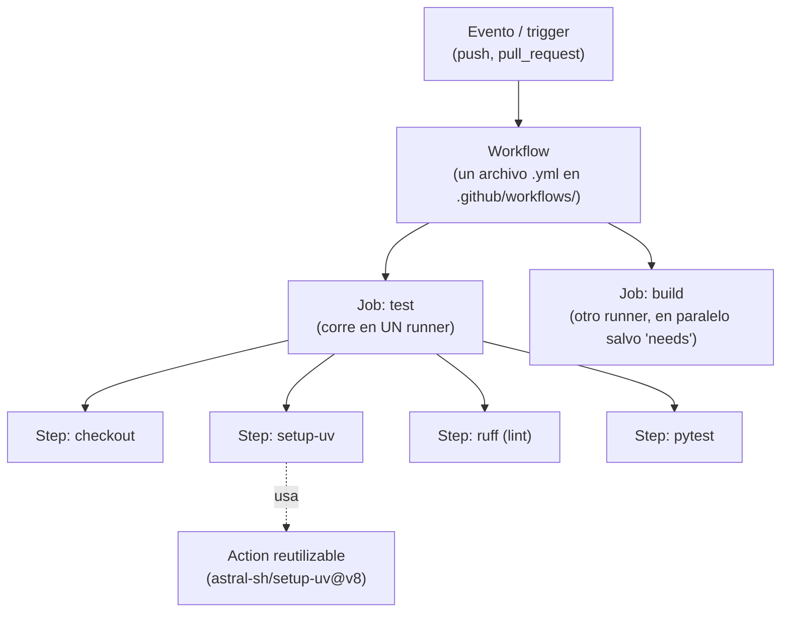
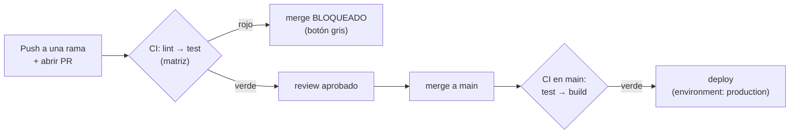

import Reto from "@components/Reto.astro";
import Solucion from "@components/Solucion.astro";
import Quiz from "@components/Quiz.astro";
import CheckDominio from "@components/CheckDominio.astro";
import Nivel from "@components/Nivel.astro";

<Nivel nivel="intermedio" />

Escribiste tests en la [Fase 2](/fase-2-ingenieria/) y aprendiste el flujo de PRs en la [2.13](/fase-2-ingenieria/2-13-colaboracion-spec-driven-adrs/). Pero hay una grieta entre "mis tests pasan en mi máquina" y "el equipo puede confiar en cada merge": tu máquina tiene tu versión de Python, tus variables de entorno, tu `node_modules` de hace tres semanas. **"Corre en mi máquina" no es una garantía: es una anécdota.** CI/CD cierra esa grieta. En esta lección montas, desde cero, un robot que en **cada push y cada PR** clona tu repo en una máquina limpia, instala todo desde su `lockfile`, corre el linter y los tests, y —si algo está rojo— **impide que el código entre a `main`**. Pasas de "espero que funcione" a "no se mergea hasta que el pipeline lo demuestre".

:::tip[Si ya configuraste un pipeline (Flutter multi-flavor, n8n, lo que sea)]
¿Ya tocaste un `.yml` de CI, o armaste builds multi-flavor en Flutter? Bien: tienes la intuición de "una máquina corre comandos por mí". La trampa del que "ya lo usó" es haberlo hecho **copiando un YAML que funcionó** sin entender la jerarquía (workflow → job → step), por qué un job corre en paralelo y otro espera, dónde va un secret vs un environment, y —el error más caro— **creer que el archivo de workflow bloquea el merge** (no lo hace; lo hace la *branch protection*). Salta a los **ejercicios Primero-Sin-IA** (sección 7): el primero te hace escribir un `ci.yml` desde cero que pase un test estructural; el segundo te hace razonar la matriz, la caché, el gate y el trade-off de costo. Si los cierras y puedes explicar **qué bloquea de verdad un merge roto**, valida con el check de dominio (sección 8). Si te descubres pensando "el `if:` del deploy es lo que protege `main`", el problema está en la sección 5.
:::

## 1. Qué vas a saber hacer

Al terminar, sin IA y sin notas, podrás:

- **O1 — Implementar un workflow de GitHub Actions** que, en cada `push` y cada `pull_request`, corra el pipeline **lint → test** sobre un runner con **caché de dependencias**, explicando la jerarquía **workflow → job → step → action** y qué hace cada nivel.
- **O2 — Configurar un pipeline completo**: una **matriz** de versiones, dependencias entre jobs (`needs`), un job de **deploy gated por rama** y un **environment** con un secret, distinguiendo un secret de repo de un secret de environment y para qué sirve cada uno.
- **O3 — Explicar el trade-off** de costo/latencia de una matriz y una caché, **y por qué el archivo de workflow por sí solo NO bloquea un merge** (lo hace la *branch protection* / *ruleset* con *required status checks*).

## 2. Por qué importa (el dinero está aquí)

> 💰 **Por qué importa:** CI/CD aparece en ~**32%** de las ofertas de la banda que persigues, y GitHub Actions es el estándar de facto en el mundo open-source y en la mayoría de las PyMEs y startups. No es un "nice to have": es **table stakes semi-senior**. Un junior entrega código; un semi-senior entrega código **con un pipeline que lo verifica solo** y un proceso donde *nadie* puede mergear algo roto a `main`. En 2026, con buena parte del código generado por IA, el cuello de botella se movió a **garantizar que lo generado es correcto y no rompe lo que ya existe** —y eso es, literalmente, lo que un pipeline de CI hace en cada PR. En una entrevista, "configuré un GitHub Actions que corre tests y bloquea merges rojos, con caché y matriz" es una frase que te sube de banda; "sé hacer commits" no.

Tres razones lo vuelven una bisagra de carrera:

1. **El entorno limpio atrapa lo que tu máquina esconde.** "Funciona en mi máquina" suele significar "funciona con una dependencia que instalé hace meses y olvidé poner en el `lockfile`". El runner de CI parte de cero **cada vez**: si tu proyecto no se instala y testea desde un repo recién clonado, CI lo grita antes de que llegue a producción.
2. **El gate de PR es donde la calidad deja de depender de la disciplina humana.** Acordar "siempre corran los tests antes de mergear" no escala: alguien, un viernes a las 7 PM, no los va a correr. Un *required status check* convierte ese acuerdo social en una **regla que la plataforma hace cumplir**: el botón de merge se queda gris hasta que el pipeline esté verde.
3. **Es el esqueleto de todo lo que viene en esta fase.** Los gates de seguridad ([5.4](/fase-5-devops/5-4-seguridad-supply-chain-ci/)), el build de tu imagen Docker ([5.1](/fase-5-devops/5-1-docker/)), el deploy ([5.9](/fase-5-devops/5-9-despliegue/)) y hasta los evals de IA (Fase 6) **cuelgan de este pipeline**. Aprenderlo bien aquí paga intereses en cada lección siguiente.

## 3. Lo que ya traes (actívalo)

Esta lección ensambla hilos que ya tienes. Recupéralos antes de seguir:

- De [`0.6` Git y GitHub](/fase-0-fundamentos/0-6-git-y-github/): `push`, ramas, PRs y el `commit-msg` hook. CI se **dispara** con esos eventos (`push`, `pull_request`); es el otro lado del mismo flujo.
- De [`1.6` Primer test con pytest](/fase-1-lenguajes/1-6-primer-test-pytest/) y [`2.7` TDD](/fase-2-ingenieria/2-7-tdd-obligatorio/): los tests que escribiste son **exactamente lo que CI corre**. CI es el `red-green` a nivel de equipo: el PR está "rojo" hasta que el pipeline pasa.
- De [`2.13` Colaboración + PRs](/fase-2-ingenieria/2-13-colaboracion-spec-driven-adrs/): el flujo issue → branch → PR → review → merge. CI añade el **check automático** que corre *durante* el PR y condiciona el merge.
- De [`5.1` Docker](/fase-5-devops/5-1-docker/) y [`5.2` 12-factor](/fase-5-devops/5-2-12-factor/): el `build` del pipeline construye tu imagen; el principio 12-factor de **config por entorno** (no hardcodear secretos) es justo lo que los `secrets` y `environments` de Actions resuelven.

Antes de seguir, responde de memoria:

<Quiz
  question="En la Fase 2 acordaste 'siempre correr los tests antes de mergear un PR'. ¿Por qué eso no basta y CI lo mejora?"
  options={[
    "No lo mejora: si el equipo es disciplinado, correr los tests a mano es equivalente",
    "Un acuerdo social depende de que cada persona se acuerde y quiera; CI lo corre automáticamente en cada PR sobre un entorno limpio, y un gate puede impedir el merge si está rojo — la calidad deja de depender de la voluntad humana",
    "CI corre los tests más rápido que tu máquina, esa es la única ventaja",
  ]}
  answer={1}
  explanation="El valor de CI no es velocidad: es que convierte un acuerdo frágil ('acuérdate de correr los tests') en una garantía de plataforma. Corre en un entorno limpio (atrapa el 'funciona en mi máquina') y, con un required status check, el merge queda bloqueado hasta que pase. La disciplina humana no escala; la automatización sí."
/>

## 4. Ejemplo resuelto, pensado en voz alta

Te voy a construir un pipeline **de cero**, razonando cada decisión como me oirías al lado tuyo. Empezamos por el vocabulario mínimo, luego un workflow real, y al final lo que de verdad bloquea un merge. **No lo leas como un YAML para copiar: léelo como un proceso de decisiones.**

### 4.1 El vocabulario: workflow → job → step → action

GitHub Actions tiene una jerarquía de cuatro niveles. Confundirlos es la causa #1 de YAML que no corre:



Razono el mapa mental: *"Un **workflow** es un archivo `.yml` que vive en `.github/workflows/`. Se dispara con un **evento** (alguien hace `push`, o abre un `pull_request`). Dentro tiene uno o más **jobs**; cada job arranca en su propio **runner** —una máquina virtual limpia que GitHub te presta— y, por defecto, **los jobs corren en paralelo** salvo que declares dependencias con `needs`. Cada job tiene **steps** en orden: un step o corre un comando de shell (`run:`) o usa una **action** (`uses:`), que es código empaquetado y reutilizable que alguien publicó (clonar el repo, instalar Python, etc.). Si tienes claro 'workflow contiene jobs, job contiene steps, step usa una action o corre un comando', el 80% del YAML deja de ser magia."*

### 4.2 El workflow mínimo que vale la pena: lint → test en cada PR

Este es el pipeline base de cualquier proyecto del curso (stack Python con `uv`, como en tus ejercicios). Lo escribo en `.github/workflows/ci.yml` y lo explico línea por línea:

```yaml
name: CI                              # nombre que verás en la pestaña "Actions"

on:                                   # QUÉ dispara este workflow
  push:
    branches: [main]                  # corre al pushear directo a main
  pull_request:                       # y en CADA PR (sin importar la rama destino)

permissions:
  contents: read                      # least privilege: este workflow solo LEE el repo

concurrency:                          # si llegan 2 pushes seguidos al mismo PR,
  group: ci-${{ github.ref }}         # cancela el run viejo y deja solo el último
  cancel-in-progress: true            # (ahorra minutos = ahorra plata)

jobs:
  test:                               # un solo job, lo llamamos "test"
    runs-on: ubuntu-latest            # el runner: una VM Ubuntu que GitHub provee
    steps:
      - uses: actions/checkout@v7     # 1) clona TU repo dentro del runner
      - uses: astral-sh/setup-uv@v8   # 2) instala uv (el gestor del curso)
        with:
          enable-cache: true          #    cachea las deps entre runs (más rápido/barato)
      - run: uv sync --frozen         # 3) instala EXACTO lo del lockfile (reproducible)
      - run: uv run ruff check .      # 4) LINT: estilo y errores estáticos
      - run: uv run pytest            # 5) TEST: la suite que escribiste en TDD
```

Razono cada bloque, porque cada línea responde a una pregunta:

- *"**`on:`** es el corazón. `push` a `main` y `pull_request` cubren los dos momentos que importan: cuando algo entra a la rama principal y —más importante— **mientras se propone entrar** (el PR). El check del PR es el que va a condicionar el merge."*
- *"**`permissions: contents: read`** es seguridad por defecto (lo profundizamos en la [5.4](/fase-5-devops/5-4-seguridad-supply-chain-ci/)). El `GITHUB_TOKEN` que Actions inyecta puede tener permisos amplios; aquí lo recorto a 'solo leer'. Un workflow comprometido con permisos de escritura puede hacer daño real. **Mínimo privilegio desde el primer pipeline.**"*
- *"**`concurrency`** es plata: si hago tres `push` seguidos arreglando un typo, no quiero tres runs completos corriendo a la vez. `cancel-in-progress` mata los viejos. Los minutos de CI **se pagan** (lo veremos en [5.8](/fase-5-devops/5-8-costos-cloud/))."*
- *"**`runs-on: ubuntu-latest`** elige el sistema del runner. Ubuntu es el más rápido y barato; `windows`/`macos` cuestan más minutos por minuto real."*
- *"Los **steps** son la receta. `checkout` primero **siempre** —sin él, el runner está vacío, no tiene tu código. Luego instalo el toolchain, instalo deps **desde el lockfile** (`--frozen` falla si el lock está desactualizado: reproducibilidad real), y recién ahí corro lint y tests. El orden importa: **lint antes que test** porque es más rápido y barato fallar por un import sin usar que esperar la suite completa."*

> **Equivalente Node/pnpm** (tu proyecto de la [Fase 4](/fase-4-frontend/)): cambia los últimos steps por `actions/setup-node@v6` con `cache: 'pnpm'`, luego `run: pnpm install --frozen-lockfile`, `run: pnpm lint`, `run: pnpm test`. La **forma** es idéntica: checkout → setup → install (desde lock) → lint → test. Aprendes una, tienes las dos.

### 4.3 Pin de versiones: por qué `@v7` y no `@main`

Fíjate que escribí `actions/checkout@v7`, no `actions/checkout@main`. Razono: *"Una action es **código de un tercero que corre en tu pipeline con acceso a tu repo**. Si la fijo a `@main`, mañana el autor cambia algo (o alguien le compromete la cuenta) y mi pipeline ejecuta código distinto sin que yo lo decida. Fijar a un tag de versión (`@v7`) es el mínimo. La forma **más** segura —fijar al hash del commit (`@<sha>`)— la veremos en la [5.4](/fase-5-devops/5-4-seguridad-supply-chain-ci/), junto con el resto del *supply chain*. Por ahora: **nunca `@main` en una action ajena.**"*

> Versiones vigentes a junio 2026 (verifícalas siempre en el repo oficial de la action, no las memorices): `actions/checkout@v7`, `actions/setup-python@v6`, `actions/setup-node@v6`, `actions/cache@v6`, `actions/upload-artifact@v7`, `astral-sh/setup-uv@v8`.

### 4.4 Escalar el pipeline: matriz, jobs encadenados, artefactos

Un solo job y una sola versión rara vez basta. Extiendo el workflow para que (a) corra los tests en **tres versiones de Python** a la vez, (b) tenga un job `build` que **solo corre si los tests pasan**, y (c) guarde el resultado del build como **artefacto** descargable:

```yaml
jobs:
  test:
    runs-on: ubuntu-latest
    strategy:
      fail-fast: false                # si 3.11 falla, igual quiero ver 3.12 y 3.13
      matrix:
        python-version: ["3.11", "3.12", "3.13"]
    steps:
      - uses: actions/checkout@v7
      - uses: astral-sh/setup-uv@v8
        with:
          enable-cache: true
      - run: uv sync --frozen
      - run: uv run ruff check .
      - run: uv run pytest

  build:
    needs: test                       # ESPERA a que TODOS los jobs 'test' pasen
    runs-on: ubuntu-latest
    steps:
      - uses: actions/checkout@v7
      - uses: astral-sh/setup-uv@v8
      - run: uv build                 # produce el paquete distribuible en dist/
      - uses: actions/upload-artifact@v7
        with:
          name: dist
          path: dist/                 # lo guarda; lo puedes descargar desde la run
```

Razono las tres ideas nuevas:

- **Matriz (`strategy.matrix`):** *"Una matriz **multiplica** el job: el job `test` corre tres veces, una por versión de Python, en paralelo. Es cómo garantizas que tu librería funciona en todas las versiones que soportas. Pero ojo —y esto es trade-off real— **tres veces el job = tres veces los minutos = tres veces la plata**. Una matriz de 3 OS × 4 versiones son 12 jobs; úsala donde el riesgo lo justifique, no por reflejo. `fail-fast: false` evita que un fallo en 3.11 cancele los otros dos: prefiero ver *todos* los rojos de una vez que ir uno por uno."*
- **`needs: test`:** *"Esto encadena. Por defecto los jobs corren en paralelo; `needs: test` dice 'no empieces `build` hasta que `test` termine en verde'. Construir un artefacto de código que no pasa los tests es desperdiciar minutos. El pipeline `lint → test → build → deploy` es exactamente esta cadena de `needs`."*
- **Artefactos:** *"`upload-artifact` guarda archivos producidos por la run (un build, un reporte de coverage, un binario) para descargarlos después o pasarlos a otro job. Es distinto de la **caché**: el artefacto es una **salida que quieres conservar**; la caché es una **entrada que quieres reusar** (las deps) para ir más rápido. Confundirlos es clásico."*

### 4.5 Secrets y environments: el deploy que no expone tu token

El último eslabón es el `deploy`. Necesita credenciales (un token de la nube, una API key) que **jamás** van en el código. Aquí entran `secrets` y `environments`:

```yaml
  deploy:
    needs: build                      # solo tras build verde
    if: github.ref == 'refs/heads/main' && github.event_name == 'push'
    runs-on: ubuntu-latest
    environment: production           # <-- el environment "production"
    steps:
      - uses: actions/checkout@v7
      - run: ./deploy.sh
        env:
          DEPLOY_TOKEN: ${{ secrets.DEPLOY_TOKEN }}   # secret inyectado, nunca en el repo
```

Razono las dos piezas, que la gente confunde:

- **Secret:** *"Un valor cifrado que guardas en la config del repo (o de la organización). Actions lo inyecta en tiempo de ejecución vía `secrets.NOMBRE` y lo **enmascara en los logs** (si lo imprimes, sale `***`). Es la materialización del 12-factor 'config por entorno': el `DEPLOY_TOKEN` vive fuera del código."*
- **Environment:** *"Es una **capa de gobernanza** sobre el deploy. Un environment como `production` puede tener (1) **sus propios secrets** —el token de prod, distinto al de staging—, y (2) **reglas de protección**: 'requiere aprobación manual de @fulano antes de deployar', 'solo desde la rama `main`', 'espera 5 minutos'. Sin environment, cualquier job que conozca el secret deploya. Con environment, el deploy pasa por una **puerta con reglas**."*

El `if:` es la otra mitad del gate de deploy: *"`if: github.ref == 'refs/heads/main' && github.event_name == 'push'` significa 'solo deploya en un push a `main`'. En un PR (que viene de una rama feature) este job **no corre**: testeas y construyes en cada PR, pero deployas solo cuando el código ya entró a `main`."*



### 4.6 La verdad incómoda: el workflow NO bloquea el merge

Aquí está el malentendido que separa a quien "copió un YAML" de quien entiende CI. Razono fuerte: *"Mi `ci.yml` **corre** en cada PR y muestra un check verde o rojo. Pero por sí solo, GitHub **te deja mergear igual aunque esté rojo**. El archivo de workflow solo *reporta*; no *bloquea*. Lo que bloquea es una configuración aparte del repositorio: la **branch protection rule** (hoy llamada **ruleset**) sobre `main`, donde activas **'Require status checks to pass before merging'** y eliges el check `test` como obligatorio. **Esa** regla es la que pone el botón de merge en gris hasta que el pipeline pase."*

> **Regla mental:** el `ci.yml` es el *examen*. La *branch protection* es el *reglamento que dice que sin aprobar el examen no pasas de curso*. Tener el examen escrito no sirve si nadie hace obligatorio aprobarlo. **El gate vive en la configuración del repo, no en el YAML.**

## 5. Errores que vas a tener (y por qué)

:::caution[Podrías pensar que el `if:` o el `needs:` del job de deploy es lo que protege `main`]
No. `if:` y `needs:` controlan **qué corre dentro del workflow** (no deployar desde un PR, no construir sin tests). Pero **no impiden que alguien mergee un PR con CI en rojo**. Lo único que bloquea un merge es la **branch protection / ruleset** con *required status checks*. Es config del repositorio (Settings → Rules), no del `.yml`. Si entregas un pipeline "que protege main" pero no activaste el required check, no protege nada: es un examen sin reglamento.
:::

:::caution[Podrías pensar que la caché y los artefactos son lo mismo]
Son opuestos en propósito. La **caché** (`actions/cache` o `enable-cache: true` en los setup) reusa **entradas** —tus dependencias descargadas— para que la próxima run sea más rápida; es *best-effort* (si falla o expira, el pipeline reinstala y sigue). Los **artefactos** (`upload/download-artifact`) conservan **salidas** —un build, un reporte— para descargarlas o pasarlas a otro job; perderlos *sí* importa. Regla: caché = "ir más rápido sin cambiar el resultado"; artefacto = "guardar el resultado". Cachear un build (salida) o subir tus deps como artefacto (entrada) es usar la herramienta al revés.
:::

:::caution[Podrías pensar que poner el secret directo en el YAML es "más simple"]
Escribir `DEPLOY_TOKEN: "ghp_abc123..."` en el `.yml` filtra tu credencial **a cualquiera que lea el repo** —y queda en el historial de git para siempre, aunque la borres después. Los secrets existen para esto: se guardan cifrados en la config del repo y se referencian con `${{ secrets.NOMBRE }}`. Actions además los enmascara en los logs. Nunca, jamás, un secreto en texto plano en el workflow. (Esto enlaza con el *secret scanning* de la [5.4](/fase-5-devops/5-4-seguridad-supply-chain-ci/), que detecta justo este error.)
:::

:::caution[Podrías pensar que una matriz más grande es "más completo, mejor"]
Una matriz de 4 versiones × 3 sistemas operativos son **12 jobs** corriendo: 12× los minutos, 12× el costo, y un pipeline más lento de leer cuando algo falla. La matriz se justifica por **riesgo real** (si publicas una librería que la gente usa en Windows y en Python 3.11, pruébalo); no por reflejo de "mientras más, mejor". Un servicio interno que solo corre en un contenedor Linux con Python 3.13 no necesita matriz. La pregunta no es "¿puedo?", es "¿qué riesgo concreto cubre cada celda?". (El costo de CI es un tema serio: [5.8](/fase-5-devops/5-8-costos-cloud/).)
:::

:::caution[Podrías pensar que CI verde significa "el código está bien"]
CI verde significa "**lo que el pipeline comprueba** está bien". Si tu suite tiene tests débiles (recuerda [coverage vs mutation, 2.9](/fase-2-ingenieria/2-9-coverage-vs-mutation/)), un pipeline verde te da una falsa sensación de seguridad. CI no mejora la calidad de tus tests: los **ejecuta**. Un pipeline es tan bueno como los checks que le pones —por eso en la [5.4](/fase-5-devops/5-4-seguridad-supply-chain-ci/) le sumamos seguridad y *supply chain*, y por eso tus tests tienen que ser buenos *antes* de automatizarlos.
:::

## 6. Práctica con andamiaje (que se desvanece)

Tres pasos, de más apoyo a menos. Hazlos **a mano primero**: en CI, "ejecutar" es leer el YAML y predecir qué haría el runner.

### 6.1 PREDICT — ¿qué hace este workflow y dónde falla?

Lee este workflow **sin correrlo** y responde las tres preguntas de abajo:

```yaml
name: CI
on:
  pull_request:
jobs:
  test:
    runs-on: ubuntu-latest
    steps:
      - run: uv run pytest
      - uses: actions/checkout@v7
```

1. ¿Sobre qué eventos corre?
2. ¿Pasarán los tests? (pista: mira el **orden** de los steps)
3. ¿Este workflow corre cuando haces `push` directo a `main`?

<Solucion title="Ver la respuesta (solo después de predecir)">
1. Solo en `pull_request`. No hay bloque `push:`, así que un push directo a `main` **no lo dispara**.
2. **No.** El `checkout` está **después** del `pytest`. Cuando corre `uv run pytest`, el runner aún está vacío (no se ha clonado el repo): falla con "no such file" o "no tests ran". `checkout` casi siempre va **primero**. Además falta el `uv sync --frozen` para instalar dependencias.
3. No (por la #1). Si quieres cubrir merges directos a `main`, añade `push: { branches: [main] }`.

El error del orden es el más común al empezar: el runner no "sabe" de tu código hasta que lo clonas con `checkout`.
</Solucion>

### 6.2 Parsons — ordena los steps de un job de CI

Estos steps están **desordenados**. Reescríbelos en el orden correcto para un job que lintea y testea un proyecto Python con `uv`:

```text
A. uv run pytest
B. uses: actions/checkout@v7
C. uv run ruff check .
D. uses: astral-sh/setup-uv@v8 (with enable-cache: true)
E. uv sync --frozen
```

<Solucion title="Ver el orden correcto">
Orden: **B → D → E → C → A**.

1. **B** `checkout` — sin el código clonado, no hay nada que hacer.
2. **D** `setup-uv` — instala el toolchain (y activa la caché de deps).
3. **E** `uv sync --frozen` — instala las dependencias *exactas* del lockfile.
4. **C** `ruff check` — lint primero: es rápido y barato fallar aquí.
5. **A** `pytest` — los tests al final (lo más lento).

La lógica general de cualquier CI: **traer código → preparar entorno → instalar deps → checks baratos → checks caros.** C y A podrían correr en cualquier orden entre sí, pero lint-antes-de-test es la convención (feedback más rápido).
</Solucion>

### 6.3 MODIFY — arregla este workflow con tres problemas

Este workflow corre, pero tiene **tres problemas reales**. Identifícalos y corrígelos (a mano, sin IA):

```yaml
name: CI
on: [push, pull_request]
jobs:
  deploy:
    runs-on: ubuntu-latest
    steps:
      - uses: actions/checkout@main
      - run: uv sync --frozen
      - run: uv run pytest
      - run: ./deploy.sh
        env:
          TOKEN: "prod-secret-xyz-123"
```

<Solucion title="Ver los tres problemas y el arreglo">
1. **`actions/checkout@main`** → action ajena fijada a una rama móvil. Riesgo de *supply chain*. Arreglo: `actions/checkout@v7` (y, mejor aún, al hash del commit — ver 5.4).
2. **Secret en texto plano** (`TOKEN: "prod-secret-xyz-123"`). Queda en el repo y en el historial de git para siempre. Arreglo: guardar el valor como secret del repo y usar `TOKEN: ${{ secrets.TOKEN }}`.
3. **Deploya en cada push y en cada PR**, desde cualquier rama. Un PR de un fork no debería poder deployar a producción. Arreglos combinados: separar `deploy` en su propio job con `needs: [test]`, `if: github.ref == 'refs/heads/main' && github.event_name == 'push'`, y `environment: production`. Falta también el `setup-uv` antes del `uv sync` (cuarto problema "gratis" si lo notaste).

El patrón: **pin de versiones, secretos fuera del código, y deploy gated por rama + environment.** Esos tres errores juntos son el "workflow de tutorial de YouTube" que nunca debería llegar a un repo real.
</Solucion>

## 7. Ejercicios Primero-Sin-IA

Ahora sin andamiaje. Resuélvelos **a mano, sin IA** dentro del timebox. El primero se autocorrige con un test estructural que validará tu YAML; el segundo se corrige por la **calidad de tu razonamiento** sobre los trade-offs —justo lo que ninguna IA tiene por ti.

<Reto title="Tu primer pipeline: lint → test en cada PR" timebox="30–40 min">

Escribe desde cero el workflow de CI de un proyecto Python con `uv`. En la carpeta del ejercicio hay un módulo (`app.py`) con su test (`test_app.py`) y un test estructural (`test_workflow.py`) que **parsea tu YAML y verifica que tenga la forma correcta** (no necesitas GitHub: corre en tu máquina con `pytest` + `pyyaml`).

Tu trabajo: crear `.github/workflows/ci.yml` que:

1. Se dispare en **`push` a `main`** y en **todo `pull_request`**.
2. Declare `permissions: contents: read` (mínimo privilegio).
3. Tenga un job `test` en `ubuntu-latest` cuyos steps, **en orden**, sean: `checkout` → `setup-uv` → `uv sync --frozen` → `ruff check` → `pytest`.
4. Fije las actions a un **tag de versión** (`@v7`, `@v8`…), nunca a `@main`.

Entregable: `.github/workflows/ci.yml` (en la carpeta del ejercicio). Corre `uv run pytest test_workflow.py` hasta que esté verde.

**Hecho significa:**
- [ ] `test_workflow.py` pasa (estructura correcta: triggers, permisos, orden de steps, pins).
- [ ] El `checkout` es el **primer** step y `pytest` el último.
- [ ] Ninguna action usa `@main` ni una rama; todas usan un tag de versión.
- [ ] Puedes **explicar sin notas** qué hace cada step y por qué va en ese orden.
- [ ] Puedes decir qué tendrías que configurar **además** del YAML para que un PR rojo no se pueda mergear.

Enunciado completo y starter: `ejercicios/fase-5/primer-pipeline-ci/` (carpeta del repo).

<Solucion title="Pista (ábrela solo si superaste el timebox)">
Empieza por el esqueleto de tres claves de nivel superior: `name:`, `on:`, `jobs:`. Bajo `on:` necesitas **dos** triggers (`push` con `branches: [main]`, y `pull_request:` sin filtro). Recuerda que el runner arranca **vacío**: el primer step *siempre* es `checkout`, o nada de lo que sigue encuentra tu código. Para el test estructural, ábrelo y léelo: te dice **exactamente** qué claves espera encontrar (es tu "spec" del YAML). Si un assert falla, el mensaje te dice qué parte de la estructura no calza. Pista, no solución.
</Solucion>

</Reto>

<Reto title="Diseña el pipeline completo: matriz, caché, gate y trade-offs" timebox="40–45 min">

Tienes un servicio que se publica como librería (lo usan en Python 3.11, 3.12 y 3.13) y se deploya a producción solo desde `main`. Escribe el workflow **y** justifica tus decisiones. Sin IA, a mano.

1. **`release.yml`** — un workflow con tres jobs encadenados:
   - `test`: con **matriz** de las tres versiones de Python y `enable-cache: true`.
   - `build`: `needs: test`, produce el artefacto con `upload-artifact`.
   - `deploy`: `needs: build`, `if:` que lo limite a push a `main`, con `environment: production` y un secret `DEPLOY_TOKEN` referenciado correctamente.
2. **`write-up.md`** — responde, en prosa breve y defendible:
   - (a) ¿Por qué `deploy` lleva `needs: build` **y** un `if:` de rama? ¿Qué hace cada uno?
   - (b) Diferencia entre un **secret de repo** y un **secret de environment** `production`: ¿cuándo usarías cada uno?
   - (c) **El gate de PR:** ¿qué tienes que configurar *fuera del YAML* para que un PR con CI en rojo no se pueda mergear? Nómbralo con precisión.
   - (d) **Trade-off de la matriz:** la de 3 versiones cuesta 3× los minutos. ¿En qué caso lo justificas y en cuál sería desperdicio?

Entregable: `release.yml` + `write-up.md`. El test estructural valida el YAML; el `write-up` lo corrige tu IA con la rúbrica.

**Hecho significa:**
- [ ] El YAML tiene matriz de 3 versiones, caché activada, `needs` correctos y `deploy` gated (`if:` de rama + `environment`).
- [ ] El secret se referencia con `${{ secrets.DEPLOY_TOKEN }}`, **nunca** en texto plano.
- [ ] El write-up distingue lo que hace `if:`/`needs:` (dentro del workflow) de lo que hace la **branch protection** (gate de merge real).
- [ ] El write-up nombra **required status checks / branch protection (ruleset)** como el mecanismo que bloquea el merge.
- [ ] Tu respuesta sobre la matriz pesa **costo vs riesgo**, no "más siempre es mejor".

Enunciado completo y material: `ejercicios/fase-5/pipeline-matriz-gate/` (carpeta del repo).

<Solucion title="Pista (ábrela solo si superaste el timebox)">
Para (a): `needs:` es una dependencia de **ejecución** (no construyas sin tests verdes); `if:` es un **filtro de cuándo** (no deployes desde un PR). Son ortogonales: uno dice "después de qué", el otro "solo si". Para (c), la trampa está en creer que el `if:` protege `main` — no lo hace: el `if:` vive en el workflow, que solo *reporta*; el bloqueo del merge vive en **Settings → Rules** del repo (required status checks). Para (d), pregúntate: ¿hay usuarios reales corriendo este código en esas tres versiones? Si es un servicio interno en un solo contenedor, la matriz sobra; si es una librería pública, cada celda cubre un riesgo real. Pista, no solución.
</Solucion>

</Reto>

## 8. Check de dominio

Sin mirar la lección, en voz alta o por escrito:

<CheckDominio
  items={[
    "Explicar la jerarquía workflow → job → step → action y qué hace cada nivel.",
    "Nombrar los dos triggers que cubren 'algo entra a main' y 'algo se propone entrar' (push + pull_request) y por qué el del PR es el que importa para el gate.",
    "Escribir de memoria los 5 steps de un job de CI Python en orden (checkout → setup → sync --frozen → lint → test) y justificar el orden.",
    "Explicar la diferencia entre caché (entradas, best-effort) y artefacto (salidas, conservar).",
    "Explicar qué hace un environment 'production' que un secret de repo por sí solo no hace (protección + secrets propios).",
    "Explicar por qué el archivo de workflow NO bloquea un merge y qué sí lo bloquea (branch protection / ruleset con required status checks).",
    "Razonar el trade-off de una matriz de versiones (cobertura de riesgo vs costo de minutos).",
    "Decir por qué nunca se fija una action a @main ni se escribe un secret en texto plano en el YAML.",
  ]}
/>

Si marcaste menos de seis, vuelve a la sección correspondiente **antes** de avanzar. No es un examen: es honestidad contigo.

<Quiz
  question="Tu ci.yml corre en cada PR y muestra un check rojo cuando los tests fallan. Aun así, un compañero logró mergear un PR con el check en rojo. ¿Qué pasó?"
  options={[
    "El workflow tiene un bug en el bloque 'on:' y no se disparó",
    "Falta activar la branch protection / ruleset sobre main con 'Require status checks to pass before merging': el workflow solo REPORTA el estado, no bloquea el merge por sí mismo",
    "El compañero usó 'git push --force', que siempre saltea CI",
  ]}
  answer={1}
  explanation="El archivo de workflow ejecuta los checks y reporta verde/rojo, pero NO impide el merge. Bloquear el merge es una configuración aparte del repositorio: la branch protection rule (ruleset) que marca el check como 'required'. Sin ella, GitHub te deja mergear aunque el check esté rojo. Es el malentendido más común de CI: confundir 'el examen existe' con 'aprobar el examen es obligatorio'."
/>

<Quiz
  question="Vas a añadir un job 'build' que solo debe correr si los tests pasaron, y un 'deploy' que solo debe correr en push a main. ¿Qué combinación es correcta?"
  options={[
    "build con 'if: needs.test.result', deploy con 'needs: build'",
    "build con 'needs: test'; deploy con 'needs: build' + 'if: github.ref == \"refs/heads/main\" && github.event_name == \"push\"'",
    "Ambos con 'needs: test' y un 'continue-on-error: true' en deploy",
  ]}
  answer={1}
  explanation="'needs:' encadena la EJECUCIÓN (build espera a test; deploy espera a build), de modo que nada se construye o deploya sin tests verdes. El 'if:' es el FILTRO de cuándo (solo push a main, no en PRs). Son mecanismos ortogonales y se combinan: needs para el orden/dependencia, if para la condición de rama/evento."
/>

## 9. Recursos (documentación oficial primero)

- **GitHub Actions — documentación oficial:** [docs.github.com/actions](https://docs.github.com/en/actions) — la referencia completa de workflows, jobs, eventos, contextos y expresiones (`${{ }}`).
- **Workflow syntax (referencia del YAML):** [docs.github.com/.../workflow-syntax-for-github-actions](https://docs.github.com/en/actions/reference/workflow-syntax-for-github-actions) — cada clave (`on`, `jobs`, `steps`, `strategy`, `needs`, `permissions`, `concurrency`) explicada.
- **Eventos que disparan workflows:** [docs.github.com/.../events-that-trigger-workflows](https://docs.github.com/en/actions/reference/events-that-trigger-workflows) — `push`, `pull_request`, `workflow_dispatch`, `schedule` y compañía.
- **Caché de dependencias:** [docs.github.com/.../caching-dependencies-to-speed-up-workflows](https://docs.github.com/en/actions/how-tos/writing-workflows/caching-dependencies-to-speed-up-workflows) y el repo [actions/cache](https://github.com/actions/cache).
- **Secrets y environments:** [docs.github.com/.../using-secrets-in-github-actions](https://docs.github.com/en/actions/how-tos/security/using-secrets-in-github-actions) y [managing environments for deployment](https://docs.github.com/en/actions/how-tos/deploy/configure-and-manage-deployments/manage-environments).
- **Required status checks / rulesets (el gate de merge):** [docs.github.com/.../about-protected-branches](https://docs.github.com/en/repositories/configuring-branches-and-merges-in-your-repository/managing-protected-branches/about-protected-branches) — lo que de verdad bloquea un merge.
- **astral-sh/setup-uv (stack del curso):** [github.com/astral-sh/setup-uv](https://github.com/astral-sh/setup-uv) — instalar `uv` y cachear deps en CI.

## 10. Conexión con el capstone de la fase

El **[Capstone F5 — Pipeline completo a producción](/fase-5-devops/proyecto/)** se sostiene sobre lo de esta lección: su pipeline `lint → test → build → deploy` **es** el workflow que armaste aquí, crecido. En concreto, esta sub-unidad te deja listo para:

- El **esqueleto del pipeline** (jobs encadenados con `needs`, triggers de `push`/`pull_request`, runners, matriz si aplica) sobre el que se montan los demás eslabones.
- El **gate de PR real** (branch protection con required status checks) que el *Definition of Done* exige: en el capstone **nadie mergea a `main` con CI en rojo**, incluso si trabajas solo.
- Los **secrets y environments** que el deploy con usuarios reales (aunque sean 3) va a necesitar —sin credenciales en el código.

Y es la base de lo que sigue en la fase: los **gates de seguridad y supply chain** ([5.4](/fase-5-devops/5-4-seguridad-supply-chain-ci/)) se *añaden como jobs* a este pipeline; el **build de tu imagen Docker** ([5.1](/fase-5-devops/5-1-docker/)) es un job más; la **observabilidad** ([5.10](/fase-5-devops/5-10-observabilidad/)) instrumenta lo que el `deploy` pone en producción. Lo que armas hoy es la columna vertebral de toda la Fase 5.

## 11. Reflexión y repaso espaciado

Cierra escribiendo dos o tres frases respondiendo: **en el ejercicio 2, ¿en qué momento te diste cuenta de que el `if:` del deploy no era lo que protegía `main`?** Ese es exactamente el malentendido que distingue a quien copió un YAML de quien entiende el modelo: el workflow *reporta*, la branch protection *bloquea*. Nombrar cuándo te cayó la ficha es medir lo que aprendiste.

Gancho de **spaced repetition**:

- **Mañana:** reescribe **de memoria** (sin abrir esta página) el `ci.yml` mínimo de la sección 4.2 —los 5 steps en orden. Si te falta el `checkout` primero o el `--frozen`, vuelve a la sección 4.
- **En 3 días:** explica en voz alta, a alguien (o a la cámara), la diferencia entre lo que hace el `if:`/`needs:` y lo que hace la branch protection. Si dudas, repasa la sección 4.6.
- **En 1 semana:** toma cualquier repo tuyo (este curso o tu trabajo) y añádele un `ci.yml` que corra sus tests en cada PR. Luego activa el required status check. Cronométralo: la segunda vez deberías tardar menos de 15 minutos.
