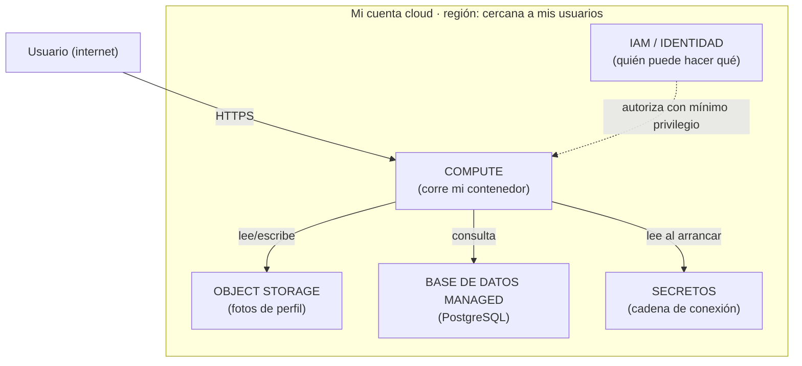
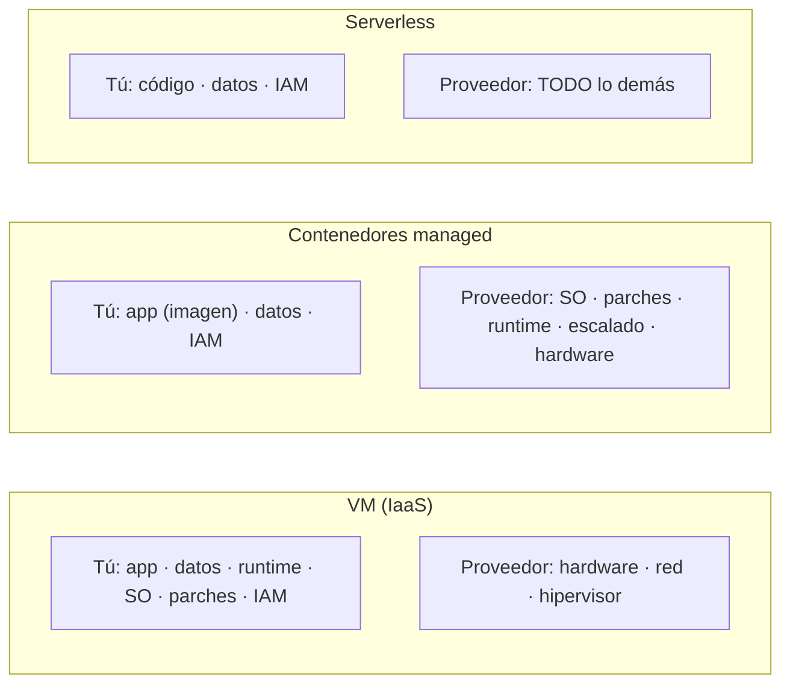

import Reto from "@components/Reto.astro";
import Solucion from "@components/Solucion.astro";
import Quiz from "@components/Quiz.astro";
import CheckDominio from "@components/CheckDominio.astro";
import Nivel from "@components/Nivel.astro";

<Nivel nivel="intermedio" />

Tienes un contenedor que arranca en cualquier máquina ([5.1](/fase-5-devops/5-1-docker/)), que lee su config del entorno y no guarda nada en disco ([5.2](/fase-5-devops/5-2-12-factor/)), que un pipeline construye y verifica en cada push ([5.3](/fase-5-devops/5-3-cicd-github-actions/)) con gates de seguridad puestos ([5.4](/fase-5-devops/5-4-seguridad-supply-chain-ci/)). Todo eso corre en **tu** laptop. Para un reclutador, para tu pareja probando la app, para los **usuarios reales (≥3)** que exige el capstone de esta fase, ese contenedor **no existe**: no tiene una URL pública, no sigue prendido cuando cierras el notebook, no aguanta que alguien lo use a las 3 a.m. La nube es donde ese contenedor consigue una dirección, una base de datos que no se pierde, y la capacidad de seguir vivo sin ti.

Y es donde más rápido te puedes pegar un tiro en el pie. La causa número uno de brechas en la nube no es un hacker genial: es una **identidad con permisos de más** —una clave de acceso con permiso de "Owner" pegada por error en un repo público que un bot encuentra en segundos, o un contenedor con permiso para borrar toda la cuenta cuando solo necesitaba leer una imagen. Esta lección te enseña los **primitivos** —los bloques de Lego de cualquier nube— para que tomes esas decisiones con criterio, no copiando un tutorial. Vas a entender qué es compute, storage, IAM, una base de datos managed, una región y el reparto de responsabilidades entre tú y el proveedor; y vas a desplegar tu API en un servicio managed **bien**, sin dejar credenciales tiradas.

:::tip[Si ya tocaste una consola cloud (Azure, AWS, GCP, Vercel…)]
¿Ya creaste una VM, subiste algo a S3/Blob, o desplegaste en Vercel/Render? Bien: tienes la intuición de "esto corre en la máquina de alguien más". La trampa del que "ya lo usó" es haberlo hecho **a punta de clics y secretos hardcodeados**: el admin user del registry activado, la cadena de conexión de la base de datos pegada en una variable, un rol "Contributor" en toda la suscripción "para que funcione de una". Tres preguntas separan el hábito del cargo-cult: ¿sabes la diferencia entre una **VM, un servicio de contenedores y serverless**, y quién parchea el sistema operativo en cada uno (**modelo de responsabilidad compartida**)? ¿Sabes por qué una **identidad administrada** (managed identity) es estrictamente más segura que guardar una clave? ¿Y por qué una **región** no es solo latencia? Si las tres te salen sin dudar, salta a los **ejercicios Primero-Sin-IA** (sección 7): el primero te hace mapear una app a primitivos y diseñar IAM de mínimo privilegio; el segundo, escribir el script de despliegue seguro. Si te trabas, era un falso "ya lo sé": quédate.
:::

## 1. Qué vas a saber hacer

Al terminar, sin IA y sin notas, podrás:

- **O1 — Mapear los componentes de una app a los primitivos cloud correctos** —elegir entre **compute** (VM / contenedor managed / serverless), **storage** (object vs. block), una **base de datos managed**, y dónde van los **secretos**— y **justificar el trade-off** de cada elección (control vs. carga operacional, costo, latencia).
- **O2 — Diseñar el acceso con identidades de mínimo privilegio (least privilege):** explicar el **modelo de responsabilidad compartida**, por qué una **managed identity** evita guardar secretos, y dar a tu app **solo** los permisos que necesita —corrigiendo una asignación sobre-privilegiada típica.
- **O3 — Desplegar el contenedor de tu API en un servicio managed** (Azure Container Apps) con un script reproducible: imagen desde tu registry, ingress público, puerto correcto, y pull autenticado por identidad —sin admin user ni passwords— eligiendo región/zonas con un criterio defendible.

## 2. Por qué importa (el dinero está aquí)

> 💰 **Por qué importa:** "Tu Azure es un activo real; formalízalo." El mercado de la banda que persigues no paga por "saber clickear en un portal" —los portales cambian cada seis meses y se olvidan. Paga por **entender los primitivos**: dado un problema, saber si esto va en un contenedor o en una función serverless, si los archivos van en object storage o en un disco, qué permisos mínimos necesita cada pieza y quién es responsable de parchear qué. Esa es la conversación de una entrevista de cloud, y la respuesta "le di Contributor para que funcionara" te descarta en el acto.

Tres razones lo vuelven una bisagra de carrera:

1. **Los primitivos son transferibles; las consolas no.** Object storage es **Azure Blob**, **AWS S3** o **Google Cloud Storage**: el botón cambia, el concepto (almacenamiento de objetos, barato, infinito, accedido por HTTP) es el mismo en los tres. Si aprendes el primitivo, mover de Azure a AWS te toma una tarde. Si memorizaste clics, empiezas de cero. Por eso esta lección enseña **un** proveedor a fondo (Azure, por su ecosistema de IA —OpenAI Service, AI Search— que usarás en la Fase 6) y deja el otro como [profundización](/fase-5-devops/5-7-aws/): dominar uno te da los conceptos para los demás.
2. **El costo y la seguridad de tu app de IA se deciden aquí.** Una llamada a un LLM cuesta dinero; el servidor que la envuelve también. Elegir serverless que **escala a cero** cuando nadie lo usa, vs. una VM prendida 24/7, es la diferencia entre una cuenta de USD 5 y una de USD 300 al mes para el mismo tráfico. La [5.8 Costos](/fase-5-devops/5-8-costos-cloud/) profundiza; aquí pones la base.
3. **Es el requisito que separa "lo hice en mi homelab" de "lo desplegué".** El [capstone de la fase](/fase-5-devops/proyecto/) pide tu app **con usuarios reales y un dominio**. Eso vive en la nube (o en tu homelab expuesto, [5.9](/fase-5-devops/5-9-despliegue/)). Saber hacerlo con IAM correcto es la historia de "puse algo en producción y lo sostuve" que el 90% de los candidatos solo-tutorial no tiene.

## 3. Lo que ya traes (actívalo)

Esta lección **no parte de cero**: la nube es donde aterriza todo lo de la fase. Recupéralo antes de seguir:

- De la [5.1 Docker](/fase-5-devops/5-1-docker/): tienes una **imagen** y la subiste a un registry. La nube necesita exactamente eso: un servicio managed de contenedores no hace más que correr tu imagen en la máquina de otro.
- De la [5.2 12-factor](/fase-5-devops/5-2-12-factor/): tres factores se vuelven literales aquí. **Procesos sin estado** → por eso los archivos de usuario van a object storage, no al disco del contenedor (que es efímero). **Config en el entorno** → la cadena de conexión de la DB se inyecta, no se hornea en la imagen. **Backing services como recursos adjuntos** → la base de datos managed es justo eso: un recurso que enchufas por una URL.
- De la [3.13 OWASP web](/fase-3-backend/) y la [5.4 supply chain](/fase-5-devops/5-4-seguridad-supply-chain-ci/): "los secretos van en el entorno, nunca en el código". En la nube ese principio se vuelve **identidad administrada**: ni siquiera hay un secreto que filtrar.
- De la [3.8 FastAPI](/fase-3-backend/): el contenedor que vas a desplegar es tu **API de producción** (capstone F3): FastAPI + Postgres + (en el capstone F5) subida de archivos. Esa es la app concreta que mapearemos a primitivos.

Antes de seguir, responde de memoria:

<Quiz
  question="Tu contenedor de la 5.2 es 'stateless' (sin estado). Un usuario sube su foto de perfil y tu API la guarda en /app/uploads/ dentro del contenedor. Lo despliegas en un servicio que escala a cero cuando no hay tráfico. ¿Qué pasa con la foto?"
  options={[
    "Nada, queda guardada: el disco del contenedor es permanente mientras la app exista",
    "Se pierde: el disco del contenedor es efímero. Al escalar a cero (o reiniciar, o crear otra réplica) ese filesystem desaparece. Los archivos de usuario van a object storage, no al disco del contenedor",
    "Se replica automáticamente a todas las instancias porque el servicio es managed",
  ]}
  answer={1}
  explanation="El filesystem de un contenedor es efímero por diseño (lo viste en 5.1 y 5.2: stateless). Si escala a cero, reinicia, o levanta una segunda réplica, esa carpeta no existe o no se comparte. Por eso el primitivo correcto para archivos de usuario es OBJECT STORAGE (Blob/S3): un servicio aparte, duradero, accedido por HTTP. Confundir 'guardar en el contenedor' con 'persistir' es el error #1 al subir un stateless app a la nube."
/>

## 4. Ejemplo resuelto, pensado en voz alta

Voy a tomar **tu API de producción** (la del capstone F3: FastAPI + PostgreSQL + subida de fotos) y la voy a llevar a la nube **razonando cada decisión en voz alta**, como si estuvieras a mi lado. No memorices los comandos: sigue el **mapa de primitivos**.

### 4.1 El modelo mental: la nube son seis primitivos

Olvida los cientos de servicios del catálogo. El 95% de las apps se montan con **seis bloques**. Mapeo mi API a cada uno:



Razono el mapa: *"Mi contenedor necesita **dónde correr** (compute). Las fotos no pueden ir en su disco efímero → **object storage**. Los datos relacionales necesitan transacciones y backups → **base de datos managed**, no una que yo administre. La contraseña de esa DB no va en la imagen → un **secreto** que se inyecta. Y todo eso lo amarra **IAM**: la identidad de mi app debe poder leer su imagen, leer ese secreto y escribir en ese bucket… y **nada más**. Sexto bloque implícito: la **región** donde vive todo. Seis decisiones. Vamos una por una."*

### 4.2 Compute: el espectro control ↔ comodidad

La primera pregunta es *dónde corre el contenedor*. Hay un espectro, y el trade-off es siempre el mismo: **más control = más cosas que mantienes tú**.

| Modelo | Qué es | Tú administras | El proveedor administra | Cuándo elegirlo |
|---|---|---|---|---|
| **VM (IaaS)** | Una máquina virtual: un servidor Linux que alquilas | SO, parches, runtime, tu app, escalado | Hardware, red, hipervisor | Necesitas control total o software legado peculiar |
| **Contenedores managed** (Azure Container Apps, AWS ECS/Fargate) | Corres tu **imagen**; la plataforma pone el SO y el orquestador | Tu imagen y su config | SO, parches, escalado, red | **El punto dulce para tu API**: ya tienes la imagen |
| **Serverless / FaaS** (Azure Functions, AWS Lambda) | Subes una **función**; corre por evento | Solo tu código | Todo lo demás, escala a cero | Tareas cortas, picos esporádicos, webhooks |
| **PaaS** (Azure App Service) | Subes código o imagen; plataforma opinada | Tu app | SO, runtime, escalado | Apps web estándar sin necesidades raras |

Razono mi elección: *"Ya tengo una **imagen** (5.1). Eso descarta el FaaS puro (pensado para funciones, no para un servidor HTTP de larga vida con su propio framework). Una VM me daría control total, pero a cambio yo tendría que parchear el SO, configurar el reverse proxy, montar el auto-restart… carga operacional que no quiero para un equipo de una persona. El **servicio de contenedores managed** es el punto dulce: le doy mi imagen, él pone el resto y **escala a cero** cuando nadie la usa (clave para el costo). En Azure eso es **Container Apps**."*

> Esto es una **decisión de arquitectura**: regístrala en un **ADR** (hilo spec-driven). "Elegí Container Apps sobre una VM porque ya tengo imagen y quiero escala-a-cero; descarté Functions porque mi carga es un servidor HTTP de larga vida, no eventos cortos." Una frase, pero te la van a preguntar.

### 4.3 Storage: objeto vs. bloque (no son intercambiables)

Dos primitivos de almacenamiento que la gente confunde:

- **Object storage** (Azure Blob, AWS S3): guarda **archivos completos** (blobs) identificados por una clave, accedidos por **HTTP**. Barato, prácticamente infinito, duradero (el proveedor replica). No es un filesystem: no puedes "abrir y editar el byte 4000". Es perfecto para **las fotos de perfil**, PDFs, backups, assets estáticos.
- **Block storage** (Azure Managed Disks, AWS EBS): un **disco virtual** que se "monta" en una VM como si fuera local. Lectura/escritura por bloques, baja latencia. Es lo que usa una VM para su SO o una base de datos para sus datos. **No** lo usarías para fotos de usuario.

Razono: *"Las fotos van a **object storage** (Blob). Tres razones: (1) son archivos completos que se sirven por URL —object es literalmente eso; (2) sobreviven a que el contenedor muera —resuelve el problema del quiz de la sección 3; (3) cuestan centavos. El disco efímero del contenedor solo guarda lo temporal."* El primitivo `file storage` (Azure Files / AWS EFS) existe para cuando varios contenedores necesitan un filesystem **compartido**; no es mi caso.

### 4.4 Base de datos managed: por qué no administro mi propio Postgres

Podría correr Postgres en un contenedor o en una VM. **No lo voy a hacer en producción.** Una base de datos managed (Azure Database for PostgreSQL Flexible Server, AWS RDS) me da, sin que yo mueva un dedo: **backups automáticos + restauración a un punto en el tiempo**, **parches de seguridad**, **alta disponibilidad** opcional (réplica en otra zona), y métricas. Razono el trade-off: *"Administrar mi propio Postgres significa que yo soy el responsable de que los backups corran, de parchear el CVE del martes, y de levantarlo a las 3 a.m. si se cae. Eso es exactamente la **carga operacional** que la nube me vende para quitarme. Pago un poco más por GB que una VM cruda, y a cambio duermo. Para datos de usuarios, esa es la elección de adulto."* Conecta con 12-factor: la DB es un **backing service** que enchufo por una URL de conexión —puedo cambiar de instancia sin tocar código.

### 4.5 IAM y responsabilidad compartida: el corazón de la seguridad cloud

Aquí está el 80% del valor de esta lección. Dos ideas:

**(a) Modelo de responsabilidad compartida.** El proveedor es responsable de la *seguridad **de** la nube* (el hardware, los datacenters, el hipervisor). Tú eres responsable de la *seguridad **en** la nube* (tu app, tus datos, tus permisos). **La línea se mueve según el modelo de compute:**



Razono: *"Cuanto más a la derecha (más managed), menos parcheo yo —pero **mis datos y mis permisos siempre son míos**, en los tres modelos. El proveedor jamás es responsable de que yo le diera 'Owner' a un contenedor. La seguridad de IAM no se delega."*

**(b) Identidades y mínimo privilegio.** En IAM hay **principals** (quién: un usuario, una app, un servicio) que reciben **roles** (qué pueden hacer) con un **scope** (sobre qué recursos). La regla de oro es **least privilege**: cada principal recibe **el mínimo conjunto de permisos para su tarea, y nada más**.

El antipatrón clásico —y el que te descalifica— es resolver con permisos amplios:

```bash
# ❌ NUNCA: "le doy Contributor en todo el grupo para que funcione de una"
az role assignment create --assignee "$APP_ID" --role Contributor --scope "$RESOURCE_GROUP_ID"
```

Eso le da a tu contenedor permiso para **crear, modificar y borrar cualquier recurso** del grupo: si alguien compromete tu app, puede borrar tu base de datos o levantar mineros de cripto a tu nombre. Mi contenedor solo necesita **una** cosa de IAM: **leer su imagen del registry**. Entonces:

```bash
# ✅ Mínimo privilegio: SOLO 'acrpull' (leer imágenes) SOBRE ESE registry, nada más
az role assignment create \
  --assignee "$IDENTITY_PRINCIPAL" \
  --role acrpull \
  --scope "$ACR_ID"
```

Y la guinda: ¿con qué credencial se autentica mi contenedor para hacer ese pull? La respuesta ingenua es "el admin user del registry y su password, en una variable". **No.** Uso una **identidad administrada** (managed identity): una identidad que la nube le asigna a mi contenedor y cuya credencial **rota sola y nunca veo**. Razono: *"Si no hay secreto, no hay secreto que filtrar. Una managed identity es estrictamente más segura que cualquier clave que yo guarde, porque elimina la clase entera de bugs de 'se me coló el secreto en un commit/log/variable'."* Es el mismo principio de la [5.4](/fase-5-devops/5-4-seguridad-supply-chain-ci/), llevado al runtime.

### 4.6 Región y zonas: dónde vive todo

Una **región** es una zona geográfica con datacenters (ej. *Brazil South*, *East US*). Una **availability zone** son datacenters **físicamente separados dentro de una región** (distinto edificio, energía, red), para que la caída de uno no se lleve a los otros. Elegir región **no es solo latencia**; pesan cuatro cosas:

1. **Latencia:** cercanía a tus usuarios. Para usuarios en Chile, *Brazil South* es de las más cercanas hoy con disponibilidad amplia.
2. **Residencia de datos / cumplimiento:** algunas leyes exigen que los datos no salgan del país/bloque.
3. **Disponibilidad de servicios:** no todas las regiones tienen todos los servicios (¡ojo con esto al usar servicios de IA en Fase 6!).
4. **Costo:** el precio del mismo servicio **varía por región**.

Razono para mi caso: *"3 usuarios reales en Chile → Brazil South por latencia y costo razonable. ¿Necesito multi-zona (alta disponibilidad)? Con 3 usuarios, **no**: pagar por réplicas en varias zonas para un proyecto de portafolio es sobre-ingeniería. Documento la decisión: 'single-zone, acepto el riesgo de una caída zonal a cambio de costo; si esto creciera a usuarios pagos, activaría zone-redundancy.' Saber **cuándo NO** es tan senior como saber cómo."*

### 4.7 Las manos en la masa: desplegar el contenedor

Con el mapa claro, el despliegue es mecánico. Estos comandos son de la **Azure CLI** (verificados contra la doc oficial vigente). Léelos como la materialización del mapa, no para memorizarlos:

```bash
# 0. Extensión de Container Apps y registro de los providers que usa
az extension add --name containerapp --upgrade
az provider register --namespace Microsoft.App
az provider register --namespace Microsoft.OperationalInsights

# 1. Grupo de recursos = la "carpeta" que agrupa todo lo de este proyecto
az group create --name rg-api-produccion --location brazilsouth

# 2. Registry + build de la imagen EN la nube (sin Docker local: lo hace ACR)
az acr create --resource-group rg-api-produccion --name miacrunico --sku Basic
az acr build --registry miacrunico --image api-produccion:latest .

# 3. Identidad administrada de usuario (la credencial que NUNCA veré)
az identity create --name id-api --resource-group rg-api-produccion
IDENTITY_ID=$(az identity show --name id-api --resource-group rg-api-produccion --query id -o tsv)
PRINCIPAL=$(az identity show --name id-api --resource-group rg-api-produccion --query principalId -o tsv)
ACR_ID=$(az acr show --name miacrunico --resource-group rg-api-produccion --query id -o tsv)

# 4. Mínimo privilegio: SOLO acrpull, SOLO sobre este registry
az role assignment create --assignee "$PRINCIPAL" --role acrpull --scope "$ACR_ID"

# 5. Entorno de Container Apps (frontera segura; trae Log Analytics → observabilidad 5.10)
az containerapp env create --name env-api --resource-group rg-api-produccion --location brazilsouth

# 6. Crear y desplegar: ingress público, puerto de la app, pull por identidad
az containerapp create \
  --name api-produccion \
  --resource-group rg-api-produccion \
  --environment env-api \
  --image miacrunico.azurecr.io/api-produccion:latest \
  --target-port 8000 \
  --ingress external \
  --registry-server miacrunico.azurecr.io \
  --user-assigned "$IDENTITY_ID" \
  --registry-identity "$IDENTITY_ID" \
  --query properties.configuration.ingress.fqdn -o tsv
```

El último comando devuelve el **FQDN**: la URL pública de tu app. Razono los flags clave: *"`--ingress external` la hace alcanzable desde internet (sin esto, solo es interna). `--target-port 8000` debe **coincidir** con el puerto que tu FastAPI escucha (el del `EXPOSE`/`uvicorn` de la 5.1). `--registry-identity` le dice 'autentícate al registry con esta identidad', no con password. Cero secretos en todo el script."* La config de la app (cadena de conexión de la DB, etc.) se inyecta aparte con `--env-vars` y `--secrets` —12-factor, en el entorno.

> ¿Atajo? `az containerapp up --name api --resource-group rg-api --image ... --ingress external --target-port 8000` hace casi todo en un comando (crea grupo, entorno y app). Úsalo para un primer deploy rápido; el flujo de arriba, paso a paso con identidad, es lo que querrás cuando importe la seguridad.

## 5. Errores y malentendidos

:::caution[Podrías pensar que… y por qué está mal]
- **"Serverless significa que no hay servidores."** No: hay servidores, simplemente **no los administras tú** y solo pagas cuando se ejecuta tu código. El nombre vende la *experiencia*, no la física. Si crees que no hay servidor, no entiendes la responsabilidad compartida.
- **"Guardo los archivos de usuario en el contenedor."** El disco del contenedor es **efímero**: muere con el contenedor, no se comparte entre réplicas, desaparece al escalar a cero. Los archivos van a **object storage**. (Es el quiz de la sección 3 por una razón.)
- **"Le doy Contributor/Owner para no pelear con permisos."** Es la causa #1 de brechas. Un contenedor comprometido con Owner puede borrar tu cuenta entera. **Least privilege** no es burocracia: es el límite del daño cuando algo sale mal. Da `acrpull` sobre el registry, no Contributor sobre todo.
- **"Activo el admin user del registry y paso la password."** Una password es un secreto que puedes filtrar (commit, log, captura de pantalla). Una **managed identity** no tiene secreto que filtrar. Si el tutorial que copiaste usa `--admin-enabled true`, el tutorial está enseñando el camino inseguro.
- **"La región es solo para que vaya más rápido."** También define **residencia de datos** (cumplimiento legal), **qué servicios están disponibles** (clave para IA en Fase 6) y **el costo** (el mismo servicio cuesta distinto por región).
- **"Una región es lo mismo que una availability zone."** Región = geografía (un conjunto de datacenters). Zona = datacenters separados **dentro** de una región. Multi-zona te protege de la caída de un datacenter; multi-región, de la caída de una geografía entera. Confundirlos lleva a diseñar mal la alta disponibilidad.
- **"Lo despliego a mano por el portal y listo."** Un deploy a clics no es reproducible ni revisable: nadie puede auditar qué hiciste, y rehacerlo es jugar a la memoria. Por eso el ejercicio te pide un **script** (infra reproducible; semilla de la [5.11 IaC](/fase-5-devops/5-11-terraform-iac/)).
:::

## 6. Práctica con andamiaje

Antes de los retos completos, dos micro-ejercicios para activar el modelo mental. Hazlos **mentalmente o en papel** antes de mirar la respuesta.

**(a) Faded — completa los flags.** Quieres que tu contenedor sea alcanzable desde internet, en el puerto donde escucha tu API, y que haga pull **sin password**. Completa los tres huecos del comando:

```bash
az containerapp create --name api --resource-group rg --environment env \
  --image miacr.azurecr.io/api:latest \
  --ingress ______ \
  --target-port ______ \
  --registry-server miacr.azurecr.io --______ "$IDENTITY_ID"
```

<Solucion title="Ver respuesta (intenta primero)">

- `--ingress external` → expone la app a internet (la otra opción, `internal`, solo dentro del entorno).
- `--target-port 8000` → el puerto que tu FastAPI escucha (ajústalo al `EXPOSE`/`uvicorn` real de tu imagen de la 5.1).
- `--registry-identity "$IDENTITY_ID"` → autentica el pull con la identidad administrada, sin password.

La idea no es memorizar nombres de flags (los autocompleta la CLI y la doc): es saber **qué tres decisiones** estás tomando —exposición, puerto, credencial— y que la tercera nunca debe ser un secreto.

</Solucion>

**(b) Parsons — ordena el despliegue.** Estos seis pasos están desordenados. Hay **dependencias**: no puedes asignar un rol sobre un registry que no existe, ni desplegar en un entorno que no creaste. Ordénalos.

```text
A. az containerapp create  (desplegar la app)
B. az group create  (crear el grupo de recursos)
C. az role assignment create --role acrpull  (dar permiso a la identidad)
D. az acr create + az acr build  (registry y build de la imagen)
E. az identity create  (crear la identidad administrada)
F. az containerapp env create  (crear el entorno)
```

<Solucion title="Ver orden correcto (intenta primero)">

**B → D → E → C → F → A.**

Razón de las dependencias: primero el **grupo** (B) porque todo vive dentro. Luego el **registry y la imagen** (D): necesitas el `ACR_ID` y la imagen lista. La **identidad** (E) puede crearse en paralelo, pero el **rol** (C) requiere que existan *tanto* la identidad *como* el registry (su scope). El **entorno** (F) antes de la **app** (A), porque la app se despliega *dentro* de un entorno. Pensar en el grafo de dependencias —no en el orden del tutorial— es lo que te deja escribir el script sin copiarlo.

</Solucion>

## 7. Ejercicios Primero-Sin-IA

Dos ejercicios. El primero entrena el **criterio** (mapear primitivos + IAM); el segundo, las **manos** (escribir el deploy seguro). Recuerda la regla: intenta solo, a mano, dentro del timebox; solo después consultas la doc oficial; la IA al final, para *revisar*, no para *generar*.

<Reto title="Mapa de primitivos cloud + IAM de mínimo privilegio" timebox="40 min">

Tu **API de producción** (capstone F3) tiene: el contenedor FastAPI, una base de datos PostgreSQL, usuarios que **suben fotos de perfil**, una cadena de conexión secreta, y debe ser alcanzable públicamente por ≥3 usuarios reales. **Sin desplegar nada**, en archivos markdown:

1. **`mapa.md`** — una tabla que mapee cada componente (compute, fotos, base de datos, secreto) a su **primitivo cloud** y **justifique** la elección en una frase (incluye el trade-off que descartaste).
2. **`iam.md`** — diseña el acceso de **mínimo privilegio** de la app: ¿qué permisos *exactos* necesita y sobre qué recursos? Te dan esta asignación que un compañero "dejó andando"; explica por qué está mal y reescríbela:
   ```bash
   az role assignment create --assignee "$APP_ID" --role Owner --scope "$SUBSCRIPTION_ID"
   ```
3. **`responsabilidad.md`** — para el modelo de compute que elegiste, traza la **frontera de responsabilidad compartida**: una tabla de "esto lo parcheo/respondo yo" vs. "esto el proveedor".
4. **`region.md`** — un párrafo: qué región eliges y por qué (los 4 factores), y si necesitas multi-zona para 3 usuarios. Justifica.

Acompaña cada decisión grande con un **ADR de una línea** (decisión + alternativa descartada + por qué).

**Hecho significa:** los 4 archivos existen; el mapa cubre los 4 componentes con primitivo + justificación; `iam.md` nombra el problema del `Owner` (radio de daño) y propone los permisos mínimos reales; la tabla de responsabilidad ubica correctamente quién parchea el SO en tu modelo; y puedes **defender cada elección sin notas**.

Carpeta del ejercicio: `ejercicios/fase-5/mapa-primitivos-cloud/`

</Reto>

<Reto title="Despliega el contenedor en un servicio managed (seguro)" timebox="45 min">

Escribe `deploy.sh`: un script que despliegue el contenedor de tu API en **Azure Container Apps** correctamente. Hay un `test_deploy.py` que **revisa estáticamente tu script** (no necesitas una cuenta de Azure para que pase: lo analiza como texto). Tu script debe:

- crear el **grupo de recursos** y el **entorno** de Container Apps;
- desplegar la app con **ingress público** y el **puerto** correcto;
- crear una **identidad administrada** y hacer el pull de la imagen **con ella** (sin admin user, sin password de registry);
- asignar **solo `acrpull`** sobre el registry —jamás `Contributor`/`Owner`.

**Hecho significa:** `pytest` pasa en verde (todas las verificaciones), añadiste **un comentario por cada paso** explicando *por qué* (no solo qué), y puedes explicar qué flag hace pública la app, cuál evita guardar un secreto, y por qué `acrpull` y no `Contributor`.

Corre los tests:

```bash
pytest
```

Carpeta del ejercicio: `ejercicios/fase-5/desplegar-en-container-apps/`

</Reto>

## 8. Check de dominio

Marca solo lo que puedas **explicar sin notas y sin IA** (active recall honesto):

<CheckDominio items={[
  "Nombrar los 6 primitivos cloud y dar un ejemplo de cada uno en una nube concreta",
  "Explicar el trade-off del espectro de compute (VM → contenedores → serverless) en términos de control vs. carga operacional",
  "Explicar por qué los archivos de usuario van a object storage y no al disco del contenedor",
  "Explicar el modelo de responsabilidad compartida y cómo se mueve la frontera entre una VM y serverless",
  "Explicar por qué una identidad administrada es más segura que guardar una clave de acceso",
  "Reescribir una asignación de rol 'Owner sobre la suscripción' como mínimo privilegio y justificar el porqué",
  "Distinguir región de availability zone y decir cuándo necesitas multi-zona",
  "Escribir, de memoria, los pasos en orden para desplegar un contenedor en un servicio managed",
]} />

Y una pregunta de cierre:

<Quiz
  question="Un compañero despliega su contenedor con: registry admin user activado + password en una variable de entorno + el rol 'Contributor' sobre el grupo de recursos, porque 'así seguro funciona'. ¿Cuál es la objeción de seguridad MÁS fuerte?"
  options={[
    "Ninguna: si funciona y es su proyecto personal, da lo mismo",
    "El password del registry: debería estar cifrado en vez de en texto plano",
    "Combina dos antipatrones graves: un secreto que se puede filtrar (usar managed identity lo elimina) Y un permiso desproporcionado (Contributor permite borrar/crear todo; solo necesita acrpull sobre el registry). Si comprometen el contenedor, el daño es máximo y hay una credencial expuesta",
    "Que no usó Terraform para desplegarlo",
  ]}
  answer={2}
  explanation="Son dos fallas de least-privilege y de gestión de secretos a la vez. (1) La password de registry es un secreto innecesario: una managed identity elimina la clase entera de bugs de filtración. (2) 'Contributor sobre el grupo' le da al contenedor permiso para modificar/borrar TODO; solo necesitaba 'acrpull' sobre el registry. El principio que viola es el mismo dos veces: dar el mínimo necesario, y no guardar secretos que se puedan filtrar. Que funcione no lo hace seguro."
/>

## 9. Recursos

Documentación **oficial** primero (el primitivo es estable; la UI cambia —fíjate en la fecha de la doc):

- **Azure Container Apps** — [Quickstart: deploy desde una imagen](https://learn.microsoft.com/azure/container-apps/get-started) y [tutorial code-to-cloud](https://learn.microsoft.com/azure/container-apps/tutorial-code-to-cloud) (el flujo de la sección 4).
- **Managed identities (Azure)** — [pull de imagen de ACR con identidad administrada](https://learn.microsoft.com/azure/container-apps/managed-identity-image-pull): por qué y cómo, sin passwords.
- **Azure RBAC** — [mejores prácticas de control de acceso](https://learn.microsoft.com/azure/role-based-access-control/best-practices): least privilege explicado por el proveedor.
- **Modelo de responsabilidad compartida** — [Microsoft Learn](https://learn.microsoft.com/azure/security/fundamentals/shared-responsibility) (Azure) y [AWS Shared Responsibility Model](https://aws.amazon.com/compliance/shared-responsibility-model/): léelos en paralelo, verás que el concepto es idéntico.
- **Regiones y zonas** — [Azure regions and availability zones](https://learn.microsoft.com/azure/reliability/availability-zones-overview).
- **El otro proveedor** — si tu mercado objetivo pide AWS, ve la [5.7 AWS](/fase-5-devops/5-7-aws/) (profundización). Nota 2026: **AWS App Runner está en modo mantenimiento**; el equivalente managed vigente para contenedores es **ECS Fargate**.

## 10. Conexión con el capstone

El [capstone de la Fase 5](/fase-5-devops/proyecto/) pide tu app **desplegada con un dominio y ≥3 usuarios reales**. Esta sub-unidad es la pieza "dónde y cómo corre":

- El **mapa de primitivos** (ejercicio 1) es el boceto de arquitectura de tu capstone: dice dónde va el contenedor, las fotos, la DB y los secretos.
- El **deploy seguro** (ejercicio 2) es, literalmente, el paso final de tu pipeline de [CI/CD (5.3)](/fase-5-devops/5-3-cicd-github-actions/): después de build + gates de seguridad ([5.4](/fase-5-devops/5-4-seguridad-supply-chain-ci/)), el job de deploy corre un script como el tuyo.
- El **IAM de mínimo privilegio** y la **identidad administrada** son entregables de seguridad del [Definition of Done](/fase-5-devops/) de la fase: tu app no debe tener ni un secreto filtrable ni un permiso de más.
- El entorno de Container Apps trae **Log Analytics**, que es el gancho con la [observabilidad (5.10)](/fase-5-devops/5-10-observabilidad/): logs y trazas de tu app desplegada.

## 11. Reflexión y repaso espaciado

Responde en tu `RETROSPECTIVA.md` de la fase:

- ¿Qué primitivo te costó más ubicar, y por qué? (object vs. block storage suele ser el confuso.)
- Si tu app de IA de la Fase 6 escalara a 1.000 usuarios, ¿qué decisión de esta lección cambiarías primero —compute, región, multi-zona— y qué le costaría a tu billetera?
- ¿Defiendes hoy, sin notas, por qué una managed identity es mejor que una clave? Si no, vuelve a la sección 4.5.

**Repaso espaciado (no te saltes esto):**
- **Mañana:** reescribe de memoria los 6 pasos del despliegue en orden, sin mirar. Si no salen, no lo aprendiste todavía.
- **En 1 semana:** explícale a alguien (o a una IA, en voz alta) el modelo de responsabilidad compartida y dónde se mueve la frontera entre VM y serverless.
- **En 1 mes:** al desplegar el capstone de la Fase 6, vuelve aquí y verifica que tu IAM sigue siendo de mínimo privilegio —es fácil que se relaje mientras "haces que funcione".

> "Le di Owner para que funcionara" es la frase que precede al 80% de los incidentes de seguridad cloud. La otra mitad de tu trabajo como ingeniero es saber **cuándo decir que no** a la comodidad. Para nota: hacer que funcione es de junior; hacer que funcione **con el mínimo privilegio** es lo que te paga la banda que persigues.
