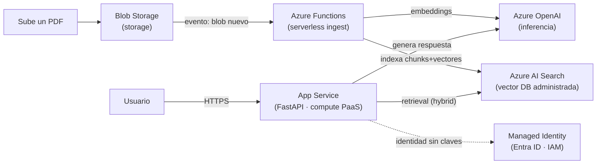

import Reto from "@components/Reto.astro";
import Solucion from "@components/Solucion.astro";
import Quiz from "@components/Quiz.astro";
import CheckDominio from "@components/CheckDominio.astro";
import Nivel from "@components/Nivel.astro";

<Nivel nivel="profundización" />

:::note[Esta sub-unidad es OPCIONAL / profundización]
La [5.5 Cloud troncal](/fase-5-devops/5-5-cloud-troncal/) ya te dio lo que filtra una entrevista: los **primitivos** de un cloud (compute, storage, IAM, serverless, DB administrada) en **un solo** proveedor. Esta lección no añade primitivos nuevos —añade el **mapa de Azure** sobre ellos, porque el stack de IA del curso (Azure OpenAI + AI Search) vive ahí y porque, si tu cloud troncal fue AWS, Azure es tu **segundo cloud** natural. Si no vas a tocar Azure pronto, sáltala sin culpa: nada en la ruta crítica depende de ella. Si Azure va a ser tu troncal o tu segundo cloud, aquí está el atajo para no perderte en la sopa de marcas de Microsoft.
:::

## 1. Qué vas a saber hacer

Al terminar, sin notas, podrás:

- **O1 — Mapear** una app de IA del curso (un RAG con backend FastAPI) sobre **cuatro servicios de Azure** —App Service, Azure Functions, Azure AI Search y Azure OpenAI Service— explicando **a qué primitivo de la [5.5](/fase-5-devops/5-5-cloud-troncal/)** corresponde cada uno y **por qué** elegirías ese y no otro.
- **O2 — Escribir** el cliente vigente (2026) para llamar a un modelo en **Azure OpenAI Service** con la **API v1 GA**, explicando las dos diferencias que rompen a todo el mundo: `model=` es el **nombre del deployment** (no del modelo base) y la autenticación profesional es **Managed Identity**, no una clave en el código.
- **O3 — Defender un trade-off** de Azure (clave vs. Managed Identity, pay-as-you-go vs. PTU, Azure AI Search vs. pgvector) con un argumento de costo/seguridad/latencia, sin marketing.

## 2. Por qué importa (el dinero está aquí)

> 💰 **Por qué importa:** el ROADMAP lo dice sin rodeos —*"tu Azure es un activo real; formalízalo."* En la banda que persigues, "tengo experiencia con Azure OpenAI" es una frase que abre puertas en LATAM, donde el grueso de la empresa grande corre sobre Microsoft (Office 365, Entra ID, Azure ya contratado). Pero hay una trampa: el mercado no paga por **saber hacer clic en el portal** —eso lo hace cualquiera—, paga por entender **qué primitivo resuelve cada servicio** y poder decir, en una entrevista, *"puse el ingest en Functions porque es event-driven y escala a cero; el retrieval en AI Search porque ya me da hybrid + semantic ranking administrado; y autentiqué con Managed Identity para no tener una sola clave en el repo."* Esa frase es la diferencia entre "usé Azure" y "diseñé sobre Azure".

Tres razones lo vuelven una bisagra concreta:

1. **El stack de IA del curso (Fase 6) tiene un gemelo administrado en Azure.** Lo que en la [Fase 6](/fase-6-ai-engineering/) montarás a mano —un modelo por API, una vector DB, un pipeline de ingest— Azure te lo ofrece como servicios gestionados (Azure OpenAI, AI Search, Functions). Saber **cuándo conviene lo administrado y cuándo lo propio** es criterio de semi-senior, no de junior.
2. **Es tu puente a "enterprise".** Data residency, Entra ID, cuotas dedicadas (PTU), cumplimiento: son justo las cosas que un cliente corporativo exige y que la API pública de OpenAI no te da empaquetadas. Es donde está el contrato que paga en USD.
3. **El marketing cambia los nombres; tú necesitas el modelo mental estable.** Microsoft renombró su plataforma de IA **dos veces en doce meses** (Azure AI Studio → Azure AI Foundry en Ignite 2024 → **Microsoft Foundry** en Ignite 2025, formalizado en enero de 2026). Si aprendes nombres, caducan. Si aprendes **a qué primitivo corresponde cada servicio**, sobrevives al próximo rebrand sin reestudiar nada.

## 3. Lo que ya traes (actívalo)

Esta lección **no parte de cero**: es Azure puesto encima de cosas que ya tienes. Recupéralas antes de seguir:

- De la [5.5 Cloud troncal](/fase-5-devops/5-5-cloud-troncal/): los cinco primitivos —**compute, storage, IAM, serverless, DB administrada**—. Hoy cada servicio de Azure que veas es **uno de esos cinco** con nombre comercial. Si no puedes nombrar el primitivo detrás del logo, vuelve a la 5.5.
- De la [5.2 12-factor](/fase-5-devops/5-2-12-factor/): *config en el entorno, nunca en el código* (factor III). Es exactamente por qué el endpoint y la clave de Azure OpenAI van en variables de entorno, y por qué Managed Identity (cero claves) es el ideal 12-factor llevado al extremo.
- De la [5.9 Despliegue](/fase-5-devops/5-9-despliegue/): desplegaste un contenedor con dominio. App Service es la versión administrada de eso en Azure (tú subes la imagen; Azure pone el resto).
- De la [5.8 Costos cloud](/fase-5-devops/5-8-costos-cloud/): la diferencia entre pagar por uso y pagar capacidad reservada. En Azure OpenAI eso tiene nombre: **pay-as-you-go** (por token) vs. **PTU** (capacidad dedicada).

Antes de seguir, responde de memoria:

<Quiz
  question="En la 5.5 viste que 'serverless' es un primitivo: código que corre por evento y escala a cero cuando no se usa. ¿Cuál de estos servicios de Azure es el serverless?"
  options={[
    "App Service: aloja tu app web siempre encendida",
    "Azure Functions: ejecuta tu código disparado por un evento (un blob nuevo, un HTTP, un mensaje en cola) y escala a cero",
    "Azure AI Search: indexa y busca tus documentos",
  ]}
  answer={1}
  explanation="Azure Functions es el primitivo serverless de Azure: función + trigger, escala a cero cuando no hay eventos. App Service es compute PaaS 'siempre encendido' (mejor para una API web con tráfico sostenido), y AI Search es un servicio de búsqueda/vector administrado. Reconocer el primitivo detrás del nombre comercial es justo el músculo de esta lección."
/>

## 4. Ejemplo resuelto, pensado en voz alta

Voy a tomar la **plataforma RAG** que construirás en el [Capstone de la Fase 6](/fase-6-ai-engineering/) —subir documentos, buscarlos semánticamente, responder con un LLM— y la voy a **posar sobre Azure**, razonando cada elección como si estuvieras a mi lado. **No memorices los nombres: sigue el razonamiento del primitivo.**

### 4.1 El mapa: cada servicio es un primitivo de la 5.5 con logo

Antes de tocar nada, dibujo la correspondencia. Esta tabla es la lección entera en una pantalla:

| Primitivo (5.5) | Servicio Azure | Por qué ese, en una frase |
|---|---|---|
| **Compute (PaaS)** | **App Service** | Aloja tu API FastAPI sin administrar VMs ni el SO; tráfico web sostenido. |
| **Serverless / event-driven** | **Azure Functions** | El ingest se dispara *cuando sube un documento*; escala a cero entre subidas. |
| **Búsqueda / vector DB administrada** | **Azure AI Search** | Te da vector + keyword + **hybrid search** + semantic ranking ya gestionado. |
| **Inferencia de LLM administrada** | **Azure OpenAI Service** | Los modelos GPT con tu cuota, tu región y gobierno enterprise. |
| **IAM** | **Microsoft Entra ID + Managed Identity** | Quién puede llamar a qué, **sin claves** en el código. |
| **Storage** | **Azure Blob Storage** | Guarda los documentos crudos antes de procesarlos. |



Razono el dibujo: *"El usuario habla con una **API web** —tráfico sostenido, siempre encendida— así que va en **App Service** (compute PaaS), no en Functions. Pero el **ingest** es distinto: ocurre **a ráfagas**, cuando alguien sube un documento; tenerlo siempre encendido sería pagar por nada, así que es un caso de libro para **Functions** (serverless, escala a cero). La búsqueda la podría hacer con `pgvector` como en la [6.6](/fase-6-ai-engineering/), pero si ya estoy en Azure, **AI Search** me regala el hybrid search y el reranking administrados —menos código que mantener—. El LLM vive en **Azure OpenAI** porque quiero la cuota y la región bajo mi control. Y todo eso se habla **sin una sola clave**: con **Managed Identity**."*

### 4.2 Una nota sobre los nombres (para que el rebrand no te maree)

Antes del código, ordeno la sopa de marcas, porque Microsoft la cambió dos veces:

- **Microsoft Foundry** (antes *Azure AI Foundry*, antes *Azure AI Studio*) es el **paraguas**: el portal y el SDK para construir apps de IA en Azure.
- **Azure OpenAI Service** es el **servicio concreto** que sirve los modelos de OpenAI (hoy se lista como *"Azure OpenAI in Microsoft Foundry Models"*). Y aquí la parte importante para no entrar en pánico: **el servicio no está deprecado**. El recurso de siempre (`kind: OpenAI`) se sigue creando, sigue recibiendo modelos nuevos, y tu endpoint y tus claves no cambian. El "upgrade" a Foundry es **opt-in y reversible**.

> [!tip] Regla anti-rebrand
> Cuando leas una marca nueva de Microsoft, pregúntate: *"¿qué primitivo es?"*. Foundry = la consola/SDK; Azure OpenAI = inferencia administrada; AI Search = búsqueda/vector. El logo cambia; el primitivo no.

### 4.3 El cliente de Azure OpenAI, versión 2026 (API v1 GA)

Aquí está el detalle que vuelve obsoletos casi todos los tutoriales viejos. Desde la **API v1 GA**, Azure OpenAI se llama con el **cliente estándar de OpenAI** —el mismo `OpenAI()` de la [6.3](/fase-6-ai-engineering/)—, **no** con el viejo `AzureOpenAI()`, y **ya no necesitas** pasar `api_version`. Solo cambias el `base_url`.

```python
import os
from openai import OpenAI

# El endpoint del recurso + /openai/v1/  (esa ruta ES lo que activa la API v1)
client = OpenAI(
    api_key=os.environ["AZURE_OPENAI_API_KEY"],
    base_url="https://mi-recurso.openai.azure.com/openai/v1/",
)

respuesta = client.chat.completions.create(
    model="gpt-4.1-mini-prod",   # ⚠️ nombre del DEPLOYMENT, no del modelo base
    messages=[{"role": "user", "content": "Resume el paper de attention."}],
)
print(respuesta.choices[0].message.content)
```

Razono las **tres** trampas, una por una:

1. *"`base_url` termina en `/openai/v1/`. Esa ruta es la que le dice al SDK 'habla v1'. Sin ese sufijo, no funciona."*
2. *"`model="gpt-4.1-mini-prod"` **no** es el nombre del modelo de OpenAI —es el nombre que **yo** le di a mi **deployment** en el portal. En Azure tú creas un *deployment* (una instancia desplegada de un modelo, con su cuota), y lo llamas por **ese** nombre. Esta es la confusión #1 de quien viene de la API pública de OpenAI: ahí `model="gpt-4.1-mini"` es el modelo; aquí es **tu** etiqueta."*
3. *"No aparece `api_version` por ningún lado. En la API vieja tenías que pegar un `api_version="2024-..."` que caducaba cada mes. La v1 lo eliminó: te quedas siempre en la última."*

### 4.4 La versión profesional: cero claves con Managed Identity

El código de arriba tiene un olor que ya detectas desde la [5.2](/fase-5-devops/5-2-12-factor/) y la [5.4](/fase-5-devops/5-4-seguridad-supply-chain-ci/): **una clave**. Una clave es un secreto que hay que guardar, rotar y que se puede filtrar. En producción, Azure te ofrece algo mejor: que tu App Service tenga una **identidad propia** (Managed Identity) y se autentique contra Azure OpenAI **sin clave alguna**.

```python
from openai import OpenAI
from azure.identity import DefaultAzureCredential, get_bearer_token_provider

# DefaultAzureCredential usa la Managed Identity del App Service en producción
# (y tu 'az login' en local). Cero secretos en el código.
token_provider = get_bearer_token_provider(
    DefaultAzureCredential(), "https://ai.azure.com/.default"
)

client = OpenAI(
    base_url="https://mi-recurso.openai.azure.com/openai/v1/",
    api_key=token_provider,   # token con auto-refresh, NO una clave estática
)
```

Razono por qué esto es superior: *"`DefaultAzureCredential` es una cadena de fallbacks: en mi máquina usa mi `az login`; en el App Service usa la **Managed Identity** que Azure le inyecta. El mismo código sirve en local y en prod **sin un secreto que filtrar**. A esa identidad le doy el rol `Cognitive Services OpenAI User` sobre el recurso —ni más (least privilege, igual que los `permissions` mínimos de la [5.4](/fase-5-devops/5-4-seguridad-supply-chain-ci/))—. La clave del 4.3 sirve para un script rápido o un curso; la Managed Identity es lo que pones en un capstone que no da vergüenza."* Fíjate que `get_bearer_token_provider` devuelve un *callable* con **auto-refresh**: ya no necesitas el viejo `AzureOpenAI()` solo para renovar el token.

### 4.5 El ingest como Function (serverless, modelo Python v2)

Para cerrar el dibujo, el trigger de ingest. El **modelo de programación Python v2** de Functions usa **decoradores** (mucho más limpio que el v1 con `function.json`). Esto se dispara solo cuando alguien sube un blob:

```python
import azure.functions as func

app = func.FunctionApp()

@app.blob_trigger(arg_name="documento",
                  path="docs/{name}",
                  connection="AzureWebJobsStorage")
def ingestar(documento: func.InputStream) -> None:
    # Se ejecuta cuando aparece un blob nuevo en el contenedor 'docs/'.
    # Aquí: extraer texto -> chunking -> embeddings (Azure OpenAI)
    #       -> indexar en Azure AI Search. Entre subidas, NO corre nada.
    contenido = documento.read()
    ...
```

Razono el cierre: *"No hay servidor que yo administre, no hay 'siempre encendido'. El evento (un blob nuevo) **es** el disparador. En el plan **Flex Consumption** esto escala a cero cuando no hay subidas —pagas por ejecución, no por tiempo encendido—. Compáralo con el App Service de la API: ese **sí** está siempre arriba, porque un usuario espera respuesta inmediata. Mismo proyecto, dos primitivos distintos, por dos perfiles de carga distintos. Ese juicio —no la sintaxis— es lo que se evalúa."*

## 5. Errores que vas a tener (y por qué)

:::caution[Podrías pensar que `model="gpt-4.1-mini"` funciona igual que en la API de OpenAI]
En la API pública de OpenAI, `model` es el **nombre del modelo**. En Azure OpenAI, `model` es el **nombre de tu deployment** —la etiqueta que tú elegiste al desplegar el modelo en el portal—. Si pones el nombre del modelo base en vez del de tu deployment, recibes un `DeploymentNotFound` y pierdes media hora. Regla: en Azure **siempre** despliegas primero y llamas por el nombre del **deployment**.
:::

:::caution[Podrías pensar que "Azure OpenAI es lo mismo que OpenAI, solo otra URL"]
Los **modelos** son los mismos, sí. Lo que cambia es todo lo de alrededor: **tu cuota** (no compartes el rate limit global de OpenAI), **tu región** y data residency (los datos pueden quedarse en, p. ej., Brazil South), **Entra ID** para auth, **PTU** para capacidad reservada, y los controles de cumplimiento que exige una empresa. No pagas por "otra URL": pagas por **gobierno enterprise sobre el mismo modelo**. Si eso no te importa (un proyecto personal), la API pública de OpenAI suele ser más simple y barata. Saber **cuándo** justifica Azure es el criterio.
:::

:::caution[Podrías pensar que pegar la clave en el código "por ahora" está bien si después la cambias]
No. Es exactamente la fuga que el secret-scanning de la [5.4](/fase-5-devops/5-4-seguridad-supply-chain-ci/) existe para atrapar, y un secreto que tocó el repo está quemado (hay que rotarlo). Para un script de aprendizaje, usa la clave **desde una variable de entorno** (factor III). Para algo desplegado, usa **Managed Identity** y no tendrás clave que filtrar. "Después la cambio" es como se filtran las claves en producción.
:::

:::caution[Podrías pensar que como el portal cambió de nombre, tu código viejo dejó de servir]
El rebrand a *Microsoft Foundry* es de **marca y portal**, no de inferencia. Tu recurso de Azure OpenAI, su endpoint y sus claves siguen funcionando; el upgrade a Foundry es opt-in y reversible. Lo que **sí** cambió de verdad —y conviene adoptar— es la **API v1 GA** (cliente `OpenAI()`, sin `api_version`). No confundas un cambio de marca (cosmético) con un cambio de API (técnico).
:::

:::caution[Podrías pensar que siempre conviene Azure AI Search por ser "el de Azure"]
AI Search es excelente y te ahorra montar hybrid search a mano, pero **cuesta** (tiene un piso mensual por su tier) y es un servicio más que administrar. Si tu RAG es pequeño y tu backend ya usa Postgres, **`pgvector`** (que ves en la [6.6](/fase-6-ai-engineering/)) puede ser más barato y simple. El reflejo "úsalo porque es de Azure" es vendor lock-in disfrazado de decisión. Elige por **volumen, features que necesitas y costo**, y deja el porqué escrito en un ADR.
:::

## 6. Práctica con andamiaje (que se desvanece)

Tres pasos, de más apoyo a menos. Hazlos **a mano primero**: en cloud, "ejecutar" es leer la config y predecir qué pasa (y cuánto cuesta).

### 6.1 PREDICT — ¿qué falla en este cliente?

Lee este código **sin correrlo**. Está copiado de un tutorial de 2024 y, contra un recurso de Azure OpenAI de 2026, falla. ¿Por qué (hay dos razones)?

```python
from openai import AzureOpenAI

client = AzureOpenAI(
    azure_endpoint="https://mi-recurso.openai.azure.com",
    api_key="sk-prod-9f3a...real-key-pegada-aqui",
    api_version="2024-02-01",
)
resp = client.chat.completions.create(model="gpt-4.1-mini", messages=[...])
```

1. ¿Qué tiene de viejo el **cliente** y el `api_version`?
2. Más allá de lo técnico, ¿qué problema **de seguridad** salta a la vista?

<Solucion title="Ver la respuesta (solo después de predecir)">
1. **Técnico:** usa el cliente legado `AzureOpenAI()` con `api_version` fijo. La forma vigente (API v1 GA) usa el cliente estándar `OpenAI()` con `base_url=".../openai/v1/"` y **sin** `api_version` (te quedas siempre en la última). El código viejo no "explota" necesariamente —la API vieja aún responde—, pero te ata a una versión que caduca y a un cliente que ya no hace falta. Además, `model="gpt-4.1-mini"` probablemente falle: en Azure debe ser el nombre del **deployment**, no del modelo.
2. **Seguridad:** hay una **clave de producción pegada en el código**. Eso es una fuga esperando un commit. Debe venir de una variable de entorno (mínimo) o, mejor, desaparecer vía **Managed Identity**. Una clave en el fuente está quemada en cuanto toca git.
</Solucion>

### 6.2 Parsons — ordena los pasos para desplegar el RAG en Azure

Estos pasos despliegan la app del 4.1, pero están desordenados. Ponlos en el orden correcto:

```text
A. Dar a la Managed Identity del App Service el rol "Cognitive Services OpenAI User"
B. Crear el recurso de Azure OpenAI y desplegar un modelo (anotar el nombre del deployment)
C. Subir la imagen del contenedor FastAPI a App Service con su Managed Identity activada
D. Crear el índice en Azure AI Search (campos + vector field)
E. Configurar la Function de ingest (blob_trigger) apuntando a Blob Storage
```

<Solucion title="Ver el orden correcto">
Orden razonable: **B → D → C → A → E**.

1. **B** primero: sin el recurso de Azure OpenAI y un deployment, no hay a qué llamar (y necesitas el nombre del deployment para el código).
2. **D**: el índice de AI Search define la estructura (campos + vector) donde caerán los chunks.
3. **C**: despliegas la API en App Service **con** Managed Identity activada (la identidad debe existir antes de darle permisos).
4. **A**: ya con la identidad creada, le asignas el rol mínimo sobre Azure OpenAI. (El orden C→A importa: primero existe la identidad, luego se le concede el rol.)
5. **E**: el ingest se conecta al final, cuando ya hay índice donde escribir y modelo para generar embeddings.

No es la única secuencia válida (B y D son independientes), pero **C antes que A** y **E al final** son las dependencias reales. Justificar dependencias > memorizar pasos.
</Solucion>

### 6.3 MODIFY — convierte el cliente con clave a Managed Identity

Parte de este cliente con clave (correcto pero con secreto) y reescríbelo a mano para que use **Managed Identity** (sin clave), conservando la API v1:

```python
import os
from openai import OpenAI

client = OpenAI(
    api_key=os.environ["AZURE_OPENAI_API_KEY"],
    base_url="https://mi-recurso.openai.azure.com/openai/v1/",
)
```

<Solucion title="Ver el cambio y por qué">
```python
from openai import OpenAI
from azure.identity import DefaultAzureCredential, get_bearer_token_provider

token_provider = get_bearer_token_provider(
    DefaultAzureCredential(), "https://ai.azure.com/.default"
)
client = OpenAI(
    base_url="https://mi-recurso.openai.azure.com/openai/v1/",
    api_key=token_provider,   # callable con auto-refresh, no una clave
)
```

Qué cambió y por qué: desaparece `os.environ["AZURE_OPENAI_API_KEY"]` (ya no hay secreto). `api_key` ahora recibe el **token_provider** (un callable que `DefaultAzureCredential` refresca solo). El `base_url` con `/openai/v1/` se mantiene: cambiar de clave a identidad **no** cambia la API, solo cómo te autenticas. En producción, `DefaultAzureCredential` toma la Managed Identity del App Service; en local, tu `az login`. Mismo código, cero claves.
</Solucion>

## 7. Ejercicios Primero-Sin-IA

Ahora sin andamiaje. Resuélvelos **a mano, sin IA** dentro del timebox. El primero se autocorrige con un test estructural; el segundo se corrige por la **calidad de tu razonamiento de arquitectura** —el criterio que ninguna IA tiene por ti.

<Reto title="Escribe el cliente v1 de Azure OpenAI" timebox="25–35 min">

En la carpeta del ejercicio hay un `solucion.py` con dos funciones a completar y un test estructural (`test_solucion.py`) que verifica que usaste la **API v1 vigente** (sin red, corre en tu máquina). Tu trabajo:

1. `build_client()` — devuelve un cliente apuntado a tu recurso de Azure OpenAI con la **API v1 GA**: cliente `OpenAI()` (no `AzureOpenAI`), `base_url` = `<endpoint>/openai/v1/`, leyendo `AZURE_OPENAI_ENDPOINT` y `AZURE_OPENAI_API_KEY` **del entorno** (nunca hardcodeados), y **sin** `api_version`.
2. `responder(client, deployment, pregunta)` — llama a `chat.completions.create` con `model=<deployment>` (¡el nombre del **deployment**, no del modelo!) y devuelve el texto de la respuesta.

Entregable: `solucion.py`. Corre `uv run pytest` hasta el verde.

**Hecho significa:**
- [ ] Los tests pasan (cliente `OpenAI`, `base_url` con `/openai/v1`, sin `api_version`, config desde el entorno).
- [ ] `responder` usa `model=deployment` y devuelve `choices[0].message.content`.
- [ ] No hay ninguna clave ni endpoint hardcodeado en el archivo.
- [ ] Puedes **explicar sin notas** por qué `model=` es el deployment y no el modelo base, y qué cambió respecto al viejo `AzureOpenAI()`.

Enunciado completo y starter: `ejercicios/fase-5/cliente-azure-openai-v1/` (carpeta del repo).

<Solucion title="Pista (ábrela solo si superaste el timebox)">
Mira el bloque 4.3: el `base_url` es el endpoint **más** `/openai/v1/` —construye ese string con cuidado de no duplicar la barra (un `.rstrip("/")` antes de concatenar te salva). El endpoint y la clave salen de `os.environ[...]`. Para `responder`, la firma ya te da `deployment`: úsalo tal cual en `model=`. El test no llama a la red: solo verifica la **forma** del cliente y que no quede `AzureOpenAI` ni `api_version` en el código. Si un assert falla, su mensaje te dice qué patrón falta. Pista, no solución.
</Solucion>

</Reto>

<Reto title="Mapea una app de IA a primitivos de Azure (y defiende un trade-off)" timebox="35–45 min">

Te entrego el brief de una app —un **asistente de soporte** que recibe tickets por email, los clasifica con un LLM, busca en una base de conocimiento y redacta un borrador de respuesta—. Tu trabajo es **diseñar su despliegue en Azure**, a mano, en `mapeo.md`, sin IA.

Produce, para **cada** componente de la app (al menos 5: recepción de email, clasificación, búsqueda en KB, generación, almacenamiento de tickets):

1. **Qué primitivo** de la [5.5](/fase-5-devops/5-5-cloud-troncal/) es (compute / serverless / storage / IAM / búsqueda-DB / inferencia).
2. **Qué servicio Azure** elegirías y **por qué ese** (una razón ligada al perfil de carga: ráfaga vs. sostenido, administrado vs. propio).
3. Un **diagrama** (Mermaid) con el flujo y las dependencias.

Cierra con **dos trade-offs defendidos** (un párrafo cada uno), eligiendo de esta lista:
- Managed Identity vs. clave en variable de entorno.
- Azure OpenAI **pay-as-you-go** vs. **PTU** (capacidad reservada).
- Azure AI Search vs. `pgvector` para la KB.

Entregable: `mapeo.md`. No hay test automático: se corrige por la **solidez del razonamiento** con la rúbrica.

**Hecho significa:**
- [ ] Cada componente tiene primitivo + servicio + justificación ligada al **perfil de carga**, no a "es de Azure".
- [ ] El diagrama Mermaid muestra el flujo y al menos una relación de IAM (Managed Identity).
- [ ] Pusiste el ingest/clasificación por evento en **Functions** (serverless) y la cara web/API en **App Service**, y sabes **por qué** cada uno.
- [ ] Tus dos trade-offs pesan **costo/seguridad/latencia** con un argumento concreto, no marketing.
- [ ] Reconoces al menos un caso donde **NO** usarías el servicio Azure (p. ej. pgvector en vez de AI Search para un volumen pequeño).

Enunciado completo y material: `ejercicios/fase-5/mapeo-primitivos-azure/` (carpeta del repo).

<Solucion title="Pista (ábrela solo si superaste el timebox)">
Para cada componente pregúntate primero **el perfil de carga**: ¿esto corre por un evento puntual (un email que llega) o atiende tráfico sostenido (una API que un humano consulta)? Lo primero grita **Functions**; lo segundo, **App Service**. La clasificación y la generación son llamadas a **Azure OpenAI** (inferencia); la KB es **AI Search** *o* pgvector según volumen. Para los trade-offs, ancla en números/escenarios concretos: PTU se justifica con **tráfico alto y predecible** (pagas capacidad, no tokens); Managed Identity gana cuando hay **algo desplegado** (no un script). Revisa la tabla del 4.1. Pista, no solución.
</Solucion>

</Reto>

## 8. Check de dominio

Sin mirar la lección, en voz alta o por escrito:

<CheckDominio
  items={[
    "Mapear cada servicio (App Service, Functions, AI Search, Azure OpenAI) a su primitivo de la 5.5 y decir por qué.",
    "Explicar por qué el ingest va en Functions (serverless, por evento) y la API en App Service (compute sostenido).",
    "Escribir de memoria el cliente v1 de Azure OpenAI: cliente OpenAI(), base_url con /openai/v1, sin api_version.",
    "Explicar por qué model= es el nombre del DEPLOYMENT y no del modelo base (y qué error da si te equivocas).",
    "Explicar qué es Managed Identity y por qué es superior a una clave (y cómo DefaultAzureCredential sirve en local y en prod).",
    "Defender un trade-off Azure OpenAI pay-as-you-go vs. PTU con un argumento de costo/predictibilidad.",
    "Decir cuándo NO usarías Azure AI Search (volumen pequeño, ya tienes Postgres -> pgvector) y por qué eso no es 'peor'.",
    "Distinguir un cambio de marca (Foundry) de un cambio de API (v1 GA), y por qué solo uno te obliga a tocar código.",
  ]}
/>

Si marcaste menos de seis, vuelve a la sección correspondiente **antes** de avanzar. No es un examen: es honestidad contigo.

<Quiz
  question="Tu API en App Service llama a Azure OpenAI y recibe 'DeploymentNotFound', aunque el modelo gpt-4.1-mini SÍ existe en tu recurso. ¿Cuál es la causa más probable?"
  options={[
    "El modelo gpt-4.1-mini no está disponible en tu región y hay que migrar de cloud",
    "Pusiste model='gpt-4.1-mini' (el nombre del modelo base), pero en Azure se llama por el nombre del DEPLOYMENT que tú creaste; ponle ese nombre",
    "Falta el api_version: sin él la API v1 no sabe qué modelo usar",
  ]}
  answer={1}
  explanation="En Azure OpenAI, model= es el nombre del DEPLOYMENT (la etiqueta que elegiste al desplegar el modelo), no el del modelo base. 'DeploymentNotFound' es la señal clásica de haber puesto el nombre del modelo de OpenAI en vez del de tu deployment. Y ojo: la API v1 GA justamente ELIMINÓ api_version, así que esa opción es un anti-recuerdo del cliente viejo."
/>

<Quiz
  question="Vas a desplegar el RAG del capstone en App Service. ¿Cómo autenticas las llamadas a Azure OpenAI de la forma más profesional?"
  options={[
    "Guardo la clave en una variable de entorno del App Service: así no está en el código",
    "Activo Managed Identity en el App Service, le doy el rol 'Cognitive Services OpenAI User' sobre el recurso, y uso DefaultAzureCredential: cero claves que rotar o filtrar",
    "Pongo la clave en el código pero en un archivo .py separado que añado al .gitignore",
  ]}
  answer={1}
  explanation="Variable de entorno (opción 1) es aceptable y mucho mejor que hardcodear, pero sigue habiendo una clave que rotar y que podría filtrarse. Managed Identity (opción 2) elimina el secreto del todo: la identidad del App Service se autentica contra Azure OpenAI con least privilege, y el mismo código corre en local con tu az login. La opción 3 es el anti-patrón clásico: un .gitignore no es seguridad, y la clave sigue en claro en algún disco."
/>

## 9. Recursos (documentación oficial primero)

- **Azure OpenAI — API v1 (el cliente vigente):** [learn.microsoft.com/azure/foundry/openai/api-version-lifecycle](https://learn.microsoft.com/en-us/azure/foundry/openai/api-version-lifecycle) — la fuente exacta del `base_url` con `/openai/v1` y de por qué desaparece `api_version`.
- **Azure OpenAI Service (overview):** [learn.microsoft.com/azure/ai-foundry/openai/overview](https://learn.microsoft.com/en-us/azure/ai-foundry/openai/overview) — qué es, regiones, cuotas, PTU.
- **App Service (compute PaaS):** [learn.microsoft.com/azure/app-service](https://learn.microsoft.com/en-us/azure/app-service/) — despliegue de apps web y contenedores.
- **Azure Functions — Flex Consumption + modelo Python v2:** [learn.microsoft.com/azure/azure-functions/flex-consumption-plan](https://learn.microsoft.com/en-us/azure/azure-functions/flex-consumption-plan) y [el modelo de programación Python v2](https://learn.microsoft.com/en-us/azure/azure-functions/functions-reference-python).
- **Azure AI Search — búsqueda vectorial:** [learn.microsoft.com/azure/search/vector-search-overview](https://learn.microsoft.com/en-us/azure/search/vector-search-overview) (antes *Azure Cognitive Search*).
- **Managed Identity + DefaultAzureCredential:** [learn.microsoft.com/azure/active-directory/managed-identities-azure-resources/overview](https://learn.microsoft.com/en-us/entra/identity/managed-identities-azure-resources/overview) y la librería [`azure-identity` (Python)](https://learn.microsoft.com/en-us/python/api/overview/azure/identity-readme).
- **OpenAI Python SDK (el cliente que usas):** [github.com/openai/openai-python](https://github.com/openai/openai-python).

## 10. Conexión con el capstone de la fase

El **[Capstone F5 — Pipeline completo a producción](/fase-5-devops/proyecto/)** no exige Azure: su *Definition of Done* habla de **un** cloud troncal (la [5.5](/fase-5-devops/5-5-cloud-troncal/)), con observabilidad y gates de seguridad. Esta lección es el **camino Azure** para cumplir ese DoD si Azure es tu troncal (o tu segundo cloud para mostrar amplitud):

- Desplegar tu app en **App Service** con **dominio propio** e instrumentar **Application Insights** (las trazas y métricas de la [5.10](/fase-5-devops/5-10-observabilidad/)) cuenta como "desplegado con observabilidad".
- Autenticar con **Managed Identity** es la forma más limpia de cumplir "secrets management" del DoD: no hay secreto que escanear porque no existe.

Y mira hacia adelante: el verdadero pago de esta lección llega en la **[Fase 6 (AI Engineering)](/fase-6-ai-engineering/)**. Cuando construyas el RAG a mano —embeddings, vector DB, el agente—, ya sabrás cuál es su **gemelo administrado** en Azure (AI Search, Azure OpenAI) y podrás argumentar, con criterio, **cuándo conviene construirlo y cuándo comprarlo**. Esa decisión "build vs. buy" defendida es justo lo que separa a un semi-senior de alguien que solo sigue tutoriales.

## 11. Reflexión y repaso espaciado

Cierra escribiendo dos o tres frases respondiendo: **antes de esta lección, ¿qué creías que era "saber Azure"? ¿En qué cambió?** El salto mental que importa es dejar de ver Azure como "una lista de servicios con nombres que cambian" y empezar a verlo como "los **cinco primitivos de la 5.5** con logo de Microsoft encima". Si puedes nombrar el primitivo detrás de cualquier servicio, el próximo rebrand no te toca.

Gancho de **spaced repetition**:

- **Mañana:** escribe **de memoria** (sin abrir esta página) el cliente v1 de Azure OpenAI con Managed Identity. Si dudas del `base_url` o metes un `api_version`, vuelve al 4.3–4.4.
- **En 3 días:** explica en voz alta, a alguien o a la cámara, por qué el ingest va en Functions y la API en App Service. Si te enredas, repasa el 4.5.
- **En 1 semana:** toma la tabla del 4.1 y reconstrúyela de cero para **otra** app (p. ej. una automatización de tickets como la que verás en la Fase 7): primitivo → servicio Azure → por qué. Si fluye sin notas, interiorizaste el modelo mental (no los nombres).
