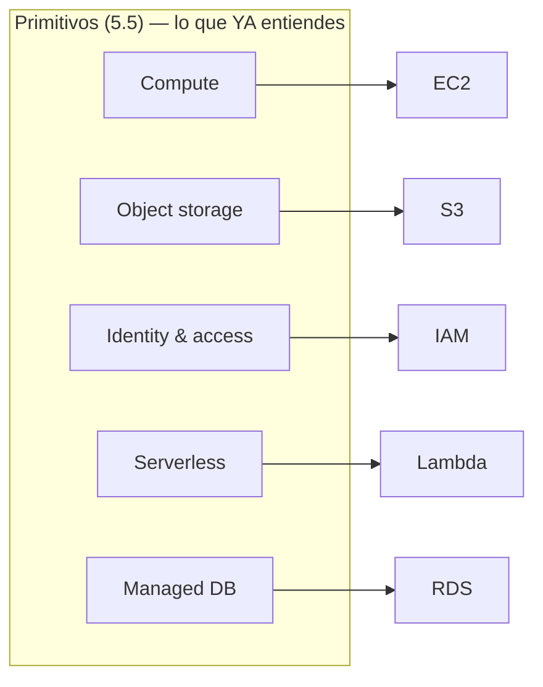
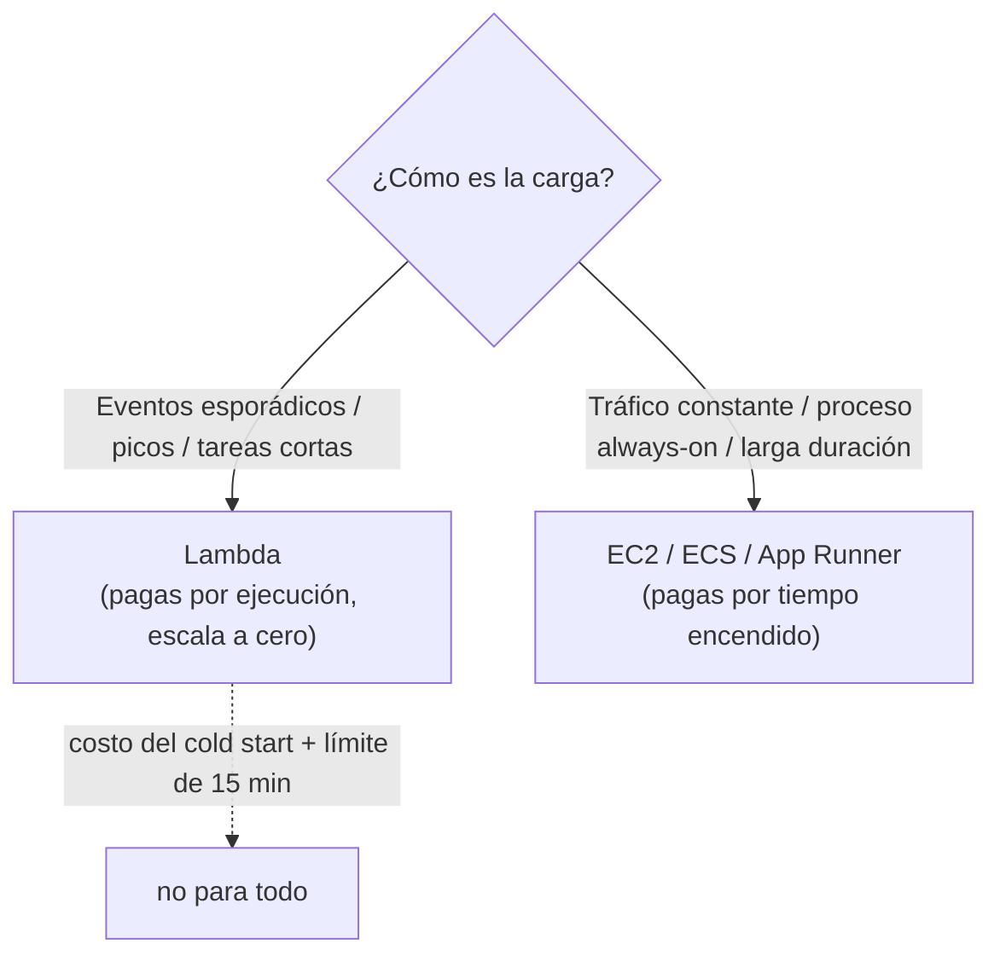

import Reto from "@components/Reto.astro";
import Solucion from "@components/Solucion.astro";
import Quiz from "@components/Quiz.astro";
import CheckDominio from "@components/CheckDominio.astro";
import Nivel from "@components/Nivel.astro";

<Nivel nivel="intermedio" />

:::note[Esta sub-unidad es opcional / profundización]
La **ruta crítica** de cloud es la [5.5 Cloud troncal](/fase-5-devops/5-5-cloud-troncal/): **un solo proveedor**, a fondo, hasta desplegar de verdad. Esta lección y la [5.6 Azure](/fase-5-devops/5-6-azure/) son **profundizaciones**: agregan un segundo cloud o cubren el que elegiste como troncal. No necesitas las dos. Tómala si **AWS es tu troncal**, o si Azure es tu troncal y quieres **el AWS mínimo para pasar filtros** (aparece en ~30% de las ofertas). Si vas con el tiempo justo: termina la ruta crítica primero y vuelve a esta cuando un trabajo concreto te lo pida.
:::

El secreto que esta lección quiere meterte en la cabeza es liberador: **no estás aprendiendo un cloud nuevo desde cero, estás aprendiendo un vocabulario nuevo para conceptos que ya tienes**. En la [5.5](/fase-5-devops/5-5-cloud-troncal/) aprendiste cinco primitivos —compute, object storage, identity & access, serverless functions, managed database—. AWS, Azure y Google Cloud son **la misma cocina con los ingredientes en cajones distintos y etiquetas distintas**. La VM se llama EC2 en AWS y Virtual Machine en Azure; el bucket es S3 acá y Blob Storage allá; el control de acceso es IAM o Entra ID. Si entendiste los primitivos, "aprender AWS" es, en gran parte, aprender el diccionario. Eso es lo que vas a hacer acá, sin volver a explicar qué es una VM o por qué existe un object store.

:::tip[Si ya tocaste AWS (consola, una EC2, un bucket de S3)]
Quizás levantaste una instancia EC2, subiste archivos a un bucket, o pegaste tus access keys en un `~/.aws/credentials`. Bien: tienes el reflejo de "esto se hace en la consola". La trampa del que "ya lo usó" es haber aprendido **clics sueltos sin el modelo mental**: no sabe por qué su access key pegada en el código es el anti-patrón #1, ni qué es un **IAM role** frente a un **IAM user**, ni que el "free tier de 12 meses" que recuerda **dejó de existir** para cuentas nuevas en julio de 2025. Dos preguntas separan el hábito del cargo-cult: ¿sabes mapear los 5 servicios de esta lección a los **primitivos** de la 5.5 sin pensarlo? ¿Y sabes darle a una app en EC2 acceso a un bucket **sin escribir una sola access key**? Salta a la práctica (sección 6) y a los ejercicios (sección 7). Si los cierras, valida con el check de dominio (sección 8). Si te descubres pensando "subo mi access key a la instancia y listo", el problema está en la sección 5.
:::

## 1. Qué vas a saber hacer

Al terminar, sin IA y sin notas, podrás:

- **O1 — Mapear los cinco servicios troncales de AWS (EC2, S3, IAM, Lambda, RDS) a los primitivos de cloud de la [5.5](/fase-5-devops/5-5-cloud-troncal/)**, y dar el equivalente en Azure de cada uno, explicando que un segundo cloud es "el mismo concepto con otro nombre" y no un re-aprendizaje desde cero.
- **O2 — Diseñar el acceso de una app a recursos de AWS aplicando least privilege**: distinguir IAM user vs IAM role, explicar por qué las **access keys de larga vida son el anti-patrón** y cómo una app en EC2/Lambda usa un **role** (credenciales temporales) sin escribir secretos, y escribir una **policy JSON mínima** para una tarea concreta.
- **O3 — Estimar el costo y el riesgo de una arquitectura simple en AWS**, explicando el **nuevo modelo de free tier 2026** (créditos, no 12 meses gratis), por qué "apagar una RDS no es gratis", y cuándo Lambda (event-driven) gana o pierde frente a un servidor always-on.

## 2. Por qué importa (el dinero está aquí)

> 💰 **Por qué importa:** las ofertas piden AWS en ~**30%** de los avisos (y Azure en ~17%). Si tu troncal es Azure, este es el **segundo cloud que te saca del filtro automático** de un reclutador que tipea "AWS" en el buscador de candidatos. Si tu troncal es AWS, esto es tu **casa**. En cualquier caso, el mercado no premia "tengo una cuenta de AWS": premia entender que **los clouds comparten primitivos** —el ingeniero que dice "lo hice en Azure pero en AWS es lo mismo: App Service → ECS/App Runner, Blob → S3, Entra → IAM" demuestra que aprendió **conceptos**, no clics—. Esa transferencia es exactamente lo que un equipo quiere de un semi-senior.

Tres razones lo vuelven un buen retorno por poco esfuerzo:

1. **La transferibilidad es el skill, no el proveedor.** Memorizar AWS no te hace ingeniero de cloud; entender que cada cloud expone los mismos cinco primitivos te hace alguien que aterriza en **cualquier** stack en una semana. Un cloud profundo (5.5) + el diccionario del segundo (esta lección) vale más que dos clouds a medias.
2. **IAM es la pregunta de seguridad que más se equivoca.** "¿Cómo le das a tu app acceso a un bucket sin pegar credenciales?" es una pregunta de entrevista clásica, y el 80% responde mal (pega una access key). Responder "un **IAM role** con una policy de **least privilege**; la app toma credenciales temporales del *instance metadata*, cero secretos en el código" te separa al instante. Es el [hilo de seguridad](/fase-3-backend/3-13-owasp-top10-web/) aplicado al cloud.
3. **El costo de AWS muerde a los nuevos en 2026.** El free tier cambió: ya no son 12 meses de allowances, son **créditos** que se agotan. Saber poner un **AWS Budget** con alarma el día 1 es la diferencia entre "experimenté gratis" y "me llegó una boleta de USD 80 por una RDS que olvidé prendida". Eso conecta directo con la [5.8 Costos cloud](/fase-5-devops/5-8-costos-cloud/).

## 3. Lo que ya traes (actívalo)

Esta lección **no parte de cero**: traduce cosas que ya tienes. Recupéralas antes de seguir:

- De la [5.5 Cloud troncal](/fase-5-devops/5-5-cloud-troncal/): los **cinco primitivos** (compute, object storage, identity & access, serverless, managed DB) y el principio de **least privilege**. Hoy les ponemos los nombres de AWS.
- De la [5.1 Docker](/fase-5-devops/5-1-docker/): tu app vive en un **contenedor**. En AWS un contenedor corre en ECS/Fargate o App Runner; una VM cruda es EC2. Saber la diferencia te ahorra plata.
- De la [5.4 Seguridad y supply chain](/fase-5-devops/5-4-seguridad-supply-chain-ci/): el reflejo de **mínimo privilegio** (`permissions: contents: read`). IAM es el mismo principio, ahora sobre recursos de la nube en vez de sobre el `GITHUB_TOKEN`.
- De la [3.13 OWASP web](/fase-3-backend/3-13-owasp-top10-web/): "los secretos van en el entorno, nunca en el código". Un IAM role lleva esa idea al extremo: **no hay secreto que filtrar** porque las credenciales son temporales y las inyecta la propia nube.

Antes de seguir, responde de memoria:

<Quiz
  question="En la 5.5 aprendiste los primitivos de cloud de forma genérica. ¿Qué significa, entonces, 'aprender AWS como segundo cloud'?"
  options={[
    "Empezar de cero: AWS no tiene nada que ver con el cloud que ya aprendiste",
    "Aprender, sobre todo, el vocabulario y las particularidades de AWS para primitivos que ya entiendes (VM=EC2, object store=S3, identidad=IAM, etc.), más sus trade-offs propios",
    "Memorizar los más de 200 servicios de AWS, porque cada uno es único e irreemplazable",
  ]}
  answer={1}
  explanation="Los clouds comparten los mismos primitivos. Si entendiste compute / storage / identity / serverless / managed DB en la 5.5, aprender un segundo cloud es en gran parte aprender el diccionario (cómo se llama cada cosa) y sus particularidades de costo y configuración. No es re-aprender qué es una VM. Esa transferencia es justo lo que el mercado valora de un semi-senior, y por eso AWS está marcado como profundización: el concepto pesado ya lo cargaste en la 5.5."
/>

## 4. Ejemplo resuelto, pensado en voz alta

Voy a tomar **la API que construiste en la [Fase 3](/fase-3-backend/3-8-backend-fastapi/)** (FastAPI + Postgres, que sube y procesa archivos) y voy a razonar, servicio por servicio, **cómo la llevo a AWS**. No memorices los nombres: sigue el razonamiento de *"qué necesito → qué primitivo es → cómo se llama en AWS"*.

### 4.1 El mapa: primitivo → AWS (y su equivalente Azure)

Antes de tocar nada, fijo la tabla de traducción. Esta tabla **es** la lección; lo demás son detalles.

| Necesito… | Primitivo (5.5) | AWS | Azure (5.6) |
|---|---|---|---|
| Correr una VM/servidor | Compute | **EC2** (VM cruda) · ECS/Fargate/App Runner (contenedores) | Virtual Machines · App Service |
| Guardar archivos/blobs | Object storage | **S3** | Blob Storage |
| Controlar quién hace qué | Identity & access | **IAM** | Entra ID + RBAC |
| Correr código por evento | Serverless functions | **Lambda** | Functions |
| Base de datos relacional gestionada | Managed DB | **RDS** (PostgreSQL/MySQL…) | Azure Database for PostgreSQL |
| Guardar secretos | (config 12-factor) | Secrets Manager / SSM Parameter Store | Key Vault |
| Logs y métricas | Observabilidad | **CloudWatch** | Monitor / App Insights |



Razono el mapa: *"Mi app FastAPI necesita un lugar donde correr (**compute** → EC2 o, mejor para un contenedor, ECS/Fargate). Sube archivos: eso es **object storage** → S3 (no los guardo en el disco del servidor, que es efímero —principio [12-factor](/fase-5-devops/5-2-12-factor/) de procesos sin estado). Tiene una base de datos: **managed DB** → RDS Postgres. Hay una tarea que se dispara cuando llega un archivo (generar un thumbnail, extraer texto): eso grita **serverless** → Lambda. Y todo —absolutamente todo— está atravesado por **IAM**: quién puede leer el bucket, quién puede escribir en la base, qué permisos tiene la Lambda. IAM no es un servicio más: es el sistema nervioso."*

### 4.2 S3 — el object store (y por qué tus archivos NO van al disco)

```bash
# Crear un bucket (el nombre es GLOBAL y único en todo AWS; usa un prefijo tuyo)
aws s3 mb s3://acme-app-uploads-prod

# Subir y listar
aws s3 cp ./factura.pdf s3://acme-app-uploads-prod/facturas/factura.pdf
aws s3 ls s3://acme-app-uploads-prod/facturas/
```

Razono: *"S3 guarda **objetos** (un blob + metadata) dentro de **buckets**, no archivos en carpetas —el `facturas/` es un prefijo del key, no un directorio real—. ¿Por qué no guardo los uploads en el disco de la EC2? Porque el disco es **efímero y no compartido**: si la instancia muere o escalo a dos, los archivos se pierden o no están en ambas. S3 es **durable** (11 nueves de durabilidad), barato, y accesible desde cualquier compute. La regla de oro: **estado afuera del compute**."* Por defecto un bucket es **privado** —y debe seguir así: los buckets públicos por error son una de las filtraciones de datos más comunes de la historia del cloud.

### 4.3 IAM — el sistema nervioso (aquí vive el 80% de la seguridad)

Esto es lo único que de verdad tienes que internalizar de AWS. IAM tiene cuatro piezas:

| Pieza | Qué es | Ejemplo |
|---|---|---|
| **Policy** | Un documento JSON que dice **qué acciones** sobre **qué recursos** se permiten/niegan | "permitir `s3:GetObject` sobre `acme-app-uploads-prod/*`" |
| **User** | Una identidad de **larga vida** para un humano o app, con contraseña o access keys | (a evitar para apps; ver más abajo) |
| **Role** | Una identidad **sin credenciales fijas**: quien la *asume* recibe credenciales **temporales** | el rol que asume tu EC2 o tu Lambda |
| **Instance profile** | El "enchufe" que conecta un **role** a una **EC2** | hace que tu app reciba el rol automáticamente |

La policy de least privilege para que mi app **lea** (y nada más) ese bucket:

```json
{
  "Version": "2012-10-17",
  "Statement": [
    {
      "Sid": "LeerUploads",
      "Effect": "Allow",
      "Action": ["s3:GetObject"],
      "Resource": "arn:aws:s3:::acme-app-uploads-prod/*"
    }
  ]
}
```

Razono la pieza más importante de toda la lección: *"¿Cómo le doy esta policy a mi app? El camino **malo** —el que hace todo el mundo— es crear un IAM **user**, generar sus **access keys** (un par `AKIA...` + secreto), y pegarlas en la EC2 o en una variable de entorno. Eso es una credencial de **larga vida**: si se filtra (un commit, un log, un backup), un atacante tiene acceso permanente hasta que alguien la rote a mano. Es el equivalente cloud de [hardcodear un password](/fase-3-backend/3-13-owasp-top10-web/). El camino **bueno**: creo un IAM **role** con esta policy, lo adjunto a la EC2 vía un **instance profile**, y mi código no escribe **ninguna** credencial. boto3 (el SDK de Python) busca solas las credenciales temporales en el *instance metadata* —la propia nube se las inyecta y las rota cada pocas horas—. Cero secretos que filtrar."*

```python
import boto3

# NO hay access keys por ningún lado: boto3 resuelve credenciales del
# instance profile (EC2) o del execution role (Lambda) automáticamente.
s3 = boto3.client("s3")
obj = s3.get_object(Bucket="acme-app-uploads-prod", Key="facturas/factura.pdf")
contenido = obj["Body"].read()
```

> **El reflejo que tienes que grabar:** *si tu código de AWS tiene una access key escrita, casi siempre está mal.* Apps en AWS → **roles** (credenciales temporales). Las access keys de larga vida quedan para casos sin alternativa (un script en tu laptop, una herramienta externa que no soporta roles), y aun ahí AWS recomienda credenciales temporales. Para **humanos**, la recomendación 2026 es no crear IAM users sino entrar por **IAM Identity Center** (antes "AWS SSO"), que da sesiones cortas que expiran.

### 4.4 EC2 vs contenedores — dónde corre la app

```bash
# Lanzar una VM Linux pequeña, CON el role adjunto (--iam-instance-profile)
aws ec2 run-instances \
  --image-id ami-xxxxxxxx \
  --instance-type t3.micro \
  --iam-instance-profile Name=app-lee-uploads \
  --key-name mi-llave-ssh
```

Razono el trade-off: *"**EC2** es una VM cruda: yo administro el SO, los parches, el runtime. Es el primitivo de compute más flexible y el que mencionan las ofertas, pero también el que más mantengo. Para mi contenedor de FastAPI, lo **moderno** es no usar EC2 directo sino **ECS/Fargate** (corre contenedores sin administrar la VM) o **App Runner** (le das una imagen, te da una URL HTTPS con autoscaling). Enseño EC2 porque es el modelo mental de 'una máquina en la nube' y porque está en los avisos; pero en producción, para un contenedor, prefiero el servicio gestionado. La pregunta no es 'EC2 sí o no', es '¿cuánta infra quiero administrar yo?'."*

### 4.5 RDS — la base de datos gestionada (gestionada ≠ gratis, ≠ serverless)

```bash
aws rds create-db-instance \
  --db-instance-identifier app-prod \
  --engine postgres \
  --db-instance-class db.t4g.micro \
  --allocated-storage 20 \
  --master-username appadmin \
  --manage-master-user-password   # AWS guarda y rota el password en Secrets Manager
```

Razono: *"**RDS** me da un PostgreSQL gestionado: AWS hace los backups, los parches, el failover. Lo que NO hace es ser gratis ni apagarse solo: una RDS `db.t4g.micro` **cobra por hora mientras exista**, la uses o no. 'Apagarla' la para máximo 7 días y luego se reenciende. Si quiero que escale a cero, eso es **Aurora Serverless v2**, otra cosa. Fíjate en `--manage-master-user-password`: en vez de inventar yo un password y arriesgarme a filtrarlo, AWS lo genera, lo guarda en **Secrets Manager** y lo rota —el [12-factor](/fase-5-devops/5-2-12-factor/) llevado a la base."*

### 4.6 Lambda — código que corre por un evento

Esta es la parte más distinta a lo que conoces, así que la modelo entera. Una Lambda es **una función que la nube ejecuta cuando pasa algo** (llega un archivo a S3, entra un request a una API, dispara un timer). No administras servidor: subes la función y AWS la corre, escala y cobra **solo por los milisegundos que ejecuta**.

```python
# handler.py — se dispara cuando se sube un objeto a un bucket de S3
import boto3

s3 = boto3.client("s3")

def handler(event, context):
    # 'event' trae los registros del trigger de S3. Extraigo bucket y key.
    registro = event["Records"][0]["s3"]
    bucket = registro["bucket"]["name"]
    key = registro["object"]["key"]

    obj = s3.get_object(Bucket=bucket, Key=key)
    tamano = obj["ContentLength"]

    print(f"Procesando s3://{bucket}/{key} ({tamano} bytes)")  # va a CloudWatch Logs
    return {"status": "ok", "bucket": bucket, "key": key, "bytes": tamano}
```

Razono la anatomía: *"Toda Lambda en Python es una **función con la firma `handler(event, context)`**. `event` es un dict cuya forma depende de **quién la disparó** (un evento de S3 trae `Records`; un API Gateway trae el HTTP request). `context` trae metadata de la ejecución. El `print` no se pierde: va a **CloudWatch Logs** automáticamente —esa es la observabilidad de la [5.10](/fase-5-devops/5-10-observabilidad/) puesta gratis—. Y esta Lambda también necesita un **role** (su *execution role*) con permiso `s3:GetObject`: mismo principio de least privilege, sin access keys."* Configuro el runtime en **`python3.13`** (el LTS recomendado en 2026; también está `python3.14`, y `python3.10` se deja de soportar el 31 de octubre de 2026).

El trade-off que define cuándo usar Lambda:



Razono el trade-off: *"Lambda **brilla** en cargas event-driven y con picos: si mi tarea corre 200 veces al día por 2 segundos, pagar solo esos segundos es ridículamente barato y no administro nada. Lambda **pierde** si tengo tráfico constante 24/7: ahí un contenedor always-on sale más barato, y además Lambda tiene el **cold start** (la primera invocación tras un rato de inactividad arranca más lento) y un techo de **15 minutos** por ejecución. 'Serverless siempre es mejor' es un mito: es mejor *para el patrón correcto*."*

## 5. Errores que vas a tener (y por qué)

:::caution[Podrías pensar que aprender AWS es empezar de cero después de aprender otro cloud]
No. Los clouds comparten los **mismos primitivos**: compute, object storage, identity, serverless, managed DB. Aprender el segundo es, en un 80%, aprender el **diccionario** (EC2=VM, S3=blob store, IAM=control de acceso) y las particularidades de costo/configuración. El concepto pesado —*qué es y para qué sirve un object store*— ya lo cargaste en la [5.5](/fase-5-devops/5-5-cloud-troncal/). Por eso esta lección es profundización: si tuvieras que re-aprender todo, sería ruta crítica. El ingeniero que dice "en Azure lo hice con Blob, en AWS es S3, mismo concepto" demuestra justo el skill transferible que paga.
:::

:::caution[Podrías pensar que para que tu app acceda a un bucket le pegas tus access keys]
Ese es **el** anti-patrón de seguridad en AWS. Una access key (`AKIA...` + secreto) es una credencial de **larga vida**: si se filtra (un commit, un log, una variable mal puesta), el atacante tiene acceso permanente hasta que alguien la rote a mano —y normalmente nadie se entera—. La forma correcta para una app es un **IAM role**: la app (en EC2 o Lambda) recibe credenciales **temporales** que la propia nube inyecta y rota; **no hay secreto que filtrar**. Para humanos, **IAM Identity Center** con sesiones cortas. Si ves una access key escrita en código de producción, asume que está mal hasta que se demuestre lo contrario.
:::

:::caution[Podrías pensar que el free tier de AWS te da 12 meses gratis (como recordabas)]
Eso **cambió en julio de 2025**. Las cuentas nuevas ya **no** tienen los 12 meses de allowances de EC2/RDS/S3. El modelo nuevo es por **créditos**: hasta USD 200 (USD 100 al registrarte + USD 100 por completar actividades), y el plan gratuito **expira a los 6 meses o cuando se agotan los créditos**, lo que pase primero. Las viejas allowances de 12 meses solo aplican a cuentas creadas **antes** de esa fecha. Consecuencia práctica: una RDS olvidada prendida **te consume créditos y luego te cobra**. Pon un **AWS Budget con alarma** el día 1 (lo verás en la [5.8](/fase-5-devops/5-8-costos-cloud/)). "Lo dejo corriendo, total es gratis" es exactamente cómo llega la primera boleta sorpresa.
:::

:::caution[Podrías pensar que RDS es "una base de datos serverless" que se apaga sola]
RDS es un **PostgreSQL/MySQL gestionado corriendo en una instancia**: AWS administra backups, parches y failover, pero **cobra por hora mientras la instancia exista**, la uses o no. "Apagarla" (stop) la para como máximo **7 días** y luego se reenciende sola. La base que escala a cero y cobra por uso es **Aurora Serverless v2**, que es otro producto. Confundirlos lleva a presupuestos irreales ("pensé que solo pagaba cuando consultaba"). Gestionado ≠ serverless ≠ gratis.
:::

:::caution[Podrías pensar que Lambda (serverless) siempre es más barato y mejor que un servidor]
Depende del **patrón de carga**. Lambda gana en lo event-driven y con picos: pagas solo los milisegundos que corre y escala a cero. Pero con **tráfico constante 24/7**, un contenedor always-on (ECS/App Runner) suele salir más barato; y Lambda arrastra el **cold start** (latencia extra tras inactividad) y un límite duro de **15 minutos** por ejecución. Un proceso largo o de tráfico parejo en Lambda puede ser más caro y más lento. La pregunta correcta no es "¿serverless?", es "¿cómo es mi carga?".
:::

:::caution[Podrías pensar que para correr tu contenedor de Docker necesitas una EC2]
Puedes, pero rara vez es lo mejor. Una **EC2** es una VM cruda donde tú instalas y mantienes Docker, el SO, los parches. Para un contenedor, AWS tiene servicios gestionados: **ECS/Fargate** (corre contenedores sin administrar la VM) y **App Runner** (le das la imagen, te da una URL HTTPS con autoscaling y TLS). EC2 sigue siendo el modelo mental de "una máquina en la nube" y aparece en los avisos, pero elegir EC2 para algo que ya empaquetaste en Docker suele ser elegir más trabajo de operación del necesario.
:::

## 6. Práctica con andamiaje (que se desvanece)

Tres pasos, de más apoyo a menos. Hazlos **a mano primero**: en IAM, "ejecutar" es leer el JSON y predecir qué deja pasar.

### 6.1 PREDICT — ¿qué permite esta policy? ¿es least privilege?

Lee esta policy **sin ejecutarla** y responde antes de abrir la solución:

```json
{
  "Version": "2012-10-17",
  "Statement": [
    {
      "Effect": "Allow",
      "Action": "s3:*",
      "Resource": "*"
    }
  ]
}
```

1. ¿Qué acciones permite, exactamente, sobre qué recursos?
2. Tu app solo necesita **leer** objetos de **un** bucket. ¿Esta policy es least privilege? ¿Por qué?
3. ¿Qué podría hacer un atacante si roba las credenciales de algo que tenga esta policy?

<Solucion title="Ver la respuesta (solo después de predecir)">
1. `s3:*` = **todas** las acciones de S3 (leer, escribir, borrar objetos, crear y **eliminar buckets enteros**, cambiar políticas de acceso). `Resource: "*"` = sobre **todos** los buckets de la cuenta, no uno.
2. No, es lo opuesto a least privilege. La app necesitaba `s3:GetObject` sobre `arn:aws:s3:::un-bucket/*`. Esta policy le da las llaves de todo S3 de la cuenta.
3. Con esas credenciales robadas, el atacante puede **borrar todos tus buckets y su contenido**, exfiltrar datos de cualquier bucket, o sobrescribir objetos. Una policy `s3:*` + `Resource: *` en algo expuesto es un incidente esperando a pasar. La regla: **enumera las acciones exactas y restringe el recurso al ARN concreto.**
</Solucion>

### 6.2 Parsons — ordena los pasos para dar acceso SIN access keys

Estos pasos le dan a una app en EC2 acceso de lectura a un bucket **de la forma correcta** (sin escribir credenciales). Ordénalos:

```text
A. El código usa boto3 sin pasar credenciales (las toma del instance metadata)
B. Crear un IAM role con una trust policy que permita a EC2 asumirlo
C. Adjuntar una policy de least privilege (solo s3:GetObject sobre ese bucket) al role
D. Lanzar/asociar la EC2 con el instance profile del role
E. Verificar que NO hay ninguna access key escrita en el código ni en variables
```

<Solucion title="Ver el orden correcto">
Orden: **B → C → D → A → E**.

1. **B** Creas el **role** y defines quién puede asumirlo (la *trust policy*: "el servicio EC2 puede asumir este role").
2. **C** Le adjuntas la **policy de least privilege** (solo la acción y el recurso necesarios).
3. **D** Asocias el **instance profile** del role a la EC2 (el "enchufe" que conecta role↔instancia).
4. **A** Tu código usa **boto3 sin credenciales**: el SDK las resuelve solas del *instance metadata* (credenciales temporales que la nube rota).
5. **E** Confirmas que **no hay ninguna access key** por ningún lado: si la hay, volviste al anti-patrón.

La moraleja: la app **nunca ve un secreto de larga vida**. El acceso se otorga por **identidad** (el role), no por **posesión de una llave**. Ese es el corazón de IAM bien hecho.
</Solucion>

### 6.3 MODIFY — endurece este execution role de Lambda

Tu Lambda solo lee objetos de `s3://app-uploads/` y escribe sus logs. Alguien le puso esta policy "para que funcione rápido". Corrígela a least privilege (a mano, sin IA):

```json
{
  "Version": "2012-10-17",
  "Statement": [
    {
      "Effect": "Allow",
      "Action": "*",
      "Resource": "*"
    }
  ]
}
```

<Solucion title="Ver el arreglo y por qué">
`Action: "*"` + `Resource: "*"` es **AdministratorAccess de facto**: esa Lambda puede hacer **cualquier cosa en toda la cuenta** (borrar bases, crear usuarios, apagar instancias). Si su código tiene un bug o la comprometen, el daño es total. Least privilege:

```json
{
  "Version": "2012-10-17",
  "Statement": [
    {
      "Sid": "LeerUploads",
      "Effect": "Allow",
      "Action": ["s3:GetObject"],
      "Resource": "arn:aws:s3:::app-uploads/*"
    },
    {
      "Sid": "EscribirLogs",
      "Effect": "Allow",
      "Action": ["logs:CreateLogStream", "logs:PutLogEvents"],
      "Resource": "arn:aws:logs:*:*:log-group:/aws/lambda/*"
    }
  ]
}
```

El patrón: **enumera solo las acciones que el código de verdad invoca, y acota cada recurso a su ARN.** Si la Lambda solo lee y loguea, eso es exactamente lo que su role debe permitir —nada más—. "Le pongo `*` para que no falle" es cómo se construye una superficie de ataque.
</Solucion>

## 7. Ejercicios Primero-Sin-IA

Ahora sin andamiaje. Resuélvelos **a mano, sin IA** dentro del timebox. El primero es de **diseño/razonamiento** (se corrige por la calidad de tu criterio, no hay test); el segundo es de **código** y se autocorrige con un test que corre en tu máquina sin tocar AWS.

<Reto title="AWS para tu capstone: mapea servicios y diseña el acceso con least privilege" timebox="35–45 min">

Vas a planificar, en papel, cómo desplegarías **el capstone de la fase** (una API con archivos + base de datos + una tarea por evento) en AWS, demostrando que entiendes el mapeo de primitivos y la higiene de IAM.

Produce `diseno.md` con:

1. **Tabla de mapeo**: para cada necesidad del capstone (correr la API, guardar archivos, base de datos, tarea disparada por subida de archivo, logs, secretos), indica el **primitivo** (5.5), el **servicio AWS** y su **equivalente en Azure**. Mínimo 6 filas.
2. **Decisión de compute con trade-off**: ¿EC2, ECS/Fargate/App Runner, o Lambda para la API? Justifica en 3–4 líneas según el patrón de carga (no "porque sí").
3. **Diagrama** (Mermaid o a mano fotografiado) de la arquitectura: qué habla con qué.
4. **IAM**: escribe la **policy JSON de least privilege** para que la tarea por evento (Lambda) lea el bucket de uploads y escriba sus logs. Explica en 2 líneas **por qué usas un role y no access keys**.
5. **Costo/riesgo**: 3 líneas sobre el **free tier 2026** (qué cambió) y qué pondrías el día 1 para no llevarte una boleta sorpresa.

**Hecho significa:**
- [ ] La tabla mapea ≥6 necesidades a primitivo + AWS + Azure, sin errores de traducción.
- [ ] La decisión de compute tiene un trade-off defendible (carga → servicio), no una preferencia sin razón.
- [ ] La policy IAM es **least privilege** real: acciones enumeradas (no `*`) y recurso acotado a ARN (no `*`).
- [ ] Explicas por qué un **role** (credenciales temporales) y no una access key de larga vida.
- [ ] Mencionas el cambio del free tier 2026 y una medida concreta de control de costo (p. ej. AWS Budget con alarma).
- [ ] Puedes **explicar sin notas** el mapeo de los 5 servicios a sus primitivos.

Entregable: `diseno.md`. No hay test automático: se corrige por la **calidad de tu criterio** con la rúbrica.

Enunciado completo y material: `ejercicios/fase-5/aws-mapeo-diseno/` (carpeta del repo).

<Solucion title="Pista (ábrela solo si superaste el timebox)">
Para la tabla, parte de la de la sección 4.1 pero **deriva** cada fila de una necesidad del capstone, no la copies entera. Para el compute: una API con tráfico parejo no es el caso ideal de Lambda (cold start + always-on caro) —piensa qué patrón favorece cada opción—. Para la policy, mira el ejercicio 6.3: enumera **solo** las acciones que la Lambda invoca de verdad (leer S3, escribir logs) y acota el `Resource` al ARN del bucket y del log group. Para el costo, recuerda que el free tier dejó de ser "12 meses gratis": ¿qué herramienta te avisa antes de gastar? Pista, no solución.
</Solucion>

</Reto>

<Reto title="Lambda S3-triggered: handler + política IAM mínima, testeado sin AWS" timebox="40–45 min">

Escribes una **AWS Lambda** (Python) que se dispara cuando se sube un objeto a S3, extrae `bucket` y `key` del evento, consulta el tamaño del objeto y devuelve un resumen. La gracia: lo dejas **testeable sin AWS ni red**, separando la **lógica pura** (parsear el evento) del **efecto** (hablar con S3, que se inyecta).

En la carpeta del ejercicio hay un `handler.py` con la firma puesta (no la cambies), un evento de S3 de ejemplo (`evento_s3.json`) y un test (`tests/test_handler.py`) que verifica tu lógica con un **cliente S3 falso** (sin tocar AWS).

Tu trabajo:

1. Implementa `parsear_evento(event) -> tuple[str, str]` que extraiga `(bucket, key)` de un evento de S3, lanzando `ValueError` si el evento no trae `Records`.
2. Implementa `handler(event, context, s3_client=None)`: usa `parsear_evento`, llama a `s3_client.get_object(...)`, y devuelve `{"status": "ok", "bucket": ..., "key": ..., "bytes": ...}`. Si `s3_client` es `None`, créalo con `boto3.client("s3")` (así el test puede inyectar el falso).
3. Escribe en `policy.json` la **policy IAM de least privilege** del execution role: solo `s3:GetObject` sobre el bucket del evento y permiso de escribir logs.
4. Corre `pytest` hasta el verde y agrega **un caso de prueba tuyo** (p. ej. un evento sin `Records` debe lanzar `ValueError`).

**Hecho significa:**
- [ ] `pytest` pasa: `parsear_evento` y `handler` funcionan con el cliente falso, sin tocar AWS.
- [ ] `parsear_evento` lanza `ValueError` ante un evento sin `Records` (caso borde).
- [ ] `handler` acepta `s3_client` inyectable (testeable) y no escribe **ninguna** access key.
- [ ] `policy.json` es least privilege: `s3:GetObject` acotado a ARN + permisos de logs; nada de `*`.
- [ ] Agregaste al menos un test propio.
- [ ] Puedes **explicar sin notas** por qué inyectar el cliente hace la Lambda testeable y qué role necesita en AWS.

Entregable: `handler.py` + `policy.json` + tu test. Corre `uv run pytest` (o `pytest`) hasta el verde.

Enunciado completo y starter: `ejercicios/fase-5/aws-lambda-s3-procesador/` (carpeta del repo).

<Solucion title="Pista (ábrela solo si superaste el timebox)">
La forma del evento de S3 es `event["Records"][0]["s3"]["bucket"]["name"]` y `...["object"]["key"]` —ábrela en `evento_s3.json` y navega el dict—. Para `parsear_evento`, valida `if not event.get("Records"): raise ValueError(...)` antes de indexar. Para hacer el handler testeable sin red, el truco es la **inyección de dependencia**: `def handler(event, context, s3_client=None)` y dentro `s3_client = s3_client or boto3.client("s3")`; el test te pasa un objeto falso con un método `get_object` que devuelve `{"ContentLength": 123}`. Para la policy, copia el patrón del ejercicio 6.3 (dos statements: leer S3 + escribir logs). Pista, no solución.
</Solucion>

</Reto>

## 8. Check de dominio

Sin mirar la lección, en voz alta o por escrito:

<CheckDominio
  items={[
    "Mapear EC2, S3, IAM, Lambda y RDS a sus primitivos de cloud (5.5) y dar el equivalente en Azure de cada uno.",
    "Explicar por qué aprender un segundo cloud es 'aprender el diccionario', no empezar de cero.",
    "Explicar la diferencia entre un IAM user y un IAM role, y por qué una app debe usar un role.",
    "Explicar por qué las access keys de larga vida son el anti-patrón y cómo una app en EC2/Lambda accede a S3 sin escribir credenciales.",
    "Escribir de memoria una policy IAM de least privilege para 'leer un solo bucket' (acciones enumeradas + ARN acotado).",
    "Explicar qué cambió en el free tier de AWS en 2026 y qué pondrías el día 1 para no llevarte una boleta sorpresa.",
    "Explicar por qué RDS no es serverless ni gratis, y qué significa 'apagar' una instancia RDS.",
    "Decir cuándo Lambda gana frente a un servidor always-on y cuándo pierde (cold start, límite de 15 min, patrón de carga).",
  ]}
/>

Si marcaste menos de seis, vuelve a la sección correspondiente **antes** de avanzar. No es un examen: es honestidad contigo.

<Quiz
  question="Tu API en una EC2 necesita leer archivos de un bucket de S3. ¿Cuál es la forma correcta de darle acceso?"
  options={[
    "Crear un IAM user, generar sus access keys y ponerlas en una variable de entorno de la EC2",
    "Crear un IAM role con una policy de least privilege (solo s3:GetObject sobre ese bucket), adjuntarlo a la EC2 con un instance profile, y dejar que boto3 tome las credenciales temporales solo",
    "Hacer el bucket público para que cualquiera (incluida tu app) pueda leerlo sin credenciales",
  ]}
  answer={1}
  explanation="La forma correcta es un IAM role con least privilege adjuntado a la instancia vía instance profile: la app recibe credenciales TEMPORALES que la nube inyecta y rota, sin que tú escribas ningún secreto. La opción de las access keys es el anti-patrón (credencial de larga vida que, si se filtra, da acceso permanente). Hacer el bucket público es peor todavía: expone tus datos a todo internet. 'Acceso por identidad (role), no por posesión de una llave' es el corazón de IAM."
/>

<Quiz
  question="Creaste una cuenta nueva de AWS en 2026 y dejaste una RDS db.t4g.micro corriendo 'porque el free tier la cubre'. ¿Qué pasa?"
  options={[
    "Nada: el free tier de 12 meses cubre la RDS sin costo, como siempre",
    "El free tier 2026 ya NO da 12 meses gratis: son créditos (hasta USD 200) que la RDS consume por hora; al agotarse o a los 6 meses, empiezan los cobros. Sin un Budget con alarma, te llega una boleta sorpresa",
    "La RDS se apaga sola al acabarse los créditos, así que es imposible que te cobren",
  ]}
  answer={1}
  explanation="Desde julio de 2025 las cuentas nuevas no tienen las allowances de 12 meses: el modelo es por créditos (hasta USD 200) y el plan gratis expira a los 6 meses o cuando se agotan, lo que pase primero. Una RDS cobra por hora mientras exista (no se apaga sola), así que consume créditos y luego cobra. Por eso un AWS Budget con alarma el día 1 es la medida básica de higiene de costo —y conecta directo con la 5.8."
/>

## 9. Recursos (documentación oficial primero)

- **AWS — Getting started / "What is AWS":** [aws.amazon.com/getting-started](https://aws.amazon.com/getting-started/) — el punto de entrada oficial.
- **IAM — Security best practices:** [docs.aws.amazon.com/IAM/latest/UserGuide/best-practices.html](https://docs.aws.amazon.com/IAM/latest/UserGuide/best-practices.html) — léelo entero: es la fuente del "roles, no access keys" y del least privilege.
- **IAM Identity Center (acceso de humanos):** [docs.aws.amazon.com/singlesignon/latest/userguide/what-is.html](https://docs.aws.amazon.com/singlesignon/latest/userguide/what-is.html).
- **EC2 — User Guide:** [docs.aws.amazon.com/ec2](https://docs.aws.amazon.com/ec2/) · **S3 — User Guide:** [docs.aws.amazon.com/s3](https://docs.aws.amazon.com/s3/) · **RDS — User Guide:** [docs.aws.amazon.com/rds](https://docs.aws.amazon.com/rds/).
- **Lambda — Building functions with Python (runtimes y handler):** [docs.aws.amazon.com/lambda/latest/dg/lambda-python.html](https://docs.aws.amazon.com/lambda/latest/dg/lambda-python.html).
- **boto3 — Credentials (el orden en que el SDK busca credenciales):** [boto3.amazonaws.com/v1/documentation/api/latest/guide/credentials.html](https://boto3.amazonaws.com/v1/documentation/api/latest/guide/credentials.html).
- **AWS Free Tier (modelo 2026):** [aws.amazon.com/free](https://aws.amazon.com/free/) y la actualización oficial: [aws.amazon.com/blogs/aws/aws-free-tier-update](https://aws.amazon.com/blogs/aws/aws-free-tier-update-new-customers-can-get-started-and-explore-aws-with-up-to-200-in-credits/).
- **AWS Budgets (poner una alarma de costo):** [docs.aws.amazon.com/cost-management/latest/userguide/budgets-managing-costs.html](https://docs.aws.amazon.com/cost-management/latest/userguide/budgets-managing-costs.html).

## 10. Conexión con el capstone de la fase

El **[Capstone F5 — Pipeline completo a producción](/fase-5-devops/proyecto/)** se puede desplegar en **cualquier** cloud; su *Definition of Done* no exige AWS. Esta lección te da **AWS como una de las opciones** y, sobre todo, el criterio para defender tu elección:

- Si despliegas el capstone en AWS, ya sabes **qué servicio elegir para cada primitivo** (compute para la API, S3 para archivos, RDS para la base, Lambda para tareas por evento) y **cómo darles acceso con least privilege** (roles, no keys) —eso es parte del punto de **seguridad** del DoD.
- El **ADR** del capstone ("¿por qué este cloud y estos servicios?") sale directo del razonamiento de la sección 4: mapeo de primitivos + trade-off de compute + control de costo. Un evaluador valora un ADR que dice "elegí App Runner sobre EC2 porque mi carga es un contenedor con tráfico variable y no quiero administrar la VM" mucho más que "usé AWS".
- El **CloudWatch** de tus logs/métricas es el insumo de la [5.10 Observabilidad](/fase-5-devops/5-10-observabilidad/), y el **AWS Budget** es el de la [5.8 Costos](/fase-5-devops/5-8-costos-cloud/): esta lección los enchufa en el ecosistema concreto.

Y mira hacia adelante: el mismo IAM de least privilege que practicaste acá es el cimiento de la seguridad de **agentes** en la [Fase 6](/fase-6-ai-engineering/) y [Fase 7](/fase-7-automatizacion/). Cuando un agente ejecute acciones en sistemas externos, "qué permisos tiene y sobre qué recursos" será **exactamente** esta pregunta —*Excessive Agency* (OWASP LLM06) es least privilege aplicado a un agente—. La idea no cambia; cambia qué la ejecuta.

## 11. Reflexión y repaso espaciado

Cierra escribiendo dos o tres frases respondiendo: **antes de esta lección, ¿qué creías que era "aprender AWS"? ¿En qué cambió tu definición al verlo como un diccionario sobre primitivos que ya tenías?** Nombrar ese cambio —de "memorizar 200 servicios" a "mapear 5 primitivos y entender sus trade-offs"— es medir lo que aprendiste, y es justo el discurso que un reclutador quiere oír.

Gancho de **spaced repetition**:

- **Mañana:** dibuja **de memoria** (sin abrir esta página) la tabla primitivo → AWS → Azure de los 5 servicios. Si te falla uno, vuelve a la sección 4.1.
- **En 3 días:** explica en voz alta, a alguien (o a la cámara), por qué pegar una access key en tu app está mal y cómo un IAM role lo resuelve sin secretos. Si dudas, repasa la 4.3.
- **En 1 semana:** escribe de memoria una policy IAM de least privilege para "una Lambda que lee un bucket y escribe logs". Compárala con la del ejercicio 6.3. Si te salió un `*` donde no debía, ya sabes dónde repasar.
