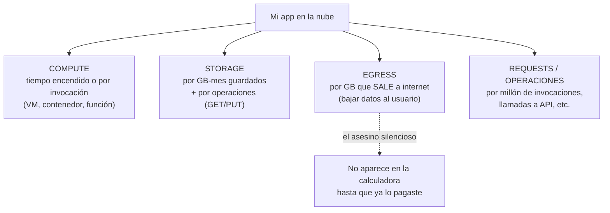
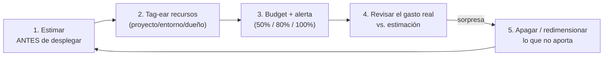

import Reto from "@components/Reto.astro";
import Solucion from "@components/Solucion.astro";
import Quiz from "@components/Quiz.astro";
import CheckDominio from "@components/CheckDominio.astro";
import Nivel from "@components/Nivel.astro";

<Nivel nivel="intermedio" />

Ya tienes una app que corre en la nube ([5.5](/fase-5-devops/5-5-cloud-troncal/)): un contenedor con una URL pública, una base de datos managed, archivos en object storage. Funciona. Y por eso mismo es peligrosa: cada recurso que prendiste tiene un taxímetro corriendo, y la nube **no te llama para avisarte** que algo se disparó. Te manda la factura a fin de mes. Esta lección te enseña a leer ese taxímetro **antes** de que te sorprenda.

No es un tema decorativo. Es la diferencia entre desplegar tu portafolio por USD 5 al mes y despertar con un cargo de USD 600 por un bucket mal configurado o una VM que dejaste prendida "para probar". Y cuando tu app empiece a llamar a un LLM (Fase 6), cada request cuesta dinero medible: sin este hábito, una demo viral te puede costar el sueldo. Aquí montas el cinturón de seguridad.

:::tip[Si ya tocaste una factura cloud (Azure, AWS, GCP, Vercel…)]
¿Ya viste un dashboard de billing, o te llegó un cobro más alto de lo que esperabas? Bien: tienes la intuición de "esto cuesta". La trampa del que "ya lo usó" es haberlo mirado **después** (forense, no preventivo) y sin saber **qué** línea de la factura es cuál. Tres preguntas separan el hábito del susto: ¿sabes nombrar los **cuatro grandes drivers de costo** (compute, storage, egress, requests) y cuál suele ser el asesino silencioso? ¿Sabes por qué un **NAT Gateway** o una VM encendida cuestan plata **aunque no las uses**? ¿Tienes un **budget con alerta** puesto en tu cuenta ahora mismo? Si las tres te salen sin dudar, salta a los **ejercicios Primero-Sin-IA** (sección 7): el primero te hace escribir un estimador de costos a mano; el segundo, auditar una factura disparada. Si te trabas, era un falso "ya lo sé": quédate.
:::

## 1. Qué vas a saber hacer

Al terminar, sin IA y sin notas, podrás:

- **O1 — Explicar el modelo de pricing de la nube** descomponiéndolo en sus cuatro drivers (**compute, storage, egress, requests**) y explicar **por qué el egress y los recursos encendidos** son las trampas que más sorprenden, con números de referencia.
- **O2 — Estimar el costo mensual de una arquitectura ANTES de desplegarla**: dada una app y una tabla de precios, calcular un total aproximado, distinguiendo el costo de un recurso *always-on* del de uno que *escala a cero*, y tratando correctamente el tramo gratis de egress.
- **O3 — Diseñar el control de costos de un proyecto** (FinOps básico): **tags** para atribuir gasto, un **budget con alertas** por umbral, y la decisión de qué apagar o redimensionar —justificando cada palanca.

## 2. Por qué importa (el dinero está aquí)

> 💰 **Por qué importa:** "Nociones de costos cloud (importante para apps de IA)." En el mundo real, el costo no es un detalle contable: es una **decisión de ingeniería**. Un sistema que cumple los requisitos pero cuesta 10x lo necesario es un mal diseño, igual que uno lento o inseguro. Las ofertas de la banda que persigues piden cada vez más **FinOps awareness**: saber estimar, etiquetar, poner budgets y explicar por qué elegiste serverless en vez de una VM. "No sé cuánto cuesta esto" es una respuesta que te descarta.

Tres razones lo vuelven una habilidad de carrera, no un truco de ahorrador:

1. **El costo es un requisito no funcional, como la latencia o la seguridad.** Un ingeniero semi-senior no entrega "funciona": entrega "funciona, cuesta X al mes, y aquí está por qué no cuesta 5X". Esa frase, dicha con números, es lo que distingue a quien diseñó el sistema de quien copió un tutorial.
2. **Las apps de IA amplifican el riesgo.** Una request a un LLM cuesta dinero por token (lo verás en detalle en la [6.16 costo/latencia](/fase-6-ai-engineering/) y la [6.3 APIs de LLM](/fase-6-ai-engineering/)). Multiplica eso por usuarios reales, agrega un retry mal configurado o un loop de agente sin techo de costo, y tienes una factura de cuatro cifras. El hábito de estimar y poner topes que aprendes aquí es **el mismo** que te salva en Fase 6 y 7.
3. **Las historias de terror son reales y públicas.** Cada pocas semanas alguien tuitea una factura de USD 70.000 por un bucket S3 que un bot martilló, o por un servicio serverless en un loop infinito. Casi siempre la causa raíz es la misma: **no había un budget con alerta, y no se estimó antes de desplegar**. Tú vas a tener ambos.

## 3. Lo que ya traes (actívalo)

Esta lección **se apoya en toda la fase**. Recupéralo antes de seguir:

- De la [5.5 Cloud troncal](/fase-5-devops/5-5-cloud-troncal/): los seis primitivos. Cada uno tiene su propia forma de cobrar. **Compute** cobra por tiempo encendido (o por invocación). **Object storage** cobra por GB guardados + por operaciones. La **base de datos managed** cobra por tamaño + compute. Esta lección le pone **precio** a ese mapa.
- De la [5.2 12-factor](/fase-5-devops/5-2-12-factor/): "procesos sin estado" y "escala horizontal". Un proceso stateless **puede escalar a cero** cuando nadie lo usa; ahí está el ahorro más grande de una app de portafolio. Si guardaste estado en el disco, no puedes apagarlo, y pagas 24/7.
- De la [5.1 Docker](/fase-5-devops/5-1-docker/): una imagen más liviana se descarga más rápido y, en algunos servicios, **arranca antes** (menos cold start) y transfiere menos bytes. El multi-stage build que hiciste ahí también ahorra plata.

Antes de seguir, responde de memoria:

<Quiz
  question="Tienes dos formas de correr el mismo backend de tu portafolio que recibe ~50 visitas al día: (A) una VM pequeña encendida 24/7, o (B) un servicio de contenedores managed que escala a cero cuando no hay tráfico. Para ESTE patrón de uso, ¿cuál cuesta menos y por qué?"
  options={[
    "La VM (A): tener algo fijo siempre es más barato que pagar por arranques",
    "El serverless/scale-to-zero (B): con tráfico esporádico pagas casi solo por los segundos que realmente atiende requests; la VM cobra las 730 horas del mes aunque esté inactiva el 99% del tiempo",
    "Cuestan exactamente lo mismo: el total depende solo de cuántas requests llegan",
  ]}
  answer={1}
  explanation="Con tráfico bajo e intermitente, scale-to-zero gana de calle: una VM 'small' encendida 24/7 cuesta sus ~730 horas/mes pase lo que pase, mientras el contenedor managed cobra casi solo el tiempo que atiende las 50 visitas. La VM solo gana cuando el tráfico es alto y sostenido (ahí el costo por request del serverless supera al fijo de la VM). Elegir el modelo de compute según el PATRÓN de tráfico es la primera decisión de costo."
/>

## 4. Ejemplo resuelto, pensado en voz alta

Voy a tomar **tu API de producción** (capstone F3/F5: FastAPI + PostgreSQL + fotos en object storage) y voy a **estimar su costo mensual antes de desplegar**, razonando cada número en voz alta. El objetivo no es la cifra exacta —los precios cambian y varían por región— sino el **método**: descomponer, poner precio a cada parte, y cazar la trampa.

:::caution[Los números de aquí son precios de referencia 2026, no verdades eternas]
Uso precios de la región US East a mediados de 2026 para que el ejemplo sea concreto. **Siempre verifica en la calculadora oficial del proveedor** (sección 9) antes de decidir: cambian, y dependen de región. El método sobrevive; los centavos no.
:::

### 4.1 El modelo mental: la nube cobra por cuatro cosas

Olvida la factura de 200 líneas. El 95% de tu gasto cae en **cuatro baldes**:



Razono: *"Para estimar, le pongo precio a cada balde por separado y sumo. Y antes de confiar en el total, me pregunto: ¿de cuál de los cuatro me voy a olvidar? Casi siempre es **egress** —porque ingress (subir) es gratis y uno asume que bajar también— o es **compute encendido sin querer**. Esos dos me los marco en rojo desde ya."*

### 4.2 Compute: lo que cobra el taxímetro

Mi contenedor de FastAPI. Dos escenarios para el mismo tráfico bajo (portafolio, ~50 visitas/día):

| Modelo | Cómo cobra | Estimación (tráfico bajo) |
|---|---|---|
| **VM pequeña 24/7** | Por hora encendida: **730 horas/mes**, llueva o truene | Una VM "small" a ~USD 0,02/hora ≈ **USD 15/mes fijos** |
| **Contenedor scale-to-zero** | Por los segundos de CPU/memoria que realmente atiende requests; **0 cuando duerme** | Con 50 visitas/día cortas: **≈ USD 1–3/mes** (a menudo entra en el free grant) |

*"Mismo trabajo, 5–15x de diferencia. Para un portafolio elijo scale-to-zero sin dudar. ¿Cuándo cambiaría? Si el tráfico fuera alto y constante (miles de requests/min sostenidas), el costo por invocación del serverless superaría el fijo de la VM, y ahí la VM o un contenedor 'siempre prendido' con réplicas ganaría. Es una decisión por **patrón de tráfico**, no por moda."*

### 4.3 Storage: barato… hasta que te descuidas

Las fotos de perfil de mis usuarios en object storage. Object storage es **barato por GB**:

- S3 Standard ≈ **USD 0,023 por GB-mes**; Azure Blob Hot ≈ **USD 0,018 por GB-mes** (precios de referencia 2026).
- 10 GB de fotos ≈ **USD 0,18–0,23/mes**. Insignificante.

*"El GB guardado casi no cuesta. Lo que se acumula es: (1) las **operaciones** (cada GET/PUT se cobra por millón —en general centavos, pero un app que lista archivos en loop suma), y (2) lo que pasa cuando esos 10 GB se **descargan** muchas veces. Eso último no es storage: es **egress**. Y ahí viene el golpe."*

### 4.4 Egress: el asesino silencioso

Aquí es donde casi todos se queman. La regla:

- **Ingress (subir datos a la nube) = gratis.** Siempre.
- **Egress (sacar datos a internet) = se cobra por GB**, después de un tramo gratis.
- Desde 2024, AWS y Azure regalan los **primeros 100 GB/mes** de egress. Pasado eso: AWS ≈ **USD 0,09/GB**, Azure ≈ **USD 0,087/GB** (referencia 2026).

Estimo el egress de mi app. Cada visita que ve fotos descarga, digamos, 2 MB. Con 50 visitas/día = ~3 GB/mes. *"Eso cae dentro de los 100 GB gratis → **USD 0**. Respiro."* Pero hago el ejercicio de "¿y si funciona?": si una foto se vuelve viral y sirvo 1.500 GB en un mes:

```text
egress facturable = 1500 GB − 100 GB gratis = 1400 GB
costo = 1400 × USD 0,09 = USD 126
```

*"USD 126 por servir imágenes que en storage me costaban centavos. Esa es la lección: el costo no está en **guardar** los datos, está en **moverlos**. Por eso existe el CDN —cachear cerca del usuario para no pagar egress de origen cada vez— y por eso transferir entre regiones o entre zonas también cuesta."*

:::caution[El NAT Gateway: la trampa de egress que casi nadie ve venir]
Si pones tu contenedor en una red privada (VPC) y necesita salir a internet (p. ej. a llamar la API de un LLM), el tráfico suele pasar por un **NAT Gateway**. Ese aparato cobra **doble**: ~USD 0,045/hora **solo por existir** (≈ USD 33/mes, 24/7, aunque no pase ni un byte) **más** ~USD 0,045 por GB procesado, **encima** del egress normal de USD 0,09/GB. Resultado: el tráfico a internet te puede costar **~USD 0,135/GB** —el triple de lo que dice la página de pricing— y un mínimo fijo de ~USD 33/mes que aparece de la nada. Es uno de los cargos "¿de dónde salió esto?" más comunes. Para un portafolio: evita meter compute en subredes privadas con NAT si no lo necesitas, o usa endpoints/gateway endpoints que no cobran ese paso.
:::

### 4.5 La base de datos managed y el total

Mi PostgreSQL managed es el otro fijo: una instancia "burstable" pequeña ≈ **USD 13–20/mes** (compute + el storage del disco, que sí es persistente). Sumo el escenario realista (tráfico bajo):

| Driver | Estimación mensual |
|---|---|
| Compute (contenedor scale-to-zero) | ~USD 2 |
| PostgreSQL managed (instancia pequeña) | ~USD 15 |
| Object storage (10 GB fotos + ops) | ~USD 0,30 |
| Egress (3 GB, dentro del tramo gratis) | USD 0 |
| **Total estimado** | **≈ USD 17/mes** |

*"Diecisiete dólares para una app de portafolio con usuarios reales. Razonable. Y lo importante: ahora **sé de dónde sale cada dólar**. Si la factura llega en USD 80, sé que la sorpresa está en egress o en algo que dejé encendido —no estoy adivinando. Eso es FinOps: no solo pagar menos, sino **no ser sorprendido**."*

### 4.6 El cinturón de seguridad: estimar no basta, hay que poner topes

La estimación es la mitad. La otra mitad es el **control en la cuenta real**, por si la estimación falla o algo se descontrola:



- **Tags:** una etiqueta `proyecto=portafolio`, `entorno=prod`, `dueño=alvaro` en cada recurso. Sin tags, la factura es una sopa: no sabes si el gasto vino del backend, de la DB o de una prueba que olvidaste borrar. Con tags, agrupas el gasto y lo atribuyes.
- **Budget + alertas:** defines "este proyecto no debería pasar de USD 30/mes" y el proveedor te avisa por correo al **50%, 80% y 100%** (e incluso al forecast: "vas camino a pasarte"). Esto es lo que convierte una factura de USD 70.000 en un correo al día 3 diciendo "ojo, vas al 80%".
- **Apagar lo que no aporta:** el ahorro más grande de un portafolio no es optimizar; es **apagar**. La VM de pruebas del mes pasado, el disco huérfano de una DB que borraste, el load balancer de un experimento. Lo que está encendido y no sirve es plata quemada.

## 5. Errores y malentendidos frecuentes

:::caution[Cosas que parecen verdad y te cuestan caro]

- **"Subir datos es gratis, así que bajar también."** **Falso y carísimo.** Ingress es gratis; **egress se cobra**. Es la confusión #1 detrás de las facturas sorpresa. Servir muchas descargas (imágenes, videos, datasets) es lo que dispara el costo, no guardarlas.

- **"Lo apagué" cuando en realidad solo lo detuviste.** En muchos servicios, "detener" (stop) una VM **deja de cobrar el compute pero sigue cobrando el disco** asociado, y un disco/IP que quedó "sin dueño" sigue facturando. Borrar el recurso es distinto de pausarlo. Los **recursos huérfanos** (discos sin VM, snapshots viejos, IPs reservadas sin usar) son un goteo constante.

- **"Lo importante es bajar el precio por GB de storage."** Casi nunca. El storage suele ser la línea más **barata**. Optimizar centavos de storage mientras ignoras el egress o una VM encendida 24/7 es barrer la casa mientras se inunda el sótano. **Mide antes de optimizar**: ataca el balde grande.

- **"Con scale-to-zero y serverless no me puedo pasar de presupuesto."** **Peligrosamente falso.** Scale-to-zero ahorra en tráfico bajo, pero un bug, un loop, un ataque o un retry mal puesto puede invocar tu función un millón de veces en una hora. Sin un **budget con alerta** (y, para IA, un **techo de costo** explícito), el serverless escala tu factura igual de bien que tu tráfico.

- **"Free tier = gratis para siempre."** No. Casi todos los free tiers son **12 meses** o un grant mensual limitado. Lo que era gratis en el mes 1 puede empezar a cobrar en el mes 13 sin avisar. Por eso el budget va igual, aunque "esté en free tier".

- **"El egress siempre se cobra."** Matiz importante 2026: desde 2024, los **primeros 100 GB/mes son gratis** (AWS y Azure), y hay **egress gratis si abandonas el proveedor** llevándote todos tus datos (impulsado por el EU Data Act, con condiciones: cerrar la cuenta, plazo, solicitud). No es para tu operación diaria, pero saberlo te quita el miedo al lock-in en una entrevista.

:::

## 6. Práctica con andamiaje (resuélvelo conmigo antes de soltarte)

Antes del Reto formal, predice. Tengo un estimador a medio escribir. Suma compute + storage + egress, **pero el egress está mal: no aplica el tramo gratis de 100 GB.**

```python
PRECIO_GB_MES = 0.023        # storage object, USD/GB-mes
PRECIO_EGRESS_GB = 0.09      # USD/GB que SALE a internet
EGRESS_GRATIS_GB = 100       # primeros 100 GB/mes gratis

def costo_egress(egress_gb: float) -> float:
    # BUG: cobra todos los GB, ignora el tramo gratis
    return egress_gb * PRECIO_EGRESS_GB

# Caso: la app sirve 80 GB este mes (por debajo del tramo gratis)
print(costo_egress(80))
```

**Predice (sin ejecutar):** ¿qué imprime esta función para 80 GB, y qué *debería* imprimir si el tramo gratis estuviera bien aplicado?

<Solucion title="Ver la predicción y el arreglo (ábrela después de predecir)">

La función con el bug imprime `7.2` (80 × 0,09 = USD 7,20). Pero 80 GB está **dentro** de los primeros 100 GB gratis, así que **debería costar USD 0**. El arreglo descuenta el tramo gratis y nunca cobra por debajo de él:

```python
def costo_egress(egress_gb: float) -> float:
    facturable = max(0, egress_gb - EGRESS_GRATIS_GB)  # solo lo que excede el tramo gratis
    return facturable * PRECIO_EGRESS_GB

assert costo_egress(80) == 0           # dentro del tramo gratis
assert round(costo_egress(150), 2) == 4.5   # (150 − 100) × 0.09
```

Esta es exactamente la clase de error que vuelve una estimación inútil: o cobras de más (asustas sin razón) o, peor, **olvidas el egress entero** y subestimas la factura. El `max(0, ...)` es el detalle que separa una estimación que sirve de una que miente.

</Solucion>

## 7. Ejercicios Primero-Sin-IA

Dos ejercicios. El primero es código (lo verifica `pytest`); el segundo es de razonamiento/diseño (lo corrige tu IA con la rúbrica). En ambos: **primero a mano, sin IA**. Es el método de [TDD](/fase-2-ingenieria-software/) aplicado al dinero —escribe el caso, hazlo pasar, refactoriza.

<Reto title="Escribe un estimador de costos cloud (con la trampa del egress)" timebox="40 min">

Implementa, **a mano y sin IA**, la función `estimar_costo_mensual(arquitectura, precios)` que calcula el costo mensual aproximado de una arquitectura **antes de desplegarla**. Debe descomponer en los cuatro drivers y, sobre todo, **tratar bien el egress** (tramo gratis) y el compute *always-on* vs *scale-to-zero*.

Hay un `test_estimador.py` que define el contrato. Tu función debe, como mínimo:

- cobrar el **compute** por horas encendidas (730 = todo el mes; menos = scale-to-zero);
- cobrar el **storage** por GB-mes;
- cobrar el **egress** solo por encima del **tramo gratis** (nunca negativo);
- cobrar los **requests** por millón;
- devolver un **desglose por driver** además del total (para poder explicar de dónde sale cada dólar).

**Hecho significa:** `pytest` pasa en verde (incluido el caso de egress por debajo del tramo gratis = 0), añadiste **al menos un caso de prueba tuyo** (por ejemplo, el escenario del NAT Gateway always-on), y puedes explicar sin notas por qué el tramo gratis se modela con un `max(0, …)` y cuándo una VM 24/7 le gana al scale-to-zero.

Corre los tests:

```bash
uv run pytest        # o simplemente:  pytest
```

Carpeta del ejercicio: `ejercicios/fase-5/estimador-de-costos/`

</Reto>

<Reto title="Auditoría FinOps: una factura se disparó, encuentra por qué" timebox="40 min">

Te dan la arquitectura de una app de IA pequeña y su factura del mes, que llegó **mucho más alta** de lo esperado. Tu trabajo, **a mano y sin IA**, es la auditoría: encontrar las trampas de costo, proponer el control que faltaba (tags, budget + alertas, qué apagar), y rehacer una **estimación previa** que habría anticipado el golpe.

Entregas (markdown, en la carpeta del ejercicio): `hallazgos.md` (las trampas, ordenadas por impacto), `plan-finops.md` (tags + budget con umbrales + qué apagar/redimensionar) y `estimacion.md` (lo que debió estimarse antes de desplegar).

**Hecho significa:** identificaste al menos las trampas grandes (recurso always-on inútil, egress/NAT, sin budget, sin tags), ordenaste por **impacto en dólares** (no alfabético), tu plan tiene **umbrales de alerta concretos** y puedes defender cada recorte sin romper la app.

Carpeta del ejercicio: `ejercicios/fase-5/auditoria-finops/`

</Reto>

## 8. Check de dominio

Marca solo lo que puedas **explicar sin notas y sin IA** (active recall honesto):

<CheckDominio items={[
  "Nombrar los 4 drivers de costo cloud y dar un ejemplo de cada uno",
  "Explicar por qué ingress es gratis pero egress se cobra, y qué es el tramo gratis de 100 GB/mes",
  "Explicar cuándo una VM 24/7 cuesta menos que scale-to-zero y cuándo es al revés (por patrón de tráfico)",
  "Explicar por qué un NAT Gateway puede triplicar el costo del tráfico a internet y cobrar aunque no pase tráfico",
  "Distinguir 'detener' de 'borrar' un recurso, y dar un ejemplo de recurso huérfano que sigue facturando",
  "Describir el bucle de FinOps: estimar → tag → budget+alerta → revisar → apagar/redimensionar",
  "Explicar por qué el storage casi nunca es el balde a optimizar primero",
  "Conectar el techo de costo de una app cloud con el techo de costo de un agente de IA (F6/F7)",
]} />

Y una pregunta de cierre:

<Quiz
  question="Te llega una factura de USD 340 en un proyecto que estimaste en USD 20. Tienes 30 minutos. ¿Cuál es el PRIMER movimiento de mayor impacto?"
  options={[
    "Cambiar el storage a una clase más barata para bajar el costo por GB",
    "Reescribir la app para que use menos memoria",
    "Abrir el desglose de costos por servicio/tag, identificar el balde grande (casi siempre compute encendido de más o egress/NAT), y atacar ESE; recién entonces poner un budget con alerta para que no vuelva a pasar sin aviso",
    "Borrar toda la cuenta y empezar de nuevo en otro proveedor",
  ]}
  answer={2}
  explanation="FinOps es 'mide antes de optimizar'. La sorpresa de 17x no vino del storage (la línea más barata) ni de la memoria de la app: vino de un balde grande, casi siempre compute que quedó encendido o egress/NAT disparado. Sin abrir el desglose estás adivinando. Identificas el culpable, lo apagas/redimensionas, y pones el budget+alerta que faltaba para que la próxima sorpresa sea un correo al día 3, no una factura a fin de mes."
/>

## 9. Recursos

Documentación y herramientas **oficiales** primero (el concepto es estable; los precios cambian —siempre verifica la fecha y la región):

- **Calculadoras oficiales (úsalas ANTES de desplegar):** [AWS Pricing Calculator](https://calculator.aws/) · [Azure Pricing Calculator](https://azure.microsoft.com/pricing/calculator/). Arma tu arquitectura y mira el total estimado.
- **Egress / transferencia de datos:** [AWS: free tier de 100 GB de transferencia](https://aws.amazon.com/blogs/aws/aws-free-tier-data-transfer-expansion-100-gb-from-regions-and-1-tb-from-amazon-cloudfront-per-month/) · [Azure Bandwidth pricing](https://azure.microsoft.com/pricing/details/bandwidth/) · [AWS: egress gratis al abandonar AWS](https://aws.amazon.com/blogs/aws/free-data-transfer-out-to-internet-when-moving-out-of-aws/).
- **La trampa del NAT Gateway:** [Pricing oficial de NAT gateways (AWS VPC)](https://docs.aws.amazon.com/vpc/latest/userguide/nat-gateway-pricing.html). Lee la sección de *data processing* + *cross-AZ*.
- **Budgets y alertas:** [AWS Budgets — gestionar costos](https://docs.aws.amazon.com/cost-management/latest/userguide/budgets-managing-costs.html) · [Azure Cost Management — crear budgets](https://learn.microsoft.com/azure/cost-management-billing/costs/tutorial-acm-create-budgets). Pon uno hoy.
- **FinOps como disciplina:** [FinOps Foundation — Framework](https://www.finops.org/framework/). El vocabulario (inform, optimize, operate) que usan los equipos serios.
- **Precios de storage de referencia:** [S3 Pricing](https://aws.amazon.com/s3/pricing/) · [Azure Blob Storage pricing](https://azure.microsoft.com/pricing/details/storage/blobs/).

## 10. Conexión con el capstone

El [capstone de la Fase 5](/fase-5-devops/proyecto/) pide tu app **desplegada, con dominio y ≥3 usuarios reales**. El costo es parte del entregable, no un extra:

- El **estimador** (ejercicio 1) es tu boceto de presupuesto: antes de desplegar el capstone, estima cuánto costará al mes y déjalo escrito. Esa cifra va en tu write-up de trade-offs ("elegí scale-to-zero porque a este tráfico cuesta ~USD 17 vs. ~USD 30 de una VM 24/7").
- El **budget + alertas** (ejercicio 2) es un entregable concreto: tu cuenta cloud del capstone debe tener un budget con alerta puesto. Es la versión-costo del mismo reflejo que el [gate de seguridad en CI (5.4)](/fase-5-devops/5-4-seguridad-supply-chain-ci/): un freno automático antes de que el problema sea grande.
- Este hábito es **el mismo** que aplicarás como techo de costo de un agente de IA en el [capstone de F7](/fase-7-automatizacion-data/) y en el [budget de costo/latencia de F6](/fase-6-ai-engineering/). Aquí lo entrenas con dólares de infraestructura; allá, con dólares de tokens. La disciplina no cambia: estimar, medir en vivo, poner tope.

## 11. Reflexión y repaso espaciado

Responde en tu `RETROSPECTIVA.md` de la fase:

- ¿Cuál de los cuatro drivers te sorprendió más al ponerle número? (Para casi todos es el egress.)
- Si tu app de IA de la Fase 6 se volviera viral mañana —10.000 usuarios en un día— ¿qué línea de tu factura explotaría primero, y qué freno habrías querido tener puesto de antemano?
- ¿Tienes hoy, en tu cuenta cloud real, un budget con alerta puesto? Si no, ese es tu siguiente paso concreto. Pon uno.

**Repaso espaciado (no te saltes esto):**
- **Mañana:** reescribe de memoria los 4 drivers de costo y, para cada uno, una trampa que sorprende. Si no salen los 4, vuelve a la sección 4.
- **En 1 semana:** explícale a alguien (o a una IA, en voz alta) por qué el egress es el asesino silencioso y cómo el NAT Gateway lo empeora. Si te trabas, releé 4.4.
- **En 1 mes:** al desplegar el capstone de la Fase 6, vuelve aquí, estima su costo **antes** de subirlo y compáralo con la factura real del primer mes. La brecha entre tu estimación y la realidad es la mejor medida de cuánto aprendiste.

> "No sé cuánto cuesta" es la respuesta de junior. "Cuesta ~USD 17 al mes, el grueso es la DB managed, y tengo un budget que me avisa al 80%" es la de alguien a quien le confías producción. La nube no te va a recordar apagar la luz: ese reflejo es tuyo, y vale plata real.
