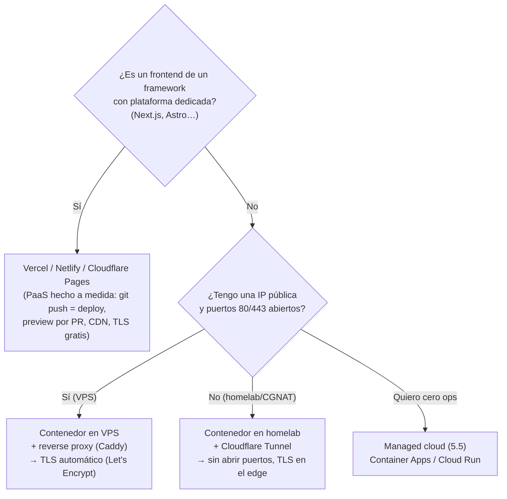
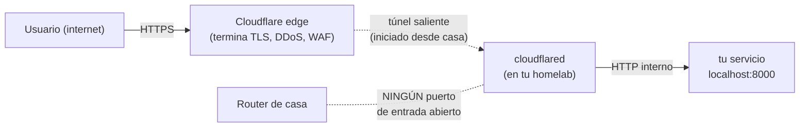
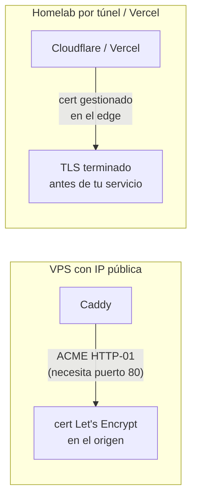

import Reto from "@components/Reto.astro";
import Solucion from "@components/Solucion.astro";
import Quiz from "@components/Quiz.astro";
import CheckDominio from "@components/CheckDominio.astro";
import Nivel from "@components/Nivel.astro";

<Nivel nivel="intermedio" />

En la [5.5](/fase-5-devops/5-5-cloud-troncal/) desplegaste tu API en un servicio managed de un cloud grande (Azure Container Apps). Eso es **una** ruta, y una buena. Pero el mercado y tu billetera no siempre la piden: tu frontend Next.js encaja mejor en una plataforma hecha a su medida; tu backend puede vivir perfecto en un VPS de USD 5 o en tu propio homelab; y a veces necesitas exponer un servicio que corre detrás del router de tu casa, **sin IP pública y sin abrir puertos**. Esta lección es el mapa de las opciones **reales y pragmáticas** de despliegue, y —más importante— el criterio para **elegir** entre ellas.

El error que esta lección desactiva es el del ingeniero que, para servir a 3 usuarios, monta un cluster de Kubernetes con tres nodos, un service mesh y un Helm chart de 400 líneas… y tarda dos semanas en lo que un `git push` y un `docker compose up` resuelven en una tarde. **Sobre-ingeniería es un bug**, no una señal de seniority. La señal de seniority es elegir la herramienta más simple que cumpla las restricciones reales y poder defender por qué.

:::tip[Si ya desplegaste algo (Vercel, un VPS, Cloudflare Tunnel…)]
¿Ya hiciste deploy de un Next.js en Vercel, levantaste un Docker en un VPS, o usaste Cloudflare Tunnel en tu homelab? Bien: tienes la intuición de "esto vive fuera de mi laptop". La trampa del que "ya lo usó" es haberlo hecho **a tientas**: el `.env` commiteado al repo "para que el deploy lo tenga", el puerto del router abierto a internet sin TLS, el `NEXT_PUBLIC_API_URL` apuntando a `localhost` en producción. Tres preguntas separan el hábito del cargo-cult: ¿sabes **cuándo** Vercel vence a un contenedor en un VPS y cuándo no? ¿Sabes por qué **Cloudflare Tunnel** es estrictamente más seguro que abrir el puerto 443 de tu router? ¿Y qué variable de tu frontend es **pública** (termina en el bundle del navegador) y cuál es un **secreto** que jamás debe salir del servidor? Si las tres te salen sin dudar, salta a los **ejercicios Primero-Sin-IA** (sección 7). Si te trabas, era un falso "ya lo sé": quédate.
:::

## 1. Qué vas a saber hacer

Al terminar, sin IA y sin notas, podrás:

- **O1 — Elegir la opción de despliegue correcta** entre Vercel/PaaS, contenedor en un VPS, homelab + Cloudflare Tunnel, y el managed cloud de la [5.5](/fase-5-devops/5-5-cloud-troncal/) — **según las restricciones de la app** (tipo de app, exposición, costo, control operacional) y **justificando el trade-off**, incluyendo por qué "no todo necesita Kubernetes".
- **O2 — Desplegar los dos artefactos del curso a un dominio con HTTPS:** el frontend Next.js (capstone F4) en **Vercel** con entornos *preview*/*production* y variables por ambiente; y un servicio en contenedor en un **VPS/homelab** detrás de un **reverse proxy con HTTPS automático** (Caddy).
- **O3 — Exponer un servicio del homelab a internet sin IP pública ni abrir puertos** con **Cloudflare Tunnel**, y **gestionar variables y secretos por ambiente** (dev/staging/prod) sin filtrarlos al repo ni al cliente.

## 2. Por qué importa (el dinero está aquí)

> 💰 **Por qué importa:** "Cloudflare Tunnel ya lo usas — formalízalo como skill." El capstone de esta fase exige tu app **con un dominio y ≥3 usuarios reales**. Para un reclutador, "lo tengo en mi homelab" sin URL pública **no cuenta**. Pero "monté Kubernetes para mi app de portafolio" tampoco suma: grita que no sabes dimensionar. Lo que paga la banda que persigues es el criterio: *dado este problema y este presupuesto, esto va en Vercel, esto en un VPS con Caddy, y esto se expone por un túnel — y aquí está el porqué de cada uno.*

Tres razones lo vuelven una bisagra de carrera:

1. **El criterio de simplicidad es un skill examinable.** "¿Por qué no Kubernetes?" es una pregunta real de entrevista. La buena respuesta no es "porque es difícil"; es "porque k8s resuelve orquestación de muchos servicios, auto-escalado y self-healing para equipos grandes — restricciones que mi app de 3 usuarios no tiene. Un VPS con `docker compose` y un reverse proxy cubre mi caso con una fracción de la complejidad operacional." Saber **cuándo NO** usar algo es tan senior como saber usarlo.
2. **Vercel + un VPS + un túnel cuesta casi nada y se ve profesional.** Un frontend Next.js en Vercel es gratis para un proyecto personal y trae *preview deploys* por cada Pull Request —exactamente la disciplina que muestra que sabes trabajar en equipo. Un VPS de USD 4–6/mes corre tu backend con TLS válido y dominio propio. Es la diferencia entre un portafolio que "corre en mi máquina" y uno que **cualquiera puede abrir desde su teléfono**.
3. **Cloudflare Tunnel es tu nicho concreto.** Exponer un servicio detrás de CGNAT (sin IP pública, el caso de la mayoría de las conexiones domésticas hoy) **sin abrir un solo puerto** es un truco que pocos candidatos conocen y que conecta directo con tu historia de homelab. Es el tipo de detalle pragmático que un *Forward-Deployed Engineer* usa para desplegar en la infra rara de un cliente.

## 3. Lo que ya traes (actívalo)

Esta lección **ensambla** piezas que ya tienes. Recupéralas antes de seguir:

- De la [5.1 Docker](/fase-5-devops/5-1-docker/): tienes una **imagen** y sabes correrla con **Docker Compose**. El deploy en un VPS/homelab es, casi literalmente, ese mismo `docker compose up` en una máquina que no es la tuya.
- De la [5.2 12-factor](/fase-5-devops/5-2-12-factor/): **config en el entorno** y **paridad dev/prod**. Aquí esos dos factores se vuelven concretos: las variables cambian por ambiente (dev/staging/prod) y se inyectan, nunca se hornean.
- De la [5.3 CI/CD](/fase-5-devops/5-3-cicd-github-actions/): el deploy es el **último job** del pipeline. En Vercel ese job lo corre la propia plataforma al hacer push; en un VPS, un job de GitHub Actions hace `ssh` y `docker compose pull && up`.
- De la [5.5 cloud troncal](/fase-5-devops/5-5-cloud-troncal/): el principio de **no guardar secretos** (managed identity) y **mínimo privilegio**. Aquí su gemelo es: no exponer puertos que no necesitas y no commitear el `.env`.
- Del capstone de la Fase 3 (tu API FastAPI) y de la Fase 4 (tu frontend Next.js): esos son los **dos artefactos concretos** que vamos a poner en producción.

Antes de seguir, responde de memoria:

<Quiz
  question="Tu app de portafolio sirve a 3 usuarios reales (tu pareja y dos amigos). Un tutorial te dice 'despliega con Kubernetes para que sea profesional'. ¿Cuál es la mejor decisión de ingeniería?"
  options={[
    "Usar Kubernetes: es el estándar de la industria y se ve mejor en el CV",
    "Un VPS con docker compose + un reverse proxy: cubre 3 usuarios con una fracción de la complejidad; Kubernetes resuelve escala y orquestación que esta app no tiene (YAGNI). Saber por qué NO es la respuesta senior",
    "Kubernetes pero con un solo nodo, para que sea más simple",
  ]}
  answer={1}
  explanation="Kubernetes resuelve orquestación de muchos servicios, auto-escalado y self-healing para equipos/escala que una app de 3 usuarios no tiene. Montarlo aquí es sobre-ingeniería (viola YAGNI) y añade enorme carga operacional sin beneficio. La respuesta que paga es el criterio: la herramienta más simple que cumple las restricciones reales, y poder defender por qué. 'k8s de un nodo' tiene casi toda la complejidad y ninguno de los beneficios."
/>

## 4. Ejemplo resuelto, pensado en voz alta

Voy a poner **toda la app del curso** en producción: el **frontend Next.js** (F4) y el **backend FastAPI + Postgres** (F3), con dominio propio y HTTPS, gastando casi nada. Razono cada decisión en voz alta. No memorices comandos: sigue el **criterio**.

### 4.1 El modelo mental: deploy es un espectro, eliges por restricciones

No hay "la forma correcta" de desplegar. Hay un espectro de **control vs. comodidad** (el mismo de la 5.5), y eliges por las restricciones reales de cada pieza:



Razono el mapa: *"Mi **frontend Next.js** tiene una plataforma construida exactamente para él (Vercel) que me da deploy por `git push`, previews por PR y CDN global gratis: sería tonto no usarla. Mi **backend** es un contenedor; ¿dónde lo pongo? Si tengo un VPS con IP pública, un reverse proxy con TLS automático. Si solo tengo mi homelab detrás del router de casa (sin IP pública), un **túnel**. Y si no quiero administrar **nada**, el managed cloud de la 5.5. Cuatro caminos, una pregunta: ¿qué restricción manda?"*

### 4.2 Frontend a Vercel: la plataforma hecha para Next.js

El frontend va a **Vercel** porque está construido por los autores de Next.js y elimina toda la fricción. El flujo es **GitOps puro**:

- **Conectas el repo** a Vercel (una vez). A partir de ahí, **el git es el deploy**:
  - push a la rama por defecto (`main`) → **deploy de producción**.
  - push a cualquier otra rama / abrir un Pull Request → **deploy de *preview*** con su propia URL (`tu-app-git-rama.vercel.app`). Cada PR es una app navegable para que tu pareja/QA la pruebe **antes** de mezclar.
- Para un deploy manual desde tu máquina, el CLI (versión 21+):

```bash
npm i -g vercel        # o: pnpm add -g vercel
vercel                 # primer deploy → preview (te pregunta y enlaza el proyecto)
vercel --prod          # deploy a producción
```

Razono: *"No escribo un Dockerfile para el frontend ni administro un servidor: Vercel detecta que es Next.js, lo construye y lo sirve en su CDN. Lo que **sí** configuro con cuidado son las **variables por ambiente** (4.5) y el **dominio** (4.6). Los previews por PR no son un lujo: son la prueba de que sé un flujo de equipo profesional."*

> Esto es una **decisión de arquitectura**: regístrala en un **ADR**. "Frontend en Vercel (no en mi VPS) porque es Next.js y gano previews/CDN/TLS sin operar nada; el backend va aparte porque tiene estado y necesita la DB." Una frase, te la van a preguntar.

### 4.3 Backend a un VPS con reverse proxy y HTTPS automático

El backend (FastAPI + Postgres) es un contenedor con estado: va a un **VPS** (un servidor Linux que alquilas, ej. USD 5/mes). El truco está en **no exponer el contenedor directo a internet**, sino ponerle delante un **reverse proxy** que haga tres trabajos: terminar **HTTPS**, enrutar por dominio, y ser el único puerto abierto.

Uso **Caddy** porque su mejor característica es **HTTPS automático**: pide y renueva el certificado de Let's Encrypt **solo**, sin que yo toque `openssl`. El `docker-compose.yml` en el VPS:

```yaml
services:
  api:
    image: ghcr.io/donpelusa/api-produccion:latest  # tu imagen del registry (5.3)
    restart: unless-stopped
    env_file: .env                  # config inyectada, NO horneada (12-factor)
    expose:
      - "8000"                      # visible SOLO en la red interna de compose
    # OJO: sin 'ports:' → el puerto 8000 NO se publica al host/internet.
    # El único que llega a la api es Caddy, por la red interna.

  caddy:
    image: caddy:2
    restart: unless-stopped
    ports:
      - "80:80"                     # único puerto público: lo necesita ACME (HTTP-01)
      - "443:443"                   # y el HTTPS real
    volumes:
      - ./Caddyfile:/etc/caddy/Caddyfile:ro
      - caddy_data:/data            # persiste los certificados entre reinicios

volumes:
  caddy_data:
```

Y el `Caddyfile` —dos líneas para HTTPS completo:

```caddyfile
api.midominio.com

reverse_proxy api:8000
```

Razono los puntos clave: *"(1) El servicio `api` usa `expose`, **no** `ports`: el `8000` solo existe en la red interna de Docker; desde internet **no se llega** a él directo, solo a través de Caddy. Esto es mínimo-exposición, el gemelo del mínimo-privilegio de la 5.5. (2) Caddy publica `80` y `443`: el `80` lo necesita el challenge de Let's Encrypt; el `443` es el HTTPS real. (3) La primera línea del `Caddyfile` es el dominio: con eso solo, Caddy obtiene y renueva el certificado automáticamente. (4) `reverse_proxy api:8000` enruta por el **nombre del servicio** de compose, no por IP. (5) El volumen `caddy_data` persiste los certificados: sin él, cada reinicio vuelve a pedirlos y choca con los límites de Let's Encrypt."*

Para que `api.midominio.com` resuelva al VPS, creo un **registro DNS A** apuntando al IP del servidor (en el panel de mi registrador o de Cloudflare). Eso es todo: DNS → IP del VPS → Caddy en el `443` → contenedor.

### 4.4 El caso del homelab: exponer sin IP pública con Cloudflare Tunnel

Ahora el caso real de un homelab: tu servidor corre en tu casa, **detrás del router**, y tu ISP no te da IP pública fija (CGNAT) o no quieres abrir puertos. La tentación es "abro el puerto 443 del router y redirijo a mi servidor". **No lo hagas.** Abrir un puerto del router:

- expone tu **IP de casa** (y por tanto tu ubicación aproximada) a todo internet;
- abre una superficie de ataque permanente a tu red doméstica;
- y muchas veces **ni siquiera funciona** bajo CGNAT (no tienes un puerto que abrir).

La solución es **Cloudflare Tunnel**: un proceso (`cloudflared`) que corre en tu homelab y abre una conexión **saliente** a Cloudflare. El tráfico de los usuarios llega al **edge de Cloudflare** (que termina el HTTPS) y baja por ese túnel hasta tu servicio. **Ningún puerto de entrada abierto.**



Hay dos formas de montarlo. La **gestionada remotamente** (recomendada con Docker): creas el túnel en el dashboard de Cloudflare (Zero Trust → Networks → Tunnels), defines ahí qué hostname mapea a `http://localhost:8000`, y te da **un token**. Lo corres así:

```bash
docker run cloudflare/cloudflared:latest tunnel --no-autoupdate run --token <TUNNEL_TOKEN>
```

El token es lo único que necesita el conector; las reglas (qué hostname → qué servicio) viven en el dashboard. La forma **gestionada localmente** (config en archivos, versionable en Git) usa el CLI:

```bash
cloudflared tunnel login                         # autoriza en el navegador (una vez)
cloudflared tunnel create homelab                # crea el túnel + un archivo de credenciales (UUID.json)
cloudflared tunnel route dns homelab api.midominio.com   # crea el CNAME al <UUID>.cfargotunnel.com
cloudflared tunnel run homelab                   # levanta el conector
```

…con un `config.yml` que define el enrutamiento (las **ingress rules**):

```yaml
tunnel: <UUID-del-tunel>
credentials-file: /root/.cloudflared/<UUID-del-tunel>.json
ingress:
  - hostname: api.midominio.com
    service: http://localhost:8000
  - service: http_status:404      # regla catch-all OBLIGATORIA al final
```

Razono: *"Con el túnel, mi servicio escucha en **HTTP plano** (`localhost:8000`): el HTTPS lo pone Cloudflare en su edge, así que no necesito Caddy ni Let's Encrypt en el origen para el caso homelab. La conexión es **saliente**, iniciada desde mi casa, así que el router no necesita ningún puerto abierto. La regla `http_status:404` al final del `ingress` es obligatoria: es el 'todo lo demás'. Y el `route dns` crea automáticamente el CNAME — no toco el DNS a mano."*

### 4.5 Variables y secretos por ambiente (dev/staging/prod)

Tu app corre en al menos tres ambientes y **las variables cambian en cada uno**. El error mortal en frontend es confundir una variable **pública** con un **secreto**:

| Variable | dev (local) | staging | prod | ¿Secreto? | ¿Dónde vive? |
|---|---|---|---|---|---|
| `NEXT_PUBLIC_API_URL` | `http://localhost:8000` | `https://api-staging.midominio.com` | `https://api.midominio.com` | **No, es PÚBLICA** | En Vercel por ambiente; **se hornea en el bundle del navegador** |
| `DATABASE_URL` | local | la de staging | la de prod | **Sí** | Solo en el backend (VPS `.env` / secret manager); **jamás** con prefijo `NEXT_PUBLIC_` |
| `OPENAI_API_KEY` | tu key dev | key staging | key prod | **Sí** | Solo en el servidor; nunca en el cliente |

Razono la trampa de Next.js: *"Cualquier variable que empieza con `NEXT_PUBLIC_` se **incrusta en el JavaScript que se descarga al navegador**. Es pública por diseño —sirve para la URL del API, que no es secreta. Pero si por descuido pongo `NEXT_PUBLIC_OPENAI_API_KEY`, ¡acabo de publicar mi clave a todo el que abra las DevTools! Los secretos viven **solo en el servidor**: el `.env` del VPS, o las variables de servidor de Vercel sin el prefijo `NEXT_PUBLIC_`."*

Y la regla de oro, gemela de la 5.5: **el `.env` nunca se commitea.** Va en `.gitignore`; al repo solo sube un `.env.example` con las **claves sin valores**. El deploy inyecta los valores reales (Vercel los guarda por ambiente; el VPS los lee de su `.env` local; un secret manager los provee).

### 4.6 Dominio + HTTPS: las dos estrategias

Recapitulo cómo cada pieza consigue su candado verde, porque la fuente del certificado **cambia según el camino**:



- **VPS público:** Caddy/Traefik obtiene el cert de Let's Encrypt vía el challenge **HTTP-01**, que requiere que el puerto **80** sea alcanzable. El TLS se termina **en tu servidor**.
- **Detrás de un túnel o en Vercel:** el TLS se termina en el **edge** (Cloudflare/Vercel) y tu servicio puede hablar HTTP plano internamente. No gestionas certificados.
- **Sin puerto 80 público pero quieres cert en el origen** (homelab con IP pública pero sin abrir el 80, o un wildcard `*.midominio.com`): usa el challenge **DNS-01**, que prueba el dominio creando un registro DNS por API en vez de exponer un puerto. (Es el camino de los reverse proxies con plugin de DNS de tu proveedor.)

El **dominio** lo apuntas según el caso: un **registro A** al IP del VPS, o un **CNAME** (que `cloudflared tunnel route dns` o Vercel crean por ti) al destino gestionado.

## 5. Errores y malentendidos

:::caution[Podrías pensar que… y por qué está mal]
- **"Para que sea profesional necesito Kubernetes."** No. Kubernetes resuelve orquestar **muchos** servicios, auto-escalado y self-healing para equipos/escala que tu app de portafolio no tiene. Para ≥3 usuarios, un VPS con `docker compose` y un reverse proxy es la decisión correcta. Montar k8s aquí es sobre-ingeniería: grita que no sabes dimensionar.
- **"Pongo mi frontend Next.js en mi VPS con Docker, igual que el backend."** *Puedes*, pero pierdes lo que Vercel te regala: previews por PR, CDN global, builds optimizados y TLS, todo sin operar nada. Para un portafolio, Vercel es el camino de menor fricción y mejor resultado. Reserva el VPS para lo que **tiene estado** (el backend, la DB).
- **"Abro el puerto 443 de mi router para exponer el homelab."** Expone tu IP de casa, abre superficie de ataque a tu red doméstica, y bajo CGNAT muchas veces ni funciona. **Cloudflare Tunnel** resuelve los tres problemas con una conexión saliente: cero puertos de entrada.
- **"Una variable `NEXT_PUBLIC_` es como cualquier otra."** No: `NEXT_PUBLIC_*` se **incrusta en el bundle del navegador**, es decir, es **pública**. Poner una API key ahí la publica a todo el mundo. Los secretos van solo en el servidor, **sin** ese prefijo.
- **"Commiteo el `.env` para que el deploy lo tenga."** Nunca. El `.env` va en `.gitignore`; al repo sube un `.env.example` con claves sin valores. Un secreto en el historial de Git está comprometido para siempre (aunque después lo borres). Esto lo cazan los gates de la [5.4](/fase-5-devops/5-4-seguridad-supply-chain-ci/).
- **"HTTPS lo arreglo generando un certificado con `openssl`."** Un cert autofirmado hace que el navegador muestre una pantalla roja de "no es seguro". El HTTPS de verdad lo emite una CA (Let's Encrypt) de forma **automática** (Caddy) o lo pone la plataforma (Vercel/Cloudflare). Jamás a mano.
- **"Cloudflare Tunnel y un reverse proxy son lo mismo."** No. El **túnel** resuelve **conectividad** (meter tráfico a un servicio sin IP pública). El **reverse proxy** resuelve **enrutamiento y TLS** (varios servicios en un host, terminar HTTPS). Son complementarios: en un VPS público usas reverse proxy; en un homelab, túnel; a veces ambos.
- **"`expose` y `ports` en Compose son sinónimos."** `expose` hace el puerto visible **solo dentro de la red de Docker** (entre contenedores). `ports` lo **publica al host y a internet**. Para el backend detrás de un proxy, quieres `expose` —que solo el proxy llegue—, no `ports`.
:::

## 6. Práctica con andamiaje

Antes de los retos completos, dos micro-ejercicios. Hazlos **mentalmente o en papel** antes de mirar la respuesta.

**(a) Faded — completa el Compose seguro.** Quieres que tu `api` sea alcanzable **solo** por el reverse proxy `caddy` (nunca directo desde internet), y que `caddy` sea el único con puertos públicos. Completa los tres huecos:

```yaml
services:
  api:
    image: ghcr.io/donpelusa/api:latest
    ______:                 # (1) ¿visible solo en la red interna, o publicado al host?
      - "8000"
  caddy:
    image: caddy:2
    ______:                 # (2) ¿el que publica al host/internet?
      - "80:80"
      - "443:443"
    volumes:
      - ./Caddyfile:/etc/caddy/Caddyfile:ro
      - caddy_data:/data    # (3) ¿para qué sirve este volumen?
volumes:
  caddy_data:
```

<Solucion title="Ver respuesta (intenta primero)">

- **(1) `expose`** → el puerto `8000` queda visible **solo** dentro de la red de Docker. Desde internet no se llega a la `api` directo, solo a través de Caddy. (Si usaras `ports: - "8000:8000"`, publicarías el backend crudo a internet: error de exposición.)
- **(2) `ports`** → Caddy es el **único** que publica puertos al host/internet: el `80` (que necesita el challenge ACME de Let's Encrypt) y el `443` (el HTTPS real).
- **(3)** `caddy_data` **persiste los certificados** TLS entre reinicios. Sin él, cada `up` vuelve a pedirlos a Let's Encrypt y chocas con sus *rate limits* (te quedas sin HTTPS por horas).

La idea no es memorizar palabras: es entender que **`expose` = interno, `ports` = público**, y que exponer solo lo mínimo es el mismo principio de seguridad de toda la fase.

</Solucion>

**(b) Parsons — ordena el montaje del túnel (forma gestionada localmente).** Estos pasos están desordenados. Hay dependencias: no puedes crear una ruta DNS de un túnel que no existe, ni correr un túnel sin haberte autenticado. Ordénalos.

```text
A. cloudflared tunnel run homelab            (levantar el conector)
B. cloudflared tunnel login                  (autorizar en el navegador)
C. cloudflared tunnel route dns homelab api.midominio.com   (crear el CNAME)
D. cloudflared tunnel create homelab         (crear el túnel y sus credenciales)
E. escribir config.yml con las ingress rules (hostname → service)
```

<Solucion title="Ver orden correcto (intenta primero)">

**B → D → E → C → A.**

Razón de las dependencias: primero **autenticarte** (B), o nada más funciona. Luego **crear el túnel** (D): genera el UUID y el archivo de credenciales que el resto referencia. Después **escribir el `config.yml`** (E) con el UUID y las reglas de enrutamiento. La **ruta DNS** (C) necesita que el túnel ya exista (apunta el CNAME a `<UUID>.cfargotunnel.com`). Y al final **correr** el conector (A). Pensar en el grafo de dependencias —no en el orden de un tutorial— es lo que te deja montarlo sin copiar.

</Solucion>

## 7. Ejercicios Primero-Sin-IA

Dos ejercicios. El primero entrena el **criterio** (elegir y justificar); el segundo, las **manos** (escribir el deploy del homelab por túnel). Recuerda la regla: intenta solo, a mano, dentro del timebox; solo después consultas la doc oficial; la IA al final, para *revisar*, no para *generar*.

<Reto title="Plan de despliegue de la app completa (decisión + trade-offs)" timebox="40 min">

Tienes que poner en producción la app del curso para el capstone de la fase: **frontend Next.js** (F4), **backend FastAPI + Postgres** (F3), **≥3 usuarios reales**, presupuesto **~USD 0–10/mes**. La única infra "gratis" que tienes es un servidor en tu casa **detrás de CGNAT (sin IP pública)**. **Sin desplegar nada**, en archivos markdown:

1. **`plan.md`** — una tabla que asigne **cada pieza** (frontend, backend, base de datos) a una opción de despliegue (Vercel / VPS+proxy / homelab+túnel / managed cloud) y **justifique** cada elección en una frase, nombrando el **trade-off** que descartaste.
2. **`https.md`** — para cada pieza pública, di **cómo obtiene HTTPS** (plataforma / Caddy+Let's Encrypt / edge de Cloudflare) y por qué esa estrategia y no otra en ese caso.
3. **`entornos.md`** — una tabla de **variables por ambiente** (dev/staging/prod) con al menos `NEXT_PUBLIC_API_URL`, `DATABASE_URL` y una API key; marca cuáles son **secretas** y cuáles **públicas**, y di **dónde vive** cada una. Explica en una línea por qué `NEXT_PUBLIC_` no puede llevar un secreto.
4. **`no-kubernetes.md`** — un párrafo respondiendo a un compañero que insiste en Kubernetes: ¿qué resuelve k8s, qué restricciones de las tuyas lo justificarían, y por qué tu caso no las tiene? (Es la respuesta de entrevista.)

Acompaña las decisiones grandes con un **ADR de una línea** (decisión + alternativa descartada + por qué).

**Hecho significa:** los 4 archivos existen; `plan.md` cubre las 3 piezas con opción + justificación + trade-off descartado; `https.md` acierta la **fuente del certificado** por pieza (incluido que el homelab por túnel termina TLS en el edge); `entornos.md` clasifica bien público vs. secreto y explica el peligro de `NEXT_PUBLIC_`; `no-kubernetes.md` argumenta por restricciones, no por "es difícil"; y puedes **defender cada elección sin notas**.

Carpeta del ejercicio: `ejercicios/fase-5/plan-de-despliegue/`

</Reto>

<Reto title="Expón tu API del homelab con Cloudflare Tunnel (sin abrir puertos)" timebox="45 min">

Escribe un `docker-compose.yml` que corra tu **API** y un conector **`cloudflared`** (gestionado por token), de forma que tu servicio quede accesible en internet **sin publicar ningún puerto del backend al host**. Hay un `test_despliegue.py` que **revisa tu Compose como texto** (no necesitas una cuenta de Cloudflare para que pase: lo analiza como un "lint" de seguridad). Tu Compose debe:

- definir el servicio **`api`** (tu imagen) y exponerlo **solo en la red interna** (`expose`, **no** `ports`): el backend nunca se publica directo a internet;
- definir el servicio **`cloudflared`** con la imagen `cloudflare/cloudflared` que corre `tunnel ... run --token ...`;
- tomar el **token del entorno** (`${CF_TUNNEL_TOKEN}`), **nunca** un token literal hardcodeado;
- usar `restart: unless-stopped` en ambos servicios (sobreviven a reinicios del homelab);
- traer un `.env.example` con la clave `CF_TUNNEL_TOKEN=` (sin valor), y un `.gitignore` que excluya `.env`.

**Hecho significa:** `pytest` pasa en verde (todas las verificaciones); el backend **no** publica puertos al host; el token sale de una variable de entorno; existe `.env.example` y `.gitignore` ignora `.env`; añadiste **un comentario por servicio** explicando *por qué* (no solo qué); y puedes explicar por qué el túnel es más seguro que abrir el `443` del router.

Corre los tests:

```bash
pytest
```

Carpeta del ejercicio: `ejercicios/fase-5/exponer-homelab-cloudflare-tunnel/`

</Reto>

## 8. Check de dominio

Marca solo lo que puedas **explicar sin notas y sin IA** (active recall honesto):

<CheckDominio items={[
  "Dibujar el árbol de decisión de despliegue (frontend dedicado / VPS público / homelab sin IP / managed cloud) y elegir por restricciones",
  "Defender, en términos de restricciones (no de dificultad), por qué una app de 3 usuarios NO necesita Kubernetes",
  "Explicar el flujo GitOps de Vercel: push a main = producción, push a otra rama/PR = preview",
  "Explicar la diferencia entre 'expose' y 'ports' en Docker Compose y por qué el backend va con expose detrás de un proxy",
  "Explicar cómo Caddy obtiene HTTPS automático y por qué el volumen de datos del proxy es necesario",
  "Explicar por qué Cloudflare Tunnel es más seguro que abrir un puerto del router (conexión saliente, cero puertos de entrada, IP de casa oculta)",
  "Distinguir la fuente del certificado TLS en cada camino: VPS (Let's Encrypt en el origen) vs. túnel/Vercel (TLS en el edge)",
  "Clasificar una variable como pública o secreta y explicar por qué NEXT_PUBLIC_ jamás puede llevar un secreto",
]} />

Y una pregunta de cierre:

<Quiz
  question="Un compañero expone su API del homelab así: abre el puerto 443 de su router de casa, redirige a su servidor, y genera un certificado autofirmado con openssl. Está detrás de CGNAT. ¿Cuál es la objeción MÁS fuerte?"
  options={[
    "Ninguna: si es su casa, puede abrir los puertos que quiera",
    "Que debería usar el puerto 8443 en vez del 443 para evitar conflictos",
    "Acumula varios fallos graves: bajo CGNAT abrir el puerto probablemente ni funciona; si funciona, expone su IP de casa y abre superficie de ataque a su red doméstica; y el cert autofirmado da pantalla roja en el navegador. Un Cloudflare Tunnel resuelve los tres: conexión saliente (cero puertos), IP oculta, y TLS válido en el edge",
    "Que no usó Kubernetes para orquestar el despliegue",
  ]}
  answer={2}
  explanation="Son tres problemas a la vez. (1) CGNAT: sin IP pública, probablemente no hay puerto que abrir. (2) Si lo lograra, publica su IP de casa y abre su red doméstica a internet. (3) El cert autofirmado no lo emite una CA: el navegador lo rechaza. Cloudflare Tunnel los resuelve los tres con una conexión SALIENTE (ningún puerto de entrada), ocultando la IP de casa y con TLS válido terminado en el edge de Cloudflare."
/>

## 9. Recursos

Documentación **oficial** primero (los conceptos son estables; las UIs cambian —fíjate en la fecha de la doc):

- **Cloudflare Tunnel** — [crear un túnel gestionado localmente](https://developers.cloudflare.com/cloudflare-one/connections/connect-networks/get-started/create-local-tunnel/) (CLI + `config.yml` con ingress) y la [imagen Docker `cloudflare/cloudflared`](https://hub.docker.com/r/cloudflare/cloudflared) (forma con token). Empieza por el dashboard: Zero Trust → Networks → Tunnels.
- **Vercel** — [Next.js on Vercel](https://vercel.com/docs/frameworks/full-stack/nextjs) (deploy y framework), [Environments](https://vercel.com/docs/deployments/environments) (preview vs production) y [Environment variables](https://vercel.com/docs/environment-variables) (por ambiente; el matiz de `NEXT_PUBLIC_`).
- **Caddy** — [reverse proxy quick-start](https://caddyserver.com/docs/quick-starts/reverse-proxy) y [HTTPS automático](https://caddyserver.com/docs/automatic-https): el `Caddyfile` de dos líneas y cómo obtiene el certificado.
- **Let's Encrypt** — [cómo funciona / desafíos ACME](https://letsencrypt.org/docs/challenge-types/): HTTP-01 (puerto 80) vs. DNS-01 (sin puerto, para wildcards y homelab).
- **Docker Compose** — [referencia de `ports` vs `expose`](https://docs.docker.com/reference/compose-file/services/): la diferencia entre publicar e interno.
- **Cuándo (no) Kubernetes** — el [12-factor](/fase-5-devops/5-2-12-factor/) y los [costos cloud (5.8)](/fase-5-devops/5-8-costos-cloud/) te dan el marco para argumentar la simplicidad; la [observabilidad (5.10)](/fase-5-devops/5-10-observabilidad/) es lo que sí necesitas sin importar dónde despliegues.

## 10. Conexión con el capstone

El [capstone de la Fase 5](/fase-5-devops/proyecto/) pide tu app **desplegada con un dominio propio y ≥3 usuarios reales, instrumentada**. Esta sub-unidad es el "dónde y cómo vive":

- El **plan de despliegue** (ejercicio 1) es el boceto de producción de tu capstone: dice qué pieza va a Vercel, cuál al VPS/homelab, y cómo cada una consigue su HTTPS y su dominio.
- El **deploy por túnel** (ejercicio 2) es una de las dos rutas concretas para poner el backend online cumpliendo el "dominio + ≥3 usuarios" sin pagar un cloud — exactamente tu caso de homelab.
- Las **variables por ambiente** y el **no commitear secretos** son entregables del [Definition of Done](/fase-5-devops/) de la fase, y lo que cazan los [gates de la 5.4](/fase-5-devops/5-4-seguridad-supply-chain-ci/).
- El deploy es el **último job** de tu pipeline de [CI/CD (5.3)](/fase-5-devops/5-3-cicd-github-actions/): Vercel lo dispara solo al hacer push; el VPS lo hace un job que entra por `ssh` y corre `docker compose pull && up -d`.
- Tengas IP pública o no, la app desplegada necesita **observabilidad** ([5.10](/fase-5-devops/5-10-observabilidad/)): logs y trazas para la historia de "rompí algo en producción y lo diagnostiqué".

## 11. Reflexión y repaso espaciado

Responde en tu `RETROSPECTIVA.md` de la fase:

- ¿Qué decisión de despliegue te costó más justificar, y por qué? (Vercel-vs-VPS para el frontend, o túnel-vs-puerto-abierto, suelen ser las confusas.)
- Si tu app pasara de 3 a 5.000 usuarios concurrentes mañana, ¿qué cambiarías **primero** —y en qué punto exacto Kubernetes o un managed cloud empezarían a ganarle a tu VPS? Nombra la restricción concreta que cruzas.
- ¿Defiendes hoy, sin notas, por qué `NEXT_PUBLIC_` no puede llevar un secreto? Si no, vuelve a la sección 4.5.

**Repaso espaciado (no te saltes esto):**
- **Mañana:** reescribe de memoria el árbol de decisión de despliegue y el `Caddyfile` de dos líneas. Si no salen, no lo aprendiste todavía.
- **En 1 semana:** explícale a alguien (o a una IA, en voz alta) por qué Cloudflare Tunnel no necesita abrir puertos y dónde se termina el TLS en ese camino.
- **En 1 mes:** al desplegar el capstone de la Fase 6 (la plataforma RAG), vuelve aquí y decide su despliegue **antes** de escribir un Dockerfile —y verifica que ningún secreto se te coló en una variable pública.

> "Le monté Kubernetes para tres usuarios" es la versión de DevOps de "le di Owner para que funcionara": resuelve un problema que no tenías y crea diez que sí. Para nota: desplegar es de junior; desplegar **la cosa más simple que cumple las restricciones, y saber defender por qué** es lo que te paga la banda que persigues.
