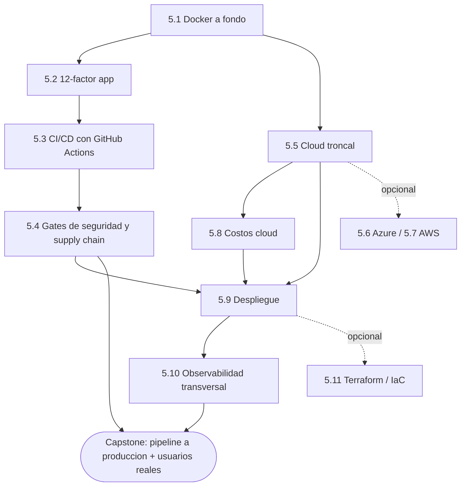
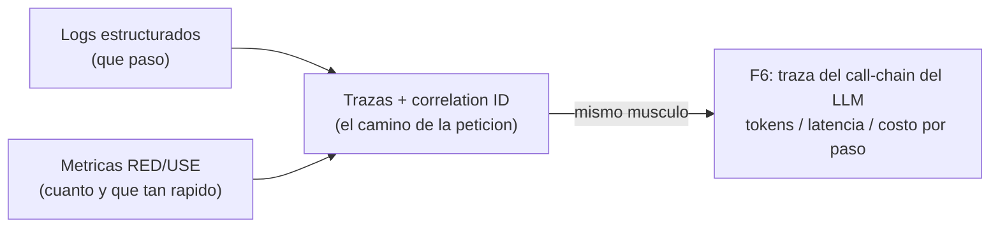

import Reto from "@components/Reto.astro";
import Solucion from "@components/Solucion.astro";
import CheckDominio from "@components/CheckDominio.astro";
import Nivel from "@components/Nivel.astro";

<Nivel nivel="intermedio" />

Hasta ahora construiste cosas que **corren en tu máquina**: una API (Fase 3), un
frontend (Fase 4). En esta fase aprendes a llevarlas a **producción** de forma
profesional y repetible: empaquetadas, configurables, probadas en cada cambio,
escaneadas por seguridad, desplegadas en la nube o en un homelab con dominio
propio, y —esto es lo que separa a un junior de un semi-senior— **observables**,
para que cuando algo falle a las 3 de la mañana puedas verlo en vez de adivinar.

## Objetivos de la fase

Al cerrar la Fase 5 sabrás **hacer** esto (no solo "haber leído sobre ello"):

- **Empaquetar** una aplicación en una imagen de contenedor reproducible y
  **configurarla** por entorno sin hornear secretos en el código (Docker +
  12-factor).
- **Construir** un pipeline de CI/CD que en cada push corre `lint → test → build
  → deploy`, **con gates de seguridad** (escaneo de dependencias, secretos y
  SBOM) que **bloquean** un merge inseguro.
- **Desplegar** en un proveedor cloud troncal o en un homelab, razonando el
  **costo** antes de gastar, y **exponer** el servicio con un dominio.
- **Instrumentar** observabilidad —logs estructurados, métricas y **trazas** con
  correlation IDs— y **defender** por qué las tres son distintas y para qué sirve
  cada una.

:::tip[Por qué importa (relevancia de mercado)]
DevOps no es opcional: aparece en la mayoría de las ofertas de backend e IA. En
una muestra de avisos del nicho, **Docker sale en ~33%**, **CI/CD en ~32%**,
**AWS en ~30%** y **Azure en ~17%**. Pero el verdadero diferenciador
semi-senior es la **observabilidad**: cualquiera levanta un contenedor; pocos
saben mostrarte la **traza** de una petición que falló en producción. Esa
historia —"rompí algo con usuarios reales, lo vi en las trazas y lo arreglé"— es
la que el 90% de los portafolios de solo-homelab no tiene. Aquí plantas su
semilla.
:::

## ¿Para quién es esta fase?

Está escrita para **cero real** en DevOps: no asume que ya escribiste un
`Dockerfile`, ni que configuraste un workflow de GitHub Actions, ni que sabes qué
es un correlation ID. Cada concepto arranca con un ejemplo resuelto antes de
pedirte que lo hagas tú.

:::tip[Si ya lo tocaste]
Si vienes con experiencia (ya usaste Docker Compose, tienes una cuenta de Azure o
configuraste algún pipeline), **no saltes en seco: valida**. Haz el ejercicio de
entrada del final de esta página con honestidad, y resuelve un Primero-Sin-IA de
cada sub-unidad que creas dominar. Si lo cierras sin notas y sin IA en el
timebox, marca la casilla y avanza. Si te trabas —por ejemplo, sabes correr
`docker compose up` pero no explicar por qué un build multi-stage achica la
imagen, o usaste Compose pero nunca un secret-scanning gate en CI— era un falso
"ya lo sé": quédate. La experiencia previa es un **atajo de validación**, nunca
un permiso para saltar a ciegas.
:::

## Activación: ¿qué vas a desplegar?

Esta fase no inventa una app nueva. Toma lo que ya construiste y lo lleva a
producción:

- La **API de la Fase 3** ([Backend](/fase-3-backend/)) —FastAPI con Postgres,
  auth y rate limiting— es el servicio que vas a contenedorizar, probar en CI y
  desplegar.
- El **frontend de la Fase 4** ([Frontend](/fase-4-frontend/)) es lo que sirves
  al usuario final, con su propio flujo de despliegue.
- Los **tests y la disciplina de la Fase 2** ([Ingeniería de
  software](/fase-2-ingenieria/)) son lo que el pipeline va a correr en cada
  cambio: sin tests verdes, no hay deploy.

Antes de seguir, recupera de memoria (sin mirar): ¿qué hace un *reverse proxy*?
¿Por qué una variable de entorno es mejor que una constante en el código para una
contraseña de base de datos? Si dudas, lo verás desde cero igual; pero intentar
recordarlo primero es parte del método.

## Mapa de la fase

La Fase 5 son **once sub-unidades** de contenido más un capstone. El orden cuenta:
empaquetas (5.1), aprendes a configurar y separar estado (5.2), automatizas la
validación (5.3) y la blindas (5.4), eliges dónde vive (5.5–5.7), cuánto cuesta
(5.8), cómo llega ahí (5.9) y cómo lo vigilas (5.10). Terraform (5.11) es la capa
opcional que vuelve reproducible toda esa infraestructura.

| # | Sub-unidad | Qué construyes ahí |
|---|---|---|
| 5.1 | [Docker a fondo](/fase-5-devops/5-1-docker/) | Imágenes, contenedores, volúmenes, redes, **multi-stage builds** y Compose para entornos multi-servicio. |
| 5.2 | [12-factor app](/fase-5-devops/5-2-12-factor/) | Configuración por entorno, paridad dev/prod, procesos sin estado. La base barata que sostiene toda la fase. |
| 5.3 | [CI/CD con GitHub Actions](/fase-5-devops/5-3-cicd-github-actions/) | Workflows, jobs, triggers, secrets; el pipeline `lint → test → build → deploy`. |
| 5.4 | [Gates de seguridad y supply chain en CI](/fase-5-devops/5-4-seguridad-supply-chain-ci/) | SAST + SCA (dependency scanning) + SBOM + pin de dependencias + Dependabot/Renovate + secret-scanning. **Bloquean** lo inseguro. |
| 5.5 | [Cloud troncal](/fase-5-devops/5-5-cloud-troncal/) | Un proveedor (Azure **o** AWS básico): compute, storage, IAM, serverless, managed DB. |
| 5.6 | [Azure profundización](/fase-5-devops/5-6-azure/) 🔵 | App Service, Functions, AI Search, OpenAI Service. **Opcional/profundización.** |
| 5.7 | [AWS profundización](/fase-5-devops/5-7-aws/) 🔵 | EC2, S3, IAM, Lambda, RDS. **Opcional/profundización.** |
| 5.8 | [Costos cloud](/fase-5-devops/5-8-costos-cloud/) | Estimar antes de gastar; el costo por request, clave para apps de IA. |
| 5.9 | [Despliegue](/fase-5-devops/5-9-despliegue/) | Vercel, contenedores en VPS/homelab, Cloudflare Tunnel, config por ambiente. |
| 5.10 | [Observabilidad transversal](/fase-5-devops/5-10-observabilidad/) | Logs/métricas/**trazas**, OpenTelemetry, correlation IDs, RED/USE, SLOs/error budgets. |
| 5.11 | [Terraform / IaC](/fase-5-devops/5-11-terraform-iac/) 🔵 | Infraestructura reproducible como código. **Opcional/profundización.** |
| 5.P | [🛠️ Capstone — Pipeline completo a producción](/fase-5-devops/proyecto/) | Dockerfile + CI/CD con gates de seguridad + observabilidad instrumentada + deploy con dominio + **usuarios reales (≥3)**. |

> 🔵 **Las opcionales no se eliminan, se posponen.** 5.6, 5.7 y 5.11 son
> profundización: hazlas si tu rol objetivo las pide (Azure si apuntas a su
> ecosistema, AWS para pasar más filtros, Terraform como diferenciador). La
> ruta-crítica vive sin ellas. Elige **un** cloud troncal en 5.5 y profundiza el
> otro solo si te sobra tiempo.

## Los hilos que esta fase teje (no son temas sueltos)

DevOps es donde dos hilos transversales del curso dejan de ser teoría y se vuelven
hábito de producción:

- **Observabilidad (la estrella de esta fase).** Sube de "sub-módulo tardío" a
  **hilo transversal**: la instrumentas desde el primer servicio desplegable y la
  arrastras a F6 y F7. Sus tres pilares —**logs** (qué pasó), **métricas** (cuánto
  y qué tan rápido) y **trazas** (el camino de una petición a través de tus
  servicios)— son distintos y no intercambiables. El **correlation ID** que
  aprendes a propagar aquí es exactamente lo que en la
  [Fase 6](/fase-6-ai-engineering/) te dejará seguir la **traza del call-chain de
  un LLM**: cuántos tokens, cuánta latencia y cuánto costó **cada paso**.
- **Seguridad + supply chain.** Los gates de 5.4 (SCA, secret-scanning, SBOM) son
  la versión "infra" del OWASP que arrancó en la Fase 3. Una dependencia con CVE
  o un secreto filtrado **deben** romper el build, no llegar a producción.
- **Costo/latencia.** En 5.8 mides USD por request y aprendes a estimar antes de
  gastar. Ese músculo es el que en F6 se vuelve **token budgeting** y caching
  semántico: la diferencia entre una demo cara y un producto sostenible.
- **Spec-driven + ADRs + Conventional Commits.** Como en toda fase: el capstone
  arranca con una mini-spec, las decisiones de infraestructura (¿por qué este
  cloud? ¿por qué este runtime?) quedan en **ADRs**, y el historial usa
  **Conventional Commits**.

## Checklist de avance

Marca una sub-unidad como completa **solo** cuando cumplas las tres condiciones:
(a) entiendes el concepto **sin notas**, (b) hiciste el ejercicio **sin IA**, y
(c) lo **aplicaste** en el capstone.

- [ ] 5.1 — Docker a fondo
- [ ] 5.2 — 12-factor app
- [ ] 5.3 — CI/CD con GitHub Actions
- [ ] 5.4 — Gates de seguridad y supply chain en CI
- [ ] 5.5 — Cloud troncal (elige **un** proveedor)
- [ ] 5.8 — Costos cloud
- [ ] 5.9 — Despliegue
- [ ] 5.10 — Observabilidad transversal
- [ ] 5.P — Capstone: pipeline a producción con usuarios reales (cumple el DoD de abajo)
- [ ] (opcional) 5.6 Azure · 5.7 AWS · 5.11 Terraform — según tu rol objetivo
- [ ] `RETROSPECTIVA.md` de la fase escrita (qué aprendí, qué me costó, qué proyecto lo demuestra)

<CheckDominio
  title="Antes de avanzar a la Fase 6, ¿puedes…?"
  items={[
    "Explicar la diferencia entre logs, métricas y trazas, y dar un caso donde necesitas específicamente una traza",
    "Explicar por qué un build multi-stage produce una imagen más pequeña y más segura que uno de una sola etapa",
    "Describir qué hace un gate de seguridad en CI y nombrar dos cosas que debería bloquear antes de un deploy",
    "Justificar por qué un secreto va en una variable de entorno o un secret manager, nunca en la imagen ni en el repo",
    "Estimar a grandes rasgos el costo mensual de desplegar tu API y decir qué variable lo dispara",
  ]}
/>

## Definition of Done (la vara del capstone)

Todos los capstones del curso comparten **un único** Definition of Done. En la
Fase 5, por primera vez, **la mayoría de sus puntos aplican**: aquí es donde el
"terminado" deja de ser "corre en mi máquina" y pasa a "corre en producción, con
usuarios, y puedo verlo cuando falla".

:::caution[Lo que aplica al Capstone F5 (Pipeline a producción)]
1. **Spec inicial + ADRs** de las decisiones de infraestructura (qué cloud, qué runtime, por qué).
2. **Tests verdes + lint en CI**; la calidad se mide por aserciones reales, **no por % de cobertura**.
3. **Seguridad aplicada en el pipeline:** secret-scanning + dependency-scanning (SCA) + SBOM; un hallazgo crítico **rompe el build**.
4. **Observabilidad instrumentada:** logs estructurados + correlation IDs + trazas (OpenTelemetry).
5. **Demo que CORRE** en una URL pública (no `localhost`), con **al menos 3 usuarios reales** usándola.
6. **README en inglés** + write-up público de trade-offs (qué elegí, qué medí, qué falló).
7. **Conventional Commits** en todo el historial.
:::

:::note[Lo que llega después (mismo DoD, otras fases)]
El **eval harness** para IA con gate de regresión y budget de costo/latencia, y
las protecciones de **agentes** (validación de salida, least-privilege de tools,
HITL), llegan en F6–F7. Aquí construyes la infraestructura sobre la que todo eso
correrá. La a11y (WCAG) ya fue gate en F4.
:::

## Conexión con el capstone

Cada sub-unidad es una pieza del **pipeline a producción**: 5.1 lo empaqueta; 5.2
lo hace configurable sin secretos hardcodeados; 5.3 y 5.4 son el pipeline que lo
valida y blinda en cada push; 5.5 y 5.9 son dónde y cómo aterriza; 5.8 es el
presupuesto con el que decides; 5.10 es cómo lo vigilas con usuarios reales
encima. No estudias herramientas sueltas: ensamblas, capa por capa, el sistema
que prueba que sabes **operar** software, no solo escribirlo.

## Ejercicio de entrada: diagnóstico y ruta a producción

Antes de tocar la primera lección, orientarte. Este ejercicio no se corrige "bien
o mal": se corrige por **honestidad y concreción**. Es tu placement y tu contrato
de fase.

<Reto title="Diagnóstico de Fase 5 y plan de ruta a producción" timebox="35 min">

Sin IA, en tres archivos markdown dentro de `ejercicios/fase-5/fase-5-index/`:

1. **`diagnostico.md`** — una tabla con las **8 sub-unidades de ruta-crítica**
   (5.1, 5.2, 5.3, 5.4, 5.5, 5.8, 5.9, 5.10) y, para cada una, tu nivel
   **honesto**: `nuevo` · `lo reconozco` · `lo sé hacer sin notas`, **con una
   razón por fila**. La prueba de "lo sé hacer" es: ¿podrías resolver un ejercicio
   del tema, ahora, sin notas y sin IA? Si dudas, no es "lo sé hacer".
2. **`plan-fase-5.md`** — tu plan de estudio con **bloques semanales concretos**
   (día, hora, duración) y tu **ritual de repaso** (cuándo reescribes de memoria
   lo anterior); **más** el **orden en que vas a apilar el pipeline** sobre la app
   que ya construiste (de la Fase 3/4): primero contenedor, luego config por
   entorno, luego CI con tests, luego gates de seguridad, luego deploy, luego
   observabilidad. Termina nombrando **cómo conseguirás ≥3 usuarios reales**.
3. **`definicion-de-listo.md`** — copia, con tus palabras, los **7 puntos del DoD
   del Capstone F5** (arriba) y, junto a cada uno, **cómo lo vas a evidenciar** (p.
   ej. "tests verdes = link al run de Actions en verde"; "trazas = captura de una
   traza con su correlation ID"; "usuarios reales = quiénes y cómo lo usarán").

**Hecho significa:** la tabla cubre las 8 sub-unidades con un nivel defendible (no
todo en "lo sé hacer"); el plan tiene bloques reales en tu semana **y** un orden
de apilado coherente que termina con usuarios reales + observabilidad; la
definición de listo traduce cada punto del DoD en una **evidencia verificable**,
no en una intención.

</Reto>

<Solucion title="Pista (ábrela solo si te trabas, no es la solución)">

Para el diagnóstico, ojo con la sobreconfianza típica de DevOps: "ya usé
`docker compose up`" no es lo mismo que "sé escribir un Dockerfile multi-stage sin
notas". Si nunca configuraste un **gate de seguridad** que rompa el build, 5.4 es
`nuevo`. Para el orden de apilado, sigue el flujo del mapa de arriba: no tiene
sentido automatizar el deploy (5.3/5.9) de algo que todavía no empaquetaste (5.1)
ni hiciste configurable (5.2). Para la definición de listo, el error es escribir
"tendré observabilidad" en vez de "mostraré **esta** traza con **este**
correlation ID": cada punto necesita una evidencia que alguien pueda abrir y ver.

</Solucion>

### Cómo pedir la corrección

Cuando termines, pídele a tu IA:

> "Corrige `ejercicios/fase-5/fase-5-index/` usando el framework de `.ai/`. Sigue
> `INSTRUCCIONES-CORRECTOR.md`."

El corrector revisará la **honestidad** de tu autoevaluación, la **coherencia** de
tu orden de apilado y si tu definición de listo es **verificable**, no si
"acertaste". No existe una respuesta única correcta.

## Recursos

Prefiere siempre **documentación oficial** sobre tutoriales sueltos.

- [Docker — documentación oficial](https://docs.docker.com/) — imágenes, Compose, multi-stage (para 5.1).
- [The Twelve-Factor App](https://12factor.net/es/) — el manifiesto original, con traducción al español (para 5.2).
- [GitHub Actions — documentación oficial](https://docs.github.com/actions) — workflows, jobs, secrets (para 5.3).
- [OWASP Top 10 CI/CD Security Risks](https://owasp.org/www-project-top-10-ci-cd-security-risks/) — qué deben atrapar tus gates (para 5.4).
- [OpenTelemetry — documentación oficial](https://opentelemetry.io/docs/) — los tres pilares y trazas distribuidas (para 5.10).
- [Google SRE Book (gratis)](https://sre.google/books/) — SLOs, error budgets, RED/USE en su fuente.

## Reflexión + repaso

:::note[Para tu RETROSPECTIVA.md]
La primera vez que tu pipeline rompa un build por un test rojo o una dependencia
vulnerable, vas a sentir el impulso de "saltarte el gate para avanzar". Escribe
dos frases: ¿qué intentaste saltarte y por qué el gate tenía razón? Esa honestidad
es la diferencia entre operar software y solo escribirlo.
:::

**Gancho de repaso:** vuelve a esta portada al cerrar **cada** sub-unidad y marca
su casilla. Al terminar la 5.10, antes del capstone, reescribe **de memoria** (sin
abrir esta página) los tres pilares de la observabilidad y el flujo `lint → test →
build → deploy` con sus gates de seguridad. Si te falta alguno, ahí tienes tu
próximo repaso. Y agéndalo: revísalo otra vez **una semana después** de cerrar la
fase, ya entrando a la Fase 6 —ahí esos mismos conceptos vuelven aplicados a la IA.
