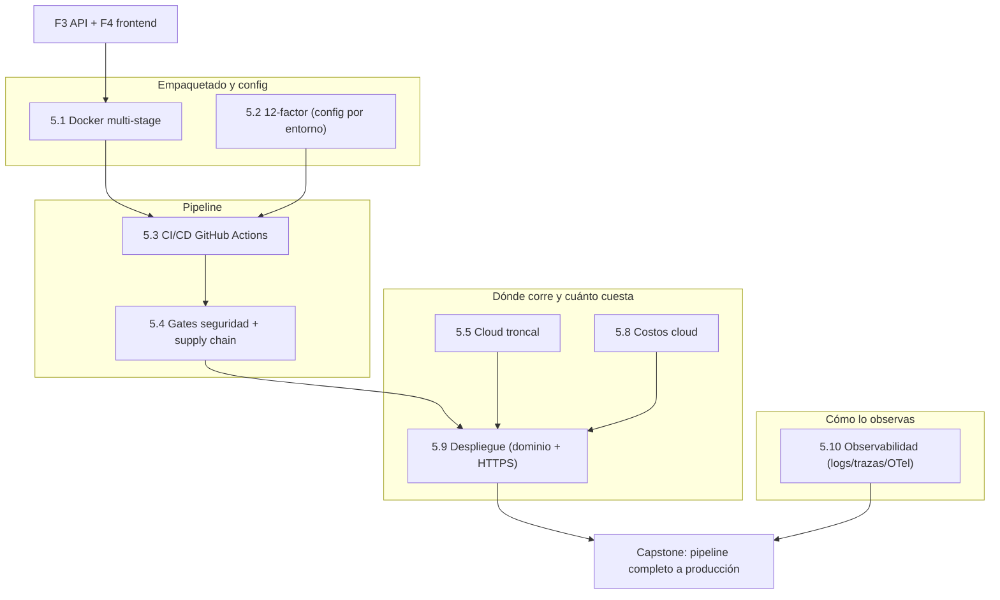

import Reto from "@components/Reto.astro";
import Solucion from "@components/Solucion.astro";
import Quiz from "@components/Quiz.astro";
import CheckDominio from "@components/CheckDominio.astro";
import Nivel from "@components/Nivel.astro";

<Nivel nivel="avanzado" />

Durante once sub-unidades aprendiste piezas sueltas: empaquetaste una app en una imagen multi-stage, separaste la config del código siguiendo 12-factor, montaste un pipeline que corre lint y tests en cada PR, le clavaste gates de seguridad y supply chain, mediste cuánto cuesta tu app en la nube, la expusiste con dominio y HTTPS, e instrumentaste trazas con OpenTelemetry. Cada una era un músculo aislado. **Este capstone es el partido.** Vas a tomar el sistema que ya construiste —tu [API de la Fase 3](/fase-3-backend/proyecto/), y opcionalmente el [frontend de la Fase 4](/fase-4-frontend/proyecto/)— y lo vas a llevar a un lugar donde **otra persona, que no eres tú, lo usa de verdad**. No "corre en mi máquina". No "lo dejé en un screenshot". Corriendo, con su dominio, su candado de HTTPS, su pipeline que lo despliega solo, sus trazas que te dicen qué pasó cuando algo se rompa —porque algo se va a romper, y ese es justamente el punto.

No es un ejercicio con tests que ya vienen escritos. Aquí decides la topología, el contrato de config, dónde corre, cómo se despliega y cómo lo observas —y luego lo defiendes. Es la **infraestructura sobre la que correrá todo lo que viene**: en la [Fase 6 (IA)](/fase-6-ai-engineering/) este mismo pipeline desplegará tu RAG, y en la Fase 7 tu agente de automatización. Constrúyela bien una vez y la reusas el resto del curso. Y trae, además, la semilla de la historia que el 90% de los portafolios no tiene: **usuarios reales que rompen cosas en producción**.

:::tip[Si ya tienes algo "desplegado" (homelab, Vercel, un VPS)]
¿Ya tienes un contenedor corriendo en tu homelab con Cloudflare Tunnel, o una app en Vercel? Perfecto: úsalo como diagnóstico, no como excusa para entregar lo de siempre. La trampa del que "ya despliega" es entregar algo que **arranca** pero no aguanta una mirada de cerca: la imagen es `:latest` (irreproducible), los secretos viven en un `.env` commiteado o pegados en el `docker run`, el deploy es un `git pull && docker compose up` a mano por SSH (no hay pipeline), el "monitoreo" son `print()` que nadie lee, y si le preguntas "¿qué pasó a las 3am cuando un usuario tuvo un 500?" la respuesta es un encogimiento de hombros. Si puedes, sin notas: (1) explicar por qué `:latest` rompe la reproducibilidad y qué pones en su lugar; (2) nombrar tres gates de supply chain que un pipeline serio corre antes de desplegar y qué ataque previene cada uno; (3) decir qué es un correlation ID y por qué sin él no puedes reconstruir el recorrido de una request a través de tus servicios. Si dudas en alguna, este capstone cierra el hueco. Si no dudas, demuéstralo: el listón aquí es el Definition of Done completo —con gates de seguridad, observabilidad real y **usuarios reales**—, no que "esté arriba" en tu pantalla.
:::

## 1. Qué vas a saber hacer

Al terminar este capstone, sin IA para razonar la arquitectura y pudiendo defender cada decisión sin notas, podrás:

- **O1 — Llevar un servicio a producción de forma reproducible y profesional**: empaquetarlo en una imagen **Docker multi-stage** (base pinneada, usuario no-root, healthcheck), separar la **config del código según 12-factor** (sin secretos en el repo, config por ambiente), y desplegarlo con **dominio propio y HTTPS** detrás de un reverse proxy o un túnel.
- **O2 — Construir un pipeline CI/CD que el equipo confíe**: GitHub Actions que en cada push corre lint → test → build → deploy, con **gates de seguridad y supply chain** (SCA/dependency scanning, secret-scanning, SBOM, actions pinneadas a SHA, permisos mínimos) que **bloquean** el merge o el deploy si algo está rojo.
- **O3 — Instrumentar observabilidad desde el primer día y operar con usuarios reales**: **logs estructurados + correlation IDs + trazas OTel** que te dejan reconstruir qué pasó en una request; al menos **3 usuarios reales** usando el sistema; y la disciplina de cierre (spec, ADRs, runbook, write-up de trade-offs, Conventional Commits) mapeada al **Definition of Done** del curso.

## 2. Por qué importa (el dinero está aquí)

> 💰 **Por qué importa:** Docker (alrededor del 33% de las ofertas) y CI/CD (32%) están entre los skills más pedidos del mercado, pero el dato esconde lo que de verdad separa al junior del semi-senior: **casi nadie tiene producción real**. Miles de candidatos tienen un repo que "corre localmente" y un screenshot. Lo que el hiring manager busca —y lo que el 90% de los portafolios solo-homelab **no** tiene— es una historia de **producción con usuarios y una falla que sobreviviste**: "desplegué esto, lo usaron un puñado de personas reales, a la semana se cayó por X, lo diagnostiqué con las trazas, lo arreglé y escribí el post-mortem". Esa narrativa es la de un semi-senior, no la de alguien que terminó un tutorial. Y el premium salarial de IA/automatización solo se cobra si puedes **sostener** lo que construyes en producción, no solo demostrarlo en tu laptop.

Tres razones lo hacen el capstone bisagra entre lo que construiste y todo lo que viene:

1. **Es donde "funciona en mi máquina" muere de verdad.** En las sub-unidades [5.1](/fase-5-devops/5-1-docker/) a [5.3](/fase-5-devops/5-3-cicd-github-actions/) viste Docker, 12-factor y CI como conceptos; aquí son el **único camino** a que otra persona lo use. Si el deploy es manual y la imagen es irreproducible, no está hecho —aunque "ande".
2. **Es la infraestructura reutilizable del resto del curso.** Este pipeline, estas trazas y este deploy son **exactamente** los que la [Fase 6](/fase-6-ai-engineering/) usará para poner tu RAG en producción y la Fase 7 para tu agente. Las trazas OTel que instrumentas hoy serán mañana la traza del call-chain del LLM con tokens, latencia y costo por paso. Constrúyela genérica una vez.
3. **Es tu primera historia de portafolio "producción real".** "Dockericé una app" no impresiona. "Tiene un pipeline con gates de supply chain que bloquea el deploy si una dependencia tiene un CVE crítico, corre detrás de HTTPS con su dominio, lo usan tres personas reales, y cuando se cayó pude leer la traza y el correlation ID para encontrar el request culpable en treinta segundos" —eso sí.

## 3. Lo que ya traes (actívalo)

Este capstone no introduce conceptos nuevos: **ensambla toda la Fase 5** sobre lo que ya construiste en las fases 3 y 4. Antes de empezar, recorre el mapa y reconoce dónde vive cada pieza.



- De [`5.1`](/fase-5-devops/5-1-docker/): imagen **multi-stage** (etapa builder + runtime mínima), base pinneada y slim, usuario no-root, `HEALTHCHECK`. El empaquetado reproducible arranca aquí.
- De [`5.2`](/fase-5-devops/5-2-12-factor/): **config en el entorno**, no en el código; procesos sin estado; paridad dev/prod. Sin esto, no hay "config por ambiente" posible.
- De [`5.3`](/fase-5-devops/5-3-cicd-github-actions/): workflows, jobs, triggers, secrets, environments, el **gate de PR** que impide mergear código roto.
- De [`5.4`](/fase-5-devops/5-4-seguridad-supply-chain-ci/): SCA/dependency scanning, secret-scanning, SBOM, actions pinneadas a SHA, `permissions` mínimos, Dependabot. **Es gate, no opcional.**
- De [`5.5`](/fase-5-devops/5-5-cloud-troncal/) y [`5.8`](/fase-5-devops/5-8-costos-cloud/): dónde corre (compute, storage, managed DB) y cuánto cuesta. Tu deploy declara su costo.
- De [`5.9`](/fase-5-devops/5-9-despliegue/): Vercel, contenedores en VPS/homelab, **Cloudflare Tunnel**, Caddy con HTTPS automático, variables por ambiente.
- De [`5.10`](/fase-5-devops/5-10-observabilidad/): logs estructurados, **correlation IDs**, trazas con **OpenTelemetry**, RED/USE, SLOs. **Es gate.**

Antes de seguir, responde de memoria:

<Quiz
  question="Para ir más rápido, despliegas tu API con la imagen etiquetada como mi-api:latest y pones la cadena de conexión a Postgres y la JWT secret directamente en el docker-compose.yml que commiteas al repo. ¿Qué dos problemas graves tiene este atajo?"
  options={[
    "Ninguno: :latest siempre trae la última versión y tener la config en el repo la hace fácil de versionar.",
    "(1) :latest es irreproducible (no sabes qué imagen exacta corre en prod ni puedes hacer rollback determinista): pinea por digest o por una tag inmutable de versión. (2) Secretos en el repo es una fuga garantizada (cualquiera con acceso al historial los ve, y secret-scanning los marcaría): la config y los secretos van en el entorno (12-factor), inyectados en runtime, nunca commiteados.",
    "El único problema es de rendimiento; :latest descarga capas de más.",
  ]}
  answer={1}
  explanation="Son los dos pecados capitales del deploy amateur. :latest rompe la reproducibilidad (5.1): no puedes afirmar qué corre en producción ni volver a una versión anterior con certeza; usa una referencia inmutable (digest sha256 o tag de versión). Y los secretos en el repo (anti 12-factor de 5.2) son una fuga: viven en el historial de Git para siempre, y un gate de secret-scanning de 5.4 los marcaría en rojo. Config y secretos van en el entorno, inyectados en runtime."
/>

## 4. Cómo un semi-senior lleva esto a producción (en voz alta)

El instinto de junior es abrir una terminal, hacer SSH al servidor y `docker run` la app hasta que responda. El instinto de semi-senior es **hacer que el camino a producción sea repetible, seguro y observable antes de que un usuario lo toque**. Voy a pensar este capstone en voz alta, como lo plantearía de verdad, para que veas el orden —porque el orden *es* la habilidad.

**Paso 1 — Decido qué despliego y fijo el contrato de config (12-factor).** Antes de tocar Docker, listo qué config necesita mi app: la URL de Postgres, la JWT secret, los CORS allowed origins, el endpoint de telemetría. Cada una va al **entorno**, no al código —ese es el corazón de [12-factor](/fase-5-devops/5-2-12-factor/). Escribo un `.env.example` con las claves (sin valores) y dejo claro qué es secreto. Si me equivoco aquí y meto un secreto en el código, lo pago en cada deploy y en el primer secret-scan. Lo dejo en un ADR: *"config por entorno; secretos vía secrets del runtime, nunca en el repo"*.

**Paso 2 — Empaqueto para producción (Docker multi-stage).** Una imagen [multi-stage](/fase-5-devops/5-1-docker/): la etapa `builder` instala dependencias desde el `lockfile`; la etapa `runtime` parte de una base **slim y pinneada** (nada de `:latest`), copia solo lo necesario, corre como **usuario no-root** y declara un `HEALTHCHECK` que golpea `/health`. La regla mental: la imagen de prod no trae el compilador ni el gestor de paquetes, solo lo que se ejecuta. Más pequeña, más rápida de desplegar, menos superficie de ataque.

**Paso 3 — Escribo la SPEC de despliegue y los ADRs antes del pipeline.** En texto plano: qué se despliega, **dónde corre** (mi homelab con Cloudflare Tunnel, un VPS con Caddy, o Vercel para el frontend), cómo se promueve un cambio (push a `main` → CI → deploy), cómo hago **rollback** si el deploy sale mal, y qué config necesita cada ambiente. La spec de un deploy serio responde "¿y si esto falla a las 3am?" antes de que falle.

**Paso 4 — Monto el pipeline base (lint → test → build).** Un workflow de [GitHub Actions](/fase-5-devops/5-3-cicd-github-actions/) que en cada PR clona el repo en una máquina limpia, instala desde el `lockfile`, corre el linter y **los tests de mi backend F3** (los que ya miden lo que importa, no coverage%), y construye la imagen. El gate de PR: no se mergea a `main` si esto está rojo. Aquí "funciona en mi máquina" deja de ser un argumento.

**Paso 5 — Le clavo los gates de seguridad y supply chain.** Sobre el pipeline base, los gates de [5.4](/fase-5-devops/5-4-seguridad-supply-chain-ci/): **SCA** (escaneo de dependencias por CVEs), **secret-scanning** (gitleaks, por si se me escapó un secreto), **SBOM** (inventario de lo que va dentro de la imagen), **escaneo de la imagen** (Trivy), todas las **actions pinneadas a SHA** (no a un tag mutable), `permissions` mínimos en cada job, y **Dependabot** vigilando. Cada gate previene un ataque concreto, y lo escribo: *"el SCA previene desplegar una dependencia con un CVE conocido; el secret-scan previene filtrar credenciales; pinear actions a SHA previene un supply-chain attack si comprometen un tag"*.

**Paso 6 — Instrumento observabilidad ANTES de exponer.** Esto es lo que el junior deja "para después" y nunca llega. Antes de que un usuario lo toque: **logs estructurados** (JSON, no `print`), un **correlation ID** por request que viaja por todo el call-chain, y **trazas con OpenTelemetry** ([5.10](/fase-5-devops/5-10-observabilidad/)). Razono el exporter: en dev uso `ConsoleSpanExporter` para *ver* los spans; en prod cambio una línea por `OTLPSpanExporter` hacia un colector. La promesa de OTel es que mi código de instrumentación no cambia. Sin esto, cuando llegue el primer 500 de un usuario real, estaré ciego.

**Paso 7 — Despliego con dominio propio y HTTPS.** El servicio sale a internet detrás de un reverse proxy con **HTTPS automático** ([5.9](/fase-5-devops/5-9-despliegue/)): Caddy con Let's Encrypt, o un Cloudflare Tunnel que termina TLS por mí. Config inyectada por ambiente. La URL es un dominio de verdad (`api.mi-proyecto.dev`), no una IP con puerto. HTTP plano no es una opción: cookies, tokens y datos viajan cifrados o no viajan.

**Paso 8 — Invito a usuarios reales y observo.** El requisito que convierte esto en una historia de portafolio: **al menos 3 personas reales** usándolo (tu pareja, dos amigos, lo que sea). No tráfico sintético. Los observo con mis trazas y logs. Aquí nace la semilla de la **historia de falla en producción** de Track-0: algo se va a romper de un modo que tu laptop nunca reprodujo, y tenerlo instrumentado es lo que te deja diagnosticarlo en vez de adivinar.

**Paso 9 — Mido y cierro con honestidad.** Un **runbook** (cómo desplegar, cómo hacer rollback, qué mirar si se cae), un **write-up de trade-offs** (por qué este deploy y no otro, qué cuesta, qué falló), el costo mensual estimado ([5.8](/fase-5-devops/5-8-costos-cloud/)), y reviso que el historial sea Conventional Commits.

Ese es el orden. Nota que el primer `docker run` en un servidor aparece recién en el paso 7. Todo lo anterior es **hacer el camino repetible, seguro y observable** —y es exactamente lo que separa "lo subí" de "lo puse en producción".

## 5. Errores que hunden este capstone

:::caution[Confronta estas trampas antes de caer en ellas]
Cada uno de estos errores convierte un capstone "técnicamente arriba" en uno que no pasa el gate. Cada uno es una pregunta de entrevista disfrazada.

- **"Despliego con la imagen `:latest`."** Podrías pensar que `:latest` "siempre trae lo último". Está mal: es **irreproducible** —no puedes afirmar qué imagen corre en prod ni hacer un rollback determinista. Pinea por digest `sha256:...` o por una tag inmutable de versión (`v1.4.2`). El pipeline construye y etiqueta; el deploy referencia esa etiqueta exacta.
- **"Los secretos van en el `docker-compose.yml` / `.env` del repo para que sea fácil."** Está mal y es peligroso: el historial de Git guarda ese secreto **para siempre**, y el gate de secret-scanning de [5.4](/fase-5-devops/5-4-seguridad-supply-chain-ci/) lo marcaría en rojo. La config y los secretos van en el **entorno** (12-factor), inyectados en runtime desde los secrets de GitHub Actions y del runtime de deploy.
- **"El deploy es un `git pull && docker compose up` por SSH cuando me acuerdo."** Está mal: el deploy manual es irrepetible, propenso a error y no deja rastro. Un **pipeline** lo hace igual cada vez, lo audita y permite rollback. Si tu deploy depende de que tú estés despierto y recuerdes los pasos, no es producción.
- **"El CI pasa (lint + test verde), así que está seguro."** Está mal: lint y test verifican que el código *funciona*, no que sea *seguro de desplegar*. Una dependencia con un CVE crítico o un secreto filtrado pasan el test verde sin problema. Por eso existen los **gates de supply chain**: SCA, secret-scan, escaneo de imagen. Verde en tests no es verde para producción.
- **"La observabilidad la agrego cuando tenga un problema."** Está mal: cuando llega el problema, ya es tarde —no tienes los datos del momento de la falla. Logs estructurados, correlation IDs y trazas se instrumentan **antes** de exponer. La diferencia entre "un usuario tuvo un 500 y no sé por qué" y "request `req-8f3a`, falló en el span `query_postgres` por timeout" es que instrumentaste antes.
- **"Pongo `permissions: write-all` en el workflow para que no me dé problemas de permisos."** Está mal: es lo contrario de least-privilege. Si comprometen una de tus actions, le diste las llaves del reino. Declara los `permissions` **mínimos** por job (la mayoría solo necesita `contents: read`).
- **"Uso las actions con `@main` o `@v4` para tener siempre lo último."** Cuidado: una tag o una rama es **mutable** —si comprometen el repo de la action, tu pipeline ejecuta código malicioso con tus secretos. Pinea a un **commit SHA** inmutable (y deja que Dependabot te avise de actualizaciones). Es el trade-off pin-inmutable vs. estar-al-día, y para CI con secretos el pin gana.
- **"No necesito usuarios reales, con que yo lo pruebe basta."** Está mal para el objetivo de este capstone: el tráfico sintético nunca rompe las cosas que rompen los usuarios reales (una sesión que expira a mitad de un flujo, un navegador raro, una request concurrente). **Los ≥3 usuarios reales son el requisito**, no un adorno: son la semilla de tu historia de falla en producción.
- **"HTTPS lo pongo después, por ahora HTTP con la IP."** Está mal: sin HTTPS, los tokens y datos de tus usuarios viajan en claro. Y "después" no llega. Un reverse proxy con HTTPS automático (Caddy/Let's Encrypt o Cloudflare Tunnel) es parte del deploy mínimo, no una mejora.
:::

Un *non-example* que parece un deploy razonable pero no lo es —léelo y detecta los problemas antes de seguir:

```yaml
# 🐛 deploy.yml — ¿qué tiene de malo este "pipeline de producción"?
name: deploy
on: [push]
permissions: write-all
jobs:
  deploy:
    runs-on: ubuntu-latest
    steps:
      - uses: actions/checkout@main
      - run: docker build -t mi-api:latest .
      - run: |
          echo "DATABASE_URL=postgres://user:hunter2@db/prod" > .env
          ssh deploy@servidor "cd app && git pull && docker compose up -d"
```

Tiene seis problemas: (1) **`permissions: write-all`** —viola least-privilege, le da al job permisos que no necesita—; (2) **`actions/checkout@main`** —action pinneada a una rama mutable, vector de supply-chain—; (3) **imagen `:latest`** —irreproducible, sin rollback determinista—; (4) **secreto en claro** (`hunter2`) escrito a un `.env` dentro del runner, que además quedaría en logs; (5) **no hay tests ni gates de seguridad** —despliega sin verificar nada—; y (6) **deploy por SSH con `git pull`** —irrepetible y sin construir la imagen que se prueba. Un pipeline serio: actions a SHA, `permissions` mínimos, imagen pinneada por digest, secretos vía `secrets.` inyectados en runtime, gates de SCA/secret-scan/imagen antes del deploy, y deploy de la **misma imagen** que se testeó.

## 6. El andamiaje: construir por capas (faded)

No empieces de cero frente a un servidor vacío —pero tampoco te doy el pipeline hecho. El andamiaje aquí es el **orden de las capas**; tú rellenas cada una. A medida que avanzas, el andamiaje desaparece (las primeras capas las describo más; las últimas son tuyas).

**Capa 0 — Estructura del repo (te la dejo casi lista):**

```text
mi-proyecto/
├── Dockerfile                 # multi-stage: builder + runtime slim, no-root, HEALTHCHECK
├── compose.yaml               # app + postgres para dev/prod (config por env)
├── .env.example               # claves de config (SIN valores) — 12-factor
├── .dockerignore
├── .github/
│   ├── workflows/
│   │   ├── ci.yml             # PR gate: lint → test → build → gates de seguridad
│   │   └── deploy.yml        # push a main: build + push imagen + deploy
│   └── dependabot.yml        # vigila github-actions y pip (o npm)
├── app/                       # tu API de la Fase 3 (instrumentada con OTel)
├── docs/
│   ├── SPEC.md               # spec de despliegue (escrita ANTES del pipeline)
│   ├── adr/                  # decisiones: dónde corre, rollback, config
│   └── RUNBOOK.md            # cómo desplegar, rollback, qué mirar si se cae
└── WRITE-UP.md               # trade-offs, costo estimado, qué falló con usuarios reales
```

**Capa 1 — Dockerfile de producción (faded medio):** ya lo hiciste en el ejercicio `dockerizar-fastapi` de [5.1](/fase-5-devops/5-1-docker/). Reúsalo y endurécelo: base pinneada, multi-stage, no-root, healthcheck. La regla: la imagen de runtime no trae el gestor de paquetes ni el toolchain de build.

**Capa 2 — Config 12-factor (faded medio):** el `.env.example` con todas las claves, el código leyendo del entorno (no constantes hardcodeadas), y la lista explícita de qué es secreto. Los secretos de CI viven en los **secrets de GitHub Actions**; los de runtime, en el secrets-manager de tu plataforma de deploy.

**Capa 3 — Pipeline base + gates (faded ligero):** el `ci.yml` con lint → test → build, y encima los gates de [5.4](/fase-5-devops/5-4-seguridad-supply-chain-ci/). El reto no es que el pipeline "pase": es que **bloquee** lo que debe bloquear. Aquí tienes la **forma** de un gate como pista —no el pipeline completo:

<Solucion title="Pista: la forma de un job-gate con permisos mínimos y action pinneada (no es la solución del capstone)">

Esto es un empujón sobre cómo se ve un gate de supply chain bien declarado, no tu pipeline completo:

```yaml
# fragmento de .github/workflows/ci.yml
permissions:
  contents: read            # default mínimo a nivel de workflow

jobs:
  sca:
    runs-on: ubuntu-latest
    permissions:
      contents: read         # este job NO necesita escribir nada
    steps:
      # Action pinneada a un commit SHA inmutable (NO a @v4 ni @main).
      # El comentario # vX.Y.Z lo deja legible; Dependabot lo actualiza.
      - uses: actions/checkout@9c091bb21b7c1c1d1991bb908d89e4e9dddfe3e0  # v7.0.0
      - uses: astral-sh/setup-uv@e92bafb6253dcd438e0484186d7669ea7a8ca1cc  # v8
      # SCA: falla el job si una dependencia tiene un CVE conocido.
      - run: uvx pip-audit --strict
```

Lo importante no es copiar esto: es que **cada gate falle el build cuando debe** y que sepas **qué ataque previene** cada uno. El secret-scanning (gitleaks), el escaneo de la imagen (Trivy), el SBOM (CycloneDX) y la `dependency-review-action` los integras tú, con sus SHAs y sus `permissions` mínimos, como aprendiste en 5.4.

</Solucion>

**Capa 4 — Observabilidad (tuyo):** instrumenta tu API con OpenTelemetry como en [5.10](/fase-5-devops/5-10-observabilidad/): trazas por request, correlation ID que viaja por el call-chain, logs estructurados. En dev, `ConsoleSpanExporter`; deja listo el `OTLPSpanExporter` para prod. Esto va **antes** del deploy, no después.

**Capa 5 — Deploy con dominio + HTTPS (tuyo):** el `deploy.yml` que, en push a `main`, construye y publica la imagen (pinneada) y la despliega en tu destino ([5.9](/fase-5-devops/5-9-despliegue/)): VPS con Caddy, homelab con Cloudflare Tunnel, o Vercel para el frontend. Dominio propio, HTTPS, config por ambiente, y un camino de **rollback** documentado.

**Capa 6 — Usuarios reales y cierre (tuyo):** invita a ≥3 personas, obsérvalas con tus trazas, y escribe el runbook, el write-up de trade-offs y el costo estimado. Cuando algo se rompa (se romperá), documéntalo: es tu historia de falla en producción.

## 7. El capstone (Primero-Sin-IA)

<Reto title="Pipeline completo a producción de tu sistema de las fases 3 y 4" timebox="proyecto · 20–30 h repartidas en 2–3 semanas">

Carpeta: `ejercicios/fase-5/capstone-pipeline-produccion/`

Lleva a **producción real** tu [API de la Fase 3](/fase-3-backend/proyecto/) (obligatorio) y, si quieres, tu [frontend de la Fase 4](/fase-4-frontend/proyecto/) (recomendado). El README del ejercicio trae el brief completo, las plantillas de `SPEC.md`, ADR, `RUNBOOK.md` y `WRITE-UP.md`, el `.env.example` y un esqueleto comentado de los workflows. Tu deploy debe cumplir, como mínimo:

- **Empaquetado:** **Dockerfile multi-stage** con base pinneada y slim (nada de `:latest`), usuario no-root y `HEALTHCHECK`. La imagen de prod no incluye el toolchain de build.
- **Config 12-factor:** toda la config en el **entorno** (no en el código); `.env.example` con todas las claves sin valores; **cero secretos en el repo**.
- **Pipeline CI/CD (GitHub Actions):** en cada PR, lint → test (los de tu F3) → build; el gate de PR **bloquea** el merge si está rojo. En push a `main`, build + publicación de la imagen + deploy.
- **GATE — seguridad y supply chain:** **SCA** (dependency scanning), **secret-scanning**, **SBOM**, **escaneo de la imagen** (Trivy), **actions pinneadas a SHA**, **`permissions` mínimos** por job, y **Dependabot** configurado. Cada gate falla el build cuando corresponde, y sabes qué previene.
- **GATE — observabilidad:** **logs estructurados** (JSON) + **correlation ID** por request a través del call-chain + **trazas OTel**. Instrumentado **antes** de exponer.
- **Deploy con dominio + HTTPS:** el servicio responde en un **dominio propio** con **HTTPS** (Caddy/Let's Encrypt, Cloudflare Tunnel, o Vercel para el frontend). Config inyectada por ambiente. HTTP plano no cuenta.
- **GATE — usuarios reales:** al menos **3 personas reales** (no tú) usando el sistema. Documenta quiénes y qué hicieron.
- **Costo:** una estimación del **costo mensual** del deploy ([5.8](/fase-5-devops/5-8-costos-cloud/)), aunque sea cercano a cero (homelab) —saber cuánto cuesta es parte del oficio.
- **(Si despliegas el frontend F4)** se mantiene el **gate de a11y WCAG 2.2** y los cuatro estados de la Fase 4.
- **Comunicación:** `RUNBOOK.md` (desplegar/rollback/qué mirar), **README en inglés** con cómo correrlo, **`WRITE-UP.md`** de trade-offs, e historial 100% **Conventional Commits**.

**Hecho significa** (mapeado al Definition of Done único del curso — la lista completa está en el README del ejercicio):

- **(DoD 1)** Existe `SPEC.md` de despliegue (escrita antes del pipeline) + al menos un **ADR** real (dónde corre y por qué, estrategia de rollback, o contrato de config).
- **(DoD 2)** **Tests verdes + lint en CI**; los tests de tu F3 corren en el pipeline y el gate de PR bloquea si fallan (calidad por aserciones, no por coverage%).
- **(DoD 3)** **Seguridad aplicada:** OWASP web de la F3 sigue en pie + **secret-scanning y SCA en el pipeline** + escaneo de imagen + actions a SHA + `permissions` mínimos.
- **(DoD 4)** **Observabilidad instrumentada:** logs estructurados + correlation IDs + trazas OTel, funcionando en el deploy real.
- **(DoD 7)** Si hay UI (frontend F4 desplegado): **a11y WCAG 2.2** + cuatro estados, como en la Fase 4.
- **(DoD 8)** **Demo que corre** (la URL real, viva) + **README en inglés** + **write-up de trade-offs** (incluida la falla con usuarios reales, si la hubo).
- **(DoD 9)** **Conventional Commits** en todo el historial.

> Los puntos **DoD 5 y 6** (eval harness, guardrails de agente) **no aplican** todavía: este capstone es de infraestructura, sin IA aún. Reaparecen en el capstone de la Fase 6.

Empieza por la **config 12-factor y la spec de despliegue** (pasos 1–3 de la sección 4), no por el servidor. Construye por capas: empaqueta, después el pipeline, después los gates, después observabilidad, y solo entonces expón con dominio y usuarios reales.

</Reto>

> La **solución de referencia** (un deploy ejemplar) existe para el corrector IA, no para ti. En un capstone de infraestructura **no hay una única respuesta correcta**: el corrector evalúa tu reproducibilidad, tus gates, tu observabilidad y si puedes defender cada decisión —no si elegiste "el" proveedor. No la busques antes de cerrar tu intento.

## 8. Check de dominio

Sin mirar la lección, responde en voz alta o por escrito. Si una te traba, ya sabes qué sub-unidad de la Fase 5 releer —y es probable que sea la que más se evalúa en entrevista.

<CheckDominio items={[
  "Explicar por qué una imagen :latest rompe la reproducibilidad y la capacidad de rollback, y qué referencia inmutable usas en su lugar.",
  "Nombrar tres gates de seguridad/supply chain que un pipeline serio corre antes de desplegar (SCA, secret-scanning, escaneo de imagen, SBOM) y qué ataque previene cada uno.",
  "Justificar por qué pinear las GitHub Actions a un commit SHA es más seguro que usar @v4 o @main, y cuál es el trade-off frente a Dependabot.",
  "Explicar qué es un correlation ID, cómo viaja por el call-chain y por qué sin él no puedes reconstruir el recorrido de una request fallida.",
  "Describir la promesa de OpenTelemetry: por qué cambiar de ConsoleSpanExporter a OTLPSpanExporter no toca tu código de instrumentación.",
  "Explicar qué significa config 12-factor en este deploy y dónde viven los secretos en CI vs. en runtime (y por qué nunca en el repo).",
  "Defender por qué tener 3 usuarios reales cambia la naturaleza del proyecto frente a probarlo tú solo (la semilla de la historia de falla en producción).",
]} />

<Quiz
  question="Un usuario real reporta que a veces recibe un 500 al guardar. En tu laptop nunca pasa. Tu deploy tiene logs estructurados con correlation ID y trazas OTel. ¿Cuál es el camino correcto para diagnosticarlo, y qué te habría faltado si hubieras desplegado 'rápido' sin instrumentar?"
  options={[
    "Agrego print() al código, redespliego a producción y espero a que vuelva a pasar para leer la salida.",
    "Busco por el correlation ID que el usuario (o el frontend) reporta, sigo la traza del request a través de los spans para ver en qué paso falló (p. ej. timeout en query_postgres bajo concurrencia), y lo reproduzco. Sin instrumentar de antemano, estaría adivinando: no tendría los datos del momento de la falla.",
    "No se puede diagnosticar sin reproducirlo localmente; le pido al usuario que me mande un video.",
  ]}
  answer={1}
  explanation="Esta es la diferencia entre operar producción y adivinar. Con correlation ID + trazas (5.10), el request fallido es buscable: sigues sus spans y ves exactamente dónde se rompió, con sus atributos (latencia, parámetros, error). Por eso la observabilidad se instrumenta ANTES de exponer: cuando llega la falla del usuario real, los datos del momento ya están capturados. Sin ella, agregar print() y redesplegar es lento, intrusivo y depende de que la falla se repita."
/>

## 9. Recursos (oficial primero)

- [Docker — Multi-stage builds](https://docs.docker.com/build/building/multi-stage/) y [Dockerfile best practices](https://docs.docker.com/build/building/best-practices/): imagen reproducible, slim y no-root.
- [The Twelve-Factor App](https://12factor.net/): el contrato de config por entorno (factores III config y X paridad dev/prod son el núcleo aquí).
- [GitHub Actions — Workflow syntax](https://docs.github.com/en/actions/writing-workflows/workflow-syntax-for-github-actions) y [Security hardening for GitHub Actions](https://docs.github.com/en/actions/security-for-github-actions/security-guides/security-hardening-for-github-actions): `permissions` mínimos, pinear actions a SHA, environments.
- [OWASP — CI/CD Security Top 10](https://owasp.org/www-project-top-10-ci-cd-security-risks/): los riesgos concretos que tus gates de supply chain mitigan.
- [Trivy](https://trivy.dev/latest/docs/) y [gitleaks](https://github.com/gitleaks/gitleaks): escaneo de imagen/dependencias y secret-scanning.
- [OpenTelemetry — Python](https://opentelemetry.io/docs/languages/python/) y [Distros / OTLP exporter](https://opentelemetry.io/docs/specs/otlp/): trazas, spans, correlation IDs y el exportador OTLP.
- [Caddy — Automatic HTTPS](https://caddyserver.com/docs/automatic-https) y [Cloudflare Tunnel](https://developers.cloudflare.com/cloudflare-one/connections/connect-networks/): dominio propio con HTTPS sin pelear con certificados.

## 10. Conexión con el proyecto (hacia adelante)

Este capstone **es** el proyecto de la Fase 5, y a la vez es la **infraestructura sobre la que corre todo lo que viene**:

- **Fase 6 — [AI Engineering](/fase-6-ai-engineering/):** tu plataforma RAG de producción se despliega con **este mismo pipeline** y se observa con **estas mismas trazas** —que pasan a llevar tokens, latencia y costo por paso del call-chain del LLM. El eval harness de la F6 se vuelve un gate más en el CI que ya montaste.
- **Fase 7 — Automatización:** tu agente de automatización (el capstone estrella del portafolio) corre sobre esta infraestructura, con sus gates de seguridad y su observabilidad. Sin un pipeline confiable debajo, un agente que ejecuta acciones en producción es una mina.
- **Track-0 — historia de falla en producción:** los **3 usuarios reales** de este capstone son la semilla directa de tu post-mortem público. Cuando algo se rompa y lo diagnostiques con tus trazas, tendrás la narrativa de semi-senior que casi ningún portafolio solo-homelab puede contar.

Cuando lo cierres, lo que llevas al portafolio no es "dockericé una app": es la prueba de que sabes **poner y sostener un sistema en producción** con el estándar de un equipo —pipeline con gates, observabilidad real, HTTPS, y usuarios que lo usan. Recuerda el **Definition of Done** completo —con los gates de seguridad, la observabilidad y los usuarios reales— no des por terminado nada que no lo cumpla.

## 11. Reflexión + repaso espaciado

Escribe 4–5 frases respondiendo: **de las tres capas que más cuestan —gates de supply chain, observabilidad instrumentada, o usuarios reales—, ¿cuál postergaste o casi saltas, y qué te dice eso sobre el hábito que menos has interiorizado?** Si fueron los gates, tu punto ciego es tratar la seguridad como una fase posterior; si fue la observabilidad, es desplegar a ciegas; si fueron los usuarios reales, es confundir "anduvo en mi laptop" con "está en producción". Ahí está tu próximo foco.

**Gancho de spaced repetition:**

- **Mañana:** reescribe de memoria el orden de las nueve fases del paso a producción (sección 4). Si no puedes, no internalizaste el flujo —vuelve a la sección 4.
- **En 3 días:** abre tu pipeline y, para cada gate, escribe en una línea **qué ataque previene**. Si alguno no sabes justificarlo, es un gate de cargo-cult: entiéndelo o quítalo (y sabe por qué lo quitaste).
- **En 1 semana:** provoca una falla controlada en tu deploy (apaga la DB, mete un timeout) y **diagnostícala solo con tus trazas y logs**, cronometrándote. Si tardas o no lo logras, tu observabilidad tiene huecos que hoy no ves.
- **Antes de la Fase 6:** repasa tu ADR de "dónde corre y cómo hago rollback". Cuando despliegues tu RAG sobre este mismo pipeline sin reescribirlo, ese día entenderás para qué sirvió construir la infraestructura genérica.
