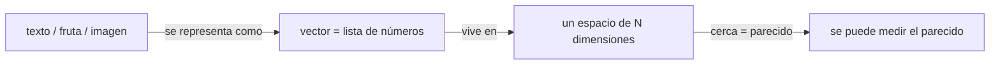
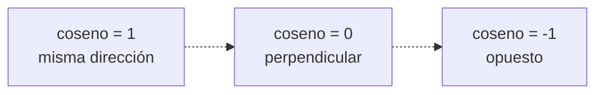
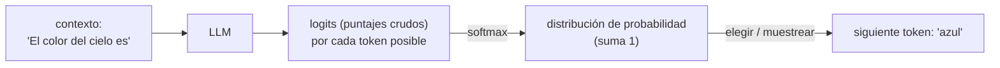

import Reto from "@components/Reto.astro";
import Solucion from "@components/Solucion.astro";
import Quiz from "@components/Quiz.astro";
import CheckDominio from "@components/CheckDominio.astro";
import Nivel from "@components/Nivel.astro";

<Nivel nivel="básico" />

## Objetivos de esta sub-unidad

Al terminar deberías poder **hacer** esto (no solo "haberlo leído"):

- **O1 — Calcular a mano** el producto punto y la **similitud coseno** entre dos vectores pequeños, y **explicar geométricamente** qué significa el número que sale (parecido = ángulo pequeño).
- **O2 — Explicar** por qué un LLM no "busca la respuesta correcta" sino que **elige** la siguiente palabra desde una **distribución de probabilidad**, y qué significa "incertidumbre" del modelo.
- **O3 — Calcular precision, recall y F1** a partir de un caso concreto, y **decidir cuál importa más** según el problema (filtro de spam vs. recuperar todos los documentos relevantes).

> Tres herramientas, cero demostraciones. No vas a probar teoremas: vas a construir la **intuición** que te deja entender —y defender en entrevista— cómo funcionan los embeddings, el RAG y los evals que vienen en el resto de la Fase 6.

---

## Por qué importa (el dinero y la entrevista)

La gente que entra a IA "por la IA" suele saltarse la matemática y vivir de copiar código. Funciona... hasta que algo se rompe o hasta la primera entrevista técnica. Entonces aparece la pregunta que separa al que **usa** una librería del que **entiende** el sistema:

- *"¿Qué es un embedding, de verdad?"* → es un **vector**. Si no sabes qué es un vector, no puedes responder.
- *"Tu búsqueda semántica trae basura. ¿Por qué?"* → casi siempre es la **similitud** mal entendida (umbral, magnitud, normalización). Sin la intuición geométrica, depuras a ciegas.
- *"Tu RAG mejoró, ¿cómo lo sabes?"* → *"subió el recall de 0.6 a 0.8 sin caerse la precision"*. Si no sabes qué es recall, no tienes evals; y sin evals, no eres semi-senior, eres alguien que cruza los dedos.

No necesitas cálculo, ni álgebra lineal de universidad, ni estadística pesada. Necesitas **cuatro ideas** con las que el resto de la fase deja de ser magia: vectores, producto punto, similitud coseno y probabilidad; más una herramienta de medición (precision/recall/F1) que es, literalmente, cómo se evalúa la IA en producción.

:::tip[Si ya viste álgebra lineal o ML]
Quizás ya sabes que coseno es `a·b / (|a||b|)` y qué es una media armónica. Perfecto: usa esta sub-unidad para **conectar** esa matemática que viste en abstracto con su uso real (embeddings, retrieval, evals) y para poder **explicarla sin notas**. Si haces los dos ejercicios `Primero-Sin-IA` en menos de la mitad del timebox y puedes defender cada decisión, valida y salta a [6.0b · Puente ML/DL](/fase-6-ai-engineering/6-0b-puente-ml-dl/). Si te trabas en el trade-off precision/recall, quédate: ese es el que se pregunta en entrevista.
:::

---

## Antes de empezar: lo único que necesitas traer

Esta sub-unidad asume **solo** lo que ya construiste en Fase 0–1: listas, funciones y un poco de aritmética. Sin notas, responde mentalmente:

- ¿Qué es una **lista** de números en Python y cómo recorrerla con un `for`? (lo viste en [0.7 · Fundamentos de programación](/fase-0-fundamentos/0-7-fundamentos-programacion/)).
- ¿Qué hace una **función** que recibe dos parámetros y devuelve un número?

Si eso fluye, tienes todo. La "matemática" de hoy es sumar, multiplicar y una raíz cuadrada. Nada más.

---

## Idea 1 — Un vector es una lista de números (que describe algo)

Un **vector** es una lista ordenada de números. Eso es todo. `[3, 8, 1]` es un vector de 3 dimensiones. Cada número es una **coordenada** o **dimensión**.

La magia no está en la lista, sino en **qué representa cada número**. Si decido que la primera dimensión mide "qué tan dulce" y la segunda "qué tan ácido", entonces:

- limón = `[1, 9]` (poco dulce, muy ácido)
- plátano = `[8, 1]` (muy dulce, poco ácido)
- manzana = `[6, 4]` (en el medio)

Cada fruta es ahora un **punto en un mapa** de 2 dimensiones. Y aquí está el salto mental: si dos puntos están **cerca**, las frutas se **parecen**. Acabas de convertir "parecido" (una idea borrosa) en "distancia" (un número que la máquina calcula).



Un **embedding** (lo verás en [6.5](/fase-6-ai-engineering/6-5-embeddings-busqueda-semantica/)) es exactamente esto, pero para texto y con muchas más dimensiones: un modelo lee `"llevé mi perro al veterinario"` y devuelve un vector de, por ejemplo, 1536 números. Tú no eliges qué mide cada dimensión —el modelo las aprendió—, pero la regla se mantiene: **vectores cercanos = significados parecidos**. Por eso `"cachorro"` y `"perrito"` quedan cerca, y `"tasa de interés"` queda lejos.

> No te asustes con "1536 dimensiones". No hay que imaginarlas. La matemática para medir parecido es **idéntica** en 2 dimensiones que en 1536; solo cambia cuántos números sumas. Por eso practicamos en 2D: lo que aprendes ahí escala sin cambios.

---

## Idea 2 — Producto punto: ¿cuánto "apuntan al mismo lado" dos vectores?

El **producto punto** (dot product) de dos vectores es: multiplica coordenada a coordenada y suma todo.

Para `a = [a₁, a₂, a₃]` y `b = [b₁, b₂, b₃]`:

```text
a · b = a₁·b₁ + a₂·b₂ + a₃·b₃
```

Ejemplo a mano:

```text
[1, 2, 3] · [4, 5, 6] = 1·4 + 2·5 + 3·6 = 4 + 10 + 18 = 32
```

¿Qué significa ese 32? Intuición: el producto punto es **grande y positivo** cuando los dos vectores apuntan hacia el mismo lado, **cero** cuando son perpendiculares (no tienen nada que ver) y **negativo** cuando apuntan en direcciones opuestas. Es un primer medidor de "alineación".

Pero tiene una **trampa**: también crece si los vectores son simplemente **más largos**, aunque apunten igual. Y esa trampa es justo lo que nos lleva a la idea 3.

---

## Idea 3 — Similitud coseno: el parecido, sin que la longitud estorbe

La **similitud coseno** corrige la trampa del producto punto: divide por la **longitud** (magnitud) de cada vector, dejando solo la **dirección**.

```text
                 a · b
coseno(a, b) = ───────────
                |a| · |b|
```

donde la longitud de un vector es la raíz cuadrada de la suma de sus cuadrados:

```text
|a| = √(a₁² + a₂² + a₃²)
```

El resultado siempre cae en el rango de -1 a 1:

| coseno | ángulo | significado |
|---|---|---|
| **1** | 0° | misma dirección → muy parecidos |
| **~0.9** | pequeño | bastante parecidos |
| **0** | 90° | perpendiculares → sin relación |
| **-1** | 180° | opuestos |



La gracia: el coseno **ignora la longitud** y mide solo el ángulo. Por eso es la métrica favorita para búsqueda semántica: un documento largo produce un vector "más largo", pero a ti no te importa el largo del documento, te importa **de qué trata** (la dirección).

---

## Ejemplo resuelto (pensando en voz alta)

Hagamos una mini búsqueda semántica a mano. Inventé un espacio de 2 dimensiones: el eje 1 mide *"trata de mascotas"* y el eje 2 mide *"trata de dinero"*. Estos son los vectores (fingiendo que un modelo los produjo):

```text
Q  (consulta)  "¿dónde vacuno a mi cachorro?"     = [7, 1]
D1 documento   "llevé mi perro al veterinario"    = [9, 1]
D2 documento   "adopté un gatito en el refugio"   = [8, 0]
D3 documento   "el banco subió la tasa de interés"= [1, 9]
```

**Quiero rankear D1, D2, D3 por parecido a Q.** Razono en voz alta:

**Paso 1 — D1.** *Producto punto:* `7·9 + 1·1 = 63 + 1 = 64`. *Longitudes:* `|Q| = √(49+1) = √50 ≈ 7.07`, `|D1| = √(81+1) = √82 ≈ 9.06`. *Coseno:* `64 / (7.07 · 9.06) = 64 / 64.03 ≈ 0.999`. *"Casi 1: Q y D1 apuntan casi al mismo lado. Tiene sentido —ambos son mascotas + veterinario."*

**Paso 2 — D3.** *Producto punto:* `7·1 + 1·9 = 7 + 9 = 16`. `|D3| = √(1+81) = √82 ≈ 9.06`. *Coseno:* `16 / (7.07 · 9.06) ≈ 0.25`. *"Bajo. Q va por el eje de mascotas, D3 va por el eje de dinero: el ángulo entre ellos es grande. Correcto: no quiero que mi consulta de veterinaria traiga noticias del banco."*

**Paso 3 — D2.** `7·8 + 1·0 = 56`. `|D2| = √64 = 8`. *Coseno:* `56 / (7.07 · 8) = 56 / 56.57 ≈ 0.99`. *"También altísimo. D2 es mascotas, aunque no mencione veterinario."*

**Ranking final:** D1 (0.999) ≈ D2 (0.99) ≫ D3 (0.25). El retriever traería D1 y D2, y descartaría D3. **Eso es búsqueda semántica.** Fíjate en lo que NO hice: no comparé palabras exactas. Q dice "cachorro", D1 dice "perro", D2 dice "gatito" —ninguna palabra coincide, pero el **significado** sí, y eso es lo que captura el espacio vectorial.

> [!tip] La dirección manda, no el tamaño
> Lo poderoso del coseno es que mide *de qué trata* algo, no *cuánto* hay de ello. Es la diferencia entre "este documento habla de perros" y "este documento es largo".

---

## Idea 4 — Probabilidad: por qué el LLM "elige" la siguiente palabra

Mucha gente cree que un LLM "busca la respuesta correcta en una base de datos". **Falso, y es la confusión más cara de toda la fase.** Lo que hace un LLM es, en cada paso, producir una **distribución de probabilidad** sobre todas las palabras posibles (tokens) y **elegir** la siguiente.

Recordatorio de probabilidad, lo mínimo:

- Una probabilidad es un número entre 0 y 1 (0 = imposible, 1 = seguro).
- Las probabilidades de todas las opciones **suman 1**.

Cuando el modelo lee `"El color del cielo es"`, no "sabe" que sigue "azul". Calcula algo como:

```text
P(azul  | "El color del cielo es") = 0.66
P(gris  | ...)                     = 0.24
P(rojo  | ...)                     = 0.09
P(plátano | ...)                   = 0.01
                                  ─────────
                            suma = 1.00
```

Luego **elige** una (normalmente la más probable, o muestrea según la "temperatura" que verás en [6.1](/fase-6-ai-engineering/6-1-fundamentos-llms/)). Esa palabra se agrega al texto, y todo se repite para la siguiente. Generar texto es **predecir el siguiente token, una y otra vez**.

¿De dónde salen esas probabilidades? El modelo produce unos puntajes crudos (llamados *logits*) y los pasa por una función llamada **softmax**, que los convierte en probabilidades positivas que suman 1. No necesitas la fórmula de memoria, solo la intuición: **softmax toma puntajes y los normaliza en una distribución**; el puntaje más alto se lleva la probabilidad más alta.



Dos consecuencias que un semi-senior debe poder explicar:

1. **Incertidumbre = forma de la distribución.** Si una opción tiene 0.95, el modelo está "seguro". Si las top-5 rondan 0.20 cada una, está **incierto**: cualquier cosa puede salir. Esto explica por qué la *temperatura* alta da respuestas más variadas (aplana la distribución) y la baja, más predecibles.
2. **Probable ≠ verdadero.** El modelo elige lo *probable según el texto que vio*, no lo *cierto*. Por eso **alucina**: puede asignar 0.9 a una cita de un paper que no existe, porque "suena" a como siguen esas frases. Alta confianza no es garantía de verdad —y esa es la razón de fondo por la que necesitas evals (idea 5) en vez de confiar en la salida.

---

## Idea 5 — Precision, recall y F1: cómo se mide si tu IA sirve

Aquí está la herramienta que casi nadie del montón sabe usar bien, y que es **diferenciador senior**. Cuando tu sistema clasifica o recupera cosas, comete cuatro tipos de resultado. Tomemos un clasificador de spam (positivo = "es spam"):

|  | El modelo dijo SPAM | El modelo dijo NO-spam |
|---|---|---|
| **Era spam (real)** | ✅ TP (verdadero positivo) | ❌ FN (falso negativo: spam que se coló) |
| **No era spam (real)** | ❌ FP (falso positivo: correo bueno marcado) | ✅ TN (verdadero negativo) |

Con esos conteos se definen tres números (todos entre 0 y 1, donde más alto es mejor):

```text
precision = TP / (TP + FP)     "de lo que marqué positivo, ¿cuánto acerté?"   → calidad de las alarmas
recall    = TP / (TP + FN)     "de los positivos reales, ¿cuántos atrapé?"    → cobertura
F1        = 2 · (precision · recall) / (precision + recall)   → un solo número que balancea ambos
```

**El trade-off es el corazón del asunto** (y la pregunta de entrevista): subir precision suele bajar recall y viceversa.

- **Spam:** prefieres **precision** alta. Marcar un correo importante como spam (FP) es peor que dejar pasar uno de spam (FN).
- **Detección de cáncer / recuperar documentos en RAG:** prefieres **recall** alto. No quieres **perderte** un caso positivo real (FN), aunque eso traiga algunos falsos positivos que después filtras.

**F1** es la **media armónica** de las dos: un solo número para cuando ambas importan. Se usa la armónica (no el promedio normal) a propósito, porque **castiga el desequilibrio**.

### Ejemplo resuelto (a mano) — evaluando un retriever de RAG

Tu sistema de RAG, ante una pregunta, recupera **10 fragmentos**. De esos 10, **6 son realmente relevantes** y 4 son ruido. Además, en todo el corpus había **8 fragmentos relevantes** en total (te perdiste 2).

```text
TP = 6   (relevantes y recuperados)
FP = 4   (recuperados pero irrelevantes)
FN = 2   (relevantes que NO recuperaste)

precision = 6 / (6 + 4) = 6/10 = 0.60
recall    = 6 / (6 + 2) = 6/8  = 0.75
F1        = 2 · (0.60 · 0.75) / (0.60 + 0.75) = 0.90 / 1.35 ≈ 0.667
```

*Lectura:* "Cuando traigo algo, acierto el 60% (precision). De todo lo relevante que existía, atrapé el 75% (recall)." Si en la próxima versión subes el recall a 0.90 sin que la precision caiga, **mejoraste de forma medible** —y eso, no una corazonada, es lo que pones en el README de tu capstone.

> [!tip] Esto ES un eval
> Acabas de hacer un eval de retrieval. En [6.9 · Eval-driven development](/fase-6-ai-engineering/6-9-eval-driven-development/) automatizarás esto como un test que corre en CI y bloquea un deploy si el recall baja. La matemática es exactamente la de este ejemplo.

---

## Errores de principiante (y por qué están mal)

:::caution[Misconception 1 — "Producto punto y similitud coseno son lo mismo."]
No. El producto punto **mezcla** dirección y magnitud; el coseno **divide por la magnitud** y deja solo la dirección. Caso concreto: un documento sobre mascotas con vector `[9, 1]` y otro idéntico pero "más largo" `[90, 10]` (mismo tema, repetido). Contra la consulta `[7, 1]`: el producto punto del largo es `640`, diez veces el del corto (`64`) —¡ganaría solo por ser largo! Pero el **coseno de ambos es ~0.999**, porque la dirección es la misma. Si rankeas por producto punto, los documentos largos siempre ganan; por eso la búsqueda semántica usa coseno.
:::

:::caution[Misconception 2 — "El LLM busca la respuesta correcta."]
No la busca: **predice el siguiente token más probable** dado el texto. "Probable según el patrón del lenguaje" no es "verdadero". Esta es la raíz mecánica de la alucinación: el modelo puede estar 90% "seguro" de algo falso porque encaja con cómo suelen continuar esas frases. No le pidas verdad; pídele plausibilidad y **verifícala**.
:::

:::caution[Misconception 3 — "Más dimensiones = mejor / necesito imaginarlas."]
El número de dimensiones lo fija el modelo de embeddings, no tú, y no hay que "imaginar" 1536 ejes. La operación de similitud es idéntica en 2D que en 1536D: solo sumas más términos. Más dimensiones no es "mejor" automáticamente; es un trade-off de calidad contra costo de almacenamiento y latencia de búsqueda (lo verás en [6.6](/fase-6-ai-engineering/6-6-vector-databases/)).
:::

:::caution[Misconception 4 — "Con accuracy basta para medir."]
La accuracy (aciertos / total) **engaña con clases desbalanceadas**. Si 10 de 1000 correos son spam, un modelo que dice "NUNCA es spam" tiene 99% de accuracy... y recall de 0: no atrapa un solo spam. Por eso en IA medimos con **precision/recall/F1**, no con accuracy a secas. Si alguien te vende "99% de accuracy", la primera pregunta es: *¿cómo está balanceado el dataset?*
:::

:::caution[Misconception 5 — "F1 es el promedio de precision y recall."]
Es la media **armónica**, no la aritmética, y la diferencia importa. Un modelo con precision 1.0 y recall 0.0 (acierta el único caso que predice, pero se pierde todo lo demás) tiene promedio aritmético 0.5 (parece "regular") pero **F1 = 0** (correctamente "inútil"). La armónica castiga cuando una de las dos se desploma; por eso es la métrica honesta.
:::

---

## Práctica con andamiaje (el andamio se cae de a poco)

Vamos de menos a más autonomía: primero **predices** (PRIMM), luego **completas** una pieza que falta (faded), y al final **construyes desde cero** en los retos `Primero-Sin-IA`.

### A. Predict — ¿qué número sale?

Sin calculadora todavía: predice el orden de magnitud.

<Quiz
  question="¿Cuál es el producto punto de [2, 0, 3] y [1, 5, 1]?"
  options={["5", "11", "16", "0"]}
  answer={0}
  explanation="Multiplica coordenada a coordenada y suma: 2·1 + 0·5 + 3·1 = 2 + 0 + 3 = 5. El distractor 11 sale si sumas los vectores en vez de multiplicarlos; el 0 sale si ignoras los términos donde una coordenada es distinta de cero."
/>

<Quiz
  question="Dos vectores son perpendiculares (no tienen relación de significado). ¿Cuánto vale su similitud coseno?"
  options={["1", "0", "-1", "Depende de su longitud"]}
  answer={1}
  explanation="Perpendicular = ángulo de 90° = coseno 0. La longitud NO influye en el coseno (precisamente lo divide). Coseno 1 sería misma dirección; -1, opuestos."
/>

### B. Investigate + Modify (Parsons) — ordena el cálculo del coseno

Estos pasos calculan `coseno(a, b)` pero están **desordenados**. Reordénalos mentalmente (o en papel) hasta que la secuencia sea ejecutable. Hay una dependencia clave: no puedes dividir antes de tener las tres piezas.

```text
PASOS DESORDENADOS (reordénalos):
  (a) dividir el producto punto entre (|a| · |b|)
  (b) calcular |a| = raíz de la suma de cuadrados de a
  (c) calcular el producto punto a · b
  (d) calcular |b| = raíz de la suma de cuadrados de b
```

<Solucion title="Ver el orden correcto (pista, no la abras hasta intentarlo)">

Orden correcto: **c → b → d → a** (o b → d → c → a; lo único obligatorio es que **(a) vaya al final**).

1. **(c)** producto punto: el numerador.
2. **(b)** y **(d)** las dos longitudes: el denominador (el orden entre ellas da igual, son independientes).
3. **(a)** la división, que **necesita las tres piezas anteriores** —esa es la dependencia.

Trampa a evitar: si calculas la división antes de tener `|a|` y `|b|`, no tienes con qué dividir. Y un detalle de implementación que verás en el reto: si algún vector es todo ceros, su longitud es 0 y **dividir por cero revienta** —ese es tu caso borde.

</Solucion>

### C. Make — ahora construyes tú

El andamio se cayó. Los dos retos de abajo son `Primero-Sin-IA`: piensas y codeas tú, a mano, contra el reloj. La IA viene **después**, solo a revisar tu proceso con el framework de `.ai/`.

---

## Ejercicios Primero-Sin-IA

Contrato (lo instalaste en [0.1](/fase-0-fundamentos/0-1-mentalidad-y-metodo/)): primero a mano, con timebox; está bien que sea lento y feo. Solo después consultas documentación, y **al final** usas IA para revisar —nunca para generar. Mañana, reescríbelo de memoria.

<Reto title="Similitud coseno desde cero (y un mini-retriever)" timebox="40 min">

Implementa, en **Python puro y a mano** (sin numpy, sin IA), la similitud coseno entre dos vectores, y úsala para rankear documentos por parecido a una consulta —el corazón de la búsqueda semántica que sostiene el RAG.

Vas a completar las funciones `producto_punto`, `magnitud`, `similitud_coseno` y `rankear` en el starter, manejando el **caso borde del vector de ceros** (no dividir por cero). Los tests definen el contrato.

Carpeta del ejercicio y plantilla: `ejercicios/fase-6/similitud-coseno-a-mano/`.

**Hecho significa:** todos los tests pasan; tu `similitud_coseno` da ~0.999 entre `[7,1]` y `[9,1]`, y ~0.25 contra `[1,9]`; el vector de ceros lanza un error claro en vez de reventar; y puedes explicar **por qué** usaste coseno y no producto punto.

</Reto>

<Reto title="Precision, recall y F1 desde una verdad de referencia" timebox="35 min">

Implementa, en **Python puro y a mano**, el cálculo de precision, recall y F1 a partir de dos listas: las etiquetas reales (`y_true`) y las predicciones del modelo (`y_pred`). Es, literalmente, el núcleo de un eval.

Vas a contar TP/FP/FN tú mismo y derivar las tres métricas, manejando los **casos borde** (denominador cero → métrica 0.0, no una excepción de división). Los tests definen el contrato.

Carpeta del ejercicio y plantilla: `ejercicios/fase-6/precision-recall-f1/`.

**Hecho significa:** todos los tests pasan; sobre el ejemplo del RAG (TP=6, FP=4, FN=2) obtienes precision 0.60, recall 0.75, F1 ≈ 0.667; un caso sin positivos predichos da 0.0 en vez de explotar; y puedes explicar en qué problema preferirías optimizar recall sobre precision.

</Reto>

---

## Check de dominio

Cierra el cuaderno. Si puedes hacer esto **sin notas**, lo aprendiste; si no, vuelve a la sección correspondiente (no a la IA todavía).

<CheckDominio
  items={[
    "Calcular a mano el producto punto y la similitud coseno de dos vectores de 3 dimensiones",
    "Explicar por qué la búsqueda semántica usa coseno y no producto punto (la trampa de la magnitud)",
    "Explicar qué es un embedding usando la palabra 'vector' y la idea de 'cerca = parecido'",
    "Explicar por qué un LLM 'elige' la siguiente palabra y por qué 'probable' no es 'verdadero'",
    "Calcular precision, recall y F1 desde TP/FP/FN, y decir cuál priorizar en spam vs. en RAG",
    "Explicar por qué la accuracy engaña con clases desbalanceadas",
  ]}
/>

<Quiz
  question="Tu detector de fraude marca 3 transacciones como fraude: 2 lo eran de verdad, 1 no. Había 5 fraudes reales en total. ¿Cuál es el recall?"
  options={["2/3 ≈ 0.67", "2/5 = 0.40", "1/3 ≈ 0.33", "3/5 = 0.60"]}
  answer={1}
  explanation="Recall = TP / (TP + FN). TP = 2 (fraudes atrapados). Fraudes reales = 5, atrapaste 2, así que FN = 3. Recall = 2/(2+3) = 2/5 = 0.40. (El 2/3 ≈ 0.67 es la precision: de lo que marcaste, cuánto acertaste.)"
/>

---

## Recursos

Documentación y fuentes de calidad, oficiales primero:

- **3Blue1Brown — "Essence of Linear Algebra" (vectores, dot product)** (YouTube, en inglés): la mejor intuición visual de qué es un vector y un producto punto. Mira los primeros 3 videos.
- **OpenAI — Embeddings guide** (`platform.openai.com/docs/guides/embeddings`): doc oficial; usa similitud coseno para comparar embeddings. Lee la sección "what are embeddings".
- **scikit-learn — `precision_recall_fscore_support`** (`scikit-learn.org`): la doc oficial de las métricas; útil para ver cómo se definen en una librería real (después de implementarlas a mano).
- **Google Machine Learning Crash Course — Classification (precision & recall)**: explicación canónica con el trade-off, en inglés y desde cero.
- **Wikipedia — "Softmax function"**: para la intuición de cómo logits se vuelven probabilidades (solo la introducción).

> Practica los conceptos antes de leer de más: gasta el doble de tiempo en los dos retos que en estos enlaces. La intuición se construye calculando a mano, no leyendo.

---

## Conexión con el capstone de la Fase 6

El proyecto de cierre de la fase es la **[Plataforma RAG de producción](/fase-6-ai-engineering/proyecto/)**. Lo de hoy es su cimiento literal:

- La **similitud coseno** es cómo tu RAG decide qué fragmentos recuperar para responder una pregunta (etapa *retrieval*). Sin esta intuición, no puedes depurar por qué trae basura.
- **Precision/recall/F1** son las métricas de tu **eval harness versionado** —uno de los entregables obligatorios del Definition of Done (punto 5: *eval harness + número + gate de regresión*). Ese "número" que bloquea un deploy si baja sale de aquí.
- La **probabilidad / softmax** explica el comportamiento de la etapa de generación (temperatura, sampling) que ajustarás en [6.1](/fase-6-ai-engineering/6-1-fundamentos-llms/) y [6.2](/fase-6-ai-engineering/6-2-prompt-context-engineering/).
- Los **vectores** son los embeddings que almacenarás en la vector database de [6.6](/fase-6-ai-engineering/6-6-vector-databases/).

En resumen: hoy no construyes el RAG, pero entiendes **cada número** que lo hace funcionar. Eso es lo que te deja diseñarlo desde cero y defenderlo en una entrevista.

---

## Reflexión + repaso espaciado

Antes de cerrar, escribe en tu `progreso.md` **dos o tres frases**:

> ¿Cuál de las cinco ideas (vector, producto punto, coseno, probabilidad, precision/recall) sentiste más "click" y cuál sigue borrosa? Si tuvieras que explicarle a alguien por qué un LLM alucina usando la palabra "probabilidad", ¿podrías?

**Gancho de repaso espaciado:**

- **Mañana:** reescribe de memoria, sin mirar, las fórmulas de coseno, precision, recall y F1. Si no salen, no las aprendiste —vuelve a la sección, no a la IA.
- **En 3 días:** toma dos vectores nuevos de 3 dimensiones y calcula su coseno a mano en menos de 2 minutos. Debe ser un reflejo, no un esfuerzo.
- **En 1 semana:** explícale a alguien (o al espejo) el trade-off precision vs. recall con un ejemplo propio que NO sea spam ni RAG. Si encuentras un ejemplo tuyo, lo interiorizaste.

> [!tip] Para cerrar
> "Cuatro ideas y una regla de tres. Eso separa al que dice 'la IA es magia' del que dice 'mi recall subió de 0.6 a 0.8 y aquí está el número'. La magia no paga sueldos de semi-senior; los números, sí. Y por suerte, los números son solo sumas y una raíz cuadrada que ya sabes hacer."
