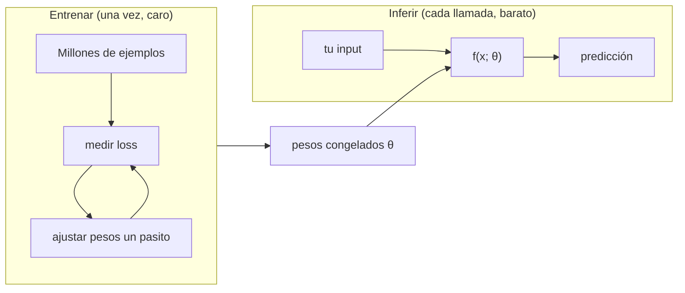
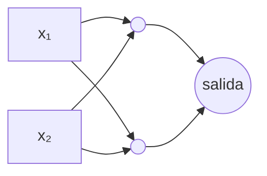
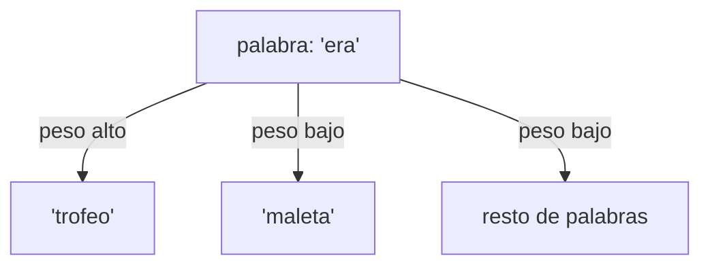

import Nivel from "@components/Nivel.astro";
import Reto from "@components/Reto.astro";
import Solucion from "@components/Solucion.astro";
import Quiz from "@components/Quiz.astro";
import CheckDominio from "@components/CheckDominio.astro";

<Nivel nivel="intermedio" />

## Objetivos de esta lección

Al terminar, **sin notas**, vas a poder:

- **O1 — Explicar** qué es un modelo, la diferencia entre **entrenar** e **inferir**, y de dónde salen realmente los embeddings (vectores **aprendidos**, no escritos a mano), conectándolo con la similitud coseno que viste en [6.0 · Matemática mínima](/fase-6-ai-engineering/6-0-matematica-minima/).
- **O2 — Diagnosticar** overfitting vs underfitting a partir de números de *train* y *test*, y justificar **por qué se separan** los datos.
- **O3 — Explicar la intuición de self-attention**: por qué dejar que cada parte del input "atienda" a otras según el contexto fue el cambio que destrabó los LLMs modernos.

> Términos en inglés que vas a oír en entrevistas y docs, en su forma original a propósito: **model**, **training** vs **inference**, **weights/parameters**, **loss**, **gradient descent**, **overfitting**, **train/test split**, **neural network**, **attention**, **transformer**, **embedding**.

---

## Por qué importa (sin vueltas)

> 💰 **El dinero está en la conversación que no puedes esquivar.** En toda entrevista de AI/Automation Engineer, en algún momento aparece: *"explícame qué es un embedding de verdad"*, *"¿cómo funciona attention?"*, *"¿el modelo aprende de los usuarios?"*. No te piden derivar el gradiente a mano —eso es para investigadores. Te piden la **intuición correcta y defendible**. El que la tiene suena como ingeniero; el que recita marketing ("es como el cerebro humano") se cae en treinta segundos.

Esta sub-unidad es un **puente**, no un curso de deep learning. No vas a entrenar redes desde cero (esa es otra carrera, con otro sueldo y otra GPU). Vas a construir el **modelo mental** que sostiene todo lo que viene en la Fase 6: por qué eliges un modelo de embeddings y no otro (6.5), por qué tu RAG no "aprende" en producción (6.7), por qué evaluar mide *generalización* y no memoria (6.9), y por qué fine-tuning es caro y casi nunca tu primera opción (6.13).

> [!tip] GLaDOS says
> No necesitas construir el motor para conducir el auto. Pero si no sabes que adentro hay pistones y no un caballo, el primer mecánico te ve la cara. Esta lección te da los pistones.

---

## Lo que ya traes (actívalo)

Esta lección se para sobre dos cosas anteriores:

- De [6.0 · Matemática mínima](/fase-6-ai-engineering/6-0-matematica-minima/): **vectores**, **producto punto** (*dot product*) y **similitud coseno**. Spoiler: el producto punto es, literalmente, la operación central tanto de una neurona como de attention. Y precision/recall/F1 son cómo medirás un modelo en *test*.
- De [1.10 · Tu primer llamado a un LLM](/fase-1-lenguajes/1-10-primer-llm-mini-cli/): cuando llamas a la API de un modelo, **infieres**. El modelo del otro lado ya está entrenado y congelado. Hoy le ponemos nombre a esa distinción.

Pregunta de calentamiento (respóndela mentalmente, guárdala): cuando le mandas tres mensajes seguidos a un LLM y "parece acordarse" del primero, **¿el modelo cambió por dentro entre mensaje y mensaje?** Volvemos a esto.

:::tip[Si ya tocaste ML antes]
Si ya entrenaste un modelo, hiciste un *train/test split* o leíste el paper de transformers, no te saltes la lección: úsala como **diagnóstico de 5 minutos**. Salta al [Reto](#ejercicio-primero-sin-ia) y defiende los seis conceptos por escrito, más el diagnóstico de overfitting. Si los cierras limpio, valida con el [Check de dominio](#check-de-dominio) y avanza. Si te trabas explicando *de dónde salen los embeddings* o *por qué attention se pudo paralelizar*, lee la sección que corresponda: ahí es donde la intuición de la mayoría es vaga.
:::

---

## Ejemplo resuelto (te lo razono en voz alta)

Voy a recorrer los seis conceptos como te los explicaría al lado tuyo, no como una enciclopedia. Cada uno se apoya en el anterior.

### 1. Qué es un modelo

Un **modelo** es una **función con parámetros ajustables**. Le entra algo (`x`), salen unos números (`y`), y en el medio hay un montón de números internos llamados **parámetros** o **pesos** (*weights*):

```
salida = f(entrada; θ)
```

Donde `θ` (theta) son los pesos. La gracia: esos pesos **no se escriben a mano**. Se *ajustan* a partir de datos hasta que la función hace algo útil.

Razono la analogía que sí funciona: una receta cuyas **cantidades** no las decidió un chef, sino que se afinaron cocinando el plato mil veces y midiendo cuánto le gustó a la gente. La estructura (harina + agua + horno) la pones tú; los **números exactos** (cuánta harina) los encuentra el proceso. Un LLM como Claude tiene del orden de **cientos de miles de millones** de esos números. No es una base de datos con respuestas guardadas, ni un árbol de reglas `if/else`. Es una función gigante cuyos pesos codifican patrones del texto con el que se entrenó.

:::caution[Misconception — "el modelo guarda las respuestas"]
Podrías pensar que un LLM "tiene guardadas" las frases que vio. **Está mal.** Guarda **pesos** (números) que capturan *patrones*, no las frases. Por eso puede responder cosas que nunca vio exactas —y por eso también **alucina**: reconstruye desde patrones, no consulta una tabla. Lo profundizas en [6.1](/fase-6-ai-engineering/6-1-fundamentos-llms/).
:::

### 2. Entrenar vs inferir (la distinción que más rinde)

Hay **dos fases** completamente distintas en la vida de un modelo:

| | **Entrenar** (training) | **Inferir** (inference) |
|---|---|---|
| Qué pasa | Se **ajustan** los pesos `θ` | Se **usan** los pesos `θ` (congelados) |
| Con qué | Millones de ejemplos | Un input nuevo |
| Cuándo | Una vez (o pocas), antes de servir | Cada vez que llamas al modelo |
| Costo | Brutal (GPUs, semanas, millones de USD) | Barato (centavos por llamada) |
| ¿Cambia el modelo? | **Sí**, es el punto | **No**, los pesos no se mueven |

Cuando llamas a la API de un LLM (lo que hiciste en [1.10](/fase-1-lenguajes/1-10-primer-llm-mini-cli/)), **infieres**. Nunca entrenas. El modelo ya viene cocinado.

¿Cómo se entrena? Intuición de **gradient descent** (descenso del gradiente), sin cálculo:

1. El modelo predice algo con sus pesos actuales.
2. Se mide **cuán mal** estuvo con una **función de pérdida** (*loss*): un número, grande si la predicción fue mala, chico si fue buena.
3. Se calcula, para **cada peso**, en qué dirección moverlo un poquito para que el *loss* baje. (Ese "en qué dirección" es el **gradiente**. La máquina lo calcula sola.)
4. Se mueven todos los pesos un pasito en esa dirección.
5. Repetir millones de veces, con millones de ejemplos. El *loss* baja, el modelo mejora.

Razono la imagen: estás en una montaña con niebla y quieres bajar al valle. No ves el mapa, pero sí sientes la pendiente bajo tus pies. Das un paso hacia donde más baja. Otra vez. Otra vez. Eso es gradient descent: el *loss* es la altura, y bajas a tientas hasta el fondo.

Ahora vuelvo a tu calentamiento: cuando mandas tres mensajes y el LLM "se acuerda", **el modelo NO cambió por dentro**. Lo que pasó es que le reenviaste los mensajes anteriores como parte del input (la *context window*, que ves en 6.1). Memoria de contexto, no aprendizaje. Los pesos siguen idénticos. Es la confusión #1 de los principiantes.



### 3. Qué es una red neuronal (intuición)

Una **neurona artificial** hace algo que ya conoces de 6.0: toma un vector de entradas, lo combina con un vector de pesos vía **producto punto**, le suma un número (*bias*) y pasa el resultado por una **función no lineal** (*activación*, p. ej. ReLU: "si es negativo, cero; si no, déjalo igual"):

```
neurona(x) = activación( x · w + b )
```

Ese `x · w` es el dot product de 6.0. Una neurona sola es casi inútil. Pero apilas **capas** de muchas neuronas, donde la salida de una capa es la entrada de la siguiente, y obtienes una **red neuronal** (*neural network*). "Deep learning" significa simplemente *muchas capas* (*deep* = profundo).

¿Por qué la no linealidad importa? Sin ella, apilar capas daría otra vez una simple multiplicación (una recta). La activación no lineal es lo que permite que la red aprenda **curvas, fronteras y patrones complejos**. Con suficientes neuronas y datos, una red puede aproximar funciones arbitrariamente complicadas: por eso reconoce gatos en fotos o predice la siguiente palabra.



> No te aprendas la fórmula de memoria. Aprende esto: **una red neuronal es una pila de productos punto con no linealidades en medio, y entrenar = ajustar todos esos pesos con gradient descent.** Eso, dicho con calma, es una respuesta de entrevista sólida.

### 4. Overfitting y train/test split (por qué se separan los datos)

Aquí está el concepto que **más se pregunta** y peor se explica.

Cuando entrenas, el modelo ve un conjunto de datos. Hay un riesgo: que en vez de aprender el **patrón general**, **memorice** los ejemplos concretos —incluyendo su ruido y sus casualidades. Eso es **overfitting**: el modelo brilla en lo que ya vio y **fracasa con datos nuevos**.

La analogía exacta: un estudiante que **memorizó las respuestas del examen filtrado** en vez de estudiar la materia. Saca 100 en *ese* examen y reprueba el siguiente. Su nota no medía aprendizaje; medía memoria.

Por eso, **antes** de entrenar, separas los datos:

- **Train set** — con esto el modelo ajusta sus pesos. Lo "ve".
- **Test set** — apartado, el modelo **nunca lo ve durante el entrenamiento**. Con esto mides honestamente si **generaliza**.

Si midieras el rendimiento en el mismo *train set*, te estarías mintiendo: claro que le va bien, lo memorizó. El *test set* es tu examen limpio. La diferencia entre el desempeño en train y en test se llama **generalization gap**: si es enorme, hay overfitting.

| Síntoma | Train | Test | Diagnóstico |
|---|---|---|---|
| Memorizó | 99% | 70% | **Overfitting** (gap enorme) |
| Demasiado simple | 65% | 63% | **Underfitting** (mal en ambos) |
| Sano | 92% | 89% | Buena generalización |

Esto **no es solo de ML clásico**: es la semilla del hilo de **evals** ([6.9](/fase-6-ai-engineering/6-9-eval-driven-development/)). Cuando evalúas un sistema de IA, lo haces sobre datos que el sistema no "vio" al diseñarlo —misma idea, otra escala. Y para medir usas precision/recall/F1 de 6.0.

### 5. La intuición de attention (lo que destrabó todo)

Hasta ~2017, los modelos de lenguaje procesaban el texto **palabra por palabra, en orden** (las RNN). Problema: para cuando llegaban al final de un párrafo largo, la "memoria" del principio se había desvanecido. Las relaciones a larga distancia se perdían.

**Attention** ("atención") cambió la pregunta. En vez de leer en secuencia con memoria frágil, deja que **cada palabra mire a todas las demás a la vez** y decida **a cuáles prestarle atención** según el contexto, asignándoles un **peso**.

Ejemplo concreto (una ambigüedad clásica):

> *"El trofeo no cabía en la maleta porque era demasiado **grande**."*

¿Qué era grande, el trofeo o la maleta? Tú sabes que el trofeo. Cambia una palabra:

> *"El trofeo no cabía en la maleta porque era demasiado **pequeña**."*

Ahora "era" se refiere a la maleta. La **misma** estructura, y el referente cambia según un adjetivo lejano. Attention es el mecanismo que permite que el modelo, al procesar "era", **atienda fuerte** a "trofeo" o a "maleta" según convenga.

¿Cómo decide el peso? Intuición *Query / Key / Value* (sin matrices):

- Cada palabra emite una **query** ("¿qué busco?").
- Cada palabra ofrece una **key** ("¿qué ofrezco?").
- El **match** entre una query y cada key se calcula con... **producto punto** (otra vez 6.0). Mayor match → mayor peso de atención.
- Con esos pesos se **mezcla** el **value** (el contenido) de las palabras atendidas.



¿Por qué fue **el** cambio? Dos razones que debes saber decir:

1. **Relaciones a larga distancia gratis**: cualquier palabra puede atender a cualquier otra sin importar la distancia. Adiós memoria que se desvanece.
2. **Se paraleliza**: como todas las palabras se procesan **a la vez** (no una tras otra), el cálculo cabe en GPUs masivas. Eso hizo *posible* entrenar modelos gigantes en tiempos razonables. Sin attention, no hay LLMs a esta escala.

Un **transformer** es, en esencia, muchas capas de self-attention + redes feed-forward apiladas. El paper se llama, con honestidad brutal, *"Attention Is All You Need"* (2017).

### 6. De dónde salen REALMENTE los embeddings

En 6.0 usaste vectores y mediste similitud coseno entre ellos. Pregunta de fondo: **¿de dónde salieron esos vectores?** No los escribió nadie a mano. Son **parámetros aprendidos**.

Mira la primera capa de un modelo de lenguaje: una **embedding layer**, que es una **tabla** (*lookup*). A cada token le corresponde un vector. Al empezar el entrenamiento, esos vectores son **aleatorios** —ruido. Durante el entrenamiento, gradient descent los **ajusta** (como a cualquier otro peso) para que el modelo prediga mejor. ¿El resultado emergente? Palabras de significado parecido terminan **cerca** en el espacio vectorial, sin que nadie lo programara. "rey" y "reina" quedan vecinos porque aparecen en contextos parecidos, y eso ayudó a bajar el *loss*.

Los **embeddings de oraciones** que usarás para búsqueda semántica en [6.5](/fase-6-ai-engineering/6-5-embeddings-busqueda-semantica/) son lo mismo a mayor escala: pasas un texto por un modelo (un *encoder*) **entrenado específicamente** para que textos de significado similar produzcan vectores cercanos. El embedding es una **representación interna** del transformer, expuesta como salida.

La frase que te quiero dejar grabada:

> Un embedding **no es una propiedad mágica del texto**. Es la **huella** que un modelo entrenado deja sobre ese texto, optimizada para una tarea. Cambias el modelo, cambia el embedding.

Por eso en 6.5 y 6.6 **el modelo de embeddings que elijas importa**, y por eso no puedes mezclar embeddings de dos modelos distintos en el mismo índice: hablan idiomas vectoriales diferentes.

### 7. PyTorch awareness (reconocerlo, no dominarlo)

**PyTorch** es el framework dominante para definir y entrenar redes neuronales. Como AI Engineer, el 95% del tiempo **infieres** (llamas APIs o cargas modelos pre-entrenados de Hugging Face); rara vez entrenas desde cero. Pero **reconocer** un entrenamiento en PyTorch te quita el miedo, te deja leer código de ejemplo y conectar lo conceptual con lo real.

Lee este bucle de entrenamiento mínimo —**no para escribirlo de memoria**, sino para mapear cada línea a lo que ya entendiste:

```python
import torch
import torch.nn as nn

# El modelo: una pila de capas (productos punto + no linealidad). Sección 3.
modelo = nn.Sequential(
    nn.Linear(8, 16),   # capa: 8 entradas -> 16 neuronas
    nn.ReLU(),          # activación no lineal
    nn.Linear(16, 1),   # capa de salida
)

loss_fn = nn.MSELoss()                                  # cómo se mide "cuán mal". Sección 2.
optimizer = torch.optim.SGD(modelo.parameters(), lr=0.01)  # quién mueve los pesos

for epoch in range(100):              # repetir muchas veces. Sección 2.
    pred = modelo(x_train)            # INFERIR con los pesos actuales
    loss = loss_fn(pred, y_train)     # medir el error
    optimizer.zero_grad()             # limpiar gradientes del paso anterior
    loss.backward()                   # calcular el gradiente (dirección de bajada)
    optimizer.step()                  # mover los pesos un pasito = ENTRENAR
```

Y para usar el modelo ya entrenado (inferencia), se apaga el cálculo de gradientes:

```python
modelo.eval()              # modo inferencia
with torch.no_grad():      # no calcular gradientes: más rápido, menos memoria
    prediccion = modelo(x_nuevo)
```

Razono qué quiero que veas: `modelo(...)` es **inferir**; el trío `zero_grad()` → `backward()` → `step()` es **un paso de gradient descent** = entrenar. `model.eval()` + `torch.no_grad()` es decir "ya no aprendo, solo uso". Si reconoces este esqueleto, puedes leer la mayoría de los tutoriales de PyTorch y de fine-tuning de [6.13](/fase-6-ai-engineering/6-13-fine-tuning/) sin entrar en pánico.

---

## Errores de modelo que vas a tener (y por qué)

:::caution[Misconception 1 — "el LLM aprende de mis conversaciones en tiempo real"]
No. En **inferencia** los pesos **no cambian**. Que "recuerde" lo que dijiste antes es porque le reenvías el historial como contexto (la *context window*), no porque aprenda. Aprender = re-entrenar, una operación cara y separada que no ocurre en cada chat. Confundir contexto con aprendizaje es el error #1.
:::

:::caution[Misconception 2 — "más parámetros o más épocas de entrenamiento = siempre mejor"]
No. Entrenar de más sobre los mismos datos lleva a **overfitting**: el modelo memoriza y generaliza peor. Más **datos buenos y variados** casi siempre vence a más vueltas sobre los mismos datos. "Más grande" tampoco es gratis: cuesta más latencia y más dinero por llamada (hilo de costo, [6.16](/fase-6-ai-engineering/6-16-costo-latencia-llmops/)).
:::

:::caution[Misconception 3 — "el embedding es una propiedad fija del texto"]
No. El embedding es la **salida de un modelo entrenado**. El mismo texto produce vectores **distintos** con modelos distintos. Por eso eliges el modelo de embeddings a conciencia y **nunca mezclas** vectores de dos modelos en el mismo índice vectorial: no comparten espacio.
:::

:::caution[Misconception 4 — "attention significa que el modelo 'entiende' como un humano"]
No. Attention es **ponderación aprendida vía productos punto**: a qué partes del input darle más peso. Es matemática, no comprensión consciente. Decir "el modelo entiende" en una entrevista te marca como alguien que repite marketing. Di "asigna pesos de atención según el contexto" y suenas como ingeniero.
:::

:::caution[Misconception 5 — "necesito saber derivar backpropagation a mano para ser AI Engineer"]
No para este trabajo. Necesitas la **intuición** (qué es entrenar, qué es inferir, qué es overfitting, qué hace attention) y dominar la **inferencia y la evaluación**. La derivación del gradiente es para roles de research. No confundas el puente con el destino: aquí cruzas, no construyes el río.
:::

---

## Práctica con andamiaje

Como attention y "de dónde salen los embeddings" son **nuevos**, primero un paso guiado, después uno con menos apoyo.

### Paso 1 — Completar una explicación (faded)

Completa los huecos mentalmente (la respuesta está abajo, ábrela **solo** después de intentarlo):

> "Cuando llamo a la API de un LLM, el modelo está en modo ______ , así que sus ______ no cambian. Lo que parece memoria entre mensajes es en realidad el ______ que le reenvío. Para que el modelo cambiara de verdad habría que ______ lo, que es caro y separado."

<Solucion title="Ver los huecos resueltos (solo tras intentarlo)">

"...en modo **inferencia** (inference), así que sus **pesos** (parámetros / `θ`) no cambian. Lo que parece memoria entre mensajes es en realidad el **contexto** (la *context window*) que le reenvío. Para que el modelo cambiara de verdad habría que **entrenar**lo (re-entrenar / fine-tune), que es caro y separado."

Si fallaste el primer hueco, vuelve a la sección 2: la distinción entrenar/inferir es la columna de toda la lección.

</Solucion>

### Paso 2 — Diagnóstico rápido (predice antes de leer)

Un compañero entrena un clasificador y reporta: **98% de acierto en train, 61% en test.** Sin leer la solución, di: ¿qué está pasando, cómo se llama, y qué dos cosas le sugerirías probar?

<Solucion title="Ver diagnóstico">

Es **overfitting**: *generalization gap* enorme (98 contra 61). El modelo **memorizó** el train set en vez de aprender el patrón. Sugerencias razonables: **más datos** (o aumentar su variedad), un modelo **más simple** / con regularización, o detener el entrenamiento antes (*early stopping*). Lo que **no** ayuda: entrenar más vueltas sobre los mismos datos —empeora la memorización.

</Solucion>

<Quiz
  question="Un modelo da 64% en train y 62% en test. ¿Qué tiene?"
  options={[
    "Overfitting: memorizó el train set",
    "Underfitting: es demasiado simple y le va mal en ambos",
    "Generaliza perfecto, está listo para producción",
  ]}
  answer={1}
  explanation="No hay gap (64 vs 62), así que no es overfitting. Pero el desempeño es bajo en AMBOS conjuntos: el modelo es demasiado simple o le faltó entrenar/features. Eso es underfitting. Solo sería 'sano' si ambos números fueran altos y cercanos."
/>

---

## Ejercicio Primero-Sin-IA

> Método: resuélvelo **a mano, sin IA**, dentro del timebox. Es un ejercicio de **razonamiento y comunicación** —exactamente lo que mide una entrevista. Mañana, reescribe tus respuestas de memoria. Si no salen, no lo aprendiste todavía.

<Reto title="Defiende tus fundamentos (modo entrevista)" timebox="40 min">

Vas a hacer dos cosas: **explicar** seis conceptos con tus propias palabras y **diagnosticar** un caso. Sin copiar la lección, sin IA. Escribe como si se lo explicaras a un entrevistador que te interrumpe si sueltas marketing vacío.

**Parte A — Explica (en `respuestas.md`)**, cada una en 2–4 frases, con un ejemplo o analogía propia:

1. Qué es un **modelo** (y por qué no es una base de datos de respuestas).
2. La diferencia entre **entrenar** e **inferir**, y qué haces tú cuando llamas a una API.
3. Qué es una **red neuronal**, conectándola con el **producto punto** de 6.0.
4. Qué es **overfitting** y **por qué** se separan train y test.
5. La intuición de **attention**: por qué "atender" según el contexto importó, con un ejemplo de ambigüedad propio (no el del trofeo).
6. **De dónde salen los embeddings** y por qué no puedes mezclar embeddings de dos modelos distintos.

**Parte B — Diagnostica (en `diagnostico.md`)**: te dan tres modelos con estos números:

| Modelo | Train | Test |
|---|---|---|
| A | 99% | 72% |
| B | 70% | 68% |
| C | 94% | 91% |

Para cada uno: nombra el diagnóstico (overfitting / underfitting / sano), justifícalo en una frase mirando el *gap*, y di qué harías (o no harías) con cada uno.

**Hecho significa:**
- [ ] Las 6 explicaciones están en tus palabras, cada una con un ejemplo/analogía **propio** (no el de la lección).
- [ ] La explicación de entrenar/inferir deja claro que en inferencia **los pesos no cambian**.
- [ ] La de embeddings dice explícitamente que son **vectores aprendidos** (salida de un modelo), no propiedades del texto.
- [ ] La de attention menciona **al menos una** de sus dos ventajas (larga distancia o paralelización) y trae un ejemplo de ambigüedad tuyo.
- [ ] El diagnóstico de A, B y C es correcto y **justificado por el gap**, no adivinado.
- [ ] Puedes leer tus respuestas en voz alta sin trabarte (es una entrevista, no un ensayo).

Carpeta del ejercicio y entregables: `ejercicios/fase-6/puente-ml-dl/`.

<Solucion title="Pista (ábrela solo si superaste el timebox)">

Para la Parte A, ataca primero el par **entrenar/inferir**: si ese queda nítido, los otros cinco se ordenan solos (un embedding es un peso ajustado *al entrenar*; overfitting es un riesgo *del entrenamiento*; en inferencia nada cambia). Para attention, piensa en cualquier frase donde una palabra dependa de otra lejana (pronombres y referentes son la mina de oro). Para la Parte B, calcula el **gap** (train − test) antes de etiquetar: gap grande + train alto = overfitting; ambos bajos = underfitting; ambos altos y cercanos = sano. Esto es una pista, no la respuesta.

</Solucion>

</Reto>

---

## Check de dominio

Marca solo lo que puedes **explicar sin notas**. Si dudas, vuelve a la sección.

<CheckDominio
  items={[
    "Definir 'modelo' como función con pesos ajustados a datos, y por qué no es una base de datos de respuestas.",
    "Explicar entrenar vs inferir y afirmar que en inferencia los pesos NO cambian.",
    "Describir gradient descent en una frase (medir error, mover pesos hacia donde baja el loss).",
    "Conectar una neurona con el producto punto de 6.0 y decir por qué la no linealidad importa.",
    "Diagnosticar overfitting vs underfitting con números de train/test y explicar por qué se separan.",
    "Explicar la intuición de attention y sus dos ventajas (larga distancia y paralelización).",
    "Decir de dónde salen los embeddings (vectores aprendidos) y por qué cambian con el modelo.",
    "Reconocer un bucle de entrenamiento en PyTorch y mapear cada línea a entrenar/inferir.",
  ]}
/>

Si marcaste menos de seis, vuelve a las secciones correspondientes **antes** de avanzar a 6.1. No es un examen: es honestidad contigo.

<Quiz
  question="¿De dónde salen los vectores de un embedding?"
  options={[
    "Son una propiedad fija e intrínseca de cada palabra, igual para todos los modelos",
    "Son parámetros aprendidos: vectores que el entrenamiento ajustó para que el modelo prediga mejor",
    "Se calculan con una fórmula matemática fija a partir de las letras del texto",
  ]}
  answer={1}
  explanation="Los embeddings empiezan aleatorios y se ajustan con gradient descent, como cualquier otro peso. Por eso dependen del modelo que los produjo: el mismo texto da vectores distintos con modelos distintos, y no se pueden mezclar en un mismo índice."
/>

---

## Recursos (documentación / fuente primaria primero)

- **"Attention Is All You Need"** (Vaswani et al., 2017) — la fuente primaria del transformer: [arxiv.org/abs/1706.03762](https://arxiv.org/abs/1706.03762). No tienes que entender las matrices; lee el abstract y la introducción para ver de dónde salió todo.
- **PyTorch — Learn the Basics** (oficial): [pytorch.org/tutorials/beginner/basics/intro.html](https://pytorch.org/tutorials/beginner/basics/intro.html) — tensores, modelo, bucle de entrenamiento. Para *awareness*, no para memorizar.
- **Google — Machine Learning Crash Course** (oficial, gratis): [developers.google.com/machine-learning/crash-course/overfitting/overfitting](https://developers.google.com/machine-learning/crash-course/overfitting/overfitting) — overfitting y generalización explicados con rigor y sin matemáticas pesadas.
- **Hugging Face — How do Transformers work** (curso oficial gratis): [huggingface.co/learn/llm-course/chapter1/4](https://huggingface.co/learn/llm-course/chapter1/4).
- **3Blue1Brown — Neural networks** (complementario, visual y excelente): [3blue1brown.com/topics/neural-networks](https://www.3blue1brown.com/topics/neural-networks) — la mejor intuición visual de redes y attention que existe gratis.
- **Jay Alammar — The Illustrated Transformer** (complementario): [jalammar.github.io/illustrated-transformer](https://jalammar.github.io/illustrated-transformer/).

Mantén tu lista viva de enlaces en `articulos.md` dentro de la carpeta de la sub-unidad. Prefiere la **fuente oficial/primaria** por sobre tutoriales sueltos.

---

## Conexión con el capstone de la fase

El [Capstone F6 — Plataforma RAG de producción](/fase-6-ai-engineering/proyecto/) se entiende mejor con lo de hoy:

- Sabrás que tu RAG **no aprende** en producción: infiere. Mejorar el sistema es cambiar el *retrieval*, el prompt o el modelo —no "entrenar con el uso".
- Elegirás el **modelo de embeddings** con criterio (6.5/6.6) sabiendo que define el espacio vectorial, y que no se mezcla con otro.
- Entenderás por qué tu **eval harness** (6.9) mide sobre consultas que el sistema no vio al diseñarse: es el *train/test split* a escala de sistema.
- Verás por qué un modelo más grande cuesta más por consulta (hilo de costo/latencia): más cómputo de inferencia.

Hoy no escribiste casi código. Construiste el **mapa mental** que evita que cada decisión de la Fase 6 te suene a magia.

---

## Reflexión + repaso espaciado

Escribe 2–3 frases en tu `notas.md`:

1. ¿Cuál de los cinco *misconceptions* reconociste como tuyo? (El que niegas suele ser el tuyo.)
2. Antes de esta lección, ¿qué creías que era un embedding? ¿Qué cambió?
3. Explica attention en **una sola frase**, sin mirar.

**Gancho de spaced repetition:**

- **Mañana:** reescribe de memoria la tabla *entrenar vs inferir* (las 5 filas) y el diagnóstico de overfitting/underfitting. Si no sale, vuelve a las secciones 2 y 4.
- **En 3 días:** explícale a alguien (o a una grabación) la intuición de attention con un ejemplo de ambigüedad **nuevo**. Enseñar es la prueba final.
- **En 1 semana:** vuelve a este conceptos cuando llegues a [6.5 · Embeddings](/fase-6-ai-engineering/6-5-embeddings-busqueda-semantica/) y verifica que la frase "un embedding es la huella de un modelo entrenado" ahora te resulta obvia.

> [!tip] GLaDOS says
> "Lo entendí" no es verificable. "Se lo expliqué a alguien sin trabarme y me hizo una repregunta que respondí" sí lo es. Una de esas dos frases pasa la entrevista de AI Engineer. La otra es el pastel que te prometieron y nunca llegó.
