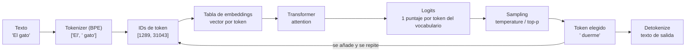
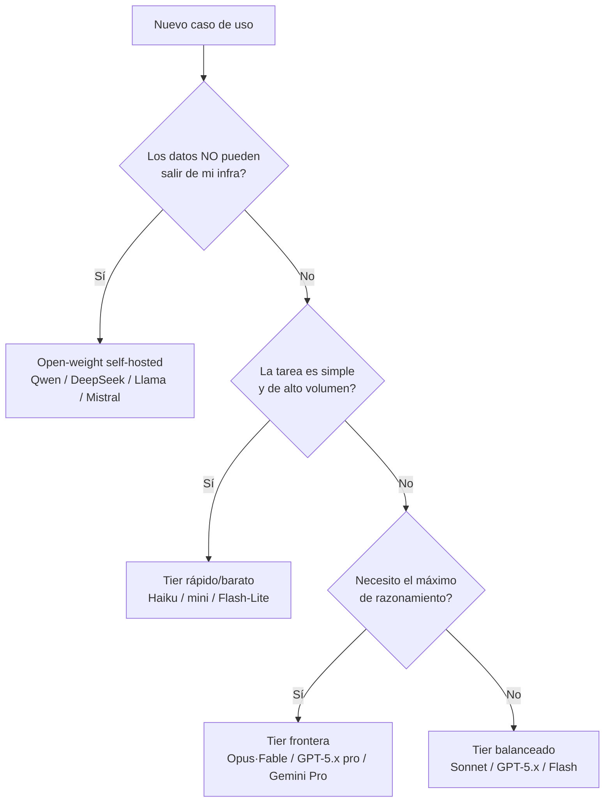

import Nivel from "@components/Nivel.astro";
import Reto from "@components/Reto.astro";
import Solucion from "@components/Solucion.astro";
import Quiz from "@components/Quiz.astro";
import CheckDominio from "@components/CheckDominio.astro";

<Nivel nivel="intermedio" />

Vas a abrir la caja negra. Hasta ahora un LLM (Large Language Model) era "esa cosa
que responde". En esta lección dejas de tratarlo como magia y empiezas a tratarlo
como un sistema con piezas concretas: un texto entra, se parte en **tokens**, cada
token se convierte en un **vector**, el modelo predice el siguiente token con una
**distribución de probabilidad**, y un proceso de **sampling** elige uno. Entender
esas piezas es la diferencia entre "le pido cosas a una IA" y "diseño y depuro un
sistema de IA". Es justo lo que separa a un usuario de un AI Engineer.

## Objetivos de esta lección

Al terminar deberías ser capaz de:

- **O1 — Explicar** por qué el modelo no ve letras sino **tokens**, y **predecir**
  cómo eso afecta al **costo**, al **límite de context window** y a tareas a nivel
  de carácter (contar letras, rimas, código).
- **O2 — Explicar** el efecto de **temperature** y **top-p** sobre la salida, y
  **elegir** valores defendibles para un caso concreto (o justificar por qué en
  2026 algunas APIs ya no exponen esos controles).
- **O3 — Explicar** qué es una **alucinación**, por qué ocurre, **diseñar** al
  menos dos mitigaciones, y **elegir** una familia de modelo del panorama 2026
  justificando el trade-off.

## Por qué esto importa (y paga)

El mercado 2026 ya no paga por "saber escribir un prompt". Paga por quien puede
**defender decisiones técnicas** sobre un sistema de IA en producción: por qué
este modelo y no aquel, por qué la factura se disparó, por qué el bot inventó un
número de teléfono que no existe, por qué un documento de 300 páginas "no cabe".
Todas esas conversaciones se ganan o se pierden con los fundamentos de esta
lección. En una entrevista, "explícame qué es un token y por qué importa" o
"¿cómo bajarías el costo de esta app?" son preguntas de filtro. Quien improvisa,
cae. Quien entiende tokens, context window y sampling, responde con datos.

> [!tip] GLaDOS dice
> Un LLM es un autocompletado con esteroides y delirios de grandeza. No "sabe"
> nada — predice el token más plausible. Si entiendes eso, dejas de sorprenderte
> de que mienta con seguridad, y empiezas a diseñar para evitarlo.

## Lo que ya traes (activación)

Antes de seguir, recupera **de memoria** —sin volver a abrir las notas— tres
ideas de las sub-unidades anteriores. Si no te salen con fluidez, ese tirón mental
es el aprendizaje en acción; igual sigue, pero vuelve a repasarlas después.

1. De [6.00 · Matemática mínima](/fase-6-ai-engineering/6-0-matematica-minima/):
   ¿qué es un **vector** y qué mide la **similitud coseno** entre dos vectores?
2. De [6.0b · Puente ML/DL](/fase-6-ai-engineering/6-0b-puente-ml-dl/): ¿qué
   diferencia hay entre **entrenar** un modelo e **inferir** con él? ¿Qué es,
   en una frase, la intuición de **attention**?
3. ¿Qué significa que un modelo tenga un **knowledge cutoff** (fecha de corte de
   conocimiento)?

Lo de esta lección se apoya en esas tres: los tokens se convierten en vectores
(1), el transformer los procesa con attention (2), y el cutoff es una de las
causas de las alucinaciones (3).

## Worked example 1: cómo "ve" el texto un LLM

Te muestro el razonamiento completo, en voz alta, antes de pedirte que lo hagas
tú. Pregunta de partida: **¿cuántas "palabras" entran cuando le mando una frase a
un modelo?** Respuesta corta: al modelo no le entran palabras. Le entran **tokens**.

Un **token** es un trozo de texto del tamaño que el modelo aprendió a manejar
—a veces una palabra entera, a veces un trozo de palabra, a veces un signo o un
espacio—. El modelo tiene un **vocabulario** fijo (decenas de miles de tokens) y
parte cualquier texto en piezas de ese vocabulario mediante un algoritmo llamado
**BPE** (Byte-Pair Encoding). La regla intuitiva: **lo frecuente se queda entero,
lo raro se parte**.

> _Pienso en voz alta:_ tomo la frase `"El gato"`. "El" y " gato" son fragmentos
> muy comunes en español → probablemente **2 tokens** (fíjate que el espacio
> suele viajar pegado a la palabra que sigue: el token es `" gato"`, con espacio).
> Ahora tomo `"internacionalización"`: es una palabra larga y poco frecuente →
> el modelo no la tiene entera, así que la parte en trozos: algo como
> `intern` + `acional` + `ización`, **3 o más tokens**. Y `"🎂"`: un emoji se
> codifica en varios bytes → puede costar **2 o más tokens** él solo.

¿Por qué deberías cargar con este detalle aparentemente menor? Porque de aquí
salen tres consecuencias que vas a vivir en producción:

| Consecuencia | Por qué pasa |
|---|---|
| **Pagas por token, no por palabra** | La factura de casi toda API se mide en tokens de entrada + salida. Texto en inglés ≈ 1 token por cada ~4 caracteres; en español, código, o lenguajes no latinos, **cuesta más tokens** por el mismo contenido. |
| **El límite es en tokens** | El **context window** (lo que cabe en una petición) se mide en tokens, no en páginas. Un PDF "corto" en chino o lleno de tablas puede no caber. |
| **Tareas a nivel de carácter fallan** | "¿Cuántas erres tiene 'ferrocarril'?" o "invierte esta cadena letra por letra" son difíciles para el modelo: **no ve letras**, ve tokens. Por eso a veces cuenta mal las letras de una palabra. |

Y un detalle clave para más adelante: cada token, una vez identificado, **no
entra como un número suelto**. El modelo tiene una tabla de **embeddings** —un
vector aprendido por cada token del vocabulario— y reemplaza cada token por su
vector. Esos vectores son la verdadera entrada del transformer. (Es el mismo
concepto de _embedding_ que profundizarás como producto de búsqueda en
[6.5 · Embeddings y búsqueda semántica](/fase-6-ai-engineering/6-5-embeddings-busqueda-semantica/);
aquí es una pieza interna del modelo.)

El recorrido completo de una petición, de punta a punta:

Fíjate en el bucle: el modelo predice **un token a la vez**, lo añade a la
secuencia, y vuelve a empezar. Por eso las respuestas "salen escribiéndose": cada
token de salida es una pasada completa por el modelo. Y por eso la **salida**
también cuesta tokens (y suele costar más cara que la entrada).

### Worked example 2: cómo elige el modelo cada token (sampling)

Llegamos al recuadro `F → G` del diagrama. El transformer no produce directamente
una palabra: produce **logits**, es decir, un puntaje crudo para **cada token del
vocabulario**. Esos puntajes se convierten en una **distribución de probabilidad**
con una función llamada _softmax_. Solo entonces hay que **elegir** un token. Ese
paso de elección es el **sampling**, y tiene perillas.

> _Pienso en voz alta:_ supongamos que el modelo, tras "El cielo es", asigna:
> `azul` 0.60, `gris` 0.20, `infinito` 0.10, y el resto del vocabulario se reparte
> el 0.10 restante. ¿Qué token elijo?
>
> - Si quiero **lo más probable y reproducible**, elijo siempre el de mayor
>   probabilidad: `azul`. Eso es _greedy decoding_, equivalente a **temperature 0**.
> - Si quiero **variedad** (que a veces diga `gris`), tengo que muestrear de la
>   distribución. Ahí entran temperature y top-p.

**Temperature** reescala la distribución _antes_ de muestrear:

- **temperature baja** (cerca de 0) → la distribución se vuelve más "puntiaguda":
  el token más probable domina. Salida **determinista y conservadora**. Ideal
  para extracción de datos, clasificación, generación de SQL o JSON.
- **temperature alta** (p. ej. 1.0 o más) → la distribución se **aplana**: tokens
  poco probables ganan chance. Salida **creativa y diversa**, pero más propensa a
  divagar o inventar. Ideal para brainstorming, nombres, variantes de copy.

**Top-p** (_nucleus sampling_) recorta por otro lado: ordena los tokens por
probabilidad y se queda solo con el **conjunto más pequeño cuya probabilidad
acumulada llega a `p`**; descarta la cola larga improbable y muestrea dentro de
ese núcleo. Con `top-p = 0.9`, en el ejemplo de arriba el núcleo sería
`{azul, gris}` (0.60 + 0.20 = 0.80; agrega `infinito` para pasar 0.90) y nunca
saldría un token de la cola rarísima. Sirve para **cortar la basura** sin volver
todo determinista.

> [!info] Regla práctica
> Ajusta **una** perilla, no las dos a la vez. La mayoría de los casos se resuelven
> moviendo solo `temperature`. Tareas factuales → temperature baja. Tareas
> creativas → temperature media-alta y/o top-p ~0.9.

:::caution[Realidad 2026 — no des por hecho que esas perillas existen]
Varias APIs frontera de 2026 (por ejemplo la familia Claude Opus 4.x / Fable, y
modelos de razonamiento de otros proveedores) **eliminaron `temperature`, `top-p`
y `top-k`** de la petición: enviarlos devuelve un error. La intención de "más
determinista" o "más creativo" ahora se expresa por **prompt** y por parámetros
de **effort/reasoning**, no por una temperatura. Aprende el concepto —se sigue
aplicando bajo el capó y a modelos open-source que sí los exponen— pero **verifica
siempre la documentación del modelo concreto** antes de asumir que puedes pasar
`temperature`.
:::

## Lo que parece cierto pero no lo es

:::caution[Misconception 1 — "1 palabra = 1 token"]
Falso. En inglés, 1 token ≈ 4 caracteres ≈ 0.75 palabras de promedio, pero es solo
un promedio. Palabras largas o raras se parten en varios tokens; el español, el
código y los lenguajes no latinos **cuestan más tokens** por el mismo texto. Nunca
estimes costo o tamaño "contando palabras": cuenta tokens (lo harás en el
ejercicio).
:::

:::caution[Misconception 2 — "temperature 0 garantiza la misma salida siempre"]
Casi, pero no del todo. `temperature 0` (greedy) hace la salida **mucho más**
reproducible, pero el determinismo bit-a-bit nunca estuvo garantizado: batching,
hardware y detalles de implementación pueden variar. "Determinista" en la práctica
significa "muy estable", no "idéntico garantizado".
:::

:::caution[Misconception 3 — "el context window grande resuelve todo: meto el libro entero"]
Falso por dos razones. Primero, **cuesta**: pagas por todos esos tokens en cada
petición. Segundo, **la calidad cae**: los modelos sufren _lost in the middle_
—prestan menos atención a la información del medio de un contexto muy largo— y a
veces ignoran datos clave aunque estén ahí. Por eso existe
[RAG](/fase-6-ai-engineering/6-7-rag-a-fondo/): recuperar solo lo relevante en
vez de meterlo todo.
:::

:::caution[Misconception 4 — "si el modelo lo dice con seguridad, es verdad"]
Falso, y es la trampa más cara. Un LLM optimiza por **plausibilidad**, no por
**verdad**. Genera texto que _suena_ correcto. Cuando no sabe, no se calla: rellena
con algo que encaja gramaticalmente. Eso es una **alucinación**, y la seguridad
del tono no tiene ninguna correlación con la veracidad.
:::

### Alucinaciones: qué son, por qué ocurren, cómo mitigarlas

Una **alucinación** es una afirmación que el modelo presenta como un hecho pero que
es falsa o inventada (un paper que no existe, una API que no tiene ese método, un
número de teléfono fabricado). Ocurre porque:

- El modelo **predice tokens plausibles**, no consulta una base de verdad.
- Hay **huecos** en sus datos de entrenamiento, o el tema es posterior a su
  **knowledge cutoff**.
- El prompt es **ambiguo** y el modelo "rellena" suposiciones.
- En contextos muy largos, **pierde** o confunde datos (_lost in the middle_).

No se elimina, se **mitiga**. Las defensas, de menos a más robustas:

| Mitigación | Qué hace | Dónde se profundiza |
|---|---|---|
| **Grounding / RAG** | Le das el contexto correcto recuperado de tus datos, en vez de confiar en su memoria | [6.7 · RAG](/fase-6-ai-engineering/6-7-rag-a-fondo/) |
| **Pedir citas y verificarlas** | El modelo debe citar la fuente; tú validas que exista y diga eso | — |
| **Salida estructurada + validación** | Forzar JSON con esquema y validarlo en código; rechazar lo que no calce | [6.4 · Structured outputs](/fase-6-ai-engineering/6-4-structured-tools-mcp/) |
| **Temperature baja en tareas factuales** | Menos divagación al elegir tokens | esta lección |
| **Instrucción de "di que no sabes"** | Permiso explícito para responder "no tengo esa información" | [6.2 · Prompt engineering](/fase-6-ai-engineering/6-2-prompt-context-engineering/) |
| **Evals + human-in-the-loop** | Medir la tasa de alucinación y revisar lo sensible antes de actuar | [6.9 · Eval-driven dev](/fase-6-ai-engineering/6-9-eval-driven-development/) |

> [!warning] Hilo de seguridad (OWASP LLM)
> La **desinformación** y el **exceso de confianza** en la salida del LLM son
> riesgos catalogados en el OWASP LLM Top 10. Regla de oro de ingeniería: **nunca
> ejecutes una acción con efectos** (un pago, un correo, un borrado) directamente
> sobre la salida cruda de un LLM sin validarla. Lo formalizas en
> [6.14 · Seguridad LLM](/fase-6-ai-engineering/6-14-seguridad-llm/).

## Panorama de modelos 2026 (y cómo elegir)

No existe "el mejor modelo". Existe **el mejor modelo para tu restricción
dominante** (calidad, costo, latencia, privacidad, tamaño de contexto). El
panorama a la fecha de escritura (2026) se organiza en familias, cada una con
**tiers**: un modelo "frontera" caro y potente, uno "balanceado", y uno "rápido y
barato".

| Familia (proveedor) | Tier frontera | Tier balanceado | Tier rápido/barato | Acceso |
|---|---|---|---|---|
| **Claude** (Anthropic) | Opus / Fable | Sonnet | Haiku | API cerrada |
| **GPT** (OpenAI) | GPT-5.x (flagship/pro) | GPT-5.x estándar | mini / nano | API cerrada |
| **Gemini** (Google) | Gemini 3 Pro | Gemini 3 / 3.x Flash | Flash-Lite | API cerrada |
| **Open-weight** | DeepSeek, Qwen, GLM, Llama, Mistral | (mismos, tiers medios) | modelos pequeños (7B–30B) | **pesos descargables** |

> [!warning] Atención — los nombres y precios caducan rápido
> Esta tabla es una **foto de 2026** y la cadencia de releases es brutal (versiones
> nuevas cada pocos meses). **No memorices nombres ni precios**: memoriza el patrón
> (familias × tiers) y el método de elección. Antes de decidir en un proyecto real,
> consulta la **documentación oficial vigente** del proveedor.

Como anclaje concreto y verificable, los precios de la familia Claude a la fecha
(USD por millón de tokens, entrada / salida):

| Modelo | Context window | Entrada $/1M | Salida $/1M |
|---|---|---|---|
| Claude Opus 4.8 | 1M | 5 | 25 |
| Claude Sonnet 4.6 | 1M | 3 | 15 |
| Claude Haiku 4.5 | 200K | 1 | 5 |

Observa el patrón que se repite en **todas** las familias: el tier frontera puede
costar **5–10x** más por token que el rápido. Por eso elegir bien el modelo es una
decisión de **costo/latencia**, no de moda.

### Cómo elegir, en cuatro preguntas

Criterios de desempate, en orden de impacto real:

1. **Privacidad / residencia de datos** → si los datos no pueden salir, open-weight
   self-hosted gana aunque sea menos potente (lo verás en
   [6.10 · Open-source, local y serving](/fase-6-ai-engineering/6-10-opensource-local-serving/)).
2. **Costo a escala** → millones de peticiones simples no justifican un modelo
   frontera; empieza por el barato y **sube solo si los evals lo exigen**.
3. **Latencia** → un chat en vivo o un agente de voz necesita el tier rápido.
4. **Calidad/razonamiento** → tareas agénticas largas, código complejo o análisis
   profundo justifican el frontera.

> [!tip] GLaDOS dice
> "¿Cuál es el mejor modelo?" es la pregunta de un humano. "¿Cuál es el mejor
> modelo _para esta restricción_?" es la pregunta de un ingeniero. Y la respuesta
> casi siempre empieza por el más barato que pasa los evals.

## Práctica con andamiaje (predecir antes de medir)

Aún no escribes código: primero **predices**. Es el Primero-Sin-IA en miniatura
(la técnica PRIMM: _Predict_ antes que _Run_). Para cada caso, anota tu predicción
y una línea de razonamiento. Luego, en el ejercicio entregable, lo verificarás con
una herramienta real.

1. **Tokens.** Ordena de **menos** a **más** tokens (sin medir todavía):
   _(a)_ `"hello world"` · _(b)_ `"antidisestablishmentarianism"` ·
   _(c)_ `"  "` (dos espacios) · _(d)_ `"def suma(a, b): return a + b"`.
2. **Sampling.** Para cada tarea, di **temperature baja** o **alta** y por qué:
   _(a)_ generar el `WHERE` de una consulta SQL; _(b)_ proponer 10 nombres para una
   cafetería; _(c)_ extraer el RUT y el monto de una boleta a JSON.
3. **Modelo.** Tienes que clasificar 2 millones de tickets de soporte por categoría
   (tarea simple, alto volumen, datos no sensibles). ¿Tier frontera o tier rápido?
   ¿Por qué?

<Solucion title="Ver razonamiento (ábrelo solo después de intentarlo)">
1. Orden típico: **(c) → (a) → (b) → (d)**. Dos espacios suelen ser 1–2 tokens;
   `"hello world"` son ~2; la palabra larga rara se parte en varios; el código
   suma identificadores, signos y espacios y suele ser el que más tokens consume.
   (Los números exactos dependen del tokenizer — por eso lo medirás.)
2. _(a)_ **baja** (quieres SQL correcto y reproducible), _(b)_ **alta** (quieres
   variedad), _(c)_ **baja** (extracción factual; nada de inventar campos).
3. **Tier rápido/barato.** Es tarea simple y de altísimo volumen: el frontera
   costaría 5–10x sin mejora que lo justifique. Si los evals mostraran que el
   barato se equivoca demasiado, _ahí_ subes de tier — no antes.
</Solucion>

## Ejercicios Primero-Sin-IA

Dos entregables. Trabájalos **a mano primero**, sin IA, dentro del timebox. Las
carpetas viven en tu repo: ábrelas en VS Code.

<Reto title="Tokenización: predice y verifica con un tokenizer real" timebox="40 min">

Carpeta: `ejercicios/fase-6/tokenizacion-y-conteo/`

Vas a comprobar con tus propias manos que el modelo no ve letras. En dos partes:

1. **A mano (predicción):** en `prediccion.md`, para 6 cadenas dadas, predice
   cuántos tokens crees que produce cada una y **ordénalas** de menos a más, con
   una línea de razonamiento por cada una. **No ejecutes nada todavía.**
2. **Código (verificación):** completa la función `contar_tokens(texto, codificacion)`
   en `tokenizador.py` usando la librería `tiktoken` (offline, sin API). Haz pasar
   los tests. Luego, en `verificacion.md`, pega los conteos reales y compáralos con
   tu predicción: ¿en qué te equivocaste y por qué?

**Criterios de "hecho":**
- [ ] `prediccion.md` existe **antes** de ejecutar, con orden + razonamiento.
- [ ] Todos los tests pasan (`pytest`).
- [ ] `verificacion.md` compara predicción vs realidad y nombra **una** idea
      equivocada que tenías (no "me equivoqué en un número").
- [ ] Puedes **explicar sin notas** por qué el español o el código cuestan más
      tokens que el inglés equivalente.

Cuando termines, pídele a tu IA que lo corrija con el framework de `.ai/`.

</Reto>

<Solucion title="Pista (NO la solución): si te traba la función de conteo">
La idea es: obtener una codificación con `tiktoken`, **codificar** el texto en una
lista de IDs de token, y devolver la **longitud** de esa lista. La librería tiene
una función para conseguir una codificación por nombre (`o200k_base` es la moderna).
"Contar tokens" es literalmente `len(...)` sobre lo que devuelve `encode`. No
necesitas internet salvo la primera vez (descarga el vocabulario y lo cachea).
</Solucion>

<Reto title="Decisiones de sampling, alucinación y modelo" timebox="35 min">

Carpeta: `ejercicios/fase-6/decisiones-sampling-modelo/`

Ejercicio de **diseño/razonamiento** (sin código). En `decisiones.md` resuelve tres
escenarios de producto. Para cada uno: elige y **justifica** un setting de sampling,
evalúa el **riesgo de alucinación** y propón **dos mitigaciones concretas**, y elige
una **familia/tier de modelo** del panorama 2026 con su trade-off.

Los escenarios y la plantilla exacta están en el `README.md` de la carpeta.

**Criterios de "hecho":**
- [ ] Los tres escenarios resueltos con la plantilla completa.
- [ ] Cada decisión de sampling tiene una justificación ligada a la tarea (no
      "porque sí").
- [ ] Cada escenario propone **dos** mitigaciones de alucinación **distintas** y
      apropiadas al caso.
- [ ] La elección de modelo nombra la **restricción dominante** (costo / latencia /
      privacidad / calidad), no solo "el mejor".

</Reto>

## Check de dominio

<CheckDominio
  title="Marca solo lo que puedes EXPLICAR sin notas"
  items={[
    "Explicar qué es un token y por qué 1 palabra no es 1 token.",
    "Predecir por qué el español y el código cuestan más tokens que el inglés.",
    "Explicar qué es el context window y dar dos razones para no 'meter todo'.",
    "Explicar el efecto de temperature (baja vs alta) y de top-p sobre la salida.",
    "Definir alucinación, dar una causa y dos mitigaciones.",
    "Elegir una familia/tier de modelo 2026 nombrando la restricción dominante.",
  ]}
/>

Y dos preguntas rápidas de recuperación:

<Quiz
  question="Una app procesa documentos legales en español, muchos de 50+ páginas. ¿Qué afirmación es correcta?"
  options={[
    "Como tienen context window de 1M, conviene siempre pegar el documento completo en cada petición.",
    "El español cuesta más tokens que el inglés equivalente, y meter todo el documento sube el costo y puede degradar la calidad (lost in the middle).",
    "El número de tokens es igual al número de palabras, así que basta contar palabras para estimar el costo.",
  ]}
  answer={1}
  explanation="Tokens != palabras (y el español cuesta más por carácter). Context window grande no es gratis ni mejora la calidad automáticamente: pagas por todo y arriesgas lost in the middle. Por eso se usa RAG."
/>

<Quiz
  question="Necesitas extraer el monto y la fecha de una factura a JSON, de forma confiable. ¿Mejor estrategia de sampling y por qué?"
  options={[
    "Temperature alta, para que el modelo sea creativo al interpretar el formato.",
    "Temperature baja (o greedy) + salida estructurada validada, porque es una tarea factual y no quieres que invente campos.",
    "Da igual el sampling; el modelo nunca alucina en extracción de datos.",
  ]}
  answer={1}
  explanation="Extracción factual = determinismo + validación. Temperature baja reduce la divagación; el esquema JSON validado en código atrapa lo que igual se invente. Los LLM SÍ alucinan en extracción."
/>

:::tip[Si ya tocaste LLMs en producción]
Quizá ya llamaste a Azure OpenAI o construiste un RAG. **Valida y salta:** ¿puedes
**defender en una entrevista**, sin notas, (1) por qué tu factura escala con tokens
y no con palabras, (2) por qué subir el context window no siempre mejora la calidad,
y (3) por qué la salida del LLM nunca se ejecuta sin validar? Si las tres te salen
con datos, usa los ejercicios para auditar un sistema tuyo real en vez de uno de
juguete. Si alguna se siente borrosa, esta lección te dice cuál.
:::

## Recursos

Documentación oficial primero; los blogs y leaderboards son secundarios y caducan.

- **Tokens y tokenizer (intuición visual):** el [tokenizer de OpenAI](https://platform.openai.com/tokenizer)
  y la librería [`tiktoken`](https://github.com/openai/tiktoken) (la que usarás).
- **Conteo de tokens de Claude (preciso):** la
  [API de token counting de Anthropic](https://platform.claude.com/docs/en/build-with-claude/token-counting)
  — recuerda: cada familia tokeniza distinto, `tiktoken` es de OpenAI.
- **Panorama y precios vigentes (verifícalos al usarlos):**
  [modelos de Anthropic](https://platform.claude.com/docs/en/about-claude/models),
  [modelos de OpenAI](https://platform.openai.com/docs/models),
  [modelos de Gemini](https://ai.google.dev/gemini-api/docs/models).
- **Sampling explicado:** la sección de _sampling parameters_ en la documentación
  de cualquier proveedor abierto (p. ej. la de vLLM o Hugging Face Transformers).

> Mantén tus links vivos en `articulos.md` dentro de la carpeta de esta sub-unidad.
> Prefiere siempre la fuente oficial.

## Conexión con el proyecto de la fase

El capstone de la Fase 6 es una
[**Plataforma RAG de producción**](/fase-6-ai-engineering/proyecto/). Todo lo de
hoy es cimiento directo de ese proyecto: el **conteo de tokens** define tu
presupuesto de costo y por qué necesitas _chunking_; el **context window** es la
razón de ser del retrieval (no cabe todo, hay que recuperar lo relevante); el
**sampling** y las **alucinaciones** son exactamente lo que tu **eval harness**
(6.9) tendrá que medir y controlar; y la **elección de modelo** será una decisión
de costo/latencia que documentarás en un ADR. Hoy aprendiste el vocabulario con el
que vas a defender ese capstone.

## Reflexión y repaso espaciado

Antes de cerrar, responde en tu cuaderno o en `articulos.md`:

- ¿Qué te sorprendió más al medir tokens reales vs tu predicción? ¿Qué intuición
  vas a corregir?
- Piensa en una app de IA que uses a diario: ¿qué tier de modelo crees que tiene
  detrás, y por qué (costo, latencia, calidad)?

**Gancho de spaced repetition** — agenda estos repasos:

- **Mañana (+1 día):** sin mirar, dibuja de memoria el pipeline
  `texto → tokens → embeddings → logits → sampling → token` y explica cada flecha.
- **En 3 días:** elige un caso de uso nuevo y decide modelo + sampling + dos
  mitigaciones de alucinación, justificando cada uno.
- **En 1 semana:** explícale a alguien (o a tu IA, en voz alta) por qué un LLM
  "miente con seguridad". Si puedes enseñarlo, lo aprendiste.

Siguiente parada:
[**6.2 · Prompt & Context Engineering**](/fase-6-ai-engineering/6-2-prompt-context-engineering/),
donde aprenderás a gestionar ese context window y a escribir prompts que reducen
las alucinaciones que hoy aprendiste a diagnosticar.
