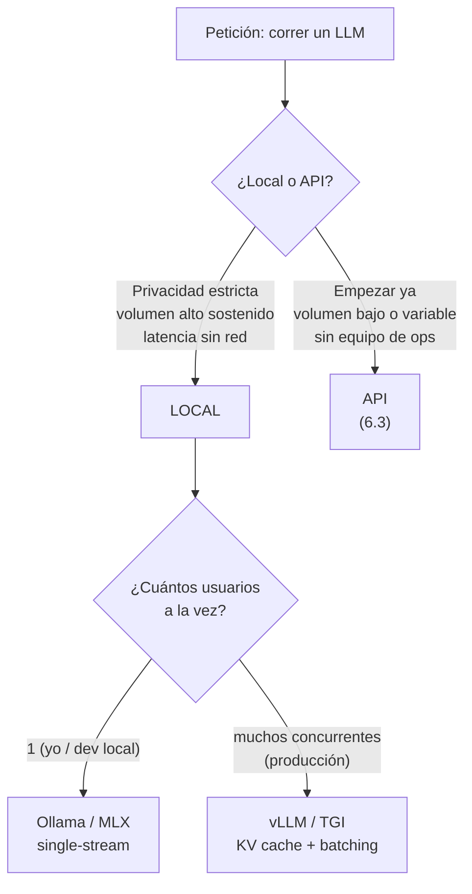
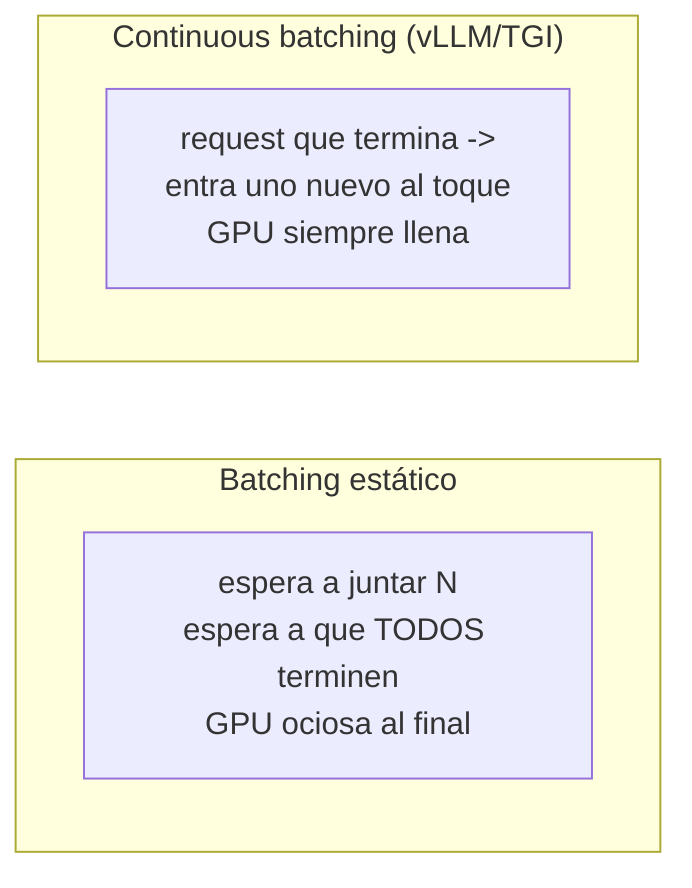

import Nivel from "@components/Nivel.astro";
import Reto from "@components/Reto.astro";
import Solucion from "@components/Solucion.astro";
import Quiz from "@components/Quiz.astro";
import CheckDominio from "@components/CheckDominio.astro";

<Nivel nivel="intermedio" />

Hasta aquí cada llamada a un LLM viajó a la nube: en [6.3 · APIs de LLM](/fase-6-ai-engineering/6-3-apis-llm/)
mandaste tokens a un servidor de OpenAI o Anthropic, pagaste por token y recibiste la
respuesta. Funciona, es cómodo y casi siempre es la decisión correcta para empezar. Pero
hay un mundo paralelo: el modelo **vive en tu máquina** (o en tu GPU, o en el servidor de
tu empresa) y nadie externo ve los datos ni te cobra por token. Esta lección es sobre ese
mundo —**modelos open-source corridos localmente**— y, más importante, sobre **cuándo
vale la pena** y **con qué herramienta**, porque "local" no es una cosa: hay una enorme
diferencia entre correr un modelo para ti solo en tu laptop y **servirlo** a 500 usuarios
a la vez.

Vamos desde cero. No necesitas tener una GPU ni haber instalado nada: la mayor parte de
esta lección es **criterio de ingeniería** (qué elegir y por qué), no recetas de
instalación. Las herramientas cambian de versión cada par de meses; el criterio no.

## Objetivos de esta lección

Al terminar deberías ser capaz de:

- **O1 — Explicar el trade-off** entre correr un modelo con un runtime **single-user**
  (Ollama, MLX) y **servirlo** con un motor de **producción** (vLLM, TGI), nombrando los
  dos mecanismos que hacen la diferencia: **KV cache** y **continuous batching**, y la
  tensión **throughput vs latencia**.
- **O2 — Decidir** entre **local y API** para un escenario dado, justificando con los tres
  ejes reales —**costo, privacidad, latencia**— y calculando el **punto de equilibrio** de
  costo (cuándo el costo fijo de servir local le gana al costo por token de una API).
- **O3 — Elegir una cuantización** (GGUF vs AWQ) según dónde corre el modelo (CPU/Mac vs
  GPU en producción) y explicar qué se gana y qué se pierde al cuantizar.

## Por qué esto importa (y paga)

El "💰" de la Fase 6 es el premium por **diseñar, construir, evaluar y sostener** sistemas
de IA. El serving local es uno de los lugares donde ese premium se cobra caro, por razones
de mercado muy concretas:

- **"Nuestros datos no pueden salir de la empresa."** Banca, salud, gobierno y legal en
  LATAM tienen este requisito por contrato o por ley. El candidato que sabe parar la
  pregunta "¿y si lo corremos on-prem?" con un diseño real (qué motor, qué GPU, qué
  cuantización, qué throughput) vale el doble del que solo sabe llamar a una API.
- **El costo a escala.** Una API por token es baratísima al principio y carísima a volumen
  alto y sostenido. Saber **dónde está el punto de equilibrio** —y no migrar a local
  "porque suena pro" cuando todavía no conviene— es criterio de ingeniero, no de fan.
- **Latencia y control.** Sin red de por medio puedes bajar la latencia y garantizar
  disponibilidad. Un voice agent (lo verás en [6.12](/fase-6-ai-engineering/6-12-voice-realtime/))
  que necesita responder en menos de 250 ms a veces *no puede* permitirse un round-trip a
  la nube.

> [!tip] En la práctica
> Correr tu propio modelo es como tener tu propio reactor en el sótano: nadie te corta la
> luz, nadie te factura por kilovatio, y eres el único responsable cuando algo se
> sobrecalienta. La nube es cómoda hasta que la factura llega. El sótano es tuyo hasta que
> la GPU se cae un domingo a las 3 a.m. Elige con la cabeza, no con el ego.

## Lo que ya traes (activación)

Antes de seguir, recupera **de memoria** —sin abrir las notas— tres ideas previas:

1. De [6.1 · Fundamentos de LLMs](/fase-6-ai-engineering/6-1-fundamentos-llms/): un modelo
   genera **un token a la vez**, y para generar el token N necesita "mirar" todos los
   anteriores. ¿Recuerdas que el context window se mide en tokens y que generar es
   secuencial? Eso es exactamente lo que el **KV cache** optimiza.
2. De [6.3 · APIs de LLM](/fase-6-ai-engineering/6-3-apis-llm/): el costo se calcula por
   **tokens de entrada y salida**, con la salida más cara. Hoy comparamos ese costo
   **variable** (por token) contra un costo **fijo** (la GPU, la pagues o no la uses).
3. De [6.6 · Vector databases](/fase-6-ai-engineering/6-6-vector-databases/): ya viste que
   "la mejor herramienta" no existe; existe **la mejor para la restricción dominante**. La
   misma lógica manda aquí: local vs API y qué motor se decide por la restricción, no por
   la moda.

## Worked example: "¿Lo corro local o uso una API? Y si es local, ¿con qué?"

Te modelo el razonamiento completo en voz alta, como lo haría un AI Engineer frente a tres
peticiones reales. **No memorices comandos**: sigue el razonamiento.

### El mapa mental: dos preguntas, en orden



La trampa clásica es saltar directo a "instalo Ollama" sin pasar por la primera pregunta.
Vamos petición por petición.

### Petición 1 — "Quiero un asistente de código en mi Mac, sin que mi código salga a la nube"

**Pienso en voz alta:** Un solo usuario (yo). Privacidad alta (código propietario). Sin
GPU NVIDIA: es un Mac con Apple Silicon. No necesito servir a nadie más, no hay
concurrencia. → Esto es **local, single-user**. Las dos herramientas naturales:

- **Ollama** — el camino más simple en cualquier OS. Descarga el modelo (en formato
  **GGUF**, cuantizado) y expone una API local. Un comando y listo:

  ```bash
  # Descarga + corre un modelo de código abierto, cuantizado (GGUF)
  ollama pull qwen2.5-coder:7b
  ollama run qwen2.5-coder:7b
  ```

  Lo bonito: Ollama expone un endpoint **compatible con OpenAI** en
  `http://localhost:11434/v1`, así que el mismo código del cliente de [6.3](/fase-6-ai-engineering/6-3-apis-llm/)
  funciona sin cambios —solo cambias la `base_url`:

  ```python
  from openai import OpenAI

  client = OpenAI(
      base_url="http://localhost:11434/v1",
      api_key="ollama",  # requerido por el SDK, Ollama lo ignora
  )

  resp = client.chat.completions.create(
      model="qwen2.5-coder:7b",
      messages=[{"role": "user", "content": "Escribe un test pytest para una función suma(a, b)"}],
  )
  print(resp.choices[0].message.content)
  ```

- **MLX** — el framework de Apple para correr (y afinar) modelos en Apple Silicon,
  aprovechando la **memoria unificada** del chip M. En la práctica suele dar mejor
  rendimiento que Ollama en un Mac para el mismo modelo. Se usa por línea de comandos:

  ```bash
  # mlx-lm: genera con un modelo de la comunidad MLX (cuantizado a 8 bits)
  uv run --with mlx-lm mlx_lm.generate \
    --model mlx-community/Qwen2.5-Coder-7B-Instruct-8bit \
    --prompt "Escribe un test pytest para suma(a, b)"
  ```

**Decisión:** Ollama si quiero cero fricción y portabilidad; MLX si estoy en Mac y quiero
exprimir el hardware. Ambos sirven a **un** stream a la vez con buena experiencia. Modelo:
**Qwen2.5-Coder** (SOTA abierto para código, corre cómodo en un Mac de 32–64 GB).

> [!info] Una nota honesta sobre servers locales
> Montar un server de inferencia local *always-on* tiene un costo de mantenimiento real:
> el modelo ocupa disco, el proceso consume recursos aunque no lo uses, y alguien debe
> mantenerlo. Muchas veces basta con un `mlx_lm.generate` puntual o con Ollama bajo
> demanda; el server dedicado solo se justifica con uso constante. Empieza on-demand y
> promociona a server dedicado solo cuando el uso real lo pida.

### Petición 2 — "Tenemos que servir un chatbot interno a 500 empleados a la vez, on-prem"

**Pienso en voz alta:** Ahora hay **concurrencia alta** y un requisito de **privacidad**
duro (on-prem por regulación). Ollama y MLX sirven *un* request a la vez con comodidad,
pero colapsan con 500 simultáneos: cada usuario esperaría su turno. Aquí necesito un
**motor de serving de producción**. Los dos estándar:

- **vLLM** — el motor de serving open-source más usado. Un comando levanta un servidor
  compatible con OpenAI:

  ```bash
  # Sirve un modelo a múltiples usuarios concurrentes, API compatible con OpenAI
  vllm serve Qwen/Qwen2.5-7B-Instruct \
    --host 0.0.0.0 --port 8000 \
    --api-key token-interno
  ```

- **TGI (Text Generation Inference)** — el motor de Hugging Face, pensado para correr en
  Docker. Mismo objetivo, distinto ecosistema:

  ```bash
  # TGI vía Docker (la cuantización se elige con --quantize)
  docker run --gpus all --shm-size 1g -p 8080:80 \
    -v "$PWD/data:/data" \
    ghcr.io/huggingface/text-generation-inference:latest \
    --model-id Qwen/Qwen2.5-7B-Instruct \
    --quantize awq
  ```

¿Por qué estos dos aguantan 500 usuarios y Ollama no? Por dos mecanismos. Tómate tiempo
con ellos, porque **son la pregunta de entrevista** de este tema:

- **KV cache** — al generar token a token, el modelo recalcularía la atención sobre **todo
  el prompt** en cada paso. El KV cache **guarda** las claves/valores (key/value) ya
  computados de los tokens anteriores, así el paso N solo computa el token nuevo. Sin él,
  generar sería cuadrático y lentísimo. El costo: el KV cache **ocupa memoria de GPU**, y
  esa memoria es el recurso escaso que limita cuántos requests caben a la vez.
- **Continuous batching** — la GPU es masivamente paralela: procesar 1 request o 30 a la
  vez cuesta casi lo mismo por paso. El batching **estático** esperaría a juntar un lote y
  a que **todos** terminen antes de soltar resultados. El **continuous** (o "rolling")
  batching es más astuto: en cuanto un request del lote **termina**, mete otro nuevo en su
  lugar sin esperar. Resultado: la GPU nunca está ociosa y el **throughput** (requests por
  segundo del sistema) se dispara.



**El trade-off que define el tema — throughput vs latencia:** subir el tamaño del batch
sube el **throughput** del sistema (sirves a más gente con la misma GPU → menor costo por
request) pero puede **subir la latencia** de cada request individual (tu token tarda un
pelo más porque la GPU está repartida entre muchos). Servir a 500 personas no es
"optimizar la velocidad de una respuesta"; es **maximizar requests/segundo dentro de un
techo de latencia aceptable**. Eso es serving de producción, y ni Ollama ni MLX están
hechos para eso.

**Decisión:** vLLM (o TGI) en una GPU, on-prem. Modelo abierto cuantizado para que quepa,
KV cache + continuous batching haciendo el trabajo pesado.

### Petición 3 — "Startup, 100 usuarios, presupuesto chico, tráfico variable, sin equipo de ML ops"

**Pienso en voz alta:** Volumen bajo y **variable**, sin gente para operar GPUs, y la
prioridad es **salir ya**. Una GPU cuesta lo mismo esté ociosa o llena; con tráfico
variable y bajo, pagaría una GPU para tenerla casi siempre vacía. → **API**. El costo por
token es ínfimo a este volumen y elimina toda la operación. Migrar a local **después**, si
el volumen crece y se sostiene, o si aparece un requisito de privacidad.

### La cuenta que cierra la decisión: el punto de equilibrio de costo

La intuición de la Petición 3 se puede **calcular**, y es lo que separa una opinión de una
decisión de ingeniería. El costo de una **API** es **variable** (por request); el de
**local** es **fijo** (la GPU se paga por hora, la uses o no):

```
costo_api_mensual   = requests_mes × costo_por_request          (lineal, sube con el uso)
costo_local_mensual = horas_del_mes × costo_por_hora_de_GPU      (fijo, no depende del uso)
```

El **punto de equilibrio** es el número de requests donde ambos cuestan lo mismo:

```
requests_equilibrio = costo_local_mensual / costo_por_request
```

Por debajo de ese número, la **API es más barata**. Por encima —volumen alto y
sostenido— **local gana**. Ejemplo con números redondos: si cada request cuesta
USD 0.001 en la API y una GPU rentada cuesta USD 730 al mes (1 USD/hora × 730 horas),
el equilibrio está en **730 000 requests/mes** (~24 000 al día). Si tu startup hace
20 000 requests/mes, local te costaría **36×** más que la API. La conclusión honesta:
**a volumen bajo, local casi nunca gana por costo** — gana por privacidad o latencia.
Implementarás esta cuenta en el primer ejercicio.

## Non-examples y misconceptions

:::caution[Podrías pensar X… y está mal]

- **"Local siempre es más barato que pagar una API."** Falso, y al revés de lo que cree
  todo el mundo. Local es *costo fijo*: una GPU vacía cuesta lo mismo que una GPU llena. A
  volumen bajo o variable, la API por token sale **mucho** más barata. Local gana por
  costo solo a volumen **alto y sostenido** (mira el punto de equilibrio).
- **"Ollama y vLLM son lo mismo, uno es más nuevo."** No. Ollama está hecho para **un
  usuario** (tu laptop, tu dev local); vLLM/TGI están hechos para **servir a muchos** con
  KV cache y continuous batching. Usar Ollama para producción multiusuario es como usar
  `python -m http.server` para tu sitio con tráfico real: arranca, pero se cae.
- **"Cuantizar es gratis, solo achica el modelo."** No es gratis: cuantizar reduce la
  precisión de los pesos (de 16 bits a 4 u 8), lo que **ahorra memoria y acelera** pero
  **degrada algo de calidad**. A 8 bits casi no se nota; a 4 bits (Q4) es un trade-off
  defendible; a 2 bits la degradación es visible. Es una decisión con costo, no un botón
  mágico.
- **"GGUF y AWQ son intercambiables."** No. **GGUF** (llama.cpp / Ollama) está pensado
  para CPU y CPU+GPU híbrido, ideal en Mac y consumer hardware. **AWQ** es GPU-native y se
  integra con el continuous batching de vLLM. Un archivo GGUF **no** lo carga vLLM y un
  modelo AWQ **no** lo carga llama.cpp. La cuantización se elige por **dónde corre**.
- **"Más batch = siempre mejor."** Sube el throughput pero puede subir la latencia por
  request. Servir bien es maximizar requests/segundo **dentro de un techo de latencia**,
  no maximizar el batch a ciegas.

:::

> [!warning] Privacidad no es lo mismo que "local"
> "Lo corremos local, entonces es privado" es media verdad. Que el modelo no mande datos
> a un tercero ayuda, pero el prompt y la respuesta siguen pasando por logs, por el KV
> cache en memoria, y por quien tenga acceso al servidor. La privacidad real exige además
> control de acceso, cifrado y retención de logs —eso lo formalizas en
> [6.14 · Seguridad LLM](/fase-6-ai-engineering/6-14-seguridad-llm/). Local **habilita** la
> privacidad; no la garantiza solo.

## Hugging Face Hub: de dónde salen los modelos

Los modelos abiertos viven en el **Hugging Face Hub** (`huggingface.co`), el "GitHub de
los modelos". Ahí encuentras los pesos, la *model card* (licencia, datos, limitaciones —
las verás formalmente en [6.15 · Governance](/fase-6-ai-engineering/6-15-ai-governance/))
y, muchas veces, versiones ya cuantizadas (busca repos `-GGUF`, `-AWQ`, o de la org
`mlx-community`). La CLI oficial se llama **`hf`** (antes `huggingface-cli`, renombrada en
2025):

```bash
# Descarga los pesos de un modelo a tu disco
hf download Qwen/Qwen2.5-7B-Instruct
```

Ollama, MLX, vLLM y TGI **descargan del Hub por ti** cuando les pasas el nombre del
modelo; rara vez bajas los archivos a mano. Lo que sí debes mirar siempre antes de usar un
modelo: su **licencia** (no todas permiten uso comercial) y su *model card*.

## Práctica con andamiaje

Antes de los retos sin IA, un calentamiento de razonamiento. **Predice antes de leer la
respuesta** (es retrieval, no trivia).

<Quiz
  question="Una empresa procesa 15.000 requests al mes, tráfico muy variable, y no tiene equipo de ML ops. ¿Local o API, y por qué?"
  options={[
    "Local con vLLM: servir on-prem siempre sale más barato",
    "API: a volumen bajo y variable el costo por token gana, y no hay que operar GPUs",
    "Local con Ollama: 15.000 requests es demasiado para una API",
    "Da igual, el costo es idéntico en ambos casos",
  ]}
  answer={1}
  explanation="A volumen bajo y variable, la API por token es mucho más barata que pagar una GPU que estará casi siempre ociosa, y elimina la operación. Local ganaría solo a volumen alto y sostenido, o por un requisito de privacidad/latencia."
/>

<Quiz
  question="¿Cuál es el rol del KV cache al generar texto?"
  options={[
    "Guardar las respuestas para no repetir prompts iguales",
    "Evitar recomputar la atención sobre los tokens ya generados, a cambio de ocupar memoria de GPU",
    "Comprimir el modelo para que ocupe menos disco",
    "Repartir los requests entre varias GPUs",
  ]}
  answer={1}
  explanation="El KV cache almacena las claves/valores de los tokens previos para que cada paso solo compute el token nuevo (en vez de re-mirar todo el prompt). El costo es que ocupa memoria de GPU, y esa memoria limita cuántos requests caben a la vez."
/>

Ahora un razonamiento con andamiaje: completa el criterio que falta.

> Escenario: un hospital quiere un asistente que resuma historias clínicas. Por ley, los
> datos **no pueden** salir de la red del hospital. El volumen es de unos 200 médicos
> usándolo durante el día.
>
> - Eje que **manda** aquí: __________ (pista: no es el costo).
> - Por lo tanto: ¿local o API? __________
> - Hay concurrencia (200 médicos): runtime single-user o motor de serving? __________
> - ¿Qué dos mecanismos lo hacen viable a esa concurrencia? __________ y __________

<Solucion title="Ver cómo se completa el andamiaje">

- Eje que manda: **privacidad / cumplimiento legal** (los datos no pueden salir).
- Por lo tanto: **local / on-prem** (la API queda descartada por el requisito legal, no por
  costo).
- Concurrencia de 200 médicos → **motor de serving de producción** (vLLM o TGI), no Ollama.
- Lo hacen viable: **KV cache** (no recomputar la atención) + **continuous batching** (GPU
  siempre llena → throughput alto para muchos usuarios a la vez).

Fíjate en el orden: primero la restricción dominante (privacidad), que decide local; luego
la concurrencia, que decide el motor. Nunca al revés.

</Solucion>

## Ejercicios Primero-Sin-IA

Resuélvelos **a mano primero**. El objetivo no es que el código compile: es que el
**criterio** quede en tu cabeza, defendible sin notas.

<Reto title="Calculadora del punto de equilibrio local vs API" timebox="40 min">

Implementa, en Python puro y sin red, las funciones que deciden **cuándo conviene servir
local** por costo. Primero **predices a mano** un caso, luego implementas y verificas con
tests.

- Carpeta: `ejercicios/fase-6/break-even-local-vs-api/`
- Implementa tres funciones puras: el costo por request de una API, el costo mensual de la
  API, y el **punto de equilibrio** en requests donde local iguala a la API.
- **Primero-Sin-IA:** en `prediccion.md`, calcula a mano el equilibrio para un caso dado
  **antes** de ejecutar. Luego corre `pytest` hasta verde.
- "Hecho" cuando: existe tu predicción a mano, todos los tests pasan, y tu reflexión
  explica por qué a volumen bajo la API casi siempre gana.

El detalle completo (contrato de funciones, tabla de precios y criterios) está en el
`README.md` de la carpeta.

</Reto>

<Reto title="Decisión: stack de serving para tres escenarios" timebox="35 min">

Para tres escenarios reales decides y **justificas**: local vs API; si es local, el motor
(Ollama/MLX single-user vs vLLM/TGI de producción); la cuantización (GGUF vs AWQ por dónde
corre); y **una** consideración de privacidad/seguridad. No hay una sola respuesta
correcta: se evalúa la **calidad del trade-off**, como en un ADR o una entrevista.

- Carpeta: `ejercicios/fase-6/decision-serving-stack/`
- Entregas un `decisiones.md` con los tres escenarios resueltos según la plantilla.
- **Primero-Sin-IA:** para cada escenario identifica **primero** la restricción dominante;
  deja que ella elija. Solo al final usa IA para *atacar* tus trade-offs, no para
  escribirlos.
- "Hecho" cuando: cada decisión se deriva de una restricción explícita (no "el mejor"),
  cada elección de motor nombra single-user vs serving, y puedes defenderlo oralmente.

El enunciado completo con los tres escenarios está en el `README.md` de la carpeta.

</Reto>

## Check de dominio (active recall)

<CheckDominio
  items={[
    "Explicar, sin notas, qué hacen el KV cache y el continuous batching, y por qué Ollama no sirve para 500 usuarios concurrentes.",
    "Describir el trade-off throughput vs latencia al subir el tamaño del batch.",
    "Calcular el punto de equilibrio de requests entre una API (costo por token) y servir local (costo fijo de GPU), y decir quién gana por debajo.",
    "Decidir GGUF vs AWQ según si el modelo corre en un Mac/CPU o en una GPU de producción, y nombrar qué se pierde al cuantizar.",
    "Nombrar los tres ejes que justifican local vs API y dar un escenario donde manda cada uno.",
  ]}
/>

Si alguno te cuesta, vuelve a la sección correspondiente **antes** de pedir corrección. La
ilusión de "lo entiendo" se rompe justo cuando intentas explicarlo en voz alta.

## Recursos (documentación oficial primero)

- [vLLM — OpenAI-compatible server](https://docs.vllm.ai/en/latest/serving/openai_compatible_server/) ·
  [`vllm serve` CLI](https://docs.vllm.ai/en/stable/cli/serve/)
- [Ollama — OpenAI compatibility](https://docs.ollama.com/api/openai-compatibility)
- [MLX-LM (ml-explore/mlx-lm)](https://github.com/ml-explore/mlx-lm) ·
  [Qwen con MLX-LM](https://qwen.readthedocs.io/en/latest/run_locally/mlx-lm.html)
- [Text Generation Inference (TGI)](https://huggingface.co/docs/text-generation-inference/en/index) ·
  [Quantization en TGI](https://huggingface.co/docs/text-generation-inference/en/conceptual/quantization)
- [Hugging Face Hub — CLI `hf`](https://huggingface.co/docs/huggingface_hub/en/guides/cli)

## Conexión con el capstone

En el [Capstone F6 — Plataforma RAG de producción](/fase-6-ai-engineering/proyecto/), la
generación corre hoy contra una API (lo más sensato para empezar). Esta lección te da el
**ADR de serving**: una sección donde justificas **por qué** API y bajo **qué condiciones**
migrarías a vLLM on-prem (un requisito de privacidad del cliente, o cruzar el punto de
equilibrio de costo). Ese ADR —con el número del punto de equilibrio calculado— es
exactamente el tipo de decisión defendible que el Definition of Done de la fase exige, y
alimenta el budget de costo/latencia que formalizas en
[6.16 · Costo/latencia + LLMOps](/fase-6-ai-engineering/6-16-costo-latencia-llmops/).

## Reflexión y repaso espaciado

Cierra con esta pregunta, escrita en una línea (es tu gancho metacognitivo):

> *"Si un cliente me dice 'corramos el modelo on-prem porque sale más barato', ¿qué número
> le pido para verificar si es verdad, y qué le respondo si su volumen está por debajo del
> punto de equilibrio?"*

**Repaso espaciado:**

- **Mañana:** reescribe de memoria, sin notas, la definición de KV cache y de continuous
  batching, y por qué juntos permiten servir a muchos. Si no puedes, no lo aprendiste aún.
- **En una semana:** vuelve al ejercicio del punto de equilibrio y resuélvelo con números
  distintos sin mirar tu código previo.
- **Antes del capstone:** redacta el ADR de serving de tu RAG (API ahora, condiciones de
  migración a local) en tres frases defendibles.
