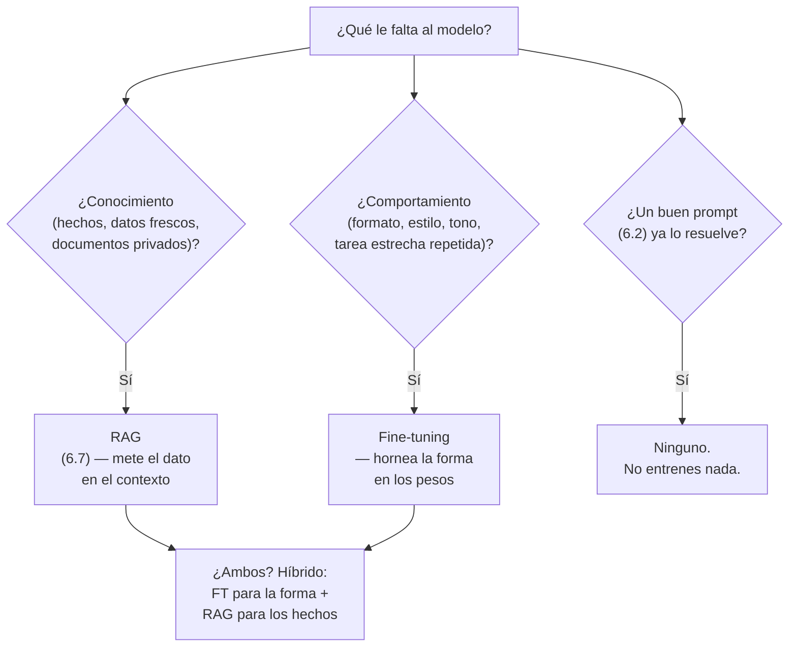
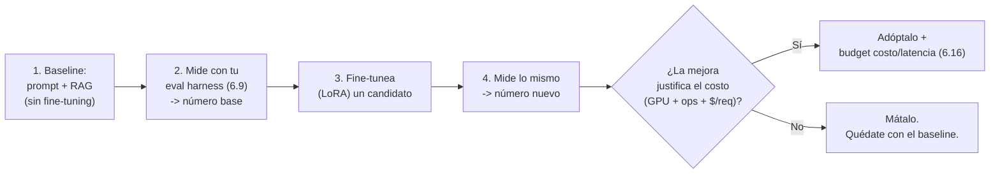

import Nivel from "@components/Nivel.astro";
import Reto from "@components/Reto.astro";
import Solucion from "@components/Solucion.astro";
import Quiz from "@components/Quiz.astro";
import CheckDominio from "@components/CheckDominio.astro";

<Nivel nivel="avanzado" />

:::note[Esta es una lección opcional / de profundización]
No está en la ruta crítica. Para construir el [capstone de la fase](/fase-6-ai-engineering/proyecto/)
**no necesitas fine-tuning** —de hecho casi nunca lo necesitas para empezar, y esa es media
lección. Esta unidad existe para que, el día que un cliente o un entrevistador te diga
"¿no deberíamos fine-tunear el modelo?", sepas **responder con criterio** en vez de con
moda: cuándo gana de verdad, cuándo es RAG disfrazado de fine-tuning, y cómo **medir** la
diferencia antes de gastar una GPU. Si vas con el tiempo justo, sáltala y vuelve cuando la
necesites.
:::

El fine-tuning tiene un problema de marketing: suena a "le enseño cosas nuevas a la IA", y
casi siempre que alguien lo propone por esa razón, está **equivocado**. Esta lección es
sobre lo que el fine-tuning **sí** hace bien (forma, estilo y comportamiento consistente, y
costo a escala), lo que **no** hace (meter hechos frescos en el modelo — eso es
[RAG](/fase-6-ai-engineering/6-7-rag-a-fondo/)), y la decisión real que un AI Engineer
toma en 2026: **no elegir entre RAG y fine-tuning, sino combinarlos y medir con evals cuál
ayuda**.

Vamos desde cero. No vas a entrenar nada en esta lección (no hace falta GPU); el núcleo es
**criterio de ingeniería** y una cuenta de costo que se calcula, no se opina. El código
de LoRA aparece para que sepas *cómo se ve*, no para que lo corras hoy.

## Objetivos de esta lección

Al terminar deberías ser capaz de:

- **O1 — Explicar el trade-off** entre RAG y fine-tuning y decidir, para un caso dado, si
  corresponde **RAG, fine-tuning, ambos (híbrido) o ninguno**, justificando con el eje
  correcto: **conocimiento/hechos → RAG**; **formato/estilo/comportamiento consistente o
  costo a escala → fine-tuning**.
- **O2 — Describir** qué son **LoRA y QLoRA** (fine-tuning eficiente en parámetros) y por
  qué hicieron el fine-tuning accesible, más **DPO** a nivel de awareness (qué problema
  resuelve frente a SFT), sin pretender ser un experto en entrenamiento.
- **O3 — Diseñar un experimento eval-driven** que **mida** si el fine-tuning mejora una
  tarea real frente a un baseline de prompt + RAG, definiendo la métrica, el dataset y un
  criterio de "vale la pena / mátalo".

## Por qué esto importa (y paga)

El "💰" de la Fase 6 es el premium por **diseñar, construir, evaluar y sostener** sistemas
de IA. El fine-tuning es uno de los lugares donde más plata se quema **por la razón
equivocada**, y donde el criterio se cobra caro:

- **"Fine-tuneemos el modelo con nuestros documentos."** Es la frase más común y casi
  siempre el plan incorrecto. Un AI Engineer que sabe responder "eso que quieres es RAG,
  el fine-tuning no es para hechos, y te ahorro semanas de GPU y un modelo que igual
  alucina" vale el doble del que dice "dale" y entrena un desastre.
- **El costo a escala.** A volumen muy alto y sostenido, un modelo pequeño fine-tuneado
  puede salir **mucho** más barato que mandar un prompt gigante de few-shot a un modelo
  frontera en cada request. Saber **dónde está ese punto de equilibrio** —y no fine-tunear
  "porque suena pro" cuando todavía no conviene— es criterio de ingeniero.
- **Es examinable.** "¿Cuándo fine-tuning y cuándo RAG?" es una pregunta de entrevista casi
  garantizada en roles de IA. La respuesta floja ("fine-tuning para datos privados") te
  delata; la respuesta con ejes y un experimento de evals te posiciona.

> [!tip] GLaDOS dice
> Fine-tunear para "enseñarle hechos" a un modelo es como reescribir una enciclopedia
> entera cada vez que cambia un dato. RAG es buscar el dato en la página correcta cuando lo
> necesitas. Uno cuesta una GPU y semanas; el otro, una query. Adivina cuál proponen los
> que leyeron el titular y no el paper.

## Lo que ya traes (activación)

Antes de seguir, recupera **de memoria** —sin abrir las notas— tres ideas previas:

1. De [6.0b · Puente ML/DL](/fase-6-ai-engineering/6-0b-puente-ml-dl/): **entrenar** ajusta
   los **pesos** del modelo con datos; **inferir** es usar esos pesos ya fijos para generar.
   El fine-tuning es **seguir entrenando** un modelo ya entrenado, con un dataset chico y
   específico. Eso significa que toca los pesos: lo que aprenda queda **horneado** ahí.
2. De [6.7 · RAG a fondo](/fase-6-ai-engineering/6-7-rag-a-fondo/): RAG **no** toca los
   pesos; mete el conocimiento en el **contexto** en tiempo de inferencia (recuperas
   documentos y se los das al modelo). Actualizar un hecho = re-indexar un documento, no
   re-entrenar.
3. De [6.9 · Eval-driven development](/fase-6-ai-engineering/6-9-eval-driven-development/):
   antes de optimizar cualquier cosa en IA, necesitas un **eval harness** que te dé un
   **número**. Hoy ese número es el árbitro que decide si el fine-tuning sirvió o fue plata
   tirada.

Si esas tres no te salieron fluidas, vuelve a esas lecciones: esta se apoya entera en ellas.

## Worked example: "¿RAG, fine-tuning, ambos, o ninguno?"

Te modelo el razonamiento completo en voz alta, como lo haría un AI Engineer frente a
peticiones reales. **No memorices una tabla**: sigue el razonamiento, porque el eje es
siempre el mismo.

### El mapa mental: una pregunta antes que todas

La pregunta que separa los dos mundos es: **¿el problema es de CONOCIMIENTO o de
COMPORTAMIENTO?**



La trampa clásica es saltar a "fine-tuneo" sin separar conocimiento de comportamiento.
Vamos petición por petición.

### Petición 1 — "Que el bot responda con los precios actuales de nuestro catálogo"

**Pienso en voz alta:** "Precios actuales" es **conocimiento**, y encima **cambiante**.
Si lo fine-tuneo, el día que sube un precio el modelo sigue diciendo el viejo —y para
corregirlo tendría que re-entrenar. Peor: el modelo no "memoriza" hechos de forma confiable
con un dataset chico; los aproxima y **alucina** los que no fijó. → Esto es **RAG**: indexo
el catálogo, recupero el precio real en cada query, se lo doy en el contexto. Actualizar un
precio = actualizar una fila, no una GPU.

**Decisión:** RAG. Fine-tuning aquí sería el error de manual.

### Petición 2 — "Que SIEMPRE responda en este JSON exacto, con este tono, sin preámbulos"

**Pienso en voz alta:** Esto no es conocimiento: es **comportamiento/forma**. Y es repetido
y estrecho. Primero intento la opción barata: un buen prompt + few-shot
([6.2](/fase-6-ai-engineering/6-2-prompt-context-engineering/)) y structured outputs
([6.4](/fase-6-ai-engineering/6-4-structured-tools-mcp/)). Si con eso basta —y muchas veces
basta— **listo, no entreno nada**. Pero si necesito esa forma con consistencia altísima a
gran volumen, y el few-shot que la consigue es un prompt enorme que pago en cada request,
ahí el **fine-tuning** empieza a tener sentido: horneo el formato/tono en los pesos y mando
un prompt corto. La forma es exactamente lo que el fine-tuning hace bien.

**Decisión:** primero prompt; fine-tuning **solo si** el volumen y la exigencia de
consistencia lo justifican (y lo confirmo midiendo, no adivinando).

### Petición 3 — "Asistente legal sobre NUESTROS contratos, con la voz formal de la firma"

**Pienso en voz alta:** Aquí hay **las dos cosas**. El **conocimiento** (qué dicen *estos*
contratos) es RAG, sin discusión: son documentos privados, específicos y que cambian. El
**comportamiento** (la voz formal, la estructura de respuesta, el registro legal de la
firma) es candidato a fine-tuning, *si* el prompt no lo logra con consistencia. → Esto es
el caso **híbrido**: RAG trae los hechos correctos, el fine-tuning (o, primero, un buen
prompt) da la forma. No compiten: cada uno cubre un eje distinto.

**Decisión:** híbrido. RAG para los hechos (siempre), y *evalúo* si el fine-tuning de la
forma mejora lo suficiente sobre "RAG + prompt" como para pagar el costo.

### Petición 4 — "Resume este correo en una línea"

**Pienso en voz alta:** Tarea genérica que cualquier modelo decente ya hace bien con una
instrucción de una línea. No hay conocimiento privado ni forma exótica. → **Ninguno**. Un
prompt y a otra cosa. Entrenar aquí es quemar plata por deporte.

## Non-examples y misconceptions

:::caution[Podrías pensar X… y está mal]

- **"Fine-tuneo el modelo con mis documentos para que se los sepa."** El error #1. El
  fine-tuning con un dataset chico **no memoriza hechos de forma confiable**: los aproxima
  y alucina los que no fijó, y no hay forma barata de actualizar uno. Meter conocimiento es
  trabajo de **RAG**, que recupera el hecho exacto en tiempo de inferencia.
- **"RAG y fine-tuning son alternativas; elijo una."** Falsa dicotomía. Cubren ejes
  distintos —RAG = conocimiento, FT = comportamiento— y los sistemas serios **usan ambos**.
  La pregunta no es "¿cuál?", es "¿qué parte resuelve cada uno y vale la pena el FT?".
- **"Fine-tuning siempre mejora la calidad."** No. Mal hecho **empeora**: puede causar
  *catastrophic forgetting* (el modelo olvida capacidades generales), sobreajustar a tu
  dataset chico, o simplemente no mover la métrica lo suficiente para pagar el costo. Sin un
  eval que lo mida, no sabes si ayudó o si arruinaste el modelo.
- **"Fine-tuning siempre sale más barato que pagar la API."** Solo a **volumen alto y
  sostenido**, y solo si el modelo fine-tuneado es más barato por request que tu baseline.
  Ojo: los modelos fine-tuneados a veces cuestan **más** por token que el base. Si el ahorro
  de prompt no cubre ese sobreprecio, el fine-tuning **nunca** se paga por costo. Es una
  cuenta —la haces en el segundo ejercicio—.
- **"Necesito miles de GPUs para fine-tunear."** Ya no. **LoRA/QLoRA** (abajo) afinan un
  modelo de 7B en **una sola GPU de consumo**. La barrera técnica bajó muchísimo; la
  barrera de *criterio* (¿debería?) sigue igual de alta.

:::

> [!warning] Fine-tuning hornea los datos en los pesos (riesgo de gobernanza)
> Lo que metes en el dataset de entrenamiento queda **dentro del modelo**, no en una base de
> datos que puedes auditar o borrar. Si entrenas con datos que tienen PII o secretos, esa
> información puede **filtrarse** en generaciones futuras y no la "des-aprendes" fácil. Con
> RAG, en cambio, borras un documento del índice y listo. Esto es materia de
> [6.14 · Seguridad LLM](/fase-6-ai-engineering/6-14-seguridad-llm/) y
> [6.15 · Governance](/fase-6-ai-engineering/6-15-ai-governance/): el "derecho al olvido" es
> trivial en RAG y un dolor de cabeza en un modelo fine-tuneado.

## LoRA / QLoRA: el fine-tuning que sí puedes pagar

El fine-tuning "clásico" (full fine-tuning) actualiza **todos** los pesos del modelo:
carísimo en memoria y cómputo. **LoRA** (Low-Rank Adaptation) hace una jugada elegante:
**congela** el modelo original y entrena unas matrices chicas extra ("adapters") que se le
suman. Entrenas una fracción ínfima de los parámetros, el resultado es un archivo de
adapter de pocos MB, y puedes tener varios adapters para distintas tareas sobre el mismo
modelo base.

**QLoRA** va un paso más: **cuantiza** el modelo base a 4 bits (recuerda la cuantización de
[6.10](/fase-6-ai-engineering/6-10-opensource-local-serving/)) y entrena LoRA encima. Eso
baja tanto la memoria que afinas un modelo de 7B en **una sola GPU de consumo**. Es lo que
democratizó el fine-tuning.

Así se ve un SFT (supervised fine-tuning) con LoRA usando la librería **TRL** de Hugging
Face. **No lo corras hoy** —es para que reconozcas las piezas—:

```python
# pip install trl peft transformers datasets
from datasets import load_dataset
from peft import LoraConfig
from trl import SFTConfig, SFTTrainer

dataset = load_dataset("trl-lib/Capybara", split="train")  # tu dataset de ejemplos

# LoRA: solo entrenamos adapters chicos, el modelo base queda congelado
peft_config = LoraConfig(
    r=16,                  # rango de las matrices LoRA (cuántos parámetros extra)
    lora_alpha=32,
    lora_dropout=0.05,
    task_type="CAUSAL_LM",
)

trainer = SFTTrainer(
    model="Qwen/Qwen2.5-0.5B",          # modelo base pequeño
    args=SFTConfig(learning_rate=2e-4), # LR alto típico de LoRA
    train_dataset=dataset,
    peft_config=peft_config,            # <-- esto convierte el entrenamiento en LoRA
)
trainer.train()
```

Para **QLoRA**, lo único que cambia es que cargas el modelo base cuantizado a 4 bits antes
de pasárselo al trainer:

```python
import torch
from transformers import AutoModelForCausalLM, BitsAndBytesConfig

bnb = BitsAndBytesConfig(
    load_in_4bit=True,
    bnb_4bit_quant_type="nf4",
    bnb_4bit_compute_dtype=torch.bfloat16,
    bnb_4bit_use_double_quant=True,
)
model = AutoModelForCausalLM.from_pretrained(
    "Qwen/Qwen2.5-0.5B", quantization_config=bnb, device_map="auto"
)
# luego: SFTTrainer(model=model, ..., peft_config=peft_config) igual que arriba
```

Si no tienes GPU, la otra vía es la **API**: proveedores como OpenAI ofrecen fine-tuning
gestionado (subes un JSONL de ejemplos y ellos entrenan). El criterio de *cuándo* es el
mismo; cambia solo quién corre la GPU:

```python
from openai import OpenAI
client = OpenAI()

archivo = client.files.create(file=open("ejemplos.jsonl", "rb"), purpose="fine-tune")
job = client.fine_tuning.jobs.create(
    training_file=archivo.id,
    model="gpt-4.1-mini-2025-04-14",
    method={"type": "supervised"},   # SFT; también existe {"type": "dpo"}
)
```

> [!info] Honestidad 2026
> El panorama del fine-tuning gestionado por API se mueve rápido y algunos proveedores
> están **restringiendo o cerrando** sus plataformas de fine-tuning a usuarios nuevos.
> Verifica siempre la doc oficial vigente antes de apostar a una API concreta. El criterio
> de esta lección (cuándo y por qué) no caduca; la API específica sí puede.

### DPO en una frase (awareness, no profundidad)

**SFT** (supervised fine-tuning) le enseña al modelo a imitar respuestas que tú
**escribiste** como correctas. Pero a veces no sabes escribir "la respuesta perfecta" —solo
sabes decir, entre dos respuestas, **cuál prefieres**. **DPO** (Direct Preference
Optimization) entrena justo con eso: pares `(elegida, rechazada)`. Es la forma accesible de
alinear *preferencias* (tono, seguridad, qué evitar) cuando demostrar es difícil pero
**rankear es fácil**. En TRL es el mismo patrón (`DPOTrainer` + `DPOConfig` + `peft_config`)
y por API es `method={"type": "dpo"}`. Para esta lección basta que sepas **qué problema
resuelve**: preferencias, no hechos.

## El híbrido por defecto + medir con evals (lo que de verdad importa)

Aquí está el reframe que separa al senior del que repite titulares. **RAG vs fine-tuning no
es una elección excluyente.** En un sistema real:

- **RAG** aporta el **conocimiento** correcto y actualizable (los hechos).
- **Fine-tuning** (si se justifica) aporta el **comportamiento** consistente (la forma).
- El **prompt** es siempre el primer intento, y muchas veces el único que necesitas.

Y la decisión de si el fine-tuning **vale la pena** no se toma por intuición: se **mide**.
Este es el bucle eval-driven, que es literalmente el de [6.9](/fase-6-ai-engineering/6-9-eval-driven-development/)
aplicado a esta decisión:



El orden es sagrado: **primero el baseline medido, después el experimento**. Sin baseline no
sabes si mejoraste; sin número no sabes si la mejora paga el costo. "Se siente mejor" no es
un criterio de ingeniería —es exactamente lo que un entrevistador quiere oírte rechazar.

## Práctica con andamiaje

Antes de los retos sin IA, calienta el razonamiento. **Predice antes de leer la respuesta**
(es retrieval, no trivia).

<Quiz
  question="Un cliente quiere que el chatbot conozca los precios de su catálogo, que cambian cada semana. ¿RAG, fine-tuning, ambos o ninguno?"
  options={[
    "Fine-tuning: así el modelo se aprende los precios",
    "RAG: los precios son conocimiento cambiante; se recuperan en cada query y se actualizan re-indexando",
    "Ninguno: el modelo ya sabe los precios de internet",
    "Fine-tuning semanal: re-entrenar cada vez que cambia un precio",
  ]}
  answer={1}
  explanation="Precios = conocimiento, y encima cambiante. Eso es RAG: recuperas el dato real en cada query y actualizas re-indexando un documento, no re-entrenando. Fine-tunear hechos cambiantes es el error de manual: el modelo los aproxima, alucina y no se actualizan sin otra GPU."
/>

<Quiz
  question="¿Qué es lo que hace LoRA para abaratar el fine-tuning?"
  options={[
    "Comprime el dataset de entrenamiento para que ocupe menos",
    "Congela el modelo base y entrena solo unas matrices extra pequeñas (adapters), en vez de todos los pesos",
    "Usa RAG en lugar de tocar los pesos",
    "Entrena el modelo entero pero más rápido",
  ]}
  answer={1}
  explanation="LoRA congela el modelo original y entrena adapters chicos que se le suman. Entrenas una fracción ínfima de los parámetros y el resultado son pocos MB. QLoRA además cuantiza el base a 4 bits para que quepa en una GPU de consumo."
/>

Ahora un razonamiento con andamiaje: completa lo que falta.

> Escenario: una firma de seguros quiere un asistente que (a) responda **según sus pólizas
> internas** (documentos privados que cambian con cada producto nuevo) y (b) lo haga
> **siempre con el mismo formato de respuesta y registro formal** de la marca. Tienen
> volumen alto y constante.
>
> - El eje **conocimiento** (qué dicen las pólizas) se resuelve con: __________
> - El eje **comportamiento** (formato + registro) se intenta primero con: __________ y,
>   si no basta a ese volumen, con: __________
> - ¿RAG y fine-tuning compiten aquí? __________
> - ¿Qué decide si el fine-tuning del formato vale la pena? __________

<Solucion title="Ver cómo se completa el andamiaje">

- Conocimiento (pólizas privadas y cambiantes) → **RAG**, sin discusión: re-indexas cuando
  cambia un producto.
- Comportamiento (formato + registro) → primero un **buen prompt + few-shot + structured
  outputs**; si la consistencia a alto volumen no alcanza, **fine-tuning (LoRA) de la
  forma**.
- **No compiten:** es un caso **híbrido**. RAG cubre los hechos, el fine-tuning (o el
  prompt) cubre la forma. Cada uno en su eje.
- Lo decide un **experimento eval-driven**: mides el baseline (RAG + prompt) con tu harness,
  fine-tuneas un candidato, mides lo mismo, y adoptas el FT **solo si** la mejora justifica
  el costo de GPU/ops y el $/request. Si no, lo matas.

Fíjate en el orden: el conocimiento siempre es RAG; el comportamiento empieza barato
(prompt) y solo sube a fine-tuning si el volumen lo paga y los evals lo confirman.

</Solucion>

## Ejercicios Primero-Sin-IA

Resuélvelos **a mano primero**. El objetivo no es que algo compile: es que el **criterio**
quede en tu cabeza, defendible sin notas y en una entrevista.

<Reto title="Decisión: RAG, fine-tuning, ambos o ninguno (5 casos)" timebox="40 min">

Para cinco peticiones reales decides y **justificas**: RAG / fine-tuning / híbrido /
ninguno; cuál es el **eje dominante** (conocimiento vs comportamiento vs "un prompt basta");
y —clave— **qué eval de una línea** zanjaría la duda. No hay una sola respuesta correcta: se
evalúa la **calidad del trade-off**, como en un ADR o una entrevista.

- Carpeta: `ejercicios/fase-6/decision-rag-vs-finetuning/`
- Entregas un `decisiones.md` con los cinco casos resueltos según la plantilla.
- **Primero-Sin-IA:** para cada caso pregúntate **primero** "¿esto es conocimiento o
  comportamiento?"; deja que esa pregunta guíe el resto. Solo al final usa IA para *atacar*
  tus decisiones, no para escribirlas.
- "Hecho" cuando: cada decisión nombra el eje dominante (no "el mejor"), al menos un caso es
  híbrido y explica qué cubre cada parte, y cada caso propone un eval que lo zanjaría.

El enunciado completo con los cinco casos está en el `README.md` de la carpeta.

</Reto>

<Reto title="¿A qué volumen se paga el fine-tuning? (break-even por costo)" timebox="40 min">

Implementa, en Python puro y sin red, la cuenta que decide **cuándo el fine-tuning gana por
costo**: cambias un prompt largo de few-shot (caro en cada request) por un modelo
fine-tuneado con prompt corto (pero con un costo fijo de entrenamiento y, a veces, mayor
precio por token). Primero **predices a mano** un caso, luego implementas y verificas con
tests.

- Carpeta: `ejercicios/fase-6/break-even-finetuning-vs-prompt/`
- Implementa tres funciones puras: costo por request, costo total (con un costo fijo), y el
  **punto de equilibrio** en requests donde el fine-tuning iguala al baseline de prompt.
- **Primero-Sin-IA:** en `prediccion.md`, calcula a mano el equilibrio **antes** de
  ejecutar. Luego corre `pytest` hasta verde.
- "Hecho" cuando: existe tu predicción a mano, todos los tests pasan, y tu reflexión explica
  por qué si el modelo fine-tuneado cuesta **más** por request que el baseline, el
  fine-tuning **nunca** se paga por costo (sin importar el volumen).

El detalle completo (contrato de funciones y números) está en el `README.md` de la carpeta.

</Reto>

## Check de dominio (active recall)

<CheckDominio
  items={[
    "Explicar, sin notas, por qué meter hechos cambiantes en un modelo via fine-tuning es un error, y qué hace RAG en su lugar.",
    "Decir en qué eje gana el fine-tuning (formato/estilo/comportamiento consistente, costo a escala) y dar un ejemplo de cada uno.",
    "Describir qué hace LoRA (congela el base, entrena adapters chicos) y qué agrega QLoRA (cuantiza a 4 bits), y por qué eso abarató el fine-tuning.",
    "Explicar en una frase qué problema resuelve DPO que SFT no resuelve bien (preferencias rankeables vs respuestas demostrables).",
    "Diseñar el bucle eval-driven que decide si un fine-tuning vale la pena: baseline medido, experimento, número nuevo, criterio de costo, y cuándo se mata.",
  ]}
/>

Si alguno te cuesta, vuelve a la sección correspondiente **antes** de pedir corrección. La
ilusión de "lo entiendo" se rompe justo cuando intentas explicarlo en voz alta.

## Recursos (documentación oficial primero)

- [TRL — PEFT integration (LoRA/QLoRA)](https://huggingface.co/docs/trl/en/peft_integration) ·
  [SFTTrainer](https://huggingface.co/docs/trl/en/sft_trainer) ·
  [DPOTrainer](https://huggingface.co/docs/trl/en/dpo_trainer)
- [PEFT — LoRA conceptual](https://huggingface.co/docs/peft/en/conceptual_guides/lora) ·
  [QLoRA / quantization](https://huggingface.co/docs/peft/en/developer_guides/quantization)
- [OpenAI — Supervised fine-tuning](https://platform.openai.com/docs/guides/supervised-fine-tuning) ·
  [Direct Preference Optimization](https://platform.openai.com/docs/guides/direct-preference-optimization)
- [Paper LoRA (Hu et al., 2021)](https://arxiv.org/abs/2106.09685) ·
  [Paper QLoRA (Dettmers et al., 2023)](https://arxiv.org/abs/2305.14314) ·
  [Paper DPO (Rafailov et al., 2023)](https://arxiv.org/abs/2305.18290)

## Conexión con el capstone

El [Capstone F6 — Plataforma RAG de producción](/fase-6-ai-engineering/proyecto/) **no exige
fine-tuning**, y eso es deliberado: el camino correcto para casi todo RAG es prompt + RAG +
evals. Esta lección te da el **ADR de "por qué NO fine-tuneamos (todavía)"** —una sección
donde dejas por escrito que el conocimiento lo cubre RAG, que el comportamiento lo cubre el
prompt, y bajo **qué condiciones medibles** (volumen X, consistencia insuficiente
confirmada por el eval harness) reconsiderarías un LoRA de la forma, con su budget de costo
([6.16](/fase-6-ai-engineering/6-16-costo-latencia-llmops/)). Saber justificar el "no" con
datos es tan senior como saber hacerlo.

## Reflexión y repaso espaciado

Cierra con esta pregunta, escrita en una línea (es tu gancho metacognitivo):

> *"Si un cliente me dice 'fine-tuneemos el modelo con nuestros documentos', ¿cómo le
> explico en 30 segundos que eso probablemente es RAG, y qué experimento le propongo para
> decidirlo con un número en vez de una corazonada?"*

**Repaso espaciado:**

- **Mañana:** reescribe de memoria, sin notas, el eje que decide RAG vs fine-tuning
  (conocimiento vs comportamiento) y los cuatro casos del worked example. Si no puedes, no
  lo aprendiste aún.
- **En una semana:** vuelve al ejercicio del break-even y resuélvelo con números distintos
  —en especial un caso donde el modelo fine-tuneado cueste más por token— sin mirar tu
  código previo.
- **Antes del capstone:** redacta el "ADR de por qué no fine-tuneamos" de tu RAG en tres
  frases defendibles, con la condición medible que te haría cambiar de opinión.
