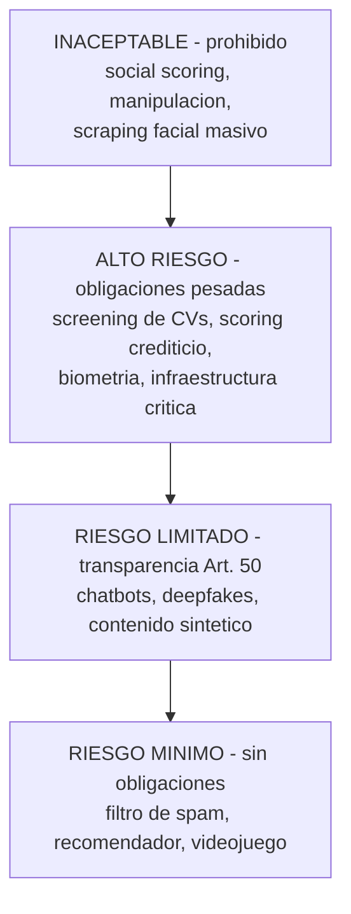

import Nivel from "@components/Nivel.astro";
import Reto from "@components/Reto.astro";
import Solucion from "@components/Solucion.astro";
import Quiz from "@components/Quiz.astro";
import CheckDominio from "@components/CheckDominio.astro";

<Nivel nivel="intermedio" />

:::tip[Si ya lo tocaste]
Si vienes del mundo legal o de compliance y ya conoces el EU AI Act, usa esta lección
para **traducirlo a decisiones de ingeniería**: qué tier le toca a tu feature, qué metes
en el audit log, qué dice la model card. Si nunca oíste hablar de esto, perfecto: lo
construimos desde cero. No necesitas saber derecho — necesitas saber **clasificar tu
sistema y derivar qué le aplica**.
:::

"Gobernanza de IA" suena a reunión aburrida con abogados. Para un AI Engineer es otra
cosa: es **saber, antes de desplegar, en qué se mete tu sistema** —qué riesgo introduce,
qué tienes que declarar, qué tienes que registrar— y dejarlo por escrito de forma que
otro lo pueda auditar. Es de los conocimientos con **mejor relación esfuerzo/credibilidad**
de toda la fase: cuesta poco aprenderlo y te separa de inmediato del que "solo conecta una
API y reza". Esta lección es a **nivel de criterio práctico, no de abogacía**: no vas a
litigar, vas a **clasificar, decidir y documentar**.

Vamos desde cero. No asumo que sepas qué es una "regulación", un "tier de riesgo" ni una
"model card". Lo único que traes es haber construido cosas con LLMs en las lecciones
anteriores; sobre eso montamos el resto.

## Objetivos de esta lección

Al terminar deberías ser capaz de:

- **O1 — Clasificar** un sistema de IA en el tier de riesgo correcto del EU AI Act
  (inaceptable / alto / limitado / mínimo) y **derivar qué obligaciones le aplican**,
  incluyendo si el **alcance extraterritorial** te alcanza aunque operes desde fuera de la UE.
- **O2 — Explicar y aplicar** las obligaciones de **transparencia del Art. 50** (avisar que
  es IA, marcar contenido sintético, etiquetar deepfakes) a una feature concreta.
- **O3 — Diseñar los artefactos baratos de gobernanza** —**model card / data card** y
  **audit logging**— que dan trazabilidad y accountability a un sistema de IA, conectándolos
  con observabilidad y evals.

## Por qué esto importa (y paga)

El "💰" de la Fase 6 es el premium por **diseñar, construir, evaluar y sostener** sistemas
de IA en producción. La gobernanza es la parte que casi nadie estudia y que, justo por eso,
**te diferencia barato**:

- **Es un gate de venta corporativa.** Cualquier empresa mediana o grande que compre o use
  IA hoy pregunta "¿esto cumple el AI Act?", "¿tienes model card?", "¿registras las
  decisiones?". El ingeniero que responde con criterio cierra el trato; el que pone cara de
  susto, no. En un portafolio, una model card y un audit log **gritan "produccion real"**.
- **Las multas son reales y enormes.** El EU AI Act llega hasta **35 millones de EUR o el
  7% de la facturación mundial anual** (lo que sea mayor) para las prácticas prohibidas —más
  alto que el techo del GDPR—. No es teórico: las autoridades de mercado ya pueden sancionar.
- **Te alcanza aunque estés en Chile.** Como el GDPR, el AI Act tiene **alcance
  extraterritorial**: si la **salida** de tu sistema se usa en la UE, te aplica, vivas donde
  vivas. Esto NO es "problema de los europeos": es problema tuyo en cuanto un cliente o
  usuario europeo toca tu producto.
- **Es examinable y de moda.** "¿Conoces el EU AI Act? ¿Qué es una model card? ¿Cómo darías
  trazabilidad a un sistema de IA?" son preguntas de entrevista 2026 cada vez más frecuentes
  en roles de IA. Responderlas con un ejemplo concreto te posiciona como alguien que pensó
  en producción, no solo en el demo.

> [!tip] En la práctica
> La gobernanza es como los tests: el que la salta se siente más rápido… hasta que algo
> explota y nadie puede explicar **por qué** el modelo rechazó ese crédito o aprobó ese
> contrato. Un audit log no es burocracia: es la caja negra del avión. La diferencia entre
> "el sistema falló" y "el sistema falló y aquí está exactamente qué pasó, cuándo y con qué
> versión" es la diferencia entre un susto y una demanda.

## Lo que ya traes (activación)

Antes de seguir, recupera **de memoria** —sin abrir notas— tres ideas previas:

1. De [6.9 · Eval-driven development](/fase-6-ai-engineering/6-9-eval-driven-development/) y
   de la observabilidad de [5.10](/fase-5-devops/5-10-observabilidad/): un sistema de
   IA serio **deja traza** de cada llamada (entrada, salida, modelo, costo, latencia). La
   gobernanza reusa exactamente esa traza: el **audit log** es una traza con campos de
   accountability (quién, qué versión, hubo humano en el loop).
2. De [6.14 · Seguridad LLM](/fase-6-ai-engineering/6-14-seguridad-llm/): defense in depth,
   validar la salida antes de ejecutar, least-privilege de tools. La seguridad evita el
   abuso; la gobernanza **lo documenta y rinde cuentas** de cómo decides. Son hilos
   distintos del mismo tejido.
3. De [6.13 · Fine-tuning](/fase-6-ai-engineering/6-13-fine-tuning/): lo que metes en el
   dataset de entrenamiento queda **horneado en los pesos** y es difícil de borrar. Eso es,
   literalmente, un problema de gobernanza (el "derecho al olvido"): RAG borra un documento;
   un modelo fine-tuneado, no tanto.

Si esas tres no te salieron, no pasa nada para esta lección —pero vuelve a ellas después,
porque la gobernanza no es un tema aparte: es el mismo sistema, visto desde "¿quién responde
si esto sale mal?".

## El mapa: ¿qué es esto y por qué existe?

Tres palabras que se confunden:

- **Responsible AI (IA responsable):** los **principios** —fairness, accountability,
  transparencia, privacidad, seguridad, supervisión humana—. Son valores, no leyes. Existen
  aunque ningún país regule.
- **AI Governance (gobernanza de IA):** las **prácticas y artefactos** con que una
  organización aplica esos principios —model cards, audit logs, revisiones de riesgo,
  políticas de uso—. Es el "cómo lo hacemos cumplir, en concreto".
- **Regulación (p. ej. EU AI Act):** la **ley** que vuelve obligatorias algunas de esas
  prácticas, con multas si no las cumples. Es el piso legal, no el techo ético.

El **EU AI Act** (Reglamento UE 2024/1689) es la primera ley integral de IA del mundo. Su
idea central es elegante: **no regula la tecnología, regula el riesgo del uso**. El mismo
modelo puede ser "riesgo mínimo" filtrando spam y "alto riesgo" filtrando candidatos a un
empleo. Lo que manda es **para qué se usa**.

## Los cuatro tiers de riesgo (el corazón del Act)



| Tier | Qué es | Qué te exige | Ejemplos |
|---|---|---|---|
| **Inaceptable** | Usos prohibidos: amenazan derechos fundamentales | **No se puede. Punto.** | Social scoring por el Estado, manipulación subliminal, scraping masivo de caras para bases de reconocimiento, emotion recognition en trabajo/educación |
| **Alto riesgo** | Decisiones que afectan seriamente la vida de personas | Gestión de riesgo, **data governance**, documentación técnica, **logging automático**, supervisión humana, robustez, evaluación de conformidad | Screening de CVs, scoring crediticio, admisión educativa, dispositivos médicos, infraestructura crítica |
| **Riesgo limitado** | Interactúa con personas o genera contenido | **Solo transparencia (Art. 50):** avisar que es IA, marcar/etiquetar lo sintético | Chatbots de atención, generadores de imágenes/voz, deepfakes |
| **Riesgo mínimo** | Todo lo demás | **Nada obligatorio** (buenas prácticas voluntarias) | Filtros de spam, recomendadores, IA en videojuegos |

Y, atravesando todo, una capa aparte: los **GPAI (modelos de propósito general** — los LLMs
como GPT, Claude, Gemini, Llama). Sus **proveedores** (no tú, normalmente, sino quien
entrena el modelo) tienen obligaciones propias: documentación técnica, resumen de datos de
entrenamiento, política de copyright; y si el modelo es de "riesgo sistémico", evaluaciones
extra. A ti, que **construyes sobre** esos modelos, esta capa te toca sobre todo al **elegir
proveedor**: usar un GPAI que cumple te ahorra trabajo aguas abajo.

> [!info] La pregunta que decide casi todo
> Para clasificar tu sistema, pregúntate en orden: **(1) ¿Es un uso prohibido?** Si sí,
> párate. **(2) ¿Decide algo serio sobre personas** (empleo, crédito, salud, justicia,
> educación, biometría)? Si sí, es **alto riesgo**. **(3) ¿Interactúa con personas o genera
> contenido?** Si sí, **transparencia (Art. 50)**. **(4) Si nada de lo anterior:** mínimo,
> sin obligaciones. La mayoría de las apps que construirás caen en (3) o (4) —y (3) es barato.

## La línea de tiempo 2026 (honesto, porque se está moviendo)

Aquí hay que ser honesto: **el calendario cambió en 2026**. El plan original ponía el 2 de
agosto de 2026 como el gran hito de "alto riesgo". Pero el llamado **Digital Omnibus** —un
acuerdo provisional alcanzado en mayo de 2026, pendiente de adopción formal— **aplazó** las
obligaciones de alto riesgo. Esto importa para tu credibilidad: el que cita la fecha vieja
sin saber del aplazamiento queda mal; el que conoce el matiz, no.

| Fecha | Qué aplica | Estado |
|---|---|---|
| 1 ago 2024 | El Act entra en vigor (sin obligaciones todavía) | Hecho |
| **2 feb 2025** | **Prácticas prohibidas** (inaceptable) + alfabetización en IA | En vigor |
| **2 ago 2025** | Obligaciones de **GPAI**, gobernanza/AI Office, y las **multas (Art. 99) ya son aplicables** | En vigor |
| **2 ago 2026** | **Transparencia (Art. 50)** aplica; vigilancia de mercado activa | Sigue en pie |
| 2 dic 2026 | Marcado de contenido sintético (Art. 50.2) tras periodo de gracia; nueva prohibición (imágenes íntimas no consentidas / CSAM) | Provisional |
| **2 dic 2027** | **Alto riesgo (Annex III, sistemas autónomos)** — aplazado desde ago-2026 por el Omnibus | Provisional |
| 2 ago 2028 | Alto riesgo embebido en productos regulados (Annex I) — aplazado | Provisional |

Lo que **no** se aplazó y por eso te toca primero: **transparencia del Art. 50** y las
**multas**. Si tu app es un chatbot o genera contenido, el Art. 50 es tu obligación más
inmediata y concreta. Lo de "alto riesgo" tiene más aire (fin de 2027), pero si construyes
algo de alto riesgo, **se diseña con las obligaciones puestas desde el día 1**, no se parchea
en 2027.

:::caution[El calendario es un blanco móvil]
El Digital Omnibus era **provisional** a mediados de 2026 (adopción formal esperada poco
después). **Verifica siempre la fecha vigente en fuente oficial** antes de comprometer un
plan de compliance a una fecha. Lo que **no** caduca es el criterio: los cuatro tiers, el
Art. 50, model cards, audit logging y el alcance extraterritorial. Aprende el criterio; las
fechas se consultan.
:::

## Transparencia (Art. 50): la obligación que casi todos tendrán

Es la más barata y la que más gente ignora. El Art. 50 exige, en esencia, **no engañar**:

1. **Chatbots / IA que interactúa con personas:** debes **informar que están hablando con
   una IA**, salvo que sea obvio. Una línea de UI ("Hablas con un asistente de IA") cumple.
2. **Contenido sintético (texto, imagen, audio, video) generado por IA:** el **proveedor**
   del generador debe marcar la salida en un formato **detectable por máquina** (marca de
   agua / metadatos).
3. **Deepfakes:** quien los despliega debe **etiquetar** que el contenido fue generado o
   manipulado artificialmente. Igual para texto publicado sobre asuntos de interés público.
4. **Reconocimiento de emociones / categorización biométrica:** avisar a las personas
   expuestas.

Para un AI Engineer esto se traduce en **decisiones de producto concretas**: un badge "IA"
en el chat, una marca de agua en las imágenes que genera tu feature, una etiqueta visible en
los videos sintéticos. No es derecho: es **diseño honesto de la interfaz**.

## Multas (Art. 99): por qué no es un "nice to have"

Tres tramos, "lo que sea mayor" para empresas grandes:

| Infracción | Multa máxima |
|---|---|
| **Prácticas prohibidas** (tier inaceptable) | **35 millones EUR o 7%** de facturación mundial anual |
| **Obligaciones de alto riesgo y transparencia (Art. 50)** | **15 millones EUR o 3%** |
| **Dar información falsa/engañosa** a las autoridades | **7,5 millones EUR o 1%** |

Matiz importante para tu caso real: para **PYMEs y startups**, se aplica el **menor** de los
dos (el monto fijo o el porcentaje), no el mayor —una válvula de proporcionalidad—. Aun así,
para una empresa chica, "el menor" sigue siendo capaz de matarla. La lección: la gobernanza
**barata de hoy** evita la multa **cara de mañana**.

## Alcance extraterritorial: por qué te toca desde Chile

El Art. 2 del Act es el que hace que esto no sea "cosa de europeos". Te aplica si:

- Pones un sistema de IA **en el mercado de la UE**, sin importar dónde estés establecido; o
- Eres proveedor o deployer en un tercer país (Chile, por ejemplo) **y la salida de tu
  sistema se usa en la UE**.

Es el mismo **"efecto Bruselas"** del GDPR: la UE regula a quien toca su mercado. Si tu
asistente de IA, hospedado en tu homelab en Santiago, responde a un usuario en Madrid, o tu
API la consume una empresa francesa, **estás dentro**. Donde **no** te toca: si la salida
jamás llega a la UE (usuarios y clientes 100% fuera). El criterio práctico: **no es dónde
corre el servidor, es a dónde llega la salida.**

## Responsible AI: los principios bajo la ley

La ley es el piso; los principios son por qué existe. Los que un ingeniero debe poder nombrar
y aplicar:

- **Fairness / sesgo:** un modelo entrenado con datos sesgados **reproduce y amplifica** el
  sesgo. El caso de manual: un screening de CVs que aprende de contrataciones históricas
  donde se contrataba más a hombres → penaliza CVs de mujeres. Aplicarlo = medir el
  desempeño **desagregado por grupo** (no solo el promedio), que es justo lo que conecta con
  las métricas de [6.0 (precision/recall/F1)](/fase-6-ai-engineering/6-0-matematica-minima/)
  y los evals de [6.9](/fase-6-ai-engineering/6-9-eval-driven-development/).
- **Accountability:** alguien responde por lo que el sistema decide. En la práctica = audit
  logging + un humano responsable definido + supervisión humana en decisiones serias (HITL).
- **Transparencia / explicabilidad:** poder decir **por qué** el sistema produjo esa salida
  (qué documentos recuperó el RAG, qué prompt, qué versión de modelo).
- **Privacidad:** no filtrar PII; minimizar lo que guardas (conecta con redactar datos antes
  de loguear, que harás en el ejercicio).
- **Seguridad y robustez:** lo de [6.14](/fase-6-ai-engineering/6-14-seguridad-llm/).
- **Supervisión humana:** un humano puede entender, anular y detener el sistema.

Como marco voluntario y **no regulatorio** para organizar todo esto, el más citado es el
**NIST AI Risk Management Framework** (funciones: Govern, Map, Measure, Manage). No es ley
ni obligación; es un andamio útil para estructurar la gobernanza, complementario al AI Act.
Los **OECD AI Principles** son el otro referente internacional. A nivel de criterio basta
con saber que existen y para qué sirven.

## Los artefactos baratos: model cards, data cards y audit logs

Aquí está el "alto retorno": tres artefactos que cuestan poco y dan mucha credibilidad.

### Model card

Una **model card** es una ficha que documenta un modelo o sistema de IA: para qué sirve,
para qué **no**, con qué datos, qué tan bien funciona y qué limitaciones tiene. Nació en un
paper de Google (Mitchell et al., 2019) y hoy es estándar de facto (toda repo en Hugging
Face tiene una). Secciones típicas:

```markdown
# Model Card — Asistente RAG de soporte

## Uso previsto (intended use)
Responder preguntas sobre la documentación interna de producto, citando la fuente.

## Usos fuera de alcance (out-of-scope)
NO da consejo legal, médico ni financiero. NO decide sobre personas (empleo/crédito).
NO es fuente de verdad sin la cita: si no encuentra la fuente, debe decir "no lo sé".

## Datos
Corpus: 1.200 documentos de la KB interna, versión 2026-06. Idioma: ES/EN.
Embeddings: <modelo>. No contiene PII de clientes (verificado en el ingest).

## Evaluación
Recall@5 = 0.86 sobre 120 preguntas golden (ver eval harness, 6.9).
Faithfulness (LLM-as-judge) = 0.91. Desempeño por idioma reportado por separado.

## Limitaciones y riesgos
Puede alucinar si el retrieval falla. Cutoff de conocimiento = fecha del corpus.
No probado en dominios fuera de la KB. Sesgo posible si la KB lo tiene.

## Gobernanza
Tier EU AI Act: riesgo limitado (chatbot) -> transparencia Art. 50 aplica.
Humano responsable: <equipo>. Audit log: sí (ver abajo).
```

> [!info] Inglés técnico
> Las model cards **se escriben en inglés** por convención (es el formato que esperan repos,
> clientes y reclutadores). Es uno de los lugares naturales para practicar el inglés técnico
> del track-0: una model card clara en inglés es portafolio puro.

### Data card

Hermana de la model card pero centrada en el **dataset** (origen: "Datasheets for Datasets",
Gebru et al.). Documenta: de dónde salieron los datos, cómo se recolectaron, qué contienen,
qué sesgos conocidos tienen, cómo se mantienen. En un RAG, tu "dataset" es el corpus que
indexas: una data card mínima dice **qué documentos, de qué fecha, con qué licencia, y si
tienen PII**. Esto conecta con que **el ingest de RAG es data engineering**
([6.7](/fase-6-ai-engineering/6-7-rag-a-fondo/)): la calidad y procedencia de los datos es
gobernanza.

### Audit logging

El **audit log** es el registro append-only de **qué decidió el sistema, cuándo, con qué
versión y con qué entrada**. Para alto riesgo el Act lo **exige** (Art. 12, logging
automático); para todo lo demás es la base de la accountability. No es lo mismo que un log de
debug: un audit log tiene campos de **rendición de cuentas** y se diseña para ser
**a prueba de manipulación** y para **no filtrar PII**.

Campos mínimos de un registro de auditoría de una decisión de IA:

```python
{
  "request_id": "req-2026-06-27-abc123",   # correlation ID (enlaza con la traza, 5.10)
  "timestamp": "2026-06-27T14:03:11Z",     # UTC, ISO 8601
  "actor": "user-7f3a",                     # quién (pseudonimizado, no PII cruda)
  "modelo": "claude-sonnet-4-5@2026-05",    # nombre + VERSIÓN del modelo
  "prompt_version": "v12",                  # qué prompt produjo esto
  "input_redacted": "mi correo es <REDACTADO>",  # entrada CON PII redactada
  "decision": "respondió: ver doc#42",      # qué salió
  "human_in_the_loop": false,               # ¿hubo revisión humana?
  "prev_hash": "abc...",                     # encadenado al registro anterior
  "record_hash": "def..."                    # hash de este registro (tamper-evidence)
}
```

El **hash chain** (cada registro guarda el hash del anterior) es el truco barato que vuelve
el log **a prueba de manipulación**: si alguien edita un registro viejo, su hash cambia y
**rompe la cadena** de todos los siguientes. Es el mismo principio que un blockchain, sin la
parafernalia. Lo implementarás en el segundo ejercicio.

## Worked example: clasificar y gobernar un sistema real

Te modelo el razonamiento completo en voz alta, como lo haría un ingeniero frente a un
sistema antes de desplegarlo. **No memorices un veredicto**: sigue el orden de preguntas.

### El sistema

Una startup chilena construye una herramienta que **lee CVs y los rankea** para que el área
de RRHH de sus clientes decida a quién entrevistar. Algunos clientes son empresas en
**España**. El sistema corre en un servidor en Santiago.

### Pienso en voz alta

**Paso 1 — ¿Es un uso prohibido?** No. Rankear CVs no es social scoring estatal ni
manipulación subliminal. Sigo.

**Paso 2 — ¿Decide algo serio sobre personas?** Sí, clarísimo: **empleo**. Influye en quién
consigue una entrevista. El Annex III del Act lista explícitamente los sistemas de
contratación/selección como **alto riesgo**. → Esto es **alto riesgo**, sin discusión. Eso
significa el paquete pesado: gestión de riesgo, data governance, documentación técnica,
**logging automático**, supervisión humana, robustez, evaluación de conformidad.

**Paso 3 — ¿Me alcanza el Act estando en Chile?** Sí. La **salida** (el ranking) la usa RRHH
**en España**. Alcance extraterritorial: dentro. Si todos los clientes fueran chilenos y
ningún output llegara a la UE, NO me tocaría el Act (aunque los principios de Responsible AI
seguirían aplicando por ética y por otros mercados).

**Paso 4 — ¿Qué hago como ingeniero, concretamente?** No "llamo a un abogado y me lavo las
manos". Diseño con esto puesto: **(a)** mido el desempeño **desagregado por género y origen**
(fairness, no solo accuracy promedio); **(b)** meto **supervisión humana** real (el ranking
**sugiere**, RRHH decide — nunca rechazo automático); **(c)** **audit log** de cada ranking
(qué CV, qué score, qué versión de modelo, quién lo usó); **(d)** **model card** con el
uso previsto, los límites ("no decide, sugiere") y la evaluación de sesgo; **(e)** una
**data card** del dataset de entrenamiento/criterios, declarando sesgos conocidos.

**Veredicto:** alto riesgo, dentro del alcance del Act, y un montón de las obligaciones son
**cosas que un buen ingeniero haría igual** (medir sesgo, loguear, mantener humano en el
loop). La gobernanza aquí no es freno: es la lista de lo que hace al sistema **defendible**.

### Contraste rápido

- Si en vez de rankear CVs fuera un **chatbot de soporte** → riesgo **limitado**: solo
  transparencia (avisar que es IA). Mucho más liviano.
- Si fuera un **filtro de spam** → riesgo **mínimo**: nada obligatorio.
- Si fuera un sistema que asigna un **"puntaje de ciudadano confiable"** para darte o negarte
  servicios → **inaceptable**, prohibido. No se construye.

## Non-examples y misconceptions

:::caution[Podrías pensar X… y está mal]

- **"Estoy en Chile, el EU AI Act no me aplica."** Falso. Si la **salida** de tu sistema se
  usa en la UE, te aplica (alcance extraterritorial, efecto Bruselas). No es dónde corres el
  servidor, es a dónde llega la salida.
- **"El AI Act regula los modelos / la tecnología."** No: regula el **riesgo del uso**. El
  mismo modelo es "mínimo" filtrando spam y "alto riesgo" filtrando candidatos. Clasificas el
  **caso de uso**, no el modelo.
- **"Gobernanza = pedirle a un abogado que lo revise."** El abogado ayuda, pero las
  decisiones de ingeniería (qué logueas, qué dice la model card, dónde pones el humano en el
  loop, cómo mides el sesgo) **son tuyas**. La gobernanza vive en el código y el diseño,
  no solo en un PDF legal.
- **"Una model card es marketing / relleno."** Es lo contrario: documenta los **límites** y
  los **usos fuera de alcance** (out-of-scope). Una buena model card dice con todas sus letras
  "esto NO sirve para X" — y eso es lo que te protege.
- **"Un audit log es lo mismo que mis logs de debug."** No. Los logs de debug son para ti y
  se rotan/borran. El audit log es para **rendir cuentas**: append-only, con versión de
  modelo/prompt, sin PII cruda, y a prueba de manipulación. Distinto propósito, distinto
  diseño.
- **"Logueo todo, incluido el input completo del usuario, por si acaso."** Error de
  privacidad. Logueas lo necesario para auditar, con **PII redactada**. Guardar correos, RUTs
  o tarjetas en claro en tu audit log es crear un pasivo, no una protección.
- **"El alto riesgo se aplaza a 2027, así que no me preocupo."** El aplazamiento (Digital
  Omnibus) te da aire para *cumplir*, no para *diseñar mal*. Un sistema de alto riesgo se
  construye con las obligaciones puestas desde el principio; parcharlas después cuesta el
  triple. Y la **transparencia (Art. 50)** no se aplazó.

:::

> [!warning] Esto NO es asesoría legal
> Esta lección te da **criterio de ingeniero** para clasificar y documentar, no asesoría
> jurídica. Para una clasificación con consecuencias legales reales (un producto que vendes a
> la UE), confirma con un especialista y con la **fuente oficial vigente**. Tu trabajo es
> llegar a esa conversación **sabiendo de qué se habla** y con los artefactos ya listos.

## Práctica con andamiaje

Antes de los retos sin IA, calienta el criterio. **Predice antes de leer la explicación.**

<Quiz
  question="Un equipo en Chile construye un sistema que decide automáticamente si aprobar o rechazar créditos. Sus clientes incluyen un banco en Alemania. ¿Qué tier del EU AI Act y le aplica el Act?"
  options={[
    "Riesgo mínimo, y no le aplica porque están en Chile",
    "Alto riesgo, y SÍ le aplica: scoring crediticio es Annex III y la salida se usa en la UE",
    "Riesgo limitado: basta con avisar que es una IA",
    "Inaceptable: el scoring crediticio está prohibido",
  ]}
  answer={1}
  explanation="Scoring crediticio (decidir crédito sobre personas) es alto riesgo en el Annex III. Y como la salida la usa un banco en la UE, el alcance extraterritorial lo alcanza aunque el equipo esté en Chile. No es 'dónde corre el servidor', es 'a dónde llega la salida'."
/>

<Quiz
  question="Tu app genera imágenes con IA para campañas de marketing. ¿Qué obligación del EU AI Act es la más directa?"
  options={[
    "Ninguna: las imágenes de marketing son riesgo mínimo",
    "Documentación técnica de alto riesgo y evaluación de conformidad",
    "Transparencia (Art. 50): marcar el contenido como generado por IA, en formato detectable",
    "Está prohibido generar imágenes con IA",
  ]}
  answer={2}
  explanation="Generar contenido sintético cae en riesgo limitado: la obligación es de transparencia (Art. 50). El proveedor del generador debe marcar la salida como artificial en formato detectable por máquina, y los deepfakes deben etiquetarse. No es alto riesgo (no decide sobre personas) ni está prohibido."
/>

Ahora un razonamiento con andamiaje: completa lo que falta.

> Escenario: construyes un **asistente de IA sobre la documentación interna** de una empresa
> (un RAG de soporte). Responde preguntas citando documentos. Algunos empleados que lo usan
> están en oficinas de la UE.
>
> - Tier de riesgo: __________ (¿decide algo serio sobre personas? ¿o solo interactúa?)
> - ¿Le aplica el EU AI Act? __________ (pista: ¿dónde se usa la salida?)
> - Obligación principal del Art. 50: __________
> - Dos artefactos de gobernanza baratos que escribirías: __________ y __________
> - ¿Qué loguearías en el audit log, y qué NO? __________

<Solucion title="Ver cómo se completa el andamiaje">

- **Tier:** riesgo **limitado**. Un asistente de soporte **interactúa** y genera texto, pero
  **no decide** sobre empleo/crédito/salud de personas. Si en algún momento empezara a
  **decidir** algo serio (p. ej. aprobar reembolsos automáticamente), subiría a alto riesgo.
- **¿Aplica el Act?** **Sí:** hay usuarios en la UE, la salida se usa allí (alcance
  extraterritorial). Si fuera 100% fuera de la UE, no — pero los principios igual aplican.
- **Art. 50:** **avisar que es una IA** (un badge "Asistente de IA" en el chat). Si además
  publica texto sintético hacia afuera, etiquetarlo.
- **Artefactos:** una **model card** (uso previsto = responder sobre la KB citando fuente;
  out-of-scope = no da consejo legal/médico, no decide sobre personas; eval = recall@5 +
  faithfulness) y una **data card** del corpus (qué documentos, fecha, licencia, sin PII).
- **Audit log:** logueas `request_id`, timestamp, modelo+versión, prompt version, la
  pregunta **con PII redactada**, qué documentos citó y la respuesta. **NO** logueas el
  correo/RUT del usuario en claro, ni datos sensibles sin redactar.

Fíjate en el patrón: la pregunta "¿decide algo serio o solo interactúa?" decide el tier, y
"¿la salida llega a la UE?" decide el alcance. Lo demás se deriva.

</Solucion>

## Ejercicios Primero-Sin-IA

Resuélvelos **a mano primero**. El objetivo no es producir un documento bonito: es que el
**criterio** quede en tu cabeza, defendible sin notas y en una entrevista.

<Reto title="Clasifica y gobierna: 5 sistemas de IA" timebox="40 min">

Para cinco sistemas de IA reales decides y **justificas**: tier de riesgo (inaceptable / alto
/ limitado / mínimo), si el **alcance extraterritorial** los alcanza, qué **obligaciones**
les tocan, y qué **artefactos de gobernanza** escribirías. No hay una sola respuesta perfecta
en los matices, pero los tiers tienen un veredicto correcto: se evalúa que **derives** del
criterio (¿prohibido? ¿decide sobre personas? ¿interactúa? ¿la salida llega a la UE?), no que
adivines.

- Carpeta: `ejercicios/fase-6/clasifica-y-gobierna/`
- Entregas un `clasificacion.md` con los cinco casos resueltos según la plantilla del enunciado.
- **Primero-Sin-IA:** para cada caso aplica el **orden de preguntas** del worked example
  antes de escribir nada. Solo al final usa IA para *atacar* tus clasificaciones, no para
  generarlas.
- "Hecho" cuando: cada caso nombra su tier con justificación derivada del criterio, resuelve
  el alcance extraterritorial (a dónde llega la salida), e identifica al menos un caso de
  cada extremo (un prohibido y un mínimo) sin confundirlos con los del medio.

El enunciado completo con los cinco casos está en el `README.md` de la carpeta.

</Reto>

<Reto title="Model card + audit log a prueba de manipulación" timebox="45 min">

Construyes los dos artefactos de gobernanza del capstone: una **model card** (documento) y un
**audit log estructurado** (código Python puro, sin red). El audit log debe **redactar PII**,
encadenar registros con un **hash chain** (tamper-evidence) y verificar la integridad de la
cadena. Primero **predices a mano** qué pasa si alguien edita un registro viejo; luego
implementas y verificas con tests.

- Carpeta: `ejercicios/fase-6/model-card-y-audit-log/`
- Implementas tres funciones puras en `audit_log.py` (`redactar`, `registrar`,
  `verificar_cadena`) y completas `MODEL-CARD.md` para el RAG del capstone.
- **Primero-Sin-IA:** en la model card, escribe **tú** los out-of-scope y las limitaciones
  (es donde se demuestra criterio). En el código, corre `pytest` hasta verde sin pedirle el
  código a una IA.
- "Hecho" cuando: todos los tests pasan; el audit log **nunca** guarda PII en claro; tu
  model card declara uso previsto, out-of-scope, limitaciones y el tier de gobernanza; y
  puedes explicar **por qué** un hash chain detecta manipulación.

El contrato de funciones y la plantilla de la model card están en el `README.md` de la carpeta.

</Reto>

## Check de dominio (active recall)

<CheckDominio
  items={[
    "Nombrar los cuatro tiers de riesgo del EU AI Act y dar un ejemplo de cada uno, sin notas.",
    "Explicar el orden de preguntas para clasificar un sistema (¿prohibido? ¿decide sobre personas? ¿interactúa? ¿nada?).",
    "Explicar por qué el EU AI Act puede aplicarte estando en Chile (alcance extraterritorial: a dónde llega la salida, no dónde corre el servidor).",
    "Decir qué exige el Art. 50 de transparencia y darlo como una decisión de producto concreta (badge de IA, marca de agua, etiqueta de deepfake).",
    "Describir qué va en una model card (uso previsto, out-of-scope, datos, evaluación, limitaciones) y por qué los out-of-scope te protegen.",
    "Explicar por qué un audit log no es un log de debug y por qué un hash chain lo vuelve a prueba de manipulación.",
  ]}
/>

Si alguno te cuesta, vuelve a la sección correspondiente **antes** de pedir corrección. La
ilusión de "lo entiendo" se rompe justo cuando intentas explicarlo en voz alta.

## Recursos (documentación oficial primero)

- [EU AI Act — texto oficial (EUR-Lex, Reglamento 2024/1689)](https://eur-lex.europa.eu/eli/reg/2024/1689/oj) ·
  [AI Act Service Desk de la Comisión Europea](https://ai-act-service-desk.ec.europa.eu/en) ·
  [Línea de tiempo de implementación](https://ai-act-service-desk.ec.europa.eu/en/ai-act/timeline/timeline-implementation-eu-ai-act)
- [Art. 50 — Transparencia](https://artificialintelligenceact.eu/article/50/) ·
  [Art. 99 — Penalties](https://artificialintelligenceact.eu/article/99/) ·
  [Annex III — sistemas de alto riesgo](https://artificialintelligenceact.eu/annex/3/)
- [NIST AI Risk Management Framework](https://www.nist.gov/itl/ai-risk-management-framework) ·
  [OECD AI Principles](https://oecd.ai/en/ai-principles)
- [Model Cards (Mitchell et al., 2019)](https://arxiv.org/abs/1810.03993) ·
  [Datasheets for Datasets (Gebru et al.)](https://arxiv.org/abs/1803.09010) ·
  [Hugging Face — Model Cards](https://huggingface.co/docs/hub/en/model-cards)

> [!info] Honestidad 2026
> El calendario del EU AI Act se está moviendo (Digital Omnibus, mayo 2026, provisional al
> cierre de esta lección). Antes de comprometer un plan a una fecha, **verifica la fuente
> oficial vigente**. El criterio de esta lección (tiers, Art. 50, model cards, audit logging,
> alcance) no caduca; las fechas exactas sí pueden moverse.

## Conexión con el capstone

El [Capstone F6 — Plataforma RAG de producción](/fase-6-ai-engineering/proyecto/) usa todo
esto como **entregables de primera clase**, no como adorno:

- Una **model card** del asistente (uso previsto, out-of-scope, datos, evaluación con los
  números de tu eval harness de [6.9](/fase-6-ai-engineering/6-9-eval-driven-development/),
  limitaciones).
- Un **audit log** estructurado de cada respuesta (request_id que enlaza con la traza de
  [observabilidad](/fase-5-devops/5-10-observabilidad/), versión de modelo y prompt,
  PII redactada), idealmente a prueba de manipulación.
- Una sección de **gobernanza** en el README/ADR: en qué tier cae tu RAG (típicamente riesgo
  limitado → Art. 50), si te alcanza el alcance extraterritorial, y cómo avisas que es una IA.

Es la diferencia entre un demo de juguete y un sistema que **podrías defender frente a un
cliente corporativo o un entrevistador**. Barato de añadir, caro de no tener.

## Reflexión y repaso espaciado

Cierra con esta pregunta, escrita en una línea (es tu gancho metacognitivo):

> *"Si mañana un cliente europeo quiere usar mi sistema de IA, ¿en qué tier cae, qué tengo
> que avisarle al usuario, y qué tendría que mostrarle si me pide ver cómo decide?"*

**Repaso espaciado:**

- **Mañana:** reescribe de memoria, sin notas, los cuatro tiers con un ejemplo de cada uno y
  el orden de preguntas para clasificar. Si no te sale, no lo aprendiste aún.
- **En una semana:** toma un sistema de IA que conozcas (uno de tus proyectos, o uno famoso) y
  clasifícalo de cero: tier, alcance, obligaciones, artefactos. Defiéndelo en voz alta.
- **Antes del capstone:** escribe la model card y la sección de gobernanza de tu RAG, y
  conéctalas con el audit log y los números de tu eval harness. Es la corona del proyecto.
