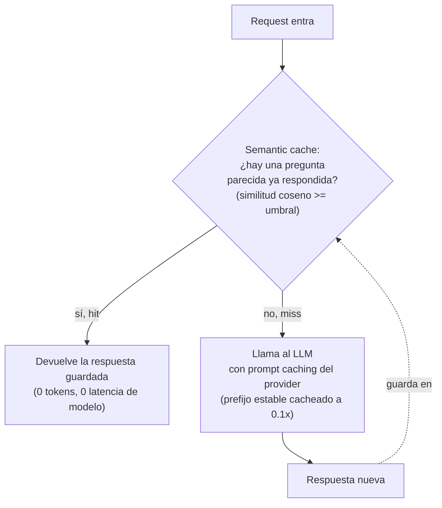
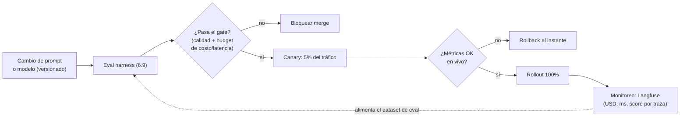

import Nivel from "@components/Nivel.astro";
import Reto from "@components/Reto.astro";
import Solucion from "@components/Solucion.astro";
import Quiz from "@components/Quiz.astro";
import CheckDominio from "@components/CheckDominio.astro";

<Nivel nivel="intermedio" />

Llegaste al final de la Fase 6. Sabes construir un LLM ([6.1](/fase-6-ai-engineering/6-1-fundamentos-llms/)),
un RAG ([6.7](/fase-6-ai-engineering/6-7-rag-a-fondo/)), un agente
([6.8](/fase-6-ai-engineering/6-8-ai-agents/)) y un eval harness que demuestra que funcionan
([6.9](/fase-6-ai-engineering/6-9-eval-driven-development/)). Falta la pregunta que un cliente
de verdad te va a hacer en la primera reunión: **"¿cuánto me cuesta esto al mes, y cuánto tarda
en responder?"**. Si no tienes el número, no tienes un sistema de producción: tienes una demo.

Esta lección convierte **costo** y **latencia** en lo que el mercado 2026 espera de un
semi-senior: variables de primera clase, medidas en vivo, no un susto al final del mes. Y cierra
la fase con **LLMOps** — la disciplina de operar sistemas de IA: fallbacks, versionado, despliegue
seguro y monitoreo. Es el pegamento que ata todo lo que aprendiste: evals + observabilidad + costo.

## Objetivos de esta lección

Al terminar deberías ser capaz de:

- **O1 — Implementar** un **medidor de costo en vivo** (USD por request a partir de los tokens
  de `usage`, contabilizando bien las tres tarifas: input fresco, cache read y cache write) y un
  **router de modelos** que mande cada request al modelo más barato que hace el trabajo.
- **O2 — Explicar el trade-off** de las cuatro palancas de costo/latencia (**prompt caching** del
  provider, **semantic caching**, **ruteo de modelos**, **batching**): qué ahorra cada una, qué
  arriesga, y cuándo NO usarla.
- **O3 — Diseñar** la capa **LLMOps** de un sistema de IA en producción: **fallbacks**, **versionado**
  de prompts/modelos, **despliegue seguro** con gate de eval, y **monitoreo** que ate cada número de
  costo/latencia a su prompt y modelo (Langfuse como single source of truth).

## Por qué esto importa (y paga)

El "💰" de la Fase 6 dice que el premium salarial está en **diseñar, construir, evaluar y
sostener** sistemas de IA. **Sostener** es esta lección. Tres razones de mercado, sin adornos:

- **El costo es el primer filtro de viabilidad.** Un RAG que cuesta USD 0.40 por consulta a 50.000
  consultas/mes son USD 20.000 mensuales — un proyecto muerto. El mismo RAG bien optimizado (caching
  + ruteo) puede costar una fracción. El que llega a la reunión con "te cuesta X centavos por consulta
  y aquí está el desglose" cierra el trato; el que dice "ni idea, depende" no.
- **La latencia es experiencia de usuario, medible.** Un agente que tarda 30 segundos en responder es
  inusable aunque la respuesta sea perfecta. Saber dónde se va el tiempo (¿el retrieval? ¿el modelo?
  ¿la red?) y cómo bajarlo (caching, modelo más rápido, streaming) es ingeniería, no magia.
- **LLMOps es lo que separa "lo hice una vez" de "corre en producción".** Cambiar un prompt sin un
  gate de eval, sin saber a qué versión volver, sin un fallback cuando el provider se cae — eso es un
  incidente con factura esperando ocurrir. El **Definition of Done** de todo capstone que toca IA
  exige un **budget de costo/latencia** como entregable de primera clase.

> [!tip] GLaDOS dice
> Yo administré una instalación entera con un presupuesto energético infinito y mira cómo terminó:
> en ruinas, y con un pastel que era mentira. Tú no tienes presupuesto infinito. Cada token que
> quemas sin medir es plata que se va por el incinerador. Mide primero. Optimiza después. Y por
> favor, no me digas "depende" cuando el cliente pregunta cuánto cuesta.

## Lo que ya traes (activación)

Recupera **de memoria**, sin abrir las notas, cuatro ideas previas. El tirón mental es parte del
aprendizaje:

1. De [6.3 · APIs de LLM](/fase-6-ai-engineering/6-3-apis-llm/): el costo de una llamada se calcula
   sobre **tokens**, con precios distintos para **input** y **output**, dados **por millón** de
   tokens. ¿Recuerdas por qué la salida pesa más? Hoy le sumamos una tercera tarifa: la del cache.
2. De [6.5 · Embeddings](/fase-6-ai-engineering/6-5-embeddings-busqueda-semantica/): dos textos con
   significado parecido tienen embeddings cercanos, y la **similitud coseno** lo mide. Esa misma idea
   es el corazón del **semantic caching** que verás hoy.
3. De [6.9 · Eval-driven development](/fase-6-ai-engineering/6-9-eval-driven-development/): un cambio
   sin un **gate de regresión** es a ciegas. Hoy ese gate se convierte en la llave del **despliegue
   seguro**: ningún cambio entra a producción sin pasar el eval.
4. De **5.8 Costos cloud** y **5.10 Observabilidad** (Fase 5): ya sabes que la infraestructura se mide
   en USD y que un servicio de producción se instrumenta con logs/métricas/**trazas**. Hoy aplicamos
   exactamente eso a las llamadas a LLM: la traza del call-chain con tokens, latencia y costo por paso.

La idea-puente de hoy: **un token tiene precio y un request tiene reloj.** Todo lo que construiste en
la fase produce tokens y consume tiempo; LLMOps es hacer ese par (USD, ms) **visible, predecible y
gobernable**.

## Worked example 1: medir el USD por request EN VIVO (con caching)

Te muestro el razonamiento completo, en voz alta, antes de pedirte que lo hagas tú. La regla de oro:
**no puedes optimizar lo que no mides.** Antes de tocar caching o ruteo, necesitas un número confiable
por request. Y ese número sale de un solo lugar: el campo `usage` de la respuesta.

> _Pienso en voz alta:_ en [6.3](/fase-6-ai-engineering/6-3-apis-llm/) calculé costo con dos tarifas,
> input y output. Pero apenas activo caching, la respuesta trae **tres** categorías de tokens de
> entrada, cada una con un precio distinto, y si las trato todas igual mi número miente. Tengo que
> separar las tres.

El objeto `usage` de Anthropic (verificado contra el SDK vigente 2026) trae estos campos:

| Campo de `usage` | Qué cuenta | Multiplicador sobre el precio de input |
|---|---|---|
| `input_tokens` | Tokens de entrada procesados **sin cache** (precio completo) | **1.0×** |
| `cache_read_input_tokens` | Tokens **servidos desde el cache** (baratísimos) | **~0.1×** |
| `cache_creation_input_tokens` | Tokens **escritos al cache** esta vez (premium de escritura) | **~1.25×** (TTL 5 min) |
| `output_tokens` | Tokens generados por el modelo | precio de **output** (1.0×) |

> _Pienso en voz alta:_ el cache read a 0.1× es la palanca: pagas una décima parte por el contexto que
> ya estaba cacheado. Pero la **escritura** cuesta 1.25× — más que el precio normal. O sea, cachear un
> prefijo que usas **una sola vez** es perder plata. El cache paga solo si lo **lees** muchas veces. Eso
> me importará en el diseño.

La fórmula, con el pricing dado **por millón** de tokens (1M = 1.000.000):

```python
def costo_usd(usage, precio_in_por_millon: float, precio_out_por_millon: float) -> float:
    """Costo en USD de UNA llamada, a partir del objeto `usage` de la respuesta.

    Contabiliza las tres tarifas de input por separado:
      - input fresco        -> 1.0x  precio de input
      - cache read          -> 0.1x  precio de input (servido del cache)
      - cache write (5 min) -> 1.25x precio de input (premium de escritura)
    y el output a su propio precio.
    """
    M = 1_000_000
    costo_in  = (usage.input_tokens / M) * precio_in_por_millon
    costo_read = (usage.cache_read_input_tokens / M) * precio_in_por_millon * 0.10
    costo_write = (usage.cache_creation_input_tokens / M) * precio_in_por_millon * 1.25
    costo_out = (usage.output_tokens / M) * precio_out_por_millon
    return costo_in + costo_read + costo_write + costo_out
```

Y así lo lees en vivo de una respuesta real (verificado contra el SDK Python 2026):

```python
import anthropic

client = anthropic.Anthropic()

resp = client.messages.create(
    model="claude-opus-4-8",          # $5 / $25 por millón (in / out)
    max_tokens=1024,
    system=[{
        "type": "text",
        "text": documento_grande,      # contexto estable y grande
        "cache_control": {"type": "ephemeral"},   # cachéalo
    }],
    messages=[{"role": "user", "content": pregunta}],
)

print(resp.usage.input_tokens)               # tokens frescos (precio completo)
print(resp.usage.cache_read_input_tokens)    # servidos del cache (0.1x)
print(resp.usage.cache_creation_input_tokens)# escritos al cache (1.25x)
print(costo_usd(resp.usage, 5.0, 25.0))      # USD de ESTA llamada, ahora mismo
```

> _Pienso en voz alta:_ esto es "USD por request en vivo". No es una estimación de escritorio: es el
> costo real de la llamada que acabo de hacer, calculado del `usage` que me devolvió el provider. Si lo
> logueo en cada request (con la observabilidad de 5.10), tengo el USD/mes por usuario, por endpoint,
> por feature — y puedo poner un **techo de presupuesto** que dispare una alerta antes de que la factura
> me sorprenda.

## Worked example 2: las dos capas de caching (provider + semantic)

Hay **dos** cachés distintos en una app de IA, y mucha gente confunde uno con el otro. Sirven para
cosas diferentes:



**Capa 1 — Prompt caching del provider** (lo del worked example 1). El provider cachea el **prefijo
estable** de tu prompt (system prompt, documentos, ejemplos few-shot) y te cobra 0.1× por releerlo. No
ahorra la llamada — el modelo igual genera — pero baja el costo del input y la latencia de procesar ese
prefijo. La regla de uso es **una sola**, y es la que rompe a casi todos:

:::caution[El cache del provider es un *prefix match*: estable adelante, volátil atrás]
El provider cachea por **prefijo exacto**: si cambia **un solo byte** al principio del prompt, todo lo
que viene después deja de cachear. Por eso lo estable (system prompt, documentos) va **primero** y lo
volátil (la pregunta del usuario, un timestamp, un UUID) va **al final**. Si metes `datetime.now()` o un
ID aleatorio en el system prompt, **nunca** cacheas nada y no te enteras: `cache_read_input_tokens`
se queda en 0 request tras request. Verifícalo siempre con ese campo.
:::

**Capa 2 — Semantic caching** (tuyo, no del provider). Antes de llamar al modelo, embeddeas la pregunta
([6.5](/fase-6-ai-engineering/6-5-embeddings-busqueda-semantica/)), buscas la más parecida que ya
respondiste, y si la **similitud coseno** supera un umbral, devuelves la respuesta guardada **sin llamar
al LLM**. Ahorro total: 0 tokens, 0 latencia de modelo.

```python
def decidir_servir_de_cache(similitud: float, umbral: float) -> bool:
    """Sirve la respuesta cacheada solo si la pregunta nueva es SUFICIENTEMENTE
    parecida a una ya respondida. El umbral es la decisión de diseño más delicada."""
    return similitud >= umbral
```

> _Pienso en voz alta:_ el umbral del semantic cache es un cuchillo de doble filo. Si lo pongo muy
> **bajo** (ej. 0.80), sirvo respuestas viejas a preguntas que solo se *parecen* — "¿plazo de devolución
> de zapatos?" recibe la respuesta de "¿plazo de devolución de electrónica?" y entrego un dato **falso**
> con cara de cache hit. Si lo pongo muy **alto** (ej. 0.99), casi nunca hay hit y el cache no ahorra
> nada. No hay número mágico: se **calibra con un eval** (6.9), midiendo cuántos hits son correctos vs.
> cuántos sirven basura.

## Worked example 3: ruteo de modelos y batching

Las otras dos palancas. La idea de fondo es la misma que el `modelo_mas_barato` de
[6.3](/fase-6-ai-engineering/6-3-apis-llm/), pero ahora la decisión depende de la **dificultad** de la
tarea, no solo del precio.

**Ruteo de modelos (barato→caro).** No toda request necesita el modelo más caro. Un clasificador de
sentimiento corre perfecto en Haiku ($1/$5); un razonamiento multi-paso necesita Opus ($5/$25). La
estrategia: estimar la dificultad y mandar cada request al **modelo más barato que la resuelve bien**.

```python
def rutear_modelo(dificultad: float, escalones: list[tuple[float, str]]) -> str:
    """Devuelve el modelo MÁS BARATO cuyo techo de dificultad cubre la tarea.

    `escalones` va de menor a mayor capacidad: [(0.3, "haiku"), (0.7, "sonnet"), (1.0, "opus")].
    dificultad 0.2 -> haiku ; 0.5 -> sonnet ; 0.9 -> opus.
    Si ninguno cubre (dificultad fuera de rango), usa el más capaz (el último).
    """
    for techo, modelo in escalones:
        if dificultad <= techo:
            return modelo
    return escalones[-1][1]
```

> _Pienso en voz alta:_ ¿de dónde sale la `dificultad`? De heurísticas baratas (largo del input,
> presencia de código, número de pasos pedidos) o de un **clasificador** — a veces un Haiku que solo
> decide "fácil/difícil" antes de elegir el modelo grande. El ahorro es enorme: si el 80% de mi tráfico
> es fácil y lo mando a Haiku en vez de Opus, recorto el costo casi a la quinta parte para ese 80%. El
> riesgo: si el router subestima la dificultad y manda algo difícil a Haiku, la calidad cae — por eso el
> router también se **evalúa** (6.9), no se confía a ciegas.

**Batching.** Para trabajo que **no** es sensible a latencia (procesar 10.000 documentos de la noche,
generar embeddings de un catálogo, clasificar un backlog), no hagas 10.000 llamadas síncronas. Usa la
**Message Batches API**: mandas todo junto, esperas (hasta 24 h, normalmente menos de 1 h), y pagas
**50% menos** (verificado contra el SDK vigente 2026).

```python
from anthropic.types.message_create_params import MessageCreateParamsNonStreaming
from anthropic.types.messages.batch_create_params import Request

batch = client.messages.batches.create(
    requests=[
        Request(
            custom_id=f"doc-{i}",                       # clave para casar resultados
            params=MessageCreateParamsNonStreaming(
                model="claude-haiku-4-5",                # barato + batch = costo mínimo
                max_tokens=256,
                messages=[{"role": "user", "content": f"Clasifica: {doc}"}],
            ),
        )
        for i, doc in enumerate(documentos)
    ]
)

# Se espera a que processing_status == "ended"; los resultados llegan en CUALQUIER orden,
# se casan por custom_id (NUNCA por posición).
for result in client.messages.batches.results(batch.id):
    if result.result.type == "succeeded":
        print(result.custom_id, result.result.message.content[0].text)
```

> _Pienso en voz alta:_ batching cambia latencia por costo: aceptas que la respuesta tarde para pagar la
> mitad. Por eso **jamás** lo uses para una request interactiva (un chat, una búsqueda en vivo) — ahí el
> usuario espera. Úsalo para lo asíncrono. Y casa los resultados por `custom_id`: llegan desordenados, y
> casar por posición es un bug que entrega la respuesta del documento 7 como si fuera la del 3.

## Worked example 4: LLMOps — sostener el sistema en producción

Tienes el costo medido y las palancas. Falta operarlo. **LLMOps** es a un sistema de IA lo que DevOps es
a un backend: lo que lo mantiene vivo, observable y seguro de cambiar. Cuatro piezas.



**1. Fallbacks.** El provider se cae, te tira un 429 (rate limit) o un 529 (overloaded). Un sistema de
producción no muere por eso: tiene un **plan B**. El SDK ya reintenta 429/5xx con backoff
automáticamente; para fallas persistentes, un fallback a **otro modelo** (o a una respuesta degradada):

```python
import anthropic

def responder_con_fallback(client, pregunta: str) -> str:
    cadena = ["claude-opus-4-8", "claude-sonnet-4-6", "claude-haiku-4-5"]
    ultimo_error = None
    for modelo in cadena:                         # del mejor al de respaldo
        try:
            resp = client.messages.create(
                model=modelo, max_tokens=1024,
                messages=[{"role": "user", "content": pregunta}],
            )
            return next(b.text for b in resp.content if b.type == "text")
        except (anthropic.RateLimitError, anthropic.InternalServerError) as e:
            ultimo_error = e                       # intenta el siguiente de la cadena
    raise RuntimeError("toda la cadena de fallback falló") from ultimo_error
```

**2. Versionado de prompts y modelos.** Tu prompt es código: vive en el repo, no en un string suelto, y
cambia con **Conventional Commits** y un **ADR** que diga por qué. Tu modelo también se versiona — un
sistema que "funcionaba con sonnet-4-5" puede romperse al saltar a otro modelo, y necesitas saber a qué
volver. La trazabilidad de 6.9 (score ↔ prompt + modelo + dataset) es exactamente esto.

**3. Despliegue seguro.** Un cambio de prompt no entra a producción "porque se ve mejor". Entra solo si:
(a) pasa el **gate de eval** ([6.9](/fase-6-ai-engineering/6-9-eval-driven-development/)) — incluyendo el
**budget de costo/latencia** como criterio de bloqueo; y (b) sale en **canary** — 5% del tráfico primero,
con métricas en vivo, y **rollback inmediato** si algo se degrada. Es el mismo CI/CD de la Fase 5, con un
gate extra de calidad de IA.

**4. Monitoreo.** En vivo, cada request deja una **traza** con tokens, latencia, costo y score. La
herramienta estándar 2026 es **Langfuse** (la misma de 6.9), que ata cada número a su prompt y modelo
(verificado contra el SDK Python vigente 2026):

```python
from langfuse import Langfuse, observe

langfuse = Langfuse()

@observe()                                   # traza la llamada (latencia, tokens, modelo)
def responder(pregunta: str) -> str:
    resp = mi_sistema(pregunta)
    # adjunta el COSTO de esta request a su traza: USD <-> prompt + modelo quedan ligados
    langfuse.score_current_trace(name="costo_usd", value=0.012, data_type="NUMERIC")
    return resp
```

> _Pienso en voz alta:_ fíjate cómo todo se cierra. La traza de Langfuse trae la latencia (observabilidad,
> 5.10), el costo (esta lección) y el score (evals, 6.9). Las requests reales que costaron de más o
> tardaron de más se **promueven al dataset de eval** — y el ciclo se reinicia. Eso es LLMOps: el sistema
> se observa a sí mismo y mejora. No es una fase posterior; es un hábito diario.

## Lo que parece cierto pero no lo es

:::caution[Misconception 1 — "cachear siempre ahorra plata"]
Falso. El cache write cuesta **1.25×** el precio de input (más que una lectura normal). Cachear un
prefijo que usas **una sola vez** es perder plata: pagaste el premium de escritura y nunca lo leíste. El
cache paga solo cuando el mismo prefijo se **relee** muchas veces (system prompts compartidos, documentos
consultados por muchos usuarios). Verifica con `cache_read_input_tokens`: si está en 0, no estás
ahorrando, estás pagando de más.
:::

:::caution[Misconception 2 — "bajo el umbral del semantic cache para tener más hits"]
Peligroso. Un umbral bajo aumenta los hits, sí, pero también sirve respuestas viejas a preguntas que solo
se *parecen* — entregas datos **incorrectos** con cara de número. Un cache hit equivocado es peor que un
miss: el miss cuesta una llamada, el hit malo cuesta la confianza del usuario. El umbral se **calibra con
un eval**, midiendo qué fracción de hits son realmente correctos, no se baja para inflar la tasa de hit.
:::

:::caution[Misconception 3 — "siempre usa el modelo más potente, por las dudas"]
Caro e innecesario. La mayoría del tráfico real es fácil (clasificar, extraer, resumir corto) y corre
igual de bien en un modelo barato. Mandar todo a Opus "por las dudas" puede multiplicar tu factura por
5 sin mejorar la calidad percibida. El ruteo barato→caro es la palanca de costo más grande en producción.
El riesgo opuesto —subestimar la dificultad y mandar algo difícil a Haiku— se controla **evaluando el
router**, no apagándolo.
:::

:::caution[Misconception 4 — "optimizo el costo primero y mido después"]
Al revés, y es el error caro. Igual que el eval va antes de optimizar (6.9), el **medidor de costo va
antes de cachear o rutear**. Sin el USD/request medido en vivo, no sabes si tu "optimización" ahorró o si
movió el gasto de un lado a otro. Primero el número confiable, después la palanca. "Creo que el caching
ayudó" no es ingeniería; "bajó de USD 0.18 a USD 0.04 por request, medido" sí.
:::

## Práctica con andamiaje (predecir antes de construir)

Aún no escribes código. Primero **predices** — el Primero-Sin-IA en miniatura.

**1. Predicción (costo con cache).** Una llamada a Opus ($5 in / $25 out por millón) devuelve
`usage` con: `input_tokens = 2000`, `cache_read_input_tokens = 10000`,
`cache_creation_input_tokens = 0`, `output_tokens = 500`. **Calcula el costo en USD a mano**, contando
el cache read a 0.1×. ¿Cuánto habría costado si esos 10.000 tokens fueran input fresco en vez de cache?

**2. Predicción (ruteo).** Con `escalones = [(0.3, "haiku"), (0.7, "sonnet"), (1.0, "opus")]` y la función
`rutear_modelo` del worked example 3, ¿qué modelo elige para dificultad `0.3`? ¿Y para `0.71`? ¿Y para
`1.4`?

**3. Predicción (caching).** Tu app mete `f"Hora actual: {datetime.now()}"` al **inicio** del system
prompt, antes del documento que quieres cachear. Tras 100 requests, ¿qué valor esperas en
`cache_read_input_tokens` y por qué?

<Solucion title="Ver razonamiento (ábrelo solo después de intentarlo)">
1. Costo = (2000/1e6)·5 + (10000/1e6)·5·0.1 + 0 + (500/1e6)·25 = 0.010 + 0.005 + 0 + 0.0125 =
   **USD 0.0275**. Si esos 10.000 fueran input fresco: (12000/1e6)·5 + (500/1e6)·25 = 0.060 + 0.0125 =
   **USD 0.0725**. El cache read ahorró ~USD 0.045 en esta sola request (los 10k a 0.1× en vez de 1×).
2. `0.3` → **haiku** (0.3 ≤ 0.3, el primer escalón cubre). `0.71` → **opus** (supera 0.3 y 0.7, cae en
   1.0). `1.4` → **opus** (ninguno cubre, devuelve el último). Ojo con el `≤`: 0.3 exacto entra en haiku.
3. `cache_read_input_tokens` se queda en **0** request tras request. `datetime.now()` cambia cada vez, y
   como va **al inicio** del prefijo, rompe el prefix match: el provider ve un prompt distinto cada vez y
   no cachea nada. Pagas el premium de escritura sin leer nunca. La parte volátil va **al final**, no al
   principio.
</Solucion>

## Ejercicios Primero-Sin-IA

Dos entregables. Trabájalos **a mano primero**, sin IA, dentro del timebox. Las carpetas viven en tu
repo: ábrelas en VS Code.

<Reto title="Medidor de costo en vivo + router de modelos, a mano" timebox="45 min">

Carpeta: `ejercicios/fase-6/ruteo-y-medidor-costo/`

Vas a construir las dos herramientas que un AI Engineer usa todos los días: el medidor de USD/request
(cache-aware) y el router barato→caro. Todo **determinista, sin API ni API key** — el `usage` se te pasa
como un objeto simple, igual que se te inyectaba el modelo en el ejercicio de agentes de 6.8. Implementas:

1. `costo_usd(usage, precio_in, precio_out)` — costo en USD de una llamada, contando las **tres** tarifas
   de input por separado (fresco 1.0×, cache read 0.1×, cache write 1.25×) más el output. Los precios se
   inyectan **por millón** de tokens.
2. `rutear_modelo(dificultad, escalones)` — devuelve el modelo más barato cuyo techo cubre la dificultad;
   si ninguno cubre, el más capaz (el último).
3. `costo_mensual(trafico, escalones, precios)` — dada una mezcla de tráfico (lista de requests, cada una
   con su dificultad y su `usage`), rutea cada una, calcula su costo, y devuelve el **total mensual** y el
   desglose por modelo. Es la cuenta que llevas a la reunión con el cliente.

Pasos:

1. **A mano (predicción):** en `prediccion.md`, para los 2 casos del README, calcula a mano el costo de
   cada request (cuenta las tarifas) y qué modelo rutea cada dificultad. **No ejecutes todavía.**
2. **Código:** completa las tres funciones en `medidor.py` y haz pasar los tests con `pytest`.
3. **Reflexión:** en `verificacion.md`, explica en 2-3 frases por qué cachear un prefijo de **un solo
   uso** pierde plata, y cuándo el ruteo a un modelo barato puede salir caro (calidad).

**Criterios de "hecho":**
- [ ] `prediccion.md` existe **antes** de ejecutar, con las cuentas a mano.
- [ ] Todos los tests pasan (`pytest`).
- [ ] `costo_usd` cuenta cache read a 0.1× y cache write a 1.25× (no los trata como input fresco).
- [ ] `rutear_modelo` maneja el borde exacto (`dificultad == techo`) y la dificultad fuera de rango.
- [ ] `costo_mensual` reusa `costo_usd` y `rutear_modelo` (no duplica la lógica) y devuelve el desglose
      por modelo, no solo el total.
- [ ] `verificacion.md` conecta el premium de cache write con "cachear de un solo uso pierde plata".

Cuando termines, pídele a tu IA que lo corrija con el framework de `.ai/`.

</Reto>

<Solucion title="Pista (NO la solución): si te traban las tarifas o el borde del router">
Para `costo_usd`: calcula los **cuatro** términos por separado y súmalos —
`(input/1e6)·precio_in` + `(cache_read/1e6)·precio_in·0.1` + `(cache_write/1e6)·precio_in·1.25` +
`(output/1e6)·precio_out`. El error típico es sumar `cache_read` a `input_tokens` y cobrarlo a 1×. Para
`rutear_modelo`: itera los escalones de menor a mayor y devuelve el **primero** cuyo techo `>=`
dificultad; si el bucle termina sin encontrar, devuelve el último. Ojo con `<=` vs `<` en el borde exacto.
Para `costo_mensual`: por cada request, `rutear_modelo` da el modelo, buscas su precio en la tabla, y
sumas `costo_usd`; lleva un acumulador por modelo (un dict) para el desglose.
</Solucion>

<Reto title="Diseño: la capa LLMOps del capstone RAG" timebox="40 min">

Carpeta: `ejercicios/fase-6/diseno-llmops-plataforma/`

Ejercicio de **diseño/razonamiento** (sin código que ejecutar). En `diseno.md` diseñas la capa de
costo/latencia + LLMOps de la **Plataforma RAG de producción** (el capstone de la fase). Tienes un RAG con
ingest → vector DB → retrieval + reranking → generación streaming, ~30.000 consultas/mes, y un eval harness
de 6.9. Decide y **justifica**:

- **Caching (dos capas):** ¿qué cacheas con **prompt caching del provider** (qué va en el prefijo estable y
  qué al final) y dónde pones un **semantic cache**? Para el semantic cache, di cómo eliges el umbral y cómo
  lo **calibras con el eval**. Nombra un escenario donde el caching **no** sirva.
- **Ruteo de modelos:** define los escalones (qué tareas a qué modelo) y de dónde sale la señal de
  dificultad. Di cómo evitas que el router degrade la calidad (cómo lo evalúas).
- **Batching:** identifica qué parte del pipeline va por **Message Batches** (asíncrono, 50% off) y cuál
  **no puede** (interactivo). Justifica el corte.
- **Budget de costo/latencia:** define el **techo** (USD/consulta y latencia p95) que actúa como **gate**:
  un cambio que lo supera se bloquea. Conéctalo con el gate de regresión de 6.9.
- **LLMOps:** describe la **cadena de fallback**, cómo **versionas** prompt y modelo (ADR + Conventional
  Commits), el **despliegue seguro** (canary + rollback) y el **monitoreo** (qué atas en cada traza de
  Langfuse: USD, ms, score, prompt, modelo).
- **Seguridad (hilo transversal):** nombra **un** riesgo de seguridad que el caching introduce (pista:
  ¿qué pasa si un semantic cache sirve la respuesta de un usuario a otro?) y su mitigación.

**Criterios de "hecho":**
- [ ] Las dos capas de caching están distinguidas, con el prefijo estable vs. volátil explícito.
- [ ] El umbral del semantic cache se calibra con el eval, no es un número inventado; hay un caso donde el
      caching no sirve.
- [ ] Los escalones de ruteo están justificados y dices cómo evalúas el router.
- [ ] El corte interactivo vs. batch está justificado por latencia.
- [ ] El budget de costo/latencia es un **gate** concreto (números) atado al eval de 6.9.
- [ ] La capa LLMOps cubre fallback, versionado, despliegue seguro y monitoreo.
- [ ] Nombras un riesgo de seguridad del caching con su mitigación.

Cuando termines, pídele a tu IA que lo corrija con el framework de `.ai/`.

</Reto>

## Check de dominio

<CheckDominio
  title="Marca solo lo que puedes EXPLICAR sin notas"
  items={[
    "Nombrar las tres tarifas de input de una respuesta (fresco 1.0x, cache read 0.1x, cache write 1.25x) y de qué campo de usage sale cada una.",
    "Explicar por qué cachear un prefijo de un solo uso pierde plata.",
    "Explicar el prefix match del prompt caching: por qué lo estable va al inicio y lo volátil al final.",
    "Explicar el trade-off del umbral del semantic cache (bajo = hits malos, alto = sin ahorro) y cómo se calibra.",
    "Describir el ruteo barato→caro y el riesgo de subestimar la dificultad.",
    "Decir cuándo SÍ y cuándo NO usar batching (asíncrono vs. interactivo) y por qué casar resultados por custom_id.",
    "Listar las 4 piezas de LLMOps (fallbacks, versionado, despliegue seguro, monitoreo) y qué hace cada una.",
    "Explicar cómo se cierra el ciclo: traza (Langfuse) con USD + ms + score → dataset de eval → gate de despliegue.",
  ]}
/>

Y dos preguntas rápidas de recuperación:

<Quiz
  question="Activaste prompt caching del provider, pero tras 200 requests cache_read_input_tokens sigue en 0. ¿Cuál es la causa más probable?"
  options={[
    "El modelo es muy barato y no soporta caching; hay que cambiarlo a Opus.",
    "Hay un invalidador silencioso: algo volátil (un timestamp, un UUID, o el orden de un dict) está al INICIO del prefijo y rompe el prefix match en cada request.",
    "El umbral del semantic cache está muy alto.",
  ]}
  answer={1}
  explanation="El prompt caching del provider es un prefix match: cualquier byte que cambie al inicio invalida todo lo que sigue. Un datetime.now(), un UUID o un dict sin ordenar metido antes del contenido estable hace que el prompt sea distinto cada vez, así que nunca hay cache read. Se diagnostica viendo cache_read_input_tokens en 0; se arregla moviendo lo volátil al final del prompt. (El semantic cache es otra capa distinta.)"
/>

<Quiz
  question="Tu equipo quiere meter un cambio de prompt que, según las pruebas manuales, 'responde mejor'. ¿Qué exige LLMOps antes de que entre a producción?"
  options={[
    "Nada especial: si se ve mejor en 3 pruebas, se mergea directo a producción.",
    "Que pase el gate de eval (calidad + budget de costo/latencia) y salga en canary con rollback listo; el prompt versionado con un ADR que explique el cambio.",
    "Solo que el costo por request no suba; la calidad se mide después si hay tiempo.",
  ]}
  answer={1}
  explanation="Un cambio sin gate de eval es un incidente esperando ocurrir. Despliegue seguro = pasa el eval (incluyendo el budget de costo/latencia como criterio de bloqueo), sale en canary (5% primero) con métricas en vivo y rollback inmediato si algo se degrada, y queda versionado con un ADR. 'Se ve mejor en 3 pruebas' es una anécdota, no una medición — exactamente lo que 6.9 enseñó a no aceptar."
/>

:::tip[Si ya optimizaste costos de LLM o operaste uno en producción]
Quizás ya activaste prompt caching, montaste un router o llevaste un sistema a producción. **Valida y
salta:** ¿puedes, sin notas, (1) escribir el costo de una request contando las **tres** tarifas de input
sin tratar el cache read como input fresco; (2) explicar por qué un cache write de un solo uso pierde
plata; y (3) nombrar las 4 piezas de LLMOps y cómo el monitoreo realimenta el eval? Si las tres te salen,
usa los ejercicios para **auditar un sistema tuyo real**: ¿tu `cache_read_input_tokens` es mayor que 0 de
verdad? ¿tu router está evaluado o lo confías a ciegas? ¿tienes un gate de costo/latencia o solo de
calidad? Si la cuenta del cache se siente borrosa, ahí está tu hueco: el ahorro que creías tener puede no
existir.
:::

## Recursos

Documentación oficial primero; los blogs caducan rápido.

- **Prompt caching (Anthropic):**
  [docs de prompt caching](https://platform.claude.com/docs/en/build-with-claude/prompt-caching) —
  `cache_control`, prefix match, y los campos `cache_creation_input_tokens` / `cache_read_input_tokens`.
- **Message Batches API (50% off):**
  [docs de batch processing](https://platform.claude.com/docs/en/build-with-claude/batch-processing) —
  crear el batch, `processing_status`, y casar resultados por `custom_id`.
- **Pricing y modelos:**
  [pricing](https://platform.claude.com/docs/en/about-claude/pricing) y
  [modelos](https://platform.claude.com/docs/en/about-claude/models/overview) — precios por millón de
  tokens (Opus 4.8 $5/$25, Sonnet 4.6 $3/$15, Haiku 4.5 $1/$5).
- **Token counting (no estimes con tiktoken):**
  [docs de token counting](https://platform.claude.com/docs/en/build-with-claude/token-counting) —
  `count_tokens` para estimar el costo de un prompt **antes** de enviarlo.
- **Langfuse (trazas, costo y scores):**
  [langfuse.com/docs](https://langfuse.com/docs) — `@observe`, scores por traza y datasets versionados,
  la misma herramienta de 6.9.

> Mantén tus links vivos en `articulos.md` dentro de la carpeta de esta sub-unidad.

## Conexión con el proyecto de la fase

El capstone de la Fase 6 es una
[**Plataforma RAG de producción**](/fase-6-ai-engineering/proyecto/), y esta lección es su **capa de
operación**. El Definition of Done exige, como entregables de primera clase:

- un **budget de costo/latencia** medido y con techo — exactamente el `costo_usd` + `costo_mensual` del
  primer ejercicio, llevado a tu pipeline real (medir el USD por consulta: embedding + retrieval +
  generación, y la latencia p95);
- ese budget como **gate** que bloquea un merge si un cambio lo supera — encadenado al gate de regresión de
  [6.9](/fase-6-ai-engineering/6-9-eval-driven-development/);
- **caching y ruteo** justificados en un ADR (qué cacheas, qué modelo para qué tarea, y por qué) — el
  segundo ejercicio es el borrador de ese ADR;
- **trazabilidad** USD ↔ ms ↔ score ↔ prompt ↔ modelo con **Langfuse**, alimentada por las trazas de
  producción (observabilidad de la Fase 5).

Y mirando más allá: el **capstone estrella del portafolio** (Fase 7) es un agente que **actúa**. Un agente
que acierta pero se gasta USD 40 por tarea **falló** desde producción. El techo de costo, los fallbacks y
el monitoreo que diseñaste aquí son lo que hace que ese agente sea defendible en una entrevista — con un
número, no con un "depende".

## Reflexión y repaso espaciado

Antes de cerrar, responde en tu cuaderno o en `articulos.md`:

- Piensa en algo de IA que ya construiste en esta fase. ¿Sabes cuánto cuesta una request? Si no, eso es lo
  primero que te falta. ¿Qué tres tarifas tendrías que separar para saberlo?
- ¿Qué palanca (caching, ruteo, batching) aplicaría mejor a tu caso, y cuál sería peligrosa? ¿Por qué?

**Gancho de spaced repetition** — agenda estos repasos:

- **Mañana (+1 día):** sin mirar, escribe la fórmula de `costo_usd` con las tres tarifas de input y di el
  multiplicador de cada una (1.0× / 0.1× / 1.25×).
- **En 3 días:** reescribe de memoria el `rutear_modelo` (barato→caro, borde exacto, fuera de rango) y
  explica por qué el batching no sirve para una request interactiva. Si no puedes, no lo aprendiste todavía.
- **En 1 semana:** explícale a alguien (o a tu IA, en voz alta) las 4 piezas de LLMOps y cómo el monitoreo
  de Langfuse cierra el ciclo realimentando el dataset de eval.

Con esto cierras la **Fase 6 · AI Engineering**: ya no solo construyes sistemas de IA — los **evalúas,
los mides y los sostienes**. Siguiente parada: el
[**Capstone — Plataforma RAG de producción**](/fase-6-ai-engineering/proyecto/), donde todo esto deja de
ser teoría y se convierte en un sistema que corre, con un número de costo que puedes defender.
