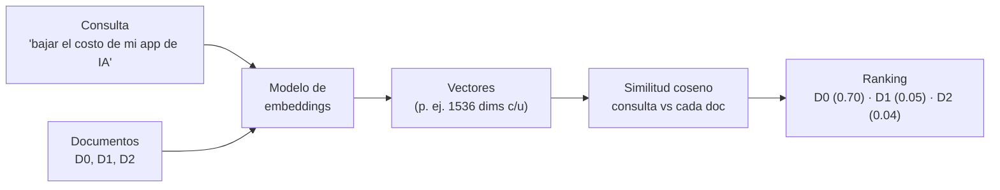
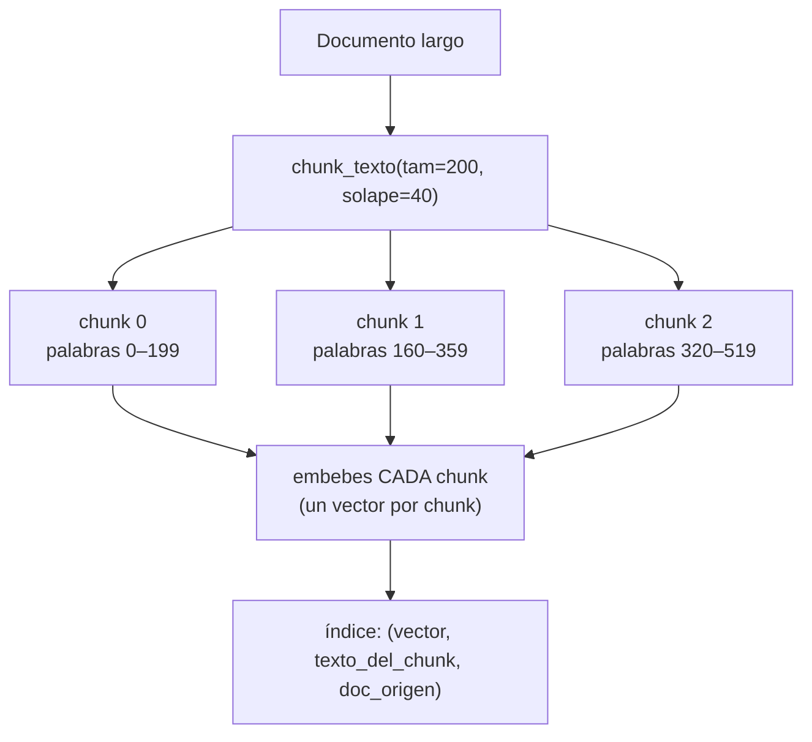
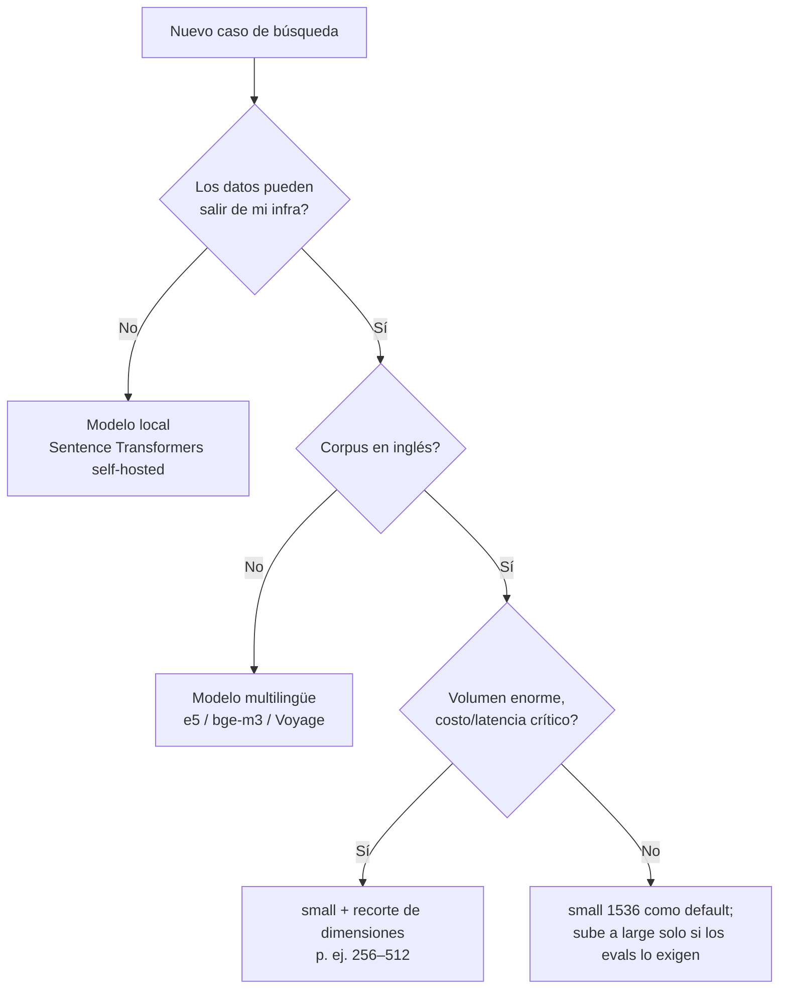

import Nivel from "@components/Nivel.astro";
import Reto from "@components/Reto.astro";
import Solucion from "@components/Solucion.astro";
import Quiz from "@components/Quiz.astro";
import CheckDominio from "@components/CheckDominio.astro";

<Nivel nivel="intermedio" />

En [6.00](/fase-6-ai-engineering/6-0-matematica-minima/) calculaste a mano el
**coseno** entre dos vectores y viste que mide "qué tan parecida es la dirección"
de dos flechas. En esta lección eso deja de ser un ejercicio de matemática y se
vuelve una herramienta de ingeniería: vas a convertir **texto en vectores que
capturan significado** (embeddings), y a usar el coseno para encontrar, dentro de
miles de documentos, los que **hablan de lo mismo** que una pregunta — aunque no
compartan ni una sola palabra. Es el motor de la búsqueda semántica, de la
deduplicación, de la clasificación por similitud, y la base directa de las
[vector databases](/fase-6-ai-engineering/6-6-vector-databases/) (6.6) y de
[RAG](/fase-6-ai-engineering/6-7-rag-a-fondo/) (6.7).

## Objetivos de esta lección

Al terminar deberías ser capaz de:

- **O1 — Explicar** qué es un embedding de texto y por qué dos textos con
  significado parecido producen vectores con **coseno alto**, aunque no compartan
  palabras (y por qué la búsqueda por palabra clave falla ahí).
- **O2 — Implementar** una búsqueda semántica de punta a punta: partir un
  documento en **chunks**, convertir consulta y chunks en vectores, y **rankear**
  por similitud coseno.
- **O3 — Elegir** un modelo de embeddings y una estrategia de chunking para un
  caso concreto, justificando el **trade-off** de dimensiones, costo, latencia,
  idioma y tamaño de chunk.

## Por qué esto importa (y paga)

La Fase 6 es tu mayor diferenciador de mercado, y dentro de ella los embeddings
son el ladrillo que casi todo el resto reusa. Un sistema RAG que "trae documentos
irrelevantes" casi nunca falla en el LLM: falla en el **retrieval**, y el retrieval
es embeddings + chunking + búsqueda. Si en una entrevista te preguntan "¿por qué tu
RAG devuelve basura?" o "¿qué modelo de embeddings usarías y por qué?", estás
respondiendo exactamente lo de esta lección. Quien sabe diagnosticar un chunk mal
cortado o defender por qué eligió 256 dimensiones en vez de 1536 no es un usuario
de IA: es un AI Engineer.

> [!tip] En la práctica
> Un embedding es un GPS para el significado. Cada texto recibe coordenadas en un
> espacio de cientos de dimensiones, y "cerca" significa "habla de lo mismo". La
> magia no está en el modelo que los genera — está en que de pronto puedes hacer
> aritmética con ideas. Inquietante. Útil.

## Lo que ya traes (activación)

Recupera **de memoria**, sin abrir las notas, tres ideas previas:

1. De [6.00 · Matemática mínima](/fase-6-ai-engineering/6-0-matematica-minima/):
   ¿qué devuelve la **similitud coseno** y qué significan los valores **1**, **0**
   y **-1**? ¿Por qué se prefiere el coseno al producto punto crudo cuando los
   vectores tienen distinta magnitud?
2. De [6.1 · Fundamentos de LLMs](/fase-6-ai-engineering/6-1-fundamentos-llms/):
   dentro del modelo, cada **token** se reemplaza por un vector de una tabla de
   embeddings. ¿Por qué el **context window** se mide en tokens y no en páginas?
3. De [6.1](/fase-6-ai-engineering/6-1-fundamentos-llms/): ¿por qué un context
   window enorme no resuelve "meter todos mis documentos" (costo + _lost in the
   middle_)?

Lo de hoy se apoya en las tres: el coseno (1) es el ranking de la búsqueda; el
límite de tokens (2) es por qué hay que **partir** los documentos en chunks; y el
problema de "meter todo" (3) es exactamente por qué existe la búsqueda semántica
en vez de pegar el corpus entero en el prompt.

## Worked example 1: de palabra clave a significado

Te muestro el razonamiento completo antes de pedirte que lo hagas tú. Pregunta de
partida: tengo tres frases y busco **"cómo bajar el costo de mi app de IA"**.

```
D0: "Optimicé el gasto en tokens de mi chatbot"
D1: "Mi gato duerme todo el día"
D2: "Receta de pan casero con masa madre"
```

> _Pienso en voz alta:_ con **búsqueda por palabra clave** (lo que hace `Ctrl+F`
> o un `LIKE '%costo%'` en SQL), comparo si las palabras de la consulta aparecen
> en el documento. Mi consulta dice "costo", "app", "IA". D0 no contiene ninguna
> de esas palabras exactas — dice "gasto", "tokens", "chatbot". Resultado: la
> búsqueda por palabra clave le da **score 0 a D0**, el único documento relevante.
> Falla por completo, porque el significado no vive en las palabras exactas.

Un **embedding** resuelve justo eso. Un modelo de embeddings es una red entrenada
para mapear cada texto a un vector de números reales (cientos de dimensiones) de
modo que **textos con significado parecido caen cerca** en ese espacio. "Optimicé
el gasto en tokens" y "bajar el costo de mi app de IA" no comparten palabras, pero
hablan de lo mismo → sus vectores apuntan casi en la misma dirección → **coseno
alto**.

> _Pienso en voz alta:_ si convierto la consulta y cada documento a vectores y mido
> el coseno, espero algo como: coseno(consulta, D0) ≈ 0.7 (mismo tema), coseno(consulta,
> D1) ≈ 0.05 (gato, nada que ver), coseno(consulta, D2) ≈ 0.04 (pan). Ordeno de
> mayor a menor y **D0 gana** — sin haber compartido una palabra. Eso es búsqueda
> semántica.



### Worked example 2: generar embeddings de verdad

Hay dos caminos para obtener vectores, y vas a usar los dos en tu carrera.

**Camino A — API gestionada (OpenAI).** Una llamada HTTP; ellos corren el modelo.
La API verificada (2026):

```python
from openai import OpenAI

client = OpenAI()  # lee OPENAI_API_KEY del entorno

resp = client.embeddings.create(
    model="text-embedding-3-small",
    input=[
        "Optimicé el gasto en tokens de mi chatbot",
        "Mi gato duerme todo el día",
    ],
)
# resp.data[i].embedding es una lista de floats (1536 por defecto en este modelo)
vec0 = resp.data[0].embedding
vec1 = resp.data[1].embedding
print(len(vec0))  # 1536
```

> _Pienso en voz alta:_ tres detalles de ingeniería que no se ven a simple vista.
> (1) Mando **una lista** (`input=[...]`), no una llamada por documento: el batch
> es muchísimo más barato y rápido que mil llamadas sueltas. (2) Pagas **por
> token de entrada** — embeddings es solo entrada, no hay salida que pagar; por eso
> es baratísimo comparado con generar texto. (3) El vector tiene **1536 dimensiones**;
> ese número, la **dimensión**, define cuánta RAM y cuánto cómputo costará después
> comparar millones de vectores. Lo retomamos al elegir modelo.

Un truco clave de los modelos `text-embedding-3`: puedes **pedir menos dimensiones**
con el parámetro `dimensions` (técnica _Matryoshka_), recortando el vector sin
re-entrenar nada — útil para ahorrar memoria a cambio de algo de calidad:

```python
resp = client.embeddings.create(
    model="text-embedding-3-small",
    input="texto a comprimir",
    dimensions=256,   # en vez de 1536; menos RAM, búsqueda más rápida, algo menos de precisión
)
```

**Camino B — modelo local (Sentence Transformers).** Descargas el modelo una vez
(~80 MB) y corre **offline, gratis, sin API key**. Ideal para datos sensibles
([6.10](/fase-6-ai-engineering/6-10-opensource-local-serving/)) y para aprender sin
gastar:

```python
from sentence_transformers import SentenceTransformer

model = SentenceTransformer("sentence-transformers/all-MiniLM-L6-v2")
emb = model.encode([
    "Optimicé el gasto en tokens de mi chatbot",
    "Mi gato duerme todo el día",
])
print(emb.shape)  # (2, 384) -> 384 dimensiones

# La librería trae la comparación coseno ya hecha:
sim = model.similarity(emb, emb)   # matriz 2x2 de cosenos
print(sim)
```

Ambos caminos producen lo mismo conceptualmente: **un vector por texto**. La
diferencia es operativa (costo, privacidad, dimensiones, calidad), no de concepto.

> [!info] El embedding de la consulta y el de los documentos deben venir del MISMO modelo
> Los espacios vectoriales de dos modelos distintos **no son comparables**: un
> vector de OpenAI y uno de MiniLM viven en universos diferentes, y su coseno no
> significa nada. Si re-embebes tu corpus con un modelo nuevo, tienes que re-embeber
> **todo**, incluida la consulta. Esto se vuelve crítico en producción (6.6/6.7).

## El otro 70% del trabajo: chunking

Aquí está el detalle que separa un demo de juguete de un sistema real. No embebes
"un documento": embebes **trozos** de documento, llamados **chunks**. ¿Por qué?

| Razón | Explicación |
|---|---|
| **Límite del modelo** | Los modelos de embeddings tienen un máximo de tokens por entrada (p. ej. 8192). Un PDF de 300 páginas no entra de una. |
| **Granularidad del retrieval** | Si embebes un capítulo entero en un vector, ese vector es un promedio borroso de 20 temas. Una consulta específica se "diluye". Chunks pequeños = un vector enfocado por idea. |
| **Costo del contexto** | En RAG le pasas los chunks recuperados al LLM. Chunks gigantes = más tokens = más caro y más _lost in the middle_ ([6.1](/fase-6-ai-engineering/6-1-fundamentos-llms/)). |

El tamaño del chunk es un **trade-off**, no hay un número mágico:

- **Chunk muy chico** (1 frase): el vector es preciso pero pierde contexto. "Él
  renunció" sin saber quién es "él" no sirve.
- **Chunk muy grande** (1 capítulo): contexto de sobra pero el vector mezcla
  demasiados temas; el coseno baja para todo y el ranking pierde filo.
- **Punto medio típico**: 200–500 tokens (≈ 1–3 párrafos), con **solape**
  (_overlap_) de ~10–20% entre chunks consecutivos para no cortar una idea justo
  en el límite.



> _Pienso en voz alta:_ fíjate que el chunk 1 empieza en la palabra 160, no en la
> 200. Ese **solape de 40 palabras** es deliberado: si una idea importante cae
> entre la palabra 195 y la 205, sin solape quedaría partida en dos chunks y
> ninguno la representaría bien. El solape la conserva entera en al menos uno.

Y un detalle que casi nadie cuida al principio: junto a cada vector **guarda el
texto original del chunk y de qué documento salió** (metadata). El vector sirve
para encontrar; el texto y la fuente sirven para responder y para citar. Sin la
metadata, encuentras el chunk #4173 y no tienes idea de qué dice.

## Casos de uso (no solo búsqueda)

El mismo embedding + coseno resuelve varias cosas que en entrevista suenan distintas
pero son la misma operación:

| Caso de uso | Cómo se hace con embeddings |
|---|---|
| **Búsqueda semántica** | Embebes la consulta, rankeas los chunks por coseno, devuelves el top-k. |
| **Deduplicación** | Embebes todos los items; dos con coseno ≥ ~0.95 son casi-duplicados (sirve para limpiar datasets, detectar tickets repetidos). |
| **Clustering / agrupar** | Agrupas vectores cercanos (k-means sobre embeddings) para descubrir temas sin etiquetas. |
| **Clasificación por vecindad** | Para clasificar un texto nuevo, miras a qué ejemplos etiquetados se parece más (k-NN) — sin entrenar un clasificador. |
| **Recomendación** | "Items parecidos a este" = vecinos más cercanos en el espacio de embeddings. |

Todas son la misma receta: **texto → vector → comparar por coseno**. Lo que cambia
es qué haces con el ranking.

## Lo que parece cierto pero no lo es

:::caution[Misconception 1 — "embedding y el embedding interno del LLM son lo mismo"]
Son **parientes, no idénticos**. El que viste en [6.1](/fase-6-ai-engineering/6-1-fundamentos-llms/)
es por **token**, interno al modelo, y sirve para predecir el siguiente token. El de
esta lección es por **texto completo** (frase, chunk, documento), pensado como
**producto de búsqueda**: una frase entra y sale **un** vector que la resume. Mismo
apellido ("embedding"), trabajos distintos.
:::

:::caution[Misconception 2 — "más dimensiones = siempre mejor"]
Falso. Más dimensiones capturan matices más finos, pero cuestan **más RAM, más
disco y búsquedas más lentas** sobre millones de vectores, y la ganancia de calidad
se aplana rápido. `text-embedding-3-small` (1536 dims) le gana en costo/latencia a
muchos modelos de 3072+ dims sin perder casi nada en tareas comunes. La pregunta
correcta no es "¿cuál tiene más dimensiones?" sino "¿cuál es el más barato que pasa
mis [evals](/fase-6-ai-engineering/6-9-eval-driven-development/)?".
:::

:::caution[Misconception 3 — "el coseno es una probabilidad / un porcentaje"]
No. Un coseno de 0.82 **no** significa "82% relevante". Es la dirección relativa de
dos flechas. Los valores absolutos dependen del modelo: para un modelo, 0.45 ya es
"muy parecido"; para otro, todo vive entre 0.7 y 0.9. Por eso **nunca pongas un
umbral fijo (como 0.8) sin medirlo en tu propio corpus**. Usa el **ranking**
(top-k) y calibra los umbrales con datos reales.
:::

:::caution[Misconception 4 — "búsqueda semántica reemplaza a la búsqueda por palabra clave"]
Falso, y caro. La semántica falla con **identificadores exactos**: códigos de
producto (`SKU-99213`), nombres propios raros, números de serie. La consulta
"error E_4521" puede traer chunks sobre "errores" en general y perderse el exacto.
Por eso lo serio en producción es **hybrid search**: combinar semántica (coseno) +
palabra clave (BM25). Lo formalizas en [6.7 · RAG](/fase-6-ai-engineering/6-7-rag-a-fondo/).
:::

## Cómo elegir un modelo de embeddings

No existe "el mejor modelo de embeddings". Existe el mejor **para tu restricción
dominante**. Las variables que decides:

| Variable | Qué mirar |
|---|---|
| **Dimensiones** | Más dims = más RAM/disco y búsqueda más lenta. Recorta con `dimensions` si el modelo lo soporta. |
| **Costo** | API se paga por token de entrada (baratísimo); local es gratis pero pagas hardware y mantención. |
| **Idioma** | ¿El modelo es bueno en español? Muchos se entrenan sobre todo en inglés. Verifica con un modelo **multilingüe** si tu corpus no es inglés. |
| **Privacidad** | ¿Los datos pueden salir de tu infra? Si no → modelo **local** (Sentence Transformers, self-hosted). |
| **Calidad** | Mídela con un [eval](/fase-6-ai-engineering/6-9-eval-driven-development/) sobre TU corpus, no con un leaderboard genérico. |

Como anclaje concreto (2026, **verifica precios y nombres vigentes antes de
decidir** — caducan rápido):

| Modelo | Dims | Dónde corre | Nota |
|---|---|---|---|
| `text-embedding-3-small` (OpenAI) | 1536 (recortable) | API | Barato, sólido, default razonable |
| `text-embedding-3-large` (OpenAI) | 3072 (recortable) | API | Más calidad, más caro/lento |
| `all-MiniLM-L6-v2` (Sentence Transformers) | 384 | local | Gratis, rápido, ideal para aprender y para casos chicos |
| Modelos **multilingües** (p. ej. familia `multilingual-e5`, `bge-m3`) | varía | local o API | Cuando el corpus no es inglés |
| **Voyage** (`voyage-3` y familia) | varía | API | Anthropic **no tiene modelo de embeddings propio** y recomienda Voyage; relevante si tu stack es Claude |

> [!warning] Atención — Claude no genera embeddings
> Si tu LLM es Claude, no esperes una API de embeddings de Anthropic: no la hay.
> Anthropic recomienda **Voyage AI** para embeddings. Mezclar proveedores
> (generación con Claude, embeddings con Voyage u OpenAI) es **normal y correcto**;
> recuerda solo la regla de oro: consulta y corpus, **mismo modelo de embeddings**.



## Práctica con andamiaje (predecir antes de medir)

Antes de escribir código, **predice**. Es PRIMM en miniatura (_Predict_ antes que
_Run_). Anota tu respuesta y una línea de razonamiento.

1. **Ranking.** Tienes la consulta `"comida para gatos"` y tres documentos:
   _(a)_ `"alimento balanceado para felinos"`, _(b)_ `"el gato come pescado"`,
   _(c)_ `"reparación de motores diésel"`. Ordena de **mayor a menor** coseno
   esperado con la consulta.
2. **Chunking.** Un texto de 500 palabras, `chunk_texto(tam=200, solape=40)`.
   ¿Cuántos chunks salen y dónde empieza cada uno? (Pista: avanzas `tam - solape`
   palabras por chunk.)
3. **Dedup.** Tienes 4 vectores. Los cosenos entre ellos: v0-v1 = 0.97, v0-v2 = 0.10,
   v1-v2 = 0.12, v0-v3 = 0.30, v1-v3 = 0.28, v2-v3 = 0.15. Con umbral 0.95 y
   estrategia "conserva el primero, descarta lo casi-igual a algo ya conservado",
   ¿qué índices sobreviven?

<Solucion title="Ver razonamiento (ábrelo solo después de intentarlo)">
1. **(a) → (b) → (c)**. (a) es el mismo concepto con otras palabras ("alimento
   para felinos" = "comida para gatos") → coseno más alto, aunque no comparta
   palabras. (b) comparte "gato/come" y tema → alto pero algo menos (habla de qué
   come, no de comprar comida). (c) no tiene nada que ver → casi 0.
2. **3 chunks.** Avanzas `200 - 40 = 160` palabras por chunk. Empiezan en 0, 160,
   320. El chunk que empieza en 320 cubre 320–499 (las 180 palabras que quedan; el
   último chunk suele ser más corto). El que empezaría en 480 ya no aporta texto
   nuevo suficiente, así que paras.
3. **Sobreviven {0, 2, 3}.** Conservas v0. v1 tiene coseno 0.97 ≥ 0.95 con v0 →
   descartas v1. v2 (0.10 con v0) no se parece a nada conservado → lo conservas.
   v3 (0.30 con v0, 0.15 con v2) tampoco supera 0.95 → lo conservas.
</Solucion>

## Ejercicios Primero-Sin-IA

Dos entregables. Trabájalos **a mano primero**, sin IA, dentro del timebox. Las
carpetas viven en tu repo: ábrelas en VS Code.

<Reto title="Construye un buscador semántico (chunking + ranking + dedup)" timebox="45 min">

Carpeta: `ejercicios/fase-6/buscador-semantico/`

Vas a implementar el **motor** de la búsqueda semántica, la parte que un AI Engineer
tiene que poder escribir sin librería mágica. Para que los tests sean
**deterministas y offline** (sin API key ni descargar modelos), recibes los vectores
ya calculados: tu trabajo es la **lógica de ingeniería** alrededor del embedding.

En `buscador.py` completa cuatro funciones (no cambies las firmas):

1. `chunk_texto(texto, tam, solape)` — parte el texto en chunks de `tam` palabras
   con `solape` palabras de solape. Lanza `ValueError` si `solape >= tam`.
2. `similitud_coseno(a, b)` — el coseno que ya hiciste en 6.0 (reúsalo).
3. `buscar(consulta_vec, corpus_vecs, k)` — devuelve el top-k `(indice, score)`
   ordenado de mayor a menor coseno.
4. `deduplicar(vecs, umbral)` — devuelve los índices que sobreviven (conserva el
   primero, descarta cualquiera con coseno ≥ `umbral` contra algo ya conservado).

**Criterios de "hecho":**
- [ ] Todos los tests pasan (`pytest`).
- [ ] `chunk_texto` avanza `tam - solape` por chunk y maneja el caso `solape >= tam`.
- [ ] `buscar` devuelve tuplas `(indice, score)` de mayor a menor, recortadas a `k`.
- [ ] `deduplicar` con la estrategia greedy correcta.
- [ ] Agregaste **un test borde tuyo** (¿texto más corto que `tam`? ¿`k` mayor que el corpus?).
- [ ] Puedes **explicar sin notas** por qué el solape importa y por qué la metadata
      del chunk se guarda aparte del vector.

Cuando termines, pídele a tu IA que lo corrija con el framework de `.ai/`.

</Reto>

<Solucion title="Pista (NO la solución): si te traba el chunking">
Piensa en un bucle con un índice `i` que arranca en 0 y avanza `paso = tam - solape`
cada vuelta. En cada vuelta tomas `palabras[i : i + tam]` y lo unes con espacios.
Paras cuando `i` ya cubrió todas las palabras. El último chunk suele quedar más
corto y eso está bien. Valida `solape >= tam` **antes** del bucle: si no, `paso`
sería 0 o negativo y el bucle nunca avanzaría (loop infinito).
</Solucion>

<Reto title="Decisión: modelo de embeddings + chunking para tres escenarios" timebox="35 min">

Carpeta: `ejercicios/fase-6/decision-embeddings-chunking/`

Ejercicio de **diseño/razonamiento** (sin código). En `decisiones.md` resuelves tres
escenarios de producto. Para cada uno eliges y **justificas**: modelo de embeddings
(local vs API, dimensiones, idioma), estrategia de chunking (tamaño + solape, o por
qué no aplica), y nombras la **restricción dominante** (privacidad / costo / latencia
/ idioma / calidad). Los escenarios y la plantilla exacta están en el `README.md`.

**Criterios de "hecho":**
- [ ] Los tres escenarios resueltos con la plantilla completa.
- [ ] Cada decisión de modelo nombra la **restricción dominante**, no "el mejor".
- [ ] Cada decisión de chunking justifica el **tamaño** ligado al tipo de documento.
- [ ] Al menos un escenario menciona un riesgo concreto (p. ej. semántica vs
      identificadores exactos → hybrid search).

</Reto>

## Check de dominio

<CheckDominio
  title="Marca solo lo que puedes EXPLICAR sin notas"
  items={[
    "Explicar qué es un embedding de texto y por qué captura significado, no palabras.",
    "Dar un ejemplo donde la búsqueda por palabra clave falla y la semántica acierta.",
    "Explicar por qué hay que partir documentos en chunks y qué hace el solape.",
    "Explicar el trade-off de dimensiones (calidad vs RAM/latencia) y qué hace Matryoshka.",
    "Dar dos razones para no usar un umbral de coseno fijo sin medirlo.",
    "Elegir entre modelo local y API nombrando la restricción dominante.",
  ]}
/>

Y dos preguntas rápidas de recuperación:

<Quiz
  question="Una búsqueda por palabra clave (LIKE/Ctrl+F) sobre la consulta 'bajar el costo de mi app' no encuentra el documento 'optimicé el gasto en tokens'. ¿Por qué la búsqueda semántica sí lo encuentra?"
  options={[
    "Porque la semántica también busca las palabras exactas, pero ignorando mayúsculas.",
    "Porque el embedding mapea ambos textos a vectores cercanos por su SIGNIFICADO, aunque no compartan palabras, y el coseno entre ellos es alto.",
    "Porque la semántica traduce el documento al idioma de la consulta antes de comparar.",
  ]}
  answer={1}
  explanation="El embedding ubica textos con significado parecido cerca en el espacio vectorial. 'costo de app' y 'gasto en tokens' apuntan en direcciones parecidas -> coseno alto -> match, sin compartir ni una palabra."
/>

<Quiz
  question="Tienes que indexar manuales técnicos en español, con muchos códigos de error exactos (E_4521), y los datos NO pueden salir de tu servidor. ¿Qué decisión es la más defendible?"
  options={[
    "text-embedding-3-large por API, chunks de un capítulo entero, solo búsqueda semántica.",
    "Modelo local multilingüe (datos privados + español), chunks de 200–400 tokens con solape, e hybrid search (semántica + palabra clave) por los códigos de error exactos.",
    "Cualquier modelo en inglés sirve; el idioma y la privacidad no afectan a los embeddings.",
  ]}
  answer={1}
  explanation="Privacidad -> local (no API). Español -> multilingüe. Códigos exactos -> la semántica sola falla con identificadores, hace falta hybrid search. Chunk de capítulo entero diluiría el vector."
/>

:::tip[Si ya construiste un RAG o usaste pgvector/Azure AI Search]
Quizá ya guardaste embeddings en una base. **Valida y salta:** ¿puedes defender en
una entrevista, sin notas, (1) por qué tu RAG trae chunks irrelevantes cuando el
chunking está mal, (2) por qué consulta y corpus deben usar el mismo modelo, y
(3) cuándo la semántica sola no basta y necesitas hybrid search? Si las tres te
salen con ejemplos, usa los ejercicios para auditar tu propio índice. Si alguna se
siente borrosa, esta lección te dice cuál.
:::

## Recursos

Documentación oficial primero; los leaderboards y blogs son secundarios y caducan.

- **OpenAI Embeddings:** la [guía de embeddings](https://platform.openai.com/docs/guides/embeddings)
  y la referencia del [endpoint `embeddings`](https://platform.openai.com/docs/api-reference/embeddings)
  (modelos, `dimensions`, batching).
- **Sentence Transformers:** la [documentación oficial](https://sbert.net/) — `encode`,
  `similarity`, y `util.semantic_search` para top-k sobre un corpus.
- **Voyage AI (recomendado por Anthropic para embeddings):** la
  [doc de embeddings de Voyage](https://docs.voyageai.com/docs/embeddings) y la
  [guía de embeddings de Anthropic](https://platform.claude.com/docs/en/build-with-claude/embeddings).
- **MTEB (leaderboard de embeddings):** útil como punto de partida, **no** como
  veredicto — mide en tu propio corpus. [MTEB en Hugging Face](https://huggingface.co/spaces/mteb/leaderboard).

> Mantén tus links vivos en `articulos.md` dentro de la carpeta de esta sub-unidad.
> Prefiere siempre la fuente oficial.

## Conexión con el proyecto de la fase

El capstone de la Fase 6 es una
[**Plataforma RAG de producción**](/fase-6-ai-engineering/proyecto/). Esta lección
es la mitad del **ingest** de ese proyecto: partir tus documentos en chunks,
embeberlos y guardarlos. El ranking por coseno que implementaste hoy es exactamente
el **retrieval** que después pondrás sobre una
[vector database](/fase-6-ai-engineering/6-6-vector-databases/) (6.6, que resuelve
el "buscar entre millones de vectores rápido" que tu bucle de Python no escala) y
afinarás en [RAG a fondo](/fase-6-ai-engineering/6-7-rag-a-fondo/) (6.7, con hybrid
search y reranking). La decisión de modelo y chunking que justificaste hoy es un
**ADR** que escribirás en el capstone, y la calidad de tu retrieval es lo que tu
[eval harness](/fase-6-ai-engineering/6-9-eval-driven-development/) (6.9) medirá. Si
hoy partes mal los chunks, todo lo de arriba hereda el problema — por eso el ingest
es el cimiento, no un detalle.

## Reflexión y repaso espaciado

Antes de cerrar, responde en tu cuaderno o en `articulos.md`:

- Piensa en una app que uses (buscador de notas, soporte, e-commerce): ¿cuál de los
  casos de uso (búsqueda / dedup / clustering / recomendación) crees que tiene
  embeddings detrás, y por qué?
- Si tuvieras que indexar TUS apuntes del curso, ¿qué tamaño de chunk elegirías y
  por qué? ¿Local o API?

**Gancho de spaced repetition** — agenda estos repasos:

- **Mañana (+1 día):** sin mirar, dibuja de memoria el pipeline
  `texto → chunks → embeddings → coseno → ranking` y explica qué guardas junto a
  cada vector (metadata) y por qué.
- **En 3 días:** elige un caso nuevo y decide modelo + chunking + si necesitas
  hybrid search, justificando la restricción dominante.
- **En 1 semana:** explícale a alguien (o a tu IA, en voz alta) por qué "más
  dimensiones" no es "mejor" y qué hace `dimensions`/Matryoshka. Si lo puedes
  enseñar, lo aprendiste.

Siguiente parada:
[**6.6 · Vector databases**](/fase-6-ai-engineering/6-6-vector-databases/), donde
verás cómo buscar entre millones de estos vectores en milisegundos (en vez del bucle
de Python que escribiste hoy) y cómo elegir entre pgvector, Qdrant y compañía.
