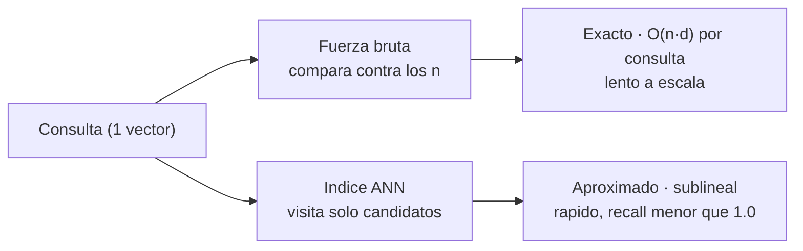
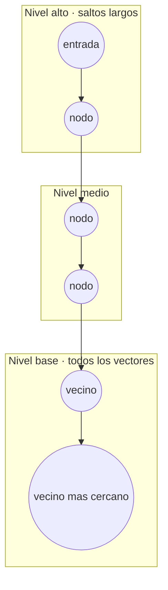
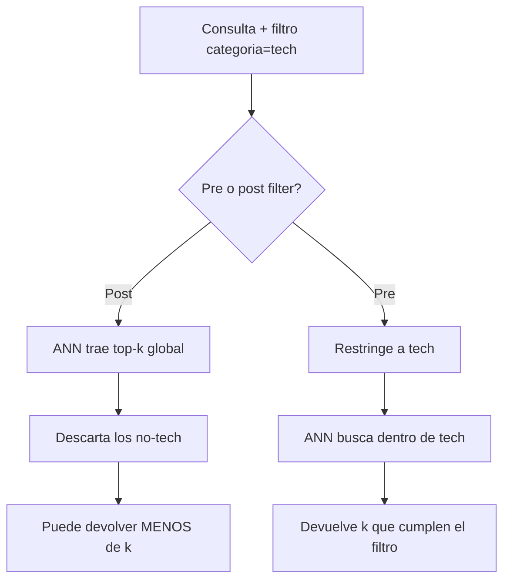
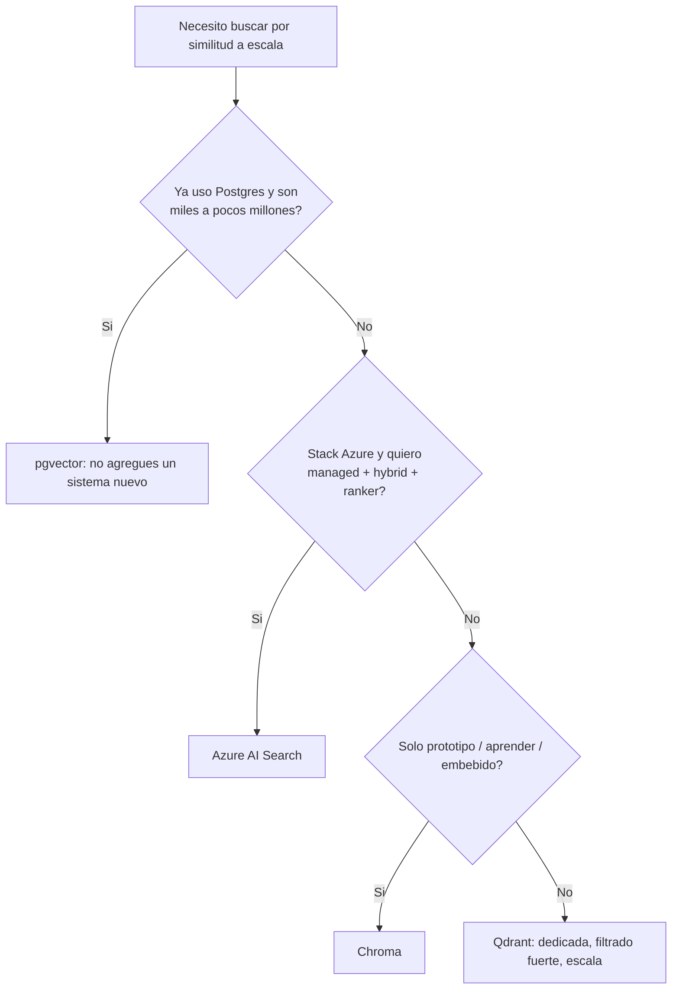

import Nivel from "@components/Nivel.astro";
import Reto from "@components/Reto.astro";
import Solucion from "@components/Solucion.astro";
import Quiz from "@components/Quiz.astro";
import CheckDominio from "@components/CheckDominio.astro";

<Nivel nivel="intermedio" />

En [6.5](/fase-6-ai-engineering/6-5-embeddings-busqueda-semantica/) escribiste un
`buscar(consulta, corpus, k)` que recorría **todo** el corpus, calculaba el coseno
contra cada vector y devolvía el top-k. Funciona perfecto con mil chunks. Con diez
millones, ese mismo bucle tarda **segundos por consulta** y se cae bajo carga. Esta
lección trata de dónde **viven** esos vectores cuando son muchos y cómo se buscan en
**milisegundos**: la **vector database**. Vas a ver que el corazón de una vector DB
no es "una tabla con una columna de floats" — es el **índice ANN** que cambia
exactitud por velocidad, y entender ese trade-off (y cómo filtrarlo por metadata sin
romperlo) es justo lo que separa a quien "usó una vector DB" de quien sabe **operarla
y defenderla**.

## Objetivos de esta lección

Al terminar deberías ser capaz de:

- **O1 — Explicar** por qué la búsqueda exacta por fuerza bruta no escala y qué
  resuelve un **índice ANN** (approximate nearest neighbor), incluyendo el trade-off
  **velocidad / recall / memoria** entre **HNSW** e **IVFFlat**.
- **O2 — Implementar** una búsqueda vectorial **con filtro de metadata** en una vector
  DB (pgvector como troncal, que conecta con tu Postgres de la
  [Fase 3](/fase-6-ai-engineering/6-3-apis-llm/)), eligiendo la **métrica de distancia**
  correcta.
- **O3 — Elegir** entre pgvector, Qdrant, Chroma y Azure AI Search para un caso
  concreto nombrando la **restricción dominante**, y reconocer un riesgo de
  **vector/embedding weakness** (envenenamiento, fuga) que conecta con
  [6.14](/fase-6-ai-engineering/6-14-seguridad-llm/).

## Por qué esto importa (y paga)

El retrieval es donde un RAG vive o muere, y a escala el retrieval **es** la vector
DB. Cuando en una entrevista te digan "tu RAG está lento", "se nos disparó el costo de
infra" o "a veces no encuentra el documento que sí existe", la mitad de la respuesta
está en esta lección: ¿qué índice usas?, ¿cuánta RAM consume?, ¿estás filtrando antes
o después de buscar?, ¿qué recall mides? Quien responde "subí `lists` y bajó el recall,
así que migré a HNSW y ajusté `ef`" no es un usuario de una librería: es un AI Engineer
que entiende la máquina por debajo. Ese es el premium. Y el lado oscuro —que casi nadie
menciona— es que **una vector DB mal aislada filtra datos entre clientes** y **un corpus
sin control de ingreso se puede envenenar**: saber eso te separa del 80% que solo sabe
hacer `add()` y `query()`.

> [!tip] GLaDOS dice
> Tu bucle de 6.5 es honesto: compara contra todos, nunca se equivoca. También es
> lento como caminar revisando cada expediente de un archivo de diez millones de
> carpetas. Una vector DB construye un mapa que te lleva _casi_ siempre al estante
> correcto sin mirar el resto. "Casi" es la palabra que vas a aprender a medir hoy.
> Spoiler: la perfección es cara y rara vez necesaria.

## Lo que ya traes (activación)

Recupera **de memoria**, sin abrir las notas, tres ideas previas:

1. De [6.5](/fase-6-ai-engineering/6-5-embeddings-busqueda-semantica/): tu función
   `buscar` calculaba el coseno de la consulta contra **cada** vector del corpus. Si
   el corpus tiene `n` vectores de `d` dimensiones, ¿cuántas operaciones hace por
   consulta, en términos de `n` y `d`?
2. De [6.5](/fase-6-ai-engineering/6-5-embeddings-busqueda-semantica/): junto a cada
   vector guardabas el **texto del chunk y su documento de origen** (metadata). ¿Por
   qué esa metadata no es opcional?
3. De la [Fase 3 (bases de datos)](/fase-6-ai-engineering/6-3-apis-llm/): en SQL, una
   columna sin índice obliga a un _full table scan_; un **índice** (B-tree) hace que
   `WHERE id = 42` sea casi instantáneo. ¿Qué es, en una frase, "un índice"?

Lo de hoy es la fusión de las tres: el costo `n·d` por consulta (1) es exactamente lo
que el **índice ANN** ataca; la metadata (2) se vuelve **filtro** y, además, **control
de seguridad**; y la idea de "índice = estructura que evita revisar todo" (3) es la
misma de la Fase 3, ahora aplicada a "encontrar el vector más cercano" en vez de "el id
exacto".

## Worked example 1: por qué tu bucle de 6.5 se muere a escala

Te muestro el razonamiento completo antes de pedirte nada. Tu `buscar` de 6.5 es una
**búsqueda exacta por fuerza bruta** (también llamada _flat_ o _kNN exacto_): mira los
`n` vectores, sin excepción.

> _Pienso en voz alta:_ cada comparación de coseno toca las `d` dimensiones del vector.
> Con `n` vectores, son del orden de `n · d` operaciones **por consulta**. Pongamos
> números reales: `n = 10.000.000` chunks, `d = 1536` (un embedding de OpenAI). Eso es
> ~15 mil millones de multiplicaciones por **cada** búsqueda. Un servidor hace eso en
> segundos, no milisegundos — y si llegan 100 consultas por segundo, se desploma. La
> exactitud no me sirve si la respuesta llega tarde.

La salida es **dejar de mirar todo**. Un índice **ANN** (_Approximate Nearest
Neighbor_) organiza los vectores en una estructura que, dada una consulta, visita solo
un **puñado** de candidatos prometedores y devuelve los vecinos más cercanos **casi
siempre**. Cambias una pizca de exactitud por **órdenes de magnitud** de velocidad.

> _Pienso en voz alta:_ la palabra clave es **approximate**. El índice puede saltarse
> el verdadero vecino más cercano de vez en cuando. ¿Cuánto se lo salta? Eso se llama
> **recall**: de los `k` vecinos verdaderos (los que daría la fuerza bruta), ¿qué
> fracción encontró el índice? Recall de 0.98 = encontró 98 de cada 100. Y aquí está lo
> que casi nadie dice en voz alta: el recall **se mide**, se ajusta con parámetros, y
> un recall perfecto rara vez vale lo que cuesta en latencia y RAM.



Esta es la idea central de toda la lección: **una vector database es, en esencia, un
índice ANN sobre tus vectores, más metadata, más una API para consultarlo**. El resto
(persistencia, filtros, replicación) es plomería importante alrededor de ese núcleo.

## Worked example 2: la misma búsqueda, ahora en pgvector

Vamos a lo concreto con **pgvector**, la extensión que convierte tu Postgres (el de la
Fase 3) en una vector DB. La elijo de primera porque no agrega un sistema nuevo: si ya
tienes Postgres, ya casi tienes una vector DB.

**Paso 1 — activar la extensión y crear la tabla.** Una columna `vector(d)` guarda el
embedding; las demás columnas son tu metadata de toda la vida.

```sql
CREATE EXTENSION IF NOT EXISTS vector;

CREATE TABLE documentos (
    id        bigserial PRIMARY KEY,
    texto     text        NOT NULL,
    categoria text        NOT NULL,
    embedding vector(1536)            -- la dimension DEBE calzar con tu modelo
);
```

> _Pienso en voz alta:_ el `1536` no es decorativo: es la dimensión de
> `text-embedding-3-small`. Si mañana cambio de modelo de embeddings, cambia `d` y
> tengo que **re-embeber todo** (la regla de oro de 6.5). La dimensión es un contrato.

**Paso 2 — buscar los vecinos más cercanos.** pgvector añade operadores de distancia.
Los tres que usarás:

| Operador | Distancia | Cuándo |
|---|---|---|
| `<=>` | **coseno** | El default para embeddings de texto |
| `<#>` | producto interno **negado** | Vectores normalizados (más barato; ver abajo) |
| `<->` | **L2** / euclidiana | Cuando la magnitud sí importa |

El operador devuelve **distancia** (menor = más cercano), así que ordenas ascendente. La
similitud coseno que conoces de 6.5 es `1 - (embedding <=> consulta)`:

```sql
-- :consulta es el embedding de la pregunta, como literal vector
SELECT
    texto,
    1 - (embedding <=> :consulta) AS similitud   -- 1 - distancia = coseno
FROM documentos
ORDER BY embedding <=> :consulta                 -- ascendente: el mas cercano primero
LIMIT 5;
```

> _Pienso en voz alta:_ tal como está, esta consulta **es fuerza bruta**: sin índice,
> Postgres calcula la distancia contra cada fila (un _sequential scan_). Da el resultado
> **exacto** y a 5.000 filas va perfecto. A 5 millones, hay que indexar.

**Paso 3 — el índice ANN (lo que hace de esto una vector DB de verdad).**

```sql
-- HNSW para distancia coseno (debe calzar con el operador <=> de la consulta)
CREATE INDEX ON documentos USING hnsw (embedding vector_cosine_ops);
```

> _Pienso en voz alta:_ tres sutilezas que se cobran caro si las ignoras. (1) El
> `vector_cosine_ops` del índice **debe** corresponder al operador de la consulta
> (`<=>`): si indexo con `vector_l2_ops` pero consulto con `<=>`, Postgres **ignora el
> índice** y vuelve al scan lento, sin avisar. (2) Ahora la misma consulta del paso 2
> usa el índice y es **aproximada**: rapidísima, recall menor que 1.0. (3) El recall se
> ajusta en tiempo de consulta con `SET hnsw.ef = 100;` (más alto = más recall, más
> lento).

**Paso 4 — filtrar por metadata.** Esto es lo que hace útil una vector DB real: "los
documentos más parecidos **dentro de la categoría tech**".

```sql
SELECT texto, 1 - (embedding <=> :consulta) AS similitud
FROM documentos
WHERE categoria = 'tech'          -- filtro de metadata
ORDER BY embedding <=> :consulta
LIMIT 5;
```

Desde Python, con el adaptador oficial `pgvector` sobre `psycopg`, pasas listas o arrays
de floats directo (no strings que armas a mano):

```python
import psycopg
from pgvector.psycopg import register_vector

conn = psycopg.connect("postgresql://localhost/midb")
register_vector(conn)  # ahora puedes pasar listas/np.array como vector

filas = conn.execute(
    """
    SELECT texto, 1 - (embedding <=> %(q)s) AS similitud
    FROM documentos
    WHERE categoria = %(cat)s
    ORDER BY embedding <=> %(q)s
    LIMIT 5
    """,
    {"q": consulta_emb, "cat": "tech"},  # consulta_emb: lista de 1536 floats
).fetchall()
```

Ese filtro `categoria = 'tech'` parece trivial. No lo es: **cómo** lo combina la base
con el índice ANN es uno de los temas más sutiles de toda la lección, y lo vemos en un
momento.

## El índice es la vector DB: HNSW vs IVFFlat

Las vector DBs serias te dejan elegir el tipo de índice ANN. Los dos que vas a ver en
casi todas (pgvector, Qdrant, etc.) son **HNSW** e **IVFFlat**. No hay "el mejor":
hay un trade-off de tres ejes — **velocidad de consulta**, **recall** y **memoria/tiempo
de construcción**.

**HNSW** (_Hierarchical Navigable Small World_) construye un **grafo de varios niveles**:
arriba, pocos nodos con saltos largos (como las autopistas de un mapa); abajo, todos los
nodos con saltos cortos (las calles). Una búsqueda entra por arriba, salta rápido a la
zona correcta y va bajando hasta afinar.



**IVFFlat** (_Inverted File_) hace algo distinto: **divide el espacio en celdas**
(clusters) con `lists` centroides. Al buscar, va solo a las `probes` celdas más cercanas
a la consulta y compara dentro de ellas, ignorando el resto.

| Eje | **HNSW** | **IVFFlat** |
|---|---|---|
| Recall a buena velocidad | Alto (el mejor de los dos) | Bueno si tuneas `probes`; baja si no |
| Velocidad de consulta | Muy rápida | Rápida |
| **Memoria** | **Alta** (guarda el grafo) | Baja |
| **Tiempo de construcción** | Lento | Rápido |
| ¿Necesita datos para construir? | **No** (se llena incremental) | **Sí**: los centroides se calculan sobre datos ya cargados |
| Parámetros de build | `m`, `ef_construction` | `lists` |
| Parámetro de consulta | `hnsw.ef` (más = más recall) | `ivfflat.probes` (más = más recall) |

> _Pienso en voz alta:_ la regla práctica que defiendo en entrevista: **empiezo con
> HNSW**. Da el mejor recall por unidad de latencia y no exige tener datos antes de
> indexar (lo lleno como quiera). El precio es RAM: el grafo vive en memoria. Si la
> memoria es mi cuello de botella —millones de vectores en una máquina chica— miro
> IVFFlat, que ocupa mucho menos, a cambio de tunear `probes` para recuperar recall. Y
> un detalle de IVFFlat que muerde a los novatos: si construyes el índice sobre una
> tabla **vacía** (o con pocos datos), los centroides salen malos y el recall se
> desploma; hay que (re)construirlo **con datos representativos ya dentro**.

> [!warning] Atención — el índice no es gratis ni instantáneo
> Un índice ANN ocupa disco/RAM y tarda en construirse sobre millones de vectores.
> Además, **insertar** vectores nuevos lo mantiene actualizado pero tiene costo. No es
> "lo creo y me olvido": es una decisión de arquitectura con presupuesto de memoria y
> de tiempo de ingest. Esto entra en tu budget de
> [costo/latencia](/fase-6-ai-engineering/6-16-costo-latencia-llmops/) (6.16).

## Métricas de distancia: coseno, producto interno, L2

El índice y la consulta deben usar **la misma** métrica, y debe ser la métrica para la
que tu modelo de embeddings fue entrenado. Las tres comunes:

- **Coseno** — mide el ángulo (la dirección). Es el default para texto y lo que usaste
  en 6.5. Ignora la magnitud.
- **Producto interno (dot product)** — más barato de calcular. **Para vectores
  normalizados** (magnitud 1), ordena _idéntico_ al coseno. Los embeddings de OpenAI
  vienen normalizados → puedes usar producto interno y ahorrar cómputo sin cambiar el
  ranking.
- **L2 (euclidiana)** — la distancia "en línea recta". Útil cuando la magnitud importa;
  poco común para embeddings de texto.

:::caution[Misconception — "la métrica da igual, total comparo vectores"]
Falso y silencioso. Si tu modelo se entrenó para coseno y tú indexas/consultas con L2,
el ranking sale **subóptimo** y nadie te tira un error: solo notas que el retrieval "anda
raro". Peor aún en pgvector: si el `*_ops` del índice no calza con el operador de la
consulta, **la base ignora el índice** y vuelve a fuerza bruta (lento) sin avisar.
Verifica siempre: misma métrica en el modelo, el índice y la consulta.
:::

## Filtrado por metadata: pre-filter vs post-filter

Aquí está el detalle que separa el demo del sistema de producción. Quieres "los 5 más
parecidos **de la categoría tech**". Hay dos formas de combinar el filtro con la
búsqueda ANN, y **dan resultados distintos**:

- **Post-filter** (filtrar **después**): el índice trae el top-k global, y _luego_
  descartas los que no son tech. Problema: si de los 5 que trajo solo 1 era tech, te
  quedas con **1 resultado**, aunque existan 50 documentos tech relevantes que el índice
  no devolvió.
- **Pre-filter** (filtrar **antes** / durante): la base restringe primero al subconjunto
  tech y busca los vecinos **dentro** de él. Siempre te da los `k` mejores que cumplen el
  filtro.



> _Pienso en voz alta:_ el post-filter ingenuo es el bug de retrieval más común que verás
> en RAG. "Mi sistema a veces devuelve un solo documento" casi siempre es esto. Por eso
> las vector DBs maduras (Qdrant, Azure AI Search) hacen **filtered search** integrada al
> índice, no post-filter a ciegas. En pgvector, poner el `WHERE` y dejar que el
> planificador combine el filtro con el índice HNSW resuelve la mayoría de los casos; en
> volúmenes grandes con filtros muy selectivos hay técnicas específicas (índices
> parciales, `iterative scan`) que profundizas cuando duele.

Y hay una segunda cara, de **seguridad**: cuando el filtro es `tenant_id = 'cliente-A'`,
ese `WHERE` no es relevancia, es **aislamiento de datos**. Un post-filter mal hecho —o
peor, un filtro ausente— puede devolver documentos de **otro cliente**. Lo retomamos en
la sección de debilidades.

## El panorama 2026: pgvector, Qdrant, Chroma, Azure AI Search

Cuatro opciones que cubren casi todos los casos. Los nombres y precios cambian rápido —
**verifica la doc oficial al decidir** —, pero el criterio de elección es estable.

**pgvector — tu Postgres se vuelve vector DB.** Cero sistemas nuevos: las mismas
transacciones, backups, joins y `WHERE` de siempre, ahora con vectores. Ideal cuando ya
usas Postgres y hablas de miles a unos pocos millones de vectores. (Código completo
arriba.)

**Qdrant — vector DB dedicada, foco en filtrado y escala.** Open-source, escrita en Rust,
self-host o cloud. Filtrado por payload muy potente, hybrid search nativo, cuantización
para ahorrar RAM. API verificada (2026):

```python
from qdrant_client import QdrantClient, models

client = QdrantClient(":memory:")  # o QdrantClient(url="http://localhost:6333")

client.create_collection(
    collection_name="documentos",
    vectors_config=models.VectorParams(size=1536, distance=models.Distance.COSINE),
    hnsw_config=models.HnswConfigDiff(m=16, ef_construct=100),
)

client.upsert(
    collection_name="documentos",
    points=[
        models.PointStruct(
            id=1,
            vector=emb,                       # lista de 1536 floats
            payload={"texto": "...", "categoria": "tech"},
        ),
    ],
)

resultado = client.query_points(
    collection_name="documentos",
    query=consulta_emb,
    query_filter=models.Filter(                       # filtrado integrado al indice
        must=[models.FieldCondition(
            key="categoria",
            match=models.MatchValue(value="tech"),
        )]
    ),
    limit=5,
)
for punto in resultado.points:
    print(punto.score, punto.payload["texto"])
```

**Chroma — la más simple para empezar y prototipar.** Embebida en tu proceso Python
(o como servidor), persistencia en disco con una línea. Perfecta para aprender y para los
primeros pasos de un RAG; a escala muy grande migras a algo dedicado. API verificada
(2026):

```python
import chromadb

client = chromadb.PersistentClient(path="./chroma-db")
coleccion = client.create_collection(
    name="documentos",
    configuration={"hnsw": {"space": "cosine"}},   # metrica del indice
)

coleccion.add(
    ids=["d0", "d1"],
    embeddings=[emb0, emb1],                        # tus vectores
    documents=["Optimice el gasto en tokens", "Mi gato duerme"],
    metadatas=[{"categoria": "tech"}, {"categoria": "gatos"}],
)

res = coleccion.query(
    query_embeddings=[consulta_emb],
    n_results=5,
    where={"categoria": "tech"},                    # filtro de metadata
)
print(res["documents"], res["distances"])
```

**Azure AI Search — el camino managed, sobre todo si tu stack es Azure.** Servicio
gestionado (no operas infra): indexa con HNSW por debajo, integra **vectorización** con
Azure OpenAI, ofrece **hybrid search** (vector + BM25) y un **semantic ranker** de fábrica,
y controla acceso con RBAC. El trade-off honesto: menos control de bajo nivel y costo de
servicio, a cambio de no mantener nada. Como su API y sus tiers cambian seguido, **úsalo
desde la doc oficial** en vez de memorizar llamadas; conceptualmente es lo mismo que viste
(colección + vectores + filtro + métrica), envuelto en un servicio.

## Cómo elegir (sin marketing)

No existe "la mejor vector DB". Existe la que calza con tu **restricción dominante**.



| Restricción dominante | Elección razonable |
|---|---|
| "Ya tengo Postgres, no quiero operar otra cosa" | **pgvector** |
| Escala grande + filtrado avanzado + hybrid nativo | **Qdrant** (u otra dedicada) |
| Empezar hoy, prototipo local, mínima fricción | **Chroma** |
| Stack Azure, managed, sin operar infra | **Azure AI Search** |

> [!info] El error de arquitectura más caro aquí
> Agregar una vector DB dedicada "porque es lo que se usa" cuando ya tienes Postgres y
> un millón de vectores es **complejidad operacional regalada**: otro servicio que
> respaldar, monitorear, actualizar y asegurar. pgvector resuelve una enorme cantidad de
> casos reales. Gradúate a una dedicada cuando un **número** lo exija (recall, latencia
> p95, RAM), no cuando un blog lo sugiera. Esa decisión se escribe en un
> **[ADR](/fase-6-ai-engineering/6-3-apis-llm/)**.

## Debilidades de vectores y embeddings (seguridad)

Una vector DB introduce superficie de ataque propia. OWASP la nombra explícitamente
(_Vector and Embedding Weaknesses_). Tres que un semi-senior debe poder explicar — y que
profundizas en [6.14](/fase-6-ai-engineering/6-14-seguridad-llm/):

1. **Envenenamiento del índice (data/index poisoning).** Si un atacante puede **insertar
   documentos** en tu corpus (un formulario, un correo, una wiki abierta), puede plantar
   contenido que **se recuperará** y guiará al LLM: desinformación, o instrucciones
   ocultas que el modelo obedece (esto enlaza con _prompt injection_ vía contenido
   recuperado, de [6.2](/fase-6-ai-engineering/6-2-prompt-context-engineering/)).
   Mitigación: **autenticar y validar las fuentes de ingest**, procedencia del contenido,
   y tratar lo recuperado como **no confiable** antes de pasarlo al modelo.
2. **Fuga por inversión de embeddings (embedding leakage).** Un embedding **no es
   anónimo**: se puede reconstruir parcialmente el texto original a partir del vector.
   Guardar embeddings de datos sensibles **es** guardar los datos sensibles. Mitigación:
   cifrado en reposo, control de acceso a la base, y no asumir que "es solo un montón de
   números".
3. **Fuga entre inquilinos (multi-tenant leakage).** En una base compartida por varios
   clientes, **olvidar el filtro `tenant_id`** —o hacerlo con post-filter ingenuo—
   devuelve documentos de otro cliente. Aquí el **pre-filter no es performance, es un
   control de seguridad**. Mitigación: filtrado server-side por tenant, idealmente con
   colecciones/particiones separadas para datos críticos.

:::caution[Misconception — "los embeddings son datos anonimizados, no hay riesgo de privacidad"]
Peligrosamente falso. Existen ataques de **inversión** que recuperan texto fuente desde
embeddings. A efectos de privacidad y cumplimiento, trata tu vector DB con el **mismo**
nivel de protección que la base de datos original de la que salieron esos textos.
:::

## Lo que parece cierto pero no lo es

:::caution[Misconception 1 — "una vector DB es solo una tabla con una columna de floats"]
Esa tabla existe, pero no es lo que importa. Sin **índice ANN**, buscar es fuerza bruta
`O(n·d)`. Lo que define a una vector DB es el índice (HNSW/IVFFlat) y cómo combina
búsqueda aproximada con filtros. La columna es el "qué"; el índice es el "cómo, rápido".
:::

:::caution[Misconception 2 — "ANN siempre devuelve el vecino más cercano exacto"]
No. La A es de **Approximate**. Puede saltarse el verdadero más cercano; cuánto, lo mides
con **recall@k**. Si necesitas exactitud garantizada (datasets chicos, casos legales),
usa búsqueda **exacta/flat** y acepta que no escala. Para RAG, recall de 0.95–0.99 suele
sobrar — pero el número lo decides tú, con un [eval](/fase-6-ai-engineering/6-9-eval-driven-development/), no de memoria.
:::

:::caution[Misconception 3 — "HNSW es siempre mejor que IVFFlat"]
HNSW suele ganar en recall por latencia, **pero** se come la RAM (guarda el grafo) y
tarda más en construir. Con millones de vectores y memoria limitada, IVFFlat (más
compacto) con `probes` bien tuneado puede ser la decisión correcta. "Mejor" depende de
cuál de los tres ejes —velocidad, recall, memoria— es tu cuello de botella.
:::

:::caution[Misconception 4 — "el filtro de metadata es gratis y no afecta el resultado"]
Falso. **Cuándo** filtras (pre vs post) cambia los resultados: el post-filter ingenuo
puede devolverte menos de `k` documentos aunque existan más que califican. Y cuando el
filtro es `tenant_id`, hacerlo mal es una **fuga de datos**, no solo un bug de relevancia.
:::

## Práctica con andamiaje (predecir antes de medir)

Antes de tocar código, **predice**. Anota tu respuesta y una línea de razonamiento (PRIMM:
_Predict_ antes que _Run_).

1. **Escala.** Corpus de `n = 5.000.000` vectores, `d = 1024`. Tu `buscar` de 6.5 hace
   ~`n·d` operaciones por consulta. ¿Por qué un índice ANN puede responder mirando solo
   unos miles de candidatos en vez de los 5 millones? (No des fórmula; explica la idea.)
2. **Métrica.** Indexaste con `vector_l2_ops` (L2) pero tu consulta usa el operador `<=>`
   (coseno). ¿Qué pasa con (a) el ranking y (b) el uso del índice en pgvector?
3. **Pre/post-filter.** Pides top-5 con filtro `categoria='tech'`. El índice trae estos 5
   globales con su categoría: `[A:tech, B:gatos, C:gatos, D:tech, E:gatos]`. ¿Cuántos
   resultados te quedan con **post-filter**? ¿Por qué el **pre-filter** habría devuelto 5?

<Solucion title="Ver razonamiento (ábrelo solo después de intentarlo)">
1. El índice **no compara contra todos**: organiza los vectores por cercanía (grafo en
   HNSW, celdas en IVFFlat) y la búsqueda navega solo la región del espacio cercana a la
   consulta, descartando de un saque el resto. Cambias exactitud (recall menor que 1.0)
   por visitar un puñado de candidatos en vez de millones.
2. (a) El **ranking sale subóptimo**: ordenas por una distancia para la que el modelo no
   fue entrenado. (b) En pgvector, el operador de la consulta (`<=>`) no calza con el
   `*_ops` del índice (`vector_l2_ops`), así que **el índice se ignora** y vuelve a
   fuerza bruta (lento), sin error visible.
3. Con **post-filter**: de los 5 globales solo A y D son tech → te quedan **2**
   resultados, aunque puede haber más documentos tech relevantes que el índice no trajo en
   ese top-5. Con **pre-filter** restringes a tech **antes** de buscar, así que el ANN
   devuelve los 5 mejores **dentro** de tech.
</Solucion>

## Ejercicios Primero-Sin-IA

Dos entregables. Trabájalos **a mano primero**, sin IA, dentro del timebox. Las carpetas
viven en tu repo: ábrelas en VS Code.

<Reto title="Mide el recall de un índice y filtra por metadata sin romperlo" timebox="45 min">

Carpeta: `ejercicios/fase-6/recall-y-filtrado/`

No vas a levantar una base: vas a implementar, en Python puro, las tres ideas que hacen
funcionar (o fallar) a una vector DB, de forma **determinista y offline**. Recibes
vectores pequeños ya calculados; tu trabajo es la lógica de ingeniería.

En `recall.py` completa tres funciones (no cambies las firmas):

1. `buscar_exacto(consulta, corpus, k)` — fuerza bruta: el top-k `(indice, score)` por
   coseno, de mayor a menor. Es tu **ground truth** (reusa el coseno de 6.5).
2. `recall_at_k(ids_aprox, ids_exactos)` — dada la lista de ids que devolvió un índice
   aproximado y la lista de ids exactos (ground truth), devuelve la **fracción** de los
   exactos que el aproximado encontró (un float en `[0, 1]`).
3. `buscar_con_filtro(consulta, corpus, metadatas, where, k, modo)` — busca el top-k pero
   respetando un filtro de metadata (`where` es un dict como `{"categoria": "tech"}`).
   Implementa los dos modos: `"pre"` (filtra el corpus **antes** de rankear → siempre da
   hasta `k` que cumplen) y `"post"` (rankea el top-k global **y luego** descarta los que
   no cumplen → puede devolver menos de `k`).

**Criterios de "hecho":**
- [ ] Todos los tests pasan (`pytest`).
- [ ] `recall_at_k` maneja el caso de lista exacta vacía sin dividir por cero.
- [ ] `buscar_con_filtro` en modo `"post"` puede devolver **menos** de `k`, y en `"pre"`
      devuelve hasta `k` que cumplen el filtro.
- [ ] Agregaste **un test borde tuyo** (¿recall cuando el aproximado acierta todo? ¿pre-filter
      que deja el corpus vacío?).
- [ ] Puedes **explicar sin notas** por qué el post-filter ingenuo es un bug de retrieval
      y por qué, cuando el filtro es `tenant_id`, además es un problema de seguridad.

Cuando termines, pídele a tu IA que lo corrija con el framework de `.ai/`.

</Reto>

<Solucion title="Pista (NO la solución): si te traba el pre/post-filter">
Piensa en el **orden de dos pasos**: "filtrar el corpus" y "rankear por coseno". En
`"pre"` filtras primero (te quedas con los índices cuya metadata cumple `where`) y
rankeas **solo esos**, devolviendo hasta `k`. En `"post"` rankeas **todo** el corpus,
tomas el top-k global y **recién ahí** descartas los que no cumplen `where` — por eso
puedes terminar con menos de `k`. Cuida una cosa: el resultado debe conservar el **índice
original** del documento en el corpus, no la posición dentro del subconjunto filtrado.
</Solucion>

<Reto title="Decisión: vector DB + índice + métrica + filtrado para tres escenarios" timebox="35 min">

Carpeta: `ejercicios/fase-6/eleccion-vector-db/`

Ejercicio de **diseño/razonamiento** (sin código). En `decisiones.md` resuelves tres
escenarios. Para cada uno eliges y **justificas**: vector DB (pgvector / Qdrant / Chroma /
Azure AI Search), tipo de índice (**HNSW vs IVFFlat** y por qué), métrica de distancia,
estrategia de filtrado (pre vs post y qué metadata), la **restricción dominante**
(privacidad / costo / latencia / memoria / escala / operación), y **un riesgo de
vector/embedding weakness** (envenenamiento / fuga / multi-tenant) con su mitigación. Los
escenarios y la plantilla exacta están en el `README.md`.

**Criterios de "hecho":**
- [ ] Los tres escenarios resueltos con la plantilla completa.
- [ ] Cada elección de DB e índice nombra la **restricción dominante**, no "el mejor".
- [ ] Cada escenario nombra **un riesgo de seguridad** concreto del vector store y su
      mitigación.
- [ ] Al menos un escenario justifica HNSW vs IVFFlat por **memoria** o por
      **tiempo/datos de construcción**, no solo "es más rápido".

</Reto>

## Check de dominio

<CheckDominio
  title="Marca solo lo que puedes EXPLICAR sin notas"
  items={[
    "Explicar por qué la búsqueda exacta por fuerza bruta no escala (en términos de n y d).",
    "Definir recall@k y por qué un índice ANN tiene recall menor que 1.0.",
    "Comparar HNSW vs IVFFlat en los tres ejes: velocidad, recall y memoria/construcción.",
    "Explicar por qué la métrica del índice debe calzar con la del operador de consulta.",
    "Explicar la diferencia entre pre-filter y post-filter y cuándo el post-filter es un bug.",
    "Nombrar una vector/embedding weakness (envenenamiento o fuga) y su mitigación.",
    "Elegir entre pgvector, Qdrant, Chroma y Azure AI Search nombrando la restricción dominante.",
  ]}
/>

Y dos preguntas rápidas de recuperación:

<Quiz
  question="Tienes 8 millones de vectores en una sola máquina con poca RAM y el recall actual es aceptable. Tu cuello de botella es la memoria. ¿Qué decisión de índice es la más defendible?"
  options={[
    "HNSW siempre, porque da el mejor recall por latencia, sin importar la RAM.",
    "IVFFlat: ocupa bastante menos memoria que el grafo de HNSW; tuneas `probes` para recuperar recall.",
    "No usar índice: la fuerza bruta exacta es la única forma seria a esa escala.",
  ]}
  answer={1}
  explanation="HNSW guarda un grafo en memoria (alta RAM). Si la memoria es el cuello de botella, IVFFlat es más compacto; el precio es tunear `probes` para mantener el recall. 'Mejor índice' depende de cuál de los tres ejes te limita."
/>

<Quiz
  question="Un RAG multi-tenant a veces devuelve documentos de OTRO cliente. Revisas y el filtro por tenant se aplica como post-filter sobre el top-k del índice. ¿Cuál es el diagnóstico correcto?"
  options={[
    "Es solo un problema de relevancia; sube k y se arregla.",
    "El filtrado por tenant debe ser pre-filter (o particiones por tenant): aplicarlo después del ANN es a la vez un bug de retrieval y una FUGA DE DATOS entre clientes.",
    "Los embeddings están corruptos; hay que re-embeber todo el corpus.",
  ]}
  answer={1}
  explanation="Cuando el filtro es tenant_id, no es relevancia: es aislamiento. El post-filter puede dejar pasar documentos de otro tenant y devolver menos resultados. La mitigación es pre-filter server-side o colecciones separadas por tenant (conecta con 6.14)."
/>

:::tip[Si ya tocaste pgvector, Qdrant o Azure AI Search]
Quizá ya guardaste embeddings en una base y corriste un `query`. **Valida y salta:**
¿puedes defender en una entrevista, sin notas, (1) qué índice usaste y por qué (HNSW vs
IVFFlat, en los tres ejes), (2) por qué tu filtro de metadata es pre o post y qué pasa si
te equivocas, y (3) qué riesgo de privacidad/seguridad introduce **tener** los embeddings
en esa base? Si las tres te salen con ejemplos, usa los ejercicios para auditar tu propio
índice (mide su recall de verdad). Si alguna se siente borrosa, ahí está tu hueco.
:::

## Recursos

Documentación oficial primero; los benchmarks y blogs caducan rápido.

- **pgvector:** el [README oficial](https://github.com/pgvector/pgvector) — operadores de
  distancia, creación de índices HNSW/IVFFlat, parámetros `m`/`ef_construction`/`lists` y
  el adaptador `pgvector-python`.
- **Qdrant:** la [documentación oficial](https://qdrant.tech/documentation/) — colecciones,
  `query_points`, filtrado por payload, configuración de HNSW y cuantización.
- **Chroma:** la [documentación oficial](https://docs.trychroma.com/) — `PersistentClient`,
  `configuration` del índice, `add` y `query` con `where`.
- **Azure AI Search (vector search):** la
  [doc oficial de búsqueda vectorial](https://learn.microsoft.com/azure/search/vector-search-overview)
  — índices vectoriales, hybrid search y semantic ranker.
- **HNSW (el paper):** "Efficient and robust ANN using Hierarchical Navigable Small World
  graphs" (Malkov & Yashunin) — opcional, para entender el grafo por dentro.

> Mantén tus links vivos en `articulos.md` dentro de la carpeta de esta sub-unidad.
> Prefiere siempre la fuente oficial; los nombres de tiers y precios cambian seguido.

## Conexión con el proyecto de la fase

El capstone de la Fase 6 es una
[**Plataforma RAG de producción**](/fase-6-ai-engineering/proyecto/). Esta lección es el
**store** de ese proyecto: los chunks que embebiste en
[6.5](/fase-6-ai-engineering/6-5-embeddings-busqueda-semantica/) aterrizan aquí, en una
vector DB con un índice elegido a conciencia. Tres entregables del proyecto nacen de esta
lección: (1) la **elección de DB + índice + métrica** es un
[**ADR**](/fase-6-ai-engineering/6-3-apis-llm/) que tendrás que defender; (2) el **recall**
de tu retrieval es una métrica que tu
[eval harness](/fase-6-ai-engineering/6-9-eval-driven-development/) (6.9) va a medir, y el
costo/memoria del índice entra en tu
[budget de costo/latencia](/fase-6-ai-engineering/6-16-costo-latencia-llmops/) (6.16); y
(3) el **filtrado por tenant** y las **debilidades de embeddings** son parte de la
seguridad ([6.14](/fase-6-ai-engineering/6-14-seguridad-llm/)) que el Definition of Done
exige. En [6.7 · RAG a fondo](/fase-6-ai-engineering/6-7-rag-a-fondo/) pondrás encima de
este store el hybrid search y el reranking.

## Reflexión y repaso espaciado

Antes de cerrar, responde en tu cuaderno o en `articulos.md`:

- Para un proyecto tuyo que indexarías (tus apuntes del curso, una base de soporte):
  ¿pgvector o algo dedicado? ¿Qué **número** te haría cambiar de opinión?
- Si tu vector DB guardara correos privados, ¿qué cambiarías sabiendo que un embedding no
  es anónimo?

**Gancho de spaced repetition** — agenda estos repasos:

- **Mañana (+1 día):** sin mirar, dibuja de memoria el flujo `fuerza bruta → índice ANN`
  y explica qué es **recall@k** y por qué es menor que 1.0.
- **En 3 días:** explica en voz alta la tabla HNSW vs IVFFlat en sus tres ejes
  (velocidad, recall, memoria/construcción) y cuándo elegirías cada uno.
- **En 1 semana:** explícale a alguien la diferencia entre pre-filter y post-filter y por
  qué, con `tenant_id`, equivocarse es una fuga de datos. Si lo puedes enseñar, lo
  aprendiste.

Siguiente parada:
[**6.7 · RAG a fondo**](/fase-6-ai-engineering/6-7-rag-a-fondo/), donde este store deja de
ser solo "buscar vectores" y se vuelve un pipeline completo con hybrid search, reranking y
diagnóstico de fallas de retrieval.
