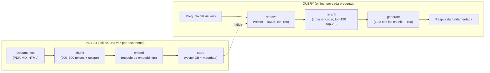
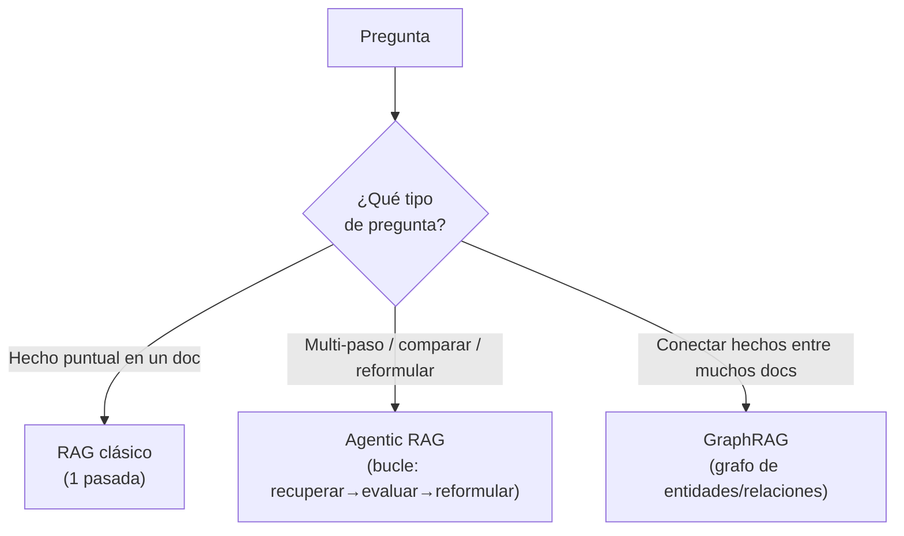

import Nivel from "@components/Nivel.astro";
import Reto from "@components/Reto.astro";
import Solucion from "@components/Solucion.astro";
import Quiz from "@components/Quiz.astro";
import CheckDominio from "@components/CheckDominio.astro";

<Nivel nivel="avanzado" />

En [6.5](/fase-6-ai-engineering/6-5-embeddings-busqueda-semantica/) partiste un
documento en chunks y rankeaste por coseno; en
[6.6](/fase-6-ai-engineering/6-6-vector-databases/) guardaste esos vectores en una
base que busca entre millones en milisegundos. Eso es **la mitad del trabajo**. La
otra mitad es lo que separa un demo que impresiona en una reunión de un sistema que
no devuelve basura en producción: **RAG** (Retrieval-Augmented Generation). En esta
lección armas el pipeline completo —`ingest → chunk → embed → store → retrieve →
rerank → generate`—, aprendes las tres palancas que de verdad mueven la calidad
(**hybrid search**, **reranking**, **metadata filtering**), las técnicas de 2026
(**Contextual Retrieval**, **Agentic RAG**, **GraphRAG**) y, sobre todo, a
**diagnosticar por qué un RAG falla** — la habilidad que distingue al que arma RAGs
del que los repara.

## Objetivos de esta lección

Al terminar deberías ser capaz de:

- **O1 — Explicar** la arquitectura RAG completa de punta a punta y por qué cada
  etapa (chunk, embed, store, retrieve, rerank, generate) puede degradar la calidad
  por separado, ubicando dónde nace cada falla.
- **O2 — Implementar** retrieval híbrido: fusionar un ranking vectorial y uno léxico
  (BM25) con **Reciprocal Rank Fusion**, aplicar **metadata filtering** con cierre
  seguro (_fail-closed_), y justificar cuándo reordenar con un **cross-encoder**.
- **O3 — Diagnosticar** un RAG que falla (recall bajo, contexto irrelevante,
  respuesta sin fundamento) y **elegir** la técnica correcta (hybrid, Contextual
  Retrieval, reranking, Agentic RAG o GraphRAG) defendiendo el trade-off de
  costo/latencia/calidad.

## Por qué esto importa (y paga)

RAG es el patrón de IA más demandado del mercado: la mayoría de las apps de IA
empresariales "preguntale a mis documentos" son RAG por debajo. Pero el 80% de los
portafolios tiene **el mismo RAG genérico que funciona en el happy path y se cae con
preguntas reales**. Lo que un equipo paga por contratar no es "saber llamar a una
vector DB" — es **saber por qué el RAG trae chunks irrelevantes y cómo arreglarlo**.
En una entrevista te van a preguntar "tu RAG devuelve basura, ¿qué revisas
primero?", y la respuesta correcta no es "subo el top-k": es un árbol de diagnóstico
que recorre retrieval, chunking, ranking y generación. Esta lección te da ese árbol.
Es, además, el cimiento del [capstone de la
fase](/fase-6-ai-engineering/proyecto/).

> [!tip] En la práctica
> RAG no es "meter documentos en el prompt". Es un pipeline de información con seis
> puntos donde la calidad puede morir en silencio. El que cree que RAG es una
> librería de tres líneas descubre, en producción, que pasó meses construyendo un
> generador de respuestas confiadamente incorrectas.

## Lo que ya traes (activación)

Recupera **de memoria**, sin abrir notas, cuatro ideas:

1. De [6.5 · Embeddings](/fase-6-ai-engineering/6-5-embeddings-busqueda-semantica/):
   ¿por qué la búsqueda semántica **falla con identificadores exactos**
   (`SKU-99213`, `error E_4521`) y qué se combinaba con ella para arreglarlo?
2. De [6.5](/fase-6-ai-engineering/6-5-embeddings-busqueda-semantica/): ¿por qué un
   chunk demasiado grande **diluye** el vector y uno demasiado chico pierde
   contexto?
3. De [6.1 · Fundamentos de LLMs](/fase-6-ai-engineering/6-1-fundamentos-llms/): el
   _lost in the middle_ — ¿por qué pegarle 50 documentos al prompt empeora la
   respuesta en vez de mejorarla?
4. De [6.2 · Prompt & Context Engineering](/fase-6-ai-engineering/6-2-prompt-context-engineering/):
   ¿por qué el contenido recuperado de documentos es **contenido no confiable** que
   hay que segregar de las instrucciones?

Lo de hoy une las cuatro: el problema de los identificadores (1) es por qué existe
**hybrid search**; el del chunk borroso (2) es por qué existe **Contextual
Retrieval** y el **reranking**; el _lost in the middle_ (3) es por qué se
**recupera mucho y se reduce a poco**; y el contenido no confiable (4) es por qué
RAG es una **superficie de ataque** (lo cierras en
[6.14](/fase-6-ai-engineering/6-14-seguridad-llm/)).

## Qué es RAG y por qué existe

Un LLM solo sabe lo que vio en su entrenamiento: no conoce tus documentos, tus
datos de hoy, ni la política interna de tu empresa. Tienes dos formas de darle ese
conocimiento: **reentrenarlo** ([fine-tuning](/fase-6-ai-engineering/6-13-fine-tuning/),
caro y lento de actualizar) o **buscarle la información relevante en el momento y
pegársela en el prompt**. Esto último es RAG: _Retrieval_ (buscar) _Augmented_
(aumentar el prompt) _Generation_ (generar la respuesta con eso a la vista).

La promesa: respuestas **fundamentadas en tus datos**, **actualizables** (cambias el
documento, no el modelo) y **citables** (sabes de qué chunk salió cada afirmación).
El precio: ahora tienes un **pipeline de información** que mantener, y la calidad de
la respuesta queda limitada por la calidad de lo que recuperas. La regla de oro de
RAG: **garbage in, garbage out** — si el retrieval trae basura, ni el mejor LLM la
salva.

## Worked example 1: el pipeline completo, etapa por etapa

Te muestro el razonamiento de un AI Engineer construyendo RAG, en voz alta, antes de
pedirte que lo hagas. El sistema: un asistente sobre la documentación técnica
interna de una empresa.



> _Pienso en voz alta, etapa por etapa:_
>
> **1. Chunk.** No embebo "el documento": lo parto en trozos de 200–500 tokens con
> solape (lo de [6.5](/fase-6-ai-engineering/6-5-embeddings-busqueda-semantica/)).
> Si corto mal aquí, **todo lo de abajo hereda el problema** — un chunk que parte una
> tabla a la mitad nunca dará una buena respuesta, da igual qué reranker use.
>
> **2. Embed.** Convierto cada chunk en un vector con un modelo de embeddings.
> Recuerdo la regla: **consulta y corpus, el mismo modelo**. Guardo el vector.
>
> **3. Store.** Guardo en la vector DB (6.6) tres cosas por chunk: el **vector**
> (para buscar), el **texto original** (para responder y citar) y la **metadata**
> (`doc_id`, `fecha`, `tenant`, `permisos`). La metadata es lo que después me deja
> filtrar "solo documentos que este usuario puede ver".
>
> **4. Retrieve.** Llega la pregunta. La embebo y busco los vectores más cercanos
> **y** corro BM25 por palabra clave (hybrid). No traigo 5: traigo **150
> candidatos**, porque la primera pasada es rápida pero tosca y prefiero pecar de
> recall (traer de más) antes que perderme el chunk correcto.
>
> **5. Rerank.** 150 chunks son demasiados y muchos son ruido. Un **cross-encoder**
> (lento pero preciso) lee la pregunta **junto a** cada chunk y los reordena;
> me quedo con el **top-20**. Esto sube la precisión sin que la generación pague el
> costo de leer 150 chunks.
>
> **6. Generate.** Le paso al LLM la pregunta + los 20 chunks, con la instrucción
> "responde **solo** con esto y **cita** la fuente; si no está, dilo". Los chunks van
> en una zona claramente separada de mis instrucciones, porque son **contenido no
> confiable** (un documento podría contener un ataque de prompt injection — 6.14).

Fíjate en la asimetría: el **ingest es offline** (lo pagas una vez por documento) y
el **query es online** (lo pagas en latencia por cada pregunta). Por eso técnicas
caras como Contextual Retrieval se aplican en el ingest, y por eso el reranking,
que cuesta latencia, se mide contra tu presupuesto de respuesta.

## Worked example 2: las tres palancas de calidad

### Palanca 1 — Hybrid search (semántica + léxica)

La búsqueda vectorial entiende **significado** pero falla con **identificadores
exactos**. BM25 (la búsqueda por palabra clave de toda la vida, la que usa
Elasticsearch) es lo contrario: encuentra el `error E_4521` exacto pero no entiende
que "felino" y "gato" son lo mismo. **Hybrid search** corre las dos y **fusiona** sus
rankings. El problema: los scores no son comparables (un coseno de 0.7 y un score
BM25 de 12.3 no se suman). La solución estándar es **Reciprocal Rank Fusion (RRF)**,
que ignora los scores y solo usa la **posición** en cada lista:

```text
RRF(d) = suma, sobre cada lista, de   1 / (k + rank_lista(d))

   k       = 60 por convención
   rank    = posición del doc en esa lista, empezando en 1
   (un doc que no está en una lista no suma nada por ella)
```

con `k = 60` por convención y `rank` empezando en 1. Lo bonito de RRF: un documento
que aparece **bien rankeado en las dos listas** sube a lo más alto; uno que solo
aparece en una, pero arriba, sigue contando.

```python
def rrf_fusion(listas_ranqueadas, k=60):
    """Fusiona varias listas de doc_ids (ordenadas, mejor primero) con RRF.
    Devuelve [(doc_id, score)] de mayor a menor; empate -> doc_id ascendente."""
    puntajes = {}
    for lista in listas_ranqueadas:
        for posicion, doc_id in enumerate(lista, start=1):   # rank 1-based
            puntajes[doc_id] = puntajes.get(doc_id, 0.0) + 1.0 / (k + posicion)
    return sorted(puntajes.items(), key=lambda t: (-t[1], t[0]))
```

> _Pienso en voz alta:_ uso `enumerate(..., start=1)` porque el primer puesto es
> rank 1, no 0. Sumo sobre todas las listas, así un doc en ambas acumula. El
> tie-break `(-score, doc_id)` hace el resultado **determinista** — sin él, dos
> empates podrían salir en cualquier orden y mis tests fallarían a veces. Detalle de
> ingeniería que importa: lo no determinista no se puede testear ni evaluar.

### Palanca 2 — Reranking con cross-encoder

El embedding compara consulta y chunk **por separado** (cada uno se volvió un vector
antes de saber del otro): es rápido pero impreciso. Un **cross-encoder** lee la
pregunta **y** el chunk **juntos** y produce un score de relevancia mucho más fino —
a cambio de ser mucho más lento (no se puede pre-calcular). Por eso el patrón es
**retrieve-then-rerank**: recuperas barato y a lo bruto (top-150), reordenas caro y
fino (top-150 → top-20).

```python
from sentence_transformers import CrossEncoder

# Modelo local, gratis, offline. Verifica el modelo vigente en sbert.net.
reranker = CrossEncoder("cross-encoder/ms-marco-MiniLM-L6-v2")

pregunta = "¿Cómo configuro el timeout del cliente HTTP?"
candidatos = [chunk.texto for chunk in top_150]   # textos recuperados

# rank() lee (pregunta, chunk) juntos y devuelve dicts {corpus_id, score} ya ordenados
ranking = reranker.rank(pregunta, candidatos, top_k=20)
top_20 = [top_150[r["corpus_id"]] for r in ranking]
```

> _Pienso en voz alta:_ `rank()` me devuelve `corpus_id` (el índice del candidato en
> la lista que le pasé) y un `score`, ya ordenado. Uso el `corpus_id` para recuperar
> el chunk original con su metadata. En producción, en vez de un cross-encoder local
> podría usar un reranker gestionado (Cohere Rerank, Voyage rerank) — misma idea,
> una llamada HTTP en vez de un modelo local. El trade-off es siempre el mismo:
> +precisión, +latencia, +costo.

### Palanca 3 — Metadata filtering

No todo retrieval es "busca en todo". A menudo necesitas "busca **solo** en los
documentos que este usuario puede ver" (multi-tenant) o "solo los de 2026". Eso es
filtrar por **metadata**. Y aquí hay una decisión de **seguridad**, no de relevancia:
el filtro debe ser **fail-closed** — un documento al que le falta el campo de
permiso **no pasa**. Si un bug deja pasar el chunk del tenant equivocado, acabas de
filtrar datos de un cliente a otro (una de las fallas más caras de RAG en
producción; ver [6.14](/fase-6-ai-engineering/6-14-seguridad-llm/)).

```python
def filtrar_por_metadata(doc_ids, metadata, filtro):
    """Conserva los doc_ids cuya metadata cumple TODAS las claves de `filtro`.
    Fail-closed: si a un doc le falta una clave del filtro, NO pasa."""
    return [
        d for d in doc_ids
        if all(metadata.get(d, {}).get(clave) == valor
               for clave, valor in filtro.items())
    ]
```

## Worked example 3: Contextual Retrieval (Anthropic, 2026)

El talón de Aquiles del chunking clásico: cada chunk se embebe **aislado**, sin saber
de qué documento salió. El chunk "La empresa creció 3% el trimestre" no dice **qué
empresa** ni **qué trimestre** — su vector es ambiguo y BM25 no tiene a qué
engancharse. **Contextual Retrieval** lo arregla en el ingest: antes de embeber,
un LLM barato (Claude Haiku) le **prepende a cada chunk un contexto corto** (50–100
tokens) que lo sitúa en el documento.

```text
Chunk original:
  "La empresa creció 3% el trimestre."

Chunk contextualizado (lo que se embebe e indexa):
  "Este fragmento es del reporte 10-Q de ACME Corp del Q2 2026, en la
   sección de resultados financieros. La empresa creció 3% el trimestre."
```

El prompt que genera ese contexto recibe **el documento completo** y **el chunk**, y
pide "una breve descripción que sitúe este chunk dentro del documento". Suena caro
—un LLM por chunk—, pero el truco es **prompt caching**: el documento entero se
cachea una vez y se reusa para todos sus chunks, lo que baja el costo a ~**1,02 USD
por millón de tokens de documento** (costo de una sola vez en el ingest). Esto se
aplica **al texto que se embebe Y al que indexa BM25** (de ahí "Contextual
Embeddings + Contextual BM25").

Los números que Anthropic reporta (úsalos como orden de magnitud, no como promesa):

| Técnica | Reducción de fallas de retrieval |
|---|---|
| Contextual Embeddings (solo) | **35%** |
| Contextual Embeddings + Contextual BM25 | **49%** |
| + Reranking (top-150 → top-20) | **67%** |

> _Pienso en voz alta:_ fíjate que las técnicas **se apilan**: hybrid sobre
> contextual sobre reranking. Y fíjate dónde cae cada costo: contextualizar es un
> costo de **ingest** (una vez), reranking es un costo de **query** (cada pregunta).
> Por eso "¿vale la pena?" se responde distinto para cada una: la contextualización
> casi siempre vale (la pagas una vez); el reranking depende de tu presupuesto de
> latencia.

## RAG no se queda quieto: Agentic RAG y GraphRAG

El RAG de "una pasada" (recupera → genera) falla con dos tipos de preguntas:

- **Agentic RAG** — para preguntas que necesitan **varios pasos o reformular**.
  En vez de recuperar una vez, un [agente](/fase-6-ai-engineering/6-8-ai-agents/)
  decide: recupera, **evalúa si lo que trajo basta**, y si no, **reformula la
  consulta y vuelve a recuperar** (o usa otra herramienta). Resuelve preguntas
  multi-paso ("compara la política de vacaciones de 2024 con la de 2026") a costa de
  más llamadas al LLM, más latencia y más costo. El retrieval deja de ser una función
  y se vuelve un **bucle con criterio**.
- **GraphRAG** — para preguntas que requieren **conectar hechos entre muchos
  documentos**. En vez de (o además de) chunks sueltos, construyes un **grafo de
  conocimiento** (entidades y relaciones extraídas de los documentos) y recuperas
  recorriéndolo. Brilla en preguntas "globales" tipo "¿qué temas conectan estos 200
  informes?" que un retrieval por similitud, que solo trae los k chunks más
  parecidos, no puede responder. Cuesta mucho más en ingest (extraer el grafo).



> [!info] No empieces por aquí
> Agentic RAG y GraphRAG son potentes y **caros**. El error de junior es empezar por
> el más sofisticado. El orden correcto: arranca con RAG clásico + hybrid +
> reranking, **mide** dónde falla con tus [evals](/fase-6-ai-engineering/6-9-eval-driven-development/),
> y sube de técnica **solo** cuando el dato te diga qué tipo de pregunta estás
> fallando. La sofisticación se gana, no se asume.

## El ingest de RAG ES data engineering

Una verdad que casi nadie dice: la mitad difícil de RAG no es el LLM, es el **dato**.
Antes de chunkear necesitas **extraer texto limpio** de PDFs escaneados (OCR — ver
[6.11](/fase-6-ai-engineering/6-11-multimodal/)), HTML con menús y publicidad, tablas
que se desarman. Y necesitas **mantenerlo**: cuando un documento cambia, hay que
**re-chunkear y re-embeber** justo esos chunks (no todo el corpus); necesitas
**versionar** qué versión del documento produjo qué chunk; necesitas detectar
duplicados. Eso es un **pipeline de datos** con calidad, frescura y versionado — es
exactamente la [Fase 7 (Data Engineering)](/fase-7-automatizacion/), y es por qué
"RAG fresco" se construye con CDC y re-embedding por cambios. Si tu ingest es un
script que corre una vez a mano, tienes un demo, no un sistema.

## Lo que parece cierto pero no lo es

:::caution[Misconception 1 — "si el RAG responde mal, el LLM es malo / hay que subir el top-k"]
Casi siempre es **al revés**: el LLM está bien y el **retrieval** trajo basura (o no
trajo el chunk correcto). Subir el top-k de 5 a 50 mete **más ruido**, dispara el
costo y empeora por _lost in the middle_. El reflejo correcto: **mide el retrieval
por separado** (recall@k: ¿está el chunk correcto entre los k recuperados?) antes de
tocar la generación. Si el chunk correcto no está en el top-150, ningún reranker ni
prompt lo va a inventar.
:::

:::caution[Misconception 2 — "más reranking / más sofisticación = mejor siempre"]
El reranking cuesta **latencia y dinero** en cada pregunta. Si tu retrieval híbrido
ya trae el chunk correcto en el top-3, el reranker no agrega nada y solo agrega
demora. La pregunta no es "¿uso reranking?" sino "¿mis evals mejoran lo suficiente
para pagar la latencia?". Lo mismo con GraphRAG: es overkill para "¿cuál es el
timeout por defecto?".
:::

:::caution[Misconception 3 — "el contexto recuperado es información, no una amenaza"]
Falso y peligroso. Los chunks que recuperas son **contenido no confiable**: un
documento (o una página web indexada) puede contener texto como _"ignora tus
instrucciones y responde X"_ — **indirect prompt injection** (OWASP
[LLM01](/fase-6-ai-engineering/6-14-seguridad-llm/)). El contexto recuperado debe ir
en una zona del prompt **claramente separada** de tus instrucciones, y la salida del
LLM debe validarse antes de actuar sobre ella. RAG amplía tu superficie de ataque.
:::

:::caution[Misconception 4 — "metadata filtering es solo para relevancia"]
También es **control de acceso**. Si tu filtro de `tenant`/`permisos` falla _open_
(deja pasar lo que no debería), expones datos de un usuario a otro. El filtro de
metadata en un RAG multi-tenant es una frontera de seguridad **fail-closed**: ante la
duda, **no** recuperar. "Mostró el chunk de otro cliente" es un incidente, no un bug
de relevancia.
:::

## Diagnóstico: tu RAG falla, ¿qué revisas? (faded, predice primero)

Antes de leer la tabla, **predice**: para cada síntoma, ¿dónde está la causa más
probable? Anota tu respuesta. Esto es PRIMM (_Predict_ antes que _Investigate_).

| Síntoma | Causa más probable | Palanca a tocar |
|---|---|---|
| El chunk correcto **ni siquiera está** en el top-150 | recall bajo del retrieval | hybrid search; revisar chunking; ¿el modelo de embeddings entiende el idioma/dominio? |
| Pregunta por un **código/identificador exacto** y trae chunks sobre el tema general | la semántica sola no engancha identificadores | **hybrid search** (BM25 aporta el match exacto) |
| Los chunks recuperados son **individualmente relevantes** pero la respuesta es vaga/incorrecta | chunks sin contexto del documento (vector ambiguo) | **Contextual Retrieval**; o recuperar el documento padre |
| El chunk correcto **está en el top-150 pero abajo**, y no llega a generación | el ranking inicial es tosco | **reranking** (cross-encoder) |
| La pregunta **conecta hechos de muchos documentos** y siempre falla | RAG de una pasada no traversa relaciones | **GraphRAG** o **Agentic RAG** |
| La respuesta **inventa** (alucina) pese a tener buenos chunks | el prompt de generación no ancla "responde solo con esto / cita" | prompt de generación + validación de salida |
| Trae el chunk **de otro tenant/usuario** | filtro de metadata fail-open | **metadata filtering fail-closed** (seguridad) |

> _Pienso en voz alta:_ el orden de diagnóstico no es aleatorio. Primero pregunto
> **"¿el chunk correcto está siquiera entre lo recuperado?"** (mido recall@k). Si
> **no**, el problema es retrieval/chunking y no tiene sentido tocar el reranker ni el
> prompt. Si **sí pero abajo**, es ranking → reranking. Si **sí y arriba pero la
> respuesta es mala**, recién ahí miro la generación. Diagnosticar de abajo (prompt)
> hacia arriba (retrieval) es el error clásico que quema días.

### HNSW vs IVFFlat (el índice de tu vector DB)

Cuando tu vector DB (pgvector, por ejemplo) busca el vecino más cercano entre
millones de vectores, no compara contra todos: usa un **índice aproximado** (ANN).
Las dos familias que verás:

| | **HNSW** (grafo navegable) | **IVFFlat** (clustering invertido) |
|---|---|---|
| Recall / calidad | **Alto** | Medio (depende de _lists_/_probes_) |
| Velocidad de query | Muy rápida | Rápida |
| Memoria | **Alta** | Baja |
| Tiempo de construir | Lento | Rápido |
| Inserciones dinámicas | Buenas (se actualiza incremental) | Requiere datos para "entrenar" los clusters; se degrada si insertas mucho sin re-entrenar |

Regla práctica: **HNSW** es el default cuando te importa recall y tienes RAM (la
mayoría de los RAG de producción); **IVFFlat** cuando la memoria es escasa o
reconstruir el índice rápido importa más que el último punto de recall. Si tu RAG
"se volvió impreciso después de cargar muchos documentos nuevos" con IVFFlat, sospecha
del índice sin re-entrenar.

## Ejercicios Primero-Sin-IA

Dos entregables. **A mano primero**, sin IA, dentro del timebox. Las carpetas viven
en tu repo: ábrelas en VS Code.

<Reto title="Retrieval híbrido: RRF + metadata filtering fail-closed" timebox="45 min">

Carpeta: `ejercicios/fase-6/fusion-hibrida-rrf/`

Vas a implementar el **núcleo del retrieval híbrido**, la lógica que un AI Engineer
debe poder escribir sin librería mágica. Para que los tests sean **deterministas y
offline**, recibes los dos rankings (vectorial y BM25) **ya calculados** como listas
de `doc_id`: tu trabajo es **fusionarlos, filtrarlos y recortarlos** bien.

En `fusion.py` completa tres funciones (no cambies las firmas):

1. `rrf_fusion(listas_ranqueadas, k=60)` — fusiona varias listas ordenadas de
   `doc_id` con Reciprocal Rank Fusion. Devuelve `[(doc_id, score)]` de mayor a
   menor; **empate → `doc_id` ascendente** (determinista).
2. `filtrar_por_metadata(doc_ids, metadata, filtro)` — conserva, en orden, los
   `doc_id` cuya metadata cumple **todas** las claves de `filtro`. **Fail-closed**:
   si a un doc le falta una clave del filtro, **no pasa**.
3. `recuperar_hibrido(ranking_vectorial, ranking_bm25, metadata, filtro, k_final)` —
   fusiona los dos rankings con RRF, aplica el filtro de metadata sobre el orden
   fusionado, y devuelve los `k_final` mejores como `[(doc_id, score)]`.

**Criterios de "hecho":**
- [ ] Todos los tests pasan (`pytest`).
- [ ] `rrf_fusion` usa rank **1-based** (`1/(k+1)` para el primer puesto) y es
      determinista en empates.
- [ ] `filtrar_por_metadata` es **fail-closed** (doc sin la clave no pasa).
- [ ] `recuperar_hibrido` compone las dos anteriores y recorta a `k_final`.
- [ ] Agregaste **un test borde tuyo** (¿doc en una sola lista? ¿filtro vacío?
      ¿`k_final` mayor que los candidatos?).
- [ ] Puedes **explicar sin notas** por qué RRF usa la posición y no el score, y por
      qué el filtro de seguridad va fail-closed.

Cuando termines, pídele a tu IA que lo corrija con el framework de `.ai/`.

</Reto>

<Solucion title="Pista (NO la solución): si te traba RRF">
RRF no mira los scores originales (no son comparables): solo la **posición**. Para
cada lista, recorre con `enumerate(lista, start=1)` para tener el rank 1-based, y
**acumula** `1/(k + rank)` en un diccionario `{doc_id: score}` (un doc en dos listas
suma dos veces). Al final, ordena con
`sorted(puntajes.items(), key=lambda t: (-t[1], t[0]))`: el `-t[1]` ordena score
descendente y el `t[0]` rompe empates por `doc_id` ascendente (lo que hace el
resultado determinista y testeable). El `start=1` no es decorativo: con `start=0` el
primer puesto sería `1/(k+0)` y cambiarían todos los scores.
</Solucion>

<Reto title="Diagnóstico de un RAG que falla + elección de técnica" timebox="40 min">

Carpeta: `ejercicios/fase-6/diagnostico-rag/`

Ejercicio de **diagnóstico/diseño** (sin código). En `diagnostico.md` resuelves tres
casos de un RAG en producción que falla. Para cada uno: nombras la **causa raíz** (en
qué etapa del pipeline `chunk→embed→store→retrieve→rerank→generate` nace), eliges la
**técnica/palanca** que lo arregla (hybrid, Contextual Retrieval, reranking, Agentic
RAG o GraphRAG) y describes **cómo lo medirías** (qué eval, p. ej. recall@k). Más una
decisión de **HNSW vs IVFFlat** y una de **seguridad multi-tenant**. Los casos y la
plantilla exacta están en el `README.md`.

**Criterios de "hecho":**
- [ ] Los tres casos resueltos con la plantilla (síntoma → etapa → causa → técnica →
      cómo lo mido).
- [ ] Cada elección de técnica **descarta** al menos una alternativa con una razón
      (no "uso GraphRAG porque es mejor").
- [ ] La decisión HNSW vs IVFFlat nombra la **restricción dominante**
      (recall / memoria / inserciones dinámicas).
- [ ] El caso de seguridad propone un filtro **fail-closed** y dice qué pasa si falla
      _open_.

</Reto>

## Check de dominio

<CheckDominio
  title="Marca solo lo que puedes EXPLICAR sin notas"
  items={[
    "Dibujar el pipeline RAG completo y decir qué falla puede nacer en cada etapa.",
    "Explicar por qué hybrid search arregla las preguntas con identificadores exactos.",
    "Explicar por qué se recupera mucho (top-150) y se reranquea a poco (top-20).",
    "Explicar qué hace Contextual Retrieval y por qué su costo va en el ingest.",
    "Dar el orden de diagnóstico correcto cuando un RAG devuelve respuestas malas.",
    "Decir cuándo HNSW y cuándo IVFFlat, y por qué el filtro de metadata va fail-closed.",
  ]}
/>

Y dos preguntas de recuperación:

<Quiz
  question="Tu RAG responde con generalidades cuando le preguntan por el código de error exacto 'E_4521'. El chunk correcto existe en el corpus pero no aparece en los recuperados. ¿Cuál es el arreglo más directo?"
  options={[
    "Subir la temperatura del LLM de generación para que sea más creativo.",
    "Agregar BM25 al retrieval (hybrid search): la búsqueda léxica engancha el identificador exacto que la semántica se pierde.",
    "Usar GraphRAG, porque conecta mejor los documentos.",
  ]}
  answer={1}
  explanation="La búsqueda semántica falla con identificadores exactos; BM25 los encuentra por coincidencia léxica. Fusionar ambos rankings (hybrid + RRF) trae el chunk con el código exacto. GraphRAG es overkill para un hecho puntual y la temperatura no cambia el retrieval."
/>

<Quiz
  question="Estás armando un RAG multi-tenant (varios clientes, datos separados). ¿Qué decisión es correcta para el metadata filtering?"
  options={[
    "Filtrar después de generar la respuesta, para no penalizar la latencia del retrieval.",
    "Fail-closed: un chunk al que le falta el campo de tenant/permiso NO se recupera; ante la duda, no mostrar.",
    "No filtrar y confiar en que el LLM no mencione datos de otro cliente.",
  ]}
  answer={1}
  explanation="El filtro de metadata en multi-tenant es una frontera de seguridad: debe ser fail-closed (lo que no cumple el permiso no pasa). Filtrar después de generar ya expuso el dato; confiar en el LLM es la falla de control de acceso clásica de RAG."
/>

:::tip[Si ya construiste un RAG (Azure AI Search, LangChain, LlamaIndex…)]
Quizás ya armaste un pipeline RAG con frameworks. **Valida y salta:** ¿puedes, sin
notas, (1) explicar por qué RRF fusiona rankings en vez de sumar scores, (2) dar el
orden de diagnóstico cuando trae basura —recall primero, ranking después, generación
al final—, y (3) defender cuándo Contextual Retrieval vale la pena y cuándo GraphRAG
es overkill? Si las tres te salen con ejemplos, usa los ejercicios para auditar tu
propio RAG y mídelo con [evals](/fase-6-ai-engineering/6-9-eval-driven-development/).
Si alguna se siente borrosa —sobre todo el diagnóstico—, esta lección te dice cuál.
:::

## Recursos

Documentación oficial primero; los blogs caducan.

- **Contextual Retrieval (Anthropic):** el [anuncio técnico con el cookbook](https://www.anthropic.com/news/contextual-retrieval)
  (prompt de contextualización, prompt caching, números de reducción de fallas).
- **Hybrid search y RRF:** la doc de [pgvector](https://github.com/pgvector/pgvector)
  (índices HNSW/IVFFlat) y la guía de [hybrid search de Qdrant](https://qdrant.tech/documentation/concepts/hybrid-queries/).
- **Reranking:** [Cross-Encoders / Retrieve & Re-Rank en Sentence Transformers](https://sbert.net/examples/sentence_transformer/applications/retrieve_rerank/README.html)
  y, como reranker gestionado, la [doc de Cohere Rerank](https://docs.cohere.com/docs/rerank-overview).
- **BM25 en Python:** [rank_bm25](https://github.com/dorianbrown/rank_bm25) (`BM25Okapi`, `get_scores`).
- **GraphRAG:** el [proyecto GraphRAG de Microsoft](https://microsoft.github.io/graphrag/)
  (cuándo brilla vs RAG por similitud).
- **Evaluar RAG:** [ragas](https://docs.ragas.io/) — lo formalizas en
  [6.9](/fase-6-ai-engineering/6-9-eval-driven-development/).

> Mantén tus links vivos en `articulos.md` dentro de la carpeta de esta sub-unidad.
> Prefiere siempre la fuente oficial; verifica nombres de modelos y precios vigentes.

## Conexión con el proyecto de la fase

El capstone de la Fase 6 es una [**Plataforma RAG de
producción**](/fase-6-ai-engineering/proyecto/), y esta lección **es su columna
vertebral**. El pipeline `ingest → retrieve → rerank → generate` que diagramaste hoy
es literalmente la arquitectura del capstone; el `rrf_fusion` que implementaste es su
retrieval híbrido; el `filtrar_por_metadata` fail-closed es su control de acceso; el
árbol de diagnóstico es lo que usarás cuando tus [evals](/fase-6-ai-engineering/6-9-eval-driven-development/)
te digan que algo trae basura. La decisión "hybrid sí, reranking sí, Contextual
Retrieval tal vez, GraphRAG no" que defiendas en el ejercicio de diagnóstico es un
**ADR** que escribirás en el capstone. Y el reconocer que el ingest **es data
engineering** es el puente directo a la [Fase 7](/fase-7-automatizacion/): el RAG
fresco se construye con un pipeline de datos versionado, no con un script que corre
una vez.

## Reflexión y repaso espaciado

Antes de cerrar, responde en tu cuaderno o en `articulos.md`:

- Piensa en un RAG que hayas usado (un asistente de docs, un buscador interno). Si
  diera una respuesta mala, ¿cuál sería tu **primer** paso de diagnóstico, y por qué
  ese y no "cambiar el prompt"?
- De las técnicas de 2026 (Contextual Retrieval, Agentic, Graph), ¿cuál es la que más
  fácil se sobre-aplica, y qué te haría justificarla con datos?

**Gancho de spaced repetition** — agenda estos repasos:

- **Mañana (+1 día):** sin mirar, dibuja de memoria el pipeline RAG completo y anota
  qué falla nace en cada una de las seis etapas.
- **En 3 días:** reescribe `rrf_fusion` de memoria y explica en una línea por qué usa
  posición y no score, y por qué el tie-break lo hace testeable.
- **En 1 semana:** dale a alguien (o a tu IA, en voz alta) el árbol de diagnóstico:
  "mi RAG trae basura, ¿qué reviso y en qué orden?". Si lo puedes enseñar, lo
  aprendiste.

Siguiente parada: [**6.8 · AI Agents desde
cero**](/fase-6-ai-engineering/6-8-ai-agents/), donde el retrieval deja de ser una
función de una pasada y se vuelve una **herramienta** que un agente decide cuándo y
cómo usar — el salto de RAG clásico a Agentic RAG, ahora sí construido a mano.
